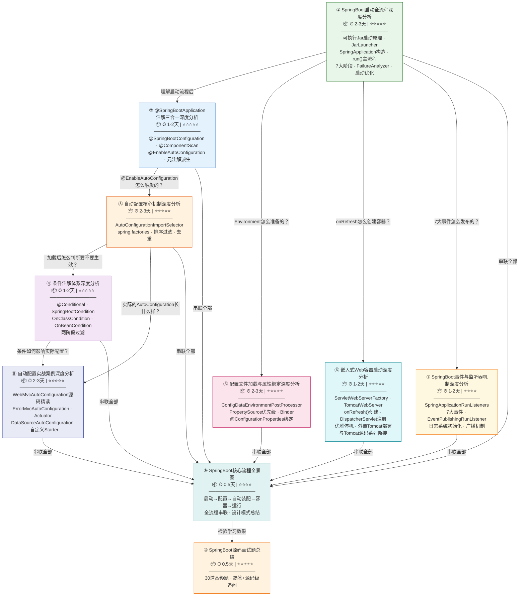
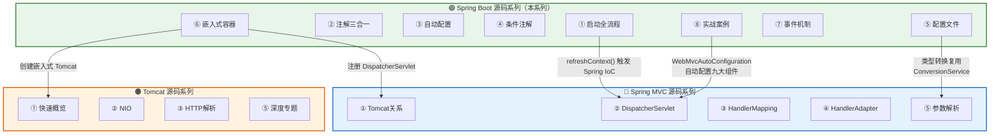

# 📚 Spring Boot 2.7.18 源码深度分析 — 阅读指南

> 📌 基于 **Spring Boot 2.7.18** 源码
> 📁 本地源码路径：`/data/workspace/spring-boot/`
> 📁 调试项目路径：`/data/workspace/spring-framework/spring-boot-debug/`
> 📖 共 **10 篇文档**，计划总计约 **15,000+ 行**
> 🏭 **覆盖生产环境核心特性**：可执行 Jar 启动、错误处理、日志系统、优雅停机、外置 Tomcat 部署、Actuator 健康检查与端点安全
> 🎯 **覆盖面试高频考点 Top 30**：Jar 启动原理、启动流程、自动配置、条件注解、配置体系、内外置 Tomcat 对比等

---

## 一、文档全景总览

本系列文档从 `java -jar` 的可执行 Jar 启动原理出发，经由 `SpringApplication.run()` 启动入口，逐层深入自动配置、条件注解、配置体系、嵌入式容器等核心机制，覆盖了 Spring Boot **"约定优于配置"** 理念的完整实现原理。同时深入**生产环境核心特性**（可执行 Jar 启动、错误处理、日志系统初始化、优雅停机、外置 Tomcat 部署、Actuator 健康检查与端点安全、@ConfigurationProperties 验证）和**面试高频考点**（Jar 启动原理、FailureAnalyzer、启动速度优化、内外置 Tomcat 对比、多 Profile 高级配置），确保既能深入源码原理，又能对接实际工作和面试场景。

> **系列定位**：本系列是 [Tomcat 源码系列](../../../../../../spring-debug/src/main/java/com/debug/mvc_demo/md/Tomcat源码/README.md)（网络层/容器层）和 [Spring MVC 源码系列](../../../../../../spring-debug/src/main/java/com/debug/mvc_demo/md/mvc源码/README.md)（Web 框架层）的上层延续，聚焦于 Spring Boot 如何将 Spring Framework + 嵌入式 Tomcat + 自动配置三者无缝整合，实现"一个 main 方法跑起来整个 Web 应用"。

### 1.1 知识地图



### 1.2 文档定位说明

| 文档 | 定位 | 适合场景 |
|------|------|---------|
| ① 启动全流程 | **入门地图** — 覆盖可执行 Jar 启动原理（`JarLauncher`）、SpringApplication 构造、run() 7 大阶段、与 Spring Framework refresh() 的衔接 | 初次学习，快速建立启动全景认知 |
| ②③④ 自动配置三部曲 | **核心机制** — 注解入口 → SPI 加载 → 条件过滤，层层递进 | 想深入理解"自动配置"的底层实现 |
| ⑤ 配置文件 | **配置体系** — 配置文件发现、解析、属性绑定完整链路 + **多 Profile 高级特性** | 想理解 application.yml 背后的故事、多环境配置管理 |
| ⑥ 嵌入式容器 | **容器整合** — Spring Boot 如何把 Tomcat 嵌进来 + **优雅停机** + **外置 Tomcat 部署** + 与 Tomcat 源码系列衔接 | 想打通从 main() 到 Tomcat 启动的完整链路，想理解 K8s 部署下的优雅停机，想了解嵌入式 vs 外置 Tomcat 的区别 |
| ⑦ 事件 + 日志 | **事件驱动 + 日志初始化** — 事件驱动机制 + 日志系统在 Spring 启动前的初始化原理 | 想理解 Spring Boot 事件驱动模型和日志初始化链路 |
| ⑧ 实战 + 生产 | **生产级实战** — AutoConfiguration 案例精读 + 错误处理 + Actuator 健康检查 | 想自定义 Starter、理解全局异常处理、健康检查 |
| ⑨⑩ 全景图 + 面试 | **总结收尾** — 全流程串联 + 40 道面试题（含 10 道生产实战题） | 学习收尾、面试准备 |

---

## 二、推荐阅读顺序

### 2.1 🏆 完整学习路径（推荐，约 15-22 天）

按以下顺序依次阅读，每篇都建立在前一篇的基础之上：

| 序号 | 文档名称 | 核心内容 | 预估时间 | 前置要求 |
|:---:|---------|---------|:-------:|---------|
| ① | **SpringBoot启动全流程深度分析** | **可执行 Jar 启动原理**（`JarLauncher` + `LaunchedURLClassLoader` + BOOT-INF 结构）、SpringApplication 构造、run() 7 大阶段、prepareContext、refreshContext、callRunners、**FailureAnalyzer 启动失败诊断**、**启动速度优化三件套** | 2-3 天 | Tomcat 系列 ① + MVC 系列 ① |
| ② | **@SpringBootApplication注解三合一深度分析** | @SpringBootConfiguration + @EnableAutoConfiguration + @ComponentScan、元注解派生机制 | 1-2 天 | ✅ 已读 ① |
| ③ | **自动配置核心机制深度分析** | AutoConfigurationImportSelector 全链路、spring.factories SPI、排序过滤去重、DeferredImportSelector | 2-3 天 | ✅ 已读 ①② |
| ④ | **条件注解体系深度分析** | @Conditional 扩展体系、SpringBootCondition、OnClassCondition、OnBeanCondition、两阶段过滤 | 1-2 天 | ✅ 已读 ③ |
| ⑤ | **配置文件加载与属性绑定深度分析** | ConfigDataEnvironmentPostProcessor、PropertySource 优先级链、Binder、@ConfigurationProperties、**多 Profile 高级特性** | 2-3 天 | ✅ 已读 ① |
| ⑥ | **嵌入式Web容器启动深度分析** | ServletWebServerFactory、TomcatWebServer、onRefresh() 创建容器、DispatcherServlet 注册、**优雅停机机制**、**外置 Tomcat 部署**（`SpringBootServletInitializer`） | 1-2 天 | ✅ 已读 ① + Tomcat 全系列 |
| ⑦ | **SpringBoot事件与监听器机制深度分析** | SpringApplicationRunListeners、7 大生命周期事件、EventPublishingRunListener、内置关键监听器、**日志系统初始化深度分析** | 1-2 天 | ✅ 已读 ① |
| ⑧ | **自动配置实战案例深度分析** | WebMvcAutoConfiguration 精读、**ErrorMvcAutoConfiguration 错误处理**、**Actuator 健康检查自动配置**、DataSourceAutoConfiguration、自定义 Starter 原理 | 2-3 天 | ✅ 已读 ③④ + MVC 全系列 |
| ⑨ | **SpringBoot核心流程全景图** | 启动→配置→自动装配→容器→运行→**错误处理→健康检查→优雅停机** 全流程串联、设计模式汇总 | 0.5 天 | ✅ 全部 |
| ⑩ | **SpringBoot源码面试题总结** | **40 道高频面试题**（含生产实战题）、简答 + 源码级追问 | 1 天 | ✅ 全部 |

### 2.2 ⚡ 快速路径：面试突击（约 4-5 天）

```
必读（第 1-2 天）：
  ① SpringBoot启动全流程  → 重点看：run() 7 大阶段 + FailureAnalyzer + 启动优化
  ③ 自动配置核心机制      → 重点看：spring.factories + AutoConfigurationImportSelector 全链路

重点读（第 3-4 天）：
  ④ 条件注解体系           → 重点看：@ConditionalOnClass / @ConditionalOnBean 源码
  ⑥ 嵌入式Web容器启动      → 重点看：onRefresh() 创建 Tomcat + 优雅停机
  ⑧ 自动配置实战           → 重点看：ErrorMvcAutoConfiguration 全局异常 + Actuator 健康检查

收尾（第 5-6 天）：
  ⑤ 配置文件加载           → 重点看：多 Profile 高级特性 + 配置优先级链
  ⑩ SpringBoot源码面试题总结 → 40题快速过一遍，查漏补缺
```

### 2.3 🎯 按兴趣点跳读

| 你想了解的问题 | 直接阅读 | 建议先看 |
|--------------|---------|---------|
| "SpringApplication.run() 到底做了什么？" | ① 启动全流程 | 可直接读 |
| "@SpringBootApplication 一个注解为什么能启动整个应用？" | ② 注解三合一 | ① |
| "自动配置是怎么把 100+ 个配置类按需加载的？" | ③ 自动配置核心机制 | ①② |
| "@ConditionalOnClass 底层怎么判断类是否存在？" | ④ 条件注解体系 | ③ |
| "application.yml 是怎么被加载和绑定到 Java 对象上的？" | ⑤ 配置文件加载 | ① |
| "多环境配置怎么管理？Profile Group 和多文档 YAML 怎么用？" | ⑤ 配置文件加载 | ① |
| "Spring Boot 怎么把 Tomcat 嵌进来的？" | ⑥ 嵌入式容器 | ① + Tomcat 系列 |
| "Spring Boot 启动过程中 7 个事件分别在什么时候发布？" | ⑦ 事件与监听器 | ① |
| "WebMvcAutoConfiguration 怎么自动配置 Spring MVC 的？" | ⑧ 自动配置实战 | ③④ + MVC 系列 |
| "怎么自定义一个 Starter？" | ⑧ 自动配置实战 | ③④ |
| "Spring Boot 的全局异常处理原理是什么？" | ⑧ 自动配置实战 | ③④ |
| "Spring Boot 的 Whitelabel 错误页怎么来的？" | ⑧ 自动配置实战 | ③④ |
| "Actuator 健康检查怎么实现的？K8s 探针怎么接入？" | ⑧ 自动配置实战 | ③④ |
| "Spring Boot 的 `java -jar` 底层是怎么启动的？BOOT-INF 结构是什么？" | ① 启动全流程 | 可直接读 |
| "Spring Boot 和外置 Tomcat 部署有什么区别？嵌入式 Tomcat 是怎么启动的？" | ⑥ 嵌入式容器 | ① + Tomcat 系列 |
| "Spring Boot 怎么优雅停机？K8s 下如何配合？" | ⑥ 嵌入式容器 | ① + Tomcat 系列 |
| "@ConfigurationProperties 怎么做参数验证？JSR-303 怎么集成？" | ⑤ 配置文件加载 | ① |
| "Actuator 端点暴露怎么配置？怎么防止敏感端点泄露？" | ⑧ 自动配置实战 | ③④ |
| "日志系统为什么在 Spring 启动之前就能工作？" | ⑦ 事件与监听器 | ① |
| "启动速度慢怎么排查和优化？" | ① 启动全流程 | 可直接读 |
| "FailureAnalyzer 是什么？启动报错为什么能给出友好提示？" | ① 启动全流程 | 可直接读 |
| "多环境配置怎么管理？Profile Group 怎么用？" | ⑤ 配置文件加载 | ① |
| "想一张图看懂 Spring Boot 完整启动流程？" | ⑨ 核心流程全景图 | 建议全读 |
| "面试要问 Spring Boot 源码怎么办？" | ⑩ 面试题总结 | 建议全读 |

---

## 三、各文档详细信息

### ① SpringBoot 启动全流程深度分析

| 属性 | 值 |
|-----|-----|
| **文件名** | `SpringBoot启动全流程深度分析.md` |
| **难度** | ⭐⭐⭐⭐⭐ |
| **预估时间** | 2-3 天 |
| **前置知识** | Tomcat 系列 ① + MVC 系列 ① |

**核心源码文件**：
| 文件 | 路径（`/data/workspace/spring-boot/` 下） |
|------|------|
| SpringApplication.java | `spring-boot-project/spring-boot/src/main/java/org/springframework/boot/SpringApplication.java` |
| SpringApplicationRunListeners.java | `spring-boot-project/spring-boot/src/main/java/org/springframework/boot/SpringApplicationRunListeners.java` |
| DefaultBootstrapContext.java | `spring-boot-project/spring-boot/src/main/java/org/springframework/boot/DefaultBootstrapContext.java` |
| JarLauncher.java | `spring-boot-project/spring-boot-tools/spring-boot-loader/src/main/java/org/springframework/boot/loader/JarLauncher.java` |
| Launcher.java | `spring-boot-project/spring-boot-tools/spring-boot-loader/src/main/java/org/springframework/boot/loader/Launcher.java` |
| LaunchedURLClassLoader.java | `spring-boot-project/spring-boot-tools/spring-boot-loader/src/main/java/org/springframework/boot/loader/LaunchedURLClassLoader.java` |
| MainMethodRunner.java | `spring-boot-project/spring-boot-tools/spring-boot-loader/src/main/java/org/springframework/boot/loader/MainMethodRunner.java` |

**章节规划**：
- 一、总体概览 — Spring Boot 启动做了什么？（一张完整时序图）
- 🆕 **二、可执行 Jar 启动原理 — `java -jar` 背后发生了什么？** 🔴🎯
  - BOOT-INF 目录结构（`BOOT-INF/classes/` + `BOOT-INF/lib/`）
  - `MANIFEST.MF` 的 `Main-Class`（`JarLauncher`）与 `Start-Class`（用户主类）的区别
  - `JarLauncher.main()` → `Launcher.launch()` — 真正的 JVM 入口
  - `LaunchedURLClassLoader` — 自定义类加载器，解决嵌套 Jar 加载问题
  - `JarFile`（Spring Boot 自定义）— 支持 Jar in Jar 的核心实现
  - `MainMethodRunner` — 反射调用 `Start-Class` 的 `main()` 方法
  - 三种 Launcher 对比：`JarLauncher` vs `WarLauncher` vs `PropertiesLauncher`
  - 面试高频："说说 `java -jar` 启动的底层原理？为什么需要 `JarLauncher`？"
- 三、SpringApplication 构造阶段
  - 推断 Web 应用类型（`WebApplicationType.deduceFromClasspath()`）
  - 从 spring.factories 加载 Initializer 和 Listener
  - 推断主类（`deduceMainApplicationClass()`）
- 四、run() 方法主流程 — 7 大阶段逐行分析
  - 阶段一：创建 BootstrapContext
  - 阶段二：获取 RunListeners 并发布 starting 事件
  - 阶段三：准备 Environment（解析命令行参数、配置文件）
  - 阶段四：打印 Banner
  - 阶段五：创建 ApplicationContext（`createApplicationContext()`）
  - 阶段六：`prepareContext()` — 将 Environment 和主类注入到上下文
  - 阶段七：`refreshContext()` — 调用 Spring 的 `refresh()` 触发 Bean 创建
  - 阶段八：`afterRefresh()` + `callRunners()` — 执行 ApplicationRunner/CommandLineRunner
- 五、异常处理与 FailureAnalyzer 启动失败诊断
  - `handleRunFailure()` 异常处理流程
  - FailureAnalyzer SPI 加载链（`spring.factories` 注册 → `FailureAnalyzers` 遍历匹配）
  - 常见内置 FailureAnalyzer（`PortInUseFailureAnalyzer`、`NoSuchBeanDefinitionFailureAnalyzer`、`DataSourceBeanCreationFailureAnalyzer` 等）
  - 自定义 FailureAnalyzer 实现方式
- 六、callRunners 执行机制与退出码
  - `ApplicationRunner` 与 `CommandLineRunner` 的执行时机和排序（`@Order`）
  - `ExitCodeGenerator` 退出码机制 — 优雅返回进程退出码
- 七、启动速度优化三件套 🏭
  - `BackgroundPreinitializer` — 后台线程预初始化（Charset、Jackson、Validation 等）
  - 懒加载（`spring.main.lazy-initialization=true`）的原理和生产权衡
  - `ApplicationStartup` + `BufferingApplicationStartup` — 启动耗时追踪与 Startup Actuator 端点
- 八、与 Spring Framework 的衔接 — `refresh()` 回到 Spring IoC 的领地
- 九、设计模式总结（观察者模式、策略模式、模板方法、SPI）
- 面试 Q&A

**核心调试断点建议**：
- `JarLauncher.main()` — JVM 真正的入口（MANIFEST.MF 中的 Main-Class）
- `Launcher.launch()` — 创建 LaunchedURLClassLoader 并反射调用 Start-Class
- `SpringApplication.run()` — 启动入口
- `SpringApplication.prepareContext()` — 上下文准备
- `SpringApplication.refreshContext()` — 触发 Bean 创建
- `SpringApplication.handleRunFailure()` — 异常处理 + FailureAnalyzer
- `SpringApplication.callRunners()` — Runner 执行和排序
- `BackgroundPreinitializer.performPreinitialization()` — 后台预初始化

**核心价值**：整套文档的**入门地图**，从 `java -jar` 的 `JarLauncher` 入口到 `run()` 方法的 7 大阶段，覆盖了启动的**完整链路**。同时覆盖**可执行 Jar 原理**（面试必问）、**启动失败诊断**和**启动速度优化**三个核心关注点。

---

### ② @SpringBootApplication 注解三合一深度分析

| 属性 | 值 |
|-----|-----|
| **文件名** | `SpringBootApplication注解三合一深度分析.md` |
| **难度** | ⭐⭐⭐⭐ |
| **预估时间** | 1-2 天 |
| **前置知识** | ✅ 已读 ① |

**核心源码文件**：
| 文件 | 路径（`/data/workspace/spring-boot/` 下） |
|------|------|
| SpringBootApplication.java | `spring-boot-project/spring-boot-autoconfigure/src/main/java/org/springframework/boot/autoconfigure/SpringBootApplication.java` |
| EnableAutoConfiguration.java | `spring-boot-project/spring-boot-autoconfigure/src/main/java/org/springframework/boot/autoconfigure/EnableAutoConfiguration.java` |
| AutoConfigurationPackages.java | `spring-boot-project/spring-boot-autoconfigure/src/main/java/org/springframework/boot/autoconfigure/AutoConfigurationPackages.java` |

**章节规划**：
- 一、总体概览 — `@SpringBootApplication` = `@SpringBootConfiguration` + `@EnableAutoConfiguration` + `@ComponentScan`
- 二、@SpringBootConfiguration — 本质是 `@Configuration`，为什么包一层？
- 三、@ComponentScan — 默认扫描主类所在包及子包（`basePackageClasses` 的推断逻辑）
- 四、@EnableAutoConfiguration 详解
  - `@AutoConfigurationPackage` → `AutoConfigurationPackages.Registrar`
  - `@Import(AutoConfigurationImportSelector.class)` → 自动配置的入口
- 五、Spring 注解的元注解派生机制（`@AliasFor`、`AnnotatedElementUtils`）
- 面试 Q&A

**核心价值**：解答 **"一个 @SpringBootApplication 注解为什么能启动整个应用"** 这个核心问题。

---

### ③ 自动配置核心机制深度分析

| 属性 | 值 |
|-----|-----|
| **文件名** | `自动配置核心机制深度分析.md` |
| **难度** | ⭐⭐⭐⭐⭐ |
| **预估时间** | 2-3 天 |
| **前置知识** | ✅ 已读 ①② |

**核心源码文件**：
| 文件 | 路径（`/data/workspace/spring-boot/` 下） |
|------|------|
| AutoConfigurationImportSelector.java | `spring-boot-project/spring-boot-autoconfigure/src/main/java/org/springframework/boot/autoconfigure/AutoConfigurationImportSelector.java` |
| AutoConfigurationSorter.java | `spring-boot-project/spring-boot-autoconfigure/src/main/java/org/springframework/boot/autoconfigure/AutoConfigurationSorter.java` |
| AutoConfigurationMetadataLoader.java | `spring-boot-project/spring-boot-autoconfigure/src/main/java/org/springframework/boot/autoconfigure/AutoConfigurationMetadataLoader.java` |
| spring.factories | `spring-boot-project/spring-boot-autoconfigure/src/main/resources/META-INF/spring.factories` |

**章节规划**：
- 一、总体概览 — 自动配置 = 发现 + 过滤 + 排序 + 注册
- 二、spring.factories SPI 机制
  - `SpringFactoriesLoader.loadFactoryNames()` 加载流程
  - 类路径扫描与缓存机制
  - 与 JDK SPI (`ServiceLoader`) 的对比
- 三、AutoConfigurationImportSelector 全链路
  - `selectImports()` → `getAutoConfigurationEntry()`
  - 去重 → 排除（`exclude/excludeName`）→ 过滤（`AutoConfigurationImportFilter`）
  - 候选类从 144 个到最终 N 个的筛选过程
- 四、排序机制
  - `@AutoConfigureOrder` / `@AutoConfigureBefore` / `@AutoConfigureAfter`
  - `AutoConfigurationSorter` 拓扑排序
- 五、AutoConfigurationMetadata 快速过滤
  - `spring-autoconfigure-metadata.properties` 预计算元数据
  - 避免加载无用类的性能优化
- 六、DeferredImportSelector 延迟导入 — 为什么自动配置要延迟到用户配置之后？
- 七、设计模式总结（SPI、策略模式、管道过滤器）
- 面试 Q&A

**核心价值**：Spring Boot **最核心的机制**——自动配置的完整实现原理，从发现到过滤到排序到注册的全链路。

---

### ④ 条件注解体系深度分析

| 属性 | 值 |
|-----|-----|
| **文件名** | `条件注解体系深度分析.md` |
| **难度** | ⭐⭐⭐⭐⭐ |
| **预估时间** | 1-2 天 |
| **前置知识** | ✅ 已读 ③ |

**核心源码文件**：
| 文件 | 路径（`/data/workspace/spring-boot/` 下） |
|------|------|
| SpringBootCondition.java | `spring-boot-project/spring-boot-autoconfigure/src/main/java/org/springframework/boot/autoconfigure/condition/SpringBootCondition.java` |
| OnClassCondition.java | `spring-boot-project/spring-boot-autoconfigure/src/main/java/org/springframework/boot/autoconfigure/condition/OnClassCondition.java` |
| OnBeanCondition.java | `spring-boot-project/spring-boot-autoconfigure/src/main/java/org/springframework/boot/autoconfigure/condition/OnBeanCondition.java` |
| OnPropertyCondition.java | `spring-boot-project/spring-boot-autoconfigure/src/main/java/org/springframework/boot/autoconfigure/condition/OnPropertyCondition.java` |
| ConditionEvaluationReport.java | `spring-boot-project/spring-boot-autoconfigure/src/main/java/org/springframework/boot/autoconfigure/condition/ConditionEvaluationReport.java` |

**章节规划**：
- 一、总体概览 — Spring `@Conditional` 是怎么扩展成 `@ConditionalOnXxx` 家族的？
- 二、基础架构
  - `Condition` 接口 → `SpringBootCondition` 模板类
  - `ConditionOutcome` 和 `ConditionMessage`
  - `ConditionContext` 提供的信息（BeanFactory、ClassLoader、Environment、Registry）
- 三、@ConditionalOnClass / @ConditionalOnMissingClass
  - `OnClassCondition` 源码精读
  - 两阶段过滤：`AutoConfigurationImportFilter` 阶段（快速）+ `Condition` 阶段（精确）
- 四、@ConditionalOnBean / @ConditionalOnMissingBean
  - `OnBeanCondition` 源码精读
  - `SearchStrategy` 三种搜索策略（CURRENT / ANCESTORS / ALL）
- 五、@ConditionalOnProperty
  - `OnPropertyCondition` 源码精读
  - `havingValue` / `matchIfMissing` 的判断逻辑
- 六、@ConditionalOnWebApplication — Servlet vs Reactive 判断
- 七、ConditionEvaluationReport — 条件评估日志（`--debug` 输出的就是它）
- 面试 Q&A

**核心价值**：理解 Spring Boot **"按需加载"** 的核心武器，条件注解是自动配置能够精准生效的关键。

---

### ⑤ 配置文件加载与属性绑定深度分析

| 属性 | 值 |
|-----|-----|
| **文件名** | `配置文件加载与属性绑定深度分析.md` |
| **难度** | ⭐⭐⭐⭐⭐ |
| **预估时间** | 2-3 天 |
| **前置知识** | ✅ 已读 ① |

**核心源码文件**：
| 文件 | 路径（`/data/workspace/spring-boot/` 下） |
|------|------|
| ConfigDataEnvironmentPostProcessor.java | `spring-boot-project/spring-boot/src/main/java/org/springframework/boot/context/config/ConfigDataEnvironmentPostProcessor.java` |
| ConfigDataEnvironment.java | `spring-boot-project/spring-boot/src/main/java/org/springframework/boot/context/config/ConfigDataEnvironment.java` |
| ConfigurationPropertiesBindingPostProcessor.java | `spring-boot-project/spring-boot/src/main/java/org/springframework/boot/context/properties/ConfigurationPropertiesBindingPostProcessor.java` |
| Binder.java | `spring-boot-project/spring-boot/src/main/java/org/springframework/boot/context/properties/bind/Binder.java` |

**章节规划**：
- 一、总体概览 — `application.yml` 是怎么被加载到 Environment 中的？
- 二、Environment 体系回顾 — `PropertySource` 优先级链（13+ 层级）
- 三、ConfigDataEnvironmentPostProcessor — 2.4+ 新配置加载体系
  - `ConfigDataLocationResolver` — 定位配置文件
  - `ConfigDataLoader` — 加载 .properties / .yml
  - Profile 激活机制
- 四、多 Profile 高级特性 🏭
  - Profile Group（`spring.profiles.group.production=proddb,prodmq`）— 一个 Profile 激活多个子 Profile
  - Profile 表达式（`spring.config.activate.on-profile`）— 2.4+ 新语法 vs 旧 `spring.profiles` 语法
  - 多文档 YAML（`---` 分隔符）— 单文件多环境配置
  - 配置文件搜索路径自定义（`spring.config.location` / `spring.config.additional-location`）
  - 生产实践：配置中心（Nacos/Apollo）与 Spring Boot 配置体系的集成原理
- 五、PropertySourceLoader — 解析 `.properties`（`PropertiesPropertySourceLoader`）和 `.yml`（`YamlPropertySourceLoader`）
- 六、@ConfigurationProperties 绑定机制
  - `ConfigurationPropertiesBindingPostProcessor` 入口
  - `Binder` 核心绑定流程
  - 宽松绑定（relaxed binding）规则
  - 类型转换集成（与 Spring MVC 的 `ConversionService` 衔接）
- 七、🆕 **@ConfigurationProperties 的 JSR-303 验证** 🏭
  - `@Validated` 注解启用验证
  - `ConfigurationPropertiesJsr303Validator` — 验证执行器
  - Bean Validation 注解（`@NotNull`、`@Min`、`@Max`、`@Pattern`）在配置类上的使用
  - 嵌套对象验证（`@Valid`）
  - 启动时配置验证失败的错误提示（结合 FailureAnalyzer）
  - 生产实践：通过验证机制防止错误配置进入生产环境
- 八、🆕 `spring.config.import` 配置导入机制（2.4+）
  - `ConfigDataLocationResolver` + `ConfigDataLoader` 扩展点
  - 标准用法：`spring.config.import=optional:classpath:/extra.yml`
  - 配置中心集成原理：Nacos / Apollo / Consul 通过此机制实现配置导入
- 九、@Value vs @ConfigurationProperties 对比
- 十、配置优先级完整链 — 命令行 > 环境变量 > application-{profile}.yml > application.yml > 默认值
- 面试 Q&A

**核心价值**：理解 Spring Boot **配置体系的完整实现**，从文件定位到解析到绑定的全链路。

---

### ⑥ 嵌入式 Web 容器启动深度分析

| 属性 | 值 |
|-----|-----|
| **文件名** | `嵌入式Web容器启动深度分析.md` |
| **难度** | ⭐⭐⭐⭐⭐ |
| **预估时间** | 1-2 天 |
| **前置知识** | ✅ 已读 ① + Tomcat 全系列 |

**核心源码文件**：
| 文件 | 路径（`/data/workspace/spring-boot/` 下） |
|------|------|
| ServletWebServerApplicationContext.java | `spring-boot-project/spring-boot/src/main/java/org/springframework/boot/web/servlet/context/ServletWebServerApplicationContext.java` |
| TomcatServletWebServerFactory.java | `spring-boot-project/spring-boot/src/main/java/org/springframework/boot/web/embedded/tomcat/TomcatServletWebServerFactory.java` |
| TomcatWebServer.java | `spring-boot-project/spring-boot/src/main/java/org/springframework/boot/web/embedded/tomcat/TomcatWebServer.java` |
| GracefulShutdown.java (Tomcat) | `spring-boot-project/spring-boot/src/main/java/org/springframework/boot/web/embedded/tomcat/GracefulShutdown.java` |
| SpringBootServletInitializer.java | `spring-boot-project/spring-boot/src/main/java/org/springframework/boot/web/servlet/support/SpringBootServletInitializer.java` |
| WebServerGracefulShutdownLifecycle.java | `spring-boot-project/spring-boot/src/main/java/org/springframework/boot/web/server/WebServerGracefulShutdownLifecycle.java` |
| SpringApplicationShutdownHook.java | `spring-boot-project/spring-boot/src/main/java/org/springframework/boot/SpringApplicationShutdownHook.java` |
| ServletWebServerFactoryAutoConfiguration.java | `spring-boot-project/spring-boot-autoconfigure/src/main/java/org/springframework/boot/autoconfigure/web/servlet/ServletWebServerFactoryAutoConfiguration.java` |

**章节规划**：
- 一、总体概览 — 从外置 Tomcat 到嵌入式 Tomcat，Spring Boot 做了什么？
- 二、Web 容器自动配置
  - `ServletWebServerFactoryAutoConfiguration` — 怎么选择 Tomcat/Jetty/Undertow？
  - `TomcatServletWebServerFactory` — 创建和配置 Tomcat
- 三、`onRefresh()` 创建容器
  - `ServletWebServerApplicationContext.onRefresh()` → `createWebServer()`
  - `TomcatWebServer` 的构造（对照 Tomcat 源码系列：Connector、Engine、Host、Context）
- 四、DispatcherServlet 注册
  - `DispatcherServletAutoConfiguration` — 创建 DispatcherServlet Bean
  - `DispatcherServletRegistrationBean` — 注册到嵌入式 Tomcat
  - 与 MVC 源码系列衔接：外置 Tomcat 中是 `web.xml` / `ServletContainerInitializer`，嵌入式中是 `ServletRegistrationBean`
- 五、Filter/Listener 注册机制 — `FilterRegistrationBean`、`ServletListenerRegistrationBean`
- 六、容器定制 — `WebServerFactoryCustomizer` / `server.port` 等属性怎么生效
- 七、优雅停机机制（Graceful Shutdown）🏭
  - `server.shutdown=graceful` 配置开启
  - `GracefulShutdown` 接口与 Tomcat/Jetty/Undertow/Netty 四种实现
  - `WebServerGracefulShutdownLifecycle` — 注册到 Spring 生命周期
  - `SpringApplicationShutdownHook` — JVM ShutdownHook 注册机制
  - 优雅停机的超时控制（`spring.lifecycle.timeout-per-shutdown-phase`）
  - 生产实践：K8s `preStop` + `terminationGracePeriodSeconds` + Spring Boot 优雅停机配合方案
  - 面试高频："你们是怎么做优雅停机的？" 完整回答模板
- 🆕 **八、外置 Tomcat 部署（War 包部署）** 🔴🎯
  - `SpringBootServletInitializer` 的启动链路：`onStartup()` → `createRootApplicationContext()` → `SpringApplicationBuilder`
  - 内嵌式 vs 外置 Tomcat 启动流程对比图
  - 为什么外置 Tomcat 不需要嵌入式容器自动配置？（`WebApplicationType.NONE` vs `SERVLET`）
  - War 包打包配置（`<packaging>war</packaging>` + `spring-boot-starter-tomcat` scope `provided`）
  - `TomcatStarter`（`ServletContainerInitializer` 实现）— 桥接 Servlet 规范和 Spring Boot 的 `ServletContextInitializer`
  - 面试高频："嵌入式和外置 Tomcat 部署的区别？启动链路有什么不同？"
- 九、与 Tomcat 源码系列的完整衔接图（从 Spring Boot main → Tomcat → Spring MVC 的完整链路）
- 面试 Q&A

**核心价值**：打通 **Spring Boot → 嵌入式 Tomcat → Spring MVC** 的完整链路，与 Tomcat 源码系列和 MVC 源码系列形成**三位一体**。同时覆盖**优雅停机**和**外置 Tomcat 部署**两个生产环境和面试必备知识。

---

### ⑦ SpringBoot 事件与监听器机制深度分析

| 属性 | 值 |
|-----|-----|
| **文件名** | `SpringBoot事件与监听器机制深度分析.md` |
| **难度** | ⭐⭐⭐⭐ |
| **预估时间** | 1-2 天 |
| **前置知识** | ✅ 已读 ① |

**核心源码文件**：
| 文件 | 路径（`/data/workspace/spring-boot/` 下） |
|------|------|
| SpringApplicationRunListeners.java | `spring-boot-project/spring-boot/src/main/java/org/springframework/boot/SpringApplicationRunListeners.java` |
| EventPublishingRunListener.java | `spring-boot-project/spring-boot/src/main/java/org/springframework/boot/context/event/EventPublishingRunListener.java` |
| SpringApplicationEvent.java | `spring-boot-project/spring-boot/src/main/java/org/springframework/boot/context/event/SpringApplicationEvent.java` |
| LoggingApplicationListener.java | `spring-boot-project/spring-boot/src/main/java/org/springframework/boot/context/logging/LoggingApplicationListener.java` |
| LoggingSystem.java | `spring-boot-project/spring-boot/src/main/java/org/springframework/boot/logging/LoggingSystem.java` |
| LogbackLoggingSystem.java | `spring-boot-project/spring-boot/src/main/java/org/springframework/boot/logging/logback/LogbackLoggingSystem.java` |

**章节规划**：
- 一、总体概览 — Spring Boot 的 7 大生命周期事件
- 二、事件体系架构
  - `SpringApplicationRunListener` 接口（7 个回调方法）
  - `EventPublishingRunListener` — 唯一实现类
  - `SimpleApplicationEventMulticaster` — 广播器
- 三、7 大事件详解（时序图 + 每个事件的触发时机和对应的内置监听器）
  - `ApplicationStartingEvent` → `ApplicationEnvironmentPreparedEvent` → `ApplicationContextInitializedEvent` → `ApplicationPreparedEvent` → `ApplicationStartedEvent` → `ApplicationReadyEvent` → `ApplicationFailedEvent`
- 四、内置关键监听器
  - `ConfigDataEnvironmentPostProcessor` — 加载配置文件
  - `LoggingApplicationListener` — 初始化日志系统（简述）
  - `ConditionEvaluationReportLoggingListener` — 条件评估报告
- 五、日志系统初始化深度分析 🏭
  - 核心问题：**日志为什么在 Spring 容器启动之前就能工作？**
  - `LoggingSystem` 抽象层 — 统一 Logback/Log4j2/JUL 的门面
  - `LoggingApplicationListener` 完整生命周期
    - `ApplicationStartingEvent` → `LoggingSystem.beforeInitialize()` — 极早期初始化
    - `ApplicationEnvironmentPreparedEvent` → `LoggingSystem.initialize()` — 根据配置初始化
    - `ApplicationPreparedEvent` → 注册 `LoggingSystem` Bean
    - `ContextClosedEvent` → `LoggingSystem.cleanUp()` — 清理
  - `LogbackLoggingSystem` 源码精读 — Logback 初始化链路
    - `logback-spring.xml` vs `logback.xml` 的加载优先级和区别
    - `<springProfile>` 标签实现原理 — 如何根据 Profile 动态切换日志配置
    - `<springProperty>` 标签 — 在 Logback 配置中引用 Spring Environment 属性
  - 生产实践：日志级别动态调整（Actuator `/loggers` 端点原理）
  - 面试高频："Spring Boot 的日志初始化为什么能在 Spring 之前完成？"
- 六、自定义监听器的注册方式（`spring.factories` / `@EventListener` / `SpringApplication.addListeners()`）
- 面试 Q&A

**核心价值**：理解 Spring Boot **事件驱动的启动模型**，配置文件加载、日志初始化等都由事件监听器驱动。日志系统初始化章节是**生产环境最基础的必备知识**，也是面试高频考点。

---

### ⑧ 自动配置实战案例深度分析

| 属性 | 值 |
|-----|-----|
| **文件名** | `自动配置实战案例深度分析.md` |
| **难度** | ⭐⭐⭐⭐⭐ |
| **预估时间** | 2-3 天 |
| **前置知识** | ✅ 已读 ③④ + MVC 全系列 |

**核心源码文件**：
| 文件 | 路径（`/data/workspace/spring-boot/` 下） |
|------|------|
| WebMvcAutoConfiguration.java | `spring-boot-project/spring-boot-autoconfigure/src/main/java/org/springframework/boot/autoconfigure/web/servlet/WebMvcAutoConfiguration.java` |
| ErrorMvcAutoConfiguration.java | `spring-boot-project/spring-boot-autoconfigure/src/main/java/org/springframework/boot/autoconfigure/web/servlet/error/ErrorMvcAutoConfiguration.java` |
| BasicErrorController.java | `spring-boot-project/spring-boot-autoconfigure/src/main/java/org/springframework/boot/autoconfigure/web/servlet/error/BasicErrorController.java` |
| ErrorProperties.java | `spring-boot-project/spring-boot-autoconfigure/src/main/java/org/springframework/boot/autoconfigure/web/ServerProperties.java` |
| HealthEndpointAutoConfiguration.java | `spring-boot-project/spring-boot-actuator-autoconfigure/src/main/java/org/springframework/boot/actuate/autoconfigure/health/HealthEndpointAutoConfiguration.java` |
| HealthIndicator.java | `spring-boot-project/spring-boot-actuator/src/main/java/org/springframework/boot/actuate/health/HealthIndicator.java` |
| DataSourceAutoConfiguration.java | `spring-boot-project/spring-boot-autoconfigure/src/main/java/org/springframework/boot/autoconfigure/jdbc/DataSourceAutoConfiguration.java` |
| DispatcherServletAutoConfiguration.java | `spring-boot-project/spring-boot-autoconfigure/src/main/java/org/springframework/boot/autoconfigure/web/servlet/DispatcherServletAutoConfiguration.java` |

**章节规划**：
- 一、WebMvcAutoConfiguration 源码精读
  - 条件注解组合（`@ConditionalOnClass(Servlet.class, DispatcherServlet.class)`）
  - 静态内部类分层设计
  - `WebMvcConfigurer` 自动注册（视图解析器、消息转换器、格式化器）
  - 与 MVC 源码系列的对照：DispatcherServlet 九大组件的自动配置来源
- 二、ErrorMvcAutoConfiguration 错误处理自动配置 🏭🎯
  - `BasicErrorController` — 默认错误处理控制器（处理 `/error` 请求）
  - `DefaultErrorAttributes` — 错误属性收集（timestamp、status、error、message、trace、path）
  - `ErrorPageCustomizer` — 错误页注册（将 `/error` 注册到嵌入式容器）
  - `DefaultErrorViewResolver` — 错误视图解析（4xx.html / 5xx.html 静态页 + 模板页）
  - Whitelabel 错误页 — `WhitelabelErrorViewConfiguration` 的生效条件和关闭方式
  - `@ControllerAdvice` + `@ExceptionHandler` 与 `BasicErrorController` 的关系和优先级
  - 生产实践：全局异常处理最佳实践（统一响应格式 + 异常分类 + 日志记录）
  - 面试高频："Spring Boot 的全局异常处理原理" 完整回答模板
- 三、Actuator 健康检查自动配置 🏭🎯
  - `HealthEndpointAutoConfiguration` — 健康端点自动配置
  - `HealthIndicator` 体系 — `DiskSpaceHealthIndicator`、`DataSourceHealthIndicator`、`RedisHealthIndicator` 等内置实现
  - `HealthEndpoint` — `/actuator/health` 端点的请求处理
  - `CompositeHealthContributor` — 健康指标聚合与状态计算（UP/DOWN/OUT_OF_SERVICE/UNKNOWN）
  - K8s Probes 自动配置 — `LivenessStateHealthIndicator` / `ReadinessStateHealthIndicator`
  - 自定义 HealthIndicator 实现方式
  - 生产实践：K8s `livenessProbe` + `readinessProbe` + Actuator 健康检查的配合方案
- 🆕 **Actuator 端点暴露与安全配置** 🏭
  - `management.endpoints.web.exposure.include/exclude` — 端点暴露控制
  - `EndpointRequest` — Spring Security 集成，保护 Actuator 端点
  - 生产实践：暴露 health + info + prometheus，保护其余端点（敏感信息如 env、configprops）
  - 面试加分："你生产环境怎么配置 Actuator 端点暴露？"
- 四、DataSourceAutoConfiguration 源码精读
  - 数据源自动选择（HikariCP > Tomcat-JDBC > DBCP2）
  - `@ConfigurationProperties` 绑定 `spring.datasource.*`
- 五、Starter 机制解析
  - `spring-boot-starter-web` 的 pom.xml 分析 — 只有依赖没有代码
  - Starter = 依赖聚合 + AutoConfiguration + `spring.factories`
  - 自定义 Starter 的标准实现流程
- 面试 Q&A

**核心价值**：将前面学到的自动配置理论**落地到实际案例**，不仅理解 Spring Boot 如何自动配置 Spring MVC 和数据源，更覆盖**全局异常处理**和 **Actuator 健康检查**两个生产环境 100% 会用到的核心特性。

---

### ⑨ SpringBoot 核心流程全景图

| 属性 | 值 |
|-----|-----|
| **文件名** | `SpringBoot核心流程全景图.md` |
| **难度** | ⭐⭐⭐⭐ |
| **预估时间** | 0.5 天 |
| **前置知识** | ✅ 全部 ①-⑧ |

**章节规划**：
- 一、启动全流程串联图 — 从 `main()` → `run()` → `refresh()` → 嵌入式 Tomcat → 请求处理的完整链路
- 二、自动配置流程串联图 — 发现 → 过滤 → 排序 → 条件评估 → 注册
- 三、配置加载流程串联图 — 文件定位 → 解析 → PropertySource → 绑定
- 四、错误处理流程串联图 — 异常抛出 → `@ExceptionHandler` → `BasicErrorController` → 错误视图 → 响应
- 五、生产运维流程串联图 — 启动 → 健康检查 → 运行 → 优雅停机 → 退出码
- 六、与 Tomcat / Spring MVC 的三位一体关系图
- 七、设计模式汇总（SPI、观察者、策略、模板方法、工厂方法、建造者）

**核心价值**：一张图串联全部 8 篇文档，形成**完整的知识网络**。

---

### ⑩ SpringBoot 源码面试题总结

| 属性 | 值 |
|-----|-----|
| **文件名** | `SpringBoot源码面试题总结.md` |
| **难度** | ⭐⭐⭐（复习向） |
| **预估时间** | 0.5 天 |
| **前置知识** | 建议先读完 ①-⑧（用于查漏补缺），也可直接阅读（用于快速了解面试范围） |

**内容规划**：40 道高频面试题，按主题分类：
- 启动流程（6 题）
- 自动配置（8 题）
- 条件注解（4 题）
- 配置体系（4 题）
- 嵌入式容器（4 题）
- 事件机制（2 题）
- **🏭 生产实战专题（10 题）** ← 新增
  - "Spring Boot 的 `java -jar` 底层启动原理？`JarLauncher` / `LaunchedURLClassLoader` / BOOT-INF 结构？"
  - "嵌入式 Tomcat 和外置 Tomcat 部署的区别？`SpringBootServletInitializer` 的启动链路？"
  - "Spring Boot 的全局异常处理原理是什么？`@ControllerAdvice` 和 `BasicErrorController` 什么关系？"
  - "Spring Boot 怎么优雅停机？K8s 环境下怎么配合？"
  - "Actuator 的 `/health` 端点是怎么实现的？怎么自定义健康检查？"
  - "日志系统为什么在 Spring 启动之前就能工作？`LoggingSystem` 是怎么初始化的？"
  - "Spring Boot 启动慢怎么排查？有哪些优化手段？"
  - "FailureAnalyzer 是什么？端口冲突时的友好报错怎么来的？"
  - "多环境配置怎么管理？Profile Group 怎么用？"
  - "@ConfigurationProperties 怎么做参数验证？JSR-303 怎么集成？"
  - "Actuator 端点暴露怎么配置？怎么防止敏感端点泄露？"
  - "怎么自定义一个 Starter？标准结构是什么？"
  - "Spring Boot 和外置 Tomcat 部署有什么区别？嵌入式 Tomcat 是怎么启动的？"
- 综合设计（2 题）

每题包含 **简答（30秒版）** + **源码级追问** + **生产经验加分项**。

**核心价值**：全系列的串联和收尾，面试前最后过一遍的利器。**生产实战专题**确保不仅能答源码原理，还能结合实际工作场景回答。

---

## 四、三大系列关系总览



**完整请求链路**：
```
用户请求
  → Spring Boot 启动的嵌入式 Tomcat 接收（Tomcat 系列 ②③）
    → Tomcat Pipeline/Valve 路由（Tomcat 系列 ⑤）
      → DispatcherServlet.doDispatch()（MVC 系列 ②）
        → HandlerMapping 匹配（MVC 系列 ③）
          → HandlerAdapter 执行（MVC 系列 ④）
            → Controller 业务逻辑
          → 返回值处理（MVC 系列 ⑤）
        → 响应返回
```

---

## 五、关键调试路径速查

| 主题 | 源码路径（在 `/data/workspace/spring-boot/` 下） |
|------|------|
| **可执行 Jar 启动** | `spring-boot-project/spring-boot-tools/spring-boot-loader/src/.../boot/loader/` |
| **启动主流程** | `spring-boot-project/spring-boot/src/.../boot/SpringApplication.java` |
| **自动配置选择器** | `spring-boot-project/spring-boot-autoconfigure/src/.../autoconfigure/AutoConfigurationImportSelector.java` |
| **条件注解实现** | `spring-boot-project/spring-boot-autoconfigure/src/.../autoconfigure/condition/` |
| **配置文件加载** | `spring-boot-project/spring-boot/src/.../boot/context/config/` |
| **属性绑定** | `spring-boot-project/spring-boot/src/.../boot/context/properties/bind/Binder.java` |
| **嵌入式 Tomcat** | `spring-boot-project/spring-boot/src/.../boot/web/embedded/tomcat/` |
| **事件机制** | `spring-boot-project/spring-boot/src/.../boot/context/event/` |
| **日志系统** | `spring-boot-project/spring-boot/src/.../boot/logging/` |
| **错误处理** | `spring-boot-project/spring-boot-autoconfigure/src/.../autoconfigure/web/servlet/error/` |
| **优雅停机** | `spring-boot-project/spring-boot/src/.../boot/web/embedded/tomcat/GracefulShutdown.java` |
| **外置 Tomcat 部署** | `spring-boot-project/spring-boot/src/.../boot/web/servlet/support/SpringBootServletInitializer.java` |
| **Actuator 健康检查** | `spring-boot-project/spring-boot-actuator/src/.../actuate/health/` |
| **启动失败诊断** | `spring-boot-project/spring-boot/src/.../boot/diagnostics/` |
| **spring.factories（boot）** | `spring-boot-project/spring-boot/src/main/resources/META-INF/spring.factories` |
| **spring.factories（autoconfigure）** | `spring-boot-project/spring-boot-autoconfigure/src/main/resources/META-INF/spring.factories` |

---

## 六、学习建议

### 💡 1. 先看启动流程，再入细节

先通过 ① 启动全流程建立 Spring Boot 启动的全局认知，再选择感兴趣的子系统深入阅读。`SpringApplication.run()` 是一切的起点。

### 💡 2. 边读边调试

调试项目已准备好：
```
/data/workspace/spring-framework/spring-boot-debug/
```
在 `BootDebugApplication.main()` 打断点，跟着文中标注的源码路径一步步跟下去，比纯看文档理解深 10 倍。

### 💡 3. 结合 Tomcat + MVC 系列交叉阅读

Spring Boot 不是孤立存在的，它站在 Tomcat 和 Spring MVC 的肩膀上：
- 读 ⑥ 嵌入式容器时 → 对照 Tomcat 系列 ① 的启动流程
- 读 ⑧ WebMvcAutoConfiguration 时 → 对照 MVC 系列 ② 的九大组件初始化
- 读 ⑤ @ConfigurationProperties 时 → 对照 MVC 系列 ⑥ 的 ConversionService

### 💡 4. 关注"为什么"，而不只是"是什么"

Spring Boot 的每个设计决策都有原因：
- 为什么自动配置用 `DeferredImportSelector` 延迟导入？（保证用户配置优先）
- 为什么条件注解分两阶段过滤？（性能优化，避免加载无用类）
- 为什么 `spring-autoconfigure-metadata.properties` 要预计算？（启动速度优化）

### 💡 5. 善用 `--debug` 启动参数

在 `application.properties` 中加上 `debug=true`，启动时会打印完整的条件评估报告（ConditionEvaluationReport），可以看到每个自动配置类为什么生效或不生效，是学习条件注解的最佳工具。

---

## 七、前置学习

完成以下前置学习后，再开始本系列效果最佳：

### 7.1 Tomcat 源码系列（网络层 + 容器层）

👉 **[Tomcat 8.5 源码深度分析 — 阅读指南](../../../../../../spring-debug/src/main/java/com/debug/mvc_demo/md/Tomcat源码/README.md)**

**最少必要知识**：
| 知识点 | 对应 Tomcat 文档 | 与本系列关联 |
|--------|-----------------|-------------|
| NIO 三线程模型 | Tomcat ② NIO深度剖析 | 理解嵌入式 Tomcat 的网络层 |
| Lifecycle 生命周期 | Tomcat ⑥ Lifecycle | 理解 Tomcat 组件的启动 |

### 7.2 Spring MVC 源码系列（Web 框架层）

👉 **[Spring MVC 源码深度分析 — 阅读指南](../../../../../../spring-debug/src/main/java/com/debug/mvc_demo/md/mvc源码/README.md)**

**最少必要知识**：
| 知识点 | 对应 MVC 文档 | 与本系列关联 |
|--------|--------------|-------------|
| Servlet 继承链 | MVC ① Tomcat关系 | 理解 DispatcherServlet 在嵌入式容器中的注册 |
| 九大组件初始化 | MVC ② DispatcherServlet | 理解 WebMvcAutoConfiguration 自动配置了什么 |

---

**推荐完整学习路径**：
```
Tomcat 系列 ①②（网络层基础）
    ↓
MVC 系列 ①②（框架层基础）
    ↓
Spring Boot 系列 ①（启动全流程 — 串联一切的入口）
    ↓
Spring Boot 系列 ②③④（自动配置三部曲 — 核心机制）
    ↓
Spring Boot 系列 ⑤⑥⑦⑧（配置 + 容器 + 事件 + 实战）
    ↓
Spring Boot 系列 ⑨⑩（总结 + 面试）
```
