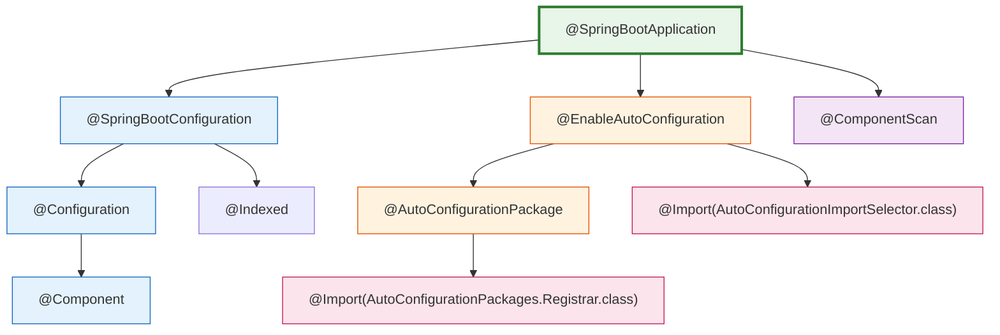
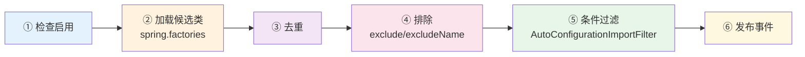
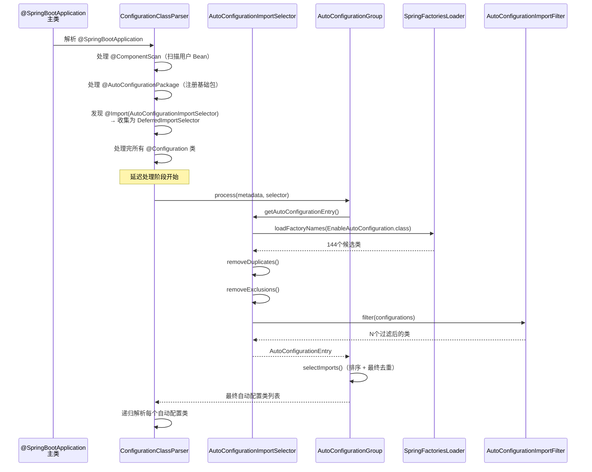

# @SpringBootApplication 注解三合一深度分析

> 📌 基于 **Spring Boot 2.7.18** 源码
> 📁 Spring Boot 源码路径：`/data/workspace/spring-boot/`
> 📁 Spring Framework 源码路径：`/data/workspace/spring-framework/`
> 📖 本文是 Spring Boot 源码系列**第 ② 篇**
> 🔗 前置阅读：[① SpringBoot 启动全流程深度分析](SpringBoot启动全流程深度分析.md)

---

## 一、总体概览 — 一个注解为什么能启动整个应用？

### 1.1 核心问题

每个 Spring Boot 应用都从一个 `main()` 方法开始：

```java
@SpringBootApplication
public class MyApplication {
    public static void main(String[] args) {
        SpringApplication.run(MyApplication.class, args);
    }
}
```

**核心疑问**：`@SpringBootApplication` 一个注解，为什么就能启动整个 Spring Boot 应用？它到底做了什么？

### 1.2 答案：三合一

`@SpringBootApplication` 本质上是三个注解的**组合注解（Composed Annotation）**：

```
@SpringBootApplication
├── @SpringBootConfiguration   ← 标记为配置类（等价于 @Configuration）
├── @EnableAutoConfiguration   ← 开启自动配置（导入 AutoConfigurationImportSelector）
└── @ComponentScan             ← 包扫描（扫描主类所在包及子包）
```

### 1.3 源码一目了然

```java
// 源码位置：spring-boot-autoconfigure/.../SpringBootApplication.java

@Target(ElementType.TYPE)
@Retention(RetentionPolicy.RUNTIME)
@Documented
@Inherited
@SpringBootConfiguration               // ← ① 配置类
@EnableAutoConfiguration                // ← ② 自动配置
@ComponentScan(excludeFilters = {       // ← ③ 包扫描
    @Filter(type = FilterType.CUSTOM, classes = TypeExcludeFilter.class),
    @Filter(type = FilterType.CUSTOM, classes = AutoConfigurationExcludeFilter.class)
})
public @interface SpringBootApplication {
    // ... 属性定义
}
```

### 1.4 注解层次关系图



### 1.5 本文结构预览

| 章节 | 核心内容 |
|------|---------|
| 二 | `@SpringBootConfiguration` — 本质是 `@Configuration`，为什么要多包一层？ |
| 三 | `@ComponentScan` — 默认扫描范围 + 两个 excludeFilter 的作用 |
| 四 | `@EnableAutoConfiguration` — 自动配置的入口 |
| 五 | Spring 元注解派生机制 — `@AliasFor` 和 `MergedAnnotations` |
| 六 | 面试 Q&A |

---

## 二、@SpringBootConfiguration — 为什么要多包一层？

### 2.1 源码精读

```java
// 源码位置：spring-boot/.../SpringBootConfiguration.java

@Target(ElementType.TYPE)
@Retention(RetentionPolicy.RUNTIME)
@Documented
@Configuration    // ← 本质就是 @Configuration
@Indexed          // ← 启用组件索引
public @interface SpringBootConfiguration {

    @AliasFor(annotation = Configuration.class)
    boolean proxyBeanMethods() default true;  // ← 透传 @Configuration 的属性
}
```

**关键发现**：`@SpringBootConfiguration` 本身没有任何逻辑，只是 `@Configuration` + `@Indexed` 的组合。

### 2.2 为什么不直接用 @Configuration？

这个设计决策有三层考量：

#### ① 语义区分 — 标记 Spring Boot 应用的主配置类

`@Configuration` 可以出现在任何配置类上，而 `@SpringBootConfiguration` 表明这是一个 **Spring Boot 应用的主配置类**。

> 官方 Javadoc 明确指出：*"Application should only ever include **one** `@SpringBootConfiguration`"*

这意味着一个应用只应该有一个 `@SpringBootConfiguration`，而 `@Configuration` 可以有多个。

#### ② 测试支持 — `@SpringBootTest` 自动查找配置

`@SpringBootTest` 注解在没有指定 `classes` 属性时，会**向上搜索**带有 `@SpringBootConfiguration` 的类作为测试的配置类：

```java
// 简化的搜索逻辑（SpringBootTestContextBootstrapper 中）
// 从测试类所在包开始，向上查找带 @SpringBootConfiguration 的类
AnnotatedClassFinder finder = new AnnotatedClassFinder(SpringBootConfiguration.class);
Class<?> found = finder.findFromClass(testClass);
```

如果直接用 `@Configuration`，Spring Boot 的测试框架就**无法区分**哪个是主配置类、哪个是普通配置类。

#### ③ @Indexed — 组件索引加速

`@SpringBootConfiguration` 额外标注了 `@Indexed`，这是 Spring 5.0 引入的**组件索引（Component Index）**机制：

```java
@Indexed
public @interface SpringBootConfiguration { ... }
```

**`@Indexed` 的作用**：
- 在**编译时**生成 `META-INF/spring.components` 文件
- 文件中记录所有标注了 `@Indexed`（或其派生注解）的组件类名
- 运行时通过 `CandidateComponentsIndex` 读取索引，**跳过类路径扫描**
- 对大型应用可以显著提升启动速度

```properties
# META-INF/spring.components 示例
com.example.MyApplication=org.springframework.stereotype.Component
com.example.MyService=org.springframework.stereotype.Component
```

> **注意**：`@Indexed` 需要 `spring-context-indexer` 依赖才会在编译时生成索引文件，否则只是个标记。

### 2.3 proxyBeanMethods 属性

`@SpringBootConfiguration` 有一个重要属性 `proxyBeanMethods`，通过 `@AliasFor` 透传给 `@Configuration`：

```java
@AliasFor(annotation = Configuration.class)
boolean proxyBeanMethods() default true;
```

**`proxyBeanMethods = true`（默认）— Full 模式**：
- Spring 会为配置类**创建 CGLIB 代理子类**
- `@Bean` 方法之间的**交叉调用**会走代理，返回**同一个单例**
- 保证 Bean 生命周期语义正确

```java
@Configuration
public class AppConfig {
    @Bean
    public DataSource dataSource() {
        return new HikariDataSource();
    }
    
    @Bean
    public JdbcTemplate jdbcTemplate() {
        // Full 模式：这里调用 dataSource() 不会创建新实例
        // 而是通过 CGLIB 代理返回容器中的同一个 DataSource 单例
        return new JdbcTemplate(dataSource());
    }
}
```

**`proxyBeanMethods = false` — Lite 模式**：
- **不创建** CGLIB 代理
- `@Bean` 方法之间的调用就是**普通 Java 方法调用**，每次都创建新实例
- 适用于不需要 Bean 交叉引用的场景，**启动更快**

```java
@Configuration(proxyBeanMethods = false)  // Lite 模式
public class LiteConfig {
    @Bean
    public ServiceA serviceA() {
        return new ServiceA();
    }
    
    @Bean
    public ServiceB serviceB() {
        // Lite 模式：这里调用 serviceA() 会创建一个新的 ServiceA 实例！
        // 不是容器中的单例！
        return new ServiceB(serviceA());
    }
}
```

> **Spring Boot 2.2+** 的自动配置类大量使用 `proxyBeanMethods = false` 来优化启动速度。

### 2.4 @Configuration 的继承链

`@Configuration` 本身也是一个组合注解：

```java
@Target(ElementType.TYPE)
@Retention(RetentionPolicy.RUNTIME)
@Documented
@Component    // ← @Configuration 本质上就是一个 @Component！
public @interface Configuration {
    boolean proxyBeanMethods() default true;
}
```

**关键**：`@Configuration` 标注了 `@Component`，因此配置类会被 `@ComponentScan` 扫描到并注册为 Bean。

完整继承链：
```
@SpringBootApplication
  └── @SpringBootConfiguration
        └── @Configuration
              └── @Component        ← 最终是一个 Spring 组件
```

### 2.5 小结

| 问题 | 答案 |
|------|------|
| `@SpringBootConfiguration` 和 `@Configuration` 有什么区别？ | **功能完全相同**，但 `@SpringBootConfiguration` 有语义区分（主配置类）和测试框架查找的作用 |
| 一个应用可以有多个 `@SpringBootConfiguration` 吗？ | **不应该**。Javadoc 明确说 "should only ever include one" |
| `proxyBeanMethods` 默认是什么？ | `true`（Full 模式），Spring Boot 自动配置类中常用 `false`（Lite 模式） |
| `@Indexed` 有什么用？ | 编译时生成组件索引，加速运行时组件扫描 |

---

## 三、@ComponentScan — 默认扫描范围与排除过滤器

### 3.1 @SpringBootApplication 中的 @ComponentScan

再看一次 `@SpringBootApplication` 中 `@ComponentScan` 的声明：

```java
@ComponentScan(excludeFilters = {
    @Filter(type = FilterType.CUSTOM, classes = TypeExcludeFilter.class),
    @Filter(type = FilterType.CUSTOM, classes = AutoConfigurationExcludeFilter.class)
})
public @interface SpringBootApplication {
    
    @AliasFor(annotation = ComponentScan.class, attribute = "basePackages")
    String[] scanBasePackages() default {};

    @AliasFor(annotation = ComponentScan.class, attribute = "basePackageClasses")
    Class<?>[] scanBasePackageClasses() default {};
    
    // ...
}
```

### 3.2 默认扫描范围推断

当 `scanBasePackages` 和 `scanBasePackageClasses` 都没有指定时（默认），`@ComponentScan` 的**默认行为**是扫描**注解所在类的包及其所有子包**。

```
假设主类：com.example.myapp.MyApplication

扫描范围：com.example.myapp 包及所有子包
├── com.example.myapp.controller
├── com.example.myapp.service
├── com.example.myapp.repository
└── com.example.myapp.config
```

> **这就是为什么 Spring Boot 的最佳实践建议把主类放在根包下** — 这样所有子包的 `@Component`、`@Service`、`@Controller`、`@Repository` 都能被自动扫描到。

### 3.3 两个 excludeFilter 的作用

`@SpringBootApplication` 中的 `@ComponentScan` 配置了两个排除过滤器，很多人忽略了它们的存在。

#### ① TypeExcludeFilter — 测试支持

```java
// 源码位置：spring-boot/.../TypeExcludeFilter.java

public class TypeExcludeFilter implements TypeFilter, BeanFactoryAware {

    private BeanFactory beanFactory;
    private Collection<TypeExcludeFilter> delegates;

    @Override
    public boolean match(MetadataReader metadataReader, MetadataReaderFactory metadataReaderFactory)
            throws IOException {
        if (this.beanFactory instanceof ListableBeanFactory 
                && getClass() == TypeExcludeFilter.class) {
            // 关键：委托给容器中所有 TypeExcludeFilter 子类
            for (TypeExcludeFilter delegate : getDelegates()) {
                if (delegate.match(metadataReader, metadataReaderFactory)) {
                    return true;  // 匹配则排除
                }
            }
        }
        return false;
    }
}
```

**设计精巧之处**：
- `TypeExcludeFilter` 本身不排除任何东西
- 它是一个**委托模式**，把判断委托给容器中所有 `TypeExcludeFilter` 的子类
- **主要用于测试**：`spring-boot-test` 中的 `TestTypeExcludeFilter` 可以在测试时排除某些组件
- 这样用户可以自定义 `TypeExcludeFilter` 子类，注册到容器中，动态控制扫描排除

#### ② AutoConfigurationExcludeFilter — 防止重复扫描

```java
// 源码位置：spring-boot-autoconfigure/.../AutoConfigurationExcludeFilter.java

public class AutoConfigurationExcludeFilter implements TypeFilter, BeanClassLoaderAware {

    @Override
    public boolean match(MetadataReader metadataReader, MetadataReaderFactory metadataReaderFactory)
            throws IOException {
        // 同时满足两个条件才排除：
        // ① 是 @Configuration 类
        // ② 是自动配置类（在 spring.factories 或 AutoConfiguration.imports 中注册）
        return isConfiguration(metadataReader) && isAutoConfiguration(metadataReader);
    }

    private boolean isConfiguration(MetadataReader metadataReader) {
        return metadataReader.getAnnotationMetadata().isAnnotated(Configuration.class.getName());
    }

    private boolean isAutoConfiguration(MetadataReader metadataReader) {
        boolean annotatedWithAutoConfiguration = metadataReader.getAnnotationMetadata()
            .isAnnotated(AutoConfiguration.class.getName());
        return annotatedWithAutoConfiguration
                || getAutoConfigurations().contains(metadataReader.getClassMetadata().getClassName());
    }
}
```

**为什么需要这个过滤器？**

自动配置类（如 `WebMvcAutoConfiguration`）标注了 `@Configuration`，如果它们恰好在 `@ComponentScan` 的扫描范围内，就会被**重复扫描**一次。`AutoConfigurationExcludeFilter` 确保自动配置类**只通过** `@EnableAutoConfiguration` 的 `@Import` 机制加载，而不会被 `@ComponentScan` 意外扫描到。

```
自动配置类加载的正确路径：
@EnableAutoConfiguration → @Import(AutoConfigurationImportSelector) → spring.factories → 加载

不应该走的路径：
@ComponentScan → 扫描到自动配置类 → 重复注册！（被 AutoConfigurationExcludeFilter 阻止）
```

### 3.4 @SpringBootApplication 的属性透传

`@SpringBootApplication` 提供了几个便捷属性，通过 `@AliasFor` 透传给对应的元注解：

```java
@SpringBootApplication(
    scanBasePackages = {"com.example.module1", "com.example.module2"},  // → @ComponentScan.basePackages
    exclude = {DataSourceAutoConfiguration.class},                      // → @EnableAutoConfiguration.exclude
    excludeName = {"com.example.SomeConfig"},                          // → @EnableAutoConfiguration.excludeName
    proxyBeanMethods = false,                                          // → @Configuration.proxyBeanMethods
    nameGenerator = MyBeanNameGenerator.class                          // → @ComponentScan.nameGenerator
)
public class MyApplication { ... }
```

**属性映射关系**：

| `@SpringBootApplication` 属性 | 透传到 | 目标属性 |
|------|--------|---------|
| `scanBasePackages` | `@ComponentScan` | `basePackages` |
| `scanBasePackageClasses` | `@ComponentScan` | `basePackageClasses` |
| `exclude` | `@EnableAutoConfiguration` | `exclude` |
| `excludeName` | `@EnableAutoConfiguration` | `excludeName` |
| `proxyBeanMethods` | `@Configuration` | `proxyBeanMethods` |
| `nameGenerator` | `@ComponentScan` | `nameGenerator` |

### 3.5 小结

| 问题 | 答案 |
|------|------|
| `@ComponentScan` 默认扫描哪里？ | 主类所在包及所有子包 |
| `TypeExcludeFilter` 的作用？ | 委托模式，主要用于测试时动态排除组件 |
| `AutoConfigurationExcludeFilter` 的作用？ | 防止自动配置类被 `@ComponentScan` 重复扫描 |
| 为什么主类要放在根包下？ | 因为 `@ComponentScan` 默认扫描主类所在包及子包 |

---

## 四、@EnableAutoConfiguration — 自动配置的入口

这是三个注解中**最重要**的一个，也是面试问得最多的。

### 4.1 源码精读

```java
// 源码位置：spring-boot-autoconfigure/.../EnableAutoConfiguration.java

@Target(ElementType.TYPE)
@Retention(RetentionPolicy.RUNTIME)
@Documented
@Inherited
@AutoConfigurationPackage                              // ← 注册自动配置包
@Import(AutoConfigurationImportSelector.class)          // ← 导入自动配置选择器
public @interface EnableAutoConfiguration {

    String ENABLED_OVERRIDE_PROPERTY = "spring.boot.enableautoconfiguration";

    Class<?>[] exclude() default {};
    String[] excludeName() default {};
}
```

**两个关键子注解/导入**：
1. `@AutoConfigurationPackage` — 注册"自动配置基础包"
2. `@Import(AutoConfigurationImportSelector.class)` — 加载所有自动配置类

### 4.2 @AutoConfigurationPackage — 注册基础包

```java
// 源码位置：spring-boot-autoconfigure/.../AutoConfigurationPackage.java

@Target(ElementType.TYPE)
@Retention(RetentionPolicy.RUNTIME)
@Documented
@Inherited
@Import(AutoConfigurationPackages.Registrar.class)    // ← 导入包注册器
public @interface AutoConfigurationPackage {
    String[] basePackages() default {};
    Class<?>[] basePackageClasses() default {};
}
```

它通过 `@Import` 导入了 `AutoConfigurationPackages.Registrar`：

```java
// AutoConfigurationPackages 内部类
static class Registrar implements ImportBeanDefinitionRegistrar, DeterminableImports {

    @Override
    public void registerBeanDefinitions(AnnotationMetadata metadata, BeanDefinitionRegistry registry) {
        // 关键：注册主类所在包为 "自动配置基础包"
        register(registry, new PackageImports(metadata).getPackageNames().toArray(new String[0]));
    }
}
```

**`PackageImports` 的包名推断逻辑**：

```java
PackageImports(AnnotationMetadata metadata) {
    AnnotationAttributes attributes = AnnotationAttributes.fromMap(
        metadata.getAnnotationAttributes(AutoConfigurationPackage.class.getName(), false));
    
    List<String> packageNames = new ArrayList<>();
    // ① 先看 basePackages 属性
    packageNames.addAll(Arrays.asList(attributes.getStringArray("basePackages")));
    // ② 再看 basePackageClasses 属性
    for (Class<?> basePackageClass : attributes.getClassArray("basePackageClasses")) {
        packageNames.add(basePackageClass.getPackage().getName());
    }
    // ③ 都没有 → 用注解所在类的包名（最常见！）
    if (packageNames.isEmpty()) {
        packageNames.add(ClassUtils.getPackageName(metadata.getClassName()));
    }
    this.packageNames = Collections.unmodifiableList(packageNames);
}
```

**注册后的效果**：
- 将包名注册为一个特殊的 Bean：`AutoConfigurationPackages`
- 其他组件（如 JPA 的 `@Entity` 扫描、Spring Data 的 `@Repository` 扫描）可以通过 `AutoConfigurationPackages.get(beanFactory)` 获取这些包名
- 这是 **JPA Entity 自动扫描**和 **Spring Data Repository 自动扫描**的基础

```java
// JPA 使用场景示例（EntityScanPackages 中）
List<String> packages = AutoConfigurationPackages.get(this.beanFactory);
// 用这些包名去扫描 @Entity 注解的类
```

### 4.3 @Import(AutoConfigurationImportSelector.class) — 核心入口

这是自动配置的**真正入口**。`AutoConfigurationImportSelector` 实现了 `DeferredImportSelector` 接口：

```java
public class AutoConfigurationImportSelector 
    implements DeferredImportSelector,       // ← 延迟导入选择器（关键！）
               BeanClassLoaderAware, 
               ResourceLoaderAware, 
               BeanFactoryAware, 
               EnvironmentAware, 
               Ordered {
    // ...
}
```

#### 4.3.1 为什么是 DeferredImportSelector？

这是一个**关键设计决策**。`DeferredImportSelector` 与普通 `ImportSelector` 的区别：

| 特性 | `ImportSelector` | `DeferredImportSelector` |
|------|------------------|--------------------------|
| 执行时机 | **立即执行** — 配置类解析过程中 | **延迟执行** — 所有 @Configuration 类处理完后 |
| 处理顺序 | 遇到就处理 | 最后统一处理 |
| 全局视图 | 无 | 有（可以看到所有已处理的配置类） |
| 分组支持 | 无 | 有（`Group` 接口） |
| 典型应用 | 条件导入 | **Spring Boot 自动配置** |

```
配置类解析流程：
┌─────────────────────────────────────────────┐
│ ConfigurationClassParser.parse()             │
│  ├── 处理用户的 @Configuration 类              │
│  ├── 处理 @Import(ImportSelector)  ← 立即执行  │
│  ├── 收集 DeferredImportSelector  ← 先收集     │
│  └── 最后统一处理所有 DeferredImportSelector    │
│       └── AutoConfigurationImportSelector    │
│            → 加载 spring.factories            │
│            → 过滤、排序、去重                   │
│            → 返回最终的自动配置类列表            │
└─────────────────────────────────────────────┘
```

**延迟执行的核心意义**：保证**用户自定义的 Bean 优先于自动配置的 Bean**。这就是 `@ConditionalOnMissingBean` 能够生效的前提 — 当自动配置类被处理时，用户自定义的 Bean 已经注册完毕。

#### 4.3.2 getAutoConfigurationEntry() — 核心方法

```java
protected AutoConfigurationEntry getAutoConfigurationEntry(AnnotationMetadata annotationMetadata) {
    if (!isEnabled(annotationMetadata)) {
        return EMPTY_ENTRY;                              // ① 检查是否启用
    }
    AnnotationAttributes attributes = getAttributes(annotationMetadata);
    List<String> configurations = getCandidateConfigurations(annotationMetadata, attributes);
                                                         // ② 加载所有候选配置类
    configurations = removeDuplicates(configurations);   // ③ 去重
    Set<String> exclusions = getExclusions(annotationMetadata, attributes);
    checkExcludedClasses(configurations, exclusions);
    configurations.removeAll(exclusions);                 // ④ 排除
    configurations = getConfigurationClassFilter().filter(configurations);
                                                         // ⑤ 条件过滤
    fireAutoConfigurationImportEvents(configurations, exclusions);
                                                         // ⑥ 发布事件
    return new AutoConfigurationEntry(configurations, exclusions);
}
```

**六步处理流程**：



#### 4.3.3 getCandidateConfigurations() — 从哪里加载？

```java
protected List<String> getCandidateConfigurations(AnnotationMetadata metadata, AnnotationAttributes attributes) {
    List<String> configurations = new ArrayList<>(
        // ① 从 META-INF/spring.factories 中加载 EnableAutoConfiguration 的值
        SpringFactoriesLoader.loadFactoryNames(getSpringFactoriesLoaderFactoryClass(), getBeanClassLoader())
    );
    // ② 从 META-INF/spring/org.springframework.boot.autoconfigure.AutoConfiguration.imports 加载
    ImportCandidates.load(AutoConfiguration.class, getBeanClassLoader()).forEach(configurations::add);
    
    Assert.notEmpty(configurations,
        "No auto configuration classes found in META-INF/spring.factories nor in "
        + "META-INF/spring/org.springframework.boot.autoconfigure.AutoConfiguration.imports.");
    return configurations;
}
```

**两个加载来源**：

| 来源 | 文件路径 | 说明 |
|------|---------|------|
| `SpringFactoriesLoader` | `META-INF/spring.factories` | Spring Boot 2.6 及之前的方式 |
| `ImportCandidates` | `META-INF/spring/o.s.b.autoconfigure.AutoConfiguration.imports` | Spring Boot 2.7+ 新增的方式 |

在 Spring Boot 2.7.18 中，两种方式**并存**。`spring.factories` 仍然被支持（向后兼容），新的 `AutoConfiguration.imports` 文件是更优的方式。

#### 4.3.4 AutoConfigurationGroup — 分组处理

`AutoConfigurationImportSelector` 通过 `getImportGroup()` 返回了自定义分组 `AutoConfigurationGroup`：

```java
@Override
public Class<? extends Group> getImportGroup() {
    return AutoConfigurationGroup.class;
}
```

`AutoConfigurationGroup` 是一个内部类，负责：
1. **收集**所有 `AutoConfigurationImportSelector` 的结果
2. **排序**（使用 `AutoConfigurationSorter` 进行拓扑排序）
3. **去重**
4. **返回最终排序后的导入列表**

```java
private static class AutoConfigurationGroup implements DeferredImportSelector.Group {

    @Override
    public void process(AnnotationMetadata annotationMetadata, DeferredImportSelector deferredImportSelector) {
        // 调用 getAutoConfigurationEntry() 获取自动配置条目
        AutoConfigurationEntry entry = ((AutoConfigurationImportSelector) deferredImportSelector)
            .getAutoConfigurationEntry(annotationMetadata);
        this.autoConfigurationEntries.add(entry);
    }

    @Override
    public Iterable<Entry> selectImports() {
        // 合并所有排除项
        Set<String> allExclusions = ...;
        // 合并所有配置类并去重
        Set<String> processedConfigurations = ...;
        processedConfigurations.removeAll(allExclusions);
        // 排序 ← 使用 AutoConfigurationSorter 拓扑排序
        return sortAutoConfigurations(processedConfigurations, getAutoConfigurationMetadata())
            .stream()
            .map(importClassName -> new Entry(this.entries.get(importClassName), importClassName))
            .collect(Collectors.toList());
    }
}
```

#### 4.3.5 isEnabled() — 全局开关

```java
protected boolean isEnabled(AnnotationMetadata metadata) {
    if (getClass() == AutoConfigurationImportSelector.class) {
        // 通过 spring.boot.enableautoconfiguration 属性控制
        return getEnvironment().getProperty(
            EnableAutoConfiguration.ENABLED_OVERRIDE_PROPERTY, Boolean.class, true);
    }
    return true;
}
```

可以通过设置 `spring.boot.enableautoconfiguration=false` **完全关闭**自动配置。这在某些测试场景下很有用。

#### 4.3.6 排除机制 — 三种排除方式

```java
protected Set<String> getExclusions(AnnotationMetadata metadata, AnnotationAttributes attributes) {
    Set<String> excluded = new LinkedHashSet<>();
    excluded.addAll(asList(attributes, "exclude"));           // ① @EnableAutoConfiguration(exclude=...)
    excluded.addAll(asList(attributes, "excludeName"));       // ② @EnableAutoConfiguration(excludeName=...)
    excluded.addAll(getExcludeAutoConfigurationsProperty());  // ③ spring.autoconfigure.exclude 配置
    return excluded;
}
```

三种排除自动配置的方式：

```java
// 方式一：通过 @SpringBootApplication 注解
@SpringBootApplication(exclude = {DataSourceAutoConfiguration.class})

// 方式二：通过 @SpringBootApplication 的 excludeName
@SpringBootApplication(excludeName = {"org.springframework.boot.autoconfigure.jdbc.DataSourceAutoConfiguration"})

// 方式三：通过配置文件
// application.properties
spring.autoconfigure.exclude=org.springframework.boot.autoconfigure.jdbc.DataSourceAutoConfiguration
```

### 4.4 完整流程图



### 4.5 小结

| 问题 | 答案 |
|------|------|
| `@AutoConfigurationPackage` 的作用？ | 注册主类所在包为基础包，供 JPA Entity 扫描和 Spring Data Repository 扫描使用 |
| `AutoConfigurationImportSelector` 为什么是 `DeferredImportSelector`？ | 保证用户配置优先于自动配置，使 `@ConditionalOnMissingBean` 能正确生效 |
| 候选自动配置类从哪里加载？ | `META-INF/spring.factories` 和 `META-INF/spring/...AutoConfiguration.imports` |
| 怎么排除不需要的自动配置？ | `exclude` 属性、`excludeName` 属性、`spring.autoconfigure.exclude` 配置 |
| `spring.boot.enableautoconfiguration=false` 的作用？ | 完全关闭自动配置 |

---

## 五、Spring 元注解派生机制 — @AliasFor 与 MergedAnnotations

### 5.1 为什么需要元注解派生？

在第二~四章中，我们看到了大量的注解**层层嵌套**：

```
@SpringBootApplication
  └── @SpringBootConfiguration
        └── @Configuration
              └── @Component
```

问题来了：当 Spring 在处理一个类时，怎么知道标注了 `@SpringBootApplication` 的类也是一个 `@Component`？

答案就是 Spring 的**元注解派生机制**。

### 5.2 核心概念

#### 元注解（Meta-Annotation）

标注在**注解**上的注解，称为元注解。例如 `@Configuration` 标注了 `@Component`，那么 `@Component` 就是 `@Configuration` 的元注解。

```java
@Component                 // ← @Component 是 @Configuration 的元注解
public @interface Configuration { ... }
```

#### 组合注解（Composed Annotation）

由多个元注解组合而成的注解。`@SpringBootApplication` 就是一个组合注解。

#### 属性覆盖（Attribute Override）

通过 `@AliasFor` 注解，子注解可以**覆盖**父注解（元注解）的属性值。

### 5.3 @AliasFor 详解

`@AliasFor` 有三种用法：

#### 用法一：同注解内的显式别名

```java
@ComponentScan
public @interface ComponentScan {
    @AliasFor("basePackages")
    String[] value() default {};           // value 和 basePackages 互为别名

    @AliasFor("value")
    String[] basePackages() default {};
}
```

使用时：`@ComponentScan("com.example")` 等价于 `@ComponentScan(basePackages = "com.example")`。

#### 用法二：跨注解的属性覆盖

```java
@SpringBootApplication
public @interface SpringBootApplication {
    
    // scanBasePackages → @ComponentScan.basePackages
    @AliasFor(annotation = ComponentScan.class, attribute = "basePackages")
    String[] scanBasePackages() default {};
    
    // exclude → @EnableAutoConfiguration.exclude
    @AliasFor(annotation = EnableAutoConfiguration.class)
    Class<?>[] exclude() default {};
    
    // proxyBeanMethods → @Configuration.proxyBeanMethods
    @AliasFor(annotation = Configuration.class)
    boolean proxyBeanMethods() default true;
}
```

使用时：`@SpringBootApplication(scanBasePackages = "com.example")` 等价于 `@ComponentScan(basePackages = "com.example")`。

#### 用法三：隐式别名（传递性）

当多个属性通过 `@AliasFor` 最终指向同一个元注解属性时，它们之间形成**隐式别名**关系。

### 5.4 @AliasFor 的使用约束

```java
// @AliasFor 注解定义（Spring Framework）
@Retention(RetentionPolicy.RUNTIME)
@Target(ElementType.METHOD)
@Documented
public @interface AliasFor {
    @AliasFor("attribute")
    String value() default "";

    @AliasFor("value")
    String attribute() default "";

    Class<? extends Annotation> annotation() default Annotation.class;
}
```

**约束规则**：
1. 别名属性必须声明**相同的返回类型**
2. 别名属性必须声明**默认值**
3. 别名对（同注解内）必须声明**相同的默认值**
4. 元注解必须**存在于**（meta-present）声明 `@AliasFor` 的注解上
5. `@AliasFor` 的语义**必须通过 `MergedAnnotations` 来解析**（普通的 Java 反射不支持）

### 5.5 MergedAnnotations — 运行时解析引擎

`@AliasFor` 只是一个标记，真正让属性覆盖生效的是 Spring 的 `MergedAnnotations` API：

```java
// Spring 5.2+ 引入的新 API
MergedAnnotations annotations = MergedAnnotations.from(MyApplication.class);

// 直接获取 @Component 注解 — 即使类上标注的是 @SpringBootApplication
// MergedAnnotations 会自动向上搜索元注解层次结构
MergedAnnotation<Component> component = annotations.get(Component.class);
boolean isPresent = component.isPresent();  // true!

// 获取 @ComponentScan 注解，@AliasFor 属性会自动合并
MergedAnnotation<ComponentScan> scan = annotations.get(ComponentScan.class);
String[] basePackages = scan.getStringArray("basePackages");
// 如果 @SpringBootApplication(scanBasePackages = "com.example") 
// 则 basePackages = ["com.example"]
```

#### MergedAnnotations 的搜索策略

| 策略 | 描述 |
|------|------|
| `DIRECT` | 只查看直接标注的注解 |
| `INHERITED_ANNOTATIONS` | 包括 `@Inherited` 继承的注解 |
| `SUPERCLASS` | 搜索父类（不包括接口） |
| `TYPE_HIERARCHY` | 搜索完整类型层次结构（父类 + 接口） |

### 5.6 AnnotatedElementUtils — 便捷工具

Spring 提供了 `AnnotatedElementUtils` 作为 `MergedAnnotations` 的便捷封装：

```java
// Get 语义 — 查找直接标注的或通过元注解继承的
AnnotationAttributes attrs = AnnotatedElementUtils.getMergedAnnotationAttributes(
    MyApplication.class, ComponentScan.class);

// Find 语义 — 更全面，还搜索接口和父类
ComponentScan scan = AnnotatedElementUtils.findMergedAnnotation(
    MyApplication.class, ComponentScan.class);
```

**Get vs Find 的区别**：

| 特性 | Get 语义 | Find 语义 |
|------|---------|---------|
| 直接标注 | ✅ | ✅ |
| `@Inherited` 继承 | ✅ | ✅ |
| 接口搜索 | ❌ | ✅ |
| 父类搜索 | ❌ | ✅ |
| 桥接方法解析 | ❌ | ✅ |

### 5.7 实际运行时的解析过程

当 Spring 解析 `@SpringBootApplication` 标注的类时：

```
1. ConfigurationClassParser 发现类上有 @SpringBootApplication
2. 通过 MergedAnnotations 获取所有注解（包括元注解）
3. 解析到 @SpringBootConfiguration → 发现是 @Configuration → 标记为配置类
4. 解析到 @ComponentScan → 合并 @AliasFor 属性 → 执行包扫描
5. 解析到 @EnableAutoConfiguration → 发现 @Import → 注册 AutoConfigurationImportSelector
6. 解析到 @AutoConfigurationPackage → 发现 @Import → 注册 AutoConfigurationPackages.Registrar
```

### 5.8 为什么不用 Java 原生的注解继承？

Java 原生的注解继承能力非常有限：
- `@Inherited` 只在类上有效（接口、方法上无效）
- 只能从**父类**继承（不能从接口继承）
- **没有**属性覆盖机制

Spring 的元注解派生机制弥补了这些不足：
- 支持**无限层级**的元注解嵌套
- 支持**属性覆盖**（`@AliasFor`）
- 支持接口和方法上的注解搜索
- 完全在运行时通过 `MergedAnnotations` 解析

### 5.9 小结

| 问题 | 答案 |
|------|------|
| `@AliasFor` 的三种用法？ | ① 同注解内别名 ② 跨注解属性覆盖 ③ 隐式别名 |
| `@AliasFor` 靠什么生效？ | `MergedAnnotations` API（不是 Java 原生反射） |
| `MergedAnnotations` 和 `AnnotatedElementUtils` 的关系？ | `AnnotatedElementUtils` 是 `MergedAnnotations` 的便捷封装 |
| 为什么 Spring 不用 Java 原生的 `@Inherited`？ | Java 原生继承太弱，不支持属性覆盖，不支持接口 |

---

## 六、面试 Q&A

### Q1：@SpringBootApplication 注解的作用是什么？包含了哪些注解？

> **30 秒版**：`@SpringBootApplication` 是一个组合注解，等价于 `@SpringBootConfiguration` + `@EnableAutoConfiguration` + `@ComponentScan`。`@SpringBootConfiguration` 标记为配置类（本质是 `@Configuration`），`@ComponentScan` 默认扫描主类所在包及子包，`@EnableAutoConfiguration` 通过 `@Import(AutoConfigurationImportSelector.class)` 开启自动配置。

> **源码级追问**：
> - `@SpringBootConfiguration` 和 `@Configuration` 的区别？— 语义区分 + 测试框架查找 + `@Indexed`
> - `@ComponentScan` 的两个 `excludeFilter`？— `TypeExcludeFilter`（测试支持）和 `AutoConfigurationExcludeFilter`（防止重复扫描）
> - `@EnableAutoConfiguration` 的两个子注解？— `@AutoConfigurationPackage`（注册基础包）和 `@Import(AutoConfigurationImportSelector.class)`（加载自动配置）

### Q2：@EnableAutoConfiguration 是怎么触发自动配置的？

> **30 秒版**：通过 `@Import(AutoConfigurationImportSelector.class)` 导入一个 `DeferredImportSelector`。它会从 `META-INF/spring.factories` 和 `META-INF/spring/...AutoConfiguration.imports` 中加载所有候选自动配置类，经过去重、排除、条件过滤后，返回最终的自动配置类列表。

> **关键追问**：为什么用 `DeferredImportSelector` 而不是 `ImportSelector`？
> — 延迟到所有用户配置类处理完后再执行，保证用户自定义的 Bean 优先，使 `@ConditionalOnMissingBean` 等条件注解能正确生效。

### Q3：@AutoConfigurationPackage 有什么用？

> **30 秒版**：通过 `@Import(AutoConfigurationPackages.Registrar.class)` 将主类所在包注册为"自动配置基础包"。这个包名会被 JPA 的 `@Entity` 自动扫描、Spring Data 的 `@Repository` 自动扫描等组件使用。

> **源码级**：`AutoConfigurationPackages.Registrar.registerBeanDefinitions()` → `PackageImports` 推断包名（优先 `basePackages` → 其次 `basePackageClasses` → 默认主类所在包）→ 注册为 `BasePackagesBeanDefinition`。

### Q4：怎么排除某个自动配置类？有几种方式？

> **30 秒版**：三种方式。
> 1. `@SpringBootApplication(exclude = {DataSourceAutoConfiguration.class})`
> 2. `@SpringBootApplication(excludeName = {"全限定类名"})`
> 3. `spring.autoconfigure.exclude=全限定类名`（配置文件中设置）

### Q5：proxyBeanMethods = true 和 false 有什么区别？

> **30 秒版**：`true`（Full 模式）会为配置类创建 CGLIB 代理，`@Bean` 方法之间的交叉调用会走代理返回同一个单例。`false`（Lite 模式）不创建代理，方法调用就是普通 Java 调用，每次创建新实例。Lite 模式启动更快，Spring Boot 的自动配置类大量使用 Lite 模式。

### Q6：Spring 的 @AliasFor 注解是怎么工作的？

> **30 秒版**：`@AliasFor` 本身只是一个标记，真正的属性覆盖逻辑由 `MergedAnnotations` API 在运行时解析。它支持三种场景：同注解内的属性别名、跨注解的属性覆盖、以及传递性隐式别名。Java 原生反射不支持 `@AliasFor`，必须通过 Spring 的 `MergedAnnotations` 或 `AnnotatedElementUtils` 来读取合并后的注解属性。

---

## 附录：核心源码文件索引

| 文件 | 路径 | 说明 |
|------|------|------|
| `SpringBootApplication.java` | `spring-boot-autoconfigure/.../SpringBootApplication.java` | 三合一组合注解 |
| `SpringBootConfiguration.java` | `spring-boot/.../SpringBootConfiguration.java` | `@Configuration` + `@Indexed` |
| `EnableAutoConfiguration.java` | `spring-boot-autoconfigure/.../EnableAutoConfiguration.java` | 自动配置入口 |
| `AutoConfigurationPackage.java` | `spring-boot-autoconfigure/.../AutoConfigurationPackage.java` | 基础包注册注解 |
| `AutoConfigurationPackages.java` | `spring-boot-autoconfigure/.../AutoConfigurationPackages.java` | 基础包注册逻辑 |
| `AutoConfigurationImportSelector.java` | `spring-boot-autoconfigure/.../AutoConfigurationImportSelector.java` | 自动配置选择器 |
| `TypeExcludeFilter.java` | `spring-boot/.../TypeExcludeFilter.java` | 测试排除过滤器 |
| `AutoConfigurationExcludeFilter.java` | `spring-boot-autoconfigure/.../AutoConfigurationExcludeFilter.java` | 自动配置排除过滤器 |
| `AliasFor.java` | `spring-core/.../AliasFor.java` | 属性别名注解 |
| `MergedAnnotations.java` | `spring-core/.../MergedAnnotations.java` | 合并注解 API |
| `AnnotatedElementUtils.java` | `spring-core/.../AnnotatedElementUtils.java` | 注解工具类 |
