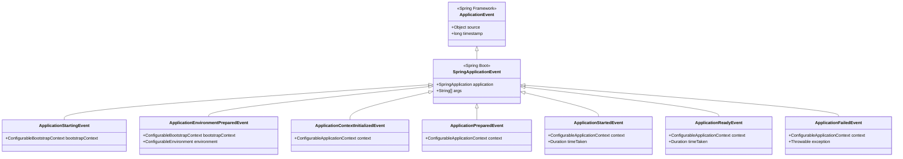
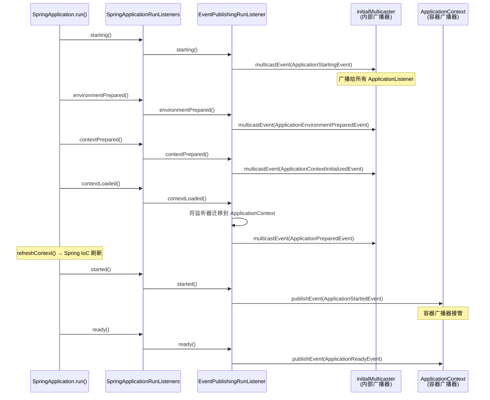
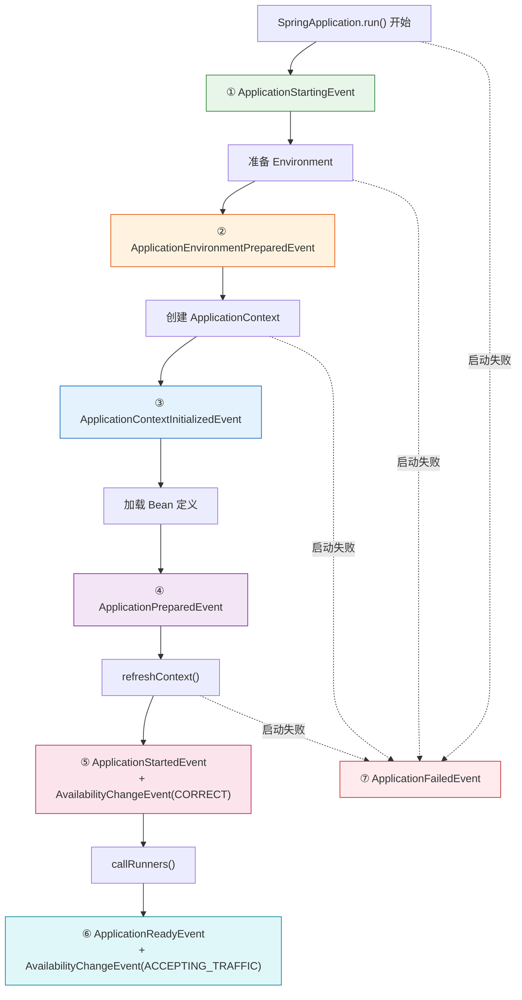
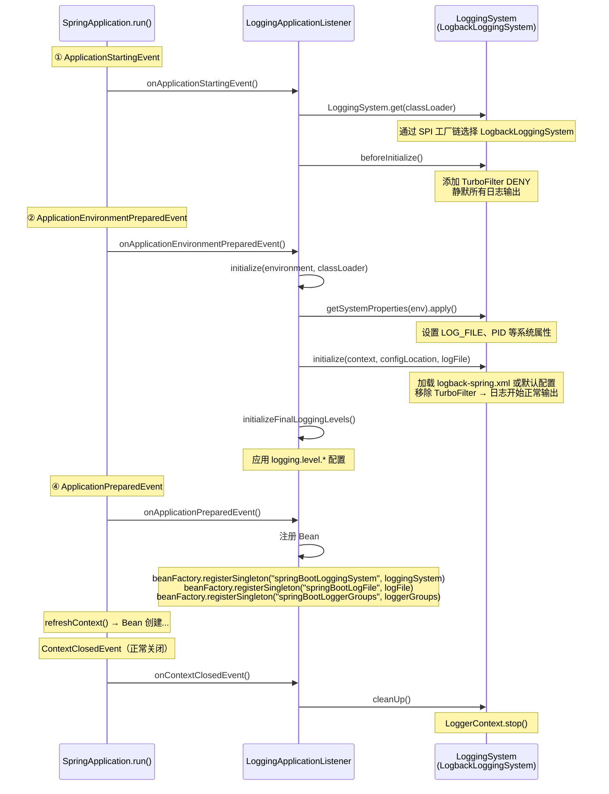
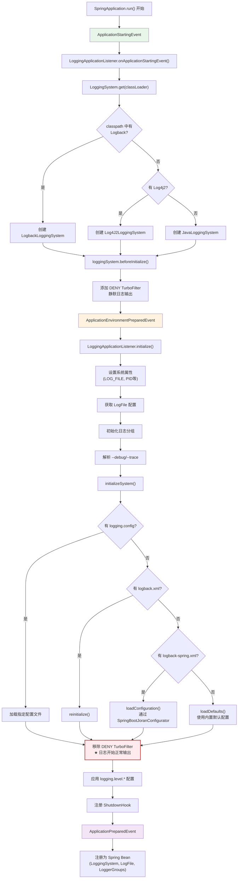
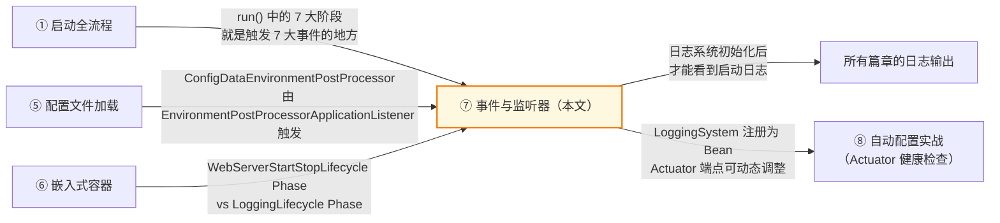

# SpringBoot 事件与监听器机制深度分析

> 📌 基于 **Spring Boot 2.7.18** 源码
> 📁 Spring Boot 源码路径：`/data/workspace/spring-boot/`
> 📁 Spring Framework 源码路径：`/data/workspace/spring-framework/`
> 📖 本文是 Spring Boot 源码系列**第 ⑦ 篇**
> 🔗 前置阅读：[① SpringBoot 启动全流程深度分析](SpringBoot启动全流程深度分析.md)

---

## 一、总体概览 — Spring Boot 启动过程中发布了哪些事件？

### 1.1 核心问题

在第 ① 篇中，我们分析了 `SpringApplication.run()` 的 7 大阶段。其中有一个贯穿始终的机制 —— **事件发布**。Spring Boot 在启动的每一个关键节点都会发布事件，而配置文件加载、日志系统初始化、条件评估报告等核心功能，**全部由监听这些事件的监听器来驱动**。

**核心疑问**：
- Spring Boot 启动过程中发布了哪 7 大事件？每个事件在什么时机触发？
- `EventPublishingRunListener` 是如何将 `SpringApplicationRunListener` 回调转化为事件广播的？
- 日志系统为什么在 Spring 容器创建之前就能工作？`LoggingApplicationListener` 是怎么做到的？

### 1.2 答案：事件驱动的启动模型

Spring Boot 的启动并非一个"大方法"包揽所有事情，而是通过**事件驱动模型**将功能分散到各个监听器中：

```
SpringApplication.run() 启动主流程
  │
  ├── ① starting()              → 发布 ApplicationStartingEvent
  │     └── LoggingApplicationListener: 创建 LoggingSystem，调用 beforeInitialize()
  │     └── BackgroundPreinitializer: （不在此事件，在 EnvironmentPrepared 触发）
  │
  ├── ② environmentPrepared()   → 发布 ApplicationEnvironmentPreparedEvent
  │     └── EnvironmentPostProcessorApplicationListener: 触发所有 EnvironmentPostProcessor
  │     │     └── ConfigDataEnvironmentPostProcessor: 加载 application.yml
  │     └── LoggingApplicationListener: 根据配置初始化日志系统
  │     └── BackgroundPreinitializer: 后台预初始化 Jackson/Validation/Charset
  │
  ├── ③ contextPrepared()       → 发布 ApplicationContextInitializedEvent
  │
  ├── ④ contextLoaded()         → 发布 ApplicationPreparedEvent
  │     └── LoggingApplicationListener: 将 LoggingSystem 注册为 Bean
  │
  │   --- refreshContext() → Spring IoC 容器刷新 ---
  │
  ├── ⑤ started()               → 发布 ApplicationStartedEvent + AvailabilityChangeEvent(CORRECT)
  │
  ├── ⑥ ready()                 → 发布 ApplicationReadyEvent + AvailabilityChangeEvent(ACCEPTING_TRAFFIC)
  │
  └── ⑦ failed()                → 发布 ApplicationFailedEvent（仅在启动失败时）
```

### 1.3 事件体系类图



### 1.4 本文章节地图

| 章节 | 内容 | 核心源码 |
|------|------|---------|
| 二、事件体系架构 | `SpringApplicationRunListener` → `EventPublishingRunListener` → `SimpleApplicationEventMulticaster` | `EventPublishingRunListener.java` |
| 三、7 大事件详解 | 每个事件的触发时机、携带的数据、对应的内置监听器 | 各 `*Event.java` |
| 四、内置关键监听器 | 配置加载、条件评估报告、文件编码检查等监听器 | `EnvironmentPostProcessorApplicationListener.java` |
| 五、日志系统初始化深度分析 | `LoggingSystem` 抽象层、`LoggingApplicationListener` 完整生命周期、Logback 集成 | `LoggingApplicationListener.java` |
| 六、自定义监听器 | 三种注册方式对比 | — |

---

## 二、事件体系架构 — 从回调到广播

### 2.1 三层架构

Spring Boot 的事件体系分为三层：

```
┌─────────────────────────────────────────────────────────────┐
│ 第一层：SpringApplicationRunListeners（聚合层）                │
│   遍历所有 SpringApplicationRunListener，统一调用              │
│   关键方法：starting() / environmentPrepared() / ...          │
├─────────────────────────────────────────────────────────────┤
│ 第二层：EventPublishingRunListener（转化层）                   │
│   将 RunListener 回调 → ApplicationEvent 事件对象             │
│   内部持有 SimpleApplicationEventMulticaster 广播器            │
├─────────────────────────────────────────────────────────────┤
│ 第三层：SimpleApplicationEventMulticaster（广播层）             │
│   遍历所有 ApplicationListener，按事件类型匹配并调用            │
│   支持同步/异步执行                                            │
└─────────────────────────────────────────────────────────────┘
```

### 2.2 SpringApplicationRunListener 接口

`SpringApplicationRunListener` 是 Spring Boot 定义的**启动生命周期回调接口**，通过 `spring.factories` SPI 机制加载：

```java
// 源码位置：spring-boot/src/main/java/org/springframework/boot/SpringApplicationRunListener.java

public interface SpringApplicationRunListener {

    // ① run() 方法刚开始执行，极早期初始化
    default void starting(ConfigurableBootstrapContext bootstrapContext) {}

    // ② Environment 已准备好，但 ApplicationContext 还未创建
    default void environmentPrepared(ConfigurableBootstrapContext bootstrapContext,
            ConfigurableEnvironment environment) {}

    // ③ ApplicationContext 已创建并调用了 Initializer，但还未加载 Bean 定义
    default void contextPrepared(ConfigurableApplicationContext context) {}

    // ④ ApplicationContext 已加载 Bean 定义，但还未 refresh()
    default void contextLoaded(ConfigurableApplicationContext context) {}

    // ⑤ ApplicationContext 已 refresh() 完成，但还未调用 Runner
    default void started(ConfigurableApplicationContext context, Duration timeTaken) {}

    // ⑥ Runner 已执行完毕，应用完全就绪
    default void ready(ConfigurableApplicationContext context, Duration timeTaken) {}

    // ⑦ 启动失败
    default void failed(ConfigurableApplicationContext context, Throwable exception) {}
}
```

**关键设计**：
- 通过 `spring.factories` 注册，在 `SpringApplication` 构造阶段就被加载
- 构造函数签名**必须**是 `(SpringApplication application, String[] args)`
- 只有**唯一的内置实现**：`EventPublishingRunListener`

```properties
# spring-boot/src/main/resources/META-INF/spring.factories
org.springframework.boot.SpringApplicationRunListener=\
org.springframework.boot.context.event.EventPublishingRunListener
```

### 2.3 SpringApplicationRunListeners 聚合类

`SpringApplicationRunListeners`（注意结尾带 **s**）是对所有 `SpringApplicationRunListener` 的聚合管理器：

```java
// 源码位置：spring-boot/src/main/java/org/springframework/boot/SpringApplicationRunListeners.java

class SpringApplicationRunListeners {

    private final Log log;
    private final List<SpringApplicationRunListener> listeners;  // 所有 RunListener 实例
    private final ApplicationStartup applicationStartup;         // 启动耗时追踪

    // 遍历所有 listener，调用对应方法
    void starting(ConfigurableBootstrapContext bootstrapContext, Class<?> mainApplicationClass) {
        doWithListeners("spring.boot.application.starting",
                (listener) -> listener.starting(bootstrapContext),  // 遍历调用
                (step) -> {
                    if (mainApplicationClass != null) {
                        step.tag("mainApplicationClass", mainApplicationClass.getName());
                    }
                });
    }

    // 统一的遍历模板
    private void doWithListeners(String stepName,
            Consumer<SpringApplicationRunListener> listenerAction,
            Consumer<StartupStep> stepAction) {
        StartupStep step = this.applicationStartup.start(stepName);  // 记录启动步骤
        this.listeners.forEach(listenerAction);  // ★ 遍历所有 listener 调用
        if (stepAction != null) {
            stepAction.accept(step);
        }
        step.end();
    }
}
```

**设计要点**：
- `doWithListeners()` 是统一模板方法，所有回调都走这个方法
- 集成了 `ApplicationStartup` 用于启动耗时追踪（对应 Actuator 的 `/startup` 端点）
- `failed()` 回调特殊处理：捕获异常并记录日志，避免异常传播

### 2.4 EventPublishingRunListener — 核心转化层

`EventPublishingRunListener` 是 `SpringApplicationRunListener` 的**唯一内置实现**，负责将生命周期回调转化为事件广播：

```java
// 源码位置：spring-boot/src/main/java/.../event/EventPublishingRunListener.java

public class EventPublishingRunListener implements SpringApplicationRunListener, Ordered {

    private final SpringApplication application;
    private final String[] args;
    private final SimpleApplicationEventMulticaster initialMulticaster;  // ★ 内部广播器

    public EventPublishingRunListener(SpringApplication application, String[] args) {
        this.application = application;
        this.args = args;
        // ★ 创建自己的广播器（因为此时 ApplicationContext 还不存在）
        this.initialMulticaster = new SimpleApplicationEventMulticaster();
        // ★ 将 SpringApplication 中注册的所有 ApplicationListener 添加到广播器
        for (ApplicationListener<?> listener : application.getListeners()) {
            this.initialMulticaster.addApplicationListener(listener);
        }
    }

    @Override
    public int getOrder() {
        return 0;  // 最高优先级
    }
}
```

> 🔑 **核心设计洞察**：`EventPublishingRunListener` 在构造时就创建了自己的 `SimpleApplicationEventMulticaster`。这是因为在启动早期（`starting` ~ `contextLoaded`），`ApplicationContext` 还不存在或尚未 `refresh()`，无法使用容器内的广播器。这就是**为什么日志系统能在 Spring 容器启动之前就工作**的关键原因。

### 2.5 事件发布的两阶段策略

`EventPublishingRunListener` 根据 `ApplicationContext` 的状态，采用**两种不同的发布策略**：

```java
// === 阶段一：容器未就绪 → 使用内部广播器（initialMulticaster）===

@Override
public void starting(ConfigurableBootstrapContext bootstrapContext) {
    // ★ 使用 initialMulticaster 广播
    this.initialMulticaster
        .multicastEvent(new ApplicationStartingEvent(bootstrapContext, this.application, this.args));
}

@Override
public void environmentPrepared(ConfigurableBootstrapContext bootstrapContext,
        ConfigurableEnvironment environment) {
    this.initialMulticaster.multicastEvent(
            new ApplicationEnvironmentPreparedEvent(bootstrapContext, this.application, this.args, environment));
}

@Override
public void contextPrepared(ConfigurableApplicationContext context) {
    this.initialMulticaster
        .multicastEvent(new ApplicationContextInitializedEvent(this.application, this.args, context));
}

@Override
public void contextLoaded(ConfigurableApplicationContext context) {
    // ★ 关键步骤：将监听器迁移到 ApplicationContext
    for (ApplicationListener<?> listener : this.application.getListeners()) {
        if (listener instanceof ApplicationContextAware) {
            ((ApplicationContextAware) listener).setApplicationContext(context);
        }
        context.addApplicationListener(listener);  // ★ 迁移到容器
    }
    this.initialMulticaster
        .multicastEvent(new ApplicationPreparedEvent(this.application, this.args, context));
}

// === 阶段二：容器已就绪 → 使用 ApplicationContext 的发布机制 ===

@Override
public void started(ConfigurableApplicationContext context, Duration timeTaken) {
    // ★ 使用 context.publishEvent()，走容器内的广播器
    context.publishEvent(new ApplicationStartedEvent(this.application, this.args, context, timeTaken));
    AvailabilityChangeEvent.publish(context, LivenessState.CORRECT);
}

@Override
public void ready(ConfigurableApplicationContext context, Duration timeTaken) {
    context.publishEvent(new ApplicationReadyEvent(this.application, this.args, context, timeTaken));
    AvailabilityChangeEvent.publish(context, ReadinessState.ACCEPTING_TRAFFIC);
}
```

> 🔑 **两阶段分界线**是 `contextLoaded()` 方法。在这个方法中，监听器从 `initialMulticaster` **迁移**到 `ApplicationContext`，后续事件就由容器的广播机制来发布了。

用一张图总结：



### 2.6 SimpleApplicationEventMulticaster 广播机制

`SimpleApplicationEventMulticaster` 是 Spring Framework 提供的事件广播器，负责将事件分发给匹配的监听器：

```java
// 源码位置：spring-context/.../event/SimpleApplicationEventMulticaster.java

public class SimpleApplicationEventMulticaster extends AbstractApplicationEventMulticaster {

    private Executor taskExecutor;    // 可选的异步执行器
    private ErrorHandler errorHandler; // 错误处理器

    @Override
    public void multicastEvent(final ApplicationEvent event, ResolvableType eventType) {
        ResolvableType type = (eventType != null ? eventType : resolveDefaultEventType(event));
        Executor executor = getTaskExecutor();
        // ★ 遍历匹配的监听器
        for (ApplicationListener<?> listener : getApplicationListeners(event, type)) {
            if (executor != null) {
                executor.execute(() -> invokeListener(listener, event));  // 异步
            } else {
                invokeListener(listener, event);  // ★ 默认同步调用
            }
        }
    }

    private void doInvokeListener(ApplicationListener listener, ApplicationEvent event) {
        try {
            listener.onApplicationEvent(event);  // ★ 调用监听器
        } catch (ClassCastException ex) {
            // Lambda 监听器的泛型擦除兼容处理
            // ...
        }
    }
}
```

**关键设计**：
- **默认同步**：没有设置 `taskExecutor` 时，所有监听器在调用线程中同步执行
- **监听器匹配**：`getApplicationListeners(event, type)` 根据事件类型（泛型）筛选匹配的监听器
- **ClassCastException 兜底**：Lambda 定义的监听器可能无法解析泛型，这里做了兼容处理

---

## 三、7 大事件详解 — 时序、数据与监听器

### 3.1 事件时序全景图



### 3.2 各事件详解

#### ① ApplicationStartingEvent — 最早期事件

| 属性 | 值 |
|------|-----|
| **触发时机** | `run()` 方法刚开始，`Environment` 和 `ApplicationContext` 都还不存在 |
| **携带数据** | `bootstrapContext`、`application`、`args` |
| **广播方式** | `initialMulticaster` |
| **可用信息** | 几乎没有，只有命令行参数和 SpringApplication 实例 |

```java
// EventPublishingRunListener.starting()
this.initialMulticaster
    .multicastEvent(new ApplicationStartingEvent(bootstrapContext, this.application, this.args));
```

**监听此事件的内置监听器**：

| 监听器 | 功能 |
|--------|------|
| `LoggingApplicationListener` | 调用 `LoggingSystem.get()` 获取日志系统实例，调用 `beforeInitialize()` 静默日志输出 |

> 💡 **设计思考**：为什么 `LoggingApplicationListener` 要在这么早的时机就初始化？因为后续所有阶段都需要日志输出，必须在最早期就让日志系统进入可用状态。

#### ② ApplicationEnvironmentPreparedEvent — 最重要的事件

| 属性 | 值 |
|------|-----|
| **触发时机** | `Environment` 已创建并准备好，但 `ApplicationContext` 还未创建 |
| **携带数据** | `bootstrapContext`、`application`、`args`、`environment` |
| **广播方式** | `initialMulticaster` |
| **可用信息** | 命令行参数、系统属性、环境变量（但配置文件还未加载——由此事件的监听器来加载！） |

```java
// EventPublishingRunListener.environmentPrepared()
this.initialMulticaster.multicastEvent(
    new ApplicationEnvironmentPreparedEvent(bootstrapContext, this.application, this.args, environment));
```

**监听此事件的内置监听器**（按 `@Order` 排序）：

| 顺序 | 监听器 | 功能 |
|:---:|--------|------|
| 1 | `EnvironmentPostProcessorApplicationListener`<br/>（Order: HIGHEST_PRECEDENCE + 10） | 触发所有 `EnvironmentPostProcessor`，包括 `ConfigDataEnvironmentPostProcessor`（加载 application.yml） |
| 2 | `LoggingApplicationListener`<br/>（Order: HIGHEST_PRECEDENCE + 20） | 根据 `Environment` 中的 `logging.*` 配置初始化日志系统 |
| 3 | `AnsiOutputApplicationListener` | 根据 `spring.output.ansi.enabled` 配置 ANSI 彩色输出 |
| 4 | `BackgroundPreinitializer`<br/>（Order: HIGHEST_PRECEDENCE + 21） | 启动后台线程预初始化 Jackson、Validation、Charset 等耗时操作 |
| 5 | `FileEncodingApplicationListener` | 检查系统文件编码是否匹配 `spring.mandatory-file-encoding` 配置 |
| 6 | `DelegatingApplicationListener` | 将事件委托给 `context.listener.classes` 配置的监听器 |

> 🔑 **这是 Spring Boot 启动中最重要的事件**，配置文件加载、日志初始化、后台预初始化全部在这个事件中触发。顺序非常关键——配置文件必须先于日志初始化加载，因为日志配置可能写在 application.yml 中。

#### ③ ApplicationContextInitializedEvent — 上下文创建后

| 属性 | 值 |
|------|-----|
| **触发时机** | `ApplicationContext` 已创建，`ApplicationContextInitializer` 已调用，但还未加载 Bean 定义 |
| **携带数据** | `application`、`args`、`context` |
| **广播方式** | `initialMulticaster` |
| **可用信息** | 上下文已存在但还是空的 |

```java
// EventPublishingRunListener.contextPrepared()
this.initialMulticaster
    .multicastEvent(new ApplicationContextInitializedEvent(this.application, this.args, context));
```

> 💡 这个事件在 Spring Boot 2.1.0 引入，主要用于在 Bean 定义加载之前做一些准备工作。内置监听器很少使用它。

#### ④ ApplicationPreparedEvent — Bean 定义已加载

| 属性 | 值 |
|------|-----|
| **触发时机** | `ApplicationContext` 已加载所有 Bean 定义，但还未执行 `refresh()` |
| **携带数据** | `application`、`args`、`context` |
| **广播方式** | `initialMulticaster`（最后一次使用） |
| **可用信息** | Bean 定义已加载，但 Bean 尚未实例化 |

```java
// EventPublishingRunListener.contextLoaded()
// ★ 先将监听器迁移到 ApplicationContext
for (ApplicationListener<?> listener : this.application.getListeners()) {
    if (listener instanceof ApplicationContextAware) {
        ((ApplicationContextAware) listener).setApplicationContext(context);
    }
    context.addApplicationListener(listener);
}
// 再广播事件（这是 initialMulticaster 最后一次使用）
this.initialMulticaster.multicastEvent(new ApplicationPreparedEvent(this.application, this.args, context));
```

**监听此事件的内置监听器**：

| 监听器 | 功能 |
|--------|------|
| `LoggingApplicationListener` | 将 `LoggingSystem`、`LogFile`、`LoggerGroups` 注册为 Spring Bean |
| `EnvironmentPostProcessorApplicationListener` | 调用 `DeferredLogs.switchOverAll()` 切换延迟日志输出 |

> 🔑 **监听器迁移的关键时刻**：`contextLoaded()` 方法先把所有监听器添加到 `ApplicationContext` 中，然后才广播 `ApplicationPreparedEvent`。这保证了后续事件可以通过容器的广播机制分发。

#### ⑤ ApplicationStartedEvent — 容器已就绪

| 属性 | 值 |
|------|-----|
| **触发时机** | `ApplicationContext` 已完成 `refresh()`，所有 Bean 已创建，但 `Runner` 还未执行 |
| **携带数据** | `application`、`args`、`context`、`timeTaken` |
| **广播方式** | `context.publishEvent()`（容器广播器） |
| **可用信息** | 所有 Bean 已就绪，可以注入使用 |

```java
// EventPublishingRunListener.started()
context.publishEvent(new ApplicationStartedEvent(this.application, this.args, context, timeTaken));
AvailabilityChangeEvent.publish(context, LivenessState.CORRECT);  // ★ K8s 存活探针状态
```

> 💡 从此事件开始，**可用性状态**也被发布。`LivenessState.CORRECT` 表示应用进程存活，K8s 的 liveness probe 可以检测到。

#### ⑥ ApplicationReadyEvent — 应用完全就绪

| 属性 | 值 |
|------|-----|
| **触发时机** | `Runner` 已执行完毕，应用完全就绪，可以接收请求 |
| **携带数据** | `application`、`args`、`context`、`timeTaken`（从启动到就绪的总时间） |
| **广播方式** | `context.publishEvent()` |
| **可用信息** | 一切就绪 |

```java
// EventPublishingRunListener.ready()
context.publishEvent(new ApplicationReadyEvent(this.application, this.args, context, timeTaken));
AvailabilityChangeEvent.publish(context, ReadinessState.ACCEPTING_TRAFFIC);  // ★ K8s 就绪探针状态
```

> 💡 `ReadinessState.ACCEPTING_TRAFFIC` 表示应用已准备好接收流量，K8s 的 readiness probe 检测到后才会将 Pod 加入 Service。

#### ⑦ ApplicationFailedEvent — 启动失败

| 属性 | 值 |
|------|-----|
| **触发时机** | 启动过程中任何阶段发生异常 |
| **携带数据** | `application`、`args`、`context`（可能为 null）、`exception` |
| **广播方式** | 优先用 `context.publishEvent()`，如果容器不可用则回退到 `initialMulticaster` |
| **可用信息** | 失败的异常信息 |

```java
// EventPublishingRunListener.failed()
ApplicationFailedEvent event = new ApplicationFailedEvent(this.application, this.args, context, exception);
if (context != null && context.isActive()) {
    context.publishEvent(event);  // 容器可用时走容器广播
} else {
    // ★ 容器不可用时，回退到 initialMulticaster
    if (context instanceof AbstractApplicationContext) {
        for (ApplicationListener<?> listener : ((AbstractApplicationContext) context)
                .getApplicationListeners()) {
            this.initialMulticaster.addApplicationListener(listener);
        }
    }
    this.initialMulticaster.setErrorHandler(new LoggingErrorHandler());
    this.initialMulticaster.multicastEvent(event);
}
```

> 🔑 **失败事件的健壮性设计**：如果容器已经不可用（比如 `refresh()` 过程中就失败了），`failed()` 会回退到 `initialMulticaster` 来广播，并设置 `ErrorHandler` 避免异常传播。这确保了即使启动失败，日志清理等操作仍然能执行。

### 3.3 事件对比总结表

| 事件 | 触发时机 | 有 Environment | 有 Context | 有 Bean | 广播方式 |
|------|---------|:-----------:|:---------:|:------:|---------|
| `ApplicationStartingEvent` | run() 开始 | ❌ | ❌ | ❌ | initialMulticaster |
| `ApplicationEnvironmentPreparedEvent` | Environment 就绪 | ✅ | ❌ | ❌ | initialMulticaster |
| `ApplicationContextInitializedEvent` | Context 创建后 | ✅ | ✅（空） | ❌ | initialMulticaster |
| `ApplicationPreparedEvent` | Bean 定义已加载 | ✅ | ✅ | ❌（定义已加载） | initialMulticaster |
| `ApplicationStartedEvent` | refresh() 完成 | ✅ | ✅ | ✅ | context.publishEvent() |
| `ApplicationReadyEvent` | Runner 执行完 | ✅ | ✅ | ✅ | context.publishEvent() |
| `ApplicationFailedEvent` | 启动失败 | 可能 | 可能 | 可能 | 回退策略 |

---

## 四、内置关键监听器 — 谁在监听这些事件？

### 4.1 内置监听器注册清单

Spring Boot 在 `spring-boot/src/main/resources/META-INF/spring.factories` 中注册了以下 `ApplicationListener`：

```properties
org.springframework.context.ApplicationListener=\
org.springframework.boot.ClearCachesApplicationListener,\
org.springframework.boot.builder.ParentContextCloserApplicationListener,\
org.springframework.boot.context.FileEncodingApplicationListener,\
org.springframework.boot.context.config.AnsiOutputApplicationListener,\
org.springframework.boot.context.config.DelegatingApplicationListener,\
org.springframework.boot.context.logging.LoggingApplicationListener,\
org.springframework.boot.env.EnvironmentPostProcessorApplicationListener
```

### 4.2 EnvironmentPostProcessorApplicationListener — 配置文件加载的触发器

这是第 ⑤ 篇配置文件加载的入口监听器：

```java
// 源码位置：spring-boot/.../env/EnvironmentPostProcessorApplicationListener.java

public class EnvironmentPostProcessorApplicationListener implements SmartApplicationListener, Ordered {

    public static final int DEFAULT_ORDER = Ordered.HIGHEST_PRECEDENCE + 10;  // ★ 优先级很高

    private final DeferredLogs deferredLogs;

    @Override
    public boolean supportsEventType(Class<? extends ApplicationEvent> eventType) {
        return ApplicationEnvironmentPreparedEvent.class.isAssignableFrom(eventType)
                || ApplicationPreparedEvent.class.isAssignableFrom(eventType)
                || ApplicationFailedEvent.class.isAssignableFrom(eventType);
    }

    @Override
    public void onApplicationEvent(ApplicationEvent event) {
        if (event instanceof ApplicationEnvironmentPreparedEvent) {
            onApplicationEnvironmentPreparedEvent((ApplicationEnvironmentPreparedEvent) event);
        }
        if (event instanceof ApplicationPreparedEvent) {
            onApplicationPreparedEvent();  // 切换延迟日志
        }
        if (event instanceof ApplicationFailedEvent) {
            onApplicationFailedEvent();    // 切换延迟日志
        }
    }

    // ★ 核心方法：触发所有 EnvironmentPostProcessor
    private void onApplicationEnvironmentPreparedEvent(ApplicationEnvironmentPreparedEvent event) {
        ConfigurableEnvironment environment = event.getEnvironment();
        SpringApplication application = event.getSpringApplication();
        for (EnvironmentPostProcessor postProcessor : getEnvironmentPostProcessors(
                application.getResourceLoader(), event.getBootstrapContext())) {
            postProcessor.postProcessEnvironment(environment, application);
            // ★ ConfigDataEnvironmentPostProcessor 就是在这里被调用的，加载 application.yml
        }
    }
}
```

**关键设计**：
- `Order` 是 `HIGHEST_PRECEDENCE + 10`，确保在 `LoggingApplicationListener`（`HIGHEST_PRECEDENCE + 20`）**之前**执行
- 这保证了**配置文件先于日志初始化加载**，因为 `logging.config`、`logging.level.*` 等日志配置可能写在 application.yml 中

### 4.3 BackgroundPreinitializer — 后台预初始化

`BackgroundPreinitializer` 在 `ApplicationEnvironmentPreparedEvent` 时启动后台线程预初始化耗时组件：

```java
// 源码位置：spring-boot-autoconfigure/.../BackgroundPreinitializer.java

@Order(LoggingApplicationListener.DEFAULT_ORDER + 1)  // HIGHEST_PRECEDENCE + 21
public class BackgroundPreinitializer implements ApplicationListener<SpringApplicationEvent> {

    private static final boolean ENABLED;
    static {
        // ★ 仅当 CPU 核数 > 1 且非 GraalVM 原生镜像时启用
        ENABLED = !Boolean.getBoolean(IGNORE_BACKGROUNDPREINITIALIZER_PROPERTY_NAME)
                && !NativeDetector.inNativeImage()
                && Runtime.getRuntime().availableProcessors() > 1;
    }

    @Override
    public void onApplicationEvent(SpringApplicationEvent event) {
        if (!ENABLED) return;

        if (event instanceof ApplicationEnvironmentPreparedEvent
                && preinitializationStarted.compareAndSet(false, true)) {
            performPreinitialization();  // ★ 启动后台线程
        }
        if ((event instanceof ApplicationReadyEvent || event instanceof ApplicationFailedEvent)
                && preinitializationStarted.get()) {
            preinitializationComplete.await();  // ★ 等待后台线程完成
        }
    }

    private void performPreinitialization() {
        Thread thread = new Thread(() -> {
            runSafely(new ConversionServiceInitializer());   // Spring ConversionService
            runSafely(new ValidationInitializer());          // Bean Validation
            if (!runSafely(new MessageConverterInitializer())) {
                runSafely(new JacksonInitializer());         // Jackson ObjectMapper
            }
            runSafely(new CharsetInitializer());             // Charset
            preinitializationComplete.countDown();
        }, "background-preinit");
        thread.start();
    }
}
```

**关键设计**：
- 使用 `CountDownLatch` 确保 `ApplicationReadyEvent` 或 `ApplicationFailedEvent` 时后台线程已完成
- 在 `ApplicationEnvironmentPreparedEvent` 时启动（此时主线程正在做配置加载和日志初始化，后台线程刚好利用这段时间做预初始化）
- 仅多核 CPU 才启用（单核会适得其反）

### 4.4 其他内置监听器简要说明

| 监听器 | 监听事件 | 功能 |
|--------|---------|------|
| `ClearCachesApplicationListener` | `ContextRefreshedEvent` | 清理 `ReflectionUtils` 和 `ClassLoader` 缓存 |
| `ParentContextCloserApplicationListener` | `ParentContextAvailableEvent` | 父上下文关闭时，关闭子上下文 |
| `FileEncodingApplicationListener` | `ApplicationEnvironmentPreparedEvent` | 检查 `file.encoding` 是否匹配 `spring.mandatory-file-encoding` |
| `AnsiOutputApplicationListener` | `ApplicationEnvironmentPreparedEvent` | 根据 `spring.output.ansi.enabled` 配置 ANSI 彩色控制台输出 |
| `DelegatingApplicationListener` | 所有事件 | 将事件委托给 `context.listener.classes` 配置指定的监听器 |

---

## 五、日志系统初始化深度分析 🏭 — 日志为什么在 Spring 之前就能工作？

### 5.1 核心问题

在 Spring Boot 应用中，我们在 `application.yml` 还没加载、`ApplicationContext` 还没创建的时候，就已经能看到日志输出了。这背后的核心问题是：

> **日志系统为什么在 Spring 容器启动之前就能工作？它是怎么初始化的？**

答案就在 `LoggingApplicationListener` —— 它利用**事件驱动**机制，在启动的不同阶段逐步完成日志系统的初始化。

### 5.2 LoggingSystem 抽象层 — 统一 Logback/Log4j2/JUL

Spring Boot 通过 `LoggingSystem` 抽象类统一了不同日志框架的差异：

```java
// 源码位置：spring-boot/.../logging/LoggingSystem.java

public abstract class LoggingSystem {

    public static final String SYSTEM_PROPERTY = LoggingSystem.class.getName();
    public static final String NONE = "none";
    public static final String ROOT_LOGGER_NAME = "ROOT";

    private static final LoggingSystemFactory SYSTEM_FACTORY = LoggingSystemFactory.fromSpringFactories();

    // ★ 核心方法：根据 classpath 自动检测日志框架
    public static LoggingSystem get(ClassLoader classLoader) {
        String loggingSystemClassName = System.getProperty(SYSTEM_PROPERTY);
        if (StringUtils.hasLength(loggingSystemClassName)) {
            if (NONE.equals(loggingSystemClassName)) {
                return new NoOpLoggingSystem();  // 禁用日志
            }
            return get(classLoader, loggingSystemClassName);
        }
        // ★ 通过 SPI 工厂链自动选择
        LoggingSystem loggingSystem = SYSTEM_FACTORY.getLoggingSystem(classLoader);
        Assert.state(loggingSystem != null, "No suitable logging system located");
        return loggingSystem;
    }

    // 生命周期方法
    public abstract void beforeInitialize();                // 极早期初始化（静默输出）
    public void initialize(...) {}                          // 根据配置完整初始化
    public void cleanUp() {}                               // 清理
    public Runnable getShutdownHandler() { return null; }  // JVM 关闭钩子
    public void setLogLevel(String loggerName, LogLevel level) {}  // 动态设置级别
}
```

日志系统通过 `LoggingSystemFactory` SPI 自动检测，优先级从高到低：

```properties
# spring-boot/src/main/resources/META-INF/spring.factories
org.springframework.boot.logging.LoggingSystemFactory=\
org.springframework.boot.logging.logback.LogbackLoggingSystem.Factory,\    # ① Logback（默认）
org.springframework.boot.logging.log4j2.Log4J2LoggingSystem.Factory,\     # ② Log4j2
org.springframework.boot.logging.java.JavaLoggingSystem.Factory            # ③ JUL（兜底）
```

**自动检测逻辑**（以 `LogbackLoggingSystem.Factory` 为例）：

```java
// LogbackLoggingSystem 内部的工厂类
public static class Factory implements LoggingSystemFactory {

    private static final boolean PRESENT = ClassUtils.isPresent(
            "ch.qos.logback.classic.LoggerContext", Factory.class.getClassLoader());

    @Override
    public LoggingSystem getLoggingSystem(ClassLoader classLoader) {
        if (PRESENT) {  // ★ classpath 中有 Logback 就选它
            return new LogbackLoggingSystem(classLoader);
        }
        return null;
    }
}
```

继承层次：

```
LoggingSystem（抽象基类）
  └── AbstractLoggingSystem（模板方法：配置文件查找）
        └── Slf4JLoggingSystem（SLF4J 集成：JUL 桥接）
              └── LogbackLoggingSystem（Logback 具体实现）
```

### 5.3 LoggingApplicationListener 完整生命周期

`LoggingApplicationListener` 是日志系统初始化的核心驱动者，它监听了**5 种事件**，在不同阶段做不同的事情：

```java
// 源码位置：spring-boot/.../context/logging/LoggingApplicationListener.java

public class LoggingApplicationListener implements GenericApplicationListener {

    public static final int DEFAULT_ORDER = Ordered.HIGHEST_PRECEDENCE + 20;

    // ★ 支持的事件类型
    private static final Class<?>[] EVENT_TYPES = {
        ApplicationStartingEvent.class,
        ApplicationEnvironmentPreparedEvent.class,
        ApplicationPreparedEvent.class,
        ContextClosedEvent.class,
        ApplicationFailedEvent.class
    };

    @Override
    public void onApplicationEvent(ApplicationEvent event) {
        if (event instanceof ApplicationStartingEvent) {
            onApplicationStartingEvent((ApplicationStartingEvent) event);       // 阶段一
        } else if (event instanceof ApplicationEnvironmentPreparedEvent) {
            onApplicationEnvironmentPreparedEvent(
                (ApplicationEnvironmentPreparedEvent) event);                    // 阶段二
        } else if (event instanceof ApplicationPreparedEvent) {
            onApplicationPreparedEvent((ApplicationPreparedEvent) event);        // 阶段三
        } else if (event instanceof ContextClosedEvent) {
            onContextClosedEvent((ContextClosedEvent) event);                    // 阶段四
        } else if (event instanceof ApplicationFailedEvent) {
            onApplicationFailedEvent();                                          // 失败清理
        }
    }
}
```

用一张图展示完整生命周期：



#### 阶段一：ApplicationStartingEvent → `beforeInitialize()` 极早期初始化

```java
private void onApplicationStartingEvent(ApplicationStartingEvent event) {
    // ★ 通过 SPI 工厂链选择合适的日志系统
    this.loggingSystem = LoggingSystem.get(event.getSpringApplication().getClassLoader());
    // ★ 极早期初始化——静默所有日志输出
    this.loggingSystem.beforeInitialize();
}
```

对于 Logback，`beforeInitialize()` 做了什么？

```java
// LogbackLoggingSystem.beforeInitialize()
@Override
public void beforeInitialize() {
    LoggerContext loggerContext = getLoggerContext();
    if (isAlreadyInitialized(loggerContext)) {
        return;
    }
    super.beforeInitialize();  // Slf4JLoggingSystem: 安装 SLF4JBridgeHandler
    // ★ 添加 DENY 过滤器，阻止所有日志输出
    loggerContext.getTurboFilterList().add(FILTER);
}

// 这个 FILTER 会拒绝所有日志
private static final TurboFilter FILTER = new TurboFilter() {
    @Override
    public FilterReply decide(Marker marker, Logger logger, Level level,
            String format, Object[] params, Throwable t) {
        return FilterReply.DENY;  // ★ 全部拒绝
    }
};
```

> 🔑 **为什么要静默？** 因为在日志系统正式初始化之前（还没读到 `logback-spring.xml` 或 `logging.level.*` 配置），Logback 可能已经通过自己的默认机制输出日志了。添加 `DENY` 过滤器可以确保在 Spring Boot 完成日志配置之前不会有"野日志"输出。

#### 阶段二：ApplicationEnvironmentPreparedEvent → `initialize()` 完整初始化

这是日志系统初始化的**核心阶段**：

```java
private void onApplicationEnvironmentPreparedEvent(ApplicationEnvironmentPreparedEvent event) {
    SpringApplication springApplication = event.getSpringApplication();
    if (this.loggingSystem == null) {
        this.loggingSystem = LoggingSystem.get(springApplication.getClassLoader());
    }
    initialize(event.getEnvironment(), springApplication.getClassLoader());
}

// ★ 初始化核心方法
protected void initialize(ConfigurableEnvironment environment, ClassLoader classLoader) {
    // Step 1: 设置日志系统属性（LOG_FILE、PID、LOG_DATEFORMAT_PATTERN 等）
    getLoggingSystemProperties(environment).apply();

    // Step 2: 获取日志文件配置
    this.logFile = LogFile.get(environment);
    if (this.logFile != null) {
        this.logFile.applyToSystemProperties();
    }

    // Step 3: 初始化日志分组（web、sql 等默认组）
    this.loggerGroups = new LoggerGroups(DEFAULT_GROUP_LOGGERS);

    // Step 4: 解析 --debug / --trace 参数
    initializeEarlyLoggingLevel(environment);

    // Step 5: ★ 初始化日志系统（加载配置文件）
    initializeSystem(environment, this.loggingSystem, this.logFile);

    // Step 6: ★ 应用 logging.level.* 配置
    initializeFinalLoggingLevels(environment, this.loggingSystem);

    // Step 7: 注册 JVM ShutdownHook
    registerShutdownHookIfNecessary(environment, this.loggingSystem);
}
```

**Step 5 的细节——`initializeSystem()`**：

```java
private void initializeSystem(ConfigurableEnvironment environment, LoggingSystem system, LogFile logFile) {
    String logConfig = StringUtils.trimWhitespace(environment.getProperty(CONFIG_PROPERTY));
    // CONFIG_PROPERTY = "logging.config"
    try {
        LoggingInitializationContext initializationContext = new LoggingInitializationContext(environment);
        if (ignoreLogConfig(logConfig)) {
            system.initialize(initializationContext, null, logFile);  // 使用约定配置
        } else {
            system.initialize(initializationContext, logConfig, logFile);  // 使用指定配置
        }
    } catch (Exception ex) {
        // ★ 从异常链中查找 FileNotFoundException
        Throwable exceptionToReport = ex;
        while (exceptionToReport != null && !(exceptionToReport instanceof FileNotFoundException)) {
            exceptionToReport = exceptionToReport.getCause();
        }
        exceptionToReport = (exceptionToReport != null) ? exceptionToReport : ex;
        // NOTE: 不能用 logger 输出错误，因为日志系统可能就是初始化失败了
        System.err.println("Logging system failed to initialize using configuration from '" + logConfig + "'");
        exceptionToReport.printStackTrace(System.err);
        throw new IllegalStateException(ex);
    }
}
```

> 💡 **一个有趣的细节**：日志系统初始化失败时，不能用 `logger.error()` 输出错误（因为日志系统本身就挂了），只能用 `System.err.println()` 直接写到标准错误流。

**Step 6 的细节——日志级别配置**：

```java
private void initializeFinalLoggingLevels(ConfigurableEnvironment environment, LoggingSystem system) {
    // 绑定 logging.group 配置
    bindLoggerGroups(environment);
    // 如果有 --debug / --trace 参数，设置 Spring Boot 内置日志级别
    if (this.springBootLogging != null) {
        initializeSpringBootLogging(system, this.springBootLogging);
    }
    // ★ 应用 logging.level.* 配置
    setLogLevels(system, environment);
}

// 内置的 --debug / --trace 日志组
private static final Map<LogLevel, List<String>> SPRING_BOOT_LOGGING_LOGGERS;
static {
    MultiValueMap<LogLevel, String> loggers = new LinkedMultiValueMap<>();
    loggers.add(LogLevel.DEBUG, "sql");
    loggers.add(LogLevel.DEBUG, "web");
    loggers.add(LogLevel.DEBUG, "org.springframework.boot");
    loggers.add(LogLevel.TRACE, "org.springframework");
    loggers.add(LogLevel.TRACE, "org.apache.tomcat");
    loggers.add(LogLevel.TRACE, "org.apache.catalina");
    loggers.add(LogLevel.TRACE, "org.eclipse.jetty");
    loggers.add(LogLevel.TRACE, "org.hibernate.tool.hbm2ddl");
    SPRING_BOOT_LOGGING_LOGGERS = Collections.unmodifiableMap(loggers);
}
```

> 💡 这就是为什么加 `--debug` 参数后能看到 Spring Boot、web、sql 的 DEBUG 日志，加 `--trace` 后能看到 Spring Framework、Tomcat、Jetty 的 TRACE 日志。

#### 阶段三：ApplicationPreparedEvent → 注册为 Spring Bean

```java
private void onApplicationPreparedEvent(ApplicationPreparedEvent event) {
    ConfigurableApplicationContext applicationContext = event.getApplicationContext();
    ConfigurableListableBeanFactory beanFactory = applicationContext.getBeanFactory();
    // ★ 将日志系统注册为 Bean，后续 Actuator 等组件可以注入使用
    if (!beanFactory.containsBean(LOGGING_SYSTEM_BEAN_NAME)) {
        beanFactory.registerSingleton(LOGGING_SYSTEM_BEAN_NAME, this.loggingSystem);
    }
    if (this.logFile != null && !beanFactory.containsBean(LOG_FILE_BEAN_NAME)) {
        beanFactory.registerSingleton(LOG_FILE_BEAN_NAME, this.logFile);
    }
    if (this.loggerGroups != null && !beanFactory.containsBean(LOGGER_GROUPS_BEAN_NAME)) {
        beanFactory.registerSingleton(LOGGER_GROUPS_BEAN_NAME, this.loggerGroups);
    }
    // ★ 注册 Lifecycle Bean，用于容器关闭时清理日志系统
    if (!beanFactory.containsBean(LOGGING_LIFECYCLE_BEAN_NAME) && applicationContext.getParent() == null) {
        beanFactory.registerSingleton(LOGGING_LIFECYCLE_BEAN_NAME, new Lifecycle());
    }
}
```

注册了以下 Bean：

| Bean 名称 | 类型 | 用途 |
|-----------|------|------|
| `springBootLoggingSystem` | `LoggingSystem` | Actuator `/loggers` 端点使用 |
| `springBootLogFile` | `LogFile` | 日志文件路径信息 |
| `springBootLoggerGroups` | `LoggerGroups` | 日志分组信息 |
| `springBootLoggingLifecycle` | `SmartLifecycle` | 容器关闭时清理日志系统 |

> 🔑 **`Lifecycle` 内部类的 Phase 设计**：

```java
private class Lifecycle implements SmartLifecycle {
    @Override
    public int getPhase() {
        return Integer.MIN_VALUE + 1;  // ★ 极晚关闭
    }
    @Override
    public void stop() {
        this.running = false;
        cleanupLoggingSystem();  // 容器关闭时清理日志
    }
}
```

Phase 是 `Integer.MIN_VALUE + 1`，意味着在所有 `SmartLifecycle` Bean 中**最后停止**（对比 `WebServerStartStopLifecycle` 的 `Integer.MAX_VALUE - 1`）。这确保了日志系统在容器关闭的整个过程中都可用，直到最后才清理。

### 5.4 LogbackLoggingSystem 初始化链路 — Logback 具体怎么初始化？

`LogbackLoggingSystem.initialize()` 是 Logback 日志系统的完整初始化入口：

```java
// LogbackLoggingSystem.initialize()
@Override
public void initialize(LoggingInitializationContext initializationContext,
        String configLocation, LogFile logFile) {
    LoggerContext loggerContext = getLoggerContext();
    if (isAlreadyInitialized(loggerContext)) {
        return;  // 防止重复初始化
    }
    // ★ 调用父类的模板方法（AbstractLoggingSystem.initialize()）
    super.initialize(initializationContext, configLocation, logFile);
    // ★ 移除 DENY 过滤器 → 日志开始正常输出
    loggerContext.getTurboFilterList().remove(FILTER);
    // 标记为已初始化
    markAsInitialized(loggerContext);
}
```

父类 `AbstractLoggingSystem.initialize()` 的模板方法：

```java
// AbstractLoggingSystem.initialize()
@Override
public void initialize(LoggingInitializationContext initializationContext,
        String configLocation, LogFile logFile) {
    if (StringUtils.hasLength(configLocation)) {
        // 情况一：指定了 logging.config 配置文件路径
        initializeWithSpecificConfig(initializationContext, configLocation, logFile);
        return;
    }
    // 情况二：按约定查找配置文件
    initializeWithConventions(initializationContext, logFile);
}

private void initializeWithConventions(LoggingInitializationContext initializationContext, LogFile logFile) {
    // ★ 先查找标准配置（logback-test.xml, logback.xml 等）
    String config = getSelfInitializationConfig();
    if (config != null && logFile == null) {
        reinitialize(initializationContext);  // 已有标准配置，重新初始化（应用系统属性）
        return;
    }
    if (config == null) {
        // ★ 再查找 Spring 配置（logback-test-spring.xml, logback-spring.xml 等）
        config = getSpringInitializationConfig();
    }
    if (config != null) {
        loadConfiguration(initializationContext, config, logFile);  // 加载配置文件
        return;
    }
    // ★ 都没有，使用默认配置
    loadDefaults(initializationContext, logFile);
}
```

#### 配置文件查找优先级

`LogbackLoggingSystem` 的标准配置文件和 Spring 配置文件：

```java
// LogbackLoggingSystem.getStandardConfigLocations()
@Override
protected String[] getStandardConfigLocations() {
    return new String[] { "logback-test.groovy", "logback-test.xml", "logback.groovy", "logback.xml" };
}

// AbstractLoggingSystem.getSpringConfigLocations()（基于标准位置自动生成）
protected String[] getSpringConfigLocations() {
    // 将 "logback.xml" → "logback-spring.xml"
    String[] locations = getStandardConfigLocations();
    for (int i = 0; i < locations.length; i++) {
        String extension = StringUtils.getFilenameExtension(locations[i]);
        locations[i] = locations[i].substring(0, locations[i].length() - extension.length() - 1)
                + "-spring." + extension;
    }
    return locations;
}
```

完整的查找优先级：

```
优先级从高到低：

1. logging.config 指定的路径（如 classpath:custom-logback.xml）
2. logback-test.groovy  ← 标准配置（Logback 自身约定）
3. logback-test.xml     ← 标准配置
4. logback.groovy       ← 标准配置
5. logback.xml          ← 标准配置
6. logback-test-spring.groovy  ← Spring 配置（Spring Boot 扩展约定）
7. logback-test-spring.xml     ← Spring 配置
8. logback-spring.groovy       ← Spring 配置
9. logback-spring.xml          ← Spring 配置 ← ★ 推荐使用这个！
10. Spring Boot 内置默认配置    ← 兜底（控制台彩色输出）
```

> 🔑 **`logback-spring.xml` vs `logback.xml` 的核心区别**：
> - `logback.xml` 是 Logback 原生配置，在 Logback 自身的 `ContextInitializer` 中加载，**不支持** `<springProfile>` 和 `<springProperty>` 标签
> - `logback-spring.xml` 是 Spring Boot 扩展配置，通过 `SpringBootJoranConfigurator` 加载，**支持** `<springProfile>` 和 `<springProperty>` 标签
> - **推荐使用 `logback-spring.xml`**，因为它支持 Spring Profile 条件化日志配置

### 5.5 `<springProfile>` 标签实现原理

`<springProfile>` 是 Spring Boot 对 Logback 配置文件的扩展，允许根据 Profile 动态切换日志配置：

```xml
<!-- logback-spring.xml 示例 -->
<configuration>
    <springProfile name="dev">
        <root level="DEBUG">
            <appender-ref ref="CONSOLE"/>
        </root>
    </springProfile>

    <springProfile name="prod">
        <root level="INFO">
            <appender-ref ref="FILE"/>
        </root>
    </springProfile>
</configuration>
```

这个标签是怎么实现的？

**Step 1：`SpringBootJoranConfigurator` 注册自定义 Action**

```java
// 源码位置：spring-boot/.../logback/SpringBootJoranConfigurator.java

class SpringBootJoranConfigurator extends JoranConfigurator {

    private LoggingInitializationContext initializationContext;

    @Override
    public void addInstanceRules(RuleStore rs) {
        super.addInstanceRules(rs);
        Environment environment = this.initializationContext.getEnvironment();
        // ★ 注册 <springProperty> 标签处理器
        rs.addRule(new ElementSelector("configuration/springProperty"),
                new SpringPropertyAction(environment));
        // ★ 注册 <springProfile> 标签处理器
        rs.addRule(new ElementSelector("*/springProfile"),
                new SpringProfileAction(environment));
        rs.addRule(new ElementSelector("*/springProfile/*"), new NOPAction());
    }
}
```

**Step 2：`SpringProfileAction` 根据 Profile 过滤配置**

```java
// 源码位置：spring-boot/.../logback/SpringProfileAction.java

class SpringProfileAction extends Action implements InPlayListener {

    private final Environment environment;
    private boolean acceptsProfile;
    private List<SaxEvent> events;

    @Override
    public void begin(InterpretationContext ic, String name, Attributes attributes) {
        // ★ 判断当前激活的 Profile 是否匹配 name 属性
        this.acceptsProfile = acceptsProfiles(ic, attributes);
        this.events = new ArrayList<>();
        ic.addInPlayListener(this);  // 收集子元素事件
    }

    private boolean acceptsProfiles(InterpretationContext ic, Attributes attributes) {
        if (this.environment == null) return false;
        String[] profileNames = StringUtils.trimArrayElements(
                StringUtils.commaDelimitedListToStringArray(attributes.getValue(NAME_ATTRIBUTE)));
        if (profileNames.length == 0) return false;
        // ★ 使用 Spring Environment 的 Profile 匹配
        return this.environment.acceptsProfiles(Profiles.of(profileNames));
    }

    @Override
    public void end(InterpretationContext ic, String name) {
        ic.removeInPlayListener(this);
        if (this.acceptsProfile) {
            addEventsToPlayer(ic);  // ★ Profile 匹配 → 将子元素添加到解析器执行
        }
        // Profile 不匹配 → 子元素被忽略（不执行）
    }
}
```

> 💡 **原理总结**：`SpringProfileAction` 在解析到 `<springProfile>` 标签时，先收集其内部的所有子元素（SAX 事件），然后检查 `name` 属性是否匹配当前 Profile。匹配则将子元素交给 Logback 解析器执行，不匹配则直接丢弃。

### 5.6 `<springProperty>` 标签 — 在 Logback 中引用 Spring 配置

```xml
<!-- logback-spring.xml 示例 -->
<configuration>
    <!-- 从 application.yml 中读取 app.name 属性 -->
    <springProperty scope="context" name="APP_NAME" source="app.name" defaultValue="my-app"/>

    <appender name="FILE" class="ch.qos.logback.core.FileAppender">
        <file>/var/log/${APP_NAME}/app.log</file>
    </appender>
</configuration>
```

实现原理：

```java
// 源码位置：spring-boot/.../logback/SpringPropertyAction.java

class SpringPropertyAction extends Action {

    private final Environment environment;

    @Override
    public void begin(InterpretationContext context, String elementName, Attributes attributes) {
        String name = attributes.getValue(NAME_ATTRIBUTE);            // "APP_NAME"
        String source = attributes.getValue(SOURCE_ATTRIBUTE);        // "app.name"
        Scope scope = ActionUtil.stringToScope(attributes.getValue(SCOPE_ATTRIBUTE));
        String defaultValue = attributes.getValue(DEFAULT_VALUE_ATTRIBUTE);

        // ★ 从 Spring Environment 中获取属性值
        ActionUtil.setProperty(context, name, getValue(source, defaultValue), scope);
    }

    private String getValue(String source, String defaultValue) {
        if (this.environment == null) {
            return defaultValue;
        }
        return this.environment.getProperty(source, defaultValue);  // ★ 直接读 Spring Environment
    }
}
```

> 💡 这就是为什么 `<springProperty>` 能引用 `application.yml` 中的属性——它直接从 Spring 的 `Environment` 中读取。

### 5.7 日志级别动态调整 — Actuator `/loggers` 端点

Spring Boot Actuator 的 `/actuator/loggers` 端点可以在运行时动态调整日志级别：

```bash
# 查看所有日志级别
GET /actuator/loggers

# 查看某个 logger 的级别
GET /actuator/loggers/com.example.myapp

# ★ 动态修改日志级别（无需重启）
POST /actuator/loggers/com.example.myapp
Content-Type: application/json
{"configuredLevel": "DEBUG"}
```

这背后就是调用了注册为 Bean 的 `LoggingSystem.setLogLevel()` 方法：

```java
// LogbackLoggingSystem.setLogLevel()
@Override
public void setLogLevel(String loggerName, LogLevel level) {
    ch.qos.logback.classic.Logger logger = getLogger(loggerName);
    if (logger != null) {
        logger.setLevel(LEVELS.convertSystemToNative(level));  // ★ 直接设置 Logback 的 Level
    }
}
```

> 💡 **生产实践**：在排查线上问题时，可以临时将某个包的日志级别调为 `DEBUG`，排查完再调回来，完全不需要重启应用。这在 K8s 环境中尤其有用。

### 5.8 日志系统初始化完整流程图



---

## 六、自定义监听器的注册方式 — 三种方式对比

### 6.1 方式一：`spring.factories`（最早生效）

在 `META-INF/spring.factories` 中注册：

```properties
org.springframework.context.ApplicationListener=\
com.example.MyEarlyListener
```

```java
public class MyEarlyListener implements ApplicationListener<ApplicationStartingEvent> {
    @Override
    public void onApplicationEvent(ApplicationStartingEvent event) {
        System.out.println("应用正在启动...");
    }
}
```

**特点**：
- ✅ 能监听**所有 7 大事件**，包括最早期的 `ApplicationStartingEvent`
- ✅ 在 `SpringApplication` 构造阶段就被加载
- ❌ 不受 Spring IoC 管理，不能注入其他 Bean

### 6.2 方式二：`SpringApplication.addListeners()`（编程方式）

```java
@SpringBootApplication
public class MyApplication {
    public static void main(String[] args) {
        SpringApplication app = new SpringApplication(MyApplication.class);
        app.addListeners(new MyCustomListener());  // ★ 编程注册
        app.run(args);
    }
}
```

**特点**：
- ✅ 能监听**所有 7 大事件**
- ✅ 灵活，可以根据条件动态注册
- ❌ 不受 Spring IoC 管理

### 6.3 方式三：`@EventListener`（最常用）

```java
@Component
public class MyBusinessListener {

    @EventListener
    public void handleStarted(ApplicationStartedEvent event) {
        // 应用启动完成后的业务逻辑
        System.out.println("应用已启动，耗时：" + event.getTimeTaken());
    }

    @EventListener
    public void handleReady(ApplicationReadyEvent event) {
        // 应用就绪后的初始化逻辑
        System.out.println("应用已就绪，可以接收请求");
    }

    // ★ 也可以监听自定义事件
    @EventListener
    public void handleCustom(MyCustomEvent event) {
        // 处理业务事件
    }
}
```

**特点**：
- ✅ 受 Spring IoC 管理，可以注入其他 Bean
- ✅ 支持 `@Order`、`@Async`、条件过滤
- ❌ **只能监听 `ApplicationStartedEvent` 及之后的事件**（因为需要容器已 refresh）
- ❌ 无法监听 `ApplicationStartingEvent`、`ApplicationEnvironmentPreparedEvent` 等早期事件

### 6.4 三种方式对比

| 特性 | spring.factories | addListeners() | @EventListener |
|------|:---------------:|:--------------:|:--------------:|
| 监听早期事件（Starting/EnvironmentPrepared） | ✅ | ✅ | ❌ |
| 监听晚期事件（Started/Ready） | ✅ | ✅ | ✅ |
| 受 IoC 管理 | ❌ | ❌ | ✅ |
| 可注入其他 Bean | ❌ | ❌ | ✅ |
| 支持 @Async | ❌ | ❌ | ✅ |
| 支持 SpEL 条件 | ❌ | ❌ | ✅ |
| 推荐场景 | 框架级扩展 | 动态注册 | 业务逻辑 |

> 💡 **最佳实践**：
> - **业务逻辑**用 `@EventListener`（最方便，可注入 Bean）
> - **框架级扩展**（如日志系统、配置加载）用 `spring.factories`（能监听最早期事件）
> - **Starter 开发**用 `spring.factories` 注册 `ApplicationListener`

### 6.5 自定义 SpringApplicationRunListener

除了 `ApplicationListener`，你也可以自定义 `SpringApplicationRunListener`：

```java
public class MyRunListener implements SpringApplicationRunListener {

    // ★ 必须提供这个构造函数签名
    public MyRunListener(SpringApplication application, String[] args) {
        // 初始化
    }

    @Override
    public void starting(ConfigurableBootstrapContext bootstrapContext) {
        System.out.println("★ 自定义 RunListener: starting");
    }

    @Override
    public void environmentPrepared(ConfigurableBootstrapContext bootstrapContext,
            ConfigurableEnvironment environment) {
        System.out.println("★ 自定义 RunListener: environmentPrepared");
    }

    // ... 其他回调方法
}
```

注册：
```properties
# META-INF/spring.factories
org.springframework.boot.SpringApplicationRunListener=\
com.example.MyRunListener
```

> ⚠️ **注意**：`SpringApplicationRunListener` 的构造函数**必须**接受 `(SpringApplication, String[])` 参数，否则会实例化失败。

---

## 面试 Q&A

### Q1：Spring Boot 启动过程中有哪些事件？分别在什么时候发布？

**30 秒版**：
> Spring Boot 启动有 7 大生命周期事件：`ApplicationStartingEvent`（run() 开始）→ `ApplicationEnvironmentPreparedEvent`（Environment 就绪）→ `ApplicationContextInitializedEvent`（Context 创建后）→ `ApplicationPreparedEvent`（Bean 定义加载后）→ `ApplicationStartedEvent`（refresh 完成）→ `ApplicationReadyEvent`（Runner 执行完）→ `ApplicationFailedEvent`（启动失败）。前 4 个事件通过内部的 `initialMulticaster` 广播（因为容器还不存在），后 2 个通过 `context.publishEvent()` 广播。

**源码级追问**：
> 两阶段广播策略的分界线在 `contextLoaded()` 方法。在这个方法中，`EventPublishingRunListener` 将所有 `ApplicationListener` 从 `initialMulticaster` 迁移到 `ApplicationContext`，之后的事件就由容器的广播机制来分发了。`ApplicationStartedEvent` 还附带了 `AvailabilityChangeEvent(LivenessState.CORRECT)`，`ApplicationReadyEvent` 附带了 `AvailabilityChangeEvent(ReadinessState.ACCEPTING_TRAFFIC)`，分别对应 K8s 的 liveness 和 readiness 探针。

### Q2：EventPublishingRunListener 为什么要自己创建 SimpleApplicationEventMulticaster？

**30 秒版**：
> 因为在启动早期（`starting` 到 `contextLoaded`），`ApplicationContext` 还不存在或尚未 `refresh()`，容器内没有广播器可用。所以 `EventPublishingRunListener` 在构造时就创建了自己的 `SimpleApplicationEventMulticaster`，将从 `SpringApplication.getListeners()` 获取的所有监听器注册进去。这就是为什么像 `LoggingApplicationListener` 这样的监听器能在容器启动之前就工作的原因。

**源码级追问**：
> 构造函数中 `application.getListeners()` 返回的监听器，是 `SpringApplication` 构造阶段通过 `spring.factories` 加载的 `ApplicationListener` 列表。`SimpleApplicationEventMulticaster` 默认同步执行（没有设置 `taskExecutor`），所以所有监听器都在 `run()` 方法的调用线程中依次执行。

### Q3：Spring Boot 的日志初始化为什么能在 Spring 之前完成？

**30 秒版**：
> 因为日志初始化是由 `LoggingApplicationListener` 驱动的，它监听 `ApplicationStartingEvent`（run() 方法最开始就发布），此时 Spring 容器还不存在。在这个事件中，`LoggingApplicationListener` 通过 `LoggingSystem.get()` SPI 工厂链自动检测到 Logback，并调用 `beforeInitialize()` 做极早期初始化。然后在 `ApplicationEnvironmentPreparedEvent`（Environment 准备好之后）中根据 `logging.*` 配置完成完整初始化。整个过程都发生在 `ApplicationContext.refresh()` 之前。

**源码级追问**：
> `LoggingApplicationListener` 的 Order 是 `HIGHEST_PRECEDENCE + 20`，而 `EnvironmentPostProcessorApplicationListener`（加载配置文件）是 `HIGHEST_PRECEDENCE + 10`。这个顺序保证了**配置文件先于日志初始化加载**，因为 `logging.config` 和 `logging.level.*` 可能写在 `application.yml` 中。Logback 的 `beforeInitialize()` 中添加了 `TurboFilter.DENY` 来静默所有日志，直到 `initialize()` 完成后才移除这个过滤器，日志才开始正常输出。

### Q4：logback-spring.xml 和 logback.xml 有什么区别？

**30 秒版**：
> `logback.xml` 是 Logback 原生配置，由 Logback 的 `ContextInitializer` 加载，不支持 `<springProfile>` 和 `<springProperty>` 标签。`logback-spring.xml` 是 Spring Boot 扩展配置，通过 `SpringBootJoranConfigurator` 加载，支持 `<springProfile>` 根据 Profile 动态切换日志配置，支持 `<springProperty>` 从 Spring Environment 读取属性。推荐使用 `logback-spring.xml`。

**源码级追问**：
> `SpringBootJoranConfigurator` 继承了 Logback 的 `JoranConfigurator`，在 `addInstanceRules()` 中注册了 `SpringProfileAction` 和 `SpringPropertyAction` 两个自定义 Action。`SpringProfileAction` 在解析 XML 时收集 `<springProfile>` 标签内的子元素，然后通过 `Environment.acceptsProfiles()` 判断是否匹配当前 Profile，匹配才将子元素交给 Logback 解析器执行。

### Q5：如何在运行时动态调整日志级别？

**30 秒版**：
> Spring Boot Actuator 提供了 `/actuator/loggers` 端点，可以通过 POST 请求动态修改任何 logger 的级别。底层是调用注册为 Bean 的 `LoggingSystem.setLogLevel()` 方法，对于 Logback 就是直接调用 `ch.qos.logback.classic.Logger.setLevel()`。这在线上排查问题时非常有用——临时开启 DEBUG 日志，排查完再调回来，完全不需要重启应用。

### Q6：@EventListener 能监听 ApplicationStartingEvent 吗？

**30 秒版**：
> 不能。`@EventListener` 是 Spring IoC 容器管理的，需要容器 `refresh()` 完成后才生效。而 `ApplicationStartingEvent` 在 `run()` 方法最开始就发布了，此时容器还不存在。要监听早期事件，必须通过 `spring.factories` 注册 `ApplicationListener`，或者使用 `SpringApplication.addListeners()` 编程注册。`@EventListener` 能监听到最早的事件是 `ApplicationStartedEvent`（refresh 完成后）。

### Q7：BackgroundPreinitializer 预初始化了什么？为什么要后台线程？

**30 秒版**：
> `BackgroundPreinitializer` 在 `ApplicationEnvironmentPreparedEvent` 时启动后台线程，预初始化 Spring ConversionService、Bean Validation、Jackson ObjectMapper、Charset 四个耗时组件。因为这些组件在首次使用时初始化很慢（比如 Jackson 首次创建 ObjectMapper 需要扫描大量类），放到后台线程可以和主线程的配置加载、日志初始化并行执行，加速启动。它只在 CPU 核数 > 1 时启用（单核会适得其反），使用 `CountDownLatch` 确保在 `ApplicationReadyEvent` 之前后台线程已完成。

---

## 附录 A：核心调试断点建议

| 断点位置 | 作用 |
|---------|------|
| `EventPublishingRunListener` 构造函数 | 观察监听器注册到 initialMulticaster |
| `EventPublishingRunListener.starting()` | 观察第一个事件的广播 |
| `EventPublishingRunListener.contextLoaded()` | 观察监听器迁移到 ApplicationContext |
| `EventPublishingRunListener.started()` | 观察从 initialMulticaster 切换到 context.publishEvent() |
| `SimpleApplicationEventMulticaster.multicastEvent()` | 观察事件广播和监听器匹配 |
| `LoggingApplicationListener.onApplicationStartingEvent()` | 观察 LoggingSystem 的创建和极早期初始化 |
| `LoggingApplicationListener.initialize()` | 观察日志系统完整初始化流程 |
| `LogbackLoggingSystem.initialize()` | 观察 Logback 配置文件加载 |
| `AbstractLoggingSystem.initializeWithConventions()` | 观察配置文件查找优先级 |
| `SpringProfileAction.acceptsProfiles()` | 观察 `<springProfile>` 标签的 Profile 匹配 |

## 附录 B：本文涉及的核心源码文件清单

| 文件 | 路径（`/data/workspace/spring-boot/` 下） |
|------|------|
| SpringApplicationRunListener.java | `spring-boot-project/spring-boot/src/main/java/org/springframework/boot/SpringApplicationRunListener.java` |
| SpringApplicationRunListeners.java | `spring-boot-project/spring-boot/src/main/java/org/springframework/boot/SpringApplicationRunListeners.java` |
| EventPublishingRunListener.java | `spring-boot-project/spring-boot/src/main/java/org/springframework/boot/context/event/EventPublishingRunListener.java` |
| SpringApplicationEvent.java | `spring-boot-project/spring-boot/src/main/java/org/springframework/boot/context/event/SpringApplicationEvent.java` |
| ApplicationStartingEvent.java | `spring-boot-project/spring-boot/src/main/java/org/springframework/boot/context/event/ApplicationStartingEvent.java` |
| ApplicationEnvironmentPreparedEvent.java | `spring-boot-project/spring-boot/src/main/java/org/springframework/boot/context/event/ApplicationEnvironmentPreparedEvent.java` |
| ApplicationContextInitializedEvent.java | `spring-boot-project/spring-boot/src/main/java/org/springframework/boot/context/event/ApplicationContextInitializedEvent.java` |
| ApplicationPreparedEvent.java | `spring-boot-project/spring-boot/src/main/java/org/springframework/boot/context/event/ApplicationPreparedEvent.java` |
| ApplicationStartedEvent.java | `spring-boot-project/spring-boot/src/main/java/org/springframework/boot/context/event/ApplicationStartedEvent.java` |
| ApplicationReadyEvent.java | `spring-boot-project/spring-boot/src/main/java/org/springframework/boot/context/event/ApplicationReadyEvent.java` |
| ApplicationFailedEvent.java | `spring-boot-project/spring-boot/src/main/java/org/springframework/boot/context/event/ApplicationFailedEvent.java` |
| LoggingApplicationListener.java | `spring-boot-project/spring-boot/src/main/java/org/springframework/boot/context/logging/LoggingApplicationListener.java` |
| LoggingSystem.java | `spring-boot-project/spring-boot/src/main/java/org/springframework/boot/logging/LoggingSystem.java` |
| AbstractLoggingSystem.java | `spring-boot-project/spring-boot/src/main/java/org/springframework/boot/logging/AbstractLoggingSystem.java` |
| Slf4JLoggingSystem.java | `spring-boot-project/spring-boot/src/main/java/org/springframework/boot/logging/Slf4JLoggingSystem.java` |
| LogbackLoggingSystem.java | `spring-boot-project/spring-boot/src/main/java/org/springframework/boot/logging/logback/LogbackLoggingSystem.java` |
| LoggingSystemFactory.java | `spring-boot-project/spring-boot/src/main/java/org/springframework/boot/logging/LoggingSystemFactory.java` |
| SpringBootJoranConfigurator.java | `spring-boot-project/spring-boot/src/main/java/org/springframework/boot/logging/logback/SpringBootJoranConfigurator.java` |
| SpringProfileAction.java | `spring-boot-project/spring-boot/src/main/java/org/springframework/boot/logging/logback/SpringProfileAction.java` |
| SpringPropertyAction.java | `spring-boot-project/spring-boot/src/main/java/org/springframework/boot/logging/logback/SpringPropertyAction.java` |
| EnvironmentPostProcessorApplicationListener.java | `spring-boot-project/spring-boot/src/main/java/org/springframework/boot/env/EnvironmentPostProcessorApplicationListener.java` |
| BackgroundPreinitializer.java | `spring-boot-project/spring-boot-autoconfigure/src/main/java/org/springframework/boot/autoconfigure/BackgroundPreinitializer.java` |
| SimpleApplicationEventMulticaster.java | `spring-context/src/main/java/org/springframework/context/event/SimpleApplicationEventMulticaster.java`（Spring Framework） |

## 附录 C：与其他篇章的衔接



**关键衔接点**：
1. **与第 ① 篇**：`run()` 方法的 7 大阶段就是触发 7 大事件的地方，本文深入分析了事件的具体发布和消费机制
2. **与第 ⑤ 篇**：配置文件加载由 `EnvironmentPostProcessorApplicationListener` 在 `ApplicationEnvironmentPreparedEvent` 中触发
3. **与第 ⑥ 篇**：日志系统的 `Lifecycle` Bean（Phase: `MIN_VALUE + 1`）在容器关闭时**最后停止**，确保优雅停机全过程都有日志
4. **与第 ⑧ 篇**：`LoggingSystem` 被注册为 Bean，Actuator 的 `/loggers` 端点可以动态调整日志级别
