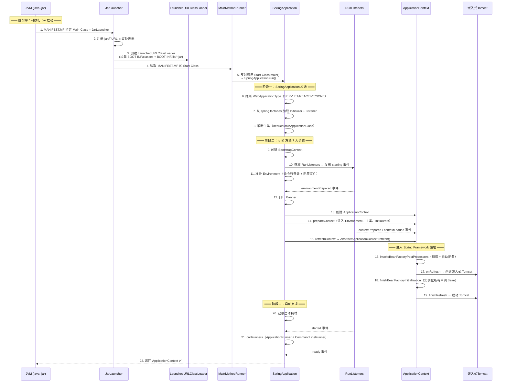
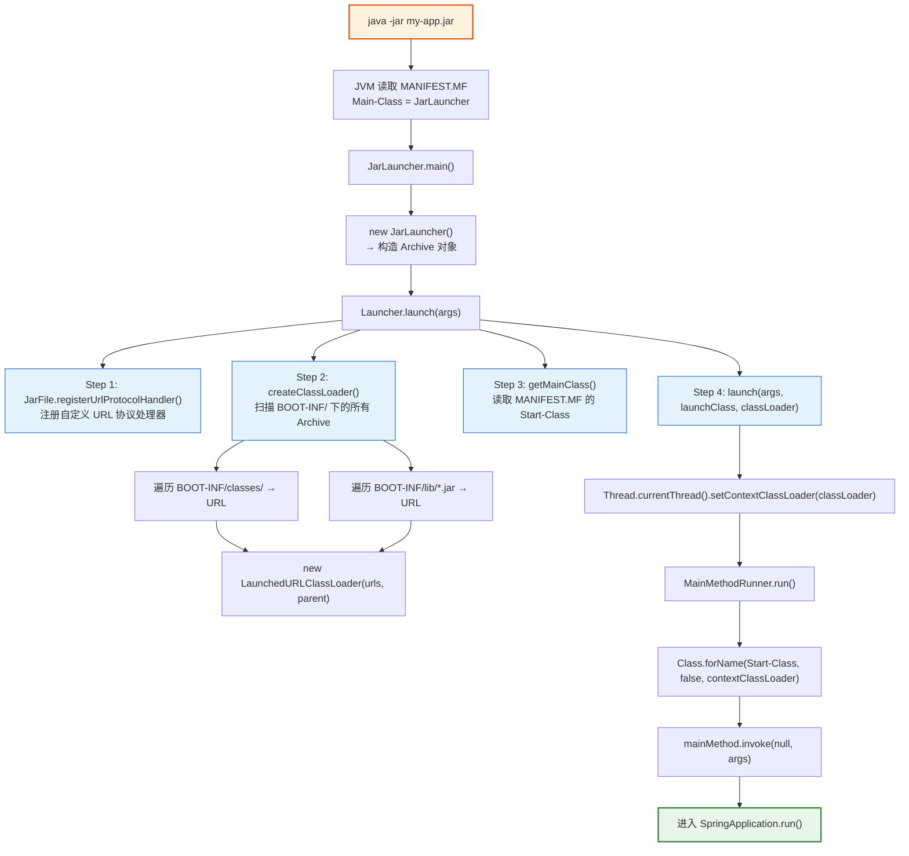
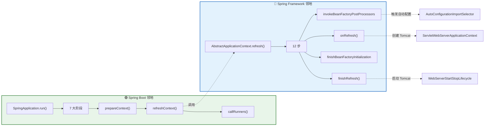

# SpringBoot 启动全流程深度分析

> 📌 基于 **Spring Boot 2.7.18** 源码
> 📁 Spring Boot 源码路径：`/data/workspace/spring-boot/`
> 📁 Spring Framework 源码路径：`/data/workspace/spring-framework/`
> 📁 调试项目路径：`/data/workspace/spring-framework/spring-boot-debug/`
> ⭐ 难度：⭐⭐⭐⭐⭐ | ⏱ 预估时间：2-3 天

---

## 一、总体概览 — Spring Boot 启动做了什么？

### 1.1 一句话总结

**Spring Boot 的启动 = `java -jar` 通过 `JarLauncher` 引导类加载 → 反射调用用户主类的 `main()` → `SpringApplication.run()` 执行 7 大阶段 → 最终创建并刷新 Spring IoC 容器 + 启动嵌入式 Tomcat。**

### 1.2 启动全流程时序图



### 1.3 三个核心问题

本文将回答以下三个核心问题：

| # | 问题 | 对应章节 |
|---|------|---------|
| 1 | `java -jar xxx.jar` 底层发生了什么？为什么需要 `JarLauncher`？ | 二、可执行 Jar 启动原理 |
| 2 | `SpringApplication.run()` 到底做了什么？7 大阶段分别完成什么任务？ | 三~四章 |
| 3 | 启动失败时为什么能给出友好提示？启动慢怎么优化？ | 五~七章 |

---

## 二、可执行 Jar 启动原理 — `java -jar` 背后发生了什么？ 🔴🎯

> 🎯 **面试高频**："说说 `java -jar` 启动 Spring Boot 应用的底层原理？为什么需要 `JarLauncher`？"

### 2.1 核心问题：标准 JDK 的 Jar 不支持嵌套 Jar

**为什么需要 Spring Boot 自己搞一套启动机制？**

标准的 `java -jar` 命令只会加载 **Jar 包根目录** 下的 `.class` 文件和 `MANIFEST.MF` 中 `Class-Path` 指定的外部 Jar。但 Spring Boot 的 Fat Jar（uber jar）把所有依赖的 Jar **嵌套打包** 在了 `BOOT-INF/lib/` 目录下：

```
my-app.jar                          ← Fat Jar 整体
├── META-INF/
│   └── MANIFEST.MF                  ← 指定 Main-Class 和 Start-Class
├── BOOT-INF/
│   ├── classes/                     ← 用户自己的 .class 文件
│   │   └── com/example/App.class
│   ├── lib/                         ← 所有依赖的 Jar（嵌套 Jar！）
│   │   ├── spring-boot-2.7.18.jar
│   │   ├── spring-core-5.3.31.jar
│   │   ├── tomcat-embed-core-9.0.83.jar
│   │   └── ... (100+ 个 jar)
│   └── classpath.idx               ← 类路径顺序索引文件
└── org/springframework/boot/loader/ ← Spring Boot Loader 自身的类（不在 BOOT-INF 下！）
    ├── JarLauncher.class
    ├── Launcher.class
    ├── LaunchedURLClassLoader.class
    ├── MainMethodRunner.class
    └── jar/
        ├── JarFile.class            ← 自定义 JarFile，支持嵌套 Jar
        └── Handler.class            ← 自定义 URL 协议处理器
```

**关键问题**：JDK 的 `java.util.jar.JarFile` **不支持** 从一个 Jar 文件内部再读取另一个 Jar 文件（即 Jar in Jar）。所以 `BOOT-INF/lib/spring-core-5.3.31.jar` 里的类，标准 JDK 是加载不了的。

**Spring Boot 的解决方案**：
1. 自定义 `org.springframework.boot.loader.jar.JarFile` —— 支持 Jar in Jar 读取
2. 自定义 `LaunchedURLClassLoader` —— 使用自定义 JarFile 的类加载器
3. `JarLauncher` 作为 JVM 真正的入口 —— 先建立好类加载环境，再反射调用用户的主类

### 2.2 MANIFEST.MF — 两个 Main-Class 的秘密

打开 Fat Jar 中的 `META-INF/MANIFEST.MF`，你会看到：

```properties
Manifest-Version: 1.0
Created-By: Maven/Gradle
Spring-Boot-Version: 2.7.18
Main-Class: org.springframework.boot.loader.JarLauncher     ← JVM 真正调用的入口
Start-Class: com.example.MyApplication                        ← 用户自己写的主类
Spring-Boot-Classes: BOOT-INF/classes/
Spring-Boot-Lib: BOOT-INF/lib/
Spring-Boot-Classpath-Index: BOOT-INF/classpath.idx
```

| 属性 | 值 | 作用 |
|------|-----|------|
| `Main-Class` | `JarLauncher` | JVM 的 `java -jar` 命令**实际调用**的类 |
| `Start-Class` | `com.example.MyApplication` | **用户自己**的主类（有 `@SpringBootApplication` 的那个） |
| `Spring-Boot-Classes` | `BOOT-INF/classes/` | 用户类的位置 |
| `Spring-Boot-Lib` | `BOOT-INF/lib/` | 依赖 Jar 的位置 |

> **⚠️ 质疑**：为什么 `JarLauncher` 自身的 `.class` 文件放在 Jar 根目录的 `org/springframework/boot/loader/` 下，而不是 `BOOT-INF/classes/` 下？
>
> **答案**：因为 JVM 只能加载 Jar 根目录下的类！`JarLauncher` 必须放在根目录才能被 JVM 直接加载，然后由它创建自定义类加载器去加载 `BOOT-INF/` 下的类。这是一个**鸡和蛋的问题** —— 先有 ClassLoader 才能加载类，先有 JarLauncher 才能创建 ClassLoader。

### 2.3 JarLauncher.main() → Launcher.launch() — 启动链路源码精读

#### JarLauncher — JVM 的真正入口

```java
// spring-boot-loader/src/main/java/org/springframework/boot/loader/JarLauncher.java

public class JarLauncher extends ExecutableArchiveLauncher {

    // ═══════════════════════════════════════════════════════════════════════
    // 嵌套归档过滤器：定义哪些目录/文件应该被加入 classpath
    // ═══════════════════════════════════════════════════════════════════════
    static final EntryFilter NESTED_ARCHIVE_ENTRY_FILTER = (entry) -> {
        if (entry.isDirectory()) {
            return entry.getName().equals("BOOT-INF/classes/");  // 用户类目录
        }
        return entry.getName().startsWith("BOOT-INF/lib/");       // 依赖 Jar 目录
    };

    // ═══════════════════════════════════════════════════════════════════════
    // JVM 入口：java -jar xxx.jar 最终调用的就是这个方法
    // ═══════════════════════════════════════════════════════════════════════
    public static void main(String[] args) throws Exception {
        new JarLauncher().launch(args);  // 委托给父类 Launcher.launch()
    }
}
```

**调用链**：`JVM → JarLauncher.main() → new JarLauncher() → launch(args)`

#### Launcher.launch() — 核心启动逻辑（4 步）

```java
// spring-boot-loader/src/main/java/org/springframework/boot/loader/Launcher.java

public abstract class Launcher {

    protected void launch(String[] args) throws Exception {

        // ═══════════════════════════════════════════════════════════════════
        // Step 1: 注册自定义 URL 协议处理器
        // ═══════════════════════════════════════════════════════════════════
        // 让 JVM 能识别 "jar:file:/xxx.jar!/BOOT-INF/lib/spring-core.jar!/" 这种嵌套 URL
        if (!isExploded()) {
            JarFile.registerUrlProtocolHandler();
        }

        // ═══════════════════════════════════════════════════════════════════
        // Step 2: 创建自定义类加载器 LaunchedURLClassLoader
        // ═══════════════════════════════════════════════════════════════════
        // getClassPathArchivesIterator() → 遍历 BOOT-INF/classes/ 和 BOOT-INF/lib/*.jar
        // 将它们的 URL 传入 LaunchedURLClassLoader
        ClassLoader classLoader = createClassLoader(getClassPathArchivesIterator());

        // ═══════════════════════════════════════════════════════════════════
        // Step 3: 获取用户主类名（从 MANIFEST.MF 的 Start-Class 读取）
        // ═══════════════════════════════════════════════════════════════════
        String jarMode = System.getProperty("jarmode");
        String launchClass = (jarMode != null && !jarMode.isEmpty())
                ? JAR_MODE_LAUNCHER    // 特殊模式（如 layertools）
                : getMainClass();      // → 读取 MANIFEST.MF 的 "Start-Class"

        // ═══════════════════════════════════════════════════════════════════
        // Step 4: 设置线程上下文类加载器 + 反射调用 Start-Class.main()
        // ═══════════════════════════════════════════════════════════════════
        launch(args, launchClass, classLoader);
    }

    protected void launch(String[] args, String launchClass, ClassLoader classLoader) throws Exception {
        // ⭐ 关键：设置当前线程的上下文类加载器为 LaunchedURLClassLoader
        // 后续所有通过 Thread.currentThread().getContextClassLoader() 获取的类加载器
        // 都是这个自定义的类加载器，能够加载 BOOT-INF/ 下的类
        Thread.currentThread().setContextClassLoader(classLoader);

        // 通过 MainMethodRunner 反射调用 Start-Class 的 main() 方法
        createMainMethodRunner(launchClass, args, classLoader).run();
    }

    protected ClassLoader createClassLoader(URL[] urls) throws Exception {
        // ⭐ 创建 LaunchedURLClassLoader，父类加载器是 JarLauncher 的类加载器（AppClassLoader）
        return new LaunchedURLClassLoader(isExploded(), getArchive(), urls, getClass().getClassLoader());
    }
}
```

#### ExecutableArchiveLauncher.getMainClass() — 读取 Start-Class

```java
// spring-boot-loader/src/main/java/org/springframework/boot/loader/ExecutableArchiveLauncher.java

public abstract class ExecutableArchiveLauncher extends Launcher {

    private static final String START_CLASS_ATTRIBUTE = "Start-Class";

    @Override
    protected String getMainClass() throws Exception {
        // 从 Jar 的 MANIFEST.MF 中读取 "Start-Class" 属性
        Manifest manifest = this.archive.getManifest();
        String mainClass = null;
        if (manifest != null) {
            mainClass = manifest.getMainAttributes().getValue(START_CLASS_ATTRIBUTE);
        }
        if (mainClass == null) {
            throw new IllegalStateException(
                "No 'Start-Class' manifest entry specified in " + this);
        }
        return mainClass;  // 如 "com.example.MyApplication"
    }
}
```

#### MainMethodRunner.run() — 反射调用用户主类

```java
// spring-boot-loader/src/main/java/org/springframework/boot/loader/MainMethodRunner.java

public class MainMethodRunner {

    private final String mainClassName;
    private final String[] args;

    public void run() throws Exception {
        // ⭐ 使用线程上下文类加载器加载用户主类
        // 此时 ContextClassLoader 已经是 LaunchedURLClassLoader
        // 它能从 BOOT-INF/classes/ 加载到 com.example.MyApplication
        Class<?> mainClass = Class.forName(this.mainClassName, false,
                Thread.currentThread().getContextClassLoader());

        // 获取 main 方法并反射调用
        Method mainMethod = mainClass.getDeclaredMethod("main", String[].class);
        mainMethod.setAccessible(true);
        mainMethod.invoke(null, new Object[] { this.args });
        // → 此处进入用户的 main() 方法
        // → 通常就是 SpringApplication.run(MyApplication.class, args)
    }
}
```

### 2.4 LaunchedURLClassLoader — 自定义类加载器

```java
// spring-boot-loader/src/main/java/org/springframework/boot/loader/LaunchedURLClassLoader.java

public class LaunchedURLClassLoader extends URLClassLoader {

    static {
        ClassLoader.registerAsParallelCapable();  // 注册为并行加载，提高多线程类加载性能
    }

    // 构造：接收所有 BOOT-INF 下的 URL，父类加载器为 AppClassLoader
    public LaunchedURLClassLoader(boolean exploded, Archive rootArchive,
            URL[] urls, ClassLoader parent) {
        super(urls, parent);       // 调用 URLClassLoader 构造，传入所有嵌套 Jar 的 URL
        this.exploded = exploded;
        this.rootArchive = rootArchive;
    }
}
```

**关键点**：`LaunchedURLClassLoader` 本质是一个 `URLClassLoader`，但它的 URLs 包含了所有 `BOOT-INF/lib/*.jar` 的嵌套 URL（如 `jar:file:/app.jar!/BOOT-INF/lib/spring-core.jar!/`）。Spring Boot 自定义的 `JarFile` 和 `Handler` 让 JVM 能够正确解析这些嵌套 URL。

### 2.5 三种 Launcher 对比

| 特性 | JarLauncher | WarLauncher | PropertiesLauncher |
|------|-------------|-------------|-------------------|
| **用途** | Jar 包部署 | War 包部署（`java -jar` 方式） | 自定义类路径场景 |
| **类目录** | `BOOT-INF/classes/` | `WEB-INF/classes/` | 可配置（`loader.path`） |
| **依赖目录** | `BOOT-INF/lib/` | `WEB-INF/lib/` + `WEB-INF/lib-provided/` | 可配置 |
| **MANIFEST Main-Class** | `JarLauncher` | `WarLauncher` | `PropertiesLauncher` |
| **主类来源** | `MANIFEST.MF` 的 `Start-Class` | `MANIFEST.MF` 的 `Start-Class` | `loader.main` 属性或 `Start-Class` |
| **灵活性** | 低（固定结构） | 低（固定结构） | 高（支持外部目录、自定义类加载器） |
| **典型场景** | 99% 的 Spring Boot 应用 | War 包独立运行 | 需要外挂 Jar 或 瘦 Jar 部署 |

```java
// WarLauncher.java — 和 JarLauncher 结构类似，只是路径前缀不同
public class WarLauncher extends ExecutableArchiveLauncher {
    @Override
    public boolean isNestedArchive(Archive.Entry entry) {
        if (entry.isDirectory()) {
            return entry.getName().equals("WEB-INF/classes/");
        }
        // ⭐ War 包多了一个 lib-provided 目录（对应 Maven scope=provided 的依赖）
        return entry.getName().startsWith("WEB-INF/lib/")
            || entry.getName().startsWith("WEB-INF/lib-provided/");
    }
}

// PropertiesLauncher.java — 最灵活，支持通过 loader.properties 或系统属性配置
public class PropertiesLauncher extends Launcher {
    public static final String MAIN = "loader.main";  // 自定义主类
    public static final String PATH = "loader.path";  // 自定义 classpath
    public static final String HOME = "loader.home";  // 自定义 home 目录
    // ... 从 loader.properties 文件或系统属性读取配置
}
```

### 2.6 可执行 Jar 启动流程全景图



### 2.7 面试回答模板

> **面试官**："说说 `java -jar` 启动 Spring Boot 应用的底层原理？"

**30 秒简答**：
`java -jar` 时，JVM 根据 `MANIFEST.MF` 的 `Main-Class` 找到 `JarLauncher` 作为真正的入口。`JarLauncher` 的职责是创建自定义的 `LaunchedURLClassLoader`，这个类加载器能够加载 `BOOT-INF/lib/` 下嵌套的 Jar 文件。然后通过反射调用 `MANIFEST.MF` 中 `Start-Class` 指定的用户主类的 `main()` 方法，进入 `SpringApplication.run()`。

**追问加分**：
之所以需要这套机制，是因为 JDK 标准的 `java.util.jar.JarFile` 不支持 Jar in Jar（嵌套 Jar）的读取。Spring Boot 自定义了 `org.springframework.boot.loader.jar.JarFile` 和对应的 URL 协议处理器来解决这个问题。


---

## 三、SpringApplication 构造阶段

> 从用户的 `main()` 方法进入后，首先执行 `new SpringApplication(primarySources)` 构造。

### 3.1 构造方法源码精读

```java
// SpringApplication.java 第261-275行

@SuppressWarnings({ "unchecked", "rawtypes" })
public SpringApplication(ResourceLoader resourceLoader, Class<?>... primarySources) {
    this.resourceLoader = resourceLoader;
    Assert.notNull(primarySources, "PrimarySources must not be null");

    // ═══════════════════════════════════════════════════════════════════════
    // Step 1: 记录主配置类（通常是标注了 @SpringBootApplication 的类）
    // ═══════════════════════════════════════════════════════════════════════
    this.primarySources = new LinkedHashSet<>(Arrays.asList(primarySources));

    // ═══════════════════════════════════════════════════════════════════════
    // Step 2: 推断 Web 应用类型 → SERVLET / REACTIVE / NONE
    // ═══════════════════════════════════════════════════════════════════════
    this.webApplicationType = WebApplicationType.deduceFromClasspath();

    // ═══════════════════════════════════════════════════════════════════════
    // Step 3: 从 spring.factories 加载 BootstrapRegistryInitializer
    // ═══════════════════════════════════════════════════════════════════════
    this.bootstrapRegistryInitializers = new ArrayList<>(
            getSpringFactoriesInstances(BootstrapRegistryInitializer.class));

    // ═══════════════════════════════════════════════════════════════════════
    // Step 4: 从 spring.factories 加载所有 ApplicationContextInitializer
    // ═══════════════════════════════════════════════════════════════════════
    setInitializers((Collection) getSpringFactoriesInstances(ApplicationContextInitializer.class));
    // 加载到的 Initializer（spring-boot 的 spring.factories）：
    // - ConfigurationWarningsApplicationContextInitializer  → 检查 @ComponentScan 配置警告
    // - ContextIdApplicationContextInitializer               → 设置 ApplicationContext ID
    // - DelegatingApplicationContextInitializer              → 委托给外部配置的 Initializer
    // - ServerPortInfoApplicationContextInitializer          → 注册端口信息到 Environment

    // ═══════════════════════════════════════════════════════════════════════
    // Step 5: 从 spring.factories 加载所有 ApplicationListener
    // ═══════════════════════════════════════════════════════════════════════
    setListeners((Collection) getSpringFactoriesInstances(ApplicationListener.class));
    // 加载到的 Listener（spring-boot 的 spring.factories）：
    // - ClearCachesApplicationListener           → 清理反射缓存
    // - ParentContextCloserApplicationListener   → 父容器关闭时关闭子容器
    // - FileEncodingApplicationListener          → 检查文件编码
    // - AnsiOutputApplicationListener            → ANSI 颜色输出
    // - DelegatingApplicationListener            → 委托给外部配置的 Listener
    // - LoggingApplicationListener               → ⭐ 初始化日志系统
    // - EnvironmentPostProcessorApplicationListener → ⭐ 加载配置文件的核心

    // ═══════════════════════════════════════════════════════════════════════
    // Step 6: 推断主类 — 通过异常栈回溯找到 main() 方法所在的类
    // ═══════════════════════════════════════════════════════════════════════
    this.mainApplicationClass = deduceMainApplicationClass();
}
```

### 3.2 推断 Web 应用类型 — WebApplicationType.deduceFromClasspath()

```java
// WebApplicationType.java

public enum WebApplicationType {
    NONE,       // 非 Web 应用，不启动嵌入式 Web 容器
    SERVLET,    // Servlet Web 应用（Spring MVC）
    REACTIVE;   // 响应式 Web 应用（Spring WebFlux）

    // 推断逻辑：通过类路径中是否存在特定类来判断
    static WebApplicationType deduceFromClasspath() {
        // 优先判断 REACTIVE：有 DispatcherHandler 但没有 DispatcherServlet 和 Jersey
        if (ClassUtils.isPresent(WEBFLUX_INDICATOR_CLASS, null)
                && !ClassUtils.isPresent(WEBMVC_INDICATOR_CLASS, null)
                && !ClassUtils.isPresent(JERSEY_INDICATOR_CLASS, null)) {
            return WebApplicationType.REACTIVE;
        }
        // 然后判断 NONE：如果缺少 Servlet 相关类
        for (String className : SERVLET_INDICATOR_CLASSES) {
            if (!ClassUtils.isPresent(className, null)) {
                return WebApplicationType.NONE;
            }
        }
        // 默认 SERVLET（大多数 Spring Boot Web 应用走这里）
        return WebApplicationType.SERVLET;
    }
}
```

> **⚠️ 质疑/发现**：注意判断顺序！如果 classpath 中**同时**存在 `DispatcherServlet`（spring-webmvc）和 `DispatcherHandler`（spring-webflux），那么 `deduceFromClasspath()` 会返回 **SERVLET** 而不是 REACTIVE。这意味着如果你同时引入了 `spring-boot-starter-web` 和 `spring-boot-starter-webflux`，默认走的是 **Spring MVC**，而不是 WebFlux。这是一个很容易踩的坑！

### 3.3 从 spring.factories 加载实例 — SPI 机制

```java
// SpringApplication.java

private <T> Collection<T> getSpringFactoriesInstances(Class<T> type,
        Class<?>[] parameterTypes, Object... args) {
    ClassLoader classLoader = getClassLoader();

    // ⭐ 核心：通过 SpringFactoriesLoader 从所有 Jar 的
    //    META-INF/spring.factories 中加载指定类型的全限定类名
    Set<String> names = new LinkedHashSet<>(
            SpringFactoriesLoader.loadFactoryNames(type, classLoader));

    // 实例化这些类
    List<T> instances = createSpringFactoriesInstances(type, parameterTypes,
            classLoader, args, names);

    // 按 @Order / Ordered 排序
    AnnotationAwareOrderComparator.sort(instances);
    return instances;
}
```

**spring.factories 中注册的核心组件**：

**① `spring-boot.jar` 中的 spring.factories**：

```properties
# spring-boot/src/main/resources/META-INF/spring.factories

# Run Listeners（只有一个！）
org.springframework.boot.SpringApplicationRunListener=\
org.springframework.boot.context.event.EventPublishingRunListener

# Application Context Initializers（5个）
org.springframework.context.ApplicationContextInitializer=\
org.springframework.boot.context.ConfigurationWarningsApplicationContextInitializer,\
org.springframework.boot.context.ContextIdApplicationContextInitializer,\
org.springframework.boot.context.config.DelegatingApplicationContextInitializer,\
org.springframework.boot.rsocket.context.RSocketPortInfoApplicationContextInitializer,\
org.springframework.boot.web.context.ServerPortInfoApplicationContextInitializer

# Application Listeners（7个）
org.springframework.context.ApplicationListener=\
org.springframework.boot.ClearCachesApplicationListener,\
org.springframework.boot.builder.ParentContextCloserApplicationListener,\
org.springframework.boot.context.FileEncodingApplicationListener,\
org.springframework.boot.context.config.AnsiOutputApplicationListener,\
org.springframework.boot.context.config.DelegatingApplicationListener,\
org.springframework.boot.context.logging.LoggingApplicationListener,\
org.springframework.boot.env.EnvironmentPostProcessorApplicationListener
```

**② `spring-boot-autoconfigure.jar` 中的 spring.factories**（容易遗漏！）：

```properties
# spring-boot-autoconfigure/src/main/resources/META-INF/spring.factories

# Initializers（额外 2 个）
org.springframework.context.ApplicationContextInitializer=\
org.springframework.boot.autoconfigure.SharedMetadataReaderFactoryContextInitializer,\
org.springframework.boot.autoconfigure.logging.ConditionEvaluationReportLoggingListener

# Application Listeners（额外 1 个）
org.springframework.context.ApplicationListener=\
org.springframework.boot.autoconfigure.BackgroundPreinitializer
```

> **⚠️ 运行验证数据（来自 `StartupFlowVerifier`）**：实际运行时 `SpringFactoriesLoader.loadFactoryNames()` 会合并**所有 Jar 中的 spring.factories**，因此实际加载到的是 **7 个 Initializer**（5+2）和 **8 个 Listener**（7+1）。这一点在面试中回答时要注意，不能只说 spring-boot.jar 的。

### 3.4 推断主类 — deduceMainApplicationClass()

```java
// SpringApplication.java

private Class<?> deduceMainApplicationClass() {
    try {
        // ⭐ 巧妙：通过主动创建异常来获取当前调用栈
        StackTraceElement[] stackTrace = new RuntimeException().getStackTrace();
        for (StackTraceElement stackTraceElement : stackTrace) {
            // 往上回溯调用栈，找到方法名为 "main" 的栈帧
            if ("main".equals(stackTraceElement.getMethodName())) {
                return Class.forName(stackTraceElement.getClassName());
            }
        }
    }
    catch (ClassNotFoundException ex) {
        // Swallow and continue
    }
    return null;
}
```

> **⚠️ 发现**：`deduceMainApplicationClass()` 的推断方式非常巧妙但也很"hack" —— 它通过创建一个 `RuntimeException` 来获取调用栈，然后往上遍历找到 `main()` 方法所在的类。这种方式有一个潜在问题：如果用户在非 `main()` 方法中调用 `SpringApplication.run()`（比如在测试中），则推断出来的主类可能不是预期的。不过在正常使用场景下，这完全没问题。

### 3.5 构造阶段核心数据结构

构造完成后，`SpringApplication` 对象的关键字段状态：

```java
// SpringApplication 构造完成后的核心字段状态

SpringApplication {
    primarySources = {MyApplication.class}           // 用户主类
    webApplicationType = SERVLET                     // Web 类型（大多数情况）
    bootstrapRegistryInitializers = []               // 通常为空
    initializers = [                                  // 7 个初始化器（spring-boot.jar 5 个 + autoconfigure.jar 2 个）
        SharedMetadataReaderFactoryContextInitializer,  // ← autoconfigure.jar 贡献
        ConditionEvaluationReportLoggingListener,       // ← autoconfigure.jar 贡献
        ConfigurationWarningsApplicationContextInitializer,
        ContextIdApplicationContextInitializer,
        DelegatingApplicationContextInitializer,
        RSocketPortInfoApplicationContextInitializer,
        ServerPortInfoApplicationContextInitializer
    ]
    listeners = [                                     // 8 个监听器（spring-boot.jar 7 个 + autoconfigure.jar 1 个）
        BackgroundPreinitializer,                     // ← autoconfigure.jar 贡献，⭐ 后台预初始化
        ClearCachesApplicationListener,
        ParentContextCloserApplicationListener,
        FileEncodingApplicationListener,
        AnsiOutputApplicationListener,
        DelegatingApplicationListener,
        LoggingApplicationListener,                   // ⭐ 日志系统初始化
        EnvironmentPostProcessorApplicationListener   // ⭐ 配置文件加载
    ]
    mainApplicationClass = MyApplication.class        // 推断出的主类
    bannerMode = CONSOLE                              // 默认在控制台打印 Banner
    logStartupInfo = true                             // 默认记录启动信息
    lazyInitialization = false                        // 默认非懒加载
    applicationStartup = ApplicationStartup.DEFAULT   // 默认不追踪启动步骤
}
```

---

## 四、run() 方法主流程 — 7 大阶段逐行分析

> 这是整个启动流程的**核心方法**。理解了 `run()` 方法，就掌握了 Spring Boot 启动的全局流程。

### 4.1 run() 方法完整源码（带详细注解）

```java
// SpringApplication.java 第294-336行

public ConfigurableApplicationContext run(String... args) {
    // 记录启动开始时间
    long startTime = System.nanoTime();

    // ═══════════════════════════════════════════════════════════════════════
    // 阶段一：创建 BootstrapContext（引导上下文）
    // ═══════════════════════════════════════════════════════════════════════
    DefaultBootstrapContext bootstrapContext = createBootstrapContext();
    ConfigurableApplicationContext context = null;

    // 设置 java.awt.headless 系统属性（服务器环境通常没有显示器）
    configureHeadlessProperty();

    // ═══════════════════════════════════════════════════════════════════════
    // 阶段二：获取 SpringApplicationRunListeners 并发布 starting 事件
    // ═══════════════════════════════════════════════════════════════════════
    SpringApplicationRunListeners listeners = getRunListeners(args);
    listeners.starting(bootstrapContext, this.mainApplicationClass);
    // → 此时 BackgroundPreinitializer 开始后台预初始化（另一个线程）

    try {
        // ═══════════════════════════════════════════════════════════════════
        // 阶段三：准备 Environment
        // ═══════════════════════════════════════════════════════════════════
        ApplicationArguments applicationArguments = new DefaultApplicationArguments(args);
        ConfigurableEnvironment environment = prepareEnvironment(
                listeners, bootstrapContext, applicationArguments);
        // → 解析命令行参数
        // → 触发 environmentPrepared 事件 → 加载 application.yml/properties
        // → 绑定 spring.main.* 属性到 SpringApplication

        configureIgnoreBeanInfo(environment);

        // ═══════════════════════════════════════════════════════════════════
        // 阶段四：打印 Banner
        // ═══════════════════════════════════════════════════════════════════
        Banner printedBanner = printBanner(environment);

        // ═══════════════════════════════════════════════════════════════════
        // 阶段五：创建 ApplicationContext
        // ═══════════════════════════════════════════════════════════════════
        context = createApplicationContext();
        // SERVLET → AnnotationConfigServletWebServerApplicationContext
        // REACTIVE → AnnotationConfigReactiveWebServerApplicationContext
        // NONE → AnnotationConfigApplicationContext
        context.setApplicationStartup(this.applicationStartup);

        // ═══════════════════════════════════════════════════════════════════
        // 阶段六：prepareContext — 准备上下文
        // ═══════════════════════════════════════════════════════════════════
        prepareContext(bootstrapContext, context, environment, listeners,
                applicationArguments, printedBanner);
        // → 注入 Environment 到上下文
        // → 执行所有 ApplicationContextInitializer
        // → 注册主类的 BeanDefinition
        // → 触发 contextPrepared / contextLoaded 事件

        // ═══════════════════════════════════════════════════════════════════
        // 阶段七：refreshContext — 刷新上下文（进入 Spring Framework 核心）
        // ═══════════════════════════════════════════════════════════════════
        refreshContext(context);
        // → AbstractApplicationContext.refresh()
        // → 扫描 + 自动配置 + 创建嵌入式 Tomcat + 实例化所有 Bean

        afterRefresh(context, applicationArguments); // 空方法，留给子类扩展

        // 记录启动耗时
        Duration timeTakenToStartup = Duration.ofNanos(System.nanoTime() - startTime);
        if (this.logStartupInfo) {
            new StartupInfoLogger(this.mainApplicationClass)
                    .logStarted(getApplicationLog(), timeTakenToStartup);
        }

        // 发布 started 事件
        listeners.started(context, timeTakenToStartup);

        // ═══════════════════════════════════════════════════════════════════
        // 阶段八：执行 ApplicationRunner 和 CommandLineRunner
        // ═══════════════════════════════════════════════════════════════════
        callRunners(context, applicationArguments);

    } catch (Throwable ex) {
        // ⭐ 异常处理：交给 FailureAnalyzer 分析（详见第五章）
        handleRunFailure(context, ex, listeners);
        throw new IllegalStateException(ex);
    }

    try {
        Duration timeTakenToReady = Duration.ofNanos(System.nanoTime() - startTime);
        // 发布 ready 事件（最终事件）
        listeners.ready(context, timeTakenToReady);
    } catch (Throwable ex) {
        handleRunFailure(context, ex, null);
        throw new IllegalStateException(ex);
    }

    return context;  // ✅ 返回已启动的 ApplicationContext
}
```

### 4.2 阶段一：创建 BootstrapContext

```java
// SpringApplication.java

private DefaultBootstrapContext createBootstrapContext() {
    DefaultBootstrapContext bootstrapContext = new DefaultBootstrapContext();
    // 执行所有 BootstrapRegistryInitializer（通常为空）
    this.bootstrapRegistryInitializers.forEach(
            (initializer) -> initializer.initialize(bootstrapContext));
    return bootstrapContext;
}
```

`DefaultBootstrapContext` 是 Spring Boot 2.4+ 引入的**引导上下文**，它在 `ApplicationContext` 创建之前提供了一个轻量级的注册中心。主要用途：

| 用途 | 说明 |
|------|------|
| **提前注册组件** | 在 ApplicationContext 创建之前就需要使用的组件可以注册到这里 |
| **配置中心集成** | Nacos/Apollo 等配置中心可以在这个阶段注册自己的配置源 |
| **关闭回调** | 当 ApplicationContext 准备好后，BootstrapContext 会触发关闭事件 |

> **⚠️ 实际使用中**：大多数普通应用不需要关心 BootstrapContext，它主要服务于 Spring Cloud 等需要在极早期介入的框架。

### 4.3 阶段二：获取 RunListeners 并发布 starting 事件

```java
// SpringApplication.java

private SpringApplicationRunListeners getRunListeners(String[] args) {
    Class<?>[] types = new Class<?>[] { SpringApplication.class, String[].class };
    return new SpringApplicationRunListeners(logger,
            // 从 spring.factories 加载 SpringApplicationRunListener
            // 实际只加载到一个：EventPublishingRunListener
            getSpringFactoriesInstances(SpringApplicationRunListener.class, types, this, args),
            this.applicationStartup);
}
```

`SpringApplicationRunListeners` 是一个**包装类**，内部持有一个 `List<SpringApplicationRunListener>`。实际上 Spring Boot 只注册了**一个**实现：`EventPublishingRunListener`。

```java
// SpringApplicationRunListeners.java — 7 个生命周期方法

class SpringApplicationRunListeners {

    void starting(...)            // 1️⃣ 启动开始
    void environmentPrepared(...) // 2️⃣ Environment 准备完成
    void contextPrepared(...)     // 3️⃣ Context 创建后、加载前
    void contextLoaded(...)       // 4️⃣ Context 加载完成（Source 注入后）
    void started(...)             // 5️⃣ Context 刷新完成
    void ready(...)               // 6️⃣ Runner 执行完成，应用完全就绪
    void failed(...)              // 7️⃣ 启动失败
}
```

### 4.4 阶段三：准备 Environment

```java
// SpringApplication.java

private ConfigurableEnvironment prepareEnvironment(
        SpringApplicationRunListeners listeners,
        DefaultBootstrapContext bootstrapContext,
        ApplicationArguments applicationArguments) {

    // Step 1: 创建 Environment 对象
    // SERVLET → ApplicationServletEnvironment（包含 servletConfigInitParams、servletContextInitParams）
    ConfigurableEnvironment environment = getOrCreateEnvironment();

    // Step 2: 配置 Environment（添加命令行参数 PropertySource）
    configureEnvironment(environment, applicationArguments.getSourceArgs());

    // Step 3: 附加 ConfigurationPropertySources（统一属性名格式）
    ConfigurationPropertySources.attach(environment);

    // Step 4: ⭐ 发布 environmentPrepared 事件
    // 这是触发配置文件加载的关键！
    // EnvironmentPostProcessorApplicationListener 监听此事件
    // → 调用 ConfigDataEnvironmentPostProcessor
    // → 加载 application.yml / application.properties
    listeners.environmentPrepared(bootstrapContext, environment);

    // Step 5: 将 defaultProperties 移到最低优先级
    DefaultPropertiesPropertySource.moveToEnd(environment);

    // Step 6: 将 Environment 中的 spring.main.* 属性绑定到 SpringApplication
    // 例如 spring.main.lazy-initialization=true → this.lazyInitialization = true
    bindToSpringApplication(environment);

    // Step 7: 重新附加 ConfigurationPropertySources
    ConfigurationPropertySources.attach(environment);
    return environment;
}
```

> **⭐ 关键点**：配置文件（`application.yml`）的加载不在 `prepareEnvironment()` 方法内部直接发生，而是通过**事件驱动**间接触发的。`listeners.environmentPrepared()` 发布事件 → `EnvironmentPostProcessorApplicationListener` 接收 → 调用 `ConfigDataEnvironmentPostProcessor` → 加载配置文件。这是典型的**观察者模式**在 Spring Boot 中的应用。

### 4.5 阶段四：打印 Banner

```java
// SpringApplication.java

private Banner printBanner(ConfigurableEnvironment environment) {
    if (this.bannerMode == Banner.Mode.OFF) {
        return null;  // 如果配置了 spring.main.banner-mode=off，不打印
    }
    ResourceLoader resourceLoader = (this.resourceLoader != null)
            ? this.resourceLoader : new DefaultResourceLoader(null);
    SpringApplicationBannerPrinter bannerPrinter =
            new SpringApplicationBannerPrinter(resourceLoader, this.banner);
    if (this.bannerMode == Mode.LOG) {
        return bannerPrinter.print(environment, this.mainApplicationClass, logger);
    }
    return bannerPrinter.print(environment, this.mainApplicationClass, System.out);
}
```

Spring Boot 会按以下顺序查找自定义 Banner：
1. `spring.banner.image.location` 指定的图片文件
2. `spring.banner.location` 指定的文本文件
3. classpath 下的 `banner.gif`/`banner.jpg`/`banner.png`
4. classpath 下的 `banner.txt`
5. 默认的 Spring Boot ASCII Art Banner

### 4.6 阶段五：创建 ApplicationContext

```java
// SpringApplication.java

protected ConfigurableApplicationContext createApplicationContext() {
    return this.applicationContextFactory.create(this.webApplicationType);
}
```

根据 `WebApplicationType` 创建不同的上下文：

| WebApplicationType | ApplicationContext 实现 | 特点 |
|---------------------|------------------------|------|
| `SERVLET` | `AnnotationConfigServletWebServerApplicationContext` | 支持嵌入式 Servlet 容器 |
| `REACTIVE` | `AnnotationConfigReactiveWebServerApplicationContext` | 支持嵌入式 Reactive 容器 |
| `NONE` | `AnnotationConfigApplicationContext` | 普通 Spring 容器 |

`AnnotationConfigServletWebServerApplicationContext` 继承了 `ServletWebServerApplicationContext`，它重写了 `onRefresh()` 方法来创建嵌入式 Tomcat —— 这就是 Spring Boot 能内嵌 Tomcat 的关键（详见第 ⑥ 篇文档）。

### 4.7 阶段六：prepareContext — 准备上下文

```java
// SpringApplication.java

private void prepareContext(DefaultBootstrapContext bootstrapContext,
        ConfigurableApplicationContext context,
        ConfigurableEnvironment environment,
        SpringApplicationRunListeners listeners,
        ApplicationArguments applicationArguments, Banner printedBanner) {

    // Step 1: 将 Environment 注入上下文
    context.setEnvironment(environment);

    // Step 2: 后处理上下文（注册 BeanNameGenerator、设置 ConversionService）
    postProcessApplicationContext(context);

    // Step 3: ⭐ 执行所有 ApplicationContextInitializer
    applyInitializers(context);
    // → ConfigurationWarningsApplicationContextInitializer → 检查扫描包配置
    // → ContextIdApplicationContextInitializer → 设置 Context ID
    // → ServerPortInfoApplicationContextInitializer → 注册端口监听器

    // Step 4: 发布 contextPrepared 事件
    listeners.contextPrepared(context);

    // Step 5: 关闭 BootstrapContext（发布 BootstrapContextClosedEvent）
    bootstrapContext.close(context);

    if (this.logStartupInfo) {
        logStartupInfo(context.getParent() == null);
        logStartupProfileInfo(context);
    }

    // Step 6: 注册特殊的单例 Bean
    ConfigurableListableBeanFactory beanFactory = context.getBeanFactory();
    beanFactory.registerSingleton("springApplicationArguments", applicationArguments);
    if (printedBanner != null) {
        beanFactory.registerSingleton("springBootBanner", printedBanner);
    }

    // Step 7: 配置循环依赖和 Bean 定义覆盖
    if (beanFactory instanceof AbstractAutowireCapableBeanFactory) {
        ((AbstractAutowireCapableBeanFactory) beanFactory)
                .setAllowCircularReferences(this.allowCircularReferences);
        if (beanFactory instanceof DefaultListableBeanFactory) {
            ((DefaultListableBeanFactory) beanFactory)
                    .setAllowBeanDefinitionOverriding(this.allowBeanDefinitionOverriding);
        }
    }

    // Step 8: 如果启用懒加载，添加 LazyInitializationBeanFactoryPostProcessor
    if (this.lazyInitialization) {
        context.addBeanFactoryPostProcessor(new LazyInitializationBeanFactoryPostProcessor());
    }

    // Step 9: 添加 PropertySourceOrderingBeanFactoryPostProcessor
    context.addBeanFactoryPostProcessor(
            new PropertySourceOrderingBeanFactoryPostProcessor(context));

    // Step 10: ⭐ 加载所有 Source（将主类注册为 BeanDefinition）
    Set<Object> sources = getAllSources();
    Assert.notEmpty(sources, "Sources must not be empty");
    load(context, sources.toArray(new Object[0]));
    // → BeanDefinitionLoader.load(MyApplication.class)
    // → 将 @SpringBootApplication 标注的主类注册为 BeanDefinition
    // → 后续 refresh() 时 ConfigurationClassPostProcessor 会解析它的注解

    // Step 11: 发布 contextLoaded 事件
    listeners.contextLoaded(context);
}
```

> **⚠️ 关键细节**：`load()` 方法将用户的主类（如 `MyApplication.class`）注册为一个 `BeanDefinition`。这个 BeanDefinition 上的 `@SpringBootApplication` 注解会在 `refresh()` 阶段被 `ConfigurationClassPostProcessor` 解析，从而触发 `@ComponentScan`（扫描用户代码）和 `@EnableAutoConfiguration`（加载自动配置）。可以说，**主类就是整个自动配置机制的起点**。

### 4.8 阶段七：refreshContext — 进入 Spring Framework 核心

```java
// SpringApplication.java

private void refreshContext(ConfigurableApplicationContext context) {
    if (this.registerShutdownHook) {
        // 注册 JVM ShutdownHook，确保优雅关闭
        shutdownHook.registerApplicationContext(context);
    }
    // ⭐ 调用 Spring Framework 的核心方法
    refresh(context);
}

protected void refresh(ConfigurableApplicationContext applicationContext) {
    applicationContext.refresh();
    // → AbstractApplicationContext.refresh()
    // 这是 Spring Framework 的核心，不属于 Spring Boot 的范畴
    // 详见 Spring Framework 循环依赖、AOP、事务等系列文档
}
```

`AbstractApplicationContext.refresh()` 是 Spring Framework 的核心方法（12 步），其中与 Spring Boot 最相关的步骤：

| refresh() 步骤 | 作用 | 与 Spring Boot 的关系 |
|----------------|------|----------------------|
| `invokeBeanFactoryPostProcessors()` | 执行 BeanFactoryPostProcessor | `ConfigurationClassPostProcessor` 解析 `@SpringBootApplication` → 触发 `@ComponentScan` + `@EnableAutoConfiguration` |
| `onRefresh()` | 模板方法，子类扩展 | `ServletWebServerApplicationContext.onRefresh()` → **创建嵌入式 Tomcat** |
| `finishBeanFactoryInitialization()` | 实例化所有非懒加载单例 Bean | 包括所有自动配置的 Bean |
| `finishRefresh()` | 发布 ContextRefreshedEvent | `WebServerStartStopLifecycle.start()` → **启动 Tomcat** |

### 4.9 阶段八：callRunners — 执行 Runner

```java
// SpringApplication.java

private void callRunners(ApplicationContext context, ApplicationArguments args) {
    // 获取所有 Runner（ApplicationRunner + CommandLineRunner），按 @Order 排序
    context.getBeanProvider(Runner.class).orderedStream().forEach((runner) -> {
        if (runner instanceof ApplicationRunner) {
            callRunner((ApplicationRunner) runner, args);
        }
        if (runner instanceof CommandLineRunner) {
            callRunner((CommandLineRunner) runner, args);
        }
    });
}
```

`ApplicationRunner` 和 `CommandLineRunner` 的区别：

| 特性 | ApplicationRunner | CommandLineRunner |
|------|-------------------|-------------------|
| 参数类型 | `ApplicationArguments`（封装后的参数，支持选项解析） | `String... args`（原始命令行参数） |
| 适用场景 | 需要解析 `--key=value` 格式参数 | 简单的启动后执行 |
| 排序 | 支持 `@Order` | 支持 `@Order` |
| 执行时机 | `refresh()` 完成后、`ready` 事件发布前 | 同左 |

---

## 五、异常处理与 FailureAnalyzer 启动失败诊断

> **核心问题**：Spring Boot 启动失败时，为什么控制台能打印出那段友好的 `APPLICATION FAILED TO START` 报告？这背后的 FailureAnalyzer 机制是怎么工作的？

### 5.1 handleRunFailure() — 异常处理总入口

回顾 `run()` 方法的 try-catch 结构：

```java
// SpringApplication.java — run() 方法（精简版，聚焦异常处理）

public ConfigurableApplicationContext run(String... args) {
    // ...
    try {
        // 阶段一~八：创建 BootstrapContext、获取 Listeners、准备 Environment、
        //           创建 Context、refresh、callRunners...
    }
    catch (Throwable ex) {
        // ⭐ 核心：所有启动异常都在这里兜底
        handleRunFailure(context, ex, listeners);
        throw new IllegalStateException(ex);
    }
    try {
        // ready 事件
        listeners.ready(context, timeTakenToReady);
    }
    catch (Throwable ex) {
        // ⚠ 注意：ready 阶段的异常，listeners 传 null（因为 listeners 自身可能就是问题）
        handleRunFailure(context, ex, null);
        throw new IllegalStateException(ex);
    }
    return context;
}
```

> 🔍 **关键细节**：两个 catch 块调用 `handleRunFailure()` 时，第二个传的 `listeners` 是 `null`。这是因为 ready 阶段异常可能是 listeners 本身引发的，如果再调 `listeners.failed()` 可能导致死循环或掩盖原始异常。

下面深入 `handleRunFailure()` 的完整流程：

```java
// SpringApplication.java

private void handleRunFailure(ConfigurableApplicationContext context, Throwable exception,
        SpringApplicationRunListeners listeners) {
    try {
        try {
            // ① 处理退出码 — 从异常中提取 ExitCode
            handleExitCode(context, exception);
            // ② 发布 ApplicationFailedEvent — 通知所有监听器
            if (listeners != null) {
                listeners.failed(context, exception);
            }
        }
        finally {
            // ③ 报告异常 — 通过 FailureAnalyzers 生成友好报告
            reportFailure(getExceptionReporters(context), exception);
            // ④ 关闭 Context — 释放资源
            if (context != null) {
                context.close();
                // ⑤ 注销 ShutdownHook 中的失败 Context
                shutdownHook.deregisterFailedApplicationContext(context);
            }
        }
    }
    catch (Exception ex) {
        logger.warn("Unable to close ApplicationContext", ex);
    }
    // ⑥ 重新抛出原始异常
    ReflectionUtils.rethrowRuntimeException(exception);
}
```

异常处理**五步流程图**：

```
启动异常发生
    │
    ▼
┌─────────────────────────────────────────┐
│ ① handleExitCode(context, exception)    │ ← 从异常链中提取退出码
│    - ExitCodeExceptionMapper（Bean级映射）│    发布 ExitCodeEvent
│    - ExitCodeGenerator（异常自身实现）    │    注册到 SpringBootExceptionHandler
└─────────────────────────────────────────┘
    │
    ▼
┌─────────────────────────────────────────┐
│ ② listeners.failed(context, exception)  │ ← 发布 ApplicationFailedEvent
│    - EventPublishingRunListener 广播     │    通知 LoggingApplicationListener 等
└─────────────────────────────────────────┘
    │
    ▼
┌─────────────────────────────────────────┐
│ ③ reportFailure(reporters, exception)   │ ← ⭐ 核心：FailureAnalyzer 诊断
│    - 遍历 SpringBootExceptionReporter    │    生成友好的错误报告
│    - 即 FailureAnalyzers.reportException│    打印 "APPLICATION FAILED TO START"
└─────────────────────────────────────────┘
    │
    ▼
┌─────────────────────────────────────────┐
│ ④ context.close()                       │ ← 关闭 ApplicationContext
│ ⑤ shutdownHook.deregister...()          │    释放资源，注销 ShutdownHook
└─────────────────────────────────────────┘
    │
    ▼
┌─────────────────────────────────────────┐
│ ⑥ ReflectionUtils.rethrowRuntime...()   │ ← 重新抛出，让 JVM 感知到启动失败
└─────────────────────────────────────────┘
```

### 5.2 退出码处理 — handleExitCode()

```java
// SpringApplication.java

private void handleExitCode(ConfigurableApplicationContext context, Throwable exception) {
    // 从异常链中提取退出码
    int exitCode = getExitCodeFromException(context, exception);
    if (exitCode != 0) {
        // 发布 ExitCodeEvent，让监听器感知退出码
        if (context != null) {
            context.publishEvent(new ExitCodeEvent(context, exitCode));
        }
        // 注册到 SpringBootExceptionHandler（JVM UncaughtExceptionHandler）
        // 确保 JVM 最终以此退出码退出
        SpringBootExceptionHandler handler = getSpringBootExceptionHandler();
        if (handler != null) {
            handler.registerExitCode(exitCode);
        }
    }
}

private int getExitCodeFromException(ConfigurableApplicationContext context, Throwable exception) {
    // 优先级一：通过 ExitCodeExceptionMapper Bean 映射
    int exitCode = getExitCodeFromMappedException(context, exception);
    if (exitCode == 0) {
        // 优先级二：异常本身实现了 ExitCodeGenerator 接口
        exitCode = getExitCodeFromExitCodeGeneratorException(exception);
    }
    return exitCode;
}
```

退出码的**两种来源**：

| 来源 | 原理 | 示例 |
|------|------|------|
| `ExitCodeExceptionMapper` Bean | 容器中注册的 Bean，将异常映射为退出码 | `@Bean ExitCodeExceptionMapper mapper() { return ex -> 42; }` |
| 异常实现 `ExitCodeGenerator` | 异常类本身声明退出码 | `class MyException extends RuntimeException implements ExitCodeGenerator { int getExitCode() { return 1; } }` |

> 🔍 **注意**：`getExitCodeFromMappedException()` 需要 `context != null && context.isActive()`，即如果 Context 还没创建或已关闭，只能通过异常本身的 `ExitCodeGenerator` 接口获取退出码。

### 5.3 ApplicationFailedEvent — 启动失败事件

```java
// SpringApplicationRunListeners.java

void failed(ConfigurableApplicationContext context, Throwable exception) {
    doWithListeners("spring.boot.application.failed",
            (listener) -> callFailedListener(listener, context, exception), (step) -> {
                step.tag("exception", exception.getClass().toString());
                step.tag("message", exception.getMessage());
            });
}

private void callFailedListener(SpringApplicationRunListener listener,
        ConfigurableApplicationContext context, Throwable exception) {
    try {
        listener.failed(context, exception);
    }
    catch (Throwable ex) {
        // ⭐ 关键：listener.failed() 本身抛异常时，只打印警告日志，不影响后续处理
        // 这确保了即使某个 Listener 有 bug，也不会影响 FailureAnalyzer 的执行
        if (exception == null) {
            ReflectionUtils.rethrowRuntimeException(ex);
        }
        if (this.log.isDebugEnabled()) {
            this.log.error("Error handling failed", ex);
        }
        else {
            String message = ex.getMessage();
            message = (message != null) ? message : "no error message";
            this.log.warn("Error handling failed (" + message + ")");
        }
    }
}
```

`EventPublishingRunListener` 收到 `failed()` 调用后，会广播 `ApplicationFailedEvent`。主要的内置监听器响应：

| 监听器 | 响应 `ApplicationFailedEvent` 时的行为 |
|--------|---------------------------------------|
| `LoggingApplicationListener` | 执行日志系统清理 |
| `ConditionEvaluationReportLoggingListener` | 打印条件评估报告（如果 `--debug` 开启） |

### 5.4 FailureAnalyzer 机制全链路 — 从异常到友好报告

这是本章的**核心**。当你看到控制台打印的这段信息时：

```
***************************
APPLICATION FAILED TO START
***************************

Description:

Web server failed to start. Port 8080 was already in use.

Action:

Identify and stop the process that's listening on port 8080
or configure this application to listen on another port.
```

背后经历了以下完整链路：

#### 5.4.1 SpringBootExceptionReporter SPI 注册

在 `spring.factories` 中：

```properties
# spring-boot.jar — META-INF/spring.factories

# Error Reporters
org.springframework.boot.SpringBootExceptionReporter=\
org.springframework.boot.diagnostics.FailureAnalyzers
```

`SpringBootExceptionReporter` 是一个 SPI 接口，`FailureAnalyzers` 是它唯一的实现：

```java
// SpringBootExceptionReporter.java — 函数式接口

@FunctionalInterface
public interface SpringBootExceptionReporter {
    /**
     * 报告启动失败。
     * 返回 true 表示已处理（会调用 registerLoggedException 避免重复打印）；
     * 返回 false 表示交给默认处理（直接 logger.error）。
     */
    boolean reportException(Throwable failure);
}
```

#### 5.4.2 FailureAnalyzers — 串联 Analyzer 和 Reporter 的核心

```java
// FailureAnalyzers.java（包级私有类）

final class FailureAnalyzers implements SpringBootExceptionReporter {

    private final ClassLoader classLoader;
    private final List<FailureAnalyzer> analyzers;

    // 构造时从 spring.factories 加载所有 FailureAnalyzer
    FailureAnalyzers(ConfigurableApplicationContext context) {
        this(context, SpringFactoriesLoader.loadFactoryNames(
                FailureAnalyzer.class, getClassLoader(context)));
    }

    // 实例化所有 FailureAnalyzer，并注入 BeanFactory/Environment
    private List<FailureAnalyzer> loadFailureAnalyzers(List<String> classNames,
            ConfigurableApplicationContext context) {
        Instantiator<FailureAnalyzer> instantiator = new Instantiator<>(
                FailureAnalyzer.class,
                (availableParameters) -> {
                    if (context != null) {
                        // ⭐ 支持构造器注入 BeanFactory 和 Environment
                        availableParameters.add(BeanFactory.class, context.getBeanFactory());
                        availableParameters.add(Environment.class, context.getEnvironment());
                    }
                },
                new LoggingInstantiationFailureHandler()); // 实例化失败只 trace 日志，不中断
        List<FailureAnalyzer> analyzers = instantiator.instantiate(this.classLoader, classNames);
        return handleAwareAnalyzers(analyzers, context);
    }

    @Override
    public boolean reportException(Throwable failure) {
        // 第一步：遍历所有 Analyzer，找到第一个能分析此异常的
        FailureAnalysis analysis = analyze(failure, this.analyzers);
        // 第二步：通过 Reporter 输出分析结果
        return report(analysis, this.classLoader);
    }

    private FailureAnalysis analyze(Throwable failure, List<FailureAnalyzer> analyzers) {
        for (FailureAnalyzer analyzer : analyzers) {
            try {
                FailureAnalysis analysis = analyzer.analyze(failure);
                if (analysis != null) {
                    return analysis; // ⭐ 第一个匹配的就返回，后续 Analyzer 不再执行
                }
            }
            catch (Throwable ex) {
                // Analyzer 自身出错只打 trace 日志，不影响后续 Analyzer
                logger.trace(LogMessage.format("FailureAnalyzer %s failed", analyzer), ex);
            }
        }
        return null; // 没有 Analyzer 能处理
    }

    private boolean report(FailureAnalysis analysis, ClassLoader classLoader) {
        // 从 spring.factories 加载 FailureAnalysisReporter
        List<FailureAnalysisReporter> reporters = SpringFactoriesLoader.loadFactories(
                FailureAnalysisReporter.class, classLoader);
        if (analysis == null || reporters.isEmpty()) {
            return false; // 返回 false → 走默认的 logger.error("Application run failed", failure)
        }
        for (FailureAnalysisReporter reporter : reporters) {
            reporter.report(analysis);
        }
        return true;
    }
}
```

#### 5.4.3 FailureAnalysis — 诊断结果模型

```java
// FailureAnalysis.java

public class FailureAnalysis {

    private final String description;  // 问题描述（"Web server failed to start. Port 8080 was already in use."）
    private final String action;       // 建议操作（"Identify and stop the process that's listening on port 8080..."）
    private final Throwable cause;     // 原始异常

    public FailureAnalysis(String description, String action, Throwable cause) {
        this.description = description;
        this.action = action;
        this.cause = cause;
    }
    // getter 省略
}
```

#### 5.4.4 FailureAnalyzer 接口与 AbstractFailureAnalyzer 基类

```java
// FailureAnalyzer.java — 函数式接口

@FunctionalInterface
public interface FailureAnalyzer {
    /**
     * 分析失败异常，返回 FailureAnalysis 或 null（表示无法处理）。
     */
    FailureAnalysis analyze(Throwable failure);
}
```

```java
// AbstractFailureAnalyzer.java — 大多数 FailureAnalyzer 的基类

public abstract class AbstractFailureAnalyzer<T extends Throwable> implements FailureAnalyzer {

    @Override
    public FailureAnalysis analyze(Throwable failure) {
        // ⭐ 核心：从异常链中查找泛型参数指定的异常类型
        T cause = findCause(failure, getCauseType());
        // 找到了才调用子类的 analyze()，否则返回 null（表示"不是我负责的异常"）
        return (cause != null) ? analyze(failure, cause) : null;
    }

    // 子类只需实现这个方法：已确认异常类型匹配，直接构造 FailureAnalysis
    protected abstract FailureAnalysis analyze(Throwable rootFailure, T cause);

    // 通过泛型解析获取子类声明的异常类型
    @SuppressWarnings("unchecked")
    protected Class<? extends T> getCauseType() {
        return (Class<? extends T>) ResolvableType
                .forClass(AbstractFailureAnalyzer.class, getClass())
                .resolveGeneric();
    }

    // 沿异常链向上查找指定类型的异常
    @SuppressWarnings("unchecked")
    protected final <E extends Throwable> E findCause(Throwable failure, Class<E> type) {
        while (failure != null) {
            if (type.isInstance(failure)) {
                return (E) failure;
            }
            failure = failure.getCause();
        }
        return null;
    }
}
```

> 🔍 **设计精妙之处**：`AbstractFailureAnalyzer` 的泛型 `<T extends Throwable>` 实现了**异常类型路由**。20+ 个 FailureAnalyzer 子类各自声明自己关心的异常类型，遍历时通过 `findCause()` 在异常链中查找，**只有匹配的 Analyzer 才会执行分析**。这是典型的**责任链模式**。

#### 5.4.5 LoggingFailureAnalysisReporter — 输出那段经典报告

```java
// LoggingFailureAnalysisReporter.java

public final class LoggingFailureAnalysisReporter implements FailureAnalysisReporter {

    private static final Log logger = LogFactory.getLog(LoggingFailureAnalysisReporter.class);

    @Override
    public void report(FailureAnalysis failureAnalysis) {
        // DEBUG 级别打印原始异常堆栈
        if (logger.isDebugEnabled()) {
            logger.debug("Application failed to start due to an exception",
                    failureAnalysis.getCause());
        }
        // ERROR 级别打印友好报告
        if (logger.isErrorEnabled()) {
            logger.error(buildMessage(failureAnalysis));
        }
    }

    private String buildMessage(FailureAnalysis failureAnalysis) {
        StringBuilder builder = new StringBuilder();
        builder.append(String.format("%n%n"));
        builder.append(String.format("***************************%n"));
        builder.append(String.format("APPLICATION FAILED TO START%n"));  // ⭐ 这就是那段经典报告的来源！
        builder.append(String.format("***************************%n%n"));
        builder.append(String.format("Description:%n%n"));
        builder.append(String.format("%s%n", failureAnalysis.getDescription()));
        if (StringUtils.hasText(failureAnalysis.getAction())) {
            builder.append(String.format("%nAction:%n%n"));
            builder.append(String.format("%s%n", failureAnalysis.getAction()));
        }
        return builder.toString();
    }
}
```

#### 5.4.6 reportFailure() — FailureAnalyzer 与默认日志的切换

```java
// SpringApplication.java

private void reportFailure(Collection<SpringBootExceptionReporter> exceptionReporters,
        Throwable failure) {
    try {
        for (SpringBootExceptionReporter reporter : exceptionReporters) {
            if (reporter.reportException(failure)) {
                // ⭐ 报告成功 → 注册为"已记录的异常"
                // 这会抑制 SpringBootExceptionHandler 在 JVM 退出时重复打印堆栈
                registerLoggedException(failure);
                return;
            }
        }
    }
    catch (Throwable ex) {
        // Reporter 自身出错，继续默认处理
    }
    // 如果没有 Reporter 能处理（或 FailureAnalyzer 全部返回 null），走默认的 error 日志
    if (logger.isErrorEnabled()) {
        logger.error("Application run failed", failure);
        registerLoggedException(failure);
    }
}
```

> 🔍 **`registerLoggedException()` 的作用**：`SpringBootExceptionHandler` 是一个 `UncaughtExceptionHandler`，注册在 main 线程上。当 `run()` 方法抛出异常后，JVM 会调用 `UncaughtExceptionHandler.uncaughtException()`。如果不调用 `registerLoggedException()`，异常会被打印两次（一次由 FailureAnalyzer，一次由 JVM 默认的 UncaughtExceptionHandler）。注册后，`SpringBootExceptionHandler` 知道这个异常已经被处理过，就不会再转发给父 Handler 打印了。

### 5.5 完整流程时序图

```
run() 抛出异常
    │
    ▼
handleRunFailure(context, ex, listeners)
    │
    ├──→ handleExitCode(context, ex)          ← 提取退出码
    │        └──→ ExitCodeExceptionMapper / ExitCodeGenerator
    │
    ├──→ listeners.failed(context, ex)         ← 广播 ApplicationFailedEvent
    │        └──→ EventPublishingRunListener.failed()
    │                └──→ LoggingApplicationListener 等收到事件
    │
    ├──→ getExceptionReporters(context)        ← 从 spring.factories 加载 SpringBootExceptionReporter
    │        └──→ 实际就是 FailureAnalyzers 实例
    │
    ├──→ reportFailure(reporters, ex)          ← 执行 FailureAnalyzers.reportException()
    │        │
    │        ├──→ FailureAnalyzers.analyze()   ← 遍历 20+ 个 FailureAnalyzer
    │        │        │
    │        │        ├─ PortInUseFailureAnalyzer.analyze()     → null（不是端口冲突）
    │        │        ├─ BeanCurrentlyInCreationFailureAnalyzer → null
    │        │        ├─ NoUniqueBeanDefinitionFailureAnalyzer  → null
    │        │        ├─ ...
    │        │        └─ 某个 Analyzer.analyze()                → ⭐ 返回 FailureAnalysis
    │        │
    │        └──→ FailureAnalyzers.report()    ← 通过 LoggingFailureAnalysisReporter 输出
    │                 └──→ 打印 "APPLICATION FAILED TO START" + Description + Action
    │
    ├──→ context.close()                       ← 关闭 ApplicationContext
    │
    └──→ shutdownHook.deregisterFailedApplicationContext()
```

### 5.6 内置 FailureAnalyzer 列表

Spring Boot 2.7.18 在 `spring-boot.jar` 的 `spring.factories` 中注册了 **20 个** FailureAnalyzer：

| FailureAnalyzer | 匹配的异常类型 | 典型场景 |
|-----------------|--------------|---------|
| `PortInUseFailureAnalyzer` | `PortInUseException` | 端口 8080 已被占用 |
| `ConnectorStartFailureAnalyzer` | `ConnectorStartFailedException` | Tomcat Connector 启动失败 |
| `NoUniqueBeanDefinitionFailureAnalyzer` | `NoUniqueBeanDefinitionException` | 存在多个同类型 Bean，注入时无法选择 |
| `BeanCurrentlyInCreationFailureAnalyzer` | `BeanCurrentlyInCreationException` | 循环依赖（非单例或构造器注入循环） |
| `BeanDefinitionOverrideFailureAnalyzer` | `BeanDefinitionOverrideException` | Bean 定义覆盖（`spring.main.allow-bean-definition-overriding=false`） |
| `BeanNotOfRequiredTypeFailureAnalyzer` | `BeanNotOfRequiredTypeException` | 注入的 Bean 类型不匹配（通常与 AOP 代理有关） |
| `BindFailureAnalyzer` | `BindException`（Spring Boot） | `@ConfigurationProperties` 绑定失败 |
| `BindValidationFailureAnalyzer` | `BindValidationException` | `@ConfigurationProperties` 验证失败（JSR-303） |
| `UnboundConfigurationPropertyFailureAnalyzer` | `UnboundConfigurationPropertiesException` | 配置文件中有未绑定的属性 |
| `MutuallyExclusiveConfigurationPropertiesFailureAnalyzer` | `MutuallyExclusiveConfigurationPropertiesException` | 互斥的配置属性同时存在 |
| `InvalidConfigurationPropertyNameFailureAnalyzer` | `InvalidConfigurationPropertyNameException` | 配置属性名不合法 |
| `InvalidConfigurationPropertyValueFailureAnalyzer` | `InvalidConfigurationPropertyValueException` | 配置属性值不合法 |
| `NoSuchMethodFailureAnalyzer` | `NoSuchMethodError` | 依赖版本冲突导致方法找不到 |
| `ValidationExceptionFailureAnalyzer` | `ValidationException` | JSR-303 验证器初始化失败 |
| `PatternParseFailureAnalyzer` | `PatternParseException` | Spring MVC 路径模式解析失败 |
| `ConfigDataNotFoundFailureAnalyzer` | `ConfigDataNotFoundException` | `spring.config.import` 指定的配置文件找不到 |
| `IncompatibleConfigurationFailureAnalyzer` | `IncompatibleConfigurationException` | 配置不兼容 |
| `NotConstructorBoundInjectionFailureAnalyzer` | （注入失败 + 构造器绑定相关） | `@ConstructorBinding` 使用不当 |
| `MissingWebServerFactoryBeanFailureAnalyzer` | `MissingWebServerFactoryBeanException` | 找不到 Web 容器工厂 Bean |
| `LiquibaseChangelogMissingFailureAnalyzer` | `LiquibaseException` | Liquibase changelog 文件缺失 |

> ⚠ **注意**：`spring-boot-autoconfigure.jar` 的 `spring.factories` 中还注册了 **11 个** FailureAnalyzer（验证器运行确认），包括 `NoSuchBeanDefinitionFailureAnalyzer`（分析 Bean 找不到的原因，**告诉你哪些自动配置类匹配但条件不满足**，日常开发最有价值）、`DataSourceBeanCreationFailureAnalyzer`（数据源创建失败）、`HikariDriverConfigurationFailureAnalyzer`（HikariCP 驱动配置错误）、`RedisUrlSyntaxFailureAnalyzer`（Redis URL 语法错误）等。因此 Spring Boot 2.7.18 中 FailureAnalyzer **总计 31 个**（spring-boot 20 个 + spring-boot-autoconfigure 11 个）。

### 5.7 PortInUseFailureAnalyzer 源码精读 — 典型实现

这是最简单但最经典的 FailureAnalyzer 实现，完整展示了**泛型异常类型路由**的工作方式：

```java
// PortInUseFailureAnalyzer.java（spring-boot 模块）

class PortInUseFailureAnalyzer extends AbstractFailureAnalyzer<PortInUseException> {
    //                                                       ↑ 泛型声明：只处理 PortInUseException

    @Override
    protected FailureAnalysis analyze(Throwable rootFailure, PortInUseException cause) {
        // 执行到这里时，cause 已经是确认匹配的 PortInUseException 实例
        return new FailureAnalysis(
                // description：问题描述
                "Web server failed to start. Port " + cause.getPort() + " was already in use.",
                // action：建议操作
                "Identify and stop the process that's listening on port " + cause.getPort()
                        + " or configure this application to listen on another port.",
                // cause：原始异常
                cause);
    }
}
```

**执行时序**：

```
1. FailureAnalyzers 遍历到 PortInUseFailureAnalyzer
2. 调用 analyzer.analyze(failure)
3. AbstractFailureAnalyzer.analyze() 执行：
   a. getCauseType() → 通过 ResolvableType 解析泛型 → PortInUseException.class
   b. findCause(failure, PortInUseException.class) → 沿异常链查找
   c. 找到了 → 调用子类的 analyze(rootFailure, cause)
   d. 没找到 → 返回 null（交给下一个 Analyzer）
4. 返回 FailureAnalysis("Web server failed to start...", "Identify and stop...", cause)
5. LoggingFailureAnalysisReporter.report() 打印友好报告
```

### 5.8 NoSuchBeanDefinitionFailureAnalyzer — 高级实现

这是最复杂的 FailureAnalyzer 实现（约 360 行），能够：

- 找到缺失的 Bean 类型
- 查询 `ConditionEvaluationReport`，告诉你哪些自动配置**本来可以提供这个 Bean，但条件不满足**
- 输出注入点信息和注解信息

```java
// NoSuchBeanDefinitionFailureAnalyzer.java（spring-boot-autoconfigure 模块）

class NoSuchBeanDefinitionFailureAnalyzer
        extends AbstractInjectionFailureAnalyzer<NoSuchBeanDefinitionException> {

    private final ConfigurableListableBeanFactory beanFactory;
    private final ConditionEvaluationReport report; // ⭐ 条件评估报告

    // 通过构造器注入 BeanFactory（FailureAnalyzers 的 Instantiator 支持）
    NoSuchBeanDefinitionFailureAnalyzer(BeanFactory beanFactory) {
        this.beanFactory = (ConfigurableListableBeanFactory) beanFactory;
        // ⭐ 在构造时获取 ConditionEvaluationReport
        // 因为 Context 关闭后就拿不到了
        this.report = ConditionEvaluationReport.get(this.beanFactory);
    }

    @Override
    protected FailureAnalysis analyze(Throwable rootFailure,
            NoSuchBeanDefinitionException cause, String description) {
        // 1. 查找自动配置类中 @Bean 方法的匹配结果
        List<AutoConfigurationResult> autoConfigurationResults =
                getAutoConfigurationResults(cause);
        // 2. 查找用户配置中的匹配结果
        List<UserConfigurationResult> userConfigurationResults =
                getUserConfigurationResults(cause);
        // 3. 构建详细的错误消息
        StringBuilder message = new StringBuilder();
        message.append(String.format("%s required %s that could not be found.%n",
                description, getBeanDescription(cause)));
        // 如果有候选但条件不满足，给出详细信息
        if (!autoConfigurationResults.isEmpty()) {
            message.append("The following candidates were found but could not be injected:\n");
            for (AutoConfigurationResult result : autoConfigurationResults) {
                message.append("\t- " + result + "\n");
                // 输出类似：Bean method 'dataSource' in 'DataSourceAutoConfiguration' not loaded because
                //          @ConditionalOnClass did not find required class 'javax.sql.DataSource'
            }
        }
        return new FailureAnalysis(message.toString(),
                "Consider defining a bean of type '" + ... + "' in your configuration.", cause);
    }
}
```

> 🔍 **亮点**：这个 Analyzer 通过 `ConditionEvaluationReport` 回查**条件评估历史**，能准确告诉你"这个 Bean 本来可以由 XxxAutoConfiguration 提供，但因为 @ConditionalOnClass / @ConditionalOnProperty 等条件不满足所以没有加载"。这是一般框架做不到的**精准诊断**。

### 5.9 自定义 FailureAnalyzer 实现

实现一个自定义 FailureAnalyzer 只需三步：

**第一步**：创建 FailureAnalyzer 实现类

```java
// 示例：自定义 FailureAnalyzer，处理自定义业务异常

package com.debug.boot.analyzer;

import org.springframework.boot.diagnostics.AbstractFailureAnalyzer;
import org.springframework.boot.diagnostics.FailureAnalysis;

public class CustomBusinessFailureAnalyzer
        extends AbstractFailureAnalyzer<CustomBusinessException> {

    @Override
    protected FailureAnalysis analyze(Throwable rootFailure, CustomBusinessException cause) {
        return new FailureAnalysis(
                "应用启动失败：" + cause.getMessage(),
                "请检查业务配置是否正确，确保数据库连接正常。",
                cause);
    }
}
```

**第二步**：在 `META-INF/spring.factories` 中注册

```properties
org.springframework.boot.diagnostics.FailureAnalyzer=\
com.debug.boot.analyzer.CustomBusinessFailureAnalyzer
```

**第三步**（可选）：如果需要访问 `BeanFactory` 或 `Environment`，添加构造器参数

```java
public class CustomBusinessFailureAnalyzer
        extends AbstractFailureAnalyzer<CustomBusinessException> {

    private final Environment environment;

    // ⭐ FailureAnalyzers 的 Instantiator 会自动注入
    public CustomBusinessFailureAnalyzer(Environment environment) {
        this.environment = environment;
    }

    @Override
    protected FailureAnalysis analyze(Throwable rootFailure, CustomBusinessException cause) {
        String activeProfile = String.join(",",
                this.environment.getActiveProfiles());
        return new FailureAnalysis(
                "应用启动失败（当前 Profile: " + activeProfile + "）：" + cause.getMessage(),
                "请检查 " + activeProfile + " 环境的配置。",
                cause);
    }
}
```

### 5.10 设计模式总结

| 设计模式 | 在 FailureAnalyzer 中的体现 |
|---------|--------------------------|
| **责任链模式** | 20+ 个 FailureAnalyzer 按顺序遍历，每个检查自己是否能处理，不能就传给下一个 |
| **策略模式** | 每个 FailureAnalyzer 是一种异常处理策略，通过泛型参数声明自己的策略适用范围 |
| **模板方法模式** | `AbstractFailureAnalyzer` 定义了 `analyze()` 的骨架（findCause → 匹配 → 分析），子类只需实现具体分析逻辑 |
| **SPI 机制** | 通过 `spring.factories` 加载，完全可插拔 |
| **观察者模式** | `ApplicationFailedEvent` 事件发布，Listener 响应 |

### 5.11 面试高频问题

**Q1: Spring Boot 启动失败时，控制台那个 "APPLICATION FAILED TO START" 报告是怎么来的？**

> 简答：Spring Boot 通过 `FailureAnalyzer` 机制实现。`run()` 方法 catch 到异常后，调用 `handleRunFailure()` → `reportFailure()` → `FailureAnalyzers.reportException()`。`FailureAnalyzers` 遍历 `spring.factories` 中注册的 20+ 个 `FailureAnalyzer`，每个 Analyzer 检查异常链中是否包含自己关心的异常类型（通过 `AbstractFailureAnalyzer` 的泛型参数 + `findCause()` 实现）。第一个匹配的 Analyzer 返回 `FailureAnalysis`（包含 description 和 action），然后由 `LoggingFailureAnalysisReporter` 格式化输出。

**Q2: FailureAnalyzer 是怎么做到"只处理特定异常"的？**

> 简答：通过 `AbstractFailureAnalyzer<T extends Throwable>` 的泛型参数实现异常类型路由。`analyze()` 方法先用 `ResolvableType` 解析子类声明的泛型参数得到目标异常类型，再用 `findCause()` 沿异常链（`getCause()` 链）查找。只有找到匹配的异常实例才调用子类的 `analyze(rootFailure, cause)` 方法。这是**责任链 + 模板方法**的组合。

**Q3: 如何自定义 FailureAnalyzer？**

> 简答：三步 — ① 继承 `AbstractFailureAnalyzer<你的异常类型>`，实现 `analyze(rootFailure, cause)` 返回 `FailureAnalysis`；② 在 `META-INF/spring.factories` 中注册；③（可选）构造器注入 `BeanFactory` / `Environment`。

---

## 六、callRunners 执行机制与退出码

> **核心问题**：`ApplicationRunner` 和 `CommandLineRunner` 什么时候执行？如何控制顺序？它们和 `@PostConstruct` 有什么区别？`SpringApplication.exit()` 的退出码机制又是什么？

### 6.1 callRunners() 源码精读

回顾 `run()` 方法中 callRunners 的位置 —— 它在 `refresh()` 完成、`started` 事件发布之后，`ready` 事件发布之前执行：

```java
// SpringApplication.java — run() 方法（精简版，聚焦 callRunners）

public ConfigurableApplicationContext run(String... args) {
    // ... 阶段一~七 省略 ...

    // ⭐ refresh 完成后，所有 Bean 已实例化
    refreshContext(context);
    afterRefresh(context, applicationArguments);  // 空方法，预留扩展

    // 记录启动耗时，打印 "Started MyApplication in X.XX seconds"
    Duration timeTakenToStartup = Duration.ofNanos(System.nanoTime() - startTime);
    if (this.logStartupInfo) {
        new StartupInfoLogger(this.mainApplicationClass)
                .logStarted(getApplicationLog(), timeTakenToStartup);
    }

    // 发布 started 事件
    listeners.started(context, timeTakenToStartup);

    // ⭐ 阶段八：执行所有 Runner
    callRunners(context, applicationArguments);

    // ... 发布 ready 事件 ...
    return context;
}
```

> 🔍 **关键时序**：callRunners 在 `listeners.started()` 之后、`listeners.ready()` 之前。这意味着：
> - ✅ 此时所有 Bean **已完成初始化**（包括 `@PostConstruct`、`InitializingBean.afterPropertiesSet()`）
> - ✅ 嵌入式 Tomcat **已启动**，可以接收 HTTP 请求
> - ❌ `ApplicationReadyEvent` 尚未发布，所以如果你的 Runner 逻辑耗时较长，健康检查可能还是 "未就绪" 状态

下面是 `callRunners()` 的完整源码：

```java
// SpringApplication.java

private void callRunners(ApplicationContext context, ApplicationArguments args) {
    // ⭐ 核心：通过 BeanProvider 获取所有 Runner 类型的 Bean
    // Runner 是 ApplicationRunner 和 CommandLineRunner 的公共父接口（标记接口）
    context.getBeanProvider(Runner.class).orderedStream().forEach((runner) -> {
        if (runner instanceof ApplicationRunner) {
            callRunner((ApplicationRunner) runner, args);
        }
        if (runner instanceof CommandLineRunner) {
            callRunner((CommandLineRunner) runner, args);
        }
    });
}

private void callRunner(ApplicationRunner runner, ApplicationArguments args) {
    try {
        (runner).run(args);
    }
    catch (Exception ex) {
        throw new IllegalStateException("Failed to execute ApplicationRunner", ex);
    }
}

private void callRunner(CommandLineRunner runner, ApplicationArguments args) {
    try {
        (runner).run(args.getSourceArgs());  // ⭐ 注意：传入原始 String[] 参数
    }
    catch (Exception ex) {
        throw new IllegalStateException("Failed to execute CommandLineRunner", ex);
    }
}
```

### 6.2 Runner 接口体系

```java
// Runner.java — 标记接口（包级私有，用户不可直接使用）
interface Runner {
}

// ApplicationRunner.java — 传入 ApplicationArguments
@FunctionalInterface
public interface ApplicationRunner extends Runner {
    void run(ApplicationArguments args) throws Exception;
}

// CommandLineRunner.java — 传入原始 String[]
@FunctionalInterface
public interface CommandLineRunner extends Runner {
    void run(String... args) throws Exception;
}
```

> 🔍 **设计细节**：`Runner` 是一个**包级私有的标记接口**（package-private），用户代码无法直接 `implements Runner`。它唯一的作用是让 `callRunners()` 能够通过 `context.getBeanProvider(Runner.class)` 一次性获取 `ApplicationRunner` 和 `CommandLineRunner` 两种 Bean，并用 `.orderedStream()` 统一排序。这是一个很精巧的设计 —— **避免了两次分别获取再合并排序的复杂逻辑**。

### 6.3 排序机制 — `orderedStream()` 的工作原理

```java
// callRunners 中的关键调用
context.getBeanProvider(Runner.class).orderedStream().forEach(...)
```

`orderedStream()` 会按以下优先级排序：

| 优先级 | 排序方式 | 示例 |
|:------:|---------|------|
| 1 | `@Order` 注解 | `@Order(1)` |
| 2 | 实现 `Ordered` 接口 | `getOrder()` 返回值 |
| 3 | `@Priority` 注解 | `@Priority(1)` |
| 4 | 无排序注解 | 默认 `Ordered.LOWEST_PRECEDENCE`（`Integer.MAX_VALUE`） |

> ⚠️ **关键发现**：`ApplicationRunner` 和 `CommandLineRunner` 是**混合排序**的！它们不是先执行所有 `ApplicationRunner` 再执行所有 `CommandLineRunner`，而是统一按 `@Order` 值排序。例如：
>
> ```java
> @Order(1) ApplicationRunnerA  ← 先执行
> @Order(2) CommandLineRunnerB  ← 再执行
> @Order(3) ApplicationRunnerC  ← 最后执行
> ```
>
> 这一点很多文章和教程**说错了**，务必注意。

### 6.4 ApplicationRunner vs CommandLineRunner 深度对比

| 特性 | `ApplicationRunner` | `CommandLineRunner` |
|------|---------------------|---------------------|
| **参数类型** | `ApplicationArguments` | `String... args` |
| **参数解析** | ✅ 自动解析 `--key=value` 格式为选项参数 | ❌ 原始字符串数组，需要自己解析 |
| **获取选项名** | `args.getOptionNames()` → `{"server.port", "debug"}` | 不支持 |
| **获取选项值** | `args.getOptionValues("server.port")` → `["8080"]` | 不支持 |
| **获取非选项参数** | `args.getNonOptionArgs()` → `["arg1", "arg2"]` | 不支持（混在一起） |
| **函数式接口** | ✅ 可用 Lambda | ✅ 可用 Lambda |
| **排序** | `@Order` / `Ordered` | `@Order` / `Ordered` |
| **引入版本** | 1.3.0 | 1.0.0 |
| **推荐度** | ⭐⭐⭐⭐⭐（更灵活） | ⭐⭐⭐（简单场景足够） |

**`ApplicationArguments` 接口详解**：

```java
// ApplicationArguments.java

public interface ApplicationArguments {

    // 获取原始命令行参数
    String[] getSourceArgs();
    // 例：["--server.port=8080", "--debug", "arg1", "arg2"]

    // 获取所有选项名（-- 开头的参数的 key）
    Set<String> getOptionNames();
    // 例：{"server.port", "debug"}

    // 是否包含某个选项
    boolean containsOption(String name);
    // containsOption("debug") → true

    // 获取某个选项的值列表
    List<String> getOptionValues(String name);
    // getOptionValues("server.port") → ["8080"]
    // getOptionValues("debug") → []  ← 存在但无值

    // 获取所有非选项参数
    List<String> getNonOptionArgs();
    // 例：["arg1", "arg2"]
}
```

**`DefaultApplicationArguments` 底层**：基于 Spring Framework 的 `SimpleCommandLinePropertySource` 解析，支持 `--key=value` 格式。

### 6.5 Runner 异常处理

注意 `callRunner()` 的异常处理：

```java
private void callRunner(ApplicationRunner runner, ApplicationArguments args) {
    try {
        (runner).run(args);
    }
    catch (Exception ex) {
        // ⭐ Runner 抛出异常会被包装成 IllegalStateException
        // 然后在 run() 方法的 catch 块中被 handleRunFailure() 处理
        throw new IllegalStateException("Failed to execute ApplicationRunner", ex);
    }
}
```

> ⚠️ **关键**：如果某个 Runner 抛出异常，**后续的 Runner 不会执行**（因为是 `forEach` 遍历，异常会中断迭代），并且会触发 `handleRunFailure()` → FailureAnalyzer 机制（详见第五章）。`ready` 事件也不会发布，转而发布 `failed` 事件。

### 6.6 Runner vs `@PostConstruct` vs `InitializingBean` — 执行时机对比

```
refresh() 过程中：
  ├── 实例化 Bean
  ├── 属性注入
  ├── BeanPostProcessor.postProcessBeforeInitialization()
  ├── @PostConstruct                          ← ⭐ 在 refresh() 期间
  ├── InitializingBean.afterPropertiesSet()   ← ⭐ 在 refresh() 期间
  ├── BeanPostProcessor.postProcessAfterInitialization()
  └── SmartInitializingSingleton.afterSingletonsInstantiated() ← 所有单例创建后

refresh() 完成后：
  ├── 嵌入式 Tomcat 启动
  ├── Started 日志 + started 事件
  ├── ApplicationRunner / CommandLineRunner   ← ⭐ 在 refresh() 之后
  └── ready 事件
```

| 对比维度 | `@PostConstruct` | `InitializingBean` | `ApplicationRunner` / `CommandLineRunner` |
|---------|------------------|--------------------|------------------------------------------|
| **执行时机** | Bean 初始化阶段（refresh 中） | Bean 初始化阶段（refresh 中） | refresh 完成后 |
| **容器状态** | 其他 Bean 可能还没初始化 | 其他 Bean 可能还没初始化 | **所有 Bean 已就绪** |
| **Tomcat 状态** | ❌ 未启动 | ❌ 未启动 | ✅ 已启动 |
| **可用场景** | 当前 Bean 自身初始化逻辑 | 当前 Bean 自身初始化逻辑 | **应用级别的启动后任务** |
| **命令行参数** | ❌ 不可用 | ❌ 不可用 | ✅ 可用 |
| **异常影响** | 导致 Bean 创建失败 | 导致 Bean 创建失败 | 触发 FailureAnalyzer |
| **排序** | 不支持跨 Bean 排序 | 不支持跨 Bean 排序 | ✅ 支持 `@Order` 跨 Bean 排序 |

### 6.7 ExitCodeGenerator 退出码机制

Spring Boot 提供了优雅的退出码机制，用于通知 JVM（或外部进程管理器）应用退出的原因。

#### 6.7.1 ExitCodeGenerator 接口

```java
// ExitCodeGenerator.java — 函数式接口

@FunctionalInterface
public interface ExitCodeGenerator {
    /**
     * 返回应用退出码。
     * 0 = 成功，非 0 = 异常退出。
     */
    int getExitCode();
}
```

#### 6.7.2 SpringApplication.exit() — 主动退出

```java
// SpringApplication.java

public static int exit(ApplicationContext context, ExitCodeGenerator... exitCodeGenerators) {
    Assert.notNull(context, "Context must not be null");
    int exitCode = 0;
    try {
        try {
            // Step 1: 收集所有 ExitCodeGenerator
            ExitCodeGenerators generators = new ExitCodeGenerators();
            // ⭐ 来源一：调用者传入的额外 generator
            Collection<ExitCodeGenerator> beans =
                    context.getBeansOfType(ExitCodeGenerator.class).values();
            generators.addAll(exitCodeGenerators);
            // ⭐ 来源二：容器中所有 ExitCodeGenerator Bean
            generators.addAll(beans);

            // Step 2: 获取最终退出码（第一个非零值）
            exitCode = generators.getExitCode();
            if (exitCode != 0) {
                // Step 3: 发布 ExitCodeEvent
                context.publishEvent(new ExitCodeEvent(context, exitCode));
            }
        }
        finally {
            // Step 4: 关闭 ApplicationContext
            close(context);
        }
    }
    catch (Exception ex) {
        ex.printStackTrace();
        exitCode = (exitCode != 0) ? exitCode : 1;
    }
    return exitCode;
}
```

**使用方式**（官方推荐写法）：

```java
@SpringBootApplication
public class MyApplication {

    @Bean
    public ExitCodeGenerator exitCodeGenerator() {
        return () -> 42;  // 返回退出码 42
    }

    public static void main(String[] args) {
        // ⭐ 关键：用 SpringApplication.exit() 的返回值传给 System.exit()
        System.exit(SpringApplication.exit(
            SpringApplication.run(MyApplication.class, args)));
    }
}
```

#### 6.7.3 ExitCodeGenerators — 退出码收集与排序

```java
// ExitCodeGenerators.java — 包级私有

class ExitCodeGenerators implements Iterable<ExitCodeGenerator> {

    private List<ExitCodeGenerator> generators = new ArrayList<>();

    void add(ExitCodeGenerator generator) {
        Assert.notNull(generator, "Generator must not be null");
        this.generators.add(generator);
        // ⭐ 每次添加后重新排序（按 @Order / Ordered）
        AnnotationAwareOrderComparator.sort(this.generators);
    }

    int getExitCode() {
        int exitCode = 0;
        for (ExitCodeGenerator generator : this.generators) {
            try {
                int value = generator.getExitCode();
                if (value != 0) {
                    exitCode = value;
                    break;  // ⭐ 返回第一个非零退出码
                }
            }
            catch (Exception ex) {
                exitCode = 1;  // Generator 自身出错，退出码为 1
                ex.printStackTrace();
            }
        }
        return exitCode;
    }
}
```

> 🔍 **注意**：退出码的选择策略是**第一个非零退出码**（按 `@Order` 排序后），不是最后一个。如果有多个 `ExitCodeGenerator`，排序靠前的优先。

#### 6.7.4 异常也能携带退出码

```java
// 异常可以实现 ExitCodeGenerator 接口，启动失败时自动携带退出码

public class MyBusinessException extends RuntimeException
        implements ExitCodeGenerator {

    @Override
    public int getExitCode() {
        return 10;  // 当此异常导致启动失败时，JVM 以退出码 10 退出
    }
}
```

这在 `handleExitCode()` 中被处理（详见 5.2 节）：

```java
// SpringApplication.java

private int getExitCodeFromExitCodeGeneratorException(Throwable exception) {
    if (exception == null) {
        return 0;
    }
    if (exception instanceof ExitCodeGenerator) {
        return ((ExitCodeGenerator) exception).getExitCode();
    }
    // ⭐ 递归沿异常链查找
    return getExitCodeFromExitCodeGeneratorException(exception.getCause());
}
```

#### 6.7.5 ExitCodeExceptionMapper — Bean 级别的异常→退出码映射

```java
// ExitCodeExceptionMapper.java — 函数式接口

@FunctionalInterface
public interface ExitCodeExceptionMapper {
    int getExitCode(Throwable exception);
}
```

使用示例：

```java
@Bean
public ExitCodeExceptionMapper exitCodeMapper() {
    return exception -> {
        if (exception instanceof ConnectException) {
            return 10;  // 连接异常 → 退出码 10
        }
        if (exception instanceof TimeoutException) {
            return 11;  // 超时异常 → 退出码 11
        }
        return 1;  // 其他异常 → 退出码 1
    };
}
```

### 6.8 退出码机制完整流程图

```
                    ┌──────────────────────────────────┐
                    │ 退出码来源（三种）                │
                    ├──────────────────────────────────┤
                    │ ① ExitCodeGenerator Bean         │
                    │ ② 异常实现 ExitCodeGenerator     │
                    │ ③ ExitCodeExceptionMapper Bean   │
                    └──────────────┬───────────────────┘
                                   │
                    ┌──────────────▼───────────────────┐
                    │ ExitCodeGenerators               │
                    │ - 按 @Order 排序                 │
                    │ - 取第一个非零退出码             │
                    └──────────────┬───────────────────┘
                                   │
              ┌────────────────────┼────────────────────┐
              │                    │                     │
    ┌─────────▼─────────┐  ┌──────▼──────────┐  ┌──────▼─────────────┐
    │ ExitCodeEvent      │  │ SpringBoot      │  │ System.exit(code)  │
    │ 发布给监听器       │  │ ExceptionHandler│  │ JVM 退出           │
    │ （可记录日志等）   │  │ 注册退出码      │  │                    │
    └────────────────────┘  └─────────────────┘  └────────────────────┘
```

### 6.9 生产实践：Runner 的常见用途

| 用途 | 推荐 Runner | 示例 |
|------|------------|------|
| 数据库初始化 / 数据迁移 | `ApplicationRunner` | Flyway/Liquibase 执行后的额外初始化 |
| 缓存预热 | `ApplicationRunner` | 启动后加载热点数据到 Redis |
| 消息队列消费者启动 | `CommandLineRunner` | 启动 Kafka/RabbitMQ 消费者 |
| 定时任务注册 | `ApplicationRunner` | 动态注册 Quartz Job |
| 启动后 health check | `ApplicationRunner` | 检查数据库连接、第三方 API 可用性 |
| 打印启动信息 | `CommandLineRunner` | 打印配置、版本、环境信息 |

### 6.10 面试 Q&A

**Q1: ApplicationRunner 和 CommandLineRunner 有什么区别？执行顺序是什么？**

> 简答：两者都在 `refresh()` 完成后、`ready` 事件发布前执行。区别在于参数类型：`ApplicationRunner` 接收 `ApplicationArguments`（支持 `--key=value` 解析），`CommandLineRunner` 接收原始 `String[]`。它们通过公共父接口 `Runner` 统一获取并**混合排序**（按 `@Order` / `Ordered`），不是先 `ApplicationRunner` 再 `CommandLineRunner`。

**Q2: Runner 和 `@PostConstruct` 的区别？**

> 简答：`@PostConstruct` 在 Bean 初始化阶段执行（`refresh()` 期间），此时其他 Bean 可能还没创建完、嵌入式 Tomcat 还没启动。`Runner` 在 `refresh()` 完成后执行，所有 Bean 已就绪、Tomcat 已启动。所以应用级别的启动后任务（如缓存预热、外部连接检查）应该用 `Runner`，而 Bean 自身的初始化用 `@PostConstruct`。

---

## 七、启动速度优化三件套 🏭

> **核心问题**：Spring Boot 启动慢怎么排查？有哪些官方提供的优化手段？

### 7.1 BackgroundPreinitializer — 后台线程预初始化

#### 7.1.1 为什么需要预初始化？

Spring Boot 启动过程中，有些基础组件的初始化是**耗时但可以提前完成**的，例如：
- `Charset` 编码初始化
- Jackson `ObjectMapper` 构建
- JSR-303 Validation 框架初始化
- Spring `ConversionService` 初始化

这些初始化如果放在主线程中，会阻塞启动进程。`BackgroundPreinitializer` 的做法是：**在后台线程中提前执行这些初始化，与主线程并行**。

#### 7.1.2 源码精读

```java
// BackgroundPreinitializer.java（spring-boot-autoconfigure 模块）

@Order(LoggingApplicationListener.DEFAULT_ORDER + 1)  // 在日志初始化之后
public class BackgroundPreinitializer
        implements ApplicationListener<SpringApplicationEvent> {

    // ⭐ 系统属性：设为 true 可关闭后台预初始化
    public static final String IGNORE_BACKGROUNDPREINITIALIZER_PROPERTY_NAME =
            "spring.backgroundpreinitializer.ignore";

    private static final AtomicBoolean preinitializationStarted = new AtomicBoolean();
    private static final CountDownLatch preinitializationComplete = new CountDownLatch(1);

    // ⭐ 启用条件：非 GraalVM 原生镜像 && 多核 CPU
    private static final boolean ENABLED;
    static {
        ENABLED = !Boolean.getBoolean(IGNORE_BACKGROUNDPREINITIALIZER_PROPERTY_NAME)
                && !NativeDetector.inNativeImage()
                && Runtime.getRuntime().availableProcessors() > 1;
    }

    @Override
    public void onApplicationEvent(SpringApplicationEvent event) {
        if (!ENABLED) {
            return;
        }
        // ⭐ 在 ApplicationEnvironmentPreparedEvent 时启动后台线程
        if (event instanceof ApplicationEnvironmentPreparedEvent
                && preinitializationStarted.compareAndSet(false, true)) {
            performPreinitialization();
        }
        // ⭐ 在 ApplicationReadyEvent 或 ApplicationFailedEvent 时等待完成
        // 确保后台线程不会在应用退出后还在运行
        if ((event instanceof ApplicationReadyEvent || event instanceof ApplicationFailedEvent)
                && preinitializationStarted.get()) {
            try {
                preinitializationComplete.await();  // 阻塞等待后台线程完成
            }
            catch (InterruptedException ex) {
                Thread.currentThread().interrupt();
            }
        }
    }
}
```

#### 7.1.3 后台线程执行的 5 项初始化

```java
// BackgroundPreinitializer.java

private void performPreinitialization() {
    try {
        Thread thread = new Thread(() -> {
            // ① ConversionService 初始化
            runSafely(new ConversionServiceInitializer());
            // ② JSR-303 Validation 初始化
            runSafely(new ValidationInitializer());
            // ③ HTTP 消息转换器初始化（含 Jackson）
            if (!runSafely(new MessageConverterInitializer())) {
                // 如果消息转换器初始化失败，单独初始化 Jackson
                runSafely(new JacksonInitializer());
            }
            // ④ Charset 编码初始化
            runSafely(new CharsetInitializer());
            // ⑤ 通知主线程：预初始化完成
            preinitializationComplete.countDown();
        }, "background-preinit");  // 线程名
        thread.start();
    }
    catch (Exception ex) {
        // GAE 等环境禁止创建线程，安全降级
        preinitializationComplete.countDown();
    }
}

// 各初始化器的实际工作
private static class ConversionServiceInitializer implements Runnable {
    public void run() { new DefaultFormattingConversionService(); }
}
private static class ValidationInitializer implements Runnable {
    public void run() {
        Validation.byDefaultProvider().configure().buildValidatorFactory().getValidator();
    }
}
private static class MessageConverterInitializer implements Runnable {
    public void run() { new AllEncompassingFormHttpMessageConverter(); }
}
private static class JacksonInitializer implements Runnable {
    public void run() { Jackson2ObjectMapperBuilder.json().build(); }
}
private static class CharsetInitializer implements Runnable {
    public void run() { StandardCharsets.UTF_8.name(); }
}
```

> 🔍 **设计亮点**：
> 1. `runSafely()` 方法吞掉所有异常，确保后台线程不会因某项初始化失败而中断
> 2. 使用 `CountDownLatch` 保证主线程在 `ready` 事件前一定等待后台线程完成
> 3. 单核 CPU 自动禁用（`availableProcessors() > 1`），避免竞争反而拖慢启动
> 4. GraalVM 原生镜像中自动禁用（因为预初始化已在编译期完成）

### 7.2 懒加载 — `spring.main.lazy-initialization=true`

#### 7.2.1 开启方式

```yaml
# application.yml
spring:
  main:
    lazy-initialization: true
```

#### 7.2.2 LazyInitializationBeanFactoryPostProcessor 源码

```java
// LazyInitializationBeanFactoryPostProcessor.java

public final class LazyInitializationBeanFactoryPostProcessor
        implements BeanFactoryPostProcessor, Ordered {

    @Override
    public void postProcessBeanFactory(ConfigurableListableBeanFactory beanFactory)
            throws BeansException {
        // 获取排除过滤器
        Collection<LazyInitializationExcludeFilter> filters = getFilters(beanFactory);
        // 遍历所有 BeanDefinition
        for (String beanName : beanFactory.getBeanDefinitionNames()) {
            BeanDefinition beanDefinition = beanFactory.getBeanDefinition(beanName);
            if (beanDefinition instanceof AbstractBeanDefinition) {
                postProcess(beanFactory, filters, beanName,
                        (AbstractBeanDefinition) beanDefinition);
            }
        }
    }

    private void postProcess(ConfigurableListableBeanFactory beanFactory,
            Collection<LazyInitializationExcludeFilter> filters,
            String beanName, AbstractBeanDefinition beanDefinition) {
        // ⭐ 如果 Bean 已经显式设置了 lazyInit，跳过
        Boolean lazyInit = beanDefinition.getLazyInit();
        if (lazyInit != null) {
            return;
        }
        Class<?> beanType = getBeanType(beanFactory, beanName);
        // ⭐ 如果 Bean 被排除过滤器排除，跳过
        if (!isExcluded(filters, beanName, beanDefinition, beanType)) {
            beanDefinition.setLazyInit(true);  // 设为懒加载
        }
    }

    private Collection<LazyInitializationExcludeFilter> getFilters(
            ConfigurableListableBeanFactory beanFactory) {
        ArrayList<LazyInitializationExcludeFilter> filters = new ArrayList<>(
                beanFactory.getBeansOfType(LazyInitializationExcludeFilter.class,
                        false, false).values());
        // ⭐ SmartInitializingSingleton 自动排除（它们必须在启动时执行回调）
        filters.add(LazyInitializationExcludeFilter.forBeanTypes(
                SmartInitializingSingleton.class));
        return filters;
    }
}
```

#### 7.2.3 懒加载的影响与权衡

| 维度 | 开启懒加载 | 不开启（默认） |
|------|-----------|-------------|
| **启动速度** | ⭐ 显著加快（Bean 按需创建） | 正常（所有单例在启动时创建） |
| **首次请求延迟** | ⚠️ 增大（首次访问时才创建 Bean） | 无影响 |
| **启动时错误发现** | ⚠️ 延迟发现（配置错误在运行时才暴露） | ✅ 启动即发现 |
| **内存使用** | ⭐ 初始较低 | 初始较高 |
| **适用场景** | 开发环境、快速迭代 | **生产环境推荐** |

> ⚠️ **生产环境建议**：除非有明确的需求，生产环境**不推荐**全局开启懒加载。原因有二：①首次请求延迟高，影响用户体验；②配置错误无法在启动时发现，可能导致运行时故障。如果只需部分 Bean 懒加载，可以用 `@Lazy` 注解标注特定 Bean，而不是全局开启。

#### 7.2.4 LazyInitializationExcludeFilter — 排除特定 Bean

```java
// 自定义排除过滤器：某些 Bean 即使开启全局懒加载也必须提前初始化

@Bean
public static LazyInitializationExcludeFilter integrationLazyInitExcludeFilter() {
    // IntegrationFlow 类型的 Bean 必须在启动时初始化
    return LazyInitializationExcludeFilter.forBeanTypes(IntegrationFlow.class);
}
```

### 7.3 ApplicationStartup — 启动耗时追踪

#### 7.3.1 ApplicationStartup 接口（Spring Framework 5.3+）

```java
// ApplicationStartup.java（spring-core 模块）

public interface ApplicationStartup {

    // 默认 no-op 实现，不记录任何数据
    ApplicationStartup DEFAULT = new DefaultApplicationStartup();

    // 创建并开始一个新的步骤
    StartupStep start(String name);
}
```

`ApplicationStartup` 是 Spring Framework 提供的启动追踪 SPI，Spring Boot 和 Spring Framework 的核心流程中已经埋好了追踪点。默认是 no-op 实现，不会有任何性能开销。

#### 7.3.2 BufferingApplicationStartup — Spring Boot 内存缓冲实现

```java
// BufferingApplicationStartup.java（spring-boot 模块）

public class BufferingApplicationStartup implements ApplicationStartup {

    private final int capacity;                   // 缓冲容量
    private final Clock clock;                     // 时钟源
    private Instant startTime;                     // 开始时间
    private final AtomicInteger idSeq;             // 步骤 ID 自增序列
    private final ConcurrentLinkedQueue<TimelineEvent> events;  // 事件队列

    public BufferingApplicationStartup(int capacity) {
        this(capacity, Clock.systemDefaultZone());
    }

    @Override
    public StartupStep start(String name) {
        int id = this.idSeq.getAndIncrement();
        Instant start = this.clock.instant();
        // CAS 维护步骤的父子关系
        while (true) {
            BufferedStartupStep current = this.current.get();
            BufferedStartupStep parent = getLatestActive(current);
            BufferedStartupStep next = new BufferedStartupStep(
                    parent, name, id, start, this::record);
            if (this.current.compareAndSet(current, next)) {
                return next;
            }
        }
    }

    // 获取缓冲的时间线（快照，不清空）
    public StartupTimeline getBufferedTimeline() {
        return new StartupTimeline(this.startTime, new ArrayList<>(this.events));
    }

    // 获取并清空缓冲的时间线
    public StartupTimeline drainBufferedTimeline() {
        List<TimelineEvent> events = new ArrayList<>();
        Iterator<TimelineEvent> iterator = this.events.iterator();
        while (iterator.hasNext()) {
            events.add(iterator.next());
            iterator.remove();
        }
        this.estimatedSize.set(0);
        return new StartupTimeline(this.startTime, events);
    }
}
```

#### 7.3.3 使用方式

```java
@SpringBootApplication
public class MyApplication {
    public static void main(String[] args) {
        SpringApplication app = new SpringApplication(MyApplication.class);
        // ⭐ 开启启动追踪（容量 256，最多记录 256 个步骤）
        app.setApplicationStartup(new BufferingApplicationStartup(256));
        app.run(args);
    }
}
```

#### 7.3.4 Startup Actuator 端点

当使用 `BufferingApplicationStartup` 时，Spring Boot Actuator 自动配置 `StartupEndpoint`：

```java
// StartupEndpointAutoConfiguration.java

@AutoConfiguration
@ConditionalOnAvailableEndpoint(endpoint = StartupEndpoint.class)
@Conditional(ApplicationStartupCondition.class)  // 仅 BufferingApplicationStartup 时生效
public class StartupEndpointAutoConfiguration {

    @Bean
    @ConditionalOnMissingBean
    public StartupEndpoint startupEndpoint(BufferingApplicationStartup applicationStartup) {
        return new StartupEndpoint(applicationStartup);
    }
}
```

| 端点 | 方法 | 作用 |
|------|------|------|
| `GET /actuator/startup` | `startupSnapshot()` | 获取快照（不清空缓冲） |
| `POST /actuator/startup` | `startup()` | 获取并**清空**缓冲 |

返回的 JSON 示例：
```json
{
  "springBootVersion": "2.7.18",
  "timeline": {
    "startTime": "2024-01-01T00:00:00.000Z",
    "events": [
      {
        "startupStep": {
          "name": "spring.boot.application.starting",
          "id": 0,
          "tags": [{"key": "mainApplicationClass", "value": "com.example.MyApp"}],
          "parentId": null
        },
        "startTime": "2024-01-01T00:00:00.001Z",
        "endTime": "2024-01-01T00:00:00.050Z",
        "duration": "PT0.049S"
      },
      {
        "startupStep": {
          "name": "spring.beans.instantiate",
          "id": 15,
          "tags": [{"key": "beanName", "value": "dataSource"}],
          "parentId": 10
        },
        "startTime": "2024-01-01T00:00:01.200Z",
        "endTime": "2024-01-01T00:00:02.500Z",
        "duration": "PT1.3S"
      }
    ]
  }
}
```

> 🔍 **生产实践**：通过 `POST /actuator/startup` 获取启动时间线后，找出 `duration` 最长的步骤，即可定位启动瓶颈。常见的慢步骤包括：
> - `spring.beans.instantiate`（beanName=dataSource）—— 数据库连接池初始化
> - `spring.beans.instantiate`（beanName=entityManagerFactory）—— JPA 实体扫描
> - `spring.context.config-classes.parse` —— 配置类解析
> - `spring.context.beans.post-process` —— Bean 后处理（AOP 代理等）

#### 7.3.5 三种 ApplicationStartup 实现对比

| 实现 | 模块 | 开销 | 数据存储 | 适用场景 |
|------|------|------|---------|---------|
| `DefaultApplicationStartup` | spring-core | 零 | 不记录 | 默认（生产环境） |
| `BufferingApplicationStartup` | spring-boot | 低 | 内存缓冲 | 配合 Actuator 端点 |
| `FlightRecorderApplicationStartup` | spring-core | 低 | JFR 文件 | 配合 JDK Flight Recorder |

### 7.4 启动速度优化总结

```
┌─────────────────────────────────────────────────────────────┐
│                   启动速度优化三件套                        │
├─────────────────────────────────────────────────────────────┤
│                                                             │
│  ① BackgroundPreinitializer（自动生效）                     │
│     → 后台线程预初始化 Charset/Jackson/Validation/Conv...   │
│     → 与主线程并行，零配置                                  │
│                                                             │
│  ② spring.main.lazy-initialization=true                     │
│     → Bean 按需创建，启动时不实例化                         │
│     → ⚠ 首次请求变慢，仅推荐开发环境                       │
│                                                             │
│  ③ BufferingApplicationStartup + Actuator                   │
│     → 追踪启动每一步的耗时                                  │
│     → 定位瓶颈（如数据源初始化、JPA 扫描）                  │
│     → 针对性优化                                            │
│                                                             │
├─────────────────────────────────────────────────────────────┤
│  额外优化手段（非 Spring Boot 核心）：                      │
│  • 减少 @ComponentScan 扫描范围                             │
│  • 排除不需要的自动配置（@SpringBootApplication(exclude=)） │
│  • JVM 参数调优（-XX:TieredStopAtLevel=1）                  │
│  • Spring Boot DevTools 热重载（开发环境）                   │
│  • GraalVM 原生镜像编译（启动时间降至毫秒级）               │
└─────────────────────────────────────────────────────────────┘
```

### 7.5 面试 Q&A

**Q1: Spring Boot 启动慢怎么排查和优化？**

> 简答：三步排查 + 三件套优化。排查：①使用 `BufferingApplicationStartup` + `/actuator/startup` 端点获取启动时间线，找出耗时最长的步骤；②检查 `@ComponentScan` 扫描范围是否过大；③检查自动配置是否加载了不需要的模块（用 `--debug` 查看条件评估报告）。优化：① `BackgroundPreinitializer` 自动生效（多核 CPU 下后台预初始化）；②开发环境可开启 `spring.main.lazy-initialization=true`（生产不推荐）；③排除不需要的自动配置（`@SpringBootApplication(exclude={DataSourceAutoConfiguration.class})`）。

---

## 八、与 Spring Framework 的衔接 — `refresh()` 回到 Spring IoC 的领地

> **核心问题**：`SpringApplication.run()` 的阶段七 `refreshContext()` 调用了 `AbstractApplicationContext.refresh()`，这是 Spring Framework 的核心方法。Spring Boot 在 `refresh()` 的 12 步中扩展了哪些步骤？

### 8.1 refresh() 12 步总览

```java
// AbstractApplicationContext.java（Spring Framework）

public void refresh() throws BeansException, IllegalStateException {
    synchronized (this.startupShutdownMonitor) {
        // ① 准备刷新（设置标志位、初始化 PropertySources）
        prepareRefresh();

        // ② 获取 BeanFactory（GenericApplicationContext 中直接返回）
        ConfigurableListableBeanFactory beanFactory = obtainFreshBeanFactory();

        // ③ 准备 BeanFactory（注册标准 BeanPostProcessor、设置类加载器等）
        prepareBeanFactory(beanFactory);

        try {
            // ④ 后处理 BeanFactory（子类扩展点）
            postProcessBeanFactory(beanFactory);

            // ⑤ ⭐ 执行 BeanFactoryPostProcessor
            invokeBeanFactoryPostProcessors(beanFactory);
            // → ConfigurationClassPostProcessor 在此执行
            // → 解析 @SpringBootApplication → @ComponentScan + @EnableAutoConfiguration
            // → 触发自动配置类的加载和条件评估

            // ⑥ 注册 BeanPostProcessor
            registerBeanPostProcessors(beanFactory);

            // ⑦ 初始化 MessageSource（国际化）
            initMessageSource();

            // ⑧ 初始化事件广播器
            initApplicationEventMulticaster();

            // ⑨ ⭐ onRefresh — 模板方法，子类扩展
            onRefresh();
            // → ServletWebServerApplicationContext.onRefresh()
            // → 创建嵌入式 Tomcat！

            // ⑩ 注册监听器
            registerListeners();

            // ⑪ ⭐ 实例化所有非懒加载单例 Bean
            finishBeanFactoryInitialization(beanFactory);

            // ⑫ ⭐ 完成刷新
            finishRefresh();
            // → 发布 ContextRefreshedEvent
            // → WebServerStartStopLifecycle.start() → 启动 Tomcat
        }
        catch (BeansException ex) {
            destroyBeans();
            cancelRefresh(ex);
            throw ex;
        }
        finally {
            resetCommonCaches();
        }
    }
}
```

### 8.2 与 Spring Boot 最相关的 4 步详解

#### 步骤⑤：invokeBeanFactoryPostProcessors — 自动配置的起点

这一步执行所有 `BeanFactoryPostProcessor`，其中最关键的是 `ConfigurationClassPostProcessor`：

```
invokeBeanFactoryPostProcessors(beanFactory)
  └── ConfigurationClassPostProcessor.postProcessBeanDefinitionRegistry()
        ├── 解析用户主类上的 @SpringBootApplication
        │   ├── @ComponentScan → 扫描用户代码包
        │   └── @EnableAutoConfiguration
        │       └── @Import(AutoConfigurationImportSelector.class)
        │           └── selectImports()
        │               ├── 从 spring.factories 加载 144 个候选配置类
        │               ├── 去重 → 排除 → 过滤
        │               └── 最终注册 N 个 AutoConfiguration 的 BeanDefinition
        └── 递归解析所有配置类（@Configuration、@Import、@ComponentScan）
```

> 这一步是整个 Spring Boot **自动配置机制的执行入口**，详见第 ③ 篇文档《自动配置核心机制深度分析》。

#### 步骤⑨：onRefresh — 创建嵌入式 Tomcat

```java
// ServletWebServerApplicationContext.java（Spring Boot 子类重写）

@Override
protected void onRefresh() {
    super.onRefresh();
    try {
        createWebServer();  // ⭐ 创建嵌入式 Web 服务器
    }
    catch (Throwable ex) {
        throw new ApplicationContextException("Unable to start web server", ex);
    }
}
```

> `createWebServer()` 通过 `ServletWebServerFactory`（默认 `TomcatServletWebServerFactory`）创建 `TomcatWebServer` 实例，但此时**还没有启动**，只是完成了 Tomcat 的配置和初始化。详见第 ⑥ 篇文档《嵌入式Web容器启动深度分析》。

#### 步骤⑪：finishBeanFactoryInitialization — 实例化所有单例 Bean

这一步调用 `beanFactory.preInstantiateSingletons()`，遍历所有 BeanDefinition 并实例化非懒加载的单例 Bean。包括：

- 所有用户 `@Component` / `@Service` / `@Controller` Bean
- 所有生效的 `@AutoConfiguration` 中声明的 `@Bean`
- AOP 代理、事务代理等增强 Bean

> 这一步是启动过程中**最耗时**的步骤（通常占启动总时间的 60-80%），因为需要创建和初始化所有 Bean、处理依赖注入、创建 AOP 代理等。详见 Spring Framework 系列文档的循环依赖、AOP、事务等章节。

#### 步骤⑫：finishRefresh — 启动 Tomcat

```java
// AbstractApplicationContext.java

protected void finishRefresh() {
    clearResourceCaches();
    initLifecycleProcessor();
    // ⭐ 调用所有 Lifecycle Bean 的 start() 方法
    getLifecycleProcessor().onRefresh();
    // → WebServerStartStopLifecycle.start()
    // → TomcatWebServer.start()  ← 真正启动 Tomcat！
    publishEvent(new ContextRefreshedEvent(this));
}
```

`WebServerStartStopLifecycle` 是 Spring Boot 注册的 `SmartLifecycle` Bean，它在 `onRefresh()` 阶段被调用 `start()` 方法，从而触发 `TomcatWebServer.start()` 真正启动 Tomcat 监听端口。

### 8.3 Spring Boot 启动与 Spring Framework 的边界



> **一句话总结**：Spring Boot 的 `run()` 方法负责**启动前的准备**（Environment、Banner、Context 创建和准备）和**启动后的收尾**（callRunners、事件发布）；中间的核心逻辑 `refresh()` 完全是 **Spring Framework 的领地**。Spring Boot 的扩展点在于：①通过子类 `ServletWebServerApplicationContext` 重写 `onRefresh()` 创建嵌入式容器；②通过 `ConfigurationClassPostProcessor` + `@EnableAutoConfiguration` 触发自动配置。

---

## 九、设计模式总结 + 面试 Q&A

### 9.1 启动流程中的设计模式

| 设计模式 | 在 Spring Boot 启动中的体现 | 关键类 |
|---------|--------------------------|----|
| **观察者模式** | 7 大生命周期事件（starting → ready），Listener 接收事件后执行相应逻辑 | `EventPublishingRunListener` / `ApplicationListener` |
| **策略模式** | 根据 `WebApplicationType` 选择不同的 `ApplicationContext` 实现 | `ApplicationContextFactory` / `WebApplicationType` |
| **模板方法** | `AbstractApplicationContext.refresh()` 定义 12 步骨架，子类重写 `onRefresh()` 等方法 | `ServletWebServerApplicationContext.onRefresh()` |
| **工厂方法** | `createApplicationContext()` 根据类型创建不同的上下文 | `ApplicationContextFactory.create()` |
| **SPI 机制** | `spring.factories` 文件注册组件，`SpringFactoriesLoader` 加载 | `FailureAnalyzer` / `SpringApplicationRunListener` |
| **责任链模式** | 多个 `FailureAnalyzer` 按顺序遍历，每个检查是否能处理当前异常 | `AbstractFailureAnalyzer.findCause()` |
| **建造者模式** | `SpringApplicationBuilder` 链式构建 `SpringApplication` | `SpringApplicationBuilder` |
| **门面模式** | `SpringApplication.run()` 作为统一入口，封装复杂的启动细节 | `SpringApplication` |
| **装饰器模式** | `LaunchedURLClassLoader` 扩展 `URLClassLoader`，增加嵌套 Jar 支持 | `LaunchedURLClassLoader` |
| **适配器模式** | `MappedExitCodeGenerator` 将 `ExitCodeExceptionMapper` 适配为 `ExitCodeGenerator` | `ExitCodeGenerators.MappedExitCodeGenerator` |

### 9.2 全流程面试 Q&A

**Q1: 说说 Spring Boot 的启动流程？**

> **30 秒简答**：Spring Boot 启动分三层：①`java -jar` 时 JVM 调用 `JarLauncher`，它创建 `LaunchedURLClassLoader`（支持嵌套 Jar），反射调用用户主类的 `main()`；②`SpringApplication` 构造阶段推断 Web 类型、从 `spring.factories` 加载 Initializer 和 Listener；③`run()` 方法执行 7 大阶段 —— 创建 BootstrapContext → 获取 RunListeners 发布 starting 事件 → 准备 Environment（加载配置文件） → 打印 Banner → 创建 ApplicationContext → prepareContext（注入 Environment + 主类） → **refreshContext（调用 Spring 的 refresh()，触发自动配置 + 创建 Tomcat + 实例化所有 Bean）** → callRunners 执行启动后任务。

**Q2: `java -jar` 启动 Spring Boot 应用的底层原理？**

> 简答：`java -jar` 时 JVM 根据 `MANIFEST.MF` 的 `Main-Class` 找到 `JarLauncher`。`JarLauncher` 做三件事：①注册自定义 URL 协议处理器（让 JVM 能解析嵌套 Jar URL）；②创建 `LaunchedURLClassLoader`（父类加载器是 AppClassLoader，URLs 包含 `BOOT-INF/classes/` 和 `BOOT-INF/lib/*.jar`）；③通过 `MainMethodRunner` 反射调用 `MANIFEST.MF` 中 `Start-Class` 指定的用户主类的 `main()` 方法。之所以需要这套机制，是因为 JDK 标准的 `JarFile` 不支持 Jar in Jar。

**Q3: Spring Boot 自动配置是怎么触发的？**

> 简答：入口是用户主类上的 `@SpringBootApplication` → `@EnableAutoConfiguration` → `@Import(AutoConfigurationImportSelector.class)`。在 `refresh()` 的第 5 步 `invokeBeanFactoryPostProcessors()` 中，`ConfigurationClassPostProcessor` 解析到这个 `@Import`，调用 `AutoConfigurationImportSelector.selectImports()`，从 `spring.factories` 加载所有自动配置类，经过去重、排除、条件过滤后注册为 BeanDefinition。详见第 ③ 篇文档。

**Q4: Spring Boot 启动失败时的 "APPLICATION FAILED TO START" 报告是怎么来的？**

> 简答：`run()` 方法的 catch 块调用 `handleRunFailure()` → `reportFailure()` → `FailureAnalyzers.reportException()`。`FailureAnalyzers` 遍历 `spring.factories` 中注册的 31 个 `FailureAnalyzer`，每个通过 `AbstractFailureAnalyzer` 的泛型参数 + `findCause()` 做异常类型路由。第一个匹配的 Analyzer 返回 `FailureAnalysis`（description + action），由 `LoggingFailureAnalysisReporter` 格式化输出。

**Q5: ApplicationRunner 和 CommandLineRunner 的执行时机？和 `@PostConstruct` 有什么区别？**

> 简答：Runner 在 `refresh()` 完成后、`ready` 事件发布前执行（所有 Bean 已就绪、Tomcat 已启动）。`@PostConstruct` 在 `refresh()` 期间执行（Bean 初始化阶段，其他 Bean 可能还没创建）。两种 Runner 通过公共父接口 `Runner` 统一获取并按 `@Order` **混合排序**（不是先 ApplicationRunner 再 CommandLineRunner）。

**Q6: Spring Boot 启动慢怎么排查？**

> 简答：①使用 `BufferingApplicationStartup` + `/actuator/startup` 端点获取启动时间线，找出耗时最长的步骤；②`BackgroundPreinitializer` 默认自动生效（多核 CPU 下后台预初始化 Charset/Jackson/Validation 等）；③开发环境可开 `spring.main.lazy-initialization=true`（生产不推荐）；④排除不需要的自动配置；⑤减少 `@ComponentScan` 扫描范围。

**Q7: Spring Boot 启动过程中用到了哪些设计模式？**

> 简答：至少 10 种。观察者模式（7 大事件）、策略模式（WebApplicationType 选择 Context）、模板方法（refresh() 骨架 + onRefresh() 扩展）、SPI 机制（spring.factories）、责任链模式（FailureAnalyzer 遍历）、工厂方法（createApplicationContext）、建造者模式（SpringApplicationBuilder）、门面模式（SpringApplication.run()）、装饰器模式（LaunchedURLClassLoader）、适配器模式（MappedExitCodeGenerator）。

