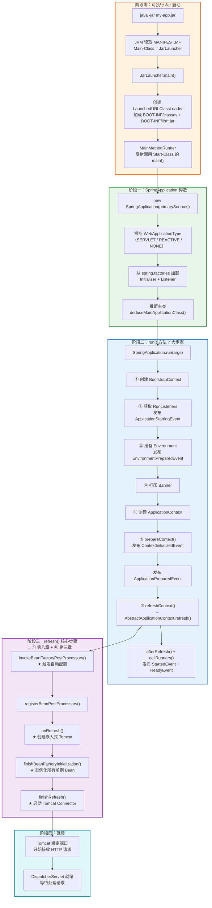
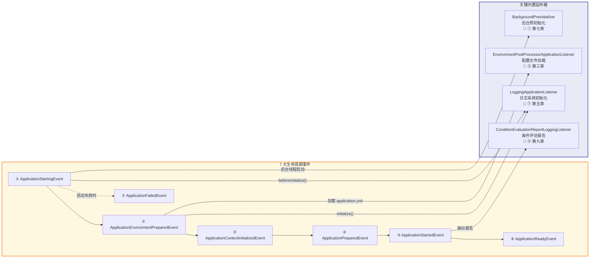
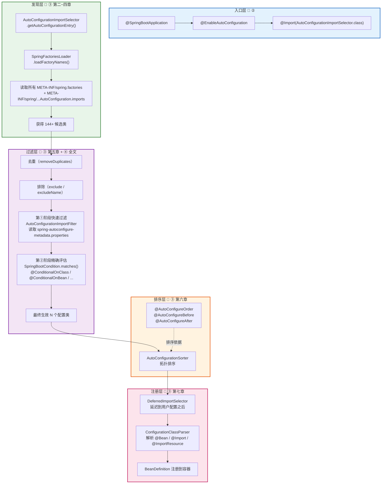
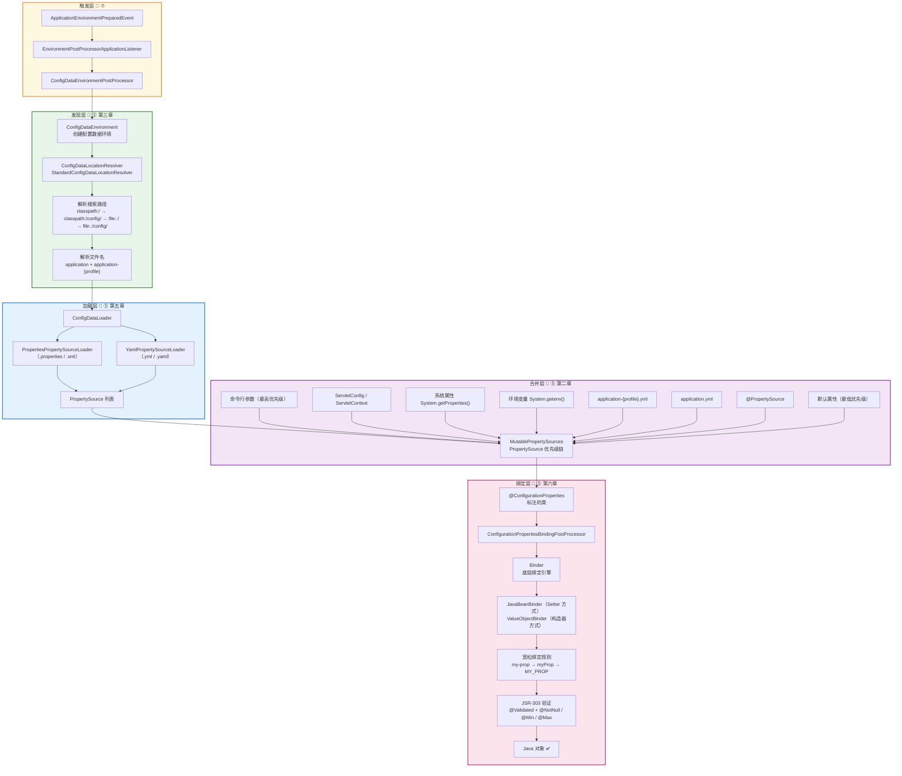
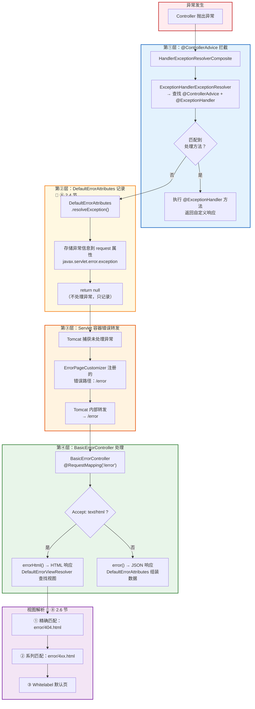
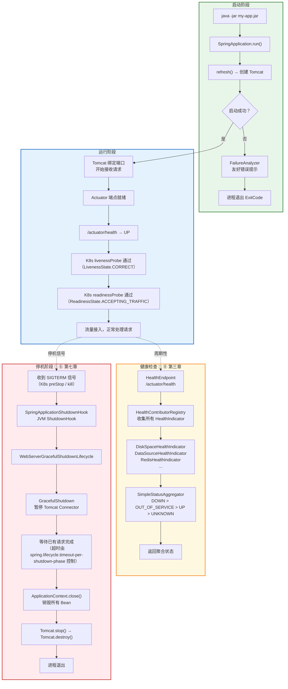
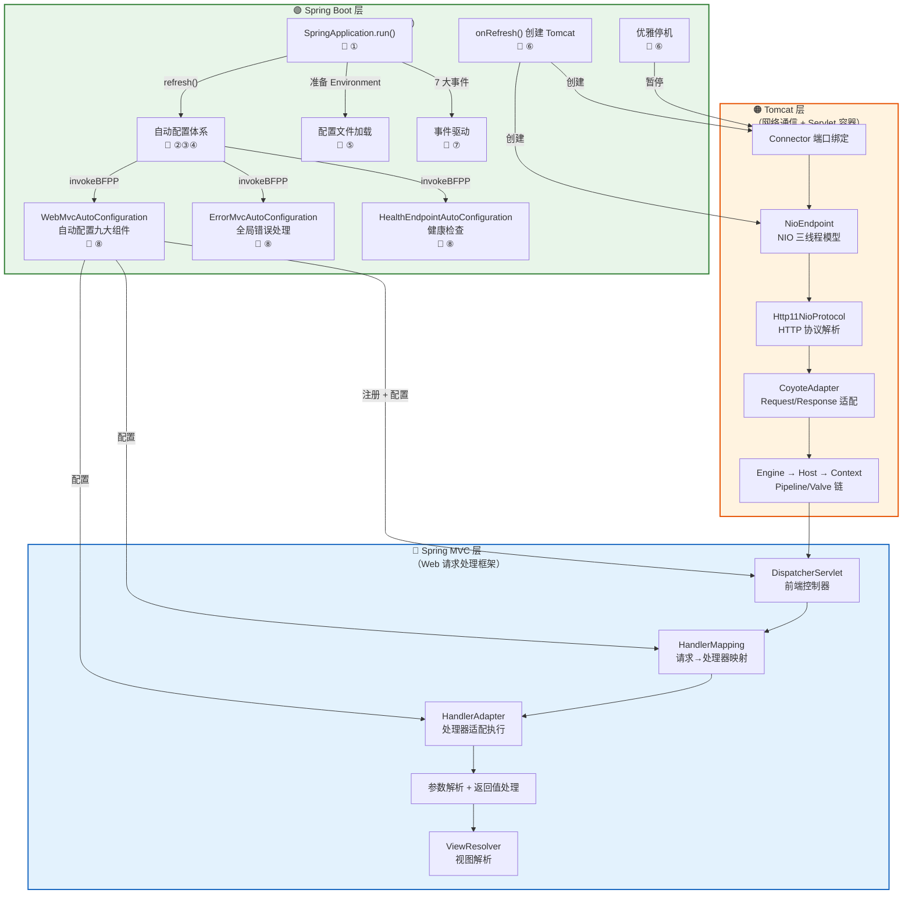
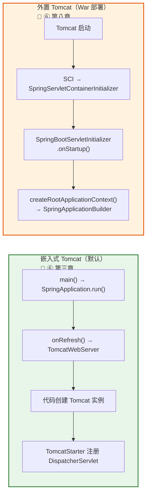

# ⑨ SpringBoot 核心流程全景图

> 📌 基于 **Spring Boot 2.7.18** 源码
> 📁 本地源码路径：`/data/workspace/spring-boot/`
> 🏷️ 系列第 9 篇 / 共 10 篇
> ⏱️ 预计阅读时间：**0.5 天**
> ✅ 前置阅读：**①-⑧ 全部**（本文是串联总结篇）

---

## 前言

经过前 8 篇文档的深入分析，我们已经掌握了 Spring Boot 的各个核心子系统：
- **① 启动全流程** — 从 `java -jar` 的 `JarLauncher` 到 `SpringApplication.run()` 的 7 大阶段
- **② 注解三合一** — `@SpringBootApplication` 如何触发自动配置
- **③ 自动配置核心** — `AutoConfigurationImportSelector` 的发现→过滤→排序→注册全链路
- **④ 条件注解体系** — `@ConditionalOnXxx` 的两阶段过滤机制
- **⑤ 配置文件加载** — `ConfigDataEnvironmentPostProcessor` 的配置加载与 `Binder` 属性绑定
- **⑥ 嵌入式容器** — `TomcatWebServer` 的创建、优雅停机、外置 Tomcat 部署
- **⑦ 事件与监听器** — 7 大生命周期事件与日志系统初始化
- **⑧ 自动配置实战** — WebMvc / Error / Actuator / DataSource / 自定义 Starter

**本文的价值**：用 **7 张全景图** 将所有子系统串成一条完整的链路。适用于：
1. **学习收尾** — 学完 ①-⑧ 后，一图总览确认没有遗漏
2. **面试准备** — 脑中随时能画出完整流程图
3. **快速查阅** — 遇到问题时快速定位到哪个子系统、哪篇文档

> **⚠️ 约定**：每张图后的「关键节点索引」给出了对应源码文件路径和系列文档引用，方便快速跳转。

---

## 一、启动全流程串联图 — 从 `java -jar` 到请求就绪

> 📖 串联文档：① 启动全流程 + ⑦ 事件与监听器

### 1.1 完整启动流程全景图

这是整个系列**最核心的一张图**，串联了 Spring Boot 从 JVM 启动到接收第一个 HTTP 请求的完整链路：



### 1.2 关键节点索引

| 节点 | 核心类 | 源码路径 | 详见文档 |
|------|--------|---------|---------|
| JarLauncher | `JarLauncher` | `spring-boot-tools/spring-boot-loader/.../JarLauncher.java` | ① 第二章 |
| LaunchedURLClassLoader | `LaunchedURLClassLoader` | `spring-boot-tools/spring-boot-loader/.../LaunchedURLClassLoader.java` | ① 2.4 节 |
| SpringApplication 构造 | `SpringApplication` | `spring-boot/src/.../boot/SpringApplication.java` | ① 第三章 |
| 7 大事件发布 | `EventPublishingRunListener` | `spring-boot/src/.../boot/context/event/EventPublishingRunListener.java` | ⑦ 第二、三章 |
| Environment 准备 | `ConfigDataEnvironmentPostProcessor` | `spring-boot/src/.../boot/context/config/ConfigDataEnvironmentPostProcessor.java` | ⑤ 第三章 |
| 自动配置触发 | `AutoConfigurationImportSelector` | `spring-boot-autoconfigure/src/.../AutoConfigurationImportSelector.java` | ③ 第四章 |
| 创建 Tomcat | `TomcatServletWebServerFactory` | `spring-boot/src/.../boot/web/embedded/tomcat/TomcatServletWebServerFactory.java` | ⑥ 第三章 |
| Connector 启动 | `WebServerStartStopLifecycle` | `spring-boot/src/.../boot/web/servlet/context/WebServerStartStopLifecycle.java` | ⑥ 3.3 节 |
| callRunners | `SpringApplication` | `spring-boot/src/.../boot/SpringApplication.java` | ① 第六章 |

### 1.3 7 大生命周期事件与内置监听器速查



### 1.4 异常处理流程

当启动过程中发生异常时，`handleRunFailure()` 接管：

```
异常发生
  → handleRunFailure()
    → 发布 ApplicationFailedEvent（通知监听器清理资源）
    → FailureAnalyzers 遍历匹配（SPI 加载 spring.factories 中注册的分析器）
      → PortInUseFailureAnalyzer → 端口冲突友好提示
      → NoSuchBeanDefinitionFailureAnalyzer → Bean 找不到友好提示
      → DataSourceBeanCreationFailureAnalyzer → 数据源配置错误提示
    → 未匹配到任何 FailureAnalyzer → 打印原始异常栈
    → 关闭 ApplicationContext
    → 调用 ShutdownHook 清理资源
```

> 📖 详见：① 第五章「异常处理与 FailureAnalyzer」

---

## 二、自动配置流程串联图 — 发现 → 过滤 → 排序 → 注册

> 📖 串联文档：② 注解三合一 + ③ 自动配置核心机制 + ④ 条件注解体系

### 2.1 自动配置全链路全景图



### 2.2 条件注解两阶段过滤详解

```mermaid
flowchart LR
    subgraph Stage1["第①阶段：快速过滤<br/>（spring-autoconfigure-metadata.properties）"]
        S1A["144+ 候选类"] --> S1B["读取预计算元数据<br/>不需要加载 .class 文件"]
        S1B --> S1C["ClassLoader.getResource()<br/>仅检查类路径是否存在"]
        S1C --> S1D["过滤掉大量不满足条件的类<br/>→ 剩余约 30-50 个"]
    end
    
    subgraph Stage2["第②阶段：精确评估<br/>（SpringBootCondition.matches()）"]
        S2A["加载 .class 文件"] --> S2B["反射读取注解元数据"]
        S2B --> S2C["OnClassCondition<br/>（精确类检查）"]
        S2C --> S2D["OnBeanCondition<br/>（检查容器中是否有 Bean）"]
        S2D --> S2E["OnPropertyCondition<br/>（检查 Environment 属性）"]
        S2E --> S2F["最终生效 N 个"]
    end
    
    S1D --> S2A
    
    style Stage1 fill:#e8f5e9,stroke:#2e7d32,stroke-width:2px
    style Stage2 fill:#f3e5f5,stroke:#7b1fa2,stroke-width:2px
```



### 2.3 为什么自动配置要延迟导入？

```
用户配置 @Configuration 类              自动配置 @AutoConfiguration 类
        │                                        │
        │  ← 先解析（优先级高）                     │  ← 后解析（DeferredImportSelector）
        │                                        │
        ▼                                        ▼
用户定义了 @Bean MyService           @ConditionalOnMissingBean(MyService.class)
        │                                 → 条件不满足 → 跳过
        │                                 → 用户的 Bean 生效 ✅
        ▼
   用户配置优先 ✅
```

> **核心设计原则**：`DeferredImportSelector` 保证自动配置类在所有用户 `@Configuration` 之后才解析，使得 `@ConditionalOnMissingBean` 能正确检测到用户已定义的 Bean，实现「**用户配置优先**」。
>
> 📖 详见：③ 第七章「DeferredImportSelector 延迟导入」

### 2.4 关键节点索引

| 节点 | 核心类 | 详见文档 |
|------|--------|---------|
| @SpringBootApplication 三合一 | `SpringBootApplication` / `EnableAutoConfiguration` | ② 全文 |
| spring.factories 加载 | `SpringFactoriesLoader` | ③ 第二章 |
| 候选类获取 | `AutoConfigurationImportSelector.getAutoConfigurationEntry()` | ③ 第四章 |
| 预计算元数据快速过滤 | `AutoConfigurationMetadataLoader` + `spring-autoconfigure-metadata.properties` | ③ 第五章 |
| 条件注解精确评估 | `SpringBootCondition` / `OnClassCondition` / `OnBeanCondition` | ④ 第三~六章 |
| 拓扑排序 | `AutoConfigurationSorter` | ③ 第六章 |
| 延迟导入 | `DeferredImportSelector` | ③ 第七章 |
| 条件评估报告 | `ConditionEvaluationReport` + `--debug` | ④ 第九章 |

---

## 三、配置加载流程串联图 — 从文件到 Java 对象

> 📖 串联文档：⑤ 配置文件加载与属性绑定 + ⑦ 事件与监听器

### 3.1 配置加载全链路全景图



### 3.2 PropertySource 优先级完整链

优先级从高到低（高优先级覆盖低优先级）：

```
① 命令行参数                    --server.port=9090
② ServletConfig init-param     web.xml / @WebServlet
③ ServletContext init-param     web.xml context-param
④ JNDI 属性                     java:comp/env/
⑤ System.getProperties()       -Dserver.port=9090
⑥ System.getenv()              SERVER_PORT=9090
⑦ RandomValuePropertySource    random.int / random.uuid
⑧ application-{profile}.yml    (jar 包外)
⑨ application-{profile}.yml    (jar 包内)
⑩ application.yml              (jar 包外)
⑪ application.yml              (jar 包内)
⑫ @PropertySource 注解          @PropertySource("classpath:custom.properties")
⑬ 默认属性                      SpringApplication.setDefaultProperties()
```

> 📖 详见：⑤ 第二章「Environment 体系回顾」

### 3.3 多 Profile 高级特性

```
                    激活 Profile
                         │
         ┌───────────────┼───────────────┐
         ▼               ▼               ▼
   Profile Group    多文档 YAML      Profile 表达式
   spring.profiles   --- 分隔符     spring.config.activate
   .group.prod=       一个文件        .on-profile=prod
   proddb,prodmq     多个环境
         │               │               │
         ▼               ▼               ▼
  一个 Profile         单文件管理       条件激活
  激活多个子 Profile    所有环境配置     指定文档段
```

> 📖 详见：⑤ 第四章「多 Profile 高级特性」

### 3.4 关键节点索引

| 节点 | 核心类 | 详见文档 |
|------|--------|---------|
| 事件触发 | `EnvironmentPostProcessorApplicationListener` | ⑦ 第四章 |
| 配置文件定位 | `StandardConfigDataLocationResolver` | ⑤ 第三章 |
| YAML 解析 | `YamlPropertySourceLoader` | ⑤ 第五章 |
| PropertySource 优先级 | `MutablePropertySources` | ⑤ 第二章 |
| Binder 绑定 | `Binder` / `JavaBeanBinder` / `ValueObjectBinder` | ⑤ 第六章 |
| 宽松绑定 | `ConfigurationPropertyName` | ⑤ 6.9 节 |
| JSR-303 验证 | `ConfigurationPropertiesJsr303Validator` | ⑤ 第七章 |
| config.import | `ConfigDataProperties` + `ConfigDataLocationResolver` | ⑤ 第八章 |

---

## 四、错误处理流程串联图 — 异常从抛出到响应

> 📖 串联文档：⑧ 自动配置实战（第二章 ErrorMvcAutoConfiguration）

### 4.1 错误处理全链路全景图



### 4.2 四大组件协作关系

```
ErrorMvcAutoConfiguration 注册的 4 大组件：

┌─────────────────────────────────────────────────────────────┐
│  DefaultErrorAttributes                                      │
│  • 实现 HandlerExceptionResolver（@Order 最高优先级）           │
│  • 职责：只记录异常信息到 request，不做处理                       │
│  → 保证异常信息在后续处理中可用                                  │
├─────────────────────────────────────────────────────────────┤
│  ErrorPageCustomizer                                         │
│  • 实现 ErrorPageRegistrar                                    │
│  • 职责：向 Tomcat 注册错误页路径 /error                        │
│  → 让 Tomcat 知道未处理异常应该转发到哪里                        │
├─────────────────────────────────────────────────────────────┤
│  BasicErrorController                                        │
│  • @RequestMapping("${server.error.path:/error}")            │
│  • 职责：处理 /error 请求，返回 HTML 或 JSON                    │
│  → 真正生成错误响应的组件                                       │
├─────────────────────────────────────────────────────────────┤
│  DefaultErrorViewResolver                                    │
│  • 查找顺序：精确状态码(404.html) → 系列(4xx.html) → Whitelabel│
│  → 决定错误页面长什么样                                         │
└─────────────────────────────────────────────────────────────┘
```

### 4.3 生产最佳实践

```
推荐分层处理策略：

业务异常（参数校验/权限不足/资源不存在）
  → @ControllerAdvice + @ExceptionHandler
  → 统一响应格式 { code, message, data }

系统异常（NPE/DB连接失败/未知异常）
  → @ControllerAdvice 兜底 @ExceptionHandler(Exception.class)
  → 打 ERROR 日志 + 报警

404 / 静态资源错误
  → 自定义 error/404.html + error/5xx.html
  → 或重写 BasicErrorController
```

> 📖 详见：⑧ 第二章「ErrorMvcAutoConfiguration」完整分析

---

## 五、生产运维流程串联图 — 启动 → 运行 → 停机

> 📖 串联文档：⑥ 嵌入式容器（优雅停机）+ ⑧ 自动配置实战（Actuator 健康检查）+ ① 启动全流程（FailureAnalyzer）

### 5.1 生产应用完整生命周期



### 5.2 K8s 部署完整配置方案

```yaml
# Deployment 配置
spec:
  containers:
  - name: my-app
    image: my-app:1.0
    ports:
    - containerPort: 8080
    
    # 存活探针 — 检查应用是否还活着
    livenessProbe:
      httpGet:
        path: /actuator/health/liveness    # ← LivenessStateHealthIndicator
        port: 8080
      initialDelaySeconds: 30
      periodSeconds: 10
    
    # 就绪探针 — 检查应用是否能接收流量
    readinessProbe:
      httpGet:
        path: /actuator/health/readiness   # ← ReadinessStateHealthIndicator
        port: 8080
      initialDelaySeconds: 10
      periodSeconds: 5
    
    lifecycle:
      preStop:
        exec:
          command: ["sh", "-c", "sleep 5"]  # ← 等待 K8s 更新 Endpoints
  
  terminationGracePeriodSeconds: 60          # ← 留足停机时间

---
# application.yml
server:
  shutdown: graceful                         # ← 开启优雅停机
spring:
  lifecycle:
    timeout-per-shutdown-phase: 30s          # ← 等待已有请求完成的超时时间
management:
  endpoint:
    health:
      probes:
        enabled: true                        # ← 启用 K8s 探针端点（K8s 环境自动开启）
  endpoints:
    web:
      exposure:
        include: health,info,prometheus      # ← 只暴露必要端点
```

### 5.3 HealthIndicator 聚合策略

```
/actuator/health 请求

HealthEndpoint
  → HealthContributorRegistry（自动收集容器中所有 HealthIndicator Bean）
    → DiskSpaceHealthIndicator    → UP (usableSpace: 50GB > threshold: 10MB)
    → DataSourceHealthIndicator   → UP (SELECT 1 成功)
    → RedisHealthIndicator        → DOWN (连接超时)
    → 自定义 HealthIndicator      → UP
  → SimpleStatusAggregator（取最差状态）
    → DOWN > OUT_OF_SERVICE > UP > UNKNOWN
    → 聚合结果 = DOWN ❌（因为 Redis 挂了）

响应：
{
  "status": "DOWN",
  "components": {
    "diskSpace": { "status": "UP", ... },
    "db": { "status": "UP", ... },
    "redis": { "status": "DOWN", "details": { "error": "Connection refused" } },
    "custom": { "status": "UP", ... }
  }
}
```

> 📖 详见：⑧ 第三章「Actuator 健康检查自动配置」

---

## 六、三位一体关系图 — Spring Boot × Tomcat × Spring MVC

> 📖 串联文档：⑥ 第九章 + Tomcat 系列 + MVC 系列

### 6.1 三层架构全景图



### 6.2 完整请求链路（从 HTTP 到 Controller 到响应）

```
客户端发送 HTTP 请求
│
├─ 🟠 Tomcat 层 ─────────────────────────────────────────────
│  ① NioEndpoint.Acceptor 接收 TCP 连接
│  ② NioEndpoint.Poller 检测 IO 就绪
│  ③ SocketProcessor → Http11Processor 解析 HTTP 报文
│  ④ CoyoteAdapter.service() → 将 Coyote Request 适配为 Servlet Request
│  ⑤ Engine → Host → Context → Wrapper（Pipeline/Valve 链路由）
│
├─ 🔵 Spring MVC 层 ──────────────────────────────────────────
│  ⑥ DispatcherServlet.service() → doDispatch()
│  ⑦ HandlerMapping.getHandler() → 匹配 Controller 方法
│  ⑧ HandlerAdapter.handle() → 反射调用 Controller
│  ⑨ 参数解析（RequestParamMethodArgumentResolver / RequestBodyAdvice 等）
│  ⑩ Controller 执行业务逻辑
│  ⑪ 返回值处理（ResponseBodyAdvice / ViewResolver）
│
├─ 🟠 Tomcat 层（响应写回）───────────────────────────────────
│  ⑫ Response flush → NioChannel 写出字节流
│
└─ 客户端收到 HTTP 响应
```

### 6.3 嵌入式 vs 外置 Tomcat 对比



| 维度 | 嵌入式 Tomcat | 外置 Tomcat |
|------|:----------:|:----------:|
| **入口** | `main()` → `SpringApplication.run()` | Tomcat → `SpringBootServletInitializer` |
| **Tomcat 创建者** | Spring Boot（`onRefresh()`） | 运维/用户 |
| **DispatcherServlet 注册** | `DispatcherServletRegistrationBean` | `SCI 机制（SpringServletContainerInitializer）` |
| **打包方式** | jar | war |
| **典型场景** | 微服务、K8s 部署 | 传统运维、共享 Tomcat 实例 |

### 6.4 九大组件自动配置来源

| MVC 九大组件 | 自动配置来源 | 配置类 |
|-------------|------------|--------|
| HandlerMapping | `WebMvcAutoConfiguration` + `EnableWebMvcConfiguration` | `requestMappingHandlerMapping()` |
| HandlerAdapter | `WebMvcAutoConfiguration` + `EnableWebMvcConfiguration` | `requestMappingHandlerAdapter()` |
| HandlerExceptionResolver | `WebMvcAutoConfiguration` + `EnableWebMvcConfiguration` | `handlerExceptionResolver()` |
| ViewResolver | `WebMvcAutoConfiguration.WebMvcAutoConfigurationAdapter` | `viewResolver()` |
| LocaleResolver | `WebMvcAutoConfiguration.WebMvcAutoConfigurationAdapter` | `localeResolver()` |
| ThemeResolver | `WebMvcAutoConfiguration.WebMvcAutoConfigurationAdapter` | （已弃用） |
| MultipartResolver | `MultipartAutoConfiguration` | `multipartResolver()` |
| FlashMapManager | `WebMvcAutoConfiguration` | 默认 `SessionFlashMapManager` |
| RequestToViewNameTranslator | `WebMvcAutoConfiguration` | 默认 `DefaultRequestToViewNameTranslator` |

> 📖 详见：⑧ 第一章「WebMvcAutoConfiguration 源码精读」+ MVC 系列 ② 第三章

---

## 七、设计模式汇总 — Spring Boot 中的 12 种设计模式

> 📖 汇总自 ①-⑧ 所有文档的「设计模式总结」章节

### 7.1 设计模式全景表

| # | 设计模式 | 在 Spring Boot 中的体现 | 核心类 | 所在文档 |
|:-:|---------|----------------------|--------|---------|
| 1 | **观察者模式** | 7 大生命周期事件，Listener 订阅事件执行逻辑 | `EventPublishingRunListener` / `ApplicationListener` | ⑦ |
| 2 | **策略模式** | 根据 `WebApplicationType` 选择不同 Context；条件注解的多种 Condition 实现 | `ApplicationContextFactory` / `OnClassCondition` / `OnBeanCondition` | ① ④ |
| 3 | **模板方法** | `refresh()` 12 步骨架 + `onRefresh()` 扩展；`SpringBootCondition.matches()` + 子类 `getMatchOutcome()` | `AbstractApplicationContext` / `SpringBootCondition` | ① ④ ⑥ |
| 4 | **工厂方法** | `createApplicationContext()` 根据类型创建不同上下文；`WebServerFactory` 创建不同容器 | `ApplicationContextFactory` / `TomcatServletWebServerFactory` | ① ⑥ |
| 5 | **SPI 机制** | `spring.factories` 注册并加载组件（AutoConfiguration / FailureAnalyzer / RunListener 等） | `SpringFactoriesLoader` | ① ③ ⑦ |
| 6 | **建造者模式** | `SpringApplicationBuilder` 链式构建 SpringApplication | `SpringApplicationBuilder` | ① ⑥ |
| 7 | **管道过滤器** | 自动配置候选类经过去重→排除→快速过滤→精确评估的流水线 | `AutoConfigurationImportSelector` | ③ |
| 8 | **装饰器模式** | `LaunchedURLClassLoader` 扩展标准 URLClassLoader 以支持 Jar-in-Jar | `LaunchedURLClassLoader` | ① |
| 9 | **适配器模式** | `CoyoteAdapter` 适配 Tomcat 内部请求为 Servlet 请求；`MappedExitCodeGenerator` | `CoyoteAdapter` / `MappedExitCodeGenerator` | ⑥ ① |
| 10 | **门面模式** | `SpringApplication.run()` 一行代码封装启动全部复杂性 | `SpringApplication` | ① |
| 11 | **责任链模式** | `FailureAnalyzer` 遍历匹配；Tomcat Pipeline/Valve 链 | `FailureAnalyzers` / `Pipeline` | ① ⑥ |
| 12 | **组合模式** | `CompositeHealthContributor` 聚合多个 `HealthIndicator` | `CompositeHealthContributor` | ⑧ |

### 7.2 核心设计原则

| 设计原则 | Spring Boot 的体现 |
|---------|-------------------|
| **约定优于配置** | 自动配置类提供合理默认值，`@ConditionalOnMissingBean` 让用户可覆盖 |
| **开闭原则** | 通过 `spring.factories` SPI + `@Conditional` 实现扩展开放、修改关闭 |
| **单一职责** | 每个 AutoConfiguration 只负责一个功能域（MVC / DataSource / Health） |
| **依赖倒置** | `WebServerFactory` 接口抽象，不依赖具体 Tomcat/Jetty/Undertow |
| **里氏替换** | `LoggingSystem` 统一门面，Logback/Log4j2/JUL 可无缝替换 |
| **接口隔离** | `HealthIndicator` / `HealthContributor` 最小接口设计 |

---

## 面试 Q&A — 全景串联高频题

### Q1：请用一张图描述 Spring Boot 的完整启动流程

> **30 秒版**：`java -jar` → JarLauncher 创建 ClassLoader → 反射调用 main() → `SpringApplication.run()` → 构造阶段（推断 Web 类型 + 加载 spring.factories） → run() 7 大步骤（创建 BootstrapContext → 发布 starting 事件 → 准备 Environment → 打印 Banner → 创建 Context → prepareContext → refreshContext） → refresh() 中触发自动配置 + 创建嵌入式 Tomcat → callRunners → 就绪。
>
> **源码级追问**：画图时的关键分界线是 `refresh()`——之前是 Spring Boot 的领地（事件、配置、准备工作），之后进入 Spring Framework 的 `AbstractApplicationContext.refresh()` 12 步标准流程。自动配置在 `invokeBeanFactoryPostProcessors()` 中触发，嵌入式 Tomcat 在 `onRefresh()` 中创建，Connector 在 `finishRefresh()` 中启动。
>
> 📖 本文第一章完整流程图

### Q2：Spring Boot 的自动配置链路是什么？从注解到 Bean 注册经历了哪些步骤？

> **30 秒版**：`@SpringBootApplication` → `@EnableAutoConfiguration` → `@Import(AutoConfigurationImportSelector)` → 读取 `spring.factories` 获得 144+ 候选类 → 去重 → 排除 → 第①阶段快速过滤（预计算元数据，不加载 .class） → 第②阶段精确评估（`@ConditionalOnClass` / `@ConditionalOnBean` / `@ConditionalOnProperty`） → `AutoConfigurationSorter` 拓扑排序 → `DeferredImportSelector` 延迟到用户配置之后注册 → `ConfigurationClassParser` 解析 `@Bean` → BeanDefinition 注册。
>
> **加分项**：强调 `DeferredImportSelector` 保证用户配置优先——自动配置的 `@ConditionalOnMissingBean` 能正确检测到用户已定义的 Bean。
>
> 📖 本文第二章完整流程图

### Q3：Spring Boot 的配置加载和属性绑定完整链路是什么？

> **30 秒版**：`ApplicationEnvironmentPreparedEvent` 触发 → `EnvironmentPostProcessorApplicationListener` → `ConfigDataEnvironmentPostProcessor` → `ConfigDataEnvironment` 定位配置文件（classpath:/ → classpath:/config/ → file:./ → file:./config/） → `PropertySourceLoader` 解析 .properties/.yml → PropertySource 按优先级合并到 Environment → `@ConfigurationProperties` 标注的类由 `ConfigurationPropertiesBindingPostProcessor` 处理 → `Binder` 执行绑定（宽松绑定 + 类型转换） → 可选 JSR-303 验证 → Java 对象。
>
> 📖 本文第三章完整流程图

### Q4：Spring Boot 的错误处理机制是怎样的？有几层？

> **30 秒版**：四层。第①层：`@ControllerAdvice` + `@ExceptionHandler` 在 Spring MVC 层拦截异常（优先级最高）。第②层：`DefaultErrorAttributes` 只记录异常，不处理（为后续准备数据）。第③层：Tomcat 容器捕获未处理异常，内部转发到 `/error`。第④层：`BasicErrorController` 根据 `Accept` 头返回 HTML（查找 `error/404.html` → `error/4xx.html` → Whitelabel）或 JSON 响应。
>
> **加分项**：生产中推荐用 `@ControllerAdvice` 处理所有业务异常并统一响应格式，让 `BasicErrorController` 只作为最后兜底。
>
> 📖 本文第四章完整流程图

### Q5：生产环境中 Spring Boot 应用的优雅停机怎么做？K8s 下怎么配合？

> **30 秒版**：配置 `server.shutdown=graceful` 开启优雅停机。收到 SIGTERM 信号后：`SpringApplicationShutdownHook` 触发 → `WebServerGracefulShutdownLifecycle` → `GracefulShutdown` 暂停 Tomcat Connector（不再接收新请求）→ 等待已有请求完成（超时由 `spring.lifecycle.timeout-per-shutdown-phase` 控制）→ 关闭 ApplicationContext → Tomcat.stop()。K8s 配合：`preStop: sleep 5`（等 Endpoints 更新）+ `terminationGracePeriodSeconds: 60`（留足停机时间）+ liveness/readiness 探针指向 `/actuator/health/liveness|readiness`。
>
> 📖 本文第五章 + ⑥ 第七章

### Q6：Spring Boot 用到了哪些设计模式？至少说 8 种

> **30 秒版**：①观察者（7 大事件）、②策略（WebApplicationType 选择 Context / 条件注解多实现）、③模板方法（refresh() 骨架 + onRefresh() / SpringBootCondition.matches()）、④工厂方法（createApplicationContext / WebServerFactory）、⑤SPI（spring.factories）、⑥建造者（SpringApplicationBuilder）、⑦管道过滤器（自动配置去重→排除→过滤→排序）、⑧装饰器（LaunchedURLClassLoader）、⑨适配器（CoyoteAdapter）、⑩门面（SpringApplication.run()）、⑪责任链（FailureAnalyzer / Pipeline-Valve）、⑫组合（CompositeHealthContributor）。
>
> 📖 本文第七章完整汇总表

---

## 附录 A：全系列文档速查

| # | 文档名称 | 核心内容 | 难度 |
|:-:|---------|---------|:----:|
| ① | SpringBoot启动全流程深度分析 | 可执行Jar · JarLauncher · run() 7大阶段 · FailureAnalyzer · 启动优化 | ⭐⭐⭐⭐⭐ |
| ② | @SpringBootApplication注解三合一深度分析 | @SpringBootConfiguration · @ComponentScan · @EnableAutoConfiguration · 元注解派生 | ⭐⭐⭐⭐ |
| ③ | 自动配置核心机制深度分析 | AutoConfigurationImportSelector · spring.factories · 排序过滤去重 · DeferredImportSelector | ⭐⭐⭐⭐⭐ |
| ④ | 条件注解体系深度分析 | SpringBootCondition · OnClassCondition · OnBeanCondition · 两阶段过滤 · ConditionEvaluationReport | ⭐⭐⭐⭐⭐ |
| ⑤ | 配置文件加载与属性绑定深度分析 | ConfigDataEnvironmentPostProcessor · PropertySource 优先级 · Binder · 多Profile · JSR-303验证 | ⭐⭐⭐⭐⭐ |
| ⑥ | 嵌入式Web容器启动深度分析 | TomcatWebServer · onRefresh() · DispatcherServlet注册 · 优雅停机 · 外置Tomcat · 三位一体 | ⭐⭐⭐⭐⭐ |
| ⑦ | SpringBoot事件与监听器机制深度分析 | 7大事件 · EventPublishingRunListener · 两阶段广播 · LoggingSystem初始化 | ⭐⭐⭐⭐ |
| ⑧ | 自动配置实战案例深度分析 | WebMvc · Error处理 · Actuator健康检查 · DataSource · 自定义Starter | ⭐⭐⭐⭐⭐ |
| ⑨ | SpringBoot核心流程全景图（本文） | 7张全景图串联全部 · 设计模式汇总 | ⭐⭐⭐⭐ |
| ⑩ | SpringBoot源码面试题总结 | 40道高频题 · 简答+源码级追问+生产加分 | ⭐⭐⭐ |

## 附录 B：按主题查找指南

### B.1 "我想了解某个机制"

| 我想了解... | 直接看 |
|------------|--------|
| java -jar 底层原理 | ① 第二章 |
| 启动全流程 | ① 全文 + 本文第一章 |
| @SpringBootApplication 注解 | ② 全文 |
| 自动配置实现原理 | ③ 全文 + 本文第二章 |
| 条件注解原理 | ④ 全文 |
| 配置文件加载 | ⑤ 全文 + 本文第三章 |
| 属性绑定 @ConfigurationProperties | ⑤ 第六~七章 |
| 嵌入式 Tomcat 启动 | ⑥ 第二~三章 |
| DispatcherServlet 注册 | ⑥ 第四章 |
| 优雅停机 | ⑥ 第七章 + 本文第五章 |
| 外置 Tomcat 部署 | ⑥ 第八章 + 本文 6.3 节 |
| 7 大事件 | ⑦ 第三章 + 本文 1.3 节 |
| 日志系统初始化 | ⑦ 第五章 |
| WebMvc 自动配置 | ⑧ 第一章 |
| 全局异常处理 | ⑧ 第二章 + 本文第四章 |
| Actuator 健康检查 | ⑧ 第三章 + 本文第五章 |
| 数据源自动配置 | ⑧ 第四章 |
| 自定义 Starter | ⑧ 第五章 |
| 设计模式 | 本文第七章 |

### B.2 "面试会问什么"

| 面试高频考点 | 推荐阅读 |
|------------|---------|
| 启动流程全链路 | ① + 本文 Q1 |
| 自动配置原理 | ③ + 本文 Q2 |
| 条件注解两阶段过滤 | ④ + 本文 2.2 节 |
| 配置优先级 | ⑤ + 本文 3.2 节 |
| 嵌入式 vs 外置 Tomcat | ⑥ + 本文 6.3 节 |
| 全局异常处理 | ⑧ + 本文 Q4 |
| 优雅停机 + K8s | ⑥ + 本文 Q5 |
| 设计模式 | 本文 Q6 |
| 综合面试突击 | ⑩ 全部 40 题 |

## 附录 C：核心源码文件全索引

> 所有路径相对于 `/data/workspace/spring-boot/`

### C.1 启动与核心

| 文件 | 路径 |
|------|------|
| SpringApplication | `spring-boot-project/spring-boot/src/main/java/org/springframework/boot/SpringApplication.java` |
| JarLauncher | `spring-boot-project/spring-boot-tools/spring-boot-loader/src/main/java/org/springframework/boot/loader/JarLauncher.java` |
| LaunchedURLClassLoader | `spring-boot-project/spring-boot-tools/spring-boot-loader/src/main/java/org/springframework/boot/loader/LaunchedURLClassLoader.java` |
| EventPublishingRunListener | `spring-boot-project/spring-boot/src/main/java/org/springframework/boot/context/event/EventPublishingRunListener.java` |

### C.2 自动配置

| 文件 | 路径 |
|------|------|
| AutoConfigurationImportSelector | `spring-boot-project/spring-boot-autoconfigure/src/main/java/org/springframework/boot/autoconfigure/AutoConfigurationImportSelector.java` |
| SpringBootCondition | `spring-boot-project/spring-boot-autoconfigure/src/main/java/org/springframework/boot/autoconfigure/condition/SpringBootCondition.java` |
| OnClassCondition | `spring-boot-project/spring-boot-autoconfigure/src/main/java/org/springframework/boot/autoconfigure/condition/OnClassCondition.java` |
| OnBeanCondition | `spring-boot-project/spring-boot-autoconfigure/src/main/java/org/springframework/boot/autoconfigure/condition/OnBeanCondition.java` |
| spring.factories | `spring-boot-project/spring-boot-autoconfigure/src/main/resources/META-INF/spring.factories` |

### C.3 配置体系

| 文件 | 路径 |
|------|------|
| ConfigDataEnvironmentPostProcessor | `spring-boot-project/spring-boot/src/main/java/org/springframework/boot/context/config/ConfigDataEnvironmentPostProcessor.java` |
| Binder | `spring-boot-project/spring-boot/src/main/java/org/springframework/boot/context/properties/bind/Binder.java` |
| ConfigurationPropertiesBindingPostProcessor | `spring-boot-project/spring-boot/src/main/java/org/springframework/boot/context/properties/ConfigurationPropertiesBindingPostProcessor.java` |

### C.4 嵌入式容器

| 文件 | 路径 |
|------|------|
| TomcatServletWebServerFactory | `spring-boot-project/spring-boot/src/main/java/org/springframework/boot/web/embedded/tomcat/TomcatServletWebServerFactory.java` |
| TomcatWebServer | `spring-boot-project/spring-boot/src/main/java/org/springframework/boot/web/embedded/tomcat/TomcatWebServer.java` |
| GracefulShutdown | `spring-boot-project/spring-boot/src/main/java/org/springframework/boot/web/embedded/tomcat/GracefulShutdown.java` |
| SpringBootServletInitializer | `spring-boot-project/spring-boot/src/main/java/org/springframework/boot/web/servlet/support/SpringBootServletInitializer.java` |

### C.5 错误处理与健康检查

| 文件 | 路径 |
|------|------|
| ErrorMvcAutoConfiguration | `spring-boot-project/spring-boot-autoconfigure/src/main/java/org/springframework/boot/autoconfigure/web/servlet/error/ErrorMvcAutoConfiguration.java` |
| BasicErrorController | `spring-boot-project/spring-boot-autoconfigure/src/main/java/org/springframework/boot/autoconfigure/web/servlet/error/BasicErrorController.java` |
| HealthEndpointAutoConfiguration | `spring-boot-project/spring-boot-actuator-autoconfigure/src/main/java/org/springframework/boot/actuate/autoconfigure/health/HealthEndpointAutoConfiguration.java` |
| HealthIndicator | `spring-boot-project/spring-boot-actuator/src/main/java/org/springframework/boot/actuate/health/HealthIndicator.java` |

### C.6 日志系统

| 文件 | 路径 |
|------|------|
| LoggingApplicationListener | `spring-boot-project/spring-boot/src/main/java/org/springframework/boot/context/logging/LoggingApplicationListener.java` |
| LoggingSystem | `spring-boot-project/spring-boot/src/main/java/org/springframework/boot/logging/LoggingSystem.java` |
| LogbackLoggingSystem | `spring-boot-project/spring-boot/src/main/java/org/springframework/boot/logging/logback/LogbackLoggingSystem.java` |
