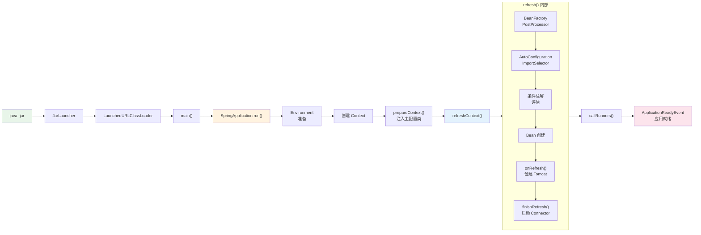
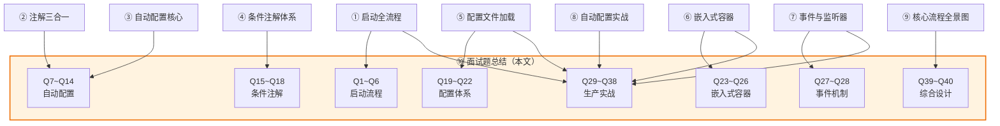

# SpringBoot 源码面试题总结

> 📌 基于 **Spring Boot 2.7.18** 源码
> 📁 Spring Boot 源码路径：`/data/workspace/spring-boot/`
> 📁 Spring Framework 源码路径：`/data/workspace/spring-framework/`
> 📖 本文是 Spring Boot 源码系列**第 ⑩ 篇**（终章）
> 🔗 前置阅读：建议先完成 ①~⑧，也可直接阅读用于快速了解面试范围

---

## 使用指南

### 本文结构

本文包含 **40 道高频面试题**，按主题分为 8 大类。每题统一格式：

```
📋 题面                — 面试官可能的问法
💡 30 秒简答           — 电话面/一面快速回答
🔬 源码级追问           — 二面/深度面试追问的答案
🏭 生产经验加分项       — 加分回答（结合实际工作场景）
📖 详见                — 对应的详细分析章节（方便查漏补缺）
```

### 题目分布

| 主题 | 题号 | 题数 | 对应文档 |
|------|------|:----:|---------|
| 一、启动流程 | Q1~Q6 | 6 | ① 启动全流程 |
| 二、自动配置 | Q7~Q14 | 8 | ②③ 注解三合一 + 自动配置核心 |
| 三、条件注解 | Q15~Q18 | 4 | ④ 条件注解体系 |
| 四、配置体系 | Q19~Q22 | 4 | ⑤ 配置文件加载与属性绑定 |
| 五、嵌入式容器 | Q23~Q26 | 4 | ⑥ 嵌入式 Web 容器启动 |
| 六、事件机制 | Q27~Q28 | 2 | ⑦ 事件与监听器 |
| 七、生产实战 | Q29~Q38 | 10 | ①⑤⑥⑦⑧ 综合 |
| 八、综合设计 | Q39~Q40 | 2 | ⑨ 核心流程全景图 |
| **合计** | | **40** | |

### 面试等级标注

| 标记 | 含义 |
|:---:|------|
| 🔴 | **必考题** — 几乎每轮 Spring Boot 面试都会问 |
| 🟡 | **高频题** — 中高级岗位常见 |
| 🟢 | **加分题** — 答出来会显著加分 |

---

## 一、启动流程（6 题）

### Q1：`java -jar` 一个 Spring Boot 应用，底层发生了什么？🔴

**💡 30 秒简答**：

> `java -jar` 时 JVM 读取 `MANIFEST.MF` 中的 `Main-Class` 属性，找到的不是我们写的主类，而是 `JarLauncher`。`JarLauncher` 创建 `LaunchedURLClassLoader`（支持嵌套 Jar 加载），将 `BOOT-INF/classes/` 和 `BOOT-INF/lib/*.jar` 都加入 classpath，然后通过反射调用 `Start-Class`（我们的主类）的 `main()` 方法，从而进入 `SpringApplication.run()`。

**🔬 源码级追问**：

> Spring Boot 打出来的 fat jar 有特殊的目录结构：
> ```
> my-app.jar
> ├── META-INF/MANIFEST.MF     → Main-Class: org.springframework.boot.loader.JarLauncher
> │                              → Start-Class: com.example.MyApplication
> ├── BOOT-INF/
> │   ├── classes/              → 用户代码的 .class 文件
> │   └── lib/                  → 所有依赖 jar
> └── org/springframework/boot/loader/  → Spring Boot Loader 的类
> ```
>
> JVM 标准不支持 Jar in Jar（嵌套 Jar），所以 Spring Boot 自己实现了 `JarFile`（`org.springframework.boot.loader.jar.JarFile`）来支持从嵌套 Jar 中读取类和资源。`LaunchedURLClassLoader` 继承 `URLClassLoader`，使用这些自定义的 `JarFile` URL 来加载类。
>
> 启动链路：`JarLauncher.main()` → `Launcher.launch()` → 创建 `LaunchedURLClassLoader` → `MainMethodRunner.run()` → 反射调用 `Start-Class.main()`。

**🏭 生产经验加分项**：

> 在排查类加载问题（如 `ClassNotFoundException`）时，可以用 `-Dloader.debug=true` 开启 Loader 的调试日志，观察 `LaunchedURLClassLoader` 的类加载过程。另外 `PropertiesLauncher` 支持通过 `loader.path` 加载外部目录的 Jar，在需要动态加载插件时很有用。

📖 详见：① 第二章「可执行 Jar 启动原理」

---

### Q2：`SpringApplication.run()` 的核心流程是什么？7 大阶段分别做了什么？🔴

**💡 30 秒简答**：

> `run()` 方法分 7 大阶段：
> 1. **创建 BootstrapContext** — 启动上下文，供 EnvironmentPostProcessor 等早期组件使用
> 2. **获取 RunListeners 并发布 starting 事件** — 通过 `spring.factories` 加载 `EventPublishingRunListener`
> 3. **准备 Environment** — 创建 `ConfigurableEnvironment`，解析命令行参数，发布 `environmentPrepared` 事件（触发配置文件加载）
> 4. **打印 Banner** — 那个 Spring 启动 Logo
> 5. **创建 ApplicationContext** — 根据 Web 类型选择上下文实现类
> 6. **prepareContext()** — 将 Environment、主配置类注入上下文，执行 Initializer
> 7. **refreshContext()** — 调用 Spring Framework 的 `refresh()`，触发 Bean 定义解析、自动配置、Bean 创建
>
> 然后执行 `callRunners()`（ApplicationRunner / CommandLineRunner），发布 `started` → `ready` 事件。

**🔬 源码级追问**：

> `prepareContext()` 中有两个关键步骤：
> 1. 调用 `ApplicationContextInitializer.initialize()` — 遍历所有从 `spring.factories` 加载的初始化器
> 2. 将主配置类注册为 `BeanDefinition` — `BeanDefinitionLoader.load(primarySources)`，这是自动配置扫描的起点
>
> `refreshContext()` 实际调用的是 `AbstractApplicationContext.refresh()`，其中 `invokeBeanFactoryPostProcessors()` 会触发 `ConfigurationClassPostProcessor` 解析 `@Configuration`、`@ComponentScan`、`@Import`（包括 `AutoConfigurationImportSelector`），从而触发整个自动配置链路。
>
> 异常处理在 `handleRunFailure()` 中：发布 `ApplicationFailedEvent` → 遍历 `FailureAnalyzer` 生成友好错误报告 → 关闭上下文 → 发送 `ExitCodeEvent`。

**🏭 生产经验加分项**：

> 可以通过 `ApplicationStartup` 追踪每个启动步骤的耗时：`SpringApplication app = new SpringApplication(MyApp.class); app.setApplicationStartup(new BufferingApplicationStartup(2048));`，然后通过 Actuator 的 `/startup` 端点查看启动耗时报告，定位启动瓶颈。

📖 详见：① 第四章「run() 方法主流程 — 7 大阶段」

---

### Q3：Spring Boot 启动时类型推断是怎么做的？怎么决定创建什么类型的 ApplicationContext？🟡

**💡 30 秒简答**：

> `SpringApplication` 构造时通过 `WebApplicationType.deduceFromClasspath()` 推断 Web 类型：
> - classpath 中有 `DispatcherHandler`（WebFlux）→ `REACTIVE`
> - classpath 中没有 Servlet 相关类 → `NONE`
> - 其他情况（有 `Servlet` + `ConfigurableWebApplicationContext`）→ `SERVLET`
>
> 创建上下文时，`SERVLET` 类型创建 `AnnotationConfigServletWebServerApplicationContext`，`REACTIVE` 创建 `AnnotationConfigReactiveWebServerApplicationContext`，`NONE` 创建 `AnnotationConfigApplicationContext`。

**🔬 源码级追问**：

> 推断逻辑在 `WebApplicationType.deduceFromClasspath()` 中：用 `ClassUtils.isPresent()` 检查特定类是否存在。这个方法内部用 `Class.forName()` + `ClassLoader.loadClass()` 尝试加载类，加载成功返回 `true`，`ClassNotFoundException` 返回 `false`。注意它检查 WebFlux 的优先级更高——如果同时存在 Servlet 和 WebFlux 相关类，且有 `DispatcherHandler` 但没有 `DispatcherServlet`，才选 `REACTIVE`。
>
> 创建上下文通过 `ApplicationContextFactory.DEFAULT` 工厂策略模式实现，底层使用 `spring.factories` 加载所有 `ApplicationContextFactory` 实现，根据 `WebApplicationType` 选择对应的工厂。

**🏭 生产经验加分项**：

> 在微服务网关（如 Spring Cloud Gateway）中，如果同时引入了 `spring-boot-starter-web` 和 `spring-boot-starter-webflux`，类型推断可能出错。此时需要手动设置 `spring.main.web-application-type=reactive` 来强制选择 WebFlux 类型。

📖 详见：① 第三章「SpringApplication 构造阶段」

---

### Q4：`FailureAnalyzer` 是什么？端口冲突时的友好报错怎么来的？🟡

**💡 30 秒简答**：

> `FailureAnalyzer` 是 Spring Boot 的启动失败诊断机制。当启动抛出异常时，`handleRunFailure()` 会遍历所有通过 `spring.factories` 注册的 `FailureAnalyzer` 实现，依次调用 `analyze(failure)` 方法。如果某个分析器能识别这个异常（比如 `PortInUseFailureAnalyzer` 识别 `PortInUseException`），就返回一个 `FailureAnalysis`，包含 **description**（问题描述）、**action**（建议操作）和原始 `cause`。最终由 `FailureAnalysisReporter` 格式化输出到控制台。

**🔬 源码级追问**：

> `AbstractFailureAnalyzer<T extends Throwable>` 是模板基类，它的 `analyze()` 方法先在异常链中查找泛型参数 `T` 类型的异常（`findCause()` 方法递归遍历 `getCause()`），找到了才调用子类的 `analyze(rootFailure, cause)` 方法。
>
> 内置的 `PortInUseFailureAnalyzer` 是 `AbstractFailureAnalyzer<PortInUseException>` 的子类，它的 `analyze()` 返回：
> - description: `Web server failed to start. Port 8080 was already in use.`
> - action: `Identify and stop the process that's listening on port 8080 or configure this application to listen on another port.`
>
> 常见内置 FailureAnalyzer 还有：`NoSuchBeanDefinitionFailureAnalyzer`（缺少 Bean）、`DataSourceBeanCreationFailureAnalyzer`（数据源配置错误）、`ConnectorStartFailureAnalyzer`（连接器启动失败）。

**🏭 生产经验加分项**：

> 可以自定义 `FailureAnalyzer`：实现 `AbstractFailureAnalyzer<MyBusinessException>`，在 `spring.factories` 中注册，这样自定义的启动异常也能给出友好的错误提示和修复建议。

📖 详见：① 第五章「异常处理与 FailureAnalyzer」

---

### Q5：`ApplicationRunner` 和 `CommandLineRunner` 有什么区别？🟡

**💡 30 秒简答**：

> 两者都在 Spring Boot 启动完成后（`refresh()` 之后、`ApplicationReadyEvent` 之前）执行，区别在于参数不同：
> - `CommandLineRunner.run(String... args)` — 接收原始的命令行参数字符串数组
> - `ApplicationRunner.run(ApplicationArguments args)` — 接收解析后的 `ApplicationArguments`，能方便地获取 `--key=value` 格式的选项参数和非选项参数
>
> 它们共同通过 `@Order` 注解控制执行顺序，可以混排。

**🔬 源码级追问**：

> 在 `SpringApplication.callRunners()` 中：
> ```java
> List<Object> runners = new ArrayList<>();
> runners.addAll(context.getBeansOfType(ApplicationRunner.class).values());
> runners.addAll(context.getBeansOfType(CommandLineRunner.class).values());
> AnnotationAwareOrderComparator.sort(runners);
> for (Object runner : new LinkedHashSet<>(runners)) {
>     if (runner instanceof ApplicationRunner) {
>         callRunner((ApplicationRunner) runner, args);
>     }
>     if (runner instanceof CommandLineRunner) {
>         callRunner((CommandLineRunner) runner, args);
>     }
> }
> ```
> 注意 `ApplicationRunner` 和 `CommandLineRunner` 是混合排序的，`@Order` 值小的先执行。
>
> 另外，Runner 中如果抛出异常，会触发 `handleRunFailure()`，应用会启动失败。如果 Runner 返回了 `ExitCodeGenerator`，退出码会通过 `SpringApplication.exit()` 传递给 JVM。

**🏭 生产经验加分项**：

> 生产中常用 `ApplicationRunner` 做启动后的数据预热、缓存初始化等操作。注意如果 Runner 耗时较长，会推迟 `ApplicationReadyEvent` 的发布（即 K8s 的 readiness 探针通过时间），建议对耗时操作使用 `@Async` 异步执行，或在 Runner 中手动启动线程。

📖 详见：① 第六章「callRunners 执行机制」

---

### Q6：Spring Boot 的启动速度优化有哪些手段？🟡

**💡 30 秒简答**：

> 三大手段：
> 1. **懒加载**：`spring.main.lazy-initialization=true`，Bean 在首次使用时才创建，大幅减少启动时间（但首次请求会变慢）
> 2. **JVM 预热**：`BackgroundPreinitializer` 在后台线程预初始化 Jackson、Bean Validation、Charset、ConversionService，与主线程并行
> 3. **启动耗时追踪**：`BufferingApplicationStartup` + Actuator `/startup` 端点，定位启动瓶颈

**🔬 源码级追问**：

> `BackgroundPreinitializer` 监听 `ApplicationEnvironmentPreparedEvent`，在后台线程预初始化 4 个耗时组件。它只在 CPU 核数 > 1 时启用（单核反而会竞争资源）。使用 `CountDownLatch` 确保在 `ApplicationReadyEvent` 之前后台线程已完成。
>
> 懒加载原理：设置 `spring.main.lazy-initialization=true` 后，`SpringApplication.prepareContext()` 中会添加一个 `LazyInitializationBeanFactoryPostProcessor`，将所有非 `@Lazy(false)` 标记的 BeanDefinition 的 `lazyInit` 属性设为 `true`。
>
> 启动追踪原理：`ApplicationStartup` 接口记录每个启动步骤的耗时。`BufferingApplicationStartup` 实现将所有步骤缓存在内存中，Actuator 的 `StartupEndpoint` 读取缓存输出。

**🏭 生产经验加分项**：

> 生产环境**不建议**开启全局懒加载（会导致首次请求变慢、启动时无法发现 Bean 配置错误）。更好的做法是：用 `BufferingApplicationStartup` 定位具体是哪些 Bean 初始化耗时长，然后对**特定的**慢 Bean 加 `@Lazy`，或优化其初始化逻辑。

📖 详见：① 第七章「启动速度优化三件套」

---

## 二、自动配置（8 题）

### Q7：`@SpringBootApplication` 注解的作用是什么？包含了哪些注解？🔴

**💡 30 秒简答**：

> `@SpringBootApplication` 是一个组合注解，等价于 `@SpringBootConfiguration` + `@EnableAutoConfiguration` + `@ComponentScan` 三合一：
> - `@SpringBootConfiguration`：本质是 `@Configuration`，标记当前类为配置类
> - `@ComponentScan`：默认扫描主类所在包及其子包下的 `@Component`
> - `@EnableAutoConfiguration`：触发自动配置机制，通过 `@Import(AutoConfigurationImportSelector.class)` 加载所有候选的 AutoConfiguration

**🔬 源码级追问**：

> `@EnableAutoConfiguration` 包含两个关键注解：
> 1. `@AutoConfigurationPackage` → `@Import(AutoConfigurationPackages.Registrar.class)` — 将主类所在包注册为"自动配置包"，给后续组件（如 JPA 的实体扫描）一个默认包路径
> 2. `@Import(AutoConfigurationImportSelector.class)` — 真正的自动配置入口
>
> `AutoConfigurationImportSelector` 实现了 `DeferredImportSelector`，它不是普通的 `ImportSelector`——它的 `selectImports()` 会被延迟到所有 `@Configuration` 类处理完之后才执行。这保证了**用户的配置优先于自动配置**。

**🏭 生产经验加分项**：

> 开发 Starter 时需要注意：`@ComponentScan` 只扫描主类所在包，自动配置类必须放在不同的包下并通过 `spring.factories`/`.imports` 注册。常见错误是把 AutoConfiguration 类放在了主类的子包下，导致被 `@ComponentScan` 扫描到而不走自动配置的条件过滤逻辑。

📖 详见：② 全文

---

### Q8：Spring Boot 的自动配置是怎么实现的？请描述完整链路。🔴

**💡 30 秒简答**：

> 完整链路：`@EnableAutoConfiguration` → `@Import(AutoConfigurationImportSelector)` → `DeferredImportSelector`（延迟到用户配置处理完后）→ `getAutoConfigurationEntry()` → 从 `spring.factories` / `.imports` 文件中发现所有候选类（~144 个）→ 去重 → 排除（`exclude` 属性）→ 过滤（`AutoConfigurationImportFilter` 快速检查 `@ConditionalOnClass`）→ 排序（`@AutoConfigureOrder/Before/After` 拓扑排序）→ 返回最终要注册的自动配置类 → Spring 逐一解析这些类的条件注解并注册 Bean。

**🔬 源码级追问**：

> `getAutoConfigurationEntry()` 核心步骤（`AutoConfigurationImportSelector`）：
> ```java
> List<String> configurations = getCandidateConfigurations(metadata, attributes);  // 发现
> configurations = removeDuplicates(configurations);                               // 去重
> Set<String> exclusions = getExclusions(metadata, attributes);                    // 排除
> configurations.removeAll(exclusions);
> configurations = getConfigurationClassFilter().filter(configurations);           // 快速过滤
> // 最后在外部由 AutoConfigurationGroup.sortAutoConfigurations() 排序
> ```
>
> 其中"快速过滤"使用的是 `AutoConfigurationImportFilter` SPI，它读取 `spring-autoconfigure-metadata.properties` 预计算的元数据，**不需要加载类就能判断条件**。比如 `spring-autoconfigure-metadata.properties` 中写了 `XxxAutoConfiguration.ConditionalOnClass=com.xxx.Xxx`，过滤器直接用 `ClassLoader.getResource()` 检查类是否存在，避免了触发类初始化。

**🏭 生产经验加分项**：

> 如果想看 Spring Boot 最终加载了哪些自动配置类，可以启动时加 `--debug` 参数或设置 `debug=true`，控制台会打印 `ConditionEvaluationReport`，分为 "Positive matches"（生效的）和 "Negative matches"（不生效的）。

📖 详见：③ 第四章「AutoConfigurationImportSelector 全链路」

---

### Q9：什么是 `DeferredImportSelector`？为什么自动配置要用它？🔴

**💡 30 秒简答**：

> `DeferredImportSelector` 是 Spring Framework 的接口，继承自 `ImportSelector`。普通的 `ImportSelector` 在遇到 `@Import` 时立即执行，而 `DeferredImportSelector` 会被**延迟到所有 `@Configuration` 类解析完成之后**才执行。
>
> 自动配置用它的原因是保证**用户的配置优先**。自动配置中大量使用 `@ConditionalOnMissingBean`，如果自动配置先于用户配置执行，用户定义的 Bean 还不存在，`@ConditionalOnMissingBean` 就会判断失误，导致自动配置的 Bean 和用户的 Bean 同时注册。延迟执行保证了用户的 Bean 先注册，自动配置通过 `@ConditionalOnMissingBean` 检测到后自动退让。

**🔬 源码级追问**：

> 在 `ConfigurationClassParser` 中，所有 `DeferredImportSelector` 被收集到 `deferredImportSelectorHandler`。当所有 `@Configuration` 类的 `@Import`、`@Bean`、`@ComponentScan` 等都解析完毕后，才统一调用 `deferredImportSelectorHandler.process()`。
>
> `AutoConfigurationImportSelector` 还实现了内部的 `AutoConfigurationGroup`（`DeferredImportSelector.Group`），将所有自动配置类分组处理、统一排序后再返回，而不是每个 `DeferredImportSelector` 各自返回。这是一种分组优化——减少排序次数，统一处理候选类。

**🏭 生产经验加分项**：

> 理解 `@SpringBootApplication` 三合一的内涵后，开发 Starter 时就知道：`@ComponentScan` 只扫描主类所在包，自动配置类必须放在不同的包下并通过 `spring.factories`/`.imports` 注册。常见错误是把 AutoConfiguration 类放在了主类的子包下，导致被 `@ComponentScan` 扫描到而不走自动配置的条件过滤逻辑。

📖 详见：② 全文

📖 详见：③ 第七章「DeferredImportSelector 延迟导入」

---

### Q10：`spring.factories` 和 `.imports` 文件有什么区别？🟡

**💡 30 秒简答**：

> `spring.factories` 是 Spring Boot 2.x 时代的自动配置注册方式，在 `META-INF/spring.factories` 文件中以 `key=value` 格式注册：
> ```properties
> org.springframework.boot.autoconfigure.EnableAutoConfiguration=\
> com.example.MyAutoConfiguration
> ```
>
> `.imports` 文件是 Spring Boot 2.7+ 引入的新方式，在 `META-INF/spring/org.springframework.boot.autoconfigure.AutoConfiguration.imports` 文件中每行一个类名。3.0 中 `spring.factories` 方式被废弃。
>
> 两种方式在 2.7 中可以共存，`AutoConfigurationImportSelector` 会合并两个来源的候选类。

**🔬 源码级追问**：

> `AutoConfigurationImportSelector.getCandidateConfigurations()` 内部同时调用了：
> 1. `SpringFactoriesLoader.loadFactoryNames()` — 读取 `spring.factories`
> 2. `ImportCandidates.load()` — 读取 `.imports` 文件
>
> `SpringFactoriesLoader` 将所有 Jar 中的 `META-INF/spring.factories` 都读取并缓存在 `Map<ClassLoader, Map<String, List<String>>>` 中（按 ClassLoader 隔离）。`.imports` 文件的加载则是通过 `ClassLoader.getResources()` 扫描所有 Jar 中对应路径的文件。

**🏭 生产经验加分项**：

> 开发 Starter 时推荐使用新的 `.imports` 文件方式注册自动配置类（面向 2.7+/3.0）。如果需要兼容旧版本，可以同时维护 `spring.factories` 和 `.imports` 两个文件。注意 `spring.factories` 除了自动配置还可以注册 `ApplicationListener`、`EnvironmentPostProcessor` 等其他 SPI 类型，这些不受 `.imports` 影响。

📖 详见：③ 第三章「两代发现机制」

---

### Q11：`spring.factories` 的 SPI 机制和 JDK 的 `ServiceLoader` 有什么区别？🟡

**💡 30 秒简答**：

> 主要区别：
> 1. **配置文件格式不同**：JDK SPI 一个接口一个文件（`META-INF/services/接口全类名`），`spring.factories` 一个文件存放多个接口的所有实现（`META-INF/spring.factories`，key=接口名，value=实现类列表）
> 2. **实例化策略不同**：JDK SPI 用 `ServiceLoader` 迭代时才实例化，`spring.factories` 只返回类名列表，由调用方决定何时实例化
> 3. **缓存机制不同**：`SpringFactoriesLoader` 有全局缓存（按 ClassLoader），JDK SPI 每次创建 `ServiceLoader` 都重新加载
> 4. **Spring 版本支持分组**：`spring.factories` 一个文件可以注册多种接口的实现（`ApplicationListener`、`AutoConfiguration` 等）

**🔬 源码级追问**：

> `SpringFactoriesLoader.loadSpringFactories()` 内部实现：
> ```java
> Enumeration<URL> urls = classLoader.getResources(FACTORIES_RESOURCE_LOCATION);
> // 遍历所有 Jar 的 META-INF/spring.factories
> while (urls.hasMoreElements()) {
>     Properties properties = PropertiesLoaderUtils.loadProperties(resource);
>     // 按 key 分组存入 Map<String, List<String>>
> }
> cache.put(classLoader, result);  // 缓存
> ```
> 缓存以 `ClassLoader` 为 key，这样不同的类加载器（如不同的 Web 应用）不会互相干扰。

**🏭 生产经验加分项**：

> 从 Spring Boot 2.7 升级到 3.0 时，需要将 `spring.factories` 中的 `EnableAutoConfiguration` 项迁移到 `.imports` 文件中。其他 SPI 类型（如 `ApplicationListener`）仍然使用 `spring.factories`。在面试中能区分这两者的适用范围是加分项。

📖 详见：③ 第二章「spring.factories SPI 机制」

---

### Q12：自动配置的排序是怎么实现的？`@AutoConfigureBefore/After` 怎么工作？🟡

**💡 30 秒简答**：

> 自动配置排序由 `AutoConfigurationSorter` 实现，分两步：
> 1. **基础排序**：按 `@AutoConfigureOrder` 注解的值排序（默认 `Ordered.DEFAULT_ORDER = 0`）
> 2. **拓扑排序**：根据 `@AutoConfigureBefore` / `@AutoConfigureAfter` 注解建立有向图，进行拓扑排序。如果 A 的 `@AutoConfigureAfter` 指定了 B，则 B 在 A 之前注册

**🔬 源码级追问**：

> `AutoConfigurationSorter.getInPriorityOrder()` 实现：
> 1. 先按 `@AutoConfigureOrder` 的值做一次稳定排序（`Collections.sort()`）
> 2. 再按 `@AutoConfigureBefore/After` 构建有向无环图（DAG），进行拓扑排序
> 3. 拓扑排序中使用 Kahn 算法（入度为 0 的节点先出队）
>
> 排序信息的来源是 `AutoConfigurationMetadata`（`spring-autoconfigure-metadata.properties`），格式如：
> ```properties
> DataSourceAutoConfiguration.AutoConfigureBefore=SqlInitializationAutoConfiguration
> ```
> 这样排序器不需要加载类就能读取排序信息。

**🏭 生产经验加分项**：

> 开发 Starter 时，如果你的自动配置类依赖另一个自动配置类先执行（比如需要 `DataSource` Bean 已注册），应该用 `@AutoConfigureAfter(DataSourceAutoConfiguration.class)` 声明依赖顺序。常见错误是用 `@DependsOn` 来控制自动配置顺序——`@DependsOn` 作用于 Bean 级别，不能控制配置类的解析顺序。

📖 详见：③ 第六章「排序机制」

---

### Q13：怎么排除不需要的自动配置类？有几种方式？🟡

**💡 30 秒简答**：

> 四种方式：
> 1. `@SpringBootApplication(exclude = XxxAutoConfiguration.class)` — 按类排除
> 2. `@SpringBootApplication(excludeName = "com.xxx.XxxAutoConfiguration")` — 按全类名排除
> 3. `spring.autoconfigure.exclude=com.xxx.XxxAutoConfiguration` — 配置文件排除
> 4. `@EnableAutoConfiguration(exclude = ...)` — 同 1，只是注解不同

**🔬 源码级追问**：

> 在 `AutoConfigurationImportSelector.getAutoConfigurationEntry()` 中：
> ```java
> Set<String> exclusions = getExclusions(annotationMetadata, attributes);
> checkExcludedClasses(configurations, exclusions);  // 校验排除的类确实存在
> configurations.removeAll(exclusions);
> ```
> 如果 `exclude` 指定的类不在候选列表中（比如写错了类名），`checkExcludedClasses()` 会抛出 `IllegalStateException`，提醒开发者排除配置有误。

**🏭 生产经验加分项**：

> 生产中最常见的场景是排除 `DataSourceAutoConfiguration`（项目不用数据库时）。排除后记得同时排除 `DataSourceTransactionManagerAutoConfiguration` 和 `HibernateJpaAutoConfiguration`，否则它们可能报别的错。推荐在 `application.yml` 中用 `spring.autoconfigure.exclude` 统一管理排除列表，方便不同环境差异化配置。

📖 详见：③ 第四章

---

### Q14：`spring-autoconfigure-metadata.properties` 是什么？有什么性能优化作用？🟢

**💡 30 秒简答**：

> `spring-autoconfigure-metadata.properties` 是 Spring Boot 在**编译时**通过注解处理器（`AutoConfigureAnnotationProcessor`）生成的预计算元数据文件。它将每个自动配置类的条件注解信息（如 `@ConditionalOnClass` 的目标类）提前写入文件：
> ```properties
> DataSourceAutoConfiguration.ConditionalOnClass=javax.sql.DataSource,org.springframework.jdbc.datasource.embedded.EmbeddedDatabaseType
> ```
>
> 在过滤阶段，`AutoConfigurationImportFilter`（如 `OnClassCondition`）读取这个文件，直接用 `ClassLoader.getResource()` 检查类是否存在，**不需要加载 AutoConfiguration 类本身**，避免了触发类初始化和依赖解析，大幅提升了过滤速度。

**🔬 源码级追问**：

> 性能优化的核心在于避免了"类加载"。如果没有这个元数据文件，要判断 `DataSourceAutoConfiguration` 的 `@ConditionalOnClass` 条件，就需要先加载 `DataSourceAutoConfiguration` 类（触发 `javax.sql.DataSource` 等依赖类的加载），如果条件不满足，这些类的加载就是浪费。
>
> 有了元数据文件后，`OnClassCondition` 的 `AutoConfigurationImportFilter.match()` 方法直接从 `Properties` 中读取目标类名，用 `ClassLoader.getResource(className.replace('.', '/') + ".class")` 快速检查，速度快几个数量级。
>
> 这是一种**编译时预计算 + 运行时快速查找**的优化模式。

**🏭 生产经验加分项**：

> 开发 Starter 时，在 `pom.xml` 中添加 `spring-boot-autoconfigure-processor` 依赖（`<scope>annotationProcessor</scope>`），编译时就会自动生成 `spring-autoconfigure-metadata.properties` 文件。这不仅加速了条件过滤，还能让你的 Starter 在大型项目中减少不必要的类加载开销。

📖 详见：③ 第五章「AutoConfigurationMetadata 快速过滤」

---

## 三、条件注解（4 题）

### Q15：`@Conditional` 和 `@ConditionalOnClass` 是什么关系？条件注解的体系结构是什么？🔴

**💡 30 秒简答**：

> `@Conditional` 是 Spring Framework 4.0 引入的**基础条件注解**，接受一个 `Condition` 接口实现。Spring Boot 在此基础上扩展出 `@ConditionalOnClass`、`@ConditionalOnBean`、`@ConditionalOnProperty` 等**派生条件注解**。
>
> 体系结构：
> - `@Conditional(OnClassCondition.class)` ← `@ConditionalOnClass` 的本质
> - `Condition` 接口 → `SpringBootCondition`（模板基类）→ `OnClassCondition`（具体实现）
> - `SpringBootCondition` 提供了日志记录、`ConditionOutcome`（匹配结果 + 原因消息）等通用功能

**🔬 源码级追问**：

> `SpringBootCondition` 是模板方法模式：
> ```java
> public abstract class SpringBootCondition implements Condition {
>     public final boolean matches(ConditionContext context, AnnotatedTypeMetadata metadata) {
>         ConditionOutcome outcome = getMatchOutcome(context, metadata);  // 子类实现
>         logOutcome(classOrMethodName, outcome);  // 记录日志
>         recordEvaluation(context, classOrMethodName, outcome);  // 记录到 ConditionEvaluationReport
>         return outcome.isMatch();
>     }
>     public abstract ConditionOutcome getMatchOutcome(ConditionContext context, AnnotatedTypeMetadata metadata);
> }
> ```
> 所有子类只需要实现 `getMatchOutcome()` 返回 `ConditionOutcome`（包含 `isMatch` 布尔值 + `ConditionMessage` 原因描述），日志和报告由父类统一处理。

**🏭 生产经验加分项**：

> 自定义条件注解时，继承 `SpringBootCondition` 而非直接实现 `Condition` 接口，这样可以自动获得日志记录和 `ConditionEvaluationReport` 的支持。排查条件注解生效问题时，加 `--debug` 参数查看控制台的条件评估报告，比猜测高效得多。

📖 详见：④ 第二章「基础架构」

---

### Q16：条件注解的两阶段过滤是怎么实现的？为什么要分两阶段？🔴

**💡 30 秒简答**：

> 两阶段过滤：
> - **第一阶段（Filter 阶段）**：在 `AutoConfigurationImportSelector` 的 `filter()` 方法中执行，使用 `AutoConfigurationImportFilter` SPI。通过 `spring-autoconfigure-metadata.properties` 预计算元数据，**不需要加载自动配置类就能判断 `@ConditionalOnClass`**。这是一次**批量快速过滤**，将 144 个候选类快速筛掉大部分。
> - **第二阶段（Condition 阶段）**：在 Spring 的 `ConfigurationClassParser` 解析每个配置类时逐一执行 `Condition.matches()`。此时会精确评估所有条件注解（`@ConditionalOnBean`、`@ConditionalOnProperty` 等），可以访问 `BeanFactory`、`Environment` 等完整信息。
>
> 分两阶段的原因是**性能优化**。第一阶段用极低成本批量排除大量不满足 `@ConditionalOnClass` 的候选类，避免了将它们加载到内存中再逐个评估。

**🔬 源码级追问**：

> 第一阶段只有 `OnClassCondition`、`OnWebApplicationCondition`、`OnBeanCondition` 三个 Filter 实现（都实现了 `AutoConfigurationImportFilter`）。它们的 `match()` 方法接收 `AutoConfigurationMetadata` 参数（预计算元数据），直接从中读取条件信息。
>
> 第二阶段中 `OnBeanCondition` 的行为有本质不同：在 Filter 阶段，`OnBeanCondition` 只检查 `@ConditionalOnBean` 的目标类是否存在于 classpath 中；在 Condition 阶段，它才真正检查 `BeanFactory` 中是否已注册了对应的 Bean。

**🏭 生产经验加分项**：

> 在大型项目中，`@ConditionalOnClass` 的快速过滤阶段可以跳过大量不匹配的自动配置类，显著加速启动。如果你的 Starter 有很多条件注解，确保使用了 `spring-boot-autoconfigure-processor` 来生成预计算元数据，这样过滤可以在不加载类的情况下完成。

📖 详见：④ 第三章「两阶段过滤」

---

### Q17：`@ConditionalOnMissingBean` 怎么保证能检测到用户自定义的 Bean？🟡

**💡 30 秒简答**：

> 这靠 `DeferredImportSelector` 的延迟执行机制保证。自动配置类通过 `AutoConfigurationImportSelector`（一个 `DeferredImportSelector`）导入，会被延迟到**所有普通 `@Configuration` 类处理完之后**才执行。所以当自动配置类的 `@ConditionalOnMissingBean` 执行时，用户通过 `@Bean`、`@Component` 等注册的 Bean 已经存在于 `BeanFactory` 中了。

**🔬 源码级追问**：

> `OnBeanCondition` 的 `getMatchOutcome()` 中，对于 `@ConditionalOnMissingBean`：
> ```java
> MatchResult matchResult = getMatchingBeans(context, spec);
> if (matchResult.isAllMatched()) {
>     // 找到了匹配的 Bean → 条件不满足（Missing 条件要求"没有"）
>     return ConditionOutcome.noMatch(reason);
> }
> ```
> `getMatchingBeans()` 通过 `BeanFactory.getBeanNamesForType()` 和 `getBeanNamesForAnnotation()` 搜索，支持三种搜索策略（`SearchStrategy`）：
> - `CURRENT`：只搜索当前容器
> - `ANCESTORS`：只搜索父容器
> - `ALL`：搜索当前 + 所有祖先容器

**🏭 生产经验加分项**：

> `@ConditionalOnMissingBean` 是 Starter 开发中最常用的条件注解——用户定义了同类型的 Bean，自动配置就自动退让。但要注意 `@ConditionalOnMissingBean` 只检查已经注册的 BeanDefinition，如果用户的 Bean 通过 `@Lazy` 延迟创建，条件判断可能失效。最佳实践是在 `@ConditionalOnMissingBean` 中指定明确的 `name` 或 `type`，避免歧义。

📖 详见：④ 第四章「@ConditionalOnBean / @ConditionalOnMissingBean」

---

### Q18：如何查看 Spring Boot 的条件评估报告？`ConditionEvaluationReport` 是什么？🟢

**💡 30 秒简答**：

> 设置 `debug=true`（或启动参数 `--debug`），Spring Boot 会在启动时打印完整的条件评估报告。报告分为 "Positive matches"（条件满足、生效的配置类/Bean 方法）和 "Negative matches"（条件不满足、被跳过的），每个条目都附带具体的匹配/不匹配原因。
>
> 底层是 `ConditionEvaluationReport`，它在每次条件评估时被 `SpringBootCondition` 填充。`ConditionEvaluationReportLoggingListener` 监听 `ContextRefreshedEvent`，如果 `debug=true` 就将报告格式化输出到日志。

**🔬 源码级追问**：

> `ConditionEvaluationReport` 以 `Map<String, ConditionAndOutcomes>` 存储，key 是配置类或 `@Bean` 方法的名称。`ConditionAndOutcomes` 包含该类/方法上所有条件注解的评估结果（`ConditionOutcome` 列表）。
>
> `ConditionEvaluationReportLoggingListener` 是一个 `ApplicationListener`，通过 `spring.factories` 注册。它在 `ContextRefreshedEvent`（正常启动）和 `ApplicationFailedEvent`（启动失败）时都会输出报告。启动失败时**总是输出报告**（不管有没有 `debug=true`），帮助排查问题。

**🏭 生产经验加分项**：

> 生产排查时，如果某个自动配置没有生效，第一步就是启动时加 `--debug` 参数（或设置 `debug=true`），查看控制台打印的 `ConditionEvaluationReport`。报告分为 Positive matches（生效的）和 Negative matches（不生效的），并给出每个条件的匹配/不匹配原因。

📖 详见：④ 第七章「ConditionEvaluationReport」

---

## 四、配置体系（4 题）

### Q19：`application.yml` 是怎么被加载到 Environment 中的？完整链路是什么？🔴

**💡 30 秒简答**：

> 配置文件加载由事件驱动触发。`run()` 方法发布 `ApplicationEnvironmentPreparedEvent` → `EnvironmentPostProcessorApplicationListener` 监听到 → 遍历所有 `EnvironmentPostProcessor`（通过 `spring.factories` 加载）→ 其中 `ConfigDataEnvironmentPostProcessor` 负责配置文件加载 → 创建 `ConfigDataEnvironment` → 通过 `ConfigDataLocationResolver` 定位配置文件路径 → 通过 `ConfigDataLoader` 加载 `.properties` / `.yml` → 将解析结果添加到 `Environment` 的 `PropertySource` 列表中。

**🔬 源码级追问**：

> `ConfigDataEnvironmentPostProcessor` 是 Spring Boot 2.4+ 引入的新配置体系（替代了老的 `ConfigFileApplicationListener`）。核心类是 `ConfigDataEnvironment`，它维护了一个 `ConfigDataLocationResolverChain`（定位器链）和 `ConfigDataLoaderChain`（加载器链）。
>
> 配置文件搜索路径默认是：`optional:classpath:/`、`optional:classpath:/config/`、`optional:file:./`、`optional:file:./config/`、`optional:file:./config/*/`，每个路径下搜索 `application.properties` 和 `application.yml`。
>
> 加载器有两个实现：`PropertiesPropertySourceLoader`（`.properties` 和 `.xml`）和 `YamlPropertySourceLoader`（`.yml` 和 `.yaml`），都通过 `spring.factories` 注册。

**🏭 生产经验加分项**：

> 配置文件优先级从高到低：命令行参数 > `SPRING_APPLICATION_JSON` > `application-{profile}.properties` > `application.properties` > 默认值。外部化配置（如 `config/` 目录下的文件）优先于 Jar 包内的。在 K8s 环境中，通常通过 ConfigMap 挂载到 `/config/` 目录，优先级自然高于 Jar 包内的配置。

**🏭 生产经验加分项**：

> 在微服务架构中，经常需要从配置中心（如 Nacos/Apollo）加载配置。理解 `ConfigDataEnvironmentPostProcessor` 的加载链路后，就能正确实现自定义 `ConfigDataLoader` 和 `ConfigDataLocationResolver`，将远程配置源无缝集成到 Spring Boot 的配置体系中。

📖 详见：⑤ 第三章「ConfigDataEnvironmentPostProcessor」

---

### Q20：`@ConfigurationProperties` 是怎么把配置值绑定到 Java 对象上的？🔴

**💡 30 秒简答**：

> `@ConfigurationProperties` 的绑定由 `ConfigurationPropertiesBindingPostProcessor`（一个 `BeanPostProcessor`）驱动。当 Bean 创建后（`postProcessBeforeInitialization`），它检查 Bean 是否标注了 `@ConfigurationProperties`，如果是，就创建 `Binder` 对象，从 `Environment` 中读取指定 `prefix` 的属性，通过 `JavaBeanBinder`（setter 绑定）或 `ValueObjectBinder`（构造器绑定）将值设置到 Bean 的属性上。

**🔬 源码级追问**：

> `Binder` 是核心绑定引擎，它的 `bind()` 方法接收 `ConfigurationPropertyName`（如 `spring.datasource.url`）和 `Bindable<T>`（目标类型），递归地将配置树绑定到 Java 对象图。
>
> **宽松绑定**（Relaxed Binding）规则：`spring.datasource.driver-class-name`、`spring.datasource.driverClassName`、`SPRING_DATASOURCE_DRIVERCLASSNAME` 都能绑定到 `driverClassName` 属性。实现原理是 `ConfigurationPropertyName` 将属性名标准化为小写 + 点分隔的规范形式，匹配时忽略大小写和分隔符差异。
>
> 两种绑定模式：
> - `JavaBeanBinder`：通过 setter 方法设值（传统方式）
> - `ValueObjectBinder`：通过构造函数参数绑定（不可变对象，配合 `@ConstructorBinding`）

**🏭 生产经验加分项**：

> `@ConfigurationProperties` 配合 `@Validated` 可以在启动时校验配置是否合法。在生产环境中强烈建议开启——比如数据库连接池大小、超时时间等关键配置，在启动时就发现配置错误，远比运行时出问题好排查。

📖 详见：⑤ 第六章「Binder 核心绑定流程」

---

### Q21：Spring Boot 的配置优先级链是怎样的？🟡

**💡 30 秒简答**：

> 配置优先级从高到低（高的覆盖低的）：
> 1. 命令行参数（`--server.port=9090`）
> 2. `SPRING_APPLICATION_JSON` 环境变量中的 JSON
> 3. Servlet 初始化参数
> 4. JNDI 属性
> 5. Java 系统属性（`System.getProperties()`）
> 6. 操作系统环境变量
> 7. Profile 特定配置文件（`application-{profile}.yml`）
> 8. 应用配置文件（`application.yml`）
> 9. `@PropertySource` 注解引入的配置
> 10. 默认属性（`SpringApplication.setDefaultProperties()`）

**🔬 源码级追问**：

> 这些配置源在 `Environment` 中以 `PropertySource` 列表的形式存在，列表顺序就是优先级——排在前面的 `PropertySource` 优先。`PropertySourcesPropertyResolver.getProperty()` 遍历列表，返回第一个找到的值。
>
> `ConfigDataEnvironmentPostProcessor` 加载配置文件后，会将 `PropertySource` 插入到列表的特定位置（在系统属性之后），确保命令行参数和环境变量仍然能覆盖配置文件中的值。
>
> Profile 特定配置优先于通用配置的原因：Profile 文件的 `PropertySource` 被插入到 `application.yml` 的 `PropertySource` **前面**。

**🏭 生产经验加分项**：

> 在 K8s 部署时，敏感配置（如数据库密码）通常通过环境变量注入，而非写在 application.yml 中。环境变量的优先级高于配置文件，这正好满足了「外部化配置覆盖打包时默认值」的需求。配合 Spring Boot 的松散绑定（`SPRING_DATASOURCE_PASSWORD` → `spring.datasource.password`），使用非常方便。

📖 详见：⑤ 第二章「PropertySource 优先级链」

---

### Q22：`@Value` 和 `@ConfigurationProperties` 有什么区别？怎么选择？🟡

**💡 30 秒简答**：

> | 特性 | `@Value` | `@ConfigurationProperties` |
> |------|---------|---------------------------|
> | 绑定方式 | 逐个属性注入 | 批量前缀绑定 |
> | 宽松绑定 | ❌ 不支持 | ✅ 支持 |
> | SpEL 表达式 | ✅ 支持 | ❌ 不支持 |
> | JSR-303 验证 | ❌ | ✅（配合 `@Validated`） |
> | 元数据支持 | ❌ | ✅（IDE 自动补全） |
> | 适用场景 | 少量简单属性 | 一组相关配置的结构化绑定 |
>
> 推荐：配置项多于 3 个时用 `@ConfigurationProperties`，只有 1-2 个简单属性用 `@Value`。

**🔬 源码级追问**：

> `@Value` 由 `AutowiredAnnotationBeanPostProcessor` 处理，底层调用 `BeanExpressionResolver.evaluate()` 解析 SpEL 和 `PropertySourcesPlaceholderConfigurer` 解析 `${}` 占位符。
>
> `@ConfigurationProperties` 由 `ConfigurationPropertiesBindingPostProcessor` 处理，底层用 `Binder` 引擎。`Binder` 支持宽松绑定、嵌套对象递归绑定、`@DefaultValue` 默认值、`@ConstructorBinding` 不可变绑定。
>
> `@ConfigurationProperties` 的 JSR-303 验证：标注 `@Validated` 后，`ConfigurationPropertiesJsr303Validator` 会在绑定完成后对 Bean 执行 Bean Validation 校验。如果校验失败，会抛出 `BindValidationException`，由 `InvalidConfigurationPropertyValueFailureAnalyzer` 生成友好错误报告。

**🏭 生产经验加分项**：

> 生产中 `@Value` 适合注入简单的单个值，`@ConfigurationProperties` 适合注入一组相关配置（如数据源配置）。推荐对所有配置项使用 `@ConfigurationProperties` + `@Validated` 的方式，这样可以获得类型安全、IDE 自动补全、启动时校验等好处。

📖 详见：⑤ 第六、七、九章

---

## 五、嵌入式容器（4 题）

### Q23：Spring Boot 是怎么把 Tomcat 嵌进来的？从代码到 Tomcat 启动经历了什么？🔴

**💡 30 秒简答**：

> 核心链路：`refreshContext()` → `AbstractApplicationContext.refresh()` → `onRefresh()` → `ServletWebServerApplicationContext.createWebServer()` → 从 `BeanFactory` 获取 `ServletWebServerFactory`（默认 `TomcatServletWebServerFactory`）→ 调用 `factory.getWebServer()` → 创建 `Tomcat` 实例（Engine、Host、Context、Connector）→ 返回 `TomcatWebServer` 包装对象 → 调用 `initialize()` → `tomcat.start()` 启动。
>
> Connector 的端口绑定在 `finishRefresh()` 阶段完成（`WebServerStartStopLifecycle.start()` → `TomcatWebServer.start()` → `connector.start()`），而非 `onRefresh()` 中。这样设计是因为在 `onRefresh()` 和 `finishRefresh()` 之间还有 Bean 初始化工作要完成。

**🔬 源码级追问**：

> `TomcatServletWebServerFactory.getWebServer()` 创建 Tomcat 的步骤：
> 1. `new Tomcat()` — 创建 Tomcat 实例
> 2. `tomcat.setBaseDir()` — 设置工作目录（临时目录）
> 3. `new Connector(this.protocol)` — 创建 HTTP 连接器（默认 HTTP/1.1 NIO）
> 4. `tomcat.getService().addConnector()` — 添加连接器但暂不启动
> 5. `configureEngine()` — 配置引擎
> 6. `prepareContext()` — 创建 `TomcatEmbeddedContext`，注册 `TomcatStarter`（`ServletContainerInitializer`）
> 7. `new TomcatWebServer(tomcat)` → `initialize()` → `tomcat.start()` — 启动 Tomcat，但 Connector 暂时不绑定端口
>
> 这对应 Tomcat 源码系列中的 `Server → Service → Engine → Host → Context → Wrapper` 层次结构。

**🏭 生产经验加分项**：

> 可以通过 `WebServerFactoryCustomizer<TomcatServletWebServerFactory>` 定制 Tomcat 参数（如最大线程数、最大连接数、超时时间）。也可以通过 `server.tomcat.*` 配置项设置，这些配置项最终由 `TomcatWebServerFactoryCustomizer` 应用到工厂。

📖 详见：⑥ 第三章「onRefresh() 创建容器」

---

### Q24：DispatcherServlet 在嵌入式 Tomcat 中是怎么注册的？🟡

**💡 30 秒简答**：

> 两步：
> 1. **创建 Bean**：`DispatcherServletAutoConfiguration` 通过 `@Bean` 创建 `DispatcherServlet` 实例，同时创建 `DispatcherServletRegistrationBean`（一个 `ServletRegistrationBean`）
> 2. **注册到 Tomcat**：`TomcatStarter`（`ServletContainerInitializer` 实现）在 Tomcat Context 启动时被回调，它遍历所有 `ServletContextInitializer`（包括 `DispatcherServletRegistrationBean`），调用 `onStartup(servletContext)` 将 DispatcherServlet 注册到 `ServletContext`
>
> 这与传统外置 Tomcat 中通过 `web.xml` 或 `@WebServlet` 注册 Servlet 不同——嵌入式模式下是 Spring Boot 主动注册。

**🔬 源码级追问**：

> `DispatcherServletAutoConfiguration` 中有两个内部配置类：
> - `DispatcherServletConfiguration`：创建 `DispatcherServlet` Bean（`@ConditionalOnClass(ServletRegistration.class)`）
> - `DispatcherServletRegistrationConfiguration`：创建 `DispatcherServletRegistrationBean`，映射到 `server.servlet.path`（默认 `/`）
>
> `TomcatStarter` 是嵌入式 Tomcat 特有的桥梁——它实现了 Servlet 规范的 `ServletContainerInitializer`，Tomcat Context 启动时调用它的 `onStartup()`，它再将调用委托给 Spring Boot 的 `ServletContextInitializer` 体系。这解决了嵌入式模式下无法使用 `@HandlesTypes` 等 Servlet 规范发现机制的问题。

**🏭 生产经验加分项**：

> 如果需要在 Spring Boot 中注册自定义的 Servlet 或 Filter，推荐使用 `ServletRegistrationBean` / `FilterRegistrationBean`（Bean 方式），而不是 `@WebServlet` / `@WebFilter` 注解。Bean 方式可以精确控制 URL 映射和执行顺序，更符合 Spring Boot 的编程模型。

📖 详见：⑥ 第四章「DispatcherServlet 注册」

---

### Q25：怎么切换到 Jetty/Undertow？原理是什么？🟡

**💡 30 秒简答**：

> 两步：
> 1. 排除 Tomcat Starter：`exclude spring-boot-starter-tomcat`
> 2. 加入目标容器 Starter：`spring-boot-starter-jetty` 或 `spring-boot-starter-undertow`
>
> 原理：`ServletWebServerFactoryAutoConfiguration` 通过 `@Import` 导入了 `TomcatServletWebServerFactory`、`JettyServletWebServerFactory`、`UndertowServletWebServerFactory` 三个配置类，每个都带有 `@ConditionalOnClass` 条件注解。排除 Tomcat Starter 后 classpath 中没有 Tomcat 的类，`TomcatServletWebServerFactory` 条件不满足。加入 Jetty Starter 后 classpath 有 Jetty 的类，`JettyServletWebServerFactory` 条件满足，就切换到了 Jetty。

**🔬 源码级追问**：

> `ServletWebServerFactoryAutoConfiguration` 中的 `@Import`：
> ```java
> @Import({ ServletWebServerFactoryAutoConfiguration.BeanPostProcessorsRegistrar.class,
>           ServletWebServerFactoryConfiguration.EmbeddedTomcat.class,
>           ServletWebServerFactoryConfiguration.EmbeddedJetty.class,
>           ServletWebServerFactoryConfiguration.EmbeddedUndertow.class })
> ```
>
> `EmbeddedTomcat` 内部类：
> ```java
> @ConditionalOnClass({ Servlet.class, Tomcat.class, UpgradeProtocol.class })
> @ConditionalOnMissingBean(value = ServletWebServerFactory.class, search = SearchStrategy.CURRENT)
> static class EmbeddedTomcat { ... }
> ```
> 关键是 `@ConditionalOnMissingBean(ServletWebServerFactory.class)` —— 用户如果自定义了 `ServletWebServerFactory` Bean，自动配置会自动退让。

**🏭 生产经验加分项**：

> 在某些场景下需要切换到 Undertow（如高并发长连接场景），只需排除 `spring-boot-starter-tomcat` 并引入 `spring-boot-starter-undertow` 即可。Spring Boot 通过条件注解自动选择正确的 Web 容器工厂，完全不需要改代码。

📖 详见：⑥ 第二章「Web 容器自动配置」

---

### Q26：`server.port` 是怎么生效的？🟢

**💡 30 秒简答**：

> `server.port` 通过 `@ConfigurationProperties` 绑定到 `ServerProperties` 类的 `port` 属性。然后 `TomcatWebServerFactoryCustomizer`（实现了 `WebServerFactoryCustomizer<ConfigurableTomcatWebServerFactory>`）在工厂创建 Tomcat 之前，将 `ServerProperties` 中的配置（包括端口）应用到 `TomcatServletWebServerFactory`。最终在 `getWebServer()` 中创建 `Connector` 时设置端口。

**🔬 源码级追问**：

> 定制链路：
> 1. `ServerProperties` → `@ConfigurationProperties(prefix = "server")` → 自动绑定 `server.port`
> 2. `WebServerFactoryCustomizerBeanPostProcessor`（`BeanPostProcessor`）→ 在 `ServletWebServerFactory` Bean 创建后
> 3. 收集所有 `WebServerFactoryCustomizer` Bean → 按 `@Order` 排序 → 依次调用 `customize(factory)`
> 4. `TomcatWebServerFactoryCustomizer.customize()` → `factory.setPort(serverProperties.getPort())`
>
> 如果设置 `server.port=0`，Tomcat 会选择一个随机可用端口，启动后可以通过 `WebServer.getPort()` 获取实际端口号。

**🏭 生产经验加分项**：

> 生产环境的 Tomcat 调优通常包括：`server.tomcat.max-threads`（最大工作线程数）、`server.tomcat.accept-count`（等待队列长度）、`server.tomcat.max-connections`（最大连接数）。这些配置通过 `ServerProperties` → `WebServerFactoryCustomizer` → `TomcatServletWebServerFactory` 的链路最终传递给 Tomcat。

📖 详见：⑥ 第六章「容器定制」

---

## 六、事件机制（2 题）

### Q27：Spring Boot 启动过程中有哪些事件？EventPublishingRunListener 的两阶段广播策略是什么？🔴

**💡 30 秒简答**：

> 7 大事件按顺序：`ApplicationStartingEvent` → `ApplicationEnvironmentPreparedEvent` → `ApplicationContextInitializedEvent` → `ApplicationPreparedEvent` → `ApplicationStartedEvent` → `ApplicationReadyEvent` → `ApplicationFailedEvent`（仅失败时）。
>
> 两阶段广播策略：
> - **阶段一**（前 4 个事件）：使用 `EventPublishingRunListener` 内部创建的 `SimpleApplicationEventMulticaster` 广播——因为此时 `ApplicationContext` 还不存在
> - **阶段二**（后 2 个事件）：使用 `context.publishEvent()` 通过容器的广播机制——因为容器已经 `refresh()` 完成
>
> **分界线**在 `contextLoaded()` 方法：它将所有监听器从 `initialMulticaster` 迁移到 `ApplicationContext`。

**🔬 源码级追问**：

> `EventPublishingRunListener` 构造函数中：
> ```java
> this.initialMulticaster = new SimpleApplicationEventMulticaster();
> for (ApplicationListener<?> listener : application.getListeners()) {
>     this.initialMulticaster.addApplicationListener(listener);
> }
> ```
> 在 `contextLoaded()` 中完成迁移：
> ```java
> for (ApplicationListener<?> listener : this.application.getListeners()) {
>     context.addApplicationListener(listener);
> }
> this.initialMulticaster.multicastEvent(new ApplicationPreparedEvent(...));
> ```
> 从 `started()` 开始切换：
> ```java
> context.publishEvent(new ApplicationStartedEvent(...));
> ```
>
> `ApplicationStartedEvent` 还附带 `AvailabilityChangeEvent(LivenessState.CORRECT)`，`ApplicationReadyEvent` 附带 `AvailabilityChangeEvent(ReadinessState.ACCEPTING_TRAFFIC)`，分别对应 K8s 的 liveness 和 readiness 探针。

**🏭 生产经验加分项**：

> 业务开发中推荐使用 `@EventListener`（受 IoC 管理、可注入 Bean、支持 `@Async`），框架扩展（如 Starter 开发）使用 `spring.factories` 注册 `ApplicationListener`（可监听早期事件）。如果需要监听 `ApplicationStartingEvent` 等极早期事件，只能用后者。

📖 详见：⑦ 第二章「事件体系架构」+ 第三章「7 大事件详解」

---

### Q28：日志系统为什么在 Spring 容器启动之前就能工作？🔴

**💡 30 秒简答**：

> 因为日志初始化由 `LoggingApplicationListener` 驱动，它不依赖 Spring 容器，而是通过**事件驱动**在容器创建之前就完成初始化：
> 1. `ApplicationStartingEvent`（run() 最开始）→ `LoggingSystem.get()` 通过 SPI 工厂链自动检测 Logback → `beforeInitialize()` 添加 DENY 过滤器静默日志
> 2. `ApplicationEnvironmentPreparedEvent`（Environment 准备好后）→ `initialize()` 读取 `logging.*` 配置 → 加载 `logback-spring.xml` → 移除 DENY 过滤器 → 日志开始正常输出
> 3. `ApplicationPreparedEvent` → 将 `LoggingSystem` 注册为 Spring Bean（供 Actuator 使用）
>
> 关键是 `EnvironmentPostProcessorApplicationListener`（Order: `HIGHEST_PRECEDENCE + 10`）先于 `LoggingApplicationListener`（Order: `HIGHEST_PRECEDENCE + 20`）执行，确保**配置文件先加载，日志系统再初始化**。

**🔬 源码级追问**：

> Logback 的 `beforeInitialize()` 添加了一个 `TurboFilter.DENY`，拒绝所有日志输出。这是为了防止在日志系统正式配置之前有"野日志"输出（Logback 有默认的控制台输出配置）。`initialize()` 完成后移除这个过滤器。
>
> 日志系统的 `SmartLifecycle` Bean Phase 是 `Integer.MIN_VALUE + 1`（最后停止），对比 `WebServerStartStopLifecycle` 的 `Integer.MAX_VALUE - 1`（最先停止）。这确保了容器关闭的整个过程中都有日志可用。
>
> `logback-spring.xml` 和 `logback.xml` 的区别：前者由 `SpringBootJoranConfigurator` 加载，支持 `<springProfile>` 和 `<springProperty>` 标签；后者由 Logback 原生 `ContextInitializer` 加载，不支持这些扩展。推荐使用 `logback-spring.xml`。

**🏭 生产经验加分项**：

> 推荐使用 `logback-spring.xml` 而非 `logback.xml`——前者支持 `<springProfile>` 标签实现不同环境不同日志配置（如 dev 输出到控制台、prod 输出到文件）。另外 Actuator 的 `/loggers` 端点可以在运行时动态调整日志级别，排查线上问题时非常有用，完全不需要重启应用。

📖 详见：⑦ 第五章「日志系统初始化深度分析」

---

## 七、生产实战（10 题）

### Q29：Spring Boot 怎么优雅停机？K8s 环境下怎么配合？🔴

**💡 30 秒简答**：

> 设置 `server.shutdown=graceful` 开启优雅停机。收到停机信号后：
> 1. `WebServerGracefulShutdownLifecycle.stop()` → 暂停接收新请求，等待已有请求处理完毕
> 2. `GracefulShutdown.shutDownGracefully()` → 对 Tomcat 调用 `connector.pause()` 暂停接收新连接，等待活跃请求处理完
> 3. 超时控制：`spring.lifecycle.timeout-per-shutdown-phase`（默认 30s），超时后强制关闭
>
> K8s 配合方案：Pod 的 `terminationGracePeriodSeconds` 要大于 Spring Boot 的超时时间。建议配置 `preStop` 钩子（如 `sleep 5`），给 K8s Service 时间将 Pod 从端点列表中移除，避免停机期间新请求打到正在关闭的 Pod。

**🔬 源码级追问**：

> 关闭信号链路：JVM ShutdownHook → `SpringApplicationShutdownHook.run()` → `context.close()` → `SmartLifecycle.stop()` 按 Phase 倒序执行。
>
> Phase 设计精妙：
> - `WebServerGracefulShutdownLifecycle`：Phase = `SmartLifecycle.DEFAULT_PHASE - 1024`（较早停止，先暂停接收请求）
> - `WebServerStartStopLifecycle`：Phase = `Integer.MAX_VALUE - 1`（中间停止，关闭 Connector）
> - `LoggingLifecycle`：Phase = `Integer.MIN_VALUE + 1`（最后停止，保证关闭过程中都有日志）

**🏭 生产经验加分项**：

> 完整的 K8s 优雅停机配置：
> ```yaml
> # application.yml
> server.shutdown: graceful
> spring.lifecycle.timeout-per-shutdown-phase: 30s
>
> # K8s Deployment
> terminationGracePeriodSeconds: 60  # > Spring Boot 超时
> lifecycle:
>   preStop:
>     exec:
>       command: ["sh", "-c", "sleep 5"]  # 等 Service 移除端点
> ```

**🏭 生产经验加分项**：

> K8s 环境下，Pod 删除时先收到 SIGTERM 信号，需要在 `terminationGracePeriodSeconds`（默认 30s）内完成优雅停机。Spring Boot 的 `server.shutdown=graceful` + `spring.lifecycle.timeout-per-shutdown-phase=30s` 与 K8s 的超时配置要协调一致。建议 Spring Boot 的超时比 K8s 的短 5~10s，避免被 SIGKILL 强杀。

📖 详见：⑥ 第七章「优雅停机机制」

---

### Q30：嵌入式 Tomcat 和外置 Tomcat 部署的区别？启动链路有什么不同？🔴

**💡 30 秒简答**：

> | 对比维度 | 嵌入式 Tomcat | 外置 Tomcat |
> |---------|-------------|-----------|
> | 入口 | `main()` → `SpringApplication.run()` | Tomcat 启动 → `SCI` 机制发现 `SpringBootServletInitializer` |
> | 打包 | Jar（`java -jar`） | War（部署到 `webapps/`） |
> | Tomcat 创建者 | Spring Boot（`onRefresh()`） | 外部 Tomcat 进程 |
> | DispatcherServlet 注册 | `DispatcherServletRegistrationBean` | SCI 机制（`SpringServletContainerInitializer`） |
> | Context 类型 | `AnnotationConfigServletWebServerApplicationContext` | `AnnotationConfigServletWebServerApplicationContext`（但不创建嵌入式 Server） |

**🔬 源码级追问**：

> 外置 Tomcat 启动链路：
> 1. Tomcat 启动 → 扫描 `META-INF/services/javax.servlet.ServletContainerInitializer`
> 2. 找到 `SpringServletContainerInitializer`（Spring Framework 提供）
> 3. `SpringServletContainerInitializer.onStartup()` → 扫描 `@HandlesTypes(WebApplicationInitializer.class)`
> 4. 找到 `SpringBootServletInitializer` 子类 → 调用 `onStartup()`
> 5. `createRootApplicationContext()` → `SpringApplicationBuilder.run()` → 走 Spring Boot 启动流程（但不创建嵌入式 Tomcat）
>
> 关键：外置模式下 `WebApplicationType` 仍然是 `SERVLET`，但由于 Tomcat 已经存在，`onRefresh()` 中的 `createWebServer()` 不会再创建嵌入式 Server。

**🏭 生产经验加分项**：

> 现在绝大多数项目都使用嵌入式 Tomcat + Docker/K8s 部署，外置 Tomcat 已很少使用。但在一些传统企业环境中仍有使用，了解 `SpringBootServletInitializer` 的工作原理有助于处理此类迁移场景。

📖 详见：⑥ 第八章「外置 Tomcat 部署」

---

### Q31：Spring Boot 的全局异常处理原理是什么？`@ControllerAdvice` 和 `BasicErrorController` 什么关系？🔴

**💡 30 秒简答**：

> Spring Boot 的错误处理分为两层：
> 1. **Spring MVC 层**：`@ControllerAdvice` + `@ExceptionHandler` — Controller 抛出的异常先由 `ExceptionHandlerExceptionResolver` 匹配对应的 `@ExceptionHandler` 方法处理
> 2. **Servlet 容器层**：`BasicErrorController`（处理 `/error` 请求）— 如果 Spring MVC 层没有处理掉异常，Servlet 容器将请求转发到 `/error`，由 `BasicErrorController` 返回默认错误页面（Whitelabel）或 JSON 错误响应
>
> 优先级：`@ExceptionHandler` > `BasicErrorController`。自定义了 `@ControllerAdvice` 的异常处理后，对应的异常就不会走到 `BasicErrorController`。

**🔬 源码级追问**：

> `ErrorMvcAutoConfiguration` 注册了 4 个关键组件：
> 1. `BasicErrorController` — 映射 `/error`，根据 Accept 头返回 HTML（`errorHtml()`）或 JSON（`error()`）
> 2. `DefaultErrorAttributes` — 收集错误属性（timestamp、status、error、message、trace、path）
> 3. `ErrorPageCustomizer` — 通过 `ErrorPageRegistry` 将 `/error` 注册到嵌入式容器
> 4. `DefaultErrorViewResolver` — 按 HTTP 状态码查找错误视图（如 `4xx.html`、`5xx.html`）
>
> Whitelabel 错误页由 `WhitelabelErrorViewConfiguration` 提供，生效条件：`@ConditionalOnProperty(prefix = "server.error.whitelabel", name = "enabled", matchIfMissing = true)` + `@ConditionalOnMissingBean(name = "error")`。自定义了名为 `error` 的 View Bean 就会替换 Whitelabel。

**🏭 生产经验加分项**：

> 生产环境最佳实践：
> 1. 用 `@ControllerAdvice` 统一处理业务异常，返回结构化 JSON 响应
> 2. 设置 `server.error.include-message=never`、`server.error.include-stacktrace=never` 避免泄露敏感信息
> 3. 在 `static/error/` 下放置 `404.html`、`500.html` 自定义错误页面

**🏭 生产经验加分项**：

> 生产环境中，`BasicErrorController` 的默认错误页面会暴露堆栈信息（`server.error.include-stacktrace=never` 可关闭）。推荐自定义 `@ControllerAdvice` 统一处理业务异常，返回标准化的错误 JSON 格式，同时保留 `BasicErrorController` 处理 404 等非业务异常。

📖 详见：⑧ 第二章「ErrorMvcAutoConfiguration 错误处理」

---

### Q32：Actuator 的 `/health` 端点是怎么实现的？怎么自定义健康检查？🔴

**💡 30 秒简答**：

> `HealthEndpointAutoConfiguration` 自动配置 `HealthEndpoint`（`@Endpoint(id = "health")`）。`HealthEndpoint` 聚合了所有 `HealthIndicator` Bean（如 `DiskSpaceHealthIndicator`、`DataSourceHealthIndicator`），调用每个 Indicator 的 `health()` 方法，收集结果后由 `StatusAggregator` 计算整体状态（UP/DOWN/OUT_OF_SERVICE/UNKNOWN）。
>
> 自定义健康检查：实现 `HealthIndicator` 接口并注册为 `@Component` 即可。

**🔬 源码级追问**：

> `HealthEndpoint.health()` 的完整链路：
> 1. 收集所有 `HealthContributor`（包括 `HealthIndicator` 和 `CompositeHealthContributor`）
> 2. 对每个 `HealthIndicator` 调用 `health()` 获取 `Health`（status + details）
> 3. `SimpleStatusAggregator` 按 DOWN > OUT_OF_SERVICE > UP > UNKNOWN 优先级计算整体状态
> 4. 根据 `management.endpoint.health.show-details`（never/when-authorized/always）决定是否返回详细信息
>
> K8s Probes 自动配置：`AvailabilityProbesAutoConfiguration` 注册 `LivenessStateHealthIndicator`（映射 `/health/liveness`）和 `ReadinessStateHealthIndicator`（映射 `/health/readiness`），在 K8s 环境下自动激活（检测到 `KUBERNETES_SERVICE_HOST` 环境变量）。

**🏭 生产经验加分项**：

> K8s 配合配置：
> ```yaml
> management.endpoint.health.probes.enabled: true
> management.health.livenessstate.enabled: true
> management.health.readinessstate.enabled: true
> ```
> 对应 K8s Deployment：
> ```yaml
> livenessProbe:
>   httpGet: { path: /actuator/health/liveness, port: 8080 }
> readinessProbe:
>   httpGet: { path: /actuator/health/readiness, port: 8080 }
> ```

**🏭 生产经验加分项**：

> K8s 中 liveness probe 对应 `/actuator/health/liveness`（进程是否存活），readiness probe 对应 `/actuator/health/readiness`（是否能处理请求）。自定义 `HealthIndicator` 时要注意：如果检查项耗时较长（如调用外部服务），应设置合理的超时，避免探针超时导致 Pod 被重启。

📖 详见：⑧ 第三章「Actuator 健康检查自动配置」

---

### Q33：生产环境 Actuator 端点暴露怎么配置？怎么防止敏感端点泄露？🟡

**💡 30 秒简答**：

> 默认情况下 Web 只暴露 `health` 端点。通过 `management.endpoints.web.exposure.include` / `exclude` 控制暴露范围。
>
> 生产最佳实践：
> ```yaml
> management.endpoints.web.exposure.include: health,info,prometheus,metrics
> management.endpoints.web.exposure.exclude: env,configprops,beans
> management.endpoint.health.show-details: when-authorized
> ```
> 如果集成了 Spring Security，用 `EndpointRequest` 保护端点：
> ```java
> http.requestMatcher(EndpointRequest.toAnyEndpoint())
>     .authorizeRequests(authorize -> authorize.anyRequest().hasRole("ADMIN"));
> ```

**🔬 源码级追问**：

> 端点暴露控制在 `ExposeExcludePropertyEndpointFilter` 中实现。它读取 `management.endpoints.web.exposure.include/exclude` 配置，对每个 `ExposableEndpoint` 进行 include/exclude 匹配。`include` 支持通配符 `*`（暴露全部），但生产环境**绝不建议**用 `*`。
>
> `env`、`configprops`、`beans` 等端点可能暴露数据库密码、API Key 等敏感信息。`heapdump` 端点更危险——可以下载 JVM 堆转储，其中可能包含明文密码。

**🏭 生产经验加分项**：

> 生产环境**必须**限制 Actuator 端点暴露范围。推荐只暴露 `health` 和 `info`（`management.endpoints.web.exposure.include=health,info`），其他端点通过内网管理端口访问。如果需要暴露更多端点，必须配合 Spring Security 做权限控制。

📖 详见：⑧ 第三章「Actuator 端点暴露与安全配置」

---

### Q34：怎么自定义一个 Spring Boot Starter？标准结构是什么？🟡

**💡 30 秒简答**：

> Starter = **依赖聚合** + **AutoConfiguration** + **spring.factories 注册**。标准结构是两个模块：
> 1. `xxx-spring-boot-starter`：纯 pom 依赖聚合，不包含代码
> 2. `xxx-spring-boot-autoconfigure`：包含 AutoConfiguration 类、`@ConfigurationProperties` 类、`spring.factories`（或 `.imports` 文件）
>
> 关键步骤：
> 1. 编写 `@ConfigurationProperties` 接收配置
> 2. 编写 `@Configuration` + `@ConditionalOnClass` + `@ConditionalOnMissingBean` 的 AutoConfiguration 类
> 3. 在 `spring.factories` 中注册 AutoConfiguration
> 4. Starter 模块 pom 依赖 autoconfigure 模块

**🔬 源码级追问**：

> 命名规范：官方 Starter 命名 `spring-boot-starter-xxx`，第三方 Starter 命名 `xxx-spring-boot-starter`（区分官方和第三方）。
>
> AutoConfiguration 类的标准写法：
> ```java
> @AutoConfiguration
> @ConditionalOnClass(MyService.class)
> @EnableConfigurationProperties(MyProperties.class)
> public class MyAutoConfiguration {
>     @Bean
>     @ConditionalOnMissingBean
>     public MyService myService(MyProperties properties) {
>         return new MyService(properties.getUrl());
>     }
> }
> ```
> `@ConditionalOnMissingBean` 确保用户自定义了 `MyService` Bean 后，自动配置自动退让。

**🏭 生产经验加分项**：

> 自定义 Starter 的最佳实践：1) 命名遵循 `xxx-spring-boot-starter` 格式（不以 `spring-boot-starter-` 开头，那是官方前缀）；2) 提供 `spring-configuration-metadata.json` 让 IDE 能自动补全配置项；3) 使用 `@ConditionalOnMissingBean` 让用户能覆盖默认配置。

📖 详见：⑧ 第五章「Starter 机制解析」

---

### Q35：`@ConfigurationProperties` 怎么做参数验证？JSR-303 怎么集成？🟡

**💡 30 秒简答**：

> 在 `@ConfigurationProperties` 类上加 `@Validated` 注解，就能使用 JSR-303（Bean Validation）的 `@NotNull`、`@Min`、`@Max`、`@Pattern` 等注解验证配置值。
>
> 验证在 Bean 属性绑定完成后由 `ConfigurationPropertiesJsr303Validator` 执行。如果验证失败，会抛出 `BindValidationException`，由 `InvalidConfigurationPropertyValueFailureAnalyzer` 生成友好的错误报告。嵌套对象用 `@Valid` 触发级联验证。

**🔬 源码级追问**：

> `ConfigurationPropertiesBindingPostProcessor.postProcessBeforeInitialization()` 中：绑定完成后调用 `ConfigurationPropertiesBinder.bind()` → `Binder.bind()` → 绑定成功后触发 `Validator.validate()`。
>
> `ConfigurationPropertiesJsr303Validator` 是一个适配器，将 Spring 的 `Validator` 接口适配到 `javax.validation.Validator`。只有 classpath 中存在 `javax.validation.Validator` 时才生效（`@ConditionalOnClass`）。

**🏭 生产经验加分项**：

> 生产实践：对关键配置（如数据库 URL、Redis 地址、MQ 连接）加 `@NotBlank` 验证，可以在启动时立即发现配置缺失，而不是等到运行时才报 `NullPointerException`。

📖 详见：⑤ 第七章「JSR-303 验证」

---

### Q36：Spring Boot 启动慢怎么排查？有哪些优化手段？🟡

**💡 30 秒简答**：

> 排查手段：
> 1. `BufferingApplicationStartup` + `/startup` 端点 — 查看每个启动步骤的耗时
> 2. `debug=true` 条件评估报告 — 查看加载了多少自动配置
> 3. JVM 参数 `-XX:+PrintClassHistogram` — 观察类加载情况
>
> 优化手段：
> 1. 排除不需要的自动配置（`exclude`）
> 2. 对特定慢 Bean 加 `@Lazy`
> 3. `spring.main.lazy-initialization=true`（全局懒加载，慎用）
> 4. `BackgroundPreinitializer` 后台预初始化（默认开启）
> 5. 使用 Spring Boot 3.x + GraalVM Native Image（AOT 编译）

**🔬 源码级追问**：

> `BufferingApplicationStartup` 实现了 `ApplicationStartup` 接口，它记录每个 `StartupStep`（步骤名 + 开始时间 + 结束时间 + 标签），缓存在 `List<StartupStep>` 中。`StartupEndpoint` 读取缓存输出为 JSON，可以用 Chrome 的 Timeline 工具或 Spring Startup Analyzer 可视化分析。
>
> 常见启动瓶颈：
> - `spring.boot.application.starting` — `spring.factories` 加载（通常很快）
> - `spring.context.beans.post-process` — `BeanPostProcessor` 处理（AOP 代理创建）
> - `spring.data.repository.init` — Spring Data Repository 初始化（扫描 + 代理创建）
> - `spring.jpa.setup` — JPA/Hibernate 初始化（DDL 生成、连接池创建）

**🏭 生产经验加分项**：

> 启动速度优化的三板斧：1) `BufferingApplicationStartup` 定位慢 Bean；2) 对特定慢 Bean 加 `@Lazy`（不要全局懒加载）；3) 用 `spring-context-indexer` 注解处理器在编译时生成组件索引，替代运行时 classpath 扫描。

📖 详见：① 第七章「启动速度优化三件套」

---

### Q37：多环境配置怎么管理？Profile Group 怎么用？🟡

**💡 30 秒简答**：

> Spring Boot 支持多种多环境配置方式：
> 1. **Profile 特定文件**：`application-dev.yml`、`application-prod.yml`
> 2. **多文档 YAML**：在同一个 `application.yml` 中用 `---` 分隔多段，配合 `spring.config.activate.on-profile` 指定生效条件
> 3. **Profile Group**（2.4+）：`spring.profiles.group.production=proddb,prodmq`，激活 `production` Profile 时自动激活 `proddb` 和 `prodmq` 两个子 Profile
>
> 激活方式：`spring.profiles.active=prod`（配置文件 / 环境变量 / 命令行参数）

**🔬 源码级追问**：

> `ConfigDataEnvironment` 处理 Profile 的流程：
> 1. 解析 `spring.profiles.active`（显式激活）和 `spring.profiles.default`（默认 Profile）
> 2. 展开 Profile Group：如果激活的 Profile 有 Group 映射，展开所有子 Profile
> 3. 按 Profile 加载对应的配置文件（`application-{profile}.yml`）
> 4. Profile 特定配置的优先级高于通用配置
>
> 多文档 YAML 中，`spring.config.activate.on-profile=dev` 替代了旧的 `spring.profiles=dev`（2.4 中废弃）。新语法更安全——旧语法可以在 Profile 文件中嵌套设置 `spring.profiles.active`，导致激活链混乱。

**🏭 生产经验加分项**：

> K8s/Docker 部署时，推荐通过环境变量 `SPRING_PROFILES_ACTIVE=prod` 激活 Profile，而非在 application.yml 中写死。这样同一个镜像可以在不同环境（dev/staging/prod）复用，只需改环境变量。

📖 详见：⑤ 第四章「Profile 激活机制」

---

### Q38：`spring.config.import` 是什么？配置中心怎么集成？🟢

**💡 30 秒简答**：

> `spring.config.import` 是 Spring Boot 2.4+ 引入的配置导入机制，支持从外部来源导入配置：
> ```yaml
> spring.config.import:
>   - optional:classpath:/extra.yml
>   - optional:configserver:http://config-server:8888
>   - optional:nacos:my-app.yml
> ```
>
> 配置中心（如 Nacos、Apollo、Spring Cloud Config）通过实现 `ConfigDataLocationResolver` + `ConfigDataLoader` 两个 SPI 接口来集成。`Resolver` 负责解析 URL 和确定配置位置，`Loader` 负责从远程拉取配置并转换为 `PropertySource`。

**🔬 源码级追问**：

> `ConfigDataEnvironment` 的加载流程：
> 1. 解析 `spring.config.import` 中的每个 location
> 2. 遍历 `ConfigDataLocationResolverChain`，找到能处理该 location 的 Resolver
> 3. Resolver 返回 `ConfigDataResource`（配置资源描述）
> 4. 遍历 `ConfigDataLoaderChain`，找到能加载该 Resource 的 Loader
> 5. Loader 返回 `ConfigData`（包含一组 `PropertySource`）
> 6. 将 `PropertySource` 按优先级插入 `Environment`
>
> `optional:` 前缀表示如果加载失败不抛异常（否则默认会导致启动失败）。

**🏭 生产经验加分项**：

> 使用 Nacos 等配置中心时，`spring.config.import=nacos:xxx` 的方式比旧的 `bootstrap.yml` 更清晰。如果配置中心不可用，加 `optional:` 前缀（如 `optional:nacos:xxx`）可以让应用正常启动，后续再通过配置刷新机制获取配置。

📖 详见：⑤ 第八章「spring.config.import 配置导入机制」

---

## 八、综合设计（2 题）

### Q39：请用一句话 + 一张图描述 Spring Boot 从启动到处理请求的完整链路 🔴

**💡 30 秒简答**：

> **一句话**：`java -jar` → `JarLauncher` 创建类加载器 → 反射调用 `main()` → `SpringApplication.run()` 7 大阶段 → `prepareContext()` 注入主配置类 → `refreshContext()` 触发自动配置 + Bean 创建 + 嵌入式 Tomcat 启动 → 应用就绪接收请求。



**🔬 源码级追问**：

> 从请求到达的角度（串联三大系列）：
> 1. 请求到达嵌入式 Tomcat 的 `NioEndpoint`（Tomcat 系列 ②）
> 2. `Http11Processor` 解析 HTTP 报文（Tomcat 系列 ③）
> 3. `CoyoteAdapter` → `Pipeline/Valve` 链路由（Tomcat 系列 ⑤）
> 4. `DispatcherServlet.doDispatch()`（MVC 系列 ②）
> 5. `HandlerMapping` 查找 Handler（MVC 系列 ③）
> 6. `HandlerAdapter` 执行 Controller（MVC 系列 ④）
> 7. 返回值处理 → 响应返回（MVC 系列 ⑤）
>
> Spring Boot 的角色：创建嵌入式 Tomcat + 注册 DispatcherServlet + 自动配置 Spring MVC 九大组件。

**🏭 生产经验加分项**：

> 能画出 Spring Boot 启动的完整流程图是高分加分项。关键要体现：SPI 加载阶段（构造函数）→ 事件驱动阶段（run 方法前半）→ IoC 容器阶段（refresh）→ 后处理阶段（Runner/Ready）。面试中不需要记住所有细节，但要能说清楚每个阶段做了什么、用了哪种设计模式。

📖 详见：⑨ 全文

---

### Q40：Spring Boot 用到了哪些设计模式？至少说 8 种。🔴

**💡 30 秒简答**：

> 1. **工厂方法**：`ApplicationContextFactory` 根据 `WebApplicationType` 创建不同的 `ApplicationContext`
> 2. **抽象工厂**：`ServletWebServerFactory` → `TomcatServletWebServerFactory` / `JettyServletWebServerFactory`
> 3. **建造者**：`SpringApplicationBuilder`（链式构建 `SpringApplication`）
> 4. **策略**：`LoggingSystem`（Logback / Log4j2 / JUL 策略切换）、`ConfigDataLocationResolver` / `ConfigDataLoader`
> 5. **模板方法**：`SpringBootCondition.matches()` → 子类实现 `getMatchOutcome()`；`AbstractLoggingSystem.initialize()` → 子类实现 `loadConfiguration()`
> 6. **观察者**：`ApplicationListener` + `ApplicationEvent` 事件驱动模型
> 7. **SPI（服务提供者接口）**：`spring.factories` 机制贯穿全局
> 8. **适配器**：`MappedExitCodeGenerator`（将不同类型的异常适配为退出码）、`TomcatStarter`（适配 `ServletContainerInitializer` 到 `ServletContextInitializer`）
> 9. **组合**：`CompositeHealthContributor` 聚合多个 `HealthIndicator`
> 10. **管道过滤器**：自动配置的 发现 → 去重 → 排除 → 过滤 → 排序 管道
> 11. **代理**：`@Configuration(proxyBeanMethods=true)` CGLIB 代理保证 `@Bean` 单例
> 12. **责任链**：`ConfigDataLocationResolverChain` 链式定位配置文件

**🔬 源码级追问**：

> 以**观察者模式**为例，Spring Boot 对标准观察者模式做了增强：
> - 早期事件（容器不存在时）使用独立的 `SimpleApplicationEventMulticaster`
> - 晚期事件切换到容器的广播机制
> - 支持泛型事件匹配（`ResolvableType`）
> - 支持同步/异步执行（`Executor`）
>
> 以 **SPI** 为例，`spring.factories` 比 JDK SPI 更灵活：
> - 一个文件注册多种接口的实现（vs JDK SPI 一个接口一个文件）
> - 全局缓存（按 ClassLoader）
> - 只返回类名不立即实例化

**🏭 生产经验加分项**：

> 理解 Spring Boot 的设计模式不仅是面试加分项，也对日常开发有帮助。比如：模仿 `EnvironmentPostProcessor` 的 SPI + 观察者模式，可以设计出松耦合的插件化业务系统；模仿 `WebServerFactoryCustomizer` 的定制器模式，可以让配置类更灵活。

📖 详见：⑨ 第七章「设计模式汇总」

---

## 附录 A：40 题速查表

| 题号 | 题目 | 难度 | 主题 |
|:---:|------|:---:|:---:|
| Q1 | `java -jar` 底层发生了什么？ | 🔴 | 启动 |
| Q2 | `run()` 7 大阶段 | 🔴 | 启动 |
| Q3 | 类型推断 + ApplicationContext 选择 | 🟡 | 启动 |
| Q4 | FailureAnalyzer 启动失败诊断 | 🟡 | 启动 |
| Q5 | ApplicationRunner vs CommandLineRunner | 🟡 | 启动 |
| Q6 | 启动速度优化 | 🟡 | 启动 |
| Q7 | @SpringBootApplication 三合一 | 🔴 | 自动配置 |
| Q8 | 自动配置完整链路 | 🔴 | 自动配置 |
| Q9 | DeferredImportSelector | 🔴 | 自动配置 |
| Q10 | spring.factories vs .imports | 🟡 | 自动配置 |
| Q11 | spring.factories vs JDK SPI | 🟡 | 自动配置 |
| Q12 | 自动配置排序 | 🟡 | 自动配置 |
| Q13 | 排除自动配置类 | 🟡 | 自动配置 |
| Q14 | spring-autoconfigure-metadata.properties | 🟢 | 自动配置 |
| Q15 | @Conditional 体系结构 | 🔴 | 条件注解 |
| Q16 | 两阶段过滤 | 🔴 | 条件注解 |
| Q17 | @ConditionalOnMissingBean + DeferredImport | 🟡 | 条件注解 |
| Q18 | ConditionEvaluationReport | 🟢 | 条件注解 |
| Q19 | 配置文件加载完整链路 | 🔴 | 配置体系 |
| Q20 | @ConfigurationProperties 绑定机制 | 🔴 | 配置体系 |
| Q21 | 配置优先级链 | 🟡 | 配置体系 |
| Q22 | @Value vs @ConfigurationProperties | 🟡 | 配置体系 |
| Q23 | 嵌入式 Tomcat 创建链路 | 🔴 | 嵌入式容器 |
| Q24 | DispatcherServlet 注册 | 🟡 | 嵌入式容器 |
| Q25 | 切换 Jetty/Undertow | 🟡 | 嵌入式容器 |
| Q26 | server.port 生效原理 | 🟢 | 嵌入式容器 |
| Q27 | 7 大事件 + 两阶段广播 | 🔴 | 事件机制 |
| Q28 | 日志系统启动前初始化 | 🔴 | 事件机制 |
| Q29 | 优雅停机 + K8s 配合 | 🔴 | 生产实战 |
| Q30 | 嵌入式 vs 外置 Tomcat | 🔴 | 生产实战 |
| Q31 | 全局异常处理原理 | 🔴 | 生产实战 |
| Q32 | Actuator /health 实现 | 🔴 | 生产实战 |
| Q33 | Actuator 端点暴露安全 | 🟡 | 生产实战 |
| Q34 | 自定义 Starter | 🟡 | 生产实战 |
| Q35 | @ConfigurationProperties 验证 | 🟡 | 生产实战 |
| Q36 | 启动速度排查优化 | 🟡 | 生产实战 |
| Q37 | 多环境配置 + Profile Group | 🟡 | 生产实战 |
| Q38 | spring.config.import 配置导入 | 🟢 | 生产实战 |
| Q39 | 完整启动链路一张图 | 🔴 | 综合设计 |
| Q40 | 设计模式 12 种 | 🔴 | 综合设计 |

## 附录 B：按面试轮次推荐

### B.1 电话面 / 一面（15 分钟，只看 30 秒简答）

> 必准备：Q1、Q2、Q7、Q8、Q15、Q19、Q23、Q27、Q31、Q39

### B.2 二面 / 深度面（30-45 分钟，看源码级追问）

> 重点准备：Q1~Q9、Q15~Q16、Q19~Q20、Q23、Q27~Q28、Q29~Q32

### B.3 终面 / 架构面（看生产经验加分项）

> 重点准备：Q6、Q29、Q31~Q33、Q34~Q37、Q39~Q40

## 附录 C：与系列文档的对应关系



**关键提示**：
- 每道题的 **📖 详见** 链接指向对应的详细分析章节，答不上来或想深入理解时可以跳转查阅
- 🔴 必考题（14 道）建议**背诵 30 秒简答** + **理解源码级追问**
- 🟡 高频题（16 道）建议**理解 30 秒简答** + **了解源码级追问**
- 🟢 加分题（10 道）建议**了解 30 秒简答**，答出来能显著加分

---

> 🎉 恭喜！到这里你已经完成了 Spring Boot 源码系列全部 10 篇文档的学习。从 `java -jar` 的 `JarLauncher` 到 `run()` 的 7 大阶段，从自动配置的 SPI 发现到条件注解的两阶段过滤，从配置文件加载到属性绑定，从嵌入式 Tomcat 到优雅停机，从事件驱动模型到日志系统初始化——你已经掌握了 Spring Boot 2.7.18 **"约定优于配置"** 理念的完整实现原理。
>
> 💪 **面试加油！**