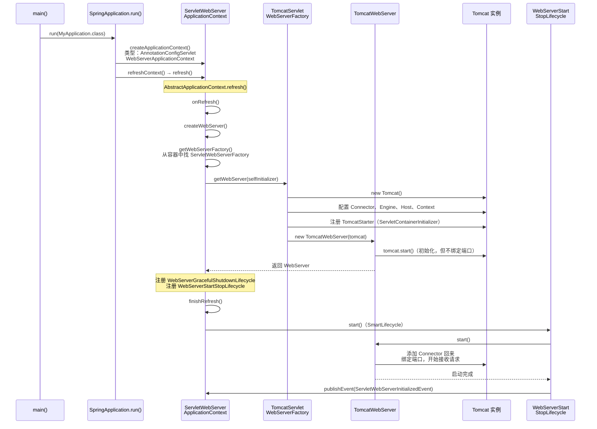
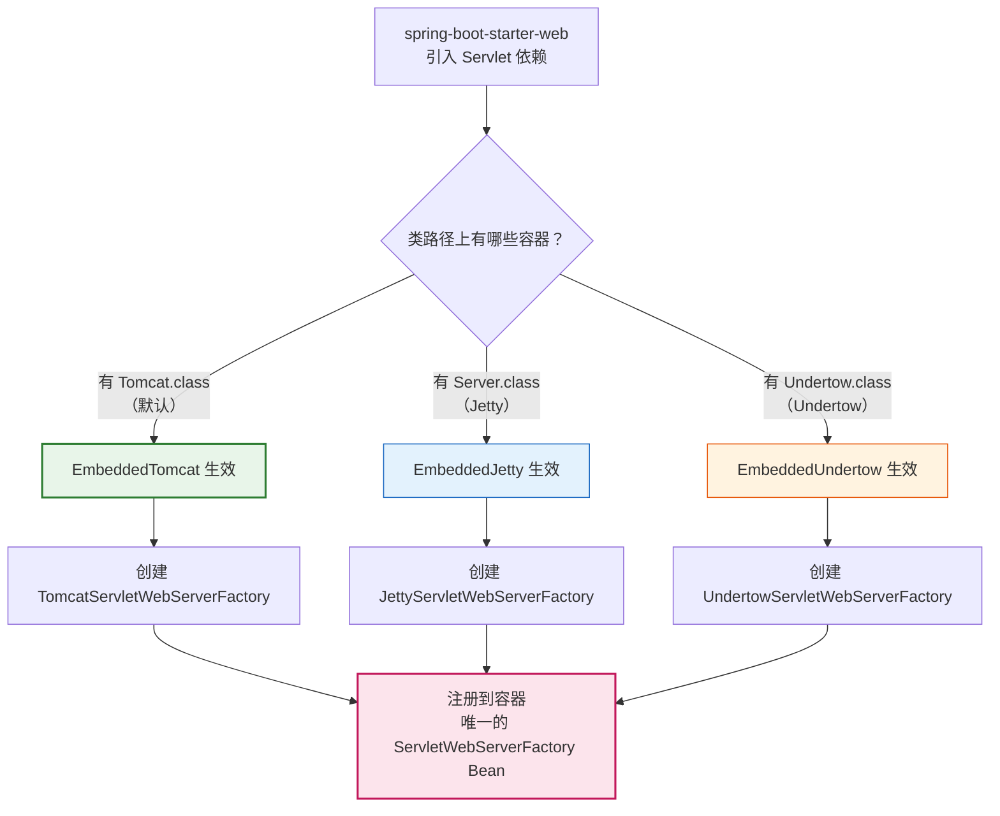
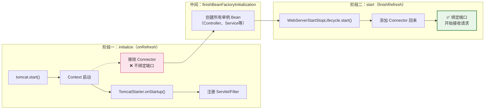
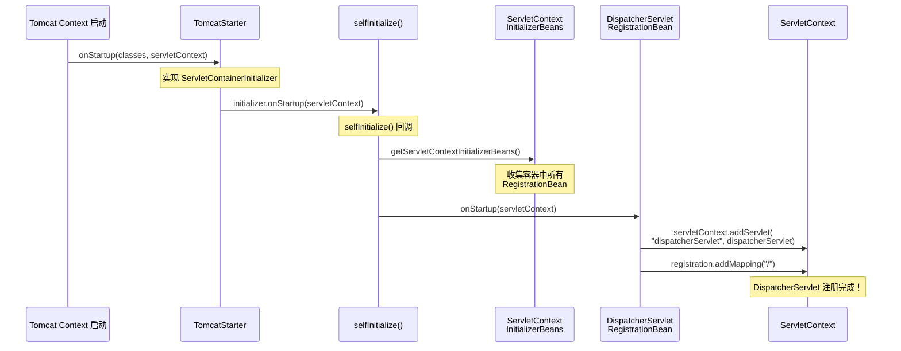
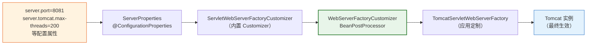
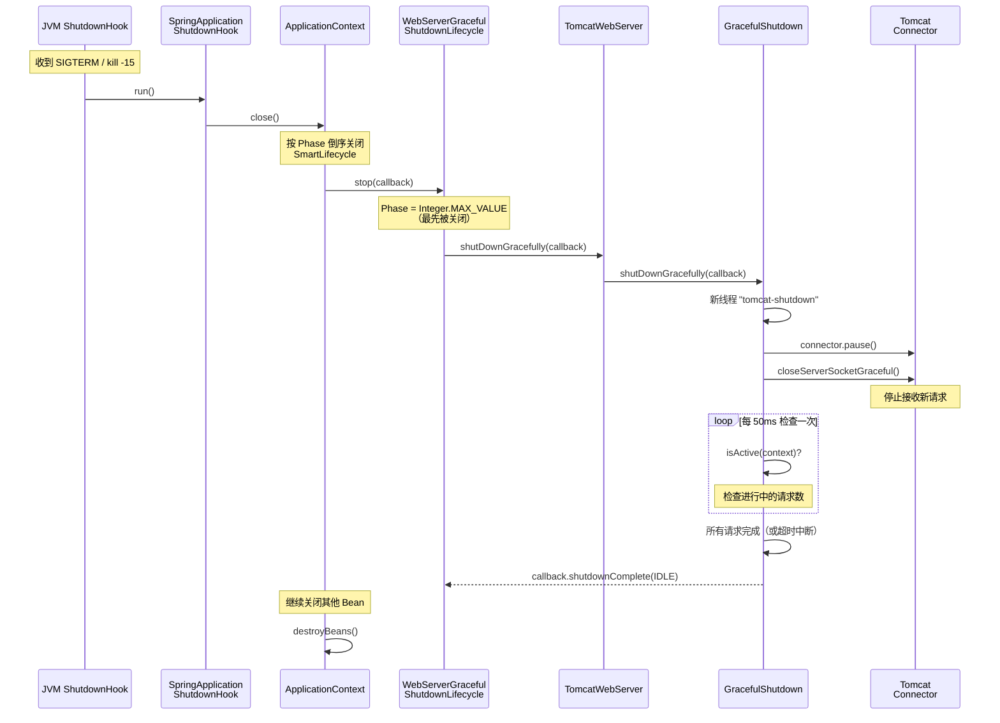
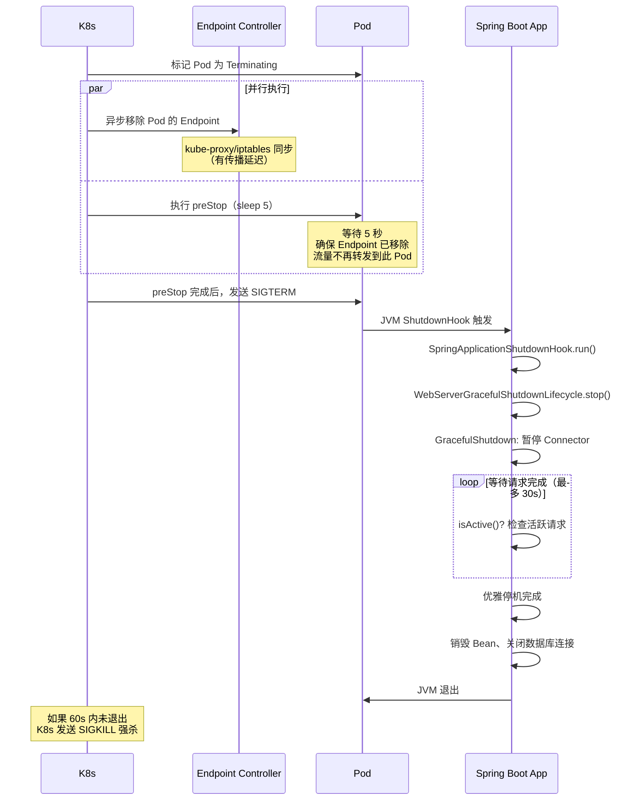
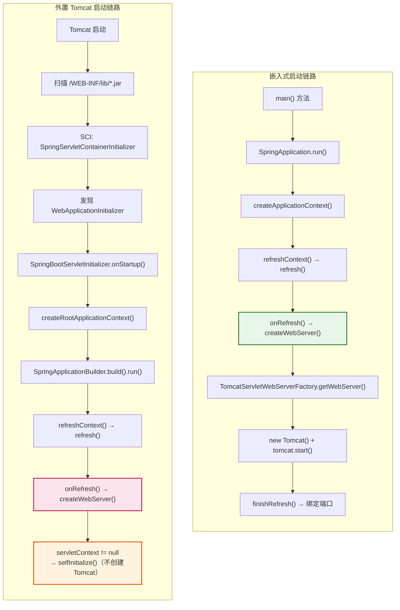
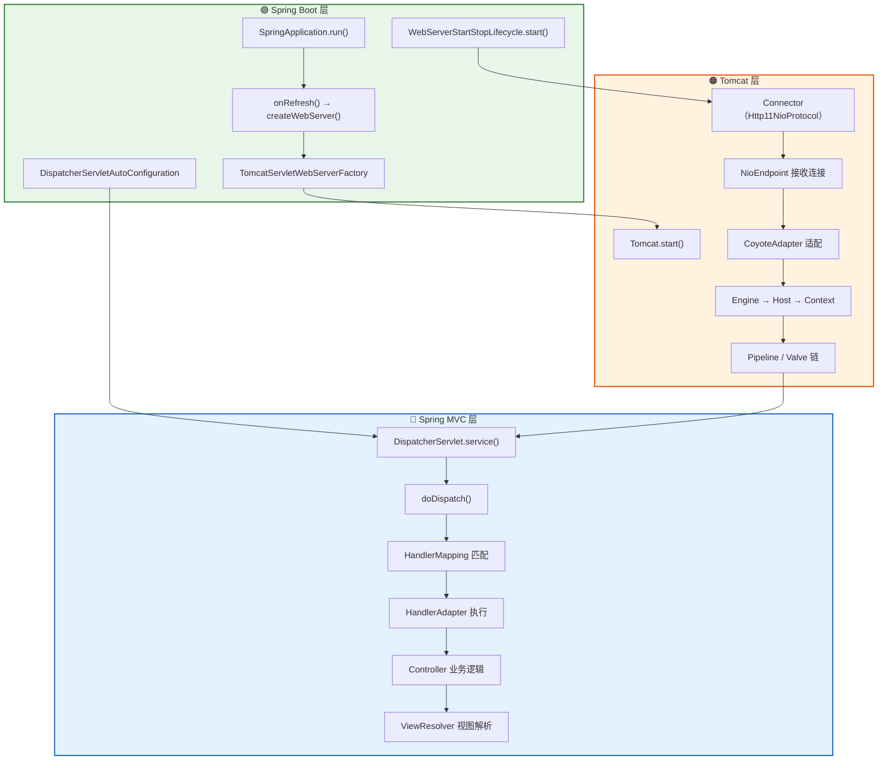

# 嵌入式 Web 容器启动深度分析

> 📌 基于 **Spring Boot 2.7.18** 源码
> 📁 Spring Boot 源码路径：`/data/workspace/spring-boot/`
> 📁 Spring Framework 源码路径：`/data/workspace/spring-framework/`
> 📖 本文是 Spring Boot 源码系列**第 ⑥ 篇**
> 🔗 前置阅读：[① SpringBoot 启动全流程深度分析](SpringBoot启动全流程深度分析.md) + [Tomcat 源码系列](../../../../../../spring-debug/src/main/java/com/debug/mvc_demo/md/Tomcat源码/README.md)

---

## 一、总体概览 — 从外置 Tomcat 到嵌入式 Tomcat，Spring Boot 做了什么？

### 1.1 核心问题

在传统的 Spring MVC 应用中，我们需要：

1. 安装一个独立的 Tomcat 服务器
2. 编写 `web.xml` 或 `WebApplicationInitializer` 配置 `DispatcherServlet`
3. 把应用打成 War 包部署到 Tomcat 的 `webapps/` 目录

而在 Spring Boot 中，一个 `main()` 方法就能启动整个 Web 应用：

```java
@SpringBootApplication
public class MyApplication {
    public static void main(String[] args) {
        SpringApplication.run(MyApplication.class, args);  // ← 一行代码，Tomcat 就跑起来了！
    }
}
```

**核心疑问**：
- Spring Boot 是怎么把 Tomcat "嵌进来"的？
- `DispatcherServlet` 在没有 `web.xml` 的情况下是怎么注册的？
- 嵌入式 Tomcat 和外置 Tomcat 有什么区别？
- 优雅停机（Graceful Shutdown）是怎么实现的？

### 1.2 答案概览

Spring Boot 通过以下**四步**实现了"嵌入式 Web 容器"：

```
① 自动配置 — ServletWebServerFactoryAutoConfiguration 自动选择 Tomcat/Jetty/Undertow
                ↓
② 创建容器 — onRefresh() → createWebServer() → TomcatServletWebServerFactory.getWebServer()
                ↓
③ 注册 Servlet — DispatcherServletAutoConfiguration 创建 DispatcherServlet 并通过 RegistrationBean 注册
                ↓
④ 启动容器 — WebServerStartStopLifecycle.start() → TomcatWebServer.start() → 绑定端口，开始接收请求
```

### 1.3 整体时序图



### 1.4 本文结构预览

| 章节 | 核心内容 |
|------|---------|
| 二 | Web 容器自动配置 — 怎么选择 Tomcat/Jetty/Undertow？ |
| 三 | `onRefresh()` 创建容器 — `createWebServer()` 全链路 |
| 四 | DispatcherServlet 注册 — 没有 `web.xml` 怎么注册？ |
| 五 | Filter/Listener 注册机制 — `ServletContextInitializerBeans` |
| 六 | 容器定制 — `server.port` 等属性怎么生效？ |
| 七 | 优雅停机机制 — `GracefulShutdown` + K8s 配合方案 🏭 |
| 八 | 外置 Tomcat 部署 — `SpringBootServletInitializer` 启动链路 🔴🎯 |
| 九 | 三位一体衔接图 — Spring Boot → Tomcat → Spring MVC |
| 十 | 面试 Q&A |

---

## 二、Web 容器自动配置 — 怎么选择 Tomcat/Jetty/Undertow？

### 2.1 入口：ServletWebServerFactoryAutoConfiguration

```java
// 源码位置：spring-boot-autoconfigure/.../web/servlet/ServletWebServerFactoryAutoConfiguration.java

@AutoConfiguration
@AutoConfigureOrder(Ordered.HIGHEST_PRECEDENCE)          // ← 最高优先级
@ConditionalOnClass(ServletRequest.class)                 // ← 类路径有 Servlet API
@ConditionalOnWebApplication(type = Type.SERVLET)         // ← Servlet 类型的 Web 应用
@EnableConfigurationProperties(ServerProperties.class)    // ← 绑定 server.* 配置
@Import({ 
    ServletWebServerFactoryAutoConfiguration.BeanPostProcessorsRegistrar.class,
    ServletWebServerFactoryConfiguration.EmbeddedTomcat.class,     // ← Tomcat 配置
    ServletWebServerFactoryConfiguration.EmbeddedJetty.class,      // ← Jetty 配置
    ServletWebServerFactoryConfiguration.EmbeddedUndertow.class    // ← Undertow 配置
})
public class ServletWebServerFactoryAutoConfiguration {
    // ...
}
```

**关键设计**：
- `@AutoConfigureOrder(Ordered.HIGHEST_PRECEDENCE)` — 确保容器工厂最早被创建
- `@ConditionalOnWebApplication(type = Type.SERVLET)` — 只在 Servlet Web 应用中生效（非 Reactive）
- `@Import` 了三个内部配置类，分别对应 Tomcat、Jetty、Undertow

### 2.2 三选一：条件注解控制

```java
// 源码位置：spring-boot-autoconfigure/.../web/servlet/ServletWebServerFactoryConfiguration.java

@Configuration(proxyBeanMethods = false)
class ServletWebServerFactoryConfiguration {

    // ========== ① Tomcat ==========
    @Configuration(proxyBeanMethods = false)
    @ConditionalOnClass({ Servlet.class, Tomcat.class, UpgradeProtocol.class })
    @ConditionalOnMissingBean(value = ServletWebServerFactory.class, search = SearchStrategy.CURRENT)
    static class EmbeddedTomcat {
        @Bean
        TomcatServletWebServerFactory tomcatServletWebServerFactory(
                ObjectProvider<TomcatConnectorCustomizer> connectorCustomizers,
                ObjectProvider<TomcatContextCustomizer> contextCustomizers,
                ObjectProvider<TomcatProtocolHandlerCustomizer<?>> protocolHandlerCustomizers) {
            TomcatServletWebServerFactory factory = new TomcatServletWebServerFactory();
            // 收集并应用所有自定义器
            factory.getTomcatConnectorCustomizers().addAll(connectorCustomizers.orderedStream().collect(Collectors.toList()));
            factory.getTomcatContextCustomizers().addAll(contextCustomizers.orderedStream().collect(Collectors.toList()));
            factory.getTomcatProtocolHandlerCustomizers().addAll(protocolHandlerCustomizers.orderedStream().collect(Collectors.toList()));
            return factory;
        }
    }

    // ========== ② Jetty ==========
    @Configuration(proxyBeanMethods = false)
    @ConditionalOnClass({ Servlet.class, Server.class, Loader.class, WebAppContext.class })
    @ConditionalOnMissingBean(value = ServletWebServerFactory.class, search = SearchStrategy.CURRENT)
    static class EmbeddedJetty { /* ... */ }

    // ========== ③ Undertow ==========
    @Configuration(proxyBeanMethods = false)
    @ConditionalOnClass({ Servlet.class, Undertow.class, SslClientAuthMode.class })
    @ConditionalOnMissingBean(value = ServletWebServerFactory.class, search = SearchStrategy.CURRENT)
    static class EmbeddedUndertow { /* ... */ }
}
```

**三选一的核心机制**：

| 配置类 | 条件 | 什么时候生效？ |
|--------|------|--------------|
| `EmbeddedTomcat` | `@ConditionalOnClass(Tomcat.class)` | 类路径有 `org.apache.catalina.startup.Tomcat`（默认） |
| `EmbeddedJetty` | `@ConditionalOnClass(Server.class)` | 类路径有 `org.eclipse.jetty.server.Server` |
| `EmbeddedUndertow` | `@ConditionalOnClass(Undertow.class)` | 类路径有 `io.undertow.Undertow` |

每个配置类都有 `@ConditionalOnMissingBean(ServletWebServerFactory.class)`，**保证只有一个**容器工厂生效。

> **为什么默认是 Tomcat？** 因为 `spring-boot-starter-web` 依赖了 `spring-boot-starter-tomcat`，它传递引入了 `tomcat-embed-core`，所以 `Tomcat.class` 在类路径上。

**切换容器的方式**：

```xml
<!-- 排除 Tomcat，引入 Jetty -->
<dependency>
    <groupId>org.springframework.boot</groupId>
    <artifactId>spring-boot-starter-web</artifactId>
    <exclusions>
        <exclusion>
            <groupId>org.springframework.boot</groupId>
            <artifactId>spring-boot-starter-tomcat</artifactId>
        </exclusion>
    </exclusions>
</dependency>
<dependency>
    <groupId>org.springframework.boot</groupId>
    <artifactId>spring-boot-starter-jetty</artifactId>
</dependency>
```

### 2.3 BeanPostProcessorsRegistrar — 提前注册两个关键后处理器

```java
// ServletWebServerFactoryAutoConfiguration 内部类
public static class BeanPostProcessorsRegistrar 
        implements ImportBeanDefinitionRegistrar, BeanFactoryAware {

    @Override
    public void registerBeanDefinitions(AnnotationMetadata importingClassMetadata,
            BeanDefinitionRegistry registry) {
        // ① WebServerFactoryCustomizerBeanPostProcessor — 收集所有 Customizer 并应用
        registerSyntheticBeanIfMissing(registry, "webServerFactoryCustomizerBeanPostProcessor",
                WebServerFactoryCustomizerBeanPostProcessor.class, 
                WebServerFactoryCustomizerBeanPostProcessor::new);
        // ② ErrorPageRegistrarBeanPostProcessor — 注册错误页面
        registerSyntheticBeanIfMissing(registry, "errorPageRegistrarBeanPostProcessor",
                ErrorPageRegistrarBeanPostProcessor.class, 
                ErrorPageRegistrarBeanPostProcessor::new);
    }
}
```

**为什么用 `ImportBeanDefinitionRegistrar` 而不是 `@Bean`？** 因为 `BeanPostProcessor` 需要**极早注册**，比普通 `@Bean` 方法更早，通过 `ImportBeanDefinitionRegistrar` 可以在配置类解析阶段就完成注册。

### 2.4 容器选择流程图



### 2.5 小结

| 问题 | 答案 |
|------|------|
| 怎么选择 Tomcat/Jetty/Undertow？ | `@ConditionalOnClass` + `@ConditionalOnMissingBean` 条件注解 |
| 为什么默认是 Tomcat？ | `spring-boot-starter-web` 传递依赖 `spring-boot-starter-tomcat` |
| 怎么切换到 Jetty？ | 排除 `spring-boot-starter-tomcat`，引入 `spring-boot-starter-jetty` |
| `BeanPostProcessorsRegistrar` 为什么不用 `@Bean`？ | 需要极早注册 `BeanPostProcessor`，`@Import(Registrar)` 更早 |

---

## 三、onRefresh() 创建容器 — createWebServer() 全链路

### 3.1 触发时机：refresh() 中的 onRefresh()

回顾 [① SpringBoot 启动全流程深度分析](SpringBoot启动全流程深度分析.md) 中的 `refreshContext()` 阶段：

```
AbstractApplicationContext.refresh()
  ├── prepareRefresh()
  ├── obtainFreshBeanFactory()
  ├── prepareBeanFactory()
  ├── postProcessBeanFactory()
  ├── invokeBeanFactoryPostProcessors()    ← 自动配置在这里被处理
  ├── registerBeanPostProcessors()
  ├── initMessageSource()
  ├── initApplicationEventMulticaster()
  ├── onRefresh()                          ← 🔴 嵌入式容器在这里创建！
  ├── registerListeners()
  ├── finishBeanFactoryInitialization()    ← 所有单例 Bean 在这里创建
  └── finishRefresh()                      ← SmartLifecycle.start() → 容器真正启动
```

`onRefresh()` 是一个模板方法，`ServletWebServerApplicationContext` 重写了它：

```java
// 源码位置：spring-boot/.../web/servlet/context/ServletWebServerApplicationContext.java

@Override
protected void onRefresh() {
    super.onRefresh();              // 调用父类（空实现）
    try {
        createWebServer();          // ← 🔴 创建嵌入式 Web 容器
    }
    catch (Throwable ex) {
        throw new ApplicationContextException("Unable to start web server", ex);
    }
}
```

### 3.2 createWebServer() — 核心创建逻辑

```java
// 源码位置：ServletWebServerApplicationContext.java

private void createWebServer() {
    WebServer webServer = this.webServer;
    ServletContext servletContext = getServletContext();
    
    // ========== 场景一：嵌入式容器（webServer == null && servletContext == null） ==========
    if (webServer == null && servletContext == null) {
        StartupStep createWebServer = this.getApplicationStartup().start("spring.boot.webserver.create");
        
        // ① 从容器中获取 ServletWebServerFactory（唯一一个）
        ServletWebServerFactory factory = getWebServerFactory();
        createWebServer.tag("factory", factory.getClass().toString());
        
        // ② 调用工厂的 getWebServer() 创建 WebServer
        this.webServer = factory.getWebServer(getSelfInitializer());
        createWebServer.end();
        
        // ③ 注册优雅停机生命周期 Bean
        getBeanFactory().registerSingleton("webServerGracefulShutdown",
                new WebServerGracefulShutdownLifecycle(this.webServer));
        
        // ④ 注册启动/停止生命周期 Bean
        getBeanFactory().registerSingleton("webServerStartStop",
                new WebServerStartStopLifecycle(this, this.webServer));
    }
    // ========== 场景二：外置容器（servletContext != null） ==========
    else if (servletContext != null) {
        try {
            getSelfInitializer().onStartup(servletContext);
        }
        catch (ServletException ex) {
            throw new ApplicationContextException("Cannot initialize servlet context", ex);
        }
    }
    
    initPropertySources();
}
```

**两个场景的判断逻辑**：

| 条件 | 场景 | 说明 |
|------|------|------|
| `webServer == null && servletContext == null` | **嵌入式容器**（最常见） | 从零创建 Tomcat |
| `servletContext != null` | **外置容器** | Tomcat 已经由外部启动，只需注册 Servlet/Filter |

### 3.3 getWebServerFactory() — 从容器中获取工厂

```java
protected ServletWebServerFactory getWebServerFactory() {
    String[] beanNames = getBeanFactory().getBeanNamesForType(ServletWebServerFactory.class);
    if (beanNames.length == 0) {
        throw new MissingWebServerFactoryBeanException(getClass(), 
                ServletWebServerFactory.class, WebApplicationType.SERVLET);
    }
    if (beanNames.length > 1) {
        throw new ApplicationContextException(
                "Unable to start ServletWebServerApplicationContext due to multiple "
                + "ServletWebServerFactory beans : " + StringUtils.arrayToCommaDelimitedString(beanNames));
    }
    return getBeanFactory().getBean(beanNames[0], ServletWebServerFactory.class);
}
```

**关键约束**：容器中**必须有且仅有一个** `ServletWebServerFactory` Bean。这就是第二章中三个 `EmbeddedXxx` 配置类互斥的原因。

### 3.4 TomcatServletWebServerFactory.getWebServer() — 创建 Tomcat

这是最核心的方法，Spring Boot 在这里**手动构建了一个完整的 Tomcat 实例**：

```java
// 源码位置：spring-boot/.../web/embedded/tomcat/TomcatServletWebServerFactory.java

@Override
public WebServer getWebServer(ServletContextInitializer... initializers) {
    if (this.disableMBeanRegistry) {
        Registry.disableRegistry();            // ① 禁用 MBean 注册（性能优化）
    }
    
    Tomcat tomcat = new Tomcat();              // ② 创建 Tomcat 实例
    
    // ③ 设置基础目录
    File baseDir = (this.baseDirectory != null) ? this.baseDirectory : createTempDir("tomcat");
    tomcat.setBaseDir(baseDir.getAbsolutePath());
    
    // ④ 添加服务器生命周期监听器
    for (LifecycleListener listener : this.serverLifecycleListeners) {
        tomcat.getServer().addLifecycleListener(listener);
    }
    
    // ⑤ 创建 Connector（默认 Http11NioProtocol）
    Connector connector = new Connector(this.protocol);  // "org.apache.coyote.http11.Http11NioProtocol"
    connector.setThrowOnFailure(true);
    tomcat.getService().addConnector(connector);
    customizeConnector(connector);             // 应用自定义配置（端口、编码等）
    tomcat.setConnector(connector);
    
    // ⑥ 配置 Host
    tomcat.getHost().setAutoDeploy(false);
    
    // ⑦ 配置 Engine
    configureEngine(tomcat.getEngine());
    
    // ⑧ 添加额外的 Connector（如 HTTPS、AJP）
    for (Connector additionalConnector : this.additionalTomcatConnectors) {
        tomcat.getService().addConnector(additionalConnector);
    }
    
    // ⑨ 准备 Context（设置 ClassLoader、注册 TomcatStarter 等）
    prepareContext(tomcat.getHost(), initializers);
    
    // ⑩ 创建 TomcatWebServer（会立即调用 tomcat.start()）
    return getTomcatWebServer(tomcat);
}
```

**对照 Tomcat 源码系列**：这里手动构建的组件层次与 Tomcat 原生的架构完全一致：

```
Server
  └── Service
        ├── Connector（Http11NioProtocol）  ← 步骤⑤
        └── Engine                           ← 步骤⑦
              └── Host（autoDeploy=false）   ← 步骤⑥
                    └── Context              ← 步骤⑨（prepareContext）
                          └── TomcatStarter（ServletContainerInitializer）
```

### 3.5 prepareContext() — 准备 Tomcat Context

```java
// 源码位置：TomcatServletWebServerFactory.java

protected void prepareContext(Host host, ServletContextInitializer[] initializers) {
    TomcatEmbeddedContext context = new TomcatEmbeddedContext();
    
    // 基础配置
    context.setName(getContextPath());
    context.setPath(getContextPath());
    File docBase = createTempDir("tomcat-docbase");
    context.setDocBase(docBase.getAbsolutePath());
    context.addLifecycleListener(new FixContextListener());
    context.setParentClassLoader(ClassUtils.getDefaultClassLoader());
    
    // 配置 WebappLoader（委托模式）
    WebappLoader loader = new WebappLoader();
    loader.setLoaderClass(TomcatEmbeddedWebappClassLoader.class.getName());
    loader.setDelegate(true);  // ← 关键：委托给父类加载器（打破双亲委派）
    context.setLoader(loader);
    
    // 合并 initializers
    ServletContextInitializer[] initializersToUse = mergeInitializers(initializers);
    
    // 添加到 Host
    host.addChild(context);
    
    // 配置 Context（核心：注册 TomcatStarter）
    configureContext(context, initializersToUse);
}
```

### 3.6 configureContext() — 注册 TomcatStarter

```java
protected void configureContext(Context context, ServletContextInitializer[] initializers) {
    // 🔴 关键：创建 TomcatStarter 并注册为 ServletContainerInitializer
    TomcatStarter starter = new TomcatStarter(initializers);
    if (context instanceof TomcatEmbeddedContext) {
        TomcatEmbeddedContext embeddedContext = (TomcatEmbeddedContext) context;
        embeddedContext.setStarter(starter);
        embeddedContext.setFailCtxIfServletStartFails(true);
    }
    context.addServletContainerInitializer(starter, NO_CLASSES);
    
    // 注册错误页面、MIME 映射、Session 配置等
    for (ErrorPage errorPage : getErrorPages()) { /* ... */ }
    for (MimeMappings.Mapping mapping : getMimeMappings()) { /* ... */ }
    configureSession(context);
    // ...
}
```

**TomcatStarter 的角色**非常关键 — 它是 **Servlet 规范和 Spring Boot 的桥梁**：

```java
// 源码位置：spring-boot/.../web/embedded/tomcat/TomcatStarter.java

class TomcatStarter implements ServletContainerInitializer {

    private final ServletContextInitializer[] initializers;

    @Override
    public void onStartup(Set<Class<?>> classes, ServletContext servletContext) throws ServletException {
        try {
            // 遍历所有 Spring Boot 的 ServletContextInitializer 并执行
            for (ServletContextInitializer initializer : this.initializers) {
                initializer.onStartup(servletContext);
            }
        }
        catch (Exception ex) {
            this.startUpException = ex;
            // ...
        }
    }
}
```

```
桥接关系：
Servlet 规范                    Spring Boot
───────────                    ───────────
ServletContainerInitializer  →  TomcatStarter  →  ServletContextInitializer
（Tomcat 回调）                  （桥梁）           （Spring Boot 的初始化接口）
```

### 3.7 TomcatWebServer — 初始化与两阶段启动

`getTomcatWebServer()` 返回一个 `TomcatWebServer` 实例：

```java
protected TomcatWebServer getTomcatWebServer(Tomcat tomcat) {
    return new TomcatWebServer(tomcat, getPort() >= 0, getShutdown());
}
```

`TomcatWebServer` 的构造函数中调用了 `initialize()`：

```java
// 源码位置：spring-boot/.../web/embedded/tomcat/TomcatWebServer.java

public TomcatWebServer(Tomcat tomcat, boolean autoStart, Shutdown shutdown) {
    this.tomcat = tomcat;
    this.autoStart = autoStart;
    this.gracefulShutdown = (shutdown == Shutdown.GRACEFUL) ? new GracefulShutdown(tomcat) : null;
    initialize();   // ← 立即初始化
}

private void initialize() throws WebServerException {
    logger.info("Tomcat initialized with port(s): " + getPortsDescription(false));
    synchronized (this.monitor) {
        try {
            addInstanceIdToEngineName();
            
            Context context = findContext();
            context.addLifecycleListener((event) -> {
                if (context.equals(event.getSource()) && Lifecycle.START_EVENT.equals(event.getType())) {
                    // 🔴 关键：在 Context 启动时，移除所有 Connector
                    // 防止在 Service 启动时就绑定端口
                    removeServiceConnectors();
                }
            });

            // 🔴 启动 Tomcat（但由于 Connector 已被移除，不会绑定端口）
            this.tomcat.start();

            // 检查启动异常（TomcatStarter 中收集的）
            rethrowDeferredStartupExceptions();

            // 创建一个非守护线程，防止 JVM 立即退出
            startNonDaemonAwaitThread();
        }
        catch (Exception ex) {
            stopSilently();
            destroySilently();
            throw new WebServerException("Unable to start embedded Tomcat", ex);
        }
    }
}
```

**🔴 两阶段启动设计** — 这是 Spring Boot 嵌入式容器最精巧的设计之一：

| 阶段 | 时机 | 做了什么 | 为什么这样做？ |
|------|------|---------|--------------|
| **阶段一：initialize** | `onRefresh()` 中 | `tomcat.start()` 启动 Tomcat，但**移除了 Connector**，不绑定端口 | 让 Tomcat 的 `Context` 启动，触发 `TomcatStarter.onStartup()`，完成 Servlet/Filter 注册 |
| **阶段二：start** | `finishRefresh()` 中（SmartLifecycle） | 把 Connector 加回来，**绑定端口**，开始接收请求 | 确保所有 Bean 都初始化完毕后再开放端口，避免请求进来时 Bean 还没准备好 |



### 3.8 start() — 阶段二，真正开始接收请求

```java
// 源码位置：TomcatWebServer.java

@Override
public void start() throws WebServerException {
    synchronized (this.monitor) {
        if (this.started) {
            return;
        }
        try {
            // ① 把之前移除的 Connector 加回来
            addPreviouslyRemovedConnectors();
            
            Connector connector = this.tomcat.getConnector();
            if (connector != null && this.autoStart) {
                // ② 触发延迟加载的 Servlet（loadOnStartup > 0 的 Servlet）
                performDeferredLoadOnStartup();
            }
            
            // ③ 检查 Connector 是否启动成功
            checkThatConnectorsHaveStarted();
            
            this.started = true;
            logger.info("Tomcat started on port(s): " + getPortsDescription(true) 
                    + " with context path '" + getContextPath() + "'");
        }
        catch (ConnectorStartFailedException ex) {
            stopSilently();
            throw ex;
        }
        catch (Exception ex) {
            PortInUseException.throwIfPortBindingException(ex, () -> this.tomcat.getConnector().getPort());
            throw new WebServerException("Unable to start embedded Tomcat server", ex);
        }
    }
}
```

**`start()` 由谁调用？** — 由 `WebServerStartStopLifecycle`（`SmartLifecycle` 实现）在 `finishRefresh()` 阶段调用：

```java
// 源码位置：spring-boot/.../web/servlet/context/WebServerStartStopLifecycle.java

class WebServerStartStopLifecycle implements SmartLifecycle {

    private final ServletWebServerApplicationContext applicationContext;
    private final WebServer webServer;

    @Override
    public void start() {
        this.webServer.start();     // ← 调用 TomcatWebServer.start()
        this.running = true;
        // 发布 ServletWebServerInitializedEvent 事件
        this.applicationContext.publishEvent(
                new ServletWebServerInitializedEvent(this.webServer, this.applicationContext));
    }

    @Override
    public int getPhase() {
        return Integer.MAX_VALUE - 1;  // ← 几乎最后一个启动（仅优雅停机更晚）
    }
}
```

### 3.9 getSelfInitializer() — 自初始化回调

回到 `createWebServer()` 中，传给工厂的 `getSelfInitializer()` 是什么？

```java
private org.springframework.boot.web.servlet.ServletContextInitializer getSelfInitializer() {
    return this::selfInitialize;
}

private void selfInitialize(ServletContext servletContext) throws ServletException {
    // ① 将 ApplicationContext 设置为 ServletContext 的根上下文属性
    prepareWebApplicationContext(servletContext);
    
    // ② 注册 APPLICATION scope
    registerApplicationScope(servletContext);
    
    // ③ 注册 Environment 相关的 Bean
    WebApplicationContextUtils.registerEnvironmentBeans(getBeanFactory(), servletContext);
    
    // ④ 🔴 遍历所有 ServletContextInitializer Bean 并执行 onStartup()
    for (ServletContextInitializer beans : getServletContextInitializerBeans()) {
        beans.onStartup(servletContext);
    }
}
```

**步骤④是关键** — `getServletContextInitializerBeans()` 返回的 `ServletContextInitializerBeans` 会收集容器中所有的：
- `ServletRegistrationBean`（注册 Servlet）
- `FilterRegistrationBean`（注册 Filter）
- `ServletListenerRegistrationBean`（注册 Listener）
- 裸露的 `Servlet`、`Filter`、`EventListener` Bean

这就是 DispatcherServlet、Filter 等组件注册到嵌入式 Tomcat 的**核心入口**。

### 3.10 小结

| 问题 | 答案 |
|------|------|
| 嵌入式容器在 `refresh()` 的哪个阶段创建？ | `onRefresh()` — 模板方法 |
| 为什么分两阶段启动？ | 阶段一（initialize）启动 Tomcat 但不绑定端口，等 Bean 创建完；阶段二（start）绑定端口接收请求 |
| `TomcatStarter` 的作用？ | `ServletContainerInitializer`（Servlet 规范）→ `ServletContextInitializer`（Spring Boot）的桥梁 |
| Connector 为什么要先移除再加回来？ | 防止端口过早绑定，请求进来时 Bean 还没准备好 |
| `getSelfInitializer()` 做了什么？ | 收集所有 `ServletContextInitializer` Bean（RegistrationBean 等），在 Tomcat Context 启动时回调注册 Servlet/Filter |

---

## 四、DispatcherServlet 注册 — 没有 web.xml 怎么注册？

### 4.1 传统方式 vs Spring Boot 方式

| 传统 Spring MVC | Spring Boot |
|----------------|-------------|
| `web.xml` 中配置 `<servlet>` | `DispatcherServletAutoConfiguration` 自动创建 |
| 或 `WebApplicationInitializer.onStartup()` | `DispatcherServletRegistrationBean` 注册到容器 |
| Tomcat 解析 `web.xml` 注册 | `TomcatStarter` → `ServletContextInitializer.onStartup()` 注册 |

### 4.2 DispatcherServletAutoConfiguration — 两步走

```java
// 源码位置：spring-boot-autoconfigure/.../web/servlet/DispatcherServletAutoConfiguration.java

@AutoConfigureOrder(Ordered.HIGHEST_PRECEDENCE)
@AutoConfiguration(after = ServletWebServerFactoryAutoConfiguration.class)  // ← 在容器工厂之后
@ConditionalOnWebApplication(type = Type.SERVLET)
@ConditionalOnClass(DispatcherServlet.class)                                // ← 类路径有 DispatcherServlet
public class DispatcherServletAutoConfiguration {

    public static final String DEFAULT_DISPATCHER_SERVLET_BEAN_NAME = "dispatcherServlet";
    public static final String DEFAULT_DISPATCHER_SERVLET_REGISTRATION_BEAN_NAME = "dispatcherServletRegistration";
    
    // ...
}
```

**两步走**：
1. **步骤一：创建 DispatcherServlet Bean**（`DispatcherServletConfiguration`）
2. **步骤二：创建 RegistrationBean 注册到 Tomcat**（`DispatcherServletRegistrationConfiguration`）

#### 步骤一：DispatcherServletConfiguration — 创建 DispatcherServlet

```java
@Configuration(proxyBeanMethods = false)
@Conditional(DefaultDispatcherServletCondition.class)   // ← 容器中没有 dispatcherServlet Bean 时生效
@ConditionalOnClass(ServletRegistration.class)
@EnableConfigurationProperties(WebMvcProperties.class)
protected static class DispatcherServletConfiguration {

    @Bean(name = DEFAULT_DISPATCHER_SERVLET_BEAN_NAME)
    public DispatcherServlet dispatcherServlet(WebMvcProperties webMvcProperties) {
        DispatcherServlet dispatcherServlet = new DispatcherServlet();
        dispatcherServlet.setDispatchOptionsRequest(webMvcProperties.isDispatchOptionsRequest());
        dispatcherServlet.setDispatchTraceRequest(webMvcProperties.isDispatchTraceRequest());
        dispatcherServlet.setThrowExceptionIfNoHandlerFound(webMvcProperties.isThrowExceptionIfNoHandlerFound());
        dispatcherServlet.setPublishEvents(webMvcProperties.isPublishRequestHandledEvents());
        dispatcherServlet.setEnableLoggingRequestDetails(webMvcProperties.isLogRequestDetails());
        return dispatcherServlet;
    }

    @Bean
    @ConditionalOnBean(MultipartResolver.class)
    @ConditionalOnMissingBean(name = DispatcherServlet.MULTIPART_RESOLVER_BEAN_NAME)
    public MultipartResolver multipartResolver(MultipartResolver resolver) {
        // 如果用户注册了 MultipartResolver 但名字不对，自动重命名
        return resolver;
    }
}
```

> **注意**：`DefaultDispatcherServletCondition` 检查容器中是否已存在名为 `dispatcherServlet` 的 Bean。如果用户自己定义了同名 Bean，这里就不会生效。

#### 步骤二：DispatcherServletRegistrationConfiguration — 注册到 Tomcat

```java
@Configuration(proxyBeanMethods = false)
@Conditional(DispatcherServletRegistrationCondition.class)
@ConditionalOnClass(ServletRegistration.class)
@EnableConfigurationProperties(WebMvcProperties.class)
@Import(DispatcherServletConfiguration.class)
protected static class DispatcherServletRegistrationConfiguration {

    @Bean(name = DEFAULT_DISPATCHER_SERVLET_REGISTRATION_BEAN_NAME)
    @ConditionalOnBean(value = DispatcherServlet.class, name = DEFAULT_DISPATCHER_SERVLET_BEAN_NAME)
    public DispatcherServletRegistrationBean dispatcherServletRegistration(
            DispatcherServlet dispatcherServlet,
            WebMvcProperties webMvcProperties,
            ObjectProvider<MultipartConfigElement> multipartConfig) {
        
        DispatcherServletRegistrationBean registration = new DispatcherServletRegistrationBean(
                dispatcherServlet, 
                webMvcProperties.getServlet().getPath());    // ← 映射路径，默认 "/"
        
        registration.setName(DEFAULT_DISPATCHER_SERVLET_BEAN_NAME);
        registration.setLoadOnStartup(webMvcProperties.getServlet().getLoadOnStartup());  // ← 默认 -1
        multipartConfig.ifAvailable(registration::setMultipartConfig);
        return registration;
    }
}
```

**`DispatcherServletRegistrationBean` 的继承链**：

```
DispatcherServletRegistrationBean
  └── ServletRegistrationBean<DispatcherServlet>
        └── DynamicRegistrationBean<ServletRegistration.Dynamic>
              └── RegistrationBean
                    └── ServletContextInitializer    ← 实现了 onStartup() 接口！
```

**关键**：`DispatcherServletRegistrationBean` 本质是一个 `ServletContextInitializer`，它的 `onStartup()` 方法会把 `DispatcherServlet` 注册到 `ServletContext` 中。

### 4.3 注册调用链



### 4.4 与 MVC 源码系列的衔接

在 [MVC 源码系列](../../../../../../spring-debug/src/main/java/com/debug/mvc_demo/md/mvc源码/README.md) 中，我们讲过 DispatcherServlet 的注册方式：

| 部署方式 | 注册 DispatcherServlet 的方式 | 详细文档 |
|---------|----------------------------|---------|
| **外置 Tomcat + `web.xml`** | `<servlet>` 配置 | MVC ① Tomcat 关系 |
| **外置 Tomcat + SCI** | `WebApplicationInitializer.onStartup()` → `servletContext.addServlet()` | MVC ① Tomcat 关系 |
| **嵌入式 Tomcat（Spring Boot）** | `DispatcherServletRegistrationBean` → `TomcatStarter` → `servletContext.addServlet()` | 本文 |

三种方式最终都调用了 `servletContext.addServlet()`，殊途同归。

### 4.5 小结

| 问题 | 答案 |
|------|------|
| Spring Boot 怎么注册 DispatcherServlet？ | `DispatcherServletAutoConfiguration` 创建 Bean + `DispatcherServletRegistrationBean` 注册到 ServletContext |
| 为什么不需要 `web.xml`？ | `TomcatStarter`（`ServletContainerInitializer`）在 Tomcat 启动时回调 `onStartup()`，通过编程方式注册 |
| 默认映射路径是什么？ | `/`（通过 `spring.mvc.servlet.path` 可自定义） |
| `DispatcherServletRegistrationBean` 本质是什么？ | 一个 `ServletContextInitializer`，`onStartup()` 中调用 `servletContext.addServlet()` |

---

## 五、Filter/Listener 注册机制 — ServletContextInitializerBeans

### 5.1 注册体系概览

Spring Boot 通过 `RegistrationBean` 体系实现了 Servlet/Filter/Listener 的**编程式注册**：

```
ServletContextInitializer（接口）
  └── RegistrationBean（抽象基类）
        └── DynamicRegistrationBean<D>（动态注册）
              ├── ServletRegistrationBean<T extends Servlet>
              │     └── DispatcherServletRegistrationBean
              └── FilterRegistrationBean<T extends Filter>
                    └── DelegatingFilterProxyRegistrationBean
        └── ServletListenerRegistrationBean<T extends EventListener>
```

### 5.2 FilterRegistrationBean — 注册 Filter

```java
// 使用示例
@Bean
public FilterRegistrationBean<CharacterEncodingFilter> characterEncodingFilter() {
    FilterRegistrationBean<CharacterEncodingFilter> registration = new FilterRegistrationBean<>();
    registration.setFilter(new CharacterEncodingFilter("UTF-8", true));
    registration.addUrlPatterns("/*");
    registration.setOrder(Ordered.HIGHEST_PRECEDENCE);
    registration.setName("characterEncodingFilter");
    return registration;
}
```

`FilterRegistrationBean` 的 `onStartup()` 方法会调用 `servletContext.addFilter()`：

```java
// RegistrationBean.onStartup() → DynamicRegistrationBean.register()
@Override
protected Dynamic addRegistration(String description, ServletContext servletContext) {
    Filter filter = getFilter();
    return servletContext.addFilter(getOrDeduceName(filter), filter);
}
```

### 5.3 ServletContextInitializerBeans — 自动收集

`ServletContextInitializerBeans` 是一个**集合类**，它会自动从 `BeanFactory` 中收集所有需要注册的组件：

```java
// 源码位置：spring-boot/.../web/servlet/ServletContextInitializerBeans.java

public ServletContextInitializerBeans(ListableBeanFactory beanFactory,
        Class<? extends ServletContextInitializer>... initializerTypes) {
    
    // ① 收集所有 ServletContextInitializer Bean（RegistrationBean 等）
    addServletContextInitializerBeans(beanFactory);
    
    // ② 收集裸露的 Servlet、Filter、EventListener Bean（自动适配为 RegistrationBean）
    addAdaptableBeans(beanFactory);
    
    // ③ 排序（AnnotationAwareOrderComparator）
    List<ServletContextInitializer> sortedInitializers = this.initializers.values()
        .stream()
        .flatMap((value) -> value.stream().sorted(AnnotationAwareOrderComparator.INSTANCE))
        .collect(Collectors.toList());
    this.sortedList = Collections.unmodifiableList(sortedInitializers);
}
```

**收集策略**：

| 收集目标 | 处理方式 |
|---------|---------|
| `ServletRegistrationBean` | 直接使用 |
| `FilterRegistrationBean` | 直接使用 |
| `ServletListenerRegistrationBean` | 直接使用 |
| 裸露的 `Servlet` Bean | 自动包装为 `ServletRegistrationBean`，映射到 `/` |
| 裸露的 `Filter` Bean | 自动包装为 `FilterRegistrationBean`，映射到 `/*` |
| 裸露的 `EventListener` Bean | 自动包装为 `ServletListenerRegistrationBean` |

> **去重机制**：如果一个 `Servlet` 已经被某个 `ServletRegistrationBean` 包装了，就不会再被自动包装，避免重复注册。

### 5.4 注册顺序

`ServletContextInitializerBeans` 的排序规则：

```
1. ServletRegistrationBean（Servlet 最先注册）
2. FilterRegistrationBean（Filter 其次）
3. EventListener 相关的 RegistrationBean
4. 其他 ServletContextInitializer
```

每组内部按 `@Order` 注解或 `Ordered` 接口排序。

### 5.5 小结

| 问题 | 答案 |
|------|------|
| 怎么注册自定义 Filter？ | 方式一：定义 `FilterRegistrationBean` Bean；方式二：直接定义 `Filter` Bean（自动适配） |
| 裸露的 Filter Bean 映射到哪里？ | `/*`（拦截所有请求） |
| 注册顺序是什么？ | Servlet → Filter → Listener → 其他 |
| 怎么控制 Filter 顺序？ | 通过 `FilterRegistrationBean.setOrder()` 或 `@Order` 注解 |

---

## 六、容器定制 — server.port 等属性怎么生效？

### 6.1 定制机制：WebServerFactoryCustomizer

Spring Boot 通过 `WebServerFactoryCustomizer` 接口实现容器定制：

```java
@FunctionalInterface
public interface WebServerFactoryCustomizer<T extends WebServerFactory> {
    void customize(T factory);
}
```

**核心流程**：



### 6.2 WebServerFactoryCustomizerBeanPostProcessor — 触发定制

```java
// 源码位置：spring-boot/.../web/server/WebServerFactoryCustomizerBeanPostProcessor.java

public class WebServerFactoryCustomizerBeanPostProcessor implements BeanPostProcessor, BeanFactoryAware {

    @Override
    public Object postProcessBeforeInitialization(Object bean, String beanName) throws BeansException {
        if (bean instanceof WebServerFactory) {
            // 当 WebServerFactory Bean 被创建时，自动应用所有 Customizer
            postProcessBeforeInitialization((WebServerFactory) bean);
        }
        return bean;
    }

    private void postProcessBeforeInitialization(WebServerFactory webServerFactory) {
        // 从容器中收集所有 WebServerFactoryCustomizer，排序后逐个应用
        LambdaSafe.callbacks(WebServerFactoryCustomizer.class, getCustomizers(), webServerFactory)
            .withLogger(WebServerFactoryCustomizerBeanPostProcessor.class)
            .invoke((customizer) -> customizer.customize(webServerFactory));
    }
}
```

**执行时机**：当 `TomcatServletWebServerFactory` 这个 Bean 被创建时（`postProcessBeforeInitialization`），所有 `WebServerFactoryCustomizer` 会自动应用。

### 6.3 内置 Customizer 链

Spring Boot 提供了多个内置的 `WebServerFactoryCustomizer`：

| Customizer | 职责 | 对应配置 |
|-----------|------|---------|
| `ServletWebServerFactoryCustomizer` | 通用配置（端口、地址、错误页等） | `server.port`、`server.address` |
| `TomcatServletWebServerFactoryCustomizer` | Tomcat 特有配置 | `server.tomcat.*` |
| `TomcatWebServerFactoryCustomizer` | Tomcat 额外配置 | `server.tomcat.threads.*`、`server.tomcat.max-connections` |

以 `ServletWebServerFactoryCustomizer` 为例：

```java
@Override
public void customize(ConfigurableServletWebServerFactory factory) {
    PropertyMapper map = PropertyMapper.get().alwaysApplyingWhenNonNull();
    map.from(this.serverProperties::getPort).to(factory::setPort);
    map.from(this.serverProperties::getAddress).to(factory::setAddress);
    map.from(this.serverProperties.getServlet()::getContextPath).to(factory::setContextPath);
    map.from(this.serverProperties.getServlet()::getApplicationDisplayName).to(factory::setDisplayName);
    // ... 更多配置
}
```

### 6.4 自定义 Customizer

用户可以定义自己的 `WebServerFactoryCustomizer`：

```java
@Component
public class MyTomcatCustomizer implements WebServerFactoryCustomizer<TomcatServletWebServerFactory> {
    
    @Override
    public void customize(TomcatServletWebServerFactory factory) {
        factory.setPort(9090);
        factory.addConnectorCustomizers(connector -> {
            connector.setProperty("maxThreads", "500");
        });
    }
}
```

### 6.5 常用配置属性速查

| 配置项 | 默认值 | 说明 |
|--------|-------|------|
| `server.port` | `8080` | 监听端口 |
| `server.address` | `0.0.0.0` | 绑定地址 |
| `server.servlet.context-path` | `/` | 上下文路径 |
| `server.tomcat.threads.max` | `200` | 最大工作线程数 |
| `server.tomcat.threads.min-spare` | `10` | 最小空闲线程数 |
| `server.tomcat.max-connections` | `8192` | 最大连接数 |
| `server.tomcat.accept-count` | `100` | 等待队列长度 |
| `server.tomcat.connection-timeout` | `20s` | 连接超时 |
| `server.tomcat.max-http-form-post-size` | `2MB` | POST 表单最大大小 |
| `server.shutdown` | `immediate` | 停机模式（`immediate` / `graceful`） |
| `spring.lifecycle.timeout-per-shutdown-phase` | `30s` | 优雅停机超时时间 |

### 6.6 customizeConnector() — 属性怎么应用到 Connector？

```java
// 源码位置：TomcatServletWebServerFactory.java

protected void customizeConnector(Connector connector) {
    int port = Math.max(getPort(), 0);
    connector.setPort(port);                                      // ← server.port 生效
    
    if (connector.getProtocolHandler() instanceof AbstractProtocol) {
        customizeProtocol((AbstractProtocol<?>) connector.getProtocolHandler());
    }
    invokeProtocolHandlerCustomizers(connector.getProtocolHandler());
    
    if (getUriEncoding() != null) {
        connector.setURIEncoding(getUriEncoding().name());
    }
    
    // 延迟绑定：不在 Service 启动时就绑定端口
    connector.setProperty("bindOnInit", "false");                 // ← 🔴 两阶段启动的关键配置
    
    if (getHttp2() != null && getHttp2().isEnabled()) {
        connector.addUpgradeProtocol(new Http2Protocol());        // ← HTTP/2 支持
    }
    if (getSsl() != null && getSsl().isEnabled()) {
        customizeSsl(connector);                                   // ← HTTPS 配置
    }
    
    // 压缩配置
    TomcatConnectorCustomizer compression = new CompressionConnectorCustomizer(getCompression());
    compression.customize(connector);
    
    // 用户自定义的 Customizer
    for (TomcatConnectorCustomizer customizer : this.tomcatConnectorCustomizers) {
        customizer.customize(connector);
    }
}
```

> **关键发现**：`connector.setProperty("bindOnInit", "false")` — 这就是为什么阶段一（`initialize`）中 `tomcat.start()` 不会绑定端口的原因之一（配合 Connector 移除机制共同实现两阶段启动）。

### 6.7 小结

| 问题 | 答案 |
|------|------|
| `server.port` 怎么生效的？ | `ServerProperties` → `ServletWebServerFactoryCustomizer` → `factory.setPort()` → `connector.setPort()` |
| 定制的触发时机？ | `WebServerFactoryCustomizerBeanPostProcessor.postProcessBeforeInitialization()` |
| 怎么自定义 Tomcat 配置？ | 实现 `WebServerFactoryCustomizer<TomcatServletWebServerFactory>` |
| `bindOnInit=false` 的作用？ | 配合两阶段启动，Service 启动时不立即绑定端口 |

---

## 七、优雅停机机制（Graceful Shutdown）🏭

### 7.1 什么是优雅停机？

| 对比 | 立即停机（`IMMEDIATE`） | 优雅停机（`GRACEFUL`） |
|------|----------------------|---------------------|
| 默认 | ✅ 是（默认行为） | 需要配置开启 |
| 新请求 | 直接拒绝 | 停止接收新请求 |
| 进行中的请求 | **直接中断**（可能丢失） | **等待完成**（在超时时间内） |
| 配置 | `server.shutdown=immediate` | `server.shutdown=graceful` |
| 超时 | 无 | `spring.lifecycle.timeout-per-shutdown-phase=30s` |

### 7.2 开启方式

```properties
# application.properties
server.shutdown=graceful
spring.lifecycle.timeout-per-shutdown-phase=30s
```

### 7.3 整体架构



### 7.4 关键类逐个分析

#### ① SpringApplicationShutdownHook — JVM 停机钩子

```java
// 源码位置：spring-boot/.../SpringApplicationShutdownHook.java

class SpringApplicationShutdownHook implements Runnable {

    private static final long TIMEOUT = TimeUnit.MINUTES.toMillis(10);  // 全局超时 10 分钟

    void registerApplicationContext(ConfigurableApplicationContext context) {
        addRuntimeShutdownHookIfNecessary();
        synchronized (SpringApplicationShutdownHook.class) {
            context.addApplicationListener(this.contextCloseListener);
            this.contexts.add(context);
        }
    }

    void addRuntimeShutdownHook() {
        // 向 JVM 注册 ShutdownHook
        Runtime.getRuntime().addShutdownHook(new Thread(this, "SpringApplicationShutdownHook"));
    }

    @Override
    public void run() {
        // ShutdownHook 执行时：关闭所有 ApplicationContext
        Set<ConfigurableApplicationContext> contexts = new LinkedHashSet<>(this.contexts);
        contexts.forEach(this::closeAndWait);
        // 执行额外的关闭处理器
        actions.forEach(Runnable::run);
    }
}
```

#### ② WebServerGracefulShutdownLifecycle — Spring 生命周期集成

```java
// 源码位置：spring-boot/.../web/context/WebServerGracefulShutdownLifecycle.java

public final class WebServerGracefulShutdownLifecycle implements SmartLifecycle {

    // Phase = Integer.MAX_VALUE → 最先被关闭（SmartLifecycle 按 Phase 倒序关闭）
    public static final int SMART_LIFECYCLE_PHASE = SmartLifecycle.DEFAULT_PHASE;

    @Override
    public void stop(Runnable callback) {
        this.running = false;
        // 委托给 WebServer 的优雅停机实现
        this.webServer.shutDownGracefully((result) -> callback.run());
    }

    @Override
    public int getPhase() {
        return SMART_LIFECYCLE_PHASE;  // Integer.MAX_VALUE
    }
}
```

> **为什么 Phase 是 `Integer.MAX_VALUE`？** `SmartLifecycle` 的 `stop()` 按 Phase **倒序**执行。`Integer.MAX_VALUE` 意味着优雅停机是**最先执行**的关闭操作 — 先停止接收新请求，再销毁 Bean。

#### ③ GracefulShutdown — Tomcat 优雅停机实现

```java
// 源码位置：spring-boot/.../web/embedded/tomcat/GracefulShutdown.java

final class GracefulShutdown {

    void shutDownGracefully(GracefulShutdownCallback callback) {
        logger.info("Commencing graceful shutdown. Waiting for active requests to complete");
        new Thread(() -> doShutdown(callback), "tomcat-shutdown").start();
    }

    private void doShutdown(GracefulShutdownCallback callback) {
        // ① 暂停所有 Connector（停止接收新连接）
        List<Connector> connectors = getConnectors();
        connectors.forEach(this::close);
        
        try {
            // ② 等待所有进行中的请求完成
            for (Container host : this.tomcat.getEngine().findChildren()) {
                for (Container context : host.findChildren()) {
                    while (isActive(context)) {
                        if (this.aborted) {
                            logger.info("Graceful shutdown aborted with one or more requests still active");
                            callback.shutdownComplete(GracefulShutdownResult.REQUESTS_ACTIVE);
                            return;
                        }
                        Thread.sleep(50);   // ← 每 50ms 检查一次
                    }
                }
            }
        }
        catch (InterruptedException ex) {
            Thread.currentThread().interrupt();
        }
        
        logger.info("Graceful shutdown complete");
        callback.shutdownComplete(GracefulShutdownResult.IDLE);
    }

    private void close(Connector connector) {
        connector.pause();                              // 暂停 Connector
        connector.getProtocolHandler().closeServerSocketGraceful();  // 关闭 ServerSocket
    }

    private boolean isActive(Container context) {
        try {
            // 检查异步请求数
            if (((StandardContext) context).getInProgressAsyncCount() > 0) {
                return true;
            }
            // 检查每个 Wrapper（Servlet）的活跃分配数
            for (Container wrapper : context.findChildren()) {
                if (((StandardWrapper) wrapper).getCountAllocated() > 0) {
                    return true;
                }
            }
            return false;
        }
        catch (Exception ex) {
            throw new RuntimeException(ex);
        }
    }
}
```

**`isActive()` 的判断逻辑**：
- `getInProgressAsyncCount()` — 检查是否有**异步请求**（Servlet 3.0+ 的 `AsyncContext`）
- `getCountAllocated()` — 检查每个 Servlet 当前被分配（正在处理）的请求数

### 7.5 生产实践：K8s 优雅停机配合方案

在 K8s 环境中，Pod 终止时会发送 `SIGTERM` 信号给进程。Spring Boot 优雅停机需要和 K8s 配合：

```yaml
# Kubernetes Deployment 配置
spec:
  containers:
    - name: my-app
      image: my-app:latest
      lifecycle:
        preStop:
          exec:
            command: ["sh", "-c", "sleep 5"]  # ← ① 等待 Service 移除 Endpoint
      terminationGracePeriodSeconds: 60        # ← ② K8s 等待时间
```

```properties
# application.properties
server.shutdown=graceful
spring.lifecycle.timeout-per-shutdown-phase=30s  # ← ③ Spring Boot 等待时间
```

**完整停机时序**：



**关键参数关系**：

```
terminationGracePeriodSeconds（60s）
  > preStop 时间（5s）+ Spring Boot 优雅停机时间（30s）+ Bean 销毁时间
```

> ⚠️ **常见 Bug**：`terminationGracePeriodSeconds` 设置得比 `spring.lifecycle.timeout-per-shutdown-phase` 小，导致 Spring Boot 还在等待请求完成时，K8s 就 SIGKILL 强杀了进程。

### 7.6 面试回答模板

> **面试官**："你们是怎么做优雅停机的？"
>
> **回答**：我们使用 Spring Boot 2.3+ 的优雅停机机制，配置 `server.shutdown=graceful`。流程是：
> 1. K8s 发送 SIGTERM → JVM ShutdownHook 触发
> 2. `WebServerGracefulShutdownLifecycle`（`SmartLifecycle`，Phase 最大所以最先关闭）被调用
> 3. `GracefulShutdown` 暂停 Tomcat 的 Connector，停止接收新连接
> 4. 循环检查每个 Servlet 的 `countAllocated`（活跃请求数），直到为 0 或超时
> 5. 超时通过 `spring.lifecycle.timeout-per-shutdown-phase` 控制，默认 30s
> 6. K8s 侧需要配合 `preStop: sleep 5`（等流量切走）和 `terminationGracePeriodSeconds: 60`（总超时要大于 Spring Boot 超时+preStop）

### 7.7 小结

| 问题 | 答案 |
|------|------|
| 怎么开启优雅停机？ | `server.shutdown=graceful` |
| 超时时间怎么配？ | `spring.lifecycle.timeout-per-shutdown-phase=30s` |
| `GracefulShutdown` 怎么判断请求已完成？ | 检查 `StandardWrapper.getCountAllocated()` 和 `StandardContext.getInProgressAsyncCount()` |
| K8s 怎么配合？ | `preStop: sleep 5` + `terminationGracePeriodSeconds > preStop + Spring Boot timeout` |
| 为什么优雅停机最先执行？ | `SmartLifecycle` 按 Phase 倒序关闭，`WebServerGracefulShutdownLifecycle` Phase 为 `Integer.MAX_VALUE` |

---

## 八、外置 Tomcat 部署（War 包部署）🔴🎯

### 8.1 为什么还需要外置 Tomcat？

虽然嵌入式 Tomcat 是 Spring Boot 的默认方式，但在某些场景下仍需外置 Tomcat 部署：

| 场景 | 说明 |
|------|------|
| 企业规范要求 | 部分企业要求所有应用统一部署到标准化的 Tomcat 集群 |
| 运维团队习惯 | 运维团队习惯通过 Tomcat Manager 管理应用 |
| 一个 Tomcat 多个应用 | 需要在同一个 Tomcat 中部署多个 Web 应用 |
| 遗留系统迁移 | 从传统 Spring MVC 迁移到 Spring Boot 的过渡方案 |

### 8.2 SpringBootServletInitializer — 外置部署的桥梁

```java
// 用户需要这样写：
@SpringBootApplication
public class MyApplication extends SpringBootServletInitializer {

    @Override
    protected SpringApplicationBuilder configure(SpringApplicationBuilder builder) {
        return builder.sources(MyApplication.class);
    }

    public static void main(String[] args) {
        SpringApplication.run(MyApplication.class, args);  // 嵌入式启动仍然可用
    }
}
```

`SpringBootServletInitializer` 实现了 `WebApplicationInitializer` 接口：

```java
// 源码位置：spring-boot/.../web/servlet/support/SpringBootServletInitializer.java

public abstract class SpringBootServletInitializer implements WebApplicationInitializer {

    @Override
    public void onStartup(ServletContext servletContext) throws ServletException {
        // ① 禁用日志系统的 ShutdownHook（外置 Tomcat 自行管理日志生命周期）
        servletContext.setAttribute(LoggingApplicationListener.REGISTER_SHUTDOWN_HOOK_PROPERTY, false);
        this.logger = LogFactory.getLog(getClass());
        
        // ② 创建 Root ApplicationContext
        WebApplicationContext rootApplicationContext = createRootApplicationContext(servletContext);
        
        if (rootApplicationContext != null) {
            // ③ 注册 ContextLoaderListener
            servletContext.addListener(new SpringBootContextLoaderListener(rootApplicationContext, servletContext));
        }
    }
}
```

### 8.3 createRootApplicationContext() — 核心启动链

```java
protected WebApplicationContext createRootApplicationContext(ServletContext servletContext) {
    // ① 创建 SpringApplicationBuilder
    SpringApplicationBuilder builder = createSpringApplicationBuilder();
    builder.main(getClass());
    
    // ② 检查是否已有 Root ApplicationContext
    ApplicationContext parent = getExistingRootWebApplicationContext(servletContext);
    if (parent != null) {
        servletContext.setAttribute(WebApplicationContext.ROOT_WEB_APPLICATION_CONTEXT_ATTRIBUTE, null);
        builder.initializers(new ParentContextApplicationContextInitializer(parent));
    }
    
    // ③ 添加 ServletContext 初始化器
    builder.initializers(new ServletContextApplicationContextInitializer(servletContext));
    
    // ④ 指定 ApplicationContext 类型
    builder.contextFactory((webApplicationType) -> new AnnotationConfigServletWebServerApplicationContext());
    
    // ⑤ 调用用户重写的 configure() 方法
    builder = configure(builder);
    
    // ⑥ 构建 SpringApplication 并运行
    SpringApplication application = builder.build();
    if (application.getAllSources().isEmpty()
            && MergedAnnotations.from(getClass(), SearchStrategy.TYPE_HIERARCHY).isPresent(Configuration.class)) {
        application.addPrimarySources(Collections.singleton(getClass()));
    }
    
    // ⑦ 注册 ErrorPageFilter
    if (this.registerErrorPageFilter) {
        application.addPrimarySources(Collections.singleton(ErrorPageFilterConfiguration.class));
    }
    
    // ⑧ 禁用 ShutdownHook（外置 Tomcat 管理）
    application.setRegisterShutdownHook(false);
    
    // ⑨ 运行 SpringApplication
    return run(application);
}
```

### 8.4 外置 vs 嵌入式启动链路对比



**关键区别**：

| 对比项 | 嵌入式 | 外置 |
|--------|--------|------|
| 入口 | `main()` → `SpringApplication.run()` | Tomcat → SCI → `SpringBootServletInitializer.onStartup()` |
| Tomcat 谁创建？ | Spring Boot（`TomcatServletWebServerFactory`） | 外部安装的 Tomcat |
| `createWebServer()` 走哪个分支？ | `webServer == null` → **创建新的 Tomcat** | `servletContext != null` → **直接注册 Servlet/Filter** |
| ShutdownHook | 由 Spring Boot 注册 | **禁用**（由外置 Tomcat 管理） |
| 嵌入式容器自动配置 | **生效** | **可能生效，但不创建容器**（`createWebServer()` 走 `servletContext != null` 分支） |
| 打包方式 | Jar（默认） | War |

### 8.5 为什么外置 Tomcat 不需要嵌入式容器自动配置？

回顾 `createWebServer()` 的两个分支：

```java
private void createWebServer() {
    WebServer webServer = this.webServer;
    ServletContext servletContext = getServletContext();
    
    if (webServer == null && servletContext == null) {
        // 嵌入式：创建 WebServer
    }
    else if (servletContext != null) {
        // 外置：servletContext 已由外部 Tomcat 提供
        // 只需要执行 selfInitialize()，注册 Servlet/Filter
        getSelfInitializer().onStartup(servletContext);
    }
}
```

外置 Tomcat 启动时，`ServletContext` 已经由 Tomcat 创建并传入。`createWebServer()` 走第二个分支，**不需要**创建嵌入式 Tomcat。

### 8.6 TomcatStarter 的角色差异

| 场景 | TomcatStarter 的角色 |
|------|---------------------|
| **嵌入式** | Spring Boot 创建 `TomcatStarter`，注册为 `ServletContainerInitializer`，在嵌入式 Tomcat 的 Context 启动时被回调 |
| **外置** | **不使用 `TomcatStarter`**。外置 Tomcat 通过标准 SCI 发现机制找到 `SpringServletContainerInitializer`，由它发现 `WebApplicationInitializer`（`SpringBootServletInitializer`） |

```
外置 Tomcat 的发现链：
META-INF/services/javax.servlet.ServletContainerInitializer
  → SpringServletContainerInitializer
    → @HandlesTypes(WebApplicationInitializer.class)
      → 扫描到 SpringBootServletInitializer 的子类
        → onStartup(servletContext)
```

### 8.7 War 包打包配置

```xml
<!-- pom.xml -->
<packaging>war</packaging>

<dependencies>
    <dependency>
        <groupId>org.springframework.boot</groupId>
        <artifactId>spring-boot-starter-web</artifactId>
    </dependency>
    
    <!-- 关键：将 Tomcat 依赖设为 provided -->
    <dependency>
        <groupId>org.springframework.boot</groupId>
        <artifactId>spring-boot-starter-tomcat</artifactId>
        <scope>provided</scope>
    </dependency>
</dependencies>
```

> **为什么 `spring-boot-starter-tomcat` 设为 `provided`？** 因为外置 Tomcat 已经提供了 Servlet API 和 Tomcat 的类。如果不设为 `provided`，会导致类冲突。但这样做后，`main()` 方法仍然可以在开发环境中使用嵌入式 Tomcat 运行（IDE 中 `provided` 依赖仍然可用）。

### 8.8 小结

| 问题 | 答案 |
|------|------|
| 外置 Tomcat 的入口在哪？ | Tomcat SCI → `SpringServletContainerInitializer` → `SpringBootServletInitializer.onStartup()` |
| `createWebServer()` 在外置模式走哪个分支？ | `servletContext != null` 分支 — 只注册 Servlet/Filter，不创建 Tomcat |
| 为什么要禁用 ShutdownHook？ | 外置 Tomcat 管理 JVM 生命周期，Spring Boot 不应该抢占 |
| 为什么 `spring-boot-starter-tomcat` 要 `provided`？ | 外置 Tomcat 已提供这些类，避免类冲突 |
| 嵌入式和外置可以并存吗？ | **可以** — `main()` 用嵌入式开发调试，打 War 包部署到外置 Tomcat |

---

## 九、三位一体衔接图 — Spring Boot → Tomcat → Spring MVC

### 9.1 完整请求链路



### 9.2 生命周期对照

| 阶段 | Spring Boot | Tomcat | Spring MVC |
|------|------------|--------|-----------|
| **创建** | `onRefresh()` → `TomcatServletWebServerFactory` | `new Tomcat()` → Server/Service/Engine/Host/Context | `DispatcherServletAutoConfiguration` 创建 `DispatcherServlet` Bean |
| **初始化** | `TomcatWebServer.initialize()` → `tomcat.start()` | Context 启动 → `TomcatStarter.onStartup()` | `DispatcherServlet.init()` → `initStrategies()`（九大组件初始化） |
| **就绪** | `WebServerStartStopLifecycle.start()` → 添加 Connector | `Connector.start()` → 绑定端口 | `DispatcherServlet` 就绪，等待请求 |
| **处理请求** | — | NioEndpoint → Processor → CoyoteAdapter | `doDispatch()` → HandlerMapping → HandlerAdapter → Controller |
| **停机** | `GracefulShutdown` → 等待请求完成 | `Connector.pause()` → 停止接收 | — |
| **销毁** | `ApplicationContext.close()` | `tomcat.stop()` → `tomcat.destroy()` | `DispatcherServlet.destroy()` |

### 9.3 关键衔接点

| 衔接点 | 说明 | 涉及文档 |
|--------|------|---------|
| `onRefresh()` 创建 Tomcat | Spring Boot 的 `refresh()` 回调中创建 Tomcat 实例 | 本文 ③ + Tomcat ① |
| `TomcatStarter` 桥接 | Servlet 规范的 `ServletContainerInitializer` → Spring Boot 的 `ServletContextInitializer` | 本文 ③ |
| `DispatcherServletRegistrationBean` | 把 `DispatcherServlet` 注册到 Tomcat 的 `ServletContext` | 本文 ④ + MVC ① |
| `Connector` 绑定端口 | `WebServerStartStopLifecycle.start()` 触发 Tomcat Connector 启动 | 本文 ③ + Tomcat ② |
| `CoyoteAdapter` → `DispatcherServlet` | Tomcat 将 HTTP 请求转发给 DispatcherServlet | Tomcat ⑤ + MVC ② |
| 优雅停机 | `GracefulShutdown` 暂停 Connector，等待 Servlet 处理完成 | 本文 ⑦ + Tomcat ② |

---

## 十、面试 Q&A

### Q1：Spring Boot 是怎么把 Tomcat 嵌进来的？

> **30 秒版**：Spring Boot 通过 `ServletWebServerFactoryAutoConfiguration` 自动配置了 `TomcatServletWebServerFactory`。在 `refresh()` 的 `onRefresh()` 阶段，`ServletWebServerApplicationContext` 调用工厂的 `getWebServer()` 方法，其中手动 `new Tomcat()`，配置 Connector（Http11NioProtocol）、Engine、Host、Context，然后调用 `tomcat.start()` 启动。

> **源码级追问**：
> - 两阶段启动？— 阶段一（`onRefresh`）启动 Tomcat 但移除 Connector 不绑端口；阶段二（`finishRefresh`）通过 `WebServerStartStopLifecycle` 加回 Connector 绑端口
> - 为什么两阶段？— 避免 Bean 没创建完就接收请求
> - `TomcatStarter` 的作用？— Servlet 规范 `ServletContainerInitializer` 到 Spring Boot `ServletContextInitializer` 的桥梁

### Q2：DispatcherServlet 在嵌入式 Tomcat 中怎么注册？

> **30 秒版**：`DispatcherServletAutoConfiguration` 创建了 `DispatcherServlet` Bean 和 `DispatcherServletRegistrationBean`。`RegistrationBean` 实现了 `ServletContextInitializer`，在 Tomcat Context 启动时通过 `selfInitialize()` → `ServletContextInitializerBeans` 收集所有 `RegistrationBean`，逐个调用 `onStartup()` 注册到 `ServletContext`。

### Q3：怎么切换到 Jetty/Undertow？

> **30 秒版**：排除 `spring-boot-starter-tomcat` 依赖，引入 `spring-boot-starter-jetty` 或 `spring-boot-starter-undertow`。Spring Boot 通过 `@ConditionalOnClass` 检测类路径上的容器类，自动选择对应的 `WebServerFactory`。

### Q4：server.port 是怎么生效的？

> **30 秒版**：`server.port` 绑定到 `ServerProperties` Bean → `ServletWebServerFactoryCustomizer` 读取属性并调用 `factory.setPort()` → `WebServerFactoryCustomizerBeanPostProcessor` 在 `TomcatServletWebServerFactory` Bean 创建时触发定制 → 最终 `customizeConnector()` 中 `connector.setPort(port)` 生效。

### Q5：Spring Boot 怎么优雅停机？K8s 下怎么配合？

> **30 秒版**：配置 `server.shutdown=graceful`。收到 SIGTERM 后，`SpringApplicationShutdownHook` 触发 `ApplicationContext.close()`。`WebServerGracefulShutdownLifecycle`（`SmartLifecycle`，Phase=MAX_VALUE 所以最先关闭）调用 `GracefulShutdown`，暂停 Connector 停止接收新连接，循环检查 `StandardWrapper.getCountAllocated()` 直到所有请求完成或超时。K8s 配合要点：`preStop: sleep 5`（等流量切走）+ `terminationGracePeriodSeconds > preStop + Spring Boot timeout`。

### Q6：嵌入式和外置 Tomcat 部署的区别？启动链路有什么不同？

> **30 秒版**：嵌入式：`main()` → `SpringApplication.run()` → `onRefresh()` → `new Tomcat()` 创建新的 Tomcat 实例。外置：Tomcat 先启动 → SCI 机制发现 `SpringBootServletInitializer` → `onStartup()` → `createRootApplicationContext()` → `SpringApplication.run()`。关键区别是 `createWebServer()` 走不同分支：嵌入式创建 Tomcat，外置只注册 Servlet/Filter。

> **源码级追问**：
> - 外置模式为什么禁用 ShutdownHook？— 因为 JVM 生命周期由外置 Tomcat 管理
> - `spring-boot-starter-tomcat` 为什么要 `provided`？— 外置 Tomcat 已提供这些类，避免冲突
> - 两者可以并存吗？— 可以，`main()` 用嵌入式开发调试，打 War 包部署到外置

### Q7：onRefresh() 和 finishRefresh() 在容器启动中分别做了什么？

> **30 秒版**：`onRefresh()` 创建 Tomcat 实例并调用 `tomcat.start()` 初始化（但不绑定端口），完成 Servlet/Filter 注册。`finishRefresh()` 中通过 `SmartLifecycle` 调用 `TomcatWebServer.start()`，把之前移除的 Connector 加回来，绑定端口开始接收请求。这种两阶段设计确保所有 Bean 初始化完毕后才开放端口。

---

## 附录：核心源码文件索引

| 文件 | 路径 | 说明 |
|------|------|------|
| `ServletWebServerApplicationContext.java` | `spring-boot/.../web/servlet/context/` | 嵌入式容器的 ApplicationContext，重写 `onRefresh()` |
| `TomcatServletWebServerFactory.java` | `spring-boot/.../web/embedded/tomcat/` | Tomcat 工厂，`getWebServer()` 创建 Tomcat 实例 |
| `TomcatWebServer.java` | `spring-boot/.../web/embedded/tomcat/` | Tomcat WebServer 封装，两阶段启动 |
| `TomcatStarter.java` | `spring-boot/.../web/embedded/tomcat/` | `ServletContainerInitializer` → `ServletContextInitializer` 桥梁 |
| `GracefulShutdown.java` | `spring-boot/.../web/embedded/tomcat/` | Tomcat 优雅停机实现 |
| `WebServerGracefulShutdownLifecycle.java` | `spring-boot/.../web/context/` | 优雅停机的 `SmartLifecycle` |
| `WebServerStartStopLifecycle.java` | `spring-boot/.../web/servlet/context/` | 启动/停止的 `SmartLifecycle` |
| `SpringApplicationShutdownHook.java` | `spring-boot/.../boot/` | JVM ShutdownHook |
| `ServletWebServerFactoryAutoConfiguration.java` | `spring-boot-autoconfigure/.../web/servlet/` | Web 容器自动配置 |
| `ServletWebServerFactoryConfiguration.java` | `spring-boot-autoconfigure/.../web/servlet/` | Tomcat/Jetty/Undertow 三选一 |
| `DispatcherServletAutoConfiguration.java` | `spring-boot-autoconfigure/.../web/servlet/` | DispatcherServlet 自动配置 |
| `SpringBootServletInitializer.java` | `spring-boot/.../web/servlet/support/` | 外置 Tomcat 部署桥梁 |
| `WebServerFactoryCustomizerBeanPostProcessor.java` | `spring-boot/.../web/server/` | 收集并应用所有 Customizer |
| `ServletContextInitializerBeans.java` | `spring-boot/.../web/servlet/` | 收集所有 Servlet/Filter/Listener 注册 Bean |

## 附录：核心调试断点建议

| 断点位置 | 说明 |
|---------|------|
| `ServletWebServerApplicationContext.onRefresh()` | 容器创建的入口 |
| `ServletWebServerApplicationContext.createWebServer()` | 核心创建逻辑，观察走哪个分支 |
| `TomcatServletWebServerFactory.getWebServer()` | 观察 Tomcat 实例的构建过程 |
| `TomcatWebServer.initialize()` | 观察两阶段启动的第一阶段 |
| `TomcatWebServer.start()` | 观察第二阶段，Connector 何时绑定端口 |
| `WebServerStartStopLifecycle.start()` | 观察 `SmartLifecycle` 触发容器启动 |
| `TomcatStarter.onStartup()` | 观察 Servlet/Filter 的注册过程 |
| `GracefulShutdown.doShutdown()` | 观察优雅停机的等待过程 |
| `SpringBootServletInitializer.onStartup()` | 外置 Tomcat 的启动入口 |
| `SpringBootServletInitializer.createRootApplicationContext()` | 外置模式的 ApplicationContext 创建 |
