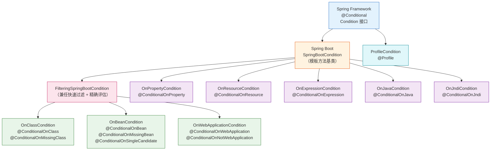

# 第④篇：条件注解体系深度分析

> 📌 基于 **Spring Boot 2.7.18** 源码
> 📁 核心源码路径：`/data/workspace/spring-boot/spring-boot-project/spring-boot-autoconfigure/src/main/java/org/springframework/boot/autoconfigure/condition/`
> 🔗 前置阅读：[③ 自动配置核心机制深度分析](自动配置核心机制深度分析.md)
> ⏱ 预计阅读时间：1-2 天

---

## 一、总体概览 — `@Conditional` 是怎么扩展成 `@ConditionalOnXxx` 家族的？

### 1.1 核心问题

> **"Spring Boot 如何做到自动配置类的'按需加载'？明明声明了 144 个候选配置类，为什么只有 30-40 个真正生效？"**

答案就是 **条件注解体系**。每个自动配置类上都标注了 `@ConditionalOnClass`、`@ConditionalOnBean`、`@ConditionalOnProperty` 等条件注解，只有条件全部满足时，配置类才会生效。

### 1.2 条件注解家族全景



### 1.3 两阶段过滤模型

条件注解的评估分为**两个阶段**，这是理解条件注解体系的**最关键概念**：

```
 ┌────────────────────────────────────────────────────────────────┐
 │                    第①阶段：快速过滤（Filter Phase）              │
 │                                                                  │
 │  时机：AutoConfigurationImportSelector.getAutoConfigurationEntry()│
 │  执行者：AutoConfigurationImportFilter.match()                   │
 │  数据源：spring-autoconfigure-metadata.properties（预计算元数据）  │
 │  特点：不加载字节码，只做字符串比较，极快                          │
 │  参与者：OnClassCondition + OnBeanCondition + OnWebApplicationCondition │
 │  效果：144 → ~40 个（过滤掉约 100 个）                           │
 └────────────────────────────────────────────────────────────────┘
                              ↓
 ┌────────────────────────────────────────────────────────────────┐
 │                    第②阶段：精确评估（Condition Phase）            │
 │                                                                  │
 │  时机：ConfigurationClassParser 解析 @Configuration 类时          │
 │  执行者：Condition.matches() / SpringBootCondition.getMatchOutcome() │
 │  数据源：实际的 BeanFactory、Environment、ClassLoader             │
 │  特点：需要加载类，精确判断，支持所有条件注解                      │
 │  参与者：所有 @ConditionalOnXxx 对应的 Condition 实现类            │
 │  效果：~40 → 最终生效的配置类                                    │
 └────────────────────────────────────────────────────────────────┘
```

### 1.4 核心源码文件速查

| 文件 | 职责 | 行数 |
|------|------|:----:|
| `Condition` | Spring Framework 根接口 | 55 |
| `@Conditional` | Spring Framework 根注解 | 71 |
| `ConditionContext` | 条件评估上下文接口 | 69 |
| `ConfigurationCondition` | 可指定评估阶段（`PARSE_CONFIGURATION` / `REGISTER_BEAN`） | 62 |
| `SpringBootCondition` | Spring Boot 模板方法基类（日志 + 记录 + 模板） | 151 |
| `FilteringSpringBootCondition` | 兼任 `AutoConfigurationImportFilter`（快速过滤 + 精确评估） | 151 |
| `OnClassCondition` | `@ConditionalOnClass` / `@ConditionalOnMissingClass` 实现 | 240 |
| `OnBeanCondition` | `@ConditionalOnBean` / `@ConditionalOnMissingBean` / `@ConditionalOnSingleCandidate` 实现 | 758 |
| `OnPropertyCondition` | `@ConditionalOnProperty` 实现 | 164 |
| `OnWebApplicationCondition` | `@ConditionalOnWebApplication` / `@ConditionalOnNotWebApplication` 实现 | 170 |
| `ConditionOutcome` | 条件评估结果（match/noMatch + 消息） | 162 |
| `ConditionMessage` | 结构化条件消息构建器 | — |
| `ConditionEvaluationReport` | 条件评估报告（`--debug` 输出的就是它） | 307 |

---

## 二、基础架构 — 从 Spring Framework 的 `@Conditional` 到 Spring Boot 的 `@ConditionalOnXxx`

### 2.1 `Condition` 接口（Spring Framework 4.0）

> 📁 源码位置：`/data/workspace/spring-framework/spring-context/src/main/java/org/springframework/context/annotation/Condition.java`

```java
@FunctionalInterface
public interface Condition {
    /**
     * 判断条件是否匹配
     * @param context   条件上下文 — 提供 BeanFactory、ClassLoader、Environment、Registry 等信息
     * @param metadata  被标注 @Conditional 的类或方法的注解元数据
     * @return true = 条件匹配，组件可以注册；false = 否决注册
     */
    boolean matches(ConditionContext context, AnnotatedTypeMetadata metadata);
}
```

**设计要点**：
- `@FunctionalInterface`：函数式接口，可以用 Lambda 实现
- 返回 `boolean`：简单的"是/否"判断
- `@since 4.0`：从 Spring Framework 4.0 开始引入

### 2.2 `@Conditional` 注解（Spring Framework 4.0）

```java
@Target({ElementType.TYPE, ElementType.METHOD})
@Retention(RetentionPolicy.RUNTIME)
@Documented
public @interface Conditional {
    Class<? extends Condition>[] value();  // 一个或多个 Condition 实现类
}
```

**使用方式**：
- 标注在**类**上：决定整个 `@Configuration` 类是否注册
- 标注在**方法**上：决定单个 `@Bean` 是否注册
- 作为**元注解**：组合成自定义条件注解（Spring Boot 的 `@ConditionalOnXxx` 就是这么做的）

> 💡 **关键**：如果 `@Conditional` 标注在 `@Configuration` 类上且条件不满足，**该类下所有的 `@Bean`、`@Import`、`@ComponentScan` 都会被跳过**。

### 2.3 `ConditionContext` — 条件评估的上下文

```java
public interface ConditionContext {
    BeanDefinitionRegistry getRegistry();                // BeanDefinition 注册表
    @Nullable ConfigurableListableBeanFactory getBeanFactory(); // Bean 工厂
    Environment getEnvironment();                         // 环境变量和配置属性
    ResourceLoader getResourceLoader();                   // 资源加载器
    @Nullable ClassLoader getClassLoader();               // 类加载器
}
```

**五大维度信息**：
| 方法 | 提供的信息 | 典型用途 |
|------|-----------|---------|
| `getRegistry()` | BeanDefinition 注册表 | `@ConditionalOnBean` 判断 Bean 是否已注册 |
| `getBeanFactory()` | Bean 工厂（含所有已注册的 Bean 定义） | `@ConditionalOnMissingBean` 搜索 Bean |
| `getEnvironment()` | 配置属性和 Profile | `@ConditionalOnProperty` 读取配置值 |
| `getResourceLoader()` | 资源加载器 | `@ConditionalOnResource` 判断资源是否存在；`@ConditionalOnWebApplication` 判断是否 WebApplicationContext |
| `getClassLoader()` | 类加载器 | `@ConditionalOnClass` 判断类是否在类路径上 |

### 2.4 `ConfigurationCondition` — 指定评估阶段

```java
public interface ConfigurationCondition extends Condition {
    ConfigurationPhase getConfigurationPhase();
    
    enum ConfigurationPhase {
        PARSE_CONFIGURATION,  // 解析 @Configuration 类时评估
        REGISTER_BEAN         // 注册 @Bean 时评估
    }
}
```

**两个阶段的区别**：

| 阶段 | 评估时机 | 典型场景 |
|------|---------|---------|
| `PARSE_CONFIGURATION` | 解析 `@Configuration` 类之前 | `@ConditionalOnClass` — 类不存在就跳过整个配置类 |
| `REGISTER_BEAN` | 注册 `@Bean` 方法时 | `@ConditionalOnMissingBean` — 需要先知道其他 Bean 是否存在 |

> 💡 **重要**：`OnBeanCondition` 实现了 `ConfigurationCondition` 并返回 `REGISTER_BEAN`，因为 `@ConditionalOnBean` / `@ConditionalOnMissingBean` 需要在 Bean 注册阶段才能准确判断其他 Bean 是否已存在。

### 2.5 Spring Boot 的组合注解模式

Spring Boot 的条件注解都是通过**元注解派生**的：

```java
// @ConditionalOnClass 的定义
@Target({ ElementType.TYPE, ElementType.METHOD })
@Retention(RetentionPolicy.RUNTIME)
@Documented
@Conditional(OnClassCondition.class)    // ← 元注解：指定 Condition 实现类
public @interface ConditionalOnClass {
    Class<?>[] value() default {};      // 需要存在的类（Class 引用）
    String[] name() default {};          // 需要存在的类（全限定名字符串）
}

// @ConditionalOnBean 的定义
@Target({ ElementType.TYPE, ElementType.METHOD })
@Retention(RetentionPolicy.RUNTIME)
@Documented
@Conditional(OnBeanCondition.class)     // ← 元注解：指定 Condition 实现类
public @interface ConditionalOnBean {
    Class<?>[] value() default {};
    String[] type() default {};
    Class<? extends Annotation>[] annotation() default {};
    String[] name() default {};
    SearchStrategy search() default SearchStrategy.ALL;  // 搜索策略
    Class<?>[] parameterizedContainer() default {};
}
```


---

## 三、`SpringBootCondition` — 模板方法基类

### 3.1 核心设计

> 📁 源码位置：`/data/workspace/spring-boot/spring-boot-project/spring-boot-autoconfigure/src/main/java/org/springframework/boot/autoconfigure/condition/SpringBootCondition.java`

`SpringBootCondition` 是所有 Spring Boot 条件实现类的**公共基类**，使用**模板方法模式**：

```java
public abstract class SpringBootCondition implements Condition {
    private final Log logger = LogFactory.getLog(getClass());

    @Override
    public final boolean matches(ConditionContext context, AnnotatedTypeMetadata metadata) {
        String classOrMethodName = getClassOrMethodName(metadata);
        try {
            // ① 调用子类的模板方法 — 获取条件评估结果
            ConditionOutcome outcome = getMatchOutcome(context, metadata);
            // ② 日志记录
            logOutcome(classOrMethodName, outcome);
            // ③ 记录到 ConditionEvaluationReport
            recordEvaluation(context, classOrMethodName, outcome);
            // ④ 返回匹配结果
            return outcome.isMatch();
        }
        catch (NoClassDefFoundError ex) {
            throw new IllegalStateException("Could not evaluate condition on " + classOrMethodName
                + " due to " + ex.getMessage() + " not found. ...", ex);
        }
        catch (RuntimeException ex) {
            throw new IllegalStateException("Error processing condition on " + getName(metadata), ex);
        }
    }

    // 🔴 模板方法 — 子类必须实现
    public abstract ConditionOutcome getMatchOutcome(ConditionContext context, AnnotatedTypeMetadata metadata);
}
```

### 3.2 模板方法的三个步骤

| 步骤 | 方法 | 作用 |
|------|------|------|
| ① 评估条件 | `getMatchOutcome()` | **子类实现**，返回 `ConditionOutcome`（匹配/不匹配 + 消息） |
| ② 日志记录 | `logOutcome()` | TRACE 级别日志，记录条件匹配结果 |
| ③ 报告记录 | `recordEvaluation()` | 记录到 `ConditionEvaluationReport`，供 `--debug` 输出 |

### 3.3 `ConditionOutcome` — 条件评估结果

```java
public class ConditionOutcome {
    private final boolean match;           // 是否匹配
    private final ConditionMessage message; // 结构化消息

    public static ConditionOutcome match() { ... }
    public static ConditionOutcome match(ConditionMessage message) { ... }
    public static ConditionOutcome noMatch(ConditionMessage message) { ... }
    public static ConditionOutcome inverse(ConditionOutcome outcome) { ... }
    
    public boolean isMatch() { return this.match; }
    public ConditionMessage getConditionMessage() { return this.message; }
}
```

### 3.4 `ConditionMessage` — 结构化消息构建

`ConditionMessage` 使用了**建造者模式**来构建可读性强的条件评估消息：

```java
// 示例：OnClassCondition 的消息
ConditionMessage.forCondition(ConditionalOnClass.class)
    .didNotFind("required class", "required classes")
    .items(Style.QUOTE, missing);
// 输出：@ConditionalOnClass did not find required class 'com.example.SomeClass'

ConditionMessage.forCondition(ConditionalOnClass.class)
    .found("required class", "required classes")
    .items(Style.QUOTE, present);
// 输出：@ConditionalOnClass found required class 'javax.servlet.Servlet'
```

---

## 四、`FilteringSpringBootCondition` — 连接两阶段的桥梁

### 4.1 关键设计：一个类同时参与两个阶段

> 📁 源码位置：`/data/workspace/spring-boot/spring-boot-project/spring-boot-autoconfigure/src/main/java/org/springframework/boot/autoconfigure/condition/FilteringSpringBootCondition.java`

```java
abstract class FilteringSpringBootCondition extends SpringBootCondition
        implements AutoConfigurationImportFilter,  // ← 第①阶段：快速过滤
                   BeanFactoryAware,
                   BeanClassLoaderAware {

    private BeanFactory beanFactory;
    private ClassLoader beanClassLoader;

    // 🔴 第①阶段：AutoConfigurationImportFilter 的 match() 方法
    @Override
    public boolean[] match(String[] autoConfigurationClasses, AutoConfigurationMetadata autoConfigurationMetadata) {
        ConditionEvaluationReport report = ConditionEvaluationReport.find(this.beanFactory);
        // 调用子类的 getOutcomes() — 快速过滤版本
        ConditionOutcome[] outcomes = getOutcomes(autoConfigurationClasses, autoConfigurationMetadata);
        boolean[] match = new boolean[outcomes.length];
        for (int i = 0; i < outcomes.length; i++) {
            // null 也算匹配（表示无法在此阶段判断，留到第②阶段）
            match[i] = (outcomes[i] == null || outcomes[i].isMatch());
            if (!match[i] && outcomes[i] != null) {
                logOutcome(autoConfigurationClasses[i], outcomes[i]);
                if (report != null) {
                    report.recordConditionEvaluation(autoConfigurationClasses[i], this, outcomes[i]);
                }
            }
        }
        return match;
    }

    // 🔴 子类实现：快速过滤的核心逻辑（基于预计算元数据，不加载字节码）
    protected abstract ConditionOutcome[] getOutcomes(String[] autoConfigurationClasses,
            AutoConfigurationMetadata autoConfigurationMetadata);
}
```

### 4.2 继承关系一览

```
Condition（Spring Framework 根接口）
└── SpringBootCondition（Spring Boot 模板方法基类）
    ├── FilteringSpringBootCondition（同时实现 AutoConfigurationImportFilter）
    │   ├── OnClassCondition      ← 快速过滤 + 精确评估
    │   ├── OnBeanCondition       ← 快速过滤 + 精确评估
    │   └── OnWebApplicationCondition ← 快速过滤 + 精确评估
    ├── OnPropertyCondition       ← 仅精确评估
    ├── OnResourceCondition       ← 仅精确评估
    ├── OnExpressionCondition     ← 仅精确评估
    ├── OnJavaCondition           ← 仅精确评估
    └── OnJndiCondition           ← 仅精确评估
```

### 4.3 `ClassNameFilter` — 类存在性快速检测

```java
protected enum ClassNameFilter {
    PRESENT {
        @Override
        public boolean matches(String className, ClassLoader classLoader) {
            return isPresent(className, classLoader);
        }
    },
    MISSING {
        @Override
        public boolean matches(String className, ClassLoader classLoader) {
            return !isPresent(className, classLoader);
        }
    };

    static boolean isPresent(String className, ClassLoader classLoader) {
        if (classLoader == null) {
            classLoader = ClassUtils.getDefaultClassLoader();
        }
        try {
            // 关键：Class.forName(name, false, classLoader)
            //       第二个参数 false = 不初始化类（不执行 static 块）
            resolve(className, classLoader);
            return true;
        }
        catch (Throwable ex) {
            return false;
        }
    }
}

protected static Class<?> resolve(String className, ClassLoader classLoader) throws ClassNotFoundException {
    if (classLoader != null) {
        return Class.forName(className, false, classLoader);  // false = 不初始化
    }
    return Class.forName(className);
}
```

> 💡 **性能关键**：`Class.forName(className, false, classLoader)` 的第二个参数 `false` 表示**不初始化类**，只检查类是否可以被找到，避免触发 `<clinit>` 静态初始化器。

---

## 五、`@ConditionalOnClass` / `@ConditionalOnMissingClass` — `OnClassCondition` 源码精读

### 5.1 注解定义

```java
@Conditional(OnClassCondition.class)
public @interface ConditionalOnClass {
    Class<?>[] value() default {};  // 通过 Class 引用指定（类级别安全 — ASM 解析，不加载类）
    String[] name() default {};     // 通过全限定名字符串指定（方法级别必须用这个）
}
```

> ⚠️ **踩坑注意**：在 `@Bean` 方法上使用 `@ConditionalOnClass` 时，**不能**使用 `value` 属性（Class 引用），因为方法注解不会通过 ASM 解析，会导致 `ClassNotFoundException`。必须使用 `name` 属性（String 形式）。

### 5.2 第①阶段：快速过滤 — `getOutcomes()`

```java
@Order(Ordered.HIGHEST_PRECEDENCE)  // 最高优先级 — 第一个执行
class OnClassCondition extends FilteringSpringBootCondition {

    @Override
    protected final ConditionOutcome[] getOutcomes(String[] autoConfigurationClasses,
            AutoConfigurationMetadata autoConfigurationMetadata) {
        // 多核优化：如果处理器 > 1，分一半在后台线程处理
        if (autoConfigurationClasses.length > 1 && Runtime.getRuntime().availableProcessors() > 1) {
            return resolveOutcomesThreaded(autoConfigurationClasses, autoConfigurationMetadata);
        }
        else {
            OutcomesResolver outcomesResolver = new StandardOutcomesResolver(autoConfigurationClasses, 0,
                autoConfigurationClasses.length, autoConfigurationMetadata, getBeanClassLoader());
            return outcomesResolver.resolveOutcomes();
        }
    }
}
```

### 5.3 多线程优化

```java
private ConditionOutcome[] resolveOutcomesThreaded(String[] autoConfigurationClasses,
        AutoConfigurationMetadata autoConfigurationMetadata) {
    int split = autoConfigurationClasses.length / 2;
    // 前半部分：后台线程处理
    OutcomesResolver firstHalfResolver = createOutcomesResolver(autoConfigurationClasses, 0, split,
        autoConfigurationMetadata);
    // 后半部分：当前线程处理
    OutcomesResolver secondHalfResolver = new StandardOutcomesResolver(autoConfigurationClasses, split,
        autoConfigurationClasses.length, autoConfigurationMetadata, getBeanClassLoader());
    ConditionOutcome[] secondHalf = secondHalfResolver.resolveOutcomes();
    ConditionOutcome[] firstHalf = firstHalfResolver.resolveOutcomes();  // join 等待后台线程
    // 合并结果
    ConditionOutcome[] outcomes = new ConditionOutcome[autoConfigurationClasses.length];
    System.arraycopy(firstHalf, 0, outcomes, 0, firstHalf.length);
    System.arraycopy(secondHalf, 0, outcomes, split, secondHalf.length);
    return outcomes;
}
```

> 💡 **设计洞察**：只使用**一个额外线程**（不是线程池），源码注释："Using a single additional thread seems to offer the best performance. More threads make things worse."

### 5.4 `StandardOutcomesResolver` — 快速过滤的核心逻辑

```java
private ConditionOutcome[] getOutcomes(String[] autoConfigurationClasses, int start, int end,
        AutoConfigurationMetadata autoConfigurationMetadata) {
    ConditionOutcome[] outcomes = new ConditionOutcome[end - start];
    for (int i = start; i < end; i++) {
        String autoConfigurationClass = autoConfigurationClasses[i];
        if (autoConfigurationClass != null) {
            // ① 从预计算元数据中读取 ConditionalOnClass 的值
            String candidates = autoConfigurationMetadata.get(autoConfigurationClass, "ConditionalOnClass");
            if (candidates != null) {
                // ② 检查类是否存在
                outcomes[i - start] = getOutcome(candidates);
            }
        }
    }
    return outcomes;
}

private ConditionOutcome getOutcome(String candidates) {
    try {
        if (!candidates.contains(",")) {
            // 单个类：直接检查
            return getOutcome(candidates, this.beanClassLoader);
        }
        // 多个类（逗号分隔）：逐个检查，任一缺失即 noMatch
        for (String candidate : StringUtils.commaDelimitedListToStringArray(candidates)) {
            ConditionOutcome outcome = getOutcome(candidate, this.beanClassLoader);
            if (outcome != null) {
                return outcome;  // 找到缺失的类，立即返回 noMatch
            }
        }
    }
    catch (Exception ex) {
        // 忽略异常，留到第②阶段再处理
    }
    return null;  // null = 无法判断或全部存在，留到第②阶段
}

private ConditionOutcome getOutcome(String className, ClassLoader classLoader) {
    if (ClassNameFilter.MISSING.matches(className, classLoader)) {
        return ConditionOutcome.noMatch(ConditionMessage.forCondition(ConditionalOnClass.class)
            .didNotFind("required class")
            .items(Style.QUOTE, className));
    }
    return null;  // 类存在 → 返回 null（不是 match，而是"此阶段无法否决"）
}
```

### 5.5 第②阶段：精确评估 — `getMatchOutcome()`

```java
@Override
public ConditionOutcome getMatchOutcome(ConditionContext context, AnnotatedTypeMetadata metadata) {
    ClassLoader classLoader = context.getClassLoader();
    ConditionMessage matchMessage = ConditionMessage.empty();
    
    // ① 处理 @ConditionalOnClass
    List<String> onClasses = getCandidates(metadata, ConditionalOnClass.class);
    if (onClasses != null) {
        List<String> missing = filter(onClasses, ClassNameFilter.MISSING, classLoader);
        if (!missing.isEmpty()) {
            // 有缺失的类 → noMatch
            return ConditionOutcome.noMatch(ConditionMessage.forCondition(ConditionalOnClass.class)
                .didNotFind("required class", "required classes")
                .items(Style.QUOTE, missing));
        }
        matchMessage = matchMessage.andCondition(ConditionalOnClass.class)
            .found("required class", "required classes")
            .items(Style.QUOTE, filter(onClasses, ClassNameFilter.PRESENT, classLoader));
    }
    
    // ② 处理 @ConditionalOnMissingClass
    List<String> onMissingClasses = getCandidates(metadata, ConditionalOnMissingClass.class);
    if (onMissingClasses != null) {
        List<String> present = filter(onMissingClasses, ClassNameFilter.PRESENT, classLoader);
        if (!present.isEmpty()) {
            // 有存在的类 → noMatch（因为要求缺失）
            return ConditionOutcome.noMatch(ConditionMessage.forCondition(ConditionalOnMissingClass.class)
                .found("unwanted class", "unwanted classes")
                .items(Style.QUOTE, present));
        }
        matchMessage = matchMessage.andCondition(ConditionalOnMissingClass.class)
            .didNotFind("unwanted class", "unwanted classes")
            .items(Style.QUOTE, filter(onMissingClasses, ClassNameFilter.MISSING, classLoader));
    }
    
    return ConditionOutcome.match(matchMessage);
}
```

### 5.6 两阶段对比

| 特性 | 第①阶段（快速过滤） | 第②阶段（精确评估） |
|------|---------------------|---------------------|
| 方法 | `getOutcomes()` | `getMatchOutcome()` |
| 数据源 | `AutoConfigurationMetadata`（预计算） | 实际的注解元数据 |
| 类加载 | `Class.forName(name, false, classLoader)` | 同上 |
| 多线程 | ✅ 双线程并行 | ❌ 单线程 |
| 返回值 | `ConditionOutcome[]`（null = 留到下一阶段） | `ConditionOutcome`（必须给出明确结果） |
| 处理对象 | 所有 144 个候选类 | 仅通过第①阶段的 ~40 个 |

---

## 六、`@ConditionalOnBean` / `@ConditionalOnMissingBean` — `OnBeanCondition` 源码精读

### 6.1 注解定义

```java
@Conditional(OnBeanCondition.class)
public @interface ConditionalOnBean {
    Class<?>[] value() default {};                     // 按类型匹配
    String[] type() default {};                        // 按类型名匹配
    Class<? extends Annotation>[] annotation() default {}; // 按注解匹配
    String[] name() default {};                        // 按名称匹配
    SearchStrategy search() default SearchStrategy.ALL; // 搜索策略
    Class<?>[] parameterizedContainer() default {};     // 泛型容器
}

@Conditional(OnBeanCondition.class)
public @interface ConditionalOnMissingBean {
    Class<?>[] value() default {};
    String[] type() default {};
    Class<?>[] ignored() default {};        // 忽略的类型
    String[] ignoredType() default {};
    Class<? extends Annotation>[] annotation() default {};
    String[] name() default {};
    SearchStrategy search() default SearchStrategy.ALL;
    Class<?>[] parameterizedContainer() default {};
}
```

### 6.2 `SearchStrategy` 三种搜索策略

```java
public enum SearchStrategy {
    CURRENT,    // 仅搜索当前 ApplicationContext
    ANCESTORS,  // 仅搜索祖先 ApplicationContext（父容器）
    ALL         // 搜索整个层级（当前 + 祖先）— 默认值
}
```

> 💡 **常见陷阱**：`@ConditionalOnMissingBean` 默认使用 `SearchStrategy.ALL`，会搜索父容器。如果只想在当前容器中检查，需要显式指定 `search = SearchStrategy.CURRENT`。

### 6.3 `OnBeanCondition` — 实现 `ConfigurationCondition`

```java
@Order(Ordered.LOWEST_PRECEDENCE)  // 最低优先级 — 最后一个执行
class OnBeanCondition extends FilteringSpringBootCondition implements ConfigurationCondition {

    @Override
    public ConfigurationPhase getConfigurationPhase() {
        return ConfigurationPhase.REGISTER_BEAN;  // 在 Bean 注册阶段评估
    }
}
```

> 💡 **为什么是 `REGISTER_BEAN`？** 因为 `@ConditionalOnBean` / `@ConditionalOnMissingBean` 需要知道其他 Bean 是否已经注册。如果在 `PARSE_CONFIGURATION` 阶段评估，很多 Bean 还没注册，会导致误判。

### 6.4 第①阶段：快速过滤 — `getOutcomes()`

```java
@Override
protected final ConditionOutcome[] getOutcomes(String[] autoConfigurationClasses,
        AutoConfigurationMetadata autoConfigurationMetadata) {
    ConditionOutcome[] outcomes = new ConditionOutcome[autoConfigurationClasses.length];
    for (int i = 0; i < outcomes.length; i++) {
        String autoConfigurationClass = autoConfigurationClasses[i];
        if (autoConfigurationClass != null) {
            // ① 检查 ConditionalOnBean 元数据
            Set<String> onBeanTypes = autoConfigurationMetadata.getSet(autoConfigurationClass, "ConditionalOnBean");
            outcomes[i] = getOutcome(onBeanTypes, ConditionalOnBean.class);
            if (outcomes[i] == null) {
                // ② 检查 ConditionalOnSingleCandidate 元数据
                Set<String> onSingleCandidateTypes = autoConfigurationMetadata.getSet(
                    autoConfigurationClass, "ConditionalOnSingleCandidate");
                outcomes[i] = getOutcome(onSingleCandidateTypes, ConditionalOnSingleCandidate.class);
            }
        }
    }
    return outcomes;
}

private ConditionOutcome getOutcome(Set<String> requiredBeanTypes, Class<? extends Annotation> annotation) {
    // 快速过滤：只检查 Bean 类型是否在类路径上
    // 如果 Bean 的类型类都不存在，那 Bean 肯定不存在
    List<String> missing = filter(requiredBeanTypes, ClassNameFilter.MISSING, getBeanClassLoader());
    if (!missing.isEmpty()) {
        ConditionMessage message = ConditionMessage.forCondition(annotation)
            .didNotFind("required type", "required types")
            .items(Style.QUOTE, missing);
        return ConditionOutcome.noMatch(message);
    }
    return null;  // 类存在 ≠ Bean 存在，留到第②阶段精确判断
}
```

> 💡 **巧妙设计**：快速过滤阶段，`OnBeanCondition` 不检查 Bean 是否真的存在（因为此时 BeanFactory 还没准备好），而是检查 **Bean 的类型是否在类路径上**。如果类型都不存在，Bean 肯定也不存在。

### 6.5 第②阶段：精确评估 — `getMatchOutcome()`

```java
@Override
public ConditionOutcome getMatchOutcome(ConditionContext context, AnnotatedTypeMetadata metadata) {
    ConditionMessage matchMessage = ConditionMessage.empty();
    MergedAnnotations annotations = metadata.getAnnotations();
    
    // ① 处理 @ConditionalOnBean
    if (annotations.isPresent(ConditionalOnBean.class)) {
        Spec<ConditionalOnBean> spec = new Spec<>(context, metadata, annotations, ConditionalOnBean.class);
        MatchResult matchResult = getMatchingBeans(context, spec);
        if (!matchResult.isAllMatched()) {
            String reason = createOnBeanNoMatchReason(matchResult);
            return ConditionOutcome.noMatch(spec.message().because(reason));
        }
        matchMessage = spec.message(matchMessage)
            .found("bean", "beans")
            .items(Style.QUOTE, matchResult.getNamesOfAllMatches());
    }
    
    // ② 处理 @ConditionalOnSingleCandidate
    if (metadata.isAnnotated(ConditionalOnSingleCandidate.class.getName())) {
        // ... 检查是否只有一个候选 Bean 或一个 Primary Bean
    }
    
    // ③ 处理 @ConditionalOnMissingBean
    if (metadata.isAnnotated(ConditionalOnMissingBean.class.getName())) {
        Spec<ConditionalOnMissingBean> spec = new Spec<>(context, metadata, annotations,
            ConditionalOnMissingBean.class);
        MatchResult matchResult = getMatchingBeans(context, spec);
        if (matchResult.isAnyMatched()) {
            // 有匹配的 Bean → noMatch（因为要求缺失）
            String reason = createOnMissingBeanNoMatchReason(matchResult);
            return ConditionOutcome.noMatch(spec.message().because(reason));
        }
        matchMessage = spec.message(matchMessage).didNotFind("any beans").atAll();
    }
    
    return ConditionOutcome.match(matchMessage);
}
```

### 6.6 `getMatchingBeans()` — Bean 搜索核心逻辑

```java
protected final MatchResult getMatchingBeans(ConditionContext context, Spec<?> spec) {
    ClassLoader classLoader = context.getClassLoader();
    ConfigurableListableBeanFactory beanFactory = context.getBeanFactory();
    boolean considerHierarchy = spec.getStrategy() != SearchStrategy.CURRENT;
    
    // ANCESTORS 策略：切换到父容器搜索
    if (spec.getStrategy() == SearchStrategy.ANCESTORS) {
        BeanFactory parent = beanFactory.getParentBeanFactory();
        beanFactory = (ConfigurableListableBeanFactory) parent;
    }
    
    MatchResult result = new MatchResult();
    Set<String> beansIgnoredByType = getNamesOfBeansIgnoredByType(classLoader, beanFactory, ...);
    
    // 按类型搜索
    for (String type : spec.getTypes()) {
        Collection<String> typeMatches = getBeanNamesForType(classLoader, considerHierarchy, beanFactory, type, ...);
        typeMatches.removeIf((match) -> beansIgnoredByType.contains(match) || ScopedProxyUtils.isScopedTarget(match));
        if (typeMatches.isEmpty()) {
            result.recordUnmatchedType(type);
        } else {
            result.recordMatchedType(type, typeMatches);
        }
    }
    
    // 按注解搜索
    for (String annotation : spec.getAnnotations()) { ... }
    
    // 按名称搜索
    for (String beanName : spec.getNames()) { ... }
    
    return result;
}
```

### 6.7 `@Bean` 方法的类型推断

当 `@ConditionalOnMissingBean` 没有指定 `value`/`type`/`name` 时，会自动推断 `@Bean` 方法的返回类型：

```java
// Spec 构造器中
Set<String> types = extractTypes(attributes);
if (types.isEmpty() && this.names.isEmpty()) {
    try {
        types = deducedBeanType(context, metadata);  // 自动推断
    }
    catch (BeanTypeDeductionException ex) {
        deductionException = ex;
    }
}

private Set<String> deducedBeanType(ConditionContext context, AnnotatedTypeMetadata metadata) {
    if (metadata instanceof MethodMetadata && metadata.isAnnotated(Bean.class.getName())) {
        return deducedBeanTypeForBeanMethod(context, (MethodMetadata) metadata);
    }
    return Collections.emptySet();
}
```

> 💡 **实用提示**：`@ConditionalOnMissingBean` 标注在 `@Bean` 方法上时，不需要指定类型，会自动以方法返回类型作为条件。这是最常见的用法。

---

## 七、`@ConditionalOnProperty` — `OnPropertyCondition` 源码精读

### 7.1 注解定义

```java
@Conditional(OnPropertyCondition.class)
public @interface ConditionalOnProperty {
    String[] value() default {};          // name 的别名
    String prefix() default "";            // 属性前缀
    String[] name() default {};            // 属性名
    String havingValue() default "";       // 期望值（空 = 只要不是 false 就匹配）
    boolean matchIfMissing() default false; // 属性不存在时是否匹配（默认 false）
}
```

### 7.2 `havingValue` 的匹配规则表

| 属性实际值 | `havingValue=""` | `havingValue="true"` | `havingValue="false"` | `havingValue="foo"` |
|:----------:|:----------------:|:-------------------:|:--------------------:|:-------------------:|
| `"true"` | ✅ match | ✅ match | ❌ noMatch | ❌ noMatch |
| `"false"` | ❌ noMatch | ❌ noMatch | ✅ match | ❌ noMatch |
| `"foo"` | ✅ match | ❌ noMatch | ❌ noMatch | ✅ match |
| 不存在 | 看 `matchIfMissing` | 看 `matchIfMissing` | 看 `matchIfMissing` | 看 `matchIfMissing` |

### 7.3 源码核心逻辑

```java
@Order(Ordered.HIGHEST_PRECEDENCE + 40)
class OnPropertyCondition extends SpringBootCondition {

    @Override
    public ConditionOutcome getMatchOutcome(ConditionContext context, AnnotatedTypeMetadata metadata) {
        // 获取所有 @ConditionalOnProperty 注解（可能有多个，通过元注解）
        List<AnnotationAttributes> allAnnotationAttributes = metadata.getAnnotations()
            .stream(ConditionalOnProperty.class.getName())
            .filter(MergedAnnotationPredicates.unique(MergedAnnotation::getMetaTypes))
            .map(MergedAnnotation::asAnnotationAttributes)
            .collect(Collectors.toList());
        
        List<ConditionMessage> noMatch = new ArrayList<>();
        List<ConditionMessage> match = new ArrayList<>();
        
        for (AnnotationAttributes annotationAttributes : allAnnotationAttributes) {
            ConditionOutcome outcome = determineOutcome(annotationAttributes, context.getEnvironment());
            (outcome.isMatch() ? match : noMatch).add(outcome.getConditionMessage());
        }
        // 所有 @ConditionalOnProperty 必须全部匹配
        if (!noMatch.isEmpty()) {
            return ConditionOutcome.noMatch(ConditionMessage.of(noMatch));
        }
        return ConditionOutcome.match(ConditionMessage.of(match));
    }
}
```

### 7.4 `Spec.collectProperties()` — 属性匹配逻辑

```java
private void collectProperties(PropertyResolver resolver, List<String> missing, List<String> nonMatching) {
    for (String name : this.names) {
        String key = this.prefix + name;         // 拼接完整 key
        if (resolver.containsProperty(key)) {
            if (!isMatch(resolver.getProperty(key), this.havingValue)) {
                nonMatching.add(name);             // 值不匹配
            }
        }
        else {
            if (!this.matchIfMissing) {
                missing.add(name);                  // 属性不存在且 matchIfMissing=false
            }
        }
    }
}

private boolean isMatch(String value, String requiredValue) {
    if (StringUtils.hasLength(requiredValue)) {
        return requiredValue.equalsIgnoreCase(value);  // 有 havingValue：不区分大小写比较
    }
    return !"false".equalsIgnoreCase(value);           // 无 havingValue：只要不是 "false" 就匹配
}
```

> 💡 **关键理解**：当 `havingValue` 为空（默认值）时，属性只要**存在**且**不等于 `"false"`**，条件就匹配。这意味着 `spring.example.enabled=true`、`spring.example.enabled=yes`、甚至 `spring.example.enabled=abc` 都会匹配！

---

## 八、`@ConditionalOnWebApplication` — `OnWebApplicationCondition` 源码精读

### 8.1 注解定义

```java
@Conditional(OnWebApplicationCondition.class)
public @interface ConditionalOnWebApplication {
    Type type() default Type.ANY;
    
    enum Type {
        ANY,      // 任意 Web 应用
        SERVLET,  // Servlet Web 应用
        REACTIVE  // Reactive Web 应用
    }
}
```

### 8.2 第①阶段：快速过滤

```java
@Order(Ordered.HIGHEST_PRECEDENCE + 20)
class OnWebApplicationCondition extends FilteringSpringBootCondition {

    private static final String SERVLET_WEB_APPLICATION_CLASS =
        "org.springframework.web.context.support.GenericWebApplicationContext";
    private static final String REACTIVE_WEB_APPLICATION_CLASS =
        "org.springframework.web.reactive.HandlerResult";

    @Override
    protected ConditionOutcome[] getOutcomes(String[] autoConfigurationClasses,
            AutoConfigurationMetadata autoConfigurationMetadata) {
        ConditionOutcome[] outcomes = new ConditionOutcome[autoConfigurationClasses.length];
        for (int i = 0; i < outcomes.length; i++) {
            String autoConfigurationClass = autoConfigurationClasses[i];
            if (autoConfigurationClass != null) {
                outcomes[i] = getOutcome(
                    autoConfigurationMetadata.get(autoConfigurationClass, "ConditionalOnWebApplication"));
            }
        }
        return outcomes;
    }

    private ConditionOutcome getOutcome(String type) {
        if (type == null) {
            return null;
        }
        ConditionMessage.Builder message = ConditionMessage.forCondition(ConditionalOnWebApplication.class);
        if (ConditionalOnWebApplication.Type.SERVLET.name().equals(type)) {
            if (!ClassNameFilter.isPresent(SERVLET_WEB_APPLICATION_CLASS, getBeanClassLoader())) {
                return ConditionOutcome.noMatch(message.didNotFind("servlet web application classes").atAll());
            }
        }
        if (ConditionalOnWebApplication.Type.REACTIVE.name().equals(type)) {
            if (!ClassNameFilter.isPresent(REACTIVE_WEB_APPLICATION_CLASS, getBeanClassLoader())) {
                return ConditionOutcome.noMatch(message.didNotFind("reactive web application classes").atAll());
            }
        }
        // 如果两者都不存在，则 noMatch
        if (!ClassNameFilter.isPresent(SERVLET_WEB_APPLICATION_CLASS, getBeanClassLoader())
                && !ClassUtils.isPresent(REACTIVE_WEB_APPLICATION_CLASS, getBeanClassLoader())) {
            return ConditionOutcome.noMatch(message.didNotFind("reactive or servlet web application classes").atAll());
        }
        return null;
    }
}
```

### 8.3 第②阶段：精确评估

精确评估不仅检查类是否存在，还检查**上下文是否真的是 Web 应用**：

```java
private ConditionOutcome isServletWebApplication(ConditionContext context) {
    ConditionMessage.Builder message = ConditionMessage.forCondition("");
    // ① 类是否存在
    if (!ClassNameFilter.isPresent(SERVLET_WEB_APPLICATION_CLASS, context.getClassLoader())) {
        return ConditionOutcome.noMatch(message.didNotFind("servlet web application classes").atAll());
    }
    // ② 是否有 session scope
    if (context.getBeanFactory() != null) {
        String[] scopes = context.getBeanFactory().getRegisteredScopeNames();
        if (ObjectUtils.containsElement(scopes, "session")) {
            return ConditionOutcome.match(message.foundExactly("'session' scope"));
        }
    }
    // ③ Environment 是否是 Web 类型
    if (context.getEnvironment() instanceof ConfigurableWebEnvironment) {
        return ConditionOutcome.match(message.foundExactly("ConfigurableWebEnvironment"));
    }
    // ④ ResourceLoader 是否是 WebApplicationContext
    if (context.getResourceLoader() instanceof WebApplicationContext) {
        return ConditionOutcome.match(message.foundExactly("WebApplicationContext"));
    }
    return ConditionOutcome.noMatch(message.because("not a servlet web application"));
}
```

### 8.4 三个过滤器的执行顺序

| 过滤器 | `@Order` 值 | 优先级 | 原因 |
|--------|:-----------:|:-----:|------|
| `OnClassCondition` | `Ordered.HIGHEST_PRECEDENCE` | **最高** | 类不存在 → 直接排除，效率最高 |
| `OnWebApplicationCondition` | `HIGHEST_PRECEDENCE + 20` | **中等** | Web 类型判断比较快 |
| `OnBeanCondition` | `Ordered.LOWEST_PRECEDENCE` | **最低** | Bean 存在性判断最复杂 |

---

## 九、`ConditionEvaluationReport` — 条件评估日志

### 9.1 作用

`ConditionEvaluationReport` 记录了**所有条件评估的结果**，在启动时加 `--debug` 或设 `debug=true` 可以输出：

```
============================
CONDITIONS EVALUATION REPORT
============================

Positive matches:
-----------------
   AopAutoConfiguration matched:
      - @ConditionalOnProperty (spring.aop.auto=true) matched (OnPropertyCondition)
   AopAutoConfiguration.ClassProxyingConfiguration matched:
      - @ConditionalOnMissingClass did not find unwanted class (OnClassCondition)
   
Negative matches:
-----------------
   ActiveMQAutoConfiguration:
      Did not match:
         - @ConditionalOnClass did not find required class 'javax.jms.ConnectionFactory' (OnClassCondition)
   CassandraAutoConfiguration:
      Did not match:
         - @ConditionalOnClass did not find required class 'com.datastax.oss.driver.api.core.CqlSession' (OnClassCondition)
```

### 9.2 核心数据结构

```java
public final class ConditionEvaluationReport {
    private static final String BEAN_NAME = "autoConfigurationReport";
    
    // 所有条件评估结果：source（类名或方法名） → 多个条件和结果
    private final SortedMap<String, ConditionAndOutcomes> outcomes = new TreeMap<>();
    
    // 被 exclude 的类
    private final List<String> exclusions = new ArrayList<>();
    
    // 没有条件注解的类（unconditional）
    private final Set<String> unconditionalClasses = new HashSet<>();
    
    // 记录一次条件评估
    public void recordConditionEvaluation(String source, Condition condition, ConditionOutcome outcome) {
        this.unconditionalClasses.remove(source);
        if (!this.outcomes.containsKey(source)) {
            this.outcomes.put(source, new ConditionAndOutcomes());
        }
        this.outcomes.get(source).add(condition, outcome);
    }
    
    // 获取单例（每个 BeanFactory 一个）
    public static ConditionEvaluationReport get(ConfigurableListableBeanFactory beanFactory) {
        synchronized (beanFactory) {
            ConditionEvaluationReport report;
            if (beanFactory.containsSingleton(BEAN_NAME)) {
                report = beanFactory.getBean(BEAN_NAME, ConditionEvaluationReport.class);
            } else {
                report = new ConditionEvaluationReport();
                beanFactory.registerSingleton(BEAN_NAME, report);
            }
            locateParent(beanFactory.getParentBeanFactory(), report);
            return report;
        }
    }
}
```

### 9.3 谁写入报告？

| 写入时机 | 写入者 | 内容 |
|---------|--------|------|
| 第①阶段：快速过滤 | `FilteringSpringBootCondition.match()` | 被快速过滤掉的条件结果 |
| 第②阶段：精确评估 | `SpringBootCondition.matches()` 中的 `recordEvaluation()` | 所有精确评估结果 |
| 自动配置事件 | `ConditionEvaluationReportAutoConfigurationImportListener` | 候选类和排除类列表 |

### 9.4 谁读取报告？

`ConditionEvaluationReportLoggingListener`（一个 `ApplicationContextInitializer`）在上下文 refreshed/failed 后读取报告并输出：

```java
// 触发条件：debug=true 或 --debug
// 输出格式：CONDITIONS EVALUATION REPORT
```

> 💡 **排查利器**：当某个自动配置没有生效时，加 `debug=true` 重启，看 "Negative matches" 中的原因，是排查自动配置问题的**最快方法**。

---

## 十、设计模式总结

| 设计模式 | 在条件注解体系中的体现 | 核心类 |
|---------|----------------------|--------|
| **模板方法** | `SpringBootCondition.matches()` 定义骨架，子类实现 `getMatchOutcome()` | `SpringBootCondition` |
| **策略模式** | 每个 `@ConditionalOnXxx` 对应一个 `Condition` 策略实现 | `OnClassCondition`、`OnBeanCondition` 等 |
| **元注解派生** | `@ConditionalOnXxx` 通过 `@Conditional(XxxCondition.class)` 元注解组合 | 所有条件注解 |
| **建造者模式** | `ConditionMessage` 的流式构建 API | `ConditionMessage.Builder` |
| **两阶段管道** | 快速过滤（粗筛） → 精确评估（细筛），漏斗式处理 | `FilteringSpringBootCondition` |
| **观察者模式** | `ConditionEvaluationReport` + 条件评估报告日志监听 | `ConditionEvaluationReportLoggingListener` |
| **单例注册** | `ConditionEvaluationReport` 通过 `registerSingleton()` 存储在 BeanFactory 中 | `ConditionEvaluationReport.get()` |

---

## 十一、面试 Q&A

### Q1：`@Conditional` 和 `@ConditionalOnClass` 是什么关系？

**30 秒版**：
`@Conditional` 是 Spring Framework 4.0 引入的根注解，接受 `Condition` 接口的实现类。`@ConditionalOnClass` 是 Spring Boot 通过**元注解派生**创建的组合注解——它本身被 `@Conditional(OnClassCondition.class)` 标注，`OnClassCondition` 是 `Condition` 接口的一个 Spring Boot 实现。

**源码级追问**：
- `OnClassCondition` 继承自 `FilteringSpringBootCondition`，后者继承 `SpringBootCondition`，后者实现 `Condition`
- `SpringBootCondition.matches()` 使用模板方法模式，`final` 方法中调用子类的 `getMatchOutcome()`

### Q2：Spring Boot 的条件注解有哪些？分别对应什么 Condition 实现？

**30 秒版**：

| 注解 | Condition 实现类 | 条件逻辑 |
|------|-----------------|---------|
| `@ConditionalOnClass` | `OnClassCondition` | 类在类路径上 |
| `@ConditionalOnMissingClass` | `OnClassCondition` | 类不在类路径上 |
| `@ConditionalOnBean` | `OnBeanCondition` | Bean 已存在 |
| `@ConditionalOnMissingBean` | `OnBeanCondition` | Bean 不存在 |
| `@ConditionalOnSingleCandidate` | `OnBeanCondition` | Bean 唯一或有 `@Primary` |
| `@ConditionalOnProperty` | `OnPropertyCondition` | 配置属性满足 |
| `@ConditionalOnWebApplication` | `OnWebApplicationCondition` | 是 Web 应用 |
| `@ConditionalOnNotWebApplication` | `OnWebApplicationCondition` | 不是 Web 应用 |
| `@ConditionalOnResource` | `OnResourceCondition` | 资源存在 |
| `@ConditionalOnExpression` | `OnExpressionCondition` | SpEL 表达式为 true |
| `@ConditionalOnJava` | `OnJavaCondition` | JDK 版本满足 |

### Q3：条件注解的两阶段过滤是怎么实现的？

**30 秒版**：
- **第①阶段（快速过滤）**：在 `AutoConfigurationImportSelector.getAutoConfigurationEntry()` 中，通过 `AutoConfigurationImportFilter.match()` 执行。数据源是 `spring-autoconfigure-metadata.properties` 预计算元数据，**不加载字节码**，只做字符串/类存在性检查。三个过滤器：`OnClassCondition`、`OnBeanCondition`、`OnWebApplicationCondition`。
- **第②阶段（精确评估）**：在 `ConfigurationClassParser` 解析 `@Configuration` 类时，通过 `Condition.matches()` 执行。使用实际的 `BeanFactory`、`Environment`、`ClassLoader`，支持所有条件注解。

**源码级追问**：
- 连接两阶段的是 `FilteringSpringBootCondition`，它同时实现了 `AutoConfigurationImportFilter`（第①阶段）和继承了 `SpringBootCondition`（第②阶段）
- 第①阶段返回 `null` 表示"此阶段无法判断，留到第②阶段"
- `OnClassCondition` 优先级最高（`@Order(HIGHEST_PRECEDENCE)`），因为类不存在是最快的排除条件

### Q4：`@ConditionalOnMissingBean` 怎么保证能检测到用户自定义的 Bean？

**30 秒版**：
`AutoConfigurationImportSelector` 实现了 `DeferredImportSelector`，所有自动配置类会在**用户的 `@Configuration` 类处理完之后**才被处理。加上 `OnBeanCondition` 实现了 `ConfigurationCondition` 并返回 `ConfigurationPhase.REGISTER_BEAN`，确保条件在 Bean 注册阶段才评估——此时用户定义的 Bean 已经注册，`getMatchingBeans()` 能正确检测到。

### Q5：`@ConditionalOnProperty` 中 `havingValue` 为空时的匹配规则是什么？

**30 秒版**：
当 `havingValue` 为空（默认值）时，属性只要**存在**且**值不等于 `"false"`**就匹配。源码中 `isMatch()` 方法：`return !"false".equalsIgnoreCase(value)`。所以 `true`、`yes`、`1`、`abc` 等任何非 `"false"` 的值都会匹配。

### Q6：如何查看 Spring Boot 的条件评估报告？

**30 秒版**：
1. `application.properties` 中设置 `debug=true`
2. 或启动参数加 `--debug`
3. 启动后控制台会输出 `CONDITIONS EVALUATION REPORT`，分为 `Positive matches`（生效的）和 `Negative matches`（未生效的）
4. 每条记录都包含具体的条件和原因

**源码级追问**：报告由 `ConditionEvaluationReport` 记录，两阶段都会写入。`ConditionEvaluationReportLoggingListener` 在上下文 refreshed 后读取报告并输出日志。

---

## 附录：核心调试断点

| 断点位置 | 作用 | 触发时机 |
|---------|------|---------|
| `SpringBootCondition.matches()` | 观察模板方法的完整流程 | 每个条件注解评估时 |
| `OnClassCondition.getOutcomes()` | 观察第①阶段快速过滤 | `AutoConfigurationImportFilter.match()` |
| `OnClassCondition.getMatchOutcome()` | 观察第②阶段精确评估 | `ConfigurationClassParser` 解析 @Configuration 时 |
| `OnBeanCondition.getMatchOutcome()` | 观察 Bean 存在性判断 | 同上 |
| `OnBeanCondition.getMatchingBeans()` | 观察 Bean 搜索过程 | `@ConditionalOnBean` / `@ConditionalOnMissingBean` 评估时 |
| `OnPropertyCondition.getMatchOutcome()` | 观察属性匹配 | `@ConditionalOnProperty` 评估时 |
| `OnPropertyCondition.Spec.collectProperties()` | 观察属性逐个匹配逻辑 | 同上 |
| `OnWebApplicationCondition.getMatchOutcome()` | 观察 Web 类型判断 | `@ConditionalOnWebApplication` 评估时 |
| `FilteringSpringBootCondition.match()` | 观察快速过滤的入口 | 第①阶段 |
| `ConditionEvaluationReport.recordConditionEvaluation()` | 观察条件评估结果记录 | 两阶段都会触发 |
