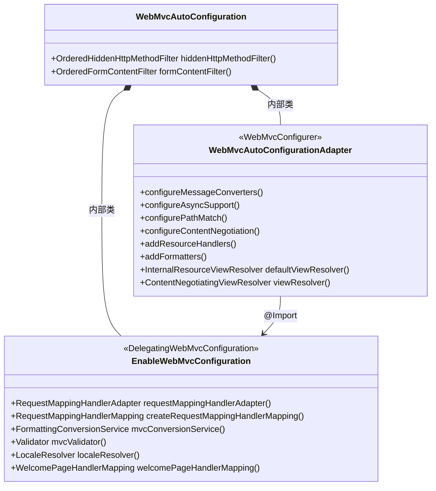
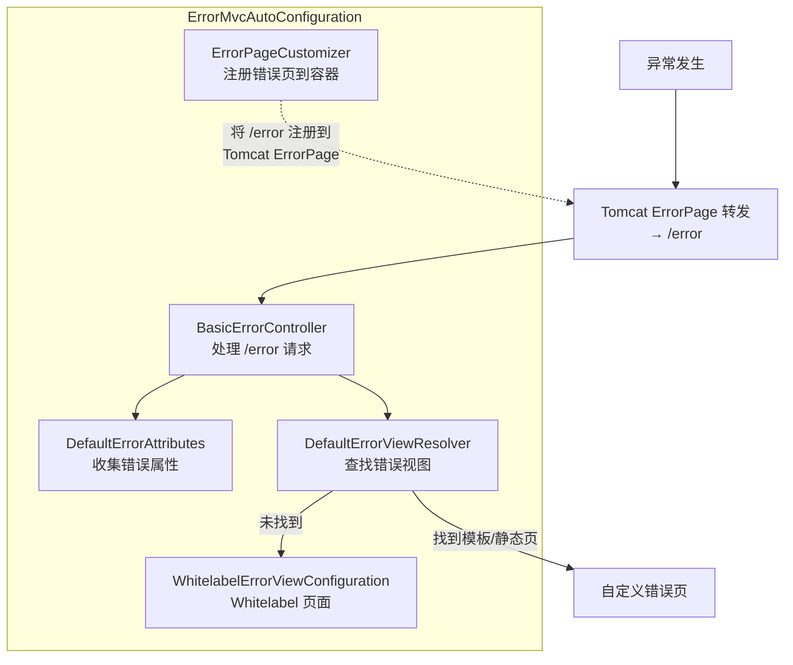
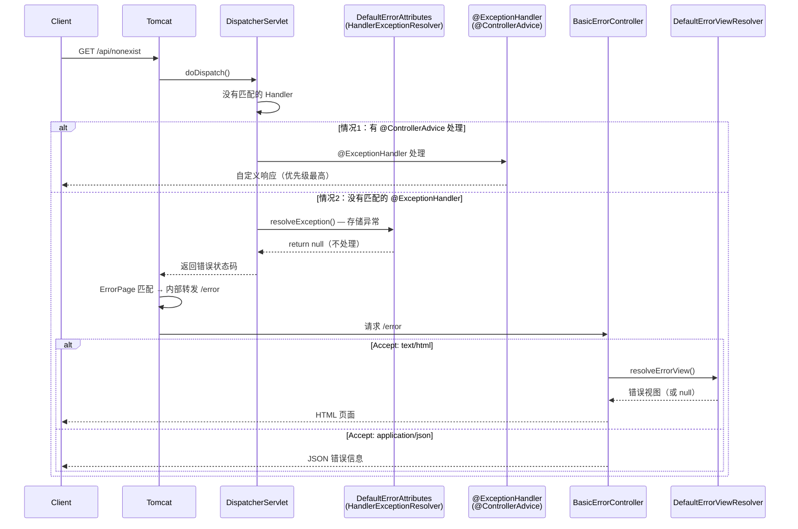
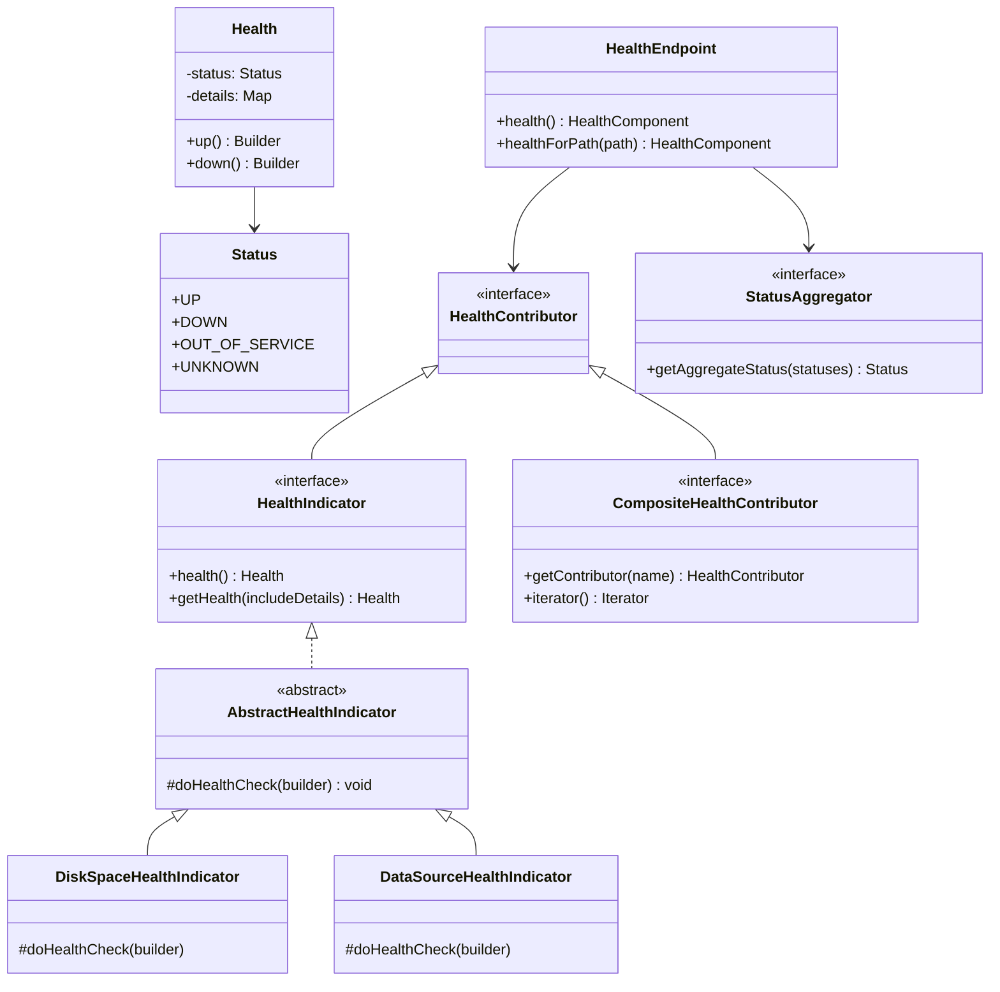
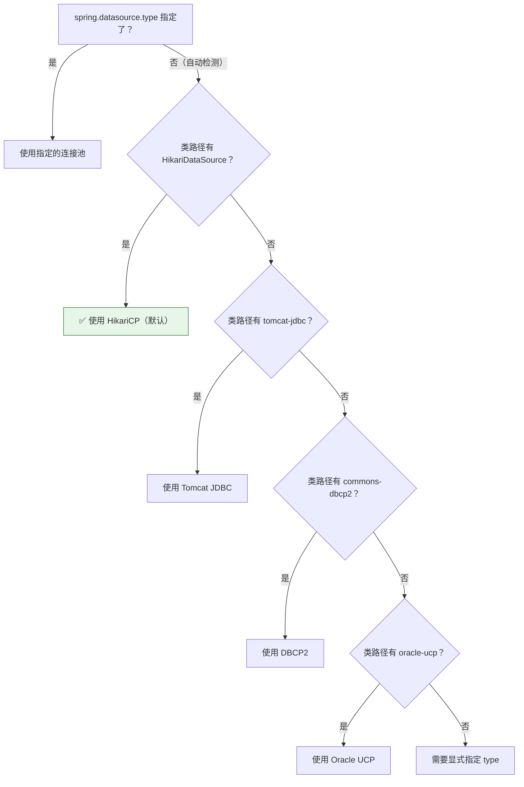
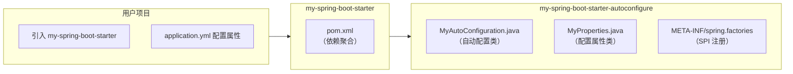

# ⑧ 自动配置实战案例深度分析

> **基于 Spring Boot 2.7.18 源码**
> 📁 本地源码路径：`/data/workspace/spring-boot/`
> 📁 Spring Framework 源码路径：`/data/workspace/spring-framework/`
> ✅ 前置阅读：[③ 自动配置核心机制深度分析](./自动配置核心机制深度分析.md) + [④ 条件注解体系深度分析](./条件注解体系深度分析.md)

---

## 前言

前几篇文档中，我们从理论层面深入分析了自动配置的发现机制（`AutoConfigurationImportSelector`）、条件注解体系（`@ConditionalOnXxx`）、以及配置属性绑定（`@ConfigurationProperties`）。现在是时候**将理论落地到实战**了。

本篇精选 **5 个最具代表性的 AutoConfiguration 类**进行源码精读，覆盖了日常开发和生产运维中最常接触的核心功能：

| 章节 | 自动配置类 | 核心价值 |
|------|-----------|---------|
| 第一章 | `WebMvcAutoConfiguration` | 理解 Spring MVC 九大组件如何被自动配置 |
| 第二章 | `ErrorMvcAutoConfiguration` | 理解全局错误处理、Whitelabel 页面、`BasicErrorController` |
| 第三章 | Actuator 健康检查自动配置 | 理解 `/actuator/health`、K8s Probes、端点暴露安全 |
| 第四章 | `DataSourceAutoConfiguration` | 理解数据源自动选择（HikariCP 优先）和连接池配置 |
| 第五章 | 自定义 Starter | 从零构建一个标准的 Spring Boot Starter |

**本篇读完，你将能够**：
1. 看到任何 AutoConfiguration 类，快速理解它的条件注解组合和生效逻辑
2. 理解 Spring Boot 全局异常处理的完整链路，在生产中设计统一的错误响应格式
3. 理解 Actuator 健康检查的架构，为 K8s 部署配置正确的探针
4. 独立编写一个标准的 Spring Boot Starter

---

## 一、WebMvcAutoConfiguration 源码精读

> 📁 核心源码：`spring-boot-project/spring-boot-autoconfigure/src/main/java/org/springframework/boot/autoconfigure/web/servlet/WebMvcAutoConfiguration.java`（708 行）

### 1.1 总体概览

`WebMvcAutoConfiguration` 是 Spring Boot 中**最核心的 Web 层自动配置类**，它负责将 Spring MVC 的各个组件（视图解析器、消息转换器、静态资源处理、内容协商等）自动配置到 Spring 容器中。

**核心问题**：为什么我们不写任何 XML 配置，Spring MVC 就能正常工作？答案就在这个类里。

### 1.2 条件注解组合 — "四道门"

```java
// ★ 源码位置：WebMvcAutoConfiguration 类定义
@AutoConfiguration(after = { DispatcherServletAutoConfiguration.class, 
        TaskExecutionAutoConfiguration.class, ValidationAutoConfiguration.class })
@ConditionalOnWebApplication(type = Type.SERVLET)       // 门1：必须是 Servlet Web 应用
@ConditionalOnClass({ Servlet.class, DispatcherServlet.class, 
        WebMvcConfigurer.class })                         // 门2：类路径有 Servlet + DispatcherServlet
@ConditionalOnMissingBean(WebMvcConfigurationSupport.class) // 门3：用户没有用 @EnableWebMvc
@AutoConfigureOrder(Ordered.HIGHEST_PRECEDENCE + 10)     // 门4：排序优先级极高
public class WebMvcAutoConfiguration {
```

**四道门的设计含义**：

| 条件 | 含义 | 实际效果 |
|------|------|---------|
| `@ConditionalOnWebApplication(SERVLET)` | 必须是 Servlet 类型的 Web 应用 | 排除 Reactive 应用和非 Web 应用 |
| `@ConditionalOnClass(Servlet, DispatcherServlet, WebMvcConfigurer)` | 类路径必须有 Spring MVC 依赖 | 没引 `spring-webmvc` 就不生效 |
| `@ConditionalOnMissingBean(WebMvcConfigurationSupport)` | 容器中不能有 `WebMvcConfigurationSupport` | **用 `@EnableWebMvc` 就会让自动配置失效** |
| `@AutoConfigureOrder(HIGHEST_PRECEDENCE + 10)` | 在自动配置中优先执行 | 确保 MVC 组件在其他自动配置之前就位 |

> ⚠️ **面试高频陷阱**：`@EnableWebMvc` 会导入 `DelegatingWebMvcConfiguration`（它继承了 `WebMvcConfigurationSupport`），所以一旦用了 `@EnableWebMvc`，`WebMvcAutoConfiguration` 就**完全失效**了！这是很多开发者踩的坑 — 加了 `@EnableWebMvc` 后静态资源处理、自动格式化等全部丢失。

### 1.3 三层嵌套内部类架构

`WebMvcAutoConfiguration` 采用了**三层嵌套内部类**的设计，每层职责分明：



| 层次 | 类名 | 职责 |
|------|------|------|
| 外层 | `WebMvcAutoConfiguration` | 注册 Filter（`HiddenHttpMethodFilter`、`FormContentFilter`） |
| 中层 | `WebMvcAutoConfigurationAdapter` | 实现 `WebMvcConfigurer`，配置消息转换器、静态资源、格式化器等 |
| 内层 | `EnableWebMvcConfiguration` | 继承 `DelegatingWebMvcConfiguration`，覆写 Spring MVC 核心组件的创建 |

### 1.4 WebMvcAutoConfigurationAdapter — WebMvcConfigurer 实现

这是最常用的自动配置层，实现了 `WebMvcConfigurer` 接口，注册各种 MVC 组件：

#### 1.4.1 消息转换器配置

```java
// ★ 源码位置：WebMvcAutoConfigurationAdapter.configureMessageConverters()
@Override
public void configureMessageConverters(List<HttpMessageConverter<?>> converters) {
    this.messageConvertersProvider
        .ifAvailable((customConverters) -> converters.addAll(customConverters.getConverters()));
}
```

**核心逻辑**：从容器中获取 `HttpMessageConverters` Bean（由 `HttpMessageConvertersAutoConfiguration` 自动配置），将其中的转换器全部添加。这就是为什么引入 `jackson-databind` 后 `MappingJackson2HttpMessageConverter` 就自动生效了。

#### 1.4.2 静态资源处理

```java
// ★ 源码位置：WebMvcAutoConfigurationAdapter.addResourceHandlers()
@Override
public void addResourceHandlers(ResourceHandlerRegistry registry) {
    if (!this.resourceProperties.isAddMappings()) {
        logger.debug("Default resource handling disabled");
        return; // ★ spring.web.resources.add-mappings=false 可以完全禁用
    }
    // ① WebJar 支持 — /webjars/** → classpath:/META-INF/resources/webjars/
    addResourceHandler(registry, "/webjars/**", "classpath:/META-INF/resources/webjars/");
    // ② 静态资源 — 默认映射 /** → 四个位置
    addResourceHandler(registry, this.mvcProperties.getStaticPathPattern(), (registration) -> {
        registration.addResourceLocations(this.resourceProperties.getStaticLocations());
        if (this.servletContext != null) {
            ServletContextResource resource = new ServletContextResource(this.servletContext, SERVLET_LOCATION);
            registration.addResourceLocations(resource);
        }
    });
}
```

**静态资源默认查找路径**（按优先级从高到低）：

| 优先级 | 路径 | 说明 |
|:------:|------|------|
| 1 | `classpath:/META-INF/resources/` | WebJar 和 Swagger UI 等第三方库 |
| 2 | `classpath:/resources/` | 业务静态资源 |
| 3 | `classpath:/static/` | **最常用** — 前端文件放这里 |
| 4 | `classpath:/public/` | 公开文件 |

> 💡 **生产建议**：如果你的应用是纯 API 服务（前后端分离），建议关闭静态资源处理以减少不必要的路径匹配开销：`spring.web.resources.add-mappings=false`

#### 1.4.3 视图解析器配置

```java
// ★ InternalResourceViewResolver — JSP 视图解析器（虽然现在很少用了）
@Bean
@ConditionalOnMissingBean
public InternalResourceViewResolver defaultViewResolver() {
    InternalResourceViewResolver resolver = new InternalResourceViewResolver();
    resolver.setPrefix(this.mvcProperties.getView().getPrefix());
    resolver.setSuffix(this.mvcProperties.getView().getSuffix());
    return resolver;
}

// ★ ContentNegotiatingViewResolver — 内容协商视图解析器（根据 Accept 头选择视图）
@Bean
@ConditionalOnBean(ViewResolver.class)
@ConditionalOnMissingBean(name = "viewResolver", value = ContentNegotiatingViewResolver.class)
public ContentNegotiatingViewResolver viewResolver(BeanFactory beanFactory) {
    ContentNegotiatingViewResolver resolver = new ContentNegotiatingViewResolver();
    resolver.setContentNegotiationManager(beanFactory.getBean(ContentNegotiationManager.class));
    resolver.setOrder(Ordered.HIGHEST_PRECEDENCE); // ★ 最高优先级
    return resolver;
}
```

### 1.5 EnableWebMvcConfiguration — 核心组件创建

这是最底层的配置类，继承了 `DelegatingWebMvcConfiguration`（它继承了 `WebMvcConfigurationSupport`），负责创建 Spring MVC 的核心组件：

#### 1.5.1 支持自定义 RequestMappingHandlerMapping / HandlerAdapter

```java
// ★ 通过 WebMvcRegistrations 扩展点，用户可以替换核心组件
@Override
protected RequestMappingHandlerMapping createRequestMappingHandlerMapping() {
    if (this.mvcRegistrations != null) {
        RequestMappingHandlerMapping mapping = this.mvcRegistrations.getRequestMappingHandlerMapping();
        if (mapping != null) {
            return mapping; // ★ 用户自定义的 HandlerMapping
        }
    }
    return super.createRequestMappingHandlerMapping();
}
```

> 📌 **与 MVC 源码系列的衔接**：这里创建的 `RequestMappingHandlerMapping` 就是 MVC 系列 ③ 中分析的"**七步初始化**"的起点。自动配置负责"创建"，Spring MVC 框架负责"初始化"。

#### 1.5.2 LocaleResolver 和 WelcomePage

```java
// ★ LocaleResolver — 国际化解析器
@Bean
@ConditionalOnMissingBean(name = DispatcherServlet.LOCALE_RESOLVER_BEAN_NAME)
public LocaleResolver localeResolver() {
    if (this.webProperties.getLocaleResolver() == WebProperties.LocaleResolver.FIXED) {
        return new FixedLocaleResolver(this.webProperties.getLocale());
    }
    AcceptHeaderLocaleResolver localeResolver = new AcceptHeaderLocaleResolver();
    localeResolver.setDefaultLocale(this.webProperties.getLocale());
    return localeResolver;
}
```

### 1.6 WebMvcAutoConfiguration 自动配置的 MVC 组件总览

结合 MVC 源码系列，总结 `WebMvcAutoConfiguration` 自动配置的 DispatcherServlet 九大组件：

| DispatcherServlet 组件 | 自动配置来源 | 配置属性 |
|----------------------|------------|---------|
| `HandlerMapping` | `EnableWebMvcConfiguration.requestMappingHandlerMapping()` | `spring.mvc.pathmatch.*` |
| `HandlerAdapter` | `EnableWebMvcConfiguration.requestMappingHandlerAdapter()` | `spring.mvc.async.*` |
| `HandlerExceptionResolver` | `EnableWebMvcConfiguration.extendHandlerExceptionResolvers()` | `spring.mvc.log-resolved-exception` |
| `ViewResolver` | `WebMvcAutoConfigurationAdapter.viewResolver()` | `spring.mvc.view.prefix/suffix` |
| `LocaleResolver` | `EnableWebMvcConfiguration.localeResolver()` | `spring.web.locale` |
| `ThemeResolver` | `EnableWebMvcConfiguration.themeResolver()` | — |
| `FlashMapManager` | `EnableWebMvcConfiguration.flashMapManager()` | — |
| `MessageConverter` | `WebMvcAutoConfigurationAdapter.configureMessageConverters()` | — |
| `ConversionService` | `EnableWebMvcConfiguration.mvcConversionService()` | `spring.mvc.format.*` |

### 1.7 本章小结 — 设计精髓

| 设计要点 | 体现 |
|---------|------|
| **渐进式覆盖** | `@ConditionalOnMissingBean` 保证用户自定义的组件优先 |
| **失效逃生舱** | `@EnableWebMvc` 可以完全接管 MVC 配置 |
| **属性化配置** | 所有行为都可以通过 `spring.mvc.*` / `spring.web.*` 属性调整 |
| **扩展点设计** | `WebMvcConfigurer` 接口让用户在不失去自动配置的前提下自定义 |
| **三层架构** | 外层 Filter → 中层 Configurer → 内层核心组件，职责分离 |

---

## 二、ErrorMvcAutoConfiguration — 全局错误处理自动配置 🏭

> 📁 核心源码：`spring-boot-project/spring-boot-autoconfigure/src/main/java/org/springframework/boot/autoconfigure/web/servlet/error/ErrorMvcAutoConfiguration.java`

### 2.1 总体概览

每个 Spring Boot 应用启动后，如果访问一个不存在的 URL，会看到经典的 **Whitelabel Error Page**：

```
Whitelabel Error Page
This application has no explicit mapping for /error, so you are seeing this as a fallback.
```

这个页面、以及 API 调用时返回的 JSON 错误信息，都是由 `ErrorMvcAutoConfiguration` 自动配置的。

**核心问题**：当 Controller 抛出异常、或者请求 404 时，Spring Boot 是怎么把错误信息收集起来并渲染成页面/JSON 的？

### 2.2 条件注解与加载时机

```java
// ★ 注意：before = WebMvcAutoConfiguration.class
@AutoConfiguration(before = WebMvcAutoConfiguration.class)  // ★ 在 WebMvcAutoConfiguration 之前加载
@ConditionalOnWebApplication(type = Type.SERVLET)
@ConditionalOnClass({ Servlet.class, DispatcherServlet.class })
@EnableConfigurationProperties({ ServerProperties.class, WebMvcProperties.class })
public class ErrorMvcAutoConfiguration {
```

> 📌 **为什么要在 WebMvcAutoConfiguration 之前加载？** 因为错误处理的 `View`（名为 `"error"` 的 Bean）需要在 `WebMvcAutoConfiguration` 配置 `BeanNameViewResolver` 之前就注册好，这样才能通过 Bean 名称解析到错误视图。

### 2.3 四大核心组件

`ErrorMvcAutoConfiguration` 注册了 **4 个核心 Bean**，它们协同工作完成错误处理：



### 2.4 DefaultErrorAttributes — 错误属性收集器

```java
// ★ 源码位置：DefaultErrorAttributes
@Order(Ordered.HIGHEST_PRECEDENCE)
public class DefaultErrorAttributes implements ErrorAttributes, HandlerExceptionResolver, Ordered {

    @Override
    public ModelAndView resolveException(HttpServletRequest request, HttpServletResponse response, 
            Object handler, Exception ex) {
        storeErrorAttributes(request, ex); // ★ 把异常存到 request 属性中
        return null; // ★ 返回 null — 不处理异常，只存储
    }
}
```

**双重身份设计**：`DefaultErrorAttributes` 既是 `ErrorAttributes`（提供错误信息），又是 `HandlerExceptionResolver`（在异常处理链中**最先执行**，只存储不处理）。

它收集的错误属性包括：

| 属性 | 说明 | 默认是否包含（2.7.x） |
|------|------|:----:|
| `timestamp` | 错误发生时间 | ✅ |
| `status` | HTTP 状态码 | ✅ |
| `error` | HTTP 状态描述（如 "Not Found"） | ✅ |
| `path` | 请求路径 | ✅ |
| `exception` | 异常类名 | ❌（需配置 `server.error.include-exception=true`） |
| `message` | 异常消息 | ❌（需配置 `server.error.include-message=always`） |
| `trace` | 异常堆栈 | ❌（需配置 `server.error.include-stacktrace=always`） |
| `errors` | 校验错误（BindingResult） | ❌（需配置 `server.error.include-binding-errors=always`） |

> ⚠️ **安全注意**：Spring Boot 2.3+ 默认不再在错误响应中包含 `message` 和 `trace`（防止敏感信息泄露）。生产环境**绝不要**设置 `include-stacktrace=always`。

### 2.5 BasicErrorController — 错误请求处理控制器

```java
// ★ 源码位置：BasicErrorController
@Controller
@RequestMapping("${server.error.path:${error.path:/error}}")  // ★ 默认映射 /error
public class BasicErrorController extends AbstractErrorController {

    // ★ 浏览器请求（Accept: text/html）→ 返回 HTML 视图
    @RequestMapping(produces = MediaType.TEXT_HTML_VALUE)
    public ModelAndView errorHtml(HttpServletRequest request, HttpServletResponse response) {
        HttpStatus status = getStatus(request);
        Map<String, Object> model = Collections.unmodifiableMap(
            getErrorAttributes(request, getErrorAttributeOptions(request, MediaType.TEXT_HTML)));
        response.setStatus(status.value());
        // ★ 先尝试通过 ErrorViewResolver 查找自定义错误视图
        ModelAndView modelAndView = resolveErrorView(request, response, status, model);
        // ★ 找不到就返回 "error" 视图（即 Whitelabel 页面）
        return (modelAndView != null) ? modelAndView : new ModelAndView("error", model);
    }

    // ★ API 请求（Accept: application/json）→ 返回 JSON
    @RequestMapping
    public ResponseEntity<Map<String, Object>> error(HttpServletRequest request) {
        HttpStatus status = getStatus(request);
        if (status == HttpStatus.NO_CONTENT) {
            return new ResponseEntity<>(status);
        }
        Map<String, Object> body = getErrorAttributes(request, 
            getErrorAttributeOptions(request, MediaType.ALL));
        return new ResponseEntity<>(body, status);
    }
}
```

**关键设计**：同一个 Controller 通过**内容协商**同时支持 HTML 和 JSON 两种错误响应格式：
- 浏览器请求（`Accept: text/html`）→ `errorHtml()` → 返回 `ModelAndView`
- API 请求（`Accept: application/json`）→ `error()` → 返回 `ResponseEntity<Map>`

### 2.6 DefaultErrorViewResolver — 错误视图查找策略

```java
// ★ 源码位置：DefaultErrorViewResolver
public class DefaultErrorViewResolver implements ErrorViewResolver, Ordered {

    private static final Map<Series, String> SERIES_VIEWS;
    static {
        Map<Series, String> views = new EnumMap<>(Series.class);
        views.put(Series.CLIENT_ERROR, "4xx");  // ★ 4xx 系列错误
        views.put(Series.SERVER_ERROR, "5xx");  // ★ 5xx 系列错误
        SERIES_VIEWS = Collections.unmodifiableMap(views);
    }

    @Override
    public ModelAndView resolveErrorView(HttpServletRequest request, HttpStatus status, 
            Map<String, Object> model) {
        // ★ 第一优先：精确状态码（如 404）
        ModelAndView modelAndView = resolve(String.valueOf(status.value()), model);
        if (modelAndView == null && SERIES_VIEWS.containsKey(status.series())) {
            // ★ 第二优先：系列通配（如 4xx）
            modelAndView = resolve(SERIES_VIEWS.get(status.series()), model);
        }
        return modelAndView;
    }

    private ModelAndView resolve(String viewName, Map<String, Object> model) {
        String errorViewName = "error/" + viewName;
        // ★ 先在模板引擎中查找（如 Thymeleaf 的 error/404.html 模板）
        TemplateAvailabilityProvider provider = this.templateAvailabilityProviders
            .getProvider(errorViewName, this.applicationContext);
        if (provider != null) {
            return new ModelAndView(errorViewName, model);
        }
        // ★ 再在静态资源中查找（如 static/error/404.html）
        return resolveResource(errorViewName, model);
    }
}
```

**错误视图查找优先级**（以 HTTP 404 为例）：

| 优先级 | 查找位置 | 示例路径 |
|:------:|---------|---------|
| 1 | 模板引擎精确匹配 | `templates/error/404.html` |
| 2 | 静态资源精确匹配 | `static/error/404.html` |
| 3 | 模板引擎系列匹配 | `templates/error/4xx.html` |
| 4 | 静态资源系列匹配 | `static/error/4xx.html` |
| 5 | Whitelabel Error Page | 内置默认页面 |

### 2.7 Whitelabel Error Page — 内置默认错误页

```java
// ★ 源码位置：ErrorMvcAutoConfiguration.WhitelabelErrorViewConfiguration
@Configuration(proxyBeanMethods = false)
@ConditionalOnProperty(prefix = "server.error.whitelabel", name = "enabled", matchIfMissing = true)
@Conditional(ErrorTemplateMissingCondition.class)  // ★ 没有模板引擎渲染 "error" 视图时才生效
protected static class WhitelabelErrorViewConfiguration {

    private final StaticView defaultErrorView = new StaticView();

    @Bean(name = "error")  // ★ Bean 名称就是 "error"
    @ConditionalOnMissingBean(name = "error")
    public View defaultErrorView() {
        return this.defaultErrorView;
    }
}
```

**StaticView 的 render 方法**就是直接拼接 HTML 字符串：

```java
// ★ 源码位置：ErrorMvcAutoConfiguration.StaticView
@Override
public void render(Map<String, ?> model, HttpServletRequest request, HttpServletResponse response) 
        throws Exception {
    if (response.isCommitted()) {
        String message = getMessage(model);
        logger.error(message);
        return;
    }
    response.setContentType(TEXT_HTML_UTF8.toString());
    StringBuilder builder = new StringBuilder();
    builder.append("<html><body><h1>Whitelabel Error Page</h1>")
        .append("<p>This application has no explicit mapping for /error, ...")
        .append("<div id='created'>").append(timestamp).append("</div>")
        .append("<div>There was an unexpected error (type=")
        .append(htmlEscape(model.get("error")))
        .append(", status=").append(htmlEscape(model.get("status")))
        .append(").</div>");
    // ...
}
```

> 💡 **关闭 Whitelabel 页面**：`server.error.whitelabel.enabled=false`

### 2.8 ErrorPageCustomizer — 将 /error 注册到嵌入式容器

```java
// ★ 源码位置：ErrorMvcAutoConfiguration.ErrorPageCustomizer
static class ErrorPageCustomizer implements ErrorPageRegistrar, Ordered {
    @Override
    public void registerErrorPages(ErrorPageRegistry errorPageRegistry) {
        ErrorPage errorPage = new ErrorPage(
            this.dispatcherServletPath.getRelativePath(this.properties.getError().getPath()));
        errorPageRegistry.addErrorPages(errorPage); // ★ 将 /error 注册到 Tomcat
    }
}
```

**这个步骤极为关键**：它把 `/error` 路径注册到 Tomcat 的 `ErrorPage` 机制中。当 Servlet 处理过程中发生异常或返回错误状态码时，Tomcat 会自动**内部转发**到 `/error`，然后被 `BasicErrorController` 接收处理。

### 2.9 完整错误处理流程



### 2.10 `@ControllerAdvice` 与 `BasicErrorController` 的关系

这是一个面试高频考点，需要理清优先级：

| 层次 | 组件 | 处理时机 | 优先级 |
|------|------|---------|:------:|
| 第一层 | `@ControllerAdvice` + `@ExceptionHandler` | DispatcherServlet **内部**异常处理 | **最高** |
| 第二层 | `BasicErrorController` | Tomcat **ErrorPage 转发** `/error` | 兜底 |

**关键区别**：
- `@ExceptionHandler` 是在 `DispatcherServlet.doDispatch()` 的 `processDispatchResult()` 阶段处理的，属于**Spring MVC 框架内的异常处理**
- `BasicErrorController` 是一个普通的 `@Controller`，靠 **Tomcat 的 ErrorPage 机制转发**过来的，属于**Servlet 容器级别的错误处理**
- 如果 `@ExceptionHandler` 已经成功处理了异常（返回了正常响应），**Tomcat 不会再转发到 `/error`**

> 🏭 **生产实践：全局异常处理最佳方案**
> 
> ```java
> @RestControllerAdvice
> public class GlobalExceptionHandler {
>     
>     // ★ 业务异常 — 返回 4xx
>     @ExceptionHandler(BusinessException.class)
>     public ResponseEntity<ErrorResponse> handleBusiness(BusinessException ex) {
>         return ResponseEntity.status(ex.getStatus())
>             .body(ErrorResponse.of(ex.getCode(), ex.getMessage()));
>     }
>     
>     // ★ 参数校验异常 — 返回 400
>     @ExceptionHandler(MethodArgumentNotValidException.class)
>     public ResponseEntity<ErrorResponse> handleValidation(MethodArgumentNotValidException ex) {
>         String message = ex.getBindingResult().getFieldErrors().stream()
>             .map(e -> e.getField() + ": " + e.getDefaultMessage())
>             .collect(Collectors.joining(", "));
>         return ResponseEntity.badRequest().body(ErrorResponse.of("VALIDATION_ERROR", message));
>     }
>     
>     // ★ 兜底 — 未预期异常返回 500
>     @ExceptionHandler(Exception.class)
>     public ResponseEntity<ErrorResponse> handleUnexpected(Exception ex) {
>         log.error("Unexpected error", ex); // ★ 记录完整堆栈
>         return ResponseEntity.status(500)
>             .body(ErrorResponse.of("INTERNAL_ERROR", "服务器内部错误"));
>     }
> }
> ```
> 
> **核心原则**：
> 1. 使用 `@RestControllerAdvice` 统一处理，**不要**让异常泄漏到 `BasicErrorController`
> 2. 不同类型的异常返回不同的 HTTP 状态码和业务错误码
> 3. 对 `Exception.class` 做兜底处理，记录日志但**不要**返回堆栈信息给客户端

### 2.11 本章小结

| 组件 | 职责 | 关键设计点 |
|------|------|-----------|
| `DefaultErrorAttributes` | 收集错误信息 | 双重身份（ErrorAttributes + HandlerExceptionResolver） |
| `BasicErrorController` | 处理 `/error` 请求 | 内容协商（HTML vs JSON） |
| `DefaultErrorViewResolver` | 查找错误视图 | 精确匹配 → 系列匹配 → Whitelabel |
| `ErrorPageCustomizer` | 注册错误页到 Tomcat | Servlet 容器级别的转发机制 |
| `WhitelabelErrorViewConfiguration` | 默认错误页 | 有模板引擎则不生效 |

---

## 三、Actuator 健康检查自动配置 🏭

> 📁 核心源码：`spring-boot-project/spring-boot-actuator-autoconfigure/src/main/java/org/springframework/boot/actuate/autoconfigure/health/`
> 📁 核心接口：`spring-boot-project/spring-boot-actuator/src/main/java/org/springframework/boot/actuate/health/`

### 3.1 总体概览

`/actuator/health` 是生产环境中**使用频率最高的 Actuator 端点**，它承载了：
- 应用健康状态监控
- K8s 的 Liveness/Readiness 探针
- 负载均衡器的健康检查
- 依赖服务（数据库、Redis、MQ）的连通性检查

### 3.2 健康检查体系架构



### 3.3 HealthEndpointAutoConfiguration — 自动配置入口

```java
// ★ 源码位置：HealthEndpointAutoConfiguration
@AutoConfiguration
@ConditionalOnAvailableEndpoint(endpoint = HealthEndpoint.class) // ★ 端点必须可用
@EnableConfigurationProperties(HealthEndpointProperties.class)
@Import({ HealthEndpointConfiguration.class, ReactiveHealthEndpointConfiguration.class,
        HealthEndpointWebExtensionConfiguration.class, 
        HealthEndpointReactiveWebExtensionConfiguration.class })
public class HealthEndpointAutoConfiguration {
}
```

它通过 `@Import` 导入了 `HealthEndpointConfiguration`，该配置类注册了所有核心 Bean：

```java
// ★ 源码位置：HealthEndpointConfiguration
@Configuration(proxyBeanMethods = false)
class HealthEndpointConfiguration {

    // ① 状态聚合器 — 决定多个 HealthIndicator 的状态如何合并
    @Bean
    @ConditionalOnMissingBean
    StatusAggregator healthStatusAggregator(HealthEndpointProperties properties) {
        return new SimpleStatusAggregator(properties.getStatus().getOrder());
    }

    // ② HTTP 状态码映射 — Health Status → HTTP Status Code
    @Bean
    @ConditionalOnMissingBean
    HttpCodeStatusMapper healthHttpCodeStatusMapper(HealthEndpointProperties properties) {
        return new SimpleHttpCodeStatusMapper(properties.getStatus().getHttpMapping());
    }

    // ③ HealthContributor 注册表 — 收集所有 HealthIndicator
    @Bean
    @ConditionalOnMissingBean
    HealthContributorRegistry healthContributorRegistry(ApplicationContext applicationContext,
            HealthEndpointGroups groups, Map<String, HealthContributor> healthContributors, ...) {
        // ★ 自动收集容器中所有 HealthContributor 类型的 Bean
        return new AutoConfiguredHealthContributorRegistry(healthContributors, groups.getNames());
    }

    // ④ HealthEndpoint — 处理 /actuator/health 请求
    @Bean
    @ConditionalOnMissingBean
    HealthEndpoint healthEndpoint(HealthContributorRegistry registry, HealthEndpointGroups groups,
            HealthEndpointProperties properties) {
        return new HealthEndpoint(registry, groups, properties.getLogging().getSlowIndicatorThreshold());
    }
}
```

### 3.4 HealthIndicator 接口 — 健康指标的核心抽象

```java
// ★ 源码位置：HealthIndicator
@FunctionalInterface
public interface HealthIndicator extends HealthContributor {

    default Health getHealth(boolean includeDetails) {
        Health health = health();
        return includeDetails ? health : health.withoutDetails(); // ★ 控制是否暴露详情
    }

    Health health(); // ★ 核心方法 — 返回健康状态
}
```

#### 内置 HealthIndicator 一览

| HealthIndicator | 检查目标 | 自动配置条件 |
|----------------|---------|------------|
| `DiskSpaceHealthIndicator` | 磁盘空间 | 总是启用 |
| `DataSourceHealthIndicator` | 数据库连接 | 类路径有 `JdbcTemplate` 且存在 `DataSource` |
| `RedisHealthIndicator` | Redis 连接 | 类路径有 `RedisConnectionFactory` |
| `MongoHealthIndicator` | MongoDB 连接 | 类路径有 `MongoTemplate` |
| `RabbitHealthIndicator` | RabbitMQ 连接 | 类路径有 `RabbitTemplate` |
| `ElasticsearchRestHealthIndicator` | Elasticsearch 连接 | 类路径有 `RestHighLevelClient` |
| `LivenessStateHealthIndicator` | K8s Liveness | 在 K8s 环境自动启用 |
| `ReadinessStateHealthIndicator` | K8s Readiness | 在 K8s 环境自动启用 |

#### DiskSpaceHealthIndicator 源码示例

```java
// ★ 源码位置：DiskSpaceHealthIndicator
public class DiskSpaceHealthIndicator extends AbstractHealthIndicator {
    private final File path;
    private final DataSize threshold;

    @Override
    protected void doHealthCheck(Health.Builder builder) throws Exception {
        long diskFreeInBytes = this.path.getUsableSpace();
        if (diskFreeInBytes >= this.threshold.toBytes()) {
            builder.up(); // ★ 磁盘空间充足 → UP
        } else {
            logger.warn(LogMessage.format(
                "Free disk space below threshold. Available: %d bytes (threshold: %s)",
                diskFreeInBytes, this.threshold));
            builder.down(); // ★ 磁盘空间不足 → DOWN
        }
        builder.withDetail("total", this.path.getTotalSpace())
            .withDetail("free", diskFreeInBytes)
            .withDetail("threshold", this.threshold.toBytes())
            .withDetail("exists", this.path.exists());
    }
}
```

### 3.5 StatusAggregator — 状态聚合策略

当应用有多个 `HealthIndicator` 时，需要将它们的状态聚合为一个总状态：

```java
// ★ 源码位置：SimpleStatusAggregator
public class SimpleStatusAggregator implements StatusAggregator {

    // ★ 默认严重性排序（从严重到不严重）
    private static final List<String> DEFAULT_ORDER;
    static {
        List<String> defaultOrder = new ArrayList<>();
        defaultOrder.add(Status.DOWN.getCode());           // ★ 最严重
        defaultOrder.add(Status.OUT_OF_SERVICE.getCode());
        defaultOrder.add(Status.UP.getCode());
        defaultOrder.add(Status.UNKNOWN.getCode());        // ★ 最轻微
        DEFAULT_ORDER = Collections.unmodifiableList(...);
    }

    @Override
    public Status getAggregateStatus(Set<Status> statuses) {
        // ★ 取最严重的状态作为整体状态
        return statuses.stream().filter(this::contains).min(this.comparator).orElse(Status.UNKNOWN);
    }
}
```

**聚合规则**：取所有 HealthIndicator 中**最严重**的状态作为整体状态。只要有一个是 `DOWN`，整体就是 `DOWN`。

| 各指标状态 | 聚合结果 | 说明 |
|-----------|---------|------|
| UP, UP, UP | **UP** | 所有组件健康 |
| UP, UP, DOWN | **DOWN** | 数据库挂了，整体 DOWN |
| UP, OUT_OF_SERVICE | **OUT_OF_SERVICE** | 有组件维护中 |
| UP, UNKNOWN | **UP** | UNKNOWN 不影响总体状态（排在 UP 后面） |

### 3.6 K8s Probes 自动配置

```java
// ★ 源码位置：AvailabilityProbesAutoConfiguration
@AutoConfiguration(after = { AvailabilityHealthContributorAutoConfiguration.class, ... })
@Conditional(AvailabilityProbesAutoConfiguration.ProbesCondition.class)
public class AvailabilityProbesAutoConfiguration {

    @Bean
    @ConditionalOnMissingBean(name = "livenessStateHealthIndicator")
    public LivenessStateHealthIndicator livenessStateHealthIndicator(
            ApplicationAvailability applicationAvailability) {
        return new LivenessStateHealthIndicator(applicationAvailability);
    }

    @Bean
    @ConditionalOnMissingBean(name = "readinessStateHealthIndicator")
    public ReadinessStateHealthIndicator readinessStateHealthIndicator(
            ApplicationAvailability applicationAvailability) {
        return new ReadinessStateHealthIndicator(applicationAvailability);
    }
}
```

**ProbesCondition 的判断逻辑**：

```java
static class ProbesCondition extends SpringBootCondition {
    @Override
    public ConditionOutcome getMatchOutcome(ConditionContext context, AnnotatedTypeMetadata metadata) {
        Environment environment = context.getEnvironment();
        // ★ 优先检查配置属性
        ConditionOutcome outcome = onProperty(environment, message, 
            "management.endpoint.health.probes.enabled");
        if (outcome != null) return outcome;
        // ★ 自动检测 Kubernetes 环境
        if (CloudPlatform.getActive(environment) == CloudPlatform.KUBERNETES) {
            return ConditionOutcome.match(message.because("running on Kubernetes"));
        }
        return ConditionOutcome.noMatch(...);
    }
}
```

**K8s 探针与 Actuator 端点的映射**：

| K8s 探针 | Actuator 端点 | 检查内容 | 失败后果 |
|---------|-------------|---------|---------|
| `livenessProbe` | `/actuator/health/liveness` | 应用是否存活（是否死锁/卡死） | **重启 Pod** |
| `readinessProbe` | `/actuator/health/readiness` | 应用是否准备好接受流量 | **从 Service 摘除** |
| `startupProbe` | `/actuator/health/liveness` | 应用是否启动完成 | 启动期间不检查 liveness |

> 🏭 **生产实践：K8s 部署配置示例**
> 
> ```yaml
> # application.yml
> management:
>   endpoint:
>     health:
>       probes:
>         enabled: true   # 显式开启（K8s 环境自动开启）
>       show-details: always  # 仅在安全网络内使用
> 
> # Kubernetes Deployment
> spec:
>   containers:
>     - name: app
>       livenessProbe:
>         httpGet:
>           path: /actuator/health/liveness
>           port: 8080
>         initialDelaySeconds: 30
>         periodSeconds: 10
>         failureThreshold: 3
>       readinessProbe:
>         httpGet:
>           path: /actuator/health/readiness
>           port: 8080
>         initialDelaySeconds: 10
>         periodSeconds: 5
>         failureThreshold: 3
>       startupProbe:
>         httpGet:
>           path: /actuator/health/liveness
>           port: 8080
>         initialDelaySeconds: 5
>         periodSeconds: 5
>         failureThreshold: 30    # 允许 150 秒启动
> ```

### 3.7 自定义 HealthIndicator

```java
// ★ 自定义健康指标示例
@Component
public class PaymentGatewayHealthIndicator extends AbstractHealthIndicator {

    private final PaymentClient paymentClient;
    
    public PaymentGatewayHealthIndicator(PaymentClient paymentClient) {
        super("Payment gateway health check failed");
        this.paymentClient = paymentClient;
    }

    @Override
    protected void doHealthCheck(Health.Builder builder) throws Exception {
        PaymentStatus status = paymentClient.ping();
        if (status.isAvailable()) {
            builder.up()
                .withDetail("provider", status.getProvider())
                .withDetail("responseTime", status.getResponseTimeMs() + "ms");
        } else {
            builder.down()
                .withDetail("error", status.getErrorMessage());
        }
    }
}
```

注册后，`/actuator/health` 的响应中会自动包含：

```json
{
    "status": "UP",
    "components": {
        "paymentGateway": {
            "status": "UP",
            "details": {
                "provider": "Stripe",
                "responseTime": "23ms"
            }
        },
        "diskSpace": { ... },
        "db": { ... }
    }
}
```

> 📌 **Bean 名称约定**：`PaymentGatewayHealthIndicator` 的 Bean 名称为 `paymentGatewayHealthIndicator`，Spring Boot 会自动去掉 `HealthIndicator` 后缀，在 JSON 中显示为 `paymentGateway`。

### 3.8 端点暴露与安全配置

#### 3.8.1 WebEndpointProperties — 端点暴露控制

```java
// ★ 源码位置：WebEndpointProperties
@ConfigurationProperties(prefix = "management.endpoints.web")
public class WebEndpointProperties {

    private final Exposure exposure = new Exposure();
    private String basePath = "/actuator"; // ★ 默认基路径

    public static class Exposure {
        private Set<String> include = new LinkedHashSet<>(); // ★ 包含的端点
        private Set<String> exclude = new LinkedHashSet<>(); // ★ 排除的端点
    }
}
```

#### 3.8.2 生产环境端点暴露最佳实践

```yaml
# ★ 生产环境推荐配置
management:
  endpoints:
    web:
      exposure:
        include: health,info,prometheus,metrics   # ★ 仅暴露必要端点
        # exclude: env,configprops,beans          # 显式排除敏感端点
  endpoint:
    health:
      show-details: when-authorized  # ★ 只有认证用户才能看到详情
      show-components: when-authorized

# ★ 敏感端点（env, configprops, beans 等）默认不暴露
# ★ 如果需要暴露，务必配合 Spring Security 保护
```

> ⚠️ **安全警告**：`management.endpoints.web.exposure.include=*` 会暴露所有端点（包括 `env`、`configprops`），可能泄露数据库密码、API Key 等敏感信息。**生产环境严禁使用 `*`**。

#### 3.8.3 Spring Security 保护 Actuator 端点

```java
// ★ 生产实践：保护 Actuator 端点
@Configuration
public class ActuatorSecurityConfig extends WebSecurityConfigurerAdapter {
    
    @Override
    protected void configure(HttpSecurity http) throws Exception {
        http.requestMatcher(EndpointRequest.toAnyEndpoint())
            .authorizeRequests()
            // health 和 info 端点公开访问
            .requestMatchers(EndpointRequest.to("health", "info")).permitAll()
            // 其他端点需要 ACTUATOR 角色
            .anyRequest().hasRole("ACTUATOR")
            .and()
            .httpBasic();
    }
}
```

### 3.9 本章小结

| 组件 | 职责 | 关键点 |
|------|------|--------|
| `HealthEndpoint` | 处理 `/actuator/health` | `@Endpoint(id = "health")` |
| `HealthIndicator` | 单个健康指标 | `@FunctionalInterface`，只需实现 `health()` |
| `StatusAggregator` | 聚合多个状态 | 默认取最严重的：DOWN > OUT_OF_SERVICE > UP > UNKNOWN |
| `HealthEndpointGroups` | 分组（liveness/readiness） | K8s 探针通过分组实现 |
| `WebEndpointProperties` | 端点暴露控制 | 永远不要在生产环境用 `include=*` |

---

## 四、DataSourceAutoConfiguration 源码精读

> 📁 核心源码：`spring-boot-project/spring-boot-autoconfigure/src/main/java/org/springframework/boot/autoconfigure/jdbc/DataSourceAutoConfiguration.java`

### 4.1 总体概览

`DataSourceAutoConfiguration` 负责**自动创建和配置数据源**。它的核心逻辑是：根据类路径上的连接池库自动选择最优的 `DataSource` 实现。

### 4.2 条件注解组合

```java
@AutoConfiguration(before = SqlInitializationAutoConfiguration.class)
@ConditionalOnClass({ DataSource.class, EmbeddedDatabaseType.class })
@ConditionalOnMissingBean(type = "io.r2dbc.spi.ConnectionFactory")  // ★ 排除 R2DBC 场景
@EnableConfigurationProperties(DataSourceProperties.class)
@Import(DataSourcePoolMetadataProvidersConfiguration.class)
public class DataSourceAutoConfiguration {
```

### 4.3 两种数据源配置 — 池化 vs 嵌入式

```java
// ★ 配置1：嵌入式数据库（H2、HSQL、Derby）— 开发/测试用
@Configuration(proxyBeanMethods = false)
@Conditional(EmbeddedDatabaseCondition.class)    // ★ 没有配置 spring.datasource.url
@ConditionalOnMissingBean({ DataSource.class, XADataSource.class })
@Import(EmbeddedDataSourceConfiguration.class)
protected static class EmbeddedDatabaseConfiguration {
}

// ★ 配置2：池化数据源（HikariCP、Tomcat-JDBC、DBCP2）— 生产用
@Configuration(proxyBeanMethods = false)
@Conditional(PooledDataSourceCondition.class)    // ★ 类路径有连接池库 或 指定了 type
@ConditionalOnMissingBean({ DataSource.class, XADataSource.class })
@Import({ DataSourceConfiguration.Hikari.class, DataSourceConfiguration.Tomcat.class,
        DataSourceConfiguration.Dbcp2.class, DataSourceConfiguration.OracleUcp.class,
        DataSourceConfiguration.Generic.class, DataSourceJmxConfiguration.class })
protected static class PooledDataSourceConfiguration {
}
```

**EmbeddedDatabaseCondition 判断逻辑**：

```java
static class EmbeddedDatabaseCondition extends SpringBootCondition {
    private static final String DATASOURCE_URL_PROPERTY = "spring.datasource.url";

    @Override
    public ConditionOutcome getMatchOutcome(ConditionContext context, AnnotatedTypeMetadata metadata) {
        // ★ 如果配置了 spring.datasource.url → 不使用嵌入式数据库
        if (hasDataSourceUrlProperty(context)) {
            return ConditionOutcome.noMatch(message.because(DATASOURCE_URL_PROPERTY + " is set"));
        }
        // ★ 如果类路径有池化数据源 → 不使用嵌入式数据库
        if (anyMatches(context, metadata, this.pooledCondition)) {
            return ConditionOutcome.noMatch(message.foundExactly("supported pooled data source"));
        }
        // ★ 如果类路径有嵌入式数据库驱动 → 使用嵌入式数据库
        EmbeddedDatabaseType type = EmbeddedDatabaseConnection.get(context.getClassLoader()).getType();
        if (type == null) {
            return ConditionOutcome.noMatch(message.didNotFind("embedded database").atAll());
        }
        return ConditionOutcome.match(message.found("embedded database").items(type));
    }
}
```

### 4.4 连接池选择优先级

`DataSourceConfiguration` 通过条件注解控制连接池的选择，**优先级由 `@Import` 顺序和 `@ConditionalOnMissingBean` 共同决定**：

```java
// ★ HikariCP — 第一优先（Spring Boot 2.x 默认）
@Configuration(proxyBeanMethods = false)
@ConditionalOnClass(HikariDataSource.class)     // ★ 类路径有 HikariCP
@ConditionalOnMissingBean(DataSource.class)      // ★ 还没有 DataSource Bean
@ConditionalOnProperty(name = "spring.datasource.type", 
    havingValue = "com.zaxxer.hikari.HikariDataSource", matchIfMissing = true) // ★ 未指定 type 也匹配
static class Hikari {
    @Bean
    @ConfigurationProperties(prefix = "spring.datasource.hikari")  // ★ 绑定 hikari 专属属性
    HikariDataSource dataSource(DataSourceProperties properties) {
        HikariDataSource dataSource = createDataSource(properties, HikariDataSource.class);
        if (StringUtils.hasText(properties.getName())) {
            dataSource.setPoolName(properties.getName());
        }
        return dataSource;
    }
}

// ★ Tomcat JDBC — 第二优先
@Configuration(proxyBeanMethods = false)
@ConditionalOnClass(org.apache.tomcat.jdbc.pool.DataSource.class)
@ConditionalOnMissingBean(DataSource.class)
@ConditionalOnProperty(name = "spring.datasource.type",
    havingValue = "org.apache.tomcat.jdbc.pool.DataSource", matchIfMissing = true)
static class Tomcat { ... }

// ★ DBCP2 — 第三优先
@Configuration(proxyBeanMethods = false)
@ConditionalOnClass(org.apache.commons.dbcp2.BasicDataSource.class)
@ConditionalOnMissingBean(DataSource.class)
@ConditionalOnProperty(name = "spring.datasource.type",
    havingValue = "org.apache.commons.dbcp2.BasicDataSource", matchIfMissing = true)
static class Dbcp2 { ... }
```

**连接池选择决策树**：



> 📌 **为什么 HikariCP 是默认的？**
> 
> `spring-boot-starter-jdbc` 和 `spring-boot-starter-data-jpa` 都传递依赖了 HikariCP。由于 HikariCP 在类路径上 **且** `@ConditionalOnMissingBean(DataSource.class)` 确保只创建一个，所以 Hikari 配置类先执行后，Tomcat/DBCP2 的 `@ConditionalOnMissingBean` 就不满足了。

### 4.5 DataSourceHealthContributorAutoConfiguration — 数据源健康检查

```java
// ★ 源码位置：DataSourceHealthContributorAutoConfiguration
@AutoConfiguration(after = DataSourceAutoConfiguration.class)
@ConditionalOnClass({ JdbcTemplate.class, AbstractRoutingDataSource.class })
@ConditionalOnBean(DataSource.class)
@ConditionalOnEnabledHealthIndicator("db")  // ★ management.health.db.enabled=true（默认）
public class DataSourceHealthContributorAutoConfiguration {

    @Bean
    @ConditionalOnMissingBean(name = { "dbHealthIndicator", "dbHealthContributor" })
    public HealthContributor dbHealthContributor(Map<String, DataSource> dataSources, ...) {
        // ★ 多数据源时自动创建 CompositeHealthContributor
        return createContributor(dataSources);
    }
}
```

**关键设计**：如果应用有**多个 DataSource**，会自动创建 `CompositeHealthContributor`，每个数据源独立检查。在 `/actuator/health` 中显示为：

```json
{
    "components": {
        "db": {
            "status": "UP",
            "components": {
                "primaryDataSource": { "status": "UP" },
                "readonlyDataSource": { "status": "UP" }
            }
        }
    }
}
```

### 4.6 本章小结

| 设计要点 | 体现 |
|---------|------|
| **约定优于配置** | 类路径有 HikariCP 就自动选择，无需任何配置 |
| **显式优先** | `spring.datasource.type` 可以强制指定连接池 |
| **嵌入式降级** | 没有配置 URL 但有 H2 依赖，自动使用嵌入式数据库 |
| **健康检查联动** | 引入 `spring-boot-starter-actuator` 后自动有数据库健康检查 |

---

## 五、自定义 Starter — 从零构建

### 5.1 Starter 的本质

**Starter = 依赖聚合 + 自动配置 + spring.factories**



**命名规范**：
- Spring 官方 Starter：`spring-boot-starter-xxx`（如 `spring-boot-starter-web`）
- 第三方 Starter：`xxx-spring-boot-starter`（如 `mybatis-spring-boot-starter`）

### 5.2 spring-boot-starter-web 结构分析

以 `spring-boot-starter-web` 为例，它的 `build.gradle` 极其简洁：

```groovy
// ★ spring-boot-starter-web 的 build.gradle — 只有依赖，没有代码
plugins {
    id "org.springframework.boot.starter"
}

dependencies {
    api(project(":spring-boot-project:spring-boot-starters:spring-boot-starter"))
    api(project(":spring-boot-project:spring-boot-starters:spring-boot-starter-json"))
    api(project(":spring-boot-project:spring-boot-starters:spring-boot-starter-tomcat"))
    api("org.springframework:spring-web")
    api("org.springframework:spring-webmvc")
}
```

**关键发现**：Starter 本身**没有任何 Java 代码**，只有依赖声明。自动配置逻辑在 `spring-boot-autoconfigure` 模块中。

### 5.3 手把手构建自定义 Starter

#### 步骤一：创建 `autoconfigure` 模块

**MyServiceProperties.java** — 配置属性类：

```java
@ConfigurationProperties(prefix = "my.service")
public class MyServiceProperties {
    
    /** 是否启用 */
    private boolean enabled = true;
    
    /** 服务地址 */
    private String endpoint = "http://localhost:8080";
    
    /** 连接超时（毫秒） */
    private int connectTimeout = 3000;
    
    /** 读取超时（毫秒） */
    private int readTimeout = 5000;
    
    // getters / setters ...
}
```

**MyServiceClient.java** — 核心服务类：

```java
public class MyServiceClient {
    
    private final String endpoint;
    private final int connectTimeout;
    private final int readTimeout;
    
    public MyServiceClient(String endpoint, int connectTimeout, int readTimeout) {
        this.endpoint = endpoint;
        this.connectTimeout = connectTimeout;
        this.readTimeout = readTimeout;
    }
    
    public String call(String path) {
        // 业务逻辑...
        return "Response from " + endpoint + path;
    }
}
```

**MyServiceAutoConfiguration.java** — 自动配置类：

```java
@AutoConfiguration
@ConditionalOnClass(MyServiceClient.class)          // ★ 门1：类路径有核心类
@ConditionalOnProperty(prefix = "my.service", name = "enabled", 
    havingValue = "true", matchIfMissing = true)     // ★ 门2：未显式禁用
@EnableConfigurationProperties(MyServiceProperties.class)
public class MyServiceAutoConfiguration {

    @Bean
    @ConditionalOnMissingBean  // ★ 门3：用户没有自定义 MyServiceClient
    public MyServiceClient myServiceClient(MyServiceProperties properties) {
        return new MyServiceClient(
            properties.getEndpoint(),
            properties.getConnectTimeout(),
            properties.getReadTimeout()
        );
    }
    
    // ★ 可选：健康检查
    @Bean
    @ConditionalOnClass(name = "org.springframework.boot.actuate.health.HealthIndicator")
    @ConditionalOnMissingBean(name = "myServiceHealthIndicator")
    public MyServiceHealthIndicator myServiceHealthIndicator(MyServiceClient client) {
        return new MyServiceHealthIndicator(client);
    }
}
```

**META-INF/spring.factories** — SPI 注册：

```properties
# ★ 必须在此注册，自动配置才会被发现
org.springframework.boot.autoconfigure.EnableAutoConfiguration=\
  com.example.myservice.autoconfigure.MyServiceAutoConfiguration
```

#### 步骤二：创建 `starter` 模块

**pom.xml** — 只有依赖聚合：

```xml
<dependencies>
    <!-- 自动配置模块 -->
    <dependency>
        <groupId>com.example</groupId>
        <artifactId>my-service-spring-boot-starter-autoconfigure</artifactId>
    </dependency>
    <!-- 核心依赖 -->
    <dependency>
        <groupId>com.example</groupId>
        <artifactId>my-service-client</artifactId>
    </dependency>
</dependencies>
```

#### 步骤三：用户使用

```xml
<!-- 用户只需引入一个依赖 -->
<dependency>
    <groupId>com.example</groupId>
    <artifactId>my-service-spring-boot-starter</artifactId>
    <version>1.0.0</version>
</dependency>
```

```yaml
# application.yml — 可选配置
my:
  service:
    endpoint: https://api.production.com
    connect-timeout: 5000
    read-timeout: 10000
```

```java
// ★ 直接注入使用，零配置
@RestController
public class MyController {
    
    @Autowired
    private MyServiceClient myServiceClient;
    
    @GetMapping("/call")
    public String call() {
        return myServiceClient.call("/api/data");
    }
}
```

### 5.4 自定义 Starter 的最佳实践

| 实践要点 | 说明 |
|---------|------|
| **模块分离** | `autoconfigure` 模块放自动配置逻辑，`starter` 模块只做依赖聚合 |
| **条件注解** | 必须使用 `@ConditionalOnClass`、`@ConditionalOnMissingBean` 等确保安全 |
| **属性前缀** | 使用有意义的前缀（如 `my.service.*`），避免与其他 Starter 冲突 |
| **默认值** | 为所有属性提供合理的默认值 |
| **禁用开关** | 提供 `enabled` 属性，允许用户关闭自动配置 |
| **用户覆盖** | 使用 `@ConditionalOnMissingBean`，允许用户自定义替换 |
| **健康检查** | 如果 Starter 连接外部服务，提供 `HealthIndicator` |
| **配置元数据** | 提供 `additional-spring-configuration-metadata.json`，支持 IDE 提示 |

### 5.5 spring-boot-configuration-processor — 配置元数据生成

在 `autoconfigure` 模块的 `pom.xml` 中引入：

```xml
<dependency>
    <groupId>org.springframework.boot</groupId>
    <artifactId>spring-boot-configuration-processor</artifactId>
    <optional>true</optional>
</dependency>
```

编译后会自动在 `META-INF/spring-configuration-metadata.json` 生成配置元数据，IDE（IntelliJ IDEA、VS Code）就能提供属性自动补全和文档提示。

---

## 面试 Q&A

### Q1：为什么加了 `@EnableWebMvc` 后 Spring Boot 的自动配置会失效？

**30 秒版**：
因为 `@EnableWebMvc` 会导入 `DelegatingWebMvcConfiguration`（继承 `WebMvcConfigurationSupport`），而 `WebMvcAutoConfiguration` 有 `@ConditionalOnMissingBean(WebMvcConfigurationSupport.class)`，所以自动配置完全失效。

**源码级追问**：
`WebMvcAutoConfiguration` 类上的 `@ConditionalOnMissingBean(WebMvcConfigurationSupport.class)` 是关键。`@EnableWebMvc` → `@Import(DelegatingWebMvcConfiguration.class)` → `DelegatingWebMvcConfiguration extends WebMvcConfigurationSupport`，所以容器中有了 `WebMvcConfigurationSupport` 类型的 Bean，条件不满足。

**生产经验**：如果只是想扩展 MVC 配置，应该实现 `WebMvcConfigurer` 接口而不是用 `@EnableWebMvc`。

---

### Q2：Spring Boot 的全局异常处理原理是什么？`@ControllerAdvice` 和 `BasicErrorController` 什么关系？

**30 秒版**：
`@ControllerAdvice` 是 Spring MVC 框架级别的异常处理，在 `DispatcherServlet` 内部拦截处理；`BasicErrorController` 是 Servlet 容器级别的兜底，通过 Tomcat 的 ErrorPage 机制转发到 `/error`。前者优先级更高，如果 `@ExceptionHandler` 处理了异常，就不会到达 `BasicErrorController`。

**源码级追问**：
`DefaultErrorAttributes` 实现了 `HandlerExceptionResolver` 接口，在异常处理链中**最先执行**（`@Order(Ordered.HIGHEST_PRECEDENCE)`），但它只存储异常信息到 request 属性中，返回 `null` 表示不处理。如果后续的 `ExceptionHandlerExceptionResolver`（`@ControllerAdvice`）处理了异常，请求正常返回；如果所有 resolver 都没处理，Tomcat 接收到错误状态码，通过 `ErrorPageCustomizer` 注册的 `/error` 页面转发到 `BasicErrorController`。

---

### Q3：Whitelabel 错误页是怎么来的？怎么自定义错误页面？

**30 秒版**：
`ErrorMvcAutoConfiguration.WhitelabelErrorViewConfiguration` 注册了一个名为 `"error"` 的 `View` Bean。当 `BasicErrorController` 通过 `DefaultErrorViewResolver` 找不到自定义错误视图时，就 fallback 到这个 Bean 名称为 `"error"` 的视图。自定义方式：在 `templates/error/404.html` 或 `static/error/404.html` 放置自定义错误页面。

**源码级追问**：
`DefaultErrorViewResolver.resolveErrorView()` 先尝试精确状态码（如 `error/404`），再尝试系列通配（如 `error/4xx`），先找模板引擎渲染，再找静态资源。查找路径是 `"error/" + viewName`。如果都找不到，`BasicErrorController.errorHtml()` 返回 `new ModelAndView("error", model)`，通过 `BeanNameViewResolver` 解析到 Whitelabel 的 `StaticView`。

---

### Q4：Actuator 的 `/health` 端点是怎么实现的？怎么自定义健康检查？

**30 秒版**：
`HealthEndpointAutoConfiguration` 注册了 `HealthEndpoint`，它收集容器中所有 `HealthIndicator` Bean，调用每个的 `health()` 方法获取健康状态，通过 `SimpleStatusAggregator` 聚合为总状态。自定义方式：实现 `HealthIndicator` 接口或继承 `AbstractHealthIndicator`，注册为 `@Component`。

**源码级追问**：
`HealthEndpointConfiguration.healthContributorRegistry()` 通过注入 `Map<String, HealthContributor>` 自动收集所有 `HealthContributor` 类型的 Bean。`HealthEndpoint` 是一个 `@Endpoint(id = "health")`，其 `@ReadOperation` 方法 `health()` 遍历注册表中所有 contributor，调用 `getHealth(includeDetails)` 获取各组件状态，最终通过 `StatusAggregator.getAggregateStatus()` 聚合。默认聚合规则：DOWN > OUT_OF_SERVICE > UP > UNKNOWN，取最严重的。

---

### Q5：Spring Boot 为什么默认使用 HikariCP？数据源选择的优先级是什么？

**30 秒版**：
`spring-boot-starter-jdbc` 传递依赖了 HikariCP。`DataSourceConfiguration` 中 Hikari 配置类的 `@ConditionalOnClass(HikariDataSource.class)` + `@ConditionalOnMissingBean(DataSource.class)` 确保它第一个被执行。选择优先级：HikariCP > Tomcat-JDBC > DBCP2 > Oracle UCP > Generic。

**源码级追问**：
`DataSourceAutoConfiguration.PooledDataSourceConfiguration` 通过 `@Import` 按顺序导入 `Hikari.class, Tomcat.class, Dbcp2.class, OracleUcp.class, Generic.class`。由于每个配置类都有 `@ConditionalOnMissingBean(DataSource.class)`，一旦 Hikari 创建了 `DataSource`，后续的 `@ConditionalOnMissingBean` 就不满足了。如果用户通过 `spring.datasource.type` 显式指定了连接池类型，则 `@ConditionalOnProperty(havingValue=...)` 只匹配指定类型。

---

### Q6：怎么自定义一个 Spring Boot Starter？标准结构是什么？

**30 秒版**：
Starter = 两个模块：`xxx-spring-boot-starter`（只有 pom 依赖聚合）+ `xxx-spring-boot-starter-autoconfigure`（自动配置类 + `@ConfigurationProperties` + `META-INF/spring.factories` 注册）。自动配置类必须用 `@ConditionalOnClass` / `@ConditionalOnMissingBean` 等条件注解保证安全性。

**源码级追问**：
自动配置类需要在 `META-INF/spring.factories` 中以 `org.springframework.boot.autoconfigure.EnableAutoConfiguration` 为 key 注册。`AutoConfigurationImportSelector.getAutoConfigurationEntry()` 会通过 `SpringFactoriesLoader.loadFactoryNames()` 加载所有注册的自动配置类，经过去重、排除、条件过滤后注册到容器。命名规范：Spring 官方 `spring-boot-starter-xxx`，第三方 `xxx-spring-boot-starter`。

---

### Q7：生产环境 Actuator 端点暴露怎么配置？怎么防止敏感端点泄露？

**30 秒版**：
通过 `management.endpoints.web.exposure.include/exclude` 控制暴露的端点。生产环境只暴露必要端点：`health,info,prometheus`，敏感端点（`env`、`configprops`、`beans`）默认不暴露。如果需要暴露更多端点，必须配合 Spring Security 保护，使用 `EndpointRequest` 匹配器限制访问。

**源码级追问**：
`WebEndpointProperties.Exposure` 有 `include` 和 `exclude` 两个 `Set<String>`。`ExposeExcludePropertyEndpointFilter` 根据这两个集合决定端点是否可用。默认只暴露 `health`。`management.endpoints.web.exposure.include=*` 会暴露所有端点，**生产环境严禁使用**，因为 `env` 端点会暴露所有环境变量（可能包含数据库密码、API Key）。

---

## 附录 A：核心调试断点

| # | 断点位置 | 调试目的 |
|:-:|---------|---------|
| 1 | `WebMvcAutoConfiguration` 类加载 | 查看 MVC 自动配置的条件评估 |
| 2 | `WebMvcAutoConfigurationAdapter.addResourceHandlers()` | 调试静态资源配置 |
| 3 | `EnableWebMvcConfiguration.requestMappingHandlerMapping()` | 查看 HandlerMapping 创建 |
| 4 | `ErrorMvcAutoConfiguration.basicErrorController()` | 查看错误控制器创建 |
| 5 | `BasicErrorController.errorHtml()` | 调试 HTML 错误响应流程 |
| 6 | `BasicErrorController.error()` | 调试 JSON 错误响应流程 |
| 7 | `DefaultErrorViewResolver.resolveErrorView()` | 查看错误视图查找过程 |
| 8 | `DefaultErrorAttributes.getErrorAttributes()` | 查看错误属性收集 |
| 9 | `HealthEndpointConfiguration.healthEndpoint()` | 查看 HealthEndpoint 创建 |
| 10 | `DataSourceConfiguration.Hikari.dataSource()` | 查看 HikariCP 数据源创建 |
| 11 | `AvailabilityProbesAutoConfiguration.ProbesCondition.getMatchOutcome()` | 查看 K8s 探针条件判断 |
| 12 | `ErrorPageCustomizer.registerErrorPages()` | 查看 ErrorPage 注册到 Tomcat |

---

## 附录 B：核心源码文件速查

| 文件 | 路径（`/data/workspace/spring-boot/` 下） |
|------|------|
| WebMvcAutoConfiguration | `spring-boot-project/spring-boot-autoconfigure/src/main/java/org/springframework/boot/autoconfigure/web/servlet/WebMvcAutoConfiguration.java` |
| DispatcherServletAutoConfiguration | `spring-boot-project/spring-boot-autoconfigure/src/main/java/org/springframework/boot/autoconfigure/web/servlet/DispatcherServletAutoConfiguration.java` |
| ErrorMvcAutoConfiguration | `spring-boot-project/spring-boot-autoconfigure/src/main/java/org/springframework/boot/autoconfigure/web/servlet/error/ErrorMvcAutoConfiguration.java` |
| BasicErrorController | `spring-boot-project/spring-boot-autoconfigure/src/main/java/org/springframework/boot/autoconfigure/web/servlet/error/BasicErrorController.java` |
| AbstractErrorController | `spring-boot-project/spring-boot-autoconfigure/src/main/java/org/springframework/boot/autoconfigure/web/servlet/error/AbstractErrorController.java` |
| DefaultErrorViewResolver | `spring-boot-project/spring-boot-autoconfigure/src/main/java/org/springframework/boot/autoconfigure/web/servlet/error/DefaultErrorViewResolver.java` |
| DefaultErrorAttributes | `spring-boot-project/spring-boot/src/main/java/org/springframework/boot/web/servlet/error/DefaultErrorAttributes.java` |
| ErrorProperties | `spring-boot-project/spring-boot-autoconfigure/src/main/java/org/springframework/boot/autoconfigure/web/ErrorProperties.java` |
| DataSourceAutoConfiguration | `spring-boot-project/spring-boot-autoconfigure/src/main/java/org/springframework/boot/autoconfigure/jdbc/DataSourceAutoConfiguration.java` |
| DataSourceConfiguration | `spring-boot-project/spring-boot-autoconfigure/src/main/java/org/springframework/boot/autoconfigure/jdbc/DataSourceConfiguration.java` |
| HealthEndpointAutoConfiguration | `spring-boot-project/spring-boot-actuator-autoconfigure/src/main/java/org/springframework/boot/actuate/autoconfigure/health/HealthEndpointAutoConfiguration.java` |
| HealthEndpointConfiguration | `spring-boot-project/spring-boot-actuator-autoconfigure/src/main/java/org/springframework/boot/actuate/autoconfigure/health/HealthEndpointConfiguration.java` |
| HealthEndpoint | `spring-boot-project/spring-boot-actuator/src/main/java/org/springframework/boot/actuate/health/HealthEndpoint.java` |
| HealthIndicator | `spring-boot-project/spring-boot-actuator/src/main/java/org/springframework/boot/actuate/health/HealthIndicator.java` |
| Health | `spring-boot-project/spring-boot-actuator/src/main/java/org/springframework/boot/actuate/health/Health.java` |
| SimpleStatusAggregator | `spring-boot-project/spring-boot-actuator/src/main/java/org/springframework/boot/actuate/health/SimpleStatusAggregator.java` |
| DiskSpaceHealthIndicator | `spring-boot-project/spring-boot-actuator/src/main/java/org/springframework/boot/actuate/system/DiskSpaceHealthIndicator.java` |
| DataSourceHealthContributorAutoConfiguration | `spring-boot-project/spring-boot-actuator-autoconfigure/src/main/java/org/springframework/boot/actuate/autoconfigure/jdbc/DataSourceHealthContributorAutoConfiguration.java` |
| AvailabilityProbesAutoConfiguration | `spring-boot-project/spring-boot-actuator-autoconfigure/src/main/java/org/springframework/boot/actuate/autoconfigure/availability/AvailabilityProbesAutoConfiguration.java` |
| WebEndpointProperties | `spring-boot-project/spring-boot-actuator-autoconfigure/src/main/java/org/springframework/boot/actuate/autoconfigure/endpoint/web/WebEndpointProperties.java` |

---

## 附录 C：配置属性速查

### C.1 Spring MVC 相关

| 属性 | 默认值 | 说明 |
|------|--------|------|
| `spring.mvc.static-path-pattern` | `/**` | 静态资源映射模式 |
| `spring.web.resources.static-locations` | 4 个默认路径 | 静态资源存放位置 |
| `spring.web.resources.add-mappings` | `true` | 是否启用静态资源处理 |
| `spring.mvc.view.prefix` | `""` | 视图前缀 |
| `spring.mvc.view.suffix` | `""` | 视图后缀 |
| `spring.mvc.pathmatch.matching-strategy` | `ant-path-matcher` | 路径匹配策略 |

### C.2 错误处理相关

| 属性 | 默认值 | 说明 |
|------|--------|------|
| `server.error.path` | `/error` | 错误页路径 |
| `server.error.whitelabel.enabled` | `true` | 是否启用 Whitelabel 错误页 |
| `server.error.include-exception` | `false` | 是否包含异常类名 |
| `server.error.include-message` | `never` | 是否包含异常消息 |
| `server.error.include-stacktrace` | `never` | 是否包含堆栈信息 |
| `server.error.include-binding-errors` | `never` | 是否包含校验错误 |

### C.3 Actuator 健康检查相关

| 属性 | 默认值 | 说明 |
|------|--------|------|
| `management.endpoint.health.show-details` | `never` | 健康详情显示策略 |
| `management.endpoint.health.show-components` | `never` | 组件详情显示策略 |
| `management.endpoint.health.probes.enabled` | `false`（K8s 自动 true） | K8s 探针启用 |
| `management.endpoints.web.exposure.include` | `health` | 暴露的端点 |
| `management.endpoints.web.exposure.exclude` | — | 排除的端点 |
| `management.endpoints.web.base-path` | `/actuator` | 端点基路径 |
| `management.health.db.enabled` | `true` | 数据库健康检查启用 |
| `management.health.diskspace.enabled` | `true` | 磁盘空间检查启用 |

### C.4 数据源相关

| 属性 | 默认值 | 说明 |
|------|--------|------|
| `spring.datasource.url` | — | 数据库 URL |
| `spring.datasource.username` | — | 数据库用户名 |
| `spring.datasource.password` | — | 数据库密码 |
| `spring.datasource.type` | 自动检测 | 连接池类型 |
| `spring.datasource.hikari.*` | — | HikariCP 专属配置 |
| `spring.datasource.tomcat.*` | — | Tomcat JDBC 专属配置 |
