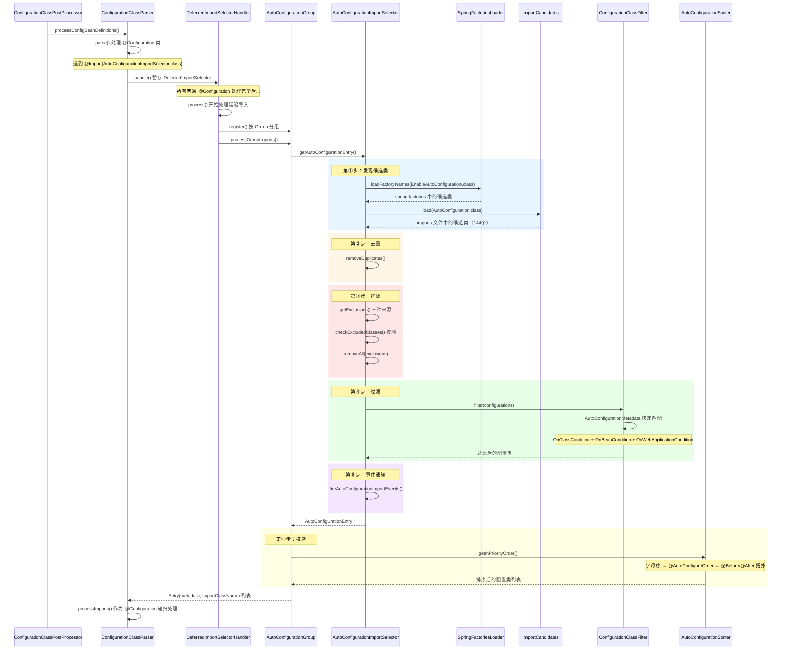
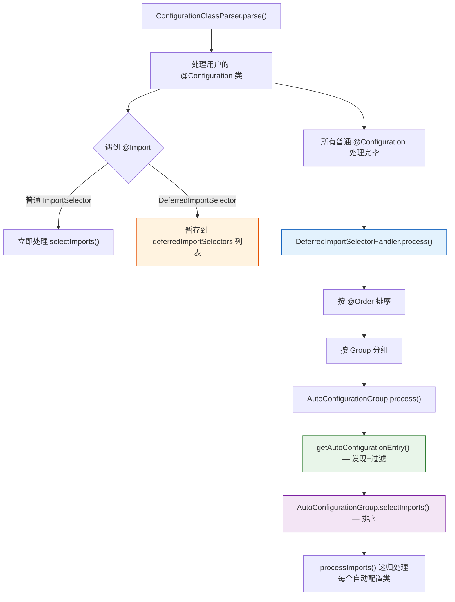

# 第③篇：自动配置核心机制深度分析

> 📌 基于 **Spring Boot 2.7.18** 源码
> 📁 核心源码路径：`/data/workspace/spring-boot/spring-boot-project/spring-boot-autoconfigure/`
> 🔗 前置阅读：[① SpringBoot启动全流程深度分析](SpringBoot启动全流程深度分析.md)、[② @SpringBootApplication注解三合一深度分析](SpringBootApplication注解三合一深度分析.md)
> ⏱ 预计阅读时间：2-3 天

---

## 一、总体概览 — 自动配置 = 发现 + 过滤 + 排序 + 注册

### 1.1 核心问题

> **"Spring Boot 如何从 144 个候选自动配置类中，精准筛选出当前应用需要的那几十个？"**

这就是自动配置核心机制要回答的问题。在第②篇中，我们知道了 `@EnableAutoConfiguration` 通过 `@Import(AutoConfigurationImportSelector.class)` 引入了自动配置的入口。本篇将深入分析 `AutoConfigurationImportSelector` 的完整处理链路。

### 1.2 四步流水线

自动配置的核心是一条**四步流水线**：

```
  ┌─────────┐    ┌─────────┐    ┌─────────┐    ┌─────────┐
  │  发现    │ →  │  过滤    │ →  │  排序    │ →  │  注册    │
  │ Discover │    │ Filter  │    │  Sort   │    │Register │
  └─────────┘    └─────────┘    └─────────┘    └─────────┘
   spring.factories  AutoConfiguration    AutoConfiguration    ConfigurationClass
   + .imports 文件   ImportFilter          Sorter              Parser 处理
   144 个候选 ──→    条件快速过滤 ──→     拓扑排序 ──→         注册为 BeanDefinition
```

### 1.3 全景时序图



### 1.4 核心源码文件速查

| 文件 | 职责 | 路径（`/data/workspace/spring-boot/` 下） |
|------|------|------|
| `AutoConfigurationImportSelector` | 自动配置选择器，核心入口 | `spring-boot-project/spring-boot-autoconfigure/.../AutoConfigurationImportSelector.java` |
| `AutoConfigurationSorter` | 拓扑排序器 | `spring-boot-project/spring-boot-autoconfigure/.../AutoConfigurationSorter.java` |
| `AutoConfigurationMetadataLoader` | 加载预计算元数据 | `spring-boot-project/spring-boot-autoconfigure/.../AutoConfigurationMetadataLoader.java` |
| `ImportCandidates` | 2.7+ 新发现机制（`.imports` 文件） | `spring-boot-project/spring-boot/.../boot/context/annotation/ImportCandidates.java` |
| `SpringFactoriesLoader` | SPI 加载器（`spring.factories`） | Spring Framework `spring-core/.../SpringFactoriesLoader.java` |
| `AutoConfigurationImportFilter` | 快速过滤接口 | `spring-boot-project/spring-boot-autoconfigure/.../AutoConfigurationImportFilter.java` |
| `AutoConfigurationImportListener` | 导入事件监听接口 | `spring-boot-project/spring-boot-autoconfigure/.../AutoConfigurationImportListener.java` |
| `ConfigurationClassParser` | Spring Framework 配置类解析器 | Spring Framework `spring-context/.../ConfigurationClassParser.java` |

---

## 二、spring.factories SPI 机制

### 2.1 什么是 SPI？

**SPI（Service Provider Interface）** 是一种服务发现机制。Spring 的 `SpringFactoriesLoader` 是 Spring 生态中最重要的 SPI 实现，类似于 JDK 的 `ServiceLoader`，但更加灵活。

### 2.2 `SpringFactoriesLoader` 核心源码

> 📁 源码位置：`/data/workspace/spring-framework/spring-core/src/main/java/org/springframework/core/io/support/SpringFactoriesLoader.java`

```java
public final class SpringFactoriesLoader {
    // ① 固定加载路径
    public static final String FACTORIES_RESOURCE_LOCATION = "META-INF/spring.factories";
    
    // ② 缓存：ClassLoader → { factoryTypeName → [实现类名列表] }
    static final Map<ClassLoader, Map<String, List<String>>> cache = new ConcurrentReferenceHashMap<>();
    
    // ③ 核心方法：加载指定接口/类的所有实现类名
    public static List<String> loadFactoryNames(Class<?> factoryType, @Nullable ClassLoader classLoader) {
        ClassLoader classLoaderToUse = classLoader;
        if (classLoaderToUse == null) {
            classLoaderToUse = SpringFactoriesLoader.class.getClassLoader();
        }
        String factoryTypeName = factoryType.getName();
        // 关键：调用内部方法加载并缓存
        return loadSpringFactories(classLoaderToUse).getOrDefault(factoryTypeName, Collections.emptyList());
    }
}
```

### 2.3 `loadSpringFactories()` 加载流程

```java
private static Map<String, List<String>> loadSpringFactories(ClassLoader classLoader) {
    // ① 优先从缓存获取
    Map<String, List<String>> result = cache.get(classLoader);
    if (result != null) {
        return result;
    }
    
    result = new HashMap<>();
    try {
        // ② 扫描类路径下所有 META-INF/spring.factories 文件
        Enumeration<URL> urls = classLoader.getResources(FACTORIES_RESOURCE_LOCATION);
        while (urls.hasMoreElements()) {
            URL url = urls.nextElement();
            UrlResource resource = new UrlResource(url);
            // ③ 解析为 Properties 格式（key=value，value 是逗号分隔的类名列表）
            Properties properties = PropertiesLoaderUtils.loadProperties(resource);
            for (Map.Entry<?, ?> entry : properties.entrySet()) {
                String factoryTypeName = ((String) entry.getKey()).trim();
                String[] factoryImplementationNames =
                    StringUtils.commaDelimitedListToStringArray((String) entry.getValue());
                for (String factoryImplementationName : factoryImplementationNames) {
                    result.computeIfAbsent(factoryTypeName, key -> new ArrayList<>())
                        .add(factoryImplementationName.trim());
                }
            }
        }
        // ④ 去重并转为不可变列表
        result.replaceAll((factoryType, implementations) -> implementations.stream().distinct()
            .collect(Collectors.collectingAndThen(Collectors.toList(), Collections::unmodifiableList)));
        // ⑤ 放入缓存
        cache.put(classLoader, result);
    }
    catch (IOException ex) {
        throw new IllegalArgumentException("Unable to load factories from location [" +
            FACTORIES_RESOURCE_LOCATION + "]", ex);
    }
    return result;
}
```

**关键设计要点**：

| 特性 | 说明 |
|------|------|
| **多 Jar 聚合** | 扫描**所有** Jar 中的 `META-INF/spring.factories`，不是只扫描一个 |
| **ClassLoader 级缓存** | 同一个 ClassLoader 只加载一次，后续直接从 `ConcurrentReferenceHashMap` 读缓存 |
| **去重机制** | `distinct()` 确保同一个实现类不会重复 |
| **Properties 格式** | `key=接口/抽象类全限定名`，`value=逗号分隔的实现类名列表` |

### 2.4 spring.factories 中的自动配置相关 key

在 `spring-boot-autoconfigure` 的 `META-INF/spring.factories` 中，与自动配置直接相关的 key 有：

```properties
# 🔴 自动配置导入过滤器 — 在加载字节码之前快速排除
org.springframework.boot.autoconfigure.AutoConfigurationImportFilter=\
org.springframework.boot.autoconfigure.condition.OnBeanCondition,\
org.springframework.boot.autoconfigure.condition.OnClassCondition,\
org.springframework.boot.autoconfigure.condition.OnWebApplicationCondition

# 🔴 自动配置导入监听器 — 记录条件评估结果
org.springframework.boot.autoconfigure.AutoConfigurationImportListener=\
org.springframework.boot.autoconfigure.condition.ConditionEvaluationReportAutoConfigurationImportListener
```

> ⚠️ **注意**：在 Spring Boot 2.7 中，自动配置类的声明已经从 `spring.factories` 的 `EnableAutoConfiguration` key 迁移到了新的 `.imports` 文件中（见下一节）。但 `spring.factories` 中的其他 key（如 `AutoConfigurationImportFilter`、`AutoConfigurationImportListener`）仍然使用。

### 2.5 与 JDK SPI 的对比

| 特性 | JDK `ServiceLoader` | Spring `SpringFactoriesLoader` |
|------|---------------------|-------------------------------|
| 配置文件位置 | `META-INF/services/接口全名` | `META-INF/spring.factories` |
| 文件格式 | 每行一个实现类名 | Properties（key=接口, value=实现类列表） |
| 一个文件多个接口 | ❌ 一个文件只能声明一个接口 | ✅ 一个文件可以声明多个接口 |
| 缓存 | 无内置缓存 | ✅ `ConcurrentReferenceHashMap` 缓存 |
| 实例化 | 自动实例化 | 可以只获取类名（`loadFactoryNames`），也可以实例化（`loadFactories`） |
| 延迟加载 | ✅ 迭代时才加载 | ❌ 一次性加载所有 |

---

## 三、两代发现机制：spring.factories vs .imports

### 3.1 第一代：spring.factories（Spring Boot 1.0 ~ 2.6）

在 Spring Boot 2.6 及更早版本中，自动配置类声明在 `spring.factories` 的 `EnableAutoConfiguration` key 下：

```properties
# META-INF/spring.factories
org.springframework.boot.autoconfigure.EnableAutoConfiguration=\
org.springframework.boot.autoconfigure.admin.SpringApplicationAdminJmxAutoConfiguration,\
org.springframework.boot.autoconfigure.aop.AopAutoConfiguration,\
...
```

### 3.2 第二代：.imports 文件（Spring Boot 2.7+）

从 Spring Boot 2.7 开始，引入了新的发现机制：

> 📁 文件位置：`META-INF/spring/org.springframework.boot.autoconfigure.AutoConfiguration.imports`

```
# 每行一个自动配置类全名
org.springframework.boot.autoconfigure.admin.SpringApplicationAdminJmxAutoConfiguration
org.springframework.boot.autoconfigure.aop.AopAutoConfiguration
org.springframework.boot.autoconfigure.amqp.RabbitAutoConfiguration
...
# 共 144 个
```

**`ImportCandidates` 加载源码**：

> 📁 源码位置：`/data/workspace/spring-boot/spring-boot-project/spring-boot/src/main/java/org/springframework/boot/context/annotation/ImportCandidates.java`

```java
public final class ImportCandidates implements Iterable<String> {
    // 文件路径模板
    private static final String LOCATION = "META-INF/spring/%s.imports";
    
    public static ImportCandidates load(Class<?> annotation, ClassLoader classLoader) {
        Assert.notNull(annotation, "'annotation' must not be null");
        ClassLoader classLoaderToUse = decideClassloader(classLoader);
        // 拼接文件路径：META-INF/spring/org.springframework.boot.autoconfigure.AutoConfiguration.imports
        String location = String.format(LOCATION, annotation.getName());
        Enumeration<URL> urls = findUrlsInClasspath(classLoaderToUse, location);
        List<String> importCandidates = new ArrayList<>();
        while (urls.hasMoreElements()) {
            URL url = urls.nextElement();
            importCandidates.addAll(readCandidateConfigurations(url));
        }
        return new ImportCandidates(importCandidates);
    }
}
```

### 3.3 两代机制的并存

在 `AutoConfigurationImportSelector.getCandidateConfigurations()` 中，**两种机制同时使用**：

```java
protected List<String> getCandidateConfigurations(AnnotationMetadata metadata, AnnotationAttributes attributes) {
    // ① 第一代：从 spring.factories 加载（兼容旧版）
    List<String> configurations = new ArrayList<>(
        SpringFactoriesLoader.loadFactoryNames(getSpringFactoriesLoaderFactoryClass(), getBeanClassLoader()));
    // ② 第二代：从 .imports 文件加载（2.7+ 新方式）
    ImportCandidates.load(AutoConfiguration.class, getBeanClassLoader()).forEach(configurations::add);
    // ③ 校验：必须至少有一个候选类
    Assert.notEmpty(configurations,
        "No auto configuration classes found in META-INF/spring.factories nor in META-INF/spring/"
        + "org.springframework.boot.autoconfigure.AutoConfiguration.imports. ...");
    return configurations;
}
```

### 3.4 @AutoConfiguration 新注解（2.7+）

为了配合 `.imports` 文件，Spring Boot 2.7 引入了 `@AutoConfiguration` 注解：

```java
@Configuration(proxyBeanMethods = false)   // 默认 Lite 模式
@AutoConfigureBefore                        // 组合排序注解
@AutoConfigureAfter                         // 组合排序注解
public @interface AutoConfiguration {
    @AliasFor(annotation = Configuration.class)
    String value() default "";
    
    // 直接在注解上声明排序关系，不需要额外标注 @AutoConfigureBefore/@AutoConfigureAfter
    @AliasFor(annotation = AutoConfigureBefore.class, attribute = "value")
    Class<?>[] before() default {};
    
    @AliasFor(annotation = AutoConfigureAfter.class, attribute = "value")
    Class<?>[] after() default {};
    
    // ... beforeName / afterName
}
```

**设计优势**：
1. `proxyBeanMethods = false`：强制 Lite 模式，提升启动速度
2. 排序注解内聚：`before/after` 直接写在 `@AutoConfiguration` 上，一目了然
3. 迁移路径清晰：`.imports` 文件取代 `spring.factories` 中的 `EnableAutoConfiguration` key

### 3.5 新旧对比小结

| 特性 | `spring.factories`（第一代） | `.imports`（第二代） |
|------|---------------------------|---------------------|
| 引入版本 | 1.0 | 2.7 |
| 文件位置 | `META-INF/spring.factories` | `META-INF/spring/全限定注解名.imports` |
| 格式 | Properties（key=value） | 每行一个类名 |
| 共用文件 | 是（与其他 SPI 共享同一文件） | 否（独立文件） |
| 配套注解 | `@Configuration` + `@AutoConfigureBefore/After` | `@AutoConfiguration`（三合一） |
| Spring Boot 3.0 | 废弃 `EnableAutoConfiguration` key | 唯一方式 |

---

## 四、AutoConfigurationImportSelector 全链路

### 4.1 类结构概览

```java
// 📁 /data/workspace/spring-boot/.../AutoConfigurationImportSelector.java
public class AutoConfigurationImportSelector 
    implements DeferredImportSelector,    // 延迟导入选择器
               BeanClassLoaderAware,      // 获取 ClassLoader
               ResourceLoaderAware,       // 获取 ResourceLoader
               BeanFactoryAware,          // 获取 BeanFactory
               EnvironmentAware,          // 获取 Environment
               Ordered {                  // 排序（最低优先级 - 1）
    
    private static final AutoConfigurationEntry EMPTY_ENTRY = new AutoConfigurationEntry();
    private static final String PROPERTY_NAME_AUTOCONFIGURE_EXCLUDE = "spring.autoconfigure.exclude";
    
    // 五个 Aware 注入的对象
    private ConfigurableListableBeanFactory beanFactory;
    private Environment environment;
    private ClassLoader beanClassLoader;
    private ResourceLoader resourceLoader;
    private ConfigurationClassFilter configurationClassFilter;
}
```

### 4.2 getAutoConfigurationEntry() — 六步核心流程

这是自动配置的**灵魂方法**：

```java
protected AutoConfigurationEntry getAutoConfigurationEntry(AnnotationMetadata annotationMetadata) {
    // 第〇步：全局开关检查
    if (!isEnabled(annotationMetadata)) {
        return EMPTY_ENTRY;
    }
    // 第①步：获取注解属性（exclude, excludeName）
    AnnotationAttributes attributes = getAttributes(annotationMetadata);
    // 第②步：发现 — 加载所有候选自动配置类
    List<String> configurations = getCandidateConfigurations(annotationMetadata, attributes);
    // 第③步：去重
    configurations = removeDuplicates(configurations);
    // 第④步：排除 — 处理 exclude/excludeName/spring.autoconfigure.exclude
    Set<String> exclusions = getExclusions(annotationMetadata, attributes);
    checkExcludedClasses(configurations, exclusions);
    configurations.removeAll(exclusions);
    // 第⑤步：过滤 — AutoConfigurationImportFilter 快速过滤
    configurations = getConfigurationClassFilter().filter(configurations);
    // 第⑥步：事件通知 — 触发 AutoConfigurationImportEvent
    fireAutoConfigurationImportEvents(configurations, exclusions);
    // 返回最终结果
    return new AutoConfigurationEntry(configurations, exclusions);
}
```

下面逐步详解。

### 4.3 第〇步：全局开关 — `isEnabled()`

```java
protected boolean isEnabled(AnnotationMetadata metadata) {
    if (getClass() == AutoConfigurationImportSelector.class) {
        // 只有原始的 AutoConfigurationImportSelector 才检查全局开关
        return getEnvironment().getProperty(
            EnableAutoConfiguration.ENABLED_OVERRIDE_PROPERTY,  // "spring.boot.enableautoconfiguration"
            Boolean.class, true);
    }
    return true;
}
```

> 💡 `spring.boot.enableautoconfiguration=false` 可以**完全关闭**自动配置。这是一个极少使用的"核武器"。

### 4.4 第②步：发现 — `getCandidateConfigurations()`

已在第三章 3.3 节详细分析，这里是两代机制合并的入口。

### 4.5 第③步：去重 — `removeDuplicates()`

```java
protected final <T> List<T> removeDuplicates(List<T> list) {
    return new ArrayList<>(new LinkedHashSet<>(list));
}
```

**为什么需要去重？** 因为 `spring.factories` 和 `.imports` 可能声明了同一个配置类（迁移过渡期），`LinkedHashSet` 去重同时保持插入顺序。

### 4.6 第④步：排除 — `getExclusions()`

```java
protected Set<String> getExclusions(AnnotationMetadata metadata, AnnotationAttributes attributes) {
    Set<String> excluded = new LinkedHashSet<>();
    // 来源①：@SpringBootApplication(exclude = Xxx.class)
    excluded.addAll(asList(attributes, "exclude"));
    // 来源②：@SpringBootApplication(excludeName = "com.xxx.Xxx")
    excluded.addAll(asList(attributes, "excludeName"));
    // 来源③：spring.autoconfigure.exclude 配置属性
    excluded.addAll(getExcludeAutoConfigurationsProperty());
    return excluded;
}
```

**三种排除方式**：

| 方式 | 示例 |
|------|------|
| `exclude` 属性 | `@SpringBootApplication(exclude = DataSourceAutoConfiguration.class)` |
| `excludeName` 属性 | `@SpringBootApplication(excludeName = "org.springframework.boot.autoconfigure.jdbc.DataSourceAutoConfiguration")` |
| 配置文件 | `spring.autoconfigure.exclude=org.springframework.boot.autoconfigure.jdbc.DataSourceAutoConfiguration` |

**校验机制** — `checkExcludedClasses()`：

```java
private void checkExcludedClasses(List<String> configurations, Set<String> exclusions) {
    List<String> invalidExcludes = new ArrayList<>(exclusions.size());
    for (String exclusion : exclusions) {
        // 如果排除的类在类路径上存在，但不在候选列表中 → 无效排除
        if (ClassUtils.isPresent(exclusion, getClass().getClassLoader()) 
            && !configurations.contains(exclusion)) {
            invalidExcludes.add(exclusion);
        }
    }
    if (!invalidExcludes.isEmpty()) {
        handleInvalidExcludes(invalidExcludes);  // 抛出 IllegalStateException
    }
}
```

> ⚠️ 如果你 `exclude` 了一个不是自动配置类的类（但该类在类路径上存在），Spring Boot 会**直接报错**！这是一个常见的踩坑点。


---

## 五、AutoConfigurationMetadata 快速过滤

### 5.1 核心问题

144 个候选自动配置类中，很多类依赖的第三方库根本不在类路径上（比如 `CassandraAutoConfiguration` 需要 Cassandra 驱动）。如果对每个类都加载字节码再判断条件，**启动速度会很慢**。

Spring Boot 的解决方案：**预计算元数据 + 在加载字节码之前快速过滤**。

### 5.2 spring-autoconfigure-metadata.properties

Spring Boot 在**编译时**通过注解处理器（Annotation Processor）生成一个预计算的元数据文件：

```
META-INF/spring-autoconfigure-metadata.properties
```

文件内容示例：
```properties
# 格式：全限定类名.条件key=条件值
org.springframework.boot.autoconfigure.aop.AopAutoConfiguration.ConditionalOnClass=\
  org.springframework.context.annotation.EnableAspectJAutoProxy,\
  org.aspectj.weaver.Advice
org.springframework.boot.autoconfigure.cache.CacheAutoConfiguration.ConditionalOnClass=\
  org.springframework.cache.CacheManager
org.springframework.boot.autoconfigure.data.redis.RedisAutoConfiguration.ConditionalOnClass=\
  org.springframework.data.redis.core.RedisOperations
```

### 5.3 `AutoConfigurationMetadataLoader` 源码

> 📁 源码位置：`/data/workspace/spring-boot/spring-boot-project/spring-boot-autoconfigure/src/main/java/org/springframework/boot/autoconfigure/AutoConfigurationMetadataLoader.java`

```java
final class AutoConfigurationMetadataLoader {
    // 文件路径
    protected static final String PATH = "META-INF/spring-autoconfigure-metadata.properties";

    static AutoConfigurationMetadata loadMetadata(ClassLoader classLoader) {
        return loadMetadata(classLoader, PATH);
    }

    static AutoConfigurationMetadata loadMetadata(ClassLoader classLoader, String path) {
        try {
            // 扫描类路径下所有同名文件（多 Jar 聚合）
            Enumeration<URL> urls = (classLoader != null) ? classLoader.getResources(path)
                : ClassLoader.getSystemResources(path);
            Properties properties = new Properties();
            while (urls.hasMoreElements()) {
                properties.putAll(PropertiesLoaderUtils.loadProperties(new UrlResource(urls.nextElement())));
            }
            return loadMetadata(properties);
        }
        catch (IOException ex) {
            throw new IllegalArgumentException("Unable to load @ConditionalOnClass location [" + path + "]", ex);
        }
    }
}
```

**`PropertiesAutoConfigurationMetadata`** 实现了 `AutoConfigurationMetadata` 接口，关键方法：

```java
private static class PropertiesAutoConfigurationMetadata implements AutoConfigurationMetadata {
    private final Properties properties;
    
    @Override
    public boolean wasProcessed(String className) {
        return this.properties.containsKey(className);
    }
    
    @Override
    public String get(String className, String key, String defaultValue) {
        // 查找格式：className.key
        String value = this.properties.getProperty(className + "." + key);
        return (value != null) ? value : defaultValue;
    }
    
    @Override
    public Set<String> getSet(String className, String key, Set<String> defaultValue) {
        String value = get(className, key);
        return (value != null) ? StringUtils.commaDelimitedListToSet(value) : defaultValue;
    }
}
```

### 5.4 `ConfigurationClassFilter` — 过滤执行器

过滤的实际执行在 `AutoConfigurationImportSelector` 的内部类 `ConfigurationClassFilter` 中：

```java
private static class ConfigurationClassFilter {
    private final AutoConfigurationMetadata autoConfigurationMetadata;
    private final List<AutoConfigurationImportFilter> filters;

    ConfigurationClassFilter(ClassLoader classLoader, List<AutoConfigurationImportFilter> filters) {
        // ① 加载预计算元数据
        this.autoConfigurationMetadata = AutoConfigurationMetadataLoader.loadMetadata(classLoader);
        this.filters = filters;
    }

    List<String> filter(List<String> configurations) {
        long startTime = System.nanoTime();
        String[] candidates = StringUtils.toStringArray(configurations);
        boolean skipped = false;
        // ② 遍历所有过滤器
        for (AutoConfigurationImportFilter filter : this.filters) {
            // ③ 批量匹配：返回 boolean[] 数组
            boolean[] match = filter.match(candidates, this.autoConfigurationMetadata);
            for (int i = 0; i < match.length; i++) {
                if (!match[i]) {
                    candidates[i] = null;  // 标记为过滤掉
                    skipped = true;
                }
            }
        }
        if (!skipped) {
            return configurations;
        }
        // ④ 收集未被过滤的类
        List<String> result = new ArrayList<>(candidates.length);
        for (String candidate : candidates) {
            if (candidate != null) {
                result.add(candidate);
            }
        }
        if (logger.isTraceEnabled()) {
            int numberFiltered = configurations.size() - result.size();
            logger.trace("Filtered " + numberFiltered + " auto configuration class in "
                + TimeUnit.NANOSECONDS.toMillis(System.nanoTime() - startTime) + " ms");
        }
        return result;
    }
}
```

### 5.5 `AutoConfigurationImportFilter` 接口

```java
@FunctionalInterface
public interface AutoConfigurationImportFilter {
    /**
     * 批量匹配：对每个候选类返回 true（保留）或 false（过滤掉）
     * 关键：不需要加载类的字节码，只通过 autoConfigurationMetadata 中的预计算信息判断
     */
    boolean[] match(String[] autoConfigurationClasses, AutoConfigurationMetadata autoConfigurationMetadata);
}
```

### 5.6 三个内置过滤器

在 `spring.factories` 中注册了三个过滤器：

```properties
org.springframework.boot.autoconfigure.AutoConfigurationImportFilter=\
org.springframework.boot.autoconfigure.condition.OnBeanCondition,\
org.springframework.boot.autoconfigure.condition.OnClassCondition,\
org.springframework.boot.autoconfigure.condition.OnWebApplicationCondition
```

| 过滤器 | 对应注解 | 快速过滤逻辑 |
|--------|---------|-------------|
| `OnClassCondition` | `@ConditionalOnClass` | 检查元数据中声明的类是否在类路径上 |
| `OnBeanCondition` | `@ConditionalOnBean` | 检查元数据中声明的 Bean 类型 |
| `OnWebApplicationCondition` | `@ConditionalOnWebApplication` | 检查是否是 Web 应用（Servlet/Reactive） |

> 💡 **性能关键**：这三个过滤器同时实现了 `AutoConfigurationImportFilter`（快速过滤阶段）和 `Condition`（精确评估阶段），详见第④篇《条件注解体系深度分析》。

### 5.7 过滤效果

以一个典型的 Spring Boot Web 应用为例：

```
候选类总数：144 个
├── OnClassCondition 过滤掉：~100 个（大量第三方库不在类路径上）
├── OnWebApplicationCondition 过滤掉：~5 个（Reactive 类）
├── OnBeanCondition 过滤掉：~2 个
└── 剩余：约 30-40 个进入后续精确条件评估
```

> 这就是为什么 Spring Boot 启动时明明有 144 个候选配置类，但实际只激活了几十个的原因。

---

## 六、排序机制

### 6.1 为什么需要排序？

自动配置类之间存在**依赖关系**。例如：
- `DataSourceAutoConfiguration` 必须在 `JpaAutoConfiguration` 之前（JPA 需要数据源）
- `WebMvcAutoConfiguration` 必须在 `ErrorMvcAutoConfiguration` 之后

排序确保自动配置类按**正确顺序**被处理，避免 Bean 定义冲突或缺失。

### 6.2 三个排序注解

| 注解 | 作用 | 示例 |
|------|------|------|
| `@AutoConfigureOrder` | 数值排序（类似 `@Order`） | `@AutoConfigureOrder(Ordered.HIGHEST_PRECEDENCE)` |
| `@AutoConfigureBefore` | 在指定类**之前**处理 | `@AutoConfigureBefore(DataSourceAutoConfiguration.class)` |
| `@AutoConfigureAfter` | 在指定类**之后**处理 | `@AutoConfigureAfter(DataSourceAutoConfiguration.class)` |

**`@AutoConfigureOrder` 源码**：

```java
@Retention(RetentionPolicy.RUNTIME)
@Target({ ElementType.TYPE, ElementType.METHOD, ElementType.FIELD })
public @interface AutoConfigureOrder {
    int DEFAULT_ORDER = 0;   // 默认值为 0
    int value() default DEFAULT_ORDER;
}
```

**`@AutoConfigureBefore` / `@AutoConfigureAfter` 源码**（结构相同）：

```java
public @interface AutoConfigureBefore {
    Class<?>[] value() default {};      // 通过 Class 指定
    String[] name() default {};         // 通过全限定名指定
}
```

### 6.3 `AutoConfigurationSorter` 排序器 — 三步排序

> 📁 源码位置：`/data/workspace/spring-boot/spring-boot-project/spring-boot-autoconfigure/src/main/java/org/springframework/boot/autoconfigure/AutoConfigurationSorter.java`

```java
class AutoConfigurationSorter {
    private final MetadataReaderFactory metadataReaderFactory;
    private final AutoConfigurationMetadata autoConfigurationMetadata;

    List<String> getInPriorityOrder(Collection<String> classNames) {
        AutoConfigurationClasses classes = new AutoConfigurationClasses(
            this.metadataReaderFactory, this.autoConfigurationMetadata, classNames);
        List<String> orderedClassNames = new ArrayList<>(classNames);
        
        // 第①步：字母排序（保证确定性）
        Collections.sort(orderedClassNames);
        
        // 第②步：按 @AutoConfigureOrder 数值排序
        orderedClassNames.sort((o1, o2) -> {
            int i1 = classes.get(o1).getOrder();
            int i2 = classes.get(o2).getOrder();
            return Integer.compare(i1, i2);
        });
        
        // 第③步：按 @AutoConfigureBefore/@AutoConfigureAfter 拓扑排序
        orderedClassNames = sortByAnnotation(classes, orderedClassNames);
        
        return orderedClassNames;
    }
}
```

### 6.4 拓扑排序算法 — `sortByAnnotation()`

```java
private List<String> sortByAnnotation(AutoConfigurationClasses classes, List<String> classNames) {
    List<String> toSort = new ArrayList<>(classNames);
    toSort.addAll(classes.getAllNames());  // 加入所有 @Before/@After 引用的类
    Set<String> sorted = new LinkedHashSet<>();
    Set<String> processing = new LinkedHashSet<>();
    while (!toSort.isEmpty()) {
        doSortByAfterAnnotation(classes, toSort, sorted, processing, null);
    }
    sorted.retainAll(classNames);  // 只保留原始列表中的类
    return new ArrayList<>(sorted);
}

private void doSortByAfterAnnotation(AutoConfigurationClasses classes, List<String> toSort,
        Set<String> sorted, Set<String> processing, String current) {
    if (current == null) {
        current = toSort.remove(0);
    }
    processing.add(current);
    // 获取当前类的所有"应排在之后"的类
    for (String after : classes.getClassesRequestedAfter(current)) {
        // 循环依赖检测
        checkForCycles(processing, current, after);
        if (!sorted.contains(after) && toSort.contains(after)) {
            // 递归：先排被依赖的类
            doSortByAfterAnnotation(classes, toSort, sorted, processing, after);
        }
    }
    processing.remove(current);
    sorted.add(current);  // 依赖都处理完了，自己入队
}
```

**核心逻辑**：DFS（深度优先搜索）拓扑排序 — 如果 A `@AutoConfigureAfter(B)`，则 B 先入队。

**循环依赖检测**：
```java
private void checkForCycles(Set<String> processing, String current, String after) {
    Assert.state(!processing.contains(after),
        () -> "AutoConfigure cycle detected between " + current + " and " + after);
}
```

### 6.5 `getClassesRequestedAfter()` — 双向依赖合并

```java
Set<String> getClassesRequestedAfter(String className) {
    // ① 当前类声明的 @AutoConfigureAfter
    Set<String> classesRequestedAfter = new LinkedHashSet<>(get(className).getAfter());
    // ② 其他类的 @AutoConfigureBefore 指向当前类（反向查找）
    this.classes.forEach((name, autoConfigurationClass) -> {
        if (autoConfigurationClass.getBefore().contains(className)) {
            classesRequestedAfter.add(name);
        }
    });
    return classesRequestedAfter;
}
```

> 💡 **关键洞察**：`@AutoConfigureBefore(A)` 等价于 A 的 `@AutoConfigureAfter`，排序器会将两个方向的声明**合并**处理。

### 6.6 排序信息的来源优化

`AutoConfigurationClass` 在获取排序信息时，优先使用**预计算元数据**（无需加载字节码）：

```java
Set<String> getAfter() {
    if (this.after == null) {
        this.after = (wasProcessed() 
            ? this.autoConfigurationMetadata.getSet(this.className, "AutoConfigureAfter", Collections.emptySet())
            : getAnnotationValue(AutoConfigureAfter.class));
    }
    return this.after;
}

private int getOrder() {
    if (wasProcessed()) {
        return this.autoConfigurationMetadata.getInteger(this.className, "AutoConfigureOrder",
            AutoConfigureOrder.DEFAULT_ORDER);
    }
    // 回退：读取注解（需要加载字节码）
    Map<String, Object> attributes = getAnnotationMetadata()
        .getAnnotationAttributes(AutoConfigureOrder.class.getName());
    return (attributes != null) ? (Integer) attributes.get("value") : AutoConfigureOrder.DEFAULT_ORDER;
}
```

### 6.7 排序发生在哪里？

排序不在 `getAutoConfigurationEntry()` 中，而是在 `AutoConfigurationGroup.selectImports()` 中：

```java
// AutoConfigurationImportSelector.AutoConfigurationGroup
@Override
public Iterable<Entry> selectImports() {
    if (this.autoConfigurationEntries.isEmpty()) {
        return Collections.emptyList();
    }
    // 收集所有排除项
    Set<String> allExclusions = this.autoConfigurationEntries.stream()
        .map(AutoConfigurationEntry::getExclusions)
        .flatMap(Collection::stream)
        .collect(Collectors.toSet());
    // 收集所有配置类
    Set<String> processedConfigurations = this.autoConfigurationEntries.stream()
        .map(AutoConfigurationEntry::getConfigurations)
        .flatMap(Collection::stream)
        .collect(Collectors.toCollection(LinkedHashSet::new));
    processedConfigurations.removeAll(allExclusions);
    
    // 🔴 排序！
    return sortAutoConfigurations(processedConfigurations, getAutoConfigurationMetadata()).stream()
        .map((importClassName) -> new Entry(this.entries.get(importClassName), importClassName))
        .collect(Collectors.toList());
}

private List<String> sortAutoConfigurations(Set<String> configurations,
        AutoConfigurationMetadata autoConfigurationMetadata) {
    return new AutoConfigurationSorter(getMetadataReaderFactory(), autoConfigurationMetadata)
        .getInPriorityOrder(configurations);
}
```


---

## 七、DeferredImportSelector 延迟导入机制

### 7.1 核心问题

> **为什么自动配置要用 `DeferredImportSelector` 而不是普通的 `ImportSelector`？**

答案：**保证用户自定义的 `@Configuration` 优先于自动配置被处理**。

### 7.2 `DeferredImportSelector` 接口

> 📁 源码位置：`/data/workspace/spring-framework/spring-context/src/main/java/org/springframework/context/annotation/DeferredImportSelector.java`

```java
/**
 * A variation of ImportSelector that runs after all @Configuration beans
 * have been processed. This type of selector can be particularly useful 
 * when the selected imports are @Conditional.
 */
public interface DeferredImportSelector extends ImportSelector {
    
    @Nullable
    default Class<? extends Group> getImportGroup() {
        return null;  // 默认不分组
    }
    
    interface Group {
        // 处理：收集候选导入项
        void process(AnnotationMetadata metadata, DeferredImportSelector selector);
        // 选择：返回最终要导入的类列表
        Iterable<Entry> selectImports();
    }
}
```

### 7.3 与普通 `ImportSelector` 的区别

| 特性 | `ImportSelector` | `DeferredImportSelector` |
|------|-----------------|-------------------------|
| 处理时机 | 遇到 `@Import` 时**立即**处理 | 所有 `@Configuration` 类都解析完**之后**才处理 |
| 适用场景 | 普通配置导入 | 条件化的自动配置 |
| 分组能力 | ❌ | ✅ `Group` 接口 |
| `@Conditional` 支持 | 有限（可能在用户配置之前就评估） | **完美**（用户配置已经全部注册） |

### 7.4 Spring Framework 中的延迟处理链路

在 `ConfigurationClassParser` 中，延迟处理的完整链路：

```java
// ConfigurationClassParser.DeferredImportSelectorHandler
public void handle(ConfigurationClass configClass, DeferredImportSelector importSelector) {
    DeferredImportSelectorHolder holder = new DeferredImportSelectorHolder(configClass, importSelector);
    if (this.deferredImportSelectors == null) {
        // 极少情况：直接处理
        DeferredImportSelectorGroupingHandler handler = new DeferredImportSelectorGroupingHandler();
        handler.register(holder);
        handler.processGroupImports();
    } else {
        // 正常情况：暂存，等所有 @Configuration 处理完再统一处理
        this.deferredImportSelectors.add(holder);
    }
}

public void process() {
    List<DeferredImportSelectorHolder> deferredImports = this.deferredImportSelectors;
    this.deferredImportSelectors = null;
    try {
        if (deferredImports != null) {
            DeferredImportSelectorGroupingHandler handler = new DeferredImportSelectorGroupingHandler();
            // ① 按 @Order 排序
            deferredImports.sort(DEFERRED_IMPORT_COMPARATOR);
            // ② 按 Group 分组注册
            deferredImports.forEach(handler::register);
            // ③ 执行分组导入
            handler.processGroupImports();
        }
    } finally {
        this.deferredImportSelectors = new ArrayList<>();
    }
}
```

### 7.5 分组机制 — `AutoConfigurationGroup`

`AutoConfigurationImportSelector` 重写了 `getImportGroup()` 返回 `AutoConfigurationGroup.class`：

```java
@Override
public Class<? extends Group> getImportGroup() {
    return AutoConfigurationGroup.class;
}
```

**分组的好处**：

1. **合并处理**：多个 `@EnableAutoConfiguration`（如果存在）的候选类会被合并到同一个 Group 中
2. **统一排序**：所有自动配置类在 `selectImports()` 中统一排序
3. **去重**：`processedConfigurations` 使用 `LinkedHashSet` 自动去重

**`AutoConfigurationGroup.process()` 源码**：

```java
@Override
public void process(AnnotationMetadata annotationMetadata, DeferredImportSelector deferredImportSelector) {
    Assert.state(deferredImportSelector instanceof AutoConfigurationImportSelector, ...);
    // 调用 getAutoConfigurationEntry() 获取过滤后的候选类
    AutoConfigurationEntry autoConfigurationEntry = 
        ((AutoConfigurationImportSelector) deferredImportSelector)
            .getAutoConfigurationEntry(annotationMetadata);
    this.autoConfigurationEntries.add(autoConfigurationEntry);
    for (String importClassName : autoConfigurationEntry.getConfigurations()) {
        this.entries.putIfAbsent(importClassName, annotationMetadata);
    }
}
```

### 7.6 processGroupImports() — 最终注册

```java
// ConfigurationClassParser.DeferredImportSelectorGroupingHandler
public void processGroupImports() {
    for (DeferredImportSelectorGrouping grouping : this.groupings.values()) {
        Predicate<String> exclusionFilter = grouping.getCandidateFilter();
        // 调用 Group.selectImports() 获取排序后的导入列表
        grouping.getImports().forEach(entry -> {
            ConfigurationClass configurationClass = this.configurationClasses.get(entry.getMetadata());
            try {
                // 作为 @Import 递归处理每个自动配置类
                processImports(configurationClass, asSourceClass(configurationClass, exclusionFilter),
                    Collections.singleton(asSourceClass(entry.getImportClassName(), exclusionFilter)),
                    exclusionFilter, false);
            } catch (BeanDefinitionStoreException ex) {
                throw ex;
            } catch (Throwable ex) {
                throw new BeanDefinitionStoreException("Failed to process import candidates for ...", ex);
            }
        });
    }
}
```

### 7.7 延迟导入的时序总结



> 💡 **关键理解**：`DeferredImportSelector` 的"延迟"体现在 —— 用户的所有 `@Configuration`、`@Component`、`@Import` 都先处理完，**然后才轮到自动配置**。这就是为什么 `@ConditionalOnMissingBean` 能检测到用户自定义的 Bean —— 因为用户的 Bean 定义在自动配置之前就已经注册了。

---

## 八、事件通知机制

### 8.1 `AutoConfigurationImportEvent`

在过滤完成后，`getAutoConfigurationEntry()` 会触发事件通知：

```java
private void fireAutoConfigurationImportEvents(List<String> configurations, Set<String> exclusions) {
    // 从 spring.factories 加载监听器
    List<AutoConfigurationImportListener> listeners = getAutoConfigurationImportListeners();
    if (!listeners.isEmpty()) {
        AutoConfigurationImportEvent event = new AutoConfigurationImportEvent(this, configurations, exclusions);
        for (AutoConfigurationImportListener listener : listeners) {
            invokeAwareMethods(listener);  // 注入 Aware 依赖
            listener.onAutoConfigurationImportEvent(event);
        }
    }
}
```

### 8.2 `ConditionEvaluationReportAutoConfigurationImportListener`

唯一的内置监听器，负责**记录自动配置的评估结果**：

```java
class ConditionEvaluationReportAutoConfigurationImportListener
        implements AutoConfigurationImportListener, BeanFactoryAware {
    
    private ConfigurableListableBeanFactory beanFactory;

    @Override
    public void onAutoConfigurationImportEvent(AutoConfigurationImportEvent event) {
        if (this.beanFactory != null) {
            ConditionEvaluationReport report = ConditionEvaluationReport.get(this.beanFactory);
            // 记录最终的候选类
            report.recordEvaluationCandidates(event.getCandidateConfigurations());
            // 记录被排除的类
            report.recordExclusions(event.getExclusions());
        }
    }
}
```

> 💡 **实用技巧**：启动时加 `--debug` 或设 `debug=true`，就能看到 `ConditionEvaluationReport` 输出的完整条件评估报告。这是排查"某个自动配置为什么没生效"的最佳工具。

---

## 九、SharedMetadataReaderFactoryContextInitializer — 性能优化

### 9.1 问题背景

`ConfigurationClassParser` 和 `AutoConfigurationImportSelector` 都需要 `MetadataReaderFactory` 来读取类的元数据。如果各自创建独立的实例，会导致**重复解析同一个类的字节码**。

### 9.2 共享 MetadataReaderFactory

`SharedMetadataReaderFactoryContextInitializer` 在 Spring 上下文初始化时注册了一个共享的 `ConcurrentReferenceCachingMetadataReaderFactory`：

```java
class SharedMetadataReaderFactoryContextInitializer
        implements ApplicationContextInitializer<ConfigurableApplicationContext>, Ordered {
    
    public static final String BEAN_NAME = "org.springframework.boot.autoconfigure."
        + "internalCachingMetadataReaderFactory";

    @Override
    public void initialize(ConfigurableApplicationContext applicationContext) {
        // 注册一个 BeanFactoryPostProcessor 来共享 MetadataReaderFactory
        BeanFactoryPostProcessor postProcessor = new CachingMetadataReaderFactoryPostProcessor(applicationContext);
        applicationContext.addBeanFactoryPostProcessor(postProcessor);
    }
}
```

`AutoConfigurationGroup.getMetadataReaderFactory()` 优先从容器获取这个共享实例：

```java
private MetadataReaderFactory getMetadataReaderFactory() {
    try {
        return this.beanFactory.getBean(
            SharedMetadataReaderFactoryContextInitializer.BEAN_NAME,
            MetadataReaderFactory.class);
    } catch (NoSuchBeanDefinitionException ex) {
        return new CachingMetadataReaderFactory(this.resourceLoader);
    }
}
```

---

## 十、设计模式总结

| 设计模式 | 在自动配置中的体现 | 核心类 |
|---------|-------------------|--------|
| **SPI（服务发现）** | `spring.factories` + `.imports` 文件实现模块化发现 | `SpringFactoriesLoader`、`ImportCandidates` |
| **管道过滤器** | 候选类经过 去重 → 排除 → 过滤 → 排序 的流水线处理 | `AutoConfigurationImportSelector` |
| **策略模式** | `AutoConfigurationImportFilter` 可扩展的过滤策略 | `OnClassCondition`、`OnBeanCondition` |
| **观察者模式** | `AutoConfigurationImportEvent` + `Listener` 事件通知 | `AutoConfigurationImportListener` |
| **模板方法** | `AutoConfigurationImportSelector` 的 `getAutoConfigurationEntry()` 定义骨架，子类可覆盖各步骤 | `getExclusions()`、`getCandidateConfigurations()` 等 |
| **延迟初始化** | `DeferredImportSelector` 延迟到所有普通配置处理完后再执行 | `DeferredImportSelector.Group` |
| **享元模式** | `SharedMetadataReaderFactoryContextInitializer` 共享 `MetadataReaderFactory` | `ConcurrentReferenceCachingMetadataReaderFactory` |

---

## 十一、面试 Q&A

### Q1：Spring Boot 的自动配置是怎么实现的？请描述完整链路

**30 秒版**：
`@SpringBootApplication` 中的 `@EnableAutoConfiguration` 通过 `@Import(AutoConfigurationImportSelector.class)` 触发自动配置。`AutoConfigurationImportSelector` 从 `spring.factories` 和 `.imports` 文件中加载 144 个候选配置类，经过去重、排除、快速过滤（`AutoConfigurationImportFilter`）后，剩余 30-40 个。再通过 `AutoConfigurationSorter` 拓扑排序后，作为 `@Configuration` 类被 `ConfigurationClassParser` 递归处理。

**源码级追问**：
- 发现机制有两代：`spring.factories`（1.0）和 `.imports` 文件（2.7+），在 `getCandidateConfigurations()` 中并存
- 快速过滤通过 `spring-autoconfigure-metadata.properties` 预计算元数据，**不需要加载类的字节码**就能判断 `@ConditionalOnClass` 条件
- 排序分三步：字母序 → `@AutoConfigureOrder` → `@AutoConfigureBefore/@AutoConfigureAfter` 拓扑排序
- 排序发生在 `AutoConfigurationGroup.selectImports()` 中，不是在 `getAutoConfigurationEntry()` 中

### Q2：什么是 `DeferredImportSelector`？为什么自动配置要用它？

**30 秒版**：
`DeferredImportSelector` 是 `ImportSelector` 的变体，**延迟到所有普通 `@Configuration` 类都处理完之后才执行**。自动配置用它的原因是：大量自动配置类使用 `@ConditionalOnMissingBean` 判断用户是否已自定义了某个 Bean。如果在用户配置之前就评估条件，会误判用户没有定义 Bean，导致自动配置和用户配置冲突。

**源码级追问**：
- `AutoConfigurationImportSelector` 实现 `DeferredImportSelector`，重写 `getImportGroup()` 返回 `AutoConfigurationGroup.class`
- `ConfigurationClassParser.DeferredImportSelectorHandler.handle()` 将其暂存到列表
- 当 `parse()` 完成所有普通配置后，调用 `process()` → `processGroupImports()` 统一处理

### Q3：`spring.factories` 和 `.imports` 文件有什么区别？

**30 秒版**：
`spring.factories` 是 Spring Boot 1.0 引入的 SPI 机制，Properties 格式，一个文件声明多种接口的实现。`.imports` 是 2.7+ 引入的新格式，每行一个类名，专门用于声明自动配置类，配合 `@AutoConfiguration` 注解使用。在 2.7 中两者并存，Spring Boot 3.0 中 `spring.factories` 的 `EnableAutoConfiguration` key 被废弃。

### Q4：怎么排除不需要的自动配置类？有几种方式？

**30 秒版**：
三种方式：
1. `@SpringBootApplication(exclude = Xxx.class)` — 通过注解属性
2. `@SpringBootApplication(excludeName = "全限定名")` — 通过字符串（类不在类路径上时用）
3. `spring.autoconfigure.exclude=全限定名` — 通过配置文件（支持多个，逗号分隔）

**注意踩坑**：如果 `exclude` 的类在类路径上但不是自动配置类，启动会报 `IllegalStateException`。

### Q5：自动配置的排序是怎么实现的？

**30 秒版**：
`AutoConfigurationSorter` 三步排序：
1. **字母序**：保证确定性
2. **`@AutoConfigureOrder`**：数值排序（类似 `@Order`，默认 0）
3. **`@AutoConfigureBefore` / `@AutoConfigureAfter`**：DFS 拓扑排序，`@Before(A)` 等价于 A 的 `@After`，双向合并处理

排序不在 `getAutoConfigurationEntry()` 中，而是在 `AutoConfigurationGroup.selectImports()` 中。

### Q6：`spring-autoconfigure-metadata.properties` 是什么？有什么性能优化作用？

**30 秒版**：
编译时注解处理器预计算的元数据文件，记录了每个自动配置类的 `@ConditionalOnClass` 等条件值。在 `AutoConfigurationImportFilter.match()` 阶段，只需要做**字符串比较**，不需要加载类的字节码，就能快速过滤掉大量不满足条件的候选类。在典型 Web 应用中，144 个候选类中约 100+ 个在这一阶段就被过滤掉。

---

## 附录：核心调试断点

| 断点位置 | 作用 | 触发时机 |
|---------|------|---------|
| `AutoConfigurationImportSelector.getAutoConfigurationEntry()` | 观察完整的六步处理流程 | `ConfigurationClassParser` 处理延迟导入时 |
| `AutoConfigurationImportSelector.getCandidateConfigurations()` | 观察候选类发现 | `getAutoConfigurationEntry()` 第②步 |
| `ConfigurationClassFilter.filter()` | 观察快速过滤过程 | `getAutoConfigurationEntry()` 第⑤步 |
| `AutoConfigurationSorter.getInPriorityOrder()` | 观察三步排序 | `AutoConfigurationGroup.selectImports()` |
| `AutoConfigurationSorter.doSortByAfterAnnotation()` | 观察拓扑排序递归 | 排序第③步 |
| `AutoConfigurationGroup.process()` | 观察分组处理 | `processGroupImports()` |
| `AutoConfigurationGroup.selectImports()` | 观察最终排序输出 | `processGroupImports()` |
| `DeferredImportSelectorHandler.process()` | 观察延迟导入的启动时机 | `ConfigurationClassParser.parse()` 结束后 |
| `SpringFactoriesLoader.loadSpringFactories()` | 观察 SPI 加载和缓存 | 首次调用 `loadFactoryNames()` 时 |
| `AutoConfigurationMetadataLoader.loadMetadata()` | 观察预计算元数据加载 | `ConfigurationClassFilter` 构造时 |
