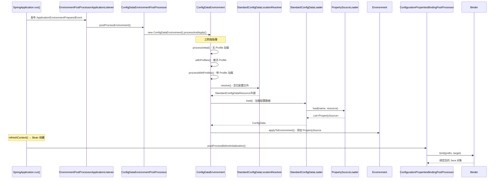
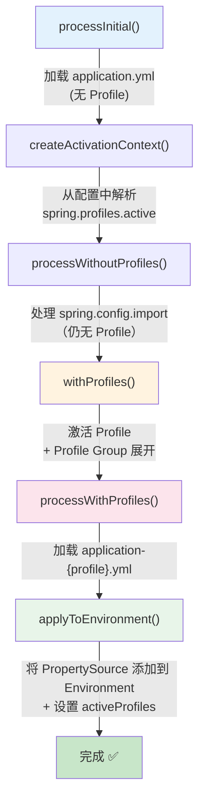

# ⑤ 配置文件加载与属性绑定深度分析

> 📌 基于 **Spring Boot 2.7.18** 源码分析
> 📁 核心源码路径：`/data/workspace/spring-boot/spring-boot-project/spring-boot/src/main/java/org/springframework/boot/context/config/`
> 📁 属性绑定路径：`/data/workspace/spring-boot/spring-boot-project/spring-boot/src/main/java/org/springframework/boot/context/properties/bind/`
> 🔗 前置知识：[① SpringBoot启动全流程深度分析](./SpringBoot启动全流程深度分析.md)

---

## 一、总体概览 — `application.yml` 是怎么被加载到 Environment 中的？

### 1.1 核心问题

当我们在 `application.yml` 中写下 `server.port=8080` 时，这个值是**如何**被 Spring Boot 发现、解析、存入 `Environment`，又**如何**绑定到 `ServerProperties.port` 字段上的？

整条链路涉及三个核心阶段：

```
阶段一：文件发现（Locate）   → ConfigDataEnvironmentPostProcessor 定位配置文件
阶段二：文件解析（Load）     → PropertySourceLoader 解析 .properties / .yml 为 PropertySource
阶段三：属性绑定（Bind）     → Binder + @ConfigurationProperties 绑定到 Java 对象
```

### 1.2 全景时序图



### 1.3 核心类速查

| 类名 | 作用 | 所在包 |
|------|------|--------|
| `ConfigDataEnvironmentPostProcessor` | 配置加载入口，`EnvironmentPostProcessor` 实现 | `boot.context.config` |
| `ConfigDataEnvironment` | 核心协调器，管理三阶段处理流程 | `boot.context.config` |
| `ConfigDataEnvironmentContributor` | 配置源贡献者，不可变树结构 | `boot.context.config` |
| `StandardConfigDataLocationResolver` | 标准配置文件路径解析器 | `boot.context.config` |
| `StandardConfigDataLoader` | 标准配置文件加载器 | `boot.context.config` |
| `PropertiesPropertySourceLoader` | 加载 `.properties` / `.xml` 文件 | `boot.env` |
| `YamlPropertySourceLoader` | 加载 `.yml` / `.yaml` 文件 | `boot.env` |
| `Profiles` | Profile 激活与分组管理 | `boot.context.config` |
| `ConfigDataProperties` | 解析 `spring.config.import` / `spring.config.activate` | `boot.context.config` |
| `ConfigurationPropertiesBindingPostProcessor` | `@ConfigurationProperties` 绑定入口 | `boot.context.properties` |
| `ConfigurationPropertiesBinder` | 真正执行绑定的内部类 | `boot.context.properties` |
| `Binder` | 底层绑定引擎 | `boot.context.properties.bind` |
| `JavaBeanBinder` | Setter 方式绑定 | `boot.context.properties.bind` |
| `ValueObjectBinder` | 构造器方式绑定 | `boot.context.properties.bind` |

---

## 二、Environment 体系回顾 — PropertySource 优先级链

### 2.1 Spring Framework 的 Environment 架构

在深入 Spring Boot 的配置加载之前，先回顾 Spring Framework 中 `Environment` 的核心架构：

```java
// Spring Framework 核心接口
public interface Environment extends PropertyResolver {
    String[] getActiveProfiles();
    String[] getDefaultProfiles();
    boolean acceptsProfiles(Profiles profiles);
}

// 可配置的 Environment
public interface ConfigurableEnvironment extends Environment, ConfigurablePropertyResolver {
    MutablePropertySources getPropertySources();  // 关键：有序的 PropertySource 列表
    void setActiveProfiles(String... profiles);
    void addActiveProfile(String profile);
}
```

**核心设计**：`Environment` 内部持有一个 `MutablePropertySources`，这是一个**有序列表**，包含多个 `PropertySource`。查找属性时**从前到后遍历**，**第一个找到的值胜出**——这就是配置优先级的底层实现。

### 2.2 Spring Boot PropertySource 优先级链（由高到低）

> ⚠️ 注意：以下是完整的 Spring Boot 配置优先级链，高优先级覆盖低优先级。

| 优先级 | PropertySource 名称 | 来源 | 说明 |
|:------:|---------------------|------|------|
| 1 | `commandLineArgs` | 命令行参数 `--key=value` | `SimpleCommandLinePropertySource` |
| 2 | `servletConfigInitParams` | Servlet Config 初始化参数 | Web 环境特有 |
| 3 | `servletContextInitParams` | Servlet Context 初始化参数 | Web 环境特有 |
| 4 | `jndiProperties` | JNDI 属性 | 需 JNDI 可用 |
| 5 | `systemProperties` | JVM 系统属性 `-Dkey=value` | `System.getProperties()` |
| 6 | `systemEnvironment` | 操作系统环境变量 | `System.getenv()` |
| 7 | `random` | `random.*` 前缀属性 | `RandomValuePropertySource` |
| 8 | `spring.application.json` | `SPRING_APPLICATION_JSON` 环境变量中的 JSON | `SpringApplicationJsonEnvironmentPostProcessor` |
| 9 | `Config resource 'application-{profile}.yml'` | Profile 特定配置 | 高优先级搜索路径覆盖低优先级 |
| 10 | `Config resource 'application.yml'` | 默认配置文件 | 同上 |
| 11 | `@PropertySource` 注解 | 代码中声明的属性源 | `@PropertySource("classpath:custom.properties")` |
| 12 | `defaultProperties` | `SpringApplication.setDefaultProperties()` | 优先级最低 |

> 💡 **搜索路径**也有优先级（由高到低）：
> `file:./config/*/` > `file:./config/` > `file:./` > `classpath:/config/` > `classpath:/`

### 2.3 StandardServletEnvironment 的 PropertySource 初始化

在 Servlet 环境下，`StandardServletEnvironment` 的初始 PropertySource 顺序（在 Spring Boot 添加配置文件之前）：

```java
// StandardServletEnvironment.customizePropertySources() 源码
@Override
protected void customizePropertySources(MutablePropertySources propertySources) {
    // 添加 Servlet 相关的 PropertySource（Stub 占位符，后续会替换为真实值）
    propertySources.addLast(new StubPropertySource(SERVLET_CONFIG_PROPERTY_SOURCE_NAME));  // 优先级 0
    propertySources.addLast(new StubPropertySource(SERVLET_CONTEXT_PROPERTY_SOURCE_NAME)); // 优先级 1
    if (jndiPresent && JndiLocatorDelegate.isDefaultJndiEnvironmentAvailable()) {
        propertySources.addLast(new JndiPropertySource(JNDI_PROPERTY_SOURCE_NAME));        // 优先级 2
    }
    super.customizePropertySources(propertySources); // 添加 systemProperties + systemEnvironment
}
```

初始顺序：`servletConfigInitParams` → `servletContextInitParams` → `jndiProperties` → `systemProperties` → `systemEnvironment`

### 2.4 EnvironmentPostProcessor 扩展点

Spring Boot 通过 `EnvironmentPostProcessor` 接口在 `Environment` 创建后、`ApplicationContext` 创建前对 `Environment` 进行后置处理，这是添加配置文件 PropertySource 的关键时机。

```java
// EnvironmentPostProcessor 接口（@FunctionalInterface）
@FunctionalInterface
public interface EnvironmentPostProcessor {
    void postProcessEnvironment(ConfigurableEnvironment environment, SpringApplication application);
}
```

**spring.factories 中注册的 6 个 EnvironmentPostProcessor**（按 order 排序）：

| 序号 | 类名 | Order | 作用 |
|:----:|------|:-----:|------|
| 1 | `RandomValuePropertySourceEnvironmentPostProcessor` | `HIGHEST_PRECEDENCE + 1` | 添加 `random` PropertySource |
| 2 | `SpringApplicationJsonEnvironmentPostProcessor` | `HIGHEST_PRECEDENCE + 5` | 解析 `SPRING_APPLICATION_JSON` 环境变量 |
| 3 | `ConfigDataEnvironmentPostProcessor` | `HIGHEST_PRECEDENCE + 10` | **核心**：加载 application.yml 等配置文件 |
| 4 | `CloudFoundryVcapEnvironmentPostProcessor` | `ConfigDataEnvironmentPostProcessor.ORDER + 1` | CloudFoundry VCAP 属性 |
| 5 | `SystemEnvironmentPropertySourceEnvironmentPostProcessor` | `Ordered.LOWEST_PRECEDENCE` | 替换 systemEnvironment 为宽松匹配版本 |
| 6 | `DebugAgentEnvironmentPostProcessor` | `Ordered.LOWEST_PRECEDENCE` | Reactor Debug Agent |

---

## 三、ConfigDataEnvironmentPostProcessor — 2.4+ 新配置加载体系

> 💡 Spring Boot 2.4 彻底重构了配置加载机制，从旧的 `ConfigFileApplicationListener` 迁移到全新的 `ConfigData` 体系。

### 3.1 入口：postProcessEnvironment()

```java
// ConfigDataEnvironmentPostProcessor.java（核心入口）
@Override
public void postProcessEnvironment(ConfigurableEnvironment environment, SpringApplication application) {
    postProcessEnvironment(environment, application.getResourceLoader(), application.getAdditionalProfiles());
}

void postProcessEnvironment(ConfigurableEnvironment environment, ResourceLoader resourceLoader,
        Collection<String> additionalProfiles) {
    try {
        this.logger.trace("Post-processing environment to add config data");
        resourceLoader = (resourceLoader != null) ? resourceLoader : new DefaultResourceLoader();
        // 🔴 核心：创建 ConfigDataEnvironment 并执行 processAndApply()
        getConfigDataEnvironment(environment, resourceLoader, additionalProfiles).processAndApply();
    }
    catch (UseLegacyConfigProcessingException ex) {
        // 兼容旧版：如果设置了 spring.config.use-legacy-processing=true，回退到旧机制
        this.logger.debug(LogMessage.format("Switching to legacy config file processing [%s]",
                ex.getConfigurationProperty()));
        configureAdditionalProfiles(environment, additionalProfiles);
        postProcessUsingLegacyApplicationListener(environment, resourceLoader);
    }
}
```

**关键点**：
- `ORDER = Ordered.HIGHEST_PRECEDENCE + 10`，在 `RandomValuePropertySource`（+1）和 `SpringApplicationJson`（+5）之后执行
- 支持回退到旧版 `ConfigFileApplicationListener`（2.4 之前的机制）
- 核心逻辑委托给 `ConfigDataEnvironment.processAndApply()`

### 3.2 ConfigDataEnvironment 构造

```java
// ConfigDataEnvironment 构造函数
ConfigDataEnvironment(DeferredLogFactory logFactory, ConfigurableBootstrapContext bootstrapContext,
        ConfigurableEnvironment environment, ResourceLoader resourceLoader, 
        Collection<String> additionalProfiles,
        ConfigDataEnvironmentUpdateListener environmentUpdateListener) {
    Binder binder = Binder.get(environment);
    UseLegacyConfigProcessingException.throwIfRequested(binder);
    this.logFactory = logFactory;
    this.logger = logFactory.getLog(getClass());
    // 绑定 spring.config.on-not-found 属性，默认 FAIL
    this.notFoundAction = binder.bind(ON_NOT_FOUND_PROPERTY, ConfigDataNotFoundAction.class)
        .orElse(ConfigDataNotFoundAction.FAIL);
    this.bootstrapContext = bootstrapContext;
    this.environment = environment;
    // 🔴 创建位置解析器（StandardConfigDataLocationResolver）
    this.resolvers = createConfigDataLocationResolvers(logFactory, bootstrapContext, binder, resourceLoader);
    this.additionalProfiles = additionalProfiles;
    this.environmentUpdateListener = (environmentUpdateListener != null) ? environmentUpdateListener
            : ConfigDataEnvironmentUpdateListener.NONE;
    // 🔴 创建加载器（StandardConfigDataLoader）
    this.loaders = new ConfigDataLoaders(logFactory, bootstrapContext, resourceLoader.getClassLoader());
    // 🔴 创建初始贡献者树
    this.contributors = createContributors(binder);
}
```

### 3.3 默认搜索路径

```java
// ConfigDataEnvironment 中的默认搜索路径
static final ConfigDataLocation[] DEFAULT_SEARCH_LOCATIONS;
static {
    List<ConfigDataLocation> locations = new ArrayList<>();
    locations.add(ConfigDataLocation.of("optional:classpath:/;optional:classpath:/config/"));
    locations.add(ConfigDataLocation.of("optional:file:./;optional:file:./config/;optional:file:./config/*/"));
    DEFAULT_SEARCH_LOCATIONS = locations.toArray(new ConfigDataLocation[0]);
}
```

**默认搜索路径**（6 个位置，优先级由低到高）：
1. `classpath:/`
2. `classpath:/config/`
3. `file:./`
4. `file:./config/`
5. `file:./config/*/`（通配符，匹配子目录）

> ⚠️ 这些路径都带 `optional:` 前缀，即文件不存在时不报错。

### 3.4 三阶段处理流程 — processAndApply()

这是 `ConfigDataEnvironment` 最核心的方法：

```java
// ConfigDataEnvironment.processAndApply()
void processAndApply() {
    ConfigDataImporter importer = new ConfigDataImporter(this.logFactory, this.notFoundAction, 
            this.resolvers, this.loaders);
    registerBootstrapBinder(this.contributors, null, DENY_INACTIVE_BINDING);
    
    // 🔴 阶段一：无 Profile 初始加载
    ConfigDataEnvironmentContributors contributors = processInitial(this.contributors, importer);
    
    // 🔴 创建激活上下文（从已加载的配置中解析 spring.profiles.active）
    ConfigDataActivationContext activationContext = createActivationContext(
            contributors.getBinder(null, BinderOption.FAIL_ON_BIND_TO_INACTIVE_SOURCE));
    
    // 🔴 阶段二：无 Profile 再次处理（处理 spring.config.import 等）
    contributors = processWithoutProfiles(contributors, importer, activationContext);
    
    // 🔴 解析并激活 Profile
    activationContext = withProfiles(contributors, activationContext);
    
    // 🔴 阶段三：带 Profile 加载（加载 application-{profile}.yml）
    contributors = processWithProfiles(contributors, importer, activationContext);
    
    // 🔴 最终：应用到 Environment
    applyToEnvironment(contributors, activationContext, importer.getLoadedLocations(),
            importer.getOptionalLocations());
}
```

**三阶段流程图**：



### 3.5 初始贡献者树 — createContributors()

`ConfigDataEnvironmentContributor` 是一个**不可变的树结构**，每次处理都生成新版本：

```java
// ConfigDataEnvironment.createContributors()
private ConfigDataEnvironmentContributors createContributors(Binder binder) {
    MutablePropertySources propertySources = this.environment.getPropertySources();
    List<ConfigDataEnvironmentContributor> contributors = new ArrayList<>(propertySources.size() + 10);
    PropertySource<?> defaultPropertySource = null;
    
    // 1. 将 Environment 中已有的 PropertySource 包装为 EXISTING 类型
    for (PropertySource<?> propertySource : propertySources) {
        if (DefaultPropertiesPropertySource.hasMatchingName(propertySource)) {
            defaultPropertySource = propertySource;  // defaultProperties 放最后
        } else {
            contributors.add(ConfigDataEnvironmentContributor.ofExisting(propertySource));
        }
    }
    
    // 2. 添加初始导入贡献者（触发配置文件加载）
    contributors.addAll(getInitialImportContributors(binder));
    
    // 3. defaultProperties 放在最后（优先级最低）
    if (defaultPropertySource != null) {
        contributors.add(ConfigDataEnvironmentContributor.ofExisting(defaultPropertySource));
    }
    return createContributors(contributors);
}
```

### 3.6 Contributor 的 6 种 Kind

`ConfigDataEnvironmentContributor.Kind` 枚举定义了贡献者的 6 种类型：

```java
enum Kind {
    ROOT,              // 根节点，包含初始子节点集合
    INITIAL_IMPORT,    // 初始导入，触发配置文件发现（如 classpath:/ 路径）
    EXISTING,          // 已存在的 PropertySource（如 systemProperties）
    UNBOUND_IMPORT,    // 已导入但未绑定 ConfigDataProperties 的配置
    BOUND_IMPORT,      // 已绑定，可以参与属性解析和激活判断
    EMPTY_LOCATION;    // 合法但为空的位置（如目录存在但无配置文件）
}
```

**生命周期**：`INITIAL_IMPORT` → `UNBOUND_IMPORT`（加载后）→ `BOUND_IMPORT`（绑定 `spring.config.*` 后）

### 3.7 applyToEnvironment() — 最终应用

```java
// ConfigDataEnvironment.applyToEnvironment()
private void applyToEnvironment(ConfigDataEnvironmentContributors contributors,
        ConfigDataActivationContext activationContext, ...) {
    checkForInvalidProperties(contributors);
    checkMandatoryLocations(contributors, activationContext, loadedLocations, optionalLocations);
    MutablePropertySources propertySources = this.environment.getPropertySources();
    
    // 🔴 遍历所有 BOUND_IMPORT 类型的贡献者，将激活的 PropertySource 添加到 Environment
    applyContributor(contributors, activationContext, propertySources);
    
    // 🔴 确保 defaultProperties 在最后
    DefaultPropertiesPropertySource.moveToEnd(propertySources);
    
    // 🔴 设置 active/default profiles
    Profiles profiles = activationContext.getProfiles();
    this.environment.setDefaultProfiles(StringUtils.toStringArray(profiles.getDefault()));
    this.environment.setActiveProfiles(StringUtils.toStringArray(profiles.getActive()));
}
```

---

## 四、多 Profile 高级特性

### 4.1 Profile 激活机制 — Profiles 类

`Profiles` 类负责管理 Profile 的激活和分组：

```java
// Profiles 构造函数
Profiles(Environment environment, Binder binder, Collection<String> additionalProfiles) {
    // 🔴 绑定 spring.profiles.group 配置
    this.groups = binder.bind("spring.profiles.group", STRING_STRINGS_MAP)
            .orElseGet(LinkedMultiValueMap::new);
    // 🔴 获取激活的 Profile 并展开 Group
    this.activeProfiles = expandProfiles(getActivatedProfiles(environment, binder, additionalProfiles));
    // 🔴 获取默认 Profile 并展开 Group
    this.defaultProfiles = expandProfiles(getDefaultProfiles(environment, binder));
}
```

**Profile 的三种激活方式**：

| 方式 | 配置 | 优先级 |
|------|------|:------:|
| 编程方式 | `SpringApplication.setAdditionalProfiles("dev")` | 最高 |
| 配置文件 | `spring.profiles.active=dev` | 中 |
| 命令行 | `--spring.profiles.active=dev` | 最高（命令行参数优先） |

### 4.2 Profile Group（一个 Profile 激活多个子 Profile）

> 这是 Spring Boot 2.4+ 的新特性，非常实用。

```yaml
# application.yml
spring:
  profiles:
    group:
      production:
        - proddb
        - prodmq
        - prodmetrics
      staging:
        - stagingdb
        - stagingmq
```

当激活 `production` Profile 时，`proddb`、`prodmq`、`prodmetrics` 三个子 Profile 也会被激活。

**展开逻辑**（深度优先）：

```java
// Profiles.expandProfiles()
private List<String> expandProfiles(List<String> profiles) {
    Deque<String> stack = new ArrayDeque<>();
    asReversedList(profiles).forEach(stack::push);  // 反序入栈（保证正序处理）
    Set<String> expandedProfiles = new LinkedHashSet<>();
    while (!stack.isEmpty()) {
        String current = stack.pop();
        if (expandedProfiles.add(current)) {        // 去重
            asReversedList(this.groups.get(current)).forEach(stack::push);  // 展开 Group
        }
    }
    return asUniqueItemList(expandedProfiles);
}
```

### 4.3 Profile 表达式 — spring.config.activate.on-profile

> Spring Boot 2.4+ 推荐使用 `spring.config.activate.on-profile` 替代旧的 `spring.profiles`。

```yaml
# 多文档 YAML（用 --- 分隔）
server:
  port: 8080

---
spring:
  config:
    activate:
      on-profile: dev       # 仅当 dev Profile 激活时生效
server:
  port: 9090

---
spring:
  config:
    activate:
      on-profile: prod      # 仅当 prod Profile 激活时生效
server:
  port: 80
```

**激活判断逻辑**：

```java
// ConfigDataProperties.Activate.isActive()
boolean isActive(ConfigDataActivationContext activationContext) {
    if (activationContext == null) {
        return false;
    }
    boolean activate = true;
    activate = activate && isActive(activationContext.getCloudPlatform());  // 云平台条件
    activate = activate && isActive(activationContext.getProfiles());       // Profile 条件
    return activate;
}

private boolean isActive(Profiles profiles) {
    return ObjectUtils.isEmpty(this.onProfile)
            || (profiles != null && matchesActiveProfiles(profiles::isAccepted));
}

private boolean matchesActiveProfiles(Predicate<String> activeProfiles) {
    // 🔴 支持 Profile 表达式：!dev, prod & cloud, dev | staging
    return org.springframework.core.env.Profiles.of(this.onProfile).matches(activeProfiles);
}
```

> 💡 Profile 表达式支持 `!`（非）、`&`（与）、`|`（或），例如 `on-profile: "prod & !staging"`

### 4.4 配置文件搜索路径自定义

| 属性 | 作用 | 默认值 |
|------|------|--------|
| `spring.config.location` | **替换**默认搜索路径 | 无（使用默认 6 个路径） |
| `spring.config.additional-location` | 在默认搜索路径**之外追加** | 无 |
| `spring.config.name` | 自定义配置文件名 | `application` |

```java
// ConfigDataEnvironment.getInitialImportContributors()
private List<ConfigDataEnvironmentContributor> getInitialImportContributors(Binder binder) {
    List<ConfigDataEnvironmentContributor> initialContributors = new ArrayList<>();
    // 优先级：import > additional-location > location（或默认路径）
    addInitialImportContributors(initialContributors, 
            bindLocations(binder, IMPORT_PROPERTY, EMPTY_LOCATIONS));
    addInitialImportContributors(initialContributors, 
            bindLocations(binder, ADDITIONAL_LOCATION_PROPERTY, EMPTY_LOCATIONS));
    addInitialImportContributors(initialContributors, 
            bindLocations(binder, LOCATION_PROPERTY, DEFAULT_SEARCH_LOCATIONS));
    return initialContributors;
}
```

> ⚠️ `spring.config.location` 会**完全替换**默认的 6 个搜索路径，而 `spring.config.additional-location` 是追加。

---

## 五、PropertySourceLoader — 解析 `.properties` 和 `.yml`

### 5.1 PropertySourceLoader SPI

Spring Boot 通过 SPI 机制加载 `PropertySourceLoader` 实现类：

```java
// StandardConfigDataLocationResolver 构造函数
public StandardConfigDataLocationResolver(Log logger, Binder binder, ResourceLoader resourceLoader) {
    this.logger = logger;
    // 🔴 通过 spring.factories SPI 加载所有 PropertySourceLoader
    this.propertySourceLoaders = SpringFactoriesLoader.loadFactories(
            PropertySourceLoader.class, getClass().getClassLoader());
    this.configNames = getConfigNames(binder);
    this.resourceLoader = new LocationResourceLoader(resourceLoader);
}
```

**两个内置实现**：

| 实现类 | 文件扩展名 | 多文档支持 |
|--------|-----------|:----------:|
| `PropertiesPropertySourceLoader` | `.properties`, `.xml` | ✅（`#---` 分隔符） |
| `YamlPropertySourceLoader` | `.yml`, `.yaml` | ✅（`---` 分隔符） |

### 5.2 PropertiesPropertySourceLoader 源码

```java
// PropertiesPropertySourceLoader
public class PropertiesPropertySourceLoader implements PropertySourceLoader {
    
    private static final String XML_FILE_EXTENSION = ".xml";
    
    @Override
    public String[] getFileExtensions() {
        return new String[] { "properties", "xml" };  // 支持 .properties 和 .xml
    }
    
    @Override
    public List<PropertySource<?>> load(String name, Resource resource) throws IOException {
        List<Map<String, ?>> properties = loadProperties(resource);
        if (properties.isEmpty()) {
            return Collections.emptyList();
        }
        List<PropertySource<?>> propertySources = new ArrayList<>(properties.size());
        for (int i = 0; i < properties.size(); i++) {
            // 🔴 多文档支持：如果有多个文档，名称后加 " (document #N)"
            String documentNumber = (properties.size() != 1) ? " (document #" + i + ")" : "";
            propertySources.add(new OriginTrackedMapPropertySource(name + documentNumber,
                    Collections.unmodifiableMap(properties.get(i)), true));
        }
        return propertySources;
    }
}
```

### 5.3 YamlPropertySourceLoader 源码

```java
// YamlPropertySourceLoader
public class YamlPropertySourceLoader implements PropertySourceLoader {
    
    @Override
    public String[] getFileExtensions() {
        return new String[] { "yml", "yaml" };  // 支持 .yml 和 .yaml
    }
    
    @Override
    public List<PropertySource<?>> load(String name, Resource resource) throws IOException {
        // 🔴 需要 SnakeYAML 库在 classpath 上
        if (!ClassUtils.isPresent("org.yaml.snakeyaml.Yaml", getClass().getClassLoader())) {
            throw new IllegalStateException("Attempted to load " + name 
                    + " but snakeyaml was not found on the classpath");
        }
        // 🔴 OriginTrackedYamlLoader 支持多文档 YAML（--- 分隔）
        List<Map<String, Object>> loaded = new OriginTrackedYamlLoader(resource).load();
        if (loaded.isEmpty()) {
            return Collections.emptyList();
        }
        List<PropertySource<?>> propertySources = new ArrayList<>(loaded.size());
        for (int i = 0; i < loaded.size(); i++) {
            String documentNumber = (loaded.size() != 1) ? " (document #" + i + ")" : "";
            propertySources.add(new OriginTrackedMapPropertySource(name + documentNumber,
                    Collections.unmodifiableMap(loaded.get(i)), true));
        }
        return propertySources;
    }
}
```

### 5.4 StandardConfigDataLoader — 加载入口

```java
// StandardConfigDataLoader
public class StandardConfigDataLoader implements ConfigDataLoader<StandardConfigDataResource> {

    private static final PropertySourceOptions PROFILE_SPECIFIC = 
            PropertySourceOptions.always(Option.PROFILE_SPECIFIC);
    private static final PropertySourceOptions NON_PROFILE_SPECIFIC = 
            PropertySourceOptions.ALWAYS_NONE;

    @Override
    public ConfigData load(ConfigDataLoaderContext context, StandardConfigDataResource resource)
            throws IOException, ConfigDataNotFoundException {
        if (resource.isEmptyDirectory()) {
            return ConfigData.EMPTY;
        }
        ConfigDataResourceNotFoundException.throwIfDoesNotExist(resource, resource.getResource());
        StandardConfigDataReference reference = resource.getReference();
        Resource originTrackedResource = OriginTrackedResource.of(resource.getResource(),
                Origin.from(reference.getConfigDataLocation()));
        String name = String.format("Config resource '%s' via location '%s'", 
                resource, reference.getConfigDataLocation());
        // 🔴 委托给 PropertySourceLoader 加载
        List<PropertySource<?>> propertySources = reference.getPropertySourceLoader()
                .load(name, originTrackedResource);
        // 🔴 标记是否为 Profile 特定的配置
        PropertySourceOptions options = (resource.getProfile() != null) 
                ? PROFILE_SPECIFIC : NON_PROFILE_SPECIFIC;
        return new ConfigData(propertySources, options);
    }
}
```

### 5.5 StandardConfigDataLocationResolver — 路径解析

```java
// StandardConfigDataLocationResolver 的核心逻辑
static final String CONFIG_NAME_PROPERTY = "spring.config.name";
private static final String[] DEFAULT_CONFIG_NAMES = { "application" };

// 对目录路径，遍历所有配置文件名和扩展名
private Set<StandardConfigDataReference> getReferencesForDirectory(
        ConfigDataLocation configDataLocation, String directory, String profile) {
    Set<StandardConfigDataReference> references = new LinkedHashSet<>();
    for (String name : this.configNames) {  // 默认 ["application"]
        Deque<StandardConfigDataReference> referencesForName = 
                getReferencesForConfigName(name, configDataLocation, directory, profile);
        references.addAll(referencesForName);
    }
    return references;
}

// 遍历所有 PropertySourceLoader 的文件扩展名
private Deque<StandardConfigDataReference> getReferencesForConfigName(String name,
        ConfigDataLocation configDataLocation, String directory, String profile) {
    Deque<StandardConfigDataReference> references = new ArrayDeque<>();
    for (PropertySourceLoader propertySourceLoader : this.propertySourceLoaders) {
        for (String extension : propertySourceLoader.getFileExtensions()) {
            // 生成引用：directory + name + [-profile] + .extension
            StandardConfigDataReference reference = new StandardConfigDataReference(
                    configDataLocation, directory, directory + name, profile, extension, 
                    propertySourceLoader);
            if (!references.contains(reference)) {
                references.addFirst(reference);  // 🔴 addFirst：后发现的扩展名优先级更高
            }
        }
    }
    return references;
}
```

**文件扫描顺序示例**（对 `classpath:/` 目录，无 Profile）：
1. `classpath:/application.yaml`
2. `classpath:/application.yml`
3. `classpath:/application.xml`
4. `classpath:/application.properties`

> 💡 `.properties` 优先于 `.yml` 的原因：`PropertiesPropertySourceLoader` 在 `spring.factories` 中排在 `YamlPropertySourceLoader` 前面，而 `addFirst` 的逻辑使后处理的 Loader 的扩展名优先级更高（即 yml/yaml 高于 properties/xml）。但这里需要注意实际行为：**同目录下 `.properties` 和 `.yml` 都会被加载**，但 `.properties` 的 PropertySource 在前（优先级更高）。

---

## 六、@ConfigurationProperties 绑定机制

### 6.1 绑定入口 — ConfigurationPropertiesBindingPostProcessor

`ConfigurationPropertiesBindingPostProcessor` 是一个 `BeanPostProcessor`，在每个 Bean 初始化之前检查是否需要进行属性绑定：

```java
// ConfigurationPropertiesBindingPostProcessor
public class ConfigurationPropertiesBindingPostProcessor
        implements BeanPostProcessor, PriorityOrdered, ApplicationContextAware, InitializingBean {

    @Override
    public int getOrder() {
        return Ordered.HIGHEST_PRECEDENCE + 1;  // 极高优先级，确保最早执行
    }

    @Override
    public void afterPropertiesSet() throws Exception {
        this.registry = (BeanDefinitionRegistry) this.applicationContext.getAutowireCapableBeanFactory();
        // 获取内部的 ConfigurationPropertiesBinder
        this.binder = ConfigurationPropertiesBinder.get(this.applicationContext);
    }

    @Override
    public Object postProcessBeforeInitialization(Object bean, String beanName) throws BeansException {
        // 🔴 核心：尝试获取 @ConfigurationProperties 注解信息并绑定
        bind(ConfigurationPropertiesBean.get(this.applicationContext, bean, beanName));
        return bean;
    }

    private void bind(ConfigurationPropertiesBean bean) {
        if (bean == null || hasBoundValueObject(bean.getName())) {
            return;  // 没有 @ConfigurationProperties 注解或已经绑定过（VALUE_OBJECT）
        }
        // 🔴 只处理 JAVA_BEAN 绑定方式（Setter 绑定）
        Assert.state(bean.getBindMethod() == BindMethod.JAVA_BEAN, 
                "Cannot bind @ConfigurationProperties for bean '" + bean.getName() 
                + "'. Ensure that @ConstructorBinding has not been applied to regular bean");
        try {
            this.binder.bind(bean);
        } catch (Exception ex) {
            throw new ConfigurationPropertiesBindException(bean, ex);
        }
    }
}
```

**关键点**：
- `PriorityOrdered` + `HIGHEST_PRECEDENCE + 1`，确保在几乎所有其他 `BeanPostProcessor` 之前执行
- 只处理 `JAVA_BEAN` 绑定方式，`VALUE_OBJECT`（构造器绑定）在 Bean 注册阶段已处理

### 6.2 两种绑定方式 — BindMethod

```java
// ConfigurationPropertiesBean.BindMethod
public enum BindMethod {
    JAVA_BEAN,      // Setter 方式绑定（传统方式）
    VALUE_OBJECT;   // 构造器方式绑定（@ConstructorBinding，2.2+）

    static BindMethod forType(Class<?> type) {
        return (ConfigurationPropertiesBindConstructorProvider.INSTANCE
                .getBindConstructor(type, false) != null)
                ? VALUE_OBJECT : JAVA_BEAN;
    }
}
```

**JAVA_BEAN（Setter 绑定）**：
```java
@ConfigurationProperties(prefix = "server")
public class ServerProperties {
    private int port = 8080;     // 需要 getter/setter
    public int getPort() { return port; }
    public void setPort(int port) { this.port = port; }
}
```

**VALUE_OBJECT（构造器绑定）**：
```java
@ConfigurationProperties(prefix = "my.service")
@ConstructorBinding
public class MyServiceProperties {
    private final String name;   // 可以是 final
    private final int timeout;
    
    public MyServiceProperties(String name, @DefaultValue("3000") int timeout) {
        this.name = name;
        this.timeout = timeout;
    }
    // 只需要 getter，不需要 setter
}
```

### 6.3 ConfigurationPropertiesBinder — 真正执行绑定

```java
// ConfigurationPropertiesBinder 核心方法
class ConfigurationPropertiesBinder {
    
    BindResult<?> bind(ConfigurationPropertiesBean propertiesBean) {
        Bindable<?> target = propertiesBean.asBindTarget();
        ConfigurationProperties annotation = propertiesBean.getAnnotation();
        // 🔴 构建 BindHandler 链
        BindHandler bindHandler = getBindHandler(target, annotation);
        // 🔴 执行绑定：prefix + target + handler
        return getBinder().bind(annotation.prefix(), target, bindHandler);
    }
    
    // BindHandler 链的构建（责任链模式）
    private <T> BindHandler getBindHandler(Bindable<T> target, ConfigurationProperties annotation) {
        List<Validator> validators = getValidators(target);
        BindHandler handler = getHandler();  // IgnoreTopLevelConverterNotFoundBindHandler
        handler = new ConfigurationPropertiesBindHandler(handler);  // 处理嵌套 @ConfigurationProperties
        
        if (annotation.ignoreInvalidFields()) {
            handler = new IgnoreErrorsBindHandler(handler);  // 忽略无效字段
        }
        if (!annotation.ignoreUnknownFields()) {
            UnboundElementsSourceFilter filter = new UnboundElementsSourceFilter();
            handler = new NoUnboundElementsBindHandler(handler, filter);  // 检查未绑定元素
        }
        if (!validators.isEmpty()) {
            // 🔴 JSR-303 验证 Handler
            handler = new ValidationBindHandler(handler, validators.toArray(new Validator[0]));
        }
        // 允许外部 Advisor 扩展
        for (ConfigurationPropertiesBindHandlerAdvisor advisor : getBindHandlerAdvisors()) {
            handler = advisor.apply(handler);
        }
        return handler;
    }
}
```

**BindHandler 链**（由外到内）：

```
ValidationBindHandler（JSR-303 验证）
  └→ NoUnboundElementsBindHandler（检查未绑定元素，当 ignoreUnknownFields=false）
      └→ IgnoreErrorsBindHandler（忽略无效字段，当 ignoreInvalidFields=true）
          └→ ConfigurationPropertiesBindHandler（处理嵌套 @ConfigurationProperties）
              └→ IgnoreTopLevelConverterNotFoundBindHandler（忽略顶层转换失败）
                  └→ BoundPropertiesTrackingBindHandler（跟踪已绑定属性）
```

### 6.4 Binder — 底层绑定引擎

`Binder` 是 Spring Boot 2.0+ 引入的全新绑定引擎，替代了旧版的 `RelaxedDataBinder`：

```java
// Binder 构造函数（最完整版本）
public Binder(Iterable<ConfigurationPropertySource> sources, 
              PlaceholdersResolver placeholdersResolver,
              List<ConversionService> conversionServices, 
              Consumer<PropertyEditorRegistry> propertyEditorInitializer,
              BindHandler defaultBindHandler, 
              BindConstructorProvider constructorProvider) {
    this.sources = sources;
    this.placeholdersResolver = (placeholdersResolver != null) 
            ? placeholdersResolver : PlaceholdersResolver.NONE;
    this.bindConverter = BindConverter.get(conversionServices, propertyEditorInitializer);
    this.defaultBindHandler = (defaultBindHandler != null) ? defaultBindHandler : BindHandler.DEFAULT;
    if (constructorProvider == null) {
        constructorProvider = BindConstructorProvider.DEFAULT;
    }
    // 🔴 两种 DataObjectBinder：构造器优先，JavaBean 兜底
    ValueObjectBinder valueObjectBinder = new ValueObjectBinder(constructorProvider);
    JavaBeanBinder javaBeanBinder = JavaBeanBinder.INSTANCE;
    this.dataObjectBinders = Collections.unmodifiableList(
            Arrays.asList(valueObjectBinder, javaBeanBinder));
}
```

### 6.5 Binder.bind() 核心流程

```java
// Binder.bind() 核心链路
private <T> T bind(ConfigurationPropertyName name, Bindable<T> target, 
        BindHandler handler, boolean create) {
    Assert.notNull(name, "Name must not be null");
    Assert.notNull(target, "Target must not be null");
    handler = (handler != null) ? handler : this.defaultBindHandler;
    Context context = new Context();
    return bind(name, target, handler, context, false, create);
}

private <T> T bind(ConfigurationPropertyName name, Bindable<T> target, 
        BindHandler handler, Context context, 
        boolean allowRecursiveBinding, boolean create) {
    try {
        // 🔴 Step 1: 通知 handler 绑定开始
        Bindable<T> replacementTarget = handler.onStart(name, target, context);
        if (replacementTarget == null) {
            return handleBindResult(name, target, handler, context, null, create);
        }
        target = replacementTarget;
        // 🔴 Step 2: 尝试绑定对象
        Object bound = bindObject(name, target, handler, context, allowRecursiveBinding);
        // 🔴 Step 3: 处理绑定结果
        return handleBindResult(name, target, handler, context, bound, create);
    } catch (Exception ex) {
        return handleBindError(name, target, handler, context, ex);
    }
}
```

### 6.6 bindObject() — 绑定策略选择

```java
// Binder.bindObject() — 决定绑定策略
private <T> Object bindObject(ConfigurationPropertyName name, Bindable<T> target, 
        BindHandler handler, Context context, boolean allowRecursiveBinding) {
    // 1. 查找直接匹配的属性
    ConfigurationProperty property = findProperty(name, target, context);
    if (property == null && context.depth != 0 && containsNoDescendantOf(context.getSources(), name)) {
        return null;  // 无属性且无子属性，直接返回
    }
    
    // 🔴 2. 聚合绑定器（Map、Collection、Array）
    AggregateBinder<?> aggregateBinder = getAggregateBinder(target, context);
    if (aggregateBinder != null) {
        return bindAggregate(name, target, handler, context, aggregateBinder);
    }
    
    // 🔴 3. 简单属性绑定
    if (property != null) {
        try {
            return bindProperty(target, context, property);
        } catch (ConverterNotFoundException ex) {
            // 转换失败时尝试数据对象绑定
            Object instance = bindDataObject(name, target, handler, context, allowRecursiveBinding);
            if (instance != null) return instance;
            throw ex;
        }
    }
    
    // 🔴 4. 数据对象绑定（JavaBean / ValueObject）
    return bindDataObject(name, target, handler, context, allowRecursiveBinding);
}

// 聚合绑定器选择
private AggregateBinder<?> getAggregateBinder(Bindable<?> target, Context context) {
    Class<?> resolvedType = target.getType().resolve(Object.class);
    if (Map.class.isAssignableFrom(resolvedType)) return new MapBinder(context);
    if (Collection.class.isAssignableFrom(resolvedType)) return new CollectionBinder(context);
    if (target.getType().isArray()) return new ArrayBinder(context);
    return null;
}
```

**绑定策略优先级**：
1. **聚合绑定**（Map/Collection/Array）— `AggregateBinder`
2. **简单属性绑定**（直接值）— `bindProperty()`
3. **数据对象绑定**（嵌套对象）— `bindDataObject()` → `ValueObjectBinder` → `JavaBeanBinder`

### 6.7 JavaBeanBinder — Setter 方式绑定

```java
// JavaBeanBinder（单例，无状态）
class JavaBeanBinder implements DataObjectBinder {
    static final JavaBeanBinder INSTANCE = new JavaBeanBinder();

    @Override
    public <T> T bind(ConfigurationPropertyName name, Bindable<T> target, 
            Context context, DataObjectPropertyBinder propertyBinder) {
        boolean hasKnownBindableProperties = target.getValue() != null 
                && hasKnownBindableProperties(name, context);
        Bean<T> bean = Bean.get(target, hasKnownBindableProperties);
        if (bean == null) return null;
        
        BeanSupplier<T> beanSupplier = bean.getSupplier(target);
        boolean bound = bind(propertyBinder, bean, beanSupplier, context);
        return (bound ? beanSupplier.get() : null);
    }
    
    private <T> boolean bind(DataObjectPropertyBinder propertyBinder, Bean<T> bean, 
            BeanSupplier<T> beanSupplier, Context context) {
        boolean bound = false;
        // 🔴 遍历 Bean 的所有属性，逐个绑定
        for (BeanProperty beanProperty : bean.getProperties().values()) {
            bound |= bind(beanSupplier, propertyBinder, beanProperty);
            context.clearConfigurationProperty();
        }
        return bound;
    }
}
```

**Bean 属性发现机制**：
- 通过反射扫描 `is*()` / `get*()` / `set*()` 方法
- 方法名转属性名：`Introspector.decapitalize(methodName.substring(prefix.length()))`
- 属性名转 dashed-form：`DataObjectPropertyName.toDashedForm(name)` → `myProperty` → `my-property`

### 6.8 ValueObjectBinder — 构造器方式绑定

```java
// ValueObjectBinder
class ValueObjectBinder implements DataObjectBinder {

    @Override
    public <T> T bind(ConfigurationPropertyName name, Bindable<T> target, 
            Binder.Context context, DataObjectPropertyBinder propertyBinder) {
        ValueObject<T> valueObject = ValueObject.get(target, this.constructorProvider, context);
        if (valueObject == null) return null;
        
        context.pushConstructorBoundTypes(target.getType().resolve());
        List<ConstructorParameter> parameters = valueObject.getConstructorParameters();
        List<Object> args = new ArrayList<>(parameters.size());
        boolean bound = false;
        
        // 🔴 遍历构造函数参数，逐个绑定
        for (ConstructorParameter parameter : parameters) {
            Object arg = parameter.bind(propertyBinder);
            bound = bound || arg != null;
            arg = (arg != null) ? arg : getDefaultValue(context, parameter);  // 使用 @DefaultValue
            args.add(arg);
        }
        
        context.clearConfigurationProperty();
        context.popConstructorBoundTypes();
        // 🔴 只有至少一个参数成功绑定才实例化
        return bound ? valueObject.instantiate(args) : null;
    }
}
```

### 6.9 宽松绑定（Relaxed Binding）

Spring Boot 的宽松绑定规则使以下写法都能绑定到同一个属性：

| 格式 | 示例 | 适用场景 |
|------|------|---------|
| 标准 kebab-case | `my.main-project.person.first-name` | `.properties` / `.yml`（推荐） |
| 驼峰式 | `my.mainProject.person.firstName` | `.properties` / `.yml` |
| 下划线式 | `my.main_project.person.first_name` | `.properties` / `.yml` |
| 大写下划线式 | `MY_MAIN_PROJECT_PERSON_FIRSTNAME` | 系统环境变量（推荐） |

**底层实现**：`ConfigurationPropertyName` 使用 `Form.UNIFORM` 进行比较——将所有非字母数字字符去掉，然后转小写：

```java
// ConfigurationPropertyName.Form
public enum Form {
    ORIGINAL,   // 原始格式
    DASHED,     // 小写 + 字母数字 + 破折号（toString 用）
    UNIFORM     // 小写 + 纯字母数字（equals/hashCode 用）
}

// 等价性判断：去掉所有非字母数字字符，转小写后比较
// "foo-bar" → UNIFORM → "foobar"
// "fooBar"  → UNIFORM → "foobar"
// "foo_bar" → UNIFORM → "foobar"
// 三者 UNIFORM 形式相同，因此视为等价
```

---

## 七、@ConfigurationProperties 的 JSR-303 验证

### 7.1 启用验证

要对 `@ConfigurationProperties` 类启用 JSR-303（Bean Validation）验证，需要：

1. 在类上添加 `@Validated` 注解
2. classpath 上有 Bean Validation 实现（如 Hibernate Validator）
3. 在字段上使用验证注解（`@NotNull`、`@Min`、`@Max`、`@Pattern` 等）

```java
@ConfigurationProperties(prefix = "my.service")
@Validated
public class MyServiceProperties {
    @NotNull
    private String name;
    
    @Min(1)
    @Max(65535)
    private int port = 8080;
    
    @Pattern(regexp = "^https?://.*")
    private String url;
    
    @Valid  // 启用嵌套对象验证
    private Security security = new Security();
    
    public static class Security {
        @NotNull
        private String username;
        @Size(min = 8, message = "密码长度不能少于8位")
        private String password;
        // getters/setters...
    }
    // getters/setters...
}
```

### 7.2 验证集成原理 — ConfigurationPropertiesBinder

```java
// ConfigurationPropertiesBinder.getValidators()
private List<Validator> getValidators(Bindable<?> target) {
    List<Validator> validators = new ArrayList<>(3);
    // 1. 全局验证器（名为 configurationPropertiesValidator 的 Bean）
    if (this.configurationPropertiesValidator != null) {
        validators.add(this.configurationPropertiesValidator);
    }
    // 2. JSR-303 验证器（需要 @Validated 注解 + classpath 上有 JSR-303 实现）
    if (this.jsr303Present && target.getAnnotation(Validated.class) != null) {
        validators.add(getJsr303Validator());
    }
    // 3. 自验证（Bean 自身实现 Validator 接口）
    Validator selfValidator = getSelfValidator(target);
    if (selfValidator != null) {
        validators.add(selfValidator);
    }
    return validators;
}
```

**三种验证方式**：

| 方式 | 触发条件 | 优先级 |
|------|---------|:------:|
| 全局 `configurationPropertiesValidator` Bean | 容器中存在该名称的 Bean | 1 |
| JSR-303 | `@Validated` + classpath 有 Hibernate Validator | 2 |
| 自验证 | Bean 自身实现 `Validator` 接口 | 3 |

### 7.3 ValidationBindHandler — 验证执行器

```java
// ValidationBindHandler（关键方法）
public class ValidationBindHandler extends AbstractBindHandler {
    
    private final Validator[] validators;
    private BindValidationException exception;
    
    @Override
    public void onFinish(ConfigurationPropertyName name, Bindable<?> target, 
            BindContext context, Object result) throws Exception {
        // 🔴 绑定完成后执行验证
        validate(name, target, context, result);
        super.onFinish(name, target, context, result);
    }
    
    private void validate(ConfigurationPropertyName name, Bindable<?> target, 
            BindContext context, Object result) {
        if (this.exception == null) {
            Object validationTarget = getValidationTarget(target, context, result);
            Class<?> validationType = target.getBoxedType().resolve();
            if (validationTarget != null) {
                validateAndPush(name, validationTarget, validationType);
            }
        }
        // 🔴 只在顶层（depth == 0）抛出异常
        if (context.getDepth() == 0 && this.exception != null) {
            throw this.exception;
        }
    }
    
    private void validateAndPush(ConfigurationPropertyName name, Object target, Class<?> type) {
        ValidationResult result = null;
        for (Validator validator : this.validators) {
            if (validator.supports(type)) {
                result = (result != null) ? result : new ValidationResult(name, target);
                validator.validate(target, result);
            }
        }
        if (result != null && result.hasErrors()) {
            this.exception = new BindValidationException(result.getValidationErrors());
        }
    }
}
```

### 7.4 验证失败的友好提示

当 `@ConfigurationProperties` 验证失败时，Spring Boot 的 `BindValidationException` 会被 `FailureAnalyzer` 捕获，输出友好的错误信息：

```
***************************
APPLICATION FAILED TO START
***************************

Description:

Binding to target org.springframework.boot.context.properties.bind.BindException: 
Failed to bind properties under 'my.service' to com.example.MyServiceProperties failed:

    Property: my.service.name
    Value: null
    Reason: 不能为null

    Property: my.service.security.password  
    Value: "123"
    Reason: 密码长度不能少于8位

Action:

Update your application's configuration
```

---

## 八、spring.config.import 配置导入机制（2.4+）

### 8.1 基本用法

`spring.config.import` 是 Spring Boot 2.4+ 引入的配置导入机制，允许从其他位置导入额外的配置：

```yaml
# application.yml
spring:
  config:
    import:
      - optional:classpath:/extra-config.yml
      - optional:file:./external/database.properties
      - configserver:http://config-server:8888
```

### 8.2 源码实现 — ConfigDataProperties

```java
// ConfigDataProperties（绑定 spring.config.* 属性）
class ConfigDataProperties {
    private static final ConfigurationPropertyName NAME = ConfigurationPropertyName.of("spring.config");
    
    private final List<ConfigDataLocation> imports;   // spring.config.import
    private final Activate activate;                   // spring.config.activate

    // 通过 Binder 绑定
    static ConfigDataProperties get(Binder binder) {
        LegacyProfilesBindHandler legacyProfilesBindHandler = new LegacyProfilesBindHandler();
        String[] legacyProfiles = binder.bind(LEGACY_PROFILES_NAME, BINDABLE_STRING_ARRAY, 
                legacyProfilesBindHandler).orElse(null);
        ConfigDataProperties properties = binder.bind(NAME, BINDABLE_PROPERTIES, 
                new ConfigDataLocationBindHandler()).orElse(null);
        // 兼容旧版 spring.profiles 语法
        if (!ObjectUtils.isEmpty(legacyProfiles)) {
            properties = (properties != null)
                    ? properties.withLegacyProfiles(legacyProfiles, 
                            legacyProfilesBindHandler.getProperty())
                    : new ConfigDataProperties(null, new Activate(null, legacyProfiles));
        }
        return properties;
    }
}
```

### 8.3 ConfigDataLocationResolver + ConfigDataLoader 扩展点

配置中心（如 Nacos、Apollo、Consul）通过实现这两个接口来集成 `spring.config.import`：

```java
// 位置解析器接口
public interface ConfigDataLocationResolver<R extends ConfigDataResource> {
    boolean isResolvable(ConfigDataLocationResolverContext context, ConfigDataLocation location);
    List<R> resolve(ConfigDataLocationResolverContext context, ConfigDataLocation location);
    default List<R> resolveProfileSpecific(ConfigDataLocationResolverContext context, 
            ConfigDataLocation location, Profiles profiles) {
        return Collections.emptyList();
    }
}

// 加载器接口
public interface ConfigDataLoader<R extends ConfigDataResource> {
    ConfigData load(ConfigDataLoaderContext context, R resource) throws IOException;
}
```

**扩展示例**（以 Nacos 为例的伪代码）：
```yaml
# application.yml
spring:
  config:
    import: nacos:application.yml?group=DEFAULT_GROUP
```

```java
// Nacos 的 ConfigDataLocationResolver
public class NacosConfigDataLocationResolver 
        implements ConfigDataLocationResolver<NacosConfigDataResource> {
    @Override
    public boolean isResolvable(ConfigDataLocationResolverContext context, 
            ConfigDataLocation location) {
        return location.hasPrefix("nacos:");
    }
    // ...
}

// Nacos 的 ConfigDataLoader
public class NacosConfigDataLoader 
        implements ConfigDataLoader<NacosConfigDataResource> {
    @Override
    public ConfigData load(ConfigDataLoaderContext context, 
            NacosConfigDataResource resource) {
        // 从 Nacos 配置中心拉取配置
        String config = nacosClient.getConfig(resource.getDataId(), resource.getGroup());
        // 转换为 PropertySource
        // ...
    }
}
```

### 8.4 optional 前缀

`optional:` 前缀表示配置源不存在时不报错：

```yaml
spring:
  config:
    import:
      - optional:classpath:/extra.yml    # 文件不存在时静默跳过
      - classpath:/required.yml           # 文件不存在时启动失败
```

对应源码中的行为由 `ConfigDataNotFoundAction` 控制：
```java
// 可通过 spring.config.on-not-found=ignore 全局忽略
this.notFoundAction = binder.bind(ON_NOT_FOUND_PROPERTY, ConfigDataNotFoundAction.class)
    .orElse(ConfigDataNotFoundAction.FAIL);
```
