# Spring @Lazy 注解详解

> @Lazy 是 Spring 中一个非常重要但常被忽视的注解，它不仅能解决循环依赖问题，还能优化应用启动性能。

---

## 一、@Lazy 是什么？

### 1.1 官方定义

```java
/**
 * Indicates whether a bean is to be lazily initialized.
 * 
 * May be used on any class directly or indirectly annotated with @Component
 * or on methods annotated with @Bean.
 * 
 * If present and set to true, the bean will not be initialized until
 * it is first requested (typically via injection).
 */
@Target({ElementType.TYPE, ElementType.METHOD, ElementType.CONSTRUCTOR, ElementType.PARAMETER, ElementType.FIELD})
@Retention(RetentionPolicy.RUNTIME)
@Documented
public @interface Lazy {
    
    /**
     * Whether lazy initialization should occur.
     */
    boolean value() default true;
}
```

### 1.2 核心概念

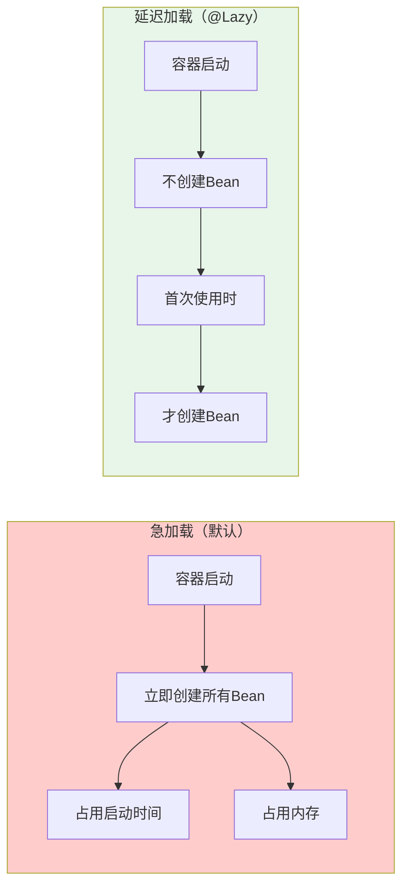

### 1.3 使用位置

| 位置 | 作用 | 示例 |
|------|------|------|
| **类上** | 整个Bean延迟初始化 | `@Lazy @Service` |
| **方法上** | @Bean方法延迟执行 | `@Lazy @Bean` |
| **字段上** | 注入时延迟获取 | `@Autowired @Lazy` |
| **构造器参数上** | 构造器注入时延迟获取 | `public A(@Lazy B b)` |
| **方法参数上** | Setter注入时延迟获取 | `public void setB(@Lazy B b)` |

---

## 二、@Lazy 的核心作用

### 2.1 作用一：优化启动性能

```mermaid
flowchart TB
    subgraph 无@Lazy
        A1["容器启动"] --> A2["初始化BeanA"]
        A2 --> A3["初始化BeanB"]
        A3 --> A4["初始化BeanC"]
        A4 --> A5["...初始化100个Bean"]
        A5 --> A6["启动完成<br/>耗时5秒"]
    end
    
    subgraph 有@Lazy
        B1["容器启动"] --> B2["初始化BeanA"]
        B2 --> B3["跳过BeanB<br/>（@Lazy）"]
        B3 --> B4["跳过BeanC<br/>（@Lazy）"]
        B4 --> B5["启动完成<br/>耗时0.5秒"]
        B5 --> B6["首次使用BeanB时<br/>才初始化"]
    end
    
    style A6 fill:#ffcccc
    style B5 fill:#e8f5e9
```

**示例代码**：

```java
// 不使用@Lazy：启动时立即创建
@Service
public class HeavyService {
    public HeavyService() {
        // 模拟耗时初始化
        try {
            Thread.sleep(2000);
        } catch (InterruptedException e) {}
        System.out.println("HeavyService initialized");
    }
}

// 使用@Lazy：首次使用时才创建
@Service
@Lazy
public class LazyHeavyService {
    public LazyHeavyService() {
        try {
            Thread.sleep(2000);
        } catch (InterruptedException e) {}
        System.out.println("LazyHeavyService initialized");
    }
}
```

### 2.2 作用二：解决循环依赖

```java
// 问题场景：构造器注入循环依赖
@Service
public class ServiceA {
    private final ServiceB serviceB;
    
    public ServiceA(ServiceB serviceB) {  // ❌ 循环依赖，无法解决
        this.serviceB = serviceB;
    }
}

@Service
public class ServiceB {
    private final ServiceA serviceA;
    
    public ServiceB(ServiceA serviceA) {  // ❌ 循环依赖，无法解决
        this.serviceA = serviceA;
    }
}

// 解决方案：使用@Lazy
@Service
public class ServiceA {
    private final ServiceB serviceB;
    
    public ServiceA(@Lazy ServiceB serviceB) {  // ✅ 注入代理对象
        this.serviceB = serviceB;
    }
}
```

### 2.3 作用三：按需加载节省资源

```java
@Service
public class ReportService {
    
    // 报表生成器很少使用，延迟加载
    @Autowired
    @Lazy
    private ReportGenerator reportGenerator;
    
    public void generateReport() {
        // 只有调用这个方法时，reportGenerator才会被初始化
        reportGenerator.generate();
    }
}
```

---

## 三、@Lazy 的工作原理

### 3.1 核心机制：代理对象

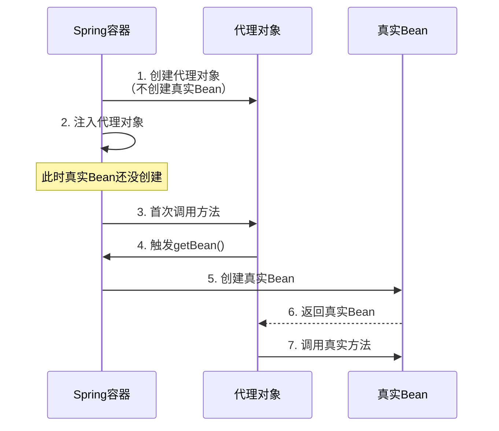

### 3.2 代理对象的类型

```java
// @Lazy 创建的代理对象类型
public class LazyInjectionPointResolver {
    
    // 1. JDK动态代理（如果Bean实现了接口）
    // 2. CGLIB代理（如果Bean是类）
    // 3. ScopedProxy（作用域代理）
}
```

### 3.3 源码分析：@Lazy 的处理

#### 入口：`ContextAnnotationAutowireCandidateResolver`

```java
// ContextAnnotationAutowireCandidateResolver.java
public class ContextAnnotationAutowireCandidateResolver extends QualifierAnnotationAutowireCandidateResolver {
    
    @Override
    public Object getLazyResolutionProxyIfNecessary(DependencyDescriptor descriptor, String beanName) {
        // ⭐ 核心：检查是否有@Lazy注解
        return (isLazy(descriptor) ? buildLazyResolutionProxy(descriptor, beanName) : null);
    }
    
    // 检查是否有@Lazy注解
    protected boolean isLazy(DependencyDescriptor descriptor) {
        // 1. 检查字段上的@Lazy
        for (Annotation ann : descriptor.getAnnotations()) {
            if (Lazy.class == ann.annotationType()) {
                return ((Lazy) ann).value();
            }
        }
        
        // 2. 检查方法参数上的@Lazy
        MethodParameter methodParam = descriptor.getMethodParameter();
        if (methodParam != null) {
            Method method = methodParam.getMethod();
            if (method == null || void.class == method.getReturnType()) {
                Lazy lazy = methodParam.getParameterAnnotation(Lazy.class);
                if (lazy != null && lazy.value()) {
                    return true;
                }
            }
        }
        
        return false;
    }
    
    // 构建延迟解析代理
    protected Object buildLazyResolutionProxy(DependencyDescriptor descriptor, String beanName) {
        // ⭐⭐⭐ 创建 LazyResolutionProxy
        DefaultListableBeanFactory beanFactory = (DefaultListableBeanFactory) getBeanFactory();
        return new LazyResolutionProxy(descriptor, beanName, beanFactory);
    }
}
```

#### 核心：`LazyResolutionProxy`

```java
// 内部类：延迟解析代理
private static class LazyResolutionProxy implements MethodInterceptor {
    
    private final DependencyDescriptor descriptor;
    private final String beanName;
    private final DefaultListableBeanFactory beanFactory;
    
    // ⭐ 真实Bean的缓存
    private volatile Object target;
    
    @Override
    public Object intercept(Object proxy, Method method, Object[] args, MethodProxy methodProxy) throws Throwable {
        // ⭐ 首次调用时，才获取真实Bean
        if (this.target == null) {
            this.target = this.beanFactory.resolveDependency(
                this.descriptor, this.beanName, null, null);
        }
        // 调用真实Bean的方法
        return method.invoke(this.target, args);
    }
}
```

### 3.4 完整流程图

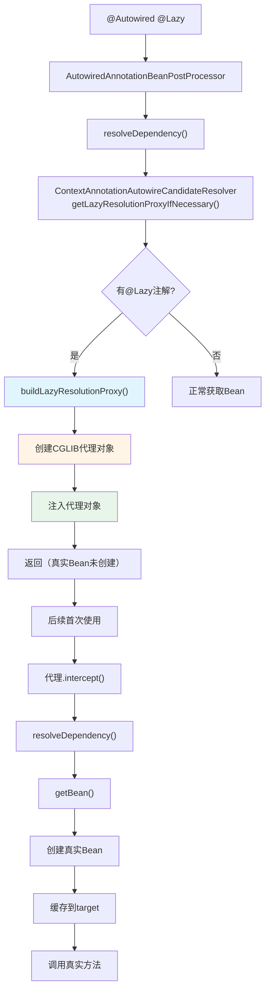

---

## 四、@Lazy 解决循环依赖的原理

### 4.1 问题回顾：构造器注入循环依赖

```java
// 问题：为什么构造器注入的循环依赖无法解决？
@Service
public class ServiceA {
    public ServiceA(ServiceB serviceB) {
        // 在A的构造方法中就需要B
        // 但B还没创建，A的实例化就无法完成
        // 无法将A的半成品暴露到三级缓存
    }
}

@Service
public class ServiceB {
    public ServiceB(ServiceA serviceA) {
        // 同样需要A
    }
}
```

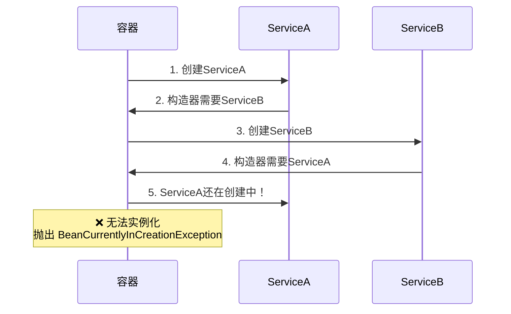

### 4.2 @Lazy 的解决方案

```java
@Service
public class ServiceA {
    private final ServiceB serviceB;
    
    public ServiceA(@Lazy ServiceB serviceB) {  // ⭐ @Lazy
        this.serviceB = serviceB;  // 注入的是代理对象
    }
    
    public void doSomething() {
        serviceB.doOther();  // 首次调用时，才获取真实Bean
    }
}
```

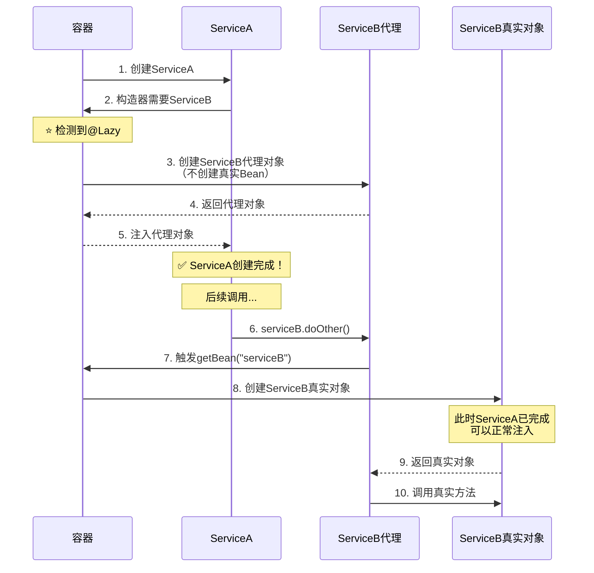

### 4.3 关键源码分析

```java
// DefaultListableBeanFactory.java
public Object resolveDependency(DependencyDescriptor descriptor, String requestingBeanName,
        Set<String> autowiredBeanNames, TypeConverter typeConverter) throws BeansException {
    
    // ...
    
    // ⭐ 处理@Lazy
    Object result = getAutowireCandidateResolver().getLazyResolutionProxyIfNecessary(
            descriptor, requestingBeanName);
    
    if (result == null) {
        // 没有@Lazy，正常解析依赖
        result = doResolveDependency(descriptor, requestingBeanName, autowiredBeanNames, typeConverter);
    }
    
    return result;
}
```

### 4.4 代理对象的内部结构

```java
// @Lazy 创建的代理对象（简化版）
public class ServiceB$$LazyProxy implements ServiceB {
    
    // 目标对象（延迟加载）
    private volatile ServiceB target;
    
    // Bean工厂
    private BeanFactory beanFactory;
    
    // Bean名称
    private String beanName;
    
    @Override
    public void doOther() {
        // ⭐ 延迟初始化
        if (this.target == null) {
            synchronized (this) {
                if (this.target == null) {
                    this.target = beanFactory.getBean(beanName, ServiceB.class);
                }
            }
        }
        // 调用真实方法
        this.target.doOther();
    }
}
```

---

## 五、@Lazy 的使用场景

### 5.1 场景一：解决构造器循环依赖

```java
// ⭐ 最常用场景
@Service
public class OrderService {
    private final UserService userService;
    
    public OrderService(@Lazy UserService userService) {
        this.userService = userService;
    }
    
    public void createOrder(Long userId) {
        userService.validateUser(userId);  // 首次调用时才初始化
        // ...
    }
}

@Service
public class UserService {
    private final OrderService orderService;
    
    public UserService(@Lazy OrderService orderService) {
        this.orderService = orderService;
    }
}
```

### 5.2 场景二：优化启动时间

```java
@Configuration
public class AppConfig {
    
    // 重型Bean，启动时不创建
    @Bean
    @Lazy
    public HeavyService heavyService() {
        // 耗时操作：连接数据库、加载大量数据等
        return new HeavyService();
    }
    
    // 轻量Bean，启动时立即创建
    @Bean
    public LightService lightService() {
        return new LightService();
    }
}
```

### 5.3 场景三：按需加载可选依赖

```java
@Service
public class BusinessService {
    
    // 可选功能：可能用不到，延迟加载
    @Autowired(required = false)
    @Lazy
    private OptionalFeature optionalFeature;
    
    public void doBusiness() {
        if (optionalFeature != null) {
            optionalFeature.execute();  // 首次调用时才初始化
        }
    }
}
```

### 5.4 场景四：条件性加载

```java
@Service
public class ReportService {
    
    // 报表功能很少使用，延迟加载
    @Autowired
    @Lazy
    private ReportGenerator reportGenerator;
    
    // 邮件功能也很少使用
    @Autowired
    @Lazy
    private EmailSender emailSender;
    
    public void generateReport() {
        // 只有调用这个方法时，reportGenerator才初始化
        reportGenerator.generate();
    }
    
    public void sendEmail() {
        // 只有调用这个方法时，emailSender才初始化
        emailSender.send();
    }
}
```

### 5.5 场景五：避免启动时错误

```java
@Service
public class DataService {
    
    // 依赖外部服务，启动时可能不可用
    @Autowired
    @Lazy
    private ExternalApiService externalApiService;
    
    public void fetchData() {
        // 延迟到运行时才连接，避免启动失败
        externalApiService.fetch();
    }
}
```

---

## 六、@Lazy 与其他延迟加载机制对比

### 6.1 对比表

| 机制 | 作用 | 代理类型 | 使用场景 |
|------|------|---------|---------|
| `@Lazy` | 延迟初始化 | CGLIB/JDK | 单例Bean延迟加载 |
| `@Scope("prototype")` | 每次获取新实例 | 无 | 多实例场景 |
| `@Scope(value="request", proxyMode=ScopedProxyMode.TARGET_CLASS)` | 请求作用域代理 | CGLIB | Web请求作用域 |
| `ObjectProvider<T>` | 延迟获取 | 无 | 可选依赖、延迟获取 |
| `Provider<T>` | JSR-330标准 | 无 | 标准延迟获取 |

### 6.2 @Lazy vs ObjectProvider

```java
// 方式1：@Lazy
@Service
public class ServiceA {
    @Autowired
    @Lazy
    private ServiceB serviceB;  // 注入代理对象
    
    public void useB() {
        serviceB.doSomething();  // 首次调用时获取
    }
}

// 方式2：ObjectProvider（推荐）
@Service
public class ServiceA {
    @Autowired
    private ObjectProvider<ServiceB> serviceBProvider;  // 注入Provider
    
    public void useB() {
        ServiceB serviceB = serviceBProvider.getObject();  // 显式获取
        serviceB.doSomething();
    }
    
    public void useBIfAvailable() {
        serviceBProvider.ifAvailable(serviceB -> {
            serviceB.doSomething();
        });
    }
}
```

**对比**：

| 特性 | @Lazy | ObjectProvider |
|------|-------|----------------|
| 注入类型 | 代理对象 | Provider对象 |
| 获取方式 | 透明（直接调用） | 显式调用`getObject()` |
| 空安全 | 不支持 | 支持`ifAvailable()` |
| 循环依赖 | 支持 | 支持 |
| 推荐度 | ⭐⭐⭐⭐ | ⭐⭐⭐⭐⭐ |

### 6.3 @Lazy vs Provider (JSR-330)

```java
// 方式1：@Lazy（Spring特有）
@Autowired
@Lazy
private ServiceB serviceB;

// 方式2：Provider（JSR-330标准）
@Autowired
private Provider<ServiceB> serviceBProvider;

public void use() {
    ServiceB serviceB = serviceBProvider.get();  // 延迟获取
}
```

---

## 七、@Lazy 的注意事项

### 7.1 注意事项一：不要过度使用

```java
// ❌ 不推荐：所有Bean都加@Lazy
@Service
@Lazy
public class ServiceA { }

@Service
@Lazy
public class ServiceB { }

// ✅ 推荐：只在必要时使用@Lazy
@Service
public class ServiceA { }  // 核心服务，启动时加载

@Service
@Lazy
public class ReportService { }  // 可选服务，延迟加载
```

### 7.2 注意事项二：@Lazy 与 @Transactional 冲突

```java
// ⚠️ 问题场景
@Service
@Lazy
public class TransactionalService {
    
    @Transactional
    public void doSomething() {
        // 事务可能不生效！
    }
}

// 原因：
// 1. @Lazy 创建的代理和 @Transactional 创建的代理可能冲突
// 2. 代理嵌套导致事务失效

// ✅ 解决方案
@Service
public class TransactionalService {
    
    @Transactional
    public void doSomething() {
        // ...
    }
}

// 在注入时使用@Lazy
@Service
public class AnotherService {
    @Autowired
    @Lazy  // 在注入点延迟
    private TransactionalService transactionalService;
}
```

### 7.3 注意事项三：@Lazy 对原型Bean无效

```java
// ❌ 无效：@Lazy 对原型Bean无意义
@Service
@Scope("prototype")
@Lazy  // 无效！原型Bean每次获取都是新实例
public class PrototypeService { }

// 原型Bean本身就是延迟的（每次getBean创建新实例）
```

### 7.4 注意事项四：调试困难

```java
@Service
public class DebugService {
    
    @Autowired
    @Lazy
    private HeavyService heavyService;
    
    public void test() {
        // ⚠️ 断点调试时，heavyService可能显示为代理对象
        // 实际的Bean还没创建
        heavyService.doWork();
    }
}
```

### 7.5 注意事项五：AOP代理顺序问题

```java
// ⚠️ 代理顺序问题
@Service
@Lazy  // 第1层代理：延迟加载
public class MyService {
    
    @Transactional  // 第2层代理：事务
    public void doWork() {
        // ...
    }
}

// 最终代理结构：
// LazyProxy -> TransactionalProxy -> MyService
// 如果顺序错误，可能导致功能异常
```

---

## 八、@Lazy 的最佳实践

### 8.1 最佳实践一：用于解决循环依赖

```java
// ✅ 推荐：在构造器注入时使用@Lazy
@Service
public class OrderService {
    private final UserService userService;
    
    public OrderService(@Lazy UserService userService) {
        this.userService = userService;
    }
}
```

### 8.2 最佳实践二：用于重型Bean

```java
// ✅ 推荐：重型Bean使用@Lazy
@Configuration
public class HeavyBeanConfig {
    
    @Bean
    @Lazy
    public HeavyService heavyService() {
        // 耗时初始化
        HeavyService service = new HeavyService();
        service.loadData();
        service.connectDatabase();
        return service;
    }
}
```

### 8.3 最佳实践三：优先使用ObjectProvider

```java
// ✅ 推荐：使用ObjectProvider代替@Lazy
@Service
public class MyService {
    
    private final ObjectProvider<OptionalService> optionalServiceProvider;
    
    public MyService(ObjectProvider<OptionalService> optionalServiceProvider) {
        this.optionalServiceProvider = optionalServiceProvider;
    }
    
    public void useOptional() {
        optionalServiceProvider.ifAvailable(service -> {
            service.execute();
        });
    }
}
```

### 8.4 最佳实践四：配合条件注解使用

```java
@Configuration
public class ConditionalConfig {
    
    @Bean
    @Lazy
    @ConditionalOnProperty(name = "feature.enabled", havingValue = "true")
    public FeatureService featureService() {
        return new FeatureService();
    }
}
```

### 8.5 最佳实践五：分层使用

```java
// 第一层：核心服务（启动时加载）
@Service
public class CoreService { }

// 第二层：重要服务（启动时加载）
@Service
public class ImportantService { }

// 第三层：可选服务（延迟加载）
@Service
@Lazy
public class OptionalService { }

// 第四层：报表/统计服务（延迟加载）
@Service
@Lazy
public class ReportService { }
```

---

## 九、实战示例

### 9.1 示例一：解决复杂的构造器循环依赖

```java
// 场景：三个Service循环依赖
// A -> B -> C -> A

@Service
public class ServiceA {
    private final ServiceB serviceB;
    
    public ServiceA(@Lazy ServiceB serviceB) {
        this.serviceB = serviceB;
    }
    
    public void methodA() {
        serviceB.methodB();
    }
}

@Service
public class ServiceB {
    private final ServiceC serviceC;
    
    public ServiceB(@Lazy ServiceC serviceC) {
        this.serviceC = serviceC;
    }
    
    public void methodB() {
        serviceC.methodC();
    }
}

@Service
public class ServiceC {
    private final ServiceA serviceA;
    
    public ServiceC(@Lazy ServiceA serviceA) {
        this.serviceA = serviceA;
    }
    
    public void methodC() {
        // serviceA已初始化完成
        serviceA.methodA();
    }
}
```

### 9.2 示例二：优化微服务启动时间

```java
@SpringBootApplication
public class Application {
    public static void main(String[] args) {
        SpringApplication.run(Application.class, args);
    }
}

// 核心服务：立即加载
@Service
public class CoreBusinessService {
    // 核心业务，启动时必须准备好
}

// 外部调用服务：延迟加载
@Service
@Lazy
public class ExternalApiService {
    public ExternalApiService() {
        // 初始化HTTP客户端，可能耗时
        // 启动时不执行
    }
    
    public String callExternalApi() {
        // 首次调用时才初始化
        return "result";
    }
}

// 报表服务：延迟加载
@Service
@Lazy
public class ReportService {
    public void generateReport() {
        // 报表功能很少使用
    }
}
```

### 9.3 示例三：可选依赖的优雅处理

```java
@Service
public class NotificationService {
    
    // 可选通知渠道
    @Autowired(required = false)
    @Lazy
    private EmailNotifier emailNotifier;
    
    @Autowired(required = false)
    @Lazy
    private SmsNotifier smsNotifier;
    
    @Autowired(required = false)
    @Lazy
    private WeChatNotifier weChatNotifier;
    
    public void sendNotification(String message) {
        if (emailNotifier != null) {
            emailNotifier.send(message);
        }
        if (smsNotifier != null) {
            smsNotifier.send(message);
        }
        if (weChatNotifier != null) {
            weChatNotifier.send(message);
        }
    }
}
```

### 9.4 示例四：结合@Conditional按需加载

```java
@Configuration
public class FeatureConfig {
    
    @Bean
    @Lazy
    @ConditionalOnProperty(name = "cache.type", havingValue = "redis")
    public CacheService redisCacheService() {
        return new RedisCacheService();
    }
    
    @Bean
    @Lazy
    @ConditionalOnProperty(name = "cache.type", havingValue = "local", matchIfMissing = true)
    public CacheService localCacheService() {
        return new LocalCacheService();
    }
}
```

---

## 十、常见问题与解答

### Q1：@Lazy 创建的代理对象是什么类型？

**答**：
- 如果Bean实现了接口：JDK动态代理
- 如果Bean是类：CGLIB代理

### Q2：@Lazy 能用在@Bean方法上吗？

**答**：可以，会让这个Bean延迟初始化。

```java
@Bean
@Lazy
public MyService myService() {
    return new MyService();
}
```

### Q3：@Lazy 能解决所有循环依赖吗？

**答**：不能。@Lazy 只能解决**注入阶段**的循环依赖，对于以下场景仍然无法解决：
- 构造器内部立即使用依赖对象
- 原型Bean的循环依赖

### Q4：@Lazy 和 @DependsOn 能一起用吗？

**答**：不建议一起使用，逻辑会冲突。

### Q5：@Lazy 会影响Bean的生命周期吗？

**答**：会。@Lazy 的Bean：
- 初始化延迟到首次使用
- destroy也会延迟到容器关闭

### Q6：如何验证@Lazy是否生效？

**答**：

```java
@Test
void testLazyInitialization() {
    AnnotationConfigApplicationContext ctx = 
        new AnnotationConfigApplicationContext(AppConfig.class);
    
    // 启动后，Bean不存在
    assertFalse(ctx.containsBean("lazyService"));
    
    // 首次获取，Bean才创建
    LazyService service = ctx.getBean(LazyService.class);
    assertNotNull(service);
}
```

---

## 十一、@Lazy 两种类型对比

### 11.1 类型一：控制Bean本身的初始化时机

**位置**：类上、@Bean方法上

**解析者**：`AnnotationConfigUtils.processCommonDefinitionAnnotations()`

**效果**：设置 `BeanDefinition.lazyInit = true`

### 11.2 类型二：注入时创建代理对象

**位置**：字段上、构造器参数上、Setter参数上

**解析者**：`ContextAnnotationAutowireCandidateResolver`

**效果**：创建代理对象注入，首次调用时才获取真实Bean

### 11.3 两类对比表

| 特性 | 类型一（类/@Bean方法） | 类型二（字段/参数） |
|------|------------------------|---------------------|
| **解析时机** | BeanDefinition注册阶段 | 依赖注入阶段 |
| **解析者** | `AnnotationConfigUtils` | `ContextAnnotationAutowireCandidateResolver` |
| **效果** | `BeanDefinition.lazyInit=true` | 创建代理对象 |
| **Bean是否创建** | 首次getBean时才创建 | 可能已存在，但注入代理 |
| **注入的是什么** | 真实Bean | 代理对象 |

---

## 十二、类型一完整源码流程：控制Bean初始化时机

### 12.1 整体流程图

```mermaid
flowchart TB
    subgraph Phase1["阶段一：注册BeanDefinition"]
        A1["@Lazy @Service<br/>public class LazyService"] --> A2["AnnotatedBeanDefinitionReader<br/>doRegisterBean()"]
        A2 --> A3["AnnotationConfigUtils<br/>processCommonDefinitionAnnotations()"]
        A3 --> A4["abd.setLazyInit(true)"]
        A4 --> A5["BeanDefinition<br/>lazyInit=true"]
    end
    
    subgraph Phase2["阶段二：容器启动"]
        B1["AbstractApplicationContext<br/>refresh()"] --> B2["finishBeanFactoryInitialization()"]
        B2 --> B3["DefaultListableBeanFactory<br/>preInstantiateSingletons()"]
        B3 --> B4{"遍历所有BeanDefinition"}
        B4 --> B5{"isLazyInit()?"}
        B5 -->|true| B6["⭐ 跳过，不创建"]
        B5 -->|false| B7["调用getBean()创建"]
        B6 --> B8["容器启动完成<br/>Lazy Bean不在单例池中"]
    end
    
    subgraph Phase3["阶段三：首次获取"]
        C1["其他Bean依赖<br/>或显式getBean()"] --> C2["AbstractBeanFactory<br/>doGetBean()"]
        C2 --> C3["getSingleton(beanName)"]
        C3 --> C4{"单例池中存在?"}
        C4 -->|否| C5["createBean()"]
        C5 --> C6["doCreateBean()"]
        C6 --> C7["放入单例池"]
        C4 -->|是| C8["直接返回"]
    end
    
    style A4 fill:#e1f5ff
    style B6 fill:#fff4e6
    style C5 fill:#e8f5e9
```

### 12.2 阶段一：注册BeanDefinition

#### 入口：`AnnotatedBeanDefinitionReader.doRegisterBean()`

```java
// AnnotatedBeanDefinitionReader.java 第250-285行
private <T> void doRegisterBean(Class<T> beanClass, ...) {
    // 创建 AnnotatedGenericBeanDefinition
    AnnotatedGenericBeanDefinition abd = new AnnotatedGenericBeanDefinition(beanClass);
    
    // ⭐ 核心：处理通用注解（@Lazy、@Primary、@DependsOn等）
    AnnotationConfigUtils.processCommonDefinitionAnnotations(abd);
    
    // 注册到容器
    BeanDefinitionReaderUtils.registerBeanDefinition(definitionHolder, this.registry);
}
```

#### 核心处理：`AnnotationConfigUtils.processCommonDefinitionAnnotations()`

```java
// AnnotationConfigUtils.java 第272-282行
static void processCommonDefinitionAnnotations(AnnotatedBeanDefinition abd, AnnotatedTypeMetadata metadata) {
    // ⭐ 解析 @Lazy 注解
    AnnotationAttributes lazy = attributesFor(metadata, Lazy.class);
    if (lazy != null) {
        abd.setLazyInit(lazy.getBoolean("value"));  // 设置 lazyInit = true
    }
    // 处理 @Primary
    if (metadata.isAnnotated(Primary.class.getName())) {
        abd.setPrimary(true);
    }
    // 处理 @DependsOn
    AnnotationAttributes dependsOn = attributesFor(metadata, DependsOn.class);
    if (dependsOn != null) {
        abd.setDependsOn(dependsOn.getStringArray("value"));
    }
    // ...
}
```

**此时状态**：`BeanDefinition.lazyInit = true`，但Bean实例还未创建

### 12.3 阶段二：容器启动

#### 入口：`AbstractApplicationContext.refresh()`

```java
// AbstractApplicationContext.java
public void refresh() {
    // ... 前面的步骤
    
    // ⭐ 实例化所有非懒加载的单例Bean
    finishBeanFactoryInitialization(beanFactory);
    
    // 最后一步：发布事件
    finishRefresh();
}
```

#### 核心方法：`finishBeanFactoryInitialization()`

```java
// AbstractApplicationContext.java 第1131-1181行
protected void finishBeanFactoryInitialization(ConfigurableListableBeanFactory beanFactory) {
    // ... 其他初始化
    
    // ⭐ 实例化所有非懒加载的单例Bean
    beanFactory.preInstantiateSingletons();
}
```

#### 关键判断：`DefaultListableBeanFactory.preInstantiateSingletons()`

```java
// DefaultListableBeanFactory.java 第957-1028行
@Override
public void preInstantiateSingletons() throws BeansException {
    // 获取所有 BeanName
    List<String> beanNames = new ArrayList<>(this.beanDefinitionNames);
    
    // ⭐ 遍历所有 BeanDefinition
    for (String beanName : beanNames) {
        // 合并 BeanDefinition
        RootBeanDefinition bd = getMergedLocalBeanDefinition(beanName);
        
        // ⭐⭐⭐ 核心判断条件 ⭐⭐⭐
        // 条件：非抽象 && 单例 && 非懒加载
        if (!bd.isAbstract() && bd.isSingleton() && !bd.isLazyInit()) {
            if (isFactoryBean(beanName)) {
                // FactoryBean 处理
                Object bean = getBean(FACTORY_BEAN_PREFIX + beanName);
                // ...
            } else {
                // ⭐ 普通 Bean：立即创建
                getBean(beanName);
            }
        }
        // ⭐ 如果 isLazyInit() == true，直接跳过，不调用 getBean()
    }
}
```

**关键条件解析**：

| 条件 | 含义 | lazy Bean 的情况 |
|------|------|-----------------|
| `!bd.isAbstract()` | 非抽象类 | ✅ 满足 |
| `bd.isSingleton()` | 单例 | ✅ 满足 |
| `!bd.isLazyInit()` | **非懒加载** | ❌ 不满足（`lazyInit=true`）|

**结果**：lazy Bean 在 `preInstantiateSingletons()` 中被**跳过**，不会创建实例

### 12.4 阶段三：首次获取

#### 触发时机

```java
// 方式1：其他Bean依赖（注入时）
@Service
public class NormalService {
    @Autowired
    private LazyService lazyService;  // ⭐ 触发创建
}

// 方式2：显式获取
LazyService lazyService = applicationContext.getBean(LazyService.class);  // ⭐ 触发创建
```

#### 创建流程：`AbstractBeanFactory.doGetBean()`

```java
// AbstractBeanFactory.java 第259-370行
protected <T> T doGetBean(String name, ...) {
    String beanName = transformedBeanName(name);
    
    // ⭐ 1. 先从单例池获取
    Object sharedInstance = getSingleton(beanName);
    
    if (sharedInstance != null && args == null) {
        // 单例池中存在，直接返回
        beanInstance = getObjectForBeanInstance(sharedInstance, name, beanName, null);
    } else {
        // ⭐ 2. 单例池中不存在，需要创建
        if (!typeCheckOnly) {
            markBeanAsCreated(beanName);
        }
        
        try {
            RootBeanDefinition mbd = getMergedLocalBeanDefinition(beanName);
            
            // ⭐ 3. 创建单例Bean
            if (mbd.isSingleton()) {
                sharedInstance = getSingleton(beanName, () -> {
                    return createBean(beanName, mbd, args);  // ⭐ 核心创建方法
                });
                beanInstance = getObjectForBeanInstance(sharedInstance, name, beanName, mbd);
            }
        } catch (BeansException ex) {
            // 清理
        }
    }
    return (T) beanInstance;
}
```

### 12.5 完整时序图

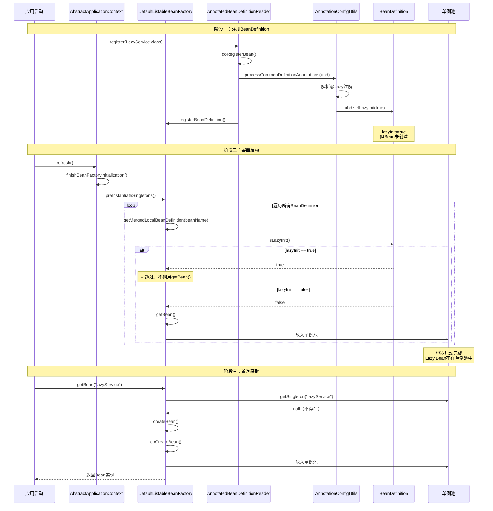

---

## 十三、类型二完整源码流程：注入点@Lazy

### 13.1 示例代码

```java
// 1. 目标Bean（被注入的Bean）
@Service
public class UserService {
    public void createUser() { ... }
}

// 2. 注入点Bean
@Service
public class OrderService {
    
    @Autowired
    @Lazy  // ⭐ 字段上的@Lazy
    private UserService userService;  // 注入代理对象
    
    public void createOrder() {
        userService.createUser();  // 首次调用时才获取真实Bean
    }
}
```

### 13.2 完整调用链路图

```mermaid
flowchart TB
    subgraph Step1["Step 1: 创建OrderService实例"]
        A1["AbstractAutowireCapableBeanFactory<br/>doCreateBean()"] --> A2["createBeanInstance()<br/>创建OrderService实例"]
        A2 --> A3["populateBean()<br/>属性填充"]
    end
    
    subgraph Step2["Step 2: 扫描注入点"]
        A3 --> B1["AutowiredAnnotationBeanPostProcessor<br/>postProcessProperties()"]
        B1 --> B2["findAutowiringMetadata()"]
        B2 --> B3["buildAutowiringMetadata()<br/>扫描@Autowired字段"]
        B3 --> B4["创建AutowiredFieldElement<br/>封装userService字段"]
    end
    
    subgraph Step3["Step 3: 执行注入"]
        B4 --> C1["InjectionMetadata.inject()"]
        C1 --> C2["AutowiredFieldElement.inject()"]
        C2 --> C3["resolveFieldValue()"]
    end
    
    subgraph Step4["Step 4: 创建DependencyDescriptor"]
        C3 --> D1["new DependencyDescriptor(field, required)"]
        D1 --> D2["封装字段信息：<br/>- Field对象<br/>- 字段上的注解(@Autowired, @Lazy)<br/>- 字段类型(UserService)"]
    end
    
    subgraph Step5["Step 5: 解析依赖"]
        D2 --> E1["DefaultListableBeanFactory<br/>resolveDependency()"]
        E1 --> E2["getAutowireCandidateResolver()<br/>.getLazyResolutionProxyIfNecessary()"]
    end
    
    subgraph Step6["Step 6: 检测@Lazy"]
        E2 --> F1["ContextAnnotationAutowireCandidateResolver<br/>isLazy()"]
        F1 --> F2["遍历descriptor.getAnnotations()"]
        F2 --> F3{"发现@Lazy?"}
        F3 -->|是| F4["return true"]
        F3 -->|否| F5["return false"]
    end
    
    subgraph Step7["Step 7: 创建代理对象"]
        F4 --> G1["buildLazyResolutionProxy()"]
        G1 --> G2["创建TargetSource<br/>实现getTarget()延迟获取"]
        G2 --> G3["创建ProxyFactory"]
        G3 --> G4["pf.setTargetSource(ts)"]
        G4 --> G5["pf.getProxy()"]
        G5 --> G6["返回代理对象"]
    end
    
    subgraph Step8["Step 8: 注入代理对象"]
        G6 --> H1["返回到resolveFieldValue()"]
        H1 --> H2["field.set(bean, proxy)"]
        H2 --> H3["OrderService.userService = proxy"]
    end
    
    style D1 fill:#e1f5ff
    style F1 fill:#fff4e6
    style G1 fill:#e8f5e9
```

### 13.3 Step 1: 创建OrderService实例

```java
// AbstractAutowireCapableBeanFactory.java
protected Object doCreateBean(String beanName, RootBeanDefinition mbd, Object[] args) {
    // 1. 创建Bean实例（空对象，属性还未填充）
    BeanWrapper instanceWrapper = createBeanInstance(beanName, mbd, args);
    Object exposedObject = instanceWrapper.getWrappedInstance();
    
    // 2. ⭐ 属性填充（依赖注入发生在这里）
    populateBean(beanName, mbd, instanceWrapper);
    
    // 3. 初始化
    exposedObject = initializeBean(beanName, exposedObject, mbd);
    
    return exposedObject;
}
```

**此时状态**：
- `OrderService` 实例已创建
- `userService` 字段为 `null`
- 还未执行依赖注入

### 13.4 Step 2: 扫描注入点

```java
// AutowiredAnnotationBeanPostProcessor.java 第406-418行
@Override
public PropertyValues postProcessProperties(PropertyValues pvs, Object bean, String beanName) {
    // ⭐ 查找或构建注入元数据
    InjectionMetadata metadata = findAutowiringMetadata(beanName, bean.getClass(), pvs);
    
    try {
        // ⭐ 执行注入
        metadata.inject(bean, beanName, pvs);
    }
    catch (BeanCreationException ex) {
        throw ex;
    }
    return pvs;
}

// 第484-541行：构建注入元数据
private InjectionMetadata buildAutowiringMetadata(Class<?> clazz) {
    List<InjectionMetadata.InjectedElement> elements = new ArrayList<>();
    Class<?> targetClass = clazz;
    
    do {
        List<InjectionMetadata.InjectedElement> fieldElements = new ArrayList<>();
        
        // ⭐ 遍历所有字段
        ReflectionUtils.doWithLocalFields(targetClass, field -> {
            MergedAnnotation<?> ann = findAutowiredAnnotation(field);
            if (ann != null) {
                // 排除静态字段
                if (Modifier.isStatic(field.getModifiers())) {
                    return;
                }
                boolean required = determineRequiredStatus(ann);
                // ⭐⭐⭐ 创建 AutowiredFieldElement 封装字段信息
                fieldElements.add(new AutowiredFieldElement(field, required));
            }
        });
        
        elements.addAll(0, fieldElements);
        targetClass = targetClass.getSuperclass();
    }
    while (targetClass != null && targetClass != Object.class);
    
    return InjectionMetadata.forElements(elements, clazz);
}
```

**此时状态**：
- 扫描到 `OrderService.userService` 字段有 `@Autowired` 注解
- 创建 `AutowiredFieldElement` 封装字段信息

### 13.5 Step 3: 执行注入

```java
// InjectionMetadata.java 第113-122行
public void inject(Object target, @Nullable String beanName, @Nullable PropertyValues pvs) throws Throwable {
    Collection<InjectedElement> checkedElements = this.checkedElements;
    
    if (!elementsToIterate.isEmpty()) {
        for (InjectedElement element : elementsToIterate) {
            // ⭐ 调用 AutowiredFieldElement.inject()
            element.inject(target, beanName, pvs);
        }
    }
}
```

### 13.6 Step 4: 解析字段依赖

```java
// AutowiredAnnotationBeanPostProcessor.java 第691-751行（AutowiredFieldElement内部类）
@Override
protected void inject(Object bean, @Nullable String beanName, @Nullable PropertyValues pvs) throws Throwable {
    Field field = (Field) this.member;  // userService 字段
    Object value;
    
    if (this.cached) {
        value = resolveCachedArgument(beanName, this.cachedFieldValue);
    }
    else {
        // ⭐ 首次注入，调用解析方法
        value = resolveFieldValue(field, bean, beanName);
    }
    
    if (value != null) {
        ReflectionUtils.makeAccessible(field);
        // ⭐ 最终：通过反射设置字段值
        field.set(bean, value);  // OrderService.userService = value
    }
}

@Nullable
private Object resolveFieldValue(Field field, Object bean, @Nullable String beanName) {
    // ⭐⭐⭐ 核心：创建 DependencyDescriptor
    DependencyDescriptor desc = new DependencyDescriptor(field, this.required);
    desc.setContainingClass(bean.getClass());
    
    Set<String> autowiredBeanNames = new LinkedHashSet<>(2);
    TypeConverter typeConverter = beanFactory.getTypeConverter();
    
    Object value;
    try {
        // ⭐⭐⭐ 核心：解析依赖
        value = beanFactory.resolveDependency(desc, beanName, autowiredBeanNames, typeConverter);
    }
    catch (BeansException ex) {
        throw new UnsatisfiedDependencyException(null, beanName, new InjectionPoint(field), ex);
    }
    
    return value;
}
```

### 13.7 Step 5: DependencyDescriptor 的作用

```java
// DependencyDescriptor 构造方法
public DependencyDescriptor(Field field, boolean required) {
    super(field);
    this.declaringClass = field.getDeclaringClass();  // OrderService.class
    this.field = field;  // UserService userService 字段
    this.required = required;
}

// DependencyDescriptor.java
@Override
public Annotation[] getAnnotations() {
    // ⭐ 返回字段上的所有注解
    return this.field.getAnnotations();
    // 返回：[@Autowired, @Lazy]
}
```

**DependencyDescriptor 封装的信息**：

| 属性 | 值 | 说明 |
|------|-----|------|
| `field` | `UserService userService` | 字段对象 |
| `declaringClass` | `OrderService.class` | 声明类 |
| `required` | `true` | 是否必须 |
| `annotations` | `[@Autowired, @Lazy]` | ⭐ 所有注解 |

### 13.8 Step 6: 解析依赖并检测@Lazy

```java
// DefaultListableBeanFactory.java 第1435-1466行
@Override
@Nullable
public Object resolveDependency(DependencyDescriptor descriptor, @Nullable String requestingBeanName,
        @Nullable Set<String> autowiredBeanNames, @Nullable TypeConverter typeConverter) throws BeansException {
    
    // 特殊类型处理...
    
    // ⭐⭐⭐ 核心：检测@Lazy并创建代理
    Object result = getAutowireCandidateResolver().getLazyResolutionProxyIfNecessary(
            descriptor, requestingBeanName);
    
    if (result == null) {
        // 没有@Lazy，正常解析依赖
        result = doResolveDependency(descriptor, requestingBeanName, autowiredBeanNames, typeConverter);
    }
    
    return result;
}
```

### 13.9 Step 7: @Lazy检测

```java
// ContextAnnotationAutowireCandidateResolver.java 第57-75行
protected boolean isLazy(DependencyDescriptor descriptor) {
    
    // ⭐ 方式1：检查字段上的@Lazy（或方法参数上的@Lazy）
    for (Annotation ann : descriptor.getAnnotations()) {
        Lazy lazy = AnnotationUtils.getAnnotation(ann, Lazy.class);
        if (lazy != null && lazy.value()) {
            return true;  // ⭐ 发现@Lazy注解
        }
    }
    
    // ⭐ 方式2：检查构造器/Setter参数上的@Lazy
    MethodParameter methodParam = descriptor.getMethodParameter();
    if (methodParam != null) {
        Method method = methodParam.getMethod();
        // 判断是构造器（method == null）还是Setter（void返回值）
        if (method == null || void.class == method.getReturnType()) {
            Lazy lazy = AnnotationUtils.getAnnotation(methodParam.getAnnotatedElement(), Lazy.class);
            if (lazy != null && lazy.value()) {
                return true;
            }
        }
    }
    
    return false;
}
```

**检测逻辑详解**：

| 场景 | 检测方式 | 代码路径 |
|------|----------|----------|
| **字段注入** | `descriptor.getAnnotations()` | 第一个 for 循环 |
| **构造器参数** | `methodParam.getAnnotatedElement()` | 第二个 if 分支 |
| **Setter参数** | `methodParam.getAnnotatedElement()` | 第二个 if 分支 |

### 13.10 Step 8: 创建代理对象

```java
// ContextAnnotationAutowireCandidateResolver.java 第77-131行
protected Object buildLazyResolutionProxy(final DependencyDescriptor descriptor, final @Nullable String beanName) {
    
    BeanFactory beanFactory = getBeanFactory();
    final DefaultListableBeanFactory dlbf = (DefaultListableBeanFactory) beanFactory;
    
    // ⭐⭐⭐ 核心：创建 TargetSource（延迟获取目标对象）
    TargetSource ts = new TargetSource() {
        
        @Override
        public Class<?> getTargetClass() {
            return descriptor.getDependencyType();  // 返回 UserService.class
        }
        
        @Override
        public boolean isStatic() {
            return false;  // 非静态，每次调用都可能获取新的目标
        }
        
        // ⭐⭐⭐ 关键：首次调用时才获取真实Bean
        @Override
        public Object getTarget() {
            // 调用 doResolveDependency 获取真实Bean
            Object target = dlbf.doResolveDependency(descriptor, beanName, autowiredBeanNames, null);
            
            if (target == null) {
                // 处理空集合类型
                Class<?> type = getTargetClass();
                if (Map.class == type) return Collections.emptyMap();
                else if (List.class == type) return Collections.emptyList();
                else if (Set.class == type || Collection.class == type) return Collections.emptySet();
                
                throw new NoSuchBeanDefinitionException(descriptor.getResolvableType(),
                        "Optional dependency not present for lazy injection point");
            }
            
            return target;
        }
        
        @Override
        public void releaseTarget(Object target) {
            // 不需要释放
        }
    };
    
    // ⭐ 创建代理对象
    ProxyFactory pf = new ProxyFactory();
    pf.setTargetSource(ts);  // 设置延迟获取的目标源
    
    Class<?> dependencyType = descriptor.getDependencyType();
    if (dependencyType.isInterface()) {
        pf.addInterface(dependencyType);  // JDK动态代理
    }
    // 如果不是接口，默认使用CGLIB
    
    return pf.getProxy(dlbf.getBeanClassLoader());  // ⭐ 返回代理对象
}
```

### 13.11 Step 9: 注入代理对象

```java
// 回到 AutowiredFieldElement.inject()
@Override
protected void inject(Object bean, @Nullable String beanName, @Nullable PropertyValues pvs) throws Throwable {
    Field field = (Field) this.member;  // userService 字段
    Object value = resolveFieldValue(field, bean, beanName);  // ⭐ 返回代理对象
    
    if (value != null) {
        ReflectionUtils.makeAccessible(field);
        // ⭐ 通过反射设置字段值
        field.set(bean, value);  // OrderService.userService = proxy
    }
}
```

**此时状态**：
- `OrderService.userService` 字段被设置为代理对象
- 真实的 `UserService` Bean还未创建

### 13.12 Step 10: 首次调用时获取真实Bean（核心机制解析）

```java
// 用户代码
OrderService orderService = ...;
orderService.createOrder();  // ⭐ 首次调用

// 调用链：
// 1. orderService.createOrder()
// 2. userService.createUser()  ← userService是代理对象
// 3. 代理对象拦截方法调用
// 4. TargetSource.getTarget()  ← 触发获取真实Bean
// 5. dlbf.doResolveDependency()  ← 解析依赖
// 6. 获取或创建真实的 UserService Bean
// 7. 调用真实Bean的createUser()方法
```

#### 核心问题：哪个Interceptor/Advisor拦截了方法调用？

**答案**：这里使用的是 **Spring AOP 的 TargetSource 机制**，而不是传统的 `Advisor`/`MethodInterceptor` 模式！

#### @Lazy 代理的创建原理

```java
// ContextAnnotationAutowireCandidateResolver.java 第77-131行
protected Object buildLazyResolutionProxy(final DependencyDescriptor descriptor, final @Nullable String beanName) {
    // ...
    
    // ⭐⭐⭐ 核心：创建自定义 TargetSource
    TargetSource ts = new TargetSource() {
        
        @Override
        public Class<?> getTargetClass() {
            return descriptor.getDependencyType();  // UserService.class
        }
        
        @Override
        public boolean isStatic() {
            return false;
        }
        
        // ⭐⭐⭐ 关键：首次调用时才获取真实Bean
        @Override
        public Object getTarget() {
            Object target = dlbf.doResolveDependency(descriptor, beanName, autowiredBeanNames, null);
            return target;
        }
        
        @Override
        public void releaseTarget(Object target) {
            // 不需要释放
        }
    };
    
    // ⭐ 创建 ProxyFactory 并设置 TargetSource
    ProxyFactory pf = new ProxyFactory();
    pf.setTargetSource(ts);  // ⭐ 关键：设置自定义的 TargetSource
    
    Class<?> dependencyType = descriptor.getDependencyType();
    if (dependencyType.isInterface()) {
        pf.addInterface(dependencyType);  // JDK动态代理
    }
    
    return pf.getProxy(dlbf.getBeanClassLoader());
}
```

#### TargetSource 机制详解

**TargetSource** 是 Spring AOP 的核心接口，它负责管理目标对象。与传统的 Advisor 模式不同，TargetSource 直接控制目标对象的获取。

```java
// TargetSource 接口
public interface TargetSource extends TargetClassAware {
    
    // 获取目标对象
    Class<?> getTargetClass();
    
    // 判断目标是否静态
    boolean isStatic();
    
    // 获取目标对象
    Object getTarget() throws Exception;
    
    // 释放目标对象
    void releaseTarget(Object target) throws Exception;
}
```

#### 代理调用时的执行流程

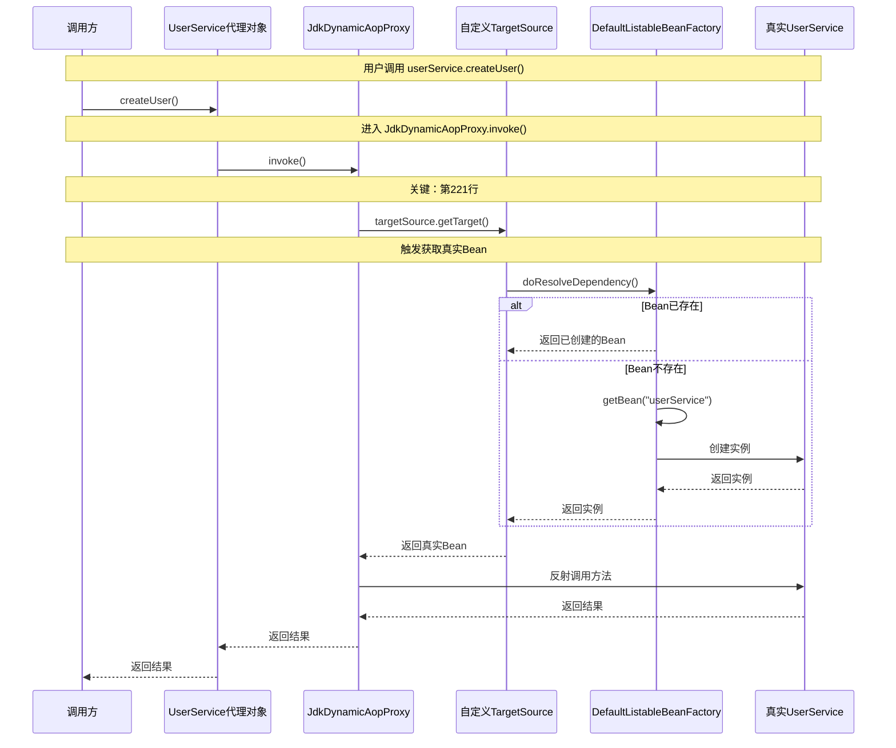

#### JdkDynamicAopProxy.invoke() 核心代码

```java
// JdkDynamicAopProxy.java 第121-270行
@Override
public Object invoke(Object proxy, Method method, Object[] args) throws Throwable {
    // ...
    
    Object target;
    
    // ⭐⭐⭐ 关键：第221行！从这里触发获取真实Bean
    target = targetSource.getTarget();
    
    Class<?> targetClass = (target != null ? target.getClass() : null);
    
    // 获取拦截器链（对于@Lazy代理，这个链条是空的）
    List<Object> chain = this.advised.getInterceptorsAndDynamicInterceptionAdvice(method, targetClass);
    
    if (chain.isEmpty()) {
        // ⭐ 直接反射调用目标方法
        Object[] argsToUse = AopProxyUtils.adaptArgumentsIfNecessary(method, args);
        retVal = AopUtils.invokeJoinpointUsingReflection(target, method, argsToUse);
    }
    else {
        // 创建方法调用链
        MethodInvocation invocation = new ReflectiveMethodInvocation(
                proxy, target, method, args, targetClass, chain);
        retVal = invocation.proceed();
    }
    
    // ...
    
    return retVal;
}
```

#### 对比：传统AOP vs @Lazy代理

| 特性 | 传统AOP（@Transactional） | @Lazy代理 |
|------|---------------------------|----------|
| **拦截机制** | Advisor + MethodInterceptor | TargetSource |
| **代理创建** | 需要 Advisor | 不需要 Advisor |
| **目标获取** | 静态（创建时确定） | **动态（调用时获取）** |
| **目标对象** | 单一目标 | 延迟获取 |
| **典型实现** | TransactionInterceptor | LazyTargetSource |

#### 关键区别

1. **传统AOP（如@Transactional）**：
   - 需要创建 Advisor（包含 Pointcut + Advice）
   - 目标对象在代理创建时确定
   - 通过 MethodInterceptor 链拦截方法调用

2. **@Lazy代理**：
   - 不需要创建 Advisor
   - 目标对象在**方法调用时**通过 TargetSource 动态获取
   - 利用 JdkDynamicAopProxy 的 `targetSource.getTarget()` 机制

#### 为什么不需要Advisor？

因为 `@Lazy` 的目标不是"增强"方法，而是"延迟获取"目标对象。这正好利用了 TargetSource 的设计初衷：**在运行时动态决定目标对象**。

这就是为什么 `buildLazyResolutionProxy()` 只设置了 `TargetSource`，而没有添加任何 Advisor！

### 13.13 三种注入场景对比

#### 场景一：字段注入

```java
@Service
public class OrderService {
    
    @Autowired
    @Lazy  // ⭐ 字段上的@Lazy
    private UserService userService;
}
```

**源码执行流程**：
1. `AutowiredFieldElement.inject()`
2. `DependencyDescriptor desc = new DependencyDescriptor(field, required)`
3. `descriptor.getAnnotations()` 获取字段上的注解
4. `isLazy()` → 检查字段上的@Lazy
5. `buildLazyResolutionProxy()` → 创建代理
6. `field.set(bean, proxy)` → 注入代理对象

#### 场景二：构造器注入（详细源码解析）

```java
@Service
public class OrderService {

    private final UserService userService;

    public OrderService(@Lazy UserService userService) {  // ⭐ 构造器参数上的@Lazy
        this.userService = userService;
    }
}
```

**触发时机**：构造器注入发生在 `createBeanInstance()` 阶段，而非 `populateBean()` 阶段。

**源码执行流程**：

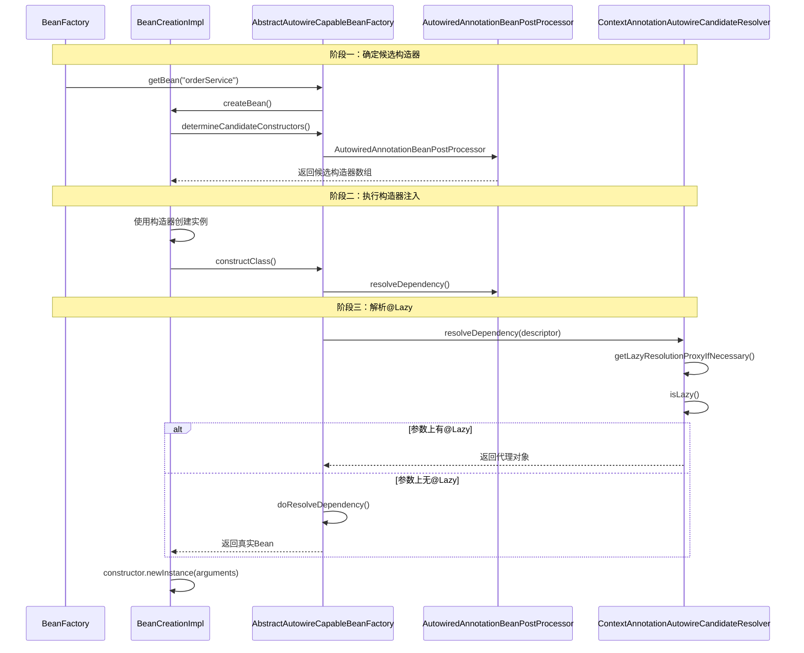

**关键源码：ConstructorResolver**

```java
// ConstructorResolver.java
public BeanWrapper resolveConstructorArguments(String beanName, RootBeanDefinition mbd,
        Executable executable, Constructor<?>[] constructors, int minNrOfArgs) {

    // 遍历构造器参数
    for (int i = 0; i < arguments.length; i++) {
        MethodParameter methodParam = new MethodParameter(executable, i);
        // ⭐⭐⭐ 创建 DependencyDescriptor（包含参数索引）
        DependencyDescriptor descriptor = new DependencyDescriptor(methodParam, this.required);
        descriptor.setContainingClass(beanClass);

        // ⭐⭐⭐ 解析依赖
        Object arg = beanFactory.resolveDependency(descriptor, beanName, autowiredBeanNames, typeConverter);
        arguments[i] = arg;
    }

    // ⭐ 使用参数调用构造器
    Object result = executable.invoke(beanToPopulate, arguments);
    return result;
}
```

**DependencyDescriptor 构造器参数**：

```java
// DependencyDescriptor 构造器参数版本
public DependencyDescriptor(MethodParameter methodParameter, boolean required) {
    super(methodParameter);
    this.declaringClass = methodParameter.getDeclaringClass();  // OrderService.class
    this.methodParameter = methodParameter;  // ⭐ 构造器参数信息
    this.field = null;
    this.required = required;
    // annotations 通过 methodParameter.getParameterAnnotations() 获取
}

// MethodParameter 获取参数注解
@Override
public Annotation[] getParameterAnnotations() {
    Annotation[] anns = super.getParameterAnnotations();
    // 返回构造器参数上的所有注解 [@Autowired, @Lazy]
    return anns;
}
```

**isLazy() 检测构造器参数**：

```java
// ContextAnnotationAutowireCandidateResolver.java
protected boolean isLazy(DependencyDescriptor descriptor) {
    // 先检查字段
    for (Annotation ann : descriptor.getAnnotations()) {
        Lazy lazy = AnnotationUtils.getAnnotation(ann, Lazy.class);
        if (lazy != null && lazy.value()) {
            return true;
        }
    }

    // ⭐ 检查方法参数（构造器参数）
    MethodParameter methodParam = descriptor.getMethodParameter();
    if (methodParam != null) {
        Method method = methodParam.getMethod();
        // ⭐ method == null 表示是构造器
        if (method == null || void.class == method.getReturnType()) {
            Lazy lazy = AnnotationUtils.getAnnotation(
                methodParam.getAnnotatedElement(),  // ⭐ 获取构造器参数
                Lazy.class);
            if (lazy != null && lazy.value()) {
                return true;
            }
        }
    }

    return false;
}
```

#### 场景三：Setter注入（详细源码解析）

```java
@Service
public class OrderService {

    private UserService userService;

    @Autowired
    public void setUserService(@Lazy UserService userService) {  // ⭐ Setter参数上的@Lazy
        this.userService = userService;
    }
}
```

**触发时机**：Setter注入发生在 `populateBean()` 阶段（属性填充阶段）。

**源码执行流程**：

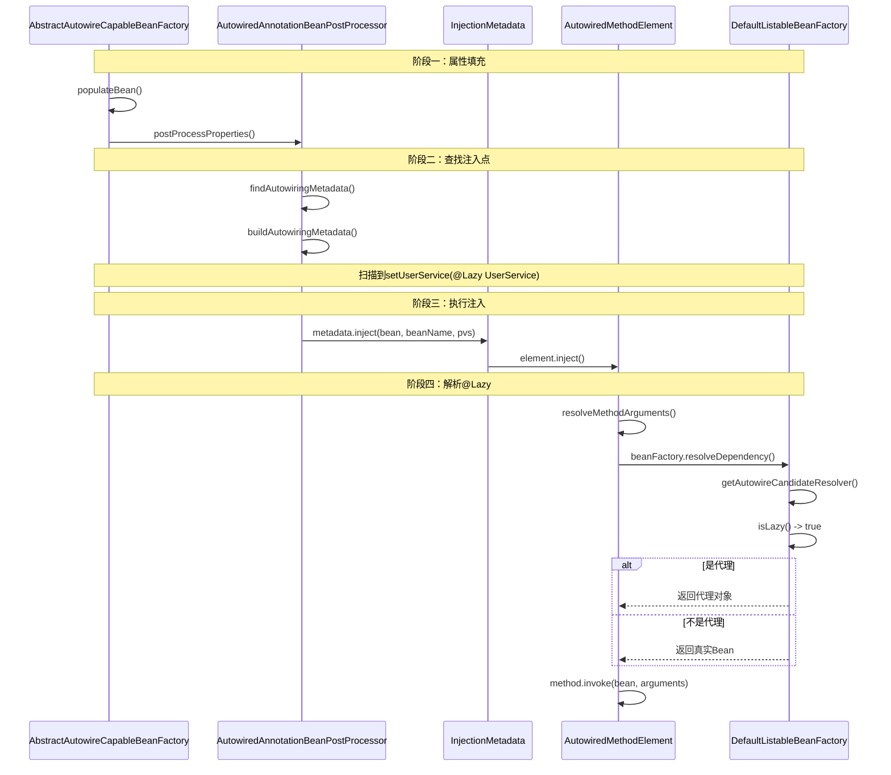

**关键源码：Setter方法参数解析**

```java
// AutowiredAnnotationBeanPostProcessor.java 第816-868行
private Object[] resolveMethodArguments(Method method, Object bean, @Nullable String beanName) {
    int argumentCount = method.getParameterCount();
    Object[] arguments = new Object[argumentCount];

    // ⭐ 为每个参数创建 DependencyDescriptor
    DependencyDescriptor[] descriptors = new DependencyDescriptor[argumentCount];
    Set<String> autowiredBeanNames = new LinkedHashSet<>(argumentCount * 2);

    for (int i = 0; i < arguments.length; i++) {
        // ⭐⭐⭐ 关键：为Setter方法的第i个参数创建 MethodParameter
        MethodParameter methodParam = new MethodParameter(method, i);

        // ⭐ 创建 DependencyDescriptor
        DependencyDescriptor currDesc = new DependencyDescriptor(methodParam, this.required);
        currDesc.setContainingClass(bean.getClass());
        descriptors[i] = currDesc;

        try {
            // ⭐⭐⭐ 核心：解析依赖（会检测@Lazy）
            Object arg = beanFactory.resolveDependency(currDesc, beanName,
                    autowiredBeanNames, typeConverter);
            arguments[i] = arg;
        }
        catch (BeansException ex) {
            throw new UnsatisfiedDependencyException(null, beanName,
                    new InjectionPoint(methodParam), ex);
        }
    }

    // ⭐ 通过反射调用Setter方法
    ReflectionUtils.makeAccessible(method);
    method.invoke(bean, arguments);

    return arguments;
}
```

**MethodParameter 封装Setter参数信息**：

```java
// MethodParameter 构造方法
public MethodParameter(Method method, int parameterIndex) {
    this.executable = method;  // setUserService 方法
    this.parameterIndex = parameterIndex;  // 0（第一个参数）
    this.parameterType = method.getParameterTypes()[parameterIndex];  // UserService.class

    // 缓存参数索引
    this.hash =31 * method.hashCode() + parameterIndex;
}

// 获取参数上的注解
public Annotation[] getParameterAnnotations() {
    Annotation[][] parameterAnnotations = Executable.getParameterAnnotations(this.executable);
    return parameterAnnotations[this.parameterIndex];
    // 返回：[(@Lazy value=true), (@Autowired required=true)]
}
```

**isLazy() 检测Setter参数**：

```java
// ContextAnnotationAutowireCandidateResolver.java
protected boolean isLazy(DependencyDescriptor descriptor) {
    // 先检查字段
    for (Annotation ann : descriptor.getAnnotations()) {
        Lazy lazy = AnnotationUtils.getAnnotation(ann, Lazy.class);
        if (lazy != null && lazy.value()) {
            return true;
        }
    }

    // ⭐ 检查方法参数（Setter参数）
    MethodParameter methodParam = descriptor.getMethodParameter();
    if (methodParam != null) {
        Method method = methodParam.getMethod();
        // ⭐ void.class == method.getReturnType() 表示是Setter方法
        if (method == null || void.class == method.getReturnType()) {
            Lazy lazy = AnnotationUtils.getAnnotation(
                methodParam.getAnnotatedElement(),  // ⭐ 获取方法参数
                Lazy.class);
            if (lazy != null && lazy.value()) {
                return true;
            }
        }
    }

    return false;
}
```

**关键区别：构造器 vs Setter**

| 特性 | 构造器注入 | Setter注入 |
|------|-----------|-----------|
| **触发阶段** | `createBeanInstance()` | `populateBean()` |
| **methodParam.getMethod()** | `null` | `setUserService` |
| **判断条件** | `method == null` | `void.class == method.getReturnType()` |
| **创建实例** | `constructor.newInstance(args)` | `method.invoke(bean, args)` |

### 13.14 代理对象的生命周期

```mermaid
flowchart LR
    subgraph 注入阶段
        A1["resolveDependency()"] --> A2["isLazy() == true"]
        A2 --> A3["buildLazyResolutionProxy()"]
        A3 --> A4["创建TargetSource"]
        A4 --> A5["ProxyFactory.getProxy()"]
        A5 --> A6["返回代理对象"]
        A6 --> A7["注入到目标Bean"]
    end
    
    subgraph 首次调用
        A7 --> B1["proxy.method()"]
        B1 --> B2["TargetSource.getTarget()"]
        B2 --> B3["doResolveDependency()"]
        B3 --> B4["getBean() 或直接返回"]
        B4 --> B5["调用真实方法"]
    end
    
    style A3 fill:#e1f5ff
    style A4 fill:#fff4e6
    style B2 fill:#e8f5e9
```

---

## 十四、总结

### 14.1 @Lazy 核心知识点

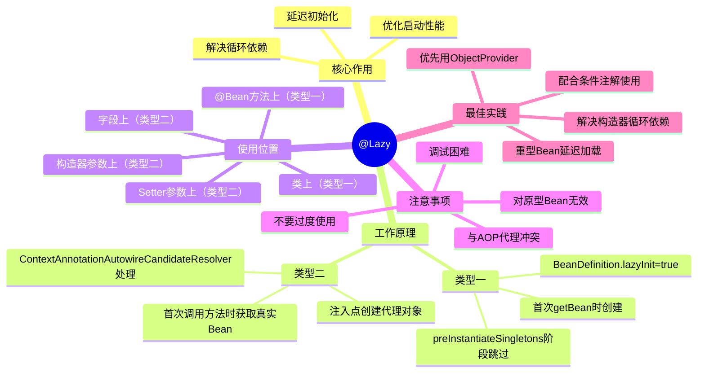

### 14.2 一句话总结

> **@Lazy 通过两种机制实现延迟初始化：类型一设置BeanDefinition.lazyInit属性，类型二通过代理对象延迟获取真实Bean。是解决构造器循环依赖的利器，也是优化启动性能的有效手段。**
> 
> 但要注意避免过度使用，优先考虑重构代码消除循环依赖。

### 14.3 学习验证清单

- [ ] 理解@Lazy的核心作用
- [ ] 掌握@Lazy解决循环依赖的原理
- [ ] 了解代理对象的创建过程
- [ ] 知道@Lazy的使用场景和注意事项
- [ ] 能够区分@Lazy和ObjectProvider
- [ ] 在实际项目中正确使用@Lazy
- [ ] 理解类型一和类型二的区别
- [ ] 能够画出两种类型的完整源码流程

---

## 十五、补充内容

### 15.1 @Configuration类上的@Lazy

当 `@Lazy` 注解放在 `@Configuration` 类上时，会让该配置类中所有的 `@Bean` 方法都延迟加载。

```java
@Lazy
@Configuration
public class AppConfig {

    @Bean  // 延迟加载
    public HeavyService heavyService() {
        return new HeavyService();
    }

    @Bean  // 延迟加载
    public LightService lightService() {
        return new LightService();
    }
}
```

**源码解析**：`ConfigurationClassBeanDefinitionReader` 在处理 `@Bean` 方法时，会调用 `AnnotationConfigUtils.processCommonDefinitionAnnotations()`，该方法会检查配置类上的 `@Lazy` 注解：

```java
// ConfigurationClassBeanDefinitionReader.java 第193行
private void registerBeanDefinitionForImportedConfigurationClass(ConfigurationClass configClass) {
    AnnotationMetadata metadata = configClass.getMetadata();
    AnnotatedGenericBeanDefinition configBeanDef = new AnnotatedGenericBeanDefinition(metadata);

    ScopeMetadata scopeMetadata = scopeMetadataResolver.resolveScopeMetadata(configBeanDef);
    configBeanDef.setScope(scopeMetadata.getScopeName());

    // ⭐ 处理 @Lazy（配置类上的@Lazy会影响所有@Bean方法）
    AnnotationConfigUtils.processCommonDefinitionAnnotations(configBeanDef, metadata);

    // 注册...
}
```

### 15.2 Spring Boot全局Lazy Initialization

Spring Boot 2.x 提供了全局延迟初始化的配置，无需在每个Bean上添加 `@Lazy`。

```yaml
# application.yml
spring:
  main:
    lazy-initialization: true  # 全局开启延迟初始化
```

或通过代码配置：

```java
@SpringBootApplication
public class Application {
    public static void main(String[] args) {
        SpringApplication application = new SpringApplication(Application.class);
        application.setLazyInitialization(true);  // 全局开启延迟初始化
        application.run(args);
    }
}
```

**效果**：
- 所有单例Bean默认延迟初始化
- 等同于在所有Bean上都加了 `@Lazy`
- 除非是以下情况：
  - `ApplicationContextInitializer`、`ApplicationRunner`、`CommandLineRunner`
  - 通过 `ApplicationContextRunner` 测试用的内部Bean

**内部实现**：`LazyInitializationBeanFactoryPostProcessor`

```java
// LazyInitializationBeanFactoryPostProcessor.java
@Override
public void postProcessBeanFactory(ConfigurableListableBeanFactory beanFactory) throws BeansException {
    if (this.lazyInitialization) {
        // ⭐ 将所有BeanDefinition的lazyInit设置为true
        for (String beanName : beanFactory.getBeanDefinitionNames()) {
            AbstractBeanDefinition beanDefinition =
                    beanFactory.getBeanDefinition(beanName).getOriginatingBeanDefinition();
            if (beanDefinition != null) {
                beanDefinition.setLazyInit(true);
            }
        }
    }
}
```

### 15.3 类型一：@Bean方法上的@Lazy处理流程

`@Bean` 方法上的 `@Lazy` 由 `ConfigurationClassBeanDefinitionReader` 处理。

#### 示例代码

```java
@Configuration
public class AppConfig {

    @Bean
    @Lazy  // ⭐ @Bean方法上的@Lazy
    public HeavyService heavyService() {
        return new HeavyService();
    }
}
```

#### 完整源码流程

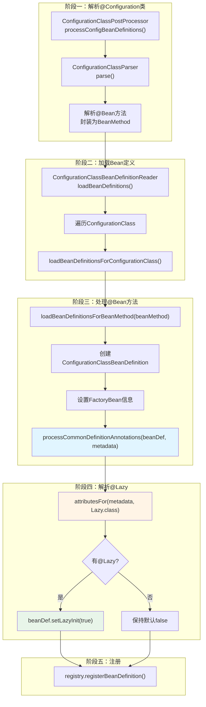

#### 核心源码解析

##### Step 1: 入口

```java
// ConfigurationClassBeanDefinitionReader.java 第126行
public void loadBeanDefinitions(Set<ConfigurationClass> configurationModel) {
    TrackedConditionEvaluator trackedConditionEvaluator = new TrackedConditionEvaluator();
    for (ConfigurationClass configClass : configurationModel) {
        loadBeanDefinitionsForConfigurationClass(configClass, trackedConditionEvaluator);
    }
}
```

##### Step 2: 处理配置类中的@Bean方法

```java
// ConfigurationClassBeanDefinitionReader.java 第140-181行
private void loadBeanDefinitionsForConfigurationClass(
        ConfigurationClass configClass, TrackedConditionEvaluator trackedConditionEvaluator) {
    
    // 处理配置类本身
    if (configClass.isImported()) {
        registerBeanDefinitionForImportedConfigurationClass(configClass);
    }
    
    // ⭐ 处理所有@Bean方法
    for (BeanMethod beanMethod : configClass.getBeanMethods()) {
        loadBeanDefinitionsForBeanMethod(beanMethod);
    }
    
    // 处理ImportResource、ImportBeanDefinitionRegistrar...
}
```

##### Step 3: 处理单个@Bean方法

```java
// ConfigurationClassBeanDefinitionReader.java 第210-319行
private void loadBeanDefinitionsForBeanMethod(BeanMethod beanMethod) {
    ConfigurationClass configClass = beanMethod.getConfigurationClass();
    MethodMetadata metadata = beanMethod.getMetadata();
    String methodName = metadata.getMethodName();

    // 条件检查
    if (this.conditionEvaluator.shouldSkip(metadata, ConfigurationPhase.REGISTER_BEAN)) {
        configClass.skippedBeanMethods.add(methodName);
        return;
    }

    // 获取@Bean注解属性
    AnnotationAttributes bean = AnnotationConfigUtils.attributesFor(metadata, Bean.class);
    Assert.state(bean != null, "No @Bean annotation attributes");

    // 生成beanName
    String beanName = ...;

    // ⭐ 创建 BeanDefinition
    ConfigurationClassBeanDefinition beanDef = new ConfigurationClassBeanDefinition(configClass, metadata, beanName);
    beanDef.setSource(this.sourceExtractor.extractSource(metadata, configClass.getResource()));

    // 设置工厂方法信息
    if (metadata.isStatic()) {
        // 静态@Bean方法
        beanDef.setBeanClass(...);
        beanDef.setUniqueFactoryMethodName(methodName);
    } else {
        // 实例@Bean方法
        beanDef.setFactoryBeanName(configClass.getBeanName());
        beanDef.setUniqueFactoryMethodName(methodName);
    }

    // ⭐⭐⭐ 核心：处理@Bean方法上的注解（包括@Lazy）
    AnnotationConfigUtils.processCommonDefinitionAnnotations(beanDef, metadata);

    // 处理其他属性...
    beanDef.setAutowireMode(AbstractBeanDefinition.AUTOWIRE_CONSTRUCTOR);

    // 注册BeanDefinition
    this.registry.registerBeanDefinition(beanName, beanDefToRegister);
}
```

##### Step 4: 解析@Lazy注解

```java
// AnnotationConfigUtils.java 第272-282行
static void processCommonDefinitionAnnotations(AnnotatedBeanDefinition abd, AnnotatedTypeMetadata metadata) {
    // ⭐ 解析@Lazy注解
    AnnotationAttributes lazy = attributesFor(metadata, Lazy.class);
    if (lazy != null) {
        abd.setLazyInit(lazy.getBoolean("value"));  // 设置 lazyInit = true
    }
    else if (abd.getMetadata() != metadata) {
        // 备选：检查类上的@Lazy
        lazy = attributesFor(abd.getMetadata(), Lazy.class);
        if (lazy != null) {
            abd.setLazyInit(lazy.getBoolean("value"));
        }
    }

    // 处理@Primary
    if (metadata.isAnnotated(Primary.class.getName())) {
        abd.setPrimary(true);
    }

    // 处理@DependsOn
    AnnotationAttributes dependsOn = attributesFor(metadata, DependsOn.class);
    if (dependsOn != null) {
        abd.setDependsOn(dependsOn.getStringArray("value"));
    }
    // ...
}
```

#### 完整时序图

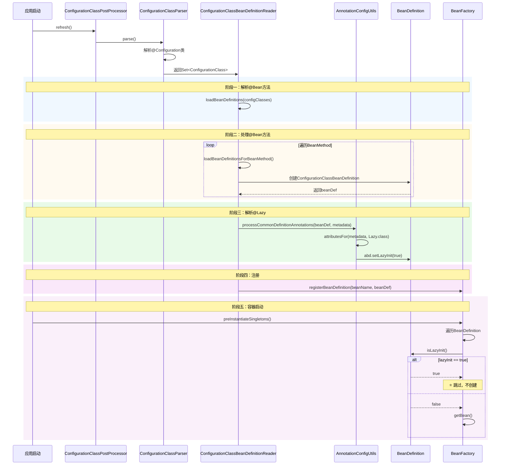

#### 对比：类上@Lazy vs @Bean方法上@Lazy

| 特性 | 类上@Lazy | @Bean方法上@Lazy |
|------|----------|------------------|
| **作用范围** | 整个类的所有Bean | 仅当前@Bean方法 |
| **解析时机** | 注册BeanDefinition时 | 注册BeanDefinition时 |
| **效果** | `abd.setLazyInit(true)` | `abd.setLazyInit(true)` |
| **示例** | `@Lazy @Service` | `@Bean @Lazy` |

#### 实际例子

```java
@Configuration
public class ServiceConfig {

    // 方式1：类上@Lazy - 所有@Bean方法都延迟
    @Lazy
    @Configuration
    public static class LazyConfig {
        @Bean
        public ServiceA serviceA() { return new ServiceA(); }

        @Bean
        public ServiceB serviceB() { return new ServiceB(); }
    }

    // 方式2：@Bean方法上@Lazy - 仅当前方法延迟
    @Configuration
    public static class NormalConfig {
        @Bean
        public ServiceC serviceC() { return new ServiceC(); }  // 立即创建

        @Bean
        @Lazy
        public ServiceD serviceD() { return new ServiceD(); }  // 延迟创建
    }
}
```

### 15.4 补充：@Lazy注解的默认行为

```java
@Lazy  // value() 默认值为 true
@Lazy(value = true)  // 明确指定
@Lazy(value = false)  // 显式设置为false，则不会延迟加载
```

**注意**：
- `@Lazy` 的 `value` 默认值为 `true`
- 如果 `@Lazy(value = false)`，效果等同于没有 `@Lazy` 注解

### 15.5 补充：@Lazy与@Primary、@DependsOn的组合

```java
@Lazy
@Primary
@DependsOn("anotherBean")
@Service
public class MyService {
    // 同时具有：延迟加载 + 主Bean + 显式依赖顺序
}
```

这些注解可以组合使用，Spring 会依次处理：
1. `@DependsOn` - 确定创建顺序
2. `@Lazy` - 控制创建时机
3. `@Primary` - 确定主Bean

---

## 十六、源码位置汇总

| 功能 | 源码位置 |
|------|----------|
| @Lazy注解定义 | `spring-context/src/main/java/org/springframework/context/annotation/Lazy.java` |
| 类上@Lazy解析 | `AnnotationConfigUtils.processCommonDefinitionAnnotations()` |
| @Bean方法上@Lazy解析 | `ConfigurationClassBeanDefinitionReader.loadBeanDefinitionsForBeanMethod()` |
| 注入点@Lazy解析 | `ContextAnnotationAutowireCandidateResolver.isLazy()` |
| 代理对象创建 | `ContextAnnotationAutowireCandidateResolver.buildLazyResolutionProxy()` |
| 依赖注入触发 | `AutowiredAnnotationBeanPostProcessor.postProcessProperties()` |
| 依赖解析入口 | `DefaultListableBeanFactory.resolveDependency()` |
| Bean初始化时机 | `DefaultListableBeanFactory.preInstantiateSingletons()` |
| 全局延迟初始化 | `LazyInitializationBeanFactoryPostProcessor` |
| JDK动态代理 | `JdkDynamicAopProxy.invoke()` |
| CGLIB代理 | `CglibAopProxy.DynamicAdvisedInterceptor.intercept()` |

---

## 十七、补充：CGLIB代理的处理机制

当被注入的 Bean 不是接口而是**类**时，Spring 会使用 CGLIB 创建代理。

### 17.1 示例代码

```java
@Service
public class OrderService {

    @Autowired
    @Lazy
    private UserServiceImpl userService;  // ⭐ UserServiceImpl 是类，不是接口
}
```

### 17.2 代理创建过程

```java
// ContextAnnotationAutowireCandidateResolver.java
protected Object buildLazyResolutionProxy(final DependencyDescriptor descriptor, final @Nullable String beanName) {
    // ...

    // 同样创建自定义 TargetSource
    TargetSource ts = new TargetSource() {
        @Override
        public Object getTarget() {
            Object target = dlbf.doResolveDependency(descriptor, beanName, autowiredBeanNames, null);
            return target;
        }
        // ...
    };

    ProxyFactory pf = new ProxyFactory();
    pf.setTargetSource(ts);  // 设置 TargetSource

    Class<?> dependencyType = descriptor.getDependencyType();
    if (dependencyType.isInterface()) {
        pf.addInterface(dependencyType);  // JDK动态代理
    }
    // ⭐ 如果不是接口，默认使用CGLIB
    // 无需添加接口，pf会自动继承dependencyType

    return pf.getProxy(dlbf.getBeanClassLoader());
}
```

### 17.3 CGLIB代理创建选择

```java
// DefaultAopProxyFactory.java
@Override
public AopProxy createAopProxy(AdvisedSupport config) throws AopConfigException {
    if (!NativeDetector.inNativeImage() &&
            (config.isOptimize() || config.isProxyTargetClass() || hasNoUserSuppliedProxyInterfaces(config))) {

        Class<?> targetClass = config.getTargetClass();
        if (targetClass.isInterface() || Proxy.isProxyClass(targetClass) || ClassUtils.isLambdaClass(targetClass)) {
            return new JdkDynamicAopProxy(config);  // ⭐ 接口使用JDK代理
        }
        // ⭐ 类使用CGLIB代理
        return new ObjenesisCglibAopProxy(config);
    }
    else {
        return new JdkDynamicAopProxy(config);
    }
}
```

### 17.4 CGLIB 回调机制

CGLIB 代理通过 **Callback** 数组来处理不同类型的方法调用：

```java
// CglibAopProxy.java
// Callback 类型索引
private static final int AOP_PROXY = 0;
private static final int INVOKE_TARGET = 1;  // ⭐ 调用目标方法
private static final int NO_OVERRIDE = 2;
private static final int DISPATCH_TO_TARGET = 3;
private static final int INVOKE_SUPER = 4;
private static final int INVOKE_EQUALS = 5;
private static final int INVOKE_HASHCODE = 6;
```

对于 `@Lazy` 代理，主要使用：
- **DynamicAdvisedInterceptor** - 动态目标拦截器

### 17.5 核心：DynamicAdvisedInterceptor.intercept()

```java
// CglibAopProxy.java 第764-840行
private static class DynamicAdvisedInterceptor implements MethodInterceptor, Serializable {

    @Override
    public Object intercept(Object proxy, Method method, Object[] args, MethodProxy methodProxy) throws Throwable {
        Object oldProxy = null;
        boolean setProxyContext = false;
        Object target = null;

        // ⭐⭐⭐ 关键：获取真实目标对象
        TargetSource targetSource = this.advised.getTargetSource();

        try {
            if (this.advised.exposeProxy) {
                oldProxy = AopContext.setCurrentProxy(proxy);
                setProxyContext = true;
            }

            // ⭐⭐⭐ 关键：这里触发获取真实Bean！
            target = targetSource.getTarget();

            Class<?> targetClass = (target != null ? target.getClass() : null);

            // 获取拦截器链
            List<Object> chain = this.advised.getInterceptorsAndDynamicInterceptionAdvice(method, targetClass);

            Object retVal;
            if (chain.isEmpty() && CglibMethodInvocation.isMethodProxyCompatible(method)) {
                // ⭐ 没有拦截器链，直接调用目标方法
                Object[] argsToUse = AopProxyUtils.adaptArgumentsIfNecessary(method, args);
                retVal = invokeMethod(target, method, argsToUse, methodProxy);
            }
            else {
                // 有拦截器链，通过 MethodInvocation 调用
                retVal = new CglibMethodInvocation(proxy, target, method, args, targetClass, chain, methodProxy).proceed();
            }

            retVal = processReturnType(proxy, target, method, retVal);
            return retVal;
        }
        finally {
            if (target != null && !targetSource.isStatic()) {
                targetSource.releaseTarget(target);
            }
            if (setProxyContext) {
                AopContext.setCurrentProxy(oldProxy);
            }
        }
    }
}
```

### 17.6 CGLIB 调用时序图

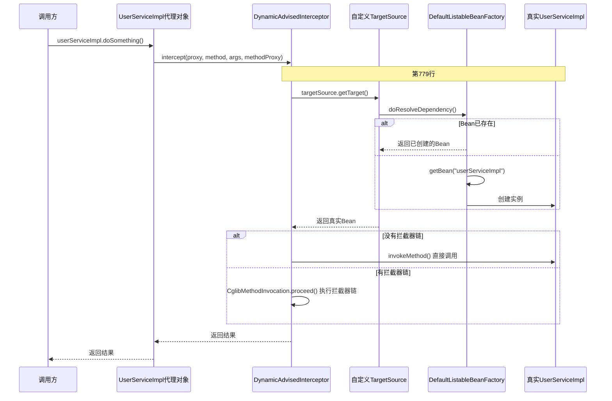

### 17.7 对比：JDK代理 vs CGLIB代理

| 特性 | JDK动态代理 | CGLIB代理 |
|------|------------|----------|
| **实现方式** | `java.lang.reflect.Proxy` | `org.springframework.cglib.proxy.Enhancer` |
| **接口** | 必须实现接口 | 可以是类 |
| **调用方式** | `InvocationHandler.invoke()` | `MethodInterceptor.intercept()` |
| **获取目标** | `targetSource.getTarget()` | `targetSource.getTarget()` |
| **关键代码行** | JdkDynamicAopProxy 第221行 | CglibAopProxy 第779行 |
| **性能** | 稍慢（反射） | 稍快（生成字节码） |

### 17.8 关键相同点

**无论是JDK代理还是CGLIB代理，核心机制完全相同**：

1. **都使用 TargetSource 机制**
2. **都在调用时通过 `targetSource.getTarget()` 获取真实Bean**
3. **都没有添加任何 Advisor**（因为不需要增强，只是延迟获取）

```java
// 两种代理的共同点
ProxyFactory pf = new ProxyFactory();
pf.setTargetSource(ts);  // ⭐ 关键：设置自定义 TargetSource
// 不需要 pf.addAdvisors()！
return pf.getProxy(beanFactory.getBeanClassLoader());
```

这就是 `@Lazy` 代理的完整机制！
