# Spring 循环依赖 - 自依赖详解

> 自依赖是循环依赖的一个特殊场景：Bean 注入自己。本文详细分析 Spring 如何处理自依赖。

---

## 一、什么是自依赖？

### 1.1 定义

自依赖是指一个 Bean 通过 `@Autowired` 注入自己：

```java
@Service
public class ServiceA {
    @Autowired
    private ServiceA self;  // 自己注入自己
}
```

### 1.2 自依赖的三种类型

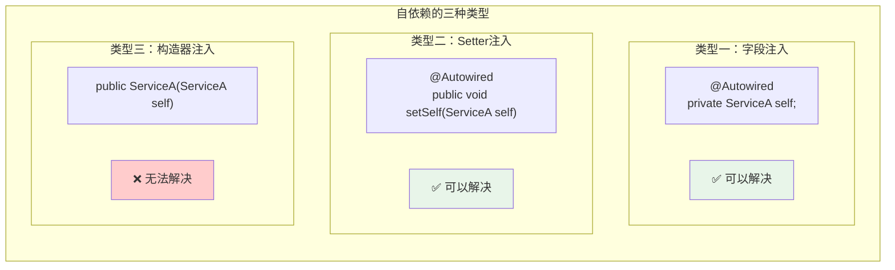

### 1.3 自依赖的实际应用场景

```java
@Service
public class OrderService {
    
    @Autowired
    private OrderService self;  // 注入自己
    
    @Transactional
    public void createOrder(Order order) {
        // 保存订单
        orderRepository.save(order);
        
        // ⭐ 通过 self 调用，触发新事务
        // 如果直接调用 processPayment()，不会走代理，事务不生效
        self.processPayment(order);
    }
    
    @Transactional(propagation = Propagation.REQUIRES_NEW)
    public void processPayment(Order order) {
        // REQUIRES_NEW：开启新事务
        // 即使外层事务回滚，这个方法的提交不受影响
        paymentService.charge(order);
    }
}
```

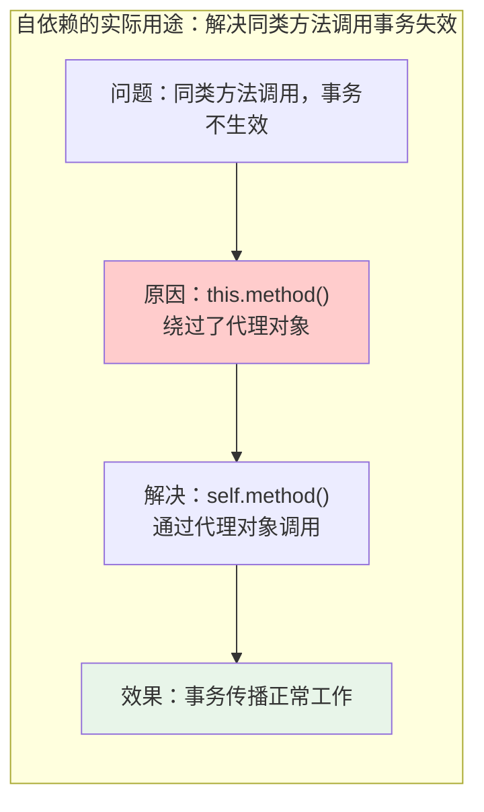

**为什么需要自依赖？**

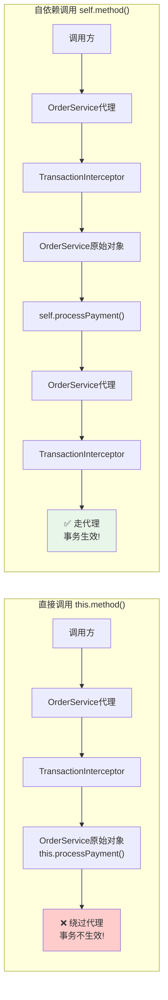

---

## 二、自依赖能否被Spring解决？

### 2.1 答案

**✅ 字段注入和Setter注入的自依赖可以被Spring解决！**

**❌ 构造器注入的自依赖无法解决！**

### 2.2 对比表

| 注入方式 | 能否解决 | 原因 |
|---------|---------|------|
| `@Autowired` 字段注入 | ✅ 能 | 在 `populateBean()` 阶段注入，此时三级缓存已生效 |
| `@Autowired` Setter注入 | ✅ 能 | 同上 |
| 构造器注入 | ❌ 不能 | 在 `createBeanInstance()` 阶段就需要，三级缓存还未生效 |
| 构造器注入 + `@Lazy` | ✅ 能 | 注入代理对象，延迟获取 |

---

## 三、自依赖解决流程详解

### 3.1 完整执行流程

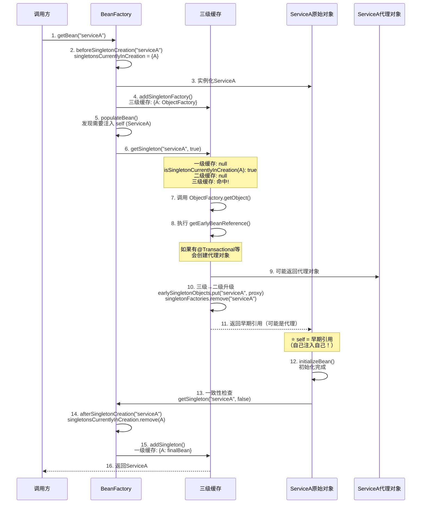

### 3.2 关键步骤详解

#### 步骤1-3：创建开始

```
1. getBean("serviceA")
2. beforeSingletonCreation("serviceA")  → singletonsCurrentlyInCreation = {"serviceA"}
3. createBeanInstance() → 实例化 ServiceA
```

#### 步骤4：存入三级缓存

```java
// AbstractAutowireCapableBeanFactory.doCreateBean()
addSingletonFactory(beanName, () -> getEarlyBeanReference(beanName, mbd, bean));

// 此时状态：
// singletonFactories = {"serviceA": ObjectFactory}
// earlySingletonObjects = {}
// singletonObjects = {}
```

#### 步骤5-6：注入self时查找缓存

```
5. populateBean() → 发现字段 self 需要 ServiceA
6. getSingleton("serviceA", true)
   - singletonObjects.get("serviceA") → null（一级缓存没有）
   - isSingletonCurrentlyInCreation("serviceA") → true（正在创建中）
   - earlySingletonObjects.get("serviceA") → null（二级缓存没有）
   - singletonFactories.get("serviceA") → 命中！（三级缓存命中）
```

#### 步骤7-11：获取早期引用

```java
// 调用 ObjectFactory.getObject()
singletonObject = singletonFactory.getObject();
// 内部执行：getEarlyBeanReference()

// 如果有 @Transactional 等注解，会创建代理对象
// 返回的是代理对象或原始对象

// 三级→二级升级
earlySingletonObjects.put("serviceA", singletonObject);
singletonFactories.remove("serviceA");

// self 字段被赋值为早期引用
// 此时 self = 自己（原始对象或代理对象）
```

#### 步骤12-15：完成创建

```
12. initializeBean() → 初始化完成
13. 一致性检查 → getSingleton("serviceA", false)
14. afterSingletonCreation("serviceA") → 从创建集合移除
15. addSingleton() → 放入一级缓存
```

### 3.3 缓存状态变化

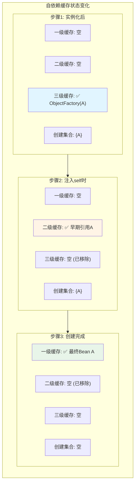

---

## 四、关键问题：为什么自依赖不会触发重复创建检测？

### 4.1 两种getSingleton方法的区别

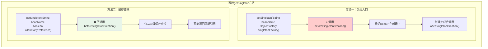

### 4.2 对比：普通循环依赖 vs 自依赖

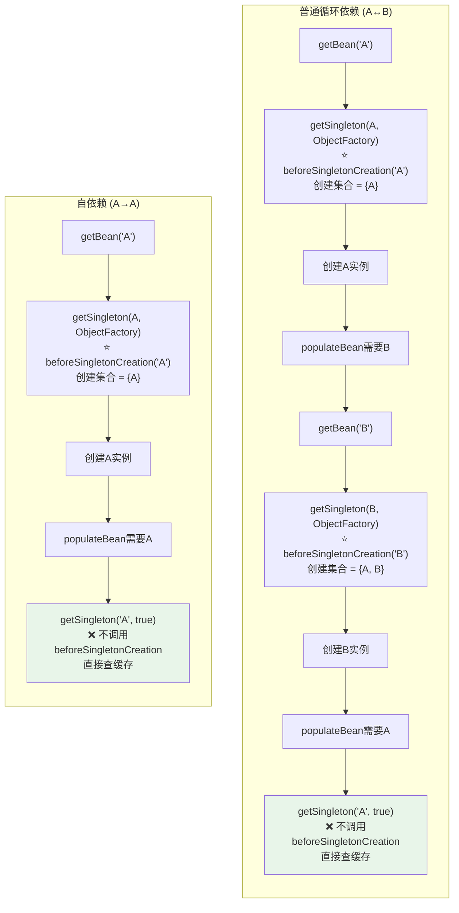

### 4.3 关键结论

| 方法 | 是否调用beforeSingletonCreation | 用途 |
|------|-------------------------------|------|
| `getSingleton(String, ObjectFactory)` | ✅ 调用 | 创建Bean的入口 |
| `getSingleton(String, boolean)` | ❌ 不调用 | 仅从缓存获取 |

自依赖时，第二次获取A走的是 **`getSingleton(String, boolean)`**，只查缓存，不会重复调用 `beforeSingletonCreation`！

---

## 五、自依赖 + AOP代理

### 5.1 场景示例

```java
@Service
public class ServiceA {
    @Autowired
    private ServiceA self;  // 注入自己
    
    @Transactional
    public void doSomething() {
        // 通过 self 调用，事务生效
        self.internalMethod();
    }
    
    @Transactional(propagation = Propagation.REQUIRES_NEW)
    public void internalMethod() {
        // REQUIRES_NEW：新事务
    }
}
```

### 5.2 代理对象创建流程

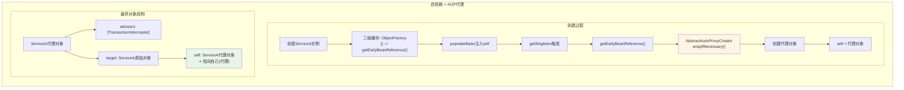

### 5.3 对象内存结构

```
┌─────────────────────────────────────────────────────────────────┐
│                    ServiceA$$EnhancerBySpringCGLIB              │
│                         （代理对象）                              │
├─────────────────────────────────────────────────────────────────┤
│  advisors: [TransactionInterceptor, ...]                        │
│  target: ──────────────────────────────────────┐                │
│                                                  │               │
└──────────────────────────────────────────────────│───────────────┘
                                                   │
                                                   ▼
┌─────────────────────────────────────────────────────────────────┐
│                      ServiceA（原始对象）                         │
├─────────────────────────────────────────────────────────────────┤
│  self: ────────────────────────────────────────┐               │
│                                                  │               │
│  @Transactional                                  │               │
│  public void doSomething() { ... }               │               │
│                                                  │               │
│  @Transactional(propagation = REQUIRES_NEW)      │               │
│  public void internalMethod() { ... }            │               │
│                                                  │               │
└──────────────────────────────────────────────────│───────────────┘
                                                   │
                                                   │
                                                   └──────► 指向代理对象
```

### 5.4 earlyProxyReferences的作用

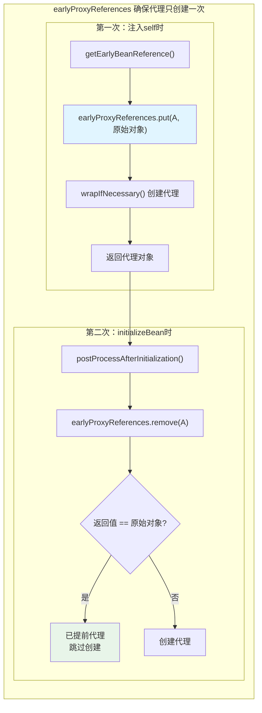

---

## 六、自依赖无法解决的场景

### 6.1 构造器自依赖

```java
@Service
public class ServiceA {
    private final ServiceA self;
    
    public ServiceA(ServiceA self) {  // ❌ 构造器自依赖
        this.self = self;
    }
}
```

```mermaid
sequenceDiagram
    participant Factory as BeanFactory
    participant A as ServiceA
    participant CreationSet as singletonsCurrentlyInCreation
    
    Factory->>CreationSet: 1. add("serviceA") ✅
    Factory->>A: 2. createBeanInstance()
    A->>Factory: 3. 构造器需要 ServiceA
    Factory->>Factory: 4. getBean("serviceA")
    Factory->>CreationSet: 5. add("serviceA") ❌ 已存在!
    CreationSet-->>Factory: 返回false
    Factory->>Factory: 6. 抛出 BeanCurrentlyInCreationException
    
    style CreationSet fill:#ffcccc
```

**原因**：构造器自依赖在实例化阶段就需要自己，但此时三级缓存还未生效。

### 6.2 自依赖 + @Async

```java
@Service
public class ServiceA {
    @Autowired
    private ServiceA self;
    
    @Async  // ⚠️ 不支持提前代理
    public void asyncMethod() {}
}
```

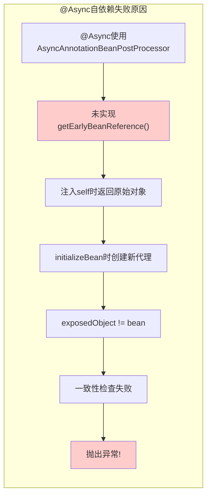

**原因**：与普通循环依赖相同，`@Async` 的 BPP 没有实现 `getEarlyBeanReference()`。

### 6.3 Prototype自依赖

```java
@Scope("prototype")
@Service
public class ServiceA {
    @Autowired
    private ServiceA self;  // ❌ Prototype不支持
}
```

**原因**：Prototype Bean不使用三级缓存，每次获取都创建新实例。

---

## 七、自依赖解决方案

### 7.1 方案一：使用@Lazy（推荐）

```java
@Service
public class ServiceA {
    @Autowired
    @Lazy
    private ServiceA self;  // 注入代理，延迟获取
}
```

### 7.2 方案二：使用ApplicationContext

```java
@Service
public class ServiceA implements ApplicationContextAware {
    
    private ApplicationContext applicationContext;
    
    @Override
    public void setApplicationContext(ApplicationContext applicationContext) {
        this.applicationContext = applicationContext;
    }
    
    public void doSomething() {
        // 手动获取代理对象
        ServiceA self = applicationContext.getBean(ServiceA.class);
        self.internalMethod();
    }
}
```

### 7.3 方案三：使用AopContext（不推荐）

```java
@Service
public class ServiceA {
    
    public void doSomething() {
        // 通过AopContext获取当前代理对象
        // 需要配置：@EnableAspectJAutoProxy(exposeProxy = true)
        ServiceA self = (ServiceA) AopContext.currentProxy();
        self.internalMethod();
    }
}
```

### 7.4 方案对比

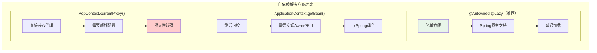

| 方案 | 优点 | 缺点 | 推荐度 |
|------|------|------|--------|
| `@Autowired @Lazy` | 简单、原生支持 | 无 | ⭐⭐⭐⭐⭐ |
| `ApplicationContext.getBean()` | 灵活 | 与Spring耦合 | ⭐⭐⭐ |
| `AopContext.currentProxy()` | 直接获取代理 | 需要配置、侵入性强 | ⭐⭐ |

---

## 八、总结

### 8.1 核心要点

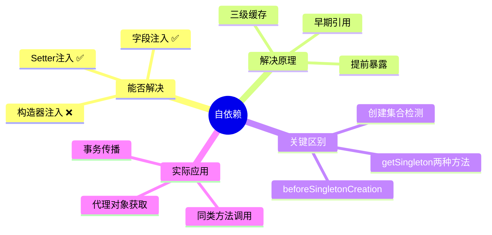

### 8.2 对比总结

| 场景 | 能否解决 | 关键原因 |
|------|---------|---------|
| 字段注入自依赖 | ✅ 能 | populateBean阶段，三级缓存已生效 |
| Setter注入自依赖 | ✅ 能 | 同上 |
| 构造器注入自依赖 | ❌ 不能 | createBeanInstance阶段，三级缓存未生效 |
| 自依赖 + @Transactional | ✅ 能 | AbstractAutoProxyCreator支持提前代理 |
| 自依赖 + @Async | ❌ 不能 | AsyncAnnotationBPP不支持提前代理 |
| Prototype自依赖 | ❌ 不能 | 不使用三级缓存 |

### 8.3 面试高频问题

**Q1：自依赖能否被Spring解决？**

**Q2：自依赖和普通循环依赖的解决流程有什么区别？**

**Q3：为什么自依赖不会触发BeanCurrentlyInCreationException？**

**Q4：自依赖有什么实际应用场景？**

**Q5：自依赖 + @Async为什么会失败？如何解决？**
