# Spring 循环依赖源码深度学习大纲（增强版）

> 基于 Spring 5.x/6.x 源码，系统性学习 Spring IoC 容器如何解决循环依赖问题。
> 这是 Spring 源码中最经典、面试最高频的知识点之一，涉及 Bean 生命周期、三级缓存、AOP 代理、并发控制等多个核心机制的交汇。

---

## 学习路线总览

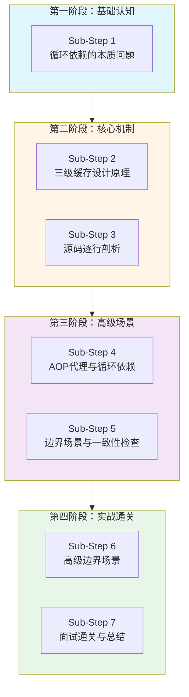

---

## Sub-Step 1：循环依赖的本质问题

### 1.1 什么是循环依赖？

循环依赖是指两个或多个Bean相互依赖，形成闭环的情况。

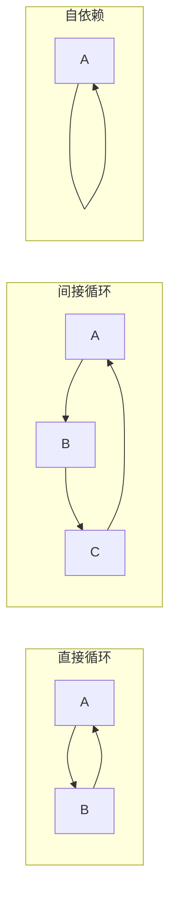

### 1.2 循环依赖产生的根本原因

#### 1.2.1 Bean创建的两个阶段

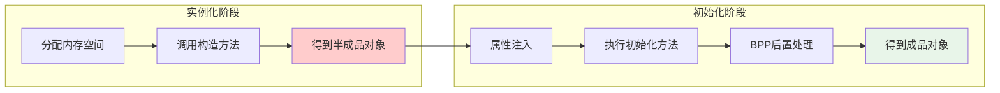

**关键认知**：
- 实例化：通过构造器创建对象，此时对象是"空的"
- 初始化：填充属性、执行初始化逻辑
- **循环依赖的问题在于**：A实例化后需要注入B，但B的创建又需要注入A

#### 1.2.2 Bean完整生命周期与循环依赖的交汇点

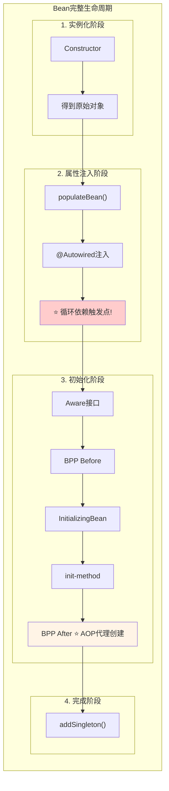

#### 1.2.3 没有三级缓存的死循环

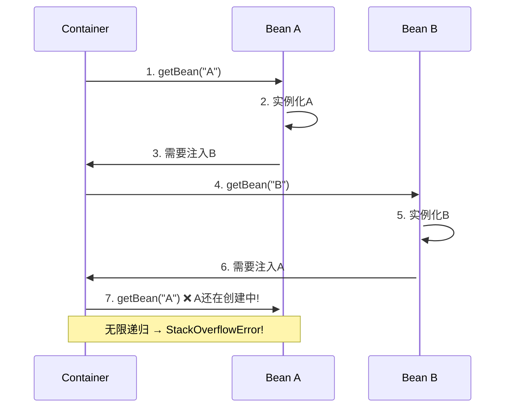

### 1.3 解决思路：提前暴露半成品

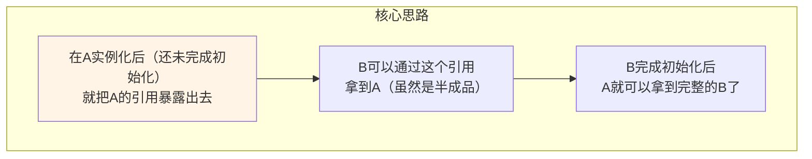

**问题**：为什么注入半成品对象没问题？
- 因为注入的是**引用**，不是值
- 当A最终完成初始化后，B持有的A引用就指向了完整的A
- 这是Java引用机制决定的

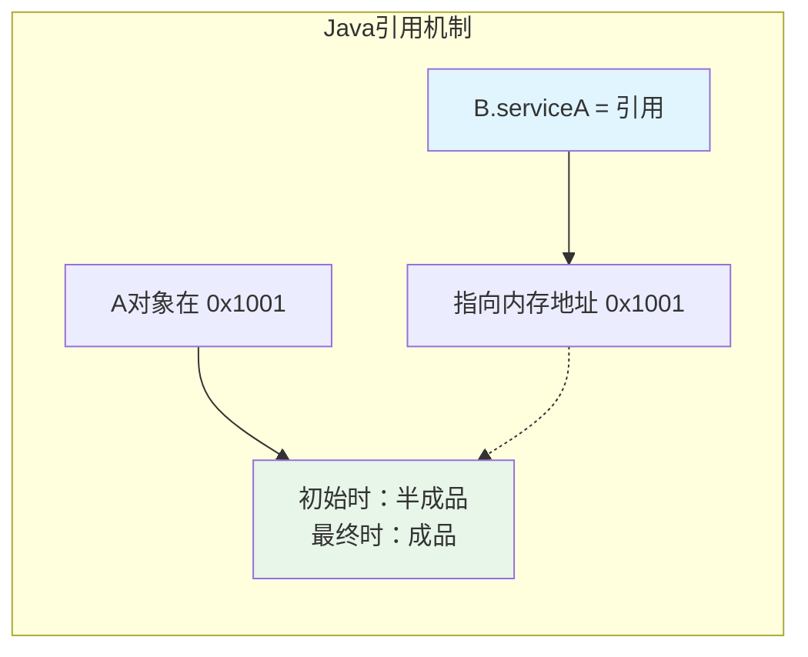

### 1.4 注入方式对循环依赖的影响

|| 注入方式 | 能否解决循环依赖 | 原因分析 | 源码位置 |
||---------|---------------|---------|---------|
|| **Setter注入** | ✅ 能 | 实例化和属性注入分开，可以先暴露半成品 | `populateBean()` |
|| **@Autowired字段注入** | ✅ 能 | 本质也是Setter注入，在`populateBean()`阶段执行 | `AutowiredAnnotationBPP.inject()` |
|| **构造器注入** | ❌ 不能 | 实例化时就需要依赖对象，无法暴露半成品 | `createBeanInstance()` |
|| **@Lazy构造器注入** | ✅ 能 | 注入的是代理对象，延迟真正的获取 | `ContextAnnotationAutowireCandidateResolver` |

#### 1.4.1 为什么构造器注入无法解决？

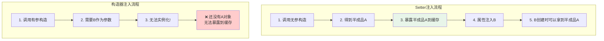

```mermaid
sequenceDiagram
    participant Container as Container
    participant A as ServiceA
    participant CreationSet as singletonsCurrentlyInCreation
    
    Note over Container,CreationSet: 构造器注入循环依赖检测流程
    
    Container->>A: 1. getBean("serviceA")
    Container->>CreationSet: 2. add("serviceA") ✅
    Container->>A: 3. createBeanInstance
    A->>Container: 4. 构造器需要ServiceB
    Container->>Container: 5. getBean("serviceB")
    Container->>CreationSet: 6. add("serviceB") ✅
    Container->>Container: 7. createBeanInstance
    Container->>Container: 8. 构造器需要ServiceA
    Container->>Container: 9. getBean("serviceA")
    Container->>CreationSet: 10. add("serviceA") ❌ 已存在!
    CreationSet-->>Container: 返回false
    Container->>Container: 11. 抛出 BeanCurrentlyInCreationException
    
    style CreationSet fill:#ffcccc
```

#### 1.4.2 @Lazy解决构造器注入的原理

```java
@Component
public class ServiceA {
    private final ServiceB serviceB;
    
    // @Lazy 让 Spring 注入一个代理对象，而不是真正的 Bean
    public ServiceA(@Lazy ServiceB serviceB) {
        this.serviceB = serviceB;  // 这里注入的是 ServiceB 的 CGLIB 代理
    }
}
```

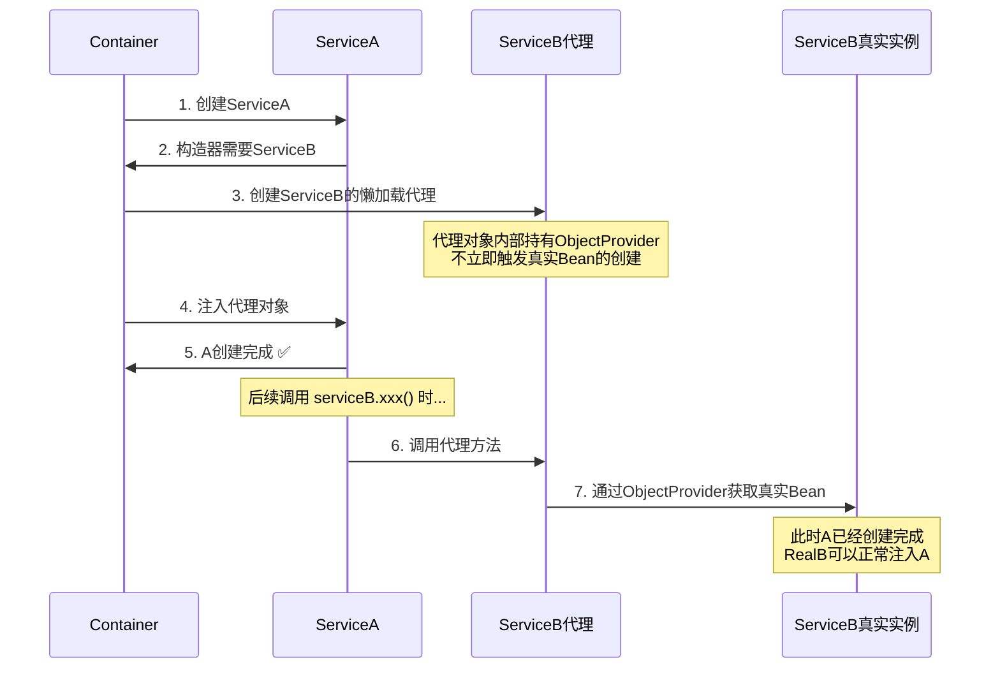

**@Lazy的源码实现**：

```java
// ContextAnnotationAutowireCandidateResolver.java
// 构建 LazyResolutionDependencyDescriptor
class ContextAnnotationAutowireCandidateResolver extends QualifierAnnotationAutowireCandidateResolver {
    
    @Override
    public Object getLazyResolutionProxyIfNecessary(DependencyDescriptor descriptor, String beanName) {
        // 如果有 @Lazy 注解，返回一个代理对象
        return (isLazy(descriptor) ? buildLazyResolutionProxy(descriptor, beanName) : null);
    }
    
    private Object buildLazyResolutionProxy(DependencyDescriptor descriptor, String beanName) {
        // 使用 ObjectProvider 延迟解析
        TargetSource targetSource = new LazyResolutionTargetSource(descriptor, beanName);
        ProxyFactory proxyFactory = new ProxyFactory();
        proxyFactory.setTargetSource(targetSource);
        // ... 创建 CGLIB 代理
        return proxyFactory.getProxy(classLoader);
    }
}
```

### 1.5 已有Demo回顾

#### 关键源码类索引

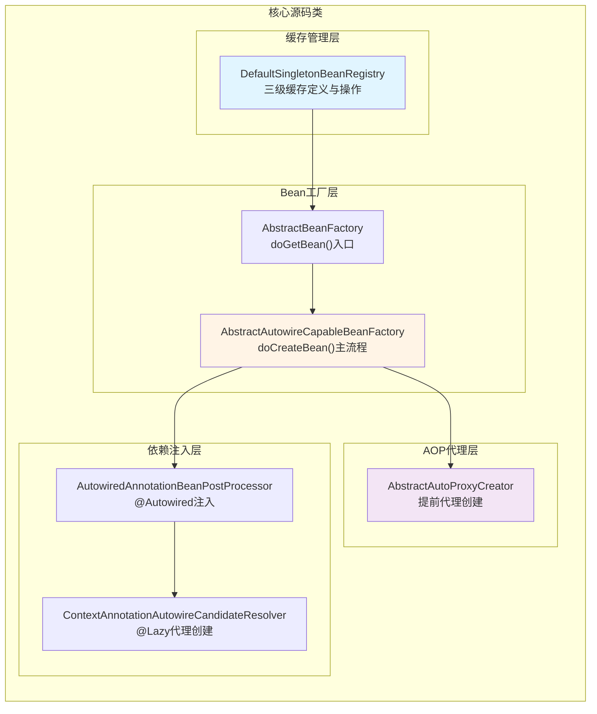

|| 类名 | 路径 | 职责 |
||------|------|------|
|| `DefaultSingletonBeanRegistry` | spring-beans | 三级缓存的定义与操作 |
|| `AbstractBeanFactory` | spring-beans | `doGetBean()`入口 |
|| `AbstractAutowireCapableBeanFactory` | spring-beans | `doCreateBean()`主流程 |
|| `AbstractAutoProxyCreator` | spring-aop | 提前代理创建 |

---

## Sub-Step 2：三级缓存设计原理

### 2.1 三级缓存的数据结构

```java
// DefaultSingletonBeanRegistry.java

/** 
 * 一级缓存：单例池
 * 存放完全初始化好的Bean（成品）
 * key = beanName, value = bean实例
 */
private final Map<String, Object> singletonObjects = new ConcurrentHashMap<>(256);

/** 
 * 二级缓存：早期单例对象
 * 存放提前暴露的Bean（半成品，可能已被代理）
 * key = beanName, value = 提前暴露的bean实例
 */
private final Map<String, Object> earlySingletonObjects = new ConcurrentHashMap<>(16);

/** 
 * 三级缓存：单例工厂
 * 存放Bean的工厂对象，用于生成早期引用
 * key = beanName, value = ObjectFactory（Lambda表达式）
 */
private final Map<String, ObjectFactory<?>> singletonFactories = new HashMap<>(16);

/** 
 * 已注册的单例名称集合
 * 按注册顺序记录所有单例Bean的名称
 */
private final Set<String> registeredSingletons = new LinkedHashSet<>(256);

/** 
 * 正在创建中的单例名称集合
 * 记录当前正在创建过程中的Bean
 */
private final Set<String> singletonsCurrentlyInCreation = Collections.newSetFromMap(new ConcurrentHashMap<>(16));

/** 
 * 创建检查中已排除的单例名称集合
 * 用于检测循环依赖时的异常情况
 */
private final Set<String> inCreationCheckExclusions = Collections.newSetFromMap(new ConcurrentHashMap<>(16));
```

### 2.2 三级缓存的关系图

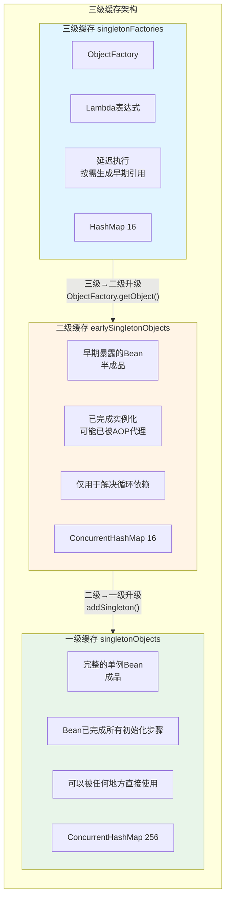

### 2.3 为什么需要三级而不是两级？

#### 2.3.1 如果只有两级缓存

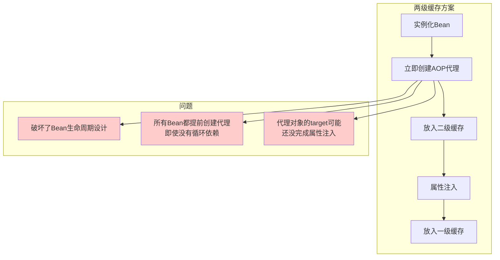

#### 2.3.2 三级缓存的设计智慧

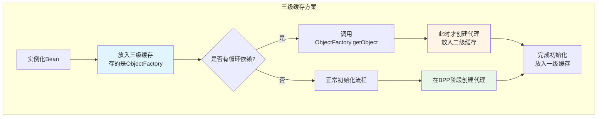

**核心价值**：
1. **延迟代理创建**：只有真正被循环引用时才创建代理
2. **保持生命周期设计**：正常情况下代理在BPP阶段创建
3. **按需执行**：通过ObjectFactory的Lambda延迟执行

#### 2.3.3 两级缓存 vs 三级缓存 对比

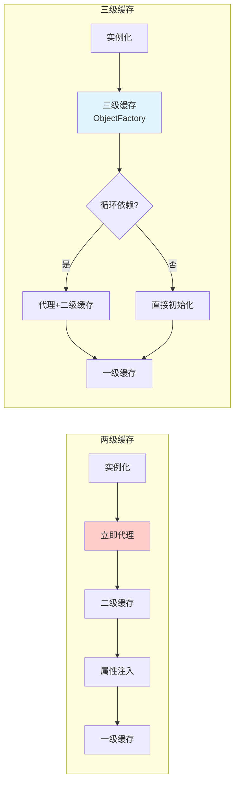

#### 2.3.4 ObjectFactory的Lambda表达式

```java
// AbstractAutowireCapableBeanFactory.doCreateBean()
// 存入三级缓存的是一个 Lambda 表达式

addSingletonFactory(beanName, () -> getEarlyBeanReference(beanName, mbd, bean));

// 这个 Lambda 的执行时机：
// 只有在 getSingleton(beanName, true) 命中三级缓存时才会执行
```

```java
// getEarlyBeanReference 方法的实现
protected Object getEarlyBeanReference(String beanName, RootBeanDefinition mbd, Object bean) {
    Object exposedObject = bean;
    
    // 遍历所有 SmartInstantiationAwareBeanPostProcessor
    // 只有 AbstractAutoProxyCreator 实现了这个方法
    if (!mbd.isSynthetic() && hasInstantiationAwareBeanPostProcessors()) {
        for (SmartInstantiationAwareBeanPostProcessor bp : getBeanPostProcessorCache().smartInstantiationAware) {
            exposedObject = bp.getEarlyBeanReference(exposedObject, beanName);
        }
    }
    return exposedObject;
}
```

### 2.4 三级缓存的状态变迁图

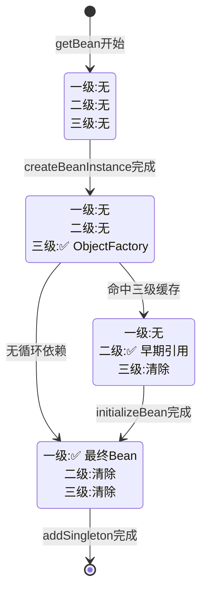

### 2.5 完整的循环依赖解决流程

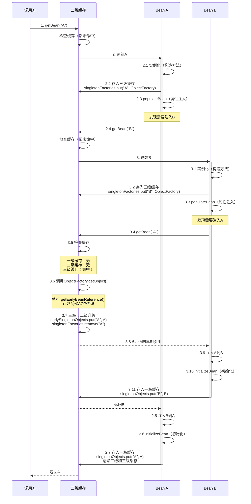

### 2.6 核心数据结构的内存布局

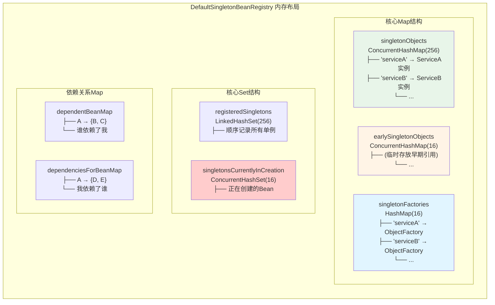

---

## Sub-Step 3：源码逐行剖析

### 3.1 入口方法：`AbstractBeanFactory.doGetBean()`

```java
// AbstractBeanFactory.java
protected <T> T doGetBean(String name, Class<T> requiredType, 
                          Object[] args, boolean typeCheckOnly) throws BeansException {
    
    // ① 转换Bean名称（处理FactoryBean的&前缀和别名）
    String beanName = transformedBeanName(name);
    Object beanInstance;
    
    // ② ⭐ 先尝试从缓存获取（核心！）
    Object sharedInstance = getSingleton(beanName);
    if (sharedInstance != null && args == null) {
        // 如果是FactoryBean，需要调用getObject()
        beanInstance = getObjectForBeanInstance(sharedInstance, name, beanName, null);
    } else {
        // ③ 检查原型Bean的循环依赖
        if (isPrototypeCurrentlyInCreation(beanName)) {
            throw new BeanCurrentlyInCreationException(beanName);
        }
        
        // ④ 检查父工厂
        BeanFactory parentBeanFactory = getParentBeanFactory();
        if (parentBeanFactory != null && !containsBeanDefinition(beanName)) {
            return parentBeanFactory.getBean(nameToLookUp, requiredType);
        }
        
        // ⑤ 标记Bean正在创建
        if (!typeCheckOnly) {
            markBeanAsCreated(beanName);
        }
        
        try {
            RootBeanDefinition mbd = getMergedLocalBeanDefinition(beanName);
            
            // ⑥ 先创建依赖的Bean（@DependsOn）
            String[] dependsOn = mbd.getDependsOn();
            if (dependsOn != null) {
                for (String dep : dependsOn) {
                    // 注册依赖关系
                    registerDependentBean(dep, beanName);
                    getBean(dep);
                }
            }
            
            // ⑦ ⭐ 创建单例Bean（核心入口！）
            if (mbd.isSingleton()) {
                sharedInstance = getSingleton(beanName, () -> {
                    try {
                        return createBean(beanName, mbd, args);
                    } catch (BeansException ex) {
                        destroySingleton(beanName);
                        throw ex;
                    }
                });
                beanInstance = getObjectForBeanInstance(sharedInstance, name, beanName, mbd);
            }
            // ... 原型和作用域Bean的处理
        }
        // ...
    }
    return adaptBeanInstance(name, beanInstance, requiredType);
}
```

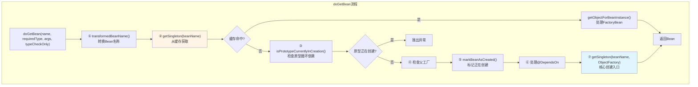

**关键点分析**：

|| 步骤 | 代码位置 | 作用 |
||------|---------|------|
|| ① | `transformedBeanName()` | 处理`&beanName`，转换为真正的Bean名称 |
|| ② | `getSingleton(beanName)` | 从缓存获取，可能命中三级缓存 |
|| ③ | `isPrototypeCurrentlyInCreation()` | 原型Bean循环依赖直接报错 |
|| ⑤ | `markBeanAsCreated()` | 标记正在创建 |
|| ⑥ | `@DependsOn` | 先创建依赖的Bean |
|| ⑦ | `getSingleton(beanName, ObjectFactory)` | 核心创建入口 |

### 3.2 核心方法一：缓存查找 `getSingleton(String, boolean)`

```java
// DefaultSingletonBeanRegistry.java
@Nullable
protected Object getSingleton(String beanName, boolean allowEarlyReference) {
    
    // ⭐ 步骤1：先查一级缓存（完整Bean）
    Object singletonObject = this.singletonObjects.get(beanName);
    
    // ⭐ 步骤2：一级缓存没有 + 正在创建中
    if (singletonObject == null && isSingletonCurrentlyInCreation(beanName)) {
        
        // ⭐ 步骤3：查二级缓存（早期引用）
        singletonObject = this.earlySingletonObjects.get(beanName);
        
        // ⭐ 步骤4：二级缓存也没有 + 允许早期引用
        if (singletonObject == null && allowEarlyReference) {
            
            // ⭐⭐⭐ 加锁！Double-Check Locking
            synchronized (this.singletonObjects) {
                
                // Double-check：再次检查一级缓存
                singletonObject = this.singletonObjects.get(beanName);
                if (singletonObject == null) {
                    
                    // Double-check：再次检查二级缓存
                    singletonObject = this.earlySingletonObjects.get(beanName);
                    if (singletonObject == null) {
                        
                        // ⭐⭐⭐ 步骤5：查三级缓存
                        ObjectFactory<?> singletonFactory = this.singletonFactories.get(beanName);
                        if (singletonFactory != null) {
                            
                            // ⭐⭐⭐ 调用ObjectFactory，获取早期引用
                            // 这里会触发 getEarlyBeanReference()
                            // 如果有AOP，会在这里创建代理！
                            singletonObject = singletonFactory.getObject();
                            
                            // ⭐⭐⭐ 三级→二级升级
                            this.earlySingletonObjects.put(beanName, singletonObject);
                            this.singletonFactories.remove(beanName);
                        }
                    }
                }
            }
        }
    }
    return singletonObject;
}
```

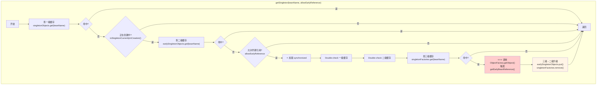

**为什么要Double-Check Locking？**

```mermaid
sequenceDiagram
    participant T1 as 线程1
    participant Lock as synchronized锁
    participant T2 as 线程2
    participant Cache as 三级缓存
    
    T1->>Cache: 1. 查一级缓存（无）
    T2->>Cache: 2. 查一级缓存（无）
    
    T1->>Cache: 3. 查二级缓存（无）
    T2->>Cache: 4. 查二级缓存（无）
    
    T1->>Lock: 5. 获取锁
    activate Lock
    T1->>Cache: 6. Double-check二级缓存
    T1->>Cache: 7. 查三级缓存
    T1->>Cache: 8. 调用ObjectFactory
    T1->>Cache: 9. 三级→二级升级
    T1->>Lock: 10. 释放锁
    deactivate Lock
    
    T2->>Lock: 11. 获取锁
    activate Lock
    T2->>Cache: 12. Double-check二级缓存
    Note over T2,Cache: ⭐ 此时二级缓存已有！<br/>不会再调用ObjectFactory
    T2->>Lock: 13. 释放锁
    deactivate Lock
```

**关键点**：
- 避免多个线程同时调用`ObjectFactory.getObject()`
- 确保代理对象只创建一次
- 确保三级→二级升级只发生一次

**`allowEarlyReference`参数何时为true/false？**

|| 调用位置 | 参数值 | 原因 |
||---------|--------|------|
|| `doGetBean()`入口 | `true` | 允许从三级缓存获取早期引用 |
|| 一致性检查 | `false` | 只查一级和二级，不触发代理创建 |

### 3.3 核心方法二：创建包装 `getSingleton(String, ObjectFactory)`

```java
// DefaultSingletonBeanRegistry.java
public Object getSingleton(String beanName, ObjectFactory<?> singletonFactory) {
    
    Assert.notNull(beanName, "Bean name must not be null");
    
    // ⭐ 加锁：保证单例创建的原子性
    synchronized (this.singletonObjects) {
        
        // 再次检查一级缓存
        Object singletonObject = this.singletonObjects.get(beanName);
        if (singletonObject == null) {
            
            // ⭐⭐⭐ 标记为正在创建中（重要！）
            beforeSingletonCreation(beanName);
            
            boolean newSingleton = false;
            boolean recordSuppressedExceptions = (this.suppressedExceptions == null);
            
            if (recordSuppressedExceptions) {
                this.suppressedExceptions = new LinkedHashSet<>();
            }
            
            try {
                // ⭐⭐⭐ 调用ObjectFactory.getObject()
                // 这里会执行 createBean() → doCreateBean()
                singletonObject = singletonFactory.getObject();
                newSingleton = true;
                
            } catch (IllegalStateException ex) {
                // ...
            } catch (BeanCreationException ex) {
                // ...
            } finally {
                if (recordSuppressedExceptions) {
                    this.suppressedExceptions = null;
                }
                
                // ⭐⭐⭐ 取消创建中标记
                afterSingletonCreation(beanName);
            }
            
            // ⭐⭐⭐ 放入一级缓存，清除二级和三级缓存
            if (newSingleton) {
                addSingleton(beanName, singletonObject);
            }
        }
        return singletonObject;
    }
}
```

```mermaid
flowchart TB
    subgraph getSingleton流程["getSingleton(beanName, ObjectFactory)"]
        A["开始"] --> B["加锁 synchronized"]
        B --> C["检查一级缓存"]
        
        C --> D{"已存在?"}
        D -->|是| E["直接返回"]
        D -->|否| F["⭐ beforeSingletonCreation()<br/>标记正在创建中"]
        
        F --> G["try 块开始"]
        G --> H["⭐ singletonFactory.getObject()<br/>执行createBean()"]
        
        H --> I["成功?"]
        I -->|是| J["newSingleton = true"]
        I -->|否| K["捕获异常"]
        
        J --> L["finally 块"]
        K --> L
        
        L --> M["⭐ afterSingletonCreation()<br/>取消创建中标记"]
        M --> N{"newSingleton?"}
        
        N -->|是| O["⭐ addSingleton()<br/>放入一级缓存<br/>清除二级和三级缓存"]
        N -->|否| E
        O --> E
    end
    
    style F fill:#ffcccc
    style H fill:#e1f5ff
    style O fill:#e8f5e9
```

**`beforeSingletonCreation()`和`afterSingletonCreation()`**：

```java
// DefaultSingletonBeanRegistry.java

protected void beforeSingletonCreation(String beanName) {
    // ⭐ 将beanName加入 singletonsCurrentlyInCreation
    // 如果已经存在，返回false → 抛异常
    if (!this.inCreationCheckExclusions.contains(beanName) 
            && !this.singletonsCurrentlyInCreation.add(beanName)) {
        throw new BeanCurrentlyInCreationException(beanName);
    }
}

protected void afterSingletonCreation(String beanName) {
    // ⭐ 将beanName从 singletonsCurrentlyInCreation 移除
    if (!this.inCreationCheckExclusions.contains(beanName) 
            && !this.singletonsCurrentlyInCreation.remove(beanName)) {
        throw new IllegalStateException("Singleton '" + beanName + "' isn't currently in creation");
    }
}
```

```mermaid
flowchart LR
    subgraph beforeSingletonCreation["beforeSingletonCreation()"]
        B1["检查 inCreationCheckExclusions"] --> B2{"是否排除?"}
        B2 -->|是| B3["跳过"]
        B2 -->|否| B4["singletonsCurrentlyInCreation.add()"]
        B4 --> B5{"添加成功?"}
        B5 -->|是| B6["返回"]
        B5 -->|否| B7["抛出<br/>BeanCurrentlyInCreationException"]
    end
    
    style B7 fill:#ffcccc
```

**关键认知**：
- `singletonsCurrentlyInCreation`是检测循环依赖的关键
- 构造器注入循环依赖会在这里检测到并抛异常

**`addSingleton()`方法**：

```java
// DefaultSingletonBeanRegistry.java
protected void addSingleton(String beanName, Object singletonObject) {
    synchronized (this.singletonObjects) {
        // ⭐ 放入一级缓存
        this.singletonObjects.put(beanName, singletonObject);
        
        // ⭐ 清除三级缓存
        this.singletonFactories.remove(beanName);
        
        // ⭐ 清除二级缓存
        this.earlySingletonObjects.remove(beanName);
        
        // ⭐ 记录已注册
        this.registeredSingletons.add(beanName);
    }
}
```

```mermaid
flowchart LR
    subgraph addSingleton操作
        A["addSingleton(beanName, object)"] --> B["一级缓存: put"]
        B --> C["三级缓存: remove"]
        C --> D["二级缓存: remove"]
        D --> E["registeredSingletons: add"]
    end
    
    style B fill:#e8f5e9
    style C fill:#e1f5ff
    style D fill:#fff4e6
```

### 3.4 核心方法三：Bean创建主流程 `doCreateBean()`

```java
// AbstractAutowireCapableBeanFactory.java
protected Object doCreateBean(String beanName, RootBeanDefinition mbd, Object[] args) {
    
    // ═════════════════════════════════════════════════════════
    // 步骤1：实例化（调用构造方法）
    // ═════════════════════════════════════════════════════════
    BeanWrapper instanceWrapper = null;
    if (mbd.isSingleton()) {
        instanceWrapper = this.factoryBeanInstanceCache.remove(beanName);
    }
    if (instanceWrapper == null) {
        // ⭐ 创建实例（调用构造方法）
        instanceWrapper = createBeanInstance(beanName, mbd, args);
    }
    Object bean = instanceWrapper.getWrappedInstance();
    Class<?> beanType = instanceWrapper.getWrappedClass();
    
    // ═════════════════════════════════════════════════════════
    // 步骤2：⭐⭐⭐ 提前暴露半成品（解决循环依赖的关键！）
    // ═════════════════════════════════════════════════════════
    boolean earlySingletonExposure = (
            mbd.isSingleton()                    // 必须是单例
            && this.allowCircularReferences      // 允许循环依赖（Spring Boot 3.x默认false）
            && isSingletonCurrentlyInCreation(beanName)  // 正在创建中
    );
    
    if (earlySingletonExposure) {
        if (logger.isTraceEnabled()) {
            logger.trace("Eagerly caching bean '" + beanName + 
                        "' to allow for resolving potential circular references");
        }
        
        // ⭐⭐⭐ 存入三级缓存！
        // 注意：这里存的是一个Lambda表达式，延迟执行
        addSingletonFactory(beanName, () -> getEarlyBeanReference(beanName, mbd, bean));
    }
    
    // ═════════════════════════════════════════════════════════
    // 步骤3：初始化（属性注入 + 初始化方法）
    // ═════════════════════════════════════════════════════════
    Object exposedObject = bean;
    
    try {
        // ⭐ 属性注入（这里可能触发循环依赖！）
        populateBean(beanName, mbd, instanceWrapper);
        
        // ⭐ 初始化（BPP处理、InitializingBean、init-method）
        exposedObject = initializeBean(beanName, exposedObject, mbd);
        
    } catch (Throwable ex) {
        // ...
    }
    
    // ═════════════════════════════════════════════════════════
    // 步骤4：⭐⭐⭐ 一致性检查（循环依赖的最后一道防线）
    // ═════════════════════════════════════════════════════════
    if (earlySingletonExposure) {
        // ⭐ 注意：这里allowEarlyReference=false，只查一级和二级缓存
        Object earlySingletonReference = getSingleton(beanName, false);
        
        if (earlySingletonReference != null) {
            // 有其他Bean已经通过早期引用拿到了这个Bean
            
            if (exposedObject == bean) {
                // ⭐ 情况1：exposedObject没有被BPP替换
                // 使用二级缓存中的对象（可能是代理）
                exposedObject = earlySingletonReference;
                
            } else if (!this.allowRawInjectionDespiteWrapping) {
                // ⭐⭐⭐ 情况2：exposedObject被BPP替换了！
                // 说明initializeBean阶段创建了新的代理对象
                // 但其他Bean注入的是旧的早期引用
                // → 不一致！需要检查是否有依赖的Bean
                
                String[] dependentBeans = getDependentBeans(beanName);
                Set<String> actualDependentBeans = new LinkedHashSet<>(dependentBeans.length);
                
                for (String dependentBean : dependentBeans) {
                    // 检查依赖的Bean是否已经创建完成
                    if (!removeSingletonIfCreatedForTypeCheckOnly(dependentBean)) {
                        actualDependentBeans.add(dependentBean);
                    }
                }
                
                if (!actualDependentBeans.isEmpty()) {
                    // ⭐⭐⭐ 抛出异常！
                    throw new BeanCurrentlyInCreationException(beanName,
                        "Bean with name '" + beanName + "' has been injected into other beans [" +
                        StringUtils.collectionToCommaDelimitedString(actualDependentBeans) +
                        "] in its raw version as part of a circular reference, but has eventually been " +
                        "wrapped. This means that said other beans do not use the final version of the " +
                        "bean. This is often the result of over-eager type matching - consider using " +
                        "'getBeanNamesForType' with the 'allowEagerInit' flag turned off, for example.");
                }
            }
        }
    }
    
    // ═════════════════════════════════════════════════════════
    // 步骤5：注册DisposableBean
    // ═════════════════════════════════════════════════════════
    try {
        registerDisposableBeanIfNecessary(beanName, bean, mbd);
    } catch (BeanDefinitionValidationException ex) {
        // ...
    }
    
    return exposedObject;
}
```

```mermaid
flowchart TB
    subgraph doCreateBean流程["doCreateBean() 核心流程"]
        direction TB
        
        subgraph Step1["步骤1: 实例化"]
            A1["createBeanInstance()"] --> A2["调用构造方法"]
            A2 --> A3["得到原始对象 bean"]
        end
        
        subgraph Step2["步骤2: 提前暴露"]
            B1["判断 earlySingletonExposure<br/>单例 && 允许循环依赖 && 正在创建中"]
            B1 --> B2["addSingletonFactory()<br/>存入三级缓存"]
            B2 --> B3["存入Lambda:<br/>() -> getEarlyBeanReference()"]
        end
        
        subgraph Step3["步骤3: 初始化"]
            C1["populateBean()<br/>属性注入"] --> C2["⭐ 循环依赖触发点!"]
            C2 --> C3["initializeBean()<br/>初始化方法"]
            C3 --> C4["BPP After<br/>AOP代理创建"]
        end
        
        subgraph Step4["步骤4: 一致性检查"]
            D1["getSingleton(beanName, false)<br/>只查一级和二级"]
            D1 --> D2{"earlySingletonReference != null?"}
            D2 -->|否| D3["正常返回"]
            D2 -->|是| D4{"exposedObject == bean?"}
            D4 -->|是| D5["exposedObject = earlySingletonReference"]
            D4 -->|否| D6["检查依赖的Bean"]
            D6 --> D7{"有已创建的依赖?"}
            D7 -->|是| D8["抛出异常!"]
            D7 -->|否| D3
        end
        
        A3 --> B1
        B3 --> C1
        C4 --> D1
        D5 --> D3
        D8 --> D3
    end
    
    style C2 fill:#ffcccc
    style B2 fill:#e1f5ff
    style D8 fill:#ffcccc
```

### 3.5 属性注入 `populateBean()`

```java
// AbstractAutowireCapableBeanFactory.java
protected void populateBean(String beanName, RootBeanDefinition mbd, BeanWrapper bw) {
    // ...
    
    // ⭐ 处理自动注入（byName / byType）
    PropertyValues pvs = (mbd.hasPropertyValues() ? mbd.getPropertyValues() : null);
    
    int resolvedAutowireMode = mbd.getResolvedAutowireMode();
    if (resolvedAutowireMode == AUTOWIRE_BY_NAME || resolvedAutowireMode == AUTOWIRE_BY_TYPE) {
        MutablePropertyValues newPvs = new MutablePropertyValues(pvs);
        if (resolvedAutowireMode == AUTOWIRE_BY_NAME) {
            autowireByName(beanName, mbd, bw, newPvs);
        }
        if (resolvedAutowireMode == AUTOWIRE_BY_TYPE) {
            autowireByType(beanName, mbd, bw, newPvs);
        }
        pvs = newPvs;
    }
    
    // ⭐⭐⭐ 处理BeanPostProcessor（@Autowired、@Resource等）
    if (hasInstiantiationAwareBeanPostProcessors()) {
        if (pvs == null) {
            pvs = mbd.getPropertyValues();
        }
        
        for (InstantiationAwareBeanPostProcessor bp : getBeanPostProcessorCache().instantiationAware) {
            // ⭐ AutowiredAnnotationBeanPostProcessor 和 CommonAnnotationBeanPostProcessor
            // 在这里注入 @Autowired 和 @Resource 字段
            PropertyValues pvsToUse = bp.postProcessProperties(pvs, bw.getWrappedInstance(), beanName);
            if (pvsToUse == null) {
                return;
            }
            pvs = pvsToUse;
        }
    }
    
    // 应用PropertyValues
    if (pvs != null) {
        applyPropertyValues(beanName, mbd, bw, pvs);
    }
}
```

**`@Autowired`注入的完整调用链**：

```mermaid
flowchart TB
    subgraph @Autowired注入调用链
        A["populateBean()"] --> B["AutowiredAnnotationBPP<br/>postProcessProperties()"]
        B --> C["InjectionMetadata.inject()"]
        C --> D["AutowiredFieldElement.inject()"]
        D --> E["DependencyDescriptor<br/>封装字段信息"]
        E --> F["beanFactory.resolveDependency()"]
        F --> G["doResolveDependency()"]
        G --> H["findAutowireCandidates()"]
        H --> I["getBean() ⭐ 循环依赖触发点!"]
    end
    
    style I fill:#ffcccc
```

```mermaid
sequenceDiagram
    participant A as ServiceA
    participant Pop as populateBean()
    participant BPP as AutowiredAnnotationBPP
    participant Inject as InjectionMetadata
    participant Resolve as resolveDependency()
    participant Get as getBean()
    
    A->>Pop: 1. 开始属性注入
    Pop->>BPP: 2. postProcessProperties()
    BPP->>Inject: 3. inject()
    Inject->>Inject: 4. 遍历@Autowired字段
    Inject->>Resolve: 5. resolveDependency(ServiceB)
    
    Note over Resolve: 解析依赖关系
    
    Resolve->>Get: 6. getBean("serviceB")
    
    Note over Get: ⭐ 循环依赖触发点!<br/>如果B也需要A,会触发循环依赖处理
    
    Get-->>Resolve: 7. 返回ServiceB实例
    Resolve-->>Inject: 8. 返回依赖
    Inject->>A: 9. field.set(serviceB)
    Inject-->>Pop: 10. 注入完成
    Pop-->>A: 11. populateBean完成
```

### 3.6 初始化 `initializeBean()`

```java
// AbstractAutowireCapableBeanFactory.java
protected Object initializeBean(String beanName, Object bean, RootBeanDefinition mbd) {
    
    // 步骤1：调用Aware接口方法
    invokeAwareMethods(beanName, bean);
    
    Object wrappedBean = bean;
    
    if (mbd == null || !mbd.isSynthetic()) {
        // 步骤2：⭐ BPP前置处理
        wrappedBean = applyBeanPostProcessorsBeforeInitialization(wrappedBean, beanName);
    }
    
    try {
        // 步骤3：调用初始化方法
        invokeInitMethods(beanName, wrappedBean, mbd);
    } catch (Throwable ex) {
        throw new BeanCreationException(beanName, "Invocation of init method failed", ex);
    }
    
    if (mbd == null || !mbd.isSynthetic()) {
        // 步骤4：⭐⭐⭐ BPP后置处理（AOP代理在这里创建！）
        wrappedBean = applyBeanPostProcessorsAfterInitialization(wrappedBean, beanName);
    }
    
    return wrappedBean;
}
```

```mermaid
flowchart TB
    subgraph initializeBean流程["initializeBean() 流程"]
        direction TB
        
        subgraph Step1["步骤1: Aware接口"]
            A1["invokeAwareMethods()"] --> A2["BeanNameAware"]
            A2 --> A3["BeanClassLoaderAware"]
            A3 --> A4["BeanFactoryAware"]
        end
        
        subgraph Step2["步骤2: BPP Before"]
            B1["applyBeanPostProcessorsBeforeInitialization()"]
            B1 --> B2["@PostConstruct<br/>CommonAnnotationBPP"]
            B1 --> B3["ApplicationContextAware"]
        end
        
        subgraph Step3["步骤3: 初始化方法"]
            C1["invokeInitMethods()"]
            C1 --> C2["InitializingBean.afterPropertiesSet()"]
            C2 --> C3["@Bean(initMethod=xxx)"]
            C3 --> C4["init-method属性"]
        end
        
        subgraph Step4["步骤4: BPP After"]
            D1["applyBeanPostProcessorsAfterInitialization()"]
            D1 --> D2["⭐ AbstractAutoProxyCreator<br/>AOP代理创建"]
            D1 --> D3["AsyncAnnotationBPP<br/>@Async代理"]
            D1 --> D4["其他BPP..."]
        end
        
        A4 --> B1
        B3 --> C1
        C4 --> D1
        D4 --> D5["返回wrappedBean"]
    end
    
    style D2 fill:#fff4e6
```

**BPP执行顺序的重要性**：

```java
// AbstractAutowireCapableBeanFactory.java
public Object applyBeanPostProcessorsAfterInitialization(Object existingBean, String beanName) {
    Object result = existingBean;
    
    // ⭐ 按order排序后遍历
    for (BeanPostProcessor processor : getBeanPostProcessors()) {
        Object current = processor.postProcessAfterInitialization(result, beanName);
        if (current == null) {
            return result;
        }
        result = current;
    }
    return result;
}
```

```mermaid
flowchart LR
    subgraph BPP执行顺序["BPP执行顺序（按order排序）"]
        direction TB
        
        A["InfrastructureAdvisorAutoProxyCreator<br/>order=MIN_VALUE"] --> B["其他AOP代理"]
        B --> C["AsyncAnnotationBPP<br/>order=MAX_VALUE"]
        C --> D["ScheduledAnnotationBPP<br/>order=MAX_VALUE"]
    end
    
    style A fill:#e8f5e9
    style C fill:#fff4e6
```

---

## Sub-Step 4：AOP代理与循环依赖

### 4.1 三级缓存存在的根本原因：AOP代理

```mermaid
flowchart TB
    subgraph 没有AOP的情况
        A1["实例化Bean"] --> A2["存入三级缓存<br/>ObjectFactory返回原始对象"]
        A2 --> A3["循环依赖时<br/>返回原始对象"]
        A3 --> A4["两级缓存就够了"]
    end
    
    subgraph 有AOP的情况
        B1["实例化Bean"] --> B2["存入三级缓存<br/>ObjectFactory返回代理对象"]
        B2 --> B3["循环依赖时<br/>调用getEarlyBeanReference"]
        B3 --> B4["在getEarlyBeanReference中<br/>提前创建代理"]
        B4 --> B5["返回代理对象"]
    end
    
    style B4 fill:#ffcccc
```

### 4.2 `getEarlyBeanReference()`方法剖析

```java
// AbstractAutowireCapableBeanFactory.java
protected Object getEarlyBeanReference(String beanName, RootBeanDefinition mbd, Object bean) {
    Object exposedObject = bean;
    
    // 判断是否需要处理
    if (!mbd.isSynthetic() && hasInstantiationAwareBeanPostProcessors()) {
        // ⭐ 遍历所有 SmartInstantiationAwareBeanPostProcessor
        for (SmartInstantiationAwareBeanPostProcessor bp : getBeanPostProcessorCache().smartInstantiationAware) {
            exposedObject = bp.getEarlyBeanReference(exposedObject, beanName);
        }
    }
    return exposedObject;
}
```

```mermaid
flowchart TB
    subgraph getEarlyBeanReference流程["getEarlyBeanReference() 流程"]
        direction TB
        
        A["getEarlyBeanReference(beanName, mbd, bean)"] --> B{"非合成Bean?<br/>有SmartInstantiationAwareBPP?"}
        
        B -->|否| C["返回原始bean"]
        B -->|是| D["遍历 SmartInstantiationAwareBPP"]
        
        D --> E["AbstractAutoProxyCreator<br/>.getEarlyBeanReference()"]
        
        E --> F["earlyProxyReferences.put()<br/>记录已提前代理"]
        F --> G["wrapIfNecessary()<br/>创建代理"]
        G --> H["返回代理对象"]
    end
    
    style E fill:#fff4e6
    style F fill:#e1f5ff
    style G fill:#e8f5e9
```

**`SmartInstantiationAwareBeanPostProcessor`的实现类**：

|| 实现类 | 作用 | `getEarlyBeanReference`实现 |
||--------|------|---------------------------|
|| `AbstractAutoProxyCreator` | 创建AOP代理 | ✅ 提前创建代理 |
|| `AsyncAnnotationBeanPostProcessor` | @Async代理 | ❌ 没有实现 |

### 4.3 `AbstractAutoProxyCreator`的提前代理机制

```java
// AbstractAutoProxyCreator.java

// ⭐⭐⭐ 存储已经提前创建代理的Bean
private final Map<Object, Object> earlyProxyReferences = new ConcurrentHashMap<>(16);

@Override
public Object getEarlyBeanReference(Object bean, String beanName) {
    Object cacheKey = getCacheKey(bean.getClass(), beanName);
    
    // ⭐⭐⭐ 记录：这个Bean已经通过getEarlyBeanReference创建了代理
    this.earlyProxyReferences.put(cacheKey, bean);
    
    // ⭐⭐⭐ 创建代理（和postProcessAfterInitialization用同一个方法）
    return wrapIfNecessary(bean, beanName, cacheKey);
}

@Override
public Object postProcessAfterInitialization(@Nullable Object bean, String beanName) {
    if (bean != null) {
        Object cacheKey = getCacheKey(bean.getClass(), beanName);
        
        // ⭐⭐⭐ 检查是否已经提前创建了代理
        if (this.earlyProxyReferences.remove(cacheKey) != bean) {
            // 没有提前创建代理 → 正常创建代理
            return wrapIfNecessary(bean, beanName, cacheKey);
        }
        // 已经提前创建了代理 → 返回原始bean（实际返回的是代理）
        // 这里逻辑是：如果已经在earlyProxyReferences中，说明已经创建了代理
        // 但这里返回的是bean（原始对象），实际上外层会用二级缓存中的代理对象
    }
    return bean;
}
```

```mermaid
flowchart TB
    subgraph earlyProxyReferences机制["earlyProxyReferences 去重机制"]
        direction TB
        
        subgraph 提前代理["循环依赖时的提前代理"]
            A1["getSingleton命中三级缓存"] --> A2["ObjectFactory.getObject()"]
            A2 --> A3["getEarlyBeanReference()"]
            A3 --> A4["earlyProxyReferences.put(cacheKey, bean)"]
            A4 --> A5["wrapIfNecessary() 创建代理"]
            A5 --> A6["返回代理对象"]
        end
        
        subgraph 正常代理["initializeBean时的检查"]
            B1["postProcessAfterInitialization()"] --> B2["earlyProxyReferences.remove(cacheKey)"]
            B2 --> B3{"返回值 == bean?"}
            B3 -->|否| B4["没有提前代理<br/>wrapIfNecessary()创建代理"]
            B3 -->|是| B5["已提前代理<br/>返回原始bean"]
        end
        
        A6 --> B1
    end
    
    style A4 fill:#e1f5ff
    style B2 fill:#fff4e6
```

**代理创建的去重机制**：

```mermaid
flowchart TB
    subgraph 正常流程-无循环依赖
        A1["实例化Bean"] --> A2["populateBean"]
        A2 --> A3["initializeBean"]
        A3 --> A4["postProcessAfterInitialization"]
        A4 --> A5["earlyProxyReferences中没有"]
        A5 --> A6["wrapIfNecessary创建代理"]
    end
    
    subgraph 循环依赖流程
        B1["实例化Bean"] --> B2["存入三级缓存"]
        B2 --> B3["populateBean触发循环依赖"]
        B3 --> B4["getSingleton命中三级缓存"]
        B4 --> B5["getEarlyBeanReference"]
        B5 --> B6["earlyProxyReferences.put记录"]
        B6 --> B7["wrapIfNecessary创建代理"]
        B7 --> B8["返回代理到二级缓存"]
        B8 --> B9["后续initializeBean"]
        B9 --> B10["postProcessAfterInitialization"]
        B10 --> B11["earlyProxyReferences中有"]
        B11 --> B12["跳过代理创建"]
    end
    
    style B6 fill:#fff4e6
    style B11 fill:#e8f5e9
```

### 4.4 有AOP的循环依赖完整流程

```mermaid
sequenceDiagram
    participant Client as 调用方
    participant Container as Container
    participant A as BeanA原始对象
    participant ProxyA as BeanA代理对象
    participant B as BeanB
    participant Cache as 三级缓存
    
    Client->>Container: getBean("beanA")
    Container->>A: 1. 实例化BeanA
    Container->>Cache: 2. 三级缓存存入ObjectFactory
    Note over Cache: singletonFactories.put("beanA",<br/>() -> getEarlyBeanReference(...))
    Container->>Container: 3. populateBean
    Container->>Container: 4. 发现需要注入beanB
    Container->>Container: getBean("beanB")
    
    Container->>B: 5. 实例化BeanB
    Container->>Cache: 6. 三级缓存存入ObjectFactory
    Container->>Container: 7. populateBean
    Container->>Container: 8. 发现需要注入beanA
    Container->>Cache: getBean("beanA")
    
    Cache->>Cache: 9. 一级缓存：无
    Cache->>Cache: 10. 二级缓存：无
    Cache->>Cache: 11. 三级缓存：命中！
    Cache->>Cache: 12. 调用ObjectFactory.getObject()
    
    Note over Cache: 执行 getEarlyBeanReference()
    Cache->>ProxyA: 13. wrapIfNecessary创建代理
    Cache->>Cache: 14. earlyProxyReferences记录
    Cache->>Cache: 15. 三级→二级升级
    Note over Cache: earlySingletonObjects.put("beanA", proxyA)<br/>singletonFactories.remove("beanA")
    Cache-->>B: 16. 返回proxyA
    
    B->>B: 17. 注入proxyA
    B->>B: 18. initializeBean
    B->>Cache: 19. 放入一级缓存
    Container-->>Container: 返回beanB
    
    Container->>A: 20. 注入beanB
    Container->>A: 21. initializeBean
    Note over A: postProcessAfterInitialization
    A->>Cache: 22. 检查earlyProxyReferences
    Note over Cache: 已经存在 → 跳过代理创建
    A->>Cache: 23. 一致性检查
    Note over Cache: earlySingletonReference = proxyA<br/>exposedObject == bean → true<br/>exposedObject = proxyA
    A->>Cache: 24. 放入一级缓存
    Cache-->>Client: 返回proxyA
```

### 4.5 @Async为什么会导致循环依赖失败

```java
// AsyncAnnotationBeanPostProcessor.java
// ⚠️ 注意：它实现的是 BeanPostProcessor，不是 SmartInstantiationAwareBeanPostProcessor！

@Override
public Object postProcessAfterInitialization(Object bean, String beanName) {
    if (this.advisor == null || bean instanceof Advised) {
        return bean;
    }
    
    if (canApply(this.advisor, bean.getClass())) {
        // ⭐ 创建新的代理对象
        // 但没有实现 getEarlyBeanReference！
        // 循环依赖时无法提前创建代理
        return buildProxy(bean, beanName, false);
    }
    return bean;
}
```

```mermaid
flowchart TB
    subgraph SmartInstantiationAwareBPP对比["SmartInstantiationAwareBPP 实现对比"]
        direction TB
        
        subgraph AbstractAutoProxyCreator["AbstractAutoProxyCreator ✅"]
            A1["实现 getEarlyBeanReference()"]
            A2["实现 postProcessAfterInitialization()"]
            A3["支持提前代理创建"]
            A4["@Transactional, @Cacheable 等"]
        end
        
        subgraph AsyncAnnotationBPP["AsyncAnnotationBeanPostProcessor ❌"]
            B1["未实现 getEarlyBeanReference()"]
            B2["只实现 postProcessAfterInitialization()"]
            B3["不支持提前代理创建"]
            B4["@Async"]
        end
    end
    
    style A1 fill:#e8f5e9
    style B1 fill:#ffcccc
```

**问题流程**：

```mermaid
sequenceDiagram
    participant Container as Container
    participant A as BeanA原始对象
    participant AsyncProxyA as Async代理
    participant EarlyA as 早期引用(原始对象)
    participant B as BeanB
    
    Container->>A: 1. 实例化BeanA
    Container->>Container: 2. 存入三级缓存
    Note over Container: ObjectFactory.getObject()<br/>返回原始对象（不是代理）
    Container->>B: 3. 创建BeanB
    B->>Container: 4. 需要注入beanA
    Container->>Container: 5. 命中三级缓存
    Container->>EarlyA: 6. 返回原始对象
    Note over EarlyA: ⚠️ 此时二级缓存中是原始对象
    B->>B: 7. 注入原始对象
    B->>B: 8. BeanB创建完成
    Container->>A: 9. 回到BeanA的initializeBean
    A->>AsyncProxyA: 10. @Async创建代理
    Note over AsyncProxyA: postProcessAfterInitialization<br/>创建新的代理对象
    A->>Container: 11. 一致性检查
    Note over Container: earlySingletonReference = 原始对象<br/>exposedObject = Async代理<br/>exposedObject != bean → ❌ 不一致！
    Container->>Container: 12. 抛出异常！
```

### 4.6 BPP的order与Advisor的order的区别

```mermaid
flowchart TB
    subgraph BPP的order["BPP的order（循环依赖关注）"]
        direction LR
        B1["决定哪个BPP先执行"] --> B2["postProcessAfterInitialization"]
        B2 --> B3["影响：bean是原始对象还是代理对象"]
    end
    
    subgraph Advisor的order["Advisor的order（拦截器链关注）"]
        direction LR
        A1["决定代理对象内部"] --> A2["拦截器链的排列顺序"]
        A2 --> A3["影响：谁在外层先拦截"]
    end
    
    style BPP order fill:#e1f5ff
    style Advisor order fill:#fff4e6
```

**BPP order的关键机制**：

```java
// AopConfigUtils.java
// ⭐ InfrastructureAdvisorAutoProxyCreator 的 BPP order 被覆盖！
private static BeanDefinition registerOrEscalateApcAsRequired(
        Class<?> cls, BeanDefinitionRegistry registry, Object source) {
    
    RootBeanDefinition beanDefinition = new RootBeanDefinition(cls);
    
    // ⭐⭐⭐ 通过PropertyValues显式设置order
    // 覆盖了ProxyProcessorSupport中的默认值 LOWEST_PRECEDENCE
    beanDefinition.getPropertyValues().add("order", Ordered.HIGHEST_PRECEDENCE);
    
    registry.registerBeanDefinition(AUTO_PROXY_CREATOR_BEAN_NAME, beanDefinition);
    return beanDefinition;
}
```

```mermaid
flowchart LR
    subgraph BPP执行顺序["BPP执行顺序（按order排序后）"]
        A["[0] InfrastructureAdvisorAutoProxyCreator<br/>order = MIN_VALUE → 最先执行"]
        B["[1] AsyncAnnotationBeanPostProcessor<br/>order = MAX_VALUE → 后执行"]
        C["[2] ScheduledAnnotationBeanPostProcessor<br/>order = MAX_VALUE → 后执行"]
        
        A --> B --> C
    end
    
    style A fill:#e8f5e9
```

**结果**：

```
BPP排序后的执行顺序：
[0] InfrastructureAdvisorAutoProxyCreator → order = MIN_VALUE → 最先执行
[1] AsyncAnnotationBeanPostProcessor       → order = MAX_VALUE → 后执行
[2] ScheduledAnnotationBeanPostProcessor   → order = MAX_VALUE → 后执行
```

这确保了AOP代理在`getEarlyBeanReference()`中能正确参与提前代理创建。

---

## Sub-Step 5：边界场景与一致性检查

### 5.1 不能解决的场景

#### 5.1.1 构造器注入循环依赖

```java
@Component
public class ServiceA {
    private final ServiceB serviceB;
    
    public ServiceA(ServiceB serviceB) {  // 构造器注入
        this.serviceB = serviceB;
    }
}

@Component
public class ServiceB {
    private final ServiceA serviceA;
    
    public ServiceB(ServiceA serviceA) {  // 构造器注入
        this.serviceA = serviceA;
    }
}
```

**异常流程**：

```mermaid
sequenceDiagram
    participant Container as Container
    participant A as ServiceA
    participant CreationSet as singletonsCurrentlyInCreation
    
    Container->>A: 1. getBean("serviceA")
    Container->>CreationSet: 2. add("serviceA") ✅
    Container->>A: 3. createBeanInstance
    A->>Container: 4. 构造器需要ServiceB
    Container->>Container: 5. getBean("serviceB")
    Container->>CreationSet: 6. add("serviceB") ✅
    Container->>Container: 7. createBeanInstance
    Container->>Container: 8. 构造器需要ServiceA
    Container->>Container: 9. getBean("serviceA")
    Container->>CreationSet: 10. add("serviceA") ❌ 已存在！
    CreationSet-->>Container: 返回false
    Container->>Container: 11. 抛出 BeanCurrentlyInCreationException
```

```mermaid
flowchart TB
    subgraph 构造器循环依赖分析["构造器循环依赖为什么无法解决?"]
        direction TB
        
        A["问题：构造器注入在实例化阶段就需要依赖对象"] --> B["createBeanInstance() 调用构造方法"]
        B --> C["构造方法需要B作为参数"]
        C --> D["触发 getBean('serviceB')"]
        D --> E["B的构造方法需要A作为参数"]
        E --> F["触发 getBean('serviceA')"]
        F --> G["此时A还没实例化完成!"]
        G --> H["三级缓存中还没有A的ObjectFactory!"]
        H --> I["beforeSingletonCreation() 检测到重复添加"]
        I --> J["抛出 BeanCurrentlyInCreationException"]
    end
    
    style G fill:#ffcccc
    style H fill:#ffcccc
```

**@Lazy解决方案**：

```java
@Component
public class ServiceA {
    private final ServiceB serviceB;
    
    public ServiceA(@Lazy ServiceB serviceB) {  // @Lazy
        this.serviceB = serviceB;  // 注入的是代理对象
    }
}
```

#### 5.1.2 原型Bean循环依赖

```java
@Component
@Scope("prototype")
public class ServiceA {
    @Autowired private ServiceB serviceB;
}

@Component
@Scope("prototype")  
public class ServiceB {
    @Autowired private ServiceA serviceA;
}
```

**为什么不能解决**：
- 原型Bean每次`getBean()`都创建新实例
- 三级缓存只给单例Bean使用
- 无法缓存"半成品"

```mermaid
flowchart TB
    subgraph Prototype循环依赖["Prototype Bean 循环依赖"]
        direction TB
        
        A["getBean('prototypeA')"] --> B["创建新实例A1"]
        B --> C["需要注入B"]
        C --> D["getBean('prototypeB')"]
        D --> E["创建新实例B1"]
        E --> F["需要注入A"]
        F --> G["getBean('prototypeA')"]
        G --> H["创建新实例A2<br/>而不是返回A1!"]
        H --> I["无限循环!"]
    end
    
    style I fill:#ffcccc
```

**源码检测位置**：

```java
// AbstractBeanFactory.doGetBean()
if (isPrototypeCurrentlyInCreation(beanName)) {
    throw new BeanCurrentlyInCreationException(beanName);
}
```

#### 5.1.3 @Async循环依赖

```java
@Service
public class ServiceA {
    @Autowired private ServiceB serviceB;
    
    @Async  // ⚠️ 会导致循环依赖失败
    public void asyncMethod() {}
}

@Service
public class ServiceB {
    @Autowired private ServiceA serviceA;
}
```

**异常信息**：
```
Bean with name 'serviceA' has been injected into other beans [serviceB] 
in its raw version as part of a circular reference, but has eventually been wrapped.
```

```mermaid
flowchart TB
    subgraph @Async失败原因["@Async循环依赖失败原因"]
        direction TB
        
        A["@Async使用AsyncAnnotationBeanPostProcessor"] --> B["未实现getEarlyBeanReference()"]
        B --> C["无法提前创建代理"]
        C --> D["循环依赖时返回原始对象"]
        D --> E["initializeBean时创建新代理"]
        E --> F["exposedObject != bean"]
        F --> G["一致性检查发现不一致"]
        G --> H["抛出异常!"]
    end
    
    style B fill:#ffcccc
    style H fill:#ffcccc
```

### 5.2 一致性检查的详细分析

```mermaid
flowchart TB
    subgraph 一致性检查决策树["一致性检查决策树"]
        A["earlySingletonExposure = true"] --> B{"getSingleton<br/>(beanName, false)"}
        
        B -->|"null"| C["情况1：没有循环依赖"]
        C --> C1["正常返回exposedObject"]
        style C fill:#e8f5e9
        
        B -->|"非null"| D{"exposedObject == bean?"}
        
        D -->|"true"| E["情况2：@Transactional正常"]
        E --> E1["exposedObject被二级缓存<br/>中的代理对象替换"]
        E1 --> E2["✅ 正常"]
        style E fill:#e8f5e9
        
        D -->|"false"| F{"allowRawInjection<br/>DespiteWrapping?"}
        
        F -->|"true"| G["情况3：允许不一致"]
        G --> G1["罕见配置，不推荐"]
        style G fill:#fff4e6
        
        F -->|"false"| H["情况4：@Async失败"]
        H --> H1["检查依赖的Bean"]
        H1 --> H2["抛出异常！"]
        style H fill:#ffcccc
    end
```

```java
// AbstractAutowireCapableBeanFactory.doCreateBean() 中的一致性检查

if (earlySingletonExposure) {
    // ⭐ allowEarlyReference=false，只查一级和二级缓存
    Object earlySingletonReference = getSingleton(beanName, false);
    
    if (earlySingletonReference != null) {
        // 有其他Bean已经通过早期引用拿到了这个Bean
        
        if (exposedObject == bean) {
            // ═══════════════════════════════════════════════
            // 情况1：正常情况
            // ═══════════════════════════════════════════════
            // exposedObject没有被BPP替换（或替换后仍是同一个对象）
            // 使用二级缓存中的对象替换
            exposedObject = earlySingletonReference;
            
        } else if (!this.allowRawInjectionDespiteWrapping) {
            // ═══════════════════════════════════════════════
            // 情况2：异常情况！
            // ═══════════════════════════════════════════════
            // exposedObject被BPP替换了（创建了新的代理对象）
            // 但其他Bean注入的是旧的早期引用
            
            // 获取依赖这个Bean的所有Bean
            String[] dependentBeans = getDependentBeans(beanName);
            Set<String> actualDependentBeans = new LinkedHashSet<>(dependentBeans.length);
            
            for (String dependentBean : dependentBeans) {
                // 检查依赖的Bean是否已经创建完成
                if (!removeSingletonIfCreatedForTypeCheckOnly(dependentBean)) {
                    actualDependentBeans.add(dependentBean);
                }
            }
            
            if (!actualDependentBeans.isEmpty()) {
                // ⭐ 抛出异常！
                throw new BeanCurrentlyInCreationException(beanName,
                    "Bean with name '" + beanName + "' has been injected into other beans [" +
                    StringUtils.collectionToCommaDelimitedString(actualDependentBeans) +
                    "] in its raw version as part of a circular reference...");
            }
        }
    }
}
```

**一致性检查的四种情况**：

|| earlySingletonReference | exposedObject == bean | 结果 | 原因 |
||------------------------|----------------------|------|------|
|| null | - | 正常 | 没有循环依赖 |
|| 非null | true | 正常 | @Transactional提前代理 |
|| 非null | false（代理不同） | 异常 | @Async创建新代理 |
|| 非null | false（对象不同） | 可能异常 | BPP创建了新对象 |

### 5.3 依赖关系追踪

```java
// DefaultSingletonBeanRegistry.java

/** 记录：谁依赖了我 —— beanName → 依赖它的所有Bean */
private final Map<String, Set<String>> dependentBeanMap = new ConcurrentHashMap<>(64);

/** 记录：我依赖了谁 —— beanName → 它依赖的所有Bean */
private final Map<String, Set<String>> dependenciesForBeanMap = new ConcurrentHashMap<>(64);
```

```mermaid
flowchart LR
    subgraph 依赖关系Map["依赖关系双向追踪"]
        direction TB
        
        subgraph dependentBeanMap["dependentBeanMap<br/>谁依赖了我"]
            A1["A → {B, C}"] --> A2["B和C都依赖A"]
        end
        
        subgraph dependenciesForBeanMap["dependenciesForBeanMap<br/>我依赖了谁"]
            B1["A → {D, E}"] --> B2["A依赖D和E"]
        end
    end
    
    style A1 fill:#e1f5ff
    style B1 fill:#fff4e6
```

**注册时机**：

```java
// AbstractBeanFactory.doGetBean()

// 处理@DependsOn
String[] dependsOn = mbd.getDependsOn();
if (dependsOn != null) {
    for (String dep : dependsOn) {
        // ⭐ 注册依赖关系
        registerDependentBean(dep, beanName);
        getBean(dep);
    }
}

// 属性注入时
// AutowiredAnnotationBeanPostProcessor.inject() → 
// DefaultListableBeanFactory.registerDependentBean()
```

```mermaid
sequenceDiagram
    participant A as BeanA
    participant Factory as BeanFactory
    participant Registry as DefaultSingletonBeanRegistry
    participant Maps as 依赖关系Map
    
    A->>Factory: getBean("beanA")
    Factory->>Registry: 注册依赖关系
    
    Note over Registry: 处理@DependsOn
    Registry->>Maps: dependentBeanMap.put("beanD", {"beanA"})
    Registry->>Maps: dependenciesForBeanMap.put("beanA", {"beanD"})
    
    Note over Registry: 属性注入时
    Registry->>Maps: dependentBeanMap.put("beanA", {"beanB"})
    Registry->>Maps: dependenciesForBeanMap.put("beanB", {"beanA"})
    
    Note over Maps: 最终状态:<br/>dependentBeanMap: {A→{B}, B→{A}, D→{A}}<br/>dependenciesForBeanMap: {A→{D}, B→{A}}
```

---

## Sub-Step 6：高级边界场景

### 6.1 多Bean链式循环依赖

```java
@Service
public class ServiceA {
    @Autowired private ServiceB serviceB;
}

@Service
public class ServiceB {
    @Autowired private ServiceC serviceC;
}

@Service
public class ServiceC {
    @Autowired private ServiceA serviceA;  // 循环！
}
```

```mermaid
flowchart LR
    A[ServiceA] --> B[ServiceB]
    B --> C[ServiceC]
    C --> A
```

**三级缓存状态变化**：

```mermaid
stateDiagram-v2
    [*] --> 创建A
    创建A: A开始创建<br/>三级缓存: A
    
    创建A --> 创建B: A需要B
    创建B: B开始创建<br/>三级缓存: A, B
    
    创建B --> 创建C: B需要C
    创建C: C开始创建<br/>三级缓存: A, B, C
    
    创建C --> 获取A: C需要A
    获取A: 三级缓存命中A<br/>升级到二级缓存<br/>二级缓存: A
    
    获取A --> C完成: C得到A的引用
    C完成: C创建完成<br/>一级缓存: C
    
    C完成 --> B完成: B得到C
    B完成: B创建完成<br/>一级缓存: B, C
    
    B完成 --> A完成: A得到B
    A完成: A创建完成<br/>一级缓存: A, B, C
```

```mermaid
sequenceDiagram
    participant Client as 调用方
    participant A as ServiceA
    participant B as ServiceB
    participant C as ServiceC
    participant Cache as 三级缓存
    
    Client->>A: 1. getBean("A")
    A->>Cache: 2. 三级缓存: A
    A->>B: 3. 需要B
    
    B->>Cache: 4. 三级缓存: A, B
    B->>C: 5. 需要C
    
    C->>Cache: 6. 三级缓存: A, B, C
    C->>Cache: 7. 需要A → 命中三级缓存!
    Cache->>Cache: 8. 三级→二级升级: A
    Cache-->>C: 9. 返回A的早期引用
    
    C->>Cache: 10. C创建完成 → 一级缓存
    Cache-->>B: 11. 返回C
    
    B->>Cache: 12. B创建完成 → 一级缓存
    Cache-->>A: 13. 返回B
    
    A->>Cache: 14. A创建完成 → 一级缓存
    Cache-->>Client: 15. 返回A
```

### 6.2 FactoryBean与循环依赖

```java
@Component
public class MyFactoryBean implements FactoryBean<MyBean> {
    
    @Autowired private OtherBean otherBean;
    
    @Override
    public MyBean getObject() {
        return new MyBean();
    }
    
    @Override
    public Class<?> getObjectType() {
        return MyBean.class;
    }
}

@Service
public class OtherBean {
    @Autowired private MyBean myBean;  // 依赖FactoryBean的产品
}
```

```mermaid
flowchart TB
    subgraph FactoryBean循环依赖["FactoryBean与循环依赖"]
        direction TB
        
        A["getBean('myFactoryBean')"] --> B["创建MyFactoryBean实例"]
        B --> C["三级缓存: myFactoryBean"]
        C --> D["populateBean需要OtherBean"]
        D --> E["getBean('otherBean')"]
        E --> F["创建OtherBean"]
        F --> G["populateBean需要MyBean"]
        G --> H["getBean('myBean')"]
        H --> I["getObjectForBeanInstance()"]
        I --> J["调用factoryBean.getObject()"]
        J --> K["返回MyBean实例"]
    end
    
    style H fill:#fff4e6
    style I fill:#e1f5ff
```

**关键点**：
- FactoryBean本身和它产生的Bean是两个对象
- 缓存的是FactoryBean实例
- `getObject()`在实际使用时调用

```java
// AbstractBeanFactory.doGetBean()
// 处理FactoryBean的逻辑

String beanName = transformedBeanName(name);
// name = "&myFactoryBean" → 返回FactoryBean本身
// name = "myFactoryBean" → 返回FactoryBean.getObject()

Object bean = getSingleton(beanName);  // 获取FactoryBean实例
if (bean instanceof FactoryBean) {
    return getObjectForBeanInstance(sharedInstance, name, beanName, mbd);
}
```

### 6.3 @DependsOn与循环依赖的冲突

```java
@Component
@DependsOn("serviceB")  // 强制B先初始化
public class ServiceA {
    @Autowired private ServiceB serviceB;
}

@Component
@DependsOn("serviceA")  // 强制A先初始化
public class ServiceB {
    @Autowired private ServiceA serviceA;
}
```

```mermaid
flowchart TB
    subgraph DependsOn冲突["@DependsOn与循环依赖冲突"]
        direction TB
        
        A["@DependsOn要求<br/>B先于A创建"] --> B["getBean B"]
        B --> C["@DependsOn要求<br/>A先于B创建"]
        C --> D["getBean A"]
        D --> A
    end
    
    style A fill:#ffcccc
    style C fill:#ffcccc
```

**冲突分析**：
- `@DependsOn`要求B在A之前创建
- 但A的创建又需要B
- 结果：死循环

```mermaid
sequenceDiagram
    participant Container as Container
    participant A as ServiceA
    participant B as ServiceB
    
    Container->>A: 1. getBean("serviceA")
    Note over Container: @DependsOn要求先创建B
    Container->>B: 2. getBean("serviceB")
    Note over Container: @DependsOn要求先创建A
    Container->>A: 3. getBean("serviceA") 无限循环!
    
    style Container fill:#ffcccc
```

### 6.4 并发创建的线程安全

**场景**：两个线程同时`getBean("A")`

```mermaid
sequenceDiagram
    participant T1 as 线程1
    participant T2 as 线程2
    participant Lock as synchronized锁
    participant Cache as 三级缓存
    participant A as BeanA
    
    T1->>Cache: 1. getSingleton("A") → null
    T2->>Cache: 2. getSingleton("A") → null
    
    T1->>Lock: 3. 获取锁
    activate Lock
    T1->>Cache: 4. 再次检查 → null
    T1->>A: 5. 开始创建A
    T1->>Lock: 6. 释放锁
    deactivate Lock
    
    T2->>Lock: 7. 获取锁
    activate Lock
    T2->>Cache: 8. 再次检查 → 命中! A已创建
    T2->>Cache: 9. 直接返回A
    T2->>Lock: 10. 释放锁
    deactivate Lock
```

**线程安全保障**：

```java
// 1. singletonObjects 使用 ConcurrentHashMap
private final Map<String, Object> singletonObjects = new ConcurrentHashMap<>(256);

// 2. 创建过程加锁
synchronized (this.singletonObjects) {
    // Double-check locking
    singletonObject = this.singletonObjects.get(beanName);
    // ...
}

// 3. singletonsCurrentlyInCreation 使用 ConcurrentHashSet
private final Set<String> singletonsCurrentlyInCreation = 
    Collections.newSetFromMap(new ConcurrentHashMap<>(16));
```

```mermaid
flowchart TB
    subgraph 线程安全保障机制["线程安全保障机制"]
        direction TB
        
        subgraph 数据结构["线程安全数据结构"]
            A["singletonObjects<br/>ConcurrentHashMap"]
            B["earlySingletonObjects<br/>ConcurrentHashMap"]
            C["singletonsCurrentlyInCreation<br/>ConcurrentHashSet"]
        end
        
        subgraph 同步机制["同步机制"]
            D["synchronized(singletonObjects)<br/>创建过程互斥"]
            E["Double-Check Locking<br/>双重检查"]
        end
        
        subgraph 原子操作["原子操作"]
            F["beforeSingletonCreation()<br/>原子添加到创建集合"]
            G["addSingleton()<br/>原子更新三级缓存"]
        end
    end
    
    style D fill:#fff4e6
    style F fill:#e1f5ff
```

### 6.5 Spring Boot 3.x的变化

```yaml
# application.yml
spring:
  main:
    allow-circular-references: false  # Spring Boot 3.x 默认值
```

```mermaid
flowchart TB
    subgraph SpringBoot2x["Spring Boot 2.x"]
        A1["allowCircularReferences = true<br/>循环依赖正常工作"]
        A2["启动成功"]
    end
    
    subgraph SpringBoot3x["Spring Boot 3.x"]
        B1["allowCircularReferences = false<br/>循环依赖启动失败"]
        B2["抛出异常"]
    end
    
    style B2 fill:#ffcccc
```

**Spring Boot 3.x的变化原因**：

```mermaid
mindmap
  root((Spring Boot 3.x<br/>禁止循环依赖))
    设计原则
      循环依赖是代码坏味道
      违反单一职责原则
      增加代码复杂度
    性能考虑
      三级缓存增加复杂度
      提前代理创建开销
    最佳实践
      鼓励构造器注入
      事件驱动解耦
      引入中间层
```

**升级影响**：

```java
// Spring Boot 2.x：正常工作
@Service
public class ServiceA {
    @Autowired private ServiceB serviceB;
}

// Spring Boot 3.x：启动失败
// 需要显式配置：spring.main.allow-circular-references=true
// 或者重构代码消除循环依赖
```

```mermaid
flowchart LR
    subgraph 升级方案["Spring Boot 3.x 升级方案"]
        direction TB
        
        A["发现循环依赖"] --> B{"解决方案?"}
        B -->|方案1| C["显式配置<br/>allow-circular-references=true"]
        B -->|方案2| D["重构代码<br/>消除循环依赖"]
        
        D --> D1["使用事件驱动"]
        D --> D2["引入中间层"]
        D --> D3["构造器注入+@Lazy"]
    end
    
    style D fill:#e8f5e9
```

---

## Sub-Step 7：面试通关与总结

### 7.1 面试高频问题汇总

#### 基础题

**Q1：什么是循环依赖？Spring怎么解决的？**

```mermaid
mindmap
  root((循环依赖))
    定义
      两个或多个Bean相互依赖
      形成闭环
    Spring解决方案
      三级缓存
      提前暴露半成品
      依赖注入时机
```

**Q2：Spring的三级缓存分别是什么？各自存什么？**

```mermaid
flowchart TB
    subgraph 三级缓存详解
        direction TB
        
        subgraph 一级["一级缓存 singletonObjects"]
            L1["完全初始化好的Bean"]
            L2["成品"]
            L3["可以被任何地方使用"]
        end
        
        subgraph 二级["二级缓存 earlySingletonObjects"]
            L4["提前暴露的Bean"]
            L5["半成品，可能已被代理"]
            L6["仅用于解决循环依赖"]
        end
        
        subgraph 三级["三级缓存 singletonFactories"]
            L7["ObjectFactory"]
            L8["Lambda表达式"]
            L9["延迟执行，按需生成早期引用"]
        end
    end
```

**Q3：为什么需要三级缓存？两级行不行？**

```mermaid
flowchart LR
    subgraph 两级缓存问题
        A1["所有Bean都提前创建代理"] --> A2["性能浪费"]
        A1 --> A3["破坏生命周期设计"]
    end
    
    subgraph 三级缓存优势
        B1["按需创建代理"] --> B2["只有循环依赖时才创建"]
        B3["保持生命周期设计"] --> B4["正常流程不受影响"]
    end
    
    style A2 fill:#ffcccc
    style B2 fill:#e8f5e9
```

#### 进阶题

**Q4：请描述完整的循环依赖解决流程（从getBean开始）**

**Q5：三级缓存的ObjectFactory什么时候被调用？调用后做了什么？**

**Q6：构造器注入的循环依赖为什么解决不了？**

**Q7：@Lazy怎么解决构造器注入的循环依赖？原理是什么？**

**Q8：Prototype Bean的循环依赖为什么解决不了？**

#### 高级题

**Q9：AOP代理和循环依赖是怎么配合的？getEarlyBeanReference做了什么？**

**Q10：@Async和@Transactional在循环依赖场景下表现为什么不同？**

**Q11：doCreateBean中的一致性检查逻辑是怎样的？什么时候会抛异常？**

**Q12：earlyProxyReferences这个Map的作用是什么？**

**Q13：Spring Boot 3.x为什么默认禁止循环依赖？你怎么看？**

**Q14：BPP的order和Advisor的order有什么区别？各自影响什么？**

**Q15：InfrastructureAdvisorAutoProxyCreator的BPP order默认值是什么？实际运行时是什么？为什么不同？**

### 7.2 知识串联总览

```mermaid
mindmap
  root((Spring循环依赖))
    核心机制
      三级缓存
        一级: 成品Bean
        二级: 半成品Bean
        三级: ObjectFactory
      提前暴露
        实例化后立即暴露
        通过ObjectFactory延迟执行
      状态追踪
        singletonsCurrentlyInCreation
        dependentBeanMap
    与其他机制的交互
      Bean生命周期
        实例化阶段
        属性注入阶段
        初始化阶段
      AOP代理
        getEarlyBeanReference
        earlyProxyReferences
        AbstractAutoProxyCreator
      注入方式
        Setter注入: 可解决
        构造器注入: 不可解决
        @Lazy: 可解决
    边界场景
      不能解决的
        构造器注入循环
        Prototype循环
        @Async循环
      特殊场景
        FactoryBean
        @DependsOn
        多Bean链式循环
    设计智慧
      为什么三级不是两级
        延迟代理创建
        保持生命周期设计
        按需执行
      线程安全
        Double-check locking
        ConcurrentHashMap
        synchronized
```

### 7.3 最佳实践

|| # | 建议 | 原因 |
||---|------|------|
|| 1 | 尽量避免循环依赖 | Spring Boot 3.x默认禁止，是设计问题的信号 |
|| 2 | 优先使用构造器注入 | 强制依赖显式化，编译时就能发现问题 |
|| 3 | 用事件驱动解耦 | `ApplicationEventPublisher`替代直接依赖 |
|| 4 | 引入中间层打破循环 | A → C ← B，而不是A ↔ B |
|| 5 | 必要时用@Lazy | 对构造器注入的循环依赖，@Lazy是最简单的解决方案 |
|| 6 | 不要依赖allowCircularReferences | 这是兼容性开关，不是长期方案 |

### 7.4 调试步骤建议

#### 第一轮：基础循环依赖

```
断点位置：
1. getSingleton(String, boolean) - 观察缓存查找
2. addSingletonFactory() - 观察三级缓存存入
3. getSingleton(String, ObjectFactory) - 观察创建包装
4. addSingleton() - 观察最终存入一级缓存

目标：画出三级缓存状态变迁图
```

#### 第二轮：AOP + 循环依赖

```
断点位置：
1. getEarlyBeanReference() - 观察提前代理创建
2. AbstractAutoProxyCreator.getEarlyBeanReference() - 观察代理创建
3. AbstractAutoProxyCreator.postProcessAfterInitialization() - 观察去重
4. doCreateBean一致性检查 - 观察exposedObject检查

目标：理解earlyProxyReferences的去重机制
```

#### 第三轮：@Async失败场景

```
断点位置：
1. AsyncAnnotationBeanPostProcessor.postProcessAfterInitialization()
2. doCreateBean一致性检查的else分支
3. getDependentBeans()

目标：理解为什么会走到异常分支
```

---

## 附录：关键源码文件索引

```mermaid
flowchart TB
    subgraph 源码文件索引["关键源码文件索引"]
        direction TB
        
        subgraph 缓存管理["缓存管理层"]
            F1["DefaultSingletonBeanRegistry<br/>spring-beans/.../factory/support/<br/>三级缓存定义、getSingleton、addSingleton"]
        end
        
        subgraph Bean工厂["Bean工厂层"]
            F2["AbstractBeanFactory<br/>spring-beans/.../factory/support/<br/>doGetBean入口"]
            F3["AbstractAutowireCapableBeanFactory<br/>spring-beans/.../factory/support/<br/>doCreateBean、populateBean、initializeBean、getEarlyBeanReference"]
        end
        
        subgraph AOP代理["AOP代理层"]
            F4["AbstractAutoProxyCreator<br/>spring-aop/.../framework/autoproxy/<br/>getEarlyBeanReference（提前代理）、earlyProxyReferences"]
        end
        
        subgraph 依赖注入["依赖注入层"]
            F5["AutowiredAnnotationBeanPostProcessor<br/>spring-beans/.../factory/annotation/<br/>@Autowired注入触发getBean"]
            F6["AsyncAnnotationBeanPostProcessor<br/>spring-context/.../scheduling/annotation/<br/>@Async代理创建（不支持提前代理）"]
            F7["ContextAnnotationAutowireCandidateResolver<br/>spring-beans/.../factory/annotation/<br/>@Lazy代理创建"]
        end
    end
    
    style F1 fill:#e1f5ff
    style F3 fill:#fff4e6
    style F4 fill:#f3e5f5
```

|| 文件 | 路径 | 关键内容 |
||------|------|---------|
|| DefaultSingletonBeanRegistry | spring-beans/.../factory/support/ | 三级缓存定义、getSingleton、addSingleton |
|| AbstractBeanFactory | spring-beans/.../factory/support/ | doGetBean入口 |
|| AbstractAutowireCapableBeanFactory | spring-beans/.../factory/support/ | doCreateBean、populateBean、initializeBean、getEarlyBeanReference |
|| AbstractAutoProxyCreator | spring-aop/.../framework/autoproxy/ | getEarlyBeanReference（提前代理）、earlyProxyReferences |
|| AutowiredAnnotationBeanPostProcessor | spring-beans/.../factory/annotation/ | @Autowired注入触发getBean |
|| AsyncAnnotationBeanPostProcessor | spring-context/.../scheduling/annotation/ | @Async代理创建（不支持提前代理） |
|| ContextAnnotationAutowireCandidateResolver | spring-beans/.../factory/annotation/ | @Lazy代理创建 |

---

## 附录：调试Demo代码

```java
// 基础循环依赖
@Service
public class Man {
    @Autowired private WoMan woMan;
}

@Service
public class WoMan {
    @Autowired private Man man;
}

// AOP + 循环依赖
@Service
public class TxServiceA {
    @Autowired private TxServiceB b;
    
    @Transactional
    public void doSomething() {}
}

@Service
public class TxServiceB {
    @Autowired private TxServiceA a;
}

// @Async失败场景
@Service
public class AsyncServiceA {
    @Autowired private AsyncServiceB b;
    
    @Async
    public void doSomething() {}
}

@Service
public class AsyncServiceB {
    @Autowired private AsyncServiceA a;
}

// 构造器注入循环依赖
@Service
public class ConstructorA {
    public ConstructorA(ConstructorB b) {}
}

@Service
public class ConstructorB {
    public ConstructorB(ConstructorA a) {}
}

// @Lazy解决方案
@Service
public class LazyA {
    public LazyA(@Lazy LazyB b) {}
}

@Service
public class LazyB {
    public LazyB(LazyA a) {}
}
```

---

> 🎯 **学习目标**：学完这7个Sub-Step后，你应该能够：
> 1. 白板画出三级缓存的完整流程图
> 2. 说出三级缓存每一级存什么、什么时候存、什么时候取
> 3. 解释为什么需要三级而不是两级
> 4. 说出哪些场景循环依赖解决不了，以及为什么
> 5. 解释@Transactional和@Async在循环依赖中的不同表现
> 6. 在面试中流畅地回答15道高频问题
> 7. 能够排查实际项目中的循环依赖问题
