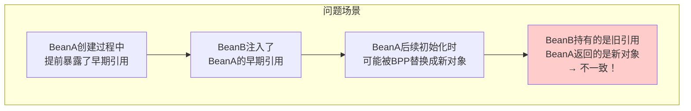
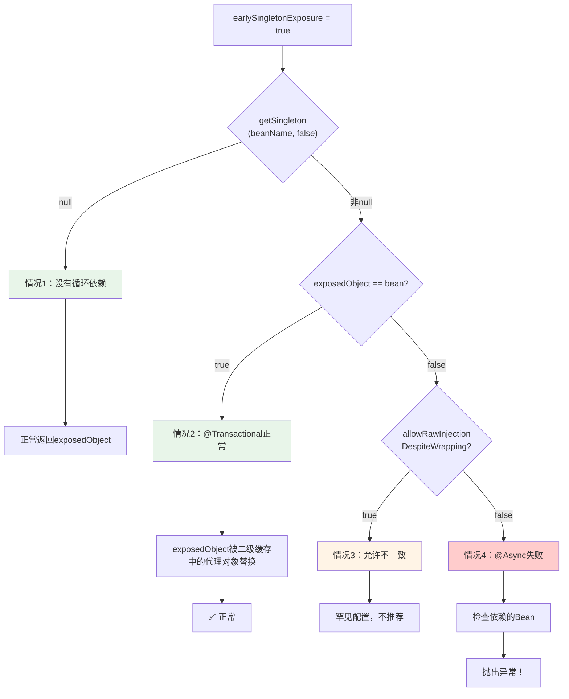
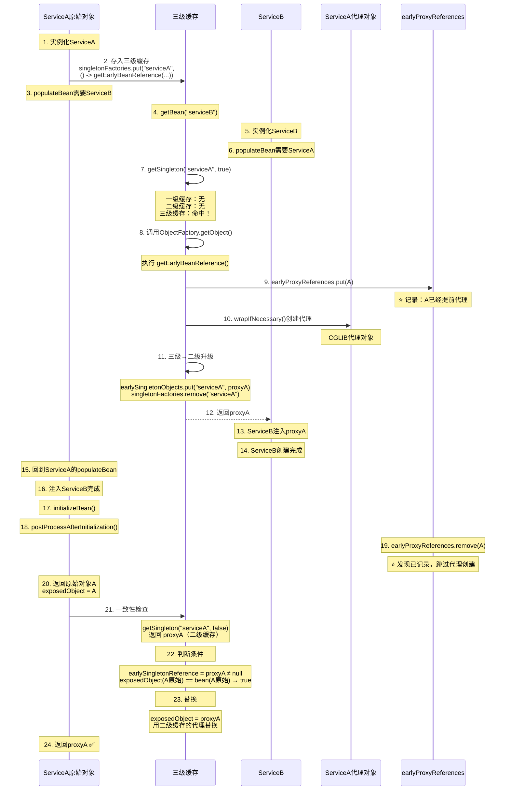
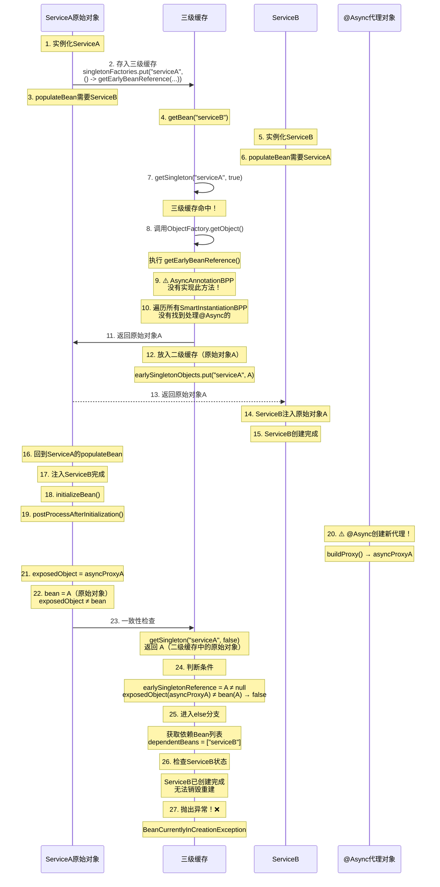
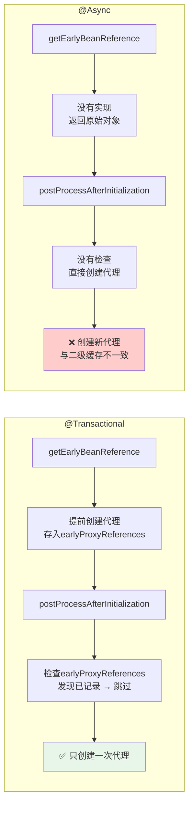
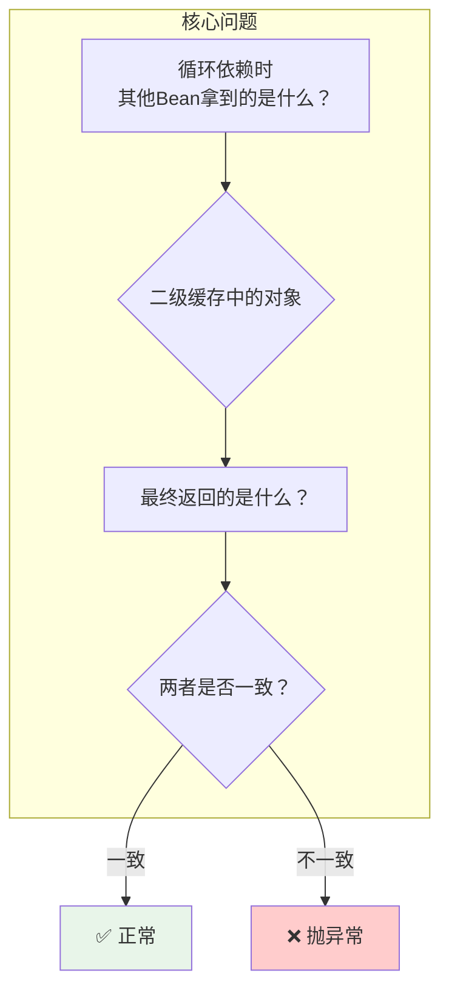

# Spring 循环依赖一致性检查详解

> 深入理解 `doCreateBean()` 中最晦涩的一致性检查逻辑

---

## 一、问题的本质

当Bean在创建过程中被提前暴露给其他Bean使用时，可能会出现**对象引用不一致**的问题。



**核心问题**：
- BeanB通过循环依赖拿到了BeanA的"早期引用"
- BeanA在后续初始化时，可能被BPP替换成新的对象（如代理）
- 如果两者不一致，BeanB持有的就是"过期"的引用

---

## 二、源码位置

```java
// AbstractAutowireCapableBeanFactory.doCreateBean()
// 位于属性注入和初始化之后，是循环依赖的最后一道防线

if (earlySingletonExposure) {
    // allowEarlyReference=false，只查一级和二级缓存
    Object earlySingletonReference = getSingleton(beanName, false);
    
    if (earlySingletonReference != null) {
        if (exposedObject == bean) {
            // 情况1：exposedObject没有被BPP替换
            exposedObject = earlySingletonReference;
        } else if (!this.allowRawInjectionDespiteWrapping) {
            // 情况2：exposedObject被BPP替换了！
            String[] dependentBeans = getDependentBeans(beanName);
            Set<String> actualDependentBeans = new LinkedHashSet<>(dependentBeans.length);
            
            for (String dependentBean : dependentBeans) {
                if (!removeSingletonIfCreatedForTypeCheckOnly(dependentBean)) {
                    actualDependentBeans.add(dependentBean);
                }
            }
            
            if (!actualDependentBeans.isEmpty()) {
                throw new BeanCurrentlyInCreationException(beanName,
                    "Bean with name '" + beanName + "' has been injected into other beans [" +
                    StringUtils.collectionToCommaDelimitedString(actualDependentBeans) +
                    "] in its raw version as part of a circular reference, but has eventually been wrapped...");
            }
        }
    }
}
```

---

## 三、四种情况详解

### 决策流程图



### 四种情况对比表

| 情况 | earlySingletonReference | exposedObject == bean | 结果 | 典型场景 |
|------|------------------------|----------------------|------|---------|
| 情况1 | null | - | 正常返回 | 没有循环依赖 |
| 情况2 | 非null | true | 用早期引用替换 | @Transactional循环依赖 |
| 情况3 | 非null | false | 允许不一致 | 特殊配置 |
| 情况4 | 非null | false | 抛异常 | @Async循环依赖 |

---

## 四、情况1：没有循环依赖（正常）

```java
@Service
public class ServiceA {
    // 没有依赖其他Bean
}
```

### 执行流程

```
1. 实例化ServiceA（得到原始对象）
2. 存入三级缓存 ObjectFactory
3. populateBean（无依赖需要注入）
4. initializeBean（可能创建代理）
5. 一致性检查：
   - getSingleton("serviceA", false) 
   - 返回 null（没有其他Bean引用过ServiceA）
6. 跳过一致性检查，正常返回
```

### 内存状态

```
一级缓存：无（还没放入）
二级缓存：无（没有循环引用）
三级缓存：有 ObjectFactory（但没被调用）

exposedObject：代理对象或原始对象
返回：exposedObject
```

---

## 五、情况2：@Transactional + 循环依赖（正常）

```java
@Service
public class ServiceA {
    @Autowired private ServiceB serviceB;
    
    @Transactional  // 会创建AOP代理
    public void doSomething() {}
}

@Service
public class ServiceB {
    @Autowired private ServiceA serviceA;
}
```

### 完整执行流程



### 关键点分析

**为什么 `exposedObject == bean`？**

```java
// doCreateBean() 中的变量追踪
Object bean = instanceWrapper.getWrappedInstance();  // 原始对象A
Object exposedObject = bean;                          // 初始指向原始对象A

// initializeBean() 后
exposedObject = initializeBean(beanName, exposedObject, mbd);
// AbstractAutoProxyCreator.postProcessAfterInitialization()
// 因为 earlyProxyReferences 中有记录，跳过代理创建
// 返回原始对象A

// 所以 exposedObject 仍然 == bean
```

**为什么最终返回的是代理对象？**

```java
// 一致性检查中
if (exposedObject == bean) {
    exposedObject = earlySingletonReference;  // 用二级缓存的代理替换
}
```

**为什么@Transactional不会创建两次代理？**

```java
// AbstractAutoProxyCreator.java

// 第一次：getEarlyBeanReference() 中
public Object getEarlyBeanReference(Object bean, String beanName) {
    Object cacheKey = getCacheKey(bean.getClass(), beanName);
    this.earlyProxyReferences.put(cacheKey, bean);  // ⭐ 记录
    return wrapIfNecessary(bean, beanName, cacheKey);  // 创建代理
}

// 第二次：postProcessAfterInitialization() 中
public Object postProcessAfterInitialization(Object bean, String beanName) {
    Object cacheKey = getCacheKey(bean.getClass(), beanName);
    if (this.earlyProxyReferences.remove(cacheKey) != bean) {
        return wrapIfNecessary(bean, beanName, cacheKey);  // 创建代理
    }
    return bean;  // ⭐ 已记录，跳过
}
```

### 内存状态总结

```
最终状态：
├── BeanB 持有：proxyA（从二级缓存获取）
├── 一级缓存：proxyA
├── 二级缓存：已清除
├── 三级缓存：已清除
└── 返回：proxyA

✅ BeanB和一级缓存中的是同一个代理对象
```

---

## 六、情况4：@Async + 循环依赖（失败）

```java
@Service
public class ServiceA {
    @Autowired private ServiceB serviceB;
    
    @Async  // ⚠️ 会创建新的代理对象
    public void asyncMethod() {}
}

@Service
public class ServiceB {
    @Autowired private ServiceA serviceA;
}
```

### 完整执行流程



### 关键点分析

**为什么二级缓存中是原始对象？**

```java
// getEarlyBeanReference() 的实现
protected Object getEarlyBeanReference(String beanName, RootBeanDefinition mbd, Object bean) {
    Object exposedObject = bean;
    
    // 遍历所有 SmartInstantiationAwareBeanPostProcessor
    for (SmartInstantiationAwareBeanPostProcessor bp : getBeanPostProcessorCache().smartInstantiationAware) {
        exposedObject = bp.getEarlyBeanReference(exposedObject, beanName);
    }
    return exposedObject;
}

// ⚠️ AsyncAnnotationBeanPostProcessor 没有实现 SmartInstantiationAwareBeanPostProcessor
// ⚠️ 所以不会调用它的方法，返回原始对象
```

**为什么@Async会在postProcessAfterInitialization中创建代理？**

```java
// AsyncAnnotationBeanPostProcessor.java
// 继承 AbstractAdvisingBeanPostProcessor，不是 SmartInstantiationAware

@Override
public Object postProcessAfterInitialization(Object bean, String beanName) {
    if (this.advisor == null || bean instanceof Advised) {
        return bean;
    }
    
    if (canApply(this.advisor, bean.getClass())) {
        // ⚠️ 创建新的代理对象
        // 没有检查是否已经创建过代理
        return buildProxy(bean, beanName, false);
    }
    return bean;
}
```

**为什么一致性检查会失败？**

```
检查条件：
├── earlySingletonReference = 原始对象A（从二级缓存）
├── exposedObject = asyncProxyA（@Async创建的新代理）
├── bean = 原始对象A
│
├── exposedObject ≠ bean  → 进入else分支
├── 检查 dependentBeans = ["serviceB"]
├── ServiceB 已经创建完成
│
└── ❌ 抛出异常
```

### 异常信息

```
Bean with name 'serviceA' has been injected into other beans [serviceB] 
in its raw version as part of a circular reference, but has eventually been wrapped. 
This means that said other beans do not use the final version of the bean.
```

### 内存状态总结

```
失败时的状态：
├── BeanB 持有：原始对象A（从二级缓存获取）
├── exposedObject：asyncProxyA（@Async代理）
├── 一级缓存：无（抛异常了）
├── 二级缓存：原始对象A
└── 三级缓存：已清除

❌ BeanB持有的是原始对象，但最终返回的是@Async代理
❌ 不一致！抛出异常
```

---

## 七、核心对比：@Transactional vs @Async

### 代理创建时机对比



### 关键代码对比

```java
// ═════════════════════════════════════════════════════════
// @Transactional：AbstractAutoProxyCreator
// ═════════════════════════════════════════════════════════

// ✅ 实现了 SmartInstantiationAwareBeanPostProcessor
public abstract class AbstractAutoProxyCreator extends ProxyProcessorSupport
        implements SmartInstantiationAwareBeanPostProcessor, BeanFactoryAware {
    
    // ✅ 提前代理入口
    @Override
    public Object getEarlyBeanReference(Object bean, String beanName) {
        Object cacheKey = getCacheKey(bean.getClass(), beanName);
        this.earlyProxyReferences.put(cacheKey, bean);  // 记录
        return wrapIfNecessary(bean, beanName, cacheKey);  // 创建代理
    }
    
    // ✅ 正常代理入口（有去重）
    @Override
    public Object postProcessAfterInitialization(Object bean, String beanName) {
        if (bean != null) {
            Object cacheKey = getCacheKey(bean.getClass(), beanName);
            if (this.earlyProxyReferences.remove(cacheKey) != bean) {
                return wrapIfNecessary(bean, beanName, cacheKey);  // 创建代理
            }
        }
        return bean;  // 已提前创建，跳过
    }
}

// ═════════════════════════════════════════════════════════
// @Async：AsyncAnnotationBeanPostProcessor
// ═════════════════════════════════════════════════════════

// ❌ 没有实现 SmartInstantiationAwareBeanPostProcessor
public class AsyncAnnotationBeanPostProcessor extends AbstractAdvisingBeanPostProcessor
        implements BeanFactoryAware {
    
    // ❌ 没有实现 getEarlyBeanReference
    
    // ❌ 没有去重检查
    @Override
    public Object postProcessAfterInitialization(Object bean, String beanName) {
        if (this.advisor == null || bean instanceof Advised) {
            return bean;
        }
        
        if (canApply(this.advisor, bean.getClass())) {
            return buildProxy(bean, beanName, false);  // 直接创建
        }
        return bean;
    }
}
```

### 行为差异总结

| 对比项 | @Transactional | @Async |
|--------|---------------|--------|
| BPP类型 | SmartInstantiationAware | 普通BeanPostProcessor |
| getEarlyBeanReference | ✅ 实现 | ❌ 未实现 |
| 循环依赖时返回 | 代理对象 | 原始对象 |
| postProcessAfterInitialization | 检查去重 | 直接创建代理 |
| 最终exposedObject | 原始对象（被替换成代理） | 新的代理对象 |
| exposedObject == bean | true | false |
| 一致性检查 | ✅ 通过 | ❌ 失败 |

---

## 八、解决方案

### 方案1：使用@Lazy延迟注入

```java
@Service
public class ServiceA {
    @Autowired @Lazy private ServiceB serviceB;  // 注入代理
    
    @Async
    public void asyncMethod() {}
}
```

### 方案2：重构代码消除循环依赖

```java
// 引入中间层
@Service
public class ServiceA {
    @Autowired private CommonService commonService;
}

@Service
public class ServiceB {
    @Autowired private CommonService commonService;
}

@Service
public class CommonService {
    // 公共逻辑
}
```

### 方案3：使用事件驱动

```java
@Service
public class ServiceA {
    @Autowired private ApplicationEventPublisher eventPublisher;
    
    @Async
    public void asyncMethod() {
        eventPublisher.publishEvent(new CustomEvent());
    }
}

@Service
public class ServiceB {
    @EventListener
    public void handleEvent(CustomEvent event) {
        // 处理事件
    }
}
```

---

## 九、总结

### 一致性检查的本质



### 一句话总结

> **一致性检查确保：循环依赖时其他Bean注入的对象，与最终返回的对象是同一个。**
> 
> @Transactional 通过 `earlyProxyReferences` 去重机制保证只创建一次代理。
> 
> @Async 没有这个机制，会创建两次不同的代理，导致不一致。

---

## 附录：调试建议

### 断点位置

```java
// 1. 观察早期引用
AbstractAutowireCapableBeanFactory.getEarlyBeanReference()

// 2. 观察代理创建
AbstractAutoProxyCreator.getEarlyBeanReference()
AbstractAutoProxyCreator.postProcessAfterInitialization()

// 3. 观察一致性检查
AbstractAutowireCapableBeanFactory.doCreateBean() 中的一致性检查代码块

// 4. 观察异常抛出
DefaultSingletonBeanRegistry.removeSingletonIfCreatedForTypeCheckOnly()
```

### 观察变量

```java
// 在一致性检查断点处观察：
earlySingletonReference  // 二级缓存中的对象
exposedObject            // initializeBean后的对象
bean                     // 原始对象
dependentBeans           // 依赖这个Bean的所有Bean
```
