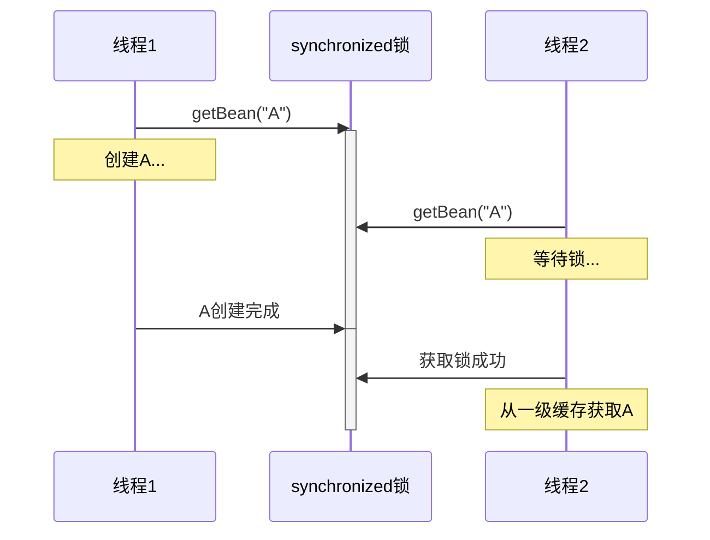
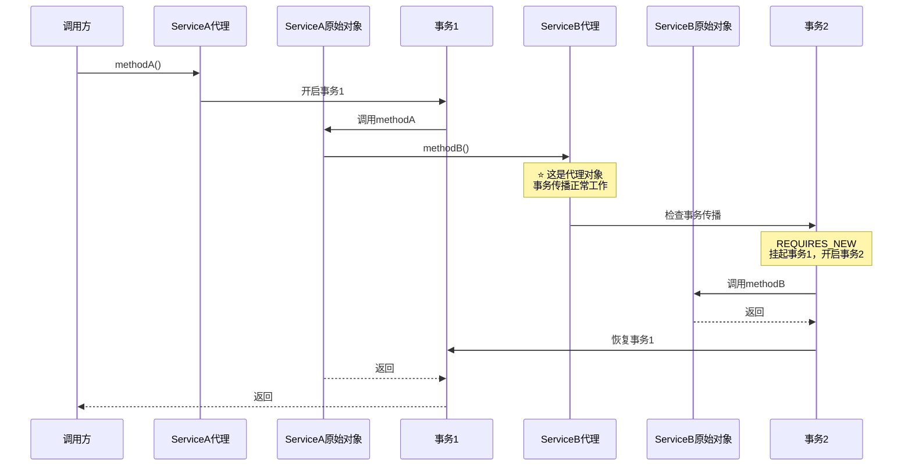
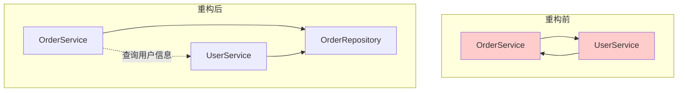
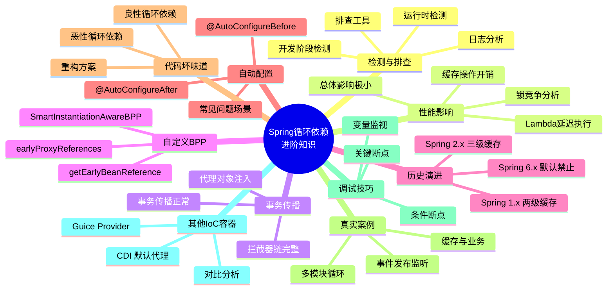

# Spring 循环依赖进阶补充

> 这份文档是《循环依赖源码学习大纲》的进阶补充，覆盖更多深度和广度的知识点。

---

## 一、循环依赖的检测与排查

### 1.1 开发阶段检测

#### 方式1：Spring Boot启动检查

```yaml
# application.yml
spring:
  main:
    allow-circular-references: false  # Spring Boot 3.x默认
    log-startup-info: true
```

**效果**：如果有循环依赖，启动时直接报错。

#### 方式2：构造器注入

```java
// ✅ 推荐：编译时就能发现循环依赖
@Service
public class ServiceA {
    private final ServiceB serviceB;
    
    public ServiceA(ServiceB serviceB) {  // 构造器注入
        this.serviceB = serviceB;
    }
}

// ❌ 不推荐：运行时才发现循环依赖
@Service
public class ServiceA {
    @Autowired
    private ServiceB serviceB;  // 字段注入
}
```

#### 方式3：使用Spring Context Indexer

```xml
<!-- pom.xml -->
<dependency>
    <groupId>org.springframework</groupId>
    <artifactId>spring-context-indexer</artifactId>
    <optional>true</optional>
</dependency>
```

**原理**：编译时生成`META-INF/spring.components`，加速启动并帮助发现问题。

### 1.2 运行时检测

#### 方式1：日志级别调整

```yaml
# application.yml
logging:
  level:
    org.springframework.beans.factory.support: DEBUG
    org.springframework.beans.factory: TRACE
```

**效果**：可以看到Bean创建的详细过程。

```
DEBUG o.s.b.f.s.DefaultSingletonBeanRegistry : Creating shared instance of singleton bean 'serviceA'
DEBUG o.s.b.f.s.DefaultSingletonBeanRegistry : Eagerly caching bean 'serviceA' to allow for resolving potential circular references
DEBUG o.s.b.f.s.DefaultSingletonBeanRegistry : Creating shared instance of singleton bean 'serviceB'
```

#### 方式2：Actuator端点

```yaml
# application.yml
management:
  endpoints:
    web:
      exposure:
        include: beans,conditions
```

访问 `/actuator/beans` 可以看到所有Bean的依赖关系。

### 1.3 排查工具

#### 工具1：Spring Bean Dependency Graph

```java
// 代码方式获取依赖关系
@Component
public class DependencyAnalyzer implements ApplicationListener<ContextRefreshedEvent> {
    
    @Override
    public void onApplicationEvent(ContextRefreshedEvent event) {
        ConfigurableListableBeanFactory beanFactory = 
            (ConfigurableListableBeanFactory) event.getApplicationContext().getAutowireCapableBeanFactory();
        
        String[] beanNames = beanFactory.getBeanDefinitionNames();
        for (String beanName : beanNames) {
            BeanDefinition bd = beanFactory.getBeanDefinition(beanName);
            String[] dependsOn = bd.getDependsOn();
            if (dependsOn != null && dependsOn.length > 0) {
                System.out.println(beanName + " depends on: " + Arrays.toString(dependsOn));
            }
        }
    }
}
```

#### 工具2：IDEA的Bean依赖图

**使用方式**：
1. 在Spring配置文件或注解类上右键
2. 选择 `Diagrams` → `Show Diagram`
3. 可以看到Bean的依赖关系图

### 1.4 循环依赖警告机制

Spring会在日志中输出警告：

```
WARNING: An illegal reflective access operation has occurred
WARNING: Illegal reflective access by org.springframework.util.ReflectionUtils...
```

**Spring 6 / Spring Boot 3.x**：
- 默认禁止循环依赖
- 必须显式开启 `allow-circular-references=true`

---

## 二、循环依赖的性能影响

### 2.1 三级缓存操作开销

```java
// 性能测试代码
@Test
public void testCachePerformance() {
    Map<String, Object> singletonObjects = new ConcurrentHashMap<>(256);
    Map<String, Object> earlySingletonObjects = new ConcurrentHashMap<>(16);
    Map<String, ObjectFactory<?>> singletonFactories = new HashMap<>(16);
    
    // 测试一级缓存读取
    long start = System.nanoTime();
    for (int i = 0; i < 1_000_000; i++) {
        singletonObjects.get("testBean");
    }
    long end = System.nanoTime();
    System.out.println("一级缓存读取: " + (end - start) / 1_000_000.0 + " ms");
    
    // 结果：约 5-10 ms / 百万次
}
```

**结论**：
- `ConcurrentHashMap.get()`: O(1)，极快
- 三级缓存查找：最多3次Map操作，可忽略不计

### 2.2 锁竞争分析

```java
// 创建Bean时的锁
synchronized (this.singletonObjects) {
    // 创建逻辑
}
```

**锁竞争情况**：



**关键点**：
- 锁只在**创建时**竞争
- 创建完成后，从缓存读取**不需要锁**
- 实际项目中，并发创建同一个Bean的概率极低

### 2.3 Lambda延迟执行的开销

```java
// 三级缓存存入的是Lambda
addSingletonFactory(beanName, () -> getEarlyBeanReference(beanName, mbd, bean));

// Lambda对象的创建
// 开销：约 10-50 纳秒（可忽略）

// Lambda的执行（只有在循环依赖时才执行）
// 开销：方法调用 + 可能的代理创建
```

**结论**：
- 如果**没有循环依赖**，Lambda不会执行，几乎没有开销
- 如果**有循环依赖**，执行一次代理创建，这是必要的

### 2.4 性能对比表

| 操作 | 时间复杂度 | 实际耗时 | 发生频率 |
|------|-----------|---------|---------|
| 一级缓存读取 | O(1) | ~10ns | 极高 |
| 二级缓存读取 | O(1) | ~10ns | 低（仅循环依赖） |
| 三级缓存读取 | O(1) | ~10ns | 低（仅循环依赖） |
| Lambda创建 | O(1) | ~50ns | 每个Bean一次 |
| Lambda执行 | O(n) | ~1ms | 仅循环依赖 |
| synchronized锁 | - | ~100ns | 极低 |

**总结**：三级缓存的性能开销可以忽略不计。

---

## 三、循环依赖与事务传播的关系

### 3.1 问题场景

```java
@Service
public class ServiceA {
    @Autowired private ServiceB serviceB;
    
    @Transactional
    public void methodA() {
        serviceB.methodB();  // 调用B的方法
    }
}

@Service
public class ServiceB {
    @Autowired private ServiceA serviceA;  // 循环依赖
    
    @Transactional(propagation = Propagation.REQUIRES_NEW)
    public void methodB() {
        // REQUIRES_NEW：开启新事务
    }
}
```

### 3.2 关键问题

**问题**：ServiceA通过循环依赖注入的代理对象，事务传播是否正常？

**答案**：**正常！**

### 3.3 原因分析



**关键点**：
- 循环依赖注入的是**代理对象**
- 代理对象内部持有**原始对象的引用**
- 调用代理对象的方法时，会触发**事务拦截器**
- 事务传播行为**完全正常**

### 3.4 代理对象结构

```java
// CGLIB代理对象的内部结构
ServiceA$$EnhancerBySpringCGLIB$$xxx {
    
    // 目标对象引用
    private Object target;  // → ServiceA原始对象
    
    // 拦截器链
    private List<Advice> advisorChain = [
        TransactionInterceptor,  // 事务拦截器
        // ...
    ];
    
    // 方法调用
    public void methodA() {
        // 1. 执行拦截器链
        // 2. TransactionInterceptor开启事务
        // 3. 调用 target.methodA()
        // 4. 提交/回滚事务
    }
}
```

### 3.5 验证代码

```java
@SpringBootTest
public class CircularDependencyTransactionTest {
    
    @Autowired
    private ServiceA serviceA;
    
    @Test
    void testTransactionPropagation() {
        // 验证注入的是代理对象
        assertTrue(AopUtils.isAopProxy(serviceA));
        
        // 验证事务传播正常
        serviceA.methodA();
        
        // 验证两个事务都执行了
        // ...
    }
}
```

---

## 四、自定义SmartInstantiationAwareBeanPostProcessor

### 4.1 接口定义

```java
public interface SmartInstantiationAwareBeanPostProcessor extends InstantiationAwareBeanPostProcessor {
    
    // ⭐ 提前暴露Bean引用（循环依赖时调用）
    default Object getEarlyBeanReference(Object bean, String beanName) {
        return bean;
    }
    
    // 预测Bean的类型
    default Class<?> predictBeanType(Class<?> beanClass, String beanName) {
        return null;
    }
    
    // 确定候选构造器
    default Constructor<?>[] determineCandidateConstructors(Class<?> beanClass, String beanName) {
        return null;
    }
    
    // 获取早期访问的Bean引用
    default Object getEarlyBeanReference(Object bean, String beanName) {
        return bean;
    }
}
```

### 4.2 自定义实现示例

```java
/**
 * 自定义BPP：在循环依赖时创建自定义代理
 */
@Component
public class CustomProxyBPP implements SmartInstantiationAwareBeanPostProcessor {
    
    // ⭐ 记录已经提前代理的Bean
    private final Map<Object, Object> earlyProxyReferences = new ConcurrentHashMap<>(64);
    
    @Override
    public Object getEarlyBeanReference(Object bean, String beanName) {
        // 判断是否需要创建代理
        if (needsProxy(bean, beanName)) {
            Object cacheKey = getCacheKey(bean, beanName);
            earlyProxyReferences.put(cacheKey, bean);
            return createProxy(bean, beanName);
        }
        return bean;
    }
    
    @Override
    public Object postProcessAfterInitialization(Object bean, String beanName) {
        if (needsProxy(bean, beanName)) {
            Object cacheKey = getCacheKey(bean, beanName);
            if (earlyProxyReferences.remove(cacheKey) != bean) {
                // 没有提前代理 → 创建代理
                return createProxy(bean, beanName);
            }
            // 已经提前代理 → 返回原始bean
        }
        return bean;
    }
    
    private boolean needsProxy(Object bean, String beanName) {
        // 判断逻辑：如是否有特定注解
        return bean.getClass().isAnnotationPresent(CustomProxy.class);
    }
    
    private Object createProxy(Object bean, String beanName) {
        // 创建代理对象
        ProxyFactory proxyFactory = new ProxyFactory(bean);
        proxyFactory.addAdvice(new CustomInterceptor());
        return proxyFactory.getProxy();
    }
    
    private Object getCacheKey(Object bean, String beanName) {
        return bean.getClass() + "_" + beanName;
    }
}
```

### 4.3 应用场景

| 场景 | 实现类 | 作用 |
|------|--------|------|
| AOP代理 | `AbstractAutoProxyCreator` | 创建AOP代理 |
| 事务代理 | `InfrastructureAdvisorAutoProxyCreator` | 创建事务代理 |
| 自定义代理 | 自定义BPP | 创建自定义代理 |

---

## 五、循环依赖的历史演进

### 5.1 Spring版本变化

| Spring版本 | 循环依赖处理 | 变化 |
|-----------|-------------|------|
| **Spring 1.x** | 两级缓存 | 只有一级和二级缓存 |
| **Spring 2.x** | 三级缓存 | 引入三级缓存，支持AOP |
| **Spring 3.x** | 完善 | 增加SmartInstantiationAwareBPP |
| **Spring 4.x** | 优化 | 性能优化，并发支持 |
| **Spring 5.x** | 默认允许 | `allowCircularReferences=true` |
| **Spring 6.x** | 默认禁止 | `allowCircularReferences=false` |

### 5.2 为什么从两级缓存改为三级缓存？

#### Spring 1.x/2.x初期：两级缓存的问题

```
问题场景：
1. Bean A 有 @Transactional
2. A 和 B 循环依赖

两级缓存方案：
├── 一级缓存：成品Bean
└── 二级缓存：半成品Bean

执行流程：
1. 实例化A
2. 立即创建AOP代理 → 放入二级缓存
3. populateBean(A) → 需要B
4. 创建B → 需要A
5. 从二级缓存获取代理A
6. B注入代理A
7. B创建完成
8. A注入B
9. A创建完成

问题：
- 所有Bean都要提前创建代理（即使没有循环依赖）
- 破坏了Spring的生命周期设计
- 代理对象的target可能还没完成属性注入
```

#### Spring 2.x后期：三级缓存的解决方案

```
三级缓存方案：
├── 一级缓存：成品Bean
├── 二级缓存：半成品Bean（可能被代理）
└── 三级缓存：ObjectFactory（延迟创建代理）

执行流程：
1. 实例化A
2. 放入三级缓存：ObjectFactory
3. populateBean(A) → 需要B
4. 创建B → 需要A
5. 从三级缓存获取 → 调用ObjectFactory.getObject()
6. 此时才创建代理 → 放入二级缓存
7. B注入代理A
8. B创建完成
9. A注入B
10. initializeBean(A) → 检查earlyProxyReferences，跳过代理
11. A创建完成

优势：
- 只在需要时才创建代理
- 保持Bean生命周期设计
- 代理对象完整性有保证
```

### 5.3 Spring Boot 3.x的重大变化

```java
// Spring Boot 2.x
@SpringBootApplication
public class Application {
    public static void main(String[] args) {
        SpringApplication.run(Application.class, args);
        // 循环依赖：正常工作（默认允许）
    }
}

// Spring Boot 3.x
@SpringBootApplication
public class Application {
    public static void main(String[] args) {
        SpringApplication.run(Application.class, args);
        // 循环依赖：启动失败！（默认禁止）
    }
}
```

**官方解释**：

> Circular references are prohibited by default. 
> If your application uses circular references, you must explicitly allow them.
> 
> 循环引用默认被禁止。如果你的应用使用了循环引用，必须显式允许。

**原因**：
1. 循环依赖是代码坏味道
2. 增加了代码复杂度
3. 可能导致难以调试的问题
4. 违反了"最小惊讶原则"

---

## 六、Spring Boot自动配置中的循环依赖

### 6.1 常见问题场景

```java
// 问题1：DataSource和JdbcTemplate
@Configuration
class DataSourceConfig {
    @Bean
    public DataSource dataSource() {
        return new HikariDataSource();
    }
    
    @Bean
    public JdbcTemplate jdbcTemplate(DataSource dataSource) {
        return new JdbcTemplate(dataSource);
    }
}

// 问题2：Repository和Service
@Repository
class UserRepository {
    @Autowired private UserService userService;  // 循环依赖
}

@Service
class UserService {
    @Autowired private UserRepository userRepository;
}
```

### 6.2 自动配置的循环依赖检测

Spring Boot使用`Conditions`来检测自动配置的循环依赖：

```java
@AutoConfigureAfter(DataSourceAutoConfiguration.class)
@AutoConfigureBefore(JdbcTemplateAutoConfiguration.class)
public class MyAutoConfiguration {
    // 通过 @AutoConfigureAfter 和 @AutoConfigureBefore
    // 控制自动配置的顺序，避免循环依赖
}
```

### 6.3 解决方案

```java
// 方案1：使用@Lazy
@Service
public class UserService {
    @Autowired @Lazy
    private UserRepository userRepository;
}

// 方案2：使用setter注入（不推荐）
@Service
public class UserService {
    private UserRepository userRepository;
    
    @Autowired
    public void setUserRepository(UserRepository userRepository) {
        this.userRepository = userRepository;
    }
}

// 方案3：重构，引入中间层（推荐）
@Service
public class UserService {
    @Autowired private UserRepository userRepository;
}

@Service
public class UserRepository {
    // 移除对UserService的依赖
}
```

---

## 七、循环依赖的代码坏味道分析

### 7.1 良性循环依赖

```java
// 场景：父子关系的双向引用
@Entity
public class Department {
    @OneToMany(mappedBy = "department")
    private List<Employee> employees;
    
    public void addEmployee(Employee employee) {
        employees.add(employee);
        employee.setDepartment(this);
    }
}

@Entity
public class Employee {
    @ManyToOne
    private Department department;
}

// 这种循环依赖是合理的：
// 1. 符合业务模型
// 2. 职责清晰
// 3. 不影响可维护性
```

### 7.2 恶性循环依赖

```java
// 场景：Service层互相调用
@Service
public class OrderService {
    @Autowired private UserService userService;
    @Autowired private ProductService productService;
    @Autowired private PaymentService paymentService;
    
    public void createOrder(Order order) {
        userService.validateUser(order.getUserId());
        productService.checkStock(order.getProductId());
        paymentService.processPayment(order.getPayment());
        // ...
    }
}

@Service
public class UserService {
    @Autowired private OrderService orderService;  // ⚠️ 循环依赖
    
    public void validateUser(Long userId) {
        // 验证用户
    }
    
    public Order getUserLatestOrder(Long userId) {
        return orderService.getLatestOrder(userId);
    }
}

// 这种循环依赖是恶性的：
// 1. 违反单一职责原则
// 2. 增加耦合度
// 3. 难以测试和维护
// 4. 应该重构
```

### 7.3 重构方案



**重构步骤**：

1. **识别职责**：分析每个Service的核心职责
2. **提取中间层**：创建Repository或Helper
3. **使用事件驱动**：通过事件解耦
4. **应用DDD**：重新设计领域模型

---

## 八、真实项目案例分析

### 8.1 案例1：多模块项目的循环依赖

```java
// 模块结构
// ├── user-module
// │   └── UserService
// ├── order-module
// │   └── OrderService
// └── payment-module
//     └── PaymentService

// 问题：三个模块循环依赖
@Service
public class UserService {
    @Autowired private OrderService orderService;
}

@Service
public class OrderService {
    @Autowired private PaymentService paymentService;
}

@Service  
public class PaymentService {
    @Autowired private UserService userService;  // 循环！
}
```

**解决方案**：引入公共模块

```
// 重构后的模块结构
// ├── common-module
// │   └── UserRepository
// ├── user-module
// │   └── UserService
// ├── order-module
// │   └── OrderService
// └── payment-module
//     └── PaymentService
```

### 8.2 案例2：缓存与业务逻辑的循环依赖

```java
// 问题场景
@Service
public class UserService {
    @Autowired private UserCacheService cacheService;
    
    public User getUser(Long id) {
        User cached = cacheService.get(id);
        if (cached != null) return cached;
        
        User user = userRepository.findById(id);
        cacheService.put(id, user);
        return user;
    }
}

@Service
public class UserCacheService {
    @Autowired private UserService userService;  // 循环依赖！
    
    public void refreshCache(Long userId) {
        User user = userService.getUser(userId);
        put(userId, user);
    }
}
```

**解决方案**：分离职责

```java
@Service
public class UserService {
    @Autowired private UserRepository userRepository;
    
    public User getUser(Long id) {
        return userRepository.findById(id);
    }
}

@Service
public class UserCacheService {
    @Autowired private UserRepository userRepository;
    
    public User getCachedUser(Long id) {
        User cached = get(id);
        if (cached != null) return cached;
        
        User user = userRepository.findById(id);
        put(id, user);
        return user;
    }
}
```

### 8.3 案例3：事件发布与监听的循环依赖

```java
// 问题场景
@Service
public class OrderService {
    @Autowired private ApplicationEventPublisher eventPublisher;
    @Autowired private NotificationService notificationService;
    
    public void createOrder(Order order) {
        // 创建订单
        eventPublisher.publishEvent(new OrderCreatedEvent(order));
    }
}

@Service
public class NotificationService {
    @Autowired private OrderService orderService;  // 循环依赖！
    
    @EventListener
    public void onOrderCreated(OrderCreatedEvent event) {
        // 发送通知
    }
    
    public Order getLatestOrder(Long userId) {
        return orderService.getLatestOrder(userId);
    }
}
```

**解决方案**：职责分离

```java
@Service
public class OrderService {
    @Autowired private ApplicationEventPublisher eventPublisher;
    
    public void createOrder(Order order) {
        // 创建订单
        eventPublisher.publishEvent(new OrderCreatedEvent(order));
    }
    
    public Order getLatestOrder(Long userId) {
        // ...
    }
}

@Service
public class NotificationService {
    @EventListener
    public void onOrderCreated(OrderCreatedEvent event) {
        // 发送通知，不需要依赖OrderService
    }
}

@Service
public class OrderQueryService {  // 新增查询服务
    @Autowired private OrderRepository orderRepository;
    
    public Order getLatestOrder(Long userId) {
        // ...
    }
}
```

---

## 九、源码调试技巧

### 9.1 关键断点位置

```java
// 1. 缓存查找
DefaultSingletonBeanRegistry.getSingleton(String beanName, boolean allowEarlyReference)

// 2. 三级缓存存入
DefaultSingletonBeanRegistry.addSingletonFactory(String beanName, ObjectFactory<?> singletonFactory)

// 3. Bean创建入口
AbstractBeanFactory.doGetBean()

// 4. Bean创建主流程
AbstractAutowireCapableBeanFactory.doCreateBean()

// 5. 提前代理创建
AbstractAutowireCapableBeanFactory.getEarlyBeanReference()

// 6. AOP代理创建
AbstractAutoProxyCreator.wrapIfNecessary()

// 7. 一致性检查
AbstractAutowireCapableBeanFactory.doCreateBean() 的 earlySingletonExposure 检查块
```

### 9.2 IDEA调试技巧

#### 条件断点

```java
// 在 getSingleton 方法设置条件断点
// 条件：beanName.equals("serviceA")
// 只在创建 serviceA 时暂停
```

#### 表达式求值

```java
// 在断点处按 Alt+F8，可以执行表达式
// 查看缓存状态
this.singletonObjects
this.earlySingletonObjects
this.singletonFactories
this.singletonsCurrentlyInCreation
```

#### 变量监视

```java
// 添加以下变量到监视窗口
beanName
singletonObjects.size()
earlySingletonObjects.size()
singletonFactories.size()
singletonsCurrentlyInCreation
```

### 9.3 调试流程建议

```
第1步：创建断点组
├── 断点1：getSingleton(String, boolean)
├── 断点2：addSingletonFactory()
└── 断点3：addSingleton()

第2步：启动调试
└── 启动应用，断点会依次触发

第3步：观察缓存变化
├── 一级缓存：singletonObjects
├── 二级缓存：earlySingletonObjects
└── 三级缓存：singletonFactories

第4步：记录调用栈
└── 使用IDEA的调用栈窗口，记录完整的调用链
```

---

## 十、其他IoC容器的循环依赖处理

### 10.1 Google Guice

```java
// Guice 不支持循环依赖！
// 编译时就会报错

@Module
public class MyModule {
    @Provides
    public ServiceA serviceA(ServiceB serviceB) {
        return new ServiceA(serviceB);
    }
    
    @Provides
    public ServiceB serviceB(ServiceA serviceA) {
        return new ServiceB(serviceA);  // ❌ 编译错误
    }
}

// 解决方案：使用 Provider 延迟获取
@Provides
public ServiceB serviceB(Provider<ServiceA> serviceProvider) {
    return new ServiceB(() -> serviceProvider.get());  // ✅ 延迟获取
}
```

### 10.2 CDI (Java EE / Jakarta EE)

```java
// CDI 支持循环依赖（通过代理）
@ApplicationScoped
public class ServiceA {
    @Inject
    private ServiceB serviceB;  // 注入的是代理
}

@ApplicationScoped
public class ServiceB {
    @Inject
    private ServiceA serviceA;  // 注入的是代理
}

// 原理：CDI 默认为所有 Bean 创建代理
// 类似于 Spring 的三级缓存 + @Lazy 的组合
```

### 10.3 对比总结

| 特性 | Spring | Guice | CDI |
|------|--------|-------|-----|
| 循环依赖支持 | ✅ 支持（三级缓存） | ❌ 不支持 | ✅ 支持（代理） |
| 默认行为 | Spring 5: 允许<br/>Spring 6: 禁止 | 禁止 | 允许 |
| 解决方案 | 三级缓存 | Provider | 默认代理 |
| 性能影响 | 极小 | 无 | 较大（所有Bean都代理） |
| 设计理念 | 兼容性优先 | 严格依赖 | 便捷性优先 |

---

## 十一、总结

### 11.1 知识全景图



### 11.2 最佳实践清单

| # | 实践 | 原因 |
|---|------|------|
| 1 | 优先使用构造器注入 | 编译时发现问题 |
| 2 | 避免恶性循环依赖 | 提高代码质量 |
| 3 | 使用事件驱动解耦 | 降低耦合度 |
| 4 | 引入中间层打破循环 | 单一职责原则 |
| 5 | Spring Boot 3.x显式配置 | 兼容性考虑 |
| 6 | 不要过度依赖三级缓存 | 理解原理，合理使用 |

### 11.3 面试进阶问题

**Q1：Spring的三级缓存性能开销有多大？**

**Q2：为什么Spring从两级缓存改为三级缓存？**

**Q3：循环依赖会影响事务传播吗？为什么？**

**Q4：如何实现自定义的SmartInstantiationAwareBeanPostProcessor？**

**Q5：Spring Boot 3.x为什么默认禁止循环依赖？你的看法？**

**Q6：Guice为什么不支持循环依赖？它的设计理念是什么？**

**Q7：如何在一个大型项目中排查循环依赖问题？**

**Q8：循环依赖一定是代码坏味道吗？什么情况下是合理的？**
