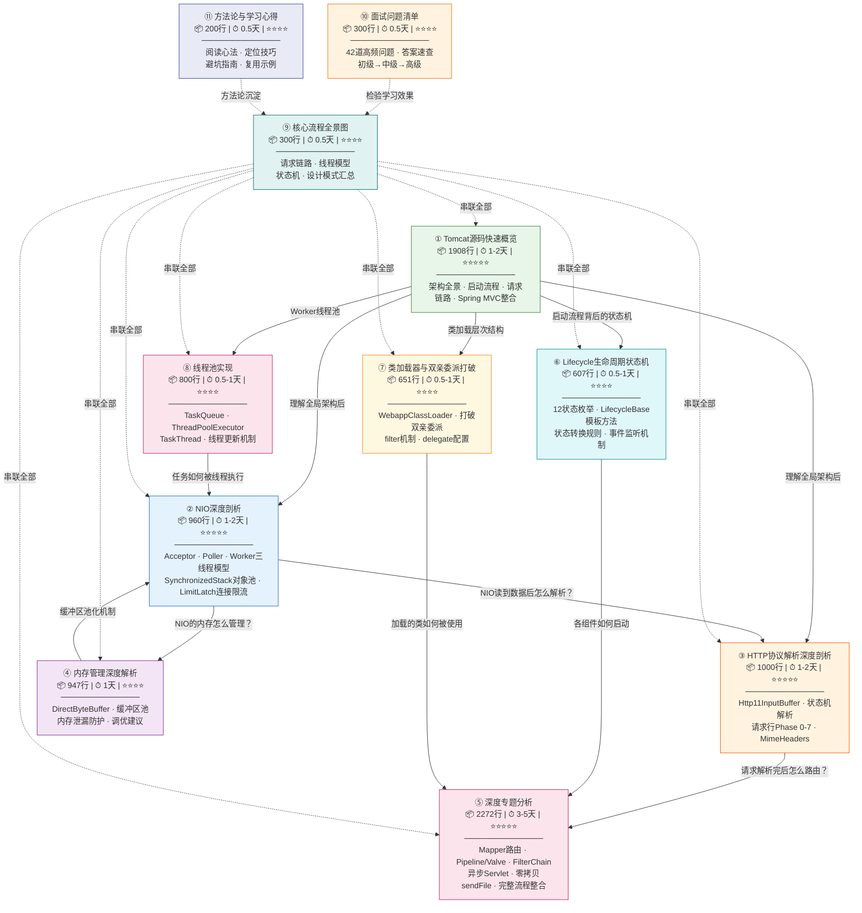
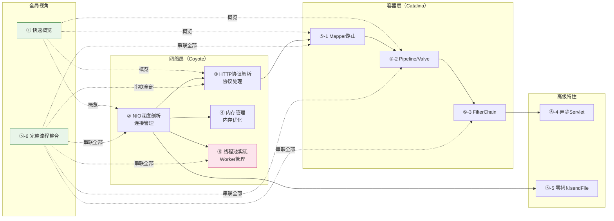

# 📚 Tomcat 8.5 源码深度分析 — 阅读指南

> 📌 基于 **Tomcat 8.5.x** 源码
> 📁 本地源码路径：`/data/workspace/tomcat/`
> 📖 共 **11 篇文档**，总计约 **12,000+ 行**

---

## 一、文档全景总览

本系列文档从 Tomcat NIO 网络层出发，逐层深入协议解析、内存管理、路由匹配、容器处理等核心机制，覆盖了 Tomcat 请求处理的**完整链路**。

### 1.1 知识地图



### 1.2 文档定位说明

| 文档 | 定位 | 适合场景 |
|------|------|---------|
| ① 快速概览 | **入门地图** — 覆盖 Tomcat 全局架构、启动流程、请求链路、核心组件、Spring MVC 整合 | 初次学习，快速建立全局视角 |
| ②③④ 深度剖析 | **深入专题** — 每篇聚焦一个核心子系统，源码级精读 | 想深入某个子系统的底层实现 |
| ⑤ 深度专题 | **进阶专题** — 6个深度主题，覆盖路由、责任链、Filter、异步、零拷贝等 | 理解容器层核心机制和高级特性 |

---

## 二、推荐阅读顺序

### 2.1 🏆 完整学习路径（推荐，约 7-12 天）

按以下顺序依次阅读，每篇都建立在前一篇的基础之上：

| 序号 | 文档名称 | 核心内容 | 预估时间 | 前置要求 |
|:---:|---------|---------|:-------:|---------|
| ① | **Tomcat源码大全（快速概览）** | 架构全景图、Server→Connector→Engine 启动链、8 阶段请求处理流程、核心组件职责、Spring MVC 整合 | 1-2 天 | 了解 Java NIO（Channel、Selector、ByteBuffer 的概念） |
| ② | **NIO深度剖析** | NioEndpoint 三线程模型、Acceptor 阻塞接受、Poller 事件轮询、SynchronizedStack 对象池、LimitLatch 连接限流 | 1-2 天 | ✅ 已读 ① |
| ③ | **HTTP协议解析深度剖析** | Http11InputBuffer 缓冲区管理、parseRequestLine 7 阶段状态机、MimeHeaders 请求头解析、Http11Processor 主循环 | 1-2 天 | ✅ 已读 ①② |
| ④ | **内存管理深度解析** | DirectByteBuffer 分配原理（JDK）、NioEndpoint 三种对象池、Http11InputBuffer 直接内存读取、泄漏防护与调优 | 1 天 | ✅ 已读 ②③ |
| ⑤ | **深度专题分析** | Mapper 三级路由匹配、Pipeline/Valve 四层责任链、FilterChain 洋葱模型、异步 Servlet 13 状态机、零拷贝 sendFile、完整流程整合 | 3-5 天 | ✅ 已读 ①②③ |
|| ⑥ | **Lifecycle 生命周期状态机** | LifecycleState 12 状态、LifecycleBase 模板方法、状态转换规则、事件监听机制、与启动流程的关系 | 0.5-1 天 | ✅ 已读 ① |
|| ⑦ | **类加载器与双亲委派打破** | Tomcat 类加载器层次、WebappClassLoaderBase、loadClass 加载流程、filter 机制、delegate 配置、类隔离原理 | 0.5-1 天 | ✅ 已读 ① |
|| ⑧ | **线程池实现** | TaskQueue offer() 改造、ThreadPoolExecutor 扩展、TaskThread 创建时间、线程更新机制、与 JDK 线程池对比 | 0.5-1 天 | ✅ 已读 ①② |
||| ⑨ | **核心流程全景图** | 请求链路串联、线程模型、状态机、设计模式汇总 | 0.5 天 | 全部 ⑧ |
||| ⑩ | **面试问题清单** | 42 道高频问题、答案速查表、初级→中级→高级 | 0.5 天 | 全部 ⑧ |
||| ⑪ | **方法论与学习心得** | 阅读心法、定位技巧、避坑指南、复用示例 | 0.5 天 | 全部 ⑧ |

### 2.2 ⚡ 快速路径：面试突击（约 3-4 天）

```
必读（第 1-2 天）：
  ① Tomcat源码大全（快速概览）  → 重点看：架构图 + 请求处理流程 + 核心组件职责
  ② NIO深度剖析  → 重点看：三线程模型 + 对象池 + 连接限流

重点读（第 3 天）：
  ⑤ 深度专题分析  → 重点看：Mapper路由 + Pipeline/Valve + FilterChain

补充（第 4 天）：
  ③ HTTP协议解析深度剖析  → 重点看：状态机设计思想
  ④ 内存管理深度解析  → 重点看：为什么用直接内存 + 池化设计
```

### 2.3 🎯 按兴趣点跳读

| 你想了解的问题 | 直接阅读 | 建议先看 |
|--------------|---------|---------|
| "Tomcat 整体架构是什么样的？" | ① 快速概览 | 可直接读 |
| "Acceptor/Poller/Worker 怎么协作？" | ② NIO深度剖析 | ① |
| "HTTP 请求行是怎么逐字节解析的？" | ③ HTTP协议解析 | ②（理解数据从哪来） |
| "Tomcat 为什么用直接内存？怎么池化？" | ④ 内存管理 | ②（理解对象池背景） |
| "请求 URL 怎么匹配到具体的 Servlet？" | ⑤ Mapper路由章节 | ① |
| "Pipeline/Valve 责任链怎么工作？" | ⑤ Pipeline/Valve章节 | ① |
| "Filter 链是怎么递归调用的？" | ⑤ FilterChain章节 | ① |
| "异步 Servlet 的状态机有多少个状态？" | ⑤ 异步Servlet章节 | ①② |
| "sendFile 零拷贝怎么实现？" | ⑤ 零拷贝sendFile章节 | ② |
| "从 TCP 连接到 Servlet 执行的完整调用栈？" | ⑤ 完整流程整合章节 | 建议全读 |
| "Tomcat 线程池与 JDK 线程池有什么区别？" | ⑧ 线程池实现 | ①② |
| "为什么 Tomcat 的 maxThreads 能真正生效？" | ⑧ 线程池实现 | ①② |
| "想一张图看懂 Tomcat 完整流程？" | ⑨ 核心流程全景图 | 建议先读 ①②③⑤ |
| "想验证自己学到了多少？" | ⑩ 面试问题清单 | 全部 ⑧ |
| "想把方法论复用到其他框架？" | ⑪ 方法论与学习心得 | 全部 ⑧ |

---

## 三、各文档详细信息

### ① Tomcat源码大全（快速概览）

| 属性 | 值 |
|-----|-----|
| **文件名** | `Tomcat源码大全.md` |
| **文件大小** | 约 1908 行 |
| **难度** | ⭐⭐⭐⭐ |
| **预估时间** | 1-2 天 |
| **前置知识** | Java NIO 基础概念、Servlet 规范基础 |

**章节概览**：
- 第一部分：架构概览（整体架构图 + 核心组件职责表）
- 第二部分：启动流程（Bootstrap → Server → Connector → NioEndpoint 的完整启动链）
- 第三部分：请求处理流程（Acceptor → Poller → Processor → Adapter → Pipeline → Servlet 的 8 阶段流程）
- 第四部分：核心组件详解（NioEndpoint 数据结构、Mapper、Request、Session、类加载器）
- 第五部分：Spring MVC 整合（容器关系、DispatcherServlet 初始化与处理）
- 第六部分：高级特性（异步 Servlet、WebSocket、零拷贝、性能配置）
- 第七部分：深度源码剖析（Lifecycle 状态机、线程池、Session 持久化、内存泄漏防护）
- 附录：设计模式总结（7 种设计模式在 Tomcat 中的应用）

**核心价值**：整套文档的**入门地图**，快速建立 Tomcat 架构全景认知，了解各组件的角色和协作关系。

---

### ② Tomcat NIO 深度剖析

| 属性 | 值 |
|-----|-----|
| **文件名** | `Tomcat源码_NIO深度剖析.md` |
| **文件大小** | 约 960 行 |
| **难度** | ⭐⭐⭐⭐⭐ |
| **预估时间** | 1-2 天 |
| **前置知识** | ① 快速概览、Java NIO（Channel/Selector/ByteBuffer） |

**章节概览**：
- 一、整体架构与线程模型（1 Acceptor + 1 Poller + N Worker）
- 二、NioEndpoint 启动流程（bind + startInternal 五步启动）
- 三、Acceptor 线程（限流等待 → accept → 注册到 Poller）
- 四、Poller 线程（events → select → processKey → timeout 主循环）
- 五、NioSocketWrapper 连接封装（interestOps、读写锁、超时追踪）
- 六、SynchronizedStack 对象池（GC-free、O(1)、LIFO 缓存友好）
- 七、LimitLatch 连接限流（基于 AQS 共享锁）
- 八、关键技术问题分析

**核心价值**：深入 Tomcat 网络层的**心脏**，理解高并发连接处理的底层实现。

---

### ③ HTTP 协议解析深度剖析

| 属性 | 值 |
|-----|-----|
| **文件名** | `Tomcat源码_HTTP协议解析深度剖析.md` |
| **文件大小** | 约 1000 行 |
| **难度** | ⭐⭐⭐⭐⭐ |
| **预估时间** | 1-2 天 |
| **前置知识** | ①② |

**章节概览**：
- 一、HTTP 解析整体架构（核心类关系图）
- 二、Http11InputBuffer 缓冲区管理（ByteBuffer 内存布局 + fill() 数据填充）
- 三、请求行解析状态机（Phase 0-7 逐字节解析 Method/URI/Protocol）
- 四、请求头解析详解（MimeHeaders 数组存储 + Header Name/Value 解析）
- 五、Http11Processor 处理流程（Keep-Alive 主循环）
- 六、边界条件与错误处理（安全限制 + 超时机制 + ErrorState）

**核心价值**：从字节层面理解 HTTP 协议解析，掌握**状态机设计模式**在实际项目中的精妙应用。

---

### ④ 内存管理深度解析

| 属性 | 值 |
|-----|-----|
| **文件名** | `Tomcat内存管理深度解析.md` |
| **文件大小** | 约 947 行 |
| **难度** | ⭐⭐⭐⭐ |
| **预估时间** | 1 天 |
| **前置知识** | ②③ |

**章节概览**：
- 1. 直接内存使用（NioChannel 实现 + DirectByteBuffer 分配原理【JDK 源码】+ Bits 内存管理【JDK 源码】）
- 2. 缓冲区池管理（NioEndpoint 三种对象池 + SynchronizedStack 池化实现）
- 3. Http11InputBuffer 直接内存读取（逐字节解析 + fill() 数据填充）
- 4. 直接内存泄漏防护（常见泄漏场景 + 释放流程 + Poller 超时清理）
- 5. 内存调优建议（JVM 参数 + Tomcat 配置 + 监控命令）
- 6. 总结（直接内存 vs 堆内存对比 + 5 大核心要点）

**⚠️ 注意**：第 1 章中 DirectByteBuffer 和 Bits 类是 **JDK 源码**（非 Tomcat 源码），用于解释 Tomcat 使用直接内存的底层原理。

**核心价值**：理解 Tomcat 如何**高效管理内存**，从 JDK 层到 Tomcat 层的完整内存管理体系。

---

### ⑤ 深度专题分析

| 属性 | 值 |
|-----|-----|
| **文件名** | `Tomcat源码深度专题分析.md` |
| **文件大小** | 约 2272 行 |
| **难度** | ⭐⭐⭐⭐⭐ |
| **预估时间** | 3-5 天 |
| **前置知识** | ①②③ |

**包含 6 个深度专题**：

| 专题 | 核心内容 | 预估时间 |
|------|---------|:-------:|
| **一、Mapper 路由映射** | 三级匹配（Host→Context→Wrapper）、7 条 Wrapper 匹配规则、二分查找优化 | 1 天 |
| **二、Pipeline/Valve 责任链** | 四层 Valve 职责、StandardWrapperValve 5 阶段流程 | 0.5 天 |
| **三、FilterChain 执行机制** | ApplicationFilterChain 数据结构、两轮匹配、洋葱模型递归调用 | 0.5 天 |
| **四、异步 Servlet 机制** | AsyncStateMachine 13 个状态、complete/dispatch 区别、超时处理、CVE-2018-8037 | 1 天 |
| **五、零拷贝 sendFile** | 7 个必要条件、FileChannel.transferTo 实现、传统 IO vs 零拷贝对比 | 0.5 天 |
| **六、完整流程整合** | 从 Acceptor 到 Servlet 的完整调用栈和组件交互图 | 0.5 天 |

**核心价值**：Tomcat 容器层和高级特性的**终极深入**，每个专题都是独立完整的源码级分析。

---

### ⑥ Lifecycle 生命周期状态机

| 属性 | 值 |
|-----|-----|
| **文件名** | `Tomcat源码_Lifecycle生命周期状态机深度分析.md` |
| **文件大小** | 约 800 行 |
| **难度** | ⭐⭐⭐⭐ |
| **预估时间** | 0.5-1 天 |
| **前置知识** | ① |

**章节概览**：
- 一、总体架构（Lifecycle 接口 + LifecycleState 枚举 + LifecycleBase 模板类）
- 二、LifecycleState — 12 个状态详解（含 available 标志说明）
- 三、Lifecycle 接口定义（12 个事件常量 + 状态转换图）
- 四、LifecycleBase 模板方法实现（init/start/stop/destroy 源码精读）
- 五、实际应用 — StandardServer 启动流程
- 六、面试核心问题（12 状态、模板方法、状态转换规则）

**核心价值**：理解 Tomcat **启动/停止的骨架**，所有组件（Server/Service/Engine/Connector）都继承 LifecycleBase，掌握状态机就掌握了启动流程的本质。

---

### ⑦ 类加载器与双亲委派打破

| 属性 | 值 |
|-----|-----|
| **文件名** | `Tomcat源码_类加载器与双亲委派打破深度分析.md` |
| **文件大小** | 约 651 行 |
| **难度** | ⭐⭐⭐⭐ |
| **预估时间** | 0.5-1 天 |
| **前置知识** | ① |

**章节概览**：
- 一、总体架构（JDK 标准类加载器 vs Tomcat 类加载器层次）
- 二、为什么要打破双亲委派（Webapp 类隔离需求）
- 三、WebappClassLoaderBase 核心实现（loadClass 源码精读）
- 四、filter() 方法（哪些类必须委派给父类）
- 五、delegate 配置（两种加载模式对比）
- 六、面试核心问题（打破原因、加载顺序、filter 机制）

**核心价值**：理解 Tomcat **类隔离机制**，掌握如何打破双亲委派以及为什么要保留双亲委派的部分规则。

---

### ⑧ 线程池实现深度分析

| 属性 | 值 |
|-----|-----|
| **文件名** | `Tomcat源码_线程池实现深度分析.md` |
| **文件大小** | 约 800 行 |
| **难度** | ⭐⭐⭐⭐ |
| **预估时间** | 0.5-1 天 |
| **前置知识** | ①② |

**章节概览**：
- 一、概述（核心组件与职责）
- 二、核心问题：为什么需要自定义 TaskQueue？
- 三、TaskQueue 源码分析（offer() 改造的四分支逻辑、poll/take 方法）
- 四、ThreadPoolExecutor 扩展分析（submittedCount 统计、线程更新机制）
- 五、TaskThread 与 TaskThreadFactory（创建时间戳、异常包装）
- 六、StandardThreadExecutor 生命周期集成
- 七、执行流程总结（完整时序图）
- 八、与 JDK ThreadPoolExecutor 对比
- 九、配置建议与调优

**核心价值**：理解 Tomcat **线程池的核心创新**——通过 TaskQueue.offer() 返回 false 欺骗线程池优先创建线程而非入队，使 maxThreads 真正生效，以及热部署时的线程更新机制如何防止类加载器泄漏。

---

### ⑨ 核心流程全景图

| 属性 | 值 |
|-----|-----|
| **文件名** | `Tomcat源码_核心流程全景图.md` |
| **文件大小** | 约 300 行 |
| **难度** | ⭐⭐⭐⭐ |
| **预估时间** | 0.5 天 |
| **前置知识** | 全部 ⑧ |

**章节概览**：
- 一、请求处理完整链路（宏观架构图）
- 二、NIO 处理流程（Acceptor → Poller → Worker）
- 三、HTTP 协议解析流程（状态机）
- 四、内存管理流程（三大对象池）
- 五、Mapper 路由匹配流程（三级匹配）
- 六、Pipeline/Valve 责任链流程（四层容器）
- 七、FilterChain 执行流程（洋葱模型）
- 八、Lifecycle 状态机（12 状态转换）
- 九、类加载器层次（打破双亲委派）
- 十、线程池执行流程（TaskQueue 决策）
- 十一、面试必问流程串联
- 十二、设计模式汇总

**核心价值**：一张图串联 8 篇文档的核心内容，形成完整的知识网络。

---

### ⑩ 面试问题清单

| 属性 | 值 |
|-----|-----|
| **文件名** | `Tomcat源码_面试问题清单.md` |
| **文件大小** | 约 300 行 |
| **难度** | ⭐⭐⭐⭐ |
| **预估时间** | 0.5 天 |
| **前置知识** | 全部 ⑧ |

**章节概览**：
- 一、NIO 与网络通信（10 题）
- 二、HTTP 协议解析（8 题）
- 三、内存管理（6 题）
- 四、Mapper 路由匹配（5 题）
- 五、Pipeline/Valve 责任链（5 题）
- 六、FilterChain 与 Servlet（6 题）
- 七、Lifecycle 状态机（5 题）
- 八、类加载器（6 题）
- 九、线程池（6 题）
- 十、高级特性（8 题）

**核心价值**：42 道面试高频问题，涵盖初级→中级→高级，答案速查表便于快速复习。

---

### ⑪ 方法论与学习心得

| 属性 | 值 |
|-----|-----|
| **文件名** | `Tomcat源码_方法论与学习心得.md` |
| **文件大小** | 约 200 行 |
| **难度** | ⭐⭐⭐ |
| **预估时间** | 0.5 天 |
| **前置知识** | 全部 ⑧ |

**章节概览**：
- 一、源码阅读心法（三大铁律、问题驱动学习法）
- 二、源码定位方法论（类名定位、接口实现定位、快速阅读步骤）
- 三、源码分析文档写作规范（文档结构模板、源码引用规范）
- 四、关键技巧汇总（断点调试、日志追踪、画图工具）
- 五、常见陷阱与避坑指南（过度细节、孤立阅读、被动接受）
- 六、真实学习案例：踩坑与纠错（4 个真实案例）
- 七、学习效果自检清单（初级/中级/高级目标）
- 八、方法论复用示例（复用到 Netty、Spring）
- 九、总结（六字诀：问搜图写验教）

**核心价值**：将 Tomcat 学习经验提炼为可复用的方法论，用到任何框架的学习中。

---

## 四、文档关系与覆盖范围



---

## 五、学习建议

### 💡 1. 先看概览，再入深水

先通过 ① 快速概览建立 Tomcat 的整体架构认知，再选择感兴趣的子系统深入阅读。切忌一上来就看深度源码。

### 💡 2. 边读边调试

本文档基于本地 Tomcat 源码编写，建议在 IDE 中打开项目：
```
/data/workspace/tomcat/
```
跟着文中标注的源码路径，在 IDE 中打断点跑一遍，比纯看文档理解深 10 倍。

### 💡 3. 抓主线，跳辅助

每篇文档都有明确的**主线流程**。第一遍阅读时：
- 重点跟主线流程图和核心方法分析
- 工具方法、边界处理等辅助内容可以跳过
- 第二遍再回头看细节

### 💡 4. 关注设计模式

Tomcat 是**设计模式的活教材**。阅读时特别注意：
- **状态机模式**：HTTP 解析（Phase 0-7）、Lifecycle（12 状态）、AsyncStateMachine（13 状态）
- **对象池模式**：SynchronizedStack（NioChannel/Processor/PollerEvent）
- **责任链模式**：Pipeline/Valve 四层链、FilterChain 洋葱模型
- **模板方法模式**：LifecycleBase 定义启动/停止流程

### 💡 5. 善用文档间的交叉引用

文档之间存在大量关联：
- ② NIO 的 `setSocketOptions()` → ④ 内存管理的缓冲区池
- ③ HTTP 解析的 `fill()` → ④ 内存管理的直接内存读取
- ③ HTTP 解析完成 → ⑤ Mapper 路由匹配
- ⑤ Pipeline/Valve → ⑤ FilterChain → 最终到达 Servlet

遇到跨文档引用时建议跳转过去对照阅读。

---

## 六、进阶学习：Spring MVC 源码系列

完成 Tomcat 源码学习后，推荐继续深入 **Spring MVC 源码分析**，理解请求如何从 Tomcat 容器层进入 Spring MVC 框架层：

👉 **[Spring MVC 源码深度分析 — 阅读指南](../mvc源码/README.md)**

### 6.1 跨系列综合文档

**[📊 完整请求链路深度分析](../完整请求链路深度分析.md)** — 打通 Tomcat + Spring MVC 的完整数据流

这份文档串联两个系列，覆盖从浏览器请求到 Controller 返回的完整链路，包含：
- 14 个阶段详解（Acceptor → Controller → 响应）
- 完整方法调用栈（50+ 层）
- 日志验证配置与实际输出
- 断点调试建议
- 面试高频问题

| 系列 | 核心内容 | 关联点 |
|------|---------|--------|
| **Tomcat 源码** | NIO 网络层、HTTP 协议解析、容器路由 | 请求到达 `CoyoteAdapter.service()` |
| **Spring MVC 源码** | DispatcherServlet、HandlerMapping、参数解析 | 请求从 `DispatcherServlet.doDispatch()` 开始 |

**学习路径建议**：
1. 先完成 Tomcat 系列 ①②③ → 理解请求如何到达 Servlet 容器
2. 再阅读 [SpringMVC与Tomcat的关系详解](../mvc源码/SpringMVC与Tomcat的关系详解.md) → 理解两者如何衔接
3. 继续 Spring MVC 系列 ②③④ → 深入框架层处理流程
