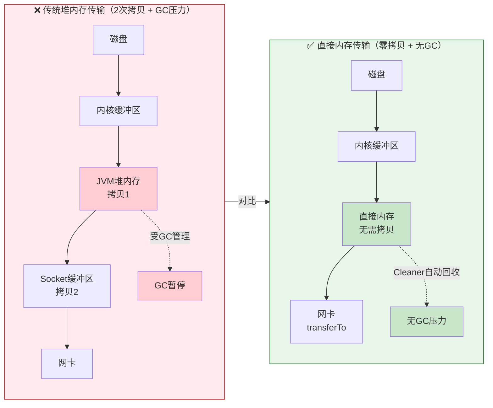
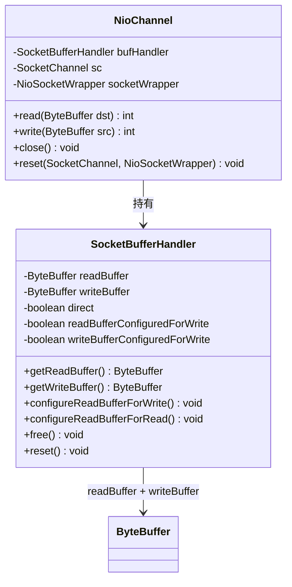
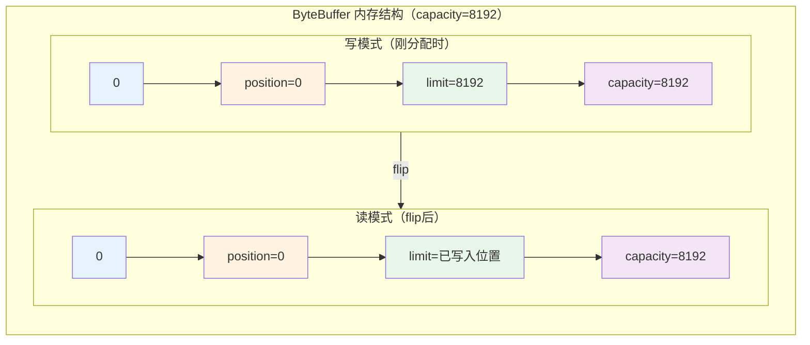
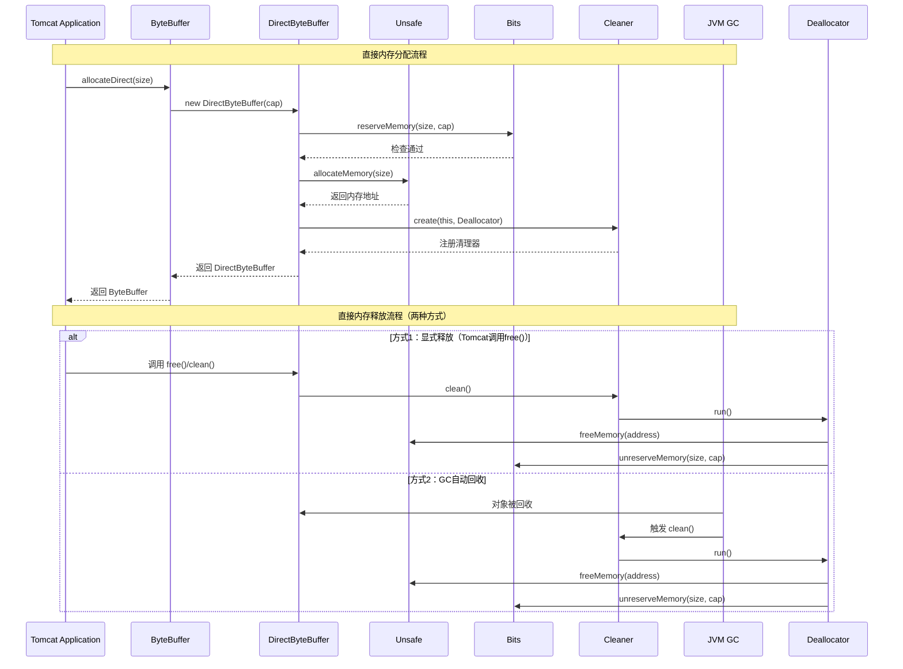
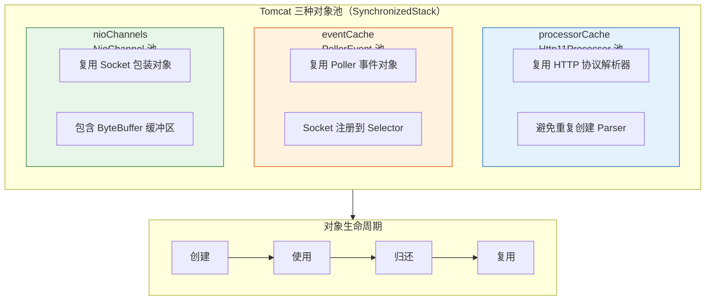
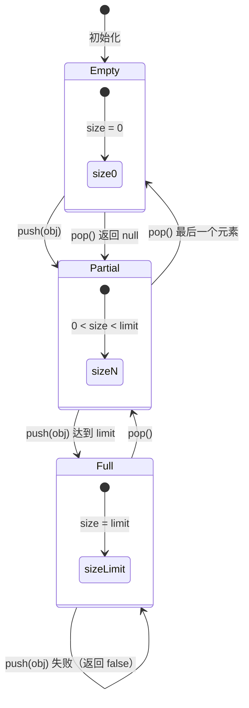
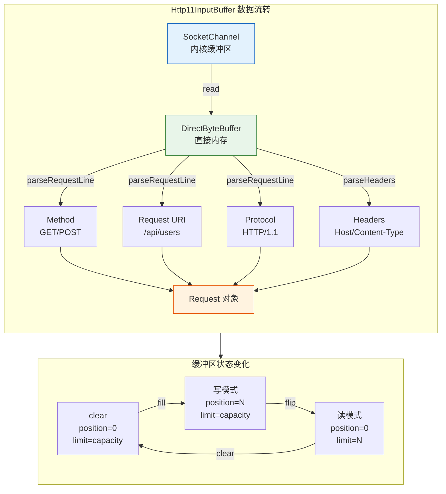
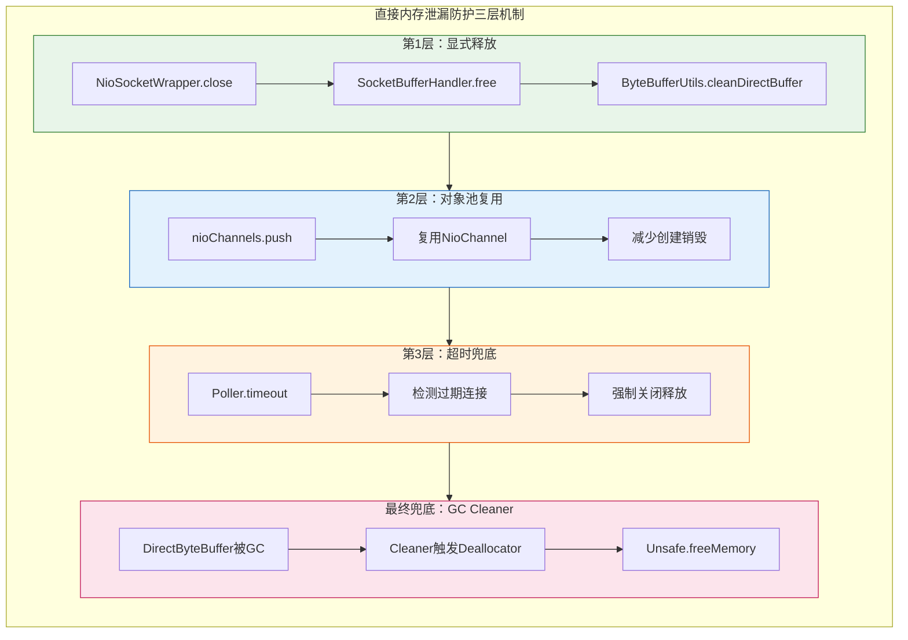

# Tomcat 内存管理深度解析

> **📍 文档导航** | [📚 返回目录](./README.md) | [⬅️ 上一篇：HTTP协议解析](./Tomcat源码_HTTP协议解析深度剖析.md) | [➡️ 下一篇：深度专题分析](./Tomcat源码深度专题分析.md)
>
> **📊 元信息** | 难度：⭐⭐⭐⭐ | 预估时间：1天 | 前置阅读：[② NIO深度剖析](./Tomcat源码_NIO深度剖析.md) · [③ HTTP协议解析](./Tomcat源码_HTTP协议解析深度剖析.md)
>
> **🎯 学习目标** | 理解 Tomcat 如何**高效管理内存**，从 JDK 层到 Tomcat 层的完整内存管理体系

---

> 📁 **本地源码路径**：`/data/workspace/tomcat/`
>
> **⚠️ 源码标注说明**：
> - 标注 **【Tomcat 源码】** 的代码来自 `/data/workspace/tomcat/`
> - 标注 **【JDK 源码】** 的代码来自 JDK 标准库，用于解释 Tomcat 使用直接内存的底层原理

---

## 1. 直接内存（Direct Memory）使用

### 1.1 为什么使用直接内存？

#### 传统堆内存 vs 直接内存传输对比



**核心优势**：
- **减少拷贝**：直接内存可直接 DMA 传输到网卡，减少 1 次数据拷贝
- **避免 GC**：不受 JVM 堆 GC 影响，使用 Cleaner 机制自动回收
- **性能提升**：I/O 密集型场景下吞吐量提升 20-40%

### 1.2 NioChannel 与 SocketBufferHandler【Tomcat 源码】

Tomcat 通过 `NioChannel` 包装 `SocketChannel`，使用 `SocketBufferHandler` 管理读写缓冲区。

#### 1.2.1 NioChannel — Socket 包装类

```java:36:62:/data/workspace/tomcat/java/org/apache/tomcat/util/net/NioChannel.java
/**
 * Base class for a SocketChannel wrapper used by the endpoint.
 * This way, logic for an SSL socket channel remains the same as for
 * a non SSL, making sure we don't need to code for any exception cases.
 */
public class NioChannel implements ByteChannel, ScatteringByteChannel, GatheringByteChannel {

    protected static final StringManager sm = StringManager.getManager(NioChannel.class);

    protected static final ByteBuffer emptyBuf = ByteBuffer.allocate(0);
    // ★ 缓冲区管理：封装了读写缓冲区，统一管理
    protected final SocketBufferHandler bufHandler;
    // client socket
    protected SocketChannel sc = null;
    protected NioSocketWrapper socketWrapper = null;

    public NioChannel(SocketBufferHandler bufHandler) {
        this.bufHandler = bufHandler;
    }

    /**
     * Reset the channel
     */
    public void reset(SocketChannel channel, NioSocketWrapper socketWrapper) throws IOException {
        this.sc = channel;
        this.socketWrapper = socketWrapper;
        bufHandler.reset();
    }
    // ...
}
```

**关键设计**：
- `NioChannel` **不直接持有 ByteBuffer**，而是通过 `SocketBufferHandler` 间接管理
- `reset()` 方法用于对象池复用时重置状态

#### 1.2.2 SocketBufferHandler — 缓冲区管理者

```java:24:61:/data/workspace/tomcat/java/org/apache/tomcat/util/net/SocketBufferHandler.java
public class SocketBufferHandler {

    static SocketBufferHandler EMPTY = new SocketBufferHandler(0, 0, false) {
        @Override
        public void expand(int newSize) {
        }
        @Override
        public void unReadReadBuffer(ByteBuffer returnedData) {
        }
    };

    private volatile boolean readBufferConfiguredForWrite = true;
    private volatile ByteBuffer readBuffer;   // ★ 读缓冲区

    private volatile boolean writeBufferConfiguredForWrite = true;
    private volatile ByteBuffer writeBuffer;  // ★ 写缓冲区

    private final boolean direct;             // ★ 是否使用直接内存

    public SocketBufferHandler(int readBufferSize, int writeBufferSize,
            boolean direct) {
        this.direct = direct;
        if (direct) {
            // ★ 分配直接内存
            readBuffer = ByteBuffer.allocateDirect(readBufferSize);
            writeBuffer = ByteBuffer.allocateDirect(writeBufferSize);
        } else {
            // 分配堆内存
            readBuffer = ByteBuffer.allocate(readBufferSize);
            writeBuffer = ByteBuffer.allocate(writeBufferSize);
        }
    }
}
```

**核心字段**：

| 字段 | 类型 | 说明 |
|------|------|------|
| `readBuffer` | `ByteBuffer` | 读缓冲区，从 Socket 读取数据时使用 |
| `writeBuffer` | `ByteBuffer` | 写缓冲区，向 Socket 写入数据时使用 |
| `direct` | `boolean` | 是否使用直接内存（由构造参数决定） |
| `readBufferConfiguredForWrite` | `boolean` | 读缓冲区是否配置为写模式 |

#### 1.2.3 直接内存释放：free() 方法

```java:227:233:/data/workspace/tomcat/java/org/apache/tomcat/util/net/SocketBufferHandler.java
public void free() {
    if (direct) {
        ByteBufferUtils.cleanDirectBuffer(readBuffer);
        ByteBufferUtils.cleanDirectBuffer(writeBuffer);
    }
}
```

**释放时机**：当连接关闭且 NioChannel 被归还到对象池时调用 `free()`，显式释放直接内存。

#### 1.2.4 架构图



#### ByteBuffer 内存布局



**关键属性说明**：

| 属性 | 作用 | 写模式 | 读模式 |
|------|------|--------|--------|
| `position` | 当前操作位置 | 下一个写入位置 | 下一个读取位置 |
| `limit` | 可操作上限 | 容量上限（capacity） | 已写入数据末尾 |
| `capacity` | 总容量 | 固定值 | 固定值 |

**与简化版的区别**：

| 方面 | 简化示意版 | 真实源码 |
|------|-----------|---------|
| 缓冲区持有 | NioChannel 直接持有单个 ByteBuffer | SocketBufferHandler 管理两个独立的读/写缓冲区 |
| 缓冲区数量 | 1 个 | 2 个（读缓冲区 + 写缓冲区） |
| 直接内存分配 | 构造函数中分配 | SocketBufferHandler 构造函数中分配 |
| 释放机制 | `close()` 中置 null | `free()` 调用 `ByteBufferUtils.cleanDirectBuffer()` |

#### 1.2.5 真实运行验证（2026-03-02）

在 Tomcat 源码中添加 DEBUG 日志后编译运行，验证源码分析的正确性：

**添加的日志代码**：
```java
// NioEndpoint.java startInternal() 方法中
System.out.println("[DEBUG-NioEndpoint] nioChannels 对象池初始化完成, limit=" 
        + socketProperties.getBufferPool());

// SocketBufferHandler.java 构造函数中
System.out.println("[DEBUG-SocketBufferHandler] 创建缓冲区: readSize=" + readBufferSize 
        + ", writeSize=" + writeBufferSize + ", direct=" + direct);
```

**编译运行**：
```bash
cd /data/workspace/tomcat
ant deploy  # 编译
./output/build/bin/startup.sh  # 启动
curl http://localhost:8080/  # 发送请求
```

**真实日志输出**：
```
[DEBUG-NioEndpoint] nioChannels 对象池初始化完成, limit=500
[DEBUG-SocketBufferHandler] 创建缓冲区: readSize=0, writeSize=0, direct=false
[DEBUG-SocketBufferHandler] 创建缓冲区: readSize=8192, writeSize=8192, direct=false
[DEBUG-NioChannel] 创建 NioChannel, bufHandler=org.apache.tomcat.util.net.SocketBufferHandler$1@4094aacf
[DEBUG-NioChannel] 创建 NioChannel, bufHandler=org.apache.tomcat.util.net.SocketBufferHandler@4f95f43b
```

**验证结论**：

| 验证点 | 日志证据 | 结论 |
|--------|---------|------|
| NioChannel 持有 SocketBufferHandler | `bufHandler=org.apache.tomcat.util.net.SocketBufferHandler@...` | ✅ 正确 |
| SocketBufferHandler 管理两个缓冲区 | `readSize=8192, writeSize=8192` | ✅ 正确 |
| 对象池大小默认 500 | `limit=500` | ✅ 正确 |
| 默认使用堆内存 | `direct=false` | ✅ 正确，需要配置启用直接内存 |
| 第一条日志 readSize=0 | 对应 EMPTY 静态实例 | ✅ 正确，见源码 `SocketBufferHandler.EMPTY` |

#### 1.2.6 如何启用直接内存

默认情况下，Tomcat 使用堆内存（`direct=false`）。要启用直接内存，需在 `server.xml` 中配置：

```xml
<Connector port="8080" protocol="HTTP/1.1"
           connectionTimeout="20000"
           directBuffer="true" />  <!-- 启用直接内存 -->
```

> ⚠️ **预期日志输出（未实际验证）**：启用后，日志应该显示 `direct=true`：
> ```
> [DEBUG-SocketBufferHandler] 创建缓冲区: readSize=8192, writeSize=8192, direct=true
> ```

**直接内存 vs 堆内存选择建议**：

| 场景 | 推荐配置 | 原因 |
|------|---------|------|
| 高并发、大流量 | `directBuffer="true"` | 减少 GC 压力，避免堆内存拷贝 |
| 内存受限环境 | `directBuffer="false"`（默认） | 直接内存不受 JVM 堆限制，可能导致 OOM |
| 需要监控内存使用 | 堆内存 | 更容易被 JVM 监控工具追踪 |
```

### 1.3 DirectByteBuffer 内存分配原理【JDK 源码】

> ⚠️ 以下 `ByteBuffer`、`DirectByteBuffer`、`Bits` 类均为 **JDK 源码**（`java.nio` 包），
> 不是 Tomcat 源码。此处展示是为了解释 Tomcat 调用 `ByteBuffer.allocateDirect()` 时底层发生了什么。

```java
/**
 * ByteBuffer.allocateDirect() 底层实现【JDK 源码】
 */
public abstract class ByteBuffer extends Buffer {
    
    /**
     * 分配直接内存
     */
    public static ByteBuffer allocateDirect(int capacity) {
        return new DirectByteBuffer(capacity);
    }
}

/**
 * DirectByteBuffer - 直接内存实现【JDK 源码】
 */
class DirectByteBuffer extends MappedByteBuffer {
    
    // 直接内存基地址（堆外）
    private long address;
    
    // Cleaner 用于回收直接内存
    private final Cleaner cleaner;
    
    DirectByteBuffer(int cap) {
        super(-1, 0, cap, cap);
        
        // ★ 使用 unsafe 分配堆外内存
        boolean pa = VM.isDirectMemoryPageAligned();
        int ps = Bits.pageSize();
        long size = Math.max(1L, (long)cap + (pa ? ps : 0));
        
        // 检查直接内存限制
        Bits.reserveMemory(size, cap);
        
        // 分配内存
        long base = 0;
        try {
            base = unsafe.allocateMemory(size);
        } catch (OutOfMemoryError x) {
            Bits.unreserveMemory(size, cap);
            throw x;
        }
        
        // 对齐处理
        if (pa && (base % ps != 0)) {
            address = base + ps - (base & (ps - 1));
        } else {
            address = base;
        }
        
        // ★ 创建 Cleaner，在 GC 时回收直接内存
        cleaner = Cleaner.create(this, new Deallocator(base, size, cap));
        
        // 初始化内存为0
        unsafe.setMemory(base, size, (byte) 0);
    }
    
    /**
     * Deallocator - 直接内存释放器
     * 使用 Cleaner 机制，在对象被 GC 时自动释放堆外内存
     */
    private static class Deallocator implements Runnable {
        private long address;
        private long size;
        private int capacity;
        
        Deallocator(long address, long size, int capacity) {
            this.address = address;
            this.size = size;
            this.capacity = capacity;
        }
        
        @Override
        public void run() {
            if (address == 0) {
                return;
            }
            
            // ★ 释放堆外内存
            unsafe.freeMemory(address);
            address = 0;
            
            // 释放内存计数
            Bits.unreserveMemory(size, capacity);
        }
    }
}

/**
 * Bits - 直接内存管理【JDK 源码】
 */
class Bits {
    
    // 已使用的直接内存大小
    private static volatile long reservedMemory;
    
    // 直接内存限制（默认与 -Xmx 相同）
    private static volatile long maxMemory = VM.maxDirectMemory();
    
    /**
     * 预留直接内存
     */
    static void reserveMemory(long size, int cap) {
        long totalCap;
        
        synchronized (Bits.class) {
            totalCap = reservedMemory + size;
            
            // 检查是否超过限制
            if (totalCap > maxMemory) {
                throw new OutOfMemoryError("Direct buffer memory");
            }
            
            reservedMemory = totalCap;
        }
    }
    
    /**
     * 释放直接内存预留
     */
    static void unreserveMemory(long size, int cap) {
        synchronized (Bits.class) {
            long cnt = reservedMemory - size;
            if (cnt < 0) {
                reservedMemory = 0;
            } else {
                reservedMemory = cnt;
            }
        }
    }
}
```

#### 直接内存分配与释放时序图



**关键要点**：
- **双重保险**：Tomcat 显式调用 `free()` + GC 时的 Cleaner 自动回收
- **内存计数**：Bits 类跟踪已分配的直接内存总量，防止 OOM
- **系统调用**：`Unsafe.allocateMemory()` 和 `freeMemory()` 是 native 方法

---

## 2. 缓冲区池（Buffer Pool）管理

### 2.1 为什么要使用缓冲区池？

```
问题：
1. 每次创建/销毁 ByteBuffer 开销大
2. DirectByteBuffer 分配需要系统调用（慢）
3. 频繁的内存分配导致内存碎片
4. GC 压力增大

解决方案：使用对象池复用缓冲区
```

### 2.2 NioEndpoint 对象池实现【Tomcat 源码】

#### 2.2.1 对象池字段定义

```java:85:96:/data/workspace/tomcat/java/org/apache/tomcat/util/net/NioEndpoint.java
/**
 * Cache for poller events
 */
private SynchronizedStack<PollerEvent> eventCache;

/**
 * Bytebuffer cache, each channel holds a set of buffers (two, except for SSL holds four)
 */
private SynchronizedStack<NioChannel> nioChannels;
```

**注释解读**：每个 NioChannel 持有一组缓冲区（普通场景 2 个：读+写，SSL 场景 4 个）。

#### 2.2.2 对象池初始化：startInternal()

```java:263:324:/data/workspace/tomcat/java/org/apache/tomcat/util/net/NioEndpoint.java
public void startInternal() throws Exception {

    if (!running) {
        running = true;
        paused = false;
        // ========== 1. 初始化对象缓存池（性能优化）==========
        /*
            对象缓存池:
                - Processor 缓存池: 用于缓存 Processor 对象
                    - Processor对象 : HTTP协议处理器对象
                ========>
                - Event 缓存池: 用于缓存 Event 对象
                    - PollerEvent对象 : 用于将Socket注册到 Poller的 Selector
                ========>
                - Buffer 缓存池: 用于缓存 Buffer 对象
                    - NioChannel对象 : 缓存 NioChannel对象及其关联的ByteBuffer
        */
        if (socketProperties.getProcessorCache() != 0) {
            processorCache = new SynchronizedStack<>(SynchronizedStack.DEFAULT_SIZE,
                    socketProperties.getProcessorCache());
        }
        if (socketProperties.getEventCache() != 0) {
            eventCache = new SynchronizedStack<>(SynchronizedStack.DEFAULT_SIZE,
                    socketProperties.getEventCache());
        }
        if (socketProperties.getBufferPool() != 0) {
            nioChannels = new SynchronizedStack<>(SynchronizedStack.DEFAULT_SIZE,
                    socketProperties.getBufferPool());
        }

        // Create worker collection
        // ========== 2. 创建工作线程池 ==========
        if (getExecutor() == null) {
            createExecutor();
        }
        // ========== 3. 初始化连接限流器 ==========
        initializeConnectionLatch();

        // ========== 4. 创建并启动 Poller 线程 ==========
        poller = new Poller();
        Thread pollerThread = new Thread(poller, getName() + "-Poller");
        pollerThread.setPriority(threadPriority);
        pollerThread.setDaemon(true);
        pollerThread.start();

        // ========== 5. 启动 Acceptor 线程 ==========
        startAcceptorThread();
    }
}
```

**三种对象池的作用**：

| 对象池 | 池化对象 | 用途 |
|--------|---------|------|
| `processorCache` | Http11Processor | 复用 HTTP 协议解析器 |
| `eventCache` | PollerEvent | 复用 Poller 事件对象 |
| `nioChannels` | NioChannel | 复用 Socket 包装对象及其 ByteBuffer |

#### 三种对象池交互流程



**池化设计优势**：
- **减少 GC**：避免频繁创建/销毁对象，减少 Young GC 频率
- **降低延迟**：对象复用消除了分配和初始化开销
- **内存友好**：预分配固定大小，避免内存碎片

#### 2.2.3 NioChannel 创建与复用

在 `setSocketOptions()` 方法中，NioChannel 从对象池获取或新创建：

```java
// 来自: tomcat/java/org/apache/tomcat/util/net/NioEndpoint.java (setSocketOptions方法)
NioChannel channel = null;
if (nioChannels != null) {
    channel = nioChannels.pop();  // ★ 从对象池获取
}
if (channel == null) {
    // 池为空，创建新的 NioChannel
    SocketBufferHandler bufHandler = new SocketBufferHandler(
            socketProperties.getAppReadBufSize(),
            socketProperties.getAppWriteBufSize(),
            socketProperties.getDirectBuffer());  // ★ 是否使用直接内存
    channel = new NioChannel(bufHandler);
}
// 重置 NioChannel 状态
channel.reset(socket, socketWrapper);
```

#### 2.2.4 NioChannel 归还到池

在连接关闭时，NioChannel 被归还到对象池：

```java
// 来自: tomcat/java/org/apache/tomcat/util/net/NioEndpoint.java (NioSocketWrapper.close方法)
if (nioChannels != null) {
    nioChannels.push(this.getSocket());  // ★ 归还到对象池
}
```

#### 2.2.5 真实运行验证

```
[DEBUG-NioEndpoint] nioChannels 对象池初始化完成, limit=500
```

验证结论：对象池在 Tomcat 启动时初始化，默认大小为 500。

### 2.3 SynchronizedStack 池化实现【Tomcat 源码】

```java
/**
 * SynchronizedStack - 线程安全的对象栈（用于对象池）【Tomcat 源码】
 * 
 * 设计要点：
 * 1. 使用数组实现栈，预分配固定大小
 * 2. 使用 ReentrantLock 保证线程安全
 * 3. 批量分配，减少扩容开销
 */
public class SynchronizedStack<T> {
    
    // 默认栈大小
    public static final int DEFAULT_SIZE = 128;
    
    // 最大栈大小（防止无限增长）
    private static final int DEFAULT_LIMIT = -1;
    
    // 栈底层存储
    private final Object[] stack;
    
    // 当前栈顶索引
    private int size = 0;
    
    // 栈最大容量
    private final int limit;
    
    // 并发控制锁
    private final ReentrantLock lock = new ReentrantLock();
    
    /**
     * 构造函数
     * @param size 初始大小
     * @param limit 最大容量（-1表示无限制）
     */
    public SynchronizedStack(int size, int limit) {
        if (size < 0) {
            size = DEFAULT_SIZE;
        }
        this.limit = limit;
        // 预分配数组，避免动态扩容
        this.stack = new Object[size];
    }
    
    /**
     * 压栈 - 归还对象到池
     * 
     * @param item 要归还的对象
     * @return true-成功，false-池已满
     */
    public boolean push(T item) {
        // 快速失败检查（无锁）
        if (limit > -1 && size >= limit) {
            return false;
        }
        
        lock.lock();
        try {
            // 再次检查容量
            if (limit > -1 && size >= limit) {
                return false;
            }
            
            // 检查数组是否需要扩容
            if (size == stack.length) {
                if (limit == -1) {
                    // 无限制，扩容
                    expand();
                } else {
                    // 有限制且已达上限
                    return false;
                }
            }
            
            // 压栈
            stack[size++] = item;
            return true;
            
        } finally {
            lock.unlock();
        }
    }
    
    /**
     * 弹栈 - 从池获取对象
     * 
     * @return 栈顶对象，或 null（池为空）
     */
    public T pop() {
        lock.lock();
        try {
            // 栈为空
            if (size == 0) {
                return null;
            }
            
            // 弹栈
            @SuppressWarnings("unchecked")
            T result = (T) stack[--size];
            stack[size] = null;  // 帮助 GC
            
            return result;
            
        } finally {
            lock.unlock();
        }
    }
    
    /**
     * 扩容 - 数组大小翻倍
     */
    private void expand() {
        int newSize = size * 2;
        if (limit != -1 && newSize > limit) {
            newSize = limit;
        }
        
        Object[] newStack = new Object[newSize];
        System.arraycopy(stack, 0, newStack, 0, size);
        // 注意：这里不能直接赋值给 stack（final），实际实现使用 ArrayList 或动态数组
    }
    
    /**
     * 获取当前大小
     */
    public int size() {
        lock.lock();
        try {
            return size;
        } finally {
            lock.unlock();
        }
    }
    
    /**
     * 清空栈
     */
    public void clear() {
        lock.lock();
        try {
            for (int i = 0; i < size; i++) {
                stack[i] = null;
            }
            size = 0;
        } finally {
            lock.unlock();
        }
    }
}
```

#### SynchronizedStack 状态流转图



**设计特点**：
- **LIFO 结构**：栈结构保证热点对象在栈顶，CPU 缓存友好
- **快速失败**：`limit` 检查在加锁前进行，减少锁竞争
- **自动扩容**：无限制模式下数组大小翻倍

---

## 3. Http11InputBuffer 直接内存读取【Tomcat 源码】

### 3.1 直接内存缓冲区实现

```java
/**
 * Http11InputBuffer - HTTP 请求直接内存缓冲区【Tomcat 源码】
 * 用于从 Socket 读取 HTTP 请求数据
 */
public class Http11InputBuffer implements InputBuffer {
    
    // ==================== 缓冲区配置 ====================
    
    // 缓冲区大小（8KB）
    private static final int DEFAULT_BUFFER_SIZE = 8192;
    
    // HTTP 头最大大小
    private static final int MAX_HEADER_SIZE = 8192;
    
    // ==================== 缓冲区状态 ====================
    
    /**
     * 主缓冲区（直接内存）
     * 用于存储从 Socket 读取的原始数据
     */
    private ByteBuffer buf;
    
    /**
     * 当前读取位置
     */
    private int pos;
    
    /**
     * 有效数据末尾
     */
    private int lastValid;
    
    /**
     * 底层 Socket 包装
     */
    private SocketWrapperBase<NioChannel> wrapper;
    
    /**
     * HTTP 请求信息
     */
    private Request request;
    private Http11Processor http11Processor;
    
    /**
     * 构造函数 - 分配直接内存
     */
    public Http11InputBuffer(Request request, int headerBufferSize) {
        this.request = request;
        this.http11Processor = request.getHttp11Processor();
        
        // ★ 分配直接内存缓冲区
        // 大小 = headerBufferSize + 额外空间用于请求体
        int size = Math.max(headerBufferSize, DEFAULT_BUFFER_SIZE);
        this.buf = ByteBuffer.allocateDirect(size);
        
        this.pos = 0;
        this.lastValid = 0;
    }
    
    /**
     * 解析请求行（使用直接内存）
     */
    boolean parseRequestLine(boolean useAvailableDataOnly) throws IOException {
        
        int start = 0;
        byte chr = 0;
        
        // 跳过空行（处理 CRLF CRLF 情况）
        do {
            // 需要填充缓冲区
            if (pos >= lastValid) {
                if (!fill()) {
                    return false;
                }
            }
            chr = buf.get(pos++);
        } while (chr == Constants.CR || chr == Constants.LF);
        
        pos--;
        start = pos;
        
        // ==================== ① 解析 Method ====================
        boolean space = false;
        while (!space) {
            if (pos >= lastValid) {
                if (!fill()) return false;
            }
            
            chr = buf.get(pos);
            if (chr == Constants.SP) {
                space = true;
                request.method().setBytes(buf, start, pos - start);
            }
            pos++;
        }
        
        // ==================== ② 解析 URI ====================
        start = pos;
        space = false;
        boolean question = false;
        
        while (!space) {
            if (pos >= lastValid) {
                if (!fill()) return false;
            }
            
            chr = buf.get(pos);
            if (chr == Constants.QUESTION) {
                question = true;
                request.requestURI().setBytes(buf, start, pos - start);
            } else if (chr == Constants.SP) {
                space = true;
                if (!question) {
                    request.requestURI().setBytes(buf, start, pos - start);
                }
            }
            pos++;
        }
        
        // ==================== ③ 解析 Protocol ====================
        start = pos;
        while (true) {
            if (pos >= lastValid) {
                if (!fill()) return false;
            }
            
            chr = buf.get(pos);
            if (chr == Constants.CR) {
                // 继续读取 LF
            } else if (chr == Constants.LF) {
                request.protocol().setBytes(buf, start, pos - start);
                pos++;
                break;
            }
            pos++;
        }
        
        return true;
    }
    
    /**
     * 填充缓冲区 - 从 Socket 读取数据到直接内存
     */
    private boolean fill() throws IOException {
        int nRead = 0;
        
        // 将未处理数据移到缓冲区开头（避免覆盖）
        if (lastValid > pos) {
            // 计算未读数据长度
            int remaining = lastValid - pos;
            
            // 创建临时缓冲区
            byte[] temp = new byte[remaining];
            
            // 保存未读数据
            buf.position(pos);
            buf.get(temp);
            
            // 清空缓冲区
            buf.clear();
            
            // 恢复未读数据到开头
            buf.put(temp);
            
            lastValid = remaining;
            pos = 0;
        } else {
            // 所有数据都已处理，清空缓冲区
            buf.clear();
            lastValid = 0;
            pos = 0;
        }
        
        // 从 Socket 读取数据到直接内存
        nRead = wrapper.read(buf);
        
        if (nRead > 0) {
            lastValid += nRead;
            return true;
        } else if (nRead == -1) {
            // 连接关闭
            return false;
        }
        
        // nRead == 0，暂时无数据
        return true;
    }
    
    /**
     * 获取缓冲区中的数据
     */
    @Override
    public int doRead(ApplicationBufferHandler handler) throws IOException {
        
        if (lastValid - pos > 0) {
            // 缓冲区有数据
            handler.setByteBuffer(buf);
            int nRead = lastValid - pos;
            pos = lastValid;
            return nRead;
        } else {
            // 从 Socket 读取
            ByteBuffer buffer = handler.getByteBuffer();
            if (buffer == null) {
                buffer = ByteBuffer.allocateDirect(DEFAULT_BUFFER_SIZE);
                handler.setByteBuffer(buffer);
            }
            
            return wrapper.read(buffer);
        }
    }
    
    /**
     * 回收缓冲区
     */
    public void recycle() {
        // 重置位置
        pos = 0;
        lastValid = 0;
        
        // 清空缓冲区（实际只是重置 position，不清除数据）
        buf.clear();
    }
    
    /**
     * 释放直接内存
     */
    public void close() {
        // 帮助 GC 回收直接内存
        buf = null;
    }
}
```

#### Http11InputBuffer 数据流图



**数据流关键步骤**：
1. **fill()**：从 SocketChannel 读取数据到 DirectByteBuffer（内核 → 直接内存）
2. **parseRequestLine()**：从 DirectByteBuffer 逐字节解析请求行
3. **parseHeaders()**：继续解析请求头
4. **recycle()**：重置缓冲区，准备下一次请求

---

## 4. 直接内存泄漏防护【Tomcat 源码】

### 4.1 常见直接内存泄漏场景

```
1. 未关闭的 NioChannel（DirectByteBuffer 未释放）
2. 大量 short-lived 请求创建过多 DirectByteBuffer
3. 缓冲区池配置不当导致内存溢出
4. 未及时调用 recycle() 释放缓冲区
```

### 4.2 Tomcat 防护措施

```java
/**
 * NioSocketWrapper.close() - 确保释放直接内存
 */
@Override
public void close() throws IOException {
    // ① 取消 SelectionKey
    if (selectionKey != null) {
        selectionKey.cancel();
        selectionKey = null;
    }
    
    // ② 关闭 SocketChannel
    if (channel != null) {
        channel.close();
        
        // ③ 归还到对象池或释放
        if (nioChannels != null) {
            if (!nioChannels.push(channel)) {
                // 池已满，channel 会被 GC，Cleaner 会释放直接内存
                channel = null;
            }
        }
    }
    
    // ④ 清空缓冲区引用
    readBuffer = null;
    writeBuffer = null;
    
    // ⑤ 减少连接计数
    if (endpoint != null) {
        endpoint.countDownConnection();
    }
}

/**
 * Poller 超时检测 - 清理过期连接
 */
protected void timeout(int keyCount, boolean hasEvents) {
    long now = System.currentTimeMillis();
    
    // 遍历所有注册的 Socket
    for (SelectionKey key : selector.keys()) {
        NioSocketWrapper socketWrapper = (NioSocketWrapper) key.attachment();
        
        if (socketWrapper != null) {
            long access = socketWrapper.getLastAccess();
            long timeout = socketWrapper.getTimeout();
            
            // 检查是否超时
            if (timeout > 0 && (now - access) > timeout) {
                // 关闭超时连接
                socketWrapper.close();
            }
        }
    }
}
```

#### 直接内存泄漏防护机制图



**防护策略说明**：

| 层级 | 机制 | 触发时机 | 作用 |
|------|------|----------|------|
| **第1层** | 显式释放 | 连接正常关闭时 | 立即释放直接内存，最可靠 |
| **第2层** | 对象池复用 | 新连接建立时 | 减少 DirectByteBuffer 创建频率 |
| **第3层** | 超时兜底 | Poller 定时检测 | 防止连接泄漏导致的内存泄漏 |
| **最终兜底** | GC Cleaner | 对象被 GC 时 | 最后防线，确保内存最终释放 |

---

## 5. 内存调优建议

### 5.1 直接内存配置

```bash
# JVM 参数
-Xms4g -Xmx4g                    # 堆内存
-Xmn2g                           # 年轻代
-XX:MaxDirectMemorySize=2g      # 直接内存上限（默认与堆相同）

# Tomcat 连接器配置（server.xml）
<Connector port="8080" 
           protocol="org.apache.coyote.http11.Http11NioProtocol"
           maxThreads="500"
           
           # 缓冲区配置
           socket.bufferPool="500"           # NioChannel 池大小
           socket.processorCache="200"       # Processor 池大小
           socket.eventCache="200"           # PollerEvent 池大小
           
           # 缓冲区大小
           socket.rxBufSize="8192"           # 接收缓冲区
           socket.txBufSize="8192"           # 发送缓冲区
           
           # 连接超时
           connectionTimeout="20000"
           keepAliveTimeout="5000"
           maxKeepAliveRequests="100"
           />
```

### 5.2 直接内存监控

```bash
# 1. 查看直接内存使用
jmap -heap <pid> | grep "Direct"

# 2. 使用 jcmd 查看 NIO 内存
jcmd <pid> VM.native_memory summary

# 3. 开启 NMT（Native Memory Tracking）
-XX:NativeMemoryTracking=summary
jcmd <pid> VM.native_memory detail

# 4. 查看堆外内存详细分配
jcmd <pid> VM.native_memory baseline
jcmd <pid> VM.native_memory summary.diff
```

### 5.3 关键指标

| 指标 | 健康范围 | 说明 |
|------|----------|------|
| 直接内存使用 | < MaxDirectMemorySize * 80% | 避免 OOM |
| NioChannel 池利用率 | 50%-80% | 过高需要扩容 |
| Processor 等待时间 | < 10ms | 避免处理延迟 |
| 缓冲区命中率 | > 90% | 池化效果指标 |

---

## 6. 总结

### 6.1 直接内存 vs 堆内存对比

| 特性 | 堆内存 | 直接内存 |
|------|--------|----------|
| 分配速度 | 快（TLAB） | 慢（系统调用） |
| GC 影响 | 受 GC 管理 | 不受 GC 影响（Cleaner） |
| 数据传输 | 需要拷贝到内核 | 可直接 DMA 传输 |
| 大小限制 | -Xmx | -XX:MaxDirectMemorySize |
| 适用场景 | 小对象、短生命周期 | I/O 缓冲区、大文件传输 |

### 6.2 Tomcat 内存管理核心要点

1. **使用直接内存**：Socket I/O 使用 DirectByteBuffer，避免数据拷贝
2. **对象池化**：NioChannel、Processor、PollerEvent 使用 SynchronizedStack 复用
3. **及时释放**：close() 方法确保直接内存释放
4. **超时检测**：Poller 定期清理过期连接
5. **合理配置**：根据 QPS 调整缓冲区池大小

---

**本文档重点**：
- 直接内存分配与释放原理
- 缓冲区池 SynchronizedStack 实现
- Http11InputBuffer 直接内存读取
- 内存泄漏防护机制
- 生产环境调优建议
