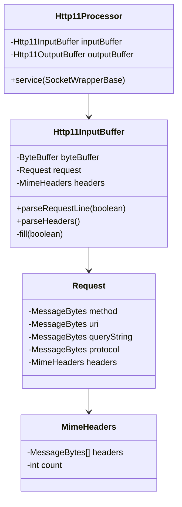
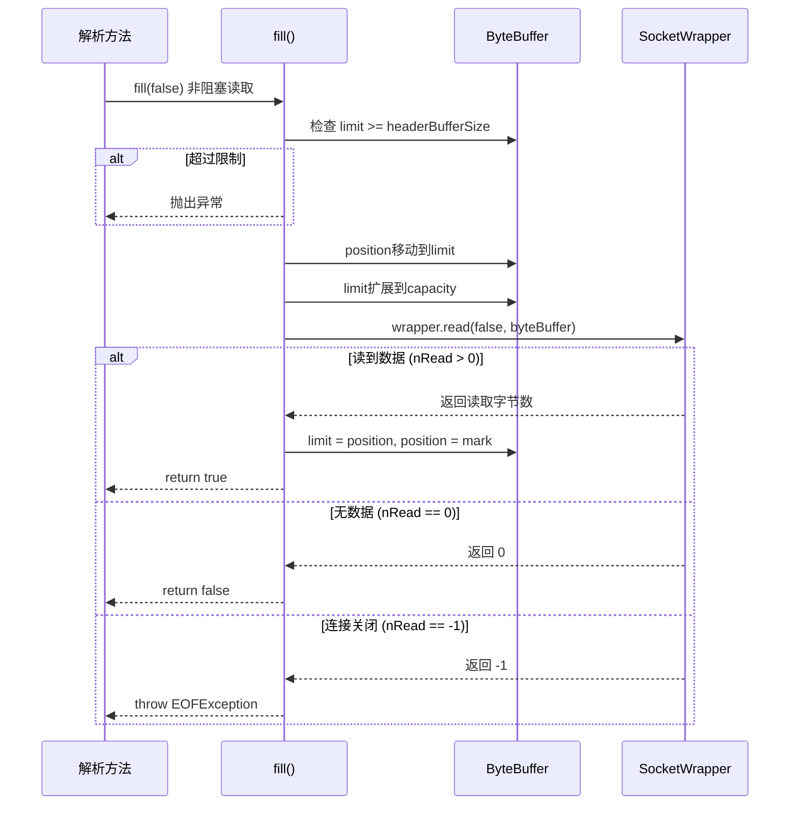
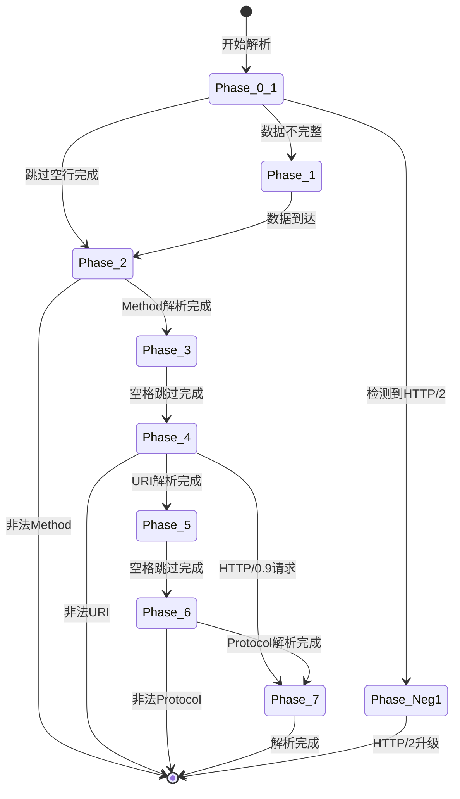
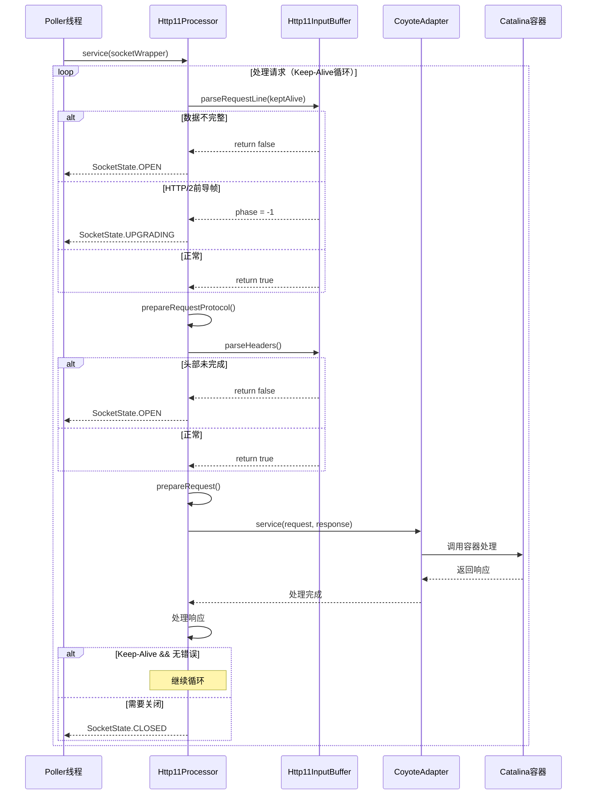

# Tomcat 8.5 HTTP 协议解析深度源码剖析

> **📍 文档导航** | [📚 返回目录](./README.md) | [⬅️ 上一篇：NIO深度剖析](./Tomcat源码_NIO深度剖析.md) | [➡️ 下一篇：内存管理深度解析](./Tomcat内存管理深度解析.md)
>
> **📊 元信息** | 难度：⭐⭐⭐⭐⭐ | 预估时间：1-2天 | 前置阅读：[① Tomcat源码大全](./Tomcat源码大全.md) · [② NIO深度剖析](./Tomcat源码_NIO深度剖析.md)
>
> **🎯 学习目标** | 从字节层面理解 HTTP 协议解析，掌握**状态机设计模式**在实际项目中的精妙应用

---

> 📁 **本地源码路径**：`/data/workspace/tomcat/`

---

## 目录

1. [HTTP解析整体架构](#一http解析整体架构)
2. [Http11InputBuffer 缓冲区管理](#二http11inputbuffer-缓冲区管理)
3. [请求行解析状态机](#三请求行解析状态机)
4. [请求头解析详解](#四请求头解析详解)
5. [Http11Processor 处理流程](#五http11processor-处理流程)
6. [边界条件与错误处理](#六边界条件与错误处理)

---

## 一、HTTP解析整体架构

### 1.1 HTTP 请求结构

```
HTTP/1.1 请求结构：
┌────────────────────────────────────────────────────────┐
│ 请求行 (Request Line)                                  │
│ GET /api/users?id=1 HTTP/1.1\r\n                       │
├────────────────────────────────────────────────────────┤
│ 请求头 (Headers)                                       │
│ Host: localhost:8080\r\n                               │
│ Content-Type: application/json\r\n                     │
│ Content-Length: 25\r\n                                 │
│ \r\n    ← 空行标识头部结束                              │
├────────────────────────────────────────────────────────┤
│ 请求体 (Body)                                          │
│ {"name":"tom","age":18}                                │
└────────────────────────────────────────────────────────┘
```

### 1.2 核心类关系



### 1.3 源码位置

```
tomcat/java/org/apache/coyote/http11/Http11InputBuffer.java (46KB)
tomcat/java/org/apache/coyote/http11/Http11Processor.java (62KB)
```

---

## 二、Http11InputBuffer 缓冲区管理

### 2.1 核心字段详解

```java
// Http11InputBuffer.java 第41-146行
public class Http11InputBuffer implements InputBuffer, ApplicationBufferHandler {
    
    // ========== 核心关联 ==========
    private final Request request;           // Coyote请求对象
    private final MimeHeaders headers;       // 请求头集合（从request获取）
    
    // ========== 缓冲区 ==========
    private ByteBuffer byteBuffer;           // 主缓冲区（默认8KB+）
    private int end;                         // 请求头结束位置（Body开始位置）
    
    // ========== 状态标记 ==========
    private volatile boolean parsingHeader;  // 是否正在解析头部
    private boolean swallowInput;           // 是否跳过输入（Expect场景）
    
    // ========== Socket包装 ==========
    private SocketWrapperBase<?> wrapper;    // Socket包装器
    
    // ========== 解析状态（用于非阻塞解析） ==========
    private byte prevChr = 0;                // 前一个字符
    private byte chr = 0;                    // 当前字符
    private volatile boolean parsingRequestLine;  // 是否正在解析请求行
    private int parsingRequestLinePhase = 0;       // 请求行解析阶段
    private boolean parsingRequestLineEol = false; // 是否遇到行结束
    private int parsingRequestLineStart = 0;       // 请求行起始位置
    private int parsingRequestLineQPos = -1;       // 问号位置（URI参数）
    
    // ========== 头部解析状态 ==========
    private HeaderParsePosition headerParsePos;    // 头部解析位置
    private final HeaderParseData headerData;      // 头部解析数据
    
    // ========== 配置参数 ==========
    private final int headerBufferSize;      // 头部缓冲区大小（默认8KB）
}
```

### 2.2 ByteBuffer 内存布局

```
ByteBuffer 内存布局详解：

byteBuffer = ByteBuffer.allocate(headerBufferSize + socketReadBufferSize)

假设：headerBufferSize = 8KB, socketReadBufferSize = 8KB

初始状态：
┌──────────────────────────────────────────────────────────────┐
│ position=0, limit=0, capacity=16384                           │
│ [                      空闲空间                          ]   │
└──────────────────────────────────────────────────────────────┘

读取数据后：
┌──────────────────────────────────────────────────────────────┐
│ 0      pos      lastValid        limit        capacity       │
│ ├────已解析────┼──未解析数据───┼──空余空间──┤                │
│ [GET /api/users?id=1 HTTP/1.1\r\nHost:...][   可写入区域   ] │
└──────────────────────────────────────────────────────────────┘

关键指针说明：
- position: 当前读取位置
- limit: 有效数据结束位置
- lastValid: 实际有效数据结束（内部使用）
- end: 请求头结束位置（Body开始位置）
```

### 2.3 fill() 数据填充详解

```java
// Http11InputBuffer.java 第760-822行
private boolean fill(boolean block) throws IOException {
    
    // ===== 1. 边界检查 =====
    if (parsingHeader) {
        // 头部超过最大限制
        if (byteBuffer.limit() >= headerBufferSize) {
            throw new IllegalArgumentException(
                sm.getString("iib.requestheadertoolarge.error"));
        }
    } else {
        // 解析Body时，重置到end位置
        byteBuffer.limit(end).position(end);
    }
    
    // ===== 2. 记录当前位置 =====
    int mark = byteBuffer.position();
    
    // ===== 3. 读取数据 =====
    try {
        // 移动position到limit
        if (byteBuffer.position() < byteBuffer.limit()) {
            byteBuffer.position(byteBuffer.limit());
        }
        // 扩展limit到capacity
        byteBuffer.limit(byteBuffer.capacity());
        
        // ★ 关键：从Socket读取数据
        nRead = wrapper.read(block, byteBuffer);
        
    } finally {
        // 恢复指针到"可读"状态
        if (byteBuffer.position() >= mark) {
            byteBuffer.limit(byteBuffer.position());
            byteBuffer.position(mark);
        } else {
            // 异常情况
            byteBuffer.position(0).limit(0);
        }
    }
    
    // ===== 4. 处理结果 =====
    if (nRead > 0) {
        return true;   // 读到数据
    } else if (nRead == -1) {
        throw new EOFException();  // 连接关闭
    } else {
        return false;  // 没有数据（非阻塞）
    }
}
```

### 2.4 fill() 流程图



---

## 三、请求行解析状态机

### 3.1 parseRequestLine() 整体结构

```java
// Http11InputBuffer.java 第345-592行
boolean parseRequestLine(boolean keptAlive) throws IOException {
    
    if (!parsingRequestLine) {
        return true;  // 已经解析完成
    }
    
    // ===== Phase 0-1: 跳过空行 =====
    if (parsingRequestLinePhase < 2) {
        // ...
    }
    
    // ===== Phase 2: 解析Method =====
    if (parsingRequestLinePhase == 2) {
        // GET, POST, PUT, DELETE...
    }
    
    // ===== Phase 3: 跳过空格 =====
    if (parsingRequestLinePhase == 3) {
        // 跳过Method后面的空格
    }
    
    // ===== Phase 4: 解析URI =====
    if (parsingRequestLinePhase == 4) {
        // /api/users?id=1
    }
    
    // ===== Phase 5: 跳过空格 =====
    if (parsingRequestLinePhase == 5) {
        // 跳过URI后面的空格
    }
    
    // ===== Phase 6: 解析Protocol =====
    if (parsingRequestLinePhase == 6) {
        // HTTP/1.1
    }
    
    // ===== Phase 7: 完成 =====
    if (parsingRequestLinePhase == 7) {
        parsingRequestLine = false;
        return true;
    }
}
```

### 3.2 Phase 详解

#### Phase 0-1: 跳过空行

```java
// Http11InputBuffer.java 第354-396行
if (parsingRequestLinePhase < 2) {
    do {
        // 数据不够？从Socket读取
        if (byteBuffer.position() >= byteBuffer.limit()) {
            if (keptAlive) {
                // ★ Keep-Alive复用时，使用keepAliveTimeout
                wrapper.setReadTimeout(
                    wrapper.getEndpoint().getKeepAliveTimeout());
            }
            if (!fill(false)) {
                parsingRequestLinePhase = 1;  // 数据不完整
                return false;
            }
            // ★ 读到数据后，切换回connectionTimeout
            wrapper.setReadTimeout(
                wrapper.getEndpoint().getConnectionTimeout());
        }
        
        // 检测HTTP/2前导帧
        if (!keptAlive && byteBuffer.position() == 0 
            && byteBuffer.limit() >= CLIENT_PREFACE_START.length) {
            // "PRI * HTTP/2.0\r\n\r\nSM\r\n\r\n"
            boolean prefaceMatch = true;
            for (int i = 0; i < CLIENT_PREFACE_START.length; i++) {
                if (CLIENT_PREFACE_START[i] != byteBuffer.get(i)) {
                    prefaceMatch = false;
                    break;
                }
            }
            if (prefaceMatch) {
                parsingRequestLinePhase = -1;  // HTTP/2升级
                return false;
            }
        }
        
        // 设置请求开始时间
        if (request.getStartTime() < 0) {
            request.setStartTime(System.currentTimeMillis());
        }
        
        chr = byteBuffer.get();
    } while (chr == Constants.CR || chr == Constants.LF);  // 跳过空行
    
    // 回退一个字节（因为多读了一个非空行字符）
    byteBuffer.position(byteBuffer.position() - 1);
    parsingRequestLineStart = byteBuffer.position();
    parsingRequestLinePhase = 2;
}
```

#### Phase 2: 解析Method

```java
// Http11InputBuffer.java 第397-426行
if (parsingRequestLinePhase == 2) {
    boolean space = false;
    while (!space) {
        // 数据不够？
        if (byteBuffer.position() >= byteBuffer.limit()) {
            if (!fill(false)) {
                return false;  // 数据不完整
            }
        }
        
        int pos = byteBuffer.position();
        chr = byteBuffer.get();
        
        // 遇到空格：Method结束
        if (chr == Constants.SP || chr == Constants.HT) {
            space = true;
            // ★ 设置Method值
            request.method().setBytes(
                byteBuffer.array(), 
                parsingRequestLineStart,
                pos - parsingRequestLineStart
            );
        } 
        // 非法字符检查
        else if (!HttpParser.isToken(chr)) {
            request.protocol().setString(Constants.HTTP_11);
            throw new IllegalArgumentException(
                sm.getString("iib.invalidmethod", ...));
        }
    }
    parsingRequestLinePhase = 3;
}
```

#### Phase 4: 解析URI

```java
// Http11InputBuffer.java 第446-522行
if (parsingRequestLinePhase == 4) {
    boolean space = false;
    while (!space) {
        if (byteBuffer.position() >= byteBuffer.limit()) {
            if (!fill(false)) {
                return false;
            }
        }
        
        int pos = byteBuffer.position();
        prevChr = chr;
        chr = byteBuffer.get();
        
        // CR检查（HTTP/0.9）
        if (prevChr == Constants.CR && chr != Constants.LF) {
            throw new IllegalArgumentException(...);
        }
        
        // 遇到空格：URI结束
        if (chr == Constants.SP || chr == Constants.HT) {
            space = true;
            end = pos;
        }
        // LF：HTTP/0.9请求
        else if (chr == Constants.LF) {
            space = true;
            request.protocol().setString("");  // 空协议
            parsingRequestLinePhase = 7;  // 跳过协议解析
            end = (prevChr == Constants.CR) ? pos - 1 : pos;
        }
        // 遇到问号：记录参数位置
        else if (chr == Constants.QUESTION && parsingRequestLineQPos == -1) {
            parsingRequestLineQPos = pos;
        }
        // 非法字符检查
        else if (httpParser.isNotRequestTargetRelaxed(chr)) {
            throw new IllegalArgumentException(...);
        }
    }
    
    // ★ 设置URI和QueryString
    if (parsingRequestLineQPos >= 0) {
        // 有查询参数
        request.queryString().setBytes(
            byteBuffer.array(), 
            parsingRequestLineQPos + 1,
            end - parsingRequestLineQPos - 1);
        request.requestURI().setBytes(
            byteBuffer.array(), 
            parsingRequestLineStart,
            parsingRequestLineQPos - parsingRequestLineStart);
    } else {
        // 无查询参数
        request.requestURI().setBytes(
            byteBuffer.array(), 
            parsingRequestLineStart,
            end - parsingRequestLineStart);
    }
    
    if (parsingRequestLinePhase == 4) {
        parsingRequestLinePhase = 5;
    }
}
```

### 3.3 解析示例

```
请求: GET /api/users?id=1 HTTP/1.1\r\n

解析过程：
┌────────────────────────────────────────────────────────────┐
│ Phase 0-1: 跳过空行                                         │
│   无空行，直接进入Phase 2                                    │
├────────────────────────────────────────────────────────────┤
│ Phase 2: 解析Method                                         │
│   读取: G E T [空格]                                        │
│   结果: request.method = "GET"                              │
│   pos移动: 0 → 3                                            │
├────────────────────────────────────────────────────────────┤
│ Phase 3: 跳过空格                                           │
│   跳过1个空格                                                │
│   pos移动: 3 → 4                                            │
├────────────────────────────────────────────────────────────┤
│ Phase 4: 解析URI                                            │
│   读取: / a p i / u s e r s ? i d = 1 [空格]               │
│   遇到?: 记录parsingRequestLineQPos = 13                   │
│   结果:                                                      │
│     request.uri = "/api/users"                              │
│     request.queryString = "id=1"                            │
│   pos移动: 4 → 19                                           │
├────────────────────────────────────────────────────────────┤
│ Phase 5: 跳过空格                                           │
│   跳过1个空格                                                │
│   pos移动: 19 → 20                                          │
├────────────────────────────────────────────────────────────┤
│ Phase 6: 解析Protocol                                       │
│   读取: H T T P / 1 . 1 \r \n                              │
│   结果: request.protocol = "HTTP/1.1"                       │
│   pos移动: 20 → 29                                          │
├────────────────────────────────────────────────────────────┤
│ Phase 7: 完成                                               │
│   parsingRequestLine = false                                │
│   return true                                               │
└────────────────────────────────────────────────────────────┘
```

### 3.4 状态机图



---

## 四、请求头解析详解

### 4.1 MimeHeaders 数据结构

```java
// tomcat/java/org/apache/tomcat/util/http/MimeHeaders.java

/**
 * 请求头存储结构
 * 特点：数组存储，非HashMap（内存紧凑，遍历快）
 */
public class MimeHeaders {
    
    private static final int DEFAULT_SIZE = 8;
    private MessageBytes[] headers = new MessageBytes[DEFAULT_SIZE];
    private int count = 0;
    
    // 添加Header
    public MessageBytes addValue(byte[] b, int off, int len) {
        ensureCapacity(count + 1);
        MessageBytes mb = headers[count++];
        if (mb == null) {
            mb = new MessageBytes();
            headers[count - 1] = mb;
        }
        mb.setBytes(b, off, len);
        return mb;
    }
    
    // 查找Header（需要遍历）
    public MessageBytes getName(int n) {
        return headers[n];
    }
}
```

### 4.2 parseHeaders() 主方法

```java
// Http11InputBuffer.java 第598-627行
boolean parseHeaders() throws IOException {
    if (!parsingHeader) {
        throw new IllegalStateException(...);
    }
    
    HeaderParseStatus status = HeaderParseStatus.HAVE_MORE_HEADERS;
    
    do {
        // 解析单个Header
        status = parseHeader();
        
        // 边界检查
        if (byteBuffer.position() > headerBufferSize ||
            byteBuffer.capacity() - byteBuffer.position() < socketReadBufferSize) {
            throw new IllegalArgumentException(
                sm.getString("iib.requestheadertoolarge.error"));
        }
    } while (status == HeaderParseStatus.HAVE_MORE_HEADERS);
    
    if (status == HeaderParseStatus.DONE) {
        parsingHeader = false;
        end = byteBuffer.position();  // ★ 记录Header结束位置
        return true;
    } else {
        return false;  // NEED_MORE_DATA
    }
}
```

### 4.3 parseHeader() 解析单个Header

```java
// Http11InputBuffer.java 第831-1028行
private HeaderParseStatus parseHeader() throws IOException {
    
    // ===== 1. 检测Header结束（空行） =====
    while (headerParsePos == HeaderParsePosition.HEADER_START) {
        if (byteBuffer.position() >= byteBuffer.limit()) {
            if (!fill(false)) {
                return HeaderParseStatus.NEED_MORE_DATA;
            }
        }
        
        prevChr = chr;
        chr = byteBuffer.get();
        
        if (chr == Constants.CR && prevChr != Constants.CR) {
            // 可能是CRLF的开始
        } else if (chr == Constants.LF) {
            // ★ 空行：Header结束
            return HeaderParseStatus.DONE;
        } else {
            // 不是空行，回退指针
            if (prevChr == Constants.CR) {
                byteBuffer.position(byteBuffer.position() - 2);
            } else {
                byteBuffer.position(byteBuffer.position() - 1);
            }
            break;
        }
    }
    
    // ===== 2. 解析Header Name =====
    while (headerParsePos == HeaderParsePosition.HEADER_NAME) {
        if (byteBuffer.position() >= byteBuffer.limit()) {
            if (!fill(false)) {
                return HeaderParseStatus.NEED_MORE_DATA;
            }
        }
        
        int pos = byteBuffer.position();
        chr = byteBuffer.get();
        
        if (chr == Constants.COLON) {  // 遇到冒号
            // ★ 添加Header Name
            headerData.headerValue = headers.addValue(
                byteBuffer.array(), 
                headerData.start, 
                pos - headerData.start
            );
            headerParsePos = HeaderParsePosition.HEADER_VALUE_START;
            break;
        } else if (!HttpParser.isToken(chr)) {
            // 非法字符
            return skipLine(false);
        }
        
        // 小写转换（Header名不区分大小写）
        if (chr >= Constants.A && chr <= Constants.Z) {
            byteBuffer.put(pos, (byte) (chr - Constants.LC_OFFSET));
        }
    }
    
    // ===== 3. 解析Header Value =====
    while (headerParsePos == HeaderParsePosition.HEADER_VALUE_START ||
           headerParsePos == HeaderParsePosition.HEADER_VALUE) {
        
        // 跳过前导空格
        // 读取直到行尾
        // 处理多行Header（折叠行）
        // ...
    }
    
    // ★ 设置Header Value
    headerData.headerValue.setBytes(
        byteBuffer.array(), 
        headerData.start,
        headerData.lastSignificantChar - headerData.start
    );
    
    return HeaderParseStatus.HAVE_MORE_HEADERS;
}
```

### 4.4 Header 解析示例

```
请求头：
Host: localhost:8080\r\n
Content-Type: application/json\r\n
Content-Length: 25\r\n
\r\n

解析过程：

1. Host: localhost:8080\r\n
   ├─ HEADER_NAME: "Host"
   ├─ HEADER_VALUE_START: 跳过空格
   ├─ HEADER_VALUE: "localhost:8080"
   └─ 存入headers[0]

2. Content-Type: application/json\r\n
   ├─ HEADER_NAME: "Content-Type"
   ├─ HEADER_VALUE: "application/json"
   └─ 存入headers[1]

3. Content-Length: 25\r\n
   ├─ HEADER_NAME: "Content-Length"
   ├─ HEADER_VALUE: "25"
   └─ 存入headers[2]

4. \r\n (空行)
   └─ 返回DONE，Header解析完成
```

### 4.5 多行Header处理（折叠行）

```
HTTP允许Header值跨多行（已过时但需要支持）：

X-Custom: value1
 value2    ← 以空格或Tab开头表示续行

解析逻辑：
1. 读取第一行：value1
2. 检测下一行首字符是否为空格/Tab
3. 如果是：续行，继续读取
4. 如果不是：Header结束
```

---

## 五、Http11Processor 处理流程

### 5.1 service() 主循环

```java
// Http11Processor.java 第472-598行
@Override
public SocketState service(SocketWrapperBase<?> socketWrapper) throws IOException {
    
    RequestInfo rp = request.getRequestProcessor();
    rp.setStage(org.apache.coyote.Constants.STAGE_PARSE);
    
    // 设置I/O
    setSocketWrapper(socketWrapper);
    
    // 初始化标志
    keepAlive = true;
    openSocket = false;
    readComplete = true;
    boolean keptAlive = false;  // 是否是Keep-Alive复用
    
    // ★ 主循环：处理一个或多个请求
    while (!getErrorState().isError() && keepAlive && !isAsync() 
           && upgradeToken == null && sendfileState == SendfileState.DONE 
           && !endpoint.isPaused()) {
        
        try {
            // ===== 1. 解析请求行 =====
            if (!inputBuffer.parseRequestLine(keptAlive)) {
                if (inputBuffer.getParsingRequestLinePhase() == -1) {
                    return SocketState.UPGRADING;  // HTTP/2
                } else if (handleIncompleteRequestLineRead()) {
                    break;  // 数据不完整
                }
            }
            
            // ===== 2. 处理协议 =====
            prepareRequestProtocol();
            
            if (endpoint.isPaused()) {
                response.setStatus(503);
                setErrorState(ErrorState.CLOSE_CLEAN, null);
            } else {
                keptAlive = true;
                request.getMimeHeaders().setLimit(endpoint.getMaxHeaderCount());
                
                // ===== 3. 解析请求头 =====
                if (!http09 && !inputBuffer.parseHeaders()) {
                    openSocket = true;
                    readComplete = false;
                    break;
                }
                
                // 设置上传超时
                if (!disableUploadTimeout) {
                    socketWrapper.setReadTimeout(connectionUploadTimeout);
                }
            }
        } catch (IOException e) {
            setErrorState(ErrorState.CLOSE_CONNECTION_NOW, e);
            break;
        } catch (Throwable t) {
            response.setStatus(400);
            setErrorState(ErrorState.CLOSE_CLEAN, t);
        }
        
        // ===== 4. 准备请求 =====
        prepareRequest();
        
        // ===== 5. 调用容器 =====
        rp.setStage(org.apache.coyote.Constants.STAGE_SERVICE);
        getAdapter().service(request, response);
        
        // ===== 6. 处理响应 =====
        // ...
    }
    
    // 返回状态
    if (isAsync()) {
        return SocketState.LONG;
    } else if (openSocket) {
        return SocketState.OPEN;
    } else {
        return SocketState.CLOSED;
    }
}
```

### 5.2 处理流程图



---

## 六、边界条件与错误处理

### 6.1 边界限制

| 限制项 | 配置参数 | 默认值 | 触发后果 |
|--------|---------|--------|---------|
| 请求行+头部大小 | maxHttpHeaderSize | 8KB | 400 Bad Request |
| Header数量 | maxHeaderCount | 100 | 400 Bad Request |
| 单行Header长度 | - | headerBufferSize | 400 Bad Request |
| URI长度 | - | headerBufferSize | 414 URI Too Long |

### 6.2 错误处理代码

```java
// Http11InputBuffer.java 第770-776行
private boolean fill(boolean block) throws IOException {
    if (parsingHeader) {
        if (byteBuffer.limit() >= headerBufferSize) {
            if (parsingRequestLine) {
                request.protocol().setString(Constants.HTTP_11);
            }
            // ★ 头部超过限制
            throw new IllegalArgumentException(
                sm.getString("iib.requestheadertoolarge.error"));
        }
    }
}
```

### 6.3 不完整数据处理

```java
// Http11Processor.java
private boolean handleIncompleteRequestLineRead() {
    openSocket = true;  // 保持连接
    
    // 如果已经开始读取请求行
    if (inputBuffer.getParsingRequestLinePhase() >= 2) {
        readComplete = false;  // 读取未完成
    }
    
    return true;  // break循环
}
```

### 6.4 错误状态处理

```java
// org.apache.coyote.ErrorState
public enum ErrorState {
    CLOSE_CLEAN,          // 正常关闭（发送响应后关闭）
    CLOSE_CONNECTION_NOW, // 立即关闭（不发送响应）
    CLOSE_ASYNC           // 异步关闭
}

// 设置错误状态
private void setErrorState(ErrorState errorState, Throwable t) {
    if (getErrorState().compareTo(errorState) < 0) {
        errorState = errorState;
    }
}
```

### 6.5 超时切换机制

```java
// parseRequestLine() 中的超时切换

// 1. Keep-Alive 复用时
if (keptAlive) {
    wrapper.setReadTimeout(
        wrapper.getEndpoint().getKeepAliveTimeout());  // 默认5秒
}

// 2. 读到数据后
if (nRead > 0) {
    wrapper.setReadTimeout(
        wrapper.getEndpoint().getConnectionTimeout());  // 默认60秒
}

// 3. 文件上传时
if (!disableUploadTimeout) {
    socketWrapper.setReadTimeout(connectionUploadTimeout);  // 默认300秒
}
```

---

## 总结

### 核心设计要点

| 要点 | 实现方式 |
|------|---------|
| **缓冲区管理** | ByteBuffer + 动态扩展 |
| **状态机解析** | Phase 0-7 状态流转 |
| **非阻塞解析** | 支持数据不完整时返回等待 |
| **Header存储** | MimeHeaders 数组结构 |
| **边界检查** | 大小限制、数量限制 |
| **超时切换** | Keep-Alive → Connection → Upload |

### 性能优化手段

1. **零拷贝**：MessageBytes 直接引用 ByteBuffer 数组
2. **对象复用**：Request、Response 对象复用
3. **小写转换**：Header名转小写，避免后续比较开销
4. **状态保存**：支持非阻塞解析，保存中间状态

### 关键技术问题

| 问题 | 答案 |
|------|------|
| 为什么使用状态机？ | 支持非阻塞解析，数据不完整时可暂停 |
| Header为什么用数组？ | 内存紧凑，遍历快（Header数量通常不多） |
| 如何处理超长Header？ | 超过headerBufferSize抛异常 |
| 如何检测HTTP/2？ | 检查前导帧 "PRI * HTTP/2.0" |

---

**源码版本**: Tomcat 8.5.x  
**分析深度**: 技术专家级别
