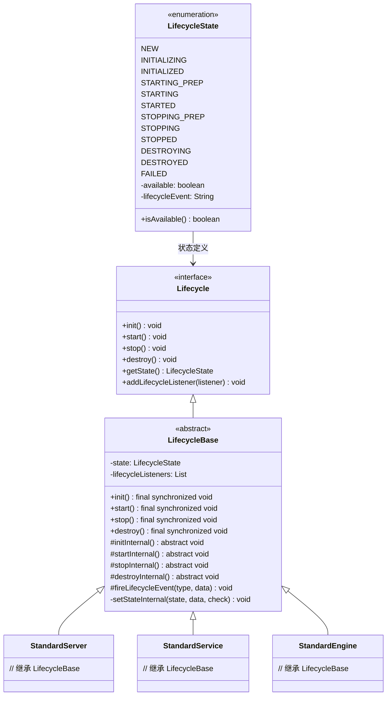
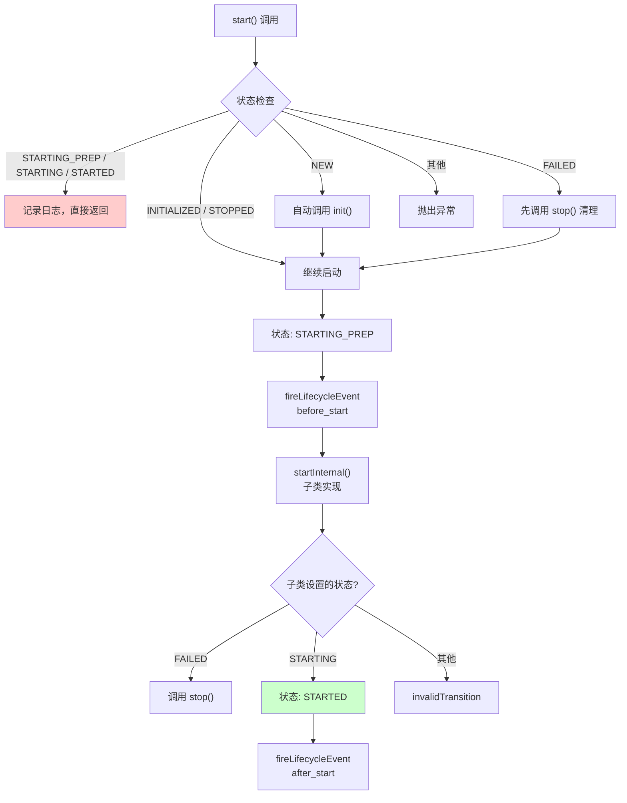
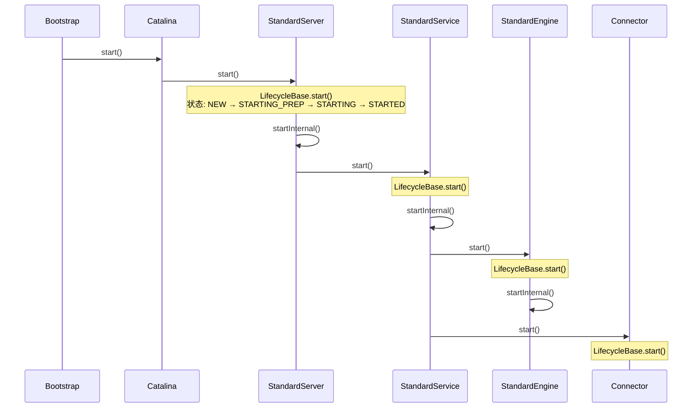

# Tomcat Lifecycle 生命周期状态机深度分析

> **📍 文档导航** | [📚 返回目录](./README.md) | [⬅️ 上一篇：深度专题分析](./Tomcat源码深度专题分析.md) | [➡️ 下一篇：类加载器](./Tomcat源码_类加载器与双亲委派打破深度分析.md)
>
> **📊 元信息** | 难度：⭐⭐⭐⭐ | 预估时间：0.5-1天 | 前置阅读：[① Tomcat源码大全](./Tomcat源码大全.md)
>
> **🎯 学习目标** | 理解 Tomcat **启动/停止的骨架**，所有组件（Server/Service/Engine/Connector）都继承 LifecycleBase，掌握状态机就掌握了启动流程的本质

---

> 📁 **本地源码路径**：`/data/workspace/tomcat/`
>
> **核心源码位置**：`org.apache.catalina.Lifecycle`、`org.apache.catalina.LifecycleState`、`org.apache.catalina.util.LifecycleBase`

---

## 一、总体架构

### 1.1 核心类关系



### 1.2 设计模式

Tomcat 使用 **状态机模式** + **模板方法模式**：

- **状态机模式**：`LifecycleState` 枚举定义 12 个状态，状态转换有严格规则
- **模板方法模式**：`LifecycleBase` 定义标准流程骨架（状态检查 → 前置事件 → 子类实现 → 后置事件 → 状态更新），子类实现 `initInternal()` / `startInternal()` / `stopInternal()` / `destroyInternal()`

---

## 二、LifecycleState — 12 个状态详解【Tomcat 源码】

### 2.1 状态枚举定义

```java:23:65:/data/workspace/tomcat/java/org/apache/catalina/LifecycleState.java
public enum LifecycleState {
    NEW(false, null),
    INITIALIZING(false, Lifecycle.BEFORE_INIT_EVENT),
    INITIALIZED(false, Lifecycle.AFTER_INIT_EVENT),
    STARTING_PREP(false, Lifecycle.BEFORE_START_EVENT),
    STARTING(true, Lifecycle.START_EVENT),
    STARTED(true, Lifecycle.AFTER_START_EVENT),
    STOPPING_PREP(true, Lifecycle.BEFORE_STOP_EVENT),
    STOPPING(false, Lifecycle.STOP_EVENT),
    STOPPED(false, Lifecycle.AFTER_STOP_EVENT),
    DESTROYING(false, Lifecycle.BEFORE_DESTROY_EVENT),
    DESTROYED(false, Lifecycle.AFTER_DESTROY_EVENT),
    FAILED(false, null);

    private final boolean available;
    private final String lifecycleEvent;

    LifecycleState(boolean available, String lifecycleEvent) {
        this.available = available;
        this.lifecycleEvent = lifecycleEvent;
    }

    /**
     * May the public methods other than property getters/setters and lifecycle
     * methods be called for a component in this state? It returns
     * <code>true</code> for any component in any of the following states:
     * <ul>
     * <li>{@link #STARTING}</li>
     * <li>{@link #STARTED}</li>
     * <li>{@link #STOPPING_PREP}</li>
     * </ul>
     */
    public boolean isAvailable() {
        return available;
    }

    public String getLifecycleEvent() {
        return lifecycleEvent;
    }
}
```

### 2.2 状态详解

| 状态 | available | 关联事件 | 说明 |
|------|-----------|---------|------|
| **NEW** | false | null | 初始状态，刚创建 |
| **INITIALIZING** | false | before_init | 初始化中 |
| **INITIALIZED** | false | after_init | 初始化完成 |
| **STARTING_PREP** | false | before_start | 启动准备中 |
| **STARTING** | **true** | start | 启动中，public 方法可用 |
| **STARTED** | **true** | after_start | 启动完成，运行中 |
| **STOPPING_PREP** | **true** | before_stop | 停止准备中，public 方法仍可用 |
| **STOPPING** | false | stop | 停止中 |
| **STOPPED** | false | after_stop | 停止完成 |
| **DESTROYING** | false | before_destroy | 销毁中 |
| **DESTROYED** | false | after_destroy | 销毁完成 |
| **FAILED** | false | null | 失败状态 |

**关键设计**：`available` 字段标识状态是否允许调用 public 方法。

---

## 三、Lifecycle — 接口定义【Tomcat 源码】

### 3.1 核心方法

```java:83:319:/data/workspace/tomcat/java/org/apache/catalina/Lifecycle.java
public interface Lifecycle {

    // ----------------------------------------------------- Manifest Constants

    String BEFORE_INIT_EVENT = "before_init";
    String AFTER_INIT_EVENT = "after_init";
    String START_EVENT = "start";
    String BEFORE_START_EVENT = "before_start";
    String AFTER_START_EVENT = "after_start";
    String STOP_EVENT = "stop";
    String BEFORE_STOP_EVENT = "before_stop";
    String AFTER_STOP_EVENT = "after_stop";
    String AFTER_DESTROY_EVENT = "after_destroy";
    String BEFORE_DESTROY_EVENT = "before_destroy";
    String PERIODIC_EVENT = "periodic";
    String CONFIGURE_START_EVENT = "configure_start";
    String CONFIGURE_STOP_EVENT = "configure_stop";

    // --------------------------------------------------------- Public Methods

    void addLifecycleListener(LifecycleListener listener);
    LifecycleListener[] findLifecycleListeners();
    void removeLifecycleListener(LifecycleListener listener);

    void init() throws LifecycleException;
    void start() throws LifecycleException;
    void stop() throws LifecycleException;
    void destroy() throws LifecycleException;

    LifecycleState getState();
    String getStateName();

    interface SingleUse {
    }
}
```

### 3.2 状态转换图

Tomcat 源码中自带 ASCII 状态图（Lifecycle.java 第 28-76 行）：

```
            start()
  -----------------------------
  |                           |
  | init()                    |
NEW -»-- INITIALIZING        |
| |           |              |     ------------------«-----------------------
| |           |auto          |     |                                        |
| |          \|/    start() \|/   \|/     auto          auto         stop() |
| |      INITIALIZED --»-- STARTING_PREP --»- STARTING --»- STARTED --»---  |
| |         |                                                            |  |
| |destroy()|                                                            |  |
| --»-----«--    ------------------------«--------------------------------  ^
|     |          |                                                          |
|     |         \|/          auto                 auto              start() |
|     |     STOPPING_PREP ----»---- STOPPING ------»----- STOPPED -----»-----
|    \|/                               ^                     |  ^
|     |               stop()           |                     |  |
|     |       --------------------------                     |  |
|     |       |                                              |  |
|     |       |    destroy()                       destroy() |  |
|     |    FAILED ----»------ DESTROYING ---«-----------------  |
|     |                        ^     |                          |
|     |     destroy()          |     |auto                      |
|     --------»-----------------    \|/                         |
|                                 DESTROYED                     |
|                                                               |
|                            stop()                             |
----»-----------------------------»------------------------------

Any state can transition to FAILED.
```

---

## 四、LifecycleBase — 模板方法实现【Tomcat 源码】

### 4.1 核心字段

```java:37:57:/data/workspace/tomcat/java/org/apache/catalina/util/LifecycleBase.java
public abstract class LifecycleBase implements Lifecycle {

    private static final Log log = LogFactory.getLog(LifecycleBase.class);
    private static final StringManager sm = StringManager.getManager(LifecycleBase.class);

    /**
     * The list of registered LifecycleListeners for event notifications.
     */
    private final List<LifecycleListener> lifecycleListeners = new CopyOnWriteArrayList<>();

    /**
     * The current state of the source component.
     */
    private volatile LifecycleState state = LifecycleState.NEW;

    private boolean throwOnFailure = true;
    // ...
}
```

### 4.2 init() — 初始化模板方法

```java:119:132:/data/workspace/tomcat/java/org/apache/catalina/util/LifecycleBase.java
@Override
public final synchronized void init() throws LifecycleException {
    if (!state.equals(LifecycleState.NEW)) {
        invalidTransition(BEFORE_INIT_EVENT);
    }

    try {
        setStateInternal(LifecycleState.INITIALIZING, null, false);
        initInternal();  // ★ 子类实现
        setStateInternal(LifecycleState.INITIALIZED, null, false);
    } catch (Throwable t) {
        handleSubClassException(t, "lifecycleBase.initFail", toString());
    }
}

/**
 * Sub-classes implement this method to perform any instance initialisation
 * required.
 */
protected abstract void initInternal() throws LifecycleException;
```

**流程**：
1. 状态检查：必须从 NEW 开始
2. 状态更新：NEW → INITIALIZING
3. 调用 `initInternal()` — 子类实现初始化逻辑
4. 状态更新：INITIALIZING → INITIALIZED
5. 异常处理：失败 → FAILED

### 4.3 start() — 启动模板方法（最复杂）

```java:144:188:/data/workspace/tomcat/java/org/apache/catalina/util/LifecycleBase.java
@Override
public final synchronized void start() throws LifecycleException {

    // 1. 已经在启动中或已启动，直接返回
    if (LifecycleState.STARTING_PREP.equals(state) || LifecycleState.STARTING.equals(state) ||
            LifecycleState.STARTED.equals(state)) {
        if (log.isDebugEnabled()) {
            Exception e = new LifecycleException();
            log.debug(sm.getString("lifecycleBase.alreadyStarted", toString()), e);
        } else if (log.isInfoEnabled()) {
            log.info(sm.getString("lifecycleBase.alreadyStarted", toString()));
        }
        return;
    }

    // 2. 自动初始化：NEW → init()
    if (state.equals(LifecycleState.NEW)) {
        init();
    // 3. 失败后重试：FAILED → stop()
    } else if (state.equals(LifecycleState.FAILED)) {
        stop();
    // 4. 非法状态检查
    } else if (!state.equals(LifecycleState.INITIALIZED) &&
            !state.equals(LifecycleState.STOPPED)) {
        invalidTransition(BEFORE_START_EVENT);
    }

    // 5. 标准启动流程
    try {
        setStateInternal(LifecycleState.STARTING_PREP, null, false);
        startInternal();  // ★ 子类实现启动逻辑
        
        // 6. 启动失败处理
        if (state.equals(LifecycleState.FAILED)) {
            stop();
        // 7. 子类未正确更新状态
        } else if (!state.equals(LifecycleState.STARTING)) {
            invalidTransition(AFTER_START_EVENT);
        // 8. 启动成功
        } else {
            setStateInternal(LifecycleState.STARTED, null, false);
        }
    } catch (Throwable t) {
        handleSubClassException(t, "lifecycleBase.startFail", toString());
    }
}

/**
 * Sub-classes must ensure that the state is changed to
 * {@link LifecycleState#STARTING} during the execution of this method.
 */
protected abstract void startInternal() throws LifecycleException;
```

**流程详解**：



### 4.4 stop() — 停止模板方法

```java:207:260:/data/workspace/tomcat/java/org/apache/catalina/util/LifecycleBase.java
@Override
public final synchronized void stop() throws LifecycleException {

    // 1. 已经在停止中或已停止
    if (LifecycleState.STOPPING_PREP.equals(state) || LifecycleState.STOPPING.equals(state) ||
            LifecycleState.STOPPED.equals(state)) {
        if (log.isDebugEnabled()) {
            Exception e = new LifecycleException();
            log.debug(sm.getString("lifecycleBase.alreadyStopped", toString()), e);
        } else if (log.isInfoEnabled()) {
            log.info(sm.getString("lifecycleBase.alreadyStopped", toString()));
        }
        return;
    }

    // 2. NEW 状态直接设为 STOPPED
    if (state.equals(LifecycleState.NEW)) {
        state = LifecycleState.STOPPED;
        return;
    }

    // 3. 状态检查
    if (!state.equals(LifecycleState.STARTED) && !state.equals(LifecycleState.FAILED)) {
        invalidTransition(BEFORE_STOP_EVENT);
    }

    try {
        // 4. FAILED 状态特殊处理：不经过 STOPPING_PREP
        if (state.equals(LifecycleState.FAILED)) {
            fireLifecycleEvent(BEFORE_STOP_EVENT, null);
        } else {
            setStateInternal(LifecycleState.STOPPING_PREP, null, false);
        }

        stopInternal();  // ★ 子类实现

        // 5. 状态检查
        if (!state.equals(LifecycleState.STOPPING) && !state.equals(LifecycleState.FAILED)) {
            invalidTransition(AFTER_STOP_EVENT);
        }

        setStateInternal(LifecycleState.STOPPED, null, false);
    } catch (Throwable t) {
        handleSubClassException(t, "lifecycleBase.stopFail", toString());
    } finally {
        // 6. SingleUse 组件自动销毁
        if (this instanceof Lifecycle.SingleUse) {
            setStateInternal(LifecycleState.STOPPED, null, false);
            destroy();
        }
    }
}

protected abstract void stopInternal() throws LifecycleException;
```

**注意**：FAILED 状态的组件停止时不经过 STOPPING_PREP，直接触发 `before_stop` 事件。

### 4.5 destroy() — 销毁模板方法

```java:273:311:/data/workspace/tomcat/java/org/apache/catalina/util/LifecycleBase.java
@Override
public final synchronized void destroy() throws LifecycleException {
    // 1. FAILED 状态先停止
    if (LifecycleState.FAILED.equals(state)) {
        try {
            stop();
        } catch (LifecycleException e) {
            log.error(sm.getString("lifecycleBase.destroyStopFail", toString()), e);
        }
    }

    // 2. 已经在销毁中或已销毁
    if (LifecycleState.DESTROYING.equals(state) || LifecycleState.DESTROYED.equals(state)) {
        if (log.isDebugEnabled()) {
            Exception e = new LifecycleException();
            log.debug(sm.getString("lifecycleBase.alreadyDestroyed", toString()), e);
        }
        return;
    }

    // 3. 状态检查
    if (!state.equals(LifecycleState.STOPPED) && !state.equals(LifecycleState.FAILED) &&
            !state.equals(LifecycleState.NEW) && !state.equals(LifecycleState.INITIALIZED)) {
        invalidTransition(BEFORE_DESTROY_EVENT);
    }

    try {
        setStateInternal(LifecycleState.DESTROYING, null, false);
        destroyInternal();  // ★ 子类实现
        setStateInternal(LifecycleState.DESTROYED, null, false);
    } catch (Throwable t) {
        handleSubClassException(t, "lifecycleBase.destroyFail", toString());
    }
}

protected abstract void destroyInternal() throws LifecycleException;
```

### 4.6 状态更新与事件触发

```java:365:404:/data/workspace/tomcat/java/org/apache/catalina/util/LifecycleBase.java
private synchronized void setStateInternal(LifecycleState state, Object data, boolean check)
        throws LifecycleException {

    if (log.isDebugEnabled()) {
        log.debug(sm.getString("lifecycleBase.setState", this, state));
    }

    if (check) {
        // 允许的状态转换：
        // 1. 任何状态 → FAILED
        // 2. STARTING_PREP → STARTING（由 startInternal 触发）
        // 3. STOPPING_PREP → STOPPING（由 stopInternal 触发）
        // 4. FAILED → STOPPING（失败后停止）
        if (!(state == LifecycleState.FAILED ||
                (this.state == LifecycleState.STARTING_PREP &&
                        state == LifecycleState.STARTING) ||
                (this.state == LifecycleState.STOPPING_PREP &&
                        state == LifecycleState.STOPPING) ||
                (this.state == LifecycleState.FAILED &&
                        state == LifecycleState.STOPPING))) {
            invalidTransition(state.name());
        }
    }

    this.state = state;
    String lifecycleEvent = state.getLifecycleEvent();
    if (lifecycleEvent != null) {
        fireLifecycleEvent(lifecycleEvent, data);  // ★ 触发事件
    }
}

/**
 * 触发生命周期事件
 */
protected void fireLifecycleEvent(String type, Object data) {
    LifecycleEvent event = new LifecycleEvent(this, type, data);
    for (LifecycleListener listener : lifecycleListeners) {
        listener.lifecycleEvent(event);
    }
}
```

---

## 五、实际应用 — StandardServer 启动流程

### 5.1 Server 启动链



### 5.2 StandardServer.startInternal() 示例

```java
// 来自: tomcat/java/org/apache/catalina/core/StandardServer.java
protected void startInternal() throws LifecycleException {

    fireLifecycleEvent(CONFIGURE_START_EVENT, null);
    
    // 启动全局命名资源
    globalNamingResources.start();
    
    // ★ 启动所有 Service（核心）
    synchronized (servicesLock) {
        for (Service service : services) {
            service.start();  // 触发每个 Service 的生命周期
        }
    }
}
```

---

## 六、面试核心问题

| 问题 | 答案 |
|------|------|
| Tomcat 有几个生命周期状态？ | 12 个：NEW → INITIALIZING → INITIALIZED → STARTING_PREP → STARTING → STARTED → STOPPING_PREP → STOPPING → STOPPED → DESTROYING → DESTROYED，以及 FAILED |
| 什么状态可以调用 public 方法？ | STARTING、STARTED、STOPPING_PREP（`isAvailable() = true`） |
| LifecycleBase 用什么设计模式？ | 模板方法模式，子类实现 `initInternal()` / `startInternal()` / `stopInternal()` / `destroyInternal()` |
| 状态转换非法会怎样？ | 抛出 `LifecycleException` |
| 启动失败怎么处理？ | 进入 FAILED 状态，调用 `stop()` 进行清理 |
| 事件监听机制？ | `LifecycleListener` 注册到 `LifecycleBase`，状态变更时触发 `fireLifecycleEvent()` |

---

## 七、与其他专题的关联

| 专题 | 关联点 |
|------|-------|
| **Tomcat 启动流程** | Server/Service/Engine 都继承 LifecycleBase，启动遵循 init → start 状态机 |
| **Pipeline/Valve** | Container 组件（Engine/Host/Context/Wrapper）继承 LifecycleBase，启动时初始化 Pipeline |
| **Async Servlet** | 异步状态机（AsyncStateMachine）与 Lifecycle 类似，都是状态机模式 |

---

*文档基于 Tomcat 8.5.x 源码编写*
*本地源码路径：/data/workspace/tomcat/*
