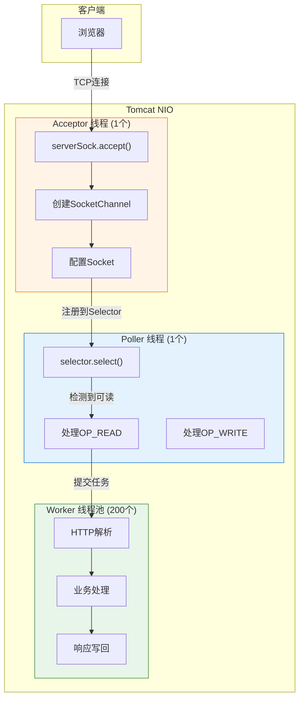
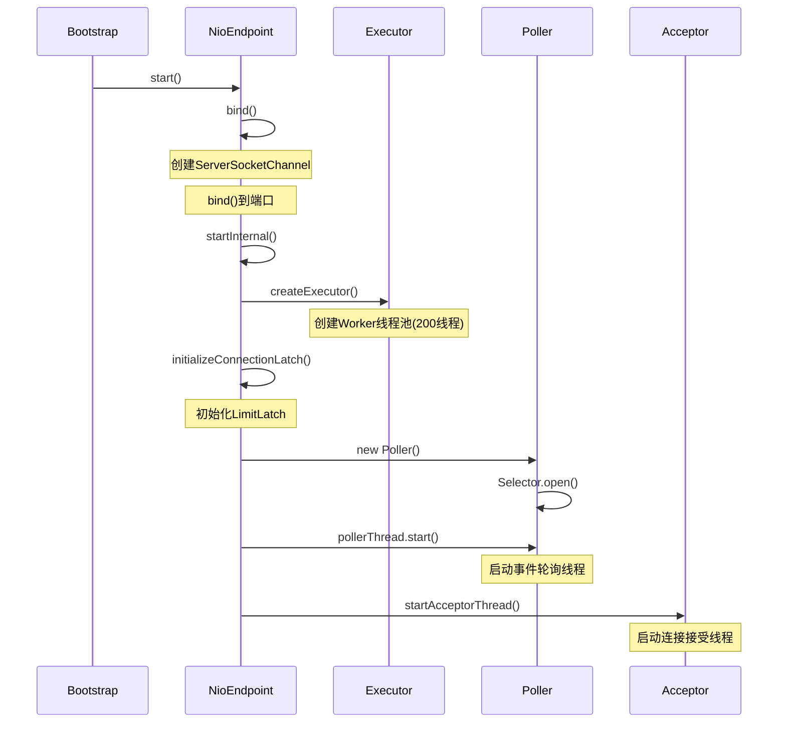
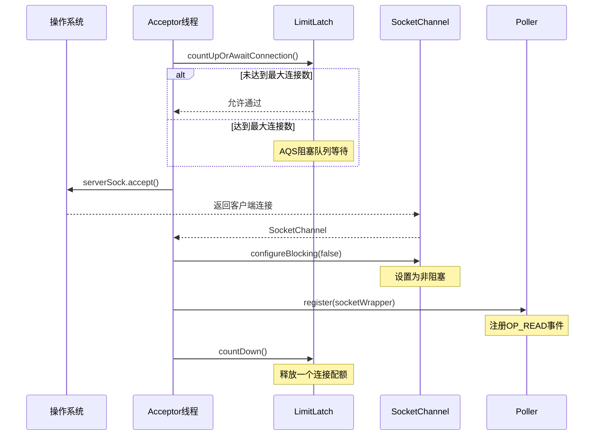
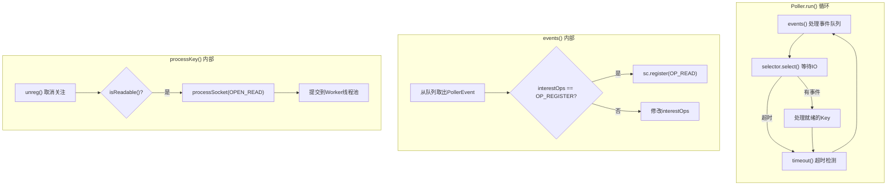
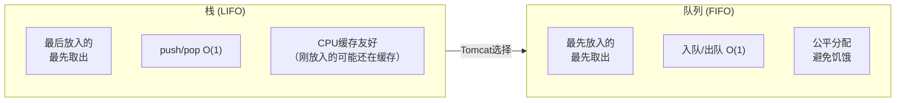
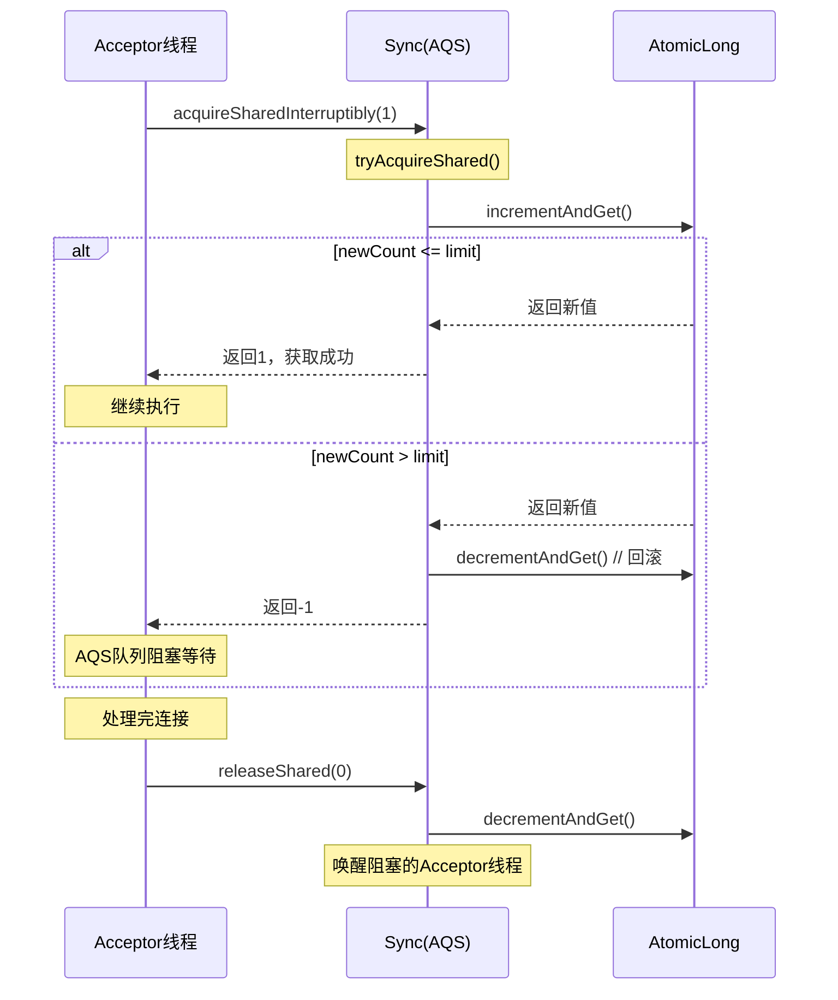
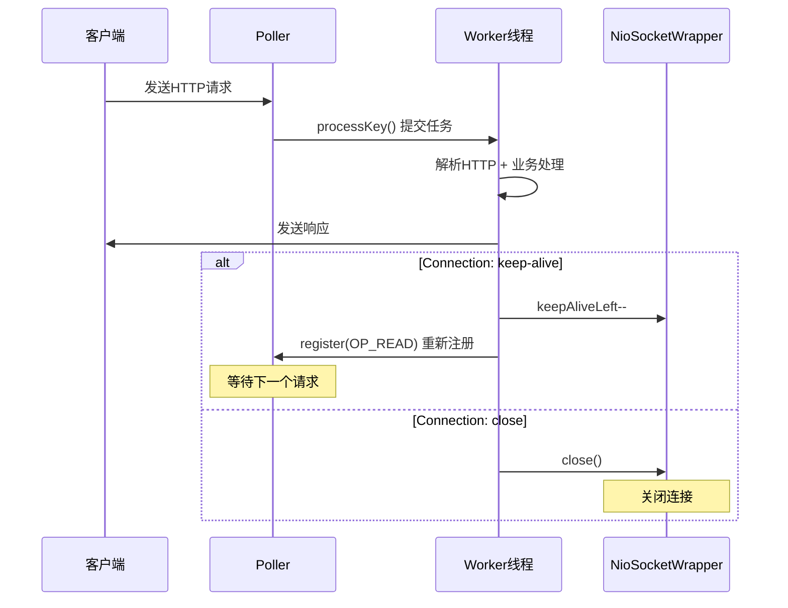

# Tomcat 8.5 NIO 核心机制深度源码剖析

> **📍 文档导航** | [📚 返回目录](./README.md) | [⬅️ 上一篇：Tomcat源码大全](./Tomcat源码大全.md) | [➡️ 下一篇：HTTP协议解析](./Tomcat源码_HTTP协议解析深度剖析.md)
>
> **📊 元信息** | 难度：⭐⭐⭐⭐⭐ | 预估时间：1-2天 | 前置阅读：[① Tomcat源码大全](./Tomcat源码大全.md)
>
> **🎯 学习目标** | 深入 Tomcat 网络层的**心脏**，理解高并发连接处理的底层实现

---

> 📁 **本地源码路径**：`/data/workspace/tomcat/`

---

## 目录

1. [整体架构与线程模型](#一整体架构与线程模型)
2. [NioEndpoint 启动流程](#二nioendpoint-启动流程)
3. [Acceptor 线程：连接接受](#三acceptor-线程连接接受)
4. [Poller 线程：事件轮询](#四poller-线程事件轮询)
5. [NioSocketWrapper：连接封装](#五niosocketwrapper连接封装)
6. [SynchronizedStack：对象池](#六synchronizedstack对象池)
7. [LimitLatch：连接限流](#七limitlatch连接限流)
8. [关键技术问题分析](#八关键技术问题分析)

---

## 一、整体架构与线程模型

### 1.1 NIO 三线程模型

Tomcat 8.5 使用经典的三线程 NIO 模型（Reactor 模式变体）：



### 1.2 源码位置

```
tomcat/java/org/apache/tomcat/util/net/NioEndpoint.java (81KB)
tomcat/java/org/apache/tomcat/util/collections/SynchronizedStack.java
tomcat/java/org/apache/tomcat/util/threads/LimitLatch.java
```

---

## 二、NioEndpoint 启动流程

### 2.1 bind() 初始化服务端 Socket

```java
// NioEndpoint.java 第-256行
192@Override
public void bind() throws Exception {
    initServerSocket();  // 初始化ServerSocket
    setStopLatch(new CountDownLatch(1));  // 优雅停机闩锁
    initialiseSsl();    // SSL初始化
}

// initServerSocket() 核心逻辑
protected void initServerSocket() throws Exception {
    // 1. 创建 ServerSocketChannel
    serverSock = ServerSocketChannel.open();
    
    // 2. 配置 Socket 属性
    socketProperties.setProperties(serverSock.socket());
    
    // 3. 绑定地址
    InetSocketAddress addr = new InetSocketAddress(getAddress(), getPortWithOffset());
    serverSock.socket().bind(addr, getAcceptCount());
    
    // 4. 设置为阻塞模式（关键！）
    serverSock.configureBlocking(true);  // 为什么设置为阻塞？
    // 原因：Acceptor线程专门处理accept()，阻塞不会影响其他连接
}
```

**关键设计**：
- `acceptCount = 100`：OS连接队列长度
- ServerSocket 设置为阻塞模式，Acceptor 单线程 accept()

### 2.2 startInternal() 启动三大组件

```java
// NioEndpoint.java 第262-324行
@Override
public void startInternal() throws Exception {
    if (!running) {
        running = true;
        paused = false;
        
        // ========== 1. 初始化对象缓存池 ==========
        if (socketProperties.getProcessorCache() != 0) {
            processorCache = new SynchronizedStack<>(
                SynchronizedStack.DEFAULT_SIZE,
                socketProperties.getProcessorCache());
        }
        if (socketProperties.getEventCache() != 0) {
            eventCache = new SynchronizedStack<>(...);
        }
        if (socketProperties.getBufferPool() != 0) {
            nioChannels = new SynchronizedStack<>(...);
        }
        
        // ========== 2. 创建Worker线程池 ==========
        if (getExecutor() == null) {
            createExecutor();
        }
        
        // ========== 3. 初始化连接限流器 ==========
        initializeConnectionLatch();
        
        // ========== 4. 创建并启动Poller线程 ==========
        poller = new Poller();
        Thread pollerThread = new Thread(poller, getName() + "-Poller");
        pollerThread.setPriority(threadPriority);
        pollerThread.setDaemon(true);
        pollerThread.start();
        
        // ========== 5. 启动Acceptor线程 ==========
        startAcceptorThread();
    }
}
```

### 2.3 启动流程图



---

## 三、Acceptor 线程：连接接受

### 3.1 Acceptor 核心逻辑

```java
// AbstractEndpoint.java 内部类 Acceptor
public void run() {
    int errorDelay = 0;
    
    while (!stop) {
        try {
            // 1. 等待连接许可（限流控制）
            endpoint.countUpOrAwaitConnection();
            
            // 2. accept() 新连接 - 阻塞等待
            U socket = endpoint.serverSocketAccept();
            errorDelay = 0;
            
            // 3. 配置Socket并注册到Poller
            if (!endpoint.processSocket(socket, true, false)) {
                endpoint.destroySocket(socket);
            }
        } catch (Throwable t) {
            log.error(..., t);
        }
    }
}
```

### 3.2 连接接受完整流程



### 3.3 setSocketOptions() 配置连接

```java
// NioEndpoint.java 第438-495行
@Override
protected boolean setSocketOptions(SocketChannel socket) {
    NioSocketWrapper socketWrapper = null;
    try {
        // 1. 从对象池获取 NioChannel（性能优化关键！）
        NioChannel channel = null;
        if (nioChannels != null) {
            channel = nioChannels.pop();  // 对象复用
        }
        if (channel == null) {
            // 创建SocketBufferHandler
            SocketBufferHandler bufhandler = new SocketBufferHandler(
                socketProperties.getAppReadBufSize(),   // 默认8KB
                socketProperties.getAppWriteBufSize(), // 默认8KB
                socketProperties.getDirectBuffer());   // 是否使用直接内存
            
            if (isSSLEnabled()) {
                channel = new SecureNioChannel(bufhandler, this);
            } else {
                channel = new NioChannel(bufhandler);
            }
        }
        
        // 2. 创建 NioSocketWrapper
        NioSocketWrapper newWrapper = new NioSocketWrapper(channel, this);
        channel.reset(socket, newWrapper);
        connections.put(socket, newWrapper);  // 全局连接管理
        
        // 3. 设置为非阻塞（关键！）
        socket.configureBlocking(false);
        
        // 4. 配置超时
        socketWrapper.setReadTimeout(getConnectionTimeout());
        socketWrapper.setWriteTimeout(getConnectionTimeout());
        socketWrapper.setKeepAliveLeft(getMaxKeepAliveRequests());
        
        // 5. 注册到Poller
        poller.register(socketWrapper);
        
        return true;
    } catch (Throwable t) {
        ...
    }
}
```

---

## 四、Poller 线程：事件轮询

### 4.1 Poller 核心数据结构

```java
// NioEndpoint.java 第606-639行
public class Poller implements Runnable {
    
    private Selector selector;  // NIO多路复用器
    
    // 事件队列 - Acceptor将新连接放入此队列
    private final SynchronizedQueue<PollerEvent> events = 
        new SynchronizedQueue<>();
    
    private volatile boolean close = false;  // 关闭标识
    
    // 性能优化：减少超时检测频率
    private long nextExpiration = 0;
    
    // 性能优化：减少selector.wakeup()调用
    private AtomicLong wakeupCounter = new AtomicLong(0);
    
    private volatile int keyCount = 0;  // 就绪事件数
    
    public Poller() throws IOException {
        this.selector = Selector.open();  // 创建Selector
    }
}
```

### 4.2 Poller.run() 主循环

```java
// NioEndpoint.java 第816-898行
@Override
public void run() {
    while (true) {
        boolean hasEvents = false;
        
        try {
            if (!close) {
                // 1. 处理事件队列（Acceptor放入的新连接）
                hasEvents = events();
                
                // 2. Selector阻塞等待IO事件
                // wakeupCounter优化：避免不必要的wakeup()
                if (wakeupCounter.getAndSet(-1) > 0) {
                    keyCount = selector.selectNow();  // 有事件，立即返回
                } else {
                    keyCount = selector.select(selectorTimeout);  // 默认1秒
                }
                wakeupCounter.set(0);
            }
            
            if (close) {
                events();
                timeout(0, false);
                selector.close();
                break;
            }
            
            // 3. 如果超时返回，再次检查队列（可能有新事件）
            if (keyCount == 0) {
                hasEvents = (hasEvents | events());
            }
        } catch (Throwable x) {
            log.error(..., x);
            continue;
        }
        
        // 4. 处理就绪的IO事件
        Iterator<SelectionKey> iterator = 
            keyCount > 0 ? selector.selectedKeys().iterator() : null;
        
        while (iterator != null && iterator.hasNext()) {
            SelectionKey sk = iterator.next();
            iterator.remove();
            NioSocketWrapper socketWrapper = (NioSocketWrapper) sk.attachment();
            if (socketWrapper != null) {
                processKey(sk, socketWrapper);  // 分发给Worker线程
            }
        }
        
        // 5. 超时检测
        timeout(keyCount, hasEvents);
    }
    
    getStopLatch().countDown();
}
```

### 4.3 Poller 事件处理流程



### 4.4 wakeupCounter 优化机制

```java
// 核心优化：减少selector.wakeup()调用（该操作成本高）

// Acceptor线程添加事件时
private void addEvent(PollerEvent event) {
    events.offer(event);
    
    // wakeupCounter状态机：
    // 0: 空闲状态
    // >0: 有新事件，等待处理
    // -1: Poller正在select()阻塞中
    
    if (wakeupCounter.incrementAndGet() == 0) {
        // 之前是0，现在是1，说明Poller可能在select()
        selector.wakeup();
    }
}

// Poller线程select()前
if (wakeupCounter.getAndSet(-1) > 0) {
    // 之前>0，说明有事件，立即返回
    keyCount = selector.selectNow();
} else {
    // 之前<=0，正常阻塞等待
    keyCount = selector.select(selectorTimeout);
}
```

---

## 五、NioSocketWrapper：连接封装

### 5.1 核心字段详解

```java
// NioEndpoint.java 第1183-1205行
public static class NioSocketWrapper extends SocketWrapperBase<NioChannel> {
    
    // === 对象池引用 ===
    private final SynchronizedStack<NioChannel> nioChannels;
    private final Poller poller;
    
    // === NIO核心 ===
    private int interestOps = 0;  // 关注的事件位图
    // OP_READ = 1, OP_WRITE = 4
    
    // === 超时追踪 ===
    private volatile long lastRead = System.currentTimeMillis();
    private volatile long lastWrite = lastRead;
    
    // === 阻塞读写控制 ===
    private final Object readLock;
    private volatile boolean readBlocking = false;
    private final Object writeLock;
    private volatile boolean writeBlocking = false;
    
    // === 零拷贝 ===
    private volatile SendfileData sendfileData = null;
    
    public NioSocketWrapper(NioChannel channel, NioEndpoint endpoint) {
        super(channel, endpoint);
        nioChannels = endpoint.getNioChannels();
        poller = endpoint.getPoller();
        socketBufferHandler = channel.getBufHandler();
        readLock = (readPending == null) ? new Object() : readPending;
        writeLock = (writePending == null) ? new Object() : writePending;
    }
}
```

### 5.2 SelectionKey 位运算详解

```java
// NioSocketWrapper.java 第1210-1212行
public boolean interestOpsHas(int targetOp) {
    return (this.interestOps() & targetOp) == targetOp;
}

// 位运算示例
/*
OP_READ    = 1  = 0b0001
OP_WRITE   = 4  = 0b0100
OP_CONNECT = 8  = 0b1000
OP_ACCEPT  = 16 = 0b10000

// 组合关注
interestOps = OP_READ | OP_WRITE  // 0b0101 = 5

// 检查是否关注读
(5 & 1) == 1  // true

// 检查是否关注写
(5 & 4) == 4  // true

// 取消关注
interestOps = interestOps & ~OP_READ  // 0b0100 = 4
*/
```

### 5.3 读写超时检测

```java
// Poller.timeout() 第1095-1177行
protected void timeout(int keyCount, boolean hasEvents) {
    long now = System.currentTimeMillis();
    
    // 性能优化：不是每次循环都检测超时
    if (nextExpiration > 0 && (keyCount > 0 || hasEvents) 
        && (now < nextExpiration) && !close) {
        return;  // 跳过本次检测
    }
    
    for (SelectionKey key : selector.keys()) {
        NioSocketWrapper socketWrapper = (NioSocketWrapper) key.attachment();
        
        // 检查读超时
        if (socketWrapper.interestOpsHas(SelectionKey.OP_READ)) {
            long delta = now - socketWrapper.getLastRead();
            long timeout = socketWrapper.getReadTimeout();
            if (timeout > 0 && delta > timeout) {
                // 触发读超时处理
                processSocket(socketWrapper, SocketEvent.ERROR, true);
            }
        }
        
        // 检查写超时（逻辑类似）
    }
    
    // 更新下次检测时间
    nextExpiration = System.currentTimeMillis() + socketProperties.getTimeoutInterval();
}
```

---

## 六、SynchronizedStack：对象池

### 6.1 设计目标

```java
// tomcat/java/org/apache/tomcat/util/collections/SynchronizedStack.java

/**
 * GC-free alternative to java.util.Stack
 * 
 * 设计目标：
 * 1. 零GC或最小GC：对象复用，避免频繁创建/销毁
 * 2. 高性能：push/pop O(1)
 * 3. 无需缩容：只支持扩容或固定大小
 * 4. 线程安全：synchronized保护
 */
```

### 6.2 数据结构与实现

```java
public class SynchronizedStack<T> {
    
    // 默认初始容量
    public static final int DEFAULT_SIZE = 128;
    private static final int DEFAULT_LIMIT = -1;  // -1表示无限制
    
    private int size;           // 当前数组容量
    private final int limit;    // 最大容量，-1无限制
    
    private int index = -1;     // 栈顶指针，-1表示空栈
    
    private Object[] stack;     // 对象数组
    
    // 构造方法
    public SynchronizedStack(int size, int limit) {
        if (limit > -1 && size > limit) {
            this.size = limit;  // 不能超过limit
        } else {
            this.size = size;
        }
        this.limit = limit;
        stack = new Object[this.size];
    }
}
```

### 6.3 push() 入栈实现

```java
// SynchronizedStack.java 第59-71行
public synchronized boolean push(T obj) {
    index++;  // 栈顶指针+1
    
    // 扩容检查
    if (index == size) {
        if (limit == -1 || size < limit) {
            expand();  // 扩容2倍
        } else {
            index--;  // 达到上限，拒绝入栈
            return false;
        }
    }
    
    stack[index] = obj;  // 放入对象
    return true;
}

// 扩容逻辑
private void expand() {
    int newSize = size * 2;  // 2倍扩容
    
    if (limit != -1 && newSize > limit) {
        newSize = limit;  // 不能超过limit
    }
    
    Object[] newStack = new Object[newSize];
    System.arraycopy(stack, 0, newStack, 0, size);
    
    // 唯一会产生GC的地方：丢弃旧数组
    stack = newStack;
    size = newSize;
}
```

### 6.4 pop() 出栈实现

```java
// SynchronizedStack.java 第74-81行
@SuppressWarnings("unchecked")
public synchronized T pop() {
    if (index == -1) {
        return null;  // 空栈
    }
    
    T result = (T) stack[index];  // 取出栈顶对象
    stack[index--] = null;         // 置空引用，帮助GC
    
    return result;
}
```

### 6.5 为什么选择栈而不是队列？



**Tomcat 选择栈的原因**：
1. **LIFO 缓存友好**：最近归还的对象最可能再次被使用，可能还在 CPU 缓存中
2. **实现简单**：比无锁队列更简单
3. **性能稳定**：push/pop 都是固定操作

### 6.6 Tomcat 对象池使用场景

| 对象池 | 存储对象 | 用途 |
|--------|---------|------|
| `processorCache` | Http11Processor | HTTP 协议处理器复用 |
| `eventCache` | PollerEvent | Poller 事件对象复用 |
| `nioChannels` | NioChannel | NIO Channel 复用（含 Buffer） |

---

## 七、LimitLatch：连接限流

### 7.1 基于 AQS 的限流器

```java
// tomcat/java/org/apache/tomcat/util/threads/LimitLatch.java

/**
 * 限制最大并发连接数
 * 基于 AbstractQueuedSynchronizer (AQS) 实现
 */
public class LimitLatch {
    
    // 内部类：Sync 同步器
    private class Sync extends AbstractQueuedSynchronizer {
        
        // 尝试获取共享锁
        @Override
        protected int tryAcquireShared(int ignored) {
            long newCount = count.incrementAndGet();  // 原子+1
            
            if (!released && newCount > limit) {  // 超过限制
                count.decrementAndGet();  // 回滚
                return -1;  // 获取失败，阻塞
            }
            return 1;  // 获取成功
        }
        
        // 释放共享锁
        @Override
        protected boolean tryReleaseShared(int arg) {
            count.decrementAndGet();  // 原子-1
            return true;
        }
    }
    
    private final Sync sync;
    private final AtomicLong count;      // 当前连接数
    private volatile long limit;         // 最大连接数
    private volatile boolean released = false;
}
```

### 7.2 核心方法

```java
// 获取连接许可（可能阻塞）
public void countUpOrAwait() throws InterruptedException {
    sync.acquireSharedInterruptibly(1);
}

// 释放连接许可
public long countDown() {
    sync.releaseShared(0);
    return count.get();
}
```

### 7.3 限流流程图



### 7.4 与 Semaphore 的区别

| 特性 | LimitLatch | Semaphore |
|------|-----------|-----------|
| 实现 | 内部AQS | 内部AQS |
| 公平性 | 支持 | 支持 |
| 用途 | 连接数限流 | 资源许可证 |
| 释放 | countDown() | release() |

---

## 八、关键技术问题分析

### 8.1 为什么 ServerSocket 要设置为阻塞模式？

```java
// NioEndpoint.java 第255行
serverSock.configureBlocking(true);  // 阻塞模式
```

**原因分析**：
1. **Acceptor 专线程**：Acceptor 只处理 accept()，不处理其他 IO
2. **简化模型**：阻塞 accept() 不会影响其他连接
3. **性能考虑**：阻塞 accept() 比非阻塞 + select() 开销更小

**如果使用非阻塞**：
```java
// 伪代码
serverSock.configureBlocking(false);
while (running) {
    SocketChannel sc = serverSock.accept();
    if (sc != null) {
        // 处理连接
    }
    selector.select();  // 同时需要处理其他事件
}
```
这样 Acceptor 需要处理所有事件，复杂度增加。

### 8.2 为什么 Poller 只有一个？

```java
// NioEndpoint.java 第136-137行
@Deprecated
public int getPollerThreadCount() { return 1; }
```

**原因**：
1. **Selector 性能**：单个 Selector 可以管理数千连接
2. **避免竞争**：多 Selector 会增加复杂度
3. **NIO 瓶颈**：Selector 本身不是瓶颈，业务处理才是

**适用场景**：
- 单 Selector 可处理 10000+ 连接
- 如果连接数超过 50000，可考虑多 Selector

### 8.3 为什么需要对象池？

**场景**：每个 HTTP 请求都需要 Processor 处理

**without 对象池**：
```java
// 每次请求都创建
Http11Processor processor = new Http11Processor();
try {
    processor.service(request, response);
} finally {
    processor.recycle();  // 回收但不销毁
}
```

**with 对象池**：
```java
// 从池中获取
Http11Processor processor = processorCache.pop();
if (processor == null) {
    processor = new Http11Processor();
}
try {
    processor.service(request, response);
} finally {
    processorCache.push(processor);  // 归还池中
}
```

**性能收益**：
- 减少对象创建/GC 开销
- 降低内存碎片
- 提高缓存命中率

### 8.4 Keep-Alive 复用原理



### 8.5 零拷贝 Sendfile 原理

```java
// NioEndpoint.java 第974-1083行
// Poller.processSendfile()

// 传统方式：4次拷贝
// 磁盘 → 内核缓冲区 → 用户空间 → Socket缓冲区 → 网卡

// 零拷贝：2次拷贝（使用transferTo）
FileInputStream fis = new FileInputStream(file);
FileChannel fchannel = fis.getChannel();

// 直接在内核空间传输
long transferred = fchannel.transferTo(
    position,      // 文件位置
    length,        // 传输长度
    socketChannel  // 目标Socket
);
```

---

## 总结

### 核心设计要点

| 要点 | 实现方式 |
|------|---------|
| **线程模型** | 1 Acceptor + 1 Poller + N Worker |
| **连接接受** | 阻塞 accept() + 限流器 |
| **事件轮询** | 单 Selector + 事件队列 |
| **对象复用** | SynchronizedStack 对象池 |
| **限流机制** | AQS 共享锁 |
| **超时检测** | Poller 周期性检测 |
| **Keep-Alive** | 同一连接处理多个请求 |

### 性能优化手段

1. **对象池**：避免频繁 GC
2. **零拷贝**：减少内存拷贝
3. **直接内存**：减少 JVM 堆操作
4. **wakeup 优化**：减少无效唤醒
5. **超时检测优化**：减少检测频率

---

**源码版本**: Tomcat 8.5.x
**分析深度**: 技术专家级别
