# Tomcat 源码核心流程全景图

> **📍 文档导航** | [📚 返回目录](./README.md) | [⬅️ 上一篇：线程池实现](./Tomcat源码_线程池实现深度分析.md) | [➡️ 下一篇：面试问题清单](./Tomcat源码_面试问题清单.md)
>
> **📊 元信息** | 难度：⭐⭐⭐⭐ | 预估时间：0.5天 | 前置阅读：建议完成 [①②③⑤⑧](./README.md#21--完整学习路径推荐约-7-12-天)
>
> **🎯 学习目标** | 一张图串联 8 篇文档的核心内容，形成完整的知识网络

---

> 📁 **本地源码路径**：`/data/workspace/tomcat/`
>
> 📖 8 篇文档 + 9,500+ 行源码分析总结

---

## 一、请求处理完整链路

### 1.1 宏观架构图

> 📍 源码入口：`CoyoteAdapter.service()` → `/data/workspace/tomcat/java/org/apache/catalina/connector/CoyoteAdapter.java:313`

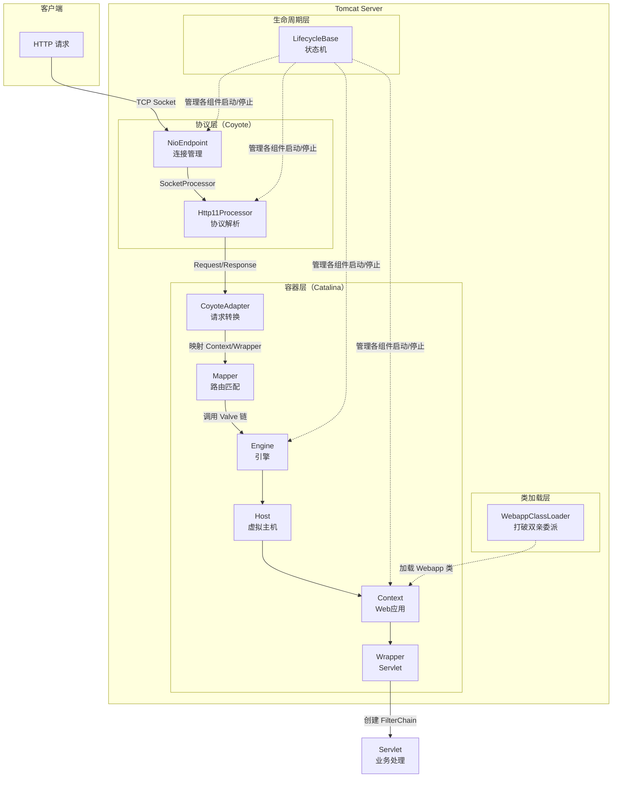

### 1.2 线程模型：Acceptor → Poller → Worker

> 📍 源码入口：
> - Acceptor: `Acceptor.run()` → `/data/workspace/tomcat/java/org/apache/tomcat/util/net/Acceptor.java:69`
> - Poller: `NioEndpoint.Poller.run()` → `/data/workspace/tomcat/java/org/apache/tomcat/util/net/NioEndpoint.java:819`

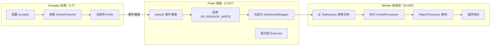

---

## 二、NIO 处理流程

### 2.1 NioEndpoint 启动流程

> 📍 源码入口：`NioEndpoint.startInternal()` → `/data/workspace/tomcat/java/org/apache/tomcat/util/net/NioEndpoint.java:263`

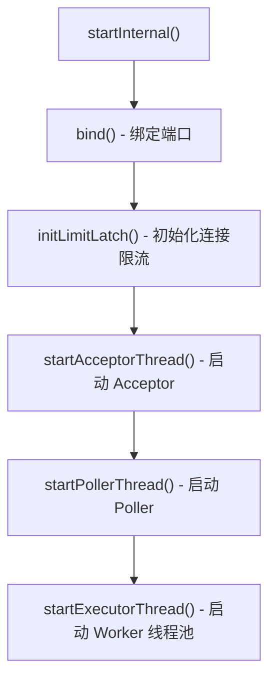

### 2.2 Acceptor 处理流程

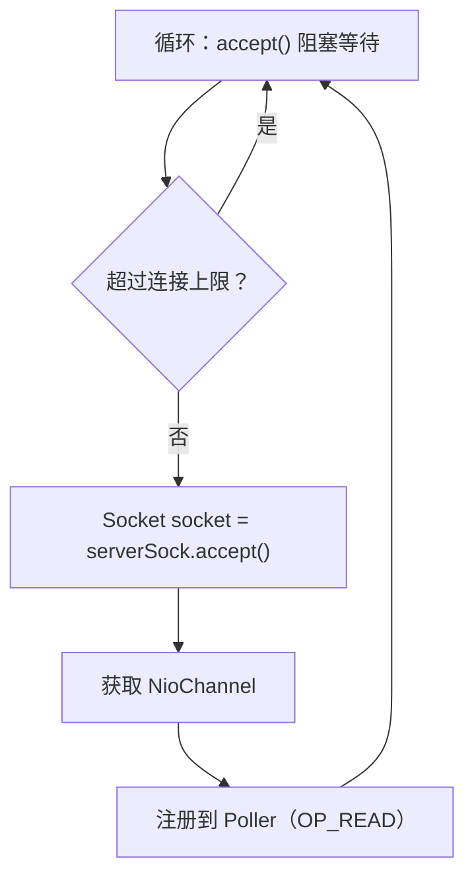

### 2.3 Poller 处理流程

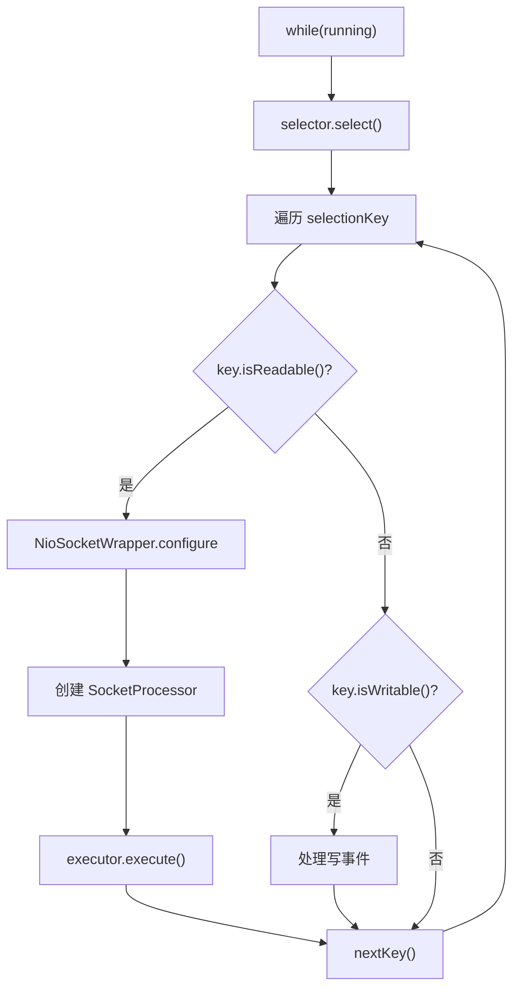

---

## 三、HTTP 协议解析流程

### 3.1 解析状态机

> 📍 源码入口：
> - `Http11InputBuffer.parseRequestLine()` → `/data/workspace/tomcat/java/org/apache/coyote/http11/Http11InputBuffer.java:345`
> - `Http11InputBuffer.parseHeaders()` → `/data/workspace/tomcat/java/org/apache/coyote/http11/Http11InputBuffer.java:598`

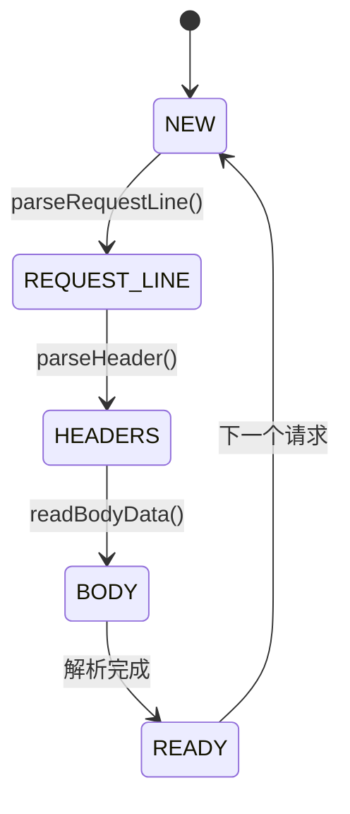

### 3.2 请求行解析 7 阶段

```
┌─────────────────────────────────────────────────────────────┐
│ Phase 0: 跳过空白字符                                       │
│ Phase 1: 解析 Method（GET/POST 等）                        │
│ Phase 2: 跳过空白字符                                       │
│ Phase 3: 解析 URI                                          │
│ Phase 4: 跳过空白字符                                       │
│ Phase 5: 解析 Protocol（HTTP/1.1）                         │
│ Phase 6: 跳过回车换行                                       │
│ Phase 7: 状态机结束，ready = true                          │
└─────────────────────────────────────────────────────────────┘
```

---

## 四、内存管理流程

### 4.1 四大对象池

> 📍 源码入口：
> - `NioEndpoint.nioChannels` → `/data/workspace/tomcat/java/org/apache/tomcat/util/net/NioEndpoint.java:96`
> - `NioEndpoint.eventCache` → `/data/workspace/tomcat/java/org/apache/tomcat/util/net/NioEndpoint.java:91`
> - `AbstractEndpoint.processorCache` → `/data/workspace/tomcat/java/org/apache/tomcat/util/net/AbstractEndpoint.java:208`
> - `AbstractProtocol.recycledProcessors` → `/data/workspace/tomcat/java/org/apache/coyote/AbstractProtocol.java:823`
>
> ⚠️ **NioSocketWrapper 没有对象池**，每次新连接都 `new`（NioEndpoint.java:464）

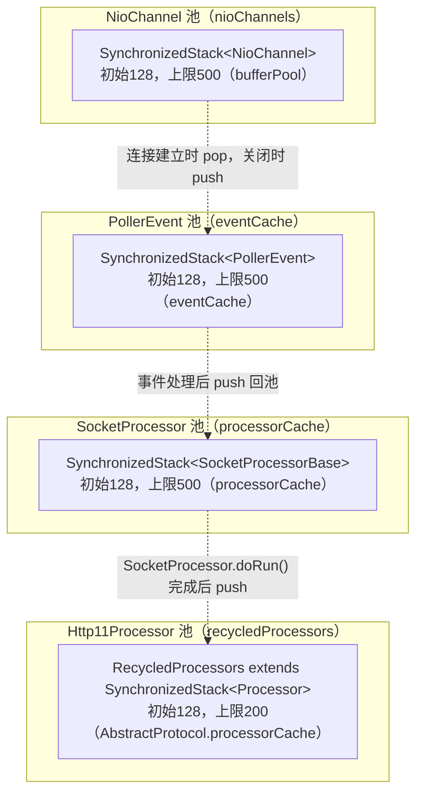

### 4.2 直接内存分配流程

```
用户请求 → NioChannel.read() 
         → ByteBuffer buf = socketBuffer.handler.buf
         → fill(buf) 从 Channel 读取数据到 DirectByteBuffer
         → 解析完成后 recycle 归还到池
```

---

## 五、Mapper 路由匹配流程

### 5.1 三级匹配

> 📍 源码入口：`Mapper.internalMap()` → `/data/workspace/tomcat/java/org/apache/catalina/mapper/Mapper.java:698`

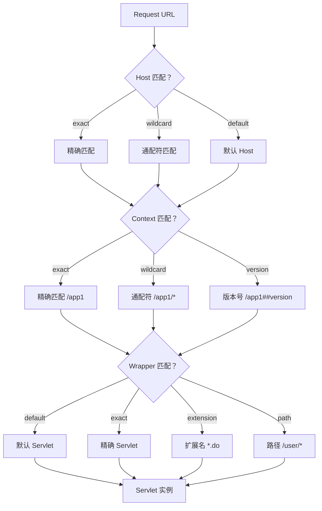

---

## 六、Pipeline/Valve 责任链流程

### 6.1 四层 Valve

> 📍 源码入口：`StandardWrapperValve.invoke()` → `/data/workspace/tomcat/java/org/apache/catalina/core/StandardWrapperValve.java:87`

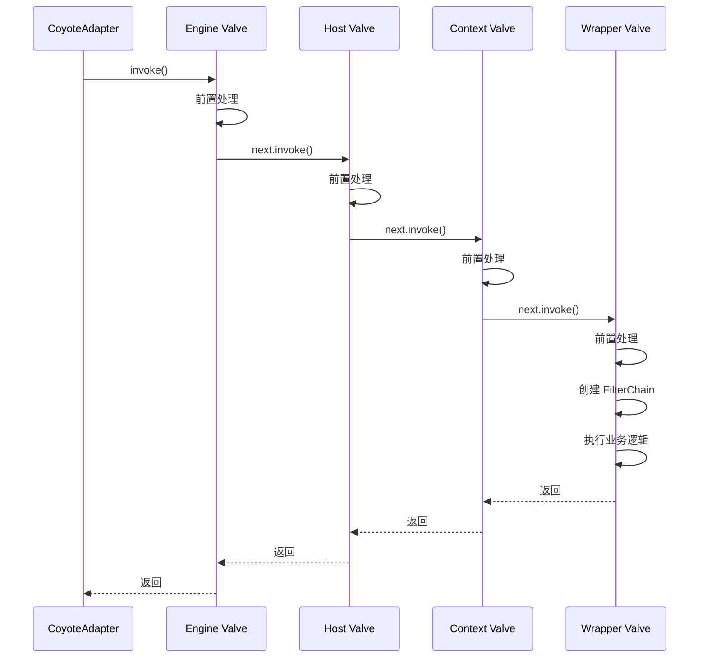

---

## 七、FilterChain 执行流程

### 7.1 洋葱模型

> 📍 源码入口：`ApplicationFilterChain.internalDoFilter()` → `/data/workspace/tomcat/java/org/apache/catalina/core/ApplicationFilterChain.java:160`

```
┌────────────────────────────────────────────────────────────┐
│                     FilterChain 执行顺序                    │
├────────────────────────────────────────────────────────────┤
│                                                            │
│   第 1 轮：正向执行（从 Filter1 到 FilterN）               │
│   ┌─────┐    ┌─────┐    ┌─────┐    ┌─────┐               │
│   │ F1  │ -> │ F2  │ -> │ F3  │ -> │Servlet│              │
│   └─────┘    └─────┘    └─────┘    └─────┘               │
│                                                            │
│   第 2 轮：反向执行（从 FilterN 到 Filter1）               │
│   ┌─────┐    ┌─────┐    ┌─────┐    ┌─────┐               │
│   │Servlet│ <-│ F3  │ <-│ F2  │ <-│ F1  │               │
│   └─────┘    └─────┘    └─────┘    └─────┘               │
│                                                            │
└────────────────────────────────────────────────────────────┘
```

---

## 八、Lifecycle 状态机

### 8.1 12 状态转换

> 📍 源码入口：
> - `LifecycleBase.init()` → `/data/workspace/tomcat/java/org/apache/catalina/util/LifecycleBase.java:120`
> - `LifecycleBase.start()` → `/data/workspace/tomcat/java/org/apache/catalina/util/LifecycleBase.java:145`

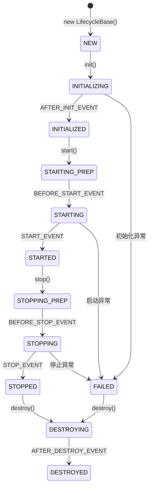

---

## 九、类加载器层次

### 9.1 双亲委派 vs Tomcat 打破

> 📍 源码入口：`WebappClassLoaderBase.loadClass()` → `/data/workspace/tomcat/java/org/apache/catalina/loader/WebappClassLoaderBase.java:1174`

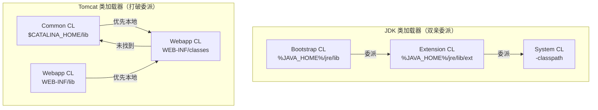

---

## 十、线程池执行流程

### 10.1 TaskQueue offer() 决策

> 📍 源码入口：`TaskQueue.offer()` → `/data/workspace/tomcat/java/org/apache/tomcat/util/threads/TaskQueue.java:98`

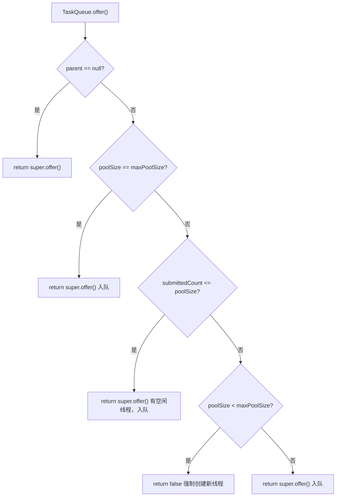

### 10.2 线程更新机制（热部署）

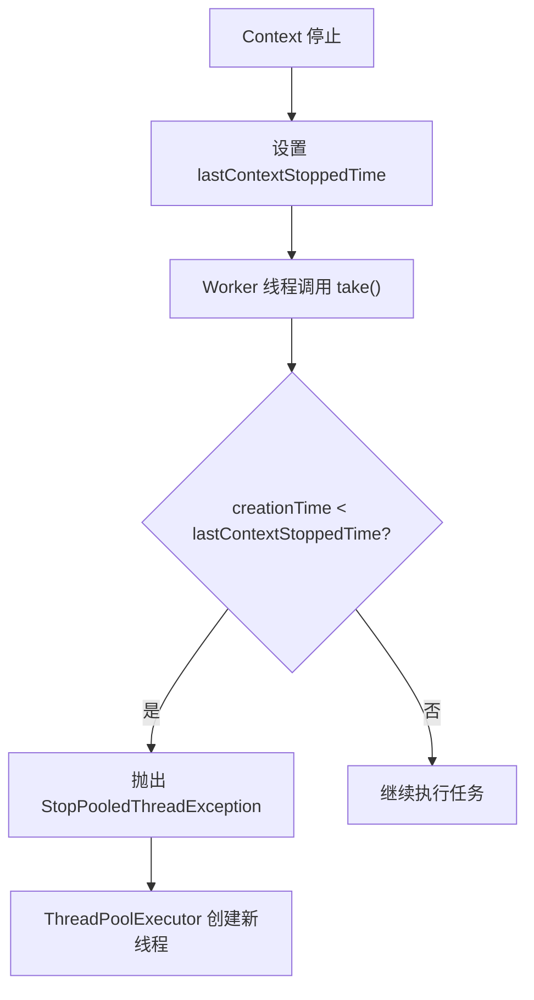

---

## 十一、面试必问流程串联

### 完整请求处理链路

```
1. TCP 连接建立
   └─> Acceptor.accept() → NioChannel

2. Poller 事件就绪
   └─> selector.select() → 注册 OP_READ → executor.execute()

3. HTTP 协议解析
   └─> Http11InputBuffer.parseRequestLine() → 状态机 7 阶段
   └─> Http11InputBuffer.parseHeader() → MimeHeaders

4. 路由匹配
   └─> Mapper.map() → Host → Context → Wrapper

5. 责任链调用
   └─> Engine Valve → Host Valve → Context Valve → Wrapper Valve

6. Filter 处理
   └─> ApplicationFilterChain.doFilter() → 洋葱模型

7. Servlet 执行
   └─> service() → doGet/doPost

8. 响应返回
   └─> Http11OutputBuffer.flush() → ByteBuffer → SocketChannel
```

---

## 十二、设计模式汇总

| 设计模式 | 应用场景 | 文档位置 |
|---------|---------|---------|
| 状态机模式 | HTTP 解析（7阶段）、Lifecycle（12状态）、异步Servlet（13状态） | ③⑥ |
| 责任链模式 | Pipeline/Valve、FilterChain | ⑤ |
| 模板方法模式 | LifecycleBase 定义启动/停止流程 | ⑥ |
| 对象池模式 | SynchronizedStack（NioChannel/PollerEvent/SocketProcessor/Http11Processor） | ②④⑧ |
| 装饰器模式 | NioSocketWrapper 包装 Socket | ② |
| 工厂模式 | TaskThreadFactory 创建线程 | ⑧ |
| 策略模式 | 不同协议处理器（HTTP/AJP/WebSocket） | ③ |
