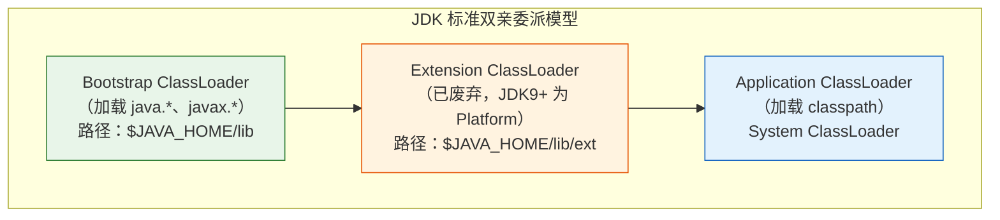
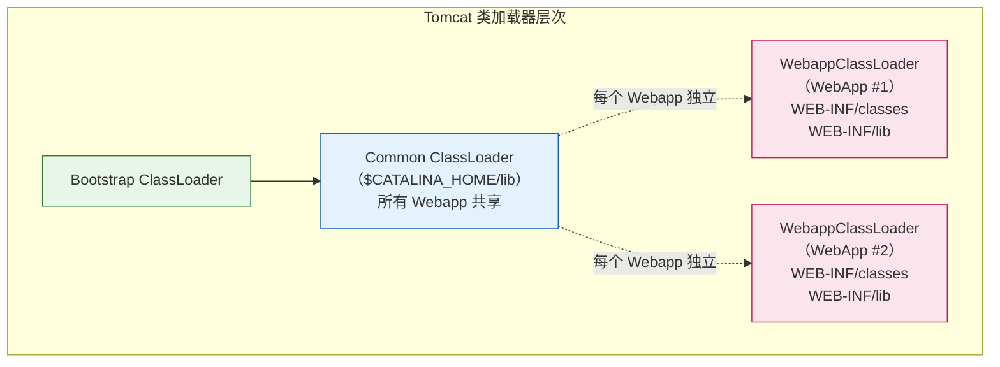
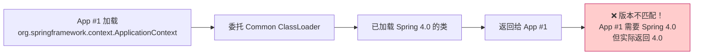
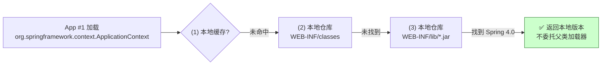
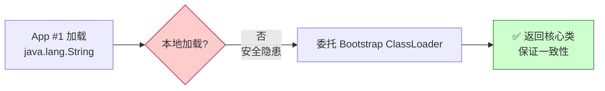
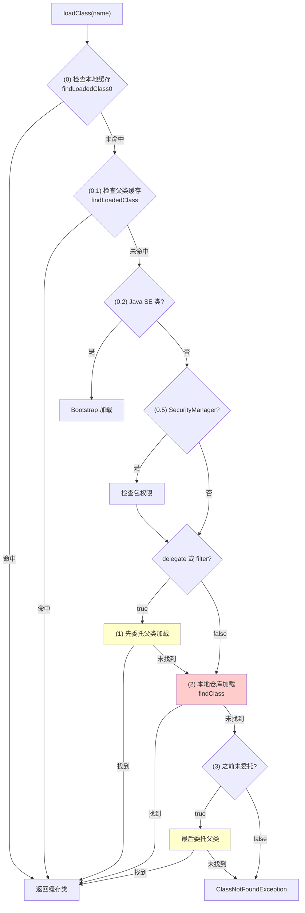
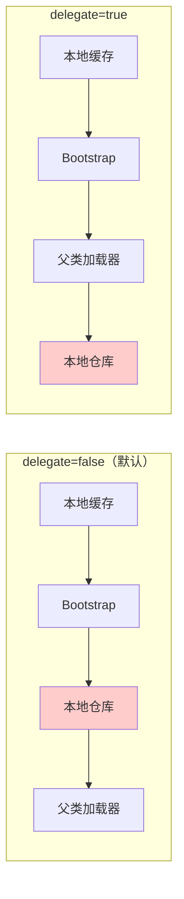

# Tomcat 类加载器与双亲委派打破深度分析

> **📍 文档导航** | [📚 返回目录](./README.md) | [⬅️ 上一篇：Lifecycle生命周期](./Tomcat源码_Lifecycle生命周期状态机深度分析.md) | [➡️ 下一篇：线程池实现](./Tomcat源码_线程池实现深度分析.md)
>
> **📊 元信息** | 难度：⭐⭐⭐⭐ | 预估时间：0.5-1天 | 前置阅读：[① Tomcat源码大全](./Tomcat源码大全.md)
>
> **🎯 学习目标** | 理解 Tomcat **类隔离机制**，掌握如何打破双亲委派以及为什么要保留双亲委派的部分规则

---

> 📁 **本地源码路径**：`/data/workspace/tomcat/`
>
> **核心源码位置**：`org.apache.catalina.loader.WebappClassLoaderBase`、`org.apache.catalina.loader.ParallelWebappClassLoader`

---

## 一、总体架构

### 1.1 JDK 标准类加载器层次



**双亲委派规则**：
1. 先委托父类加载器加载
2. 父类加载器无法加载，自己才加载
3. 保证核心类（如 `java.lang.String`）不被篡改

### 1.2 Tomcat 类加载器层次



**关键区别**：
- 每个 Webapp 有独立的 `WebappClassLoader`
- Webapp 之间类隔离（如不同版本的 Spring）
- 共享类放在 `Common ClassLoader`

---

## 二、为什么要打破双亲委派？

### 2.1 问题场景

假设两个 Webapp：
- WebApp #1 使用 Spring 4.0
- WebApp #2 使用 Spring 5.0

如果使用标准双亲委派：



### 2.2 Tomcat 解决方案

**打破双亲委派**，先尝试本地加载：



### 2.3 但核心类仍需保护

不能破坏 Java 核心类：



---

## 三、WebappClassLoaderBase 核心实现【Tomcat 源码】

### 3.1 类继承关系

```java:115:116:/data/workspace/tomcat/java/org/apache/catalina/loader/WebappClassLoaderBase.java
public abstract class WebappClassLoaderBase extends URLClassLoader
        implements Lifecycle, InstrumentableClassLoader, WebappProperties, PermissionCheck {
```

继承 `URLClassLoader`，拥有从 URL（文件、jar）加载类的能力。

### 3.2 loadClass() — 打破双亲委派的核心【Tomcat 源码】

```java:1174:1340:/data/workspace/tomcat/java/org/apache/catalina/loader/WebappClassLoaderBase.java
@Override
public Class<?> loadClass(String name, boolean resolve) throws ClassNotFoundException {

    synchronized (getClassLoadingLock(name)) {
        if (log.isTraceEnabled()) {
            log.trace("loadClass(" + name + ", " + resolve + ")");
        }
        Class<?> clazz = null;

        // Log access to stopped class loader
        checkStateForClassLoading(name);

        // (0) Check our previously loaded local class cache
        clazz = findLoadedClass0(name);
        if (clazz != null) {
            if (log.isTraceEnabled()) {
                log.trace("  Returning class from cache");
            }
            if (resolve) {
                resolveClass(clazz);
            }
            return clazz;
        }

        // (0.1) Check our previously loaded class cache
        clazz = findLoadedClass(name);
        if (clazz != null) {
            if (log.isTraceEnabled()) {
                log.trace("  Returning class from cache");
            }
            if (resolve) {
                resolveClass(clazz);
            }
            return clazz;
        }

        /*
         * (0.2) Try loading the class with the bootstrap class loader, to prevent the webapp from overriding Java
         * SE classes. This implements SRV.10.7.2
         */
        String resourceName = binaryNameToPath(name, false);

        ClassLoader javaseLoader = getJavaseClassLoader();
        boolean tryLoadingFromJavaseLoader;
        try {
            URL url;
            if (securityManager != null) {
                PrivilegedAction<URL> dp = new PrivilegedJavaseGetResource(resourceName);
                url = AccessController.doPrivileged(dp);
            } else {
                url = javaseLoader.getResource(resourceName);
            }
            tryLoadingFromJavaseLoader = url != null;
        } catch (Throwable t) {
            ExceptionUtils.handleThrowable(t);
            tryLoadingFromJavaseLoader = true;
        }

        if (tryLoadingFromJavaseLoader) {
            try {
                clazz = javaseLoader.loadClass(name);
                if (clazz != null) {
                    if (resolve) {
                        resolveClass(clazz);
                    }
                    return clazz;
                }
            } catch (ClassNotFoundException e) {
                // Ignore
            }
        }

        // (0.5) Permission to access this class when using a SecurityManager
        if (securityManager != null) {
            int i = name.lastIndexOf('.');
            if (i >= 0) {
                try {
                    securityManager.checkPackageAccess(name.substring(0, i));
                } catch (SecurityException se) {
                    String error = sm.getString("webappClassLoader.restrictedPackage", name);
                    log.info(error, se);
                    throw new ClassNotFoundException(error, se);
                }
            }
        }

        boolean delegateLoad = delegate || filter(name, true);

        // (1) Delegate to our parent if requested
        if (delegateLoad) {
            if (log.isTraceEnabled()) {
                log.trace("  Delegating to parent classloader1 " + parent);
            }
            try {
                clazz = Class.forName(name, false, parent);
                if (clazz != null) {
                    if (log.isTraceEnabled()) {
                        log.trace("  Loading class from parent");
                    }
                    if (resolve) {
                        resolveClass(clazz);
                    }
                    return clazz;
                }
            } catch (ClassNotFoundException e) {
                // Ignore
            }
        }

        // (2) Search local repositories
        if (log.isTraceEnabled()) {
            log.trace("  Searching local repositories");
        }
        try {
            clazz = findClass(name);
            if (clazz != null) {
                if (log.isTraceEnabled()) {
                    log.trace("  Loading class from local repository");
                }
                if (resolve) {
                    resolveClass(clazz);
                }
                return clazz;
            }
        } catch (ClassNotFoundException e) {
            // Ignore
        }

        // (3) Delegate to parent unconditionally
        if (!delegateLoad) {
            if (log.isTraceEnabled()) {
                log.trace("  Delegating to parent classloader at end: " + parent);
            }
            try {
                clazz = Class.forName(name, false, parent);
                if (clazz != null) {
                    if (resolve) {
                        resolveClass(clazz);
                    }
                    return clazz;
                }
            } catch (ClassNotFoundException e) {
                // Ignore
            }
        }
    }

    throw new ClassNotFoundException(name);
}
```

### 3.3 类加载流程详解



**加载顺序总结**：

| 步骤 | 操作 | 说明 |
|------|------|------|
| (0) | 本地缓存 | 已加载过的类直接返回 |
| (0.1) | 父类缓存 | JVM 层面的缓存 |
| (0.2) | Java SE 类 | 优先 Bootstrap，防止篡改核心类 |
| (0.5) | 安全检查 | SecurityManager 权限检查 |
| (1) | 条件委托 | `delegate=true` 或 `filter()` 返回 true |
| **(2)** | **本地加载** | **打破双亲委派的关键，先查 WEB-INF** |
| (3) | 最后委托 | 如果之前没委托，最后再试一次 |

### 3.4 filter() — 哪些类必须委派？【Tomcat 源码】

```java:2464:2545:/data/workspace/tomcat/java/org/apache/catalina/loader/WebappClassLoaderBase.java
protected boolean filter(String name, boolean isClassName) {

    if (name == null) {
        return false;
    }

    char ch;
    if (name.startsWith("javax")) {
        /* 5 == length("javax") */
        if (name.length() == 5) {
            return false;
        }
        ch = name.charAt(5);
        if (isClassName && ch == '.') {
            /* 6 == length("javax.") */
            if (name.startsWith("servlet.jsp.jstl.", 6)) {
                return false;
            }
            if (name.startsWith("annotation.", 6) || name.startsWith("el.", 6) || name.startsWith("servlet.", 6) ||
                    name.startsWith("websocket.", 6) || name.startsWith("security.auth.message.", 6)) {
                return true;  // ★ 必须委派给父类
            }
        } else if (!isClassName && ch == '/') {
            /* 6 == length("javax/") */
            if (name.startsWith("servlet/jsp/jstl/", 6)) {
                return false;
            }
            if (name.startsWith("annotation/", 6) || name.startsWith("el/", 6) || name.startsWith("servlet/", 6) ||
                    name.startsWith("websocket/", 6) || name.startsWith("security/auth/message/", 6)) {
                return true;  // ★ 必须委派给父类
            }
        }
    } else if (name.startsWith("org")) {
        /* 3 == length("org") */
        if (name.length() == 3) {
            return false;
        }
        ch = name.charAt(3);
        if (isClassName && ch == '.') {
            /* 4 == length("org.") */
            if (name.startsWith("apache.", 4)) {
                /* 11 == length("org.apache.") */
                if (name.startsWith("tomcat.jdbc.", 11)) {
                    return false;
                }
                if (name.startsWith("el.", 11) || name.startsWith("catalina.", 11) ||
                        name.startsWith("jasper.", 11) || name.startsWith("juli.", 11) ||
                        name.startsWith("tomcat.", 11) || name.startsWith("naming.", 11) ||
                        name.startsWith("coyote.", 11)) {
                    return true;  // ★ 必须委派给父类
                }
            }
        }
    }

    return false;
}
```

**必须委派的类（返回 true）**：

| 包名 | 说明 |
|------|------|
| `javax.annotation.*` | Java EE 注解 |
| `javax.el.*` | 表达式语言 |
| `javax.servlet.*` | Servlet API |
| `javax.websocket.*` | WebSocket API |
| `javax.security.auth.message.*` | 安全认证 |
| `org.apache.el.*` | Tomcat EL 实现 |
| `org.apache.catalina.*` | Tomcat 核心 |
| `org.apache.jasper.*` | JSP 引擎 |
| `org.apache.juli.*` | 日志框架 |
| `org.apache.tomcat.*` | Tomcat 工具 |
| `org.apache.naming.*` | JNDI 实现 |
| `org.apache.coyote.*` | 连接器核心 |

**例外（不委派）**：
- `javax.servlet.jsp.jstl.*` - JSTL 允许 Webapp 自定义
- `org.apache.tomcat.jdbc.*` - JDBC 池允许自定义

### 3.5 findClass() — 本地加载【Tomcat 源码】

```java:806:847:/data/workspace/tomcat/java/org/apache/catalina/loader/WebappClassLoaderBase.java
@Override
protected Class<?> findClass(String name) throws ClassNotFoundException {

    if (log.isTraceEnabled()) {
        log.trace("    findClass(" + name + ")");
    }

    Class<?> clazz = null;

    // (0) Check our previously loaded local class cache
    clazz = findLoadedClass0(name);
    if (clazz != null) {
        if (log.isTraceEnabled()) {
            log.trace("      Returning class from cache");
        }
        return clazz;
    }

    // (0.5) Check that the class was not loaded by the parent class loader
    //       This can happen under the security manager on JDK 7 and earlier
    //       implementations
    if (securityManager != null) {
        // ... 省略安全检查
    }

    // (1) Permission to access this class when using a SecurityManager
    if (securityManager != null) {
        // ... 省略权限检查
    }

    boolean delegateLoad = delegate || filter(name, true);

    // (2) Delegate to our parent if requested
    if (delegateLoad) {
        // ... 省略委托逻辑
    }

    // (3) Search local repositories
    if (log.isTraceEnabled()) {
        log.trace("      Searching local repositories");
    }
    try {
        clazz = findClassInternal(name);  // ★ 真正的本地查找
        if (clazz != null) {
            return clazz;
        }
    } catch (RuntimeException e) {
        throw e;
    }

    if (clazz == null && hasExternalRepositories) {
        try {
            clazz = super.findClass(name);  // 调用 URLClassLoader
        } catch (RuntimeException e) {
            throw e;
        }
    }
    
    throw new ClassNotFoundException(name);
}
```

### 3.6 findClassInternal() — 从 WEB-INF 加载【Tomcat 源码】

```java:2214:2280:/data/workspace/tomcat/java/org/apache/catalina/loader/WebappClassLoaderBase.java
protected Class<?> findClassInternal(String name) {

    checkStateForResourceLoading(name);

    if (name == null) {
        return null;
    }
    String path = binaryNameToPath(name, true);

    ResourceEntry entry = resourceEntries.get(path);
    WebResource resource = null;

    if (entry == null) {
        resource = resources.getClassLoaderResource(path);  // ★ 从 WebResourceRoot 获取

        if (!resource.exists()) {
            return null;
        }

        entry = new ResourceEntry();
        entry.lastModified = resource.getLastModified();

        // Add the entry in the local resource repository
        synchronized (resourceEntries) {
            ResourceEntry entry2 = resourceEntries.get(path);
            if (entry2 == null) {
                resourceEntries.put(path, entry);
            } else {
                entry = entry2;
            }
        }
    } else {
        resource = resources.getClassLoaderResource(path);
    }

    if (resource.isDirectory()) {
        return null;
    }

    // (1) 读取类文件字节码
    byte[] binaryContent = resource.getContent();
    if (binaryContent == null) {
        return null;
    }

    // (2) 获取代码源（用于安全管理器）
    CodeSource codeSource = null;
    Certificate[] certificates = resource.getCertificates();
    if (certificates != null) {
        codeSource = new CodeSource(resource.getURL(), certificates);
    } else {
        codeSource = new CodeSource(resource.getURL(), (Certificate[]) null);
    }

    // (3) 定义类
    String packageName = null;
    int pos = name.lastIndexOf('.');
    if (pos != -1) {
        packageName = name.substring(0, pos);
    }

    if (packageName != null) {
        // 尝试获取包定义
        Package pkg = getPackage(packageName);
        if (pkg == null) {
            try {
                definePackage(packageName, null, null, null, null, null, null, null);
            } catch (IllegalArgumentException e) {
                // Ignore - 包已存在
            }
        }
    }

    // (4) 调用 defineClass 定义类
    return defineClass(name, binaryContent, 0, binaryContent.length, codeSource);
}
```

---

## 四、delegate 配置

### 4.1 配置方式

在 `context.xml` 中配置：

```xml
<Context>
    <!-- true: 先委托父类加载器（标准双亲委派） -->
    <!-- false: 先本地加载（默认，打破双亲委派） -->
    <Loader delegate="false"/>
</Context>
```

### 4.2 两种模式对比

| 模式 | 加载顺序 | 适用场景 |
|------|---------|---------|
| `delegate="false"`（默认） | 本地 → 父类 | 大多数场景，类隔离 |
| `delegate="true"` | 父类 → 本地 | 需要优先使用共享库 |

### 4.3 加载顺序对比图



---

## 五、实际案例分析

### 5.1 案例：加载 Spring 的 DispatcherServlet

```
WebApp 加载 org.springframework.web.servlet.DispatcherServlet

1. loadClass("org.springframework.web.servlet.DispatcherServlet")
   ├── (0) 本地缓存？否
   ├── (0.1) 父类缓存？否
   ├── (0.2) Java SE 类？否（org 开头，不是 javax/java）
   ├── filter() 返回？false（不是 Tomcat 核心包）
   ├── delegate=false
   │
   └── (2) 本地仓库查找
       ├── 查找 WEB-INF/classes/org/springframework/web/servlet/DispatcherServlet.class
       ├── 未找到
       ├── 查找 WEB-INF/lib/spring-webmvc-*.jar
       ├── 找到！读取字节码
       ├── defineClass() 定义类
       └── 返回 Class 对象
```

### 5.2 案例：加载 javax.servlet.http.HttpServlet

```
WebApp 加载 javax.servlet.http.HttpServlet

1. loadClass("javax.servlet.http.HttpServlet")
   ├── (0) 本地缓存？否
   ├── (0.1) 父类缓存？否
   ├── (0.2) Java SE 类？检查 Bootstrap... 否
   │
   ├── filter("javax.servlet.http.HttpServlet", true)
   │   ├── startsWith("javax")? 是
   │   ├── startsWith("servlet.", 6)? 是
   │   └── return true  ★ 必须委派！
   │
   ├── delegateLoad = delegate || filter = true
   │
   └── (1) 委托父类加载器
       ├── Common ClassLoader 加载
       ├── 从 $CATALINA_HOME/lib/servlet-api.jar 加载
       └── 返回 Class 对象
```

---

## 六、面试核心问题

| 问题 | 答案 |
|------|------|
| 为什么要打破双亲委派？ | 实现 Webapp 间类隔离，不同 Webapp 可使用同一库的不同版本 |
| Tomcat 如何打破双亲委派？ | 在 `loadClass()` 中，先尝试从本地仓库（WEB-INF/classes、WEB-INF/lib）加载，再委托父类 |
| 哪些类不能打破委派？ | Java SE 类（java.*、javax.servlet.* 等）、Tomcat 核心类（org.apache.catalina.*） |
| `filter()` 方法作用？ | 判断某类是否必须委派给父类加载器 |
| `delegate` 配置作用？ | `true`：先父类后本地；`false`：先本地后父类 |
| WebappClassLoader 父类是谁？ | `URLClassLoader`，支持从 URL（文件/jar）加载类 |
| 类加载缓存机制？ | `resourceEntries` Map 缓存已加载的类，避免重复加载 |

---

## 七、与其他专题的关联

| 专题 | 关联点 |
|------|-------|
| **Lifecycle 生命周期** | WebappClassLoader 实现 Lifecycle 接口，启动时初始化资源 |
| **Tomcat 启动流程** | Context 启动时创建并启动 WebappClassLoader |
| **内存泄漏防护** | WebappClassLoader 停止时需要清理 ThreadLocal、JDBC 驱动等 |

---

*文档基于 Tomcat 8.5.x 源码编写*
*本地源码路径：/data/workspace/tomcat/*
