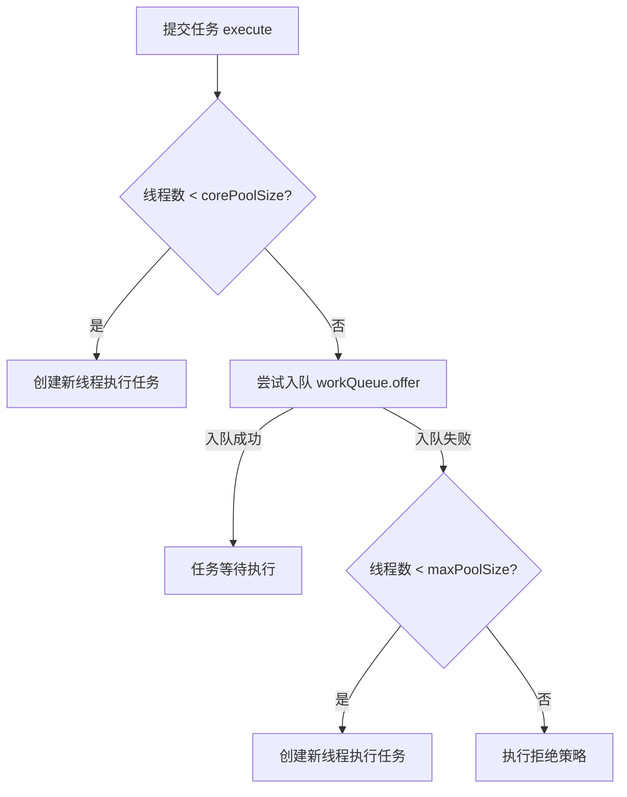
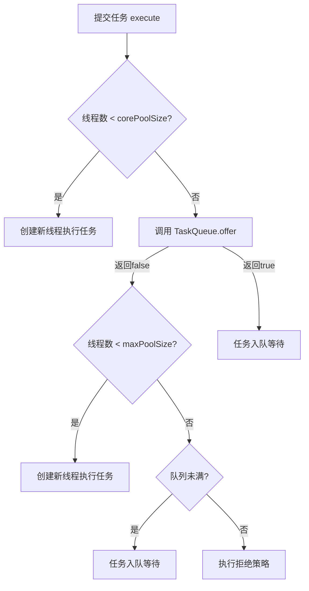
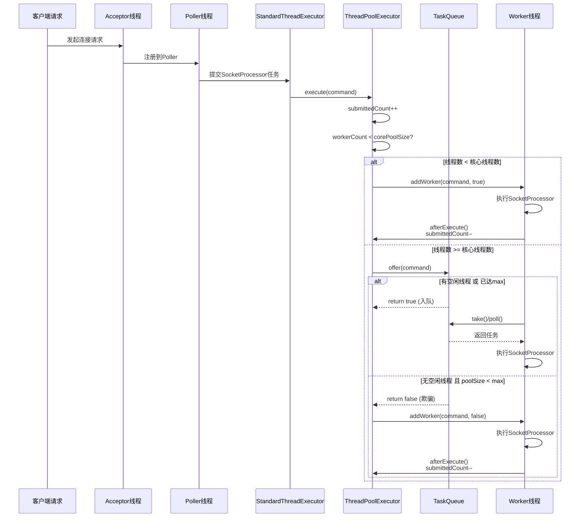

# Tomcat 线程池实现深度分析

> **📍 文档导航** | [📚 返回目录](./README.md) | [⬅️ 上一篇：类加载器](./Tomcat源码_类加载器与双亲委派打破深度分析.md) | [➡️ 下一篇：核心流程全景图](./Tomcat源码_核心流程全景图.md)
>
> **📊 元信息** | 难度：⭐⭐⭐⭐ | 预估时间：0.5-1天 | 前置阅读：[① Tomcat源码大全](./Tomcat源码大全.md) · [② NIO深度剖析](./Tomcat源码_NIO深度剖析.md)
>
> **🎯 学习目标** | 理解 Tomcat **线程池的核心创新**——通过 TaskQueue.offer() 返回 false 欺骗线程池优先创建线程而非入队，使 maxThreads 真正生效

---

> 📁 **本地源码路径**：`/data/workspace/tomcat/`

---

## 一、概述

Tomcat 并没有直接使用 JDK 的 `ThreadPoolExecutor`，而是自定义了一套线程池机制，核心组件包括：

| 组件 | 职责 | 关键特性 |
|------|------|----------|
| `TaskQueue` | 任务队列 | 改造 `offer()` 行为，优先创建线程而非入队 |
| `ThreadPoolExecutor` | 线程池执行器 | 扩展 JDK 实现，增加 `submittedCount` 统计 |
| `TaskThread` | 工作线程 | 记录线程创建时间，支持线程更新机制 |
| `TaskThreadFactory` | 线程工厂 | 统一命名、设置守护线程 |
| `StandardThreadExecutor` | 门面组件 | 集成 Tomcat Lifecycle 生命周期 |

---

## 二、核心问题：为什么需要自定义 TaskQueue？

### 2.1 JDK ThreadPoolExecutor 的执行流程



**JDK 的问题**：当使用 `LinkedBlockingQueue`（无界队列）时，`offer()` 几乎永远返回 `true`，导致：
- 任务永远先入队排队
- 线程数永远维持在 `corePoolSize` 以下
- `maxPoolSize` 设置形同虚设

### 2.2 Tomcat 的解决方案



**核心思想**：`TaskQueue.offer()` 在特定条件下返回 `false`，欺骗 `ThreadPoolExecutor` 使其认为队列已满，从而触发创建新线程（直到 `maxPoolSize`）。

---

## 三、TaskQueue 源码分析

### 3.1 类定义与核心字段

```java:33:54:/data/workspace/tomcat/java/org/apache/tomcat/util/threads/TaskQueue.java
public class TaskQueue extends LinkedBlockingQueue<Runnable> {

    private static final long serialVersionUID = 1L;
    protected static final StringManager sm = StringManager.getManager(TaskQueue.class);

    private transient volatile ThreadPoolExecutor parent = null;

    public TaskQueue() {
        super();
    }

    public TaskQueue(int capacity) {
        super(capacity);
    }

    public void setParent(ThreadPoolExecutor tp) {
        parent = tp;
    }
```

**关键设计**：
- 继承 `LinkedBlockingQueue`，复用其线程安全特性
- `parent` 字段持有对 `ThreadPoolExecutor` 的引用，用于获取线程池状态
- 必须调用 `setParent()` 建立关联，否则退化为普通队列

### 3.2 核心方法：offer() 的改造逻辑

```java:97:139:/data/workspace/tomcat/java/org/apache/tomcat/util/threads/TaskQueue.java
    @Override
    public boolean offer(Runnable o) {
      //we can't do any checks
        if (parent==null) {
            return super.offer(o);
        }
        //we are maxed out on threads, simply queue the object
        if (parent.getPoolSizeNoLock() == parent.getMaximumPoolSize()) {
            return super.offer(o);
        }
        //we have idle threads, just add it to the queue
        if (parent.getSubmittedCount() <= parent.getPoolSizeNoLock()) {
            return super.offer(o);
        }
        //if we have less threads than maximum force creation of a new thread
        if (parent.getPoolSizeNoLock() < parent.getMaximumPoolSize()) {
            return false;
        }
        //if we reached here, we need to add it to the queue
        return super.offer(o);
    }
```

**四个分支的详细分析**：

| 条件 | 返回值 | 含义 | 触发行为 |
|------|--------|------|----------|
| `parent == null` | `super.offer()` | 未关联线程池，退化为普通队列 | 任务入队 |
| `poolSize == maxPoolSize` | `super.offer()` | 已达最大线程数，必须入队 | 任务入队 |
| `submittedCount <= poolSize` | `super.offer()` | 有空闲线程，任务直接入队等待 | 任务入队 |
| `poolSize < maxPoolSize` | `false` | **关键：欺骗线程池创建新线程** | 创建新线程 |

**关键指标说明**：

- `submittedCount`：已提交但未完成的任务总数（AtomicInteger）
  - 包含：队列中等待的任务 + 已分配给线程但未执行的任务 + 正在执行的任务
  - 在 `execute()` 时 `+1`，在 `afterExecute()` 时 `-1`

- `poolSizeNoLock`：当前工作线程数（无锁读取）
  - 直接读取 `workers.size()`，不加锁以提高性能

### 3.3 辅助方法：poll() 和 take()

```java:142:164:/data/workspace/tomcat/java/org/apache/tomcat/util/threads/TaskQueue.java
    @Override
    public Runnable poll(long timeout, TimeUnit unit)
            throws InterruptedException {
        Runnable runnable = super.poll(timeout, unit);
        if (runnable == null && parent != null) {
            // the poll timed out, it gives an opportunity to stop the current
            // thread if needed to avoid memory leaks.
            parent.stopCurrentThreadIfNeeded();
        }
        return runnable;
    }

    @Override
    public Runnable take() throws InterruptedException {
        if (parent != null && parent.currentThreadShouldBeStopped()) {
            return poll(parent.getKeepAliveTime(TimeUnit.MILLISECONDS),
                    TimeUnit.MILLISECONDS);
            // yes, this may return null (in case of timeout) which normally
            // does not occur with take()
            // but the ThreadPoolExecutor implementation allows this
        }
        return super.take();
    }
```

**设计意图**：
- `poll()` 超时后检查是否需要停止当前线程（上下文停止时避免内存泄漏）
- `take()` 在特定条件下转为 `poll()`，使线程有机会超时退出

### 3.4 强制入队方法：force()

```java:65:70:/data/workspace/tomcat/java/org/apache/tomcat/util/threads/TaskQueue.java
    public boolean force(Runnable o) {
        if (parent == null || parent.isShutdown()) {
            throw new RejectedExecutionException(sm.getString("taskQueue.notRunning"));
        }
        return super.offer(o); //forces the item onto the queue, to be used if the task is rejected
    }
```

**使用场景**：当任务被拒绝时，通过 `force()` 强制入队，作为兜底方案。

---

## 四、ThreadPoolExecutor 扩展分析

### 4.1 核心字段扩展

```java:497:512:/data/workspace/tomcat/java/org/apache/tomcat/util/threads/ThreadPoolExecutor.java
    /**
     * The number of tasks submitted but not yet finished. This includes tasks
     * in the queue and tasks that have been handed to a worker thread but the
     * latter did not start executing the task yet.
     * This number is always greater or equal to {@link #getActiveCount()}.
     */
    private final AtomicInteger submittedCount = new AtomicInteger(0);
    private final AtomicLong lastContextStoppedTime = new AtomicLong(0L);

    /**
     * Most recent time in ms when a thread decided to kill itself to avoid
     * potential memory leaks. Useful to throttle the rate of renewals of
     * threads.
     */
    private final AtomicLong lastTimeThreadKilledItself = new AtomicLong(0L);
```

| 字段 | 类型 | 作用 |
|------|------|------|
| `submittedCount` | `AtomicInteger` | 统计已提交未完成任务数，供 TaskQueue 决策 |
| `lastContextStoppedTime` | `AtomicLong` | 记录上次上下文停止时间，用于线程更新判断 |
| `lastTimeThreadKilledItself` | `AtomicLong` | 记录上次线程自我终止时间，控制更新频率 |
| `threadRenewalDelay` | `volatile long` | 线程更新间隔（默认 1000ms）|

### 4.2 execute() 执行流程

```java:1399:1424:/data/workspace/tomcat/java/org/apache/tomcat/util/threads/ThreadPoolExecutor.java
    public void execute(Runnable command, long timeout, TimeUnit unit) {
        submittedCount.incrementAndGet();
        try {
            executeInternal(command);
        } catch (RejectedExecutionException rx) {
            if (getQueue() instanceof TaskQueue) {
                // If the Executor is close to maximum pool size, concurrent
                // calls to execute() may result (due to Tomcat's use of
                // TaskQueue) in some tasks being rejected rather than queued.
                // If this happens, add them to the queue.
                final TaskQueue queue = (TaskQueue) getQueue();
                try {
                    if (!queue.force(command, timeout, unit)) {
                        submittedCount.decrementAndGet();
                        throw new RejectedExecutionException(sm.getString("threadPoolExecutor.queueFull"));
                    }
                } catch (InterruptedException x) {
                    submittedCount.decrementAndGet();
                    throw new RejectedExecutionException(x);
                }
            } else {
                submittedCount.decrementAndGet();
                throw rx;
            }
        }
    }
```

**执行流程**：
1. `submittedCount.incrementAndGet()` - 增加未完成任务计数
2. 调用 `executeInternal()` - 核心执行逻辑
3. 如果被拒绝且使用 TaskQueue，尝试 `force()` 强制入队
4. 强制入队失败则 `submittedCount.decrementAndGet()` - 减少计数

### 4.3 核心执行逻辑 executeInternal()

```java:1441:1483:/data/workspace/tomcat/java/org/apache/tomcat/util/threads/ThreadPoolExecutor.java
    private void executeInternal(Runnable command) {
        if (command == null) {
            throw new NullPointerException();
        }
        int c = ctl.get();
        if (workerCountOf(c) < corePoolSize) {
            if (addWorker(command, true)) {
                return;
            }
            c = ctl.get();
        }
        if (isRunning(c) && workQueue.offer(command)) {
            int recheck = ctl.get();
            if (! isRunning(recheck) && remove(command)) {
                reject(command);
            } else if (workerCountOf(recheck) == 0) {
                addWorker(null, false);
            }
        }
        else if (!addWorker(command, false)) {
            reject(command);
        }
    }
```

**与 JDK 的差异对比**：

| 阶段 | JDK ThreadPoolExecutor | Tomcat ThreadPoolExecutor |
|------|------------------------|---------------------------|
| 步骤1 | `workerCount < corePoolSize` → 创建核心线程 | 相同 |
| 步骤2 | `workQueue.offer(command)` → 入队 | 相同（但 TaskQueue 可能返回 false）|
| 步骤3 | 入队失败 → `addWorker(command, false)` → 创建非核心线程 | 相同 |
| 步骤4 | 创建失败 → `reject(command)` | 相同，但拒绝后尝试 `force()` 强制入队 |

### 4.4 线程更新机制

```java:2201:2234:/data/workspace/tomcat/java/org/apache/tomcat/util/threads/ThreadPoolExecutor.java
    protected void stopCurrentThreadIfNeeded() {
        if (currentThreadShouldBeStopped()) {
            long lastTime = lastTimeThreadKilledItself.longValue();
            if (lastTime + threadRenewalDelay < System.currentTimeMillis()) {
                if (lastTimeThreadKilledItself.compareAndSet(lastTime,
                        System.currentTimeMillis() + 1)) {
                    // OK, it's really time to dispose of this thread
                    final String msg = sm.getString(
                                    "threadPoolExecutor.threadStoppedToAvoidPotentialLeak",
                                    Thread.currentThread().getName());
                    throw new StopPooledThreadException(msg);
                }
            }
        }
    }

    protected boolean currentThreadShouldBeStopped() {
        Thread currentThread = Thread.currentThread();
        if (threadRenewalDelay >= 0 && currentThread instanceof TaskThread) {
            TaskThread currentTaskThread = (TaskThread) currentThread;
            if (currentTaskThread.getCreationTime() <
                    this.lastContextStoppedTime.longValue()) {
                return true;
            }
        }
        return false;
    }
```

**线程更新机制说明**：

当 Web 应用上下文停止时（热部署/重新加载），需要更新线程池中的线程以避免：
1. **类加载器泄漏**：旧线程可能持有对旧 WebappClassLoader 的引用
2. **ThreadLocal 泄漏**：线程本地变量可能引用旧应用的类

**更新策略**：
- 比较线程的 `creationTime` 与 `lastContextStoppedTime`
- 如果线程创建时间早于上下文停止时间，说明是"旧线程"
- 通过 `CAS` 控制更新频率（`threadRenewalDelay` 默认 1000ms）
- 抛出 `StopPooledThreadException` 终止旧线程，线程池会自动创建新线程替代

---

## 五、TaskThread 与 TaskThreadFactory

### 5.1 TaskThread：带创建时间戳的线程

```java:27:50:/data/workspace/tomcat/java/org/apache/tomcat/util/threads/TaskThread.java
public class TaskThread extends Thread {

    private static final Log log = LogFactory.getLog(TaskThread.class);
    private static final StringManager sm = StringManager.getManager(TaskThread.class);
    private final long creationTime;

    public TaskThread(ThreadGroup group, Runnable target, String name) {
        super(group, new WrappingRunnable(target), name);
        this.creationTime = System.currentTimeMillis();
    }

    public TaskThread(ThreadGroup group, Runnable target, String name,
            long stackSize) {
        super(group, new WrappingRunnable(target), name, stackSize);
        this.creationTime = System.currentTimeMillis();
    }

    public final long getCreationTime() {
        return creationTime;
    }
```

**核心功能**：
- `creationTime` 字段：记录线程创建时间戳
- `getCreationTime()` 方法：供 `ThreadPoolExecutor` 判断是否需更新线程
- `WrappingRunnable` 包装器：捕获 `StopPooledThreadException`，防止其传播到调试器

### 5.2 WrappingRunnable：异常处理器

```java:55:71:/data/workspace/tomcat/java/org/apache/tomcat/util/threads/TaskThread.java
    private static class WrappingRunnable implements Runnable {
        private Runnable wrappedRunnable;
        WrappingRunnable(Runnable wrappedRunnable) {
            this.wrappedRunnable = wrappedRunnable;
        }
        @Override
        public void run() {
            try {
                wrappedRunnable.run();
            } catch(StopPooledThreadException exc) {
                //expected : we just swallow the exception to avoid disturbing
                //debuggers like eclipse's
                log.debug(sm.getString("taskThread.exiting"), exc);
            }
        }
    }
```

**设计意图**：`StopPooledThreadException` 是预期的异常（用于线程更新），不应触发调试器断点。

### 5.3 TaskThreadFactory：线程工厂

```java:31:71:/data/workspace/tomcat/java/org/apache/tomcat/util/threads/TaskThreadFactory.java
public class TaskThreadFactory implements ThreadFactory {

    private final ThreadGroup group;
    private final AtomicInteger threadNumber = new AtomicInteger(1);
    private final String namePrefix;
    private final boolean daemon;
    private final int threadPriority;

    public TaskThreadFactory(String namePrefix, boolean daemon, int priority) {
        SecurityManager s = System.getSecurityManager();
        group = (s != null) ? s.getThreadGroup() : Thread.currentThread().getThreadGroup();
        this.namePrefix = namePrefix;
        this.daemon = daemon;
        this.threadPriority = priority;
    }

    @Override
    public Thread newThread(Runnable r) {
        TaskThread t = new TaskThread(group, r, namePrefix + threadNumber.getAndIncrement());
        t.setDaemon(daemon);
        t.setPriority(threadPriority);

        if (Constants.IS_SECURITY_ENABLED) {
            PrivilegedAction<Void> pa = new PrivilegedSetTccl(
                    t, getClass().getClassLoader());
            AccessController.doPrivileged(pa);
            pa = new PrivilegedSetAccessControlContext(t);
            AccessController.doPrivileged(pa);
        } else {
            t.setContextClassLoader(getClass().getClassLoader());
        }

        return t;
    }
```

**线程命名规则**：
- 默认前缀：`tomcat-exec-`
- 线程名：`tomcat-exec-1`, `tomcat-exec-2`, ...
- 便于问题排查和监控识别

**安全配置**：
- 启用 SecurityManager 时，通过 `AccessController.doPrivileged()` 设置线程上下文类加载器
- 避免线程持有对 Web 应用类加载器的引用，防止类加载器泄漏

---

## 六、StandardThreadExecutor：门面与生命周期集成

### 6.1 类定义与配置属性

```java:31:88:/data/workspace/tomcat/java/org/apache/catalina/core/StandardThreadExecutor.java
public class StandardThreadExecutor extends LifecycleMBeanBase implements Executor, ResizableExecutor {

    protected static final StringManager sm = StringManager.getManager(StandardThreadExecutor.class);

    protected int threadPriority = Thread.NORM_PRIORITY;
    protected boolean daemon = true;
    protected String namePrefix = "tomcat-exec-";
    protected int maxThreads = 200;
    protected int minSpareThreads = 25;
    protected int maxIdleTime = 60000;
    protected ThreadPoolExecutor executor = null;
    protected String name;
    protected int maxQueueSize = Integer.MAX_VALUE;
    protected long threadRenewalDelay = org.apache.tomcat.util.threads.Constants.DEFAULT_THREAD_RENEWAL_DELAY;

    private TaskQueue taskqueue = null;
```

**默认配置**：

| 属性 | 默认值 | 说明 |
|------|--------|------|
| `minSpareThreads` | 25 | 核心线程数（`corePoolSize`）|
| `maxThreads` | 200 | 最大线程数（`maximumPoolSize`）|
| `maxIdleTime` | 60000ms | 线程空闲超时时间（`keepAliveTime`）|
| `maxQueueSize` | `Integer.MAX_VALUE` | 队列容量（实际几乎不会满）|
| `threadRenewalDelay` | 1000ms | 线程更新间隔 |

### 6.2 启动与初始化

```java:104:115:/data/workspace/tomcat/java/org/apache/catalina/core/StandardThreadExecutor.java
    @Override
    protected void startInternal() throws LifecycleException {

        taskqueue = new TaskQueue(maxQueueSize);
        TaskThreadFactory tf = new TaskThreadFactory(namePrefix, daemon, getThreadPriority());
        executor = new ThreadPoolExecutor(getMinSpareThreads(), getMaxThreads(), maxIdleTime, TimeUnit.MILLISECONDS,
                taskqueue, tf);
        executor.setThreadRenewalDelay(threadRenewalDelay);
        taskqueue.setParent(executor);

        setState(LifecycleState.STARTING);
    }
```

**初始化流程**：
1. 创建 `TaskQueue`，传入最大队列容量
2. 创建 `TaskThreadFactory`，配置线程前缀、守护状态、优先级
3. 创建 `ThreadPoolExecutor`，绑定队列和工厂
4. 设置线程更新延迟
5. **关键**：`taskqueue.setParent(executor)` 建立双向关联

### 6.3 停止与清理

```java:124:133:/data/workspace/tomcat/java/org/apache/catalina/core/StandardThreadExecutor.java
    @Override
    protected void stopInternal() throws LifecycleException {

        setState(LifecycleState.STOPPING);
        if (executor != null) {
            executor.shutdownNow();
        }
        executor = null;
        taskqueue = null;
    }
```

**停止行为**：
- 调用 `shutdownNow()` 立即关闭，中断所有正在执行的任务
- 清空队列，返回未执行的任务列表

### 6.4 任务执行入口

```java:147:156:/data/workspace/tomcat/java/org/apache/catalina/core/StandardThreadExecutor.java
    @Override
    public void execute(Runnable command) {
        if (executor != null) {
            // Note any RejectedExecutionException due to the use of TaskQueue
            // will be handled by the o.a.t.u.threads.ThreadPoolExecutor
            executor.execute(command);
        } else {
            throw new IllegalStateException(sm.getString("standardThreadExecutor.notStarted"));
        }
    }
```

### 6.5 上下文停止处理

```java:158:162:/data/workspace/tomcat/java/org/apache/catalina/core/StandardThreadExecutor.java
    public void contextStopping() {
        if (executor != null) {
            executor.contextStopping();
        }
    }
```

**触发时机**：当 Web 应用上下文停止（热部署/重新加载）时调用。

---

## 七、Tomcat 线程池执行流程总结



---

## 八、与 JDK ThreadPoolExecutor 对比

| 特性 | JDK ThreadPoolExecutor | Tomcat ThreadPoolExecutor |
|------|------------------------|---------------------------|
| **队列类型** | 任意 BlockingQueue | 必须配合 TaskQueue 使用 |
| **线程扩容策略** | 先入队，队列满后再扩容 | 优先扩容到 max，最后再入队 |
| **线程命名** | 默认 `pool-N-thread-M` | 可配置，默认 `tomcat-exec-N` |
| **线程更新** | 不支持 | 支持（contextStopping） |
| **任务统计** | 无 `submittedCount` | 有 `submittedCount` 供决策 |
| **拒绝后处理** | 直接抛出异常 | 尝试 `force()` 强制入队 |

**Tomcat 设计的优势**：
1. **更快的响应**：高并发时优先创建线程处理，而非排队等待
2. **更好的伸缩性`：maxThreads` 设置真正生效
3. **更安全的热部署**：线程更新机制避免类加载器泄漏

---

## 九、配置建议

### 9.1 server.xml 配置示例

```xml
<Executor name="tomcatThreadPool" 
          namePrefix="catalina-exec-"
          maxThreads="500"
          minSpareThreads="50"
          maxIdleTime="60000"
          maxQueueSize="1000"
          threadRenewalDelay="1000"/>

<Connector port="8080" 
           protocol="HTTP/1.1"
           executor="tomcatThreadPool"
           connectionTimeout="20000"
           redirectPort="8443"/>
```

### 9.2 参数调优建议

| 参数 | 建议值 | 说明 |
|------|--------|------|
| `maxThreads` | CPU核心数 * 200 | 根据应用 IO 密度调整 |
| `minSpareThreads` | 并发峰值的 10-20% | 避免请求突增时频繁创建线程 |
| `maxQueueSize` | 100-1000 | 队列过小会导致 early reject |
| `maxIdleTime` | 60000ms | 平衡资源回收与线程复用 |

---

## 十、总结

Tomcat 线程池的核心创新在于 **TaskQueue 对 `offer()` 行为的改造**，通过返回 `false` "欺骗" 线程池优先创建线程，而非先入队。这种设计使得 `maxThreads` 配置真正生效，在高并发场景下能够更快地响应请求。

同时，Tomcat 通过 `TaskThread` 的创建时间戳和 `ThreadPoolExecutor` 的线程更新机制，解决了 Web 应用热部署时的类加载器泄漏问题，体现了对生产环境的深度考虑。
