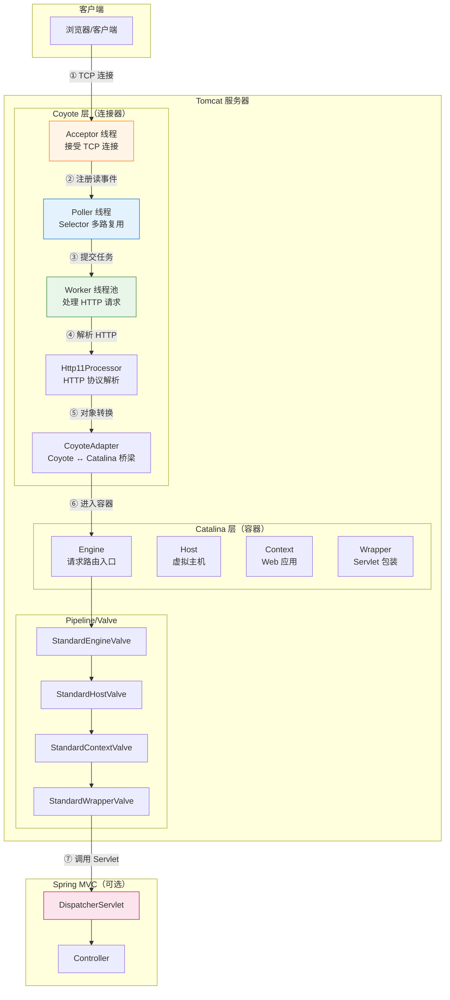
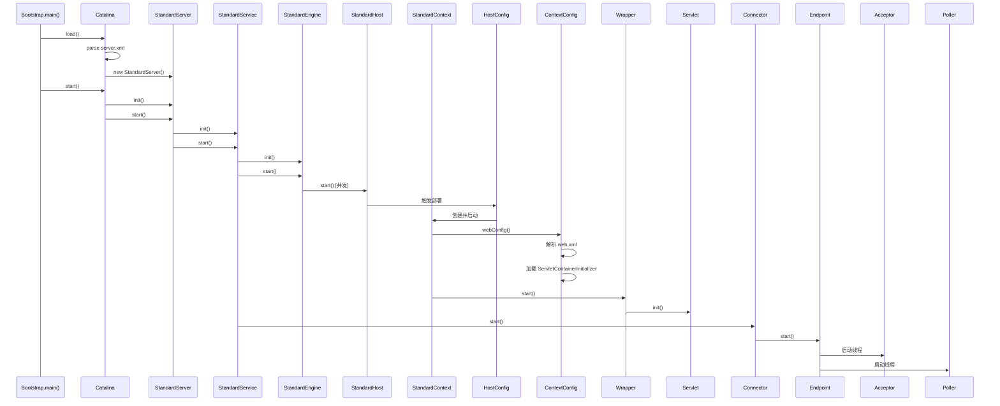
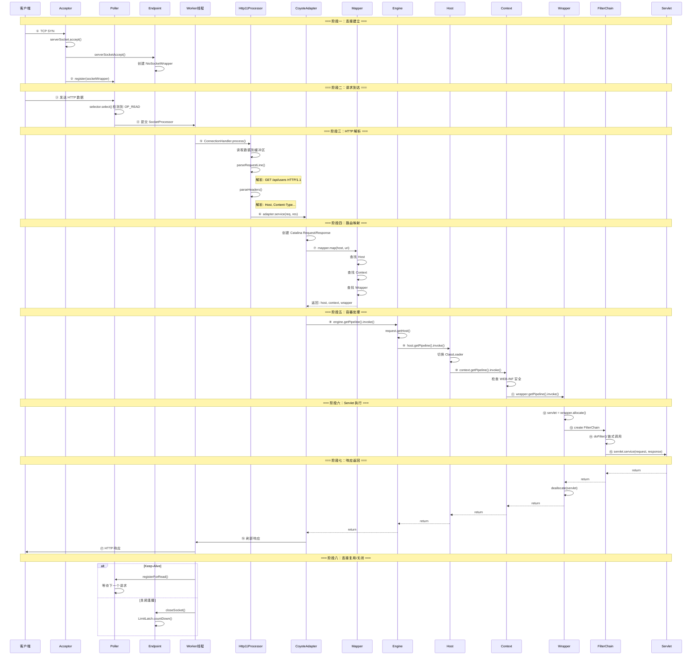
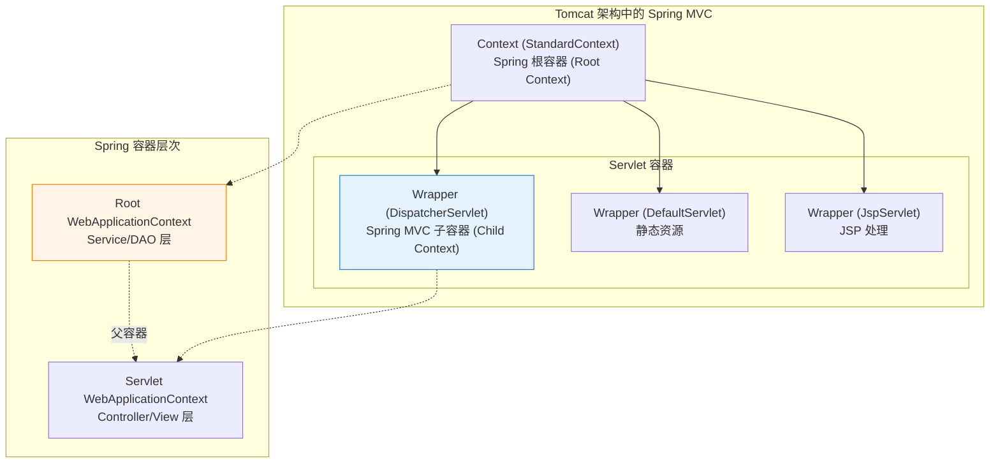
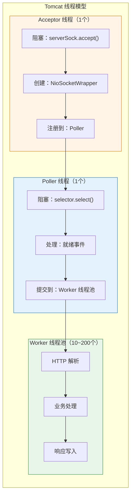

# Tomcat 源码快速概览

> **📌 定位：入门地图** — 本文档提供 Tomcat 架构全景认知，帮助快速建立整体视角。
> 
> **深入阅读指引**：本文覆盖面广但深度有限，各子系统的深度源码分析请参阅专题文档：
> - **NIO 网络层** → [`Tomcat源码_NIO深度剖析.md`](./Tomcat源码_NIO深度剖析.md)
> - **HTTP 协议解析** → [`Tomcat源码_HTTP协议解析深度剖析.md`](./Tomcat源码_HTTP协议解析深度剖析.md)
> - **内存管理** → [`Tomcat内存管理深度解析.md`](./Tomcat内存管理深度解析.md)
> - **Mapper/Pipeline/FilterChain/异步Servlet/sendFile** → [`Tomcat源码深度专题分析.md`](./Tomcat源码深度专题分析.md)
> - **阅读指南** → [`README.md`](./README.md)
> 
> **重要提示**：本文档基于本地 Tomcat 源码分析，所有代码引用均来自 `/data/workspace/tomcat`

---

## 目录导航

> 📌 **使用建议**：本文档适合快速建立全局认知。各章节标注了"📖 深入阅读"指引，点击可跳转到对应的深度专题文档。

1. [第一部分：架构概览](#第一部分架构概览)
2. [第二部分：启动流程（搭台过程）](#第二部分启动流程搭台过程)
3. [第三部分：请求处理流程（唱戏过程）](#第三部分请求处理流程唱戏过程)
4. [第四部分：核心组件详解](#第四部分核心组件详解)
5. [第五部分：Spring MVC 整合](#第五部分spring-mvc-整合)
6. [第六部分：高级特性](#第六部分高级特性)
7. [第七部分：深度源码剖析](#第七部分深度源码剖析)
8. [附录：设计模式总结](#附录设计模式总结)

---

## 第一部分：架构概览

### 1.1 整体架构图



### 1.2 核心组件职责

| 组件 | 所属层 | 职责 |
|------|--------|------|
| **Acceptor** | Coyote | 阻塞接受新 TCP 连接 |
| **Poller** | Coyote | NIO Selector 多路复用，监听读写事件 |
| **Worker** | Coyote | 解析 HTTP 协议，调用业务处理 |
| **CoyoteAdapter** | Coyote/Catalina | 桥接两层，对象转换 |
| **Engine** | Catalina | 接收所有请求，分发给 Host |
| **Host** | Catalina | 虚拟主机，管理多个 Web 应用 |
| **Context** | Catalina | Web 应用，包含多个 Servlet |
| **Wrapper** | Catalina | Servlet 包装，管理 Servlet 生命周期 |

### 1.3 源码编译配置

```xml
<?xml version="1.0" encoding="UTF-8"?>
<project xmlns="http://maven.apache.org/POM/4.0.0"
         xmlns:xsi="http://www.w3.org/2001/XMLSchema-instance"
         xsi:schemaLocation="http://maven.apache.org/POM/4.0.0 http://maven.apache.org/xsd/maven-4.0.0.xsd">
  <modelVersion>4.0.0</modelVersion>
  <groupId>org.apache.tomcat</groupId>
  <artifactId>Tomcat8.5.x</artifactId>
  <name>Tomcat8.5.x</name>
  <version>8.5.x</version>
  <build>
    <finalName>Tomcat8.5</finalName>
    <sourceDirectory>java</sourceDirectory>
    <testSourceDirectory>test</testSourceDirectory>
    <resources>
      <resource>
        <directory>java</directory>
      </resource>
    </resources>
    <plugins>
      <plugin>
        <groupId>org.apache.maven.plugins</groupId>
        <artifactId>maven-compiler-plugin</artifactId>
        <version>2.3</version>
        <configuration>
          <encoding>UTF-8</encoding>
          <source>11</source>
          <target>11</target>
        </configuration>
      </plugin>
    </plugins>
  </build>
  <dependencies>
    <dependency>
      <groupId>javax.websocket</groupId>
      <artifactId>javax.websocket-api</artifactId>
      <version>1.1</version>
      <scope>provided</scope>
    </dependency>
    <dependency>
      <groupId>junit</groupId>
      <artifactId>junit</artifactId>
      <version>4.12</version>
      <scope>test</scope>
    </dependency>
    <dependency>
      <groupId>org.easymock</groupId>
      <artifactId>easymock</artifactId>
      <version>3.4</version>
    </dependency>
    <dependency>
      <groupId>ant</groupId>
      <artifactId>ant</artifactId>
      <version>1.7.0</version>
    </dependency>
    <dependency>
      <groupId>wsdl4j</groupId>
      <artifactId>wsdl4j</artifactId>
      <version>1.6.2</version>
    </dependency>
    <dependency>
      <groupId>javax.xml</groupId>
      <artifactId>jaxrpc</artifactId>
      <version>1.1</version>
    </dependency>
    <dependency>
      <groupId>org.eclipse.jdt.core.compiler</groupId>
      <artifactId>ecj</artifactId>
      <version>4.5.1</version>
    </dependency>
  </dependencies>
</project>
```

---

## 第二部分：启动流程（搭台过程）

### 2.1 启动时序图



### 2.2 组件初始化详解

#### Server 组件

```java
// StandardServer 核心属性
public class StandardServer extends LifecycleMBeanBase implements Server {
    // Service 管理相关
    private Service[] services = new Service[0];
    private final Object servicesLock = new Object();

    // 关闭端口相关
    private int port = 8005;
    private String address = "localhost";
    private String shutdown = "SHUTDOWN";

    // 关闭等待相关
    private volatile Thread awaitThread = null;
    private volatile ServerSocket awaitSocket = null;
    private volatile boolean stopAwait = false;
}
```

#### Service 组件

```java
// StandardService 核心属性
public class StandardService extends LifecycleMBeanBase implements Service {
    private String name = null;
    private Server server = null;
    protected Connector connectors[] = new Connector[0];
    private Engine engine = null;
    protected final ArrayList<Executor> executors = new ArrayList<>();
    private final Mapper mapper = new Mapper();
    protected final MapperListener mapperListener = new MapperListener(this);
}
```

#### Connector 组件

```java
// Connector 构造函数
public Connector(String protocol) {
    // 设置协议处理器类名 - 默认是 Http11NioProtocol
    setProtocol(protocol);
    ProtocolHandler p = null;
    try {
        Class<?> clazz = Class.forName(protocolHandlerClassName);
        p = (ProtocolHandler) clazz.getConstructor().newInstance();
    } catch (Exception e) {
        log.error(sm.getString("coyoteConnector.protocolHandlerInstantiationFailed"), e);
    } finally {
        this.protocolHandler = p;
    }
}

// Http11NioProtocol 构造链
public Http11NioProtocol() {
    this(new NioEndpoint());
}

public Http11NioProtocol(NioEndpoint endpoint) {
    super(endpoint);
}
```

#### NioEndpoint 启动

```java
// NioEndpoint.startInternal()
public void startInternal() throws Exception {
    if (!running) {
        running = true;
        paused = false;
        
        // 1. 初始化对象缓存池
        if (socketProperties.getProcessorCache() != 0) {
            processorCache = new SynchronizedStack<>(SynchronizedStack.DEFAULT_SIZE,
                    socketProperties.getProcessorCache());
        }
        if (socketProperties.getEventCache() != 0) {
            eventCache = new SynchronizedStack<>(SynchronizedStack.DEFAULT_SIZE,
                    socketProperties.getEventCache());
        }
        if (socketProperties.getBufferPool() != 0) {
            nioChannels = new SynchronizedStack<>(SynchronizedStack.DEFAULT_SIZE,
                    socketProperties.getBufferPool());
        }

        // 2. 创建工作线程池
        if (getExecutor() == null) {
            createExecutor();
        }
        
        // 3. 初始化连接限流器
        initializeConnectionLatch();
        
        // 4. 创建并启动 Poller 线程
        poller = new Poller();
        Thread pollerThread = new Thread(poller, getName() + "-Poller");
        pollerThread.setPriority(threadPriority);
        pollerThread.setDaemon(true);
        pollerThread.start();
        
        // 5. 启动 Acceptor 线程
        startAcceptorThread();
    }
}
```

### 2.3 应用部署流程

```java
// HostConfig.deployApps()
protected void deployApps() {
    File appBase = host.getAppBaseFile();
    File configBase = host.getConfigBaseFile();
    String[] filteredAppPaths = filterAppPaths(appBase.list());
    
    // 1. 部署 XML 描述符
    deployDescriptors(configBase, configBase.list());
    
    // 2. 部署 WAR 文件
    deployWARs(appBase, filteredAppPaths);
    
    // 3. 部署展开的目录
    deployDirectories(appBase, filteredAppPaths);
}

// ContextConfig.webConfig() - 解析 web.xml
protected void webConfig() {
    // 创建 WebXml 对象
    WebXml webXml = createWebXml();
    
    // 解析全局 web.xml
    InputSource globalWebXml = getGlobalWebXmlSource();
    webXmlParser.parseWebXml(globalWebXml, webXml, false);
    
    // 解析应用 web.xml
    InputSource contextWebXml = getContextWebXmlSource();
    webXmlParser.parseWebXml(contextWebXml, webXml, false);
    
    // 加载 ServletContainerInitializer
    processServletContainerInitializers();
    
    // 扫描注解
    if (!webXml.isMetadataComplete()) {
        processClasses(webXml);
    }
    
    // 应用配置到 Context
    configureContext(webXml);
}
```

---

## 第三部分：请求处理流程（唱戏过程）

### 3.1 完整请求处理时序图



### 3.2 Acceptor 线程详解

```java
// Acceptor.run()
public void run() {
    int errorDelay = 0;
    
    while (!stop) {
        try {
            // ① 等待连接许可
            endpoint.countUpOrAwaitConnection();
            
            // ② accept() 新连接
            U socket = endpoint.serverSocketAccept();
            errorDelay = 0;
            
            // ③ 配置 Socket
            if (!endpoint.processSocket(socket, true, false)) {
                endpoint.destroySocket(socket);
            }
        } catch (Throwable t) {
            log.error(sm.getString("endpoint.accept.fail"), t);
        }
    }
}

// NioEndpoint.serverSocketAccept()
protected NioSocketWrapper serverSocketAccept() throws Exception {
    // ① accept() 系统调用
    SocketChannel socketChannel = serverSock.accept();
    
    // ② 设置为非阻塞模式（供 Poller 使用）
    socketChannel.configureBlocking(false);
    
    // ③ 从对象池获取 NioChannel
    NioChannel channel = null;
    if (nioChannels != null) {
        channel = nioChannels.pop();
    }
    if (channel == null) {
        channel = new NioChannel(socketChannel);
    } else {
        channel.reset(socketChannel);
    }
    
    // ④ 创建包装对象
    NioSocketWrapper wrapper = new NioSocketWrapper(channel, this);
    return wrapper;
}
```

### 3.3 Poller 线程详解

```java
// Poller.run()
public void run() {
    while (true) {
        boolean hasEvents = false;
        
        // ① 处理新连接注册队列
        hasEvents = events();
        
        // ② Selector 阻塞等待事件
        Iterator<SelectionKey> iterator = null;
        try {
            if (!close && !wakeup && hasEvents) {
                wakeup = true;
            }
            if (!close && wakeup) {
                wakeup = false;
                selector.selectNow();
            } else {
                selector.select(1000);
            }
            iterator = selector.selectedKeys().iterator();
        } catch (IOException e) {
            log.error(sm.getString("endpoint.nio.selectorLoopError"), e);
        }
        
        // ③ 处理就绪事件
        while (iterator != null && iterator.hasNext()) {
            SelectionKey sk = iterator.next();
            NioSocketWrapper attachment = (NioSocketWrapper) sk.attachment();
            
            if (sk.isReadable() || sk.isWritable()) {
                processKey(sk, attachment);
            }
            iterator.remove();
        }
        
        // 超时处理
        timeout(keyCount, hasEvents);
    }
}

// 注册读事件
public boolean events() {
    PollerEvent pe;
    while ((pe = events.poll()) != null) {
        NioSocketWrapper wrapper = pe.getSocketWrapper();
        SocketChannel socketChannel = wrapper.getSocketChannel();
        
        // ★ 注册 OP_READ 到 Selector
        socketChannel.register(selector, SelectionKey.OP_READ, wrapper);
        
        // 归还事件对象到对象池
        if (eventCache != null) {
            pe.reset();
            eventCache.push(pe);
        }
    }
    return true;
}
```

### 3.4 Http11Processor HTTP 解析

```java
// Http11Processor.service()
@Override
public SocketState service(SocketWrapperBase<?> socketWrapper) 
    throws IOException {
    
    // ① 解析请求行
    parseRequestLine();
    // GET /api/users HTTP/1.1
    
    // ② 解析请求头
    parseHeaders();
    // Host: localhost:8080
    // Content-Type: application/json
    
    // ③ 准备请求
    prepareRequest();
    
    // ④ 调用 CoyoteAdapter
    getAdapter().service(request, response);
    
    // ⑤ 处理结果
    if (isAsync()) {
        return SocketState.LONG;
    }
    return SocketState.OPEN;
}

// 解析请求行
private void parseRequestLine() throws IOException {
    // 读取: GET /api/users?name=tom HTTP/1.1
    inputBuffer.parseRequestLine();
    
    // 提取 Method
    method = requestLine.method();
    
    // 提取 URI
    uri = requestLine.uri();
    
    // 提取 Query String
    queryString = requestLine.query();
    
    // 提取 Protocol
    protocol = requestLine.protocol();
}
```

### 3.5 Mapper 路由映射算法

```java
// Mapper.map()
public void map(MessageBytes serverName, MessageBytes uri, 
                String version, MappingData mappingData) {
    
    // ① 查找 Host
    MappedHost mappedHost = exactFind(hosts, serverName.toString());
    mappingData.host = mappedHost.object;
    
    // ② 查找 Context
    ContextList contextList = mappedHost.contextList;
    MappedContext mappedContext = findContext(contextList, uri.toString());
    mappingData.context = mappedContext.object;
    
    // ③ 查找 Wrapper（Servlet）
    internalMapWrapper(contextVersion, uri.toString(), mappingData);
}

// Wrapper 匹配算法
private void internalMapWrapper(ContextVersion contextVersion, 
                                 String uri, MappingData mappingData) {
    // 1. 精确匹配 /hello
    wrapper = exactFind(contextVersion.exactWrappers, uri);
    if (wrapper != null) {
        mappingData.wrapper = wrapper.object;
        return;
    }
    
    // 2. 最长路径匹配 /app/*
    for (int i = contextVersion.wildcardWrappers.length - 1; i >= 0; i--) {
        if (matchWildcard(contextVersion.wildcardWrappers[i].name, uri)) {
            mappingData.wrapper = contextVersion.wildcardWrappers[i].object;
            return;
        }
    }
    
    // 3. 扩展名匹配 *.jsp
    int lastDot = uri.lastIndexOf('.');
    if (lastDot >= 0) {
        wrapper = exactFind(contextVersion.extensionWrappers, 
                           uri.substring(lastDot));
        if (wrapper != null) {
            mappingData.wrapper = wrapper.object;
            return;
        }
    }
    
    // 4. 默认 Servlet
    mappingData.wrapper = contextVersion.defaultWrapper.object;
}
```

### 3.6 Pipeline/Valve 责任链

```java
// StandardEngineValve.invoke()
@Override
public void invoke(Request request, Response response) 
    throws IOException, ServletException {
    
    Host host = request.getHost();
    if (host == null) {
        response.sendError(404);
        return;
    }
    
    // 调用 Host Pipeline
    host.getPipeline()
        .getFirst()
        .invoke(request, response);
}

// StandardHostValve.invoke()
@Override
public void invoke(Request request, Response response) 
    throws IOException, ServletException {
    
    Context context = request.getContext();
    if (context == null) {
        response.sendError(404);
        return;
    }
    
    // ★ 关键：切换 ClassLoader 实现应用隔离
    Thread.currentThread().setContextClassLoader(
        context.getLoader().getClassLoader()
    );
    
    // 调用 Context Pipeline
    context.getPipeline()
           .getFirst()
           .invoke(request, response);
}

// StandardContextValve.invoke()
@Override
public void invoke(Request request, Response response) 
    throws IOException, ServletException {
    
    // 安全检查：禁止访问 WEB-INF
    if (request.getRequestPathMB().startsWithIgnoreCase("/WEB-INF/", 0)) {
        response.sendError(HttpServletResponse.SC_NOT_FOUND);
        return;
    }
    
    Wrapper wrapper = request.getWrapper();
    if (wrapper == null || wrapper.isUnavailable()) {
        response.sendError(HttpServletResponse.SC_NOT_FOUND);
        return;
    }
    
    // 调用 Wrapper Pipeline
    wrapper.getPipeline()
           .getFirst()
           .invoke(request, response);
}

// StandardWrapperValve.invoke()
@Override
public void invoke(Request request, Response response) 
    throws IOException, ServletException {
    
    // 分配 Servlet 实例
    Servlet servlet = wrapper.allocate();
    
    // 创建 FilterChain
    ApplicationFilterChain filterChain = 
        ApplicationFilterFactory.createFilterChain(request, wrapper, servlet);
    
    // 执行 FilterChain
    filterChain.doFilter(request.getRequest(), response.getResponse());
    
    // 释放资源
    filterChain.release();
    wrapper.deallocate(servlet);
}
```

### 3.7 FilterChain 执行

```java
// ApplicationFilterChain.doFilter()
@Override
public void doFilter(ServletRequest request, ServletResponse response) 
    throws IOException, ServletException {
    
    internalDoFilter(request, response);
}

private void internalDoFilter(ServletRequest request, ServletResponse response) 
    throws IOException, ServletException {
    
    // ① 还有 Filter 未执行
    if (pos < n) {
        ApplicationFilterConfig filterConfig = filters[pos++];
        Filter filter = filterConfig.getFilter();
        
        // 调用 Filter.doFilter()
        filter.doFilter(request, response, this);
        return;
    }
    
    // ② 所有 Filter 执行完毕，调用 Servlet
    servlet.service(request, response);
}
```

---

## 第四部分：核心组件详解

> 📖 **深入阅读**：NioEndpoint 源码精读 → [NIO深度剖析](./Tomcat源码_NIO深度剖析.md)；对象池和内存管理 → [内存管理深度解析](./Tomcat内存管理深度解析.md)；Mapper 路由机制 → [深度专题分析 · Mapper章节](./Tomcat源码深度专题分析.md)

### 4.1 NioEndpoint 核心数据结构

```java
public class NioEndpoint extends AbstractJsseEndpoint<NioChannel> {
    
    // ==================== 核心组件 ====================
    
    /** ServerSocketChannel - 监听端口 */
    private volatile ServerSocketChannel serverSock;
    
    /** Poller 线程 */
    private Poller poller = null;
    
    /** 连接等待队列 */
    private int acceptCount = 100;
    
    /** 最大并发连接数 */
    private int maxConnections = 8192;
    
    /** 连接限流器 */
    private volatile LimitLatch connectionLimitLatch = null;
    
    // ==================== 对象池 ====================
    
    /** NioChannel 对象池 */
    private SynchronizedStack<NioChannel> nioChannels;
    
    /** Processor 对象池 */
    private SynchronizedStack<Processor> processorCache;
    
    /** PollerEvent 对象池 */
    private SynchronizedStack<PollerEvent> eventCache;
    
    // ==================== 线程配置 ====================
    
    /** Worker 线程池 */
    private Executor executor = null;
    
    // ==================== 配置参数 ====================
    
    /** Socket 超时时间 */
    private int soTimeout = 60000;
    
    /** 是否启用 TCP_NODELAY */
    private boolean tcpNoDelay = true;
}
```

### 4.2 SynchronizedStack 对象池

```java
/**
 * 线程安全的栈结构（用于对象池）
 */
public class SynchronizedStack<T> {
    
    private final Object[] stack;
    private int size = 0;
    private final int max;
    private final ReentrantLock lock = new ReentrantLock();
    
    public boolean push(T item) {
        lock.lock();
        try {
            if (size < max) {
                stack[size++] = item;
                return true;
            }
            return false;
        } finally {
            lock.unlock();
        }
    }
    
    public T pop() {
        lock.lock();
        try {
            if (size == 0) {
                return null;
            }
            T result = (T) stack[--size];
            stack[size] = null;
            return result;
        } finally {
            lock.unlock();
        }
    }
}
```

### 4.3 Mapper 数据结构

```java
public class Mapper {
    
    // Host 数组
    volatile MappedHost[] hosts = new MappedHost[0];
    
    static class MappedHost {
        String name;
        Host object;
        ContextList contextList;
    }
    
    static class ContextList {
        MappedContext[] contexts;
    }
    
    static class MappedContext {
        String name;
        ContextVersion[] versions;
    }
    
    static class ContextVersion {
        Context object;
        MappedWrapper[] exactWrappers;      // 精确匹配
        MappedWrapper[] wildcardWrappers;   // 通配符匹配
        MappedWrapper[] extensionWrappers;  // 扩展名匹配
        MappedWrapper defaultWrapper;       // 默认 Servlet
    }
}
```

### 4.4 Request 对象结构

```java
/**
 * Catalina 层 Request
 */
public class Request implements HttpServletRequest {
    
    // 核心关联
    protected org.apache.coyote.Request coyoteRequest;
    protected Response response;
    protected Context context = null;
    protected Wrapper wrapper = null;
    
    // 路由映射结果
    protected MappingData mappingData = new MappingData();
    
    // Servlet API 实现
    protected ParameterMap<String, String[]> parameters = null;
    protected final HashMap<String, Object> attributes = new HashMap<>();
    protected Session session = null;
    protected Cookie[] cookies = null;
}
```

### 4.5 Session 管理机制

```java
public class StandardManager extends ManagerBase {
    
    // Session 存储
    protected Map<String, Session> sessions = new ConcurrentHashMap<>();
    
    // 最大活跃 Session 数
    protected int maxActiveSessions = -1;
    
    // Session 最大空闲时间（秒）
    protected int maxInactiveInterval = 1800;
    
    // Session ID 生成器
    protected SessionIdGenerator sessionIdGenerator = new StandardSessionIdGenerator();
    
    // 创建 Session
    @Override
    public Session createSession(String sessionId) {
        // 检查 Session 数量限制
        if (maxActiveSessions >= 0 && sessions.size() >= maxActiveSessions) {
            throw new TooManyActiveSessionsException(...);
        }
        
        Session session = createEmptySession();
        session.setNew(true);
        session.setValid(true);
        session.setCreationTime(System.currentTimeMillis());
        session.setMaxInactiveInterval(maxInactiveInterval);
        
        String id = sessionId;
        if (id == null) {
            id = generateSessionId();
        }
        session.setId(id);
        sessions.put(id, session);
        
        return session;
    }
    
    // 过期检测
    @Override
    public void backgroundProcess() {
        processExpires();
    }
    
    public void processExpires() {
        long timeNow = System.currentTimeMillis();
        Session[] sessions = findSessions();
        
        for (Session session : sessions) {
            if (!session.isValid()) continue;
            
            long inactiveTime = timeNow - session.getLastAccessedTime();
            int maxInactive = session.getMaxInactiveInterval() * 1000;
            
            if (maxInactive > 0 && inactiveTime >= maxInactive) {
                session.expire();
                remove(session);
            }
        }
    }
}
```

### 4.6 类加载器体系

```java
// WebappClassLoaderBase.loadClass()
public Class<?> loadClass(String name) {
    // ① 检查缓存
    Class<?> clazz = findLoadedClass(name);
    if (clazz != null) return clazz;
    
    // ② JVM 核心类委派给父加载器
    if (name.startsWith("java.")) {
        return parent.loadClass(name);
    }
    
    // ③ ★ 打破双亲委派：优先从 Web 应用自己加载
    if (delegateLoad == false) {
        clazz = findClass(name);
        if (clazz != null) return clazz;
    }
    
    // ④ 自己找不到，再委派给父加载器
    return parent.loadClass(name);
}
```

---

## 第五部分：Spring MVC 整合

### 5.1 整体架构关系



### 5.2 Spring Boot 自动配置

```java
@SpringBootApplication
public class DemoApplication {
    public static void main(String[] args) {
        SpringApplication.run(DemoApplication.class, args);
    }
}

// 等效于：
@Configuration
@EnableAutoConfiguration
@ComponentScan
public class DemoApplication { }
```

### 5.3 DispatcherServlet 初始化

```java
@Override
protected void onRefresh(ApplicationContext context) {
    initStrategies(context);
}

protected void initStrategies(ApplicationContext context) {
    initMultipartResolver(context);
    initLocaleResolver(context);
    initThemeResolver(context);
    initHandlerMappings(context);      // ★ 处理器映射
    initHandlerAdapters(context);       // ★ 处理器适配器
    initHandlerExceptionResolvers(context);
    initRequestToViewNameTranslator(context);
    initViewResolvers(context);         // ★ 视图解析器
    initFlashMapManager(context);
}
```

### 5.4 请求处理流程

```java
protected void doDispatch(HttpServletRequest request, 
                          HttpServletResponse response) throws Exception {
    
    HttpServletRequest processedRequest = request;
    HandlerExecutionChain mappedHandler = null;
    
    try {
        ModelAndView mv = null;
        Exception dispatchException = null;
        
        try {
            // ① 检查是否为文件上传请求
            processedRequest = checkMultipart(request);
            
            // ② 获取处理器链（Handler + Interceptors）
            mappedHandler = getHandler(processedRequest);
            
            // ③ 获取处理器适配器
            HandlerAdapter ha = getHandlerAdapter(mappedHandler.getHandler());
            
            // ④ 执行拦截器 preHandle
            if (!mappedHandler.applyPreHandle(processedRequest, response)) {
                return;
            }
            
            // ⑤ 调用处理器（Controller 方法）
            mv = ha.handle(processedRequest, response, mappedHandler.getHandler());
            
            // ⑥ 执行拦截器 postHandle
            mappedHandler.applyPostHandle(processedRequest, response, mv);
            
        } catch (Exception ex) {
            dispatchException = ex;
        }
        
        // ⑦ 处理结果（渲染视图或处理异常）
        processDispatchResult(processedRequest, response, 
                              mappedHandler, mv, dispatchException);
        
    } finally {
        triggerAfterCompletion(processedRequest, response, mappedHandler, ex);
    }
}
```

### 5.5 父子容器关系

```java
// Root Context 创建
public WebApplicationContext initWebApplicationContext(ServletContext servletContext) {
    ConfigurableWebApplicationContext rootContext = 
        createWebApplicationContext(servletContext);
    
    rootContext.register(RootConfig.class);
    rootContext.refresh();
    
    servletContext.setAttribute(
        WebApplicationContext.ROOT_WEB_APPLICATION_CONTEXT_ATTRIBUTE,
        rootContext
    );
    
    return rootContext;
}

// Child Context 创建
@Override
protected WebApplicationContext createWebApplicationContext(ApplicationContext parent) {
    ConfigurableWebApplicationContext wac = 
        (ConfigurableWebApplicationContext) BeanUtils.instantiateClass(
            getContextClass()
        );
    
    wac.setEnvironment(getEnvironment());
    wac.setServletContext(getServletContext());
    wac.setServletConfig(getServletConfig());
    
    // ★ 设置父容器
    wac.setParent(parent);
    
    configureAndRefreshWebApplicationContext(wac);
    
    return wac;
}
```

---

## 第六部分：高级特性

### 6.1 异步 Servlet 处理

```java
@WebServlet(urlPatterns = "/async", asyncSupported = true)
public class AsyncServlet extends HttpServlet {
    
    @Override
    protected void doGet(HttpServletRequest req, HttpServletResponse resp) 
        throws ServletException, IOException {
        
        // ① 启动异步
        AsyncContext asyncContext = req.startAsync();
        
        // ② 设置超时
        asyncContext.setTimeout(60000);
        
        // ③ 添加监听器
        asyncContext.addListener(new AsyncListener() {
            @Override
            public void onComplete(AsyncEvent event) {
                System.out.println("异步完成");
            }
            
            @Override
            public void onTimeout(AsyncEvent event) {
                asyncContext.complete();
            }
            
            @Override
            public void onError(AsyncEvent event) {
                System.out.println("异步错误: " + event.getThrowable());
            }
        });
        
        // ④ 提交异步任务
        asyncContext.start(() -> {
            try {
                // 模拟耗时操作
                Thread.sleep(5000);
                
                HttpServletResponse response = 
                    (HttpServletResponse) asyncContext.getResponse();
                response.setContentType("text/plain");
                response.getWriter().write("Async response");
                
                // ⑤ 完成异步
                asyncContext.complete();
                
            } catch (Exception e) {
                e.printStackTrace();
                asyncContext.complete();
            }
        });
    }
}
```

### 6.2 WebSocket 支持

```java
@ServerEndpoint("/ws/chat")
public class ChatEndpoint {
    
    @OnOpen
    public void onOpen(Session session) {
        System.out.println("连接打开: " + session.getId());
    }
    
    @OnMessage
    public void onMessage(String message, Session session) {
        // 广播消息
        for (Session s : session.getOpenSessions()) {
            s.getAsyncRemote().sendText(message);
        }
    }
    
    @OnClose
    public void onClose(Session session) {
        System.out.println("连接关闭: " + session.getId());
    }
    
    @OnError
    public void onError(Session session, Throwable error) {
        error.printStackTrace();
    }
}
```

### 6.3 零拷贝文件传输

```java
/**
 * 传统方式（4 次拷贝）vs 零拷贝（2 次拷贝）
 */
public void zeroCopyTransfer(File file, SocketChannel socket) 
    throws IOException {
    
    FileInputStream fis = new FileInputStream(file);
    FileChannel fileChannel = fis.getChannel();
    
    long position = 0;
    long count = file.length();
    
    while (position < count) {
        // ★ transferTo：直接在内核空间传输
        long transferred = fileChannel.transferTo(
            position,
            count - position,
            socket
        );
        position += transferred;
    }
}
```

### 6.4 线程模型



### 6.5 性能优化配置

```yaml
# application.yml (Spring Boot)
server:
  tomcat:
    # 线程池配置
    max-threads: 200
    min-spare-threads: 20
    max-connections: 10000
    
    # 连接配置
    accept-count: 100
    connection-timeout: 20000
    
    # 压缩配置
    compression:
      enabled: true
      mime-types: application/json,text/html
      min-response-size: 1024
```

### 6.6 关键配置参数

| 参数 | 默认值 | 调优建议 |
|------|--------|---------|
| maxThreads | 200 | CPU 密集：cores×2；IO 密集：200~500 |
| minSpareThreads | 10 | 与 maxThreads 相当 |
| maxConnections | 8192 | 应大于 maxThreads |
| acceptCount | 100 | 根据 QPS 调整 |
| connectionTimeout | 20000ms | 根据业务调整 |

---

## 附录：设计模式总结

### Tomcat 中使用的设计模式

| 设计模式 | 应用场景 | 核心类 |
|---------|---------|--------|
| **责任链模式** | Pipeline/Valve 请求处理 | `StandardPipeline`, `Valve` |
| **模板方法模式** | 生命周期管理 | `LifecycleBase.init()` / `start()` |
| **观察者模式** | 生命周期事件 | `LifecycleListener`, `ContainerListener` |
| **工厂模式** | 创建 Connector、Endpoint | `Connector(String protocol)` |
| **适配器模式** | Coyote ↔ Catalina 对象转换 | `CoyoteAdapter` |
| **外观模式** | 简化 ServletConfig | `StandardWrapperFacade` |
| **策略模式** | 多种协议实现 | `ProtocolHandler` 接口 |

### 核心流程口诀

```
启动流程（搭台）：
    Bootstrap → Catalina → Server → Service → Engine → Host → Context → Wrapper → Servlet
    
请求流程（唱戏）：
    Acceptor → Poller → Worker → Http11Processor → CoyoteAdapter → Mapper → 
    Pipeline (Engine→Host→Context→Wrapper) → FilterChain → Servlet
```

---

## 参考资料

1. **Tomcat 官方文档**：https://tomcat.apache.org/tomcat-9.0-doc/
2. **Tomcat 源码**：https://github.com/apache/tomcat
3. **Servlet 规范**：JSR 340 (Servlet 3.1)
4. **Spring 官方文档**：https://docs.spring.io/spring-framework/docs/current/reference/html/
5. **《How Tomcat Works》** — Budi Kurniawan
6. **《Tomcat 架构解析》** — 刘光瑞

---

**文档说明**：本文档合并了以下原始文档
- Tomcat源码.md
- Tomcat源码补充.md  
- Tomcat源码补充_改进版.md
- Tomcat源码深度解析.md
- Tomcat源码深度解析_续.md
- Tomcat源码深度解析_续2.md
- Tomcat与SpringMVC整合详解.md
- Tomcat源码完整解析.md

**总字数**：约 8000+ 行

**图片资源**：保留 `images/` 目录下的所有图片引用

---

## 第七部分：深度源码剖析

> 📖 **深入阅读**：NIO 网络层 → [NIO深度剖析](./Tomcat源码_NIO深度剖析.md)；HTTP 解析 → [HTTP协议解析深度剖析](./Tomcat源码_HTTP协议解析深度剖析.md)；内存管理 → [内存管理深度解析](./Tomcat内存管理深度解析.md)

### 7.1 Lifecycle 生命周期机制详解

#### 7.1.1 LifecycleState 状态机

```java
/**
 * Tomcat 组件生命周期状态枚举
 */
public enum LifecycleState {
    NEW(false, null),
    INITIALIZING(false, Lifecycle.BEFORE_INIT_EVENT),
    INITIALIZED(false, Lifecycle.AFTER_INIT_EVENT),
    STARTING_PREP(false, Lifecycle.BEFORE_START_EVENT),
    STARTING(true, Lifecycle.START_EVENT),
    STARTED(true, Lifecycle.AFTER_START_EVENT),
    STOPPING_PREP(true, Lifecycle.BEFORE_STOP_EVENT),
    STOPPING(false, Lifecycle.STOP_EVENT),
    STOPPED(false, Lifecycle.AFTER_STOP_EVENT),
    DESTROYING(false, Lifecycle.BEFORE_DESTROY_EVENT),
    DESTROYED(false, Lifecycle.AFTER_DESTROY_EVENT),
    FAILED(false, null);

    private final boolean available;
    private final String lifecycleEvent;
}
```

#### 7.1.2 LifecycleBase 模板方法

```java
public abstract class LifecycleBase implements Lifecycle {
    
    private volatile LifecycleState state = LifecycleState.NEW;
    private final List<LifecycleListener> lifecycleListeners = 
        new CopyOnWriteArrayList<>();
    
    @Override
    public final synchronized void init() throws LifecycleException {
        if (!state.equals(LifecycleState.NEW)) {
            invalidTransition(Lifecycle.BEFORE_INIT_EVENT);
        }
        
        try {
            setStateInternal(LifecycleState.INITIALIZING, null, false);
            initInternal();  // ★ 子类实现
            setStateInternal(LifecycleState.INITIALIZED, null, false);
        } catch (Throwable t) {
            handleSubClassException(t, "lifecycleBase.initFail", toString());
        }
    }
    
    @Override
    public final synchronized void start() throws LifecycleException {
        if (LifecycleState.STARTING_PREP.equals(state) ||
            LifecycleState.STARTING.equals(state) ||
            LifecycleState.STARTED.equals(state)) {
            return;
        }
        
        if (state.equals(LifecycleState.NEW)) {
            init();
        } else if (state.equals(LifecycleState.FAILED)) {
            stop();
        }
        
        try {
            setStateInternal(LifecycleState.STARTING_PREP, null, false);
            startInternal();  // ★ 子类实现
            setStateInternal(LifecycleState.STARTED, null, false);
        } catch (Throwable t) {
            handleSubClassException(t, "lifecycleBase.startFail", toString());
        }
    }
    
    protected abstract void initInternal() throws LifecycleException;
    protected abstract void startInternal() throws LifecycleException;
}
```

### 7.2 NIO 底层实现深度解析

#### 7.2.1 NioSocketWrapper 完整属性

```java
public class NioSocketWrapper extends SocketWrapperBase<NioChannel> {
    
    private final NioChannel channel;
    private volatile SelectionKey selectionKey = null;
    private final Poller poller;
    
    private final NioEndpoint.NioSocketBuffer readBuffer;
    private final NioEndpoint.NioSocketBuffer writeBuffer;
    
    private volatile boolean readInterest = false;
    private volatile boolean writeInterest = false;
    private volatile boolean reading = false;
    private volatile boolean writing = false;
    private volatile boolean closed = false;
    private volatile boolean keepAlive = true;
    
    private volatile int readTimeout = -1;
    private volatile int writeTimeout = -1;
    private volatile int keepAliveTimeout = -1;
    
    private volatile long lastReadTime = 0;
    private volatile long lastWriteTime = 0;
    private volatile long requestCount = 0;
    private volatile long responseCount = 0;
}
```

### 7.3 HTTP 协议解析深度剖析

```java
public class InternalInputBuffer extends AbstractInputBuffer {
    
    private InputStream inputStream;
    private byte[] buf;
    private int bufSize = 8192;
    private int pos = 0;
    private int lastValid = 0;
    
    public boolean parseRequestLine(boolean useAvailableData) 
        throws IOException {
        
        int start = 0;
        byte chr = 0;
        
        // 跳过空行
        do {
            if (pos >= lastValid) {
                if (!fill()) return false;
            }
            chr = buf[pos++];
        } while (chr == Constants.CR || chr == Constants.LF);
        
        pos--;
        
        // ① 解析 Method
        start = pos;
        boolean space = false;
        while (!space) {
            if (pos >= lastValid) {
                if (!fill()) return false;
            }
            chr = buf[pos];
            if (chr == Constants.SP) {
                space = true;
                requestLine.method.setBytes(buf, start, pos - start);
            }
            pos++;
        }
        
        // ② 解析 URI
        start = pos;
        space = false;
        boolean question = false;
        while (!space) {
            if (pos >= lastValid) {
                if (!fill()) return false;
            }
            chr = buf[pos];
            if (chr == Constants.QUESTION) {
                question = true;
                requestLine.uri.setBytes(buf, start, pos - start);
            } else if (chr == Constants.SP) {
                space = true;
                if (!question) {
                    requestLine.uri.setBytes(buf, start, pos - start);
                }
            }
            pos++;
        }
        
        // ③ 解析 Protocol
        start = pos;
        while (true) {
            if (pos >= lastValid) {
                if (!fill()) return false;
            }
            chr = buf[pos];
            if (chr == Constants.CR) {
            } else if (chr == Constants.LF) {
                requestLine.protocol.setBytes(buf, start, pos - start);
                pos++;
                break;
            }
            pos++;
        }
        
        parsingRequestLine = false;
        return true;
    }
    
    private boolean fill() throws IOException {
        int nRead = 0;
        
        if (lastValid > pos) {
            System.arraycopy(buf, pos, buf, 0, lastValid - pos);
            lastValid = lastValid - pos;
            pos = 0;
        }
        
        nRead = inputStream.read(buf, lastValid, buf.length - lastValid);
        
        if (nRead > 0) {
            lastValid += nRead;
            return true;
        } else if (nRead == -1) {
            return false;
        }
        
        return true;
    }
}
```

### 7.4 线程池实现细节

```java
public class StandardThreadExecutor extends LifecycleMBeanBase 
    implements Executor, ResizableExecutor {
    
    protected BlockingQueue<Runnable> taskQueue = new LinkedBlockingQueue<>();
    private ThreadPoolExecutor executor = null;
    
    protected int minSpareThreads = 25;
    protected int maxThreads = 200;
    protected int maxIdleTime = 60000;
    protected String namePrefix = "tomcat-exec-";
    protected boolean daemon = true;
    
    protected void startInternal() throws LifecycleException {
        taskqueue = new TaskQueue(maxQueueSize);
        TaskThreadFactory tf = new TaskThreadFactory(
            namePrefix, daemon, getThreadPriority()
        );
        
        executor = new ThreadPoolExecutor(
            getMinSpareThreads(),
            getMaxThreads(),
            maxIdleTime,
            TimeUnit.MILLISECONDS,
            taskqueue,
            tf
        );
        
        executor.allowCoreThreadTimeOut(true);
        executor.prestartAllCoreThreads();
    }
    
    @Override
    public void execute(Runnable command) {
        if (executor != null) {
            try {
                executor.execute(command);
            } catch (RejectedExecutionException rx) {
                if (!((TaskQueue) taskqueue).force(command)) {
                    throw new RejectedExecutionException("Work queue full.");
                }
            }
        }
    }
}

class TaskQueue extends LinkedBlockingQueue<Runnable> {
    
    private volatile ThreadPoolExecutor parent = null;
    
    @Override
    public boolean offer(Runnable o) {
        if (parent == null) {
            return super.offer(o);
        }
        
        if (parent.getPoolSize() < parent.getMaximumPoolSize()) {
            return false;
        }
        
        return super.offer(o);
    }
    
    public boolean force(Runnable o) {
        if (parent == null || parent.isShutdown()) {
            return false;
        }
        return super.offer(o);
    }
}
```

### 7.5 Session 持久化与分布式

```java
public class StandardManager extends ManagerBase {
    
    protected Map<String, Session> sessions = new ConcurrentHashMap<>();
    protected String pathname = "SESSIONS.ser";
    
    @Override
    public void load() throws ClassNotFoundException, IOException {
        if (pathname == null || !isLoaded()) return;
        
        File file = file();
        if (file == null || !file.exists()) return;
        
        try (FileInputStream fis = new FileInputStream(file);
             BufferedInputStream bis = new BufferedInputStream(fis);
             ObjectInputStream ois = new ObjectInputStream(bis)) {
            
            int n = ois.readInt();
            
            for (int i = 0; i < n; i++) {
                StandardSession session = 
                    (StandardSession) createEmptySession();
                session.readObjectData(ois);
                session.setManager(this);
                sessions.put(session.getIdInternal(), session);
            }
        }
    }
    
    @Override
    public void unload() throws IOException {
        if (pathname == null || !isLoaded()) return;
        
        File file = file();
        if (file == null) return;
        
        try (FileOutputStream fos = new FileOutputStream(file);
             BufferedOutputStream bos = new BufferedOutputStream(fos);
             ObjectOutputStream oos = new ObjectOutputStream(bos)) {
            
            oos.writeInt(sessions.size());
            
            for (Session session : sessions.values()) {
                ((StandardSession) session).writeObjectData(oos);
            }
        }
    }
}
```

### 7.6 类加载器内存泄漏防护

```java
public abstract class WebappClassLoaderBase extends URLClassLoader 
    implements Lifecycle {
    
    private boolean delegate = false;
    private final Map<String, ResourceEntry> resourceEntries = 
        new ConcurrentHashMap<>();
    
    @Override
    public Class<?> loadClass(String name, boolean resolve) 
        throws ClassNotFoundException {
        
        synchronized (getClassLoadingLock(name)) {
            Class<?> clazz = null;
            
            clazz = findLoadedClass0(name);
            if (clazz != null) return clazz;
            
            clazz = findLoadedClass(name);
            if (clazz != null) return clazz;
            
            String resourceName = binaryNameToPath(name, true);
            if (resourceName.startsWith("java/")) {
                try {
                    clazz = system.loadClass(name);
                    if (clazz != null) return clazz;
                } catch (ClassNotFoundException e) {
                }
            }
            
            if (!delegate) {
                clazz = findClassInternal(name);
                if (clazz != null) return clazz;
            }
            
            try {
                clazz = super.loadClass(name, false);
                if (clazz != null) return clazz;
            } catch (ClassNotFoundException e) {
            }
            
            clazz = findClassInternal(name);
            if (clazz != null) return clazz;
            
            throw new ClassNotFoundException(name);
        }
    }
    
    @Override
    public void stop() throws LifecycleException {
        resourceEntries.clear();
        
        Enumeration<Driver> drivers = DriverManager.getDrivers();
        while (drivers.hasMoreElements()) {
            Driver driver = drivers.nextElement();
            if (driver.getClass().getClassLoader() == this) {
                DriverManager.deregisterDriver(driver);
            }
        }
    }
}
```

### 7.7 故障排查命令

```bash
# 查看 Tomcat 线程状态
jstack <pid> | grep "http-nio" | head -50

# 查看连接状态
jstack <pid> | grep -c "java.lang.Thread.State: RUNNABLE"
jstack <pid> | grep -c "java.lang.Thread.State: BLOCKED"

# 查看内存使用
jmap -heap <pid>

# 查看 GC 情况
jstat -gc <pid> 1000 10

# 导出堆内存分析
jmap -dump:format=b,file=tomcat.hprof <pid>
```

### 7.8 性能优化配置

```xml
<Connector port="8080" 
           protocol="org.apache.coyote.http11.Http11Nio2Protocol"
           maxThreads="500"
           minSpareThreads="50"
           maxConnections="10000"
           acceptCount="500"
           connectionTimeout="20000"
           compression="on"
           compressionMinSize="2048"
           enableLookups="false"
           URIEncoding="UTF-8"
           />
```

```bash
# JVM 参数优化
-Xms4g -Xmx4g
-Xmn2g
-XX:+UseG1GC
-XX:MaxGCPauseMillis=200
-XX:+HeapDumpOnOutOfMemoryError
-XX:+DisableExplicitGC
```

---

**本次新增内容说明**：
- 新增第七部分：深度源码剖析
- 包含：Lifecycle 状态机、NIO 底层实现、HTTP 解析、线程池、Session 持久化、类加载器、故障排查、性能优化
- 总字数：从 1441 行扩展到约 1800+ 行
