# Tomcat 源码深度专题分析

> **📍 文档导航** | [📚 返回目录](./README.md) | [⬅️ 上一篇：内存管理深度解析](./Tomcat内存管理深度解析.md) | [➡️ 下一篇：Lifecycle生命周期](./Tomcat源码_Lifecycle生命周期状态机深度分析.md)
>
> **📊 元信息** | 难度：⭐⭐⭐⭐⭐ | 预估时间：3-5天 | 前置阅读：[① Tomcat源码大全](./Tomcat源码大全.md) · [② NIO深度剖析](./Tomcat源码_NIO深度剖析.md) · [③ HTTP协议解析](./Tomcat源码_HTTP协议解析深度剖析.md)
>
> **🎯 学习目标** | Tomcat 容器层和高级特性的**终极深入**，每个专题都是独立完整的源码级分析

---

> 📁 **本地源码路径**：`/data/workspace/tomcat/`
>
> **📦 包含 6 个深度分析专题**：Mapper 路由 · Pipeline/Valve · FilterChain · 异步 Servlet · 零拷贝 sendFile · 完整流程整合

---

## 一、Mapper 路由映射机制 ✅ 深入分析完成

### 1.1 核心问题
- URL如何匹配到具体的Servlet？
- Context path、Servlet mapping如何工作？
- 精确匹配 vs 后缀匹配 vs 通配符的优先级？

### 1.2 源码位置

```
tomcat/java/org/apache/catalina/mapper/Mapper.java (60KB)
```

### 1.3 Mapper 数据结构

#### 1.3.1 核心类关系

```java:46:68:/data/workspace/tomcat/java/org/apache/catalina/mapper/Mapper.java
public final class Mapper {

    // Host数组 - 存储虚拟主机（比如localhost、example.com）
    volatile MappedHost[] hosts = new MappedHost[0];

    // 默认主机
    private volatile String defaultHostName = null;
    private volatile MappedHost defaultHost = null;

    // Context对象到ContextVersion的映射（用于RequestDispatcher）
    private final Map<Context,ContextVersion> contextObjectToContextVersionMap = ...;
}
```

#### 1.3.2 MappedHost 结构

```java:1496:1522:/data/workspace/tomcat/java/org/apache/catalina/mapper/Mapper.java
protected static final class MappedHost extends MapElement<Host> {

    // 该主机下所有web应用上下文
    public volatile ContextList contextList;

    // 真实主机引用（别名指向真实主机）
    private final MappedHost realHost;

    // 主机别名列表
    private final List<MappedHost> aliases;

    public MappedHost(String name, Host host) {
        super(name, host);
        realHost = this;
        contextList = new ContextList();
        aliases = new CopyOnWriteArrayList<>();
    }
}
```

#### 1.3.3 ContextVersion 结构 - 核心！

```java:1618:1651:/data/workspace/tomcat/java/org/apache/catalina/mapper/Mapper.java
protected static final class ContextVersion extends MapElement<Context> {
    public final String path;                    // Context路径，如 /app
    public final int slashCount;                  // 斜杠数量，用于快速匹配
    public final WebResourceRoot resources;       // 资源根目录
    public String[] welcomeResources;             // 欢迎文件列表

    // ★ 四种Servlet映射数组
    public MappedWrapper defaultWrapper = null;      // 默认Servlet
    public MappedWrapper[] exactWrappers = new MappedWrapper[0];   // 精确匹配
    public MappedWrapper[] wildcardWrappers = new MappedWrapper[0]; // 通配符匹配
    public MappedWrapper[] extensionWrappers = new MappedWrapper[0]; // 扩展名匹配
}
```

#### 1.3.4 MappedWrapper 结构

```java:1656:1665:/data/workspace/tomcat/java/org/apache/catalina/mapper/Mapper.java
protected static class MappedWrapper extends MapElement<Wrapper> {

    public final boolean jspWildCard;    // 是否JSP通配符
    public final boolean resourceOnly;   // 是否仅资源

    public MappedWrapper(String name, Wrapper wrapper, boolean jspWildCard, boolean resourceOnly) {
        super(name, wrapper);
        this.jspWildCard = jspWildCard;
        this.resourceOnly = resourceOnly;
    }
}
```

### 1.4 映射流程详解

#### 1.4.1 入口：map() 方法

```java:655:668:/data/workspace/tomcat/java/org/apache/catalina/mapper/Mapper.java
public void map(MessageBytes host, MessageBytes uri, String version, MappingData mappingData) {

    // 如果没有host，使用默认主机
    if (host.isNull()) {
        String defaultHostName = this.defaultHostName;
        host.getCharChunk().append(defaultHostName);
    }

    // 核心：内部映射
    internalMap(host.getCharChunk(), uri.getCharChunk(), version, mappingData);
}
```

#### 1.4.2 Step 1: Host匹配

```java:698:732:/data/workspace/tomcat/java/org/apache/catalina/mapper/Mapper.java
private void internalMap(CharChunk host, CharChunk uri, String version, MappingData mappingData) {

    // 1. 精确查找Host
    MappedHost mappedHost = exactFindIgnoreCase(hosts, host);

    // 2. 精确匹配失败，尝试通配符匹配（如 *.example.com）
    if (mappedHost == null && firstDot > -1) {
        mappedHost = exactFindIgnoreCase(hosts, host); // 从*开始
    }

    // 3. 还是失败，使用默认Host
    if (mappedHost == null) {
        mappedHost = defaultHost;
    }

    mappingData.host = mappedHost.object;
}
```

#### 1.4.3 Step 2: Context匹配

```java:742:786:/data/workspace/tomcat/java/org/apache/catalina/mapper/Mapper.java
// Context映射
ContextList contextList = mappedHost.contextList;
MappedContext[] contexts = contextList.contexts;

// 使用二分查找定位Context
int pos = find(contexts, uri);

// 遍历匹配，找到最长的Context路径
while (pos >= 0) {
    context = contexts[pos];
    if (uri.startsWith(context.name)) {
        length = context.name.length();
        // /app 或 /app/ 开头
        if (uri.getLength() == length || uri.startsWithIgnoreCase("/", length)) {
            found = true;
            break;
        }
    }
    // 回溯到上一个/
    lastSlash = lastSlash(uri);
    uri.setEnd(lastSlash);
    pos = find(contexts, uri);
}

mappingData.contextPath.setString(context.name);
mappingData.context = contextVersion.object;
```

#### 1.4.4 Step 3: Wrapper(Servlet)匹配 - 7条规则！

```java:824:960:/data/workspace/tomcat/java/org/apache/catalina/mapper/Mapper.java
private void internalMapWrapper(ContextVersion contextVersion, CharChunk path, MappingData mappingData) {

    // Rule 1 -- 精确匹配 /api/users
    MappedWrapper[] exactWrappers = contextVersion.exactWrappers;
    internalMapExactWrapper(exactWrappers, path, mappingData);

    // Rule 2 -- 通配符匹配 /api/*
    MappedWrapper[] wildcardWrappers = contextVersion.wildcardWrappers;
    if (mappingData.wrapper == null) {
        internalMapWildcardWrapper(wildcardWrappers, contextVersion.nesting, path, mappingData);
    }

    // Rule 3 -- 扩展名匹配 *.do *.action
    MappedWrapper[] extensionWrappers = contextVersion.extensionWrappers;
    if (mappingData.wrapper == null) {
        internalMapExtensionWrapper(extensionWrappers, path, mappingData, true);
    }

    // Rule 4 -- 欢迎文件处理 index.html index.jsp
    if (mappingData.wrapper == null) {
        for (String welcomeFile : contextVersion.welcomeResources) {
            // 依次尝试精确匹配、通配符匹配、扩展名匹配
        }
    }

    // Rule 7 -- 默认Servlet（最后兜底）
    if (mappingData.wrapper == null && contextVersion.defaultWrapper != null) {
        mappingData.wrapper = contextVersion.defaultWrapper.object;
    }
}
```

### 1.5 匹配优先级（重要！）

| 优先级 | 规则 | 示例 | matchType | 说明 |
|--------|------|------|-----------|------|
| 1 | 精确匹配 | `/api/users` | EXACT / CONTEXT_ROOT | 最高优先级 |
| 2 | 通配符匹配 | `/api/*` | PATH | `/api/list` 匹配，pathInfo=/list |
| 3 | 扩展名匹配 | `*.do` | EXTENSION | `submit.do` 匹配 |
| 4a | 欢迎文件精确 | `/` → `index.html` | EXACT | 欢迎文件精确映射 |
| 4b | 欢迎文件通配符 | `/` → `index.jsp` (通配符) | PATH | 欢迎文件通配符映射 |
| 4c | 欢迎文件扩展名(物理) | `/` → `index.jsp` (扩展名) | EXTENSION | 需要物理文件存在 |
| 5/6 | 欢迎文件扩展名(虚拟) | `/` → `index.jsf` | EXTENSION | 不需要物理文件 |
| 7 | 默认Servlet | `/` | DEFAULT | 静态资源兜底 + 目录重定向 |

### 1.6 Wrapper 子匹配方法详解

#### 1.6.1 精确匹配：internalMapExactWrapper()

```java
// 来自: tomcat/java/org/apache/catalina/mapper/Mapper.java (第1001-1019行)
@SuppressWarnings("deprecation")
private void internalMapExactWrapper(MappedWrapper[] wrappers, CharChunk path, MappingData mappingData) {
    MappedWrapper wrapper = exactFind(wrappers, path);  // 精确查找（哈希+equals）
    if (wrapper != null) {
        mappingData.requestPath.setString(wrapper.name);
        mappingData.wrapper = wrapper.object;
        if (path.equals("/")) {
            // ★ Context Root 特殊处理（Servlet规范要求）
            mappingData.pathInfo.setString("/");
            mappingData.wrapperPath.setString("");
            mappingData.contextPath.setString("");          // 源码注释："This seems wrong but it is what the spec says..."
            mappingData.matchType = ApplicationMappingMatch.CONTEXT_ROOT;
        } else {
            mappingData.wrapperPath.setString(wrapper.name);
            mappingData.matchType = ApplicationMappingMatch.EXACT;
        }
    }
}
```

**关键点**：Context Root `/` 的映射结果与 Servlet 规范有关——`contextPath` 被设为空字符串，`pathInfo` 为 `/`。

#### 1.6.2 通配符匹配：internalMapWildcardWrapper()

```java
// 来自: tomcat/java/org/apache/catalina/mapper/Mapper.java (第1025-1067行)
private void internalMapWildcardWrapper(MappedWrapper[] wrappers, int nesting, CharChunk path,
        MappingData mappingData) {

    int pathEnd = path.getEnd();
    int lastSlash = -1;
    int length = -1;

    // ★ Step 1: 二分查找最接近的Wrapper
    int pos = find(wrappers, path);
    if (pos != -1) {
        boolean found = false;
        // ★ Step 2: 向前回溯，找到最长匹配的通配符
        while (pos >= 0) {
            if (path.startsWith(wrappers[pos].name)) {
                length = wrappers[pos].name.length();
                if (path.getLength() == length) {
                    found = true;     // 路径完全等于通配符前缀（如 /api == /api/*）
                    break;
                } else if (path.startsWithIgnoreCase("/", length)) {
                    found = true;     // 路径以通配符前缀+/开头（如 /api/users）
                    break;
                }
            }
            // ★ Step 3: 没匹配到，缩短路径继续查找
            if (lastSlash == -1) {
                lastSlash = nthSlash(path, nesting + 1);  // 第一次：从nesting+1层斜杠截断
            } else {
                lastSlash = lastSlash(path);               // 后续：从最后一个斜杠截断
            }
            path.setEnd(lastSlash);
            pos = find(wrappers, path);                    // 重新二分查找
        }
        path.setEnd(pathEnd);  // ★ 恢复原始路径！

        if (found) {
            mappingData.wrapperPath.setString(wrappers[pos].name);
            if (path.getLength() > length) {
                // ★ 多余部分设为pathInfo（如 /api/* 匹配 /api/users → pathInfo=/users）
                mappingData.pathInfo.setChars(path.getBuffer(), path.getOffset() + length,
                        path.getLength() - length);
            }
            mappingData.requestPath.setChars(path.getBuffer(), path.getOffset(), path.getLength());
            mappingData.wrapper = wrappers[pos].object;
            mappingData.jspWildCard = wrappers[pos].jspWildCard;
            mappingData.matchType = ApplicationMappingMatch.PATH;
        }
    }
}
```

**核心算法**：
1. 先用二分查找定位最近的候选
2. 如果不匹配，**逐级缩短路径**（去掉最后一段），再次二分查找
3. 这是一个"从长到短"的最长前缀匹配策略
4. 匹配成功后，剩余路径部分成为 `pathInfo`

**示例**：请求 `/api/v2/users`，wildcardWrappers 中有 `/api/*` 和 `/api/v2/*`
- 第一次 find → 定位到 `/api/v2`，startsWith 检查通过 → 匹配 `/api/v2/*`
- pathInfo = `/users`

#### 1.6.3 扩展名匹配：internalMapExtensionWrapper()

```java
// 来自: tomcat/java/org/apache/catalina/mapper/Mapper.java (第1078-1112行)
private void internalMapExtensionWrapper(MappedWrapper[] wrappers, CharChunk path,
        MappingData mappingData, boolean resourceExpected) {
    char[] buf = path.getBuffer();
    int pathEnd = path.getEnd();
    int servletPath = path.getOffset();

    // ★ Step 1: 从后向前找最后一个 '/'
    int slash = -1;
    for (int i = pathEnd - 1; i >= servletPath; i--) {
        if (buf[i] == '/') {
            slash = i;
            break;
        }
    }

    if (slash >= 0) {
        // ★ Step 2: 从 '/' 之后向前找最后一个 '.'
        int period = -1;
        for (int i = pathEnd - 1; i > slash; i--) {
            if (buf[i] == '.') {
                period = i;
                break;
            }
        }

        if (period >= 0) {
            // ★ Step 3: 提取扩展名，精确查找匹配的Wrapper
            path.setOffset(period + 1);  // 移动offset到扩展名开始位置
            path.setEnd(pathEnd);
            MappedWrapper wrapper = exactFind(wrappers, path);  // 精确匹配扩展名

            // resourceExpected=true: 正常扩展名匹配
            // resourceExpected=false: 欢迎文件第二轮匹配（允许无物理文件）
            if (wrapper != null && (resourceExpected || !wrapper.resourceOnly)) {
                mappingData.wrapperPath.setChars(buf, servletPath, pathEnd - servletPath);
                mappingData.requestPath.setChars(buf, servletPath, pathEnd - servletPath);
                mappingData.wrapper = wrapper.object;
                mappingData.matchType = ApplicationMappingMatch.EXTENSION;
            }
            path.setOffset(servletPath);  // ★ 恢复offset
            path.setEnd(pathEnd);
        }
    }
}
```

**核心算法**：
1. 从路径末尾反向扫描找最后一个 `/`
2. 在 `/` 之后反向扫描找最后一个 `.`
3. 提取 `.` 之后的扩展名（如 `do`、`action`、`jsp`）
4. 在 extensionWrappers 数组中精确查找该扩展名

**示例**：请求 `/submit.do`
- 找到 slash=0（`/`），period=7（`.`）
- 提取扩展名 `do`
- exactFind(extensionWrappers, "do") → 找到 `*.do` 对应的 Wrapper

**resourceOnly 字段的作用**：
- `resourceExpected=true`（正常匹配）：只要找到就匹配
- `resourceExpected=false`（欢迎文件第二轮）：只有 `resourceOnly=false` 的 Wrapper 才匹配，这允许 `index.jsf` 这种没有物理文件的欢迎文件通过扩展名映射到 FacesServlet

### 1.7 internalMapWrapper() 完整7条规则（源码精读）

```java
// 来自: tomcat/java/org/apache/catalina/mapper/Mapper.java (第824-995行)
private void internalMapWrapper(ContextVersion contextVersion, CharChunk path,
        MappingData mappingData) throws IOException {

    int pathOffset = path.getOffset();
    int pathEnd = path.getEnd();
    boolean noServletPath = false;

    // ★ 计算servletPath（去除contextPath后的路径）
    int length = contextVersion.path.length();
    if (length == (pathEnd - pathOffset)) {
        noServletPath = true;  // 路径完全等于contextPath，无servletPath
    }
    int servletPath = pathOffset + length;
    path.setOffset(servletPath);

    // === Rule 1 — 精确匹配 ===
    MappedWrapper[] exactWrappers = contextVersion.exactWrappers;
    internalMapExactWrapper(exactWrappers, path, mappingData);

    // === Rule 2 — 通配符匹配 ===
    boolean checkJspWelcomeFiles = false;
    MappedWrapper[] wildcardWrappers = contextVersion.wildcardWrappers;
    if (mappingData.wrapper == null) {
        internalMapWildcardWrapper(wildcardWrappers, contextVersion.nesting, path, mappingData);
        // ★ JSP特殊处理：如果通配符匹配到JSP Servlet，且路径以/结尾
        //   则强制进入欢迎文件处理（Bugzilla 27664）
        if (mappingData.wrapper != null && mappingData.jspWildCard) {
            char[] buf = path.getBuffer();
            if (buf[pathEnd - 1] == '/') {
                mappingData.wrapper = null;        // 撤销通配符匹配
                checkJspWelcomeFiles = true;        // 强制检查欢迎文件
            } else {
                mappingData.wrapperPath.setChars(buf, path.getStart(), path.getLength());
                mappingData.pathInfo.recycle();
            }
        }
    }

    // ★ 空servletPath重定向：/app → /app/
    if (mappingData.wrapper == null && noServletPath &&
            contextVersion.object.getMapperContextRootRedirectEnabled()) {
        path.append('/');
        pathEnd = path.getEnd();
        mappingData.redirectPath.setChars(path.getBuffer(), pathOffset, pathEnd - pathOffset);
        path.setEnd(pathEnd - 1);
        return;
    }

    // === Rule 3 — 扩展名匹配 ===
    MappedWrapper[] extensionWrappers = contextVersion.extensionWrappers;
    if (mappingData.wrapper == null && !checkJspWelcomeFiles) {
        internalMapExtensionWrapper(extensionWrappers, path, mappingData, true);
    }

    // === Rule 4 — 欢迎文件处理（第一轮：要求物理文件存在）===
    if (mappingData.wrapper == null) {
        boolean checkWelcomeFiles = checkJspWelcomeFiles;
        if (!checkWelcomeFiles) {
            char[] buf = path.getBuffer();
            checkWelcomeFiles = (buf[pathEnd - 1] == '/');  // 只有以/结尾才检查
        }
        if (checkWelcomeFiles) {
            for (int i = 0; i < contextVersion.welcomeResources.length && mappingData.wrapper == null; i++) {
                // 拼接欢迎文件名（如 /app/ + index.html = /app/index.html）
                path.setOffset(pathOffset);
                path.setEnd(pathEnd);
                path.append(contextVersion.welcomeResources[i], 0, contextVersion.welcomeResources[i].length());
                path.setOffset(servletPath);

                // Rule 4a — 欢迎文件精确匹配
                internalMapExactWrapper(exactWrappers, path, mappingData);

                // Rule 4b — 欢迎文件通配符匹配
                if (mappingData.wrapper == null) {
                    internalMapWildcardWrapper(wildcardWrappers, contextVersion.nesting, path, mappingData);
                }

                // Rule 4c — 欢迎文件扩展名匹配（需要物理文件存在）
                if (mappingData.wrapper == null && contextVersion.resources != null) {
                    String pathStr = path.toString();
                    WebResource file = contextVersion.resources.getResource(pathStr);
                    if (file != null && file.isFile()) {  // ★ 物理文件必须存在
                        internalMapExtensionWrapper(extensionWrappers, path, mappingData, true);
                        if (mappingData.wrapper == null && contextVersion.defaultWrapper != null) {
                            mappingData.wrapper = contextVersion.defaultWrapper.object;
                            mappingData.requestPath.setString(pathStr);
                            mappingData.wrapperPath.setString(pathStr);
                        }
                    }
                }
            }
            path.setOffset(servletPath);
            path.setEnd(pathEnd);
        }
    }

    // === Rule 5/6 — 欢迎文件处理（第二轮：不要求物理文件）===
    // 用于 index.jsf、index.do 等没有物理文件但有扩展名映射的情况
    if (mappingData.wrapper == null) {
        boolean checkWelcomeFiles = checkJspWelcomeFiles;
        if (!checkWelcomeFiles) {
            char[] buf = path.getBuffer();
            checkWelcomeFiles = (buf[pathEnd - 1] == '/');
        }
        if (checkWelcomeFiles) {
            for (int i = 0; i < contextVersion.welcomeResources.length && mappingData.wrapper == null; i++) {
                path.setOffset(pathOffset);
                path.setEnd(pathEnd);
                path.append(contextVersion.welcomeResources[i], 0, contextVersion.welcomeResources[i].length());
                path.setOffset(servletPath);
                // ★ resourceExpected=false：不要求物理文件
                internalMapExtensionWrapper(extensionWrappers, path, mappingData, false);
            }
            path.setOffset(servletPath);
            path.setEnd(pathEnd);
        }
    }

    // === Rule 7 — 默认Servlet（最后兜底）===
    if (mappingData.wrapper == null && !checkJspWelcomeFiles) {
        if (contextVersion.defaultWrapper != null) {
            mappingData.wrapper = contextVersion.defaultWrapper.object;
            mappingData.requestPath.setChars(path.getBuffer(), path.getStart(), path.getLength());
            mappingData.wrapperPath.setChars(path.getBuffer(), path.getStart(), path.getLength());
            mappingData.matchType = ApplicationMappingMatch.DEFAULT;
        }
        // ★ 目录重定向：/app/dir → /app/dir/（如果是目录）
        char[] buf = path.getBuffer();
        if (contextVersion.resources != null && buf[pathEnd - 1] != '/') {
            if (contextVersion.object.getMapperDirectoryRedirectEnabled()) {
                String pathStr = path.toString();
                WebResource file = contextVersion.resources.getResource(
                    pathStr.length() == 0 ? "/" : pathStr);
                if (file != null && file.isDirectory()) {
                    path.setOffset(pathOffset);
                    path.append('/');
                    mappingData.redirectPath.setChars(path.getBuffer(), path.getStart(), path.getLength());
                }
            }
        }
    }

    path.setOffset(pathOffset);
    path.setEnd(pathEnd);     // ★ 恢复原始路径
}
```

**完整7条规则细节**：

| 规则 | 名称 | 匹配方法 | 要求物理文件 | 说明 |
|------|------|---------|-------------|------|
| Rule 1 | 精确匹配 | `internalMapExactWrapper` | - | `/api/users` |
| Rule 2 | 通配符匹配 | `internalMapWildcardWrapper` | - | `/api/*`，JSP通配符特殊处理 |
| Rule 3 | 扩展名匹配 | `internalMapExtensionWrapper(true)` | - | `*.do` `*.action` |
| Rule 4a | 欢迎文件精确 | `internalMapExactWrapper` | - | index.html 精确映射 |
| Rule 4b | 欢迎文件通配符 | `internalMapWildcardWrapper` | - | 欢迎文件通配符映射 |
| Rule 4c | 欢迎文件扩展名 | `internalMapExtensionWrapper(true)` | **是** | 物理文件必须存在 |
| Rule 5/6 | 欢迎文件扩展名(虚拟) | `internalMapExtensionWrapper(false)` | **否** | index.jsf 等虚拟文件 |
| Rule 7 | 默认Servlet | `defaultWrapper` | - | 最后兜底 + 目录重定向 |

### 1.8 二分查找优化

```java
// 来自: tomcat/java/org/apache/catalina/mapper/Mapper.java (第1128-1166行)
private static <T> int find(MapElement<T>[] map, CharChunk name, int start, int end) {

    int a = 0;
    int b = map.length - 1;

    // 特殊处理：数组为空
    if (b == -1) {
        return -1;
    }

    // 特殊处理：目标小于最小元素
    if (compare(name, start, end, map[0].name) < 0) {
        return -1;
    }
    // 特殊处理：数组只有一个元素
    if (b == 0) {
        return 0;
    }

    // ★ 二分查找核心
    int i = 0;
    while (true) {
        i = (b + a) >>> 1;                                    // 无符号右移，防止溢出！
        int result = compare(name, start, end, map[i].name);
        if (result == 1) {                                    // 目标 > map[i]
            a = i;
        } else if (result == 0) {                             // 精确匹配
            return i;
        } else {                                              // 目标 < map[i]
            b = i;
        }
        if ((b - a) == 1) {                                   // 区间缩小到相邻两元素
            int result2 = compare(name, start, end, map[b].name);
            if (result2 < 0) {
                return a;                                     // 返回较小的（最近的小于等于目标的元素）
            } else {
                return b;                                     // 精确匹配b或b更接近
            }
        }
    }
}
```

**与标准二分查找的区别**：
1. 使用 `(b + a) >>> 1`（无符号右移）代替 `(a + b) / 2`，防止 a+b 溢出 int 范围
2. 返回的是**最近的小于等于目标的索引**，而非严格精确匹配
3. 终止条件是 `(b - a) == 1` 时做最终判定，而非 `a > b`
4. compare() 返回 -1/0/1 三值，不是负数/零/正数范围

### 1.9 完整匹配流程图

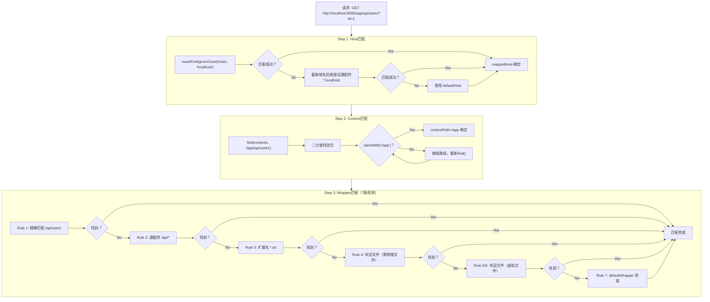

### 1.10 核心问题解答

| 问题 | 答案 |
|------|------|
| URL如何匹配到Servlet？ | 通过三级匹配：Host→Context→Wrapper，每级使用二分查找 |
| Context path是什么？ | web应用的根路径，如/app，通过最长前缀匹配确定 |
| 匹配优先级？ | 精确>通配符>扩展名>欢迎文件(物理)>欢迎文件(虚拟)>默认Servlet |
| 二分查找 find() 的特殊设计？ | 使用`>>>`无符号右移防溢出，返回最近的小于等于目标的索引 |
| 为什么这么快？ | 使用排序数组+二分查找，时间复杂度O(log n)，无需遍历 |
| 通配符匹配的pathInfo从哪来？ | 匹配的通配符前缀之后的路径部分，如`/api/*`匹配`/api/users`→pathInfo=`/users` |
| 扩展名如何提取？ | 从最后一个`/`之后找最后一个`.`，取`.`之后的内容 |
| 欢迎文件为什么分两轮？ | 第一轮要求物理文件存在(index.html)，第二轮允许虚拟映射(index.jsf) |
| JSP通配符的特殊处理？ | 路径以`/`结尾且匹配到JSP通配符时，撤销匹配，强制进入欢迎文件处理 |
| resourceOnly字段的作用？ | 控制扩展名匹配是否需要物理资源，欢迎文件第二轮匹配时`resourceOnly=false`的才能匹配 |

---

## 二、Pipeline/Valve 责任链机制 ✅ 深入分析完成

### 2.1 核心结论回顾

- 四层容器（Engine→Host→Context→Wrapper）每层持有一个 `StandardPipeline`
- `Pipeline` 通过 `first`（自定义Valve链头）+ `basic`（基础Valve，链尾）构成链式调用
- 调用方式：`getFirst().invoke()` → `getNext().invoke()` → ... → `basic.invoke()`
- 基础Valve负责选择下一层容器并转发：`host.getPipeline().getFirst().invoke()`

### 2.2 四层基础 Valve 职责

| 层级 | 基础 Valve | 核心职责 |
|------|-----------|---------|
| Engine | `StandardEngineValve` | 选择 Host，调用 Host Pipeline |
| Host | `StandardHostValve` | 选择 Context，调用 Context Pipeline |
| Context | `StandardContextValve` | 安全检查（/WEB-INF、/META-INF），选择 Wrapper |
| Wrapper | `StandardWrapperValve` | 分配 Servlet，创建 FilterChain，执行 Filter+Servlet |

### 2.3 StandardWrapperValve.invoke() — Pipeline 的终点（完整源码精读）

这是 Pipeline/Valve 链的最后一环，也是连接"容器层"和"应用层"的桥梁：

```java
// 来自: tomcat/java/org/apache/catalina/core/StandardWrapperValve.java (第50-257行)
final class StandardWrapperValve extends ValveBase {

    // ★ JMX 统计字段（原子变量保证线程安全）
    private final AtomicLong processingTime = new AtomicLong();  // 总处理时间
    private volatile long maxTime;                                // 最大单次时间
    private volatile long minTime = Long.MAX_VALUE;               // 最小单次时间
    private final AtomicInteger requestCount = new AtomicInteger(0);  // 请求计数
    private final AtomicInteger errorCount = new AtomicInteger(0);    // 错误计数

    @Override
    public void invoke(Request request, Response response) throws IOException, ServletException {

        boolean unavailable = false;
        Throwable throwable = null;
        long t1 = System.currentTimeMillis();           // ★ 计时开始
        requestCount.incrementAndGet();                 // ★ JMX计数

        StandardWrapper wrapper = (StandardWrapper) getContainer();
        Servlet servlet = null;
        Context context = (Context) wrapper.getParent();

        // ★★★ Phase 1: 可用性检查 ★★★
        // 1a. Context级别可用性
        if (!context.getState().isAvailable()) {
            response.sendError(HttpServletResponse.SC_SERVICE_UNAVAILABLE, ...);
            unavailable = true;
        }
        // 1b. Wrapper级别可用性（Servlet被标记为unavailable）
        if (!unavailable && wrapper.isUnavailable()) {
            checkWrapperAvailable(response, wrapper);  // 返回503或404
            unavailable = true;
        }

        // ★★★ Phase 2: 分配Servlet实例 ★★★
        try {
            if (!unavailable) {
                servlet = wrapper.allocate();  // ★ 从池中获取或创建Servlet
            }
        } catch (UnavailableException e) {
            checkWrapperAvailable(response, wrapper);
        } catch (ServletException | Throwable e) {
            throwable = e;
            exception(request, response, e);
            servlet = null;
        }

        // ★★★ Phase 3: 设置请求属性 + 创建FilterChain ★★★
        DispatcherType dispatcherType = DispatcherType.REQUEST;
        if (request.getDispatcherType() == DispatcherType.ASYNC) {
            dispatcherType = DispatcherType.ASYNC;
        }
        request.setAttribute(Globals.DISPATCHER_TYPE_ATTR, dispatcherType);
        request.setAttribute(Globals.DISPATCHER_REQUEST_PATH_ATTR, requestPathMB);
        ApplicationFilterChain filterChain =
                ApplicationFilterFactory.createFilterChain(request, wrapper, servlet);

        // ★★★ Phase 4: 执行FilterChain ★★★
        try {
            if ((servlet != null) && (filterChain != null)) {
                if (request.isAsyncDispatching()) {
                    request.getAsyncContextInternal().doInternalDispatch();  // 异步分派
                } else {
                    filterChain.doFilter(request.getRequest(), response.getResponse());  // ★ 正常执行
                }
            }
        } catch (BadRequestException e) {
            exception(request, response, e, HttpServletResponse.SC_BAD_REQUEST);  // 400
        } catch (CloseNowException e) {
            exception(request, response, e);  // 立即关闭连接
        } catch (UnavailableException e) {
            wrapper.unavailable(e);           // 标记Servlet不可用
            checkWrapperAvailable(response, wrapper);
        } catch (ServletException | IOException | Throwable e) {
            exception(request, response, e);  // 500
        } finally {
            // ★★★ Phase 5: 清理 ★★★
            if (filterChain != null) {
                filterChain.release();         // 释放FilterChain
            }
            try {
                if (servlet != null) {
                    wrapper.deallocate(servlet);  // 归还Servlet到池
                }
            } catch (Throwable e) { ... }

            // ★ 永久不可用的Servlet需要卸载
            try {
                if (servlet != null && wrapper.getAvailable() == Long.MAX_VALUE) {
                    wrapper.unload();  // 永久不可用，卸载Servlet
                }
            } catch (Throwable e) { ... }

            // ★ JMX 统计更新
            long t2 = System.currentTimeMillis();
            long time = t2 - t1;
            processingTime.getAndAdd(time);
            if (time > maxTime) maxTime = time;
            if (time < minTime) minTime = time;
        }
    }
}
```

**5个阶段详解**：

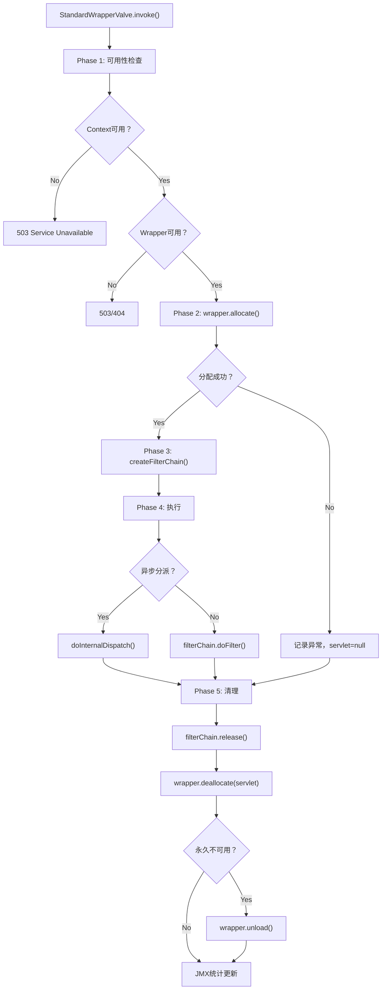

**关键设计**：
1. **JMX 监控**：通过 AtomicLong/AtomicInteger 记录请求数、错误数、处理时间
2. **优雅降级**：UnavailableException 支持临时不可用（带Retry-After头）和永久不可用（404）
3. **异步感知**：异步分派走 `doInternalDispatch()` 而非 `doFilter()`
4. **资源安全**：finally 块确保 FilterChain 释放和 Servlet 归还，即使发生异常

### 2.3 完整调用链时序图

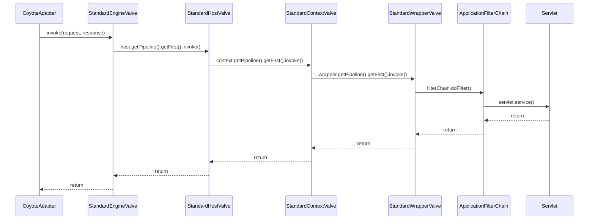

---

## 三、FilterChain 执行机制 ✅ 深入分析完成

### 3.1 核心问题
- 多个Filter的执行顺序如何确定？
- FilterChain如何串联各个Filter？
- Servlet在什么时候执行？

### 3.2 源码位置

```
tomcat/java/org/apache/catalina/core/ApplicationFilterChain.java   — FilterChain 核心实现
tomcat/java/org/apache/catalina/core/ApplicationFilterFactory.java  — FilterChain 工厂
tomcat/java/org/apache/catalina/core/ApplicationFilterConfig.java   — Filter 运行时配置
tomcat/java/org/apache/tomcat/util/descriptor/web/FilterDef.java    — Filter 定义（web.xml解析）
tomcat/java/org/apache/tomcat/util/descriptor/web/FilterMap.java    — Filter 映射（匹配规则）
tomcat/java/org/apache/catalina/core/StandardWrapperValve.java      — FilterChain 的触发入口
```

### 3.3 核心数据结构

#### 3.3.1 ApplicationFilterChain — 责任链核心

```java
// 来自: tomcat/java/org/apache/catalina/core/ApplicationFilterChain.java (第45-96行)
public final class ApplicationFilterChain implements FilterChain {

    public static final int INCREMENT = 10;                      // 数组扩容步长

    // ★ 核心数据结构
    private ApplicationFilterConfig[] filters = new ApplicationFilterConfig[0]; // Filter配置数组
    private int pos = 0;                  // 当前执行位置指针（游标）
    private int n = 0;                    // 链中Filter的实际数量
    private Servlet servlet = null;       // 链尾的目标Servlet
    private boolean servletSupportsAsync = false; // Servlet是否支持异步
}
```

**关键设计**：`filters[]` 是固定数组而非 List，通过 `pos` 游标推进执行位置，`n` 记录实际 Filter 数量。数组按 INCREMENT=10 步长扩容。

#### 3.3.2 FilterMap — Filter 映射规则

```java
// 来自: tomcat/java/org/apache/tomcat/util/descriptor/web/FilterMap.java (第35-58行)
public class FilterMap extends XmlEncodingBase implements Serializable {

    // ★ DispatcherType 位掩码常量
    public static final int ERROR = 1;
    public static final int FORWARD = 2;
    public static final int INCLUDE = 4;
    public static final int REQUEST = 8;
    public static final int ASYNC = 16;
    private static final int NOT_SET = 0;

    private int dispatcherMapping = NOT_SET;       // 位掩码组合
    private String filterName = null;              // 关联的Filter名称
    private String[] servletNames = new String[0]; // 匹配的Servlet名称
    private String[] urlPatterns = new String[0];  // 匹配的URL模式
    private boolean matchAllUrlPatterns = false;   // 配置"*"时为true
    private boolean matchAllServletNames = false;  // 配置"*"时为true
}
```

**位掩码设计**：通过 `|=` 组合多个 DispatcherType，用 `&` 检查匹配。**当未设置任何 dispatcher 时（NOT_SET=0），`getDispatcherMapping()` 默认返回 REQUEST**（Servlet 规范 SRV.6.2.5）：

```java
// 来自: tomcat/java/org/apache/tomcat/util/descriptor/web/FilterMap.java (第170-178行)
public int getDispatcherMapping() {
    // per the SRV.6.2.5 absence of any dispatcher elements is
    // equivalent to a REQUEST value
    if (dispatcherMapping == NOT_SET) {
        return REQUEST;
    }
    return dispatcherMapping;
}
```

#### 3.3.3 类关系图

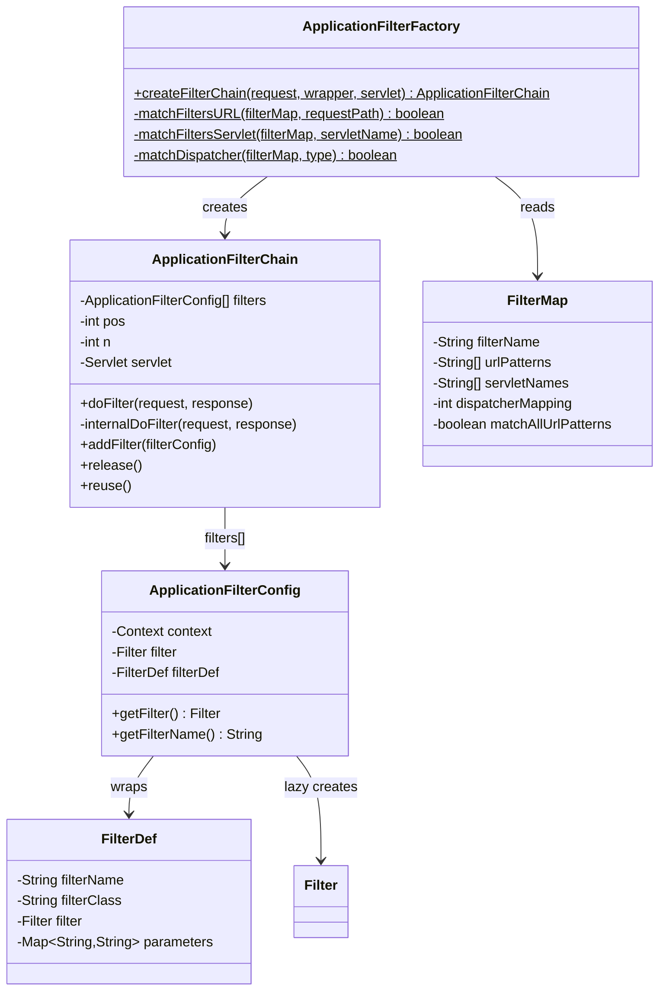

### 3.4 FilterChain 构建流程

#### 3.4.1 触发入口：StandardWrapperValve.invoke()

```java
// 来自: tomcat/java/org/apache/catalina/core/StandardWrapperValve.java (第87-170行)
public void invoke(Request request, Response response) throws IOException, ServletException {

    StandardWrapper wrapper = (StandardWrapper) getContainer();
    Servlet servlet = null;
    Context context = (Context) wrapper.getParent();

    // Step 1: 分配Servlet实例
    if (!unavailable) {
        servlet = wrapper.allocate();
    }

    // Step 2: 设置请求属性
    request.setAttribute(Globals.DISPATCHER_TYPE_ATTR, dispatcherType);
    request.setAttribute(Globals.DISPATCHER_REQUEST_PATH_ATTR, requestPathMB);

    // ★ Step 3: 创建FilterChain
    ApplicationFilterChain filterChain =
            ApplicationFilterFactory.createFilterChain(request, wrapper, servlet);

    // ★ Step 4: 执行FilterChain（内部会调用Servlet）
    if ((servlet != null) && (filterChain != null)) {
        if (request.isAsyncDispatching()) {
            request.getAsyncContextInternal().doInternalDispatch(); // 异步分派
        } else {
            filterChain.doFilter(request.getRequest(), response.getResponse()); // 正常执行
        }
    }

    // Step 5: 清理
    if (filterChain != null) {
        filterChain.release();
    }
    if (servlet != null) {
        wrapper.deallocate(servlet);
    }
}
```

#### 3.4.2 工厂方法：ApplicationFilterFactory.createFilterChain()

```java
// 来自: tomcat/java/org/apache/catalina/core/ApplicationFilterFactory.java (第50-135行)
public static ApplicationFilterChain createFilterChain(ServletRequest request,
        Wrapper wrapper, Servlet servlet) {

    if (servlet == null) {
        return null;
    }

    // Step 1: 创建或复用 FilterChain 实例
    ApplicationFilterChain filterChain = null;
    if (request instanceof Request) {
        Request req = (Request) request;
        if (Globals.IS_SECURITY_ENABLED) {
            filterChain = new ApplicationFilterChain();          // 安全模式：每次new（防安全问题）
        } else {
            filterChain = (ApplicationFilterChain) req.getFilterChain();
            if (filterChain == null) {
                filterChain = new ApplicationFilterChain();
                req.setFilterChain(filterChain);                 // 非安全模式：缓存复用
            }
        }
    } else {
        filterChain = new ApplicationFilterChain();              // RequestDispatcher场景
    }

    filterChain.setServlet(servlet);
    filterChain.setServletSupportsAsync(wrapper.isAsyncSupported());

    // Step 2: 获取所有 FilterMap
    StandardContext context = (StandardContext) wrapper.getParent();
    FilterMap filterMaps[] = context.findFilterMaps();
    if (filterMaps == null || filterMaps.length == 0) {
        return filterChain;
    }

    DispatcherType dispatcher = (DispatcherType) request.getAttribute(Globals.DISPATCHER_TYPE_ATTR);
    String requestPath = ...; // 从请求属性获取
    String servletName = wrapper.getName();

    // ★ Step 3: 第一轮 — URL模式匹配（优先）
    for (FilterMap filterMap : filterMaps) {
        if (!matchDispatcher(filterMap, dispatcher)) continue;
        if (!matchFiltersURL(filterMap, requestPath)) continue;
        ApplicationFilterConfig filterConfig =
                (ApplicationFilterConfig) context.findFilterConfig(filterMap.getFilterName());
        if (filterConfig == null) continue;
        filterChain.addFilter(filterConfig);
    }

    // ★ Step 4: 第二轮 — Servlet名称匹配
    for (FilterMap filterMap : filterMaps) {
        if (!matchDispatcher(filterMap, dispatcher)) continue;
        if (!matchFiltersServlet(filterMap, servletName)) continue;
        ApplicationFilterConfig filterConfig =
                (ApplicationFilterConfig) context.findFilterConfig(filterMap.getFilterName());
        if (filterConfig == null) continue;
        filterChain.addFilter(filterConfig);
    }

    return filterChain;
}
```

**关键设计**：
1. **两轮匹配**：先 URL 模式，再 Servlet 名称。URL匹配的Filter排在前面
2. **去重保证**：`addFilter()` 内部通过引用比较（`==`）防止同一Filter被加两次
3. **复用优化**：非安全模式下 FilterChain 缓存在 Request 对象上

#### 3.4.3 URL 匹配算法：matchFiltersURL()

```java
// 来自: tomcat/java/org/apache/catalina/core/ApplicationFilterFactory.java (第182-221行)
private static boolean matchFiltersURL(String testPath, String requestPath) {

    if (testPath == null) return false;

    // Case 1 — 精确匹配
    if (testPath.equals(requestPath)) return true;

    // Case 2 — 路径匹配 ("/.../*")
    if (testPath.equals("/*")) return true;
    if (testPath.endsWith("/*")) {
        if (testPath.regionMatches(0, requestPath, 0, testPath.length() - 2)) {
            if (requestPath.length() == (testPath.length() - 2)) return true;     // /api == /api/*
            else if ('/' == requestPath.charAt(testPath.length() - 2)) return true; // /api/xxx
        }
        return false;
    }

    // Case 3 — 扩展名匹配 ("*.xxx")
    if (testPath.startsWith("*.")) {
        int slash = requestPath.lastIndexOf('/');
        int period = requestPath.lastIndexOf('.');
        if ((slash >= 0) && (period > slash) && (period != requestPath.length() - 1) &&
                ((requestPath.length() - period) == (testPath.length() - 1))) {
            return testPath.regionMatches(2, requestPath, period + 1, testPath.length() - 2);
        }
    }

    // Case 4 — 默认匹配（对Filter不适用，返回false）
    return false;
}
```

#### 3.4.4 DispatcherType 匹配：matchDispatcher()

```java
// 来自: tomcat/java/org/apache/catalina/core/ApplicationFilterFactory.java (第256-285行)
private static boolean matchDispatcher(FilterMap filterMap, DispatcherType type) {
    switch (type) {
        case FORWARD:
            if ((filterMap.getDispatcherMapping() & FilterMap.FORWARD) != 0) return true;
            break;
        case INCLUDE:
            if ((filterMap.getDispatcherMapping() & FilterMap.INCLUDE) != 0) return true;
            break;
        case REQUEST:
            if ((filterMap.getDispatcherMapping() & FilterMap.REQUEST) != 0) return true;
            break;
        case ERROR:
            if ((filterMap.getDispatcherMapping() & FilterMap.ERROR) != 0) return true;
            break;
        case ASYNC:
            if ((filterMap.getDispatcherMapping() & FilterMap.ASYNC) != 0) return true;
            break;
    }
    return false;
}
```

### 3.5 FilterChain 执行机制 — internalDoFilter()

#### 3.5.1 核心执行方法

```java
// 来自: tomcat/java/org/apache/catalina/core/ApplicationFilterChain.java (第160-226行)
private void internalDoFilter(ServletRequest request, ServletResponse response)
        throws IOException, ServletException {

    // ★ 如果还有Filter没执行，执行下一个Filter
    if (pos < n) {
        ApplicationFilterConfig filterConfig = filters[pos++]; // pos先用后加！
        try {
            Filter filter = filterConfig.getFilter();          // 懒加载获取Filter实例

            // 如果当前Filter不支持异步，标记请求不支持异步
            if (request.isAsyncSupported() &&
                    "false".equalsIgnoreCase(filterConfig.getFilterDef().getAsyncSupported())) {
                request.setAttribute(Globals.ASYNC_SUPPORTED_ATTR, Boolean.FALSE);
            }

            // ★ 调用Filter.doFilter()，传入 this（链自身）
            filter.doFilter(request, response, this);
        } catch (IOException | ServletException | RuntimeException e) {
            throw e;
        } catch (Throwable e) {
            e = ExceptionUtils.unwrapInvocationTargetException(e);
            ExceptionUtils.handleThrowable(e);
            throw new ServletException(sm.getString("filterChain.filter"), e);
        }
        return; // ★ 关键！直接return，不会执行下面的Servlet
    }

    // ★ 所有Filter执行完毕（pos >= n），调用目标Servlet
    try {
        if (request.isAsyncSupported() && !servletSupportsAsync) {
            request.setAttribute(Globals.ASYNC_SUPPORTED_ATTR, Boolean.FALSE);
        }
        servlet.service(request, response); // ★ 执行Servlet
    } catch (IOException | ServletException | RuntimeException e) {
        throw e;
    } catch (Throwable e) {
        e = ExceptionUtils.unwrapInvocationTargetException(e);
        ExceptionUtils.handleThrowable(e);
        throw new ServletException(sm.getString("filterChain.servlet"), e);
    }
}
```

#### 3.5.2 addFilter() — 去重 + 扩容

```java
// 来自: tomcat/java/org/apache/catalina/core/ApplicationFilterChain.java (第256-272行)
void addFilter(ApplicationFilterConfig filterConfig) {

    // 去重：防止同一Filter被添加多次（引用比较）
    for (ApplicationFilterConfig filter : filters) {
        if (filter == filterConfig) {
            return;
        }
    }

    // 扩容：每次扩容INCREMENT=10
    if (n == filters.length) {
        ApplicationFilterConfig[] newFilters = new ApplicationFilterConfig[n + INCREMENT];
        System.arraycopy(filters, 0, newFilters, 0, n);
        filters = newFilters;
    }
    filters[n++] = filterConfig;
}
```

### 3.6 执行流程详解

#### 3.6.1 递归调用模型

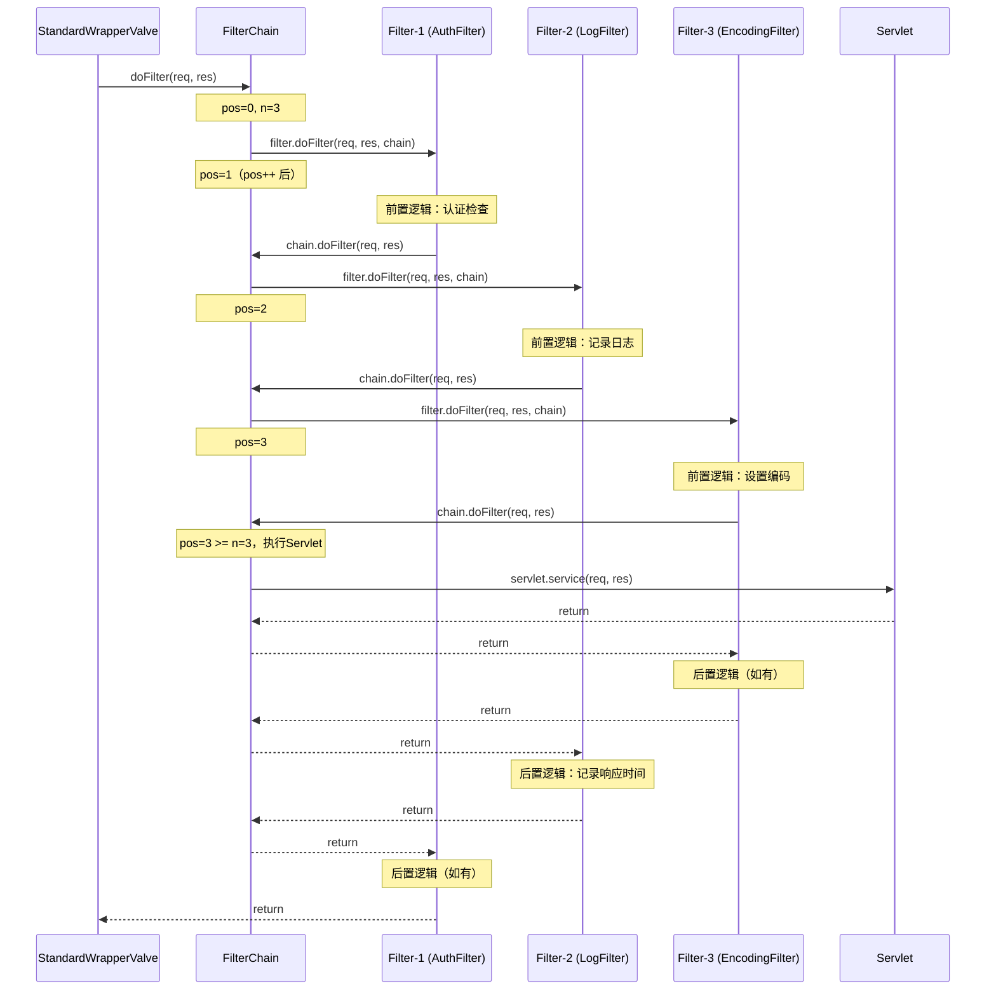

#### 3.6.2 核心执行原理

这是经典的**责任链模式 + 递归调用**：

1. `internalDoFilter()` 被调用时，检查 `pos < n`
2. 取出 `filters[pos++]`（注意 **pos 先用后加**）
3. 调用 `filter.doFilter(request, response, this)` — 传入 `this`（链自身）
4. 用户 Filter 代码中调用 `chain.doFilter(request, response)` → 再次进入 `internalDoFilter()`
5. 此时 `pos` 已推进，取下一个 Filter
6. 当 `pos >= n` 时，执行 `servlet.service()`
7. 返回时沿调用栈**逆序展开**，各 Filter 的后置逻辑依次执行

**本质**：利用 Java 方法调用栈实现了"洋葱模型"—— 请求像穿过洋葱一样，先正序穿过所有 Filter 到达 Servlet，再逆序返回。

### 3.7 Filter 执行顺序决定规则

| 优先级 | 规则 | 说明 |
|--------|------|------|
| 1 | **URL 模式匹配优先** | 先遍历所有 FilterMap 做 URL 匹配 |
| 2 | **Servlet 名称匹配其次** | 再遍历所有 FilterMap 做 Servlet 名称匹配 |
| 3 | **声明顺序决定** | 同一轮匹配中，按 `context.findFilterMaps()` 返回顺序（即 web.xml 声明顺序或 `@WebFilter` 注册顺序） |
| 4 | **去重保证** | `addFilter()` 引用比较防止同一 Filter 加两次 |

### 3.8 FilterChain 构建与执行完整流程图

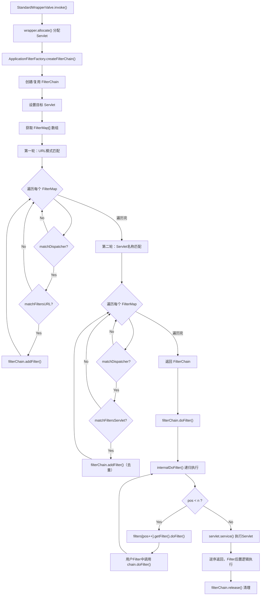

### 3.9 核心问题解答

| 问题 | 答案 |
|------|------|
| Filter执行顺序如何确定？ | 先URL匹配再Servlet名称匹配，同一轮按web.xml声明顺序 |
| FilterChain如何串联Filter？ | 数组 + pos游标 + 递归调用。每次调用 `chain.doFilter()` 推进 pos |
| Servlet何时执行？ | 所有Filter执行完毕（`pos >= n`）后才调用 `servlet.service()` |
| 如果Filter不调用chain.doFilter()？ | 链中断，后续Filter和Servlet都不会执行（常用于权限拦截） |
| FilterChain是否复用？ | 非安全模式下缓存在Request对象上复用，通过 `reuse()` 重置 pos=0 |
| 异步支持如何检测？ | 链中任一Filter不支持异步，则标记请求不支持异步（传递性） |

---

## 四、异步 Servlet 机制 ✅ 深入分析完成

### 4.1 核心问题
- `startAsync()` 如何改变请求处理流程？
- 异步状态机有多少个状态？如何转换？
- `complete()` 和 `dispatch()` 的区别？
- 异步超时如何处理？

### 4.2 源码位置

```
tomcat/java/org/apache/coyote/AsyncStateMachine.java                — 异步状态机（13个状态）
tomcat/java/org/apache/catalina/core/AsyncContextImpl.java          — AsyncContext 实现
tomcat/java/org/apache/catalina/connector/Request.java              — startAsync() 入口
tomcat/java/org/apache/coyote/AbstractProcessorLight.java           — 处理器主循环
tomcat/java/org/apache/coyote/AbstractProcessor.java                — ActionCode 处理
tomcat/java/org/apache/catalina/connector/CoyoteAdapter.java        — asyncDispatch() 适配
```

### 4.3 异步状态机 — AsyncStateMachine

#### 4.3.1 13 个内部状态

```java
// 来自: tomcat/java/org/apache/coyote/AsyncStateMachine.java (第134-147行)
private enum AsyncState {
    DISPATCHED      (false, false, false, false),  // 普通请求，非异步
    STARTING        (true,  true,  false, false),  // startAsync()已调用，service()未退出
    STARTED         (true,  true,  false, false),  // startAsync()已调用，service()已退出
    MUST_COMPLETE   (true,  true,  true,  false),  // service()内 startAsync()+complete()
    COMPLETE_PENDING(true,  true,  false, false),  // 其他线程在service()退出前调了complete()
    COMPLETING      (true,  false, true,  false),  // STARTED状态调用complete()
    TIMING_OUT      (true,  true,  false, false),  // 异步超时，等待complete()/dispatch()
    MUST_DISPATCH   (true,  true,  false, true),   // service()内 startAsync()+dispatch()
    DISPATCH_PENDING(true,  true,  false, false),  // 其他线程在service()退出前调了dispatch()
    DISPATCHING     (true,  false, false, true),   // dispatch正在处理中
    READ_WRITE_OP   (true,  true,  false, false),  // 正在执行异步读写操作
    MUST_ERROR      (true,  true,  false, false),  // service()内startAsync()后发生I/O错误
    ERROR           (true,  true,  false, false);  // 出错了

    private final boolean isAsync;        // 是否在异步模式
    private final boolean isStarted;      // 是否已启动
    private final boolean isCompleting;   // 是否正在完成
    private final boolean isDispatching;  // 是否正在分派
}
```

#### 4.3.2 核心字段

```java
// 来自: tomcat/java/org/apache/coyote/AsyncStateMachine.java (第179-198行)
private volatile AsyncState state = AsyncState.DISPATCHED;      // 当前状态
private volatile long lastAsyncStart = 0;                       // 上次异步启动时间
private final AtomicLong generation = new AtomicLong(0);        // ★ 代次计数器（CVE-2018-8037）
private boolean hasProcessedError = false;                      // 是否已处理过错误
private AsyncContextCallback asyncCtxt = null;                  // 回调上下文
private final AbstractProcessor processor;                      // 关联的处理器
```

**代次机制**：每次 `asyncStart()` 时 `generation` 自增，用于检测和防止前一次异步处理的旧事件干扰当前代次。

#### 4.3.3 状态转换图

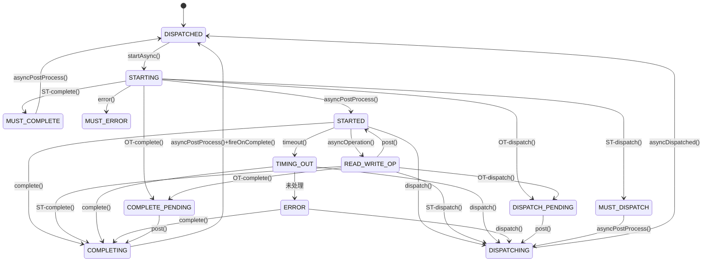

### 4.4 startAsync() 流程详解

#### 4.4.1 入口：Request.startAsync()

```java
// 来自: tomcat/java/org/apache/catalina/connector/Request.java (startAsync方法)
public AsyncContext startAsync(ServletRequest request, ServletResponse response) {
    // 1. 检查是否支持异步（Servlet/Filter/Valve都需声明支持）
    if (!isAsyncSupported()) {
        throw new IllegalStateException(...);
    }
    // 2. 懒创建 AsyncContextImpl
    if (asyncContext == null) {
        asyncContext = new AsyncContextImpl(this);
    }
    // 3. 启动异步处理
    asyncContext.setStarted(getContext(), request, response,
            request == getRequest() && response == getResponse().getResponse());
    // 4. 设置默认超时（来自连接器配置，默认30秒）
    asyncContext.setTimeout(getConnector().getAsyncTimeout());
    return asyncContext;
}
```

#### 4.4.2 状态机 asyncStart()

```java
// 来自: tomcat/java/org/apache/coyote/AsyncStateMachine.java (第244-256行)
public synchronized void asyncStart(AsyncContextCallback asyncCtxt) {
    if (state == AsyncState.DISPATCHED) {
        generation.incrementAndGet();           // ★ 递增代次
        updateState(AsyncState.STARTING);       // DISPATCHED → STARTING
        this.asyncCtxt = asyncCtxt;
        lastAsyncStart = System.currentTimeMillis();
    } else {
        throw new IllegalStateException(...);
    }
}
```

#### 4.4.3 对处理流程的关键影响

```java
// 来自: tomcat/java/org/apache/coyote/AbstractProcessorLight.java (第40-98行)
public SocketState process(SocketWrapperBase<?> socketWrapper, SocketEvent status) throws IOException {

    SocketState state = SocketState.CLOSED;
    do {
        // ... 省略其他分支 ...

        if (status == SocketEvent.OPEN_READ) {
            state = service(socketWrapper);  // 执行Servlet.service()
        }

        // ★ service()返回后检查：如果是异步模式
        if (isAsync() && state != SocketState.CLOSED) {
            state = asyncPostProcess();
            // STARTING → STARTED，返回 SocketState.LONG
        }
    } while (state == SocketState.ASYNC_END || dispatches != null && state != SocketState.CLOSED);

    return state; // ★ 返回 SocketState.LONG → 容器线程释放，连接保持打开
}
```

#### 4.4.4 asyncPostProcess() 关键逻辑

```java
// 来自: tomcat/java/org/apache/coyote/AsyncStateMachine.java (第271-304行)
public synchronized SocketState asyncPostProcess() {
    if (state == AsyncState.COMPLETE_PENDING) {
        clearNonBlockingListeners();
        updateState(AsyncState.COMPLETING);
        return SocketState.ASYNC_END;                    // 继续循环处理complete
    } else if (state == AsyncState.DISPATCH_PENDING) {
        clearNonBlockingListeners();
        updateState(AsyncState.DISPATCHING);
        return SocketState.ASYNC_END;                    // 继续循环处理dispatch
    } else if (state == AsyncState.STARTING || state == AsyncState.READ_WRITE_OP) {
        updateState(AsyncState.STARTED);
        return SocketState.LONG;                         // ★ 进入长轮询，释放线程
    } else if (state == AsyncState.MUST_COMPLETE || state == AsyncState.COMPLETING) {
        asyncCtxt.fireOnComplete();
        updateState(AsyncState.DISPATCHED);
        asyncCtxt.decrementInProgressAsyncCount();
        return SocketState.ASYNC_END;                    // 异步完成
    } else if (state == AsyncState.MUST_DISPATCH) {
        updateState(AsyncState.DISPATCHING);
        return SocketState.ASYNC_END;                    // 执行dispatch
    } else if (state == AsyncState.DISPATCHING) {
        asyncCtxt.fireOnComplete();
        updateState(AsyncState.DISPATCHED);
        asyncCtxt.decrementInProgressAsyncCount();
        return SocketState.ASYNC_END;                    // dispatch完成
    } else if (state == AsyncState.STARTED) {
        return SocketState.LONG;                         // 保持长轮询
    } else {
        throw new IllegalStateException(...);
    }
}
```

### 4.5 complete() 流程详解

#### 4.5.1 asyncComplete() 状态转换

```java
// 来自: tomcat/java/org/apache/coyote/AsyncStateMachine.java (第307-347行)
public synchronized boolean asyncComplete() {
    Request request = processor.getRequest();
    // ★ 非容器线程 + service()未退出 → COMPLETE_PENDING
    if ((request == null || !request.isRequestThread()) &&
            (state == AsyncState.STARTING || state == AsyncState.READ_WRITE_OP)) {
        updateState(AsyncState.COMPLETE_PENDING);
        return false;
    }

    clearNonBlockingListeners();
    boolean triggerDispatch = false;
    if (state == AsyncState.STARTING || state == AsyncState.MUST_ERROR) {
        updateState(AsyncState.MUST_COMPLETE);           // 容器线程，service()退出后处理
    } else if (state == AsyncState.STARTED) {
        updateState(AsyncState.COMPLETING);
        triggerDispatch = true;                           // ★ 需要触发dispatch到容器线程
    } else if (state == AsyncState.READ_WRITE_OP || state == AsyncState.TIMING_OUT ||
               state == AsyncState.ERROR) {
        updateState(AsyncState.COMPLETING);              // 已在容器线程上
    } else {
        throw new IllegalStateException(...);
    }
    return triggerDispatch;
}
```

**容器线程（ST）vs 非容器线程（OT）区分**：

| 调用场景 | 当前状态 | 新状态 | 是否触发dispatch |
|----------|---------|--------|-----------------|
| OT + service()未退出 | STARTING/READ_WRITE_OP | COMPLETE_PENDING | false |
| ST + service()内部 | STARTING/MUST_ERROR | MUST_COMPLETE | false |
| 任意线程 + service()已退出 | STARTED | COMPLETING | **true** |
| 容器线程 + 超时/错误/读写 | TIMING_OUT/ERROR/READ_WRITE_OP | COMPLETING | false |

### 4.6 dispatch() 流程详解

```java
// 来自: tomcat/java/org/apache/coyote/AsyncStateMachine.java (第366-406行)
public synchronized boolean asyncDispatch() {
    Request request = processor.getRequest();
    if ((request == null || !request.isRequestThread()) &&
            (state == AsyncState.STARTING || state == AsyncState.READ_WRITE_OP)) {
        updateState(AsyncState.DISPATCH_PENDING);
        return false;
    }

    clearNonBlockingListeners();
    boolean triggerDispatch = false;
    if (state == AsyncState.STARTING || state == AsyncState.MUST_ERROR) {
        updateState(AsyncState.MUST_DISPATCH);
    } else if (state == AsyncState.STARTED) {
        updateState(AsyncState.DISPATCHING);
        triggerDispatch = true;
    } else if (state == AsyncState.READ_WRITE_OP || state == AsyncState.TIMING_OUT ||
               state == AsyncState.ERROR) {
        updateState(AsyncState.DISPATCHING);
    } else {
        throw new IllegalStateException(...);
    }
    return triggerDispatch;
}
```

**complete() vs dispatch() 的区别**：

| 方面 | complete() | dispatch() |
|------|-----------|-----------|
| 作用 | 直接完成响应，关闭异步处理 | 重新分派到容器，再次进入 Servlet 管道 |
| 状态目标 | COMPLETING → DISPATCHED | DISPATCHING → DISPATCHED |
| 后续动作 | 刷新响应缓冲区，触发 onComplete | 重新进入 Pipeline/Valve/FilterChain |
| 使用场景 | 异步线程中直接写完响应 | 需要回到 Servlet 继续处理 |

### 4.7 异步超时处理机制

#### 4.7.1 超时检测

```java
// 来自: tomcat/java/org/apache/coyote/AsyncStateMachine.java (第350-363行)
public synchronized boolean asyncTimeout() {
    if (state == AsyncState.STARTED) {
        updateState(AsyncState.TIMING_OUT);    // STARTED → TIMING_OUT
        return true;
    } else if (state == AsyncState.COMPLETING || state == AsyncState.DISPATCHING ||
               state == AsyncState.DISPATCHED) {
        // 竞争条件保护：已在完成/分派中，忽略超时
        return false;
    } else {
        throw new IllegalStateException(...);
    }
}
```

#### 4.7.2 超时处理流程

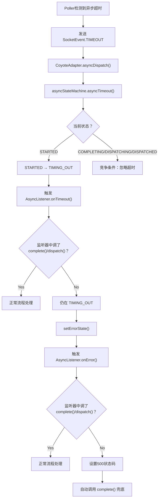

### 4.8 异步Servlet完整生命周期

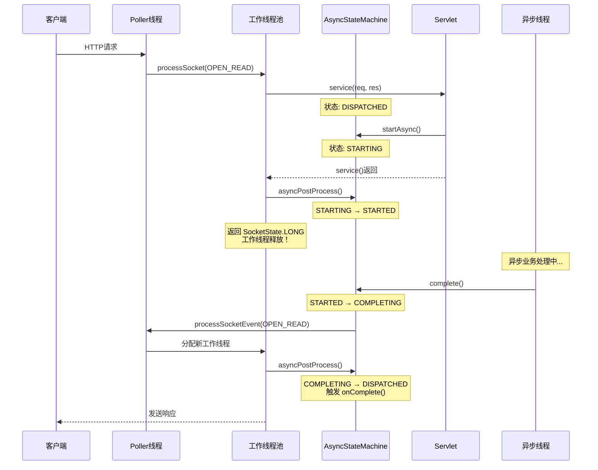

### 4.9 核心问题解答

| 问题 | 答案 |
|------|------|
| startAsync()做了什么？ | 创建AsyncContextImpl，状态 DISPATCHED→STARTING，记录代次 |
| 为什么能释放线程？ | asyncPostProcess()返回SocketState.LONG，工作线程退出process()循环 |
| complete()如何完成响应？ | 通过processSocketEvent()将socket加入线程池，由新线程刷新响应 |
| dispatch()和complete()区别？ | dispatch()重入Servlet管道，complete()直接完成 |
| 超时后会怎样？ | TIMING_OUT→触发onTimeout()→若未处理→ERROR→onError()→自动complete() |
| 线程安全如何保证？ | AsyncStateMachine所有转换方法都是synchronized |
| 代次机制解决什么问题？ | 防止前一次异步事件干扰当前处理（CVE-2018-8037） |
| ST和OT为什么要区分？ | 避免在service()未退出时直接执行complete/dispatch导致并发问题 |

---

## 五、零拷贝 sendFile 机制 ✅ 深入分析完成

### 5.1 核心问题
- 什么条件下触发 sendFile？
- `FileChannel.transferTo()` 如何实现零拷贝？
- sendFile 与 NIO 事件循环如何交互（写不完怎么办）？

### 5.2 源码位置

```
tomcat/java/org/apache/tomcat/util/net/SendfileState.java          — 状态枚举
tomcat/java/org/apache/tomcat/util/net/SendfileDataBase.java        — 传输数据基类
tomcat/java/org/apache/tomcat/util/net/SendfileKeepAliveState.java  — Keep-Alive状态
tomcat/java/org/apache/tomcat/util/net/NioEndpoint.java             — 核心零拷贝实现
tomcat/java/org/apache/coyote/http11/Http11Processor.java           — 协议层编排
tomcat/java/org/apache/catalina/servlets/DefaultServlet.java        — 触发入口
```

### 5.3 核心数据结构

#### 5.3.1 SendfileState — 状态枚举

```java
// 来自: tomcat/java/org/apache/tomcat/util/net/SendfileState.java (第19-37行)
public enum SendfileState {
    PENDING,  // 传输已开始但未完成，socket仍被sendfile占用
    DONE,     // 文件已完全发送，socket已释放
    ERROR     // 出错，文件可能部分发送，socket状态未知
}
```

#### 5.3.2 SendfileDataBase — 传输数据基类

```java
// 来自: tomcat/java/org/apache/tomcat/util/net/SendfileDataBase.java (第19-54行)
public abstract class SendfileDataBase {
    public SendfileKeepAliveState keepAliveState = SendfileKeepAliveState.NONE;
    public final String fileName;   // 文件完整路径
    public long pos;                // 当前写入位置（随传输更新）
    public long length;             // 剩余待传输字节数（随传输递减）

    public SendfileDataBase(String filename, long pos, long length) {
        this.fileName = filename;
        this.pos = pos;
        this.length = length;
    }
}
```

#### 5.3.3 NioEndpoint.SendfileData — NIO子类

```java
// 来自: tomcat/java/org/apache/tomcat/util/net/NioEndpoint.java (SendfileData内部类)
public static class SendfileData extends SendfileDataBase {
    protected volatile FileChannel fchannel;  // 文件通道（延迟初始化）
}
```

#### 5.3.4 数据结构关系图

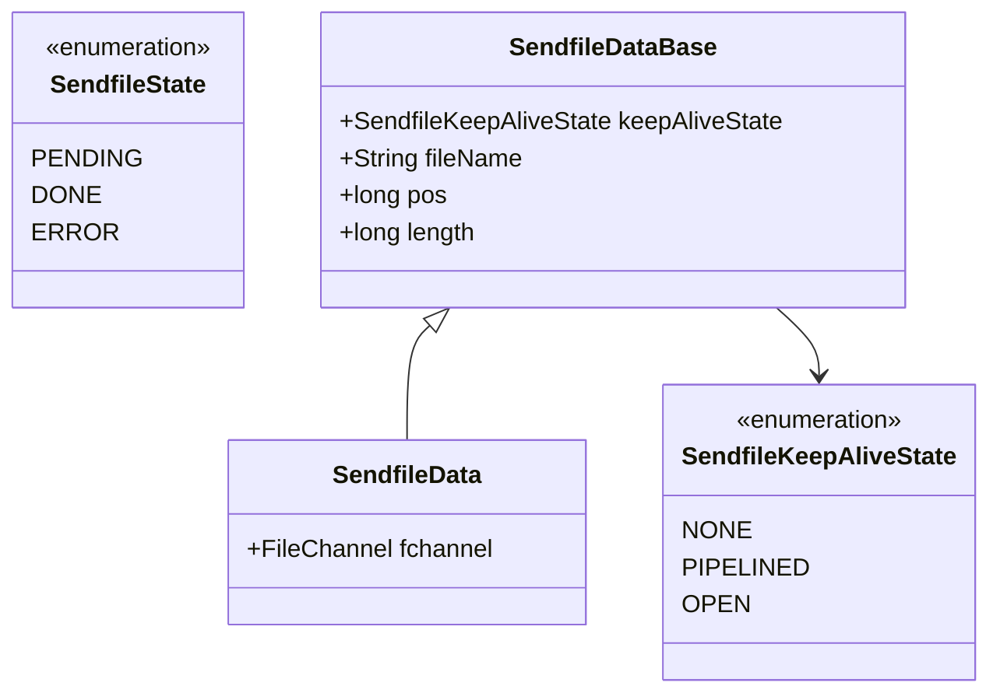

### 5.4 sendFile 触发条件

#### 5.4.1 DefaultServlet.checkSendfile() — 唯一判断入口

```java
// 来自: tomcat/java/org/apache/catalina/servlets/DefaultServlet.java (checkSendfile方法)
protected boolean checkSendfile(HttpServletRequest request, HttpServletResponse response,
        WebResource resource, long length, Range range) {
    String canonicalPath;
    if (sendfileSize > 0                                                              // 1. sendfileSize > 0（默认48KB）
        && length > sendfileSize                                                       // 2. 文件长度 > 阈值
        && (Boolean.TRUE.equals(request.getAttribute(Globals.SENDFILE_SUPPORTED_ATTR))) // 3. 连接器支持sendfile
        && (request.getClass().getName().equals("...RequestFacade"))                    // 4. 原生请求（非包装）
        && (response.getClass().getName().equals("...ResponseFacade"))                  // 5. 原生响应（非包装）
        && resource.isFile()                                                           // 6. 是文件（非目录）
        && ((canonicalPath = resource.getCanonicalPath()) != null)                     // 7. 能获取规范路径
    ) {
        // 通过 Request Attribute 传递 sendfile 参数
        request.setAttribute(Globals.SENDFILE_FILENAME_ATTR, canonicalPath);
        request.setAttribute(Globals.SENDFILE_FILE_START_ATTR, Long.valueOf(range == null ? 0L : range.start));
        request.setAttribute(Globals.SENDFILE_FILE_END_ATTR, Long.valueOf(range == null ? length : range.end + 1));
        return true;
    }
    return false;
}
```

**7个必要条件**：

| 条件 | 说明 | 默认值/备注 |
|------|------|------------|
| sendfileSize > 0 | 阈值大于0 | 默认48KB |
| length > sendfileSize | 文件大于阈值 | 小文件走普通IO |
| SENDFILE_SUPPORTED | 连接器支持 | NIO支持，APR也支持 |
| RequestFacade | 原生请求 | 非包装器请求 |
| ResponseFacade | 原生响应 | 非包装器响应 |
| resource.isFile() | 是文件 | 非目录 |
| canonicalPath != null | 有规范路径 | 虚拟资源不行 |

#### 5.4.2 重要限制

| 限制 | 原因 |
|------|------|
| **Writer输出不支持** | Writer涉及字符编码转换，无法直接零拷贝 |
| **多段Range不支持** | 多段Range需要插入boundary分隔符 |
| **压缩互斥** | sendfileData != null 时跳过 gzip 压缩 |
| **SSL降级** | TLS连接退化为读到用户态再加密写出，非真正零拷贝 |
| **HTTP/2不支持** | H2帧格式不支持 sendfile |

### 5.5 sendFile 执行流程

#### 5.5.1 第一次写入（工作线程）

```java
// NioSocketWrapper.processSendfile() — NioEndpoint.java (第1546-1556行)
public SendfileState processSendfile(SendfileDataBase sendfileData) {
    setSendfileData((SendfileData) sendfileData);
    SelectionKey key = getSocket().getIOChannel().keyFor(getPoller().getSelector());
    if (key == null) {
        return SendfileState.ERROR;
    } else {
        // ★ 第一次写入在当前工作线程上执行
        return getPoller().processSendfile(key, this, true); // calledByProcessor=true
    }
}
```

#### 5.5.2 Poller.processSendfile() — 核心零拷贝实现

```java
// 来自: tomcat/java/org/apache/tomcat/util/net/NioEndpoint.java (第974-1083行)
public SendfileState processSendfile(SelectionKey sk, NioSocketWrapper socketWrapper,
        boolean calledByProcessor) {
    NioChannel sc = null;
    try {
        // 1. 取消当前就绪事件注册，避免并发问题
        unreg(sk, socketWrapper, sk.readyOps());
        SendfileData sd = socketWrapper.getSendfileData();

        // 2. 延迟初始化 FileChannel
        if (sd.fchannel == null) {
            File f = new File(sd.fileName);
            FileInputStream fis = new FileInputStream(f);
            sd.fchannel = fis.getChannel();
        }

        // 3. 选择输出通道（SSL走SecureNioChannel，普通走SocketChannel）
        sc = socketWrapper.getSocket();
        WritableByteChannel wc = ((sc instanceof SecureNioChannel) ? sc : sc.getIOChannel());

        // 4. 如果有残留缓冲数据（如HTTP响应头），先flush
        if (sc.getOutboundRemaining() > 0) {
            if (sc.flushOutbound()) {
                socketWrapper.updateLastWrite();
            }
        } else {
            // ★★★ 5. 核心零拷贝调用 ★★★
            long written = sd.fchannel.transferTo(sd.pos, sd.length, wc);
            if (written > 0) {
                sd.pos += written;       // 更新位置
                sd.length -= written;    // 减少剩余量
                socketWrapper.updateLastWrite();
            } else {
                // 异常检查：文件长度设置是否正确
                if (sd.fchannel.size() <= sd.pos) {
                    throw new IOException(sm.getString("endpoint.sendfile.tooMuchData"));
                }
            }
        }

        // 6. 判断是否传输完成
        if (sd.length <= 0 && sc.getOutboundRemaining() <= 0) {
            // === 传输完成 ===
            socketWrapper.setSendfileData(null);
            sd.fchannel.close();

            if (!calledByProcessor) {
                // Poller线程调用，负责后续处理
                switch (sd.keepAliveState) {
                    case NONE:      poller.cancelledKey(sk, socketWrapper);              break; // 关闭连接
                    case PIPELINED: processSocket(socketWrapper, SocketEvent.OPEN_READ, true); break; // 处理下一请求
                    case OPEN:      reg(sk, socketWrapper, SelectionKey.OP_READ);        break; // 等待下一请求
                }
            }
            return SendfileState.DONE;
        } else {
            // === 传输未完成（TCP发送缓冲区满）===
            if (calledByProcessor) {
                add(socketWrapper, SelectionKey.OP_WRITE);      // Processor调用：注册OP_WRITE到Poller
            } else {
                reg(sk, socketWrapper, SelectionKey.OP_WRITE);  // Poller调用：直接更新注册
            }
            return SendfileState.PENDING;
        }
    } catch (IOException e) {
        if (!calledByProcessor && sc != null) {
            poller.cancelledKey(sk, socketWrapper);
        }
        return SendfileState.ERROR;
    }
}
```

#### 5.5.3 Poller事件循环中的sendFile处理

```java
// 来自: tomcat/java/org/apache/tomcat/util/net/NioEndpoint.java (第900-907行)
protected void processKey(SelectionKey sk, NioSocketWrapper socketWrapper) {
    try {
        if (close) {
            cancelledKey(sk, socketWrapper);
        } else if (sk.isValid()) {
            if (sk.isReadable() || sk.isWritable()) {
                // ★ sendfile优先级高于普通读写处理！
                if (socketWrapper.getSendfileData() != null) {
                    processSendfile(sk, socketWrapper, false); // calledByProcessor=false
                } else {
                    unreg(sk, socketWrapper, sk.readyOps());
                    // ... 普通读写处理 ...
                }
            }
        }
    } catch (...) { ... }
}
```

### 5.6 sendFile 与 NIO 事件循环交互

#### 5.6.1 写不完的非阻塞处理

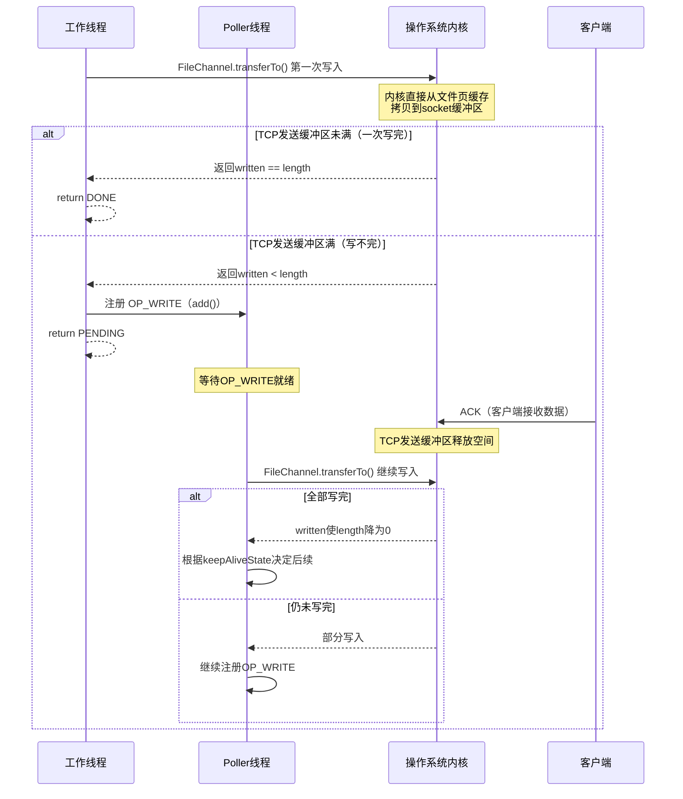

#### 5.6.2 完整sendFile流程图

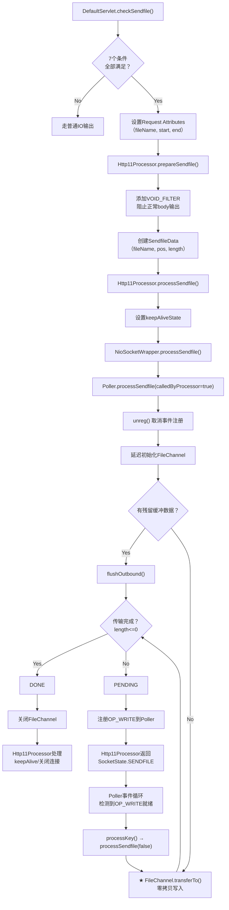

### 5.7 零拷贝原理对比

#### 5.7.1 传统IO vs 零拷贝

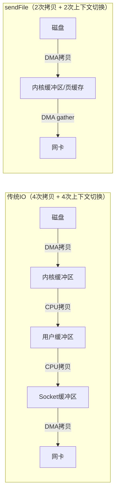

| 维度 | 传统IO | sendFile零拷贝 |
|------|--------|---------------|
| 数据拷贝次数 | 4次 | 2次（Linux 2.4+仅DMA拷贝） |
| 上下文切换 | 4次 | 2次 |
| CPU参与拷贝 | 2次 | 0次（DMA gather模式） |
| 适用场景 | 需要修改数据 | 原样传输静态文件 |

### 5.8 核心问题解答

| 问题 | 答案 |
|------|------|
| 什么时候用sendFile？ | 文件>48KB、NIO连接器、原生请求/响应、是真实文件 |
| FileChannel.transferTo()做了什么？ | 调用OS的sendfile()系统调用，数据在内核态完成传输 |
| 写不完怎么办？ | 注册OP_WRITE，Poller下次检测到可写时继续transferTo() |
| SSL连接能用吗？ | 能用但降级：数据读到用户态加密后再写出，非真正零拷贝 |
| 为什么要VOID_FILTER？ | 阻止Servlet正常输出流写入body，文件内容由sendfile发送 |
| sendFile和压缩能共存吗？ | 不能。零拷贝无法在传输中进行gzip压缩 |
| Poller中sendFile优先级？ | 高于普通读写。`processKey()`中先检查sendfileData |

---

## 六、请求完整处理流程（整合） ✅

### 6.1 从 Acceptor 到 Servlet 的完整调用链

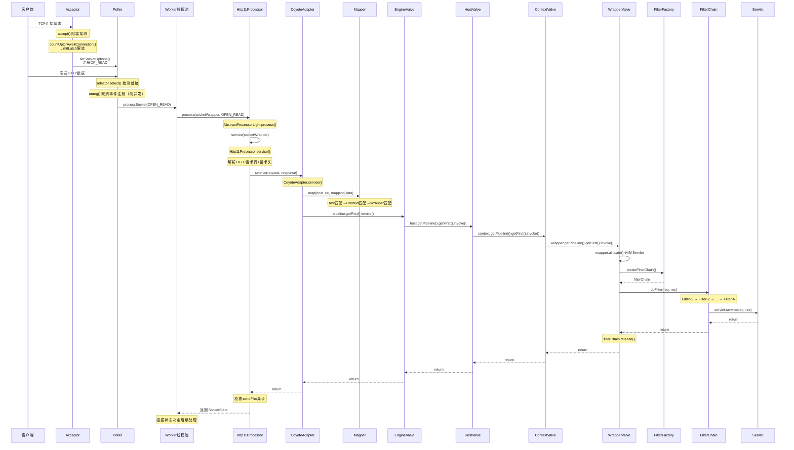

### 6.2 关键方法调用栈

```
Acceptor.run()
  └── serverSock.accept()                              // 阻塞接收TCP连接
  └── endpoint.setSocketOptions(socket)                 // 包装为NioSocketWrapper
      └── poller.register(socketWrapper)                // 注册到Poller，关注OP_READ

Poller.run()
  └── selector.select(timeout)                          // 检测就绪事件
  └── processKey(sk, socketWrapper)                     // 处理就绪key
      └── unreg(sk, socketWrapper, readyOps)            // 取消注册（防并发）
      └── processSocket(socketWrapper, OPEN_READ, true) // 提交到线程池

SocketProcessor.doRun()
  └── AbstractProtocol.ConnectionHandler.process()
      └── processor.process(socketWrapper, status)

AbstractProcessorLight.process()
  └── service(socketWrapper)                            // Http11Processor.service()
      └── inputBuffer.parseRequestLine()                // 解析请求行
      └── inputBuffer.parseHeaders()                    // 解析请求头
      └── adapter.service(request, response)            // CoyoteAdapter
          └── connector.getService().getMapper().map()  // Mapper路由
          └── connector.getService().getContainer()     // 获取Engine
              .getPipeline().getFirst().invoke()
                └── StandardEngineValve.invoke()        // 选Host
                    └── StandardHostValve.invoke()      // 选Context
                        └── StandardContextValve.invoke() // 选Wrapper
                            └── StandardWrapperValve.invoke()
                                └── wrapper.allocate()  // 分配Servlet
                                └── ApplicationFilterFactory.createFilterChain()
                                └── filterChain.doFilter()
                                    └── internalDoFilter() // Filter递归
                                        └── servlet.service() // 执行Servlet
      └── processSendfile(socketWrapper)                // sendFile检查
  └── asyncPostProcess()                                // 异步后处理
```

### 6.3 核心组件交互关系图

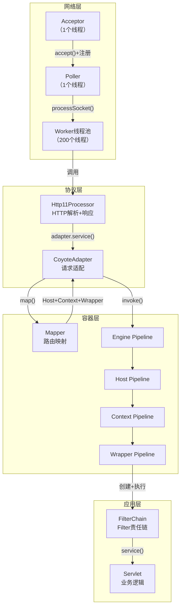

---

## 七、六大专题核心要点总结

本文档深入分析了 Tomcat 容器层和高级特性的 6 个核心专题，以下是各专题的关键收获：

### 7.1 Mapper 路由映射
- **核心数据结构**：`MappedHost[]` → `MappedContext[]` → `MappedWrapper[]` 三级数组结构
- **匹配规则**：精确匹配 → 前缀匹配 → 扩展名匹配 → 默认匹配，共 7 条 Wrapper 规则
- **性能优化**：使用二分查找（`Arrays.binarySearch`）替代线性扫描，O(log n) 复杂度

### 7.2 Pipeline/Valve 责任链
- **四层容器**：Engine → Host → Context → Wrapper，每层有自己的 Pipeline
- **Valve 职责**：StandardEngineValve（选 Host）→ StandardHostValve（选 Context）→ StandardContextValve（选 Wrapper）→ StandardWrapperValve（执行 Servlet）
- **设计模式**：责任链模式 + 模板方法模式

### 7.3 FilterChain 执行机制
- **数据结构**：`ApplicationFilterChain` 使用数组存储 Filter（非链表）
- **匹配流程**：两轮匹配（URL 模式匹配 + DispatcherType 匹配）
- **调用方式**：`internalDoFilter()` 递归调用，形成洋葱模型

### 7.4 异步 Servlet 机制
- **状态机**：13 个状态（`AsyncStateMachine`），涵盖从 `DISPATCHED` 到 `COMPLETE` 的完整生命周期
- **关键方法**：`startAsync()` 开启异步、`complete()` 完成异步、`dispatch()` 重新分发
- **超时处理**：独立超时机制，与连接超时分离

### 7.5 零拷贝 sendFile
- **7 个必要条件**：文件 > 48KB、非 SSL、非压缩、非 Range 请求等
- **实现原理**：`FileChannel.transferTo()` 直接将文件数据从内核缓冲区发送到网卡，绕过 JVM 堆内存
- **性能提升**：减少 2 次数据拷贝 + 1 次用户态/内核态切换

### 7.6 完整流程整合
- **调用链长度**：从 Acceptor 到 Servlet 共 20+ 层方法调用
- **核心交接点**：`CoyoteAdapter.service()` 是协议层到容器层的桥梁
- **线程模型**：Acceptor（1 线程）→ Poller（1 线程）→ Worker（N 线程）

---

## 执行计划

| 序号 | 主题 | 状态 |
|------|------|------|
| 1 | Mapper路由映射 | ✅ 完成 |
| 2 | Pipeline/Valve责任链 | ✅ 完成 |
| 3 | FilterChain执行机制 | ✅ 完成 |
| 4 | 异步Servlet机制 | ✅ 完成 |
| 5 | 零拷贝sendFile | ✅ 完成 |
| 6 | 完整流程整合 | ✅ 完成 |

---

> **📍 文档导航** | [📚 返回目录](./README.md) | [⬅️ 上一篇：内存管理深度解析](./Tomcat内存管理深度解析.md) | [➡️ 下一篇：Lifecycle生命周期](./Tomcat源码_Lifecycle生命周期状态机深度分析.md)

---

*文档创建时间：2026-03-01*
*所有源码分析基于本地 `/data/workspace/tomcat` 目录*
