# DispatcherServlet 核心源码深度分析

> **📍 文档导航** | [📚 返回目录](./README.md) | [⬅️ 上一篇：SpringMVC与Tomcat的关系](./SpringMVC与Tomcat的关系详解.md) | [➡️ 下一篇：HandlerMapping](./HandlerMapping核心源码深度分析.md)
>
> **📊 元信息** | 难度：⭐⭐⭐⭐⭐ | 预估时间：1-2天 | 前置阅读：[① SpringMVC与Tomcat的关系详解](./SpringMVC与Tomcat的关系详解.md)
>
> **🎯 学习目标** | 掌握 Spring MVC 的**心脏**，理解 `doDispatch()` 的全局流程

---

> 📁 **本地源码路径**：`/data/workspace/spring-framework/spring-webmvc/src/main/java/org/springframework/web/servlet/`
>
> Spring Framework 5.x 版本

---

## 一、总体定位

DispatcherServlet 是 Spring MVC 的**前端控制器（Front Controller）**，所有 HTTP 请求都经过它分发。它是 Spring MVC 最核心的一个类。

### 1.1 一句话总结

**DispatcherServlet = 初始化9大策略组件 + 按流程分发请求给各组件协作处理**

### 1.2 核心设计思想

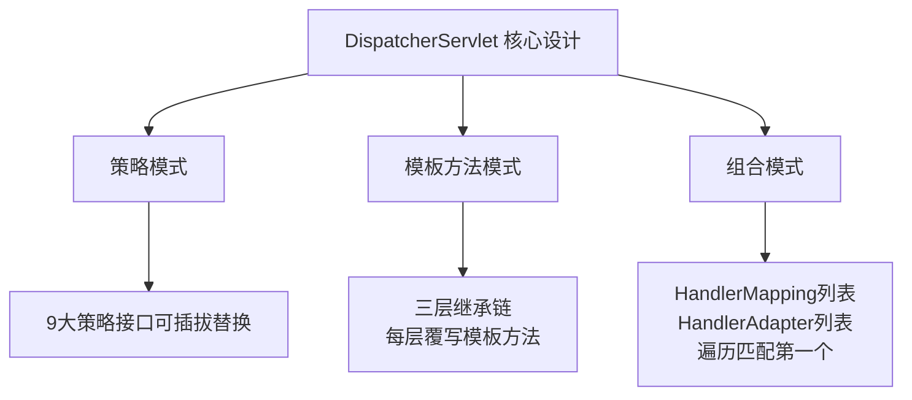

---

## 二、三层继承链 —— 每层做了什么

### 2.1 继承关系全景

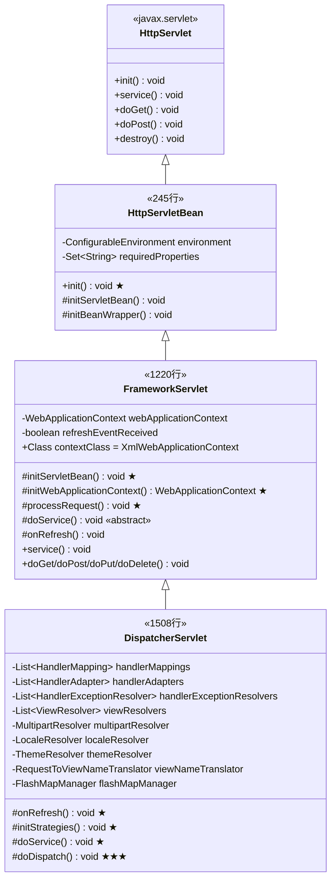

### 2.2 职责分层

| 层 | 类 | 行数 | 核心职责 | 依赖Spring? |
|---|---|------|---------|------------|
| 第一层 | `HttpServletBean` | 245 | init-param → Bean属性映射 | 仅依赖BeanWrapper |
| 第二层 | `FrameworkServlet` | 1220 | 管理WebApplicationContext + 请求统一入口 | 依赖ApplicationContext |
| 第三层 | `DispatcherServlet` | 1508 | 初始化9大组件 + 请求分发 | 依赖所有策略接口 |

---

## 三、第一层：HttpServletBean —— init-param 到 Bean属性

> 源码位置：`spring-webmvc/.../web/servlet/HttpServletBean.java`

### 3.1 类声明与字段

```java
// 来自: spring-webmvc/src/main/java/org/springframework/web/servlet/HttpServletBean.java (L82-91)
public abstract class HttpServletBean extends HttpServlet implements EnvironmentCapable, EnvironmentAware {

    protected final Log logger = LogFactory.getLog(getClass());

    @Nullable
    private ConfigurableEnvironment environment;

    private final Set<String> requiredProperties = new HashSet<>(4);
```

**关键点**：
- 实现 `EnvironmentCapable` + `EnvironmentAware`，具备 Spring Environment 能力
- `requiredProperties`：子类可声明必须的 init-param，缺少则启动失败

### 3.2 init() 方法 —— 整层的核心

```java
// 来自: HttpServletBean.java (L148-171)
@Override
public final void init() throws ServletException {

    // 第一步：将 Servlet init-param 封装为 PropertyValues
    PropertyValues pvs = new ServletConfigPropertyValues(getServletConfig(), this.requiredProperties);
    if (!pvs.isEmpty()) {
        try {
            // 第二步：将 this（当前Servlet实例）包装为 BeanWrapper
            BeanWrapper bw = PropertyAccessorFactory.forBeanPropertyAccess(this);
            ResourceLoader resourceLoader = new ServletContextResourceLoader(getServletContext());
            bw.registerCustomEditor(Resource.class, new ResourceEditor(resourceLoader, getEnvironment()));
            initBeanWrapper(bw);  // 扩展点：子类可注册自定义PropertyEditor
            // 第三步：将 init-param 的值设置到 Servlet 实例的属性上
            bw.setPropertyValues(pvs, true);
        }
        catch (BeansException ex) {
            if (logger.isErrorEnabled()) {
                logger.error("Failed to set bean properties on servlet '" + getServletName() + "'", ex);
            }
            throw ex;
        }
    }

    // 第四步：模板方法 —— 交给子类做进一步初始化
    initServletBean();
}
```

### 3.3 执行流程图

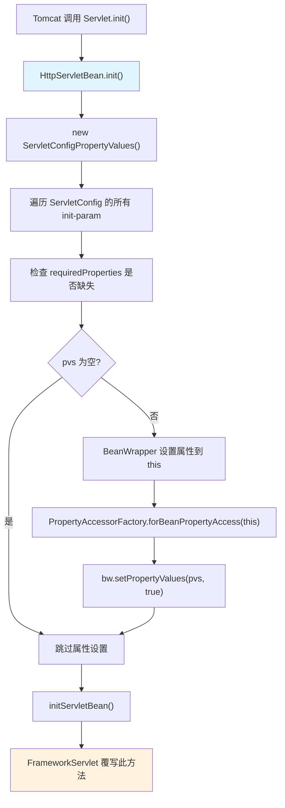

### 3.4 ServletConfigPropertyValues 内部类

```java
// 来自: HttpServletBean.java (L209-242)
private static class ServletConfigPropertyValues extends MutablePropertyValues {

    public ServletConfigPropertyValues(ServletConfig config, Set<String> requiredProperties)
            throws ServletException {

        Set<String> missingProps = (!CollectionUtils.isEmpty(requiredProperties) ?
                new HashSet<>(requiredProperties) : null);

        Enumeration<String> paramNames = config.getInitParameterNames();
        while (paramNames.hasMoreElements()) {
            String property = paramNames.nextElement();
            Object value = config.getInitParameter(property);
            addPropertyValue(new PropertyValue(property, value));
            if (missingProps != null) {
                missingProps.remove(property);
            }
        }

        // 缺少必需属性则抛出异常
        if (!CollectionUtils.isEmpty(missingProps)) {
            throw new ServletException(
                    "Initialization from ServletConfig for servlet '" + config.getServletName() +
                    "' failed; the following required properties were missing: " +
                    StringUtils.collectionToDelimitedString(missingProps, ", "));
        }
    }
}
```

### 3.5 设计要点

| 设计 | 说明 |
|------|------|
| `init()` 是 `final` | 防止子类覆写破坏属性绑定流程 |
| BeanWrapper 机制 | 将 Servlet 当作普通 Bean 进行属性注入，自动类型转换 |
| `initServletBean()` 空方法 | 模板方法模式，留给 FrameworkServlet 扩展 |
| 不依赖 ApplicationContext | 这一层完全不需要 Spring 容器 |

**实际应用**：web.xml 中配置的 `contextConfigLocation` init-param，就是通过这个机制设置到 FrameworkServlet 的 `contextConfigLocation` 字段上的。

---

## 四、第二层：FrameworkServlet —— WebApplicationContext管理 + 请求统一入口

> 源码位置：`spring-webmvc/.../web/servlet/FrameworkServlet.java`

### 4.1 核心字段

```java
// 来自: FrameworkServlet.java (L142-227)
public abstract class FrameworkServlet extends HttpServletBean implements ApplicationContextAware {

    // ============ 常量 ============
    public static final String DEFAULT_NAMESPACE_SUFFIX = "-servlet";
    public static final Class<?> DEFAULT_CONTEXT_CLASS = XmlWebApplicationContext.class;
    public static final String SERVLET_CONTEXT_PREFIX = FrameworkServlet.class.getName() + ".CONTEXT.";

    // ============ 容器配置字段 ============
    @Nullable private String contextAttribute;          // 从 ServletContext 属性中获取 context 的 key
    private Class<?> contextClass = DEFAULT_CONTEXT_CLASS; // 默认 XmlWebApplicationContext
    @Nullable private String contextId;                 // context id
    @Nullable private String namespace;                 // 命名空间，默认 "servletName-servlet"
    @Nullable private String contextConfigLocation;     // 配置文件位置

    // ============ 初始化器 ============
    private final List<ApplicationContextInitializer<ConfigurableApplicationContext>> contextInitializers = new ArrayList<>();
    @Nullable private String contextInitializerClasses;

    // ============ 行为控制开关 ============
    private boolean publishContext = true;              // 是否将 context 发布到 ServletContext
    private boolean publishEvents = true;               // 是否发布 RequestHandledEvent
    private boolean threadContextInheritable = false;    // LocaleContext/RequestAttributes 是否可继承
    private boolean dispatchOptionsRequest = false;      // OPTIONS 请求是否走 doService
    private boolean dispatchTraceRequest = false;        // TRACE 请求是否走 doService

    // ============ 核心状态 ============
    @Nullable private WebApplicationContext webApplicationContext;  // ★ 子容器
    private boolean webApplicationContextInjected = false;          // 是否外部注入的
    private volatile boolean refreshEventReceived;                  // 是否已收到刷新事件
    private final Object onRefreshMonitor = new Object();           // 同步锁
}
```

### 4.2 字段结构图

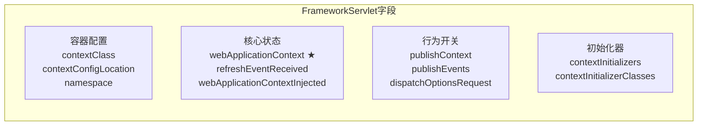

### 4.3 initServletBean() —— 覆写父类的模板方法

```java
// 来自: FrameworkServlet.java (L521-549)
@Override
protected final void initServletBean() throws ServletException {
    getServletContext().log("Initializing Spring " + getClass().getSimpleName() + " '" + getServletName() + "'");
    if (logger.isInfoEnabled()) {
        logger.info("Initializing Servlet '" + getServletName() + "'");
    }
    long startTime = System.currentTimeMillis();

    try {
        // ★ 核心：初始化 WebApplicationContext（子容器）
        this.webApplicationContext = initWebApplicationContext();
        // 空方法扩展点
        initFrameworkServlet();
    }
    catch (ServletException | RuntimeException ex) {
        logger.error("Context initialization failed", ex);
        throw ex;
    }

    if (logger.isInfoEnabled()) {
        logger.info("Completed initialization in " + (System.currentTimeMillis() - startTime) + " ms");
    }
}
```

### 4.4 initWebApplicationContext() —— 三步查找/创建子容器

这是 FrameworkServlet 最核心的方法，采用**三级回退策略**查找或创建 WebApplicationContext：

```java
// 来自: FrameworkServlet.java (L560-610)
protected WebApplicationContext initWebApplicationContext() {
    // 第一步：获取 Root 容器（由 ContextLoaderListener 创建）
    WebApplicationContext rootContext =
            WebApplicationContextUtils.getWebApplicationContext(getServletContext());
    WebApplicationContext wac = null;

    // ===== 策略一：构造时已注入 context =====
    if (this.webApplicationContext != null) {
        wac = this.webApplicationContext;
        if (wac instanceof ConfigurableWebApplicationContext) {
            ConfigurableWebApplicationContext cwac = (ConfigurableWebApplicationContext) wac;
            if (!cwac.isActive()) {
                if (cwac.getParent() == null) {
                    cwac.setParent(rootContext);  // 设置父容器
                }
                configureAndRefreshWebApplicationContext(cwac);
            }
        }
    }
    // ===== 策略二：从 ServletContext 属性中查找 =====
    if (wac == null) {
        wac = findWebApplicationContext();
    }
    // ===== 策略三：创建新的 context =====
    if (wac == null) {
        wac = createWebApplicationContext(rootContext);
    }

    // 如果没收到 ContextRefreshedEvent，手动触发 onRefresh
    if (!this.refreshEventReceived) {
        synchronized (this.onRefreshMonitor) {
            onRefresh(wac);
        }
    }

    // 将 context 发布到 ServletContext 属性中
    if (this.publishContext) {
        String attrName = getServletContextAttributeName();
        getServletContext().setAttribute(attrName, wac);
    }

    return wac;
}
```

### 4.5 三级回退策略流程图

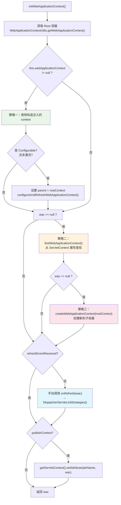

**三种策略对应的场景**：

| 策略 | 触发条件 | 典型场景 |
|------|---------|---------|
| 策略一 | 构造时传入了 context | Spring Boot 嵌入式容器、Servlet 3.0+ 编程式注册 |
| 策略二 | contextAttribute 指向 ServletContext 中已有的 context | 特殊场景，较少使用 |
| 策略三 | 前两种都没有 | **传统 web.xml 部署，最常见** |

### 4.6 createWebApplicationContext() —— 创建子容器

```java
// 来自: FrameworkServlet.java (L651-671)
protected WebApplicationContext createWebApplicationContext(@Nullable ApplicationContext parent) {
    Class<?> contextClass = getContextClass();  // 默认 XmlWebApplicationContext
    if (!ConfigurableWebApplicationContext.class.isAssignableFrom(contextClass)) {
        throw new ApplicationContextException("...");
    }
    // 反射创建容器实例
    ConfigurableWebApplicationContext wac =
            (ConfigurableWebApplicationContext) BeanUtils.instantiateClass(contextClass);

    wac.setEnvironment(getEnvironment());
    wac.setParent(parent);           // ★ 设置 Root 容器为父容器
    String configLocation = getContextConfigLocation();
    if (configLocation != null) {
        wac.setConfigLocation(configLocation);
    }
    configureAndRefreshWebApplicationContext(wac);

    return wac;
}
```

### 4.7 configureAndRefreshWebApplicationContext() —— 配置并刷新

```java
// 来自: FrameworkServlet.java (L673-703)
protected void configureAndRefreshWebApplicationContext(ConfigurableWebApplicationContext wac) {
    // 设置 context id
    if (ObjectUtils.identityToString(wac).equals(wac.getId())) {
        if (this.contextId != null) {
            wac.setId(this.contextId);
        } else {
            wac.setId(ConfigurableWebApplicationContext.APPLICATION_CONTEXT_ID_PREFIX +
                    ObjectUtils.getDisplayString(getServletContext().getContextPath()) + '/' + getServletName());
        }
    }

    wac.setServletContext(getServletContext());
    wac.setServletConfig(getServletConfig());
    wac.setNamespace(getNamespace());
    // ★ 注册 ContextRefreshListener —— 容器刷新时触发 onRefresh()
    wac.addApplicationListener(new SourceFilteringListener(wac, new ContextRefreshListener()));

    ConfigurableEnvironment env = wac.getEnvironment();
    if (env instanceof ConfigurableWebEnvironment) {
        ((ConfigurableWebEnvironment) env).initPropertySources(getServletContext(), getServletConfig());
    }

    postProcessWebApplicationContext(wac);   // 扩展点
    applyInitializers(wac);                  // 应用 ApplicationContextInitializer
    wac.refresh();                           // ★ 刷新容器！触发 Bean 创建
}
```

**关键点**：`wac.refresh()` 会触发容器刷新，在刷新完成后发布 `ContextRefreshedEvent`，被 `ContextRefreshListener` 接收，最终调用 `onRefresh(wac)` → `DispatcherServlet.initStrategies()`。

### 4.8 请求处理链 —— service() → doXxx() → processRequest() → doService()

```java
// 来自: FrameworkServlet.java (L874-885)
// 重写 HttpServlet.service() 以支持 PATCH 请求
@Override
protected void service(HttpServletRequest request, HttpServletResponse response)
        throws ServletException, IOException {
    HttpMethod httpMethod = HttpMethod.resolve(request.getMethod());
    if (httpMethod == HttpMethod.PATCH || httpMethod == null) {
        processRequest(request, response);
    } else {
        super.service(request, response);  // 走 HttpServlet 的分发逻辑
    }
}

// 来自: FrameworkServlet.java (L895-931)
// doGet/doPost/doPut/doDelete 全部委托给 processRequest()
@Override
protected final void doGet(HttpServletRequest request, HttpServletResponse response)
        throws ServletException, IOException {
    processRequest(request, response);
}
// doPost/doPut/doDelete 同理...
```

### 4.9 processRequest() —— 请求处理的统一入口 ★

```java
// 来自: FrameworkServlet.java (L988-1025)
protected final void processRequest(HttpServletRequest request, HttpServletResponse response)
        throws ServletException, IOException {

    long startTime = System.currentTimeMillis();
    Throwable failureCause = null;

    // 第一步：保存当前线程的 LocaleContext 和 RequestAttributes
    LocaleContext previousLocaleContext = LocaleContextHolder.getLocaleContext();
    LocaleContext localeContext = buildLocaleContext(request);

    RequestAttributes previousAttributes = RequestContextHolder.getRequestAttributes();
    ServletRequestAttributes requestAttributes = buildRequestAttributes(request, response, previousAttributes);

    // 第二步：注册异步请求拦截器（异步任务线程也能恢复上下文）
    WebAsyncManager asyncManager = WebAsyncUtils.getAsyncManager(request);
    asyncManager.registerCallableInterceptor(FrameworkServlet.class.getName(), new RequestBindingInterceptor());

    // 第三步：绑定 LocaleContext 和 RequestAttributes 到当前线程
    initContextHolders(request, localeContext, requestAttributes);

    try {
        // ★ 第四步：委托给子类（DispatcherServlet）的 doService()
        doService(request, response);
    }
    catch (ServletException | IOException ex) {
        failureCause = ex;
        throw ex;
    }
    catch (Throwable ex) {
        failureCause = ex;
        throw new NestedServletException("Request processing failed", ex);
    }
    finally {
        // 第五步：恢复之前线程的上下文
        resetContextHolders(request, previousLocaleContext, previousAttributes);
        if (requestAttributes != null) {
            requestAttributes.requestCompleted();
        }
        // 第六步：记录日志
        logResult(request, response, failureCause, asyncManager);
        // 第七步：发布 RequestHandledEvent 事件
        publishRequestHandledEvent(request, response, startTime, failureCause);
    }
}
```

### 4.10 processRequest 流程图

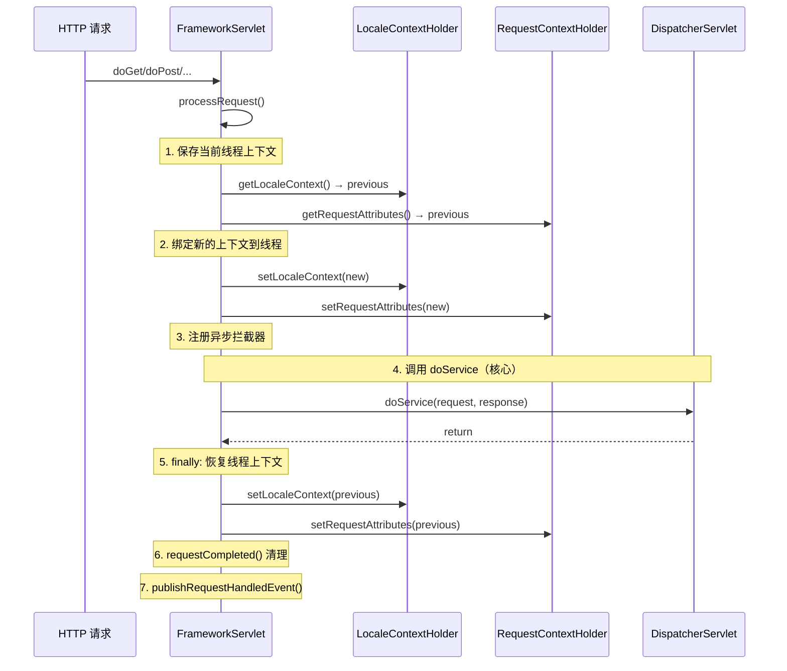

**设计精髓**：
- `processRequest()` 是 `final` 的，子类不能覆写
- 通过 ThreadLocal（`LocaleContextHolder`、`RequestContextHolder`）实现请求上下文的线程绑定
- **保存→绑定→处理→恢复** 四步确保线程安全（Tomcat 线程池复用线程）
- 无论请求成功还是异常，finally 中都会恢复和发事件

### 4.11 内部类：ContextRefreshListener

```java
// 来自: FrameworkServlet.java (L1186-1192)
private class ContextRefreshListener implements ApplicationListener<ContextRefreshedEvent> {
    @Override
    public void onApplicationEvent(ContextRefreshedEvent event) {
        FrameworkServlet.this.onApplicationEvent(event);
    }
}
```

**触发链路**：
```
wac.refresh() → 发布 ContextRefreshedEvent → ContextRefreshListener.onApplicationEvent()
  → FrameworkServlet.onApplicationEvent() → this.refreshEventReceived = true
  → onRefresh(wac) → DispatcherServlet.initStrategies(context)
```

### 4.12 内部类：RequestBindingInterceptor

```java
// 来自: FrameworkServlet.java (L1199-1217)
private class RequestBindingInterceptor implements CallableProcessingInterceptor {
    @Override
    public <T> void preProcess(NativeWebRequest webRequest, Callable<T> task) {
        HttpServletRequest request = webRequest.getNativeRequest(HttpServletRequest.class);
        if (request != null) {
            HttpServletResponse response = webRequest.getNativeResponse(HttpServletResponse.class);
            initContextHolders(request, buildLocaleContext(request),
                    buildRequestAttributes(request, response, null));
        }
    }
    @Override
    public <T> void postProcess(NativeWebRequest webRequest, Callable<T> task, Object concurrentResult) {
        HttpServletRequest request = webRequest.getNativeRequest(HttpServletRequest.class);
        if (request != null) {
            resetContextHolders(request, null, null);
        }
    }
}
```

**作用**：异步请求中（Callable 返回值），任务可能在另一个线程执行。此拦截器确保异步线程也能正确绑定和恢复 LocaleContext/RequestAttributes。

---

## 五、第三层：DispatcherServlet —— 九大组件初始化

> 源码位置：`spring-webmvc/.../web/servlet/DispatcherServlet.java`

### 5.1 核心字段 —— 九大策略组件

```java
// 来自: DispatcherServlet.java (L308-344)

/** 文件上传解析器 */
@Nullable private MultipartResolver multipartResolver;

/** 国际化解析器 */
@Nullable private LocaleResolver localeResolver;

/** 主题解析器（已过时） */
@Nullable private ThemeResolver themeResolver;

/** ★ 处理器映射器列表 */
@Nullable private List<HandlerMapping> handlerMappings;

/** ★ 处理器适配器列表 */
@Nullable private List<HandlerAdapter> handlerAdapters;

/** ★ 异常解析器列表 */
@Nullable private List<HandlerExceptionResolver> handlerExceptionResolvers;

/** 请求到视图名翻译器 */
@Nullable private RequestToViewNameTranslator viewNameTranslator;

/** FlashMap管理器 */
@Nullable private FlashMapManager flashMapManager;

/** 视图解析器列表 */
@Nullable private List<ViewResolver> viewResolvers;
```

### 5.2 九大组件总览

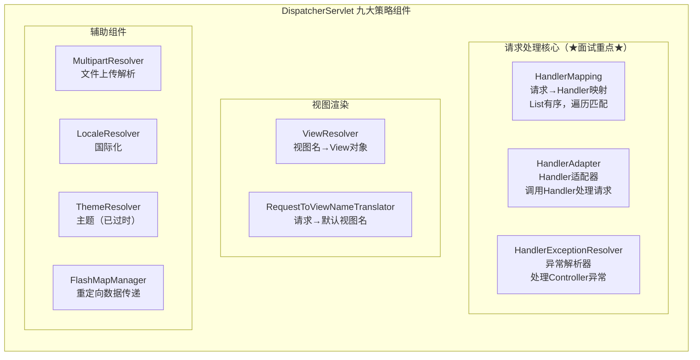

### 5.3 onRefresh() → initStrategies()

```java
// 来自: DispatcherServlet.java (L489-508)
@Override
protected void onRefresh(ApplicationContext context) {
    initStrategies(context);
}

protected void initStrategies(ApplicationContext context) {
    initMultipartResolver(context);          // 1. 文件上传
    initLocaleResolver(context);             // 2. 国际化
    initThemeResolver(context);              // 3. 主题（过时）
    initHandlerMappings(context);            // 4. ★ 处理器映射
    initHandlerAdapters(context);            // 5. ★ 处理器适配器
    initHandlerExceptionResolvers(context);  // 6. ★ 异常解析器
    initRequestToViewNameTranslator(context);// 7. 视图名翻译
    initViewResolvers(context);              // 8. 视图解析器
    initFlashMapManager(context);            // 9. FlashMap管理
}
```

### 5.4 组件加载策略 —— 两种模式

九大组件的初始化分为**两种加载模式**：

#### 模式一：单Bean加载（按固定名称查找）

适用于：`MultipartResolver`、`LocaleResolver`、`ThemeResolver`、`RequestToViewNameTranslator`、`FlashMapManager`

```java
// 来自: DispatcherServlet.java (L515-532) 以 MultipartResolver 为例
private void initMultipartResolver(ApplicationContext context) {
    try {
        // 用固定名称 "multipartResolver" 从容器获取
        this.multipartResolver = context.getBean(MULTIPART_RESOLVER_BEAN_NAME, MultipartResolver.class);
    }
    catch (NoSuchBeanDefinitionException ex) {
        // 找不到 → multipartResolver = null（无文件上传支持）
        this.multipartResolver = null;
    }
}
```

```java
// 来自: DispatcherServlet.java (L539-557) 以 LocaleResolver 为例
private void initLocaleResolver(ApplicationContext context) {
    try {
        this.localeResolver = context.getBean(LOCALE_RESOLVER_BEAN_NAME, LocaleResolver.class);
    }
    catch (NoSuchBeanDefinitionException ex) {
        // 找不到 → 从 DispatcherServlet.properties 加载默认实现
        this.localeResolver = getDefaultStrategy(context, LocaleResolver.class);
    }
}
```

#### 模式二：多Bean加载（按类型检测所有Bean）

适用于：`HandlerMapping`、`HandlerAdapter`、`HandlerExceptionResolver`、`ViewResolver`

```java
// 来自: DispatcherServlet.java (L589-628) 以 HandlerMapping 为例
private void initHandlerMappings(ApplicationContext context) {
    this.handlerMappings = null;

    if (this.detectAllHandlerMappings) {  // 默认 true
        // ★ 从容器中检测所有 HandlerMapping 类型的 Bean（包括父容器）
        Map<String, HandlerMapping> matchingBeans =
                BeanFactoryUtils.beansOfTypeIncludingAncestors(context, HandlerMapping.class, true, false);
        if (!matchingBeans.isEmpty()) {
            this.handlerMappings = new ArrayList<>(matchingBeans.values());
            // ★ 按 @Order 排序
            AnnotationAwareOrderComparator.sort(this.handlerMappings);
        }
    }
    else {
        // detectAll=false 时，只找固定名称 "handlerMapping" 的 Bean
        try {
            HandlerMapping hm = context.getBean(HANDLER_MAPPING_BEAN_NAME, HandlerMapping.class);
            this.handlerMappings = Collections.singletonList(hm);
        }
        catch (NoSuchBeanDefinitionException ex) { }
    }

    // 兜底：从 DispatcherServlet.properties 加载默认实现
    if (this.handlerMappings == null) {
        this.handlerMappings = getDefaultStrategies(context, HandlerMapping.class);
    }

    // 检查是否需要解析 RequestPath
    for (HandlerMapping mapping : this.handlerMappings) {
        if (mapping.usesPathPatterns()) {
            this.parseRequestPath = true;
            break;
        }
    }
}
```

### 5.5 两种加载模式对比

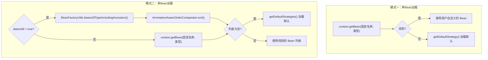

| 加载模式 | 适用组件 | 容器中找不到时 |
|---------|---------|--------------|
| 单Bean | MultipartResolver | `null`（不支持文件上传） |
| 单Bean | LocaleResolver, ThemeResolver, ViewNameTranslator, FlashMapManager | 从 `.properties` 加载默认 |
| 多Bean | HandlerMapping, HandlerAdapter, ExceptionResolver, ViewResolver | 从 `.properties` 加载默认列表 |

### 5.6 DispatcherServlet.properties —— 默认策略配置

```properties
# 来自: spring-webmvc/src/main/resources/org/springframework/web/servlet/DispatcherServlet.properties

org.springframework.web.servlet.LocaleResolver=\
    org.springframework.web.servlet.i18n.AcceptHeaderLocaleResolver

org.springframework.web.servlet.ThemeResolver=\
    org.springframework.web.servlet.theme.FixedThemeResolver

org.springframework.web.servlet.HandlerMapping=\
    org.springframework.web.servlet.handler.BeanNameUrlHandlerMapping,\
    org.springframework.web.servlet.mvc.method.annotation.RequestMappingHandlerMapping,\
    org.springframework.web.servlet.function.support.RouterFunctionMapping

org.springframework.web.servlet.HandlerAdapter=\
    org.springframework.web.servlet.mvc.HttpRequestHandlerAdapter,\
    org.springframework.web.servlet.mvc.SimpleControllerHandlerAdapter,\
    org.springframework.web.servlet.mvc.method.annotation.RequestMappingHandlerAdapter,\
    org.springframework.web.servlet.function.support.HandlerFunctionAdapter

org.springframework.web.servlet.HandlerExceptionResolver=\
    org.springframework.web.servlet.mvc.method.annotation.ExceptionHandlerExceptionResolver,\
    org.springframework.web.servlet.mvc.annotation.ResponseStatusExceptionResolver,\
    org.springframework.web.servlet.mvc.support.DefaultHandlerExceptionResolver

org.springframework.web.servlet.RequestToViewNameTranslator=\
    org.springframework.web.servlet.view.DefaultRequestToViewNameTranslator

org.springframework.web.servlet.ViewResolver=\
    org.springframework.web.servlet.view.InternalResourceViewResolver

org.springframework.web.servlet.FlashMapManager=\
    org.springframework.web.servlet.support.SessionFlashMapManager
```

### 5.7 getDefaultStrategies() —— 加载默认策略的机制

```java
// 来自: DispatcherServlet.java (L862-904)
protected <T> List<T> getDefaultStrategies(ApplicationContext context, Class<T> strategyInterface) {
    if (defaultStrategies == null) {
        // 懒加载：从 classpath 读取 DispatcherServlet.properties
        ClassPathResource resource = new ClassPathResource(DEFAULT_STRATEGIES_PATH, DispatcherServlet.class);
        defaultStrategies = PropertiesLoaderUtils.loadProperties(resource);
    }

    String key = strategyInterface.getName();
    String value = defaultStrategies.getProperty(key);
    if (value != null) {
        String[] classNames = StringUtils.commaDelimitedListToStringArray(value);
        List<T> strategies = new ArrayList<>(classNames.length);
        for (String className : classNames) {
            Class<?> clazz = ClassUtils.forName(className, DispatcherServlet.class.getClassLoader());
            // ★ 通过 AutowireCapableBeanFactory.createBean() 创建
            //    这意味着默认策略 Bean 也会被自动注入依赖！
            Object strategy = createDefaultStrategy(context, clazz);
            strategies.add((T) strategy);
        }
        return strategies;
    }
    return Collections.emptyList();
}

// 来自: DispatcherServlet.java (L916-918)
protected Object createDefaultStrategy(ApplicationContext context, Class<?> clazz) {
    return context.getAutowireCapableBeanFactory().createBean(clazz);
}
```

**关键发现**：`createDefaultStrategy()` 使用 `createBean()` 而非 `new`，所以默认策略对象也是经过 Spring 容器创建的，**可以自动注入依赖**。

---

## 六、doService() —— 请求属性预设

```java
// 来自: DispatcherServlet.java (L925-978)
@Override
protected void doService(HttpServletRequest request, HttpServletResponse response) throws Exception {
    logRequest(request);

    // 1. include 请求时保存属性快照（用于后续恢复）
    Map<String, Object> attributesSnapshot = null;
    if (WebUtils.isIncludeRequest(request)) {
        attributesSnapshot = new HashMap<>();
        Enumeration<?> attrNames = request.getAttributeNames();
        while (attrNames.hasMoreElements()) {
            String attrName = (String) attrNames.nextElement();
            if (this.cleanupAfterInclude || attrName.startsWith(DEFAULT_STRATEGIES_PREFIX)) {
                attributesSnapshot.put(attrName, request.getAttribute(attrName));
            }
        }
    }

    // 2. ★ 将框架对象设置到 request 属性中，供 Handler 和 View 使用
    request.setAttribute(WEB_APPLICATION_CONTEXT_ATTRIBUTE, getWebApplicationContext());
    request.setAttribute(LOCALE_RESOLVER_ATTRIBUTE, this.localeResolver);
    request.setAttribute(THEME_RESOLVER_ATTRIBUTE, this.themeResolver);
    request.setAttribute(THEME_SOURCE_ATTRIBUTE, getThemeSource());

    // 3. FlashMap 处理（重定向数据恢复）
    if (this.flashMapManager != null) {
        FlashMap inputFlashMap = this.flashMapManager.retrieveAndUpdate(request, response);
        if (inputFlashMap != null) {
            request.setAttribute(INPUT_FLASH_MAP_ATTRIBUTE, Collections.unmodifiableMap(inputFlashMap));
        }
        request.setAttribute(OUTPUT_FLASH_MAP_ATTRIBUTE, new FlashMap());
        request.setAttribute(FLASH_MAP_MANAGER_ATTRIBUTE, this.flashMapManager);
    }

    // 4. 解析并缓存 RequestPath
    RequestPath previousRequestPath = null;
    if (this.parseRequestPath) {
        previousRequestPath = (RequestPath) request.getAttribute(ServletRequestPathUtils.PATH_ATTRIBUTE);
        ServletRequestPathUtils.parseAndCache(request);
    }

    try {
        // 5. ★★★ 委托给 doDispatch() 执行实际分发
        doDispatch(request, response);
    }
    finally {
        if (!WebAsyncUtils.getAsyncManager(request).isConcurrentHandlingStarted()) {
            if (attributesSnapshot != null) {
                restoreAttributesAfterInclude(request, attributesSnapshot);
            }
        }
        if (this.parseRequestPath) {
            ServletRequestPathUtils.setParsedRequestPath(previousRequestPath, request);
        }
    }
}
```

**doService 设置的 request 属性**：

| 属性Key | 值 | 用途 |
|---------|---|------|
| `DispatcherServlet.CONTEXT` | WebApplicationContext | Handler/View 获取 Spring 容器 |
| `DispatcherServlet.LOCALE_RESOLVER` | LocaleResolver | 视图获取 Locale |
| `DispatcherServlet.THEME_RESOLVER` | ThemeResolver | 视图获取主题 |
| `DispatcherServlet.INPUT_FLASH_MAP` | FlashMap | 重定向数据恢复 |
| `DispatcherServlet.OUTPUT_FLASH_MAP` | new FlashMap() | 重定向数据存储 |

---

## 七、doDispatch() —— Spring MVC 最核心的方法 ★★★

```java
// 来自: DispatcherServlet.java (L1031-1112)
protected void doDispatch(HttpServletRequest request, HttpServletResponse response) throws Exception {
    HttpServletRequest processedRequest = request;
    HandlerExecutionChain mappedHandler = null;
    boolean multipartRequestParsed = false;

    WebAsyncManager asyncManager = WebAsyncUtils.getAsyncManager(request);

    try {
        ModelAndView mv = null;
        Exception dispatchException = null;

        try {
            // ① 检查是否是文件上传请求
            processedRequest = checkMultipart(request);
            multipartRequestParsed = (processedRequest != request);

            // ② ★ 获取 Handler（遍历 HandlerMapping）
            mappedHandler = getHandler(processedRequest);
            if (mappedHandler == null) {
                noHandlerFound(processedRequest, response);
                return;
            }

            // ③ ★ 获取 HandlerAdapter（遍历 HandlerAdapter）
            HandlerAdapter ha = getHandlerAdapter(mappedHandler.getHandler());

            // ④ 处理 Last-Modified（HTTP 缓存）
            String method = request.getMethod();
            boolean isGet = HttpMethod.GET.matches(method);
            if (isGet || HttpMethod.HEAD.matches(method)) {
                long lastModified = ha.getLastModified(request, mappedHandler.getHandler());
                if (new ServletWebRequest(request, response).checkNotModified(lastModified) && isGet) {
                    return;
                }
            }

            // ⑤ ★ 执行拦截器 preHandle（正序）
            if (!mappedHandler.applyPreHandle(processedRequest, response)) {
                return;  // 拦截器返回 false，中断请求
            }

            // ⑥ ★★★ 调用 Handler 处理请求（核心中的核心）
            mv = ha.handle(processedRequest, response, mappedHandler.getHandler());

            // ⑦ 异步请求判断
            if (asyncManager.isConcurrentHandlingStarted()) {
                return;
            }

            // ⑧ 如果没有设置视图名，使用默认视图名
            applyDefaultViewName(processedRequest, mv);
            // ⑨ ★ 执行拦截器 postHandle（逆序）
            mappedHandler.applyPostHandle(processedRequest, response, mv);
        }
        catch (Exception ex) {
            dispatchException = ex;
        }
        catch (Throwable err) {
            dispatchException = new NestedServletException("Handler dispatch failed", err);
        }
        // ⑩ ★ 处理结果（视图渲染 或 异常处理）
        processDispatchResult(processedRequest, response, mappedHandler, mv, dispatchException);
    }
    catch (Exception ex) {
        triggerAfterCompletion(processedRequest, response, mappedHandler, ex);
    }
    catch (Throwable err) {
        triggerAfterCompletion(processedRequest, response, mappedHandler,
                new NestedServletException("Handler processing failed", err));
    }
    finally {
        if (asyncManager.isConcurrentHandlingStarted()) {
            // 异步请求：执行异步拦截器
            if (mappedHandler != null) {
                mappedHandler.applyAfterConcurrentHandlingStarted(processedRequest, response);
            }
        }
        else {
            // 同步请求：清理 multipart 资源
            if (multipartRequestParsed) {
                cleanupMultipart(processedRequest);
            }
        }
    }
}
```

### 7.1 doDispatch 完整流程图

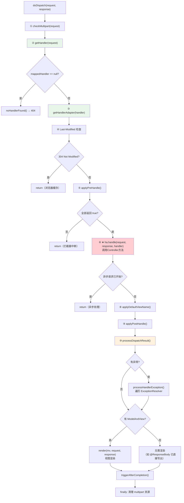

### 7.2 getHandler() —— 遍历 HandlerMapping

```java
// 来自: DispatcherServlet.java (L1262-1273)
@Nullable
protected HandlerExecutionChain getHandler(HttpServletRequest request) throws Exception {
    if (this.handlerMappings != null) {
        for (HandlerMapping mapping : this.handlerMappings) {
            HandlerExecutionChain handler = mapping.getHandler(request);
            if (handler != null) {
                return handler;  // 返回第一个匹配的
            }
        }
    }
    return null;
}
```

**关键点**：HandlerMapping 列表是**有序的**（`@Order` 排序），遍历时返回第一个匹配的 `HandlerExecutionChain`。

### 7.3 getHandlerAdapter() —— 遍历 HandlerAdapter

```java
// 来自: DispatcherServlet.java (L1299-1309)
protected HandlerAdapter getHandlerAdapter(Object handler) throws ServletException {
    if (this.handlerAdapters != null) {
        for (HandlerAdapter adapter : this.handlerAdapters) {
            if (adapter.supports(handler)) {
                return adapter;  // 返回第一个支持的
            }
        }
    }
    throw new ServletException("No adapter for handler [" + handler + "]...");
}
```

### 7.4 processDispatchResult() —— 结果处理

```java
// 来自: DispatcherServlet.java (L1130-1170)
private void processDispatchResult(HttpServletRequest request, HttpServletResponse response,
        @Nullable HandlerExecutionChain mappedHandler, @Nullable ModelAndView mv,
        @Nullable Exception exception) throws Exception {

    boolean errorView = false;

    // 1. 有异常 → 交给 ExceptionResolver 处理
    if (exception != null) {
        if (exception instanceof ModelAndViewDefiningException) {
            mv = ((ModelAndViewDefiningException) exception).getModelAndView();
        }
        else {
            Object handler = (mappedHandler != null ? mappedHandler.getHandler() : null);
            mv = processHandlerException(request, response, handler, exception);
            errorView = (mv != null);
        }
    }

    // 2. 有 ModelAndView → 渲染视图
    if (mv != null && !mv.wasCleared()) {
        render(mv, request, response);
        if (errorView) {
            WebUtils.clearErrorRequestAttributes(request);
        }
    }
    else {
        // @ResponseBody 场景：mv 为 null，已直接写出响应体
        if (logger.isTraceEnabled()) {
            logger.trace("No view rendering, null ModelAndView returned.");
        }
    }

    // 3. 触发 afterCompletion（拦截器清理）
    if (mappedHandler != null) {
        mappedHandler.triggerAfterCompletion(request, response, null);
    }
}
```

### 7.5 render() —— 视图渲染

```java
// 来自: DispatcherServlet.java (L1372-1414)
protected void render(ModelAndView mv, HttpServletRequest request, HttpServletResponse response) throws Exception {
    // 1. 解析 Locale
    Locale locale = (this.localeResolver != null ? this.localeResolver.resolveLocale(request) : request.getLocale());
    response.setLocale(locale);

    View view;
    String viewName = mv.getViewName();
    if (viewName != null) {
        // 2. 通过视图名解析 View 对象
        view = resolveViewName(viewName, mv.getModelInternal(), locale, request);
        if (view == null) {
            throw new ServletException("Could not resolve view with name '" + mv.getViewName() + "'");
        }
    }
    else {
        // ModelAndView 直接包含 View 对象
        view = mv.getView();
    }

    // 3. 设置响应状态码
    if (mv.getStatus() != null) {
        request.setAttribute(View.RESPONSE_STATUS_ATTRIBUTE, mv.getStatus());
        response.setStatus(mv.getStatus().value());
    }
    // 4. ★ 委托 View 执行渲染
    view.render(mv.getModelInternal(), request, response);
}
```

---

## 八、完整初始化链 —— 从 Tomcat 调用到组件就绪

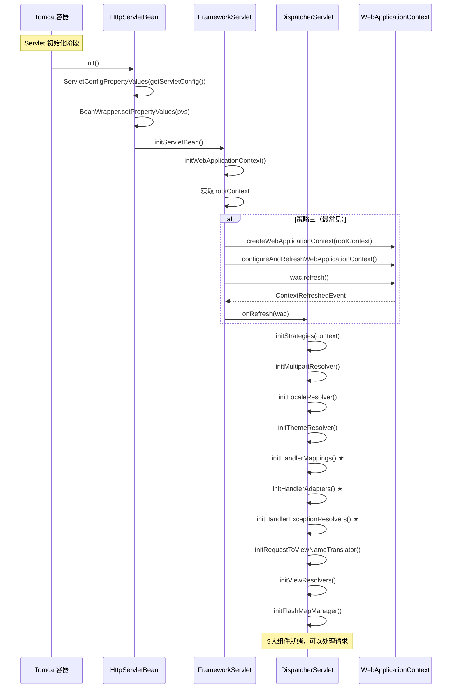

---

## 九、完整请求处理链 —— 从 HTTP 请求到响应返回

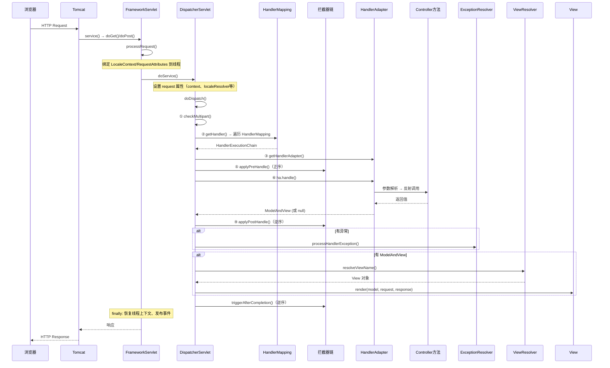

---

## 十、核心设计模式总结

### 10.1 模式汇总

| 设计模式 | 体现位置 | 说明 |
|---------|---------|------|
| **模板方法** | `init()→initServletBean()→onRefresh()→initStrategies()` | 三层继承，每层覆写一个模板方法 |
| **策略模式** | 9大策略接口 | HandlerMapping、HandlerAdapter 等可插拔替换 |
| **组合模式** | `List<HandlerMapping>`、`List<HandlerAdapter>` | 多个策略组合，遍历匹配 |
| **适配器模式** | HandlerAdapter | 统一调用不同类型的 Handler |
| **责任链模式** | HandlerInterceptor | preHandle→handle→postHandle→afterCompletion |
| **观察者模式** | ContextRefreshedEvent → onRefresh() | 容器刷新事件触发组件初始化 |
| **外观模式** | DispatcherServlet 本身 | 统一入口，内部协调多个组件 |

### 10.2 模板方法模式的三层传递

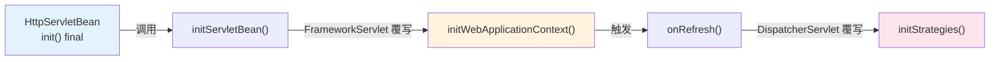

---

## 十一、面试高频问题

### Q1：DispatcherServlet 的初始化流程？

**答**：Tomcat 调用 `Servlet.init()` → `HttpServletBean.init()`（init-param 绑定到属性）→ `FrameworkServlet.initServletBean()`（创建 WebApplicationContext 子容器）→ 容器 `refresh()` 触发 `ContextRefreshedEvent` → `DispatcherServlet.onRefresh()` → `initStrategies()` 初始化9大策略组件。

### Q2：doDispatch() 的执行流程？

**答**：① checkMultipart → ② getHandler（遍历HandlerMapping）→ ③ getHandlerAdapter → ④ Last-Modified 检查 → ⑤ 拦截器 preHandle → ⑥ **ha.handle() 调用Controller** → ⑦ 异步判断 → ⑧ 默认视图名 → ⑨ 拦截器 postHandle → ⑩ processDispatchResult（异常处理/视图渲染）→ 拦截器 afterCompletion。

### Q3：FrameworkServlet.processRequest() 做了什么？

**答**：保存当前线程的 LocaleContext 和 RequestAttributes → 绑定新的上下文到 ThreadLocal → 调用 doService() → finally 中恢复原上下文 → 发布 RequestHandledEvent。**核心目的是确保请求上下文的线程安全**。

### Q4：HandlerMapping 和 HandlerAdapter 找不到 Bean 时怎么办？

**答**：从 `DispatcherServlet.properties` 加载默认实现。默认 HandlerMapping 有 `BeanNameUrlHandlerMapping`、`RequestMappingHandlerMapping`、`RouterFunctionMapping`。默认 HandlerAdapter 有 `HttpRequestHandlerAdapter`、`SimpleControllerHandlerAdapter`、`RequestMappingHandlerAdapter`、`HandlerFunctionAdapter`。且默认策略通过 `AutowireCapableBeanFactory.createBean()` 创建，支持依赖注入。

### Q5：为什么 processRequest() 要保存和恢复 LocaleContext/RequestAttributes？

**答**：因为 Tomcat 使用线程池，同一个线程会处理多个不同的请求。如果不恢复，上一个请求的上下文数据会"泄漏"到下一个请求。另外还需要处理 include 场景（一个请求内部 forward/include 另一个请求）。

### Q6：DispatcherServlet 的构造函数有什么特殊的？

**答**：无参构造和有参构造都会调用 `setDispatchOptionsRequest(true)`，使 OPTIONS 请求也走 `doService` 分发链路（用于 CORS 预检请求处理）。这是 FrameworkServlet 中默认 `false` 但 DispatcherServlet 覆盖为 `true` 的行为。
