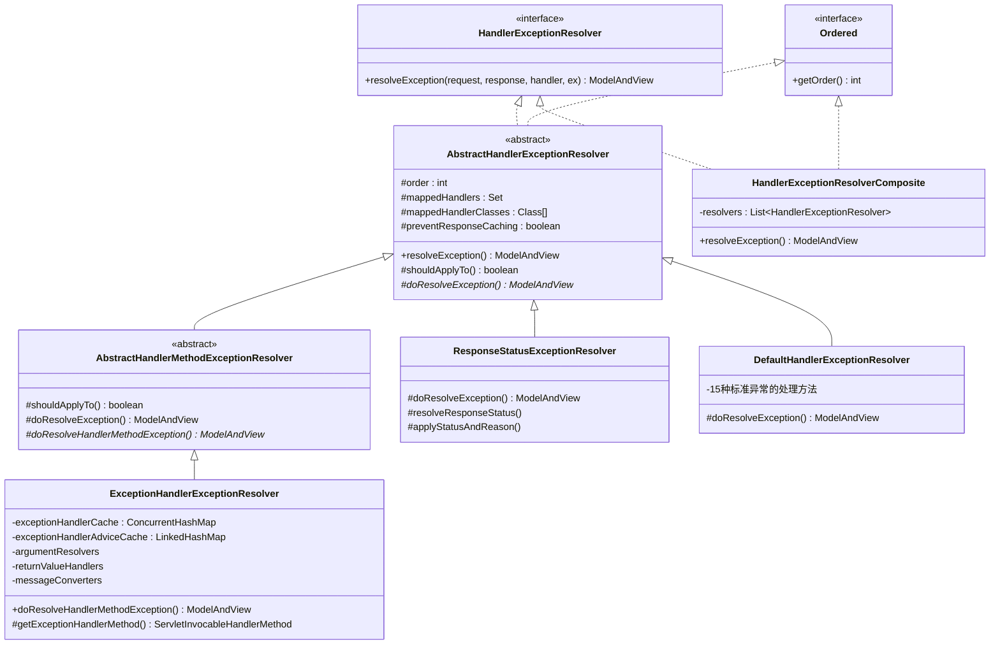
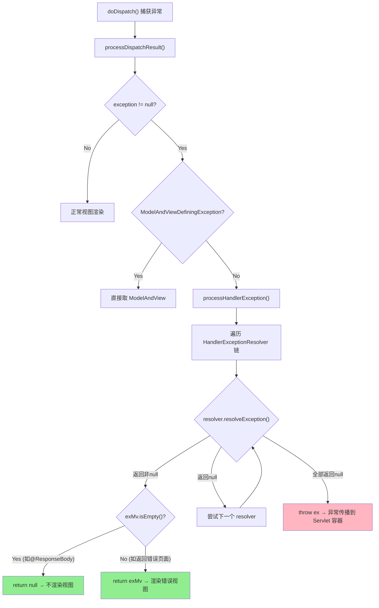
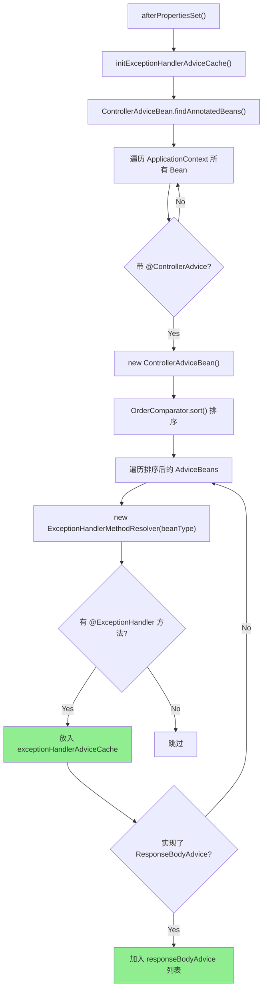
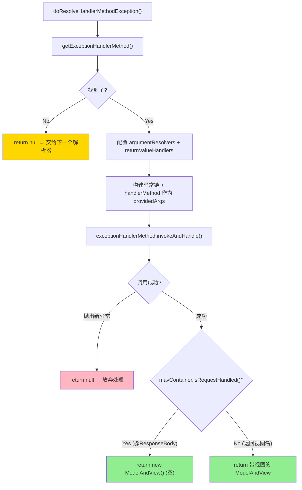
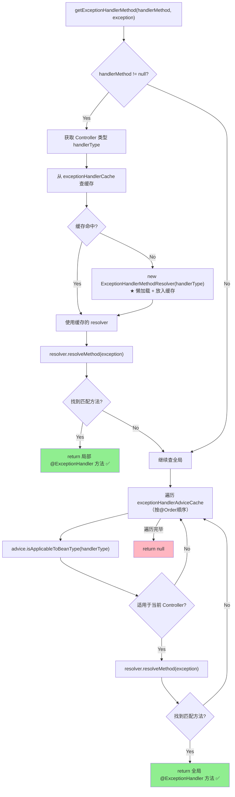
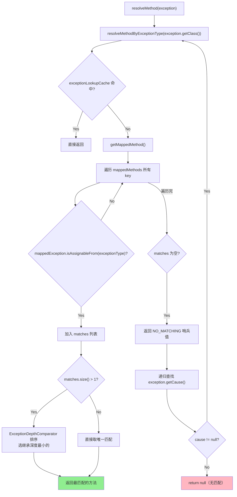
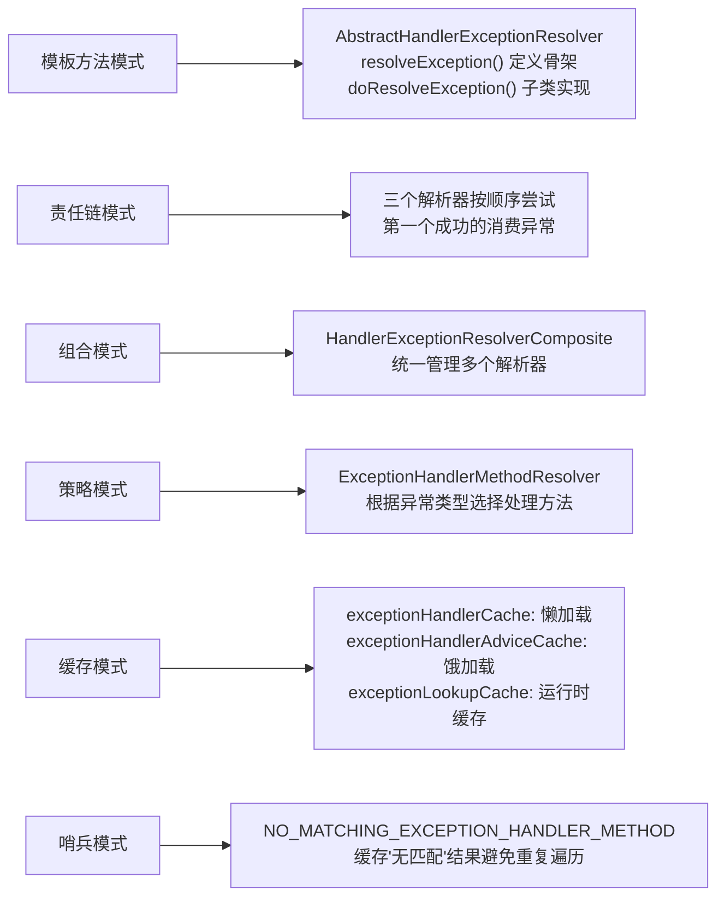

# Spring MVC ExceptionHandler 异常处理机制深度分析

> **📍 文档导航** | [📚 返回目录](./README.md) | [⬅️ 上一篇：数据绑定与类型转换](./数据绑定与类型转换深度分析.md) | [➡️ 下一篇：Filter与Interceptor对比](./Filter与Interceptor完整对比深度分析.md)
>
> **📊 元信息** | 难度：⭐⭐⭐⭐⭐ | 预估时间：1-2天 | 前置阅读：[② DispatcherServlet核心源码深度分析](./DispatcherServlet核心源码深度分析.md)（理解 doDispatch 的 try-catch 边界）
>
> **🎯 学习目标** | 理解 Spring MVC 如何在异常到达 Servlet 容器之前将其消化，返回统一格式的错误响应

---

> 📁 **本地源码路径**：`/data/workspace/spring-framework/`

---

## 一、总体定位：为什么需要异常处理机制？

### 1.1 没有异常处理机制的原始状态

在没有 Spring MVC 异常处理之前，Controller 中抛出的异常会直接传播到 Servlet 容器（Tomcat），用户看到的是：
- 一堆丑陋的 HTML 错误页面（Tomcat 默认的 500 页面）
- 完整的异常堆栈暴露给前端（安全隐患）
- 前后端分离时，前端期望收到 JSON 格式的错误信息，而不是 HTML

### 1.2 Spring MVC 的解决方案

Spring MVC 在 `DispatcherServlet` 的 `processDispatchResult()` 中拦截异常，交给 `HandlerExceptionResolver` 链处理，**在异常到达 Servlet 容器之前就将其消化掉**，返回统一格式的错误响应。

### 1.3 核心问题

本文要回答以下问题：
1. **异常从哪里被捕获？** — DispatcherServlet 中的 try-catch 边界
2. **异常交给谁处理？** — HandlerExceptionResolver 链的遍历顺序
3. **@ExceptionHandler 是如何工作的？** — ExceptionHandlerExceptionResolver 的完整流程
4. **@ControllerAdvice 如何实现全局异常处理？** — 初始化时的缓存构建 + 运行时的查找策略
5. **三个内置解析器的职责划分？** — 谁先谁后，各管什么

---

## 二、整体架构

### 2.1 类继承体系



### 2.2 三大解析器的职责划分与优先级

| 优先级 | 解析器 | 职责 | 适用场景 |
|--------|--------|------|---------|
| **1（最高）** | `ExceptionHandlerExceptionResolver` | 处理 `@ExceptionHandler` 注解方法 | **现代开发主要使用** |
| **2** | `ResponseStatusExceptionResolver` | 处理 `@ResponseStatus` 注解 + `ResponseStatusException` | 简单状态码映射 |
| **3（最低）** | `DefaultHandlerExceptionResolver` | 处理 15 种 Spring MVC 标准异常 | 兜底，自动处理框架异常 |

> **关键认知**：这三个解析器按顺序依次尝试。第一个返回非 null 的 `ModelAndView` 即"消费"了该异常。如果三个都返回 null，异常会被重新抛出到 Servlet 容器。

---

## 三、DispatcherServlet 异常入口

### 3.1 异常捕获点：doDispatch()

```java
// 来自: spring-webmvc/.../DispatcherServlet.java (L1081-L1089)
catch (Exception ex) {
    dispatchException = ex;
}
catch (Throwable err) {
    // As of 4.3, we're processing Errors thrown from handler methods as well,
    // making them available for @ExceptionHandler methods and other scenarios.
    dispatchException = new NestedServletException("Handler dispatch failed", err);
}
processDispatchResult(processedRequest, response, mappedHandler, mv, dispatchException);
```

**关键设计**：
- `Exception` 和 `Throwable`（Error）都会被捕获
- Error（如 `OutOfMemoryError`）被包装成 `NestedServletException`
- 异常并不是在 catch 块中直接处理，而是传给 `processDispatchResult()`

### 3.2 processDispatchResult()：异常分发

```java
// 来自: spring-webmvc/.../DispatcherServlet.java (L1130-L1170)
private void processDispatchResult(HttpServletRequest request, HttpServletResponse response,
        @Nullable HandlerExecutionChain mappedHandler, @Nullable ModelAndView mv,
        @Nullable Exception exception) throws Exception {

    boolean errorView = false;

    if (exception != null) {
        if (exception instanceof ModelAndViewDefiningException) {
            logger.debug("ModelAndViewDefiningException encountered", exception);
            mv = ((ModelAndViewDefiningException) exception).getModelAndView();
        }
        else {
            Object handler = (mappedHandler != null ? mappedHandler.getHandler() : null);
            mv = processHandlerException(request, response, handler, exception);
            errorView = (mv != null);
        }
    }

    // Did the handler return a view to render?
    if (mv != null && !mv.wasCleared()) {
        render(mv, request, response);
        if (errorView) {
            WebUtils.clearErrorRequestAttributes(request);
        }
    }
    // ...
}
```

**流程分析**：
1. 如果是 `ModelAndViewDefiningException`（很少用），直接取出其中的 ModelAndView
2. 否则调用 `processHandlerException()` 让异常解析器链处理
3. 如果异常处理返回了非空 ModelAndView 且带视图，还会走 `render()`（视图渲染）
4. 如果返回空 ModelAndView（`isEmpty()` = true，即 `@ResponseBody` 场景），不走视图渲染

### 3.3 processHandlerException()：遍历解析器链

```java
// 来自: spring-webmvc/.../DispatcherServlet.java (L1322-L1361)
@Nullable
protected ModelAndView processHandlerException(HttpServletRequest request, HttpServletResponse response,
        @Nullable Object handler, Exception ex) throws Exception {

    // Success and error responses may use different content types
    request.removeAttribute(HandlerMapping.PRODUCIBLE_MEDIA_TYPES_ATTRIBUTE);

    // Check registered HandlerExceptionResolvers...
    ModelAndView exMv = null;
    if (this.handlerExceptionResolvers != null) {
        for (HandlerExceptionResolver resolver : this.handlerExceptionResolvers) {
            exMv = resolver.resolveException(request, response, handler, ex);
            if (exMv != null) {
                break;
            }
        }
    }
    if (exMv != null) {
        if (exMv.isEmpty()) {
            request.setAttribute(EXCEPTION_ATTRIBUTE, ex);
            return null;   // ★ 空 ModelAndView → 返回 null → 不渲染视图
        }
        // ...设置视图名等
        return exMv;
    }

    throw ex;  // ★ 所有解析器都返回 null → 重新抛出异常到 Servlet 容器
}
```



**核心设计决策**：

1. **`exMv.isEmpty()` 返回 null 的含义**：空的 ModelAndView（无视图名、无 View 对象）表示"异常已处理但不需要渲染视图"。`@ResponseBody` 场景下，异常处理方法直接写入 JSON 到 Response，返回空 ModelAndView → `processHandlerException()` 返回 null → `processDispatchResult()` 中 `mv == null` → 跳过 `render()`。

2. **为什么要 `removeAttribute(PRODUCIBLE_MEDIA_TYPES_ATTRIBUTE)`？** 因为正常请求和错误响应可能使用不同的 Content-Type（比如正常返回 JSON，错误可能返回 HTML）。

---

## 四、HandlerExceptionResolver 接口

```java
// 来自: spring-webmvc/.../HandlerExceptionResolver.java (L36-L56)
public interface HandlerExceptionResolver {

    @Nullable
    ModelAndView resolveException(
            HttpServletRequest request, HttpServletResponse response,
            @Nullable Object handler, Exception ex);
}
```

**接口契约**：
- 输入：request、response、handler（可能为 null）、exception
- 输出：`ModelAndView`（三种可能）
  - **非空且有视图**：渲染错误页面
  - **非空但为空（empty）**：异常已处理，不渲染视图（`@ResponseBody` 场景）
  - **null**：该解析器不处理此异常，交给下一个

> **思考**：handler 参数为什么可以为 null？因为异常可能发生在 HandlerMapping 阶段（找不到 handler）或 multipart 解析阶段。此时还没有确定 handler。

---

## 五、AbstractHandlerExceptionResolver 抽象基类

### 5.1 核心字段

```java
// 来自: spring-webmvc/.../AbstractHandlerExceptionResolver.java (L46-L65)
public abstract class AbstractHandlerExceptionResolver implements HandlerExceptionResolver, Ordered {

    private int order = Ordered.LOWEST_PRECEDENCE;

    @Nullable
    private Set<?> mappedHandlers;          // 限定处理哪些 handler 实例

    @Nullable
    private Class<?>[] mappedHandlerClasses; // 限定处理哪些 handler 类型

    private boolean preventResponseCaching = false; // 是否阻止响应缓存
}
```

### 5.2 模板方法：resolveException()

```java
// 来自: spring-webmvc/.../AbstractHandlerExceptionResolver.java (L137-L156)
@Override
@Nullable
public ModelAndView resolveException(
        HttpServletRequest request, HttpServletResponse response,
        @Nullable Object handler, Exception ex) {

    if (shouldApplyTo(request, handler)) {      // ① 判断是否应该处理
        prepareResponse(ex, response);           // ② 准备响应（如禁用缓存）
        ModelAndView result = doResolveException(request, response, handler, ex); // ③ 子类实现
        if (result != null) {
            logException(ex, request);           // ④ 日志记录
        }
        return result;
    }
    else {
        return null;  // 不处理该 handler 的异常
    }
}
```

**模板方法模式**：
1. `shouldApplyTo()` — 根据 `mappedHandlers`/`mappedHandlerClasses` 判断是否处理
2. `prepareResponse()` — 如果 `preventResponseCaching=true`，设置 `Cache-Control: no-store`
3. `doResolveException()` — **抽象方法，由子类实现**
4. `logException()` — 日志

---

## 六、AbstractHandlerMethodExceptionResolver：Handler → HandlerMethod 的桥梁

```java
// 来自: spring-webmvc/.../AbstractHandlerMethodExceptionResolver.java (L34-L96)
public abstract class AbstractHandlerMethodExceptionResolver extends AbstractHandlerExceptionResolver {

    @Override
    protected boolean shouldApplyTo(HttpServletRequest request, @Nullable Object handler) {
        if (handler == null) {
            return super.shouldApplyTo(request, null);
        }
        else if (handler instanceof HandlerMethod) {
            HandlerMethod handlerMethod = (HandlerMethod) handler;
            handler = handlerMethod.getBean();        // ★ 提取 Controller Bean
            return super.shouldApplyTo(request, handler);
        }
        else if (hasGlobalExceptionHandlers() && hasHandlerMappings()) {
            return super.shouldApplyTo(request, handler);
        }
        else {
            return false;  // 非 HandlerMethod 类型，不处理
        }
    }

    @Override
    @Nullable
    protected final ModelAndView doResolveException(...) {
        HandlerMethod handlerMethod = (handler instanceof HandlerMethod ? (HandlerMethod) handler : null);
        return doResolveHandlerMethodException(request, response, handlerMethod, ex);
        // ★ Object handler → HandlerMethod 类型转换，委托子类
    }

    @Nullable
    protected abstract ModelAndView doResolveHandlerMethodException(...);
}
```

**两个职责**：
1. **shouldApplyTo() 增强**：从 `HandlerMethod` 中提取 Controller Bean，再调父类的 `shouldApplyTo()`
2. **doResolveException() → doResolveHandlerMethodException()**：Object handler → HandlerMethod 强转后委托子类

> 这与 HandlerAdapter 体系中 `AbstractHandlerMethodAdapter` 的设计如出一辙——**在抽象层完成类型转换**。

---

## 七、ExceptionHandlerExceptionResolver（核心重点）

这是现代 Spring MVC 异常处理的核心实现，负责处理所有 `@ExceptionHandler` 注解方法。

### 7.1 核心数据结构

```java
// 来自: spring-webmvc/.../ExceptionHandlerExceptionResolver.java (L88-L113)

// ① 参数解析器（处理 @ExceptionHandler 方法的参数）
@Nullable
private HandlerMethodArgumentResolverComposite argumentResolvers;

// ② 返回值处理器（处理 @ExceptionHandler 方法的返回值）
@Nullable
private HandlerMethodReturnValueHandlerComposite returnValueHandlers;

// ③ 消息转换器（@ResponseBody 场景下序列化 JSON）
private List<HttpMessageConverter<?>> messageConverters;

// ④ ResponseBodyAdvice 支持
private final List<Object> responseBodyAdvice = new ArrayList<>();

// ⑤ ★ Controller 本地 @ExceptionHandler 缓存
//    key=Controller类 → value=该类中 @ExceptionHandler 方法的映射关系
private final Map<Class<?>, ExceptionHandlerMethodResolver> exceptionHandlerCache =
        new ConcurrentHashMap<>(64);

// ⑥ ★ @ControllerAdvice 全局 @ExceptionHandler 缓存
//    key=ControllerAdviceBean → value=其中 @ExceptionHandler 方法的映射关系
private final Map<ControllerAdviceBean, ExceptionHandlerMethodResolver> exceptionHandlerAdviceCache =
        new LinkedHashMap<>();
```

**数据结构设计解读**：

| 字段 | 类型 | 容器 | 为什么？ |
|------|------|------|---------|
| `exceptionHandlerCache` | `ConcurrentHashMap<Class<?>, ...>` | 初始容量 64 | Controller 类数量不确定，运行时**懒加载**，需要线程安全 |
| `exceptionHandlerAdviceCache` | `LinkedHashMap<ControllerAdviceBean, ...>` | 无初始容量 | 启动时**一次性构建**，保持 `@Order` 排序顺序，不需要并发写 |

> **关键区别**：Controller 本地缓存是懒加载（首次异常时构建），全局 Advice 缓存是饿加载（`afterPropertiesSet()` 时构建）。

### 7.2 初始化：afterPropertiesSet()

```java
// 来自: spring-webmvc/.../ExceptionHandlerExceptionResolver.java (L266-L278)
@Override
public void afterPropertiesSet() {
    // Do this first, it may add ResponseBodyAdvice beans
    initExceptionHandlerAdviceCache();   // ① 先初始化全局 @ControllerAdvice

    if (this.argumentResolvers == null) {
        List<HandlerMethodArgumentResolver> resolvers = getDefaultArgumentResolvers();
        this.argumentResolvers = new HandlerMethodArgumentResolverComposite().addResolvers(resolvers);
    }                                     // ② 初始化参数解析器
    if (this.returnValueHandlers == null) {
        List<HandlerMethodReturnValueHandler> handlers = getDefaultReturnValueHandlers();
        this.returnValueHandlers = new HandlerMethodReturnValueHandlerComposite().addHandlers(handlers);
    }                                     // ③ 初始化返回值处理器
}
```

### 7.3 initExceptionHandlerAdviceCache()：@ControllerAdvice 发现

```java
// 来自: spring-webmvc/.../ExceptionHandlerExceptionResolver.java (L280-L311)
private void initExceptionHandlerAdviceCache() {
    if (getApplicationContext() == null) {
        return;
    }

    // ① 找到所有 @ControllerAdvice Bean，已按 @Order 排序
    List<ControllerAdviceBean> adviceBeans = ControllerAdviceBean.findAnnotatedBeans(getApplicationContext());

    for (ControllerAdviceBean adviceBean : adviceBeans) {
        Class<?> beanType = adviceBean.getBeanType();
        if (beanType == null) {
            throw new IllegalStateException("Unresolvable type for ControllerAdviceBean: " + adviceBean);
        }
        // ② 解析每个 Advice 中的 @ExceptionHandler 方法
        ExceptionHandlerMethodResolver resolver = new ExceptionHandlerMethodResolver(beanType);
        if (resolver.hasExceptionMappings()) {
            this.exceptionHandlerAdviceCache.put(adviceBean, resolver);  // ③ 有异常处理方法才缓存
        }
        // ④ 同时收集 ResponseBodyAdvice
        if (ResponseBodyAdvice.class.isAssignableFrom(beanType)) {
            this.responseBodyAdvice.add(adviceBean);
        }
    }
}
```



### 7.4 doResolveHandlerMethodException()：核心处理流程

```java
// 来自: spring-webmvc/.../ExceptionHandlerExceptionResolver.java (L395-L457)
@Override
@Nullable
protected ModelAndView doResolveHandlerMethodException(HttpServletRequest request,
        HttpServletResponse response, @Nullable HandlerMethod handlerMethod, Exception exception) {

    // ① 查找匹配的 @ExceptionHandler 方法
    ServletInvocableHandlerMethod exceptionHandlerMethod = getExceptionHandlerMethod(handlerMethod, exception);
    if (exceptionHandlerMethod == null) {
        return null;  // 找不到 → 返回 null，交给下一个解析器
    }

    // ② 配置参数解析器和返回值处理器
    if (this.argumentResolvers != null) {
        exceptionHandlerMethod.setHandlerMethodArgumentResolvers(this.argumentResolvers);
    }
    if (this.returnValueHandlers != null) {
        exceptionHandlerMethod.setHandlerMethodReturnValueHandlers(this.returnValueHandlers);
    }

    ServletWebRequest webRequest = new ServletWebRequest(request, response);
    ModelAndViewContainer mavContainer = new ModelAndViewContainer();

    // ③ 构建异常链作为 providedArgs
    ArrayList<Throwable> exceptions = new ArrayList<>();
    try {
        Throwable exToExpose = exception;
        while (exToExpose != null) {
            exceptions.add(exToExpose);
            Throwable cause = exToExpose.getCause();
            exToExpose = (cause != exToExpose ? cause : null);  // 防无限循环
        }
        Object[] arguments = new Object[exceptions.size() + 1];
        exceptions.toArray(arguments);
        arguments[arguments.length - 1] = handlerMethod;  // ★ 也把原始 HandlerMethod 作为参数

        // ④ 调用 @ExceptionHandler 方法（和正常 Controller 方法调用链一致）
        exceptionHandlerMethod.invokeAndHandle(webRequest, mavContainer, arguments);
    }
    catch (Throwable invocationEx) {
        if (!exceptions.contains(invocationEx) && logger.isWarnEnabled()) {
            logger.warn("Failure in @ExceptionHandler " + exceptionHandlerMethod, invocationEx);
        }
        return null;  // @ExceptionHandler 方法自身抛异常 → 放弃，交给下一个解析器
    }

    // ⑤ 处理返回值
    if (mavContainer.isRequestHandled()) {
        return new ModelAndView();  // ★ @ResponseBody → 空 ModelAndView（不渲染视图）
    }
    else {
        ModelMap model = mavContainer.getModel();
        HttpStatus status = mavContainer.getStatus();
        ModelAndView mav = new ModelAndView(mavContainer.getViewName(), model, status);
        // ...
        return mav;
    }
}
```



**关键细节**：

1. **异常链展开**：将 `exception → cause → cause...` 整条链都放入 `providedArgs`。这意味着你的 `@ExceptionHandler` 方法参数可以声明为任意层级的 cause 异常类型。

2. **handlerMethod 也是参数**：`arguments` 数组最后一个是原始的 `HandlerMethod`，所以 `@ExceptionHandler` 方法可以注入 `HandlerMethod` 参数来获知是哪个 Controller 方法出了问题。

3. **invokeAndHandle()** 和正常 Controller 方法调用链**完全一致** — 同样经过参数解析器 → 反射调用 → 返回值处理器。

### 7.5 getExceptionHandlerMethod()：查找策略（先局部后全局）

```java
// 来自: spring-webmvc/.../ExceptionHandlerExceptionResolver.java (L470-L507)
@Nullable
protected ServletInvocableHandlerMethod getExceptionHandlerMethod(
        @Nullable HandlerMethod handlerMethod, Exception exception) {

    Class<?> handlerType = null;

    // ====== 第一步：先查 Controller 本地的 @ExceptionHandler ======
    if (handlerMethod != null) {
        handlerType = handlerMethod.getBeanType();
        ExceptionHandlerMethodResolver resolver = this.exceptionHandlerCache.get(handlerType);
        if (resolver == null) {
            resolver = new ExceptionHandlerMethodResolver(handlerType);  // ★ 懒加载
            this.exceptionHandlerCache.put(handlerType, resolver);
        }
        Method method = resolver.resolveMethod(exception);
        if (method != null) {
            return new ServletInvocableHandlerMethod(handlerMethod.getBean(), method, this.applicationContext);
        }
        // 如果是代理类，获取目标类（用于下面的 advice 适用性判断）
        if (Proxy.isProxyClass(handlerType)) {
            handlerType = AopUtils.getTargetClass(handlerMethod.getBean());
        }
    }

    // ====== 第二步：再查 @ControllerAdvice 全局的 @ExceptionHandler ======
    for (Map.Entry<ControllerAdviceBean, ExceptionHandlerMethodResolver> entry :
            this.exceptionHandlerAdviceCache.entrySet()) {
        ControllerAdviceBean advice = entry.getKey();
        if (advice.isApplicableToBeanType(handlerType)) {  // 检查 @ControllerAdvice 作用范围
            ExceptionHandlerMethodResolver resolver = entry.getValue();
            Method method = resolver.resolveMethod(exception);
            if (method != null) {
                return new ServletInvocableHandlerMethod(advice.resolveBean(), method, this.applicationContext);
            }
        }
    }

    return null;
}
```



**核心设计**：**局部优先于全局**
- Controller 本类中的 `@ExceptionHandler` 优先级最高
- 如果本类没有匹配的，再按 `@Order` 顺序遍历 `@ControllerAdvice` 中的

---

## 八、ExceptionHandlerMethodResolver：异常匹配算法

这个类负责从一个类（Controller 或 @ControllerAdvice）中发现所有 `@ExceptionHandler` 方法，并根据异常类型找到最匹配的方法。

### 8.1 核心数据结构

```java
// 来自: spring-web/.../ExceptionHandlerMethodResolver.java (L45-L68)
public class ExceptionHandlerMethodResolver {

    // 过滤器：只选择带 @ExceptionHandler 注解的方法
    public static final MethodFilter EXCEPTION_HANDLER_METHODS = method ->
            AnnotatedElementUtils.hasAnnotation(method, ExceptionHandler.class);

    // ★ 核心映射：异常类型 → 处理方法
    private final Map<Class<? extends Throwable>, Method> mappedMethods = new HashMap<>(16);

    // ★ 运行时查找缓存：异常类型 → 处理方法
    private final Map<Class<? extends Throwable>, Method> exceptionLookupCache = new ConcurrentReferenceHashMap<>(16);
}
```

| 字段 | 类型 | 用途 |
|------|------|------|
| `mappedMethods` | `HashMap` | 构造时构建，存储 `@ExceptionHandler` 注解声明的**精确异常类型** → 方法映射 |
| `exceptionLookupCache` | `ConcurrentReferenceHashMap` | 运行时缓存，存储实际异常类型（可能是子类）→ 方法映射，软引用避免内存泄漏 |

### 8.2 构造器：扫描 @ExceptionHandler 方法

```java
// 来自: spring-web/.../ExceptionHandlerMethodResolver.java (L75-L81)
public ExceptionHandlerMethodResolver(Class<?> handlerType) {
    for (Method method : MethodIntrospector.selectMethods(handlerType, EXCEPTION_HANDLER_METHODS)) {
        for (Class<? extends Throwable> exceptionType : detectExceptionMappings(method)) {
            addExceptionMapping(exceptionType, method);
        }
    }
}
```

`detectExceptionMappings()` 的发现策略：

```java
// 来自: spring-web/.../ExceptionHandlerMethodResolver.java (L89-L103)
private List<Class<? extends Throwable>> detectExceptionMappings(Method method) {
    List<Class<? extends Throwable>> result = new ArrayList<>();
    detectAnnotationExceptionMappings(method, result); // ① 先从注解 value 属性获取
    if (result.isEmpty()) {
        for (Class<?> paramType : method.getParameterTypes()) { // ② 注解没声明，从参数类型推断
            if (Throwable.class.isAssignableFrom(paramType)) {
                result.add((Class<? extends Throwable>) paramType);
            }
        }
    }
    if (result.isEmpty()) {
        throw new IllegalStateException("No exception types mapped to " + method);
    }
    return result;
}
```

**两种声明方式**：
```java
// 方式1：注解明确指定（优先）
@ExceptionHandler(BusinessException.class)
public ResponseEntity<ErrorResult> handle(Exception ex) { ... }

// 方式2：从参数类型推断（注解 value 为空时）
@ExceptionHandler
public ResponseEntity<ErrorResult> handle(BusinessException ex) { ... }
```

### 8.3 resolveMethod()：异常匹配（支持继承链 + cause 链）

```java
// 来自: spring-web/.../ExceptionHandlerMethodResolver.java (L133-L153)
@Nullable
public Method resolveMethod(Exception exception) {
    return resolveMethodByThrowable(exception);
}

@Nullable
public Method resolveMethodByThrowable(Throwable exception) {
    Method method = resolveMethodByExceptionType(exception.getClass()); // ① 用当前异常类型匹配
    if (method == null) {
        Throwable cause = exception.getCause();
        if (cause != null) {
            method = resolveMethodByThrowable(cause);  // ② 递归匹配 cause 链
        }
    }
    return method;
}
```

```java
// 来自: spring-web/.../ExceptionHandlerMethodResolver.java (L164-L171)
@Nullable
public Method resolveMethodByExceptionType(Class<? extends Throwable> exceptionType) {
    Method method = this.exceptionLookupCache.get(exceptionType);  // ① 先查缓存
    if (method == null) {
        method = getMappedMethod(exceptionType);                    // ② 缓存未命中，遍历查找
        this.exceptionLookupCache.put(exceptionType, method);      // ③ 放入缓存
    }
    return (method != NO_MATCHING_EXCEPTION_HANDLER_METHOD ? method : null);
}
```

```java
// 来自: spring-web/.../ExceptionHandlerMethodResolver.java (L177-L193)
private Method getMappedMethod(Class<? extends Throwable> exceptionType) {
    List<Class<? extends Throwable>> matches = new ArrayList<>();
    for (Class<? extends Throwable> mappedException : this.mappedMethods.keySet()) {
        if (mappedException.isAssignableFrom(exceptionType)) {  // ★ 支持继承匹配
            matches.add(mappedException);
        }
    }
    if (!matches.isEmpty()) {
        if (matches.size() > 1) {
            matches.sort(new ExceptionDepthComparator(exceptionType)); // ★ 按继承深度排序
        }
        return this.mappedMethods.get(matches.get(0));  // 返回最近的（深度最小的）
    }
    else {
        return NO_MATCHING_EXCEPTION_HANDLER_METHOD;  // 哨兵值，缓存"无匹配"
    }
}
```



**匹配算法要点**：

1. **继承匹配**：声明处理 `RuntimeException` 的方法，也能匹配 `NullPointerException`（子类）
2. **最近匹配优先**：`ExceptionDepthComparator` 计算继承深度，选择最近的。例如声明了 `RuntimeException` 和 `Exception` 两个处理器，`NullPointerException` 会匹配到 `RuntimeException`（深度更近）
3. **Cause 链递归**：如果当前异常类型无匹配，会递归尝试 `getCause()`
4. **哨兵缓存**：`NO_MATCHING_EXCEPTION_HANDLER_METHOD` 是一个真实的 Method 对象（指向 `noMatchingExceptionHandler()` 空方法），用于缓存"无匹配"的结果，避免重复遍历

---

## 九、@ControllerAdvice 注解与作用域控制

### 9.1 注解定义

```java
// 来自: spring-web/.../ControllerAdvice.java (L75-L135)
@Target(ElementType.TYPE)
@Retention(RetentionPolicy.RUNTIME)
@Documented
@Component     // ★ 本身就是 @Component，会被组件扫描发现
public @interface ControllerAdvice {

    @AliasFor("basePackages")
    String[] value() default {};           // 限定包路径

    @AliasFor("value")
    String[] basePackages() default {};    // 限定包路径

    Class<?>[] basePackageClasses() default {};  // 限定包（类型安全）

    Class<?>[] assignableTypes() default {};     // 限定 Controller 类型

    Class<? extends Annotation>[] annotations() default {};  // 限定注解类型
}
```

**四种作用域控制**（OR 关系，满足任一即生效）：

| 属性 | 示例 | 含义 |
|------|------|------|
| `basePackages` | `@ControllerAdvice("com.app.api")` | 只作用于 `com.app.api` 包下的 Controller |
| `basePackageClasses` | `@ControllerAdvice(basePackageClasses = ApiController.class)` | 类型安全的包限定 |
| `assignableTypes` | `@ControllerAdvice(assignableTypes = BaseController.class)` | 只作用于指定类及其子类 |
| `annotations` | `@ControllerAdvice(annotations = RestController.class)` | 只作用于带指定注解的 Controller |

> **默认行为**：如果不指定任何属性，作用于**所有** Controller。

### 9.2 ControllerAdviceBean：懒加载 + 排序

`ControllerAdviceBean.findAnnotatedBeans()` 的核心逻辑：

```java
// 来自: spring-web/.../ControllerAdviceBean.java (L292-L311)
public static List<ControllerAdviceBean> findAnnotatedBeans(ApplicationContext context) {
    // ...
    List<ControllerAdviceBean> adviceBeans = new ArrayList<>();
    for (String name : BeanFactoryUtils.beanNamesForTypeIncludingAncestors(beanFactory, Object.class)) {
        if (!ScopedProxyUtils.isScopedTarget(name)) {
            ControllerAdvice controllerAdvice = beanFactory.findAnnotationOnBean(name, ControllerAdvice.class);
            if (controllerAdvice != null) {
                adviceBeans.add(new ControllerAdviceBean(name, beanFactory, controllerAdvice));
            }
        }
    }
    OrderComparator.sort(adviceBeans);  // ★ 按 @Order 排序
    return adviceBeans;
}
```

**排序规则**（`@ControllerAdvice` 的 Javadoc 明确说明）：
1. 实现 `Ordered` 接口的值优先
2. 然后是 `@Order` / `@Priority` 注解
3. 对于 `@ExceptionHandler`，**高优先级的 Advice 先匹配**

### 9.3 isApplicableToBeanType()：作用域判断

```java
// 来自: spring-web/.../ControllerAdviceBean.java (L254-L256)
public boolean isApplicableToBeanType(@Nullable Class<?> beanType) {
    return this.beanTypePredicate.test(beanType);
}
```

`beanTypePredicate` 在构造 `ControllerAdviceBean` 时通过 `HandlerTypePredicate.builder()` 根据 `@ControllerAdvice` 的四种属性构建：
- 输入：`@ControllerAdvice(basePackages="com.app")` → 输出：`HandlerTypePredicate` 只对 `com.app` 包下的类返回 true

---

## 十、ResponseStatusExceptionResolver

### 10.1 职责

处理两种场景：
1. 异常类上标注了 `@ResponseStatus` 注解
2. 异常是 `ResponseStatusException` 实例（Spring 5.0+）

### 10.2 核心流程

```java
// 来自: spring-webmvc/.../ResponseStatusExceptionResolver.java (L71-L94)
@Override
@Nullable
protected ModelAndView doResolveException(
        HttpServletRequest request, HttpServletResponse response,
        @Nullable Object handler, Exception ex) {

    try {
        if (ex instanceof ResponseStatusException) {
            return resolveResponseStatusException((ResponseStatusException) ex, request, response, handler);
        }

        // ★ 在异常类上查找 @ResponseStatus 注解
        ResponseStatus status = AnnotatedElementUtils.findMergedAnnotation(ex.getClass(), ResponseStatus.class);
        if (status != null) {
            return resolveResponseStatus(status, request, response, handler, ex);
        }

        // ★ 递归查找 cause 上的 @ResponseStatus
        if (ex.getCause() instanceof Exception) {
            return doResolveException(request, response, handler, (Exception) ex.getCause());
        }
    }
    catch (Exception resolveEx) { /* ... */ }
    return null;
}
```

```java
// 来自: spring-webmvc/.../ResponseStatusExceptionResolver.java (L150-L163)
protected ModelAndView applyStatusAndReason(int statusCode, @Nullable String reason,
        HttpServletResponse response) throws IOException {

    if (!StringUtils.hasLength(reason)) {
        response.sendError(statusCode);        // 无 reason → 只设状态码
    }
    else {
        String resolvedReason = (this.messageSource != null ?
                this.messageSource.getMessage(reason, null, reason, LocaleContextHolder.getLocale()) :
                reason);
        response.sendError(statusCode, resolvedReason);  // 有 reason → sendError + 原因
    }
    return new ModelAndView();  // 返回空 ModelAndView
}
```

**使用示例**：
```java
// 方式1：自定义异常类上标注
@ResponseStatus(code = HttpStatus.NOT_FOUND, reason = "资源不存在")
public class ResourceNotFoundException extends RuntimeException { }

// 方式2：直接抛 ResponseStatusException
throw new ResponseStatusException(HttpStatus.NOT_FOUND, "User not found");
```

**注意**：`@ResponseStatus` 的 `reason` 属性会触发 `response.sendError()`，Servlet 容器通常会返回 HTML 错误页面。在 REST API 中**不推荐使用 reason**，推荐使用 `@ExceptionHandler` + `ResponseEntity` 方式。

---

## 十一、DefaultHandlerExceptionResolver

### 11.1 职责

兜底解析器，处理 Spring MVC 框架自身抛出的 **15 种标准异常**，将它们映射为合适的 HTTP 状态码。

### 11.2 异常→状态码映射表

| 异常类型 | HTTP 状态码 | 说明 |
|---------|------------|------|
| `HttpRequestMethodNotSupportedException` | 405 Method Not Allowed | GET 请求到了 POST 接口 |
| `HttpMediaTypeNotSupportedException` | 415 Unsupported Media Type | Content-Type 不匹配 |
| `HttpMediaTypeNotAcceptableException` | 406 Not Acceptable | Accept 头不匹配 |
| `MissingPathVariableException` | 500 Internal Server Error | @PathVariable 缺失 |
| `MissingServletRequestParameterException` | 400 Bad Request | @RequestParam 缺失 |
| `ServletRequestBindingException` | 400 Bad Request | @RequestHeader 等绑定失败 |
| `ConversionNotSupportedException` | 500 Internal Server Error | 类型转换不支持 |
| `TypeMismatchException` | 400 Bad Request | 类型不匹配 |
| `HttpMessageNotReadableException` | 400 Bad Request | @RequestBody JSON 解析失败 |
| `HttpMessageNotWritableException` | 500 Internal Server Error | 响应序列化失败 |
| `MethodArgumentNotValidException` | 400 Bad Request | @Valid 校验失败 |
| `MissingServletRequestPartException` | 400 Bad Request | multipart 部分缺失 |
| `BindException` | 400 Bad Request | 数据绑定异常 |
| `NoHandlerFoundException` | 404 Not Found | 找不到 handler |
| `AsyncRequestTimeoutException` | 503 Service Unavailable | 异步请求超时 |

### 11.3 源码结构

```java
// 来自: spring-webmvc/.../DefaultHandlerExceptionResolver.java (L161-L164)
public DefaultHandlerExceptionResolver() {
    setOrder(Ordered.LOWEST_PRECEDENCE);     // ★ 最低优先级，作为兜底
    setWarnLogCategory(getClass().getName()); // 默认开启 warn 日志
}
```

`doResolveException()` 就是一个巨大的 `if-else` 链（L169-L243），根据异常类型分发到对应的 `handleXxx()` 方法。每个方法的模式都一样：`response.sendError(statusCode)` + `return new ModelAndView()`。

> **按照详细程度控制规范**：DefaultHandlerExceptionResolver 的每个 `handleXxx()` 方法实现都是工具性的（设置状态码 + sendError），不需要逐个展开源码。上面的映射表已经足够说明其行为。

---

## 十二、ResponseEntityExceptionHandler：现代全局异常处理基类

### 12.1 定位

`ResponseEntityExceptionHandler` 是 Spring 提供的一个**抽象基类**，专门用于 `@ControllerAdvice` 搭配 `@ExceptionHandler` 的场景。它与 `DefaultHandlerExceptionResolver` 处理**相同的 15 种异常**，但返回 `ResponseEntity<Object>` 而不是 `ModelAndView`。

### 12.2 为什么需要它？

| | `DefaultHandlerExceptionResolver` | `ResponseEntityExceptionHandler` |
|---|---|---|
| 返回类型 | `ModelAndView`（触发 `response.sendError()` → HTML 错误页） | `ResponseEntity`（JSON 响应体） |
| 适用场景 | 传统 MVC（JSP 视图渲染） | **REST API（前后端分离）** |
| 可定制性 | 需要重写整个方法 | 可以重写单个方法，统一走 `handleExceptionInternal()` |

### 12.3 核心设计

```java
// 来自: spring-webmvc/.../ResponseEntityExceptionHandler.java (L106-L122)
@ExceptionHandler({
        HttpRequestMethodNotSupportedException.class,
        HttpMediaTypeNotSupportedException.class,
        // ... 15 种标准异常
})
@Nullable
public final ResponseEntity<Object> handleException(Exception ex, WebRequest request) throws Exception {
    // 根据异常类型分发到对应的 protected 方法
    if (ex instanceof HttpRequestMethodNotSupportedException) {
        HttpStatus status = HttpStatus.METHOD_NOT_ALLOWED;
        return handleHttpRequestMethodNotSupported(...);
    }
    // ...
}
```

```java
// 来自: spring-webmvc/.../ResponseEntityExceptionHandler.java (L466-L473)
protected ResponseEntity<Object> handleExceptionInternal(
        Exception ex, @Nullable Object body, HttpHeaders headers,
        HttpStatus status, WebRequest request) {

    if (HttpStatus.INTERNAL_SERVER_ERROR.equals(status)) {
        request.setAttribute(WebUtils.ERROR_EXCEPTION_ATTRIBUTE, ex, WebRequest.SCOPE_REQUEST);
    }
    return new ResponseEntity<>(body, headers, status);
}
```

### 12.4 实际使用方式

```java
@RestControllerAdvice
public class GlobalExceptionHandler extends ResponseEntityExceptionHandler {

    // 自定义业务异常
    @ExceptionHandler(BusinessException.class)
    public ResponseEntity<ErrorResult> handleBusinessException(BusinessException ex) {
        ErrorResult result = new ErrorResult(ex.getCode(), ex.getMessage());
        return ResponseEntity.status(HttpStatus.BAD_REQUEST).body(result);
    }

    // 重写父类方法，定制参数校验失败的返回
    @Override
    protected ResponseEntity<Object> handleMethodArgumentNotValid(
            MethodArgumentNotValidException ex, HttpHeaders headers,
            HttpStatus status, WebRequest request) {
        // 提取校验错误信息
        List<String> errors = ex.getBindingResult().getFieldErrors().stream()
                .map(e -> e.getField() + ": " + e.getDefaultMessage())
                .collect(Collectors.toList());
        ErrorResult result = new ErrorResult("VALIDATION_ERROR", errors.toString());
        return handleExceptionInternal(ex, result, headers, status, request);
    }
}
```

**继承 `ResponseEntityExceptionHandler` 的好处**：
1. 15 种标准异常**自动处理**，不用自己写
2. 可以**选择性重写**某个方法来定制响应格式
3. 所有响应统一走 `handleExceptionInternal()`，方便做统一日志、统一格式等

---

## 十三、HandlerExceptionResolverComposite：组合模式

```java
// 来自: spring-webmvc/.../HandlerExceptionResolverComposite.java (L37-L89)
public class HandlerExceptionResolverComposite implements HandlerExceptionResolver, Ordered {

    @Nullable
    private List<HandlerExceptionResolver> resolvers;

    @Override
    @Nullable
    public ModelAndView resolveException(...) {
        if (this.resolvers != null) {
            for (HandlerExceptionResolver handlerExceptionResolver : this.resolvers) {
                ModelAndView mav = handlerExceptionResolver.resolveException(request, response, handler, ex);
                if (mav != null) {
                    return mav;  // ★ 第一个返回非 null 的赢
                }
            }
        }
        return null;
    }
}
```

> Spring Boot 的 `WebMvcAutoConfiguration` 将三个解析器封装在一个 `HandlerExceptionResolverComposite` 中，再注册到 `DispatcherServlet`。

---

## 十四、完整请求异常处理时序图

```mermaid
sequenceDiagram
    participant Client
    participant DS as DispatcherServlet
    participant HA as HandlerAdapter
    participant Controller
    participant EHER as ExceptionHandler<br/>ExceptionResolver
    participant RSER as ResponseStatus<br/>ExceptionResolver
    participant DHER as DefaultHandler<br/>ExceptionResolver

    Client->>DS: HTTP Request
    DS->>HA: handle(request, response, handler)
    HA->>Controller: invokeHandlerMethod()
    Controller-->>HA: throw BusinessException

    Note over DS: catch (Exception ex) {<br/>  dispatchException = ex;<br/>}

    DS->>DS: processDispatchResult(ex)
    DS->>DS: processHandlerException(handler, ex)

    DS->>EHER: resolveException(request, response, handler, ex)
    Note over EHER: ① 查 Controller 本地 @ExceptionHandler
    Note over EHER: ② 查 @ControllerAdvice 全局 @ExceptionHandler
    alt 找到匹配的 @ExceptionHandler
        EHER->>EHER: invokeAndHandle(@ExceptionHandler方法)
        EHER-->>DS: ModelAndView（空 = @ResponseBody已写入）
        DS-->>Client: JSON 响应 {"code": 400, "message": "..."}
    else 未找到
        EHER-->>DS: null
        DS->>RSER: resolveException(request, response, handler, ex)
        alt 异常类带 @ResponseStatus
            RSER->>RSER: response.sendError(statusCode)
            RSER-->>DS: 空 ModelAndView
            DS-->>Client: HTTP 状态码响应
        else 无 @ResponseStatus
            RSER-->>DS: null
            DS->>DHER: resolveException(request, response, handler, ex)
            alt Spring MVC 标准异常
                DHER->>DHER: response.sendError(statusCode)
                DHER-->>DS: 空 ModelAndView
                DS-->>Client: HTTP 状态码响应
            else 非标准异常
                DHER-->>DS: null
                Note over DS: throw ex → 异常传播到 Servlet 容器
                DS-->>Client: Tomcat 默认错误页面
            end
        end
    end
```

---

## 十五、@ExceptionHandler 方法支持的参数和返回值

### 15.1 @ExceptionHandler 方法可用的参数解析器

`ExceptionHandlerExceptionResolver` 注册的参数解析器比正常 Controller 少得多（不需要 `@RequestParam`、`@PathVariable` 等）：

```java
// 来自: spring-webmvc/.../ExceptionHandlerExceptionResolver.java (L327-L349)
protected List<HandlerMethodArgumentResolver> getDefaultArgumentResolvers() {
    List<HandlerMethodArgumentResolver> resolvers = new ArrayList<>();

    // 注解驱动（只有2个）
    resolvers.add(new SessionAttributeMethodArgumentResolver());
    resolvers.add(new RequestAttributeMethodArgumentResolver());

    // 类型驱动（4个）
    resolvers.add(new ServletRequestMethodArgumentResolver());
    resolvers.add(new ServletResponseMethodArgumentResolver());
    resolvers.add(new RedirectAttributesMethodArgumentResolver());
    resolvers.add(new ModelMethodProcessor());

    // 自定义
    if (getCustomArgumentResolvers() != null) {
        resolvers.addAll(getCustomArgumentResolvers());
    }

    // 兜底
    resolvers.add(new PrincipalMethodArgumentResolver());

    return resolvers;
}
```

**对比正常 Controller 方法（27个） vs @ExceptionHandler 方法（7个）**：

| 类别 | @ExceptionHandler 可用 | 说明 |
|------|------------------------|------|
| 异常对象 | ✅ 通过 providedArgs 直接注入 | `Exception ex` 参数 |
| `HandlerMethod` | ✅ 通过 providedArgs 直接注入 | 获取原始 Controller 方法信息 |
| `HttpServletRequest/Response` | ✅ `ServletRequestMethodArgumentResolver` | |
| `@SessionAttribute` | ✅ `SessionAttributeMethodArgumentResolver` | |
| `@RequestAttribute` | ✅ `RequestAttributeMethodArgumentResolver` | |
| `Model` | ✅ `ModelMethodProcessor` | |
| `RedirectAttributes` | ✅ `RedirectAttributesMethodArgumentResolver` | |
| `Principal` | ✅ `PrincipalMethodArgumentResolver` | |
| `@RequestParam` | ❌ 不可用 | |
| `@PathVariable` | ❌ 不可用 | |
| `@RequestBody` | ❌ 不可用 | |

### 15.2 @ExceptionHandler 方法可用的返回值处理器

```java
// 来自: spring-webmvc/.../ExceptionHandlerExceptionResolver.java (L355-L383)
protected List<HandlerMethodReturnValueHandler> getDefaultReturnValueHandlers() {
    List<HandlerMethodReturnValueHandler> handlers = new ArrayList<>();

    // 特定类型
    handlers.add(new ModelAndViewMethodReturnValueHandler());
    handlers.add(new ModelMethodProcessor());
    handlers.add(new ViewMethodReturnValueHandler());
    handlers.add(new HttpEntityMethodProcessor(
            getMessageConverters(), this.contentNegotiationManager, this.responseBodyAdvice));

    // 注解驱动
    handlers.add(new ServletModelAttributeMethodProcessor(false));
    handlers.add(new RequestResponseBodyMethodProcessor(
            getMessageConverters(), this.contentNegotiationManager, this.responseBodyAdvice));

    // 多用途
    handlers.add(new ViewNameMethodReturnValueHandler());
    handlers.add(new MapMethodProcessor());

    // 自定义 + 兜底
    if (getCustomReturnValueHandlers() != null) {
        handlers.addAll(getCustomReturnValueHandlers());
    }
    handlers.add(new ServletModelAttributeMethodProcessor(true));

    return handlers;
}
```

**@ExceptionHandler 方法可用的返回值类型**：

| 返回类型 | 处理器 | 常用程度 |
|---------|--------|---------|
| `ResponseEntity<T>` | `HttpEntityMethodProcessor` | **★★★ 最常用** |
| `@ResponseBody` + 任意对象 | `RequestResponseBodyMethodProcessor` | **★★★ 常用** |
| `ModelAndView` | `ModelAndViewMethodReturnValueHandler` | ★（传统 MVC） |
| `String`（视图名） | `ViewNameMethodReturnValueHandler` | ★（传统 MVC） |
| `void` | 直接操作 response | ★ |

---

## 十六、设计模式总结



---

## 十七、面试高频 Q&A

### Q1：Spring MVC 异常处理的优先级顺序？

**A**：
1. **Controller 本类 `@ExceptionHandler`** — 最高优先级
2. **`@ControllerAdvice` 中的 `@ExceptionHandler`** — 按 `@Order` 排序，高优先级先匹配
3. **`ResponseStatusExceptionResolver`** — 处理 `@ResponseStatus` 注解和 `ResponseStatusException`
4. **`DefaultHandlerExceptionResolver`** — 处理 15 种 Spring MVC 标准异常
5. **Servlet 容器** — 以上都不处理时，异常传播到 Tomcat

### Q2：@ExceptionHandler 的异常匹配规则？

**A**：
1. 先用异常类本身匹配，支持继承（`NullPointerException` 可匹配声明的 `RuntimeException`）
2. 多个候选时，用 `ExceptionDepthComparator` 选继承深度最近的
3. 当前异常类型无匹配，递归尝试 `getCause()` 链
4. 结果会被缓存（`ConcurrentReferenceHashMap`），后续 O(1) 查找

### Q3：@ControllerAdvice 与 Controller 本地 @ExceptionHandler 谁优先？

**A**：**Controller 本地优先**。源码中 `getExceptionHandlerMethod()` 先查 `exceptionHandlerCache`（Controller 本类），找到就直接返回，不再查全局 `exceptionHandlerAdviceCache`。

### Q4：@ExceptionHandler 方法内部又抛异常会怎样？

**A**：`doResolveHandlerMethodException()` 中有 try-catch：
- 如果抛出的是**原始异常链中的异常**（如在处理 BusinessException 时又抛出了 BusinessException），不额外警告
- 如果抛出的是**新异常**，记录 warn 日志
- 无论哪种，都 `return null`，交给下一个解析器继续处理

### Q5：ResponseEntityExceptionHandler 和 DefaultHandlerExceptionResolver 的关系？

**A**：它们处理的**异常类型完全相同**（15 种标准异常），区别在于：
- `DefaultHandlerExceptionResolver`：调用 `response.sendError()` → 返回 HTML → 适合传统 MVC
- `ResponseEntityExceptionHandler`：返回 `ResponseEntity` → JSON 响应体 → **适合 REST API**

如果你继承了 `ResponseEntityExceptionHandler`，那这 15 种异常会被 `ExceptionHandlerExceptionResolver`（优先级更高）处理，`DefaultHandlerExceptionResolver` 不会再处理它们。

### Q6：为什么 exceptionHandlerCache 用 ConcurrentHashMap，exceptionHandlerAdviceCache 用 LinkedHashMap？

**A**：
- `exceptionHandlerCache`（Controller 本地）：运行时**懒加载**，多个请求可能并发首次访问不同 Controller，需要线程安全的 `ConcurrentHashMap`
- `exceptionHandlerAdviceCache`（全局 Advice）：在 `afterPropertiesSet()` 中**一次性构建**，运行时只读不写；用 `LinkedHashMap` 保持 `@Order` 排序顺序

---

## 十八、最佳实践

### 18.1 推荐的全局异常处理架构

```java
@RestControllerAdvice
public class GlobalExceptionHandler extends ResponseEntityExceptionHandler {

    // 1. 业务异常 → 400
    @ExceptionHandler(BusinessException.class)
    public ResponseEntity<ErrorResult> handleBusinessException(BusinessException ex) {
        return ResponseEntity.badRequest()
                .body(new ErrorResult(ex.getCode(), ex.getMessage()));
    }

    // 2. 认证异常 → 401
    @ExceptionHandler(AuthenticationException.class)
    public ResponseEntity<ErrorResult> handleAuthException(AuthenticationException ex) {
        return ResponseEntity.status(HttpStatus.UNAUTHORIZED)
                .body(new ErrorResult("UNAUTHORIZED", ex.getMessage()));
    }

    // 3. 权限异常 → 403
    @ExceptionHandler(AccessDeniedException.class)
    public ResponseEntity<ErrorResult> handleAccessDenied(AccessDeniedException ex) {
        return ResponseEntity.status(HttpStatus.FORBIDDEN)
                .body(new ErrorResult("FORBIDDEN", "No permission"));
    }

    // 4. 兜底：未预期的异常 → 500
    @ExceptionHandler(Exception.class)
    public ResponseEntity<ErrorResult> handleUnexpected(Exception ex) {
        log.error("Unexpected error", ex);  // ★ 一定要记日志
        return ResponseEntity.internalServerError()
                .body(new ErrorResult("INTERNAL_ERROR", "系统繁忙，请稍后重试"));
    }

    // 5. 重写父类方法，定制参数校验失败的响应
    @Override
    protected ResponseEntity<Object> handleMethodArgumentNotValid(
            MethodArgumentNotValidException ex, HttpHeaders headers,
            HttpStatus status, WebRequest request) {
        List<String> errors = ex.getBindingResult().getFieldErrors().stream()
                .map(e -> e.getField() + ": " + e.getDefaultMessage())
                .collect(Collectors.toList());
        return handleExceptionInternal(ex,
                new ErrorResult("VALIDATION_ERROR", errors.toString()),
                headers, status, request);
    }
}
```
