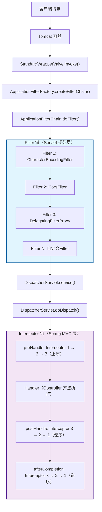
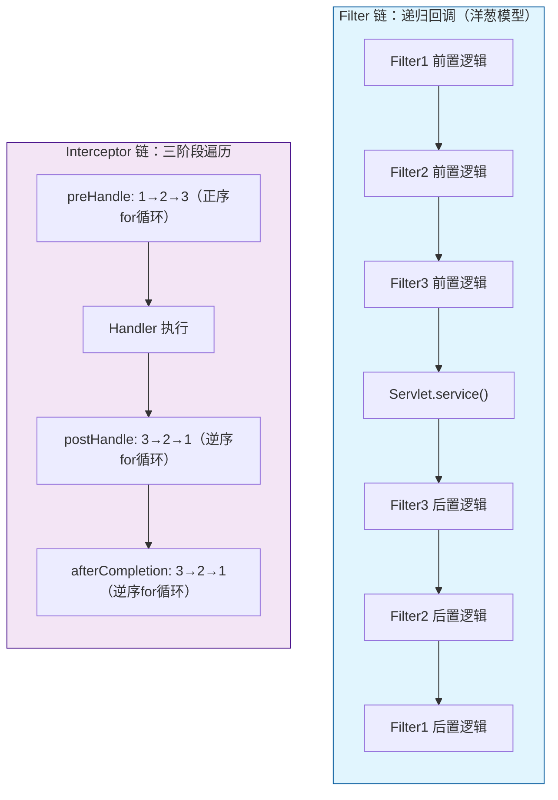
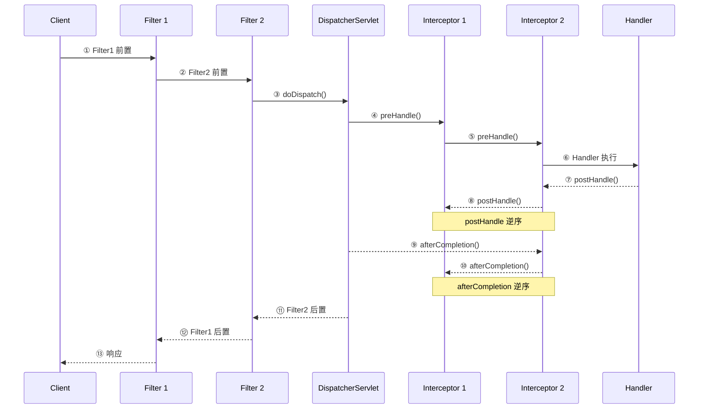
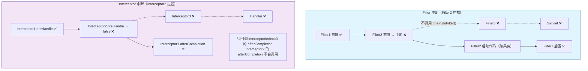
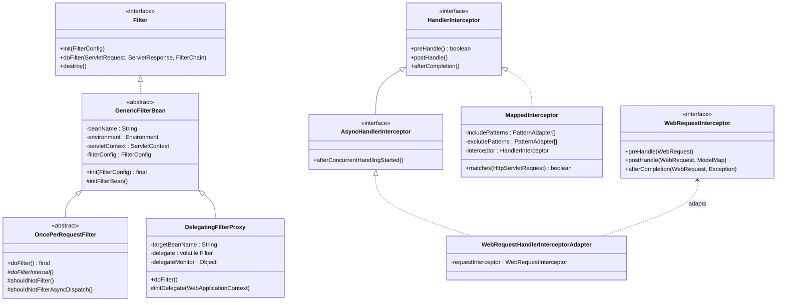
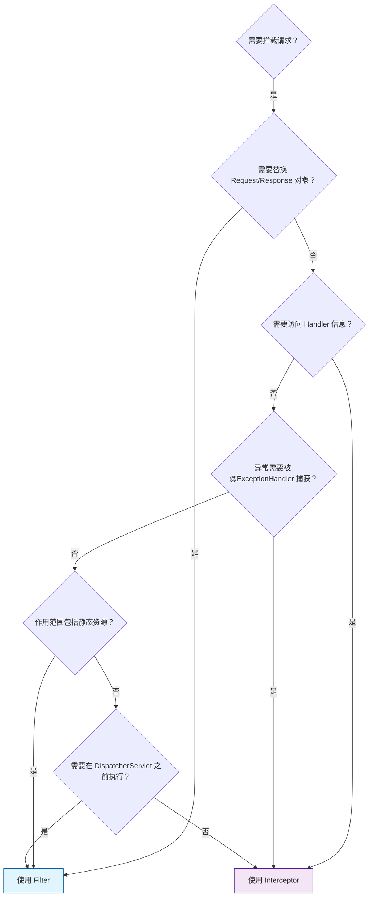

# Filter 与 Interceptor 完整对比深度分析

> **📍 文档导航** | [📚 返回目录](./README.md) | [⬅️ 上一篇：ExceptionHandler异常处理](./ExceptionHandler异常处理机制深度分析.md) | [➡️ 下一篇：面试题总结](./SpringMVC源码面试题总结.md)
>
> **📊 元信息** | 难度：⭐⭐⭐⭐ | 预估时间：1天 | 前置阅读：[① SpringMVC与Tomcat的关系详解](./SpringMVC与Tomcat的关系详解.md)（Servlet 层 Filter）+ [② DispatcherServlet](./DispatcherServlet核心源码深度分析.md)（Spring 层 Interceptor）
>
> **🎯 学习目标** | 面试必考题的终极答案，从源码层面彻底理清两者的区别

---

> 📁 **本地源码路径**：
> - Spring: `/data/workspace/spring-framework/`
> - Tomcat: `/data/workspace/tomcat/`

---

## 一、总体定位：为什么要对比 Filter 和 Interceptor？

### 1.1 面试高频问题

"Filter 和 Interceptor 的区别"是 Java 面试中出现频率最高的问题之一，但大多数回答停留在"Filter 属于 Servlet 规范，Interceptor 属于 Spring MVC"这种表面层次。

### 1.2 核心问题

本文要回答以下问题：
1. **它们各自在请求链路中的位置？** — 谁先执行、谁后执行、谁包着谁
2. **它们的调用机制有什么本质区别？** — Filter 的递归回调 vs Interceptor 的正向/逆向遍历
3. **异常处理行为有什么不同？** — Filter 的异常 vs Interceptor 的异常，分别去了哪里
4. **各自的数据结构和源码实现？** — ApplicationFilterChain vs HandlerExecutionChain
5. **实际开发中如何选择？** — 什么场景用 Filter，什么场景用 Interceptor

---

## 二、整体架构：请求链路中的位置关系

### 2.1 请求经过的完整链路



### 2.2 一句话总结

**Filter 包裹着 DispatcherServlet，Interceptor 运行在 DispatcherServlet 内部。** Filter 是大圈，Interceptor 是大圈里面的小圈。

---

## 三、Servlet Filter 源码分析

### 3.1 Filter 接口定义

```java
// 来自: tomcat/java/javax/servlet/Filter.java
public interface Filter {
    void init(FilterConfig filterConfig) throws ServletException;
    
    void doFilter(ServletRequest request, ServletResponse response, FilterChain chain)
            throws IOException, ServletException;
    
    void destroy();
}
```

三个生命周期方法：
- `init()` — 容器启动时调用一次（初始化资源）
- `doFilter()` — **每次请求**调用（核心过滤逻辑）
- `destroy()` — 容器关闭时调用一次（清理资源）

关键设计：`doFilter()` 接收 `FilterChain` 参数，通过 `chain.doFilter(request, response)` 决定是否放行。**不调用 = 拦截请求。**

### 3.2 FilterChain 接口

```java
// 来自: tomcat/java/javax/servlet/FilterChain.java
public interface FilterChain {
    void doFilter(ServletRequest request, ServletResponse response) 
            throws IOException, ServletException;
}
```

只有一个方法，职责：调用链中的下一个 Filter，或者最终调用 Servlet。

### 3.3 Tomcat 的 ApplicationFilterChain 实现

这是 Tomcat 对 `FilterChain` 接口的具体实现，是理解 Filter 调用机制的关键。

#### 3.3.1 核心数据结构

```java
// 来自: tomcat/java/org/apache/catalina/core/ApplicationFilterChain.java (L45-96)
public final class ApplicationFilterChain implements FilterChain {
    
    public static final int INCREMENT = 10;             // 数组扩容步长
    
    private ApplicationFilterConfig[] filters           // Filter 数组（非 ArrayList）
            = new ApplicationFilterConfig[0];
    private int pos = 0;                                // 当前执行位置（游标）
    private int n = 0;                                  // Filter 总数
    private Servlet servlet = null;                     // 链尾的 Servlet（如 DispatcherServlet）
    private boolean servletSupportsAsync = false;       // Servlet 是否支持异步
}
```

| 字段 | 类型 | 作用 |
|------|------|------|
| `filters` | `ApplicationFilterConfig[]` | 存储所有 Filter 的配置，**用原生数组而非 ArrayList** |
| `pos` | `int` | 游标，标记当前执行到第几个 Filter |
| `n` | `int` | Filter 总数，与 `pos` 配合判断是否遍历完 |
| `servlet` | `Servlet` | 链尾的 Servlet，所有 Filter 执行完后调用 `servlet.service()` |

**为什么用原生数组而不是 ArrayList？** 这是 Tomcat 在性能关键路径上的典型优化：
1. **热路径复用**：FilterChain 在 `ApplicationFilterFactory.createFilterChain()` 中通过 `req.getFilterChain()` 复用（非 SecurityManager 场景下不会每次 new），是每个请求都要经过的对象
2. **减少一层 rangeCheck**：原生数组的 `filters[pos++]` 直接索引访问，而 `ArrayList.get(i)` 内部会先执行 `rangeCheck(index)` 边界检查，在每个请求的 Filter 链遍历中省掉这层开销
3. **更保守的扩容策略**：`INCREMENT = 10`（固定步长扩容），而 ArrayList 默认按 1.5 倍扩容，在 Filter 数量通常不多（5-15 个）的场景下，固定步长更节省内存

#### 3.3.2 核心方法：internalDoFilter() — Filter 链的递归调用

```java
// 来自: tomcat/java/org/apache/catalina/core/ApplicationFilterChain.java (L160-226)
private void internalDoFilter(ServletRequest request, ServletResponse response)
        throws IOException, ServletException {

    // 还有 Filter 未执行 → 取出下一个并执行
    if (pos < n) {
        ApplicationFilterConfig filterConfig = filters[pos++];  // 取出并移动游标
        try {
            Filter filter = filterConfig.getFilter();
            // ...省略安全管理器相关代码...
            filter.doFilter(request, response, this);  // 关键：把 this（FilterChain 自身）传进去
        } catch (IOException | ServletException | RuntimeException e) {
            throw e;
        }
        return;  // Filter 内部会回调 chain.doFilter()，形成递归
    }

    // 所有 Filter 执行完 → 调用 Servlet
    try {
        servlet.service(request, response);  // 最终调用 DispatcherServlet.service()
    } catch (IOException | ServletException | RuntimeException e) {
        throw e;
    }
}
```

**核心机制：递归回调。** 每个 Filter 的 `doFilter()` 方法内部调用 `chain.doFilter()`，而 `chain` 就是 `this`（ApplicationFilterChain 自身），于是再次进入 `internalDoFilter()`，`pos++` 取出下一个 Filter。**这不是简单的 for 循环，而是通过方法调用栈形成的递归。**

```mermaid
flowchart LR
    A["internalDoFilter()<br/>pos=0 → Filter1"] --> B["Filter1.doFilter()"]
    B -->|"chain.doFilter()"| C["internalDoFilter()<br/>pos=1 → Filter2"]
    C --> D["Filter2.doFilter()"]
    D -->|"chain.doFilter()"| E["internalDoFilter()<br/>pos=2, pos≥n"]
    E --> F["servlet.service()"]
    F -->|返回| D2["Filter2 后置逻辑"]
    D2 -->|返回| B2["Filter1 后置逻辑"]
    B2 -->|返回| G["响应客户端"]
    
    style A fill:#e3f2fd
    style C fill:#e3f2fd
    style E fill:#e3f2fd
    style F fill:#fff3e0
```



**为什么 Filter 能在 `chain.doFilter()` 前后都执行逻辑？** 因为 `chain.doFilter()` 是一个方法调用，执行完后会回到调用者继续执行后续代码。这就是"洋葱模型"的本质。

#### 3.3.3 Filter 链的创建：ApplicationFilterFactory.createFilterChain()

```java
// 来自: tomcat/java/org/apache/catalina/core/ApplicationFilterFactory.java (L50-135)
public static ApplicationFilterChain createFilterChain(
        ServletRequest request, Wrapper wrapper, Servlet servlet) {
    
    // 1. 创建/复用 FilterChain
    ApplicationFilterChain filterChain = null;
    if (request instanceof Request) {
        Request req = (Request) request;
        filterChain = (ApplicationFilterChain) req.getFilterChain();  // 尝试复用
        if (filterChain == null) {
            filterChain = new ApplicationFilterChain();
            req.setFilterChain(filterChain);
        }
    }
    
    filterChain.setServlet(servlet);  // 设置链尾 Servlet
    
    // 2. 从 Context 获取所有 FilterMap（web.xml 或 @WebFilter 定义的映射关系）
    StandardContext context = (StandardContext) wrapper.getParent();
    FilterMap filterMaps[] = context.findFilterMaps();
    
    // 3. 先匹配 URL 模式
    for (FilterMap filterMap : filterMaps) {
        if (!matchDispatcher(filterMap, dispatcher)) continue;
        if (!matchFiltersURL(filterMap, requestPath)) continue;
        ApplicationFilterConfig filterConfig = 
                (ApplicationFilterConfig) context.findFilterConfig(filterMap.getFilterName());
        filterChain.addFilter(filterConfig);
    }
    
    // 4. 再匹配 Servlet 名称
    for (FilterMap filterMap : filterMaps) {
        if (!matchDispatcher(filterMap, dispatcher)) continue;
        if (!matchFiltersServlet(filterMap, servletName)) continue;
        ApplicationFilterConfig filterConfig = 
                (ApplicationFilterConfig) context.findFilterConfig(filterMap.getFilterName());
        filterChain.addFilter(filterConfig);
    }
    
    return filterChain;
}
```

**关键发现**：FilterChain **每次请求都重新构建**（基于 URL 匹配），先匹配 URL 模式再匹配 Servlet 名称。这意味着不同 URL 可能经过不同的 Filter 链。

### 3.4 Filter 的调用入口：StandardWrapperValve.invoke()

```java
// 来自: tomcat/java/org/apache/catalina/core/StandardWrapperValve.java (L87-168)
public void invoke(Request request, Response response) 
        throws IOException, ServletException {
    
    // 1. 分配 Servlet 实例
    Servlet servlet = wrapper.allocate();
    
    // 2. 创建 Filter 链
    ApplicationFilterChain filterChain = 
            ApplicationFilterFactory.createFilterChain(request, wrapper, servlet);
    
    // 3. 执行 Filter 链（最终会调用 Servlet.service()）
    filterChain.doFilter(request.getRequest(), response.getResponse());
}
```

这是整个请求进入 Filter 链的入口。Tomcat 的 `StandardWrapperValve` 负责创建 FilterChain 并启动执行。

---

## 四、Spring HandlerInterceptor 源码分析

### 4.1 HandlerInterceptor 接口定义

```java
// 来自: spring-webmvc/.../web/servlet/HandlerInterceptor.java (L75-153)
public interface HandlerInterceptor {

    // 在 Handler 执行之前调用，返回 false 则中断执行链
    default boolean preHandle(HttpServletRequest request, HttpServletResponse response, 
            Object handler) throws Exception {
        return true;
    }

    // 在 Handler 执行之后、视图渲染之前调用
    default void postHandle(HttpServletRequest request, HttpServletResponse response, 
            Object handler, @Nullable ModelAndView modelAndView) throws Exception {
    }

    // 在整个请求完成后调用（包括视图渲染后），只有 preHandle 返回 true 的才会被调用
    default void afterCompletion(HttpServletRequest request, HttpServletResponse response, 
            Object handler, @Nullable Exception ex) throws Exception {
    }
}
```

三个方法的调用时机与 Filter 有本质区别：

| 方法 | 调用时机 | 返回值意义 |
|------|---------|-----------|
| `preHandle` | HandlerMapping 匹配到 Handler 后，HandlerAdapter 调用 Handler **之前** | `true`=继续，`false`=中断 |
| `postHandle` | Handler 正常执行完毕后，视图渲染**之前** | 无（异常时不调用） |
| `afterCompletion` | 整个请求完成后（视图渲染后） | 无（**即使异常也调用**，但前提是 preHandle 返回了 true） |

### 4.2 AsyncHandlerInterceptor 接口

```java
// 来自: spring-webmvc/.../web/servlet/AsyncHandlerInterceptor.java (L60-79)
public interface AsyncHandlerInterceptor extends HandlerInterceptor {

    // 异步请求开始时调用，替代 postHandle 和 afterCompletion
    default void afterConcurrentHandlingStarted(HttpServletRequest request, 
            HttpServletResponse response, Object handler) throws Exception {
    }
}
```

当 Handler 启动异步处理时（如返回 `Callable`/`DeferredResult`），DispatcherServlet 主线程退出，**不会**调用 `postHandle` 和 `afterCompletion`，而是调用 `afterConcurrentHandlingStarted()`。等异步处理完成、请求再次 dispatch 回来时，三个方法才会正常调用。

### 4.3 HandlerExecutionChain — Interceptor 链的载体

#### 4.3.1 核心数据结构

```java
// 来自: spring-webmvc/.../web/servlet/HandlerExecutionChain.java (L41-49)
public class HandlerExecutionChain {

    private final Object handler;                                   // Handler 对象
    private final List<HandlerInterceptor> interceptorList          // Interceptor 列表
            = new ArrayList<>();
    private int interceptorIndex = -1;                              // 记录最后一个执行成功的 preHandle 的索引
}
```

| 字段 | 类型 | 作用 |
|------|------|------|
| `handler` | `Object` | Handler 对象（通常是 `HandlerMethod`） |
| `interceptorList` | `ArrayList<HandlerInterceptor>` | 所有 Interceptor，**有序** |
| `interceptorIndex` | `int` | **关键字段**：初始值 `-1`，每个 `preHandle` 成功后 +1，用于 `afterCompletion` 时确定回调范围 |

#### 4.3.2 applyPreHandle() — 正序遍历

```java
// 来自: spring-webmvc/.../web/servlet/HandlerExecutionChain.java (L145-155)
boolean applyPreHandle(HttpServletRequest request, HttpServletResponse response) throws Exception {
    for (int i = 0; i < this.interceptorList.size(); i++) {
        HandlerInterceptor interceptor = this.interceptorList.get(i);
        if (!interceptor.preHandle(request, response, this.handler)) {
            triggerAfterCompletion(request, response, null);  // preHandle 返回 false → 触发已通过的 afterCompletion
            return false;
        }
        this.interceptorIndex = i;  // 记录最后成功的索引
    }
    return true;
}
```

**关键逻辑**：
1. 正序遍历（0 → N）
2. 某个 `preHandle` 返回 `false` → 立即调用 `triggerAfterCompletion()`（只回调已成功的）→ 返回 `false`
3. `interceptorIndex` 记录最后成功的位置

#### 4.3.3 applyPostHandle() — 逆序遍历

```java
// 来自: spring-webmvc/.../web/servlet/HandlerExecutionChain.java (L160-167)
void applyPostHandle(HttpServletRequest request, HttpServletResponse response, 
        @Nullable ModelAndView mv) throws Exception {
    for (int i = this.interceptorList.size() - 1; i >= 0; i--) {
        HandlerInterceptor interceptor = this.interceptorList.get(i);
        interceptor.postHandle(request, response, this.handler, mv);
    }
}
```

**逆序遍历**（N → 0），保证后注册的 Interceptor 先执行 postHandle。

#### 4.3.4 triggerAfterCompletion() — 逆序 + 只回调成功的

```java
// 来自: spring-webmvc/.../web/servlet/HandlerExecutionChain.java (L174-184)
void triggerAfterCompletion(HttpServletRequest request, HttpServletResponse response, 
        @Nullable Exception ex) {
    for (int i = this.interceptorIndex; i >= 0; i--) {  // 从 interceptorIndex 开始，而非末尾
        HandlerInterceptor interceptor = this.interceptorList.get(i);
        try {
            interceptor.afterCompletion(request, response, this.handler, ex);
        }
        catch (Throwable ex2) {
            logger.error("HandlerInterceptor.afterCompletion threw exception", ex2);
            // 吞掉异常，继续回调其他的
        }
    }
}
```

**两个关键设计**：
1. 从 `interceptorIndex` 开始（而非末尾），只回调 `preHandle` 返回 `true` 的 Interceptor
2. **吞掉异常**（try-catch + 日志），保证每个成功的 Interceptor 的 `afterCompletion` 都能执行（类似 finally 的语义）

#### 4.3.5 applyAfterConcurrentHandlingStarted() — 异步场景

```java
// 来自: spring-webmvc/.../web/servlet/HandlerExecutionChain.java (L189-204)
void applyAfterConcurrentHandlingStarted(HttpServletRequest request, HttpServletResponse response) {
    for (int i = this.interceptorList.size() - 1; i >= 0; i--) {
        HandlerInterceptor interceptor = this.interceptorList.get(i);
        if (interceptor instanceof AsyncHandlerInterceptor) {
            try {
                AsyncHandlerInterceptor asyncInterceptor = (AsyncHandlerInterceptor) interceptor;
                asyncInterceptor.afterConcurrentHandlingStarted(request, response, this.handler);
            }
            catch (Throwable ex) {
                logger.error("Interceptor [" + interceptor + "] failed in afterConcurrentHandlingStarted", ex);
            }
        }
    }
}
```

逆序遍历，只调用实现了 `AsyncHandlerInterceptor` 接口的 Interceptor。

---

## 五、DispatcherServlet 中 Interceptor 的调用位置

```java
// 来自: spring-webmvc/.../web/servlet/DispatcherServlet.java (L1040-1111)
protected void doDispatch(HttpServletRequest request, HttpServletResponse response) throws Exception {
    HandlerExecutionChain mappedHandler = null;
    ModelAndView mv = null;
    Exception dispatchException = null;
    
    try {
        // 1. 查找 Handler（包含 Interceptor 链）
        mappedHandler = getHandler(processedRequest);                      // L1048
        HandlerAdapter ha = getHandlerAdapter(mappedHandler.getHandler()); // L1055
        
        // 2. 执行 Interceptor preHandle（正序）
        if (!mappedHandler.applyPreHandle(processedRequest, response)) {   // L1067
            return;  // 被拦截，直接返回
        }
        
        // 3. 执行 Handler
        mv = ha.handle(processedRequest, response, mappedHandler.getHandler());  // L1072
        
        // 4. 执行 Interceptor postHandle（逆序）
        mappedHandler.applyPostHandle(processedRequest, response, mv);     // L1079
    }
    catch (Exception ex) {
        dispatchException = ex;
    }
    
    // 5. 处理结果（包括异常处理 + 视图渲染）
    processDispatchResult(processedRequest, response, mappedHandler, mv, dispatchException);  // L1089
}

// processDispatchResult 的末尾：
// 来自: spring-webmvc/.../web/servlet/DispatcherServlet.java (L1166-1169)
if (mappedHandler != null) {
    // 6. 执行 Interceptor afterCompletion（逆序）
    mappedHandler.triggerAfterCompletion(request, response, null);
}
```

---

## 六、核心对比分析

### 6.1 调用机制对比



| 对比维度 | Filter | Interceptor |
|---------|--------|-------------|
| **调用方式** | **递归回调**：Filter 内部调用 `chain.doFilter()`，形成方法调用栈嵌套 | **三次 for 循环**：preHandle 正序、postHandle 逆序、afterCompletion 逆序 |
| **前后置逻辑** | 在 `chain.doFilter()` 的前/后写代码 | 分别在 `preHandle`/`postHandle`/`afterCompletion` 三个方法中实现 |
| **链式实现** | `ApplicationFilterChain`，用 `pos` 游标 + 递归 | `HandlerExecutionChain`，用 `interceptorIndex` + for 循环 |
| **数据结构** | `ApplicationFilterConfig[]`（原生数组） | `ArrayList<HandlerInterceptor>` |

### 6.2 规范层次对比

| 对比维度 | Filter | Interceptor |
|---------|--------|-------------|
| **规范** | Servlet 规范（`javax.servlet.Filter`） | Spring MVC 框架（`o.s.web.servlet.HandlerInterceptor`） |
| **容器依赖** | 由 Servlet 容器（Tomcat）管理 | 由 Spring 容器管理 |
| **注册方式** | `web.xml` / `@WebFilter` / `FilterRegistrationBean` | `WebMvcConfigurer.addInterceptors()` |
| **作用范围** | 所有到达 Servlet 容器的请求（包括静态资源） | 只有经过 DispatcherServlet 的请求 |
| **IoC 支持** | 原生不支持（需要 `DelegatingFilterProxy` 桥接） | 天然支持（就是 Spring Bean） |

### 6.3 异常处理对比

| 对比维度 | Filter | Interceptor |
|---------|--------|-------------|
| **异常去向** | 异常沿调用栈向上传播，最终到 Servlet 容器处理（Tomcat 默认返回 500 页面） | 被 DispatcherServlet catch → 交给 `HandlerExceptionResolver` 链处理 → 可返回统一 JSON |
| **@ExceptionHandler 能否捕获** | ❌ 不能（Filter 在 DispatcherServlet 外层） | ✅ 能（Interceptor 在 DispatcherServlet 内部） |
| **afterCompletion 保障** | 无专门保障（只能用 finally 块） | `triggerAfterCompletion()` 吞掉异常，保证每个都执行 |

**这是选择 Filter 还是 Interceptor 时最重要的考量之一**：如果需要异常被 `@ControllerAdvice` 统一处理，必须用 Interceptor。

### 6.4 参数访问能力对比

| 对比维度 | Filter | Interceptor |
|---------|--------|-------------|
| **Request/Response** | `ServletRequest` / `ServletResponse`（通用类型） | `HttpServletRequest` / `HttpServletResponse`（HTTP 专用） |
| **Handler 信息** | ❌ 无法获取（不知道请求会交给哪个 Controller） | ✅ `preHandle` 的 `handler` 参数可以拿到 `HandlerMethod`，进而获取 Controller 类、方法、注解 |
| **ModelAndView** | ❌ 无法获取 | ✅ `postHandle` 的 `modelAndView` 参数 |
| **Request/Response 替换** | ✅ 可以用 Wrapper 模式替换（如 `HttpServletRequestWrapper`） | ❌ 不能替换 |

### 6.5 执行顺序对比



---

## 七、Spring 对 Filter 的增强

### 7.1 GenericFilterBean — Filter 与 Spring 的桥梁

```java
// 来自: spring-web/.../web/filter/GenericFilterBean.java (L82-83)
public abstract class GenericFilterBean implements Filter, BeanNameAware, EnvironmentAware,
        EnvironmentCapable, ServletContextAware, InitializingBean, DisposableBean {
    
    @Nullable
    private String beanName;            // Spring Bean 名称
    @Nullable
    private Environment environment;    // Spring 环境
    @Nullable
    private ServletContext servletContext;
    @Nullable
    private FilterConfig filterConfig;
    private final Set<String> requiredProperties = new HashSet<>(4);
}
```

`GenericFilterBean` 实现了大量 Spring `*Aware` 接口，让 Filter 能够：
- 获取 Spring `Environment`（读取配置）
- 获取 `ServletContext`
- 作为 Spring Bean 被管理（`InitializingBean` / `DisposableBean`）

它的 `init()` 方法自动将 `web.xml` 的 `init-param` 映射为 Bean 属性：

```java
// 来自: spring-web/.../web/filter/GenericFilterBean.java (L211-244)
public final void init(FilterConfig filterConfig) throws ServletException {
    this.filterConfig = filterConfig;
    // 将 init-param 通过 BeanWrapper 设置为属性
    PropertyValues pvs = new FilterConfigPropertyValues(filterConfig, this.requiredProperties);
    if (!pvs.isEmpty()) {
        BeanWrapper bw = PropertyAccessorFactory.forBeanPropertyAccess(this);
        bw.setPropertyValues(pvs, true);
    }
    initFilterBean();  // 模板方法，子类覆盖
}
```

### 7.2 OncePerRequestFilter — 保证每次请求只执行一次

**为什么需要它？** 因为 Servlet 3.0 引入了 `DispatcherType.ASYNC`，一个请求可能在多个线程中触发 Filter。`OncePerRequestFilter` 用 Request Attribute 作为标记，保证同一请求只过滤一次。

```java
// 来自: spring-web/.../web/filter/OncePerRequestFilter.java (L69-124)
public abstract class OncePerRequestFilter extends GenericFilterBean {

    public static final String ALREADY_FILTERED_SUFFIX = ".FILTERED";

    @Override
    public final void doFilter(ServletRequest request, ServletResponse response, 
            FilterChain filterChain) throws ServletException, IOException {
        
        HttpServletRequest httpRequest = (HttpServletRequest) request;
        HttpServletResponse httpResponse = (HttpServletResponse) response;
        
        String alreadyFilteredAttributeName = getAlreadyFilteredAttributeName();
        boolean hasAlreadyFilteredAttribute = 
                request.getAttribute(alreadyFilteredAttributeName) != null;
        
        if (skipDispatch(httpRequest) || shouldNotFilter(httpRequest)) {
            filterChain.doFilter(request, response);  // 跳过，直接放行
        }
        else if (hasAlreadyFilteredAttribute) {
            filterChain.doFilter(request, response);  // 已处理过，直接放行
        }
        else {
            // 首次执行：设置标记 → 执行过滤 → 移除标记
            request.setAttribute(alreadyFilteredAttributeName, Boolean.TRUE);
            try {
                doFilterInternal(httpRequest, httpResponse, filterChain);  // 子类实现
            }
            finally {
                request.removeAttribute(alreadyFilteredAttributeName);
            }
        }
    }
    
    // 子类只需实现这个方法
    protected abstract void doFilterInternal(
            HttpServletRequest request, HttpServletResponse response, FilterChain filterChain)
            throws ServletException, IOException;
}
```

**核心机制**：用 `request.setAttribute(filterName + ".FILTERED", true)` 作为标记。每次进入 `doFilter()` 先检查标记，有则跳过，无则设置标记并执行 `doFilterInternal()`。

### 7.3 DelegatingFilterProxy — 连接 Servlet 容器与 Spring 容器

**问题**：Servlet 容器管理 Filter 的生命周期，但 Filter 可能需要注入 Spring Bean。二者的生命周期不同步。

**解决方案**：`DelegatingFilterProxy` 在 Servlet 容器中注册，运行时从 Spring 容器中找到真正的 Filter Bean 并委托执行。

```java
// 来自: spring-web/.../web/filter/DelegatingFilterProxy.java (L83-99)
public class DelegatingFilterProxy extends GenericFilterBean {

    @Nullable
    private String contextAttribute;            // WebApplicationContext 的 ServletContext 属性名
    @Nullable
    private WebApplicationContext webApplicationContext;
    @Nullable
    private String targetBeanName;              // 目标 Filter 的 Bean 名称
    private boolean targetFilterLifecycle = false;  // 是否委托生命周期
    @Nullable
    private volatile Filter delegate;           // 真正的 Filter（懒加载，volatile 保证可见性）
    private final Object delegateMonitor = new Object();  // 双重检查锁的监视器
}
```

核心 `doFilter()` 方法：

```java
// 来自: spring-web/.../web/filter/DelegatingFilterProxy.java (L246-268)
@Override
public void doFilter(ServletRequest request, ServletResponse response, FilterChain filterChain)
        throws ServletException, IOException {
    
    // 懒加载委托 Filter（双重检查锁）
    Filter delegateToUse = this.delegate;
    if (delegateToUse == null) {
        synchronized (this.delegateMonitor) {
            delegateToUse = this.delegate;
            if (delegateToUse == null) {
                WebApplicationContext wac = findWebApplicationContext();
                delegateToUse = initDelegate(wac);  // 从 Spring 容器获取 Filter Bean
            }
            this.delegate = delegateToUse;
        }
    }
    invokeDelegate(delegateToUse, request, response, filterChain);  // 委托执行
}

// initDelegate 从 Spring 容器获取 Bean
// 来自: spring-web/.../web/filter/DelegatingFilterProxy.java (L331-338)
protected Filter initDelegate(WebApplicationContext wac) throws ServletException {
    String targetBeanName = getTargetBeanName();
    Filter delegate = wac.getBean(targetBeanName, Filter.class);  // 关键：从 Spring 容器获取
    if (isTargetFilterLifecycle()) {
        delegate.init(getFilterConfig());
    }
    return delegate;
}
```

**典型使用场景**：Spring Security 的 `springSecurityFilterChain` 就是通过 `DelegatingFilterProxy` 注册到 Servlet 容器中的。

---

## 八、MappedInterceptor — Interceptor 的路径匹配

### 8.1 设计目的

`HandlerInterceptor` 本身没有路径匹配能力，它对所有经过的请求都生效。`MappedInterceptor` 包装了一个 `HandlerInterceptor`，增加了 include/exclude 路径模式匹配。

### 8.2 核心数据结构

```java
// 来自: spring-webmvc/.../web/servlet/handler/MappedInterceptor.java (L62-75)
public final class MappedInterceptor implements HandlerInterceptor {

    private static final PathMatcher defaultPathMatcher = new AntPathMatcher();
    
    @Nullable
    private final PatternAdapter[] includePatterns;  // 包含路径
    @Nullable
    private final PatternAdapter[] excludePatterns;  // 排除路径
    private PathMatcher pathMatcher = defaultPathMatcher;
    private final HandlerInterceptor interceptor;    // 被包装的 Interceptor
}
```

### 8.3 匹配逻辑

```java
// 来自: spring-webmvc/.../web/servlet/handler/MappedInterceptor.java (L186-208)
public boolean matches(HttpServletRequest request) {
    Object path = ServletRequestPathUtils.getCachedPath(request);
    boolean isPathContainer = (path instanceof PathContainer);
    
    // 1. 先检查排除模式（匹配到 → 不拦截）
    if (!ObjectUtils.isEmpty(this.excludePatterns)) {
        for (PatternAdapter adapter : this.excludePatterns) {
            if (adapter.match(path, isPathContainer, this.pathMatcher)) {
                return false;  // 命中排除 → 不拦截
            }
        }
    }
    // 2. 没有包含模式 → 拦截所有
    if (ObjectUtils.isEmpty(this.includePatterns)) {
        return true;
    }
    // 3. 检查包含模式
    for (PatternAdapter adapter : this.includePatterns) {
        if (adapter.match(path, isPathContainer, this.pathMatcher)) {
            return true;  // 命中包含 → 拦截
        }
    }
    return false;
}
```

**匹配优先级**：exclude 优先于 include（先排除再包含）。

---

## 九、Interceptor 的注册机制

### 9.1 WebMvcConfigurer.addInterceptors()

```java
// 使用示例
@Configuration
public class WebConfig implements WebMvcConfigurer {
    @Override
    public void addInterceptors(InterceptorRegistry registry) {
        registry.addInterceptor(new AuthInterceptor())
                .addPathPatterns("/api/**")
                .excludePathPatterns("/api/login", "/api/public/**")
                .order(1);
    }
}
```

### 9.2 InterceptorRegistry — 注册中心

```java
// 来自: spring-webmvc/.../config/annotation/InterceptorRegistry.java (L37-86)
public class InterceptorRegistry {
    
    private final List<InterceptorRegistration> registrations = new ArrayList<>();
    
    public InterceptorRegistration addInterceptor(HandlerInterceptor interceptor) {
        InterceptorRegistration registration = new InterceptorRegistration(interceptor);
        this.registrations.add(registration);
        return registration;  // 返回 Registration 对象，支持链式调用
    }
    
    protected List<Object> getInterceptors() {
        return this.registrations.stream()
                .sorted(INTERCEPTOR_ORDER_COMPARATOR)  // 按 order 排序
                .map(InterceptorRegistration::getInterceptor)
                .collect(Collectors.toList());
    }
}
```

### 9.3 InterceptorRegistration — 单个 Interceptor 的配置

```java
// 来自: spring-webmvc/.../config/annotation/InterceptorRegistration.java (L40-161)
public class InterceptorRegistration {
    
    private final HandlerInterceptor interceptor;
    @Nullable
    private List<String> includePatterns;
    @Nullable
    private List<String> excludePatterns;
    @Nullable
    private PathMatcher pathMatcher;
    private int order = 0;  // 默认顺序

    // 构建最终的 Interceptor
    protected Object getInterceptor() {
        if (this.includePatterns == null && this.excludePatterns == null) {
            return this.interceptor;  // 无路径配置 → 返回原始 Interceptor
        }
        // 有路径配置 → 包装为 MappedInterceptor
        MappedInterceptor mappedInterceptor = new MappedInterceptor(
                StringUtils.toStringArray(this.includePatterns),
                StringUtils.toStringArray(this.excludePatterns),
                this.interceptor);
        return mappedInterceptor;
    }
}
```

**设计亮点**：`getInterceptor()` 根据是否配置了路径模式，自动决定返回原始 `HandlerInterceptor` 还是包装后的 `MappedInterceptor`。

---

## 十、WebRequestInterceptor 与适配器模式

### 10.1 WebRequestInterceptor 接口

```java
// 来自: spring-web/.../web/context/request/WebRequestInterceptor.java (L49-85)
public interface WebRequestInterceptor {
    void preHandle(WebRequest request) throws Exception;
    void postHandle(WebRequest request, @Nullable ModelMap model) throws Exception;
    void afterCompletion(WebRequest request, @Nullable Exception ex) throws Exception;
}
```

与 `HandlerInterceptor` 的区别：
- 使用 `WebRequest`（抽象）而非 `HttpServletRequest`（Servlet 专用），**不依赖 Servlet API**
- `preHandle` **没有返回值**（不能中断请求链）
- `postHandle` 使用 `ModelMap` 而非 `ModelAndView`

### 10.2 WebRequestHandlerInterceptorAdapter — 适配器

```java
// 来自: spring-webmvc/.../handler/WebRequestHandlerInterceptorAdapter.java (L38-85)
public class WebRequestHandlerInterceptorAdapter implements AsyncHandlerInterceptor {

    private final WebRequestInterceptor requestInterceptor;

    @Override
    public boolean preHandle(HttpServletRequest request, HttpServletResponse response, 
            Object handler) throws Exception {
        this.requestInterceptor.preHandle(new DispatcherServletWebRequest(request, response));
        return true;  // 始终返回 true（因为 WebRequestInterceptor.preHandle 没有返回值）
    }
    
    @Override
    public void postHandle(HttpServletRequest request, HttpServletResponse response, 
            Object handler, @Nullable ModelAndView modelAndView) throws Exception {
        this.requestInterceptor.postHandle(
                new DispatcherServletWebRequest(request, response),
                (modelAndView != null && !modelAndView.wasCleared() 
                        ? modelAndView.getModelMap() : null));
    }
}
```

**适配器模式**：将 `WebRequestInterceptor` 适配为 `HandlerInterceptor`，使其能被 `HandlerExecutionChain` 统一调用。注意 `preHandle` 始终返回 `true`。

---

## 十一、中断行为对比

### 11.1 Filter 中断

```java
public class AuthFilter implements Filter {
    @Override
    public void doFilter(ServletRequest request, ServletResponse response, FilterChain chain)
            throws IOException, ServletException {
        if (!isAuthenticated(request)) {
            ((HttpServletResponse) response).sendError(401, "Unauthorized");
            return;  // 不调用 chain.doFilter() = 中断
        }
        chain.doFilter(request, response);  // 放行
    }
}
```

**中断方式**：不调用 `chain.doFilter()`，请求不会到达后续 Filter 和 Servlet。

### 11.2 Interceptor 中断

```java
public class AuthInterceptor implements HandlerInterceptor {
    @Override
    public boolean preHandle(HttpServletRequest request, HttpServletResponse response, 
            Object handler) throws Exception {
        if (!isAuthenticated(request)) {
            response.setStatus(401);
            response.getWriter().write("{\"error\":\"Unauthorized\"}");
            return false;  // 返回 false = 中断
        }
        return true;
    }
}
```

**中断方式**：`preHandle` 返回 `false`，DispatcherServlet 不会执行 Handler 和后续 Interceptor 的 `preHandle`，但会调用已通过的 Interceptor 的 `afterCompletion`。

### 11.3 关键区别



| 维度 | Filter 中断 | Interceptor 中断 |
|------|------------|-----------------|
| **中断方式** | 不调用 `chain.doFilter()` | `preHandle` 返回 `false` |
| **上游感知** | 上游 Filter 通过调用栈返回感知（`chain.doFilter()` 返回后继续执行后置逻辑） | 中断后调用已通过的 Interceptor 的 `afterCompletion` |
| **资源清理** | 上游 Filter 的 finally 块 | `afterCompletion`（专门的清理回调） |

---

## 十二、完整类继承体系



---

## 十三、设计模式总结

| 设计模式 | 应用位置 | 说明 |
|---------|---------|------|
| **责任链模式** | `ApplicationFilterChain`、`HandlerExecutionChain` | Filter 链和 Interceptor 链都是责任链的变体 |
| **模板方法模式** | `GenericFilterBean.init()` → `initFilterBean()`、`OncePerRequestFilter.doFilter()` → `doFilterInternal()` | 固定流程（init/检查标记），子类只实现核心逻辑 |
| **代理/委托模式** | `DelegatingFilterProxy` | 代理 Servlet 容器中的 Filter，委托给 Spring Bean |
| **适配器模式** | `WebRequestHandlerInterceptorAdapter` | 将 `WebRequestInterceptor` 适配为 `HandlerInterceptor` |
| **装饰器模式** | `MappedInterceptor` | 为 `HandlerInterceptor` 增加路径匹配能力 |

---

## 十四、面试 Q&A

### Q1：Filter 和 Interceptor 的根本区别？

**A**：
1. **规范层次不同**：Filter 是 Servlet 规范（`javax.servlet.Filter`），由 Tomcat 管理；Interceptor 是 Spring MVC 框架接口（`HandlerInterceptor`），由 Spring 管理
2. **执行位置不同**：Filter 包裹 DispatcherServlet（在外层），Interceptor 在 DispatcherServlet 内部
3. **调用机制不同**：Filter 是递归回调（洋葱模型），Interceptor 是三阶段 for 循环
4. **异常处理不同**：Filter 异常直接到 Servlet 容器，Interceptor 异常能被 `@ExceptionHandler` 捕获

### Q2：为什么 Interceptor 的 afterCompletion 要吞掉异常？

**A**：源码在 `HandlerExecutionChain.triggerAfterCompletion()` 中 `catch (Throwable ex2)` 并只记日志。目的是**保证所有已通过 preHandle 的 Interceptor 都能执行 afterCompletion**，避免一个 Interceptor 的清理异常导致其他 Interceptor 无法清理资源（如数据库连接、ThreadLocal 等）。

### Q3：OncePerRequestFilter 解决了什么问题？

**A**：Servlet 3.0 引入 `ASYNC` DispatcherType 后，同一个请求可能在多个线程中多次触发 Filter。`OncePerRequestFilter` 通过 Request Attribute（`filterName + ".FILTERED"`）作为标记，保证 `doFilterInternal()` 只执行一次。

### Q4：DelegatingFilterProxy 的作用？

**A**：桥接 Servlet 容器和 Spring 容器。Servlet 容器在启动时创建 Filter，但此时 Spring 容器可能还没初始化完成。`DelegatingFilterProxy` 通过**懒加载 + 双重检查锁**从 Spring 容器获取真正的 Filter Bean，解决生命周期不同步问题。典型使用者：Spring Security 的 `springSecurityFilterChain`。

### Q5：Interceptor 的 preHandle 返回 false 后，哪些 afterCompletion 会被调用？

**A**：只有 `interceptorIndex` 范围内的（即 preHandle 返回了 `true` 的）。源码在 `HandlerExecutionChain.applyPreHandle()` 中，`interceptorIndex` 在每个成功的 `preHandle` 后才 +1，而 `triggerAfterCompletion()` 从 `interceptorIndex` 逆序回调。返回 `false` 的那个 Interceptor 的 `afterCompletion` **不会**被调用。

### Q6：Filter 能访问 Handler（Controller）信息吗？

**A**：不能。Filter 在 DispatcherServlet 之前执行，此时还没有执行 `getHandler()`（HandlerMapping 查找），所以不知道请求会交给哪个 Controller。如果需要根据 Controller 方法上的注解做逻辑判断，必须用 Interceptor。

---

## 十五、最佳实践：如何选择

### 适合用 Filter 的场景

| 场景 | 原因 | 示例 |
|------|------|------|
| 字符编码设置 | 越早设置越好，需要在所有处理之前 | `CharacterEncodingFilter` |
| CORS 跨域处理 | 需要在 DispatcherServlet 之前处理 OPTIONS 预检请求 | `CorsFilter` |
| GZIP 压缩 | 需要替换 Response 对象（Wrapper） | `ShallowEtagHeaderFilter` |
| 请求/响应日志 | 需要记录原始请求体，可能需要 RequestWrapper 缓存 body | `ContentCachingRequestWrapper` |
| 安全框架集成 | Spring Security 整个框架就是 Filter 链 | `DelegatingFilterProxy` |

### 适合用 Interceptor 的场景

| 场景 | 原因 | 示例 |
|------|------|------|
| 权限校验 | 需要根据 Handler 上的注解（如 `@RequirePermission`）判断 | 自定义 `AuthInterceptor` |
| 接口耗时统计 | 需要知道具体是哪个 Controller 方法 | 自定义 `PerformanceInterceptor` |
| 登录状态检查 | 需要排除 `/login`、`/register` 等路径 | 自定义 `LoginInterceptor` |
| 操作日志记录 | 需要获取 HandlerMethod 的方法名、参数等 | 自定义 `AuditLogInterceptor` |
| 通用参数注入 | 在 preHandle 中设置 Request Attribute | 自定义 `TenantInterceptor` |

### 决策流程图



---

## 十六、完整对比总结表

| 对比维度 | Filter | Interceptor |
|---------|--------|-------------|
| **规范** | Servlet 规范 | Spring MVC 框架 |
| **接口** | `javax.servlet.Filter` | `o.s.web.servlet.HandlerInterceptor` |
| **容器** | Servlet 容器（Tomcat） | Spring 容器 |
| **执行位置** | DispatcherServlet 外层 | DispatcherServlet 内部 |
| **作用范围** | 所有请求（包括静态资源） | 只有 DispatcherServlet 处理的请求 |
| **调用机制** | 递归回调（洋葱模型） | 三阶段 for 循环 |
| **链式数据结构** | `ApplicationFilterConfig[]` + `pos` 游标 | `ArrayList<HandlerInterceptor>` + `interceptorIndex` |
| **IoC 支持** | 需要 `DelegatingFilterProxy` 桥接 | 天然支持 |
| **Handler 访问** | ❌ | ✅ 可获取 `HandlerMethod` |
| **Request 替换** | ✅ Wrapper 模式 | ❌ |
| **异常处理** | 到 Servlet 容器 | 到 `@ExceptionHandler` |
| **中断方式** | 不调用 `chain.doFilter()` | `preHandle` 返回 `false` |
| **清理保障** | finally 块 | `afterCompletion`（吞异常保证执行） |
| **异步支持** | `shouldNotFilterAsyncDispatch()` | `AsyncHandlerInterceptor.afterConcurrentHandlingStarted()` |
| **注册方式** | `@WebFilter` / `FilterRegistrationBean` | `WebMvcConfigurer.addInterceptors()` |
| **路径匹配** | URL 模式 / Servlet 名称 | `MappedInterceptor`（include/exclude） |
