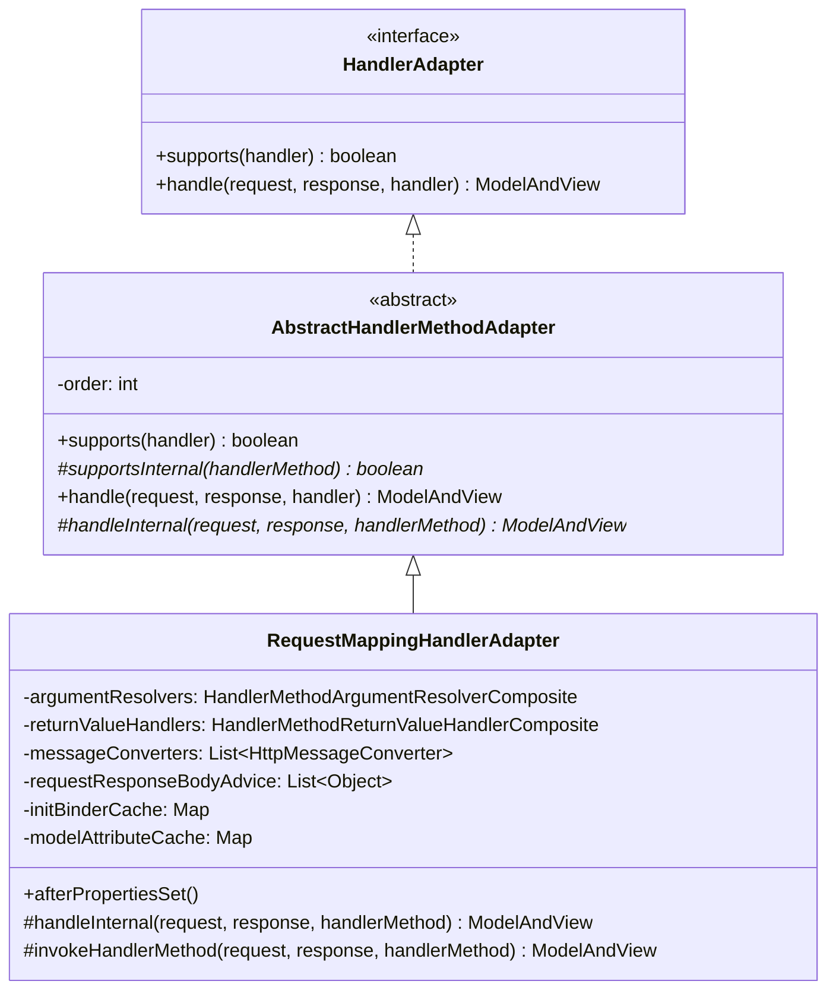
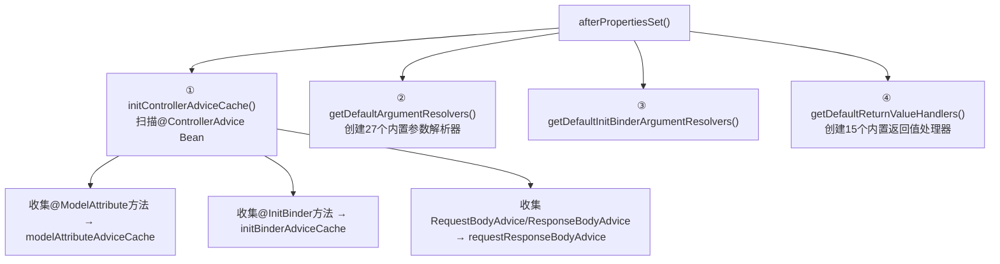
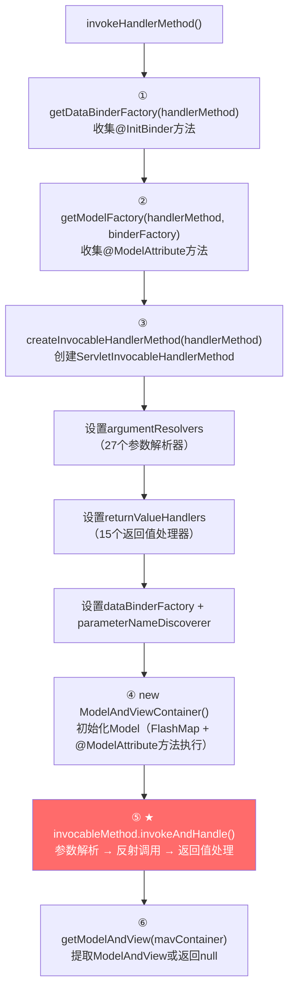
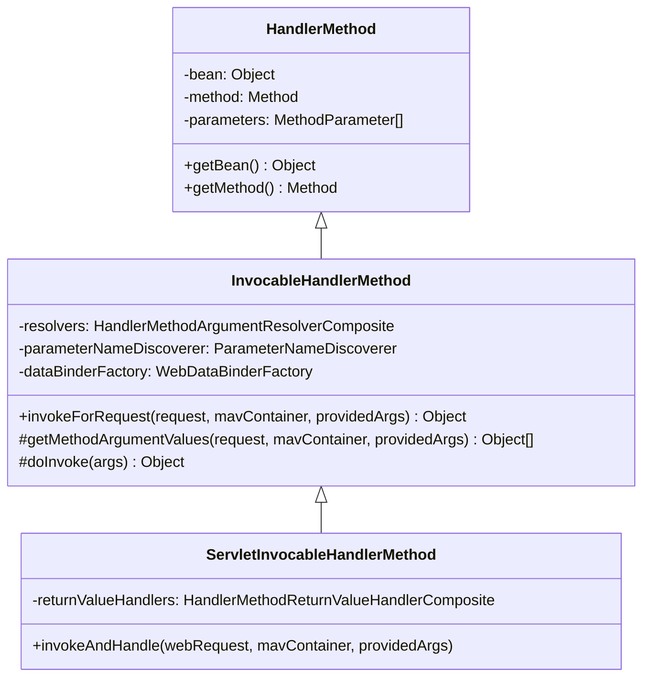
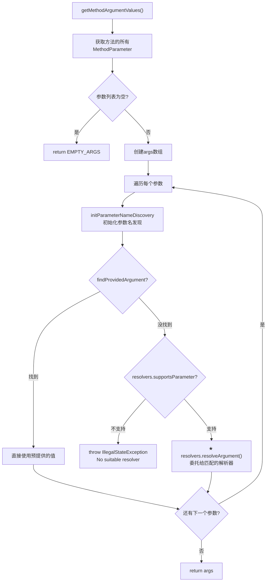
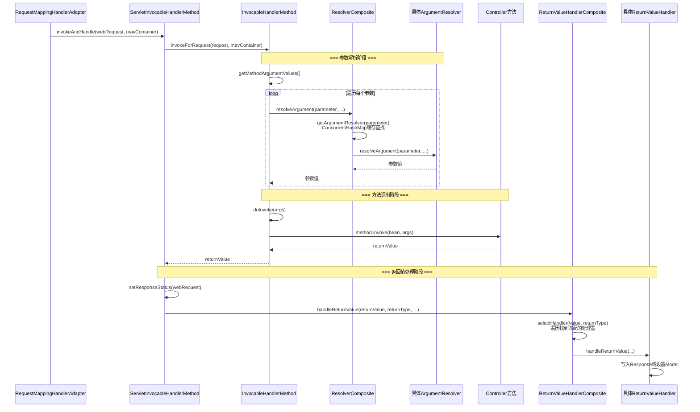
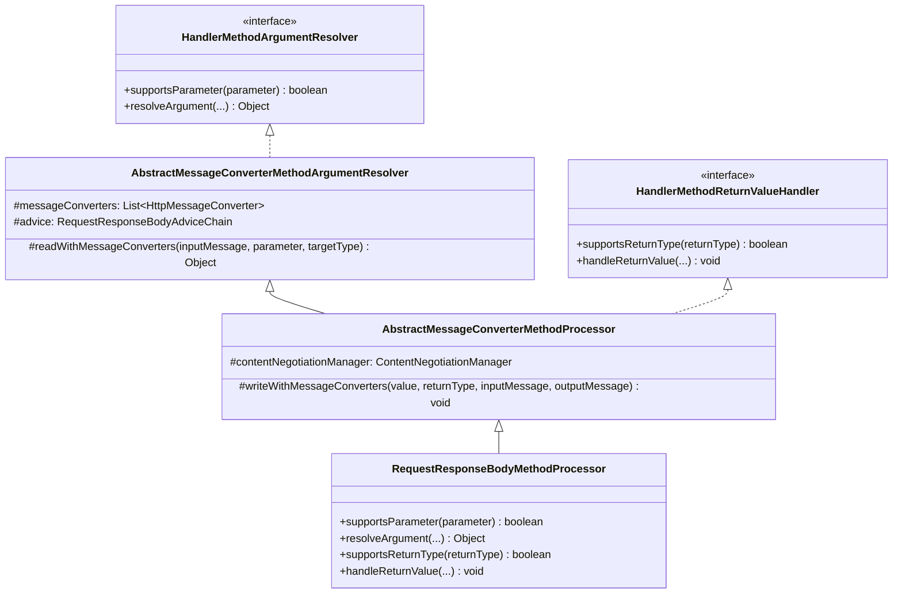
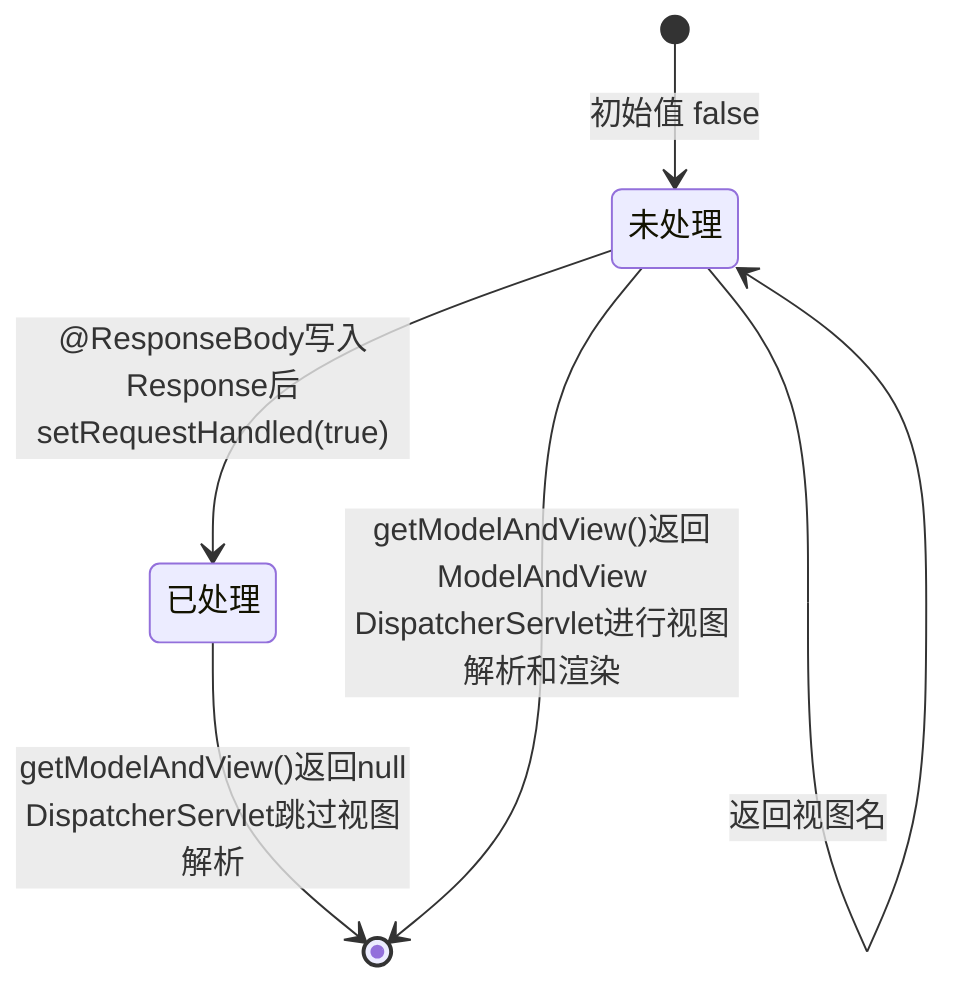
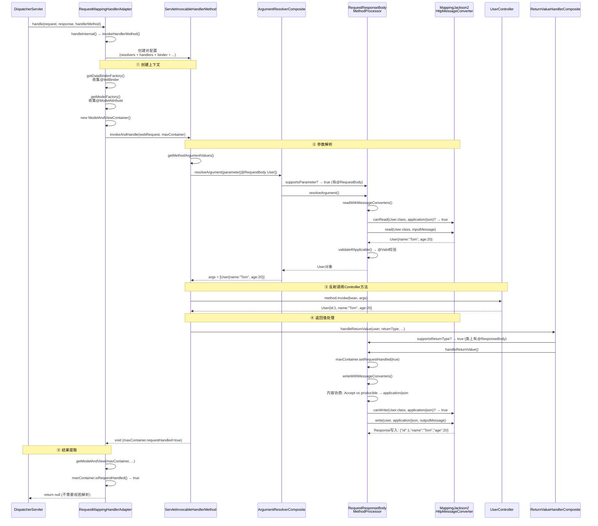
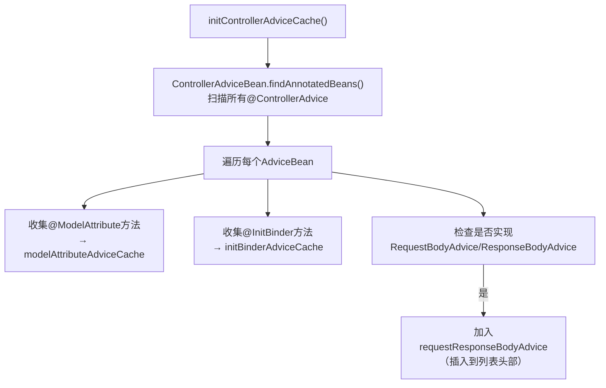

# HandlerAdapter 核心源码深度分析

> **📍 文档导航** | [📚 返回目录](./README.md) | [⬅️ 上一篇：HandlerMapping](./HandlerMapping核心源码深度分析.md) | [➡️ 下一篇：参数解析与返回值处理](./参数解析与返回值处理深度分析.md)
>
> **📊 元信息** | 难度：⭐⭐⭐⭐⭐ | 预估时间：1-2天 | 前置阅读：[① SpringMVC与Tomcat的关系详解](./SpringMVC与Tomcat的关系详解.md) · [② DispatcherServlet](./DispatcherServlet核心源码深度分析.md) · [③ HandlerMapping](./HandlerMapping核心源码深度分析.md)
>
> **🎯 学习目标** | 理解连接 "找到 Handler" 和 "执行 Handler" 的桥梁，是参数解析和返回值处理的入口

---

> 📁 **本地源码路径**：`/data/workspace/spring-framework/spring-webmvc/` 和 `spring-web/`
>
> **核心问题**：**Spring MVC 找到了 Controller 方法后，如何调用它？参数从哪来？返回值怎么处理？**

---

## 一、总体定位

`HandlerAdapter` 是 DispatcherServlet 九大策略组件中**第二个被调用**的组件。在 `DispatcherServlet.doDispatch()` 中：

```java
// 来自: spring-webmvc/.../DispatcherServlet.java L1031-1112
HandlerExecutionChain mappedHandler = getHandler(processedRequest);    // ① HandlerMapping找handler
HandlerAdapter ha = getHandlerAdapter(mappedHandler.getHandler());     // ② HandlerAdapter适配handler
ModelAndView mv = ha.handle(processedRequest, response, mappedHandler.getHandler()); // ③ 执行handler
```

**为什么需要 HandlerAdapter？** 因为 handler 的类型是 `Object`，可能是 `HandlerMethod`（注解方式）、`Controller`（接口方式）、`HttpRequestHandler`（函数式）等。适配器模式解耦了 DispatcherServlet 与具体 handler 类型。

**HandlerAdapter 要回答的核心问题**：

| 问题 | 答案 |
|------|------|
| `UserController.getUser(Long id)` 的参数 `id` 从哪来？ | `@PathVariable` → 从 URI 模板变量中提取 |
| 参数 `@RequestBody User user` 的 JSON 怎么变成 Java 对象？ | `HttpMessageConverter`（Jackson）反序列化 |
| 返回值 `User` 对象怎么变成 JSON 响应？ | `@ResponseBody` + `HttpMessageConverter` 序列化 |
| 方法返回 `"redirect:/login"` 怎么处理？ | `ViewNameMethodReturnValueHandler` 处理视图名 |

---

## 二、整体架构



**继承链只有三层**（比 HandlerMapping 简单）：

| 层级 | 类名 | 行数 | 核心职责 |
|------|------|------|---------|
| 接口 | `HandlerAdapter` | 93行 | 定义契约：supports + handle |
| 抽象基类 | `AbstractHandlerMethodAdapter` | 125行 | 类型检查（handler必须是HandlerMethod） |
| 核心实现 | `RequestMappingHandlerAdapter` | 1032行 | 参数解析 + 方法调用 + 返回值处理（**重点**） |

---

## 三、HandlerAdapter 接口（93行）

```java
// 来自: spring-webmvc/.../HandlerAdapter.java L50-92
public interface HandlerAdapter {

    // ① 是否支持该handler（适配器模式的核心）
    boolean supports(Object handler);

    // ② 执行handler，返回ModelAndView
    @Nullable
    ModelAndView handle(HttpServletRequest request, HttpServletResponse response, Object handler) throws Exception;

    // ③ 已废弃（5.3.9）
    @Deprecated
    long getLastModified(HttpServletRequest request, Object handler);
}
```

**接口极简**：只有 `supports()` 和 `handle()` 两个核心方法。DispatcherServlet 通过 `supports()` 找到匹配的适配器，再调用 `handle()` 执行。

---

## 四、AbstractHandlerMethodAdapter（125行）

```java
// 来自: spring-webmvc/.../mvc/method/AbstractHandlerMethodAdapter.java L36-124
public abstract class AbstractHandlerMethodAdapter extends WebContentGenerator
        implements HandlerAdapter, Ordered {

    private int order = Ordered.LOWEST_PRECEDENCE;

    // ★ 关键：类型检查 + 委托
    @Override
    public final boolean supports(Object handler) {
        return (handler instanceof HandlerMethod && supportsInternal((HandlerMethod) handler));
    }

    protected abstract boolean supportsInternal(HandlerMethod handlerMethod);

    @Override
    @Nullable
    public final ModelAndView handle(HttpServletRequest request, HttpServletResponse response, Object handler)
            throws Exception {
        return handleInternal(request, response, (HandlerMethod) handler);
    }

    @Nullable
    protected abstract ModelAndView handleInternal(HttpServletRequest request,
            HttpServletResponse response, HandlerMethod handlerMethod) throws Exception;
}
```

**这层做了什么？** 只做一件事：**把 `Object handler` 强转为 `HandlerMethod`**，然后委托给子类。是典型的**模板方法模式**。

---

## 五、RequestMappingHandlerAdapter（1032行）★★★

这是整个 HandlerAdapter 体系的**核心实现**，1032 行代码，承载了参数解析、方法调用、返回值处理的全部逻辑。

### 5.1 核心字段

```java
// 来自: spring-webmvc/.../mvc/method/annotation/RequestMappingHandlerAdapter.java L118-201
public class RequestMappingHandlerAdapter extends AbstractHandlerMethodAdapter
        implements BeanFactoryAware, InitializingBean {

    // ===== 三大核心组件 =====

    // ① 参数解析器组合（27个内置解析器）
    @Nullable
    private HandlerMethodArgumentResolverComposite argumentResolvers;

    // ② 返回值处理器组合（15个内置处理器）
    @Nullable
    private HandlerMethodReturnValueHandlerComposite returnValueHandlers;

    // ③ 消息转换器列表（处理@RequestBody/@ResponseBody的JSON/XML序列化）
    private List<HttpMessageConverter<?>> messageConverters;

    // ===== 辅助组件 =====

    // @ControllerAdvice 中的 RequestBodyAdvice / ResponseBodyAdvice
    private final List<Object> requestResponseBodyAdvice = new ArrayList<>();

    // @InitBinder 方法的参数解析器（比argumentResolvers少一些）
    @Nullable
    private HandlerMethodArgumentResolverComposite initBinderArgumentResolvers;

    // 内容协商管理器
    private ContentNegotiationManager contentNegotiationManager = new ContentNegotiationManager();

    // 数据绑定初始化器
    @Nullable
    private WebBindingInitializer webBindingInitializer;

    // 参数名发现器（反射获取方法参数名）
    private ParameterNameDiscoverer parameterNameDiscoverer = new DefaultParameterNameDiscoverer();

    // ===== 缓存（ConcurrentHashMap，运行时避免重复查找）=====

    // Controller类 → @SessionAttributes处理器
    private final Map<Class<?>, SessionAttributesHandler> sessionAttributesHandlerCache = new ConcurrentHashMap<>(64);

    // Controller类 → @InitBinder方法集合
    private final Map<Class<?>, Set<Method>> initBinderCache = new ConcurrentHashMap<>(64);

    // @ControllerAdvice Bean → @InitBinder方法集合
    private final Map<ControllerAdviceBean, Set<Method>> initBinderAdviceCache = new LinkedHashMap<>();

    // Controller类 → @ModelAttribute方法集合
    private final Map<Class<?>, Set<Method>> modelAttributeCache = new ConcurrentHashMap<>(64);

    // @ControllerAdvice Bean → @ModelAttribute方法集合
    private final Map<ControllerAdviceBean, Set<Method>> modelAttributeAdviceCache = new LinkedHashMap<>();
}
```

**字段分类总结**：

| 分类 | 字段 | 数据结构 | 作用 |
|------|------|---------|------|
| 核心组件 | `argumentResolvers` | Composite（内含27个resolver的List） | 参数解析 |
| 核心组件 | `returnValueHandlers` | Composite（内含15个handler的List） | 返回值处理 |
| 核心组件 | `messageConverters` | `List<HttpMessageConverter<?>>` | HTTP消息体序列化/反序列化 |
| 缓存 | `initBinderCache` | `ConcurrentHashMap<Class, Set<Method>>` | 避免每次请求重复反射查找@InitBinder |
| 缓存 | `modelAttributeCache` | `ConcurrentHashMap<Class, Set<Method>>` | 避免每次请求重复反射查找@ModelAttribute |
| Advice | `initBinderAdviceCache` | `LinkedHashMap`（保序） | 全局@ControllerAdvice中的@InitBinder |
| Advice | `modelAttributeAdviceCache` | `LinkedHashMap`（保序） | 全局@ControllerAdvice中的@ModelAttribute |

### 5.2 初始化 —— afterPropertiesSet()

```java
// 来自: spring-webmvc/.../mvc/method/annotation/RequestMappingHandlerAdapter.java L567-584
@Override
public void afterPropertiesSet() {
    // ① 初始化@ControllerAdvice缓存（可能会添加ResponseBodyAdvice beans）
    initControllerAdviceCache();

    // ② 初始化参数解析器（27个内置 + 自定义）
    if (this.argumentResolvers == null) {
        List<HandlerMethodArgumentResolver> resolvers = getDefaultArgumentResolvers();
        this.argumentResolvers = new HandlerMethodArgumentResolverComposite().addResolvers(resolvers);
    }
    // ③ 初始化@InitBinder方法的参数解析器
    if (this.initBinderArgumentResolvers == null) {
        List<HandlerMethodArgumentResolver> resolvers = getDefaultInitBinderArgumentResolvers();
        this.initBinderArgumentResolvers = new HandlerMethodArgumentResolverComposite().addResolvers(resolvers);
    }
    // ④ 初始化返回值处理器（15个内置 + 自定义）
    if (this.returnValueHandlers == null) {
        List<HandlerMethodReturnValueHandler> handlers = getDefaultReturnValueHandlers();
        this.returnValueHandlers = new HandlerMethodReturnValueHandlerComposite().addHandlers(handlers);
    }
}
```



### 5.3 ★★★ 27个内置参数解析器（注册顺序决定优先级）

```java
// 来自: spring-webmvc/.../mvc/method/annotation/RequestMappingHandlerAdapter.java L645-690
private List<HandlerMethodArgumentResolver> getDefaultArgumentResolvers() {
    List<HandlerMethodArgumentResolver> resolvers = new ArrayList<>(30);

    // === 第一组：注解驱动 ===
    resolvers.add(new RequestParamMethodArgumentResolver(getBeanFactory(), false));  // @RequestParam
    resolvers.add(new RequestParamMapMethodArgumentResolver());                      // @RequestParam Map
    resolvers.add(new PathVariableMethodArgumentResolver());                         // @PathVariable
    resolvers.add(new PathVariableMapMethodArgumentResolver());                      // @PathVariable Map
    resolvers.add(new MatrixVariableMethodArgumentResolver());                       // @MatrixVariable
    resolvers.add(new MatrixVariableMapMethodArgumentResolver());                    // @MatrixVariable Map
    resolvers.add(new ServletModelAttributeMethodProcessor(false));                  // @ModelAttribute
    resolvers.add(new RequestResponseBodyMethodProcessor(...));                      // @RequestBody ★
    resolvers.add(new RequestPartMethodArgumentResolver(...));                       // @RequestPart
    resolvers.add(new RequestHeaderMethodArgumentResolver(getBeanFactory()));        // @RequestHeader
    resolvers.add(new RequestHeaderMapMethodArgumentResolver());                     // @RequestHeader Map
    resolvers.add(new ServletCookieValueMethodArgumentResolver(getBeanFactory()));   // @CookieValue
    resolvers.add(new ExpressionValueMethodArgumentResolver(getBeanFactory()));      // @Value
    resolvers.add(new SessionAttributeMethodArgumentResolver());                     // @SessionAttribute
    resolvers.add(new RequestAttributeMethodArgumentResolver());                     // @RequestAttribute

    // === 第二组：类型驱动 ===
    resolvers.add(new ServletRequestMethodArgumentResolver());      // HttpServletRequest, InputStream等
    resolvers.add(new ServletResponseMethodArgumentResolver());     // HttpServletResponse, OutputStream等
    resolvers.add(new HttpEntityMethodProcessor(...));               // HttpEntity, RequestEntity
    resolvers.add(new RedirectAttributesMethodArgumentResolver());  // RedirectAttributes
    resolvers.add(new ModelMethodProcessor());                      // Model
    resolvers.add(new MapMethodProcessor());                        // Map（作为Model使用）
    resolvers.add(new ErrorsMethodArgumentResolver());              // Errors, BindingResult
    resolvers.add(new SessionStatusMethodArgumentResolver());       // SessionStatus
    resolvers.add(new UriComponentsBuilderMethodArgumentResolver());// UriComponentsBuilder

    // === 第三组：自定义 ===
    if (getCustomArgumentResolvers() != null) {
        resolvers.addAll(getCustomArgumentResolvers());
    }

    // === 第四组：兜底（Catch-all）===
    resolvers.add(new PrincipalMethodArgumentResolver());
    resolvers.add(new RequestParamMethodArgumentResolver(getBeanFactory(), true));   // ★ 无注解简单类型→@RequestParam
    resolvers.add(new ServletModelAttributeMethodProcessor(true));                   // ★ 无注解复杂类型→@ModelAttribute

    return resolvers;
}
```

**注册顺序的关键设计**：

```mermaid
flowchart LR
    A["Controller方法参数"] --> B{有注解?}
    B -->|@RequestParam| C["RequestParamMethodArgumentResolver(false)"]
    B -->|@PathVariable| D["PathVariableMethodArgumentResolver"]
    B -->|@RequestBody| E["RequestResponseBodyMethodProcessor"]
    B -->|@RequestHeader| F["RequestHeaderMethodArgumentResolver"]
    B -->|无注解| G{简单类型?}
    G -->|是 String/int等| H["RequestParamMethodArgumentResolver(true)<br>当作@RequestParam处理"]
    G -->|否 POJO对象| I["ServletModelAttributeMethodProcessor(true)<br>当作@ModelAttribute处理"]
```

**两个兜底解析器**：
- `RequestParamMethodArgumentResolver(true)` — 构造参数 `useDefaultResolution=true`，无注解的简单类型自动按 `@RequestParam` 处理
- `ServletModelAttributeMethodProcessor(true)` — 构造参数 `annotationNotRequired=true`，无注解的复杂类型自动按 `@ModelAttribute` 处理

### 5.4 ★★★ 15个内置返回值处理器

```java
// 来自: spring-webmvc/.../mvc/method/annotation/RequestMappingHandlerAdapter.java L730-770
private List<HandlerMethodReturnValueHandler> getDefaultReturnValueHandlers() {
    List<HandlerMethodReturnValueHandler> handlers = new ArrayList<>(20);

    // === 第一组：特定类型 ===
    handlers.add(new ModelAndViewMethodReturnValueHandler());        // ModelAndView
    handlers.add(new ModelMethodProcessor());                        // Model
    handlers.add(new ViewMethodReturnValueHandler());                // View
    handlers.add(new ResponseBodyEmitterReturnValueHandler(...));    // ResponseBodyEmitter, SSE
    handlers.add(new StreamingResponseBodyReturnValueHandler());     // StreamingResponseBody
    handlers.add(new HttpEntityMethodProcessor(...));                // ResponseEntity ★
    handlers.add(new HttpHeadersReturnValueHandler());              // HttpHeaders
    handlers.add(new CallableMethodReturnValueHandler());           // Callable（异步）
    handlers.add(new DeferredResultMethodReturnValueHandler());     // DeferredResult（异步）
    handlers.add(new AsyncTaskMethodReturnValueHandler(...));        // WebAsyncTask

    // === 第二组：注解驱动 ===
    handlers.add(new ServletModelAttributeMethodProcessor(false));   // @ModelAttribute
    handlers.add(new RequestResponseBodyMethodProcessor(...));       // @ResponseBody ★★★

    // === 第三组：多用途 ===
    handlers.add(new ViewNameMethodReturnValueHandler());           // String（视图名）
    handlers.add(new MapMethodProcessor());                         // Map（作为Model）

    // === 第四组：自定义 + 兜底 ===
    if (getCustomReturnValueHandlers() != null) {
        handlers.addAll(getCustomReturnValueHandlers());
    }
    handlers.add(new ServletModelAttributeMethodProcessor(true));   // 兜底：其他类型→@ModelAttribute

    return handlers;
}
```

**日常最常用的两个**：
- `RequestResponseBodyMethodProcessor` — 处理 `@ResponseBody`，把 Java 对象通过 `HttpMessageConverter` 序列化为 JSON/XML 写入 Response
- `HttpEntityMethodProcessor` — 处理 `ResponseEntity<T>`，支持自定义 HTTP 状态码和响应头

### 5.5 ★★★ 核心方法：handleInternal() → invokeHandlerMethod()

```java
// 来自: spring-webmvc/.../mvc/method/annotation/RequestMappingHandlerAdapter.java L786-822
@Override
protected ModelAndView handleInternal(HttpServletRequest request,
        HttpServletResponse response, HandlerMethod handlerMethod) throws Exception {

    ModelAndView mav;
    checkRequest(request);  // 检查HTTP方法和Session

    if (this.synchronizeOnSession) {
        // 可选：基于Session的同步（串行化同一会话的请求）
        HttpSession session = request.getSession(false);
        if (session != null) {
            Object mutex = WebUtils.getSessionMutex(session);
            synchronized (mutex) {
                mav = invokeHandlerMethod(request, response, handlerMethod);
            }
        } else {
            mav = invokeHandlerMethod(request, response, handlerMethod);
        }
    } else {
        // ★ 常规路径：直接调用
        mav = invokeHandlerMethod(request, response, handlerMethod);
    }

    // 缓存控制头
    if (!response.containsHeader(HEADER_CACHE_CONTROL)) {
        if (getSessionAttributesHandler(handlerMethod).hasSessionAttributes()) {
            applyCacheSeconds(response, this.cacheSecondsForSessionAttributeHandlers);
        } else {
            prepareResponse(response);
        }
    }
    return mav;
}
```

**`invokeHandlerMethod()` — 整个请求处理的编排中心**：

```java
// 来自: spring-webmvc/.../mvc/method/annotation/RequestMappingHandlerAdapter.java L852-913
@Nullable
protected ModelAndView invokeHandlerMethod(HttpServletRequest request,
        HttpServletResponse response, HandlerMethod handlerMethod) throws Exception {

    ServletWebRequest webRequest = new ServletWebRequest(request, response);
    try {
        // ① 创建数据绑定工厂（处理@InitBinder）
        WebDataBinderFactory binderFactory = getDataBinderFactory(handlerMethod);
        // ② 创建Model工厂（处理@ModelAttribute）
        ModelFactory modelFactory = getModelFactory(handlerMethod, binderFactory);

        // ③ ★★★ 创建可调用的handler方法
        ServletInvocableHandlerMethod invocableMethod = createInvocableHandlerMethod(handlerMethod);
        if (this.argumentResolvers != null) {
            invocableMethod.setHandlerMethodArgumentResolvers(this.argumentResolvers);
        }
        if (this.returnValueHandlers != null) {
            invocableMethod.setHandlerMethodReturnValueHandlers(this.returnValueHandlers);
        }
        invocableMethod.setDataBinderFactory(binderFactory);
        invocableMethod.setParameterNameDiscoverer(this.parameterNameDiscoverer);

        // ④ 创建ModelAndViewContainer
        ModelAndViewContainer mavContainer = new ModelAndViewContainer();
        mavContainer.addAllAttributes(RequestContextUtils.getInputFlashMap(request));
        modelFactory.initModel(webRequest, mavContainer, invocableMethod);
        mavContainer.setIgnoreDefaultModelOnRedirect(this.ignoreDefaultModelOnRedirect);

        // ⑤ ★ 调用Controller方法 + 处理返回值
        invocableMethod.invokeAndHandle(webRequest, mavContainer);

        // ⑥ 提取ModelAndView
        return getModelAndView(mavContainer, modelFactory, webRequest);
    }
    finally {
        webRequest.requestCompleted();
    }
}
```



### 5.6 getModelAndView() —— 提取最终结果

```java
// 来自: spring-webmvc/.../mvc/method/annotation/RequestMappingHandlerAdapter.java L1008-1029
@Nullable
private ModelAndView getModelAndView(ModelAndViewContainer mavContainer,
        ModelFactory modelFactory, NativeWebRequest webRequest) throws Exception {

    modelFactory.updateModel(webRequest, mavContainer);

    // ★ 关键判断：如果requestHandled=true（如@ResponseBody已直接写响应），返回null
    if (mavContainer.isRequestHandled()) {
        return null;
    }

    // 否则创建ModelAndView（视图渲染路径）
    ModelMap model = mavContainer.getModel();
    ModelAndView mav = new ModelAndView(mavContainer.getViewName(), model, mavContainer.getStatus());
    if (!mavContainer.isViewReference()) {
        mav.setView((View) mavContainer.getView());
    }
    // 处理重定向的FlashAttributes
    if (model instanceof RedirectAttributes) {
        Map<String, ?> flashAttributes = ((RedirectAttributes) model).getFlashAttributes();
        HttpServletRequest request = webRequest.getNativeRequest(HttpServletRequest.class);
        if (request != null) {
            RequestContextUtils.getOutputFlashMap(request).putAll(flashAttributes);
        }
    }
    return mav;
}
```

**`requestHandled` 标志的关键作用**：当 `@ResponseBody` 的返回值处理器已经直接把 JSON 写入 Response 后，会设置 `mavContainer.setRequestHandled(true)`，此时 `getModelAndView()` 返回 `null`，DispatcherServlet 就不会再进行视图解析和渲染。

---

## 六、方法调用链：InvocableHandlerMethod → ServletInvocableHandlerMethod

### 6.1 继承关系



| 层级 | 类名 | 行数 | 新增能力 |
|------|------|------|---------|
| 数据封装 | `HandlerMethod` | 610行 | bean + method + parameters 封装 |
| 可调用 | `InvocableHandlerMethod` | 231行 | **参数解析** + 反射调用 |
| Servlet环境 | `ServletInvocableHandlerMethod` | 329行 | **返回值处理** + @ResponseStatus |

### 6.2 ★ InvocableHandlerMethod.invokeForRequest() —— 参数解析 + 反射调用

```java
// 来自: spring-web/.../web/method/support/InvocableHandlerMethod.java L142-151
@Nullable
public Object invokeForRequest(NativeWebRequest request, @Nullable ModelAndViewContainer mavContainer,
        Object... providedArgs) throws Exception {
    // ① 解析所有参数
    Object[] args = getMethodArgumentValues(request, mavContainer, providedArgs);
    // ② 反射调用Controller方法
    return doInvoke(args);
}
```

### 6.3 ★★★ getMethodArgumentValues() —— 参数解析的核心

```java
// 来自: spring-web/.../web/method/support/InvocableHandlerMethod.java L159-193
protected Object[] getMethodArgumentValues(NativeWebRequest request,
        @Nullable ModelAndViewContainer mavContainer, Object... providedArgs) throws Exception {

    MethodParameter[] parameters = getMethodParameters();
    if (ObjectUtils.isEmpty(parameters)) {
        return EMPTY_ARGS;
    }

    Object[] args = new Object[parameters.length];
    for (int i = 0; i < parameters.length; i++) {
        MethodParameter parameter = parameters[i];
        parameter.initParameterNameDiscovery(this.parameterNameDiscoverer);

        // ① 先检查providedArgs（预提供的参数，如WebDataBinder、SessionStatus等）
        args[i] = findProvidedArgument(parameter, providedArgs);
        if (args[i] != null) {
            continue;
        }

        // ② 检查是否有解析器支持该参数
        if (!this.resolvers.supportsParameter(parameter)) {
            throw new IllegalStateException(formatArgumentError(parameter, "No suitable resolver"));
        }

        // ③ ★ 调用解析器解析参数值
        try {
            args[i] = this.resolvers.resolveArgument(parameter, mavContainer, request, this.dataBinderFactory);
        }
        catch (Exception ex) {
            if (logger.isDebugEnabled()) {
                String exMsg = ex.getMessage();
                if (exMsg != null && !exMsg.contains(parameter.getExecutable().toGenericString())) {
                    logger.debug(formatArgumentError(parameter, exMsg));
                }
            }
            throw ex;
        }
    }
    return args;
}
```



### 6.4 doInvoke() —— 反射调用Controller方法

```java
// 来自: spring-web/.../web/method/support/InvocableHandlerMethod.java L198-228
@Nullable
protected Object doInvoke(Object... args) throws Exception {
    Method method = getBridgedMethod();
    try {
        if (KotlinDetector.isSuspendingFunction(method)) {
            return CoroutinesUtils.invokeSuspendingFunction(method, getBean(), args);
        }
        // ★ 核心：Java反射调用
        return method.invoke(getBean(), args);
    }
    catch (InvocationTargetException ex) {
        // 解包Controller方法内部抛出的异常
        Throwable targetException = ex.getTargetException();
        if (targetException instanceof RuntimeException) {
            throw (RuntimeException) targetException;
        }
        else if (targetException instanceof Error) {
            throw (Error) targetException;
        }
        else if (targetException instanceof Exception) {
            throw (Exception) targetException;
        }
        else {
            throw new IllegalStateException(formatInvokeError("Invocation failure", args), targetException);
        }
    }
}
```

**异常解包设计**：`method.invoke()` 的异常会被包装为 `InvocationTargetException`，Spring 在这里解包还原成原始异常，让 `@ExceptionHandler` 能捕获到 Controller 方法真正抛出的异常类型。

### 6.5 ★ ServletInvocableHandlerMethod.invokeAndHandle() —— 调用 + 返回值处理

```java
// 来自: spring-webmvc/.../mvc/method/annotation/ServletInvocableHandlerMethod.java L114-144
public void invokeAndHandle(ServletWebRequest webRequest, ModelAndViewContainer mavContainer,
        Object... providedArgs) throws Exception {

    // ① 解析参数 + 调用方法（父类逻辑）
    Object returnValue = invokeForRequest(webRequest, mavContainer, providedArgs);

    // ② 处理@ResponseStatus注解
    setResponseStatus(webRequest);

    // ③ 返回值为null的特殊处理
    if (returnValue == null) {
        if (isRequestNotModified(webRequest) || getResponseStatus() != null || mavContainer.isRequestHandled()) {
            disableContentCachingIfNecessary(webRequest);
            mavContainer.setRequestHandled(true);
            return;
        }
    }
    else if (StringUtils.hasText(getResponseStatusReason())) {
        // @ResponseStatus有reason → 已发送错误响应，标记请求已处理
        mavContainer.setRequestHandled(true);
        return;
    }

    // ④ ★ 委托返回值处理器处理
    mavContainer.setRequestHandled(false);
    Assert.state(this.returnValueHandlers != null, "No return value handlers");
    try {
        this.returnValueHandlers.handleReturnValue(
                returnValue, getReturnValueType(returnValue), mavContainer, webRequest);
    }
    catch (Exception ex) {
        if (logger.isTraceEnabled()) {
            logger.trace(formatErrorForReturnValue(returnValue), ex);
        }
        throw ex;
    }
}
```



---

## 七、参数解析器体系

### 7.1 HandlerMethodArgumentResolver 接口

```java
// 来自: spring-web/.../web/method/support/HandlerMethodArgumentResolver.java L33-63
public interface HandlerMethodArgumentResolver {

    // 是否支持该参数
    boolean supportsParameter(MethodParameter parameter);

    // 解析参数值
    @Nullable
    Object resolveArgument(MethodParameter parameter, @Nullable ModelAndViewContainer mavContainer,
            NativeWebRequest webRequest, @Nullable WebDataBinderFactory binderFactory) throws Exception;
}
```

### 7.2 HandlerMethodArgumentResolverComposite —— 组合模式 + 缓存

```java
// 来自: spring-web/.../web/method/support/HandlerMethodArgumentResolverComposite.java L39-144
public class HandlerMethodArgumentResolverComposite implements HandlerMethodArgumentResolver {

    // 解析器列表（有序，顺序决定优先级）
    private final List<HandlerMethodArgumentResolver> argumentResolvers = new ArrayList<>();

    // ★ 缓存：MethodParameter → 匹配的解析器（ConcurrentHashMap，初始容量256）
    private final Map<MethodParameter, HandlerMethodArgumentResolver> argumentResolverCache =
            new ConcurrentHashMap<>(256);

    // 查找匹配的解析器（先查缓存，未命中则遍历列表）
    @Nullable
    private HandlerMethodArgumentResolver getArgumentResolver(MethodParameter parameter) {
        HandlerMethodArgumentResolver result = this.argumentResolverCache.get(parameter);
        if (result == null) {
            for (HandlerMethodArgumentResolver resolver : this.argumentResolvers) {
                if (resolver.supportsParameter(parameter)) {
                    result = resolver;
                    this.argumentResolverCache.put(parameter, result);  // 缓存
                    break;
                }
            }
        }
        return result;
    }
}
```

**性能优化设计**：
- **首次请求**：遍历 27 个解析器逐个 `supportsParameter()` 检查（O(N)）
- **后续请求**：直接从 `ConcurrentHashMap` 获取（O(1)）
- 缓存 key 是 `MethodParameter`（包含方法+参数索引），同一个 Controller 方法的同一个参数只会查找一次

### 7.3 常用参数解析器与注解的对应关系

| 注解 | 解析器 | 参数来源 | 示例 |
|------|--------|---------|------|
| `@RequestParam` | `RequestParamMethodArgumentResolver` | URL查询参数/表单 | `?name=Tom` → `String name` |
| `@PathVariable` | `PathVariableMethodArgumentResolver` | URI模板变量 | `/users/{id}` → `Long id` |
| `@RequestBody` | `RequestResponseBodyMethodProcessor` | HTTP请求体（JSON/XML） | `{"name":"Tom"}` → `User user` |
| `@RequestHeader` | `RequestHeaderMethodArgumentResolver` | HTTP请求头 | `Authorization: Bearer xxx` |
| `@CookieValue` | `ServletCookieValueMethodArgumentResolver` | Cookie | `JSESSIONID=abc` |
| `@ModelAttribute` | `ServletModelAttributeMethodProcessor` | 表单数据绑定到POJO | `name=Tom&age=20` → `User user` |
| `@RequestPart` | `RequestPartMethodArgumentResolver` | Multipart文件 | 文件上传 |
| `@Value` | `ExpressionValueMethodArgumentResolver` | SpEL表达式 | `${app.name}` |
| 无注解(简单类型) | `RequestParamMethodArgumentResolver(true)` | 兜底按@RequestParam | `String name` |
| 无注解(复杂类型) | `ServletModelAttributeMethodProcessor(true)` | 兜底按@ModelAttribute | `User user` |

---

## 八、返回值处理器体系

### 8.1 HandlerMethodReturnValueHandler 接口

```java
// 来自: spring-web/.../web/method/support/HandlerMethodReturnValueHandler.java L31-58
public interface HandlerMethodReturnValueHandler {

    // 是否支持该返回类型
    boolean supportsReturnType(MethodParameter returnType);

    // 处理返回值
    void handleReturnValue(@Nullable Object returnValue, MethodParameter returnType,
            ModelAndViewContainer mavContainer, NativeWebRequest webRequest) throws Exception;
}
```

### 8.2 HandlerMethodReturnValueHandlerComposite

```java
// 来自: spring-web/.../web/method/support/HandlerMethodReturnValueHandlerComposite.java L35-125
public class HandlerMethodReturnValueHandlerComposite implements HandlerMethodReturnValueHandler {

    private final List<HandlerMethodReturnValueHandler> returnValueHandlers = new ArrayList<>();

    // 选择处理器（注意：异步返回值优先由异步处理器处理）
    @Nullable
    private HandlerMethodReturnValueHandler selectHandler(@Nullable Object value, MethodParameter returnType) {
        boolean isAsyncValue = isAsyncReturnValue(value, returnType);
        for (HandlerMethodReturnValueHandler handler : this.returnValueHandlers) {
            if (isAsyncValue && !(handler instanceof AsyncHandlerMethodReturnValueHandler)) {
                continue;  // 异步值跳过非异步处理器
            }
            if (handler.supportsReturnType(returnType)) {
                return handler;
            }
        }
        return null;
    }
}
```

**与参数解析器 Composite 的区别**：返回值处理器 Composite **没有缓存**（没有 ConcurrentHashMap）。原因：参数解析器是按 `MethodParameter` 缓存（同一参数固定匹配同一解析器），而返回值处理器的选择可能依赖运行时的返回值类型（如异步/非异步），不适合静态缓存。

### 8.3 常用返回值处理器与返回类型的对应关系

| 返回类型 | 处理器 | 处理方式 |
|---------|--------|---------|
| `@ResponseBody` 标注的方法 | `RequestResponseBodyMethodProcessor` | HttpMessageConverter写入Response |
| `ResponseEntity<T>` | `HttpEntityMethodProcessor` | 状态码+响应头+HttpMessageConverter |
| `ModelAndView` | `ModelAndViewMethodReturnValueHandler` | 设置view和model |
| `String`（视图名） | `ViewNameMethodReturnValueHandler` | 设置viewName |
| `View` | `ViewMethodReturnValueHandler` | 设置view对象 |
| `Model` / `Map` | `ModelMethodProcessor` / `MapMethodProcessor` | 添加到model |
| `Callable<T>` | `CallableMethodReturnValueHandler` | 异步处理 |
| `DeferredResult<T>` | `DeferredResultMethodReturnValueHandler` | 异步处理 |
| 无注解POJO | `ServletModelAttributeMethodProcessor(true)` | 兜底按@ModelAttribute |

---

## 九、★★★ RequestResponseBodyMethodProcessor —— @RequestBody/@ResponseBody 的核心

这是日常使用最频繁的组件——它**同时**实现了 `HandlerMethodArgumentResolver` 和 `HandlerMethodReturnValueHandler`。

### 9.1 继承关系



### 9.2 supportsParameter / supportsReturnType

```java
// 来自: spring-webmvc/.../mvc/method/annotation/RequestResponseBodyMethodProcessor.java L111-120
@Override
public boolean supportsParameter(MethodParameter parameter) {
    // 参数上有@RequestBody注解
    return parameter.hasParameterAnnotation(RequestBody.class);
}

@Override
public boolean supportsReturnType(MethodParameter returnType) {
    // 类上有@ResponseBody 或 方法上有@ResponseBody
    return (AnnotatedElementUtils.hasAnnotation(returnType.getContainingClass(), ResponseBody.class) ||
            returnType.hasMethodAnnotation(ResponseBody.class));
}
```

**关键理解**：`@RestController` = `@Controller` + `@ResponseBody`，所以 `@RestController` 类的所有方法返回值都会被 `RequestResponseBodyMethodProcessor` 处理。

### 9.3 ★ resolveArgument() —— @RequestBody 参数解析

```java
// 来自: spring-webmvc/.../mvc/method/annotation/RequestResponseBodyMethodProcessor.java L128-150
@Override
public Object resolveArgument(MethodParameter parameter, @Nullable ModelAndViewContainer mavContainer,
        NativeWebRequest webRequest, @Nullable WebDataBinderFactory binderFactory) throws Exception {

    parameter = parameter.nestedIfOptional();
    // ① ★ 通过HttpMessageConverter读取请求体
    Object arg = readWithMessageConverters(webRequest, parameter, parameter.getNestedGenericParameterType());
    String name = Conventions.getVariableNameForParameter(parameter);

    // ② 数据校验（@Valid / @Validated）
    if (binderFactory != null) {
        WebDataBinder binder = binderFactory.createBinder(webRequest, arg, name);
        if (arg != null) {
            validateIfApplicable(binder, parameter);
            if (binder.getBindingResult().hasErrors() && isBindExceptionRequired(binder, parameter)) {
                throw new MethodArgumentNotValidException(parameter, binder.getBindingResult());
            }
        }
        if (mavContainer != null) {
            mavContainer.addAttribute(BindingResult.MODEL_KEY_PREFIX + name, binder.getBindingResult());
        }
    }

    return adaptArgumentIfNecessary(arg, parameter);
}
```

### 9.4 ★ readWithMessageConverters() —— HttpMessageConverter 读取请求体

```java
// 来自: spring-webmvc/.../mvc/method/annotation/AbstractMessageConverterMethodArgumentResolver.java L146-222
@Nullable
protected <T> Object readWithMessageConverters(HttpInputMessage inputMessage, MethodParameter parameter,
        Type targetType) throws IOException, HttpMediaTypeNotSupportedException {

    // ① 获取请求的Content-Type
    MediaType contentType = inputMessage.getHeaders().getContentType();
    if (contentType == null) {
        contentType = MediaType.APPLICATION_OCTET_STREAM;
    }

    Class<T> targetClass = /* 解析目标类型 */;

    // ② ★ 遍历所有HttpMessageConverter，找到能读取的
    EmptyBodyCheckingHttpInputMessage message = new EmptyBodyCheckingHttpInputMessage(inputMessage);
    for (HttpMessageConverter<?> converter : this.messageConverters) {
        GenericHttpMessageConverter<?> genericConverter =
                (converter instanceof GenericHttpMessageConverter ? (GenericHttpMessageConverter<?>) converter : null);

        if (genericConverter != null ? genericConverter.canRead(targetType, contextClass, contentType) :
                (targetClass != null && converter.canRead(targetClass, contentType))) {

            if (message.hasBody()) {
                // ③ RequestBodyAdvice.beforeBodyRead() 前置增强
                HttpInputMessage msgToUse = getAdvice().beforeBodyRead(message, parameter, targetType, converterType);
                // ④ ★ 执行反序列化：JSON字节流 → Java对象
                body = (genericConverter != null ?
                        genericConverter.read(targetType, contextClass, msgToUse) :
                        ((HttpMessageConverter<T>) converter).read(targetClass, msgToUse));
                // ⑤ RequestBodyAdvice.afterBodyRead() 后置增强
                body = getAdvice().afterBodyRead(body, msgToUse, parameter, targetType, converterType);
            }
            break;
        }
    }

    if (body == NO_VALUE) {
        // 没有converter能处理 → 415 Unsupported Media Type
        throw new HttpMediaTypeNotSupportedException(contentType, getSupportedMediaTypes(...));
    }
    return body;
}
```

```mermaid
flowchart TD
    A["readWithMessageConverters()"] --> B["获取Content-Type<br>默认application/octet-stream"]
    B --> C["遍历messageConverters"]
    C --> D{converter.canRead<br>(targetType, contentType)?}
    D -->|否| C
    D -->|是| E{请求体为空?}
    E -->|是| F["advice.handleEmptyBody()"]
    E -->|否| G["advice.beforeBodyRead()<br>RequestBodyAdvice前置"]
    G --> H["★ converter.read(targetType, inputMessage)<br>如: Jackson把JSON反序列化为Java对象"]
    H --> I["advice.afterBodyRead()<br>RequestBodyAdvice后置"]
    I --> J["return body"]
    F --> J

    C --> K{遍历完都没找到?}
    K -->|是| L["throw 415<br>HttpMediaTypeNotSupportedException"]

    style H fill:#ff6b6b,color:#fff
```

### 9.5 ★ handleReturnValue() → writeWithMessageConverters() —— @ResponseBody 返回值处理

```java
// 来自: spring-webmvc/.../mvc/method/annotation/RequestResponseBodyMethodProcessor.java L173-184
@Override
public void handleReturnValue(@Nullable Object returnValue, MethodParameter returnType,
        ModelAndViewContainer mavContainer, NativeWebRequest webRequest) throws Exception {

    // ★ 标记请求已处理（不需要视图解析）
    mavContainer.setRequestHandled(true);
    ServletServerHttpRequest inputMessage = createInputMessage(webRequest);
    ServletServerHttpResponse outputMessage = createOutputMessage(webRequest);

    // ★ 通过HttpMessageConverter写入响应体
    writeWithMessageConverters(returnValue, returnType, inputMessage, outputMessage);
}
```

**writeWithMessageConverters() 核心流程**（来自 `AbstractMessageConverterMethodProcessor`，L167-317）：

```mermaid
flowchart TD
    A["writeWithMessageConverters()"] --> B["确定返回值类型<br>valueType + targetType"]
    B --> C{Response已设置Content-Type?}
    C -->|是| D["selectedMediaType = 已设置的Content-Type"]
    C -->|否| E["内容协商"]
    E --> E1["acceptableTypes = contentNegotiationManager<br>.resolveMediaTypes(request)<br>（解析Accept头）"]
    E1 --> E2["producibleTypes = getProducibleMediaTypes()<br>（所有converter能写的类型）"]
    E2 --> E3["交叉匹配 + 排序<br>选出selectedMediaType"]

    D --> F["遍历messageConverters"]
    E3 --> F
    F --> G{converter.canWrite<br>(targetType, selectedMediaType)?}
    G -->|否| F
    G -->|是| H["ResponseBodyAdvice.beforeBodyWrite()<br>写前增强"]
    H --> I["★ converter.write(body, selectedMediaType, outputMessage)<br>如: Jackson把Java对象序列化为JSON"]

    style I fill:#ff6b6b,color:#fff
```

**内容协商示例**：

| 请求 Accept 头 | Controller 返回 `User` 对象 | 选中的 Converter | 响应 Content-Type |
|---------------|--------------------------|-----------------|-------------------|
| `application/json` | User{name:"Tom"} | `MappingJackson2HttpMessageConverter` | `application/json` |
| `application/xml` | User{name:"Tom"} | `Jaxb2RootElementHttpMessageConverter` | `application/xml` |
| `*/*` | User{name:"Tom"} | 按 converter 注册顺序，通常是 Jackson | `application/json` |

---

## 十、HttpMessageConverter 体系

### 10.1 接口定义

```java
// 来自: spring-web/.../http/converter/HttpMessageConverter.java L37-109
public interface HttpMessageConverter<T> {

    // 是否能读取（反序列化）
    boolean canRead(Class<?> clazz, @Nullable MediaType mediaType);

    // 是否能写入（序列化）
    boolean canWrite(Class<?> clazz, @Nullable MediaType mediaType);

    // 支持的媒体类型
    List<MediaType> getSupportedMediaTypes();

    // ★ 读取：HTTP请求体 → Java对象
    T read(Class<? extends T> clazz, HttpInputMessage inputMessage) throws IOException;

    // ★ 写入：Java对象 → HTTP响应体
    void write(T t, @Nullable MediaType contentType, HttpOutputMessage outputMessage) throws IOException;
}
```

### 10.2 常用实现

| 转换器 | 媒体类型 | 用途 |
|--------|---------|------|
| `MappingJackson2HttpMessageConverter` | `application/json` | **最常用**：JSON ↔ Java对象（基于Jackson） |
| `StringHttpMessageConverter` | `text/plain` | String ↔ 文本 |
| `ByteArrayHttpMessageConverter` | `application/octet-stream` | byte[] ↔ 二进制 |
| `AllEncompassingFormHttpMessageConverter` | `application/x-www-form-urlencoded` | 表单数据 |
| `Jaxb2RootElementHttpMessageConverter` | `application/xml` | XML ↔ Java对象（基于JAXB） |
| `ResourceHttpMessageConverter` | `*/*` | 文件资源下载 |

**`MappingJackson2HttpMessageConverter`** 不是在 `RequestMappingHandlerAdapter` 构造器中添加的。构造器只添加了 4 个基础转换器：

```java
// 来自: RequestMappingHandlerAdapter.java L204-217
public RequestMappingHandlerAdapter() {
    this.messageConverters = new ArrayList<>(4);
    this.messageConverters.add(new ByteArrayHttpMessageConverter());
    this.messageConverters.add(new StringHttpMessageConverter());
    this.messageConverters.add(new SourceHttpMessageConverter<>());
    this.messageConverters.add(new AllEncompassingFormHttpMessageConverter());
}
```

`MappingJackson2HttpMessageConverter` 是在 Spring Boot 的 `WebMvcAutoConfiguration` 中通过 `configureMessageConverters()` 添加的。如果是纯 Spring MVC（非Boot），需要手动配置。

---

## 十一、ModelAndViewContainer —— 请求处理上下文

```java
// 来自: spring-web/.../web/method/support/ModelAndViewContainer.java L50-73
public class ModelAndViewContainer {

    private boolean ignoreDefaultModelOnRedirect = false;

    @Nullable
    private Object view;                    // 视图名(String)或视图对象(View)

    private final ModelMap defaultModel = new BindingAwareModelMap();  // 默认Model

    @Nullable
    private ModelMap redirectModel;          // 重定向专用Model

    private boolean redirectModelScenario = false;  // 是否重定向场景

    @Nullable
    private HttpStatus status;              // HTTP状态码

    private final SessionStatus sessionStatus = new SimpleSessionStatus();

    private boolean requestHandled = false;  // ★ 请求是否已直接处理完成
}
```

**`requestHandled` 标志的工作流**：



---

## 十二、完整请求处理时序图

以一个典型的 `@RestController` + `@RequestBody` + `@ResponseBody` 场景为例：

```java
@RestController
@RequestMapping("/api")
public class UserController {
    @PostMapping("/users")
    public User createUser(@RequestBody @Valid User user) {
        return userService.save(user);
    }
}
// POST /api/users  Content-Type: application/json  Body: {"name":"Tom","age":20}
```



---

## 十三、@ControllerAdvice 的集成

`initControllerAdviceCache()` 在初始化阶段扫描容器中所有 `@ControllerAdvice` Bean：

```java
// 来自: spring-webmvc/.../mvc/method/annotation/RequestMappingHandlerAdapter.java L586-630
private void initControllerAdviceCache() {
    List<ControllerAdviceBean> adviceBeans = ControllerAdviceBean.findAnnotatedBeans(getApplicationContext());

    for (ControllerAdviceBean adviceBean : adviceBeans) {
        Class<?> beanType = adviceBean.getBeanType();

        // ① 收集@ModelAttribute方法 → modelAttributeAdviceCache
        Set<Method> attrMethods = MethodIntrospector.selectMethods(beanType, MODEL_ATTRIBUTE_METHODS);
        if (!attrMethods.isEmpty()) {
            this.modelAttributeAdviceCache.put(adviceBean, attrMethods);
        }

        // ② 收集@InitBinder方法 → initBinderAdviceCache
        Set<Method> binderMethods = MethodIntrospector.selectMethods(beanType, INIT_BINDER_METHODS);
        if (!binderMethods.isEmpty()) {
            this.initBinderAdviceCache.put(adviceBean, binderMethods);
        }

        // ③ 收集RequestBodyAdvice / ResponseBodyAdvice
        if (RequestBodyAdvice.class.isAssignableFrom(beanType) ||
                ResponseBodyAdvice.class.isAssignableFrom(beanType)) {
            requestResponseBodyAdviceBeans.add(adviceBean);
        }
    }

    // ★ Advice beans插入到列表头部（全局优先于Controller级）
    if (!requestResponseBodyAdviceBeans.isEmpty()) {
        this.requestResponseBodyAdvice.addAll(0, requestResponseBodyAdviceBeans);
    }
}
```



**全局与局部的执行顺序**：
- `@ModelAttribute`：全局（@ControllerAdvice中的）先执行，局部（Controller中的）后执行
- `@InitBinder`：全局先执行，局部后执行
- `RequestBodyAdvice/ResponseBodyAdvice`：全局 Advice 插入到列表头部，优先生效

---

## 十四、核心设计模式总结

| 设计模式 | 应用位置 | 说明 |
|---------|---------|------|
| **适配器模式** | `HandlerAdapter` 接口 | 解耦 DispatcherServlet 与具体 handler 类型 |
| **模板方法** | `AbstractHandlerMethodAdapter` | supports/handle → supportsInternal/handleInternal |
| **策略模式** | 27个 `ArgumentResolver` + 15个 `ReturnValueHandler` | 每种参数/返回值类型独立封装处理策略 |
| **组合模式** | `ArgumentResolverComposite` / `ReturnValueHandlerComposite` | 统一管理多个解析器/处理器 |
| **职责链** | `readWithMessageConverters()` / `writeWithMessageConverters()` | 遍历 converter 列表，第一个能处理的执行 |
| **缓存策略** | `argumentResolverCache`（ConcurrentHashMap） | 首次 O(N) 查找后缓存，后续 O(1) |
| **空策略缓存** | `initBinderCache` / `modelAttributeCache` | ConcurrentHashMap 缓存 Controller 的方法集合，避免重复反射 |

---

## 十五、面试高频问题

### Q1：@RequestBody 的参数是怎么从 JSON 变成 Java 对象的？

**答**：调用链路为 `InvocableHandlerMethod.getMethodArgumentValues()` → `HandlerMethodArgumentResolverComposite.resolveArgument()` → `RequestResponseBodyMethodProcessor.resolveArgument()` → `readWithMessageConverters()` → 遍历 `HttpMessageConverter` 列表 → `MappingJackson2HttpMessageConverter.read()` → Jackson `ObjectMapper.readValue()` 反序列化。

关键步骤：
1. 通过 `@RequestBody` 注解匹配到 `RequestResponseBodyMethodProcessor`
2. 获取请求的 Content-Type（如 `application/json`）
3. 遍历所有 `HttpMessageConverter`，调用 `canRead(User.class, application/json)` 找到能处理的
4. 调用 `converter.read()` 反序列化
5. 反序列化后如有 `@Valid`，执行 Bean Validation 校验

### Q2：@ResponseBody 的返回值是怎么变成 JSON 写入 Response 的？

**答**：调用链路为 `ServletInvocableHandlerMethod.invokeAndHandle()` → `HandlerMethodReturnValueHandlerComposite.handleReturnValue()` → `RequestResponseBodyMethodProcessor.handleReturnValue()` → `writeWithMessageConverters()` → 内容协商（Accept 头 vs converter 支持的类型）→ `MappingJackson2HttpMessageConverter.write()` → Jackson `ObjectMapper.writeValue()` 序列化。

关键步骤：
1. 通过 `@ResponseBody`（或 `@RestController`）匹配到 `RequestResponseBodyMethodProcessor`
2. 设置 `mavContainer.setRequestHandled(true)`，告诉 DispatcherServlet 不需要视图解析
3. 内容协商：解析请求的 Accept 头，与所有 converter 支持的类型交叉匹配
4. 选出最合适的 MediaType 和 converter
5. 调用 `converter.write()` 序列化并写入响应体

### Q3：没有 @RequestParam 注解的参数是怎么处理的？

**答**：取决于参数类型：
- **简单类型**（String、int、Long等）：被最后注册的 `RequestParamMethodArgumentResolver(useDefaultResolution=true)` 兜底处理，等同于加了 `@RequestParam`
- **复杂类型**（POJO）：被最后注册的 `ServletModelAttributeMethodProcessor(annotationNotRequired=true)` 兜底处理，等同于加了 `@ModelAttribute`

这就是为什么 `public String hello(String name)` 不加注解也能接收 `?name=Tom` 参数的原因。

### Q4：参数解析器的查找性能如何优化？

**答**：`HandlerMethodArgumentResolverComposite` 使用 `ConcurrentHashMap<MethodParameter, HandlerMethodArgumentResolver>` 缓存。

- **首次请求**：遍历 27 个解析器逐个调用 `supportsParameter()` 检查（O(N)），找到后缓存
- **后续请求**：同一 Controller 方法的同一参数直接从缓存获取（O(1)）
- **缓存 key**：`MethodParameter` 对象（包含 method + parameterIndex），同一参数在整个应用生命周期内只查找一次

### Q5：RequestResponseBodyMethodProcessor 为什么同时实现了参数解析器和返回值处理器两个接口？

**答**：因为 `@RequestBody` 和 `@ResponseBody` 都依赖 `HttpMessageConverter` 体系。

- 读取请求体（`@RequestBody`）需要 `converter.read()`
- 写入响应体（`@ResponseBody`）需要 `converter.write()`
- 两者共享同一套 `messageConverters` 列表和 `RequestResponseBodyAdvice` 链

它的继承链 `AbstractMessageConverterMethodArgumentResolver`（读）→ `AbstractMessageConverterMethodProcessor`（读+写）→ `RequestResponseBodyMethodProcessor` 正好对应了这种复用关系。

### Q6：mavContainer.setRequestHandled(true) 的作用是什么？

**答**：告诉 `RequestMappingHandlerAdapter` 这个请求已经在 Controller 方法和返回值处理器中**完全处理完毕**，不需要视图解析和渲染。

设置时机：
- `@ResponseBody` 的返回值处理器在 `writeWithMessageConverters()` 之前设置
- 返回值为 `null` 且有 `@ResponseStatus` 注解时设置
- 参数中有 `ServletResponse` / `OutputStream` 时设置

效果：`getModelAndView()` 检测到 `requestHandled=true` 后返回 `null`，DispatcherServlet 的 `doDispatch()` 收到 `null` 的 `ModelAndView` 后跳过 `render()` 步骤。
