# HandlerMapping 核心源码深度分析

> **📍 文档导航** | [📚 返回目录](./README.md) | [⬅️ 上一篇：DispatcherServlet](./DispatcherServlet核心源码深度分析.md) | [➡️ 下一篇：HandlerAdapter](./HandlerAdapter核心源码深度分析.md)
>
> **📊 元信息** | 难度：⭐⭐⭐⭐⭐ | 预估时间：1-2天 | 前置阅读：[① SpringMVC与Tomcat的关系详解](./SpringMVC与Tomcat的关系详解.md) · [② DispatcherServlet](./DispatcherServlet核心源码深度分析.md)
>
> **🎯 学习目标** | 解答 "请求是怎么找到 Controller 方法的" 这个核心问题

---

> 📁 **本地源码路径**：`/data/workspace/spring-framework/spring-webmvc/`
>
> **核心问题**：**Spring MVC 如何根据一个 HTTP 请求找到对应的 Controller 方法？**

---

## 一、总体定位

`HandlerMapping` 是 Spring MVC 九大策略组件中**第一个被调用**的组件。在 `DispatcherServlet.doDispatch()` 中：

```java
// 来自: spring-webmvc/.../DispatcherServlet.java L1031-1112
HandlerExecutionChain mappedHandler = getHandler(processedRequest);
```

`getHandler()` 遍历所有已注册的 `HandlerMapping`，找到第一个能处理当前请求的 handler + 拦截器链。

**HandlerMapping 要回答的核心问题**：

| 问题 | 答案 |
|------|------|
| 请求 `GET /api/users/1` 应该由谁处理？ | `UserController.getUser(Long id)` |
| 处理前后要经过哪些拦截器？ | `[LoginInterceptor, LogInterceptor]` |
| 如果有跨域请求怎么办？ | CORS 配置合并 + 预检请求处理 |

---

## 二、四层继承链架构

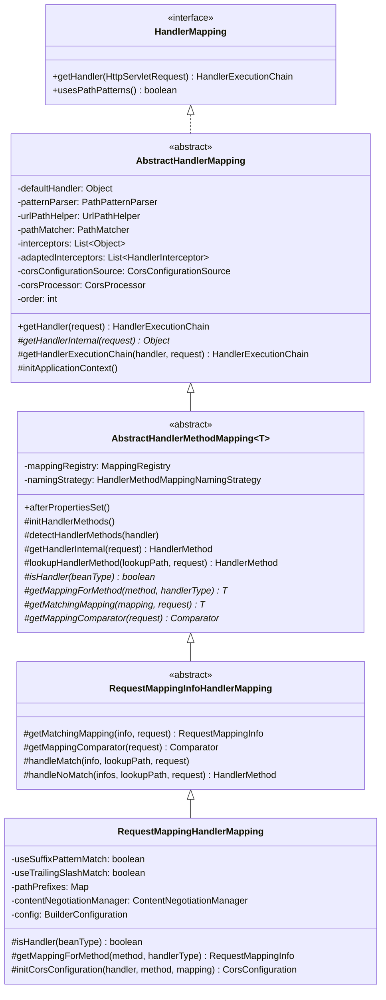

**每层职责一句话总结**：

| 层级 | 类名 | 行数 | 核心职责 |
|------|------|------|---------|
| 接口 | `HandlerMapping` | 174行 | 定义契约：request → HandlerExecutionChain |
| 第一层 | `AbstractHandlerMapping` | 730行 | 拦截器组装 + CORS处理 + 默认handler回退 |
| 第二层 | `AbstractHandlerMethodMapping<T>` | 846行 | MappingRegistry数据结构 + 注册/查找HandlerMethod |
| 第三层 | `RequestMappingInfoHandlerMapping` | 537行 | RequestMappingInfo条件匹配 + URI变量提取 |
| 第四层 | `RequestMappingHandlerMapping` | 532行 | @RequestMapping注解解析 + @CrossOrigin处理 |

---

## 三、HandlerMapping 接口

```java
// 来自: spring-webmvc/.../HandlerMapping.java L57-173
public interface HandlerMapping {

    // ===== Request属性常量（存入request.setAttribute） =====
    String BEST_MATCHING_HANDLER_ATTRIBUTE = ...;      // 最佳匹配的handler
    String BEST_MATCHING_PATTERN_ATTRIBUTE = ...;      // 最佳匹配的URL模式
    String URI_TEMPLATE_VARIABLES_ATTRIBUTE = ...;     // URI模板变量 {id}→1
    String MATRIX_VARIABLES_ATTRIBUTE = ...;           // 矩阵变量
    String PRODUCIBLE_MEDIA_TYPES_ATTRIBUTE = ...;     // 可生产的媒体类型
    String PATH_WITHIN_HANDLER_MAPPING_ATTRIBUTE = ...; // handler映射内的路径

    // ===== 核心方法 =====

    // 5.3新增：是否使用解析后的PathPattern（替代AntPathMatcher）
    default boolean usesPathPatterns() {
        return false;
    }

    // ★ 唯一核心方法：根据请求返回 handler + 拦截器链
    @Nullable
    HandlerExecutionChain getHandler(HttpServletRequest request) throws Exception;
}
```

**关键设计点**：
1. `getHandler()` 返回的是 `HandlerExecutionChain` 而不是直接的 handler — **职责链模式**
2. handler 是 `Object` 类型，不强制任何接口 — **极致的灵活性**
3. 返回 `null` 不是错误，DispatcherServlet 会继续尝试下一个 HandlerMapping

---

## 四、第一层：AbstractHandlerMapping（730行）

### 4.1 核心字段

```java
// 来自: spring-webmvc/.../handler/AbstractHandlerMapping.java L78-108
public abstract class AbstractHandlerMapping extends WebApplicationObjectSupport
        implements HandlerMapping, Ordered, BeanNameAware {

    // 默认handler（找不到匹配时的兜底）
    @Nullable
    private Object defaultHandler;

    // 5.3新增：解析后的PathPattern（替代AntPathMatcher，性能更好）
    @Nullable
    private PathPatternParser patternParser;

    // URL路径解析工具（5.3前使用）
    private UrlPathHelper urlPathHelper = new UrlPathHelper();

    // 路径匹配器（默认AntPathMatcher）
    private PathMatcher pathMatcher = new AntPathMatcher();

    // 原始拦截器列表（配置阶段，混合类型）
    private final List<Object> interceptors = new ArrayList<>();

    // 适配后的拦截器列表（运行阶段，统一为HandlerInterceptor）
    private final List<HandlerInterceptor> adaptedInterceptors = new ArrayList<>();

    // CORS配置源
    @Nullable
    private CorsConfigurationSource corsConfigurationSource;

    // CORS处理器（默认DefaultCorsProcessor）
    private CorsProcessor corsProcessor = new DefaultCorsProcessor();

    // 排序优先级（默认最低）
    private int order = Ordered.LOWEST_PRECEDENCE;

    @Nullable
    private String beanName;
}
```

**两种路径匹配策略对比**：

| 特性 | AntPathMatcher（旧） | PathPattern（5.3新增） |
|------|---------------------|----------------------|
| 字段 | `pathMatcher` | `patternParser` |
| 匹配方式 | 字符串匹配 | 预解析结构化匹配 |
| 性能 | 较慢（每次匹配重新解析） | 更快（一次解析多次匹配） |
| URL解码 | 整个路径解码 | 逐段解码（更安全） |
| 激活条件 | `patternParser == null` | `patternParser != null` |
| 配置方式 | 默认 | `setPatternParser()` |

### 4.2 拦截器初始化 —— initApplicationContext()

```java
// 来自: spring-webmvc/.../handler/AbstractHandlerMapping.java L378-383
@Override
protected void initApplicationContext() throws BeansException {
    extendInterceptors(this.interceptors);          // ① 钩子：子类可追加拦截器
    detectMappedInterceptors(this.adaptedInterceptors); // ② 自动探测MappedInterceptor Bean
    initInterceptors();                              // ③ 将interceptors适配为HandlerInterceptor
}
```

**三步拦截器初始化流程**：

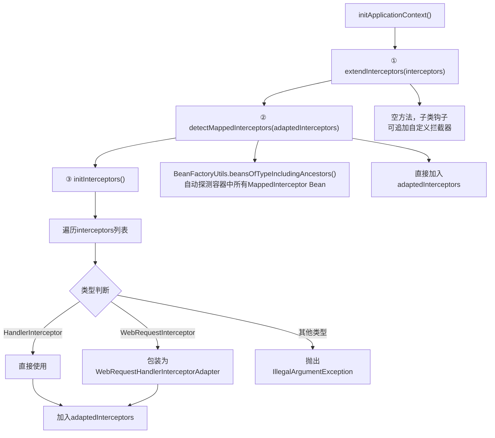

**两种拦截器的区别**：

| 类型 | 说明 | 路径匹配 |
|------|------|---------|
| `HandlerInterceptor`（普通） | 直接加入所有请求的拦截链 | 对所有请求生效 |
| `MappedInterceptor`（带路径） | 包装了 include/exclude 模式 | 只对匹配路径生效 |

### 4.3 ★★★ 核心方法：getHandler()

这是 **DispatcherServlet 调用的入口方法**，也是理解整个 HandlerMapping 的关键：

```java
// 来自: spring-webmvc/.../handler/AbstractHandlerMapping.java L496-540
@Override
@Nullable
public final HandlerExecutionChain getHandler(HttpServletRequest request) throws Exception {
    // ① 模板方法：子类实现，查找匹配的handler
    Object handler = getHandlerInternal(request);

    // ② 找不到则使用默认handler
    if (handler == null) {
        handler = getDefaultHandler();
    }

    // ③ 默认handler也没有，返回null（DispatcherServlet会尝试下一个HandlerMapping）
    if (handler == null) {
        return null;
    }

    // ④ 如果handler是Bean名称字符串，从容器获取实例
    if (handler instanceof String) {
        String handlerName = (String) handler;
        handler = obtainApplicationContext().getBean(handlerName);
    }

    // ⑤ 确保有缓存的lookupPath
    if (!ServletRequestPathUtils.hasCachedPath(request)) {
        initLookupPath(request);
    }

    // ⑥ 组装拦截器链 → HandlerExecutionChain
    HandlerExecutionChain executionChain = getHandlerExecutionChain(handler, request);

    // ⑦ CORS处理
    if (hasCorsConfigurationSource(handler) || CorsUtils.isPreFlightRequest(request)) {
        CorsConfiguration config = getCorsConfiguration(handler, request);
        if (getCorsConfigurationSource() != null) {
            CorsConfiguration globalConfig = getCorsConfigurationSource().getCorsConfiguration(request);
            config = (globalConfig != null ? globalConfig.combine(config) : config);
        }
        if (config != null) {
            config.validateAllowCredentials();
            config.validateAllowPrivateNetwork();
        }
        executionChain = getCorsHandlerExecutionChain(request, executionChain, config);
    }

    return executionChain;
}
```

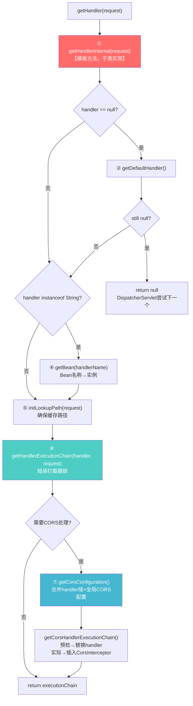

### 4.4 拦截器链组装 —— getHandlerExecutionChain()

```java
// 来自: spring-webmvc/.../handler/AbstractHandlerMapping.java L605-621
protected HandlerExecutionChain getHandlerExecutionChain(Object handler, HttpServletRequest request) {
    // 如果handler已经是Chain则复用，否则创建新的
    HandlerExecutionChain chain = (handler instanceof HandlerExecutionChain ?
            (HandlerExecutionChain) handler : new HandlerExecutionChain(handler));

    // 遍历所有已适配的拦截器
    for (HandlerInterceptor interceptor : this.adaptedInterceptors) {
        if (interceptor instanceof MappedInterceptor) {
            // MappedInterceptor：需要URL匹配才加入
            MappedInterceptor mappedInterceptor = (MappedInterceptor) interceptor;
            if (mappedInterceptor.matches(request)) {
                chain.addInterceptor(mappedInterceptor.getInterceptor());
            }
        }
        else {
            // 普通拦截器：直接加入
            chain.addInterceptor(interceptor);
        }
    }
    return chain;
}
```

**关键理解**：每个请求都会创建一个新的 `HandlerExecutionChain`，拦截器列表是**动态筛选**的，不同请求路径命中不同的 `MappedInterceptor`。

### 4.5 CORS 处理机制

```java
// 来自: spring-webmvc/.../handler/AbstractHandlerMapping.java L665-676
protected HandlerExecutionChain getCorsHandlerExecutionChain(HttpServletRequest request,
        HandlerExecutionChain chain, @Nullable CorsConfiguration config) {

    if (CorsUtils.isPreFlightRequest(request)) {
        // 预检请求（OPTIONS）：替换handler为PreFlightHandler
        HandlerInterceptor[] interceptors = chain.getInterceptors();
        return new HandlerExecutionChain(new PreFlightHandler(config), interceptors);
    }
    else {
        // 实际请求：在拦截器链头部插入CorsInterceptor
        chain.addInterceptor(0, new CorsInterceptor(config));
        return chain;
    }
}
```

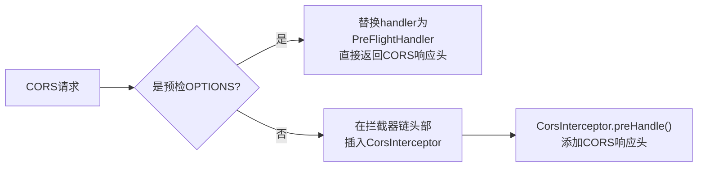

**CORS 配置合并策略**：handler级配置（`@CrossOrigin`）与全局配置（`setCorsConfigurations`）通过 `CorsConfiguration.combine()` 合并。

---

## 五、HandlerExecutionChain 数据结构（216行）

```java
// 来自: spring-webmvc/.../HandlerExecutionChain.java L41-215
public class HandlerExecutionChain {

    private final Object handler;                               // 实际的handler（如HandlerMethod）
    private final List<HandlerInterceptor> interceptorList = new ArrayList<>();  // 拦截器列表
    private int interceptorIndex = -1;                          // 当前执行到的拦截器索引（用于异常时的回退）
}
```

**三个核心执行方法**：

```java
// ① 正序执行preHandle（任一返回false则中断）
boolean applyPreHandle(request, response) {
    for (int i = 0; i < interceptorList.size(); i++) {
        if (!interceptor.preHandle(request, response, handler)) {
            triggerAfterCompletion(request, response, null); // 回退已执行的
            return false;
        }
        this.interceptorIndex = i; // 记录当前位置
    }
    return true;
}

// ② 倒序执行postHandle
void applyPostHandle(request, response, mv) {
    for (int i = interceptorList.size() - 1; i >= 0; i--) {
        interceptor.postHandle(request, response, handler, mv);
    }
}

// ③ 倒序执行afterCompletion（只执行preHandle成功的）
void triggerAfterCompletion(request, response, ex) {
    for (int i = this.interceptorIndex; i >= 0; i--) {  // ★ 从interceptorIndex开始
        interceptor.afterCompletion(request, response, handler, ex);
    }
}
```

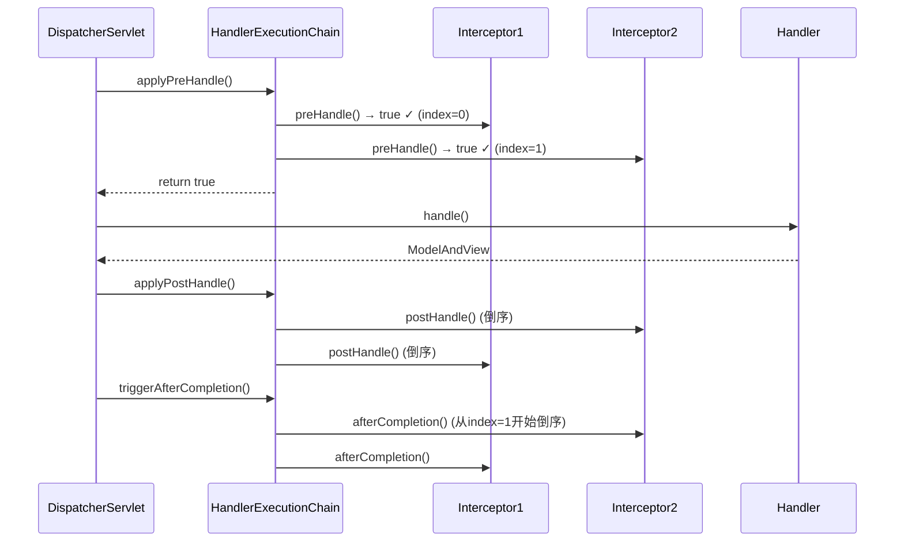

**interceptorIndex 的精妙设计**：假设 `Interceptor2.preHandle()` 返回 `false`，此时 `interceptorIndex = 0`（只有 Interceptor1 执行成功），`triggerAfterCompletion()` 只会回调 Interceptor1 的 `afterCompletion()`，保证了**资源释放的对称性**。

---

## 六、MappedInterceptor —— 带路径匹配的拦截器

```java
// 来自: spring-webmvc/.../handler/MappedInterceptor.java L62-322
public final class MappedInterceptor implements HandlerInterceptor {

    @Nullable
    private final PatternAdapter[] includePatterns;  // 包含的路径模式
    @Nullable
    private final PatternAdapter[] excludePatterns;  // 排除的路径模式
    private PathMatcher pathMatcher = defaultPathMatcher; // 默认AntPathMatcher
    private final HandlerInterceptor interceptor;    // 被包装的实际拦截器
}
```

**匹配逻辑**（`matches()` 方法，L186-208）：

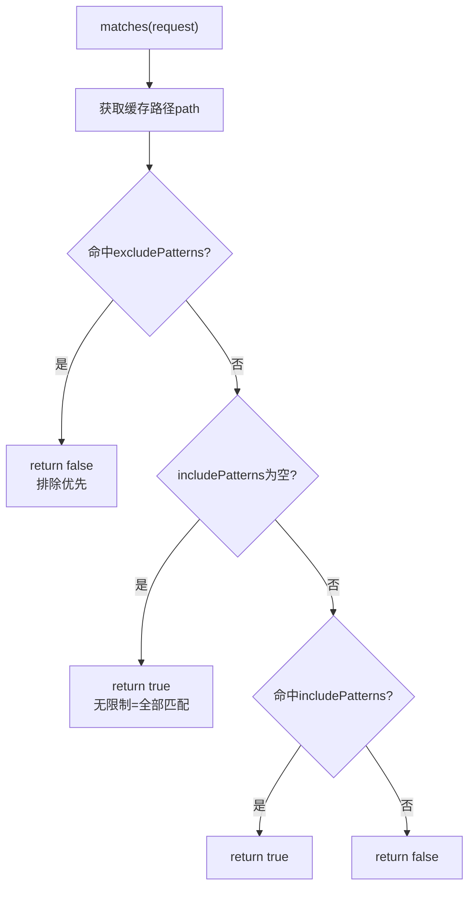

**实际使用场景**：

```java
// 配置拦截器时
@Override
public void addInterceptors(InterceptorRegistry registry) {
    registry.addInterceptor(new LoginInterceptor())
            .addPathPatterns("/api/**")       // → includePatterns
            .excludePathPatterns("/api/login"); // → excludePatterns
}
// Spring内部会创建 MappedInterceptor(includePatterns, excludePatterns, interceptor)
```

---

## 七、第二层：AbstractHandlerMethodMapping（846行）★★★

这是整个 HandlerMapping 体系中**数据结构最丰富**的类，定义了：
- **MappingRegistry** — 所有请求映射的注册中心
- **initHandlerMethods()** — 启动时扫描注册
- **lookupHandlerMethod()** — 运行时查找匹配

### 7.1 核心字段

```java
// 来自: spring-webmvc/.../handler/AbstractHandlerMethodMapping.java L69-101
public abstract class AbstractHandlerMethodMapping<T> extends AbstractHandlerMapping
        implements InitializingBean {

    // 是否在祖先容器中也检测handler（默认false，只检测当前容器）
    private boolean detectHandlerMethodsInAncestorContexts = false;

    // 命名策略（如 "TC#getFoo" → TestController#getFoo）
    @Nullable
    private HandlerMethodMappingNamingStrategy<T> namingStrategy;

    // ★★★ 核心数据结构：映射注册中心
    private final MappingRegistry mappingRegistry = new MappingRegistry();
}
```

**泛型参数 `<T>`**：代表映射条件类型。对于 `@RequestMapping`，T = `RequestMappingInfo`。

### 7.2 ★★★ MappingRegistry —— 核心数据结构

```java
// 来自: spring-webmvc/.../handler/AbstractHandlerMethodMapping.java L573-742
class MappingRegistry {

    // ① 主注册表：mapping条件 → 注册信息（handler+method+路径+名称+CORS）
    private final Map<T, MappingRegistration<T>> registry = new HashMap<>();

    // ② 路径快速查找表：URL路径 → mapping条件列表（一对多）
    private final MultiValueMap<String, T> pathLookup = new LinkedMultiValueMap<>();

    // ③ 名称查找表：映射名称 → HandlerMethod列表
    private final Map<String, List<HandlerMethod>> nameLookup = new ConcurrentHashMap<>();

    // ④ CORS配置表：HandlerMethod → CorsConfiguration
    private final Map<HandlerMethod, CorsConfiguration> corsLookup = new ConcurrentHashMap<>();

    // ⑤ 读写锁：保证并发安全
    private final ReentrantReadWriteLock readWriteLock = new ReentrantReadWriteLock();
}
```

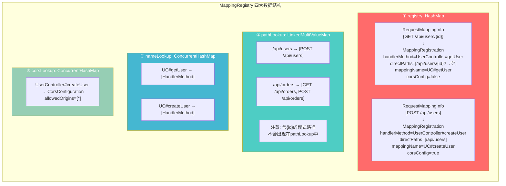

**MappingRegistration 数据结构**：

```java
// 来自: spring-webmvc/.../handler/AbstractHandlerMethodMapping.java L745-790
static class MappingRegistration<T> {
    private final T mapping;                    // 映射条件（如RequestMappingInfo）
    private final HandlerMethod handlerMethod;  // 处理器方法
    private final Set<String> directPaths;      // 直接路径（非模式路径）
    @Nullable
    private final String mappingName;           // 映射名称（如"UC#getUser"）
    private final boolean corsConfig;           // 是否有CORS配置
}
```

**directPaths vs 模式路径**：

| URL | 是否directPath | 进入pathLookup |
|-----|---------------|---------------|
| `/api/users` | 是 ✓ | 是 |
| `/api/users/{id}` | 否 ✗（含`{id}`） | 否 |
| `/api/*/orders` | 否 ✗（含`*`） | 否 |

### 7.3 注册流程 —— MappingRegistry.register()

```java
// 来自: spring-webmvc/.../handler/AbstractHandlerMethodMapping.java L632-662
public void register(T mapping, Object handler, Method method) {
    this.readWriteLock.writeLock().lock();  // 获取写锁
    try {
        // ① 创建HandlerMethod
        HandlerMethod handlerMethod = createHandlerMethod(handler, method);
        // ② 验证唯一性（同一个mapping不能映射到两个不同的方法）
        validateMethodMapping(handlerMethod, mapping);

        // ③ 提取直接路径，加入pathLookup
        Set<String> directPaths = AbstractHandlerMethodMapping.this.getDirectPaths(mapping);
        for (String path : directPaths) {
            this.pathLookup.add(path, mapping);
        }

        // ④ 生成名称，加入nameLookup
        String name = null;
        if (getNamingStrategy() != null) {
            name = getNamingStrategy().getName(handlerMethod, mapping);
            addMappingName(name, handlerMethod);
        }

        // ⑤ 初始化CORS配置
        CorsConfiguration corsConfig = initCorsConfiguration(handler, method, mapping);
        if (corsConfig != null) {
            corsConfig.validateAllowCredentials();
            corsConfig.validateAllowPrivateNetwork();
            this.corsLookup.put(handlerMethod, corsConfig);
        }

        // ⑥ 写入主注册表
        this.registry.put(mapping,
                new MappingRegistration<>(mapping, handlerMethod, directPaths, name,
                        corsConfig != null));
    }
    finally {
        this.readWriteLock.writeLock().unlock();  // 释放写锁
    }
}
```

### 7.4 启动扫描流程 —— initHandlerMethods()

`AbstractHandlerMethodMapping` 实现了 `InitializingBean`，Spring 容器初始化时触发：

```java
// 来自: spring-webmvc/.../handler/AbstractHandlerMethodMapping.java L211-229
@Override
public void afterPropertiesSet() {
    initHandlerMethods();
}

protected void initHandlerMethods() {
    // ① 获取所有候选Bean名称
    for (String beanName : getCandidateBeanNames()) {
        // ② 过滤掉scoped proxy的target bean
        if (!beanName.startsWith(SCOPED_TARGET_NAME_PREFIX)) {
            processCandidateBean(beanName);
        }
    }
    // ③ 日志输出
    handlerMethodsInitialized(getHandlerMethods());
}
```

**processCandidateBean → detectHandlerMethods 调用链**：

```java
// 来自: spring-webmvc/.../handler/AbstractHandlerMethodMapping.java L254-302
protected void processCandidateBean(String beanName) {
    Class<?> beanType = obtainApplicationContext().getType(beanName);
    // ★ isHandler() 是抽象方法，由子类决定什么是handler
    if (beanType != null && isHandler(beanType)) {
        detectHandlerMethods(beanName);
    }
}

protected void detectHandlerMethods(Object handler) {
    Class<?> handlerType = (handler instanceof String ?
            obtainApplicationContext().getType((String) handler) : handler.getClass());

    if (handlerType != null) {
        Class<?> userType = ClassUtils.getUserClass(handlerType); // CGLIB代理→原始类

        // ★ MethodIntrospector.selectMethods：遍历所有方法
        Map<Method, T> methods = MethodIntrospector.selectMethods(userType,
                (MethodIntrospector.MetadataLookup<T>) method -> {
                    // ★ getMappingForMethod() 是抽象方法，由子类决定映射规则
                    return getMappingForMethod(method, userType);
                });

        // 注册每个方法
        methods.forEach((method, mapping) -> {
            Method invocableMethod = AopUtils.selectInvocableMethod(method, userType);
            registerHandlerMethod(handler, invocableMethod, mapping);
        });
    }
}
```

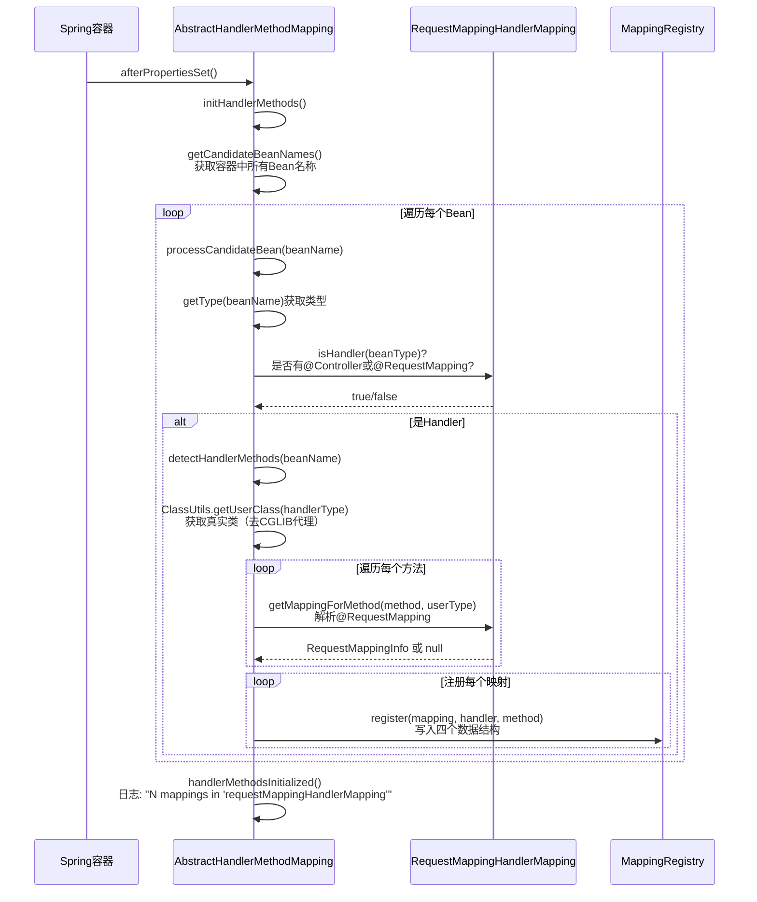

### 7.5 ★★★ 请求匹配流程 —— lookupHandlerMethod()

这是**运行时最核心的方法**，回答"URL如何找到Controller方法"：

```java
// 来自: spring-webmvc/.../handler/AbstractHandlerMethodMapping.java L377-444
@Override
@Nullable
protected HandlerMethod getHandlerInternal(HttpServletRequest request) throws Exception {
    String lookupPath = initLookupPath(request);
    this.mappingRegistry.acquireReadLock();  // 获取读锁
    try {
        HandlerMethod handlerMethod = lookupHandlerMethod(lookupPath, request);
        return (handlerMethod != null ? handlerMethod.createWithResolvedBean() : null);
    }
    finally {
        this.mappingRegistry.releaseReadLock();  // 释放读锁
    }
}

@Nullable
protected HandlerMethod lookupHandlerMethod(String lookupPath, HttpServletRequest request) throws Exception {
    List<Match> matches = new ArrayList<>();

    // ★ 第一步：精确路径快速查找（O(1)级别）
    List<T> directPathMatches = this.mappingRegistry.getMappingsByDirectPath(lookupPath);
    if (directPathMatches != null) {
        addMatchingMappings(directPathMatches, matches, request);
    }

    // ★ 第二步：如果精确查找无结果，全量扫描（O(N)级别）
    if (matches.isEmpty()) {
        addMatchingMappings(this.mappingRegistry.getRegistrations().keySet(), matches, request);
    }

    if (!matches.isEmpty()) {
        Match bestMatch = matches.get(0);

        if (matches.size() > 1) {
            // ★ 第三步：多个匹配时排序，选最优
            Comparator<Match> comparator = new MatchComparator(getMappingComparator(request));
            matches.sort(comparator);
            bestMatch = matches.get(0);

            if (CorsUtils.isPreFlightRequest(request)) {
                // 预检请求：只要有一个有CORS配置就返回
                for (Match match : matches) {
                    if (match.hasCorsConfig()) {
                        return PREFLIGHT_AMBIGUOUS_MATCH;
                    }
                }
            }
            else {
                // ★ 歧义检测：前两名优先级相同则抛异常
                Match secondBestMatch = matches.get(1);
                if (comparator.compare(bestMatch, secondBestMatch) == 0) {
                    throw new IllegalStateException("Ambiguous handler methods mapped for '"
                            + request.getRequestURI() + "'");
                }
            }
        }

        // 设置request属性
        request.setAttribute(BEST_MATCHING_HANDLER_ATTRIBUTE, bestMatch.getHandlerMethod());
        handleMatch(bestMatch.mapping, lookupPath, request);
        return bestMatch.getHandlerMethod();
    }
    else {
        // 无匹配：交给handleNoMatch处理（可能抛405/415等）
        return handleNoMatch(this.mappingRegistry.getRegistrations().keySet(), lookupPath, request);
    }
}
```

```mermaid
flowchart TD
    A["lookupHandlerMethod(lookupPath, request)"] --> B["① pathLookup.get(lookupPath)<br>精确路径快速查找 O(1)"]
    B --> C{找到directPathMatches?}
    C -->|是| D["addMatchingMappings(directPathMatches)<br>对每个mapping执行getMatchingMapping()"]
    C -->|否| E

    D --> E{matches列表为空?}
    E -->|是| F["② 全量扫描 O(N)<br>遍历registry.keySet()<br>addMatchingMappings(allMappings)"]
    E -->|否| G

    F --> G{matches列表为空?}
    G -->|是| H["handleNoMatch()<br>可能抛405/415等"]
    G -->|否| I{matches.size() > 1?}

    I -->|是| J["③ 排序选最优<br>MatchComparator排序"]
    I -->|否| L

    J --> K{前两名优先级相同?}
    K -->|是| M["throw IllegalStateException<br>Ambiguous handler methods"]
    K -->|否| L

    L["return bestMatch.getHandlerMethod()"]

    style B fill:#4ecdc4,color:#fff
    style F fill:#ff6b6b,color:#fff
    style J fill:#45b7d1,color:#fff
    style M fill:#e74c3c,color:#fff
```

**两级查找策略的性能优化**：

| 步骤 | 方式 | 时间复杂度 | 适用场景 |
|------|------|-----------|---------|
| 第一步 | `pathLookup.get(path)` | O(1) HashMap查找 | 精确路径如 `/api/users` |
| 第二步 | 全量遍历 `registry.keySet()` | O(N) 逐个匹配 | 模式路径如 `/api/users/{id}` |

**为什么分两步？** 大多数请求都是精确路径匹配，第一步 O(1) 就能找到，避免了不必要的全量扫描。

### 7.6 五个抽象模板方法

```java
// 来自: spring-webmvc/.../handler/AbstractHandlerMethodMapping.java L505-564

// ① 判断某个Bean是否是handler（是否有@Controller/@RequestMapping）
protected abstract boolean isHandler(Class<?> beanType);

// ② 为某个方法创建映射条件（解析@RequestMapping）
protected abstract T getMappingForMethod(Method method, Class<?> handlerType);

// ③ 检查某个mapping是否匹配当前请求
protected abstract T getMatchingMapping(T mapping, HttpServletRequest request);

// ④ 创建比较器，用于多个匹配时选最优
protected abstract Comparator<T> getMappingComparator(HttpServletRequest request);

// ⑤ 提取直接路径（非模式路径），用于pathLookup优化
protected Set<String> getDirectPaths(T mapping) { ... }
```

---

## 八、第三层：RequestMappingInfoHandlerMapping（537行）

这一层将泛型 `<T>` 具体化为 `RequestMappingInfo`，实现了上述抽象方法中的3个。

### 8.1 核心方法实现

```java
// 来自: spring-webmvc/.../mvc/method/RequestMappingInfoHandlerMapping.java L67-118
public abstract class RequestMappingInfoHandlerMapping
        extends AbstractHandlerMethodMapping<RequestMappingInfo> {

    // 构造器中设置命名策略
    protected RequestMappingInfoHandlerMapping() {
        setHandlerMethodMappingNamingStrategy(
                new RequestMappingInfoHandlerMethodMappingNamingStrategy());
    }

    // 实现 getDirectPaths：从RequestMappingInfo中提取
    @Override
    protected Set<String> getDirectPaths(RequestMappingInfo info) {
        return info.getDirectPaths();
    }

    // 实现 getMatchingMapping：调用info.getMatchingCondition()
    @Override
    protected RequestMappingInfo getMatchingMapping(RequestMappingInfo info, HttpServletRequest request) {
        return info.getMatchingCondition(request);
    }

    // 实现 getMappingComparator：使用RequestMappingInfo的compareTo
    @Override
    protected Comparator<RequestMappingInfo> getMappingComparator(final HttpServletRequest request) {
        return (info1, info2) -> info1.compareTo(info2, request);
    }
}
```

### 8.2 handleMatch —— 匹配成功后的属性设置

```java
// 来自: spring-webmvc/.../mvc/method/RequestMappingInfoHandlerMapping.java L138-157
@Override
protected void handleMatch(RequestMappingInfo info, String lookupPath, HttpServletRequest request) {
    super.handleMatch(info, lookupPath, request);

    // 提取URI模板变量和矩阵变量
    RequestCondition<?> condition = info.getActivePatternsCondition();
    if (condition instanceof PathPatternsRequestCondition) {
        extractMatchDetails((PathPatternsRequestCondition) condition, lookupPath, request);
    } else {
        extractMatchDetails((PatternsRequestCondition) condition, lookupPath, request);
    }

    // 设置可生产的媒体类型
    ProducesRequestCondition producesCondition = info.getProducesCondition();
    if (!producesCondition.isEmpty()) {
        Set<MediaType> mediaTypes = producesCondition.getProducibleMediaTypes();
        if (!mediaTypes.isEmpty()) {
            request.setAttribute(PRODUCIBLE_MEDIA_TYPES_ATTRIBUTE, mediaTypes);
        }
    }
}
```

**匹配后设置的Request属性**：

| 属性 | 值示例 | 用途 |
|------|--------|------|
| `BEST_MATCHING_PATTERN_ATTRIBUTE` | `/api/users/{id}` | 日志、调试 |
| `URI_TEMPLATE_VARIABLES_ATTRIBUTE` | `{id: "1"}` | `@PathVariable` 参数解析 |
| `MATRIX_VARIABLES_ATTRIBUTE` | `{color: ["red","blue"]}` | `@MatrixVariable` 参数解析 |
| `PRODUCIBLE_MEDIA_TYPES_ATTRIBUTE` | `[application/json]` | 内容协商 |

### 8.3 handleNoMatch —— 精确错误诊断

当 URL 匹配但其他条件不匹配时，`handleNoMatch()` 会**精确诊断**是哪个条件不满足：

```java
// 来自: spring-webmvc/.../mvc/method/RequestMappingInfoHandlerMapping.java L241-288
@Override
protected HandlerMethod handleNoMatch(
        Set<RequestMappingInfo> infos, String lookupPath, HttpServletRequest request)
        throws ServletException {

    PartialMatchHelper helper = new PartialMatchHelper(infos, request);
    if (helper.isEmpty()) return null;

    // 按优先级逐层检查：method → consumes → produces → params
    if (helper.hasMethodsMismatch()) {
        // URL匹配但HTTP方法不匹配 → 405 Method Not Allowed
        throw new HttpRequestMethodNotSupportedException(request.getMethod(), methods);
    }
    if (helper.hasConsumesMismatch()) {
        // URL+方法匹配但Content-Type不匹配 → 415 Unsupported Media Type
        throw new HttpMediaTypeNotSupportedException(contentType, mediaTypes);
    }
    if (helper.hasProducesMismatch()) {
        // URL+方法+Content-Type匹配但Accept不匹配 → 406 Not Acceptable
        throw new HttpMediaTypeNotAcceptableException(mediaTypes);
    }
    if (helper.hasParamsMismatch()) {
        // 以上都匹配但params不匹配
        throw new UnsatisfiedServletRequestParameterException(conditions, params);
    }
    return null;
}
```

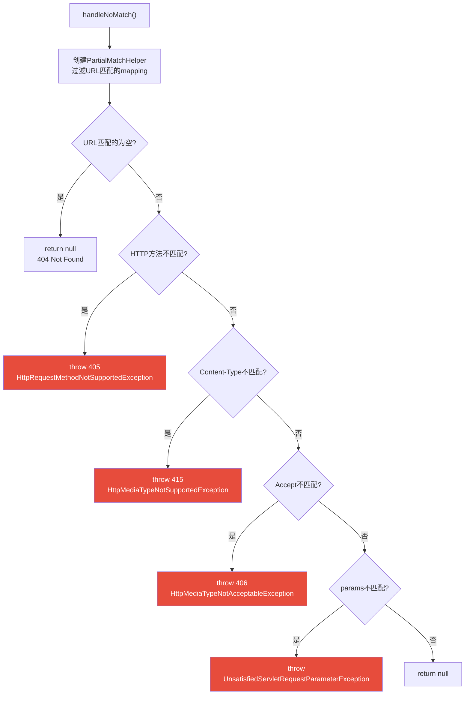

---

## 九、第四层：RequestMappingHandlerMapping（532行）

这是我们日常开发中**实际使用**的 HandlerMapping 实现，负责解析 `@RequestMapping` 注解。

### 9.1 核心字段

```java
// 来自: spring-webmvc/.../mvc/method/annotation/RequestMappingHandlerMapping.java L76-93
public class RequestMappingHandlerMapping extends RequestMappingInfoHandlerMapping
        implements MatchableHandlerMapping, EmbeddedValueResolverAware {

    private boolean useSuffixPatternMatch = false;  // 已废弃
    private boolean useRegisteredSuffixPatternMatch = false;  // 已废弃
    private boolean useTrailingSlashMatch = true;   // 尾斜杠匹配 /users/ ↔ /users

    // 路径前缀（5.1新增）：如 /api → 所有Controller
    private Map<String, Predicate<Class<?>>> pathPrefixes = Collections.emptyMap();

    // 内容协商管理器
    private ContentNegotiationManager contentNegotiationManager = new ContentNegotiationManager();

    // 占位符解析器（解析 ${...}）
    @Nullable
    private StringValueResolver embeddedValueResolver;

    // 构建配置（传递给RequestMappingInfo.Builder）
    private RequestMappingInfo.BuilderConfiguration config = new RequestMappingInfo.BuilderConfiguration();
}
```

### 9.2 isHandler() —— 判断什么是Controller

```java
// 来自: spring-webmvc/.../mvc/method/annotation/RequestMappingHandlerMapping.java L268-271
@Override
protected boolean isHandler(Class<?> beanType) {
    return (AnnotatedElementUtils.hasAnnotation(beanType, Controller.class) ||
            AnnotatedElementUtils.hasAnnotation(beanType, RequestMapping.class));
}
```

**关键点**：
- `@Controller` 包含 `@Component`，会被Spring扫描
- `@RestController` 包含 `@Controller`，也会被识别
- 单独标注 `@RequestMapping` 在类上也会被识别（但不常用）
- 使用 `AnnotatedElementUtils`（支持组合注解），不是 `AnnotationUtils`

### 9.3 ★ getMappingForMethod() —— @RequestMapping 解析

```java
// 来自: spring-webmvc/.../mvc/method/annotation/RequestMappingHandlerMapping.java L282-296
@Override
@Nullable
protected RequestMappingInfo getMappingForMethod(Method method, Class<?> handlerType) {
    // ① 解析方法级别的@RequestMapping
    RequestMappingInfo info = createRequestMappingInfo(method);
    if (info != null) {
        // ② 解析类级别的@RequestMapping
        RequestMappingInfo typeInfo = createRequestMappingInfo(handlerType);
        if (typeInfo != null) {
            // ③ 合并：类级别 + 方法级别
            info = typeInfo.combine(info);
        }
        // ④ 应用路径前缀
        String prefix = getPathPrefix(handlerType);
        if (prefix != null) {
            info = RequestMappingInfo.paths(prefix).options(this.config).build().combine(info);
        }
    }
    return info;
}
```

```mermaid
flowchart TD
    A["getMappingForMethod(method, handlerType)"] --> B["① createRequestMappingInfo(method)<br>解析方法级@RequestMapping"]
    B --> C{方法有@RequestMapping?}
    C -->|否| D["return null<br>不是handler方法"]
    C -->|是| E["② createRequestMappingInfo(handlerType)<br>解析类级@RequestMapping"]
    E --> F{类有@RequestMapping?}
    F -->|是| G["③ typeInfo.combine(methodInfo)<br>合并：/api + /users → /api/users"]
    F -->|否| H
    G --> H["④ getPathPrefix(handlerType)<br>查找路径前缀"]
    H --> I{有前缀?}
    I -->|是| J["prefixInfo.combine(info)<br>合并：/v1 + /api/users → /v1/api/users"]
    I -->|否| K["return info"]
    J --> K
```

### 9.4 createRequestMappingInfo —— 注解属性 → RequestMappingInfo

```java
// 来自: spring-webmvc/.../mvc/method/annotation/RequestMappingHandlerMapping.java L320-325
@Nullable
private RequestMappingInfo createRequestMappingInfo(AnnotatedElement element) {
    // 查找@RequestMapping（支持组合注解如@GetMapping）
    RequestMapping requestMapping = AnnotatedElementUtils.findMergedAnnotation(
            element, RequestMapping.class);
    // 自定义条件扩展点
    RequestCondition<?> condition = (element instanceof Class ?
            getCustomTypeCondition((Class<?>) element) :
            getCustomMethodCondition((Method) element));
    return (requestMapping != null ?
            createRequestMappingInfo(requestMapping, condition) : null);
}

// 来自: L365-380
protected RequestMappingInfo createRequestMappingInfo(
        RequestMapping requestMapping, @Nullable RequestCondition<?> customCondition) {

    RequestMappingInfo.Builder builder = RequestMappingInfo
            .paths(resolveEmbeddedValuesInPatterns(requestMapping.path()))  // URL路径（支持${...}占位符）
            .methods(requestMapping.method())     // HTTP方法
            .params(requestMapping.params())      // 参数条件
            .headers(requestMapping.headers())    // 头条件
            .consumes(requestMapping.consumes())  // Content-Type条件
            .produces(requestMapping.produces())  // Accept条件
            .mappingName(requestMapping.name());  // 映射名称
    if (customCondition != null) {
        builder.customCondition(customCondition);
    }
    return builder.options(this.config).build();
}
```

### 9.5 initCorsConfiguration —— @CrossOrigin 解析

```java
// 来自: spring-webmvc/.../mvc/method/annotation/RequestMappingHandlerMapping.java L449-470
@Override
protected CorsConfiguration initCorsConfiguration(Object handler, Method method,
        RequestMappingInfo mappingInfo) {

    HandlerMethod handlerMethod = createHandlerMethod(handler, method);
    Class<?> beanType = handlerMethod.getBeanType();

    // 查找类级别和方法级别的@CrossOrigin
    CrossOrigin typeAnnotation = AnnotatedElementUtils.findMergedAnnotation(beanType, CrossOrigin.class);
    CrossOrigin methodAnnotation = AnnotatedElementUtils.findMergedAnnotation(method, CrossOrigin.class);

    if (typeAnnotation == null && methodAnnotation == null) {
        return null;  // 没有@CrossOrigin → 不配置CORS
    }

    CorsConfiguration config = new CorsConfiguration();
    updateCorsConfig(config, typeAnnotation);   // 先应用类级别
    updateCorsConfig(config, methodAnnotation);  // 再应用方法级别（覆盖）

    // 如果没有指定allowedMethods，使用@RequestMapping中的method
    if (CollectionUtils.isEmpty(config.getAllowedMethods())) {
        for (RequestMethod allowedMethod : mappingInfo.getMethodsCondition().getMethods()) {
            config.addAllowedMethod(allowedMethod.name());
        }
    }
    return config.applyPermitDefaultValues();
}
```

---

## 十、RequestMappingInfo —— 七大匹配条件

`RequestMappingInfo` 是 `@RequestMapping` 注解的**运行时表示**，包含7个匹配条件：

```java
// 来自: spring-webmvc/.../mvc/method/RequestMappingInfo.java L66-108
public final class RequestMappingInfo implements RequestCondition<RequestMappingInfo> {

    @Nullable private final String name;

    // ===== 七大匹配条件 =====
    @Nullable private final PathPatternsRequestCondition pathPatternsCondition;   // ① URL路径(PathPattern)
    @Nullable private final PatternsRequestCondition patternsCondition;          // ① URL路径(AntPathMatcher)
    private final RequestMethodsRequestCondition methodsCondition;               // ② HTTP方法
    private final ParamsRequestCondition paramsCondition;                         // ③ 请求参数
    private final HeadersRequestCondition headersCondition;                      // ④ 请求头
    private final ConsumesRequestCondition consumesCondition;                    // ⑤ Content-Type
    private final ProducesRequestCondition producesCondition;                    // ⑥ Accept
    private final RequestConditionHolder customConditionHolder;                  // ⑦ 自定义条件
}
```

**七大条件与 @RequestMapping 属性的对应关系**：

| # | 条件类 | @RequestMapping属性 | 匹配规则 | 示例 |
|---|--------|-------------------|---------|------|
| ① | PathPatterns/PatternsRequestCondition | `path/value` | URL路径匹配 | `/api/users/{id}` |
| ② | RequestMethodsRequestCondition | `method` | HTTP方法 | `GET, POST` |
| ③ | ParamsRequestCondition | `params` | 请求参数存在性 | `myParam=myValue` |
| ④ | HeadersRequestCondition | `headers` | 请求头条件 | `My-Header=myValue` |
| ⑤ | ConsumesRequestCondition | `consumes` | Content-Type匹配 | `application/json` |
| ⑥ | ProducesRequestCondition | `produces` | Accept匹配 | `application/json` |
| ⑦ | RequestConditionHolder | 自定义 | 用户扩展 | - |

### 10.1 getMatchingCondition() —— 全条件匹配

```java
// 来自: spring-webmvc/.../mvc/method/RequestMappingInfo.java L374-417
@Override
@Nullable
public RequestMappingInfo getMatchingCondition(HttpServletRequest request) {
    // 按顺序逐个匹配，任一失败则返回null
    RequestMethodsRequestCondition methods = this.methodsCondition.getMatchingCondition(request);
    if (methods == null) return null;

    ParamsRequestCondition params = this.paramsCondition.getMatchingCondition(request);
    if (params == null) return null;

    HeadersRequestCondition headers = this.headersCondition.getMatchingCondition(request);
    if (headers == null) return null;

    ConsumesRequestCondition consumes = this.consumesCondition.getMatchingCondition(request);
    if (consumes == null) return null;

    ProducesRequestCondition produces = this.producesCondition.getMatchingCondition(request);
    if (produces == null) return null;

    // URL路径匹配（PathPattern或AntPathMatcher二选一）
    PathPatternsRequestCondition pathPatterns = null;
    if (this.pathPatternsCondition != null) {
        pathPatterns = this.pathPatternsCondition.getMatchingCondition(request);
        if (pathPatterns == null) return null;
    }
    PatternsRequestCondition patterns = null;
    if (this.patternsCondition != null) {
        patterns = this.patternsCondition.getMatchingCondition(request);
        if (patterns == null) return null;
    }

    RequestConditionHolder custom = this.customConditionHolder.getMatchingCondition(request);
    if (custom == null) return null;

    // 全部匹配 → 返回新的RequestMappingInfo（包含匹配后的子集条件）
    return new RequestMappingInfo(this.name, pathPatterns, patterns,
            methods, params, headers, consumes, produces, custom, this.options);
}
```

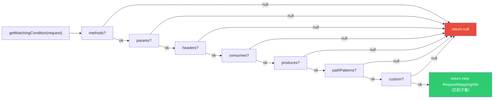

### 10.2 compareTo() —— 排序优先级

当多个 `RequestMappingInfo` 都匹配时，需要排序选最优：

```java
// 来自: spring-webmvc/.../mvc/method/RequestMappingInfo.java L427-466
@Override
public int compareTo(RequestMappingInfo other, HttpServletRequest request) {
    int result;
    // ① HEAD请求：先比HTTP方法
    if (HttpMethod.HEAD.matches(request.getMethod())) {
        result = this.methodsCondition.compareTo(other.getMethodsCondition(), request);
        if (result != 0) return result;
    }
    // ② URL路径（最重要）
    result = getActivePatternsCondition().compareTo(other.getActivePatternsCondition(), request);
    if (result != 0) return result;
    // ③ 参数条件
    result = this.paramsCondition.compareTo(other.getParamsCondition(), request);
    if (result != 0) return result;
    // ④ 头条件
    result = this.headersCondition.compareTo(other.getHeadersCondition(), request);
    if (result != 0) return result;
    // ⑤ consumes
    result = this.consumesCondition.compareTo(other.getConsumesCondition(), request);
    if (result != 0) return result;
    // ⑥ produces
    result = this.producesCondition.compareTo(other.getProducesCondition(), request);
    if (result != 0) return result;
    // ⑦ HTTP方法（隐式 vs 显式）
    result = this.methodsCondition.compareTo(other.getMethodsCondition(), request);
    if (result != 0) return result;
    // ⑧ 自定义条件
    result = this.customConditionHolder.compareTo(other.customConditionHolder, request);
    return result;
}
```

**排序优先级**：URL路径 > params > headers > consumes > produces > HTTP方法 > custom

### 10.3 combine() —— 类级别 + 方法级别合并

```java
// 来自: spring-webmvc/.../mvc/method/RequestMappingInfo.java L328-349
@Override
public RequestMappingInfo combine(RequestMappingInfo other) {
    String name = combineNames(other);

    // 路径合并：/api + /users → /api/users
    PathPatternsRequestCondition pathPatterns = ...combine...;
    PatternsRequestCondition patterns = ...combine...;

    // 其他条件各自合并
    RequestMethodsRequestCondition methods = this.methodsCondition.combine(other.methodsCondition);
    ParamsRequestCondition params = this.paramsCondition.combine(other.paramsCondition);
    HeadersRequestCondition headers = this.headersCondition.combine(other.headersCondition);
    ConsumesRequestCondition consumes = this.consumesCondition.combine(other.consumesCondition);
    ProducesRequestCondition produces = this.producesCondition.combine(other.producesCondition);
    RequestConditionHolder custom = this.customConditionHolder.combine(other.customConditionHolder);

    return new RequestMappingInfo(name, pathPatterns, patterns,
            methods, params, headers, consumes, produces, custom, this.options);
}
```

**合并示例**：

```java
@RestController
@RequestMapping(value = "/api", consumes = "application/json")
public class UserController {

    @GetMapping("/users/{id}")
    public User getUser(@PathVariable Long id) { ... }
}
// 类级别: {path=/api, consumes=application/json}
// 方法级别: {GET, path=/users/{id}}
// 合并结果: {GET /api/users/{id}, consumes=application/json}
```

---

## 十一、HandlerMethod —— handler方法的封装

```java
// 来自: spring-web/.../web/method/HandlerMethod.java L66-99
public class HandlerMethod {

    private final Object bean;              // Controller实例 或 Bean名称字符串
    @Nullable
    private final BeanFactory beanFactory;  // Bean工厂（延迟解析用）
    @Nullable
    private final MessageSource messageSource;
    private final Class<?> beanType;        // Controller类型（去CGLIB代理）
    private final Method method;            // 原始方法
    private final Method bridgedMethod;     // 桥接方法（泛型擦除后）
    private final MethodParameter[] parameters;  // 方法参数信息
    @Nullable
    private HttpStatus responseStatus;      // @ResponseStatus的code
    @Nullable
    private String responseStatusReason;    // @ResponseStatus的reason
    @Nullable
    private HandlerMethod resolvedFromHandlerMethod;  // 解析前的HandlerMethod
    private final String description;       // 描述信息（用于日志）
}
```

**延迟解析设计**：

```java
// 来自: spring-web/.../web/method/HandlerMethod.java L372-380
public HandlerMethod createWithResolvedBean() {
    Object handler = this.bean;
    if (this.bean instanceof String) {
        // bean是String名称 → 从BeanFactory获取实例
        Assert.state(this.beanFactory != null, "Cannot resolve bean name without BeanFactory");
        String beanName = (String) this.bean;
        handler = this.beanFactory.getBean(beanName);
    }
    return new HandlerMethod(this, handler); // 创建新实例，bean字段指向真实对象
}
```

**为什么延迟解析？**
- 初始化阶段（`initHandlerMethods`）时，只存Bean名称，不获取实例
- 运行阶段（`getHandlerInternal`）时，才调用 `createWithResolvedBean()` 获取实例
- **好处**：支持 prototype scope 的 Controller（每次请求创建新实例）

---

## 十二、RequestCondition 接口 —— 组合条件的基石

```java
// 来自: spring-webmvc/.../mvc/condition/RequestCondition.java L37-71
public interface RequestCondition<T> {

    // 合并条件（类级别 + 方法级别）
    T combine(T other);

    // 匹配请求（返回匹配后的新实例，或null表示不匹配）
    @Nullable
    T getMatchingCondition(HttpServletRequest request);

    // 比较优先级（用于多个匹配时排序）
    int compareTo(T other, HttpServletRequest request);
}
```

**所有条件实现类**：

```mermaid
classDiagram
    class RequestCondition~T~ {
        <<interface>>
        +combine(T) T
        +getMatchingCondition(request) T
        +compareTo(T, request) int
    }

    class PathPatternsRequestCondition {
        -patterns: SortedSet~PathPattern~
        +getDirectPaths() Set~String~
    }

    class PatternsRequestCondition {
        -patterns: Set~String~
        +getDirectPaths() Set~String~
    }

    class RequestMethodsRequestCondition {
        -methods: Set~RequestMethod~
    }

    class ParamsRequestCondition {
        -expressions: Set~ParamExpression~
    }

    class HeadersRequestCondition {
        -expressions: Set~HeaderExpression~
    }

    class ConsumesRequestCondition {
        -expressions: List~ConsumeMediaTypeExpression~
        -bodyRequired: boolean
    }

    class ProducesRequestCondition {
        -expressions: List~ProduceMediaTypeExpression~
        -contentNegotiationManager: ContentNegotiationManager
    }

    class RequestConditionHolder {
        -condition: RequestCondition
    }

    RequestCondition <|.. PathPatternsRequestCondition
    RequestCondition <|.. PatternsRequestCondition
    RequestCondition <|.. RequestMethodsRequestCondition
    RequestCondition <|.. ParamsRequestCondition
    RequestCondition <|.. HeadersRequestCondition
    RequestCondition <|.. ConsumesRequestCondition
    RequestCondition <|.. ProducesRequestCondition
    RequestCondition <|.. RequestConditionHolder
```

---

## 十三、完整初始化流程时序图

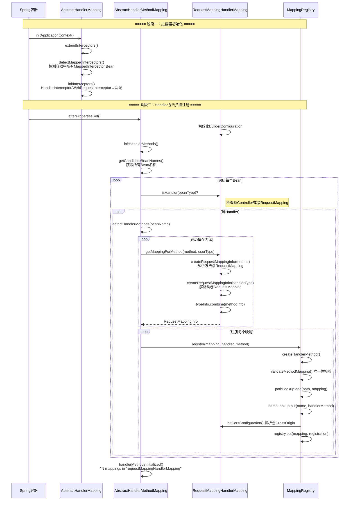

---

## 十四、完整请求匹配流程时序图

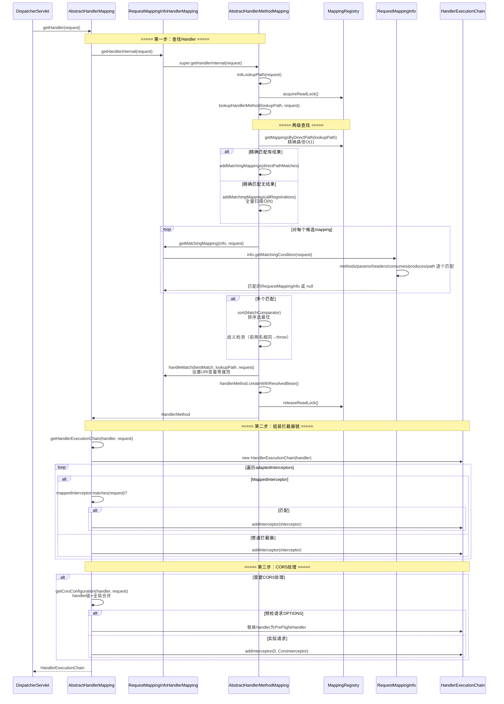

---

## 十五、核心设计模式总结

| 设计模式 | 应用位置 | 说明 |
|---------|---------|------|
| **模板方法** | `AbstractHandlerMapping.getHandler()` | 定义 getHandlerInternal→组装链→CORS 流程，子类实现 getHandlerInternal |
| **模板方法** | `AbstractHandlerMethodMapping` | 定义 isHandler/getMappingForMethod/getMatchingMapping 等抽象方法 |
| **策略模式** | 7个 `RequestCondition` 实现 | 每种匹配条件独立封装，可组合 |
| **组合模式** | `RequestMappingInfo` | 7个条件组合成一个统一的匹配条件 |
| **适配器模式** | `adaptInterceptor()` | WebRequestInterceptor → HandlerInterceptor |
| **装饰器模式** | `MappedInterceptor` | 在HandlerInterceptor上增加路径匹配能力 |
| **职责链模式** | `HandlerExecutionChain` | preHandle→handler→postHandle→afterCompletion |
| **读写锁** | `MappingRegistry.readWriteLock` | 初始化写、运行时读，保证并发安全 |
| **延迟初始化** | `HandlerMethod.createWithResolvedBean()` | Bean名称→实例延迟解析，支持prototype |
| **两级缓存查找** | `lookupHandlerMethod()` | pathLookup(O(1)) → fullScan(O(N))，性能优化 |

---

## 十六、面试高频问题

### Q1：Spring MVC 如何根据 URL 找到对应的 Controller 方法？

**答**：分为初始化阶段和运行时阶段。

**初始化阶段**（应用启动时）：
1. `RequestMappingHandlerMapping` 实现 `InitializingBean`，`afterPropertiesSet()` 触发扫描
2. 遍历容器中所有 Bean，通过 `isHandler()` 筛选出有 `@Controller` 或 `@RequestMapping` 的类
3. 对每个 Handler 类，遍历方法，通过 `getMappingForMethod()` 解析 `@RequestMapping` 注解
4. 将方法级和类级的注解信息合并为 `RequestMappingInfo`
5. 注册到 `MappingRegistry` 的四个数据结构中：`registry`、`pathLookup`、`nameLookup`、`corsLookup`

**运行时阶段**（每次请求）：
1. `DispatcherServlet.getHandler()` 遍历所有 `HandlerMapping`
2. `AbstractHandlerMapping.getHandler()` 调用 `getHandlerInternal()`
3. `lookupHandlerMethod()` 执行**两级查找**：
   - 第一级：`pathLookup.get(lookupPath)` 精确路径 O(1) 查找
   - 第二级：全量遍历 `registry.keySet()`，逐个调用 `getMatchingCondition()` O(N) 匹配
4. 多个匹配时通过 `compareTo()` 排序选最优，前两名相同则抛异常
5. 匹配后设置 URI 模板变量等 Request 属性
6. 组装 `HandlerExecutionChain`（handler + 拦截器链 + CORS）

### Q2：pathLookup（directPath）的作用是什么？为什么要两级查找？

**答**：`pathLookup` 是一个 `MultiValueMap<String, RequestMappingInfo>`，存储**非模式路径**到映射条件的映射。

- **非模式路径**（directPath）：如 `/api/users`，不含 `{}`、`*`、`?` 等通配符
- **模式路径**：如 `/api/users/{id}`，含通配符

两级查找的性能优化：
- 第一级 `pathLookup.get(path)` 是 HashMap 查找，**O(1) 时间复杂度**
- 第二级全量遍历是 **O(N) 时间复杂度**
- 实际应用中，大多数请求的 URL 是精确匹配的，第一级就能找到
- 只有含路径变量的请求（如 `/api/users/123`）才需要全量扫描

### Q3：MappingRegistry 用了什么并发控制策略？

**答**：`ReentrantReadWriteLock`（读写锁）。

- **写锁**：`register()` 和 `unregister()` 时获取，保证注册/注销的原子性
- **读锁**：`getHandlerInternal()` 时获取（`acquireReadLock/releaseReadLock`），保证读取一致性
- **ConcurrentHashMap**：`nameLookup` 和 `corsLookup` 使用 ConcurrentHashMap，支持无锁并发读

为什么不全部用 ConcurrentHashMap？因为 `register()` 需要同时写入四个数据结构，要保证**原子性**（要么全写入，要么都不写入）。

### Q4：多个 HandlerMapping 的执行顺序是怎样的？

**答**：通过 `Ordered` 接口的 `order` 值决定。DispatcherServlet 在 `initHandlerMappings()` 中会按 order 排序。

默认顺序（Spring Boot 环境）：
1. `RequestMappingHandlerMapping`（order=0）—— 处理 `@RequestMapping`
2. `BeanNameUrlHandlerMapping`（order=2）—— 处理以 `/` 开头的 Bean 名称
3. `RouterFunctionMapping`（order=3）—— 处理函数式路由
4. `SimpleUrlHandlerMapping`（order=最大）—— 处理静态资源

DispatcherServlet 的 `getHandler()` 按顺序遍历，**第一个返回非 null 的结果就使用**。

### Q5：@RequestMapping 的七个条件匹配顺序是什么？

**答**：`RequestMappingInfo.getMatchingCondition()` 的匹配顺序：
1. HTTP 方法（methods）
2. 请求参数（params）
3. 请求头（headers）
4. Content-Type（consumes）
5. Accept（produces）
6. URL 路径（pathPatterns/patterns）
7. 自定义条件（custom）

**注意**：匹配顺序和排序优先级是不同的概念。排序优先级中，URL 路径是最重要的。

### Q6：HandlerExecutionChain 的 interceptorIndex 有什么作用？

**答**：`interceptorIndex` 记录了最后一个成功执行 `preHandle()` 的拦截器的索引。

**设计意图**：保证资源释放的对称性。
- `preHandle()` 正序执行（0, 1, 2...），每成功一个就更新 `interceptorIndex`
- 如果第3个拦截器的 `preHandle()` 返回 false，`interceptorIndex = 1`（只有0和1成功）
- `triggerAfterCompletion()` 从 `interceptorIndex` 倒序执行（1, 0），只回调成功的拦截器

这保证了：**一个拦截器的 `preHandle()` 成功了，它的 `afterCompletion()` 就一定会被调用**，不会出现资源泄漏。
