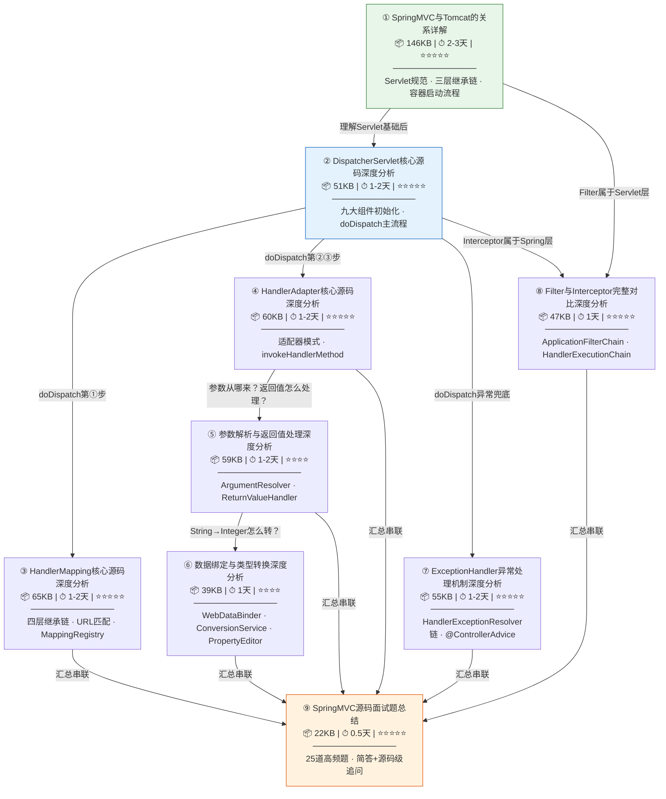

# 📚 Spring MVC 源码深度分析 — 阅读指南

> 📌 基于 **Spring Framework 5.3.39-SNAPSHOT** 源码
> 📁 本地源码路径：`/data/workspace/spring-framework/`
> 📖 共 **9 篇文档**，总计约 **54 万字符 / 12,000+ 行**

---

## 一、文档全景总览

本系列文档从 Tomcat 容器层出发，逐层深入 Spring MVC 核心组件，最终以面试题串联全局。覆盖了 Spring MVC 请求处理的**完整链路**。

### 1.1 知识地图



---

## 二、推荐阅读顺序

### 2.1 🏆 完整学习路径（推荐，约 10-15 天）

按以下顺序依次阅读，每篇都建立在前一篇的基础之上：

| 序号 | 文档名称 | 核心内容 | 预估时间 | 前置要求 |
|:---:|---------|---------|:-------:|---------|
| ① | **SpringMVC与Tomcat的关系详解** | Servlet 规范、三层继承链（HttpServletBean→FrameworkServlet→DispatcherServlet）、容器启动全流程、父子容器 | 2-3 天 | 了解 Java Web 基础（Servlet、Filter、Listener 的概念） |
| ② | **DispatcherServlet核心源码深度分析** | 九大策略组件初始化、`doDispatch()` 主流程、`processDispatchResult()` | 1-2 天 | ✅ 已读 ① |
| ③ | **HandlerMapping核心源码深度分析** | 四层继承链、URL 路径匹配、`MappingRegistry` 注册机制、CORS 处理 | 1-2 天 | ✅ 已读 ①② |
| ④ | **HandlerAdapter核心源码深度分析** | 适配器模式、`RequestMappingHandlerAdapter`、`invokeHandlerMethod()` | 1-2 天 | ✅ 已读 ①②③ |
| ⑤ | **参数解析与返回值处理深度分析** | 26 种 ArgumentResolver、15 种 ReturnValueHandler、HttpMessageConverter | 1-2 天 | ✅ 已读 ④ |
| ⑥ | **数据绑定与类型转换深度分析** | WebDataBinder、ConversionService、PropertyEditor、`@InitBinder` | 1 天 | ✅ 已读 ⑤ |
| ⑦ | **ExceptionHandler异常处理机制深度分析** | HandlerExceptionResolver 链、`@ExceptionHandler`、`@ControllerAdvice` | 1-2 天 | ✅ 已读 ②（理解 doDispatch 的 try-catch 边界） |
| ⑧ | **Filter与Interceptor完整对比深度分析** | Filter 链递归调用 vs Interceptor 正向/逆向遍历、选型建议 | 1 天 | ✅ 已读 ①②（同时了解 Servlet 层和 Spring 层） |
| ⑨ | **SpringMVC源码面试题总结** | 25 道高频面试题，简答 + 源码级追问 | 0.5 天 | ✅ 已读全部（用于最终回顾和查漏补缺） |

### 2.2 ⚡ 快速路径：面试突击（约 3-5 天）

如果时间紧张、以面试为目标，按以下优先级阅读：

```
必读（第 1-2 天）：
  ① SpringMVC与Tomcat的关系详解  → 重点看：一~三章（总体关系 + 继承链 + 启动流程）
  ② DispatcherServlet核心源码深度分析  → 重点看：全文（这是面试必考）

重点读（第 3-4 天）：
  ⑧ Filter与Interceptor完整对比深度分析  → 面试高频对比题
  ⑦ ExceptionHandler异常处理机制深度分析  → @ControllerAdvice 是面试热点

收尾（第 5 天）：
  ⑨ SpringMVC源码面试题总结  → 25题快速过一遍，查漏补缺
```

### 2.3 🎯 按兴趣点跳读

如果你只关心某个特定主题，可以直接跳到对应文档：

| 你想了解的问题 | 直接阅读 | 建议先看 |
|--------------|---------|---------|
| "一个 HTTP 请求在 Spring MVC 中怎么走的？" | ② DispatcherServlet | ① Tomcat 关系 |
| "@RequestMapping 是怎么匹配到方法的？" | ③ HandlerMapping | ②  |
| "@RequestBody 的 JSON 怎么变成 Java 对象的？" | ⑤ 参数解析 | ④ HandlerAdapter |
| "String 参数怎么自动转成 Integer 的？" | ⑥ 数据绑定 | ⑤ |
| "@ControllerAdvice 全局异常处理怎么工作的？" | ⑦ ExceptionHandler | ② |
| "Filter 和 Interceptor 到底有什么区别？" | ⑧ Filter与Interceptor | 可直接读 |
| "面试要问 Spring MVC 源码怎么办？" | ⑨ 面试题总结 | 建议全读 |

---

## 三、各文档详细信息

### ① SpringMVC与Tomcat的关系详解

| 属性 | 值 |
|-----|-----|
| **文件大小** | 146 KB / 3595 行 |
| **难度** | ⭐⭐⭐⭐ |
| **预估时间** | 2-3 天 |
| **前置知识** | Servlet / Filter / Listener 的基本概念 |

**章节概览**：
- 一、总体关系概览（房东房客模型）
- 二、Servlet 继承链全景（HttpServlet → HttpServletBean → FrameworkServlet → DispatcherServlet）
- 三、启动阶段：Tomcat 如何加载 Spring MVC
- 四、请求阶段：请求从 Tomcat 到 DispatcherServlet 的完整旅程
- 五、父子容器关系
- 六、嵌入式 Tomcat（Spring Boot 场景）
- 面试 Q&A

**核心价值**：这是整套文档的**地基**，理解了 Servlet 规范和容器机制，后续所有组件的分析才有根基。

---

### ② DispatcherServlet核心源码深度分析

| 属性 | 值 |
|-----|-----|
| **文件大小** | 51 KB / 1371 行 |
| **难度** | ⭐⭐⭐⭐⭐ |
| **预估时间** | 1-2 天 |
| **前置知识** | ① SpringMVC与Tomcat的关系详解 |

**章节概览**：
- 一、总体定位（前端控制器模式）
- 二、三层继承链 — 每层做了什么
- 三、初始化阶段 — 九大策略组件
- 四、请求处理阶段 — `doDispatch()` 逐行分析
- 五、`processDispatchResult()` — 视图渲染与异常处理
- 六、设计模式总结
- 面试 Q&A

**核心价值**：Spring MVC 的**心脏**，掌握 `doDispatch()` 就掌握了全局流程。

---

### ③ HandlerMapping核心源码深度分析

| 属性 | 值 |
|-----|-----|
| **文件大小** | 65 KB / 1691 行 |
| **难度** | ⭐⭐⭐⭐⭐ |
| **预估时间** | 1-2 天 |
| **前置知识** | ①② |

**章节概览**：
- 一、总体定位（doDispatch 中第一个被调用的组件）
- 二、四层继承链架构
- 三、初始化阶段 — `@RequestMapping` 如何注册到 MappingRegistry
- 四、运行时匹配 — 请求 URL 如何找到 HandlerMethod
- 五、CORS 跨域处理
- 六、PathPattern vs AntPathMatcher
- 面试 Q&A

**核心价值**：解答 "请求是怎么找到 Controller 方法的" 这个核心问题。

---

### ④ HandlerAdapter核心源码深度分析

| 属性 | 值 |
|-----|-----|
| **文件大小** | 60 KB / 1366 行 |
| **难度** | ⭐⭐⭐⭐⭐ |
| **预估时间** | 1-2 天 |
| **前置知识** | ①②③ |

**章节概览**：
- 一、总体定位（为什么需要适配器模式）
- 二、整体架构（HandlerAdapter 接口 → AbstractHandlerMethodAdapter → RequestMappingHandlerAdapter）
- 三、`RequestMappingHandlerAdapter.afterPropertiesSet()` — 初始化参数解析器、返回值处理器
- 四、`invokeHandlerMethod()` — 从 HandlerMethod 到反射调用的全流程
- 五、`@InitBinder` / `@ModelAttribute` 的处理
- 面试 Q&A

**核心价值**：连接 "找到 Handler" 和 "执行 Handler" 的桥梁，是理解参数解析和返回值处理的入口。

---

### ⑤ 参数解析与返回值处理深度分析

| 属性 | 值 |
|-----|-----|
| **文件大小** | 59 KB / 1366 行 |
| **难度** | ⭐⭐⭐⭐ |
| **预估时间** | 1-2 天 |
| **前置知识** | ④ HandlerAdapter |

**章节概览**：
- 一、总体定位（Handler 方法的入口和出口）
- 二、整体架构与调用入口
- 三、ArgumentResolver 体系 — 26 种参数解析器详解
- 四、ReturnValueHandler 体系 — 15 种返回值处理器详解
- 五、HttpMessageConverter 机制
- 六、`@RequestBody` / `@ResponseBody` 完整流程
- 面试 Q&A

**核心价值**：解答 "Controller 方法参数从哪来、返回值怎么变成 HTTP 响应" 的核心问题。

---

### ⑥ 数据绑定与类型转换深度分析

| 属性 | 值 |
|-----|-----|
| **文件大小** | 39 KB / 955 行 |
| **难度** | ⭐⭐⭐⭐ |
| **预估时间** | 1 天 |
| **前置知识** | ⑤ 参数解析 |

**章节概览**：
- 一、总体定位（String → Integer 怎么转？name=张三&age=18 怎么变成 User 对象？）
- 二、整体架构全景图
- 三、WebDataBinder 核心流程
- 四、ConversionService 体系
- 五、PropertyEditor 体系（遗留兼容）
- 六、TypeConverterDelegate — 转换的最终执行者
- 七、`@InitBinder` 安全问题（disallowedFields）
- 面试 Q&A + 与参数解析文档的交叉引用表

**核心价值**：深入类型转换的底层实现，是参数解析的"最后一公里"。

---

### ⑦ ExceptionHandler异常处理机制深度分析

| 属性 | 值 |
|-----|-----|
| **文件大小** | 55 KB / 1371 行 |
| **难度** | ⭐⭐⭐⭐⭐ |
| **预估时间** | 1-2 天 |
| **前置知识** | ② DispatcherServlet（理解 doDispatch 的 try-catch 边界） |

**章节概览**：
- 一、总体定位（为什么需要异常处理机制）
- 二、整体架构（HandlerExceptionResolver 类继承体系）
- 三、DispatcherServlet 中的异常捕获入口
- 四、三个内置 ExceptionResolver 的职责划分与优先级
- 五、ExceptionHandlerExceptionResolver 源码全链路
- 六、`@ControllerAdvice` 的初始化与运行时查找
- 面试 Q&A

**核心价值**：理解 Spring MVC 如何在异常到达 Servlet 容器之前将其消化，返回统一格式的错误响应。

---

### ⑧ Filter与Interceptor完整对比深度分析

| 属性 | 值 |
|-----|-----|
| **文件大小** | 47 KB / 1139 行 |
| **难度** | ⭐⭐⭐⭐ |
| **预估时间** | 1 天 |
| **前置知识** | ①（Servlet 层 Filter）+ ②（Spring 层 Interceptor），可独立阅读 |

**章节概览**：
- 一、总体定位（面试高频对比题）
- 二、整体架构：请求链路中的位置关系
- 三、Filter 源码分析（ApplicationFilterChain 递归调用 / 洋葱模型）
- 四、Interceptor 源码分析（HandlerExecutionChain 正向/逆向遍历）
- 五、深度对比表（执行时机、异常行为、数据结构、性能等）
- 六、实际开发选型建议
- 面试 Q&A

**核心价值**：面试必考题的终极答案，从源码层面彻底理清两者的区别。

---

### ⑨ SpringMVC源码面试题总结

| 属性 | 值 |
|-----|-----|
| **文件大小** | 22 KB / 475 行 |
| **难度** | ⭐⭐⭐（复习向） |
| **预估时间** | 0.5 天 |
| **前置知识** | 建议先读完 ①-⑧（用于查漏补缺），也可直接阅读（用于快速了解面试范围） |

**内容概览**：
- 25 道高频面试题，按面试频率排序
- 每题包含 **简答（30秒版）** + **源码级追问**
- 涵盖：请求全流程、九大组件、HandlerMapping、HandlerAdapter、参数解析、异常处理、Filter vs Interceptor、设计模式等

**核心价值**：全系列的串联和收尾，面试前最后过一遍的利器。

---

## 四、学习建议

### 💡 1. 边读边调试

本文档基于本地 Spring Framework 源码编写，建议在 IDE 中打开项目：
```
/data/workspace/spring-framework/
```
阅读每篇文档时，跟着文中标注的 **源码路径和行号**（如 `DispatcherServlet.java L1031-1112`）在 IDE 中打断点，实际跑一遍加深理解。

### 💡 2. 先看流程图，再看源码

每篇文档都包含大量 **Mermaid 流程图 / 类图 / 时序图**。建议先看图建立整体印象，再深入看代码细节。

### 💡 3. 关注"为什么"，而不只是"是什么"

文档中大量分析了设计决策的原因（如"为什么用数组而不用 ArrayList"、"为什么缓存用软引用"等），这些是面试中区分深度的关键。

### 💡 4. 善用文档间的交叉引用

文档之间有明确的关联（如数据绑定文档末尾的"与参数解析文档的交叉引用表"），遇到跨文档的引用时建议跳转过去看一下。

### 💡 5. 面试前用 ⑨ 做最终检查

读完全系列后，用第 ⑨ 篇面试题总结做一次自测，看看是否每个问题都能用源码级的深度回答出来。

---

## 五、前置学习：Tomcat 源码系列

本系列文档假设读者已了解 **Tomcat 容器层**的工作原理。如果尚未学习，建议先阅读 Tomcat 源码系列，建立完整的请求处理链路认知：

👉 **[Tomcat 8.5 源码深度分析 — 阅读指南](../Tomcat源码/README.md)**

### 5.1 跨系列综合文档

**[📊 完整请求链路深度分析](../完整请求链路深度分析.md)** — 打通 Tomcat + Spring MVC 的完整数据流

这份文档串联两个系列，覆盖从浏览器请求到 Controller 返回的完整链路，包含：
- 14 个阶段详解（Acceptor → Controller → 响应）
- 完整方法调用栈（50+ 层）
- 日志验证配置与实际输出
- 断点调试建议
- 面试高频问题

**为什么需要先学 Tomcat？**

Spring MVC 运行在 Servlet 容器（Tomcat）之上，请求首先经过 Tomcat 的 NIO 网络层、HTTP 协议解析、Mapper 路由，最终才到达 `DispatcherServlet`。不理解 Tomcat 层，Spring MVC 的源码分析就缺少根基。

**推荐学习路径**：

```
Tomcat 系列（网络层 + 容器层）
    ↓
① SpringMVC与Tomcat的关系详解（衔接层）
    ↓
Spring MVC 系列（框架层）
```

| 最少必要 Tomcat 知识 | 对应文档 | 作用 |
|-------------------|---------|------|
| NIO 三线程模型 | [NIO深度剖析](../Tomcat源码/Tomcat源码_NIO深度剖析.md) | 理解请求如何被接受和处理 |
| HTTP 协议解析 | [HTTP协议解析深度剖析](../Tomcat源码/Tomcat源码_HTTP协议解析深度剖析.md) | 理解请求如何被解析成对象 |
| Pipeline/Valve 责任链 | [深度专题分析 - Pipeline/Valve](../Tomcat源码/Tomcat源码深度专题分析.md) | 理解请求如何在容器层流转 |
