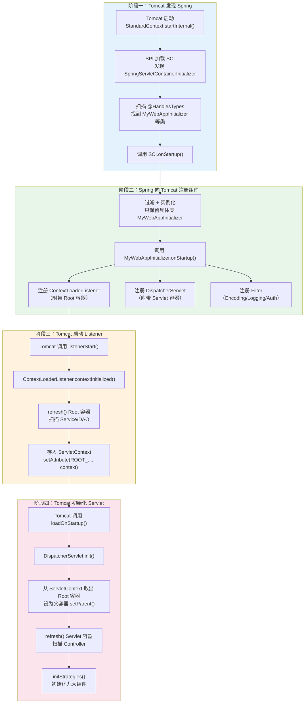
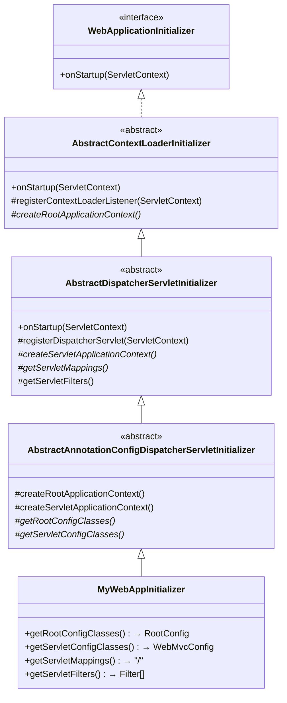
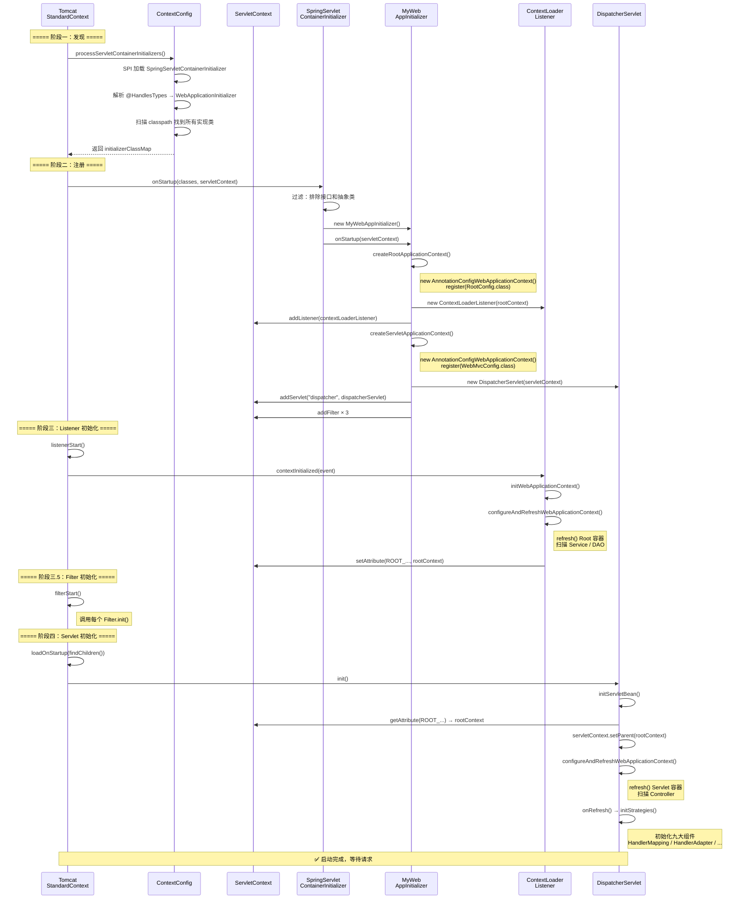

# Spring MVC 与 Tomcat 的关系详解

> **系列第 ① 篇** — 本篇聚焦一个核心问题：**Tomcat 是如何启动 Spring MVC 的？**
>
> 全文围绕 **启动阶段** 展开，不涉及请求处理流程。
> DispatcherServlet 的请求分发流程请参考 → [DispatcherServlet核心源码深度分析](./DispatcherServlet核心源码深度分析.md)

---

## 目录

- [一、一句话总结：Tomcat 与 Spring MVC 的关系](#一一句话总结tomcat-与-spring-mvc-的关系)
- [二、Demo 项目结构](#二demo-项目结构)
- [三、全局启动流程总览（先看全貌）](#三全局启动流程总览先看全貌)
- [四、阶段一：Tomcat 发现 Spring（SCI + SPI 机制）](#四阶段一tomcat-发现-springsci--spi-机制)
- [五、阶段二：Spring 向 Tomcat 注册组件（WebApplicationInitializer 继承链）](#五阶段二spring-向-tomcat-注册组件webapplicationinitializer-继承链)
- [六、阶段三：Tomcat 启动 Listener → Root 容器初始化](#六阶段三tomcat-启动-listener--root-容器初始化)
- [七、阶段四：Tomcat 初始化 Servlet → 子容器初始化 + 九大组件](#七阶段四tomcat-初始化-servlet--子容器初始化--九大组件)
- [八、父子容器架构](#八父子容器架构)
- [九、ServletContext：Tomcat 与 Spring 之间的桥梁](#九servletcontext-tomcat-与-spring-之间的桥梁)
- [十、与 Spring Boot 的对比](#十与-spring-boot-的对比)
- [十一、调试指南](#十一调试指南)
- [十二、总结](#十二总结)

---

## 一、一句话总结：Tomcat 与 Spring MVC 的关系

```
Tomcat 是 Servlet 容器，Spring MVC 是 Servlet 框架。
Tomcat 负责网络通信（接收 HTTP 请求），Spring MVC 负责业务分发（路由到 Controller）。
两者通过 Servlet 规范连接，DispatcherServlet 就是那个连接点。
```

用一个比喻：

| 角色 | 说明 |
|------|------|
| Tomcat | 酒店前台，接待客人（接收 HTTP 请求） |
| DispatcherServlet | 大堂经理，分配客人去哪个房间（路由到 Controller） |
| Controller | 具体的服务人员，真正干活 |

**本篇要回答的核心问题**：酒店开业时，前台（Tomcat）是怎么找到并安排大堂经理（DispatcherServlet）上岗的？

---

## 二、Demo 项目结构

本篇所有源码分析基于以下 Demo 项目：

```
com.debug.mvc_demo/
├── MvcApplication.java          ← 启动类（两种启动方式）
├── MyWebAppInitializer.java     ← WebApplicationInitializer 实现类（SCI 入口）
├── RootConfig.java              ← 父容器配置（Service/DAO）
├── WebMvcConfig.java            ← 子容器配置（Controller/Interceptor）
└── HelloController.java         ← 测试 Controller
```

启动方式选择（在 `MvcApplication.java` 中）：

| 方式 | 方法 | 特点 | 适合场景 |
|------|------|------|---------|
| **SCI 模式** | `startWithSCI()` | 完整模拟传统 WAR 部署，有父子容器 | **研究 Tomcat + Spring MVC 连接点**（本篇重点） |
| 手动模式 | `startManually()` | 跳过 SCI，手动注册 DispatcherServlet | 初次学习 DispatcherServlet 处理流程 |

本篇以 **SCI 模式** 为例。

---

## 三、全局启动流程总览（先看全貌）

**先记住这张图，后面每一章都是展开其中一个阶段。**



> **关键认知**：整个启动过程的驱动者始终是 **Tomcat**，Spring 只是在 Tomcat 提供的回调点中"插入"自己的逻辑。

---

## 四、阶段一：Tomcat 发现 Spring（SCI + SPI 机制）

### 4.1 问题：Tomcat 怎么知道要调用 Spring？

答案：**Servlet 3.0 的 SCI（ServletContainerInitializer）机制 + Java SPI**。

这是一个标准的 **服务发现** 过程，和 `java.sql.Driver` 的自动发现原理一样。

### 4.2 SPI 发现过程

Tomcat 启动时，`ContextConfig.processServletContainerInitializers()` 通过 SPI 扫描所有 JAR 包中的配置文件：

```java:1583:1600:/data/workspace/tomcat/java/org/apache/catalina/startup/ContextConfig.java
    protected void processServletContainerInitializers() {
        // 用来存储所有的 ServletContainerInitializer 实现类
        List<ServletContainerInitializer> detectedScis;
        try {
            /*
                使用 SPI 机制加载 ServletContainerInitializer
                    扫描所有JAR包中的：META-INF/services/javax.servlet.ServletContainerInitializer
                        - 比如Spring中的：org.springframework.web.SpringServletContainerInitializer
                    读取文件内容,找到所有SCI实现类的全限定名
                    反射创建SCI实例
            */
            WebappServiceLoader<ServletContainerInitializer> loader = new WebappServiceLoader<>(context);
            detectedScis = loader.load(ServletContainerInitializer.class);
        } catch (IOException e) {
            log.error(sm.getString("contextConfig.servletContainerInitializerFail", context.getName()), e);
            ok = false;
            return;
        }
```

Tomcat 读取的 SPI 配置文件位于 Spring 的 `spring-web` 模块中：

```text:1:1:/data/workspace/spring-framework/spring-web/src/main/resources/META-INF/services/javax.servlet.ServletContainerInitializer
org.springframework.web.SpringServletContainerInitializer
```

### 4.3 解析 @HandlesTypes 注解

找到 SCI 后，Tomcat 读取它上面的 `@HandlesTypes` 注解，确定这个 SCI 关心哪些类型：

```java:1602:1649:/data/workspace/tomcat/java/org/apache/catalina/startup/ContextConfig.java
        // 依次处理每一个 ServletContainerInitializer 实现类
        for (ServletContainerInitializer sci : detectedScis) {
            /*
                暂时为每个SCI创建空的类集合 - 后续会填充
                    initializerClassMap = {
                        SpringServletContainerInitializer -> HashSet(),
                        ...
                    }
            */
            initializerClassMap.put(sci, new HashSet<Class<?>>());

            // 解析 @HandlesTypes注解,建立类型映射
            HandlesTypes ht;
            try {
                // 获取 SCI 上的 @HandlesTypes 注解
                ht = sci.getClass().getAnnotation(HandlesTypes.class);
            } catch (Exception e) {
                if (log.isDebugEnabled()) {
                    log.info(sm.getString("contextConfig.sci.debug", sci.getClass().getName()), e);
                } else {
                    log.info(sm.getString("contextConfig.sci.info", sci.getClass().getName()));
                }
                continue;
            }
            if (ht == null) {
                continue; // 该 SCI 不关心任何类型
            }
             // 获取 SCI 感兴趣的类型数组
            Class<?>[] types = ht.value();
            if (types == null) {
                continue;
            }

            for (Class<?> type : types) {
                // 判断类型是注解还是普通类/接口
                if (type.isAnnotation()) {
                    handlesTypesAnnotations = true; // 需要扫描注解
                } else {
                    handlesTypesNonAnnotations = true; // 需要扫描类/接口
                }
                // 建立"类型 -> SCI"的反向映射
                Set<ServletContainerInitializer> scis = typeInitializerMap.get(type);
                if (scis == null) {
                    scis = new HashSet<>();
                    typeInitializerMap.put(type, scis);
                }
                scis.add(sci);
            }
        }
```

结果：Tomcat 建立了两个映射关系：

```
initializerClassMap:
  SpringServletContainerInitializer → {MyWebAppInitializer.class, AbstractContextLoaderInitializer.class, ...}

typeInitializerMap:
  WebApplicationInitializer.class → {SpringServletContainerInitializer}
```

> **注意**：Tomcat 扫描出的集合可能包含接口、抽象类和具体类。后续由 Spring 自己过滤。

### 4.4 Tomcat 调用 SCI.onStartup()

在 `StandardContext.startInternal()` 中，Tomcat 按固定顺序执行四个阶段：

```java:4990:5059:/data/workspace/tomcat/java/org/apache/catalina/core/StandardContext.java
            // Call ServletContainerInitializers
            /*
                重要逻辑：回调所有 SCI 的 onStartup()
                    - Spring框架的入口就在这里：SpringServletContainerInitializer.onStartup()
            */
            for (Map.Entry<ServletContainerInitializer,Set<Class<?>>> entry : initializers.entrySet()) {
                try {
                    entry.getKey().onStartup(entry.getValue(), getServletContext());
                } catch (ServletException e) {
                    log.error(sm.getString("standardContext.sciFail"), e);
                    ok = false;
                    break;
                }
            }

            // Configure and call application event listeners
            /*
                启动应用监听器
                    - 实例化并启动所有 ServletContextListener
                    - Spring 的 ContextLoaderListener 在这里被启动
                    - 触发 contextInitialized() 事件，Spring 容器初始化就发生在这里
            */
            if (ok) {
                if (!listenerStart()) {
                    log.error(sm.getString("standardContext.listenerFail"));
                    ok = false;
                }
            }

            // ...省略安全约束检查...

            // Configure and call application filters
            /*
                初始化 Filter
                    - 遍历所有 FilterDef ，创建 ApplicationFilterConfig
                    - 调用 Filter 的 init() 方法
                    - 构建 Filter 链，为请求处理做准备

            */
            if (ok) {
                if (!filterStart()) {
                    log.error(sm.getString("standardContext.filterFail"));
                    ok = false;
                }
            }

            // Load and initialize all "load on startup" servlets
            /*
                加载并初始化启动时加载的 Servlet
                    - 加载所有 load-on-startup >= 0 的 Servlet
                    - 调用 Servlet 的 init() 方法 「Spring MVC 的 DispatcherServlet 就在这里被初始化」
            */
            if (ok) {
                if (!loadOnStartup(findChildren())) {
```

**四个阶段的严格顺序**：

| 顺序 | Tomcat 做了什么 | Spring 在这里做了什么 |
|------|----------------|---------------------|
| ① SCI | `entry.getKey().onStartup(...)` | Spring **注册** ContextLoaderListener + DispatcherServlet + Filter |
| ② Listener | `listenerStart()` | ContextLoaderListener.**contextInitialized()** → 创建 Root 容器 |
| ③ Filter | `filterStart()` | Filter.init() |
| ④ Servlet | `loadOnStartup(findChildren())` | DispatcherServlet.**init()** → 创建 Servlet 容器 + 九大组件 |

> **理解要点**：阶段 ① 只是"注册"（告诉 Tomcat "等会儿要启动这些组件"），阶段 ②③④ 才是真正的"初始化"。

---

## 五、阶段二：Spring 向 Tomcat 注册组件（WebApplicationInitializer 继承链）

### 5.1 SpringServletContainerInitializer.onStartup()

这是 **Spring 代码第一次被 Tomcat 调用**，也就是阶段一和阶段二的连接点：

```java:113:176:/data/workspace/spring-framework/spring-web/src/main/java/org/springframework/web/SpringServletContainerInitializer.java
@HandlesTypes(WebApplicationInitializer.class)
public class SpringServletContainerInitializer implements ServletContainerInitializer {

	@Override
	public void onStartup(@Nullable Set<Class<?>> webAppInitializerClasses, ServletContext servletContext)
			throws ServletException {

		List<WebApplicationInitializer> initializers = Collections.emptyList();

		if (webAppInitializerClasses != null) {
			initializers = new ArrayList<>(webAppInitializerClasses.size());
			for (Class<?> waiClass : webAppInitializerClasses) {
				// Be defensive: Some servlet containers provide us with invalid classes,
				// no matter what @HandlesTypes says...
				if (!waiClass.isInterface() && !Modifier.isAbstract(waiClass.getModifiers()) &&
						WebApplicationInitializer.class.isAssignableFrom(waiClass)) {
					try {
						initializers.add((WebApplicationInitializer)
								ReflectionUtils.accessibleConstructor(waiClass).newInstance());
					}
					catch (Throwable ex) {
						throw new ServletException("Failed to instantiate WebApplicationInitializer class", ex);
					}
				}
			}
		}

		if (initializers.isEmpty()) {
			servletContext.log("No Spring WebApplicationInitializer types detected on classpath");
			return;
		}

		servletContext.log(initializers.size() + " Spring WebApplicationInitializers detected on classpath");
		AnnotationAwareOrderComparator.sort(initializers);
		for (WebApplicationInitializer initializer : initializers) {
			initializer.onStartup(servletContext);
		}
	}

}
```

这个方法做了 **4 件事**：

| 步骤 | 代码 | 说明 |
|------|------|------|
| ① 过滤 | `!waiClass.isInterface() && !Modifier.isAbstract(...)` | Tomcat 传入的集合可能包含接口（`WebApplicationInitializer`）和抽象类（`AbstractContextLoaderInitializer` 等），Spring 只保留**具体类** |
| ② 实例化 | `ReflectionUtils.accessibleConstructor(waiClass).newInstance()` | 反射调用无参构造器，创建 `MyWebAppInitializer` 实例 |
| ③ 排序 | `AnnotationAwareOrderComparator.sort(initializers)` | 支持 `@Order` 注解控制多个 Initializer 的执行顺序 |
| ④ 逐个调用 | `initializer.onStartup(servletContext)` | 把 Tomcat 的 `ServletContext` 传给每个 Initializer |

在我们的 Demo 中，过滤后只剩 **一个具体类**：`MyWebAppInitializer`。

### 5.2 WebApplicationInitializer 继承链（核心！）

`MyWebAppInitializer.onStartup()` 的执行过程涉及一条继承链，**每层干一件事**：



### 5.3 调用链详解：onStartup() 的执行过程

当 `SpringServletContainerInitializer` 调用 `MyWebAppInitializer.onStartup(servletContext)` 时，实际执行过程如下：

#### 第一步：AbstractDispatcherServletInitializer.onStartup()

```java:61:65:/data/workspace/spring-framework/spring-webmvc/src/main/java/org/springframework/web/servlet/support/AbstractDispatcherServletInitializer.java
	@Override
	public void onStartup(ServletContext servletContext) throws ServletException {
		super.onStartup(servletContext);       // → 先调父类，注册 ContextLoaderListener
		registerDispatcherServlet(servletContext);  // → 再注册 DispatcherServlet + Filter
	}
```

#### 第二步：super.onStartup() → AbstractContextLoaderInitializer.onStartup()

```java:48:51:/data/workspace/spring-framework/spring-web/src/main/java/org/springframework/web/context/AbstractContextLoaderInitializer.java
	@Override
	public void onStartup(ServletContext servletContext) throws ServletException {
		registerContextLoaderListener(servletContext);
	}
```

#### 第三步：registerContextLoaderListener() — 注册 Root 容器 + Listener

```java:59:70:/data/workspace/spring-framework/spring-web/src/main/java/org/springframework/web/context/AbstractContextLoaderInitializer.java
	protected void registerContextLoaderListener(ServletContext servletContext) {
		WebApplicationContext rootAppContext = createRootApplicationContext();
		if (rootAppContext != null) {
			ContextLoaderListener listener = new ContextLoaderListener(rootAppContext);
			listener.setContextInitializers(getRootApplicationContextInitializers());
			servletContext.addListener(listener);
		}
		else {
			logger.debug("No ContextLoaderListener registered, as " +
					"createRootApplicationContext() did not return an application context");
		}
	}
```

这里的 `createRootApplicationContext()` 由子类 `AbstractAnnotationConfigDispatcherServletInitializer` 实现：

```java:53:65:/data/workspace/spring-framework/spring-webmvc/src/main/java/org/springframework/web/servlet/support/AbstractAnnotationConfigDispatcherServletInitializer.java
	@Override
	@Nullable
	protected WebApplicationContext createRootApplicationContext() {
		Class<?>[] configClasses = getRootConfigClasses();  // → MyWebAppInitializer 返回 RootConfig.class
		if (!ObjectUtils.isEmpty(configClasses)) {
			AnnotationConfigWebApplicationContext context = new AnnotationConfigWebApplicationContext();
			context.register(configClasses);  // 注册配置类，还没有 refresh()！
			return context;
		}
		else {
			return null;
		}
	}
```

> **关键**：此时 Root 容器只是被 **创建** 了，还没有 `refresh()`（即还没有扫描 Bean）。
> 真正的 `refresh()` 发生在 **阶段三**，由 Tomcat 触发 Listener 时执行。

#### 第四步：registerDispatcherServlet() — 注册 DispatcherServlet + Filter

```java:78:107:/data/workspace/spring-framework/spring-webmvc/src/main/java/org/springframework/web/servlet/support/AbstractDispatcherServletInitializer.java
	protected void registerDispatcherServlet(ServletContext servletContext) {
		String servletName = getServletName();
		Assert.hasLength(servletName, "getServletName() must not return null or empty");

		WebApplicationContext servletAppContext = createServletApplicationContext();
		Assert.notNull(servletAppContext, "createServletApplicationContext() must not return null");

		FrameworkServlet dispatcherServlet = createDispatcherServlet(servletAppContext);
		Assert.notNull(dispatcherServlet, "createDispatcherServlet(WebApplicationContext) must not return null");
		dispatcherServlet.setContextInitializers(getServletApplicationContextInitializers());

		ServletRegistration.Dynamic registration = servletContext.addServlet(servletName, dispatcherServlet);
		if (registration == null) {
			throw new IllegalStateException("Failed to register servlet with name '" + servletName + "'. " +
					"Check if there is another servlet registered under the same name.");
		}

		registration.setLoadOnStartup(1);
		registration.addMapping(getServletMappings());       // → MyWebAppInitializer 返回 "/"
		registration.setAsyncSupported(isAsyncSupported());

		Filter[] filters = getServletFilters();               // → MyWebAppInitializer 返回 3 个 Filter
		if (!ObjectUtils.isEmpty(filters)) {
			for (Filter filter : filters) {
				registerServletFilter(servletContext, filter);
			}
		}

		customizeRegistration(registration);
	}
```

`createServletApplicationContext()` 同样只是创建容器、注册配置类，**不 refresh()**：

```java:73:80:/data/workspace/spring-framework/spring-webmvc/src/main/java/org/springframework/web/servlet/support/AbstractAnnotationConfigDispatcherServletInitializer.java
	@Override
	protected WebApplicationContext createServletApplicationContext() {
		AnnotationConfigWebApplicationContext context = new AnnotationConfigWebApplicationContext();
		Class<?>[] configClasses = getServletConfigClasses();  // → MyWebAppInitializer 返回 WebMvcConfig.class
		if (!ObjectUtils.isEmpty(configClasses)) {
			context.register(configClasses);
		}
		return context;
	}
```

### 5.4 阶段二结束后的状态

```
ServletContext 中注册了以下组件（都还没初始化）：

Listener:
  └── ContextLoaderListener（持有未 refresh 的 Root 容器, 配置类 = RootConfig.class）

Servlet:
  └── "dispatcher" → DispatcherServlet（持有未 refresh 的 Servlet 容器, 配置类 = WebMvcConfig.class）
       loadOnStartup = 1, mapping = "/"

Filter:
  ├── CharacterEncodingFilter → encoding=UTF-8
  ├── LoggingFilter → 请求日志
  └── AuthFilter → 认证检查
```

---

## 六、阶段三：Tomcat 启动 Listener → Root 容器初始化

阶段二只是"注册"，现在 Tomcat 开始按顺序启动这些组件。

### 6.1 Tomcat 调用 listenerStart()

回到 `StandardContext.startInternal()` 的第二个阶段：Tomcat 遍历所有已注册的 `ServletContextListener`，调用它们的 `contextInitialized()` 方法。

### 6.2 ContextLoaderListener.contextInitialized()

```java:101:104:/data/workspace/spring-framework/spring-web/src/main/java/org/springframework/web/context/ContextLoaderListener.java
	@Override
	public void contextInitialized(ServletContextEvent event) {
		initWebApplicationContext(event.getServletContext());
	}
```

委托给父类 `ContextLoader.initWebApplicationContext()`：

```java:247:297:/data/workspace/spring-framework/spring-web/src/main/java/org/springframework/web/context/ContextLoader.java
	public WebApplicationContext initWebApplicationContext(ServletContext servletContext) {
		if (servletContext.getAttribute(WebApplicationContext.ROOT_WEB_APPLICATION_CONTEXT_ATTRIBUTE) != null) {
			throw new IllegalStateException(
					"Cannot initialize context because there is already a root application context present - " +
					"check whether you have multiple ContextLoader* definitions in your web.xml!");
		}

		servletContext.log("Initializing Spring root WebApplicationContext");
		Log logger = LogFactory.getLog(ContextLoader.class);
		if (logger.isInfoEnabled()) {
			logger.info("Root WebApplicationContext: initialization started");
		}
		long startTime = System.currentTimeMillis();

		try {
			// Store context in local instance variable, to guarantee that
			// it is available on ServletContext shutdown.
			if (this.context == null) {
				this.context = createWebApplicationContext(servletContext);
			}
			if (this.context instanceof ConfigurableWebApplicationContext) {
				ConfigurableWebApplicationContext cwac = (ConfigurableWebApplicationContext) this.context;
				if (!cwac.isActive()) {
					// The context has not yet been refreshed -> provide services such as
					// setting the parent context, setting the application context id, etc
					if (cwac.getParent() == null) {
						// The context instance was injected without an explicit parent ->
						// determine parent for root web application context, if any.
						ApplicationContext parent = loadParentContext(servletContext);
						cwac.setParent(parent);
					}
					configureAndRefreshWebApplicationContext(cwac, servletContext);
				}
			}
			servletContext.setAttribute(WebApplicationContext.ROOT_WEB_APPLICATION_CONTEXT_ATTRIBUTE, this.context);

			ClassLoader ccl = Thread.currentThread().getContextClassLoader();
			if (ccl == ContextLoader.class.getClassLoader()) {
				currentContext = this.context;
			}
			else if (ccl != null) {
				currentContextPerThread.put(ccl, this.context);
			}

			if (logger.isInfoEnabled()) {
				long elapsedTime = System.currentTimeMillis() - startTime;
				logger.info("Root WebApplicationContext initialized in " + elapsedTime + " ms");
			}

			return this.context;
		}
		catch (RuntimeException | Error ex) {
			logger.error("Context initialization failed", ex);
			servletContext.setAttribute(WebApplicationContext.ROOT_WEB_APPLICATION_CONTEXT_ATTRIBUTE, ex);
			throw ex;
		}
	}
```

这个方法做了 **3 件关键的事**：

| 步骤 | 代码 | 说明 |
|------|------|------|
| ① 检查重复 | `getAttribute(ROOT_...)` | 防止 Root 容器被创建两次 |
| ② **refresh 容器** | `configureAndRefreshWebApplicationContext(cwac, servletContext)` | **这里才真正触发 Bean 扫描**，扫描 `RootConfig` 配置的 Service、DAO 等 |
| ③ **存入 ServletContext** | `setAttribute(ROOT_WEB_APPLICATION_CONTEXT_ATTRIBUTE, this.context)` | **关键桥梁！** 后面 DispatcherServlet 就是通过这个 attribute 找到 Root 容器的 |

> **理解要点**：`servletContext.setAttribute(...)` 就是 Tomcat 和 Spring 之间传递数据的"信使"。
> Root 容器被存进去，后面 DispatcherServlet 再从中取出来设为父容器。

---

## 七、阶段四：Tomcat 初始化 Servlet → 子容器初始化 + 九大组件

### 7.1 Tomcat 调用 loadOnStartup()

`StandardContext.startInternal()` 的第四个阶段：Tomcat 找到所有 `loadOnStartup >= 0` 的 Servlet（我们的 DispatcherServlet 设置了 `loadOnStartup = 1`），调用它们的 `init()` 方法。

### 7.2 DispatcherServlet 的继承链

```
HttpServlet                     ← Servlet 规范：init(ServletConfig)
  └── HttpServletBean           ← Spring：将 init-param 绑定到 Bean 属性
      └── FrameworkServlet      ← Spring：管理 WebApplicationContext（本阶段重点）
          └── DispatcherServlet ← Spring：initStrategies() 初始化九大组件
```

> 继承链每一层的详细源码分析 → [DispatcherServlet核心源码深度分析](./DispatcherServlet核心源码深度分析.md#二三层继承链概览)

### 7.3 FrameworkServlet.initWebApplicationContext()（关键！）

当 Tomcat 调用 `DispatcherServlet.init()` 后，经过继承链最终到达 `FrameworkServlet.initServletBean()`：

```java:522:549:/data/workspace/spring-framework/spring-webmvc/src/main/java/org/springframework/web/servlet/FrameworkServlet.java
	@Override
	protected final void initServletBean() throws ServletException {
		getServletContext().log("Initializing Spring " + getClass().getSimpleName() + " '" + getServletName() + "'");
		if (logger.isInfoEnabled()) {
			logger.info("Initializing Servlet '" + getServletName() + "'");
		}
		long startTime = System.currentTimeMillis();

		try {
			this.webApplicationContext = initWebApplicationContext();
			initFrameworkServlet();
		}
		catch (ServletException | RuntimeException ex) {
			logger.error("Context initialization failed", ex);
			throw ex;
		}

		if (logger.isDebugEnabled()) {
			String value = this.enableLoggingRequestDetails ?
					"shown which may lead to unsafe logging of potentially sensitive data" :
					"masked to prevent unsafe logging of potentially sensitive data";
			logger.debug("enableLoggingRequestDetails='" + this.enableLoggingRequestDetails +
					"': request parameters and headers will be " + value);
		}

		if (logger.isInfoEnabled()) {
			logger.info("Completed initialization in " + (System.currentTimeMillis() - startTime) + " ms");
		}
	}
```

核心在 `initWebApplicationContext()`：

```java:560:610:/data/workspace/spring-framework/spring-webmvc/src/main/java/org/springframework/web/servlet/FrameworkServlet.java
	protected WebApplicationContext initWebApplicationContext() {
		WebApplicationContext rootContext =
				WebApplicationContextUtils.getWebApplicationContext(getServletContext());
		WebApplicationContext wac = null;

		if (this.webApplicationContext != null) {
			// A context instance was injected at construction time -> use it
			wac = this.webApplicationContext;
			if (wac instanceof ConfigurableWebApplicationContext) {
				ConfigurableWebApplicationContext cwac = (ConfigurableWebApplicationContext) wac;
				if (!cwac.isActive()) {
					// The context has not yet been refreshed -> provide services such as
					// setting the parent context, setting the application context id, etc
					if (cwac.getParent() == null) {
						// The context instance was injected without an explicit parent -> set
						// the root application context (if any; may be null) as the parent
						cwac.setParent(rootContext);
					}
					configureAndRefreshWebApplicationContext(cwac);
				}
			}
		}
		if (wac == null) {
			// No context instance was injected at construction time -> see if one
			// has been registered in the servlet context. If one exists, it is assumed
			// that the parent context (if any) has already been set and that the
			// user has performed any initialization such as setting the context id
			wac = findWebApplicationContext();
		}
		if (wac == null) {
			// No context instance is defined for this servlet -> create a local one
			wac = createWebApplicationContext(rootContext);
		}

		if (!this.refreshEventReceived) {
			// Either the context is not a ConfigurableApplicationContext with refresh
			// support or the context injected at construction time had already been
			// refreshed -> trigger initial onRefresh manually here.
			synchronized (this.onRefreshMonitor) {
				onRefresh(wac);
			}
		}

		if (this.publishContext) {
			// Publish the context as a servlet context attribute.
			String attrName = getServletContextAttributeName();
			getServletContext().setAttribute(attrName, wac);
		}

		return wac;
	}
```

**逐步分析**：

| 行 | 代码 | 说明 |
|----|------|------|
| 561-562 | `WebApplicationContextUtils.getWebApplicationContext(getServletContext())` | **从 ServletContext 中取出 Root 容器**（阶段三存入的那个） |
| 565 | `this.webApplicationContext != null` | ✅ 成立！因为阶段二中 `createDispatcherServlet(servletAppContext)` 时，已经把 Servlet 容器注入了 |
| 573 | `cwac.getParent() == null` | ✅ 成立！还没设置父容器 |
| 576 | `cwac.setParent(rootContext)` | **🔥 关键！设置父子关系：Servlet 容器.parent = Root 容器** |
| 578 | `configureAndRefreshWebApplicationContext(cwac)` | **refresh Servlet 容器**，扫描 `WebMvcConfig` 配置的 Controller 等 |
| 599 | `onRefresh(wac)` | 被 `DispatcherServlet` 重写 → **调用 `initStrategies()` 初始化九大组件** |

> **九大组件初始化的详细源码** → [DispatcherServlet核心源码深度分析](./DispatcherServlet核心源码深度分析.md#五dispatcherservlet9-大组件初始化)

### 7.4 阶段四完成后的状态

```
Tomcat
  └── StandardContext
        ├── ServletContext
        │     ├── attribute: ROOT_WEB_APPLICATION_CONTEXT_ATTRIBUTE → Root 容器 ✅
        │     └── attribute: FrameworkServlet.CONTEXT.dispatcher → Servlet 容器 ✅
        │
        ├── Listener: ContextLoaderListener ✅ (已触发 contextInitialized)
        │
        ├── Filter: CharacterEncodingFilter / LoggingFilter / AuthFilter ✅ (已 init)
        │
        └── Servlet: DispatcherServlet ✅ (已 init, 九大组件就绪)
              ├── webApplicationContext (Servlet 容器)
              │     ├── parent → Root 容器
              │     ├── Controller Bean
              │     └── HandlerMapping / HandlerAdapter 等九大组件
              └── 准备好接收请求！
```

---

## 八、父子容器架构

### 8.1 为什么要分父子容器？

```
Root 容器（父）                     Servlet 容器（子）
由 ContextLoaderListener 创建       由 DispatcherServlet 创建
配置类: RootConfig                  配置类: WebMvcConfig

├── Service                         ├── Controller ← 可以注入父容器的 Service ✅
├── DAO                             ├── HandlerMapping
├── DataSource                      ├── HandlerAdapter
└── TransactionManager              └── Interceptor

父不能访问子 ❌                      子可以访问父 ✅
```

**设计目的**：一个 Web 应用可以有多个 DispatcherServlet（比如 `/api/*` 和 `/admin/*` 各一个），它们共享同一个 Root 容器中的 Service 和 DAO。

### 8.2 父子关系是怎么建立的？

回顾前面的源码，分 3 步：

```
阶段二：Root 容器被创建（未 refresh），传给 ContextLoaderListener
         Servlet 容器被创建（未 refresh），传给 DispatcherServlet
            ↓
阶段三：ContextLoaderListener.contextInitialized()
         → refresh Root 容器
         → servletContext.setAttribute(ROOT_..., rootContext)   ← 存
            ↓
阶段四：DispatcherServlet.init()
         → rootContext = WebApplicationContextUtils.getWebApplicationContext(servletContext)  ← 取
         → servletAppContext.setParent(rootContext)             ← 关联
         → refresh Servlet 容器
```

**"存"和"取"都是通过 ServletContext 的 attribute 完成的。** 这就是第九章要讲的桥梁机制。

### 8.3 Bean 查找规则

当 Controller 中 `@Autowired` 一个 Service 时：
1. 先在 Servlet 容器中找 → 没有
2. 去父容器（Root 容器）找 → 找到了 ✅

这是 Spring `BeanFactory` 的标准机制：`AbstractBeanFactory.getBean()` 在当前容器找不到时，会 `getParentBeanFactory()` 继续找。

---

## 九、ServletContext：Tomcat 与 Spring 之间的桥梁

整个启动过程中，Tomcat 和 Spring 之间的数据传递**全部通过 ServletContext**：

### 9.1 ServletContext 是什么？

`ServletContext` 是 **Servlet 规范** 定义的接口，Tomcat 的实现类是 `ApplicationContextFacade`。
每个 Web 应用有且仅有一个 `ServletContext` 实例，它在整个应用生命周期内存活。

### 9.2 ServletContext 在启动过程中的三个角色

| 角色 | 使用方式 | 具体场景 |
|------|---------|---------|
| **注册表** | `addServlet()` / `addFilter()` / `addListener()` | 阶段二：Spring 向 Tomcat 注册组件 |
| **数据传递** | `setAttribute()` / `getAttribute()` | 阶段三→四：Root 容器通过 attribute 传给 DispatcherServlet |
| **配置载体** | `getInitParameter()` | 传统 web.xml 中的 `<context-param>`（SCI 模式下不常用） |

### 9.3 动态注册的 Tomcat 内部实现

当 Spring 调用 `servletContext.addServlet("dispatcher", dispatcherServlet)` 时：
- Tomcat 内部创建 `StandardWrapper`（Servlet 的包装器），设置 `loadOnStartup = 1`
- `StandardWrapper` 被添加到 `StandardContext.children` 中

当 Spring 调用 `servletContext.addFilter("filter", filter)` 时：
- Tomcat 内部创建 `FilterDef` 和 `FilterMap`
- 存入 `StandardContext.filterDefs` 和 `filterMaps`

当 Spring 调用 `servletContext.addListener(listener)` 时：
- Tomcat 将 Listener 加入 `StandardContext.applicationEventListenersList`

> 这些注册的组件在后续的 `listenerStart()`、`filterStart()`、`loadOnStartup()` 中被依次初始化。

---

## 十、与 Spring Boot 的对比

| 对比项 | 传统 WAR（本篇分析的方式） | Spring Boot |
|-------|--------------------------|-------------|
| **谁创建 Tomcat** | Tomcat 独立运行（或 IDE 运行嵌入式 Tomcat） | Spring Boot 通过 `ServletWebServerFactory` 创建嵌入式 Tomcat |
| **谁先启动** | Tomcat 先启动 → 发现 Spring | Spring 先启动 → 创建 Tomcat |
| **发现机制** | SCI + SPI（`META-INF/services`） | Spring Boot 自动配置（`@EnableAutoConfiguration`） |
| **容器架构** | **父子容器**（Root + Servlet） | **单容器**（只有一个 ApplicationContext） |
| **DispatcherServlet 注册** | `WebApplicationInitializer.onStartup()` 中 `servletContext.addServlet()` | `DispatcherServletAutoConfiguration` 自动注册 |
| **核心区别** | "容器找 Spring" | "Spring 创建容器" |

**一句话总结**：Spring Boot 把阶段一二的工作（SCI 发现 + 手动注册）用自动配置替代了，本质上阶段三四（容器初始化 + 九大组件）的逻辑是一样的。

---

## 十一、调试指南

### 推荐断点（按启动顺序排列）

| 阶段 | 断点位置 | 观察内容 |
|------|---------|---------|
| 一 | `ContextConfig.processServletContainerInitializers()` (Tomcat) | SPI 如何发现 SpringServletContainerInitializer |
| 一 | `StandardContext.startInternal()` 第 4990 行 (Tomcat) | Tomcat 调用 SCI.onStartup() 的入口 |
| 二 | `SpringServletContainerInitializer.onStartup()` 第 150 行 | 过滤逻辑：哪些类被保留 |
| 二 | `AbstractContextLoaderInitializer.registerContextLoaderListener()` | Root 容器创建 + Listener 注册 |
| 二 | `AbstractDispatcherServletInitializer.registerDispatcherServlet()` | DispatcherServlet 创建 + Filter 注册 |
| 三 | `ContextLoaderListener.contextInitialized()` | Root 容器 refresh 入口 |
| 三 | `ContextLoader.initWebApplicationContext()` 第 281 行 | Root 容器存入 ServletContext |
| 四 | `FrameworkServlet.initWebApplicationContext()` 第 561 行 | 从 ServletContext 取出 Root 容器 |
| 四 | `FrameworkServlet.initWebApplicationContext()` 第 576 行 | `setParent(rootContext)` — 父子关系建立 |
| 四 | `DispatcherServlet.initStrategies()` | 九大组件初始化 |

### 调试启动

使用 `MvcApplication.main()` 的 SCI 模式（`useSciMode = true`）启动，在上述位置打断点即可。

---

## 十二、总结

### 完整时序图



### 核心认知

1. **整个启动过程的驱动者是 Tomcat**，Spring 只是在回调点中注入自己的逻辑
2. **四个阶段严格有序**：SCI → Listener → Filter → Servlet
3. **阶段二只注册不初始化**，真正的初始化发生在阶段三和阶段四
4. **ServletContext 是唯一的桥梁**：注册组件（`addServlet/addFilter/addListener`）和传递数据（`setAttribute/getAttribute`）都通过它
5. **父子关系通过 ServletContext attribute 建立**：Root 容器存进去，DispatcherServlet 取出来

### 后续阅读

| 想了解什么 | 阅读文档 |
|-----------|---------|
| DispatcherServlet 的 `doDispatch()` 请求分发流程 | [DispatcherServlet核心源码深度分析](./DispatcherServlet核心源码深度分析.md) |
| 请求如何匹配到 Controller 方法 | [HandlerMapping核心源码深度分析](./HandlerMapping核心源码深度分析.md) |
| Controller 方法是如何被调用的 | [HandlerAdapter核心源码深度分析](./HandlerAdapter核心源码深度分析.md) |
| 方法参数和返回值是如何处理的 | [参数解析与返回值处理深度分析](./参数解析与返回值处理深度分析.md) |
| Filter 和 Interceptor 的区别 | [Filter与Interceptor完整对比深度分析](./Filter与Interceptor完整对比深度分析.md) |
| 异常处理机制 | [ExceptionHandler异常处理机制深度分析](./ExceptionHandler异常处理机制深度分析.md) |
| 数据绑定与类型转换 | [数据绑定与类型转换深度分析](./数据绑定与类型转换深度分析.md) |
| 面试题总结 | [SpringMVC源码面试题总结](./SpringMVC源码面试题总结.md) |
