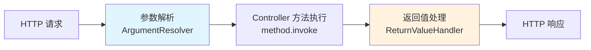
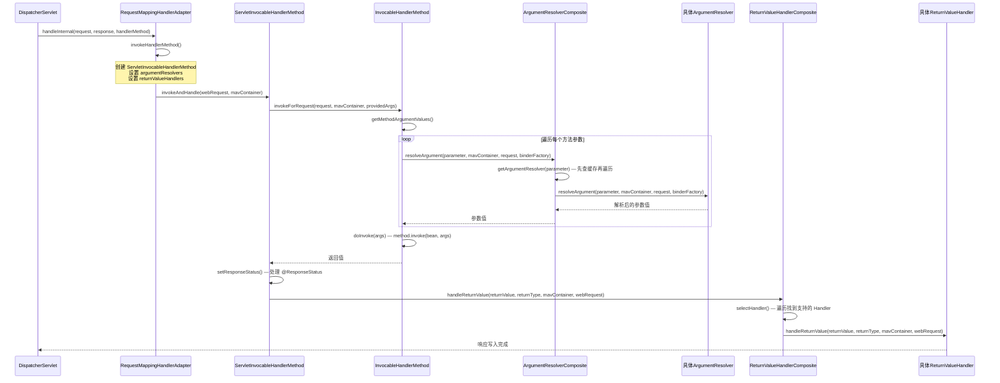
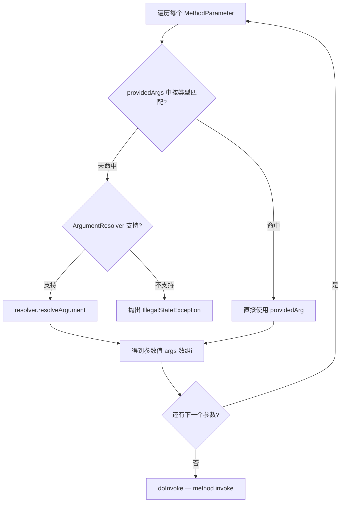
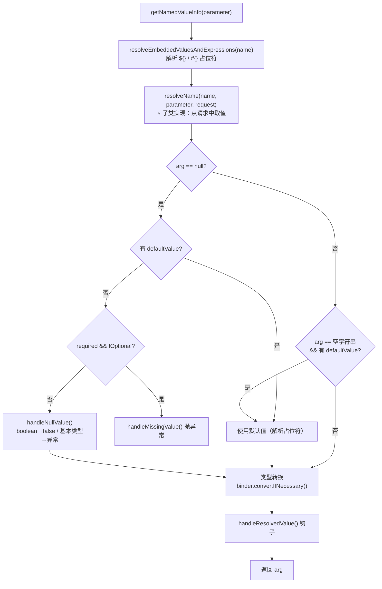
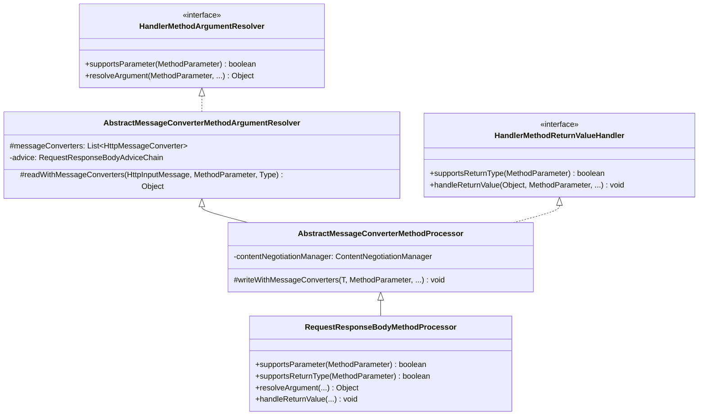
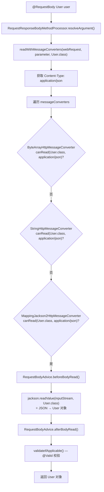

# 参数解析与返回值处理深度分析

> **📍 文档导航** | [📚 返回目录](./README.md) | [⬅️ 上一篇：HandlerAdapter](./HandlerAdapter核心源码深度分析.md) | [➡️ 下一篇：数据绑定与类型转换](./数据绑定与类型转换深度分析.md)
>
> **📊 元信息** | 难度：⭐⭐⭐⭐ | 预估时间：1-2天 | 前置阅读：[④ HandlerAdapter核心源码深度分析](./HandlerAdapter核心源码深度分析.md)
>
> **🎯 学习目标** | 解答 "Controller 方法参数从哪来、返回值怎么变成 HTTP 响应" 的核心问题

---

## 1. 总体定位

在 Spring MVC 的请求处理流程中，**参数解析**和**返回值处理**是 Handler 方法执行的入口和出口：

- **入口**：将 HTTP 请求中的各种数据（查询参数、路径变量、请求体、请求头等）转换为 Controller 方法参数
- **出口**：将 Controller 方法返回值转换为 HTTP 响应（JSON、视图、重定向等）



这两个环节的核心设计思想是 **策略模式 + 组合模式**：每种参数类型/返回值类型对应一个独立的策略实现，由 Composite 统一管理和调度。

---

## 2. 整体架构与调用入口

### 2.1 从 DispatcherServlet 到参数解析的调用链



### 2.2 RequestMappingHandlerAdapter 中的初始化

在 `afterPropertiesSet()` 中，三个核心组件被初始化：

```java
// 来自: spring-webmvc/.../RequestMappingHandlerAdapter.java (L567-584)
@Override
public void afterPropertiesSet() {
    // 先初始化 ControllerAdvice 缓存（可能添加 RequestBodyAdvice/ResponseBodyAdvice）
    initControllerAdviceCache();

    if (this.argumentResolvers == null) {
        List<HandlerMethodArgumentResolver> resolvers = getDefaultArgumentResolvers();
        this.argumentResolvers = new HandlerMethodArgumentResolverComposite().addResolvers(resolvers);
    }
    if (this.initBinderArgumentResolvers == null) {
        List<HandlerMethodArgumentResolver> resolvers = getDefaultInitBinderArgumentResolvers();
        this.initBinderArgumentResolvers = new HandlerMethodArgumentResolverComposite().addResolvers(resolvers);
    }
    if (this.returnValueHandlers == null) {
        List<HandlerMethodReturnValueHandler> handlers = getDefaultReturnValueHandlers();
        this.returnValueHandlers = new HandlerMethodReturnValueHandlerComposite().addHandlers(handlers);
    }
}
```

**关键数据结构：**

| 字段 | 类型 | 作用 |
|------|------|------|
| `argumentResolvers` | `HandlerMethodArgumentResolverComposite` | 处理 Controller 方法参数 |
| `initBinderArgumentResolvers` | `HandlerMethodArgumentResolverComposite` | 处理 `@InitBinder` 方法参数（不含 `@RequestBody` 等） |
| `returnValueHandlers` | `HandlerMethodReturnValueHandlerComposite` | 处理 Controller 方法返回值 |
| `messageConverters` | `List<HttpMessageConverter<?>>` | HTTP 消息转换器列表（读写请求体/响应体） |
| `requestResponseBodyAdvice` | `List<Object>` | `RequestBodyAdvice` + `ResponseBodyAdvice` 切面 |

---

## 3. 策略接口：HandlerMethodArgumentResolver

### 3.1 接口定义

```java
// 来自: spring-web/.../HandlerMethodArgumentResolver.java (L33-63)
public interface HandlerMethodArgumentResolver {

    // 是否支持解析该方法参数
    boolean supportsParameter(MethodParameter parameter);

    // 将方法参数解析为实际的参数值
    @Nullable
    Object resolveArgument(MethodParameter parameter, @Nullable ModelAndViewContainer mavContainer,
            NativeWebRequest webRequest, @Nullable WebDataBinderFactory binderFactory) throws Exception;
}
```

**设计精髓**：两步式策略接口 — `supportsParameter` 判断 + `resolveArgument` 执行。这种分离使得 Composite 可以先找到合适的解析器，再执行解析。

### 3.2 参数四要素

`resolveArgument()` 方法签名中的四个参数，覆盖了解析所需的全部上下文：

| 参数 | 作用 |
|------|------|
| `MethodParameter parameter` | 方法参数的元信息（注解、类型、泛型、参数名等） |
| `ModelAndViewContainer mavContainer` | 当前请求的 Model 容器（`@ModelAttribute` 需要） |
| `NativeWebRequest webRequest` | 对 `HttpServletRequest` 的包装（获取参数、头、属性等） |
| `WebDataBinderFactory binderFactory` | 创建 `WebDataBinder` 用于类型转换和数据绑定 |

---

## 4. 策略接口：HandlerMethodReturnValueHandler

### 4.1 接口定义

```java
// 来自: spring-web/.../HandlerMethodReturnValueHandler.java (L31-58)
public interface HandlerMethodReturnValueHandler {

    // 是否支持处理该返回值类型
    boolean supportsReturnType(MethodParameter returnType);

    // 处理返回值：写入响应体、设置视图名、填充 Model 等
    void handleReturnValue(@Nullable Object returnValue, MethodParameter returnType,
            ModelAndViewContainer mavContainer, NativeWebRequest webRequest) throws Exception;
}
```

**与 ArgumentResolver 的对称设计**：同样是 `supports` + `handle` 两步式，但返回值处理器的职责是"将返回值写入某个地方"而非"从某个地方读取值"。

---

## 5. 组合模式：Composite 实现

### 5.1 HandlerMethodArgumentResolverComposite

```java
// 来自: spring-web/.../HandlerMethodArgumentResolverComposite.java (L39-144)
public class HandlerMethodArgumentResolverComposite implements HandlerMethodArgumentResolver {

    private final List<HandlerMethodArgumentResolver> argumentResolvers = new ArrayList<>();

    // ⭐ 核心：ConcurrentHashMap 缓存，避免重复遍历
    private final Map<MethodParameter, HandlerMethodArgumentResolver> argumentResolverCache =
            new ConcurrentHashMap<>(256);

    @Nullable
    private HandlerMethodArgumentResolver getArgumentResolver(MethodParameter parameter) {
        // 先查缓存
        HandlerMethodArgumentResolver result = this.argumentResolverCache.get(parameter);
        if (result == null) {
            // 缓存未命中，遍历所有 resolver
            for (HandlerMethodArgumentResolver resolver : this.argumentResolvers) {
                if (resolver.supportsParameter(parameter)) {
                    result = resolver;
                    this.argumentResolverCache.put(parameter, result);  // 放入缓存
                    break;
                }
            }
        }
        return result;
    }
}
```

**缓存设计深度分析：**

- **为什么用 `ConcurrentHashMap<MethodParameter, Resolver>`？**
  - `MethodParameter` 重写了 `equals()` 和 `hashCode()`（基于 method + parameterIndex）
  - 同一个 Controller 方法的同一个参数，在不同请求中会映射到相同的 `MethodParameter`
  - 第一次请求遍历找到 Resolver 后缓存，后续请求直接命中，**O(n) → O(1)**
- **初始容量 256**：预估一个中型应用约有 200+ 个不同的方法参数
- **为什么不用 `HashMap`？** 多线程并发访问（多个请求同时解析不同参数），`ConcurrentHashMap` 保证线程安全

### 5.2 HandlerMethodReturnValueHandlerComposite

```java
// 来自: spring-web/.../HandlerMethodReturnValueHandlerComposite.java (L35-125)
public class HandlerMethodReturnValueHandlerComposite implements HandlerMethodReturnValueHandler {

    private final List<HandlerMethodReturnValueHandler> returnValueHandlers = new ArrayList<>();

    // ⭐ 注意：没有缓存！每次都遍历
    @Nullable
    private HandlerMethodReturnValueHandler selectHandler(@Nullable Object value, MethodParameter returnType) {
        boolean isAsyncValue = isAsyncReturnValue(value, returnType);
        for (HandlerMethodReturnValueHandler handler : this.returnValueHandlers) {
            // 异步返回值时，跳过非 AsyncHandler
            if (isAsyncValue && !(handler instanceof AsyncHandlerMethodReturnValueHandler)) {
                continue;
            }
            if (handler.supportsReturnType(returnType)) {
                return handler;
            }
        }
        return null;
    }
}
```

### 5.3 两个 Composite 的关键差异

| 对比维度 | ArgumentResolverComposite | ReturnValueHandlerComposite |
|---------|---------------------------|----------------------------|
| **缓存** | ✅ `ConcurrentHashMap<MethodParameter, Resolver>` | ❌ 无缓存，每次遍历 |
| **查找方法** | `getArgumentResolver()` | `selectHandler()` |
| **异步特殊处理** | 无 | 有，`isAsyncValue` 时跳过非 `AsyncHandler` |
| **Handler 数量** | 约 27 个（较多） | 约 15 个（较少） |

**为什么 ReturnValueHandler 没有缓存？**

1. **返回值数量少**：一个 Controller 方法只有一个返回值，而参数可能有多个
2. **异步返回值动态性**：`selectHandler()` 的判断依赖运行时的 `value`（是否是异步值），不能仅靠 `MethodParameter` 作为缓存 key
3. **Handler 列表短**：约 15 个 Handler，遍历成本低

---

## 6. 参数解析的调用入口：InvocableHandlerMethod

### 6.1 核心字段

```java
// 来自: spring-web/.../InvocableHandlerMethod.java (L47-58)
public class InvocableHandlerMethod extends HandlerMethod {

    private static final Object[] EMPTY_ARGS = new Object[0];

    private HandlerMethodArgumentResolverComposite resolvers = new HandlerMethodArgumentResolverComposite();

    private ParameterNameDiscoverer parameterNameDiscoverer = new DefaultParameterNameDiscoverer();

    @Nullable
    private WebDataBinderFactory dataBinderFactory;
}
```

### 6.2 invokeForRequest() — 整体入口

```java
// 来自: spring-web/.../InvocableHandlerMethod.java (L142-151)
@Nullable
public Object invokeForRequest(NativeWebRequest request, @Nullable ModelAndViewContainer mavContainer,
        Object... providedArgs) throws Exception {

    Object[] args = getMethodArgumentValues(request, mavContainer, providedArgs);
    if (logger.isTraceEnabled()) {
        logger.trace("Arguments: " + Arrays.toString(args));
    }
    return doInvoke(args);
}
```

### 6.3 getMethodArgumentValues() — 参数解析核心

```java
// 来自: spring-web/.../InvocableHandlerMethod.java (L159-193)
protected Object[] getMethodArgumentValues(NativeWebRequest request, @Nullable ModelAndViewContainer mavContainer,
        Object... providedArgs) throws Exception {

    MethodParameter[] parameters = getMethodParameters();
    if (ObjectUtils.isEmpty(parameters)) {
        return EMPTY_ARGS;  // 无参方法直接返回
    }

    Object[] args = new Object[parameters.length];
    for (int i = 0; i < parameters.length; i++) {
        MethodParameter parameter = parameters[i];
        parameter.initParameterNameDiscovery(this.parameterNameDiscoverer);
        // 第一优先：从 providedArgs 按类型匹配
        args[i] = findProvidedArgument(parameter, providedArgs);
        if (args[i] != null) {
            continue;
        }
        // 第二优先：使用 ArgumentResolver 解析
        if (!this.resolvers.supportsParameter(parameter)) {
            throw new IllegalStateException(formatArgumentError(parameter, "No suitable resolver"));
        }
        try {
            args[i] = this.resolvers.resolveArgument(parameter, mavContainer, request, this.dataBinderFactory);
        }
        catch (Exception ex) {
            if (logger.isDebugEnabled()) {
                String exMsg = ex.getMessage();
                if (exMsg != null && !exMsg.contains(parameter.getExecutable().toGenericString())) {
                    logger.debug(formatArgumentError(parameter, exMsg));
                }
            }
            throw ex;
        }
    }
    return args;
}
```

**参数解析优先级：**



**providedArgs 的用途**：用于传递框架内部对象（如 `WebDataBinder`、`SessionStatus`），这些不需要从 HTTP 请求中解析。

### 6.4 doInvoke() — 反射调用

```java
// 来自: spring-web/.../InvocableHandlerMethod.java (L198-228)
@Nullable
protected Object doInvoke(Object... args) throws Exception {
    Method method = getBridgedMethod();
    try {
        if (KotlinDetector.isSuspendingFunction(method)) {
            return CoroutinesUtils.invokeSuspendingFunction(method, getBean(), args);
        }
        return method.invoke(getBean(), args);
    }
    catch (InvocationTargetException ex) {
        // 解包装：将 InvocationTargetException 中的目标异常抛出
        Throwable targetException = ex.getTargetException();
        if (targetException instanceof RuntimeException) {
            throw (RuntimeException) targetException;
        }
        else if (targetException instanceof Error) {
            throw (Error) targetException;
        }
        else if (targetException instanceof Exception) {
            throw (Exception) targetException;
        }
        else {
            throw new IllegalStateException(formatInvokeError("Invocation failure", args), targetException);
        }
    }
}
```

**关键细节**：
- `getBridgedMethod()` 获取的是桥接方法（泛型擦除后的方法），确保能正确反射调用
- `InvocationTargetException` 解包装：Controller 方法内部抛出的异常被 `InvocationTargetException` 包裹，这里逐层解包，使得 `@ExceptionHandler` 能正确捕获原始异常
- Kotlin 协程支持：`isSuspendingFunction` 检测，调用 `CoroutinesUtils`

---

## 7. 返回值处理的调用入口：ServletInvocableHandlerMethod

### 7.1 类定位

`ServletInvocableHandlerMethod` 继承 `InvocableHandlerMethod`，增加了返回值处理和 `@ResponseStatus` 支持。

```java
// 来自: spring-webmvc/.../ServletInvocableHandlerMethod.java (L65-71)
public class ServletInvocableHandlerMethod extends InvocableHandlerMethod {

    @Nullable
    private HandlerMethodReturnValueHandlerComposite returnValueHandlers;
}
```

### 7.2 invokeAndHandle() — 参数解析 + 返回值处理的完整闭环

```java
// 来自: spring-webmvc/.../ServletInvocableHandlerMethod.java (L114-144)
public void invokeAndHandle(ServletWebRequest webRequest, ModelAndViewContainer mavContainer,
        Object... providedArgs) throws Exception {

    // ① 调用父类：参数解析 + 方法执行
    Object returnValue = invokeForRequest(webRequest, mavContainer, providedArgs);

    // ② 处理 @ResponseStatus
    setResponseStatus(webRequest);

    // ③ 判断是否需要返回值处理
    if (returnValue == null) {
        if (isRequestNotModified(webRequest) || getResponseStatus() != null || mavContainer.isRequestHandled()) {
            disableContentCachingIfNecessary(webRequest);
            mavContainer.setRequestHandled(true);
            return;  // 无需返回值处理
        }
    }
    else if (StringUtils.hasText(getResponseStatusReason())) {
        mavContainer.setRequestHandled(true);
        return;  // @ResponseStatus 带 reason 时直接返回
    }

    // ④ 返回值处理
    mavContainer.setRequestHandled(false);
    Assert.state(this.returnValueHandlers != null, "No return value handlers");
    try {
        this.returnValueHandlers.handleReturnValue(
                returnValue, getReturnValueType(returnValue), mavContainer, webRequest);
    }
    catch (Exception ex) {
        if (logger.isTraceEnabled()) {
            logger.trace(formatErrorForReturnValue(returnValue), ex);
        }
        throw ex;
    }
}
```

**null 返回值的三种"不需要处理"场景：**

1. `isRequestNotModified` — 304 Not Modified
2. `getResponseStatus() != null` — `@ResponseStatus` 已设置状态码
3. `mavContainer.isRequestHandled()` — 响应已在其他地方完成（如直接写 OutputStream）

---

## 8. 默认参数解析器列表（27 个）

`getDefaultArgumentResolvers()` 定义了 Spring MVC 默认注册的所有参数解析器，**顺序即优先级**：

```java
// 来自: spring-webmvc/.../RequestMappingHandlerAdapter.java (L645-690)
private List<HandlerMethodArgumentResolver> getDefaultArgumentResolvers() {
    List<HandlerMethodArgumentResolver> resolvers = new ArrayList<>(30);

    // ========== 第一组：基于注解的解析器（15个） ==========
    resolvers.add(new RequestParamMethodArgumentResolver(getBeanFactory(), false));   // @RequestParam（非默认模式）
    resolvers.add(new RequestParamMapMethodArgumentResolver());                       // @RequestParam Map
    resolvers.add(new PathVariableMethodArgumentResolver());                          // @PathVariable
    resolvers.add(new PathVariableMapMethodArgumentResolver());                       // @PathVariable Map
    resolvers.add(new MatrixVariableMethodArgumentResolver());                        // @MatrixVariable
    resolvers.add(new MatrixVariableMapMethodArgumentResolver());                     // @MatrixVariable Map
    resolvers.add(new ServletModelAttributeMethodProcessor(false));                   // @ModelAttribute（非默认模式）
    resolvers.add(new RequestResponseBodyMethodProcessor(getMessageConverters(), this.requestResponseBodyAdvice));  // @RequestBody
    resolvers.add(new RequestPartMethodArgumentResolver(getMessageConverters(), this.requestResponseBodyAdvice));   // @RequestPart
    resolvers.add(new RequestHeaderMethodArgumentResolver(getBeanFactory()));         // @RequestHeader
    resolvers.add(new RequestHeaderMapMethodArgumentResolver());                      // @RequestHeader Map
    resolvers.add(new ServletCookieValueMethodArgumentResolver(getBeanFactory()));    // @CookieValue
    resolvers.add(new ExpressionValueMethodArgumentResolver(getBeanFactory()));       // @Value
    resolvers.add(new SessionAttributeMethodArgumentResolver());                      // @SessionAttribute
    resolvers.add(new RequestAttributeMethodArgumentResolver());                      // @RequestAttribute

    // ========== 第二组：基于类型的解析器（9个） ==========
    resolvers.add(new ServletRequestMethodArgumentResolver());       // HttpServletRequest, InputStream, Principal 等
    resolvers.add(new ServletResponseMethodArgumentResolver());      // HttpServletResponse, OutputStream
    resolvers.add(new HttpEntityMethodProcessor(getMessageConverters(), this.requestResponseBodyAdvice));  // HttpEntity / RequestEntity
    resolvers.add(new RedirectAttributesMethodArgumentResolver());   // RedirectAttributes
    resolvers.add(new ModelMethodProcessor());                       // Model
    resolvers.add(new MapMethodProcessor());                         // Map（作为 Model 使用）
    resolvers.add(new ErrorsMethodArgumentResolver());               // Errors / BindingResult
    resolvers.add(new SessionStatusMethodArgumentResolver());        // SessionStatus
    resolvers.add(new UriComponentsBuilderMethodArgumentResolver()); // UriComponentsBuilder

    // ========== 第三组：自定义解析器 ==========
    if (getCustomArgumentResolvers() != null) {
        resolvers.addAll(getCustomArgumentResolvers());
    }

    // ========== 第四组：兜底解析器（3个） ==========
    resolvers.add(new PrincipalMethodArgumentResolver());                             // Principal
    resolvers.add(new RequestParamMethodArgumentResolver(getBeanFactory(), true));     // ⭐ 简单类型兜底
    resolvers.add(new ServletModelAttributeMethodProcessor(true));                    // ⭐ 复杂类型兜底

    return resolvers;
}
```

### 8.1 四组解析器的优先级设计

```mermaid
flowchart TD
    A[方法参数] --> B{有注解?<br/>@RequestParam/@PathVariable<br/>@RequestBody/@RequestHeader<br/>等}
    B -->|是| C[第一组: 注解解析器]
    B -->|否| D{特殊类型?<br/>HttpServletRequest<br/>HttpEntity/Model 等}
    D -->|是| E[第二组: 类型解析器]
    D -->|否| F{自定义解析器?}
    F -->|是| G[第三组: Custom Resolvers]
    F -->|否| H{简单类型?<br/>String/int/long 等}
    H -->|是| I["第四组兜底: RequestParam(true)<br/>当作请求参数处理"]
    H -->|否| J["第四组兜底: ModelAttribute(true)<br/>当作表单对象绑定"]
    
    style C fill:#e1f5fe
    style E fill:#e8f5e9
    style G fill:#fff3e0
    style I fill:#fce4ec
    style J fill:#fce4ec
```

**最关键的设计**：`RequestParamMethodArgumentResolver` 出现了两次！

| 实例 | `useDefaultResolution` | 位置 | 行为 |
|------|----------------------|------|------|
| 第一个 | `false` | 第一组（#1） | 只处理带 `@RequestParam` 注解的参数 |
| 第二个 | `true` | 第四组（兜底） | 无注解的简单类型也当作请求参数 |

同理，`ServletModelAttributeMethodProcessor` 也出现了两次：

| 实例 | `annotationNotRequired` | 位置 | 行为 |
|------|----------------------|------|------|
| 第一个 | `false` | 第一组（#7） | 只处理带 `@ModelAttribute` 注解的参数 |
| 第二个 | `true` | 第四组（兜底） | 无注解的复杂类型也当作 ModelAttribute |

**这就解释了一个常见现象**：Controller 方法的 POJO 参数即使不加 `@ModelAttribute`，也能自动绑定请求参数——因为第四组兜底解析器会处理它。

---

## 9. 默认返回值处理器列表（15 个）

```java
// 来自: spring-webmvc/.../RequestMappingHandlerAdapter.java (L730-770)
private List<HandlerMethodReturnValueHandler> getDefaultReturnValueHandlers() {
    List<HandlerMethodReturnValueHandler> handlers = new ArrayList<>(20);

    // ========== 第一组：单一用途返回值类型（10个） ==========
    handlers.add(new ModelAndViewMethodReturnValueHandler());          // ModelAndView
    handlers.add(new ModelMethodProcessor());                          // Model
    handlers.add(new ViewMethodReturnValueHandler());                  // View
    handlers.add(new ResponseBodyEmitterReturnValueHandler(           // ResponseBodyEmitter / SseEmitter
            getMessageConverters(), this.reactiveAdapterRegistry,
            this.taskExecutor, this.contentNegotiationManager));
    handlers.add(new StreamingResponseBodyReturnValueHandler());       // StreamingResponseBody
    handlers.add(new HttpEntityMethodProcessor(getMessageConverters(), // HttpEntity / ResponseEntity
            this.contentNegotiationManager, this.requestResponseBodyAdvice));
    handlers.add(new HttpHeadersReturnValueHandler());                 // HttpHeaders
    handlers.add(new CallableMethodReturnValueHandler());              // Callable
    handlers.add(new DeferredResultMethodReturnValueHandler());        // DeferredResult / ListenableFuture / CompletionStage
    handlers.add(new AsyncTaskMethodReturnValueHandler(this.beanFactory)); // WebAsyncTask

    // ========== 第二组：基于注解的返回值类型（2个） ==========
    handlers.add(new ServletModelAttributeMethodProcessor(false));     // @ModelAttribute
    handlers.add(new RequestResponseBodyMethodProcessor(              // ⭐ @ResponseBody
            getMessageConverters(), this.contentNegotiationManager,
            this.requestResponseBodyAdvice));

    // ========== 第三组：多用途返回值类型（2个） ==========
    handlers.add(new ViewNameMethodReturnValueHandler());              // String（视图名）
    handlers.add(new MapMethodProcessor());                            // Map（作为 Model）

    // ========== 第四组：自定义 + 兜底 ==========
    if (getCustomReturnValueHandlers() != null) {
        handlers.addAll(getCustomReturnValueHandlers());
    }
    if (!CollectionUtils.isEmpty(getModelAndViewResolvers())) {
        handlers.add(new ModelAndViewResolverMethodReturnValueHandler(getModelAndViewResolvers()));
    }
    else {
        handlers.add(new ServletModelAttributeMethodProcessor(true)); // 兜底：复杂类型当作 ModelAttribute
    }

    return handlers;
}
```

**注意**：`RequestResponseBodyMethodProcessor` 同时出现在参数解析器列表（处理 `@RequestBody`）和返回值处理器列表（处理 `@ResponseBody`），因为它同时实现了两个接口。

---

## 10. 核心解析器深度分析

### 10.1 AbstractNamedValueMethodArgumentResolver — 命名参数模板方法

这是 `@RequestParam`、`@PathVariable`、`@RequestHeader`、`@CookieValue` 等注解解析器的**共同基类**。

#### 10.1.1 类定位与数据结构

```java
// 来自: spring-web/.../AbstractNamedValueMethodArgumentResolver.java (L65-73)
public abstract class AbstractNamedValueMethodArgumentResolver implements HandlerMethodArgumentResolver {

    @Nullable
    private final ConfigurableBeanFactory configurableBeanFactory;  // 解析 ${} 和 #{} 表达式

    @Nullable
    private final BeanExpressionContext expressionContext;           // SpEL 表达式上下文

    // ⭐ 缓存：MethodParameter → NamedValueInfo
    private final Map<MethodParameter, NamedValueInfo> namedValueInfoCache = new ConcurrentHashMap<>(256);
}
```

```java
// 来自: spring-web/.../AbstractNamedValueMethodArgumentResolver.java (L287-301)
protected static class NamedValueInfo {
    private final String name;           // 参数名（如 @RequestParam("id") 中的 "id"）
    private final boolean required;      // 是否必需
    @Nullable
    private final String defaultValue;   // 默认值
}
```

#### 10.1.2 resolveArgument() — 模板方法核心流程

```java
// 来自: spring-web/.../AbstractNamedValueMethodArgumentResolver.java (L94-145)
@Override
@Nullable
public final Object resolveArgument(MethodParameter parameter, @Nullable ModelAndViewContainer mavContainer,
        NativeWebRequest webRequest, @Nullable WebDataBinderFactory binderFactory) throws Exception {

    // ① 获取 NamedValueInfo（带缓存）
    NamedValueInfo namedValueInfo = getNamedValueInfo(parameter);
    MethodParameter nestedParameter = parameter.nestedIfOptional();

    // ② 解析参数名中的占位符和 SpEL 表达式
    Object resolvedName = resolveEmbeddedValuesAndExpressions(namedValueInfo.name);

    // ③ 子类实现：从请求中解析出参数值
    Object arg = resolveName(resolvedName.toString(), nestedParameter, webRequest);

    // ④ 处理 null 值
    if (arg == null) {
        if (namedValueInfo.defaultValue != null) {
            arg = resolveEmbeddedValuesAndExpressions(namedValueInfo.defaultValue);
        }
        else if (namedValueInfo.required && !nestedParameter.isOptional()) {
            handleMissingValue(namedValueInfo.name, nestedParameter, webRequest);  // 子类实现
        }
        arg = handleNullValue(namedValueInfo.name, arg, nestedParameter.getNestedParameterType());
    }
    else if ("".equals(arg) && namedValueInfo.defaultValue != null) {
        arg = resolveEmbeddedValuesAndExpressions(namedValueInfo.defaultValue);
    }

    // ⑤ 类型转换
    if (binderFactory != null) {
        WebDataBinder binder = binderFactory.createBinder(webRequest, null, namedValueInfo.name);
        try {
            arg = binder.convertIfNecessary(arg, parameter.getParameterType(), parameter);
        }
        catch (ConversionNotSupportedException ex) {
            throw new MethodArgumentConversionNotSupportedException(arg, ex.getRequiredType(),
                    namedValueInfo.name, parameter, ex.getCause());
        }
        catch (TypeMismatchException ex) {
            throw new MethodArgumentTypeMismatchException(arg, ex.getRequiredType(),
                    namedValueInfo.name, parameter, ex.getCause());
        }
        // 转换后再次检查 null
        if (arg == null && namedValueInfo.defaultValue == null &&
                namedValueInfo.required && !nestedParameter.isOptional()) {
            handleMissingValueAfterConversion(namedValueInfo.name, nestedParameter, webRequest);
        }
    }

    // ⑥ 钩子：解析完成后的回调（子类可选覆盖）
    handleResolvedValue(arg, namedValueInfo.name, parameter, mavContainer, webRequest);

    return arg;
}
```

**模板方法中的四个抽象/钩子方法：**

| 方法 | 类型 | 作用 | 子类示例 |
|------|------|------|---------|
| `createNamedValueInfo()` | 抽象 | 从注解提取 name/required/defaultValue | `RequestParam` → 读取注解属性 |
| `resolveName()` | 抽象 | 从请求中按名称获取原始值 | `@RequestParam` → `request.getParameterValues(name)` |
| `handleMissingValue()` | 钩子 | 处理必需参数缺失 | 抛出 `MissingServletRequestParameterException` |
| `handleResolvedValue()` | 钩子 | 解析完成后回调 | `@PathVariable` → 存入 Request Attributes |

**完整流程图：**



#### 10.1.3 NamedValueInfo 缓存

```java
// 来自: spring-web/.../AbstractNamedValueMethodArgumentResolver.java (L150-158)
private NamedValueInfo getNamedValueInfo(MethodParameter parameter) {
    NamedValueInfo namedValueInfo = this.namedValueInfoCache.get(parameter);
    if (namedValueInfo == null) {
        namedValueInfo = createNamedValueInfo(parameter);           // 子类创建
        namedValueInfo = updateNamedValueInfo(parameter, namedValueInfo); // 标准化：空 name 用参数名填充
        this.namedValueInfoCache.put(parameter, namedValueInfo);
    }
    return namedValueInfo;
}
```

`updateNamedValueInfo()` 的关键逻辑：如果注解中 `name` 为空（如 `@RequestParam` 不指定 name），则使用方法参数名（通过 `ParameterNameDiscoverer` 获取）。

### 10.2 RequestParamMethodArgumentResolver — @RequestParam 处理

#### 10.2.1 supportsParameter()

```java
// 来自: spring-web/.../RequestParamMethodArgumentResolver.java (L126-152)
@Override
public boolean supportsParameter(MethodParameter parameter) {
    if (parameter.hasParameterAnnotation(RequestParam.class)) {
        // 有 @RequestParam 注解
        if (Map.class.isAssignableFrom(parameter.nestedIfOptional().getNestedParameterType())) {
            // Map 类型需要指定 name 才由本 Resolver 处理，否则交给 RequestParamMapMethodArgumentResolver
            RequestParam requestParam = parameter.getParameterAnnotation(RequestParam.class);
            return (requestParam != null && StringUtils.hasText(requestParam.name()));
        }
        else {
            return true;
        }
    }
    else {
        if (parameter.hasParameterAnnotation(RequestPart.class)) {
            return false;  // @RequestPart 交给 RequestPartMethodArgumentResolver
        }
        parameter = parameter.nestedIfOptional();
        if (MultipartResolutionDelegate.isMultipartArgument(parameter)) {
            return true;   // MultipartFile / Part 类型
        }
        else if (this.useDefaultResolution) {
            return BeanUtils.isSimpleProperty(parameter.getNestedParameterType());  // ⭐ 兜底：简单类型
        }
        else {
            return false;
        }
    }
}
```

#### 10.2.2 resolveName()

```java
// 来自: spring-web/.../RequestParamMethodArgumentResolver.java (L160-187)
@Override
@Nullable
protected Object resolveName(String name, MethodParameter parameter, NativeWebRequest request) throws Exception {
    HttpServletRequest servletRequest = request.getNativeRequest(HttpServletRequest.class);

    // 先尝试 Multipart 解析
    if (servletRequest != null) {
        Object mpArg = MultipartResolutionDelegate.resolveMultipartArgument(name, parameter, servletRequest);
        if (mpArg != MultipartResolutionDelegate.UNRESOLVABLE) {
            return mpArg;
        }
    }

    Object arg = null;
    MultipartRequest multipartRequest = request.getNativeRequest(MultipartRequest.class);
    if (multipartRequest != null) {
        List<MultipartFile> files = multipartRequest.getFiles(name);
        if (!files.isEmpty()) {
            arg = (files.size() == 1 ? files.get(0) : files);
        }
    }
    // 普通请求参数
    if (arg == null) {
        String[] paramValues = request.getParameterValues(name);
        if (paramValues != null) {
            arg = (paramValues.length == 1 ? paramValues[0] : paramValues);
        }
    }
    return arg;
}
```

**核心逻辑**：`request.getParameterValues(name)` — 如果只有一个值返回 `String`，多个值返回 `String[]`，再通过父类的类型转换转为目标类型。

### 10.3 PathVariableMethodArgumentResolver — @PathVariable 处理

#### 10.3.1 resolveName()

```java
// 来自: spring-webmvc/.../PathVariableMethodArgumentResolver.java (L90-97)
@Override
@SuppressWarnings("unchecked")
@Nullable
protected Object resolveName(String name, MethodParameter parameter, NativeWebRequest request) throws Exception {
    Map<String, String> uriTemplateVars = (Map<String, String>) request.getAttribute(
            HandlerMapping.URI_TEMPLATE_VARIABLES_ATTRIBUTE, RequestAttributes.SCOPE_REQUEST);
    return (uriTemplateVars != null ? uriTemplateVars.get(name) : null);
}
```

**关键**：路径变量不是从 URL 实时解析的，而是 `HandlerMapping` 在匹配 Handler 时已解析完毕，存储在 Request Attribute `HandlerMapping.URI_TEMPLATE_VARIABLES_ATTRIBUTE` 中。`PathVariableMethodArgumentResolver` 只需从 Map 中按名称取值。

#### 10.3.2 handleResolvedValue() — 特殊钩子

```java
// 来自: spring-webmvc/.../PathVariableMethodArgumentResolver.java (L111-124)
@Override
protected void handleResolvedValue(@Nullable Object arg, String name, MethodParameter parameter,
        @Nullable ModelAndViewContainer mavContainer, NativeWebRequest request) {

    String key = View.PATH_VARIABLES;
    int scope = RequestAttributes.SCOPE_REQUEST;
    Map<String, Object> pathVars = (Map<String, Object>) request.getAttribute(key, scope);
    if (pathVars == null) {
        pathVars = new HashMap<>();
        request.setAttribute(key, pathVars, scope);
    }
    pathVars.put(name, arg);
}
```

解析完成后，将类型转换后的路径变量存入 `View.PATH_VARIABLES`，供视图渲染时使用。

---

## 11. RequestResponseBodyMethodProcessor — @RequestBody / @ResponseBody 核心

这是现代 Spring MVC 开发中**最重要**的解析器/处理器，因为前后端分离项目的核心就是 JSON 请求体读取和 JSON 响应体写入。

### 11.1 继承体系



**四层继承，职责分离：**

| 层 | 类 | 职责 |
|---|---|------|
| 接口层 | `HandlerMethodArgumentResolver` + `HandlerMethodReturnValueHandler` | 定义策略接口 |
| 读取层 | `AbstractMessageConverterMethodArgumentResolver` | 持有 `messageConverters` 列表，实现 `readWithMessageConverters()` |
| 写入层 | `AbstractMessageConverterMethodProcessor` | 增加 `ContentNegotiationManager`，实现 `writeWithMessageConverters()` |
| 实现层 | `RequestResponseBodyMethodProcessor` | 实现 `supportsXxx()`，组合读取和写入 |

### 11.2 supportsParameter() — 什么时候处理参数

```java
// 来自: spring-webmvc/.../RequestResponseBodyMethodProcessor.java (L111-114)
@Override
public boolean supportsParameter(MethodParameter parameter) {
    return parameter.hasParameterAnnotation(RequestBody.class);
}
```

极简判断：**参数上有 `@RequestBody` 注解就处理**。

### 11.3 supportsReturnType() — 什么时候处理返回值

```java
// 来自: spring-webmvc/.../RequestResponseBodyMethodProcessor.java (L116-120)
@Override
public boolean supportsReturnType(MethodParameter returnType) {
    return (AnnotatedElementUtils.hasAnnotation(returnType.getContainingClass(), ResponseBody.class) ||
            returnType.hasMethodAnnotation(ResponseBody.class));
}
```

**两种情况**：
1. 方法上有 `@ResponseBody`
2. 类上有 `@ResponseBody`（`@RestController` = `@Controller` + `@ResponseBody`）

### 11.4 resolveArgument() — 读取请求体

```java
// 来自: spring-webmvc/.../RequestResponseBodyMethodProcessor.java (L128-150)
@Override
public Object resolveArgument(MethodParameter parameter, @Nullable ModelAndViewContainer mavContainer,
        NativeWebRequest webRequest, @Nullable WebDataBinderFactory binderFactory) throws Exception {

    parameter = parameter.nestedIfOptional();

    // ① 使用 HttpMessageConverter 读取请求体
    Object arg = readWithMessageConverters(webRequest, parameter, parameter.getNestedGenericParameterType());
    String name = Conventions.getVariableNameForParameter(parameter);

    // ② 数据校验
    if (binderFactory != null) {
        WebDataBinder binder = binderFactory.createBinder(webRequest, arg, name);
        if (arg != null) {
            validateIfApplicable(binder, parameter);  // 检查 @Valid / @Validated
            if (binder.getBindingResult().hasErrors() && isBindExceptionRequired(binder, parameter)) {
                throw new MethodArgumentNotValidException(parameter, binder.getBindingResult());
            }
        }
        if (mavContainer != null) {
            mavContainer.addAttribute(BindingResult.MODEL_KEY_PREFIX + name, binder.getBindingResult());
        }
    }

    return adaptArgumentIfNecessary(arg, parameter);
}
```

### 11.5 readWithMessageConverters() — 消息转换器遍历

```java
// 来自: spring-webmvc/.../AbstractMessageConverterMethodArgumentResolver.java (L144-222)
@SuppressWarnings("unchecked")
@Nullable
protected <T> Object readWithMessageConverters(HttpInputMessage inputMessage, MethodParameter parameter,
        Type targetType) throws IOException, HttpMediaTypeNotSupportedException, HttpMessageNotReadableException {

    // 获取 Content-Type
    MediaType contentType;
    try {
        contentType = inputMessage.getHeaders().getContentType();
    }
    catch (InvalidMediaTypeException ex) {
        throw new HttpMediaTypeNotSupportedException(ex.getMessage());
    }
    if (contentType == null) {
        contentType = MediaType.APPLICATION_OCTET_STREAM;  // 默认 octet-stream
    }

    Class<?> contextClass = parameter.getContainingClass();
    Class<T> targetClass = (targetType instanceof Class ? (Class<T>) targetType : null);

    // ⭐ 遍历所有 HttpMessageConverter，找到能读取的
    EmptyBodyCheckingHttpInputMessage message = new EmptyBodyCheckingHttpInputMessage(inputMessage);
    for (HttpMessageConverter<?> converter : this.messageConverters) {
        Class<HttpMessageConverter<?>> converterType = (Class<HttpMessageConverter<?>>) converter.getClass();
        GenericHttpMessageConverter<?> genericConverter =
                (converter instanceof GenericHttpMessageConverter ? (GenericHttpMessageConverter<?>) converter : null);

        // canRead 判断：类型 + Content-Type
        if (genericConverter != null ? genericConverter.canRead(targetType, contextClass, contentType) :
                (targetClass != null && converter.canRead(targetClass, contentType))) {

            if (message.hasBody()) {
                // RequestBodyAdvice 前置处理
                HttpInputMessage msgToUse = getAdvice().beforeBodyRead(message, parameter, targetType, converterType);
                // ⭐ 核心：converter.read() 反序列化
                body = (genericConverter != null ?
                        genericConverter.read(targetType, contextClass, msgToUse) :
                        ((HttpMessageConverter<T>) converter).read(targetClass, msgToUse));
                // RequestBodyAdvice 后置处理
                body = getAdvice().afterBodyRead(body, msgToUse, parameter, targetType, converterType);
            }
            else {
                body = getAdvice().handleEmptyBody(null, message, parameter, targetType, converterType);
            }
            break;  // 找到第一个能处理的就停止
        }
    }

    if (body == NO_VALUE) {
        // 没有 converter 能处理
        throw new HttpMediaTypeNotSupportedException(contentType, getSupportedMediaTypes(...));
    }
    return body;
}
```

### 11.6 handleReturnValue() — 写入响应体

```java
// 来自: spring-webmvc/.../RequestResponseBodyMethodProcessor.java (L173-184)
@Override
public void handleReturnValue(@Nullable Object returnValue, MethodParameter returnType,
        ModelAndViewContainer mavContainer, NativeWebRequest webRequest)
        throws IOException, HttpMediaTypeNotAcceptableException, HttpMessageNotWritableException {

    // ⭐ 标记请求已处理，跳过视图解析
    mavContainer.setRequestHandled(true);
    ServletServerHttpRequest inputMessage = createInputMessage(webRequest);
    ServletServerHttpResponse outputMessage = createOutputMessage(webRequest);

    // 使用 HttpMessageConverter 写入响应体
    writeWithMessageConverters(returnValue, returnType, inputMessage, outputMessage);
}
```

`mavContainer.setRequestHandled(true)` 是关键：告诉 `DispatcherServlet` 响应已经处理完毕，不需要走视图解析和渲染流程。

### 11.7 writeWithMessageConverters() — 内容协商 + 写入

```java
// 来自: spring-webmvc/.../AbstractMessageConverterMethodProcessor.java (L167-317)
// 简化后的核心逻辑：
protected <T> void writeWithMessageConverters(@Nullable T value, MethodParameter returnType,
        ServletServerHttpRequest inputMessage, ServletServerHttpResponse outputMessage) {

    // ① 确定值类型和目标类型
    Object body = value;
    Class<?> valueType = getReturnValueType(body, returnType);

    // ② 内容协商：确定响应的 MediaType
    MediaType selectedMediaType = null;
    MediaType contentType = outputMessage.getHeaders().getContentType();
    if (contentType != null && contentType.isConcrete()) {
        selectedMediaType = contentType;  // 已预设 Content-Type
    }
    else {
        // Accept 头 ∩ 可生产的 MediaType → 排序 → 选择第一个具体类型
        List<MediaType> acceptableTypes = getAcceptableMediaTypes(request);
        List<MediaType> producibleTypes = getProducibleMediaTypes(request, valueType, targetType);
        List<MediaType> mediaTypesToUse = new ArrayList<>();
        for (MediaType requestedType : acceptableTypes) {
            for (MediaType producibleType : producibleTypes) {
                if (requestedType.isCompatibleWith(producibleType)) {
                    mediaTypesToUse.add(getMostSpecificMediaType(requestedType, producibleType));
                }
            }
        }
        MediaType.sortBySpecificityAndQuality(mediaTypesToUse);
        // 选择第一个具体的 MediaType
        for (MediaType mediaType : mediaTypesToUse) {
            if (mediaType.isConcrete()) {
                selectedMediaType = mediaType;
                break;
            }
        }
    }

    // ③ 遍历 converter，找到能写的
    if (selectedMediaType != null) {
        selectedMediaType = selectedMediaType.removeQualityValue();
        for (HttpMessageConverter<?> converter : this.messageConverters) {
            if (converter.canWrite(valueType, selectedMediaType)) {
                // ResponseBodyAdvice 前置处理
                body = getAdvice().beforeBodyWrite(body, returnType, selectedMediaType, converter.getClass(),
                        inputMessage, outputMessage);
                if (body != null) {
                    // ⭐ 核心：converter.write() 序列化写入
                    converter.write(body, selectedMediaType, outputMessage);
                }
                return;
            }
        }
    }

    throw new HttpMediaTypeNotAcceptableException(producibleMediaTypes);
}
```

---

## 12. HttpMessageConverter — 消息转换器策略接口

### 12.1 接口定义

```java
// 来自: spring-web/.../HttpMessageConverter.java (L37-109)
public interface HttpMessageConverter<T> {

    // 能否将指定类型从指定 MediaType 读取
    boolean canRead(Class<?> clazz, @Nullable MediaType mediaType);

    // 能否将指定类型写入指定 MediaType
    boolean canWrite(Class<?> clazz, @Nullable MediaType mediaType);

    // 支持的 MediaType 列表
    List<MediaType> getSupportedMediaTypes();

    // 从 HTTP 输入消息读取对象
    T read(Class<? extends T> clazz, HttpInputMessage inputMessage)
            throws IOException, HttpMessageNotReadableException;

    // 将对象写入 HTTP 输出消息
    void write(T t, @Nullable MediaType contentType, HttpOutputMessage outputMessage)
            throws IOException, HttpMessageNotWritableException;
}
```

### 12.2 默认注册的 MessageConverter

`RequestMappingHandlerAdapter` 构造函数中注册了基础转换器：

```java
// 来自: spring-webmvc/.../RequestMappingHandlerAdapter.java (L204-217)
public RequestMappingHandlerAdapter() {
    this.messageConverters = new ArrayList<>(4);
    this.messageConverters.add(new ByteArrayHttpMessageConverter());
    this.messageConverters.add(new StringHttpMessageConverter());
    if (!shouldIgnoreXml) {
        try {
            this.messageConverters.add(new SourceHttpMessageConverter<>());
        }
        catch (Error err) {
            // Ignore when no TransformerFactory implementation is available
        }
    }
    this.messageConverters.add(new AllEncompassingFormHttpMessageConverter());
}
```

Spring Boot 的自动配置会额外添加 `MappingJackson2HttpMessageConverter` 等。常用的 Converter 列表：

| Converter | 处理类型 | MediaType | 说明 |
|-----------|---------|-----------|------|
| `ByteArrayHttpMessageConverter` | `byte[]` | `application/octet-stream` | 字节数组 |
| `StringHttpMessageConverter` | `String` | `text/plain` | 字符串 |
| `MappingJackson2HttpMessageConverter` | 任意对象 | `application/json` | ⭐ JSON（需 Jackson） |
| `AllEncompassingFormHttpMessageConverter` | `MultiValueMap` | `application/x-www-form-urlencoded` | 表单 |
| `SourceHttpMessageConverter` | `Source` | `application/xml` | XML |

### 12.3 请求体读取完整流程

以 `@RequestBody User user` 且请求 `Content-Type: application/json` 为例：



---

## 13. ModelAttributeMethodProcessor — @ModelAttribute / 表单绑定

### 13.1 定位

处理 `@ModelAttribute` 注解的参数（和返回值），同时也是无注解复杂类型的兜底解析器。

```java
// 来自: spring-web/.../ModelAttributeMethodProcessor.java (L86-101)
public class ModelAttributeMethodProcessor implements HandlerMethodArgumentResolver, HandlerMethodReturnValueHandler {

    private final boolean annotationNotRequired;  // true 时无注解也处理

    public boolean supportsParameter(MethodParameter parameter) {
        return (parameter.hasParameterAnnotation(ModelAttribute.class) ||
                (this.annotationNotRequired && !BeanUtils.isSimpleProperty(parameter.getParameterType())));
    }
}
```

**判断逻辑**：
- 有 `@ModelAttribute` → 支持
- `annotationNotRequired=true` 且 **非简单类型** → 支持（兜底处理 POJO）

### 13.2 resolveArgument() 核心流程

```java
// 来自: spring-web/.../ModelAttributeMethodProcessor.java (L124-191)
// 简化后的核心逻辑：
public final Object resolveArgument(MethodParameter parameter, ModelAndViewContainer mavContainer, ...) {

    String name = ModelFactory.getNameForParameter(parameter);

    Object attribute = null;
    BindingResult bindingResult = null;

    // ① 从 Model 中查找
    if (mavContainer.containsAttribute(name)) {
        attribute = mavContainer.getModel().get(name);
    }
    else {
        // ② 创建新实例（构造函数绑定或默认构造）
        attribute = createAttribute(name, parameter, binderFactory, webRequest);
    }

    if (bindingResult == null) {
        // ③ 数据绑定：将请求参数绑定到对象属性
        WebDataBinder binder = binderFactory.createBinder(webRequest, attribute, name);
        if (binder.getTarget() != null) {
            if (!mavContainer.isBindingDisabled(name)) {
                bindRequestParameters(binder, webRequest);  // 核心：表单参数 → Bean 属性
            }
            // ④ 校验
            validateIfApplicable(binder, parameter);
            if (binder.getBindingResult().hasErrors() && isBindExceptionRequired(binder, parameter)) {
                throw new BindException(binder.getBindingResult());
            }
        }
        bindingResult = binder.getBindingResult();
    }

    // ⑤ 加入 Model
    Map<String, Object> bindingResultModel = bindingResult.getModel();
    mavContainer.removeAttributes(bindingResultModel);
    mavContainer.addAllAttributes(bindingResultModel);

    return attribute;
}
```

**@ModelAttribute vs @RequestBody 的本质区别：**

| 对比维度 | @ModelAttribute | @RequestBody |
|---------|-----------------|-------------|
| **数据来源** | 查询参数 / 表单参数（`request.getParameter()`） | 请求体（`request.getInputStream()`） |
| **绑定方式** | `WebDataBinder` — 逐个属性通过 setter 绑定 | `HttpMessageConverter` — 整体反序列化 |
| **Content-Type** | `application/x-www-form-urlencoded` 或 URL 参数 | `application/json`、`application/xml` 等 |
| **对象创建** | 先 new 再 set（或构造函数绑定） | 由 Converter 直接创建 |
| **是否需要注解** | 不需要（兜底解析器处理） | 必须加 `@RequestBody` |

---

## 14. 从 RequestMappingHandlerAdapter 到 Controller 方法的完整调用链

```java
// 来自: spring-webmvc/.../RequestMappingHandlerAdapter.java (L852-913)
// 简化后的核心逻辑：
@Nullable
protected ModelAndView invokeHandlerMethod(HttpServletRequest request,
        HttpServletResponse response, HandlerMethod handlerMethod) throws Exception {

    ServletWebRequest webRequest = new ServletWebRequest(request, response);

    try {
        // ① 创建数据绑定工厂（包含 @InitBinder 方法）
        WebDataBinderFactory binderFactory = getDataBinderFactory(handlerMethod);
        // ② 创建 Model 工厂（包含 @ModelAttribute 方法）
        ModelFactory modelFactory = getModelFactory(handlerMethod, binderFactory);

        // ③ 创建可调用的 Handler 方法
        ServletInvocableHandlerMethod invocableMethod = createInvocableHandlerMethod(handlerMethod);
        // ④ 注入参数解析器和返回值处理器
        if (this.argumentResolvers != null) {
            invocableMethod.setHandlerMethodArgumentResolvers(this.argumentResolvers);
        }
        if (this.returnValueHandlers != null) {
            invocableMethod.setHandlerMethodReturnValueHandlers(this.returnValueHandlers);
        }
        invocableMethod.setDataBinderFactory(binderFactory);
        invocableMethod.setParameterNameDiscoverer(this.parameterNameDiscoverer);

        // ⑤ 初始化 ModelAndViewContainer
        ModelAndViewContainer mavContainer = new ModelAndViewContainer();
        mavContainer.addAllAttributes(RequestContextUtils.getInputFlashMap(request));
        modelFactory.initModel(webRequest, mavContainer, invocableMethod);
        mavContainer.setIgnoreDefaultModelOnRedirect(this.ignoreDefaultModelOnRedirect);

        // ⑥ 执行！参数解析 → 方法调用 → 返回值处理
        invocableMethod.invokeAndHandle(webRequest, mavContainer);

        // ⑦ 构建 ModelAndView（如果不是 @ResponseBody 场景）
        return getModelAndView(mavContainer, modelFactory, webRequest);
    }
    finally {
        webRequest.requestCompleted();
    }
}
```

---

## 15. 设计模式总结

### 15.1 使用的设计模式

| 模式 | 应用位置 | 说明 |
|------|---------|------|
| **策略模式** | `HandlerMethodArgumentResolver` / `HandlerMethodReturnValueHandler` | 每种参数类型/返回值类型是一个策略 |
| **组合模式** | `ArgumentResolverComposite` / `ReturnValueHandlerComposite` | 统一管理多个策略，对外暴露统一接口 |
| **模板方法模式** | `AbstractNamedValueMethodArgumentResolver.resolveArgument()` | 定义标准流程，子类实现 `resolveName()` 等钩子 |
| **适配器模式** | `RequestResponseBodyMethodProcessor` 同时实现两个接口 | 适配 Argument 解析和 ReturnValue 处理 |
| **职责链模式** | `readWithMessageConverters()` / `writeWithMessageConverters()` 遍历 Converter | 逐个尝试直到找到能处理的 |

### 15.2 缓存策略对比

| 组件 | 缓存类型 | Key | Value | 原因 |
|------|---------|-----|-------|------|
| `ArgumentResolverComposite` | `ConcurrentHashMap(256)` | `MethodParameter` | `Resolver` | 参数多（27 个 Resolver），缓存收益高 |
| `ReturnValueHandlerComposite` | 无 | — | — | Handler 少（15 个），且异步返回值无法缓存 |
| `AbstractNamedValueMethodArgumentResolver` | `ConcurrentHashMap(256)` | `MethodParameter` | `NamedValueInfo` | 避免重复解析注解 |

---

## 16. 面试常见问题

### Q1: @RequestParam 不写参数名为什么也能绑定？

`AbstractNamedValueMethodArgumentResolver.updateNamedValueInfo()` 中，如果注解 `name` 为空，会通过 `ParameterNameDiscoverer` 获取方法参数名。Java 8+ 编译时加 `-parameters` 参数可保留参数名，否则使用 ASM 读取 LocalVariableTable。

### Q2: 没有任何注解的 POJO 参数是如何绑定的？

被第四组兜底解析器 `ServletModelAttributeMethodProcessor(annotationNotRequired=true)` 捕获。它判断参数是"非简单类型"（`!BeanUtils.isSimpleProperty()`），然后通过 `WebDataBinder.bind()` 将请求参数逐个绑定到 Bean 属性。

### Q3: @RequestBody 和 @ModelAttribute 有什么区别？

参见本文第 13 节末尾的对比表。核心区别：`@RequestBody` 通过 `HttpMessageConverter` 整体反序列化请求体，`@ModelAttribute` 通过 `WebDataBinder` 逐个属性绑定。

### Q4: 为什么 ArgumentResolverComposite 有缓存而 ReturnValueHandlerComposite 没有？

两个原因：
1. `selectHandler()` 依赖运行时的返回值（`isAsyncReturnValue`），不能仅靠 `MethodParameter` 作为缓存 key
2. 返回值处理器只有 15 个，遍历开销远小于 27 个参数解析器

### Q5: RequestResponseBodyMethodProcessor 为什么同时实现两个接口？

因为 `@RequestBody` 的读取和 `@ResponseBody` 的写入都依赖 `HttpMessageConverter`，共享相同的转换器列表和 Advice 链。合并实现避免了重复持有 `messageConverters` 和 `requestResponseBodyAdvice`。

### Q6: Spring MVC 怎么决定用哪个 HttpMessageConverter？

遍历顺序。`readWithMessageConverters()` 和 `writeWithMessageConverters()` 都是按注册顺序遍历 `messageConverters` 列表，调用 `canRead()`/`canWrite()` 判断，**第一个能处理的就使用**。因此 converter 的注册顺序很重要。

---

## 17. 完整对比总结

| 对比维度 | 参数解析（ArgumentResolver） | 返回值处理（ReturnValueHandler） |
|---------|---------------------------|-------------------------------|
| **策略接口** | `HandlerMethodArgumentResolver` | `HandlerMethodReturnValueHandler` |
| **判断方法** | `supportsParameter(MethodParameter)` | `supportsReturnType(MethodParameter)` |
| **执行方法** | `resolveArgument()` | `handleReturnValue()` |
| **Composite** | `HandlerMethodArgumentResolverComposite` | `HandlerMethodReturnValueHandlerComposite` |
| **缓存** | ✅ `ConcurrentHashMap` | ❌ 无 |
| **默认数量** | 约 27 个 | 约 15 个 |
| **调用入口** | `InvocableHandlerMethod.getMethodArgumentValues()` | `ServletInvocableHandlerMethod.invokeAndHandle()` |
| **四组分层** | 注解 → 类型 → 自定义 → 兜底 | 单一用途 → 注解 → 多用途 → 自定义/兜底 |
| **兜底策略** | 简单类型→RequestParam / 复杂类型→ModelAttribute | 复杂类型→ModelAttribute |
| **核心模板方法** | `AbstractNamedValueMethodArgumentResolver` | 无（各实现独立） |
| **MessageConverter** | `readWithMessageConverters()`（读取请求体） | `writeWithMessageConverters()`（写入响应体） |
