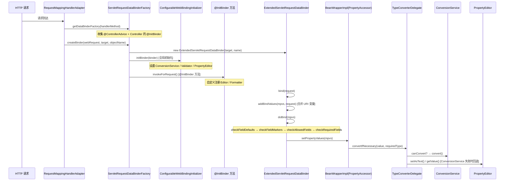
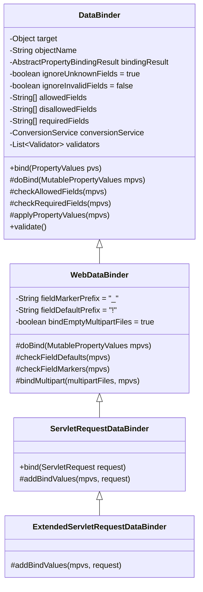
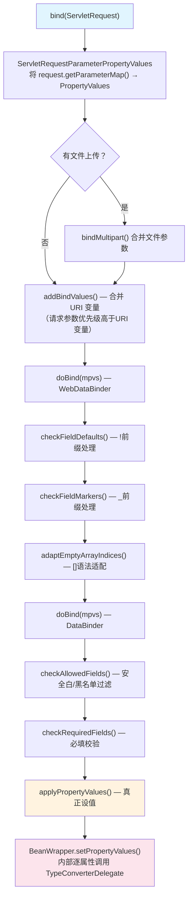
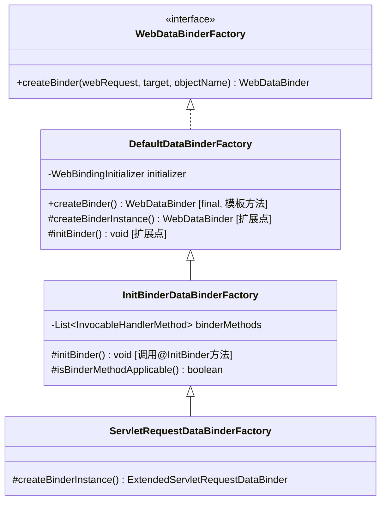
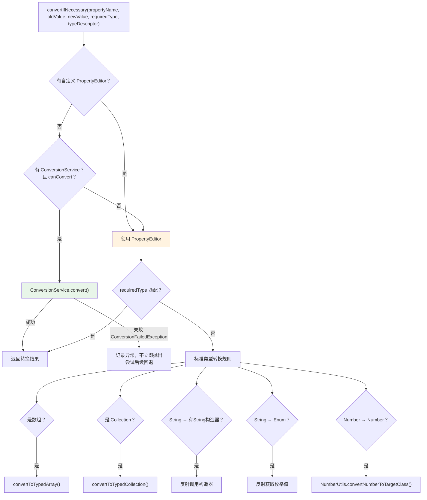

# 数据绑定与类型转换（WebDataBinder 体系）深度分析

> **📍 文档导航** | [📚 返回目录](./README.md) | [⬅️ 上一篇：参数解析与返回值处理](./参数解析与返回值处理深度分析.md) | [➡️ 下一篇：ExceptionHandler异常处理](./ExceptionHandler异常处理机制深度分析.md)
>
> **📊 元信息** | 难度：⭐⭐⭐⭐ | 预估时间：1天 | 前置阅读：[⑤ 参数解析与返回值处理深度分析](./参数解析与返回值处理深度分析.md)
>
> **🎯 学习目标** | 深入类型转换的底层实现，是参数解析的"最后一公里"

---

## 一、总体定位

> **核心问题**：当我们在 Controller 方法上写 `@RequestParam Integer id` 或 `@ModelAttribute User user` 时，HTTP 请求中的 **字符串参数** 是如何变成 Java 对象的？

Spring MVC 的数据绑定与类型转换体系负责解决两大核心问题：

1. **类型转换**：`String "18"` → `Integer 18`（单值转换，用于 `@RequestParam`/`@PathVariable` 等）
2. **数据绑定**：`name=张三&age=18` → `User{name="张三", age=18}`（多值绑定到 POJO，用于 `@ModelAttribute`）

这两个能力分别由不同层次的组件承担，但最终都汇聚到 **`DataBinder`** 这个核心类中。

---

## 二、整体架构全景图



---

## 三、DataBinder 继承链（核心）

### 3.1 四层继承结构



### 3.2 每层职责详解

#### 第一层：`DataBinder`（通用绑定基座）

> 来自: `spring-context/src/main/java/org/springframework/validation/DataBinder.java`

**核心字段（L127-165）：**

| 字段 | 类型 | 默认值 | 作用 |
|------|------|--------|------|
| `target` | `Object` | 构造传入 | 绑定的目标对象（如 `User` 实例） |
| `objectName` | `String` | `"target"` | 对象名，用于错误信息和 Model 的 key |
| `bindingResult` | `AbstractPropertyBindingResult` | 延迟创建 | 绑定结果，存储错误信息 |
| `ignoreUnknownFields` | `boolean` | `true` | 是否忽略目标对象不存在的字段 |
| `ignoreInvalidFields` | `boolean` | `false` | 是否忽略嵌套路径为 null 的字段 |
| `allowedFields` | `String[]` | `null`(全部) | **安全白名单**，只允许绑定指定字段 |
| `disallowedFields` | `String[]` | `null`(无) | **安全黑名单**，禁止绑定指定字段 |
| `requiredFields` | `String[]` | `null` | 必填字段，缺失则生成 "required" 错误 |
| `conversionService` | `ConversionService` | `null` | Spring 3.0+ 类型转换服务 |
| `validators` | `List<Validator>` | 空 | 校验器列表 |

**核心绑定流程 `doBind()`（L777-781）：**

```java
// 来自: spring-context/.../validation/DataBinder.java L777-781
protected void doBind(MutablePropertyValues mpvs) {
    checkAllowedFields(mpvs);   // 1. 安全过滤：移除不在白名单的字段
    checkRequiredFields(mpvs);  // 2. 必填校验：缺失字段生成 FieldError
    applyPropertyValues(mpvs);  // 3. 真正绑定：通过 PropertyAccessor 设值
}
```

**`applyPropertyValues()`（L886-897）— 绑定的真正执行点：**

```java
// 来自: spring-context/.../validation/DataBinder.java L886-897
protected void applyPropertyValues(MutablePropertyValues mpvs) {
    try {
        // 通过 BeanWrapper 逐属性设值，内部触发类型转换
        getPropertyAccessor().setPropertyValues(mpvs, isIgnoreUnknownFields(), isIgnoreInvalidFields());
    }
    catch (PropertyBatchUpdateException ex) {
        // 类型转换失败不抛异常，而是收集为 FieldError
        for (PropertyAccessException pae : ex.getPropertyAccessExceptions()) {
            getBindingErrorProcessor().processPropertyAccessException(pae, getInternalBindingResult());
        }
    }
}
```

> **关键设计**：绑定失败不会抛异常中断流程，而是将错误收集到 `BindingResult` 中，这就是为什么我们可以在 Controller 参数中接收 `BindingResult` 来获取绑定错误。

**安全过滤机制 `isAllowed()`（L824-829）：**

```java
// 来自: spring-context/.../validation/DataBinder.java L824-829
protected boolean isAllowed(String field) {
    String[] allowed = getAllowedFields();
    String[] disallowed = getDisallowedFields();
    return ((ObjectUtils.isEmpty(allowed) || PatternMatchUtils.simpleMatch(allowed, field)) &&
            (ObjectUtils.isEmpty(disallowed) || !PatternMatchUtils.simpleMatch(disallowed, field.toLowerCase())));
}
```

> **注意**：`allowedFields` 匹配是**大小写敏感**的，而 `disallowedFields` 匹配是**大小写不敏感**的（`field.toLowerCase()`）。这是一个重要的安全设计——黑名单更严格，不会因为大小写变体被绕过。

#### 第二层：`WebDataBinder`（Web 特有能力）

> 来自: `spring-web/src/main/java/org/springframework/web/bind/WebDataBinder.java`

在 `DataBinder` 基础上增加了 **Web 表单** 特有的处理：

**覆写 `doBind()`（L203-208）：**

```java
// 来自: spring-web/.../web/bind/WebDataBinder.java L203-208
@Override
protected void doBind(MutablePropertyValues mpvs) {
    checkFieldDefaults(mpvs);     // 1. "!"前缀处理：字段默认值
    checkFieldMarkers(mpvs);      // 2. "_"前缀处理：字段标记（checkbox）
    adaptEmptyArrayIndices(mpvs); // 3. "[]"语法适配（5.3新增）
    super.doBind(mpvs);           // 4. 调用父类的三步绑定
}
```

**`checkFieldMarkers()` 解决的经典问题（L245-260）：**

HTML checkbox 未勾选时**不会发送参数**。假设有个 `subscribeToNewsletter` 复选框：
- 勾选时：`subscribeToNewsletter=on` → 绑定为 `true`
- 未勾选时：什么都不发送 → 对象上的字段值不变（可能仍为之前的 `true`！）

解决方案：在表单中额外发送 `_subscribeToNewsletter=on`（field marker）。`checkFieldMarkers()` 发现有 `_` 前缀的参数但没有对应的实际值时，会自动填入空值（`Boolean.FALSE` / 空集合等）。

```java
// 来自: spring-web/.../web/bind/WebDataBinder.java L310-335
@Nullable
public Object getEmptyValue(Class<?> fieldType) {
    if (boolean.class == fieldType || Boolean.class == fieldType) {
        return Boolean.FALSE;              // boolean → false
    }
    else if (fieldType.isArray()) {
        return Array.newInstance(fieldType.getComponentType(), 0); // 空数组
    }
    else if (Collection.class.isAssignableFrom(fieldType)) {
        return CollectionFactory.createCollection(fieldType, 0);  // 空集合
    }
    else if (Map.class.isAssignableFrom(fieldType)) {
        return CollectionFactory.createMap(fieldType, 0);         // 空Map
    }
    return null;  // 其他类型 → null
}
```

#### 第三层：`ServletRequestDataBinder`（Servlet 绑定）

> 来自: `spring-web/src/main/java/org/springframework/web/bind/ServletRequestDataBinder.java`

**`bind(ServletRequest)` — 从 Servlet 请求提取参数（L116-130）：**

```java
// 来自: spring-web/.../web/bind/ServletRequestDataBinder.java L116-130
public void bind(ServletRequest request) {
    // 1. 将 request.getParameterMap() 转换为 PropertyValues
    MutablePropertyValues mpvs = new ServletRequestParameterPropertyValues(request);

    // 2. 处理文件上传
    MultipartRequest multipartRequest = WebUtils.getNativeRequest(request, MultipartRequest.class);
    if (multipartRequest != null) {
        bindMultipart(multipartRequest.getMultiFileMap(), mpvs);
    }
    else if (StringUtils.startsWithIgnoreCase(request.getContentType(), MediaType.MULTIPART_FORM_DATA_VALUE)) {
        // ... Servlet 3.0 Part 方式处理
    }

    // 3. 扩展点：子类可以添加额外绑定值
    addBindValues(mpvs, request);

    // 4. 执行绑定
    doBind(mpvs);
}
```

#### 第四层：`ExtendedServletRequestDataBinder`（URI 变量合并）

> 来自: `spring-webmvc/.../annotation/ExtendedServletRequestDataBinder.java`

**`addBindValues()` — 将 URI 模板变量也参与数据绑定（L74-90）：**

```java
// 来自: spring-webmvc/.../annotation/ExtendedServletRequestDataBinder.java L74-90
@Override
protected void addBindValues(MutablePropertyValues mpvs, ServletRequest request) {
    String attr = HandlerMapping.URI_TEMPLATE_VARIABLES_ATTRIBUTE;
    Map<String, String> uriVars = (Map<String, String>) request.getAttribute(attr);
    if (uriVars != null) {
        uriVars.forEach((name, value) -> {
            if (mpvs.contains(name)) {
                // 请求参数优先，URI变量不覆盖
                logger.debug("URI variable '" + name + "' overridden by request bind value.");
            }
            else {
                mpvs.addPropertyValue(name, value);
            }
        });
    }
}
```

> **关键设计**：请求参数（query string / form）优先级高于 URI 模板变量。例如 `GET /users/{id}?id=2`，当 URL 是 `/users/1` 时，`id` 绑定为 `2`（请求参数覆盖）。

### 3.3 完整绑定流程总结



---

## 四、DataBinderFactory 继承链（创建与初始化）

### 4.1 四层 Factory 结构



### 4.2 `DefaultDataBinderFactory.createBinder()` — 模板方法

> 来自: `spring-web/.../web/bind/support/DefaultDataBinderFactory.java` L53-62

```java
@Override
public final WebDataBinder createBinder(
        NativeWebRequest webRequest, @Nullable Object target, String objectName) throws Exception {

    WebDataBinder dataBinder = createBinderInstance(target, objectName, webRequest); // 步骤1: 创建实例
    if (this.initializer != null) {
        this.initializer.initBinder(dataBinder, webRequest);  // 步骤2: 全局初始化
    }
    initBinder(dataBinder, webRequest);  // 步骤3: @InitBinder 方法
    return dataBinder;
}
```

**三步初始化顺序至关重要**：
1. `createBinderInstance()` → `ServletRequestDataBinderFactory` 覆写，创建 `ExtendedServletRequestDataBinder`
2. `initializer.initBinder()` → 全局配置（`ConfigurableWebBindingInitializer`）
3. `initBinder()` → `@InitBinder` 方法（Controller 级别自定义）

> **后者可以覆盖前者**：`@InitBinder` 中的设置可以覆盖全局配置。

### 4.3 `InitBinderDataBinderFactory.initBinder()` — @InitBinder 调用

> 来自: `spring-web/.../web/method/annotation/InitBinderDataBinderFactory.java` L65-75

```java
@Override
public void initBinder(WebDataBinder dataBinder, NativeWebRequest request) throws Exception {
    for (InvocableHandlerMethod binderMethod : this.binderMethods) {
        if (isBinderMethodApplicable(binderMethod, dataBinder)) {
            Object returnValue = binderMethod.invokeForRequest(request, null, dataBinder);
            if (returnValue != null) {
                throw new IllegalStateException(
                        "@InitBinder methods must not return a value (should be void): " + binderMethod);
            }
        }
    }
}
```

**`isBinderMethodApplicable()` 的过滤逻辑（L82-87）：**

```java
protected boolean isBinderMethodApplicable(HandlerMethod initBinderMethod, WebDataBinder dataBinder) {
    InitBinder ann = initBinderMethod.getMethodAnnotation(InitBinder.class);
    String[] names = ann.value();
    // value 为空 → 对所有绑定器生效
    // value 不为空 → 只对名称匹配的绑定器生效
    return (ObjectUtils.isEmpty(names) || ObjectUtils.containsElement(names, dataBinder.getObjectName()));
}
```

> **实际使用示例**：`@InitBinder("user")` 只对名为 `user` 的模型属性生效，不影响其他参数的绑定器。

### 4.4 `RequestMappingHandlerAdapter.getDataBinderFactory()` — Factory 的创建入口

> 来自: `spring-webmvc/.../annotation/RequestMappingHandlerAdapter.java` L960-1006

```java
private WebDataBinderFactory getDataBinderFactory(HandlerMethod handlerMethod) throws Exception {
    Class<?> handlerType = handlerMethod.getBeanType();

    // 1. 查找 Controller 类上的 @InitBinder 方法（有缓存）
    Set<Method> methods = this.initBinderCache.get(handlerType);
    if (methods == null) {
        methods = MethodIntrospector.selectMethods(handlerType, INIT_BINDER_METHODS);
        this.initBinderCache.put(handlerType, methods);
    }

    List<InvocableHandlerMethod> initBinderMethods = new ArrayList<>();

    // 2. 先收集 @ControllerAdvice 中的全局 @InitBinder（优先级低，先添加但后执行无关）
    this.initBinderAdviceCache.forEach((controllerAdviceBean, methodSet) -> {
        if (controllerAdviceBean.isApplicableToBeanType(handlerType)) {
            Object bean = controllerAdviceBean.resolveBean();
            for (Method method : methodSet) {
                initBinderMethods.add(createInitBinderMethod(bean, method));
            }
        }
    });

    // 3. 再收集 Controller 自身的 @InitBinder
    for (Method method : methods) {
        Object bean = handlerMethod.getBean();
        initBinderMethods.add(createInitBinderMethod(bean, method));
    }

    // 4. 创建 ServletRequestDataBinderFactory
    return createDataBinderFactory(initBinderMethods);
}

protected InitBinderDataBinderFactory createDataBinderFactory(List<InvocableHandlerMethod> binderMethods)
        throws Exception {
    return new ServletRequestDataBinderFactory(binderMethods, getWebBindingInitializer());
}
```

---

## 五、`ConfigurableWebBindingInitializer` — 全局初始化

> 来自: `spring-web/.../web/bind/support/ConfigurableWebBindingInitializer.java`

这是 Spring Boot 自动配置的 `WebBindingInitializer` 实现，负责为每个 `WebDataBinder` 设置全局默认值。

**核心字段（L43-60）：**

| 字段 | 类型 | 作用 |
|------|------|------|
| `autoGrowNestedPaths` | `boolean` | 嵌套路径为 null 时自动创建 |
| `directFieldAccess` | `boolean` | 是否直接访问字段（默认 false，用 getter/setter） |
| `messageCodesResolver` | `MessageCodesResolver` | 错误码解析策略 |
| `bindingErrorProcessor` | `BindingErrorProcessor` | 绑定错误处理策略 |
| `validator` | `Validator` | 全局校验器（JSR-303） |
| `conversionService` | `ConversionService` | 全局类型转换服务 |
| `propertyEditorRegistrars` | `PropertyEditorRegistrar[]` | 自定义 PropertyEditor 注册器 |

**`initBinder()` 实现（L194-218）：**

```java
// 来自: spring-web/.../web/bind/support/ConfigurableWebBindingInitializer.java L194-218
@Override
public void initBinder(WebDataBinder binder) {
    binder.setAutoGrowNestedPaths(this.autoGrowNestedPaths);
    if (this.directFieldAccess) {
        binder.initDirectFieldAccess();
    }
    if (this.messageCodesResolver != null) {
        binder.setMessageCodesResolver(this.messageCodesResolver);
    }
    if (this.bindingErrorProcessor != null) {
        binder.setBindingErrorProcessor(this.bindingErrorProcessor);
    }
    if (this.validator != null && binder.getTarget() != null &&
            this.validator.supports(binder.getTarget().getClass())) {
        binder.setValidator(this.validator); // 注意：会检查 supports()
    }
    if (this.conversionService != null) {
        binder.setConversionService(this.conversionService);
    }
    if (this.propertyEditorRegistrars != null) {
        for (PropertyEditorRegistrar propertyEditorRegistrar : this.propertyEditorRegistrars) {
            propertyEditorRegistrar.registerCustomEditors(binder);
        }
    }
}
```

> **Spring Boot 自动配置做了什么？** Spring Boot 的 `WebMvcAutoConfiguration` 自动创建 `ConfigurableWebBindingInitializer`，设置 `DefaultFormattingConversionService`（包含日期/数字格式化支持）和 JSR-303 `Validator`（如果引入了 `hibernate-validator`）。

---

## 六、类型转换体系

### 6.1 两套类型转换机制

Spring 存在两套类型转换机制，二者共存但优先级不同：

| 特性 | PropertyEditor（旧） | ConversionService（新） |
|------|---------------------|------------------------|
| 引入版本 | JDK 标准 + Spring 1.0 | Spring 3.0 |
| 转换方向 | 只能 `String ↔ Object` | 任意 `Object → Object` |
| 线程安全 | **不安全**（有状态） | **安全**（无状态 FunctionalInterface） |
| 泛型支持 | 不支持 | 支持 `TypeDescriptor` |
| 注册方式 | `registerCustomEditor()` | `addConverter()` / `addConverterFactory()` |
| 优先级 | **低**（ConversionService 失败后回退） | **高**（优先使用） |

### 6.2 ConversionService 接口

> 来自: `spring-core/src/main/java/org/springframework/core/convert/ConversionService.java`

```java
public interface ConversionService {
    boolean canConvert(@Nullable Class<?> sourceType, Class<?> targetType);
    boolean canConvert(@Nullable TypeDescriptor sourceType, TypeDescriptor targetType);
    <T> T convert(@Nullable Object source, Class<T> targetType);
    Object convert(@Nullable Object source, @Nullable TypeDescriptor sourceType, TypeDescriptor targetType);
}
```

四个方法，两组：简单 `Class` 版本 + 带 `TypeDescriptor` 上下文信息的版本。`TypeDescriptor` 携带泛型信息、注解等元数据，支持 `List<String>` → `List<Integer>` 这种泛型转换。

### 6.3 三种 Converter SPI

> 来自: `spring-core/.../core/convert/converter/` 包

**从简单到复杂排列：**

#### 1. `Converter<S, T>` — 最常用，1:1 转换

```java
// 来自: spring-core/.../core/convert/converter/Converter.java
@FunctionalInterface
public interface Converter<S, T> {
    @Nullable
    T convert(S source);
}
```

- `@FunctionalInterface`，可用 Lambda：`(String s) -> Integer.parseInt(s)`
- 示例：`StringToIntegerConverter`、`StringToDateConverter`

#### 2. `ConverterFactory<S, R>` — 1:N 转换（一个源类型 → 一组目标类型）

```java
// 来自: spring-core/.../core/convert/converter/ConverterFactory.java
public interface ConverterFactory<S, R> {
    <T extends R> Converter<S, T> getConverter(Class<T> targetType);
}
```

- 典型场景：`String → Number` 家族（Integer/Long/Double/...）
- `StringToNumberConverterFactory` 根据目标类型动态返回不同的 Converter

#### 3. `GenericConverter` — 最灵活，N:N 转换

```java
// 来自: spring-core/.../core/convert/converter/GenericConverter.java
public interface GenericConverter {
    @Nullable
    Set<ConvertiblePair> getConvertibleTypes();
    @Nullable
    Object convert(@Nullable Object source, TypeDescriptor sourceType, TypeDescriptor targetType);
}
```

- 可以声明支持多个 `source → target` 对
- 可以访问 `TypeDescriptor`（包含泛型、注解信息）
- 典型场景：`CollectionToCollectionConverter`（需要泛型信息来转换元素）

### 6.4 GenericConversionService — 核心数据结构与查找

> 来自: `spring-core/.../core/convert/support/GenericConversionService.java`

**核心数据结构（L69-80）：**

```java
// 两个关键字段
private final Converters converters = new Converters();           // 存储所有注册的 Converter
private final Map<ConverterCacheKey, GenericConverter> converterCache 
    = new ConcurrentReferenceHashMap<>(64);  // 软引用缓存，避免重复查找
```

**内部类 `Converters` 的存储结构（L500-504）：**

```java
private static class Converters {
    // 全局条件转换器（getConvertibleTypes() 返回 null 的）
    private final Set<GenericConverter> globalConverters = new CopyOnWriteArraySet<>();
    // 按 ConvertiblePair 分组存储
    private final Map<ConvertiblePair, ConvertersForPair> converters = new ConcurrentHashMap<>(256);
}
```

**`ConvertersForPair`（L651-653）：**

```java
private static class ConvertersForPair {
    private final Deque<GenericConverter> converters = new ConcurrentLinkedDeque<>();
    // 用 Deque 而不是 List，addFirst() 实现"后注册优先"
}
```

**查找流程 `getConverter()`（L253-272）：**

```java
// 来自: spring-core/.../GenericConversionService.java L253-272
protected GenericConverter getConverter(TypeDescriptor sourceType, TypeDescriptor targetType) {
    ConverterCacheKey key = new ConverterCacheKey(sourceType, targetType);

    // 1. 先查缓存
    GenericConverter converter = this.converterCache.get(key);
    if (converter != null) {
        return (converter != NO_MATCH ? converter : null);
    }

    // 2. 遍历类型层次结构查找
    converter = this.converters.find(sourceType, targetType);
    if (converter == null) {
        // 3. 默认：source 可赋值给 target 时返回 NO_OP_CONVERTER（直接透传）
        converter = getDefaultConverter(sourceType, targetType);
    }

    // 4. 写入缓存（找不到也缓存 NO_MATCH，避免重复查找）
    if (converter != null) {
        this.converterCache.put(key, converter);
        return converter;
    }
    this.converterCache.put(key, NO_MATCH);
    return null;
}
```

**`Converters.find()` 的类型层次遍历（L537-551）：**

```java
public GenericConverter find(TypeDescriptor sourceType, TypeDescriptor targetType) {
    List<Class<?>> sourceCandidates = getClassHierarchy(sourceType.getType());
    List<Class<?>> targetCandidates = getClassHierarchy(targetType.getType());
    // 双重循环：遍历 source 和 target 的全部类层次
    for (Class<?> sourceCandidate : sourceCandidates) {
        for (Class<?> targetCandidate : targetCandidates) {
            ConvertiblePair convertiblePair = new ConvertiblePair(sourceCandidate, targetCandidate);
            GenericConverter converter = getRegisteredConverter(sourceType, targetType, convertiblePair);
            if (converter != null) {
                return converter;
            }
        }
    }
    return null;
}
```

> **性能优化**：查找结果用 `ConcurrentReferenceHashMap`（**软引用**，区别于 `ConcurrentHashMap`）缓存。GC 压力大时可被回收，不会导致 OOM。

### 6.5 FormattingConversionService — 格式化支持

继承链：`GenericConversionService` → `FormattingConversionService` → `DefaultFormattingConversionService`

> 来自: `spring-context/.../format/support/FormattingConversionService.java`

`FormattingConversionService` 将 `Formatter`（`Printer` + `Parser`）**适配成 `Converter`** 注册到 `GenericConversionService` 中，复用了 ConversionService 的查找/缓存机制。

`DefaultFormattingConversionService.addDefaultFormatters()` 默认注册（L108-132）：
- `@NumberFormat` 注解支持
- JSR-354 货币格式化（如果类路径有 `javax.money`）
- JSR-310 `java.time` 日期格式化
- Joda-Time 日期格式化（如果类路径有 `org.joda.time`）

---

## 七、TypeConverterDelegate — 转换的实际委派者

> 来自: `spring-beans/src/main/java/org/springframework/beans/TypeConverterDelegate.java`

这是类型转换的**真正执行者**，由 `BeanWrapperImpl` 和 `SimpleTypeConverter` 作为委托使用。

### 7.1 核心方法 `convertIfNecessary()` 决策流程

> L115-276



**关键源码片段（L118-136）：**

```java
// 来自: spring-beans/.../TypeConverterDelegate.java L118-136
// 1. 先查自定义 PropertyEditor
PropertyEditor editor = this.propertyEditorRegistry.findCustomEditor(requiredType, propertyName);

ConversionFailedException conversionAttemptEx = null;

// 2. 没有自定义 Editor 时，尝试 ConversionService（优先级更高）
ConversionService conversionService = this.propertyEditorRegistry.getConversionService();
if (editor == null && conversionService != null && newValue != null && typeDescriptor != null) {
    TypeDescriptor sourceTypeDesc = TypeDescriptor.forObject(newValue);
    if (conversionService.canConvert(sourceTypeDesc, typeDescriptor)) {
        try {
            return (T) conversionService.convert(newValue, sourceTypeDesc, typeDescriptor);
        }
        catch (ConversionFailedException ex) {
            conversionAttemptEx = ex;  // 不立即抛出，后续回退到 PropertyEditor
        }
    }
}
```

> **优先级总结**：
> 1. 自定义 PropertyEditor（最高优先级，如果有直接用）
> 2. ConversionService（没有自定义 Editor 时优先使用）
> 3. 默认 PropertyEditor（内置的，如 `CustomNumberEditor`）
> 4. 标准转换规则（String 构造器、Enum 反射等，兜底）

### 7.2 TypeConverterSupport — 桥接层

> 来自: `spring-beans/.../TypeConverterSupport.java`

```java
public abstract class TypeConverterSupport extends PropertyEditorRegistrySupport implements TypeConverter {
    @Nullable
    TypeConverterDelegate typeConverterDelegate;  // 委托真正的转换逻辑

    @Override
    public <T> T convertIfNecessary(@Nullable Object value, @Nullable Class<T> requiredType,
            @Nullable TypeDescriptor typeDescriptor) throws TypeMismatchException {
        Assert.state(this.typeConverterDelegate != null, "No TypeConverterDelegate");
        try {
            return this.typeConverterDelegate.convertIfNecessary(null, null, value, requiredType, typeDescriptor);
        }
        catch (ConverterNotFoundException | IllegalStateException ex) {
            throw new ConversionNotSupportedException(value, requiredType, ex);  // 找不到转换器
        }
        catch (ConversionException | IllegalArgumentException ex) {
            throw new TypeMismatchException(value, requiredType, ex);  // 转换失败
        }
    }
}
```

> 继承链：`PropertyEditorRegistrySupport` → `TypeConverterSupport` → `SimpleTypeConverter` / `BeanWrapperImpl`

---

## 八、数据校验（Validation）

### 8.1 Validator 接口

> 来自: `spring-context/.../validation/Validator.java`

```java
public interface Validator {
    boolean supports(Class<?> clazz);              // 是否支持校验该类型
    void validate(Object target, Errors errors);   // 执行校验
}
```

### 8.2 SmartValidator — 支持分组校验

> 来自: `spring-context/.../validation/SmartValidator.java`

```java
public interface SmartValidator extends Validator {
    // 支持 JSR-303 验证分组
    void validate(Object target, Errors errors, Object... validationHints);
}
```

`validationHints` 对应 `@Validated({CreateGroup.class})` 中的分组类。

### 8.3 DataBinder.validate() — 校验的调用点

> 来自: `spring-context/.../validation/DataBinder.java` L905-936

```java
// 无参版本：调用所有 validator
public void validate() {
    Object target = getTarget();
    BindingResult bindingResult = getBindingResult();
    for (Validator validator : getValidators()) {
        validator.validate(target, bindingResult);
    }
}

// 带 hints 版本：支持分组
public void validate(Object... validationHints) {
    Object target = getTarget();
    BindingResult bindingResult = getBindingResult();
    for (Validator validator : getValidators()) {
        if (!ObjectUtils.isEmpty(validationHints) && validator instanceof SmartValidator) {
            ((SmartValidator) validator).validate(target, bindingResult, validationHints);
        }
        else if (validator != null) {
            validator.validate(target, bindingResult);
        }
    }
}
```

> **注意**：`validate()` 和 `bind()` 是分开调用的。在 `ModelAttributeMethodProcessor.resolveArgument()` 中，先 `bindRequestParameters()`，再 `validateIfApplicable()`，二者结果都记录在同一个 `BindingResult` 中。

---

## 九、@InitBinder 注解

> 来自: `spring-web/.../web/bind/annotation/InitBinder.java`

```java
@Target({ElementType.METHOD})
@Retention(RetentionPolicy.RUNTIME)
@Documented
public @interface InitBinder {
    /**
     * value 为空 → 对所有模型属性生效
     * value 不为空 → 只对指定名称的模型属性生效
     */
    String[] value() default {};
}
```

**典型使用场景：**

```java
@Controller
public class UserController {

    // 场景1：注册自定义日期格式（对所有绑定器生效）
    @InitBinder
    public void initBinder(WebDataBinder binder) {
        SimpleDateFormat dateFormat = new SimpleDateFormat("yyyy-MM-dd");
        binder.registerCustomEditor(Date.class, new CustomDateEditor(dateFormat, true));
    }

    // 场景2：安全控制 — 只允许绑定指定字段（只对名为"user"的属性生效）
    @InitBinder("user")
    public void initUserBinder(WebDataBinder binder) {
        binder.setAllowedFields("name", "email"); // 防止恶意修改 id 等字段
    }
}
```

---

## 十、从参数解析文档到本文档的连接

在《参数解析与返回值处理深度分析》中，我们多次提到但未展开的 DataBinder 相关调用点：

| 参数解析文档中的调用点 | 本文档中的对应章节 |
|----------------------|------------------|
| `binder.convertIfNecessary()` | 第七章：TypeConverterDelegate |
| `ModelAttributeMethodProcessor.bindRequestParameters()` | 第三章：DataBinder.doBind() |
| `AbstractNamedValueMethodArgumentResolver` 中的类型转换 | 第七章：转换优先级 |
| `RequestMappingHandlerAdapter.invokeHandlerMethod()` 中的 `getDataBinderFactory()` | 第四章：Factory 继承链 |
| `ModelAttributeMethodProcessor.validateIfApplicable()` | 第八章：DataBinder.validate() |

---

## 十一、设计模式总结

| 模式 | 应用位置 | 说明 |
|------|---------|------|
| **模板方法** | `DefaultDataBinderFactory.createBinder()` | `final` 方法定义骨架，子类覆写 `createBinderInstance()` 和 `initBinder()` |
| **模板方法** | `DataBinder.doBind()` | 定义 check → apply 骨架，`WebDataBinder` 覆写加入 Web 处理 |
| **策略模式** | `Converter<S,T>` / `ConverterFactory` / `GenericConverter` | 三种可插拔的转换策略 |
| **适配器模式** | `ConverterAdapter` / `ConverterFactoryAdapter` | 将 `Converter`/`ConverterFactory` 统一适配成 `GenericConverter` |
| **适配器模式** | `FormatterPropertyEditorAdapter` | 将 `Formatter` 适配成 `PropertyEditor` |
| **组合模式** | `GenericConversionService.Converters` 内部类 | 按 `ConvertiblePair` 分组管理所有转换器 |
| **装饰者模式** | `ExtendedServletRequestDataBinder` | 在父类 bind 基础上增加 URI 变量合并 |
| **缓存模式** | `GenericConversionService.converterCache` | 软引用 `ConcurrentReferenceHashMap` 避免重复查找 |

---

## 十二、面试高频问题

### Q1：`@RequestParam` 的类型转换和 `@ModelAttribute` 的数据绑定有什么区别？

**`@RequestParam`（单值类型转换）**：
- 数据来源：单个请求参数 `request.getParameter(name)`
- 转换方式：`DataBinder.convertIfNecessary()` → `TypeConverterDelegate` → `ConversionService` / `PropertyEditor`
- 结果：一个值（`String "18"` → `Integer 18`）

**`@ModelAttribute`（多值数据绑定）**：
- 数据来源：所有请求参数 `request.getParameterMap()`
- 转换方式：`ServletRequestDataBinder.bind()` → 逐属性通过 `BeanWrapper.setPropertyValues()` → 每个属性都经过 `TypeConverterDelegate`
- 结果：一个完整对象（多个参数 → POJO）
- 额外步骤：安全过滤（allowedFields）、必填校验（requiredFields）、JSR-303 校验

### Q2：Spring 中 ConversionService 和 PropertyEditor 的优先级？

1. **自定义 PropertyEditor** > ConversionService > 默认 PropertyEditor > 标准转换规则
2. 如果有通过 `@InitBinder` 或 `registerCustomEditor()` 注册的自定义 PropertyEditor，直接使用，不走 ConversionService
3. 如果没有自定义 PropertyEditor，优先尝试 ConversionService
4. ConversionService 失败后，回退到默认 PropertyEditor
5. 都不行，尝试标准规则（String 构造器、Enum 反射等）

### Q3：`@InitBinder` 方法的执行时机和作用范围？

- **执行时机**：每次创建 `WebDataBinder` 时（即每次请求处理参数时）
- **作用范围**：
  - `@InitBinder`（无参数）→ 对当前 Controller 所有绑定器生效
  - `@InitBinder("user")` → 只对名为 `user` 的模型属性生效
  - `@ControllerAdvice` + `@InitBinder` → 全局生效
- **执行顺序**：全局（`@ControllerAdvice`）→ Controller 自身
- **注意事项**：`@InitBinder` 方法必须返回 `void`，否则抛 `IllegalStateException`

### Q4：WebDataBinder 的安全机制有哪些？

1. **allowedFields（白名单）**：只允许指定字段绑定，大小写敏感
2. **disallowedFields（黑名单）**：禁止指定字段，大小写**不**敏感（更严格）
3. 黑名单优先于白名单：同时匹配时，字段被拒绝
4. 默认情况下：所有字段都允许绑定（⚠️ 安全风险）
5. **最佳实践**：通过 `@InitBinder` 设置 `setAllowedFields()` 或使用 DTO 避免直接绑定到实体

### Q5：为什么 GenericConversionService 的缓存用 ConcurrentReferenceHashMap 而不是 ConcurrentHashMap？

`ConcurrentReferenceHashMap` 使用**软引用**（soft reference），在 GC 压力大时可以被回收。转换器缓存是一种"锦上添花"的优化——即使缓存被清空，下次查找时会重新填充，不会影响正确性。如果用 `ConcurrentHashMap`，大量不同的类型转换对可能导致缓存无限增长，最终 OOM。

### Q6：为什么 ExtendedServletRequestDataBinder 中请求参数的优先级高于 URI 变量？

这是符合 Web 开发直觉的设计。URI 模板变量是路由级别的，请求参数是用户显式传递的。`GET /users/1?id=2` 中用户明确传了 `id=2`，应该尊重用户的意图。而且 URI 变量主要用于 `@PathVariable` 参数解析，合并到数据绑定中只是一个补充手段。

---

## 十三、完整对比总结

| 维度 | 单值类型转换 | 多值数据绑定 |
|------|------------|------------|
| 注解 | `@RequestParam` / `@PathVariable` | `@ModelAttribute`（显式或隐式） |
| 数据来源 | 单个参数值 | 全部请求参数 + URI 变量 |
| 核心类 | `TypeConverterDelegate` | `DataBinder` → `BeanWrapper` → `TypeConverterDelegate` |
| 安全机制 | 无（单值无需过滤） | allowedFields / disallowedFields |
| 校验 | 无 | `@Valid` / `@Validated` |
| 错误处理 | 转换失败直接抛异常 | 收集到 `BindingResult`，不中断 |
| 适用场景 | 简单类型（基本类型、String、Date等） | 复杂对象（POJO） |
| 扩展点 | Converter / PropertyEditor | @InitBinder / WebBindingInitializer |
