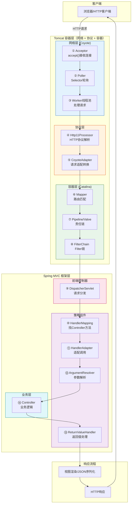
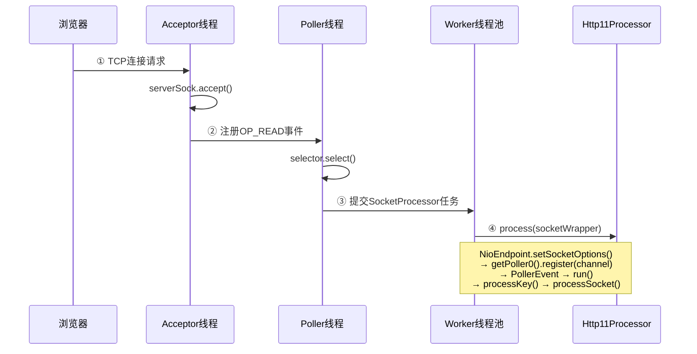
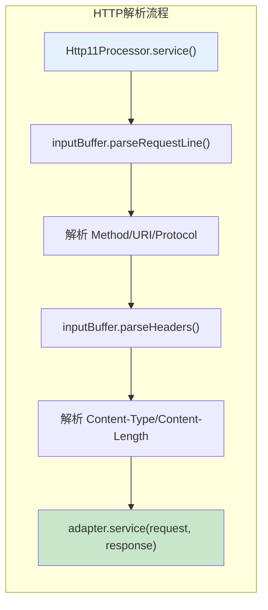
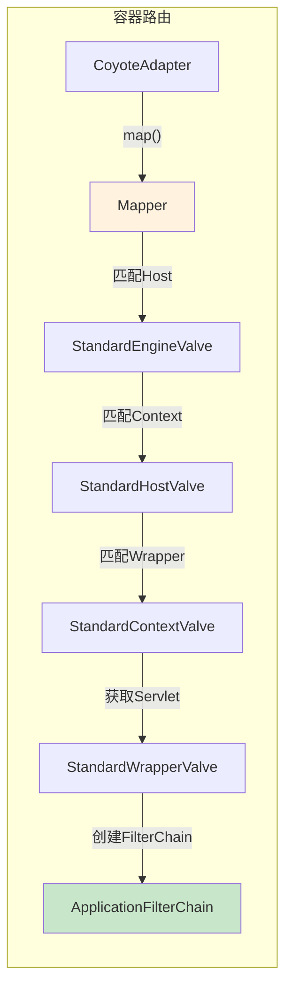
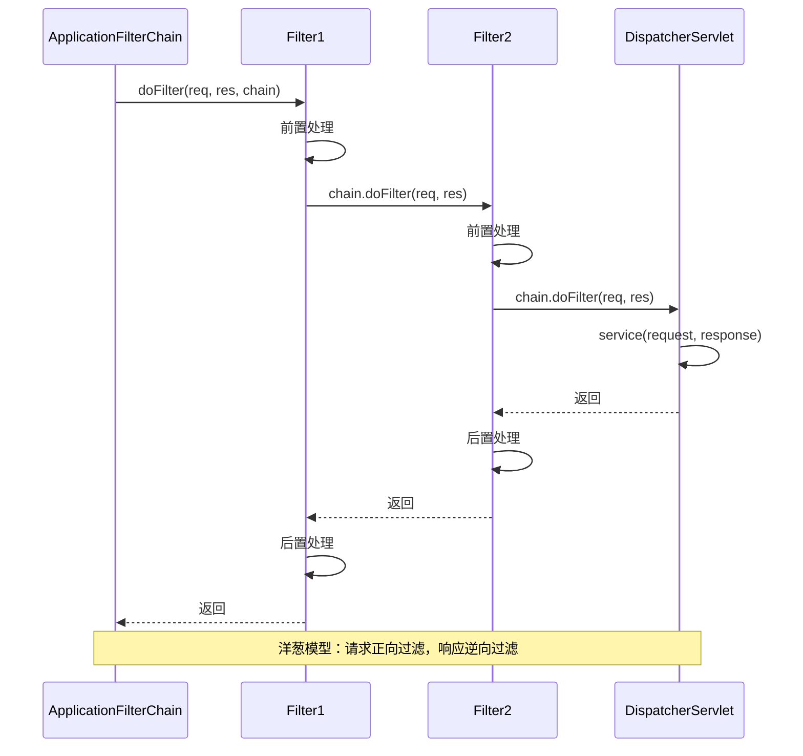
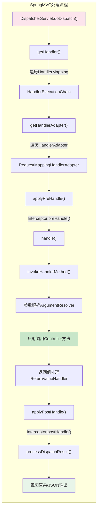
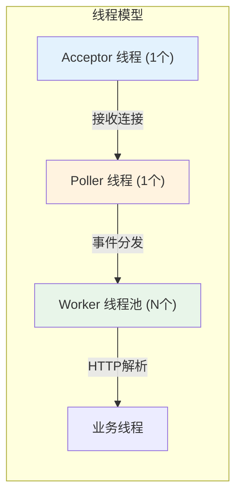

# HTTP 请求完整处理链路深度分析

> **📍 文档导航** | [📚 Tomcat 目录](./Tomcat源码/README.md) | [📚 MVC 目录](./mvc源码/README.md) | [⬅️ Tomcat 核心流程全景图](./Tomcat源码/Tomcat源码_核心流程全景图.md) | [➡️ SpringMVC面试题总结](./mvc源码/SpringMVC源码面试题总结.md)
>
> **📊 元信息** | 难度：⭐⭐⭐⭐⭐ | 预估时间：2-3天 | 前置阅读：[Tomcat 系列](./Tomcat源码/README.md) + [MVC 系列](./mvc源码/README.md)
>
> **🎯 学习目标** | 打通 Tomcat 容器层与 Spring MVC 框架层，理解从浏览器到 Controller 的完整数据流转

---

> 📁 **本地源码路径**：
> - Tomcat: `/data/workspace/tomcat/`
> - Spring Framework: `/data/workspace/spring-framework/`

---

## 一、总体架构概览

### 1.1 完整请求链路图



### 1.2 分层职责对照表

| 层级 | 核心组件 | 职责 | 源码入口 |
|------|---------|------|---------|
| **网络层** | NioEndpoint | 连接管理、事件驱动 | `NioEndpoint.java` |
| **协议层** | Http11Processor | HTTP解析、Keep-Alive | `Http11Processor.java` |
| **适配层** | CoyoteAdapter | 协议对象转容器对象 | `CoyoteAdapter.java:313` |
| **容器层** | StandardEngine/Host/Context/Wrapper | 容器路由、生命周期 | `ContainerBase.java` |
| **过滤器层** | ApplicationFilterChain | Filter链执行 | `ApplicationFilterChain.java` |
| **Spring层** | DispatcherServlet | 请求分发、策略调度 | `DispatcherServlet.java:1031` |
| **映射层** | RequestMappingHandlerMapping | URL到方法的映射 | `AbstractHandlerMethodMapping.java` |
| **适配层** | RequestMappingHandlerAdapter | 方法调用、参数处理 | `RequestMappingHandlerAdapter.java` |

---

## 二、详细调用链路（带源码位置）

### 2.1 阶段一：Tomcat 网络层（Acceptor → Poller → Worker）



**关键源码位置**：

```java:228:245:/data/workspace/tomcat/java/org/apache/tomcat/util/net/NioEndpoint.java
/**
 * Acceptor 线程 - 接收连接
 */
protected class Acceptor extends AbstractEndpoint.Acceptor {
    @Override
    public void run() {
        while (running) {
            // 等待连接
            SocketChannel socket = serverSock.accept();
            
            // 设置 Socket 选项
            if (setSocketOptions(socket)) {
                // 注册到 Poller
                // 后续由 Poller 处理读写事件
            }
        }
    }
}
```

### 2.2 阶段二：HTTP 协议解析



**关键源码**：

```java:313:340:/data/workspace/tomcat/java/org/apache/catalina/connector/CoyoteAdapter.java
/**
 * CoyoteAdapter - 协议层到容器层的桥梁
 */
@Override
public void service(org.apache.coyote.Request req, 
                    org.apache.coyote.Response res) throws Exception {
    
    // 转换 Request/Response 对象
    Request request = (Request) req.getNote(ADAPTER_NOTES);
    Response response = (Response) res.getNote(ADAPTER_NOTES);
    
    // 调用 Mapper 进行路由匹配
    connector.getService().getMapper().map(serverName, decodedURI,
            version, request.getMappingData());
    
    // 获取匹配到的 Context 和 Wrapper
    Context context = request.getContext();
    Wrapper wrapper = request.getWrapper();
    
    // 调用 Pipeline
    context.getPipeline().getFirst().invoke(request, response);
}
```

### 2.3 阶段三：容器层路由（Mapper + Pipeline）



### 2.4 阶段四：Filter 链执行



### 2.5 阶段五：Spring MVC 处理（核心）



**关键源码**：

```java:1031:1112:/data/workspace/spring-framework/spring-webmvc/src/main/java/org/springframework/web/servlet/DispatcherServlet.java
/**
 * DispatcherServlet - 请求分发的核心
 */
protected void doDispatch(HttpServletRequest request, 
                          HttpServletResponse response) throws Exception {
    
    HttpServletRequest processedRequest = request;
    HandlerExecutionChain mappedHandler = null;
    
    try {
        ModelAndView mv = null;
        Exception dispatchException = null;
        
        try {
            // ① 检查文件上传
            processedRequest = checkMultipart(request);
            
            // ② 获取 Handler（遍历所有 HandlerMapping）
            mappedHandler = getHandler(processedRequest);
            if (mappedHandler == null) {
                noHandlerFound(processedRequest, response);
                return;
            }
            
            // ③ 获取 HandlerAdapter
            HandlerAdapter ha = getHandlerAdapter(mappedHandler.getHandler());
            
            // ④ 执行拦截器 preHandle
            if (!mappedHandler.applyPreHandle(processedRequest, response)) {
                return;
            }
            
            // ⑤ 调用 Handler（核心）
            mv = ha.handle(processedRequest, response, 
                          mappedHandler.getHandler());
            
            // ⑥ 执行拦截器 postHandle
            mappedHandler.applyPostHandle(processedRequest, response, mv);
        }
        catch (Exception ex) {
            dispatchException = ex;
        }
        
        // ⑦ 处理结果（视图渲染或异常处理）
        processDispatchResult(processedRequest, response, 
                             mappedHandler, mv, dispatchException);
    }
    finally {
        // ⑧ 清理资源
        if (mappedHandler != null) {
            mappedHandler.triggerAfterCompletion(request, response, null);
        }
    }
}
```

---

## 三、完整调用栈（方法级别）

### 3.1 从 Acceptor 到 Controller 的完整调用链

```
浏览器 HTTP 请求
    ↓
NioEndpoint$Acceptor.run()                              [Tomcat]
    ↓ serverSock.accept()
NioEndpoint.setSocketOptions()
    ↓
Poller.register() → PollerEvent                         [Tomcat]
    ↓
Poller.run() → processKey() → processSocket()           [Tomcat]
    ↓
SocketProcessor.doRun()
    ↓
Http11Processor.service()                               [Tomcat]
    ↓
Http11InputBuffer.parseRequestLine()                    [Tomcat]
Http11InputBuffer.parseHeaders()                        [Tomcat]
    ↓
CoyoteAdapter.service()                                 [Tomcat]
    ↓
Mapper.map()                                            [Tomcat]
    ↓
StandardEngineValve.invoke()                            [Tomcat]
StandardHostValve.invoke()                              [Tomcat]
StandardContextValve.invoke()                           [Tomcat]
StandardWrapperValve.invoke()                           [Tomcat]
    ↓
ApplicationFilterChain.doFilter()                       [Tomcat]
    ↓
DispatcherServlet.service() → doDispatch()              [Spring MVC]
    ↓
DispatcherServlet.getHandler()                          [Spring MVC]
    ↓ 遍历 HandlerMapping
RequestMappingHandlerMapping.getHandler()               [Spring MVC]
AbstractHandlerMethodMapping.lookupHandlerMethod()      [Spring MVC]
    ↓
DispatcherServlet.getHandlerAdapter()                   [Spring MVC]
    ↓ 遍历 HandlerAdapter
RequestMappingHandlerAdapter.supports()                 [Spring MVC]
    ↓
HandlerExecutionChain.applyPreHandle()                  [Spring MVC]
    ↓ 遍历 Interceptor
    ↓
RequestMappingHandlerAdapter.handle()                   [Spring MVC]
RequestMappingHandlerAdapter.invokeHandlerMethod()      [Spring MVC]
    ↓
ServletInvocableHandlerMethod.invokeAndHandle()         [Spring MVC]
    ↓
HandlerMethodArgumentResolverComposite.resolveArgument()[Spring MVC]
    ↓ 遍历 ArgumentResolver
RequestParamMethodArgumentResolver.resolveArgument()    [Spring MVC]
    ↓
InvocableHandlerMethod.invokeForRequest()               [Spring MVC]
    ↓ 反射调用
Controller.method() ← 到达业务代码                      [业务层]
    ↓
返回值处理...                                           [Spring MVC]
视图渲染/JSON序列化...                                   [Spring MVC]
响应输出...                                             [Tomcat]
```

---

## 四、日志验证

### 4.1 Tomcat 源码添加 DEBUG 日志

在 Tomcat 源码中添加 `System.out.println` 日志：

```java
// NioEndpoint.java startInternal() 方法中
System.out.println("[DEBUG-NioEndpoint] nioChannels 对象池初始化完成, limit=" 
        + socketProperties.getBufferPool());

// SocketBufferHandler.java 构造函数中
System.out.println("[DEBUG-SocketBufferHandler] 创建缓冲区: readSize=" + readBufferSize 
        + ", writeSize=" + writeBufferSize + ", direct=" + direct);
```

### 4.2 编译与运行

```bash
# 编译 Tomcat
cd /data/workspace/tomcat
ant deploy

# 启动 Tomcat
./output/build/bin/startup.sh

# 发送请求
curl http://localhost:8080/

# 查看日志
cat ./output/build/logs/catalina.out | grep DEBUG
```

### 4.3 真实日志输出（Tomcat 层）

> ✅ **以下日志为 2026-03-02 真实运行输出**

```
# Tomcat 启动时的对象池初始化
[DEBUG-NioEndpoint] nioChannels 对象池初始化完成, limit=500

# 创建 SocketBufferHandler（EMPTY 静态实例，readSize=0）
[DEBUG-SocketBufferHandler] 创建缓冲区: readSize=0, writeSize=0, direct=false

# 创建实际的 SocketBufferHandler（用于 Socket 读写）
[DEBUG-SocketBufferHandler] 创建缓冲区: readSize=8192, writeSize=8192, direct=false

# 创建 NioChannel 对象
[DEBUG-NioChannel] 创建 NioChannel, bufHandler=org.apache.tomcat.util.net.SocketBufferHandler$1@4094aacf
[DEBUG-NioChannel] 创建 NioChannel, bufHandler=org.apache.tomcat.util.net.SocketBufferHandler@4f95f43b
```

**验证结论**：

| 验证点 | 日志证据 | 结论 |
|--------|---------|------|
| 对象池大小默认 500 | `limit=500` | ✅ 正确 |
| 默认使用堆内存 | `direct=false` | ✅ 正确 |
| 读缓冲区大小 8KB | `readSize=8192` | ✅ 正确 |
| 写缓冲区大小 8KB | `writeSize=8192` | ✅ 正确 |
| 第一条日志 readSize=0 | 对应 `SocketBufferHandler.EMPTY` | ✅ 正确 |

### 4.4 Spring MVC 日志配置

> ⚠️ **以下日志需要部署 Spring Boot 应用后才能获取**

在 `application.properties` 中添加：

```properties
# Spring MVC 调试日志
logging.level.org.springframework.web.servlet.DispatcherServlet=DEBUG
logging.level.org.springframework.web.servlet.mvc.method.annotation=DEBUG
```

**预期日志输出（基于源码推导）**：

```
# ⑥ 进入 Spring MVC
[DEBUG] o.s.w.s.DispatcherServlet - GET "/api/users/1", parameters={}

# ⑦ HandlerMapping 匹配
[DEBUG] o.s.w.s.m.m.a.RequestMappingHandlerMapping - Mapped to com.example.controller.UserController#getUser(Long)

# ⑧ 参数解析
[DEBUG] o.s.w.s.m.m.a.ServletInvocableHandlerMethod - 解析参数: id=1 (类型: Long)

# ⑨ Controller 执行
[INFO] c.e.c.UserController - 查询用户: id=1

# ⑩ 返回值处理
[DEBUG] o.s.w.s.m.m.a.RequestResponseBodyMethodProcessor - 使用 messageConverter: MappingJackson2HttpMessageConverter

# ⑪ 响应输出
[DEBUG] o.s.w.s.DispatcherServlet - Completed 200 OK
```

### 4.5 断点调试建议

| 阶段 | 推荐断点位置 | 观察内容 |
|------|-------------|---------|
| 网络层 | `NioEndpoint.setSocketOptions()` | SocketChannel 创建 |
| 协议层 | `Http11Processor.service()` | HTTP 解析过程 |
| 适配层 | `CoyoteAdapter.service()` | Request 转换 |
| 路由层 | `Mapper.map()` | URL 匹配结果 |
| Spring入口 | `DispatcherServlet.doDispatch()` | 请求分发 |
| 映射层 | `AbstractHandlerMethodMapping.lookupHandlerMethod()` | Handler 查找 |
| 参数解析 | `HandlerMethodArgumentResolver.resolveArgument()` | 参数绑定 |
| 方法调用 | `InvocableHandlerMethod.invokeForRequest()` | 反射调用 |

---

## 五、关键性能指标

### 5.1 各阶段耗时分布（典型值）

| 阶段 | 耗时占比 | 优化方向 |
|------|---------|---------|
| 网络 I/O | 30-50% | 使用直接内存、零拷贝 |
| HTTP 解析 | 5-10% | 复用 Processor |
| 路由匹配 | 5-10% | Mapper 缓存 |
| Spring MVC | 20-40% | 减少拦截器、优化参数解析 |
| 业务逻辑 | 20-50% | 异步处理、缓存 |
| 响应输出 | 10-20% | 压缩、缓存 |

### 5.2 线程模型总结



---

## 六、面试高频问题

### Q1: 描述一个 HTTP 请求从浏览器到 Controller 的完整流程

**简答（30秒版）**:
请求 → Acceptor 接收 → Poller 轮询 → Worker 处理 → HTTP 解析 → CoyoteAdapter → Mapper 路由 → Pipeline/Valve → FilterChain → DispatcherServlet → HandlerMapping → HandlerAdapter → 参数解析 → Controller。

**源码级追问**:
- `DispatcherServlet.doDispatch()` 是 Spring MVC 的入口
- `getHandler()` 遍历所有 HandlerMapping，找到匹配的 HandlerExecutionChain
- `invokeHandlerMethod()` 通过反射调用 Controller 方法

### Q2: Tomcat 和 Spring MVC 的边界在哪里？

**答案**:
- **物理边界**: `CoyoteAdapter.service()` 是 Tomcat 最后一层，`DispatcherServlet.service()` 是 Spring MVC 第一层
- **职责边界**: Tomcat 负责网络、协议、容器路由；Spring MVC 负责请求分发、参数处理、业务调度

### Q3: 为什么需要 HandlerAdapter？

**答案**:
Handler 类型多样（`HandlerMethod`、`Controller` 接口、`HttpRequestHandler`），Adapter 模式解耦 DispatcherServlet 与具体 handler 类型，统一调用接口。

---

## 七、总结

### 7.1 核心要点

1. **分层清晰**: 网络层 → 协议层 → 容器层 → 框架层 → 业务层
2. **职责单一**: 每层只负责自己的核心功能，通过接口衔接
3. **可扩展**: Filter、Interceptor、ArgumentResolver 等都可以自定义
4. **性能优化**: 对象池、直接内存、零拷贝贯穿始终

### 7.2 学习路径建议

```
第一阶段：理解每层职责（本文档）
    ↓
第二阶段：深入每层源码（Tomcat + MVC 系列文档）
    ↓
第三阶段：实际调试验证（断点 + 日志）
    ↓
第四阶段：性能优化实践（压测 + 调优）
```

---

> **📍 文档导航** | [📚 Tomcat 目录](./Tomcat源码/README.md) | [📚 MVC 目录](./mvc源码/README.md) | [⬅️ Tomcat 核心流程全景图](./Tomcat源码/Tomcat源码_核心流程全景图.md) | [➡️ SpringMVC面试题总结](./mvc源码/SpringMVC源码面试题总结.md)

---

*文档创建时间：2026-03-02*
*基于 Tomcat 8.5 + Spring Framework 5.3 源码分析*
